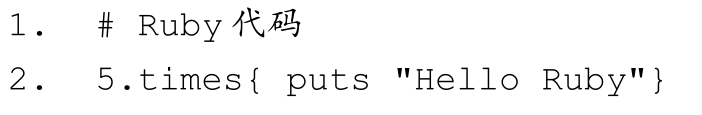
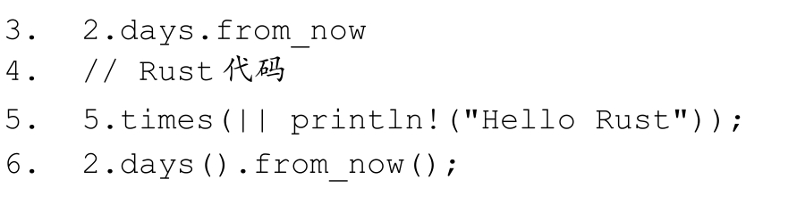

# 第1章 新时代的语言 {#text00007.html#A13345fa2-ca9e-4443-b387-3be4be4ad807 .title-left}

不谋全局者，不足谋一域。

你肯定有过夏夜仰望星空的时候，但不知道你是否思考过这样一个问题：如何才能知道宇宙万物星罗棋布的规律？科学家们殚精竭虑地研究，就是为了探寻这个秘密。如果科学家们能和宇宙的设计者对话，就可以通过设计者的亲口描述了解其对宇宙万物的规划，这样就可以对研究宇宙万物起到提纲挈领的作用，科学家们的工作会更有成效。但是，没有这种"如果"。

一门编程语言就像一个小宇宙，语言中的各种语法概念就像一颗颗星辰。对于初学者来说，看这些语法概念与看星罗棋布时产生的迷惑是相似的。幸亏编程语言是由人类创造的，编程语言的作者可以被找到，编程语言的源码也可以被看到，甚至一些好的编程语言还会为你准备好非常丰富的文档，供你参阅学习。通过这些信息我们可以了解到：一门语言缘何诞生？它想解决什么问题？它遵循什么样的设计哲学？一门好的语言是有内涵哲学的语言，它表里如一，有所想，有所为。

Rust 语言就是这样一门哲学内涵丰富的编程语言。通过了解 Rust 遵循什么样的设计哲学，进一步了解它的语法结构和编程理念，就可以系统地掌握这门语言的核心，而不至于在其纷繁复杂的语法细节中迷失。

## 1.1 缘起 {#text00007.html#A2e390017-16f6-4767-888c-ac30171cf3dd .title-left}

任何一门新技术的兴起，都是为了解决一个问题。

自操作系统诞生以来，系统级主流编程语言，从汇编语言到 C++，已经发展了近 50 个年头，但依然存在两个难题：

· 很难编写内存安全的代码。

· 很难编写线程安全的代码。

这两个难题存在的本质原因是C/C++属于类型不安全的语言，它们薄弱的内存管理机制导致了很多常见的漏洞。其实20世纪80年代也出现过非常优秀的语言，比如Ada语言。Ada拥有诸多优秀的特性：可以在编译期进行类型检查、无GC式确定性内存管理、内置安全并发模型、无数据竞争、系统级硬实时编程等。但它的性能和同时期的C/C++相比确实是有差距的。那个时代计算资源匮乏，大家追求的是性能。所以，大家都宁愿牺牲安全性来换取性能。这也是C/C++得以普及的原因。

时间很快到了2006年，自称"职业编程语言工程师"的**Graydon Hoare** （简称为GH），开始开发一门名为Rust的编程语言。

什么是"职业编程语言工程师"？用GH自己的话说，职业编程语言工程师的日常工作就是给其他语言开发编译器和工具集，但并未参与这些语言本身的设计。自然而然地，GH萌生了自己开发一门语言的想法，这门语言就是**Rust** 。

"Rust"这个名字包含了GH对这门语言的预期。在自然界有一种叫作锈菌（Rust Fungi）的真菌，这种真菌寄生于植物中，引发病害，而且号称"本世纪最可怕的生态病害"之一。这种真菌的生命力非常顽强，其在生命周期内可以产生多达5种孢子类型，这5种生命形态还可以相互转化，如果用软件术语来描述这种特性，那就是"鲁棒性超强"。可以回想一下Rust的Logo形状（如图1-1所示），像不像一个细菌？Logo上面有5个圆圈，也和锈菌这5种生命形态相对应，暗示了Rust语言的鲁棒性也超强。"Rust"也有"铁锈"的意思，暗合"裸金属"之意，代表了Rust的系统级编程语言属性，有直接操作底层硬件的能力。此外，"Rust"在字形组合上也糅合了"Trust"和"Robust"，暗示了"信任"与"鲁棒性"。因此，"Rust"真可谓一个好名字。事实证明，Rust语言不仅仅是名字起得好。

::: center
{.u54482}

图1-1：Rust语言的Logo
:::

GH认为，未来的互联网除了关注性能，还一定会高度关注安全性和并发性。整个世界对C和C++的设计方式的青睐在不断地发生改变。其实20世纪七八十年代涌现了很多优秀的语言，拥有很多优秀的特性，但它们的内存模型非常简易，不能保证足够的安全。比如Ada语言的动态内存管理虽然是高规格的安全设计，但还是引起了非常重大的安全事故 ^[\[1\]](#text00007.html#n93417129831443FC9D6AFD03B2F8F126){#text00007.html#n93417129831443FC9D6AFD03B2F8F126s}^ 。

所以，GH对这门语言的期望如下。

· 必须是更加安全、不易崩溃的，尤其在操作内存时，这一点更为重要。

· 不需要有垃圾回收这样的系统，不能为了内存安全而引入性能负担。

· 不是一门仅仅拥有一个主要特性的语言，而应该拥有一系列的广泛特性，这些特性之间又不乏一致性。这些特性可以很好地相互协作，从而使该语言更容易编写、维护和调试，让程序员写出更安全、更高效的代码。

总而言之，就是可以提供高的开发效率，代码容易维护，性能还能与C/C++媲美，还得保证安全性的一门语言。正是因为GH以这种观点作为基石，才使得今天的**Rust成为了一门同时追求安全、并发和性能的现代系统级编程语言** 。

GH 确实找对了本质问题------互联网发展至今，性能问题已经不再是其发展瓶颈，安全问题才是阻碍其发展的"重疾"。但凭什么说Rust就能解决这个问题呢？

## 1.2 设计哲学 {#text00007.html#Aed7f0019-4d35-4813-9045-1325129be2ec .title-left}

为了达成目标，Rust语言遵循了三条设计哲学：

· **内存安全**
· **零成本抽象**
· **实用性**

也就是说，Rust语言中所有语法特性都围绕这三条哲学而设计，这也是Rust语言一致性的基础。

### 1.2.1 内存安全 {#text00007.html#A5d590019-f625-42fa-977c-68d5497c12b9 .title-left}

安全是Rust要保证的重中之重。如果不能保证安全，那么Rust就没有存在的意义。Rust语言如何设计才能保证安全呢？

现代编程语言早已发展到了"程序即类型证明"的阶段，类型系统基本已经成为了各大编程语言的标配，尤其是近几年新出现的编程语言。类型系统提供了以下好处：

· 允许编译器侦测无意义甚至无效的代码，暴露程序中隐含的错误。
· 可以为编译器提供有意义的类型信息，帮助优化代码。
· 可以增强代码的可读性，更直白地阐述开发者的意图。
· 提供了一定程度的高级抽象，提升开发效率。

一般来说，一门语言只要保证类型安全，就可以说它是一门安全的语言。简单来说，类型安全是指类型系统可以保证程序的行为是意义明确、不出错的。像C/C++语言的类型系统就不是类型安全的，因为它们并没有对无意义的行为进行约束。一个最简单的例子就是数组越界，在C/C++语言中并不对其做任何检查，导致发生了语言规范规定之外的行为，也就是**未定义行为** （**Undefined Behavior** ）。而这些未定义行为恰恰是漏洞的温床。所以，像C/C++这种语言就是类型不安全的语言。

**Rust语言如果想保证内存安全，首先要做的就是保证类型安全。**

在诸多编程语言中，OCaml 和Haskell 是公认的类型安全的典范，它们的类型系统不仅仅有强大的类型论理论"背书"，而且在实践生产环境中也久经考验。所以，Rust 语言借鉴了它们的类型系统来保证类型安全，尤其是Haskell，你能在Rust语言中看到更多Haskell类型系统的影子。

然而，直接使用 Haskell 的类型系统也无法解决内存安全问题。类型系统的作用是定义编程语言中值和表达式的类型，将它们归类，赋予它们不同的行为，指导它们如何相互作用。Haskell是一门纯函数式编程语言，它的类型系统主要用于承载其"纯函数式"的思想，是范畴论的体现。而对于Rust来说，它的类型系统要承载其"内存安全"的思想。所以，还需要有一个安全内存管理模型，并通过类型系统表达出来，才能保证内存安全。

那么，什么是内存安全呢？简单来说，就是不会出现内存访问错误。

只有当程序访问未定义内存的时候才会产生内存错误。一般来说，发生以下几种情况就会产生内存错误：

· 引用空指针。
· 使用未初始化内存。
· 释放后使用，也就是使用悬垂指针。
· 缓冲区溢出，比如数组越界。
· 非法释放已经释放过的指针或未分配的指针，也就是重复释放。

这些情况之所以会产生内存错误，是因为它们都访问了未定义内存。为了保证内存安全，Rust语言建立了严格的安全内存管理模型：

· **所有权系统** 。每个被分配的内存都有一个独占其所有权的指针。只有当该指针被销毁时，其对应的内存才能随之被释放。

· **借用和生命周期** 。每个变量都有其生命周期，一旦超出生命周期，变量就会被自动释放。如果是借用，则可以通过标记生命周期参数供编译器检查的方式，防止出现悬垂指针，也就是释放后使用的情况。

其中所有权系统还包括了从现代C++那里借鉴的RAII机制，这是Rust无GC但是可以安全管理内存的基石。

建立了安全内存管理模型之后，再用类型系统表达出来即可。Rust 从 Haskell 的类型系统那里借鉴了以下特性：

· 没有空指针
· 默认不可变
· 表达式
· 高阶函数
· 代数数据类型
· 模式匹配
· 泛型
· trait和关联类型
· 本地类型推导

为了实现内存安全，Rust还具备以下独有的特性：

· 仿射类型（Affine Type），该类型用来表达Rust所有权中的Move语义。
· 借用、生命周期。

借助类型系统的强大，Rust编译器可以在编译期对类型进行检查，看其是否满足安全内存模型，在编译期就能发现内存不安全问题，有效地阻止未定义行为的发生。

内存安全的Bug和并发安全的Bug产生的内在原因是相同的，都是因为内存的不正当访问而造成的。同样，利用装载了所有权的强大类型系统，Rust还解决了并发安全的问题。Rust编译器会通过静态检查分析，在编译期就检查出多线程并发代码中所有的数据竞争问题。

### 1.2.2 零成本抽象 {#text00007.html#A25bb001a-ea7e-4415-bb38-2c42ad6ba144 .title-left}

除了安全性，Rust还追求高效开发和性能。

编程语言如果想做到高效开发，就必须拥有一定的抽象表达能力。关于抽象表达能力，最具代表性的语言就是Ruby。Ruby代码和Rust代码的对比示意如代码清单1-1所示。

**代码清单1-1：Ruby代码和Rust代码对比示意**

::: center
{.u54481}
:::

::: center
{.u54480}
:::

在代码清单1-1中，代码第2行和第3行是Ruby代码，分别表示"输出5次＂Hello Ruby＂"和"从现在开始两天之后"，代码的抽象表达能力已经非常接近自然语言。再看第5行和第6行的Rust代码，它和Ruby语言的抽象表达能力是不相上下的。

但是Ruby的抽象表达能力完全是靠牺牲性能换来的。而Rust的抽象是零成本的，Rust的抽象并不会存在运行时性能开销，这一切都是在编译期完成的。代码清单 1-1 中的迭代 5次的抽象代码，在编译期会被展开成和手写汇编代码相近的底层代码，所以不存在运行时因为解释这一层抽象而产生的性能开销。对于一门系统级编程语言而言，运行时零成本是非常重要的。这一点，Rust做到了。

Rust中零成本抽象的基石就是泛型和trait，在后面的章节中会逐步探索其中的"魔法"。

### 1.2.3 实用性 {#text00007.html#A93e9001b-07a4-4ef1-b0aa-5974bb850d10 .title-left}

如何评价一门编程语言的实用性？事实上并没有统一的说法，但可以从以下三个方面进行评判：

· **实践性** ，首先必须能够应用于开发工业级产品，其次要易于学习和使用。
· **有益性** ，是指能够对业界产生积极的效果或影响。
· **稳定性** ，是指语言自身要稳定。在解决同一个问题时，不会因为使用者不同而出现随机的结果。

那么Rust语言在这三个方面的表现如何呢？

**实践性**

Rust已经为开发工业级产品做足了准备。

为了保证安全性，Rust引入了强大的类型系统和所有权系统，不仅保证内存安全，还保证了并发安全，同时还不会牺牲性能。

为了保证支持硬实时系统，Rust从C++那里借鉴了确定性析构、RAII和智能指针，用于自动化地、确定性地管理内存，从而避免了GC的引入，因而就不会有"世界暂停"的问题了。这几项虽然借鉴自C++，但是使用起来比C++更加简洁。

为了保证程序的健壮性，Rust重新审视了错误处理机制。日常开发中一般有三类非正常情况：失败、错误和异常。但是像C语言这种面向过程的语言，开发者只能通过返回值、goto等语句进行错误处理，并且没有统一的错误处理机制。而C++和Java这种高级语言虽然引入了异常处理机制，但没有专门提供能够有效区分正常逻辑和错误逻辑的语法，而只是统一全局进行处理，导致开发者只能将所有的非正常情况都当作异常去处理，这样不利于健壮系统的开发。并且异常处理还会带来比较大的性能开销。

Rust语言针对这三类非正常情况分别提供了专门的处理方式，让开发者可以分情况去选择。

· 对于失败的情况，可以使用断言工具。

· 对于错误，Rust提供了基于返回值的分层错误处理方式，比如Option＜T＞可以用来处理可能存在空值的情况，而 Result＜T＞就专门用来处理可以被合理解决并需要传播的错误。

· 对于异常，Rust将其看作无法被合理解决的问题，提供了线程恐慌机制，在发生异常的时候，线程可以安全地退出。

通过这样精致的设计，开发者就可以从更细的粒度上对非正常情况进行合理处理，最终编写出更加健壮的系统。

为了和现有的生态系统良好地集成，Rust 支持非常方便且零成本的 FFI 机制，兼容C-ABI，并且从语言架构层面上将Rust语言分成Safe Rust和Unsafe Rust两部分。其中Unsafe Rust专门和外部系统打交道，比如操作系统内核。之所以这样划分，是因为Rust编译器的检查和跟踪是有能力范围的，它不可能检查到外部其他语言接口的安全状态，所以只能靠开发者自己来保证安全。Unsafe Rust提供了unsafe关键字和unsafe块，显式地将安全代码和访问外部接口的不安全代码进行了区分，也为开发者调试错误提供了方便。Safe Rust表示开发者将信任编译器能够在编译时保证安全，而Unsafe Rust表示让编译器信任开发者有能力保证安全。

有人的地方就有Bug。Rust语言通过精致的设计，将机器可以检查控制的部分都交给编译器来执行，而将机器无法控制的部分交给开发者自己来执行。Safe Rust保证的是编译器在编译时最大化地保障内存安全，阻止未定义行为的发生。Unsafe Rust用来提醒开发者，此时开发的代码有可能引起未定义行为，请谨慎！人和编译器共享同一个"安全模型"，相互信任，彼此和谐，以此来最大化地消除人产生Bug的可能。

为了让开发者更方便地相互协作，Rust提供了非常好用的包管理器Cargo。Rust代码是以包（crate）为编译和分发单位的，Cargo提供了很多命令，方便开发者创建、构建、分发、管理自己的包。Cargo也提供插件机制，方便开发者编写自定义的插件，来满足更多的需求。比如官方提供的rustfmt和clippy工具，分别可以用于自动格式化代码和发现代码中的"坏味道"。再比如，rustfix工具甚至可以帮助开发者根据编译器的建议自动修复出错的代码。Cargo还天生拥抱开源社区和Git，支持将写好的包一键发布到crates.io网站，供其他人使用。

为了方便开发者学习Rust，Rust官方团队做出了如下努力：

· 独立出专门的社区工作组，编写官方*Rust Book* ^[\[2\]](#text00007.html#n794E001CD0C740D393B7415BF3DAD499){#text00007.html#n794E001CD0C740D393B7415BF3DAD499s}^ ，以及其他各种不同深度的文档，比如编译器文档、nomicon book等。甚至组织免费的社区教学活动Rust Bridge，大力鼓励社区博客写作，等等。

· Rust语言的文档支持MarkDown格式，因此Rust标准库文档表现力丰富。生态系统内很多第三方包的文档的表现力也同样得以提升。

· 提供了非常好用的在线Playground工具，供开发者学习、使用和分享代码。

· Rust语言很早就实现了自举，方便学习者通过阅读源码了解其内部机制，甚至参与贡献。

· Rust 核心团队一直在不断改进Rust，致力于提升Rust 的友好度，极力降低初学者的心智负担，减缓学习曲线。比如引入 NLL 特性来改进借用检查系统，使得开发者可以编写更加符合直觉的代码。

· 虽然从Haskell那里借鉴了很多类型系统相关的内容，但是Rust团队在设计和宣传语言特性的时候，会特意地去学术化，让Rust的概念更加亲民。

· 在类型系统基础上提供了混合编程范式的支持，提供了强大而简洁的抽象表达能力，极大地提升了开发者的开发效率。

· 提供更加严格且智能的编译器。基于类型系统，编译器可以严格地检查代码中隐藏的问题。Rust官方团队还在不断优化编译器的诊断信息，使得开发者可以更加轻松地定位错误，并快速理解错误发生的原因。

虽然Rust官方团队做了以上诸多努力，但是目前还有一大部分开发者认为Rust语言学习曲线颇陡。其中最为诟病的就是Rust目前的借用检查系统。这其实是因为Rust语言的设计融合了诸多语言的特点，而当今大部分开发者只是擅长其中一门语言，对其他语言的特性不太了解。C语言的开发者虽然对底层内存管理比较熟悉，但是未必熟悉C++的RAII机制；即使熟悉C++，也未必熟悉Haskell的类型系统；即便熟悉Haskell的类型系统，也未必懂得底层内存管理机制。更不用说内置GC的Java、Ruby、Python等面向对象语言的开发者了。

要解决这个问题，可以从以下几点出发来学习Rust：

· **保持初学者心态** 。当面对Rust中难以理解的概念时，先不要急于把其他语言的经验套用其上，而应该从Rust的设计哲学出发，去理解如此设计Rust的语言特性的原因，寻找其内在的一致性。

· **先学习概念再动手实践** 。很多传统语言开发者在学习Rust的时候，一上来就开始动手写代码，结果却栽了跟头，连编译都无法通过。看似符合直觉的代码，却因为借用检查而导致编译失败。这是因为Rust编译器在你编写的代码中发现了隐藏的错误，而你却未察觉。所以，其实不是Rust学习曲线陡，而是直接动手写代码的学习方法有问题。

· **把编译器当作朋友** 。不要忽略Rust编译器的诊断信息，大多数情况下，这些诊断信息里已经把错误原因阐述得非常明确。这些诊断信息可以帮助你学习Rust，纠正自己的错误认知。

俗话说得好，逆境也是机遇。正是因为Rust有这些特点，学习Rust的过程也是一次自我提升的过程，能够帮助你成为更好的程序员。

**有益性和稳定性**

Rust语言解决了内存安全和并发安全的问题，可以极大地提升软件的质量。Rust的诞生为业界提供了一个除C和C++之外的更好的选择。因为Rust是对安全、并发和性能都很看重的语言，它可以用于嵌入式系统、操作系统、网络服务等底层系统，但它并不局限于此，它还可以用于开发上层Web应用、游戏引擎和机器学习，甚至基于WebAssembly 技术还可以开发前端组件。因为高的安全性和不逊于C/C++的性能，Rust也被应用于新的前沿领域，比如区块链技术。

看得出来，Rust的诞生给业界带来了非常积极的影响。Rust语言自从发布了1.0版以来已经进入了稳定期。虽然还在不断地改进和发布新的特性，但是Rust的核心是不变的。

综上所述，Rust在实践性、有益性和稳定性三方面都做到位了，Rust的实用性毋庸置疑。

## 1.3 现状与未来 {#text00007.html#A8646001d-26aa-439b-b693-15e20ec5604f .title-left}

从2015年Rust发布1.0版本以来，Rust语言已经被广泛应用于各大公司及诸多领域。每一年，Rust社区都会聚集在一起制订路线图，规划Rust未来的发展。在2018年，Rust团队推出了新的大版本（edition）计划：

· **Rust 2015版本** ，包含Rust 1.0～1.30语义化版本。目标是让Rust更加稳定。
· **Rust 2018版本** ，Rust 1.31将是Rust 2018版本的首个语义版本。目标是让Rust进一步走向生产级。

这个大版本和语义化版本是正交的。大版本的意义在于方便Rust自身的进化。例如，想在Rust 中引入新的关键字 try，但是如果只有语义化版本这一个维度，新的关键字可能会破坏现有的Rust生态系统。所以，就需要引入一个大版本，在Rust 2018版本中引入try关键字。开发者选择"edition=2018"，就代表了开发者接受 Rust 的这种内部变化，接受新的关键字try。大版本升级的只是表面的语法功能，Rust的核心概念是不会改变的。

Rust的编译器可以方便地管理版本的兼容性：

· Rust 2015和Rust 2018是彼此兼容的。
· Rust编译器知道如何编译这两个版本，就像javac知道如何编译Java 9和Java 10、gcc和clang知道如何处理C++14和C++17一样。
· 可以在Rust 2018版本中依赖Rust 2015的库，反之亦然。
· Rust 2015版本并未冻结。

此外，大版本可能是每三年发布一次，那么下一次发布就是在2021年。不过Rust团队对此还保留修改权。

### 1.3.1 语言架构 {#text00007.html#A4a8f001e-2d5f-490e-96b7-70917d6acd94 .title-left}

为了便于学习，笔者针对Rust语言概念的层次结构进行了梳理，如图1-2所示。

::: center
{.u54479}

图1-2：Rust中概念层次结构梳理
:::

图1-2将Rust语言中的概念分成了4个层次。

最底层是安全内存管理层，该层主要是涉及内存管理相关的概念。

倒数第二层是类型系统层，该层起到承上启下的作用。类型系统层承载了上层的所有权系统语义和混合编程范式，赋予了Rust语言高级的抽象表达能力和安全性。同时，还保留了对底层代码执行、数据表示和内存分配等操作的控制能力。

对于开发者而言，只需要掌握类型系统、所有权系统和混合式编程范式即可，不需要操心底层的内存是否安全，因为有编译器和类型系统帮忙处理。在这个语言架构之下，人和编译器共用同一套"心智模型"，这样可以极大地保证系统的安全和健壮性。

在后续的章节中，会依照该语言架构对Rust语言自底向上进行分层探索，以帮助读者对Rust语言的概念融会贯通。

### 1.3.2 开源社区 {#text00007.html#A261a001f-2076-4801-990e-463085bc922e .title-left}

Rust语言自身作为一个开源项目，也是现代开源软件中的一颗璀璨的明珠。

在Rust之前诞生的所有语言，都仅仅用于商用开发，但是Rust语言改变了这一状况。对于Rust语言来说，Rust开源社区也是语言的一部分。同时，Rust语言也是属于社区的。

Rust团队由Mozilla和非Mozilla成员组成，至今 ^[\[3\]](#text00007.html#n7116001F85F9496E8D0459C5D3FDC8FD){#text00007.html#n7116001F85F9496E8D0459C5D3FDC8FDs}^ Rust项目贡献者已经超过了1900人。Rust团队分为核心组和其他领域工作组，针对Rust 2018的目标，Rust团队被分为了嵌入式工作组、CLI工作组、网络工作组以及WebAssembly工作组，另外还有生态系统工作组和社区工作组等。

这些领域中的设计都会先经过一个RFC流程，对于一些不需要经过RFC流程的更改，只需要给Rust项目库提交Pull Request即可。所有的过程都是对社区透明的，并且贡献者都可参与评审，当然，最终决策权归核心组及相关领域工作组所有。

Rust 团队维护三个发行分支：**稳定版** （**Stable** ）、**测试版** （**Beta** ）和**开发版** （**Nightly** ）。其中稳定版和测试版每6周发布一次。标记为**不稳定** （**Unstable** ）和**特性开关** （**Feature Gate** ）的语言特性或标准库特性只能在开发版中使用。

### 1.3.3 发展前景 {#text00007.html#Ae4fd001f-497d-47f3-a529-2e1a1a0af2a6 .title-left}

根据社区的流行度调查报告，截至2018年7月，由Pull Request统计的GitHub Octoverse报告显示，Rust语言的总PR数排名第15位，呈上升趋势。从活跃的项目数来看，Rust语言一共有2604个活跃项目。

目前在商业领域，Rust的重磅商业用户增长迅速，其中包括：

· Amazon，使用Rust作为构建工具。
· Atlassian，在后端使用Rust。
· Dropbox，在前后端均使用了Rust。
· Facebook，使用Rust重写了源码管理工具。
· Google，在Fuchsia项目中部分使用了Rust。
· Microsoft，在Azure IoT网络上部分使用了Rust。
· npm，在其核心服务上使用了Rust。
· RedHat，使用Rust创建了新的存储系统。
· Reddit，使用Rust处理评论。
· Twitter，在构建团队中使用Rust。

除了以上罗列的公司，还有很多其他公司，可以在官方Rust之友页面上找到，包括百度、三星、Mozilla等。Rust覆盖了数据库、游戏、云计算、安全、科学、医疗保健和区块链等领域，相关的工作岗位越来越多。Rust的前景越来越明朗，未来Rust将大有可为。

## 1.4 Rust代码如何执行 {#text00007.html#Ac7100020-27df-4646-a368-affa8b0d076b .title-left}

在进一步学习之前，我们有必要了解一下Rust代码是如何执行的。Rust是跨平台语言，一次编译，到处运行，这得益于LLVM。Rust编译器是一个LLVM编译前端，它将代码编译为LLVM IR，然后经过LLVM编译为相应的平台目标。

Rust 源码经过分词和解析，生成 AST（抽象语法树）。然后把 AST 进一步简化处理为HIR（High-level IR），目的是让编译器更方便地做类型检查。HIR 会进一步被编译为 MIR （Middle IR），这是一种中间表示，它在Rust1.12版本中被引入，主要用于以下目的。

· **缩短编译时间** 。MIR可以帮助实现增量编译，当你修改完代码重新编译的时候，编译器只计算更改过的部分，从而缩短了编译时间。

· **缩短执行时间** 。MIR 可以在 LLVM 编译之前实现更细粒度的优化，因为单纯依赖LLVM的优化粒度太粗，而且Rust无法控制，引入MIR就增加了更多的优化空间。

· **更精确的类型检查** 。MIR 将帮助实现更灵活的借用检查，从而可以提升 Rust 的使用体验。

最终，MIR会被翻译为LLVM IR，然后被LLVM的处理编译为能在各个平台上运行的目标机器码。

## 1.5 小结 {#text00007.html#A9ede0020-c27b-442f-932d-9310ae9bacb4 .title-left}

Rust的产生看似偶然，其实是必然。未来的互联网注重安全和高性能是必然的趋势。GH看到了这一点，Mozilla也看到了这一点，所以两者才能一拍即合，创造出Rust。

Rust从2006年诞生之日开始，目标就很明确------追求安全、并发和高性能的现代系统级编程语言。为了达成这一目标，Rust语言遵循着内存安全、零成本抽象和实用性三大设计哲学。借助现代化的类型系统，赋予了Rust语言高级的抽象表达能力，与此同时又保留了对底层的控制能力。开发者和Rust编译器共享着同一套"心智模型"，相互信任，相互协作，最大化地保证系统的安全和健壮性。

Rust语言有别于传统语言的另一点在于，其将开源社区视为语言的一部分。Rust本身就是开源项目中的典范，非常值得学习。通过本章的讲解，希望可以帮助读者建立对Rust语言的系统性认知，在以后的学习中起到提纲挈领的作用，不至于迷失在细节中。

------------------------------------------------------------------------

[\[1\]](#text00007.html#n93417129831443FC9D6AFD03B2F8F126s){#text00007.html#n93417129831443FC9D6AFD03B2F8F126} 20世纪90年代，欧洲空间局阿丽亚娜五号运载火箭发射失败，原因是Ada在将64位浮点数转换为16位无符号整数时，发生了溢出。

[\[2\]](#text00007.html#n794E001CD0C740D393B7415BF3DAD499s){#text00007.html#n794E001CD0C740D393B7415BF3DAD499} 即*The Rust Programming Language* 。

[\[3\]](#text00007.html#n7116001F85F9496E8D0459C5D3FDC8FDs){#text00007.html#n7116001F85F9496E8D0459C5D3FDC8FD} 写作本节时是2018年7月。

[]{#text00008.html}
