# 第2章 语言精要 {#text00008.html#A672b422f-6011-45a1-9bcd-716732b44efd .title-left}

好读书，不求甚解；每有会意，便欣然忘食。

在学习一门新语言的时候，不要力求一次性就掌握它的全部，因为那是不可能做到的事情。应该先从整体出发，对该语言的语法做系统性梳理。这样做有两个目的：第一，可以消除对该语言的陌生感；第二，可以对基本的语法建立结构化的知识体系。

基于上述认知，本章对Rust语言的语法要点进行了归纳与提炼，基本可以覆盖大部分语法，更多的细节会在后面的章节中逐步进行探索。在学习本章之前，希望你能保持内心的平静，看不懂不必着急，该动手练习的时候不要偷懒。

## 2.1 Rust语言的基本构成 {#text00008.html#Aa2840021-48d9-4370-ab36-0cfd5e696c49 .title-left}

Rust语言主要由以下几个核心部件组成：

· **语言规范**

· **编译器**

· **核心库**

· **标准库**

· **包管理器**

### 2.1.1 语言规范 {#text00008.html#A2c6c0021-f6fc-4751-ba12-d6c630810c78 .title-left}

Rust语言规范主要由Rust语言参考（The Rust Reference）和RFC文档共同构成。

**Rust语言参考**

Rust语言参考是官方团队维护的一份参考文档，包含了三类内容：

· 对每种语言结构及其用法的描述。

· 对内存模型、并发模型、链接、调试等内存的描述。

· 影响语言设计的基本原理和参考。

该参考文档不算Rust语言的正式规范，但目前官方只有这么一份最接近规范的文档，在不久的将来，Rust官方会出一份正式的文档。虽然该文档还在变更中，但目前也可以作为初学者的参考。

**RFC文档**

Rust引入了规范化的RFC流程，RFC文档是涵盖了语言特性的设计意图、详细设计、优缺点的完整技术方案。社区中的每个人都可以提RFC，经过社区讨论、核心开发团队评审，通过之后才能进入具体实现阶段。

Rust源码中也规范地使用了RFC编号，来对应相应的功能特性。使用RFC的好处是，形成了规范化的文档，利于方案实施和后期维护，利于核心开发组主导项目进展方向。Rust学习者也可以通过RFC来深入了解某个语言特性的来龙去脉。

### 2.1.2 编译器 {#text00008.html#Ad2310022-0fba-48fe-b1ff-6a55c6b38b9d .title-left}

Rust是一门静态编译型语言。Rust官方的编译器叫**rustc** ，负责将Rust源代码编译为可执行文件或其他库文件（.a、.so、.lib、.dll等）。

rustc有如下特点：

· rustc是跨平台的应用程序，支持UNIX/Linux等类UNIX平台，也支持Windows平台。

· rustc支持交叉编译，可以在当前平台下编译出可运行于其他平台上的应用程序和库。

· rustc 使用 LLVM 作为编译器后端，具有很好的代码生成和优化技术，支持多个目标平台。

· rustc是用Rust语言开发的，包含在Rust语言源码中。

· rustc对Rust源码进行词法语法分析、静态类型检查，最终将代码翻译为LLVM IR。

· rustc输出的错误信息非常友好和详尽，是开发者的良师益友。

### 2.1.3 核心库 {#text00008.html#A35000022-235b-4f28-85b5-0951fec89bfe .title-left}

Rust语言的语法由核心库和标准库共同提供。其中Rust核心库是标准库的基础。核心库中定义的是Rust语言的核心，不依赖于操作系统和网络等相关的库，甚至不知道堆分配，也不提供并发和I/O。

可以通过在模块顶部引入＃！\[no_std\]来使用核心库。核心库和标准库的功能有一些重复，包括如下部分：

· 基础的trait，如Copy、Debug、Display、Option等。

· 基本原始类型，如bool、char、i8/u8、i16/u16、i32/u32、i64/u64、isize/usize、f32/f64、str、array、slice、tuple、pointer等。

· 常用功能型数据类型，满足常见的功能性需求，如String、Vec、HashMap、Rc、Arc、Box等。

· 常用的宏定义，如println！、assert！、panic！、vec！等。

做嵌入式应用开发的时候，核心库是必需的。

### 2.1.4 标准库 {#text00008.html#Ac8a30022-7b3b-488a-b0be-7226a15dd514 .title-left}

Rust标准库提供应用程序开发所需要的基础和跨平台支持。标准库包含的内容大概如下：

· 与核心库一样的基本trait、原始数据类型、功能型数据类型和常用宏等，以及与核心库几乎完全一致的API。

· 并发、I/O和运行时。例如线程模块、用于消息传递的通道类型、Sync trait等并发模块，文件、TCP、UDP、管道、套接字等常见I/O。

· 平台抽象。os模块提供了许多与操作环境交互的基本功能，包括程序参数、环境变量和目录导航；路径模块封装了处理文件路径的平台特定规则。

· 底层操作接口，比如 std：：mem、std：：ptr、std：：intrinsics 等，操作内存、指针、调用编译器固有函数。

· 可选和错误处理类型Option和Result，以及各种迭代器等。

### 2.1.5 包管理器 {#text00008.html#Abc020023-3d4a-4ac4-bdb1-499e34da314d .title-left}

把按一定规则组织的多个rs文件编译后就得到一个**包** （**crate** ）。包是Rust代码的基本编译单元，也是程序员之间共享代码的基本单元。

Rust社区的公开第三方包都集中在crates.io网站上面，它们的文档被自动发布到docs.rs网站上。

Rust提供了非常方便的**包管理器Cargo** 。Rust中的Cargo类似于Ruby中的bundler、Python中的pip、Node.js中的npm。但Cargo不仅局限于包管理，它还为Rust生态系统提供了标准的工作流。Cargo 能够管理整个工作流程，从创建项目、运行单元测试和基准测试，到构建发布链接库，再到运行可执行文件，等等。Cargo为开发者提供了极大的方便。

在安装好Rust环境之后，可以直接使用Cargo命令来创建包。Cargo命令的示例如代码清单2-1所示。

**代码清单2-1：cargo命令示例**

::: center
{.u54478}
:::

在代码清单2-1中，使用**cargo new** 命令默认可以创建一个用于编写可执行二进制文件的项目。通过给cargo new命令添加\--lib参数，则可以创建用于编写库的项目。此外，通过cargo build和cargo run命令可以方便地对项目进行编译和运行。

## 2.2 语句与表达式 {#text00008.html#Af96f0023-36f7-4614-a364-822d1ceeb79f .title-left}

Rust 中的语法可以分成两大类：**语句** （**Statement** ）和**表达式** （**Expression** ）。语句是指要执行的一些操作和产生副作用的表达式。表达式主要用于计算求值。

语句又分为两种：**声明语句** （ **Declaration statement** ）和**表达式语句** （ **Expression statement** ）。

· 声明语句，用于声明各种语言项（Item），包括声明变量、静态变量、常量、结构体、函数等，以及通过extern和use关键字引入包和模块等。

· 表达式语句，特指以分号结尾的表达式。此类表达式求值结果将会被舍弃，并总是返回单元类型（）。

语句和表达式的示例如代码清单2-2所示。

**代码清单2-2：语句和表达式**

::: center
{.u54477}
:::

::: center
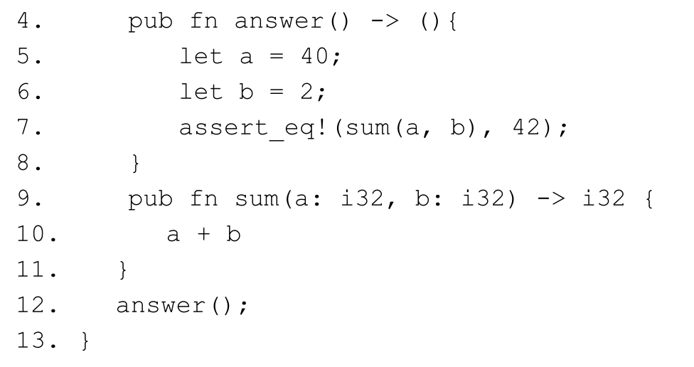{.u54476}
:::

在代码清单2-2中，第1行和第2行是声明语句，它们并不需要求值，只是用来引入标准库包以及prelude模块的。这里之所以将它们注释掉，是因为Rust会为每个crate都自动引入标准库模块，除非使用＃\[no_std\]属性明确指定了不需要标准库。

然后使用fn关键字定义了两个函数answer和sum。关键字fn是function的缩写。

函数answer没有输入参数，并且返回值为**单元类型（）** 。单元类型拥有唯一的值，就是它本身，为了描述方便，将该值称为**单元值** 。单元类型的概念来自OCmal，它表示"没有什么特殊的价值"。所以，这里将单元类型作为函数返回值，就表示该函数无返回值。当然，通常无返回值的函数默认不需要在函数签名中指定返回类型。

在函数answer中，使用let声明了两个变量a和b，其后必须加分号。assert_eq！则是宏语句，它是Rust提供的断言，允许判断给定的两个表达式求值结果是否相同。像这种名字以叹号结尾，并且可以像函数一样被调用的语句，在Rust中叫作**宏** 。

函数sum的两个输入参数和返回值均指定为i32类型。其函数体只包含了一个表达式，用于计算a与b的值，并返回。

代码清单2-2其实可以去掉换行符，完全写成一整行代码，而不影响程序编译。

**Rust编译器在解析代码的时候，如果碰到分号，就会继续往后面执行；如果碰到语句，则执行语句；如果碰到表达式，则会对表达式求值，如果分号后面什么都没有，就会补上单元值（）。**

**当遇到函数的时候，会将函数体的花括号识别为块表达式（Block Expression）。块表达式是由一对花括号和一系列表达式组成的，它总是返回块中最后一个表达式的值** 。因此，对于answer函数来说，它也是一个块表达式，块中的最后一个表达式是宏语句，所以返回单元值（）。对于sum函数来说，其最后一行是一个表达式，因为没有分号，所以直接返回其求值结果。

从这个角度来看，可以将Rust看作一切皆表达式。由于当分号后面什么都没有时自动补单元值（）的特点，我们可以将 Rust 中的语句看作计算结果均为（）的特殊表达式。而对于普通的表达式来说，则会得到正常的求值结果。

## 2.3 变量与绑定 {#text00008.html#A02a60024-1356-4822-a930-cc2f737c5417 .title-left}

通过let关键字来创建变量，这是Rust语言从函数式语言中借鉴的语法形式。let创建的变量一般称为**绑定** （**Binding** ），它表明了标识符（Identifier）和值（Value）之间建立的一种关联关系。

### 2.3.1 位置表达式和值表达式 {#text00008.html#A14a50025-c010-43d3-80fd-93a8209276c1 .title-left}

Rust 中的表达式一般可以分为**位置表达式** （ **Place Expression** ）和**值表达式** （ **Value Expression** ）。在其他语言中，一般叫作左值（LValue）和右值（RValue）。

顾名思义，位置表达式就是表示内存位置的表达式。分别有以下几类：

· 本地变量

· 静态变量

· 解引用（\*expr）

· 数组索引（expr\[expr\]）

· 字段引用（expr.field）

· 位置表达式组合

通过位置表达式可以对某个数据单元的内存进行读写。主要是进行写操作，这也是位置表达式可以被赋值的原因。

除此之外的表达式就是值表达式。值表达式一般只引用了某个存储单元地址中的数据。它相当于数据值，只能进行读操作。

**从语义角度来说，位置表达式代表了持久性数据，值表达式代表了临时数据** 。位置表达式一般有持久的状态，值表达式要么是字面量，要么是表达式求值过程中创建的临时值。

表达式的求值过程在不同的上下文中会有不同的结果。求值上下文也分为**位置上下文** （**Place Context** ）和**值上下文** （**Value Context** ）。下面几种表达式属于位置上下文：

· 赋值或者复合赋值语句左侧的操作数。

· 一元引用表达式的独立操作数。

· 包含隐式借用（引用）的操作数。

· match判别式或let绑定右侧在使用ref模式匹配的时候也是位置上下文。

除了上述几种情况，其余表达式都属于值上下文。值表达式不能出现在位置上下文中，如代码清单2-3所示。

**代码清单2-3：值表达式不能出现在位置上下文中**

::: center
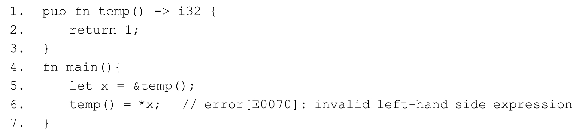{.u54475}
:::

代码清单2-3定义了函数temp。在main函数中，使用temp函数的调用放到了赋值语句左边的位置上下文中，此时编译器就会报错。因为temp函数调用是一个无效的位置表达式，它是值表达式。

### 2.3.2 不可变绑定与可变绑定 {#text00008.html#Aea3c0025-eab9-4870-924d-035ba9f5797e .title-left}

使用let关键字声明的**位置表达式默认不可变** ，**为不可变绑定** 。代码清单2-4展示了不可变绑定与可变绑定。

**代码清单2-4：不可变绑定与可变绑定**

::: center
{.u54474}
:::

在代码清单2-4中，变量a默认是不可变绑定，对其重新赋值后编译器会报错，如代码第3行所示。通过mut关键字，可以声明可变的位置表达式，即可变绑定。可变绑定可以正常修改和赋值。

从语义上来说，let 默认声明的不可变绑定只能对相应的存储单元进行读取，而 let mut声明的可变绑定则是可以对相应的存储单元进行写入的。

### 2.3.3 所有权与引用 {#text00008.html#A9e910026-4c7a-400a-ad95-2fb171bfee0f .title-left}

当位置表达式出现在值上下文中时，该位置表达式将会把内存地址转移给另外一个位置表达式，这其实是所有权的转移，如代码清单2-5所示。

**代码清单2-5：所有权转移**

::: center
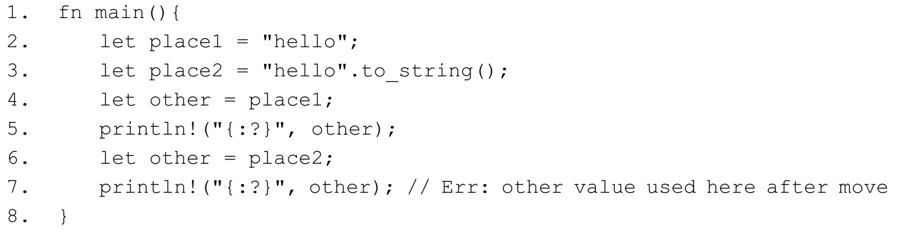{.u54473}
:::

在代码清单2-5中，使用let声明了两个绑定，place1和place2。然后将place1赋值给新的变量 other。**因为 place1 是一个位置表达式，现在出现在了赋值操作符右侧，即一个值上下文内，所以place1会将内存地址转移给other** 。同理，将place2赋值给新声明的other，place2的内存地址同样会转移给other。

代码编译执行以后，代码第5行可以正常打印other的值，但是代码第7行就会报错，编译器提示"other value used here after move"，此提示的意思是该处使用了已经移动的值。为什么会有这两种区别呢？这其实和底层内存安全管理有关系。这两种行为虽然不同，但都是Rust为了保证内存安全刻意而为之的，在第3章中会有更详细的解释。

**在语义上，每个变量绑定实际上都拥有该存储单元的所有权，这种转移内存地址的行为就是所有权（OwnerShip）的转移，在 Rust 中称为移动（Move）语义，那种不转移的情况实际上是一种复制（Copy）语义** 。Rust没有GC，所以完全依靠所有权来进行内存管理。

在日常开发中，有时候并不需要转移所有权。Rust提供**引用操作符** （**&** ），可以直接获取表达式的存储单元地址，即内存位置。可以通过该内存位置对存储进行读取。引用操作示例如代码清单2-6所示。

**代码清单2-6：引用操作示例**

::: center
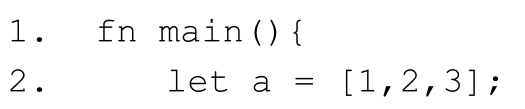{.u54472}
:::

::: center
{.u54471}
:::

在代码清单2-6中，定义了固定长度数组a，并且使用引用操作符&取得a的内存地址，赋值给 b。这种方式不会引起所有权的转移，因为使用引用操作符已经将赋值表达式右侧变成了位置上下文，它只是共享内存地址。通过println！宏指定{：p}格式，可以打印b的指针地址，也就是内存地址。

同时，也通过let mut声明了动态长度数组c。然后通过&mut获取c的可变引用，赋值给d。调用d的push方法插入新的元素4。注意，要获取可变引用，必须先声明可变绑定。

对于字面量 42 来说，其本身属于值表达式。通过引用操作符，相当于值表达式在位置上下文中进行求值，所以编译器会为&42创建一个临时值，如代码清单2-7所示。

**代码清单2-7：值表达式在位置上下文中求值时会被创建临时值**

::: center
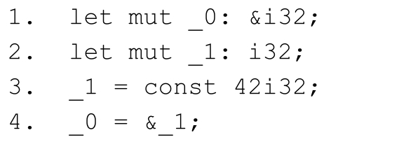{.u54470}
:::

代码清单2-7是编译器为let e=&42创建临时值的示意代码，仅用于演示。

最后，通过解引用操作符\*将引用e中的值取出来，以供assert_eq！宏使用。

从语义上来说，不管是&a还是&mut c，都相当于对a和c所有权的借用，因为a和c还依旧保留它们的所有权，所以引用也被称为借用。

## 2.4 函数与闭包 {#text00008.html#A23b60027-4382-4a74-b676-671aa8cbb163 .title-left}

前文已经出现了不少函数，出现最多的就是 **main 函数，它代表程序的入口** 。对于二进制可执行文件来说，main函数必不可少。对于库函数来说，main函数就没那么必要了。

### 2.4.1 函数定义 {#text00008.html#Ad6a00027-5da3-48d7-9cd2-57b1a68a3445 .title-left}

通过前文我们也了解到，**函数是通过关键字fn定义的** 。这种关键字使用了极简缩写，这也算是Rust独有的一种风格，不仅仅是fn，还有很多其他关键字都使用了缩写。有些初学者可能不太喜欢这样缩写，但是习惯之后，这种想法就会改变。

接下来定义一个FizzBuzz函数。FizzBuzz函数很简单：输入一个数字，当数字是3的倍数时，输出fizz；当数字是5的倍数时，输出buzz；当数字是3和5共同的倍数时，输出fizzbuzz；其他情况返回该数字，如代码清单2-8所示。

**代码清单2-8：FizzBuzz函数示例**

::: center
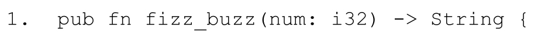{.u54469}
:::

::: center
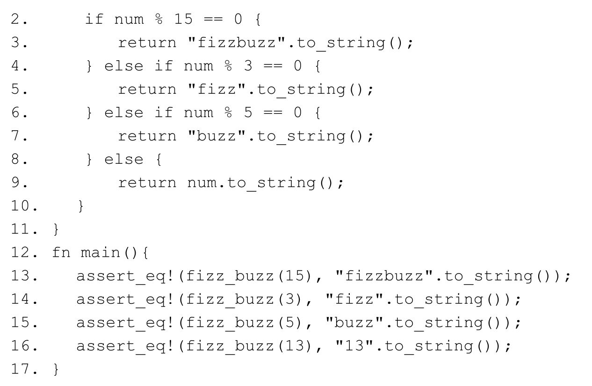{.u54468}
:::

代码清单2-8中使用fn关键字定义了fizz_buzz函数，其函数签名pub fn fizz_buzz（num：i32）-＞String清晰地反映了**函数的类型约定** ：**传入i32类型，返回String类型。Rust编译器会严格遵守此类型的契约，如果传入或返回的不是约定好的类型，则编译时会报错** 。

我们从前文中已经知晓，函数体是由花括号括起来的，它实际上是一个块表达式，最终只返回块中最后一个表达式的求值结果。如果想提前返回，则需要使用return关键字。请参考代码清单2-8。

return 表达式用于退出一个函数，并返回一个值。但是如果 return 后面没有值，就会默认返回单元值。

代码清单2-8中使用了to_string方法，它将表达式的求值结果转换为String类型。Rust中的字符串类型不仅包括String类型，第8章讲字符串的时候会介绍更多相关内容。

### 2.4.2 作用域与生命周期 {#text00008.html#A023e0028-d832-4805-9640-e97f0c7d9681 .title-left}

**Rust 语言的作用域是静态作用域，即词法作用域（Lexical Scope）** 。由一对花括号来开辟作用域，其作用域在词法分析阶段就已经确定了，不会动态改变。词法作用域如代码清单2-9所示。

**代码清单2-9：词法作用域示例**

::: center
{.u54467}
:::

在代码清单2-9中，代码第2行到第5行首先定义了变量绑定v，赋值为hello world！，然后通过断言验证其值。再次通过 let 声明变量绑定 v，赋值为 hello Rust！。这种连续用 let定义同名变量的做法叫**变量遮蔽** （**Variable Shadow** ）。但是最终的变量v的值是由第二个变量定义所决定的。变量遮蔽可以为日常开发提供诸多方便。

代码第6行到第9行使用花括号开辟了一个块空间，它实际上是一段词法作用域。其中同样使用let声明了变量绑定v，赋值为hello World！。

代码第10行使用宏断言assert_eq！验证v的值，该值依然等于hello Rust！，并没有因为块代码中的重新声明而发生改变。

这证明，在词法作用域内部使用花括号开辟新的词法作用域后，两个作用域是相互独立的。在不同的词法作用域内声明的变量绑定，拥有不同的**生命周期** （**LifeTime** ）。尽管如此，变量绑定的生命周期总是遵循这样的规律：**从使用 let 声明创建变量绑定开始，到超出词法作用域的范围时结束** 。

### 2.4.3 函数指针 {#text00008.html#A5a270029-76fb-4450-b1b2-915c6625f59d .title-left}

在Rust中，**函数为一等公民** 。这意味着，函数自身就可以作为函数的参数和返回值使用。

代码清单2-10展示了函数作为参数的情况。

**代码清单2-10：函数作为参数的情况**

::: center
{.u54466}
:::

在代码清单2-10中，定义了函数math，其函数签名的第一个参数为fn（i32，i32）-＞i32类型，这在Rust中是函数指针（fn pointer）类型。

在main函数中，调用了math函数两次，分别传入了sum和product作为参数。而sum和product分别是用于求和和求积的两个函数，它们的类型是fn（i32，i32）-＞i32，所以可以作为参数传给math函数。注意这里直接使用函数的名字来作为函数指针。

函数也可以作为返回值使用，如代码清单2-11所示。

**代码清单2-11：函数作为返回值的情况**

::: center
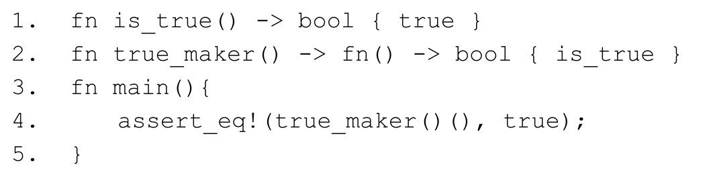{.u54465}
:::

在代码清单 2-11 中，定义了函数 is_true，返回 true。还定义了函数 true_maker，返回fn（）-＞bool 类型，其函数体内直接将 is_true 函数指针返回。注意此处也使用了函数名字作为函数指针，如果加上括号，就会调用该函数。

在 main 函数的断言中，true_maker（）（）调用相当于（true_maker（））（）。首先调用true_maker（），会返回is_true函数指针；然后再调用is_true（）函数，最终得到true。

### 2.4.5 CTFE机制 {#text00008.html#A8e32002a-bbd2-404e-b7b9-b554f687c760 .title-left}

Rust编译器也可以像C++或D语言那样，拥有**编译时函数执行（Compile-Time Function Execution，CTFE）** 的能力。在Rust 2018 版本的首个语义化版本 1.30中，CTFE的一个最小化子集已经稳定了。在该版本之前，如果想使用此功能，必须使用Nightly Rust版本。代码清单2-12展示了使用CTFE功能的一个示例------const fn示例。

**代码清单2-12：const fn示例**

::: center
{.u54464}
:::

在代码清单2-12中，使用了const fn来定义函数init_len，该函数返回一个固定值5。并且在main函数中，通过\[0；N\]这种形式来初始化初始值为0、长度为N的数组，其中N是由调用函数init_len来求得的。

Rust 中固定长度的数组必须在编译期就知道长度，否则会编译出错。所以函数 init_len必须在编译期求值。这就是 CTFE 的能力。注意，使用 Rust 2018 版本时，不需要加＃！\[feature（const_fn）\]特性；而使用Rust 2015版本时，还需要加此特性。使用const fn定义的函数，必须可以确定值，不能存在歧义。与fn定义函数的区别在于，const fn可以强制编译器在编译期执行函数。其中关键字const一般用于定义全局常量。

除了const fn，官方还在实现const generics特性。支持const generics特性，将可以实现类似impl＜T，const N：usize＞Foo for \[T；N\]{\...}的代码，可以为所有长度的数组实现triat Foo。那么使用数组的体验将会得到很大的提升。

**Rust中的CTFE是由miri来执行的** 。miri是一个MIR解释器，目前已经被集成到了Rust编译器 rustc 中。Rust 编译器目前可以支持的常量表达式有：字面量、元组、数组、字段结构体、枚举、只包含单行代码的块表达式、范围等。Rust想要拥有完善的CTFE支持，还有很多工作要做。

### 2.4.6 闭包 {#text00008.html#Aa887002a-4299-4cc8-b210-73f59138bd82 .title-left}

闭包也叫匿名函数。闭包有以下几个特点：

· 可以像函数一样被调用。

· 可以捕获上下文环境中的自由变量。

· 可以自动推断输入和返回的类型。

代码清单2-13展示了一个闭包的示例。

**代码清单2-13：闭包示例**

::: center
{.u54463}
:::

在代码清单 2-13 中，在 main 函数中定义了另外一个函数 add，以及两个闭包closure_annotated和closure_inferred。

闭包调用和函数调用非常像，如代码第9行到第11行所示。**但是闭包和函数有一个重要的区别，那就是闭包可以捕获外部变量，而函数不可以** 。如代码第3行，在add函数内使用外部定义的变量out，编译器会报错。但是代码第5行和第6行定义的闭包就可以直接使用out。

闭包也可以作为函数参数和返回值，但使用起来略有区别。代码清单2-14展示了闭包作为参数的情况。

**代码清单2-14：闭包作为参数的情况**

::: center
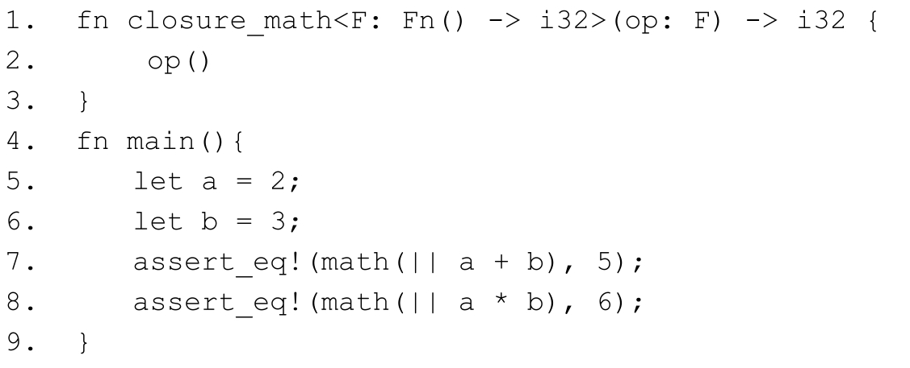{.u54462}
:::

在代码清单 2-14 中，定义了函数 closure_math，其参数是一个泛型 F，并且该泛型受Fn（）-＞i32 trait的限定，代表该函数只允许实现Fn（）-＞i32 trait的类型作为参数。

**Rust中闭包实际上就是由一个匿名结构体和trait来组合实现的** 。所以，在main函数调用math函数的时候，分别传入\|\|a+b和\|\|a\*b这两个闭包，都实现了Fn（）-＞i32。在math函数内部，通过在后面添加一对圆括号来调用传入的闭包。

闭包同样也可以作为返回值，如代码清单2-15所示。

**代码清单2-15：闭包作为返回值的情况**

::: center
{.u54461}
:::

::: center
{.u54460}
:::

在代码清单2-15中使用了impl Fn（i32）-＞i32作为函数的返回值，它表示实现Fn（i32）-＞i32 的类型。在函数定义时并不知道具体的返回类型，但是在函数调用时，编译器会推断出来。这个过程也是零成本抽象的，一切都发生在编译期。

需要注意的是，在函数two_times_impl中最后返回闭包时使用了**move** 关键字。这是因为在一般情况下，闭包默认会按引用捕获变量。如果将此闭包返回，则引用也会跟着返回。但是在整个函数调用完毕之后，函数内的本地变量 i 就会被销毁。那么随闭包返回的变量 i的引用，也将成为悬垂指针。Rust是注重内存安全的语言，绝对不会让这种事情发生。所以如果不使用move关键字，编译器会报错。使用move关键字，将捕获变量i的所有权转移到闭包中，就不会按引用进行捕获变量，这样闭包才可以安全地返回。

在第5章中还会讲述更多关于闭包的内容。

## 2.5 流程控制 {#text00008.html#A88d9002c-ddd7-4f48-95bd-46cebb4c290d .title-left}

一般编程语言都会有常用的流程控制语句：条件语句和循环语句，Rust也不例外。但是在Rust中不叫流程控制语句，而叫流程控制表达式。

### 2.5.1 条件表达式 {#text00008.html#Ae0d2002c-03b0-461b-a6a9-1c2337cb2526 .title-left}

表达式一定会有值，所以if表达式的分支必须返回同一个类型的值才可以。这也是Rust没有三元操作符？：的原因。if表达式的求值规则和块表达式一致。

if表达式如代码清单2-16所示。

**代码清单2-16：if表达式**

::: center
{.u54459}
:::

在代码清单2-16中，变量绑定big_n的赋值是由一个if表达式来完成的。通过计算n的区间大小，来决定最终的值。因为n是整数13，虽然没有明确指定类型，但Rust编译器会默认推断其为i32类型。在if条件分支中，对n求积得到的结果肯定是整数。在else分支中，按直觉来说，n除以2应该是小数6.5才对。但是如果是小数，if和else分支的求值结果类型会不一致，编译器会不会报错？

其实这里不需要担心，因为big_n的类型已经被Rust编译器根据上下文默认推断为i32类型。类型已经确定了，所以在计算n除以2的时候，Rust编译器会将结果进行截取，去除小数点后面的部分。最终big_n的值是6。

### 2.5.2 循环表达式 {#text00008.html#A238b002d-8410-4d72-9e47-69cc175f4cfd .title-left}

Rust中包括三种循环表达式：while、loop和for...in表达式，其用法和其他编程语言相应的表达式基本类似。

现在我们用for...in表达式来实现FizzBuzz，如代码清单2-17所示。

**代码清单2-17：用for...in表达式实现FizzBuzz**

::: center
{.u54458}
:::

在代码清单2-17中，for...in表达式本质上是一个迭代器。其中1..101是一个Range类型，它是一个迭代器。for 的每一次循环都从迭代器中取值，当迭代器中没有值的时候，for循环结束。第5章会介绍关于迭代器的更多内容。

在本书源码包中还可以找到使用while和loop循环的FizzBuzz示例。这里值得注意的是，当需要使用无限循环的时候，请务必使用loop循环，避免使用while true循环。代码清单2-18展示了使用while true循环的情况，我们看看会产生什么后果。

**代码清单2-18：使用while true循环示例**

::: center
{.u54457}
:::

代码清单2-18中定义了函数while_true，其中while循环条件使用了硬编码true，目的是实现无限循环。这种看似非常正确的代码会引起Rust编译器报错。

错误提示称while true循环块返回的是单元值，而函数while_true返回值是i32，所以不匹配。但是在while true循环中使用了return 关键字，应该返回i32类型才对，为什么会报错呢？

这是因为Rust编译器在对while循环做**流分析** （**Flow Sensitive** ）的时候，不会检查循环条件，编译器会认为 while 循环条件可真可假，所以循环体里的表达式也会被忽略，此时编译器只知道while true循环返回的是单元值，而函数返回的是i32，其他情况一概不知。这一切都是因为 CTFE 功能的限制，while 条件表达式无法作为编译器常量来使用。只有等将来CTFE功能完善了，才可以正常使用。同理，if true在只有一条分支的情况下，也会发生类似情况。

修复此错误也很容易，如代码清单2-19所示。

**代码清单2-19：while true错误修复**

::: center
{.u54456}
:::

在代码清单2-19中，在while_true函数的最后一行（第5行）加了x变量，这是为了让编译器以为返回的类型是i32类型。但实际上，程序在运行以后，将永远在while true循环中执行。

### 2.5.3 match表达式与模式匹配 {#text00008.html#Ac22a002e-4b82-4a6d-a0b6-6e18c38d7ca0 .title-left}

Rust提供了match表达式，如代码清单2-20所示。

**代码清单2-20：match表达式**

::: center
{.u54455}
:::

在代码清单2-20中，match用于匹配各种情况。有点类似其他编程语言中的switch或case语句。

在Rust语言中，match分支使用了**模式匹配** （**Pattern Matching** ）技术。模式匹配在数据结构字符串中经常出现，比如在某个字符串中找出与该子串相同的所有子串。在编程语言中，模式匹配用于判断类型或值是否存在可以匹配的模式。模式匹配在很多函数式语言中已经被广泛应用。

**在Rust语言中，match分支左边就是模式，右边就是执行代码** 。模式匹配同时也是一个表达式，和if表达式类似，所有分支必须返回同一个类型。但是左侧的模式可以是不同的。代码清单2-20中使用的模式分别是单个值、范围、多个值和通配符。其中值得注意的是，在代码第7行中，使用操作符@可以将模式中的值绑定给一个变量，供分支右侧的代码使用，**这类匹配叫绑定模式** （**Binding Mode** ）。match表达式必须穷尽每一种可能，所以一般情况下，会使用通配符**\_** 来处理剩余的情况。

除了match表达式，还有let绑定、函数参数、for循环等位置都用到了模式匹配，在后面章节中我们会陆续看到相关示例。

### 2.5.4 if let和while let表达式 {#text00008.html#Abd0f002f-43a0-4860-a538-d5dc5f2d05c0 .title-left}

Rust还提供了if let和while let表达式，分别用来在某些场合替代match表达式。使用if let表达式的代码如代码清单2-21所示。

**代码清单2-21：使用if let表达式**

::: center
{.u54454}
:::

代码清单2-21中使用了if let表达式，和match表达式相似，if let左侧为模式，右侧为要匹配的值。该代码表示binary默认为0，如果boolean为true，则将binary的值修改为1。

在使用循环的某些场合下，也可以使用while let来简化代码。我们先来看不使用while let表达式，而使用match表达式的情况，如代码清单2-22所示。

**代码清单2-22：使用match表达式**

::: center
{.u54453}
:::

在代码清单2-22中，创建了动态数组v，并且想要将其中的元素通过pop方法依次取出来并打印。此处使用loop循环，因为调用v的pop方法会返回Option类型，所以用match匹配两种情况，Some（x）和None。Rust中引入Option类型是为了防止空指针的出现。Some（x）用于匹配数组中的元素，而 None 用于匹配数组被取空的情况。当数组取空时，就从循环中跳出（break）。

这段代码比较烦琐，因为第6行代码其实什么都没做，只是跳出循环而已。使用while let正好可以简化这段代码，如代码清单2-23所示。

**代码清单2-23：使用while let简化代码**

::: center
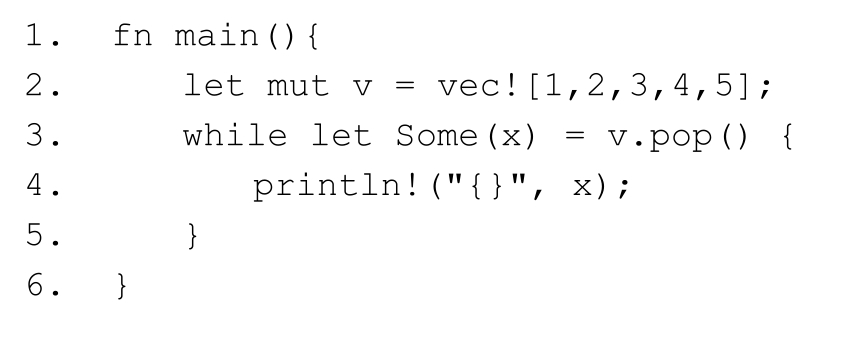{.u54452}
:::

代码清单2-23使用了while let表达式。与if let类似，其左侧Some（x）为匹配模式，它会匹配右侧pop方法调用返回的Option类型结果，并自动创建x绑定供println！宏语句使用。如果数组中的值取空，则自动跳出循环。

## 2.6 基本数据类型 {#text00008.html#A24e90030-c749-401f-8eed-4d5e097d3529 .title-left}

Rust提供了很多原始基本数据类型，下面分别介绍它们。

### 2.6.1 布尔类型 {#text00008.html#A38910030-98d3-409f-9989-bfe60f40df63 .title-left}

Rust内置了布尔类型，类型名为bool。bool类型只有两个值------true和false，其示例如代码清单2-24所示。

**代码清单2-24：bool类型示例**

::: center
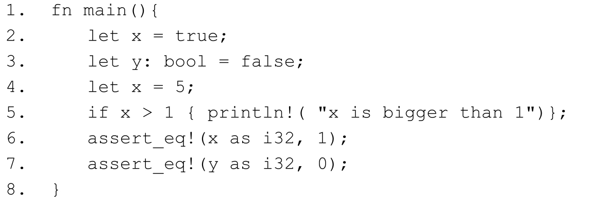{.u54451}
:::

在代码清单2-24中，第2行和第3行声明x和y绑定的写法是等价的。对于x绑定，Rust可以自动推断其类型为bool。当然也可以像声明y那样显式地指定其类型为bool。

任意一个比较操作都会产生bool类型，如第5行代码所示。

也可以通过as操作符将bool类型转换为数字0和1。但要注意，Rust并不支持将数字转换为bool类型。

### 2.6.2 基本数字类型 {#text00008.html#A4d9d0030-a018-491e-8cb4-acd00b11f933 .title-left}

Rust提供的基本数字类型大致可以分为三类：固定大小的类型、动态大小的类型和浮点数，分别介绍如下。

· 固定大小的类型包括无符号整数（Unsigned Integer）和符号整数（Signed Integer）。其

中，无符号整数包括：

➢u8，数值范围为0～2^8-1^ ，占用1个字节。u8类型通常在Rust中表示字节序列。在文件I/O或网络I/O中读取数据流时需要使用u8。

➢u16，数值范围为0～2^16-1^ ，占用2个字节。

➢u32，数值范围为0～2^32-1^ ，占用4个字节。

➢u64，数值范围为0～2^64-1^ ，占用8个字节。

➢u128，数值范围为0～2^128-1^ ，占用16个字节。

符号整数包括：

➢i8，数值范围为-2^7^ ～2^7-1^ ，占用1个字节。

➢i16，数值范围为-2^15^ ～2^15-1^ ，占用2个字节。

➢i32，数值范围为-2^31^ ～2^31-1^ ，占用4个字节。

➢i64，数值范围为-2^63^ ～2^63-1^ ，占用8个字节。

➢i128，数值范围为-2^127^ ～2^127-1^ ，占用16个字节。

· 动态大小类型分为：

➢usize，数值范围为0～2^32-1^ 或0～2^64-1^ ，占用4个或8个字节，具体取决于机器的字长。

➢isize，数值范围为-2^31^ ～2^31-1^ 或-2^63^ ～2^63-1^ ，占用4个或8个字节，同样取决于机器的字长。

· 浮点数类型分为：

➢f32，单精度32位浮点数，至少6位有效数字，数值范围为-3.4×10^38^ ～3.4×10^38^ 。

➢f64，单精度64位浮点数，至少15位有效数字，数值范围为-1.8×10^308^ ～1.8×10^308^ 。

基本数字类型的示例如代码清单2-25所示。

**代码清单2-25：基本数字类型示例**

::: center
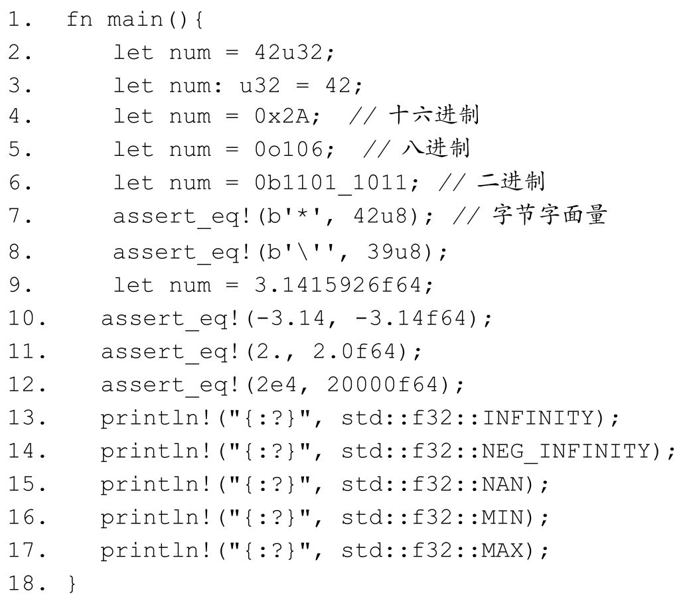{.u54450}
:::

代码清单2-25中创建的数字字面量后面可以直接使用**类型后缀** ，比如42u32，代表这是一个u32类型。如果不加后缀或者没有指定类型，Rust编译器会**默认推断** 数字为i32类型。

可以用前缀0x、0o和0b分别表示十六进制、八进制和二进制类型。比如0x2A、0o106、0b1101_1011。

Rust中也可以写**字节字面量** ，比如以b开头的字符b＇\*＇，它实际等价于42u8。

浮点数同样也可以为字面量加类型后缀。如果不加后缀或没有指定类型，Rust会默认推断浮点数为 f64 类型。标准库 std：：f32 和 std：：f64 都提供了 IEEE 所需的特殊常量值，比如INFINITY（无穷大）、NEG_INFINITY（负无穷大）、NAN（非数字值）、MIN（最小有限值）和MAX（最大有限值）。

### 2.6.3 字符类型 {#text00008.html#A495a0031-288c-4de3-8e79-aefe9ee83ee8 .title-left}

在Rust中，使用**单引号** 来定义字符（Char）类型。字符类型代表的是一个**Unicode标量值** ，每个字符占4个字节，字符类型的示例如代码清单2-26所示。

**代码清单2-26：字符类型示例**

::: center
{.u54449}
:::

::: center
{.u54448}
:::

在代码清单2-26中，使用了多个Unicode值来定义字符，比如＇Ú＇、＇ಠ＇、＇\*＇等。同时，Rust的字符也支持转义符，如代码第4行到第8行所示。

字符也可以使用ASCII码和Unicode码来定义，＇2A＇为ASCII码表中表示符号＇\*＇的十六进制数，格式为＇\\xHH＇。＇151＇是Unicode 十六进制码，格式为＇\\u{HHH}＇，如代码第9 行到第12行所示。

同样，可以使用as操作符将字符转为数字类型。＇%＇的十进制ASCII值是37。＇ಠ＇转换为i8，该字符值的高位会被截断，最终得到-96。

### 2.6.4 数组类型 {#text00008.html#A77800032-34c3-4ef9-89fc-8ea5bd7ca97f .title-left}

数组（Array）是Rust内建的原始集合类型，数组的特点为：

· 数组大小固定。

· 元素均为同类型。

· 默认不可变。

**数组的类型签名为\[T；N\]** 。T是一个泛型标记，后面会具体介绍，它代表数组中元素的某个具体类型。N代表数组的长度，是一个编译时常量，必须在编译时确定其值。数组类型的示例如代码清单2-27所示。

**代码清单2-27：数组类型示例**

::: center
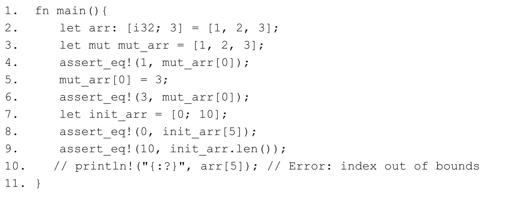{.u54447}
:::

在代码清单2-27中，定义了类型为\[i32；3\]的数组，该数组是固定长度的，不允许对其添加或删除元素。即使通过let mut关键字定义可变绑定mut_arr，也只能修改已存在于索引位上的元素。

另外，还可以通过\[0；10\]这样的语法创建初始值为0且指定长度为10的数组。对于越界访问的情况，Rust会报编译错误，有效阻止了内存不安全的操作，如代码第10行所示。

对于原始固定长度数组，只有实现Copy trait的类型才能作为其元素，也就是说，只有可以在栈上存放的元素才可以存放在该类型的数组中。不过，在不远的将来，Rust还将支持**VLA （variable-length array）** 数组，即**可变长度数组** 。对于可变长度数组，将会基于可以在栈上动态分配内存的函数来实现。在本书写作时，支持该功能的Unsized Rvalues特性 ^[\[1\]](#text00008.html#n939C00332F5548738A747AF0AA59E7CA){#text00008.html#n939C00332F5548738A747AF0AA59E7CAs}^ 已经被实现了一小部分。

### 2.6.5 范围类型 {#text00008.html#A6f4d0033-8d9e-45d0-b823-02f0c0377bfc .title-left}

Rust 内置了范围（Range）类型，包括**左闭右开** 和**全闭** 两种区间。范围类型的示例如代码清单2-28所示。

**代码清单2-28：范围类型示例**

::: center
{.u54446}
:::

代码清单2-28中展示了两种范围区间。（1..5）表示左闭右开区间，（1..=5）则表示全闭区间。它们分别是std：：ops：：Range和std：：ops：：RangeInclusive的实例。

范围自带了一些方法，比如sum，可以为范围中的元素进行求和。并且每个范围都是一个迭代器，可以直接使用for循环进行打印。请注意两种区间的不同。

### 2.6.6 切片类型 {#text00008.html#Afb960033-2f11-463c-80aa-3dd214949582 .title-left}

切片（Slice）类型是对一个数组（包括固定大小数组和动态数组）的引用片段，有利于安全有效地访问数组的一部分，而不需要拷贝。因为理论上讲，切片引用的是已经存在的变量。在底层，切片代表一个指向数组起始位置的指针和数组长度。用\[T\]类型表示连续序列，那么切片类型就是&\[T\]和&mut \[T\]。

切片类型的示例如代码清单2-29所示。

**代码清单2-29：切片类型示例**

::: center
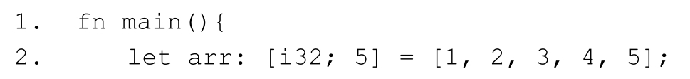{.u54445}
:::

::: center
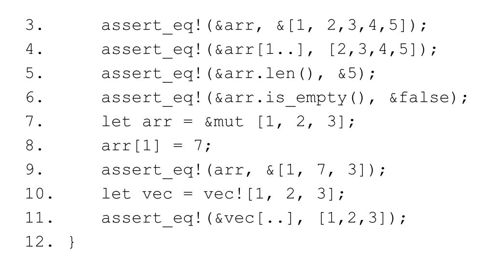{.u54444}
:::

在代码清单2-29中，通过引用操作符&对数组进行引用，就产生了一个切片&arr。也可以结合范围对数组进行切割，比如&arr\[1..\]，表示获取arr数组中在索引位置1之后的所有元素。

切片也提供了两个const fn方法，len和is_empty，分别用来得到切片的长度和判断切片是否为空。

通过&mut可以定义可变切片，这样可以直接通过索引来修改相应位置的值，如代码第7行到第9行所示。

对于使用vec！宏定义的动态数组，也可以通过引用操作符来得到一个切片，如代码第10行和第11行所示。

### 2.6.7 str字符串类型 {#text00008.html#Acaee0034-a571-4e7d-8914-a4f6fbd53507 .title-left}

Rust提供了原始的字符串类型str，也叫作**字符串切片** 。它通常以不可变借用的形式存在，即&str。**出于内存安全的考虑，Rust将字符串分为两种类型** ，一种是固定长度字符串，不可随便更改其长度，就是str字符串；另一种是可增长字符串，可以随意改变其长度，就是String字符串。str字符串的示例如代码清单2-30所示。

**代码清单2-30：str字符串示例**

::: center
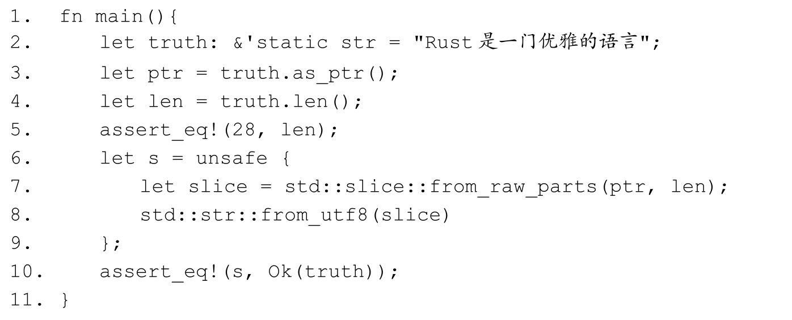{.u54443}
:::

代码清单2-30中定义了字符串字面量truth。本质上，字符串字面量也属于str类型，只不过它是**静态生命周期字符串&＇static str** 。所谓静态生命周期，可以理解为该类型字符串和程序代码一样是持续有效的。

str字符串类型由两部分组成：指向字符串序列的指针和记录长度的值。可以通过str模块提供的as_ptr和len方法分别求得指针和长度，如代码第3行和第4行所示。

Rust中的字符串本质上是一段有效的UTF8字节序列。所以，可以将一段字节序列转换为str字符串。如代码第6行到第9行所示。通过调用std：：slice：：from_raw_parts函数，传入指针和长度，可以将相应的字节序列转换为切片类型&\[u8\]。然后再使用std：：str：：from_utf8函数将得到的切片转换为 str 字符串。因为整个过程并没有验证字节序列是否为合法的 UTF8字符串，所以需要放到**unsafe块** 中执行整个转换过程。如果开发者看到unsafe块，就意味着Rust编译器将内存安全交由开发者自行负责了。关于unsafe块的更多细节，将在第13章详细阐述。

### 2.6.8 原生指针 {#text00008.html#Aacf50035-55ad-46e4-925e-367bd7bd0639 .title-left}

我们将可以表示内存地址的类型称为**指针** 。Rust 提供了多种类型的指针，包括引用（Reference）、原生指针（Raw Pointer）、函数指针（fn Pointer）和智能指针（Smart Pointer）。

我们在前面介绍过引用，它本质上是一种**非空指针** 。Rust可以划分为**Safe Rust和Unsafe Rust** 两部分，引用主要应用于Safe Rust中。在Safe Rust中，编译器会对引用进行借用检查，以保证内存安全和类型安全。

原生指针主要用于Unsafe Rust中。直接使用原生指针是不安全的，比如原生指针可能指向一个Null，或者一个已经被释放的内存区域，因为使用原生指针的地方不在Safe Rust的可控范围内，所以需要程序员自己保证安全。Rust支持两种原生指针：不可变原生指针\*const T和可变原生指针\*mut T。

原生指针的示例如代码清单2-31所示。

**代码清单2-31：原生指针示例**

::: center
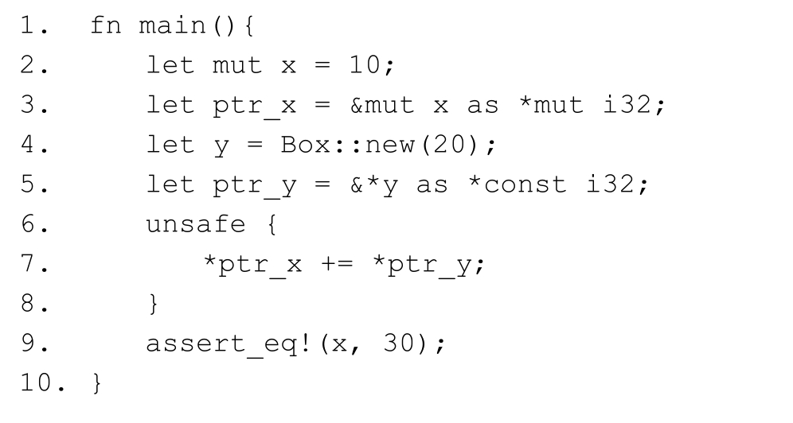{.u54442}
:::

在代码清单 2-31 中，通过 as 操作符将&mut x 可变引用转换为\*mut i32 可变原生指针ptr_x，如代码第2行和第3行所示。

代码第4行使用Box：：new（20）代表在堆内存上存储数字20。然后通过一系列操作转成不可变原生指针ptr_y。

然后对ptr_x和ptr_y指针解引用，并将两个指针指向的值求和，最终得到30。如代码第6行到第8行所示，注意操作原生指针要使用unsafe块。

关于原生指针的更多内容，在第13章中有详细阐述。

### 2.6.9 never类型 {#text00008.html#A78c30035-5b63-4f96-a560-794d1153ec23 .title-left}

Rust中提供了一种特殊数据类型，never类型，即！。**该类型用于表示永远不可能有返回值的计算类型** ，比如线程退出的时候，就不可能有返回值。Rust是一个类型安全的语言，所以也需要将这种情况纳入类型系统中进行统一管理。

never类型的示例如代码清单2-32所示。

**代码清单2-32：neüer类型示例**

::: center
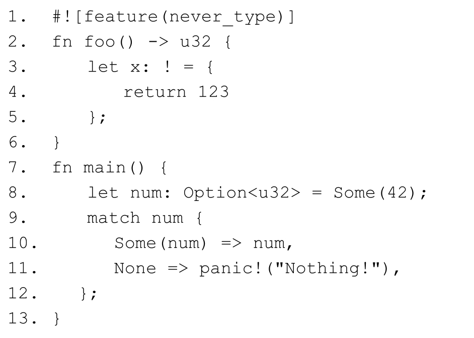{.u54441}
:::

在代码清单2-32中使用了＃！\[feature（never_type）\]特性，这是因为当前never类型属于实验特性，所以必须在Nightly版本下使用该特性，才可以显式地使用never类型。

代码第2行到第6行定义了foo函数，其内部定义的绑定x指定了never类型，右侧块中使用了return表达式。因为return表达式会将123返回，绑定x永远都不会被赋值，所以这里使用never类型不会出现编译错误。与return表达式类似的还有break和continue。

在main函数中使用了match匹配表达式，注意其中None分支使用了panic！宏。因为match表达式要求所有的分支都必须返回相同的类型，这里panic！宏其实是会返回never类型！的，而Some（num）分支会返回u32类型。为什么编译器没有报错呢？这是因为never类型是可以强制转换为其他任何类型的。

## 2.7 复合数据类型 {#text00008.html#A9e880036-9172-48b5-b36b-97820775cc55 .title-left}

Rust提供了4种复合数据类型，分别是：

· **元组** （Tuple）

· **结构体** （Struct）

· **枚举体** （Enum）

· **联合体** （Union）

这4种数据类型都是异构数据结构，意味着可以使用它们将多种类型构建为统一的数据类型。本章只介绍前3种复合数据类型，联合体将在第7章介绍。

### 2.7.1 元组 {#text00008.html#A4f480036-58f0-42ac-9540-4110607e9f7f .title-left}

元组（Tuple）是一种异构有限序列，形如（T，U，M，N）。所谓异构，就是指元组内的元素可以是不同类型的；所谓有限，是指元组有固定的长度，如代码清单2-33所示。

**代码清单2-33：元组示例**

::: center
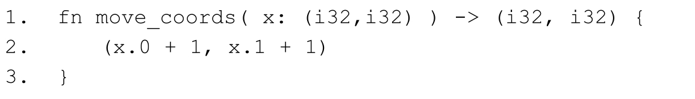{.u54440}
:::

::: center
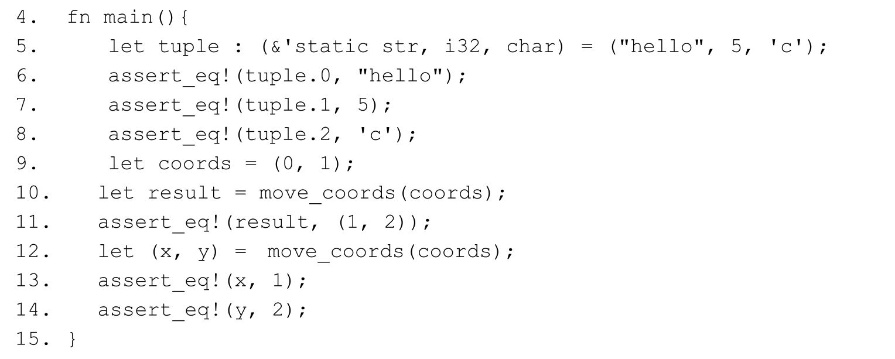{.u54439}
:::

在代码清单2-33中，定义了类型为（&＇static str，i32，char）的元组tuple。可以通过**索引** 来获取元组内元素的值，如代码第6行到第8行所示。

利用元组也可以让函数返回多个值，如代码第1行到第3行函数move_coords的定义所示。

**因为let支持模式匹配，所以可以用来解构元组** ，如代码第12行到第14行所示。函数move_coords返回一个元组，通过let解构，返回的元组第一位会绑定给x，第二位会绑定给y。之后就可以直接使用x和y。

当元组中只有一个值的时候，需要加逗号，即 （0，），这是为了和括号中的其他值进行区分，其他值形如（0）。实际上前面函数部分讲到的单元类型就是一个空元组，即**（）** 。

### 2.7.2 结构体 {#text00008.html#Af1720037-6ed8-41c7-b571-e1a7f82e6b70 .title-left}

Rust提供三种结构体：

· 具名结构体（Named-Field Struct）

· 元组结构体（Tuple-Like Struct）

· 单元结构体（Unit-Like Struct）

具名结构体是最常见的结构体，如代码清单2-34所示。

**代码清单2-34：具名结构体示例**

::: center
{.u54438}
:::

::: center
{.u54437}
:::

代码清单2-34中通过struct关键字定义了一个结构体People，注意结构体名称要遵从**驼峰式命名** 规则。虽然不按驼峰式命名也可以通过编译，但是编译器会警告你：should have a camel case name。

结构体里面字段格式为name：type，name是字段的名称，type是此字段的类型，所以称此类结构体为具名结构体。结构体中字段默认不可变，而且字段可以是任意类型的，甚至是结构体本身。

People结构体上方的**＃\[derive（Debug，PartialEq）\]** 是属性，可以让结构体自动实现Debug trait和PartialEq trait，它们的功能是允许对结构体实例进行打印和比较。

在impl People{...}块中为People结构体实现了4个方法，new、name、set_name和gender。

在Rust中，函数和方法是有区别的。如果不是在impl块里定义的函数，就是自由函数。**而在impl块中定义的函数被称为方法，这和面向对象有点渊源** 。从代码清单2-34中可以看出来，name和gender函数的定义中有一个参数&self，它代表一个对结构体实例自身的引用，这样方便我们使用圆点记号来调用结构体实例中定义的相关函数，如代码清单2-35所示。

**代码清单2-35：用圆点记号调用结构体实例中定义的相关函数**

::: center
{.u54436}
:::

在代码清单2-35中，通过People：：new方法来创建People结构体实例alex。并且可以通过圆点记号来调用结构体中的函数name和gender。代码第3行和第4行的写法完全符合面向对象消息通信模型receiver.message。所以说，**Rust具名结构体是面向对象思想的一种体现** 。

所以，这里实现的name和set_name两个方法，有点类似于面向对象中的getter和setter方法，这两个方法的作用就是获取和修改成员变量的具体值。注意这两个方法签名中的&self和&mut self的用法。结构体中定义的new方法，则类似于面向对象语言中类的构造函数，但实际上Rust中并没有构造函数。注意new方法参数并没有&self，在调用new方法的时候直接使用了一对冒号，而不是圆点记号。

除了具名结构体，Rust中还有一种结构体，它看起来像元组和具名结构体的混合体，叫**元组结构体** ，如代码清单2-36所示。其**特点是，字段没有名称，只有类型** 。

**代码清单2-36：元组结构体示例**

::: center
{.u54435}
:::

代码清单2-36中定义了元组结构体Color，看上去就像具名的元组。注意，元组结构体后面要加分号。元组结构体访问字段的方式和元组一样，也是使用圆点记号按位置索引访问。

**当一个元组结构体只有一个字段的时候，我们称之为New Type模式** ，如代码清单2-37所示。

**代码清单2-37：New Type模式示例**

::: center
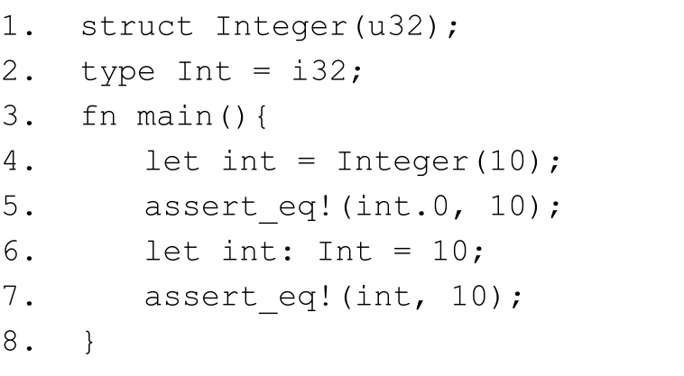{.u54434}
:::

代码清单2-37中定义了Integer单字段结构体，字段为u32类型。之所以称为New Type模式，是因为相当于把u32类型包装成了新的Integer类型。

也可以使用type关键字为一个类型创建别名，如代码第2行为i32类型创建了一个别名Int，但是其本质还是i32类型，它所拥有的行为和i32是一样的。相比之下，New Type模式属于自定义类型，更加灵活。

Rust中可以定义一个没有任何字段的结构体，即单元结构体，如代码清单2-38所示。

**代码清单2-38：单元结构体示例**

::: center
{.u54433}
:::

代码清单2-38中定义了Empty结构体，等价于struct Empty{}。单元结构体实例就是其本身。也许有的人会有疑问：为同一个单元结构体创建多个实例，这些实例是否是同一个对象？注意，此处的"对象"是广义层面的，并非特指面向对象中的"对象"。

代码第5行将x赋值给新的绑定y。此时因为x是位置表达式，而它的上下文是值上下文，所以它的内存地址会移动给新的位置表达式y。

代码第7行定义了新的绑定z，将新的单元结构体实例赋予了z。

然后通过{：p}格式符在println！宏语句中打印&x、&y和&z的内存地址，会发现以下事实：

· 在Debug编译模式下，x、y和z是不同的内存地址。

· 在Release编译模式下，x、y和z是相同的内存地址。

这证明，在 Release 编译模式下，单元结构体实例会被优化为同一个对象。而在 Debug模式下，则不会进行这样的优化。

单元结构体与New Type模式类似，也相当于定义了一个新的类型。单元结构体一般用于一些特定场景，标准库中表示全范围（..）的 RangeFull，就是一个单元结构体，如代码第 9行所示。

### 2.7.3 枚举体 {#text00008.html#A60a6003a-0c25-4594-be4a-387d9ed9617b .title-left}

枚举体（Enum，也可称为枚举类型或枚举），顾名思义，该类型包含了全部可能的情况，可以有效地防止用户提供无效值。在Rust中，枚举类型可以使用enum关键字来定义，并且有三种形式，其中一种是无参数枚举体，如代码清单2-39所示。

**代码清单2-39：无参数枚举体示例**

::: center
{.u54432}
:::

代码清单2-39中定义了枚举体Number，包含了三个值Zero、One和Two。需要注意，这三个是值，而非类型。

在main函数中，想要使用枚举体的值，需要使用Number前缀，如代码第7行所示。可以使用match匹配来枚举所有的值，以处理相应的情况。

Rust也可以编写像C语言中那种形式的枚举体，就是我们要讲的第二种形式的枚举体，我们称之为类C枚举体，如代码清单2-40所示。

**代码清单2-40：类C枚举体示例**

::: center
{.u54431}
:::

::: center
{.u54430}
:::

代码清单2-40中定义了枚举体Color，其中包含了三个枚举值：Red、Green和Blue，还分别被赋予了相应的值。同样，如果要使用具体的枚举值，需要加 Color 前缀，如代码第 7行和第8行所示。

Rust还支持携带类型参数的枚举体，也就是我们要讲的第三种枚举体，如代码清单2-41所示。

**代码清单2-41：带参数枚举体示例**

::: center
{.u54429}
:::

代码清单2-41中定义的枚举体IpAddr，其枚举值携带了类型参数。这样的枚举值本质上属于函数指针类型。

从代码第6行和第7行中看得出来，IpAddr：：V4是fn（u8，u8，u8，u8）-＞IpAddr函数指针，IpAddr：：V6是fn（String）-＞IpAddr函数指针。

使用这类枚举值就像函数调用那样，需要传入实际的参数，如代码第8行所示。

**枚举体在 Rust 中属于非常重要的类型之一** 。一方面它为编程提供了很多方便，另一方面，它保证了Rust中避免出现空指针。其应用示例如代码清单2-42所示。

**代码清单2-42：枚举体应用示例**

::: center
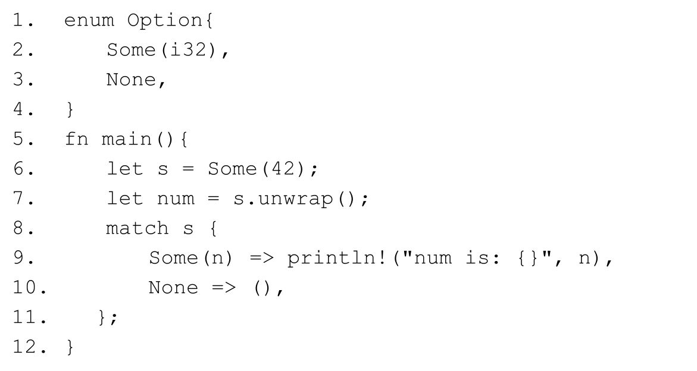{.u54428}
:::

在代码清单2-42中定义了**Option枚举类型** ，现在想用该类型表示**有值** 和**无值** 两种情况。其中Some（i32）代表有i32类型的值，而None代表无任何值。

该类型可以作为某些函数的返回值。如果函数有合法的值返回，则使用Some（i32）枚举值；如果函数要返回空，则可以使用None。这样一来，该函数的值就确定了，无非就是两种，有值或无值。调用该函数的开发者就可以分别处理这两种情况，从而提升程序的健壮性。

在main函数中，定义了绑定s的值为Some（42）。因为这里的值是确定的，所以可以使用unwrap方法将Some（42）中的数字42取出来。如果在不确定的情况下使用unwrap，可能会导致运行时错误。我们可以使用match匹配来枚举这两种情况，并分别处理，如代码第8行到第11行所示。

这个Option类型可以有效地避免开发中出现Null值，所以Rust标准库中也内置了相应的类型，只不过它是泛型的枚举体Option＜T＞，如代码清单2-43所示。这样一来，开发者无须自己定义就可以直接使用泛型的枚举体了。

**代码清单2-43：Option＜T＞示例**

::: center
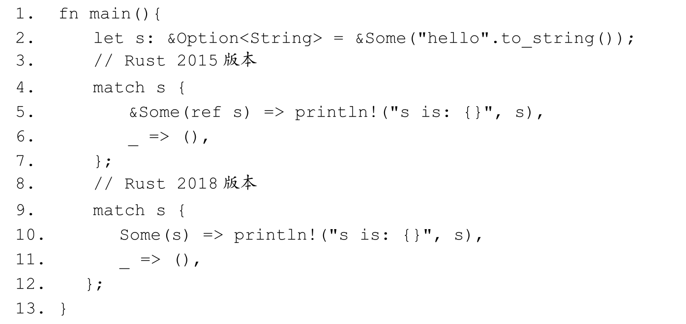{.u54427}
:::

在代码清单2-43中，可以直接使用Some（T），T是泛型，此处具体类型为&str字符串。

代码第2行定义了&Option＜&str＞类型的绑定s，这里使用引用是为了演示match匹配的两种写法。

代码第4行到第7行是Rust 2015版本中的写法。在match匹配分支中，使用&Some（ref s）这样的匹配模式是为了解构&Some（＂hello＂.to_string（））。其中ref也是一种模式匹配，是为了解构&Some（ref s）中s的引用，避免其中的s被转移所有权。

代码第9行到第12行是Rust 2018版本中的写法。目的和第4行到第7行相同，但是不需要再使用引用操作符和ref来进行解构了。在新的版本中，match匹配会自动处理这种情况。

## 2.8 常用集合类型 {#text00008.html#Aee9a003c-aeec-4146-9f02-0037ef0e9b86 .title-left}

在Rust标准库std：：collections模块下有4种通用集合类型，分别如下。

· 线性序列：向量（Vec）、双端队列（VecDeque）、链表（LinkedList）。

· Key-Value映射表：无序哈希表（HashMap）、有序哈希表（BTreeMap）。

· 集合类型：无序集合（HashSet）、有序集合（BTreeSet）。

· 优先队列：二叉堆（BinaryHeap）。

### 2.8.1 线性序列：向量 {#text00008.html#A3df4003c-ea0b-43d6-bf29-d23146263b1f .title-left}

向量也是一种数组，和基本数据类型中的数组的区别在于，向量可动态增长。代码清单2-44展示了一个向量的示例。

**代码清单2-44：Vec＜T＞示例**

::: center
{.u54426}
:::

在代码清单2-44中，使用了三种方法来初始化向量，分别见v1、v2和v3的初始化方法。向量的用法和一般数组是类似的，但是如果要往向量中增加元素，则需要用mut来创建可变绑定。访问元素也是通过下标索引来访问的。

vec！是一个宏，用来创建向量字面量。宏语句可以使用圆括号，也可以使用中括号和花括号，一般使用中括号来表示数组。可以使用push方法往向量数组中添加新的元素。向量也内置了很多其他方法，在第8章将详细介绍它们。

Rust对向量和数组都会做越界检查，以保证安全。如代码第13行所示，调用v3\[4\]，编译器会报panic错误：thread＇main＇panicked at＇index out of bounds。

### 2.8.2 线性序列：双端队列 {#text00008.html#Acfba003d-21bf-4c16-9ba9-8b64a8adfd68 .title-left}

双端队列（Double-ended Queue，缩写为Deque）是一种同时具有队列（先进先出）和栈（后进先出）性质的数据结构。双端队列中的元素可以从两端弹出，插入和删除操作被限定在队列的两端进行。

Rust中的VecDeque是基于可增长的RingBuffer算法实现的双端队列。代码清单2-45展示了一个双端队列的示例。

**代码清单2-45：VecDeque＜T＞示例**

::: center
{.u54425}
:::

在代码清单 2-45 中，需要通过 use 关键字引入 std：：collections：：VecDeque，因为VecDeque＜T＞并不会像Vec＜T＞那样被自动引入。

双端队列VecDeque实现了两种push方法，push_front和push_back。push_front的行为像栈，push_back的行为像队列。通过get方法加索引值可以获取队列中相应的值。

代码第6行和第7行通过push_front先后添加了元素1和2，但是相应的索引是1和0，正是栈数据结构先进后出的体现。

代码第11行到第13行通过push_back先后添加了元素3、4和5，相应的索引位置是2、3和4，正是队列先进先出的体现。

### 2.8.3 线性序列：链表 {#text00008.html#Ac072003e-24a7-454d-851c-7c6e90f443fb .title-left}

Rust提供的链表是双向链表，允许在任意一端插入或弹出元素。但是通常最好使用Vec或VecDeque类型，因为它们比链表更加快速，内存访问效率更高，并且可以更好地利用CPU缓存。

代码清单2-46展示了一个链表的示例。

**代码清单2-46：LinkedList＜T＞示例**

::: center
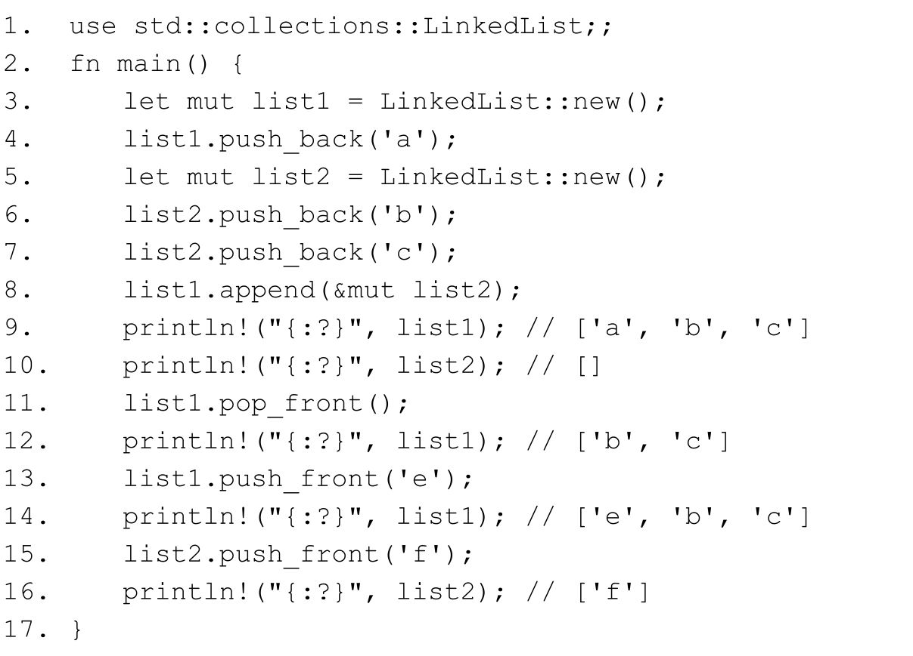{.u54424}
:::

在代码清单2-46中，依然使用use显式引入std：：collections：：LinedList。因为是双向列表，所以提供了push_back和push_front两类方法，方便操作此链表。也提供了append方法，可以用来连接两个链表。更多相关的操作，可以查看标准库文档。

### 2.8.4 Key-Value映射表：HashMap和BTreeMap {#text00008.html#A53bf003e-dc93-4783-8dd3-8fb09e8ca2ff .title-left}

Rust集合模块一共为我们提供了两个Key-Value哈希映射表：

· **HashMap＜K,V＞**

· **BTreeMap＜K,V＞**

Key必须是可哈希的类型，Value必须是在编译期已知大小的类型。这两种类型的区别之一是，**HashMap是无序的，BTreeMap是有序的** 。它们的类型签名分别是HashMap＜K，V＞和BTreeMap＜K，V＞，如代码清单2-47所示。

**代码清单2-47：HashMap＜K，V＞和BTreeMap＜K，V＞示例**

::: center
{.u54423}
:::

在代码清单 2-47 中，同样引入了 use std：：collections：：BTreeMap 和 use std：：collections：：HashMap。通过内置的new方法，可以创建相应的实例hmap和bmap。然后通过insert方法插入键值对。

代码第16行的hmap的输出结果为{1：＂a＂，2：＂b＂，3：＂c＂，5：＂e＂，4：＂d＂}，但key的顺序是随机的，每次执行可能会不一样，因为HashMap是无序的。

代码第17行的bmap的输出结果永远都是{1：＂a＂，2：＂b＂，3：＂c＂，4：＂d＂，5：＂e＂}，顺序不会改变，因为BTreeMap是有序的。

标准库中还提供了不少操作这两种映射表的方法，可以去文档中查看。在第8章中也会有更详细的介绍。

### 2.8.5 集合：HashSet和BTreeSet {#text00008.html#Aaf1f003f-0101-4d93-bc0d-54454f77f2f5 .title-left}

HashSet＜K＞和BTreeSet＜K＞其实就是HashMap＜K，V＞和BTreeMap＜K，V＞把Value设置为空元组的特定类型，等价于HashSet＜K，（）＞和BTreeSet＜K，（）＞。所以这两种集合类型的特性大概如下：

· 集合中的元素应该是唯一的，因为是Key-Value映射表的Key。

· 同理，集合中的元素应该都是可哈希的类型。

· HashSet应该是无序的，BTreeSet应该是有序的。

HashSet＜K＞和BTreeSet＜K＞的示例如代码清单2-48所示。

**代码清单2-48：HashSet＜K＞和BTreeSet＜K＞示例**

::: center
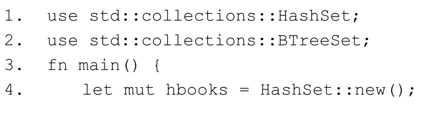{.u54422}
:::

::: center
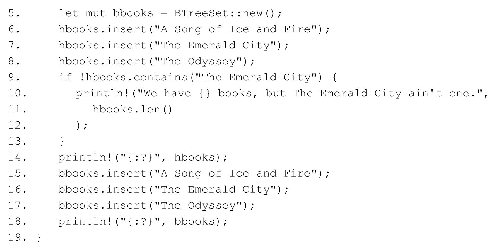{.u54421}
:::

在代码清单2-48中，第14行的hbooks内容的输出顺序是随机的，因为HashSet是无序的。

第18行的bbooks的输出顺序永远是{＂A Song of Ice and Fire＂，＂The Emerald City＂，＂The Odyssey＂}，因为BTreeSet是有序的。

### 2.8.6 优先队列：BinaryHeap {#text00008.html#A74090040-c484-45e4-bbd4-13cf6e6ae96b .title-left}

Rust提供的优先队列是基于**二叉最大堆（Binary Heap）** 实现的，如代码清单2-49所示。

**代码清单2-49：BinaryHeap＜T＞示例**

::: center
{.u54420}
:::

在代码清单2-49中，我们使用BinaryHeap：：new创建了空的最大堆。使用peek方法可以取出堆中的最大值。在代码第4行中，因为堆中没有任何值，所以peek方法取出的是None。

代码第5行到第8行通过迭代将数组中的元素依次push到堆中。然后再通过peek方法取出堆中最大的元素，即93。

标准库还提供了很多操作BinaryHeap的方法，可以查看其文档。

## 2.9 智能指针 {#text00008.html#Afe8d0040-705b-44db-bee3-469d25c8777f .title-left}

智能指针（Smart Pointer）的功能并非Rust独有的，它源自C++语言，Rust将其引入，并使之成为Rust语言中最重要的一种数据结构。

**Rust 中的值默认被分配到栈内存** 。可以通过 **Box ＜T＞** 将值**装箱（在堆内存中分配）** 。Box＜T＞是指向类型为T的堆内存分配值的智能指针。当Box＜T＞超出作用域范围时，将调用其析构函数，销毁内部对象，并自动释放堆中的内存。可以通过解引用操作符来获取Box＜T＞中的T。

**看得出来，Box＜T＞的行为像引用，并且可以自动释放内存，所以我们称其为智能指针。**

Rust中提供了很多智能指针类型，本章只介绍Box＜T＞。使用Box＜T＞可以在堆内存中分配一个值，如代码清单2-50所示。

**代码清单2-50：Box＜T＞在堆内存中分配值的示例**

::: center
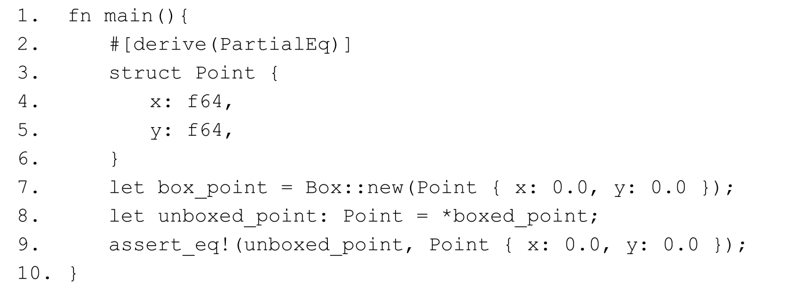{.u54419}
:::

在代码清单2-50中，我们在main函数内部定义了结构体Point，并使用Box：：new方法将其直接装箱，这样它就被分配给了堆内存。然后使用解引用操作符将其解引用，就可以得到内部的Point实例。

通过 Box＜T＞，开发者可以方便无痛地使用堆内存，并且无须手工释放堆内存，可以确保内存安全。第5章会介绍关于智能指针的更多细节。

## 2.10 泛型和trait {#text00008.html#A5dad0041-8417-4f7c-bd06-302211239349 .title-left}

**泛型** 和**trait** 是Rust类型系统中最重要的两个概念。

**泛型** 并不是Rust特有的概念，在很多强类型编程语言中也支持泛型。泛型允许开发者编写一些在使用时才指定类型的代码。泛型，顾名思义，就是泛指的类型。我们在日常的编程中会写一些函数，并可能将其用在很多类型中。如果为每个类型都实现一遍，那么工作量会成倍增加。泛型就是为了解决这个问题的，可以方便代码的复用。

**trait** 同样也不是Rust独有的概念，它借鉴了Haskell的Typeclass。第1章已经介绍过，trait是Rust实现零成本抽象的基石，它有如下机制：

· trait是Rust唯一的接口抽象方式。

· 可以静态生成，也可以动态调用。

· 可以当作标记类型拥有某些特定行为的"标签"来使用。

**简单来说，trait是对类型行为的抽象。**

### 2.10.1 泛型 {#text00008.html#A580713c2-16a0-4765-af13-547beecc42c2 .title-left}

Rust 标准库中定义了很多泛型类型，包括 Option＜T＞、Vec＜T＞、HashMap＜K，V＞以及Box＜T＞等。其中 Option＜T＞就是一种典型的使用了泛型的类型，代码清单 2-51 展示了其定义。

**代码清单2-51：Option＜T＞定义示例**

::: center
{.u54418}
:::

在泛型的类型签名中，通常使用字母T来代表一个泛型。也就是说这个Option＜T＞枚举类型对于任何类型都适用。这样的话，我们就没必要给每个类型都定义一遍Option枚举，比如 Option＜u32＞或 Option＜String＞等。标准库提供的 Option＜T＞类型已经通过 use std：：prelude：：v1：：\*自动引入了每个Rust包中，所以可以直接使用Some（T）或None来表示一个Option＜T＞类型，而不需要写Option：：Some（T）或Option：：None。

Option＜T＞的应用示例如代码清单2-52所示。

**代码清单2-52：Option＜T＞应用示例**

::: center
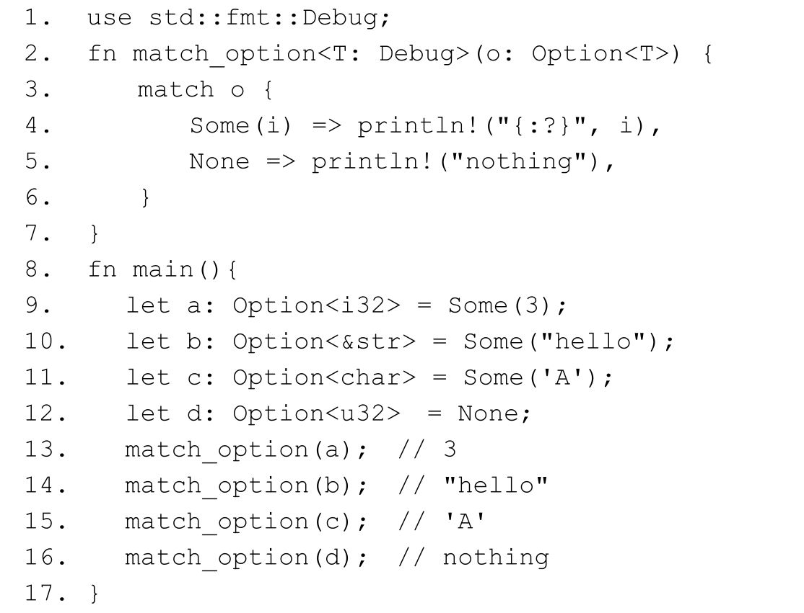{.u54417}
:::

在代码清单2-52中，定义了match_option泛型函数，此处＜T：Debug＞是增加了trait限定的泛型，也就是说，只有实现了Debug trait的类型才适用。只有实现了Debug trait的类型才拥有使用＂{：？}＂格式化打印的行为。

如果去掉Debug限定，编译器会报错＇T＇ cannot be formatted using ＇：？＇，这也充分体现了Rust的类型安全保证。

代码第9行到第12行定义的a、b、c、d这4个变量绑定，分别为Option＜T＞指定了4种具体的类型。Rust编译器会在编译期间自动为这4种类型生成Option＜i32＞、Option＜&str＞、Option＜char＞和Option＜u32＞这4种具体的代码实现，方便开发者直接使用。

### 2.10.2 trait {#text00008.html#Ac782f051-1d93-4586-828e-878262cf08c5 .title-left}

trait和类型的行为有关，trait的示例如代码清单2-53所示。

**代码清单2-53：trait示例**

::: center
{.u54416}
:::

在代码清单2-53中，代码第1行和第2行分别定义了两个结构体Duck和Pig。如果你有编写面向对象语言的经验，你甚至可以将它们看作两个类。

代码第3行到第5行使用trait关键字定义了一个Fly trait。**在Rust中，trait是唯一的接口抽象方式** 。使用trait可以让不同的类型实现同一种行为，也可以为类型添加新的行为。在Fly trait中只包含了一个函数签名fly，包含了参数及参数类型、返回值类型，但没有函数体。函数签名已经基本反映了该函数的所有意图，在返回值类型中甚至还可以包含错误处理相关的信息。这就是类型系统带来的好处之一：提升了可读性。当然，在trait中也可以定义函数的默认实现。

代码第6行到第10行使用impl关键字为Duck实现Fly trait。形如impl Trait for Type的写法在语义上也非常直观，可以表达"为Type实现Trait接口"这样的意思。在该段代码中，对fly函数增加了Duck这个类型的具体实现。因为Duck是可以执行"飞"这个动作的，所以其fly函数的返回值为true。

同理，代码第11行到第15行使用impl关键字为Pig实现Fly trait。但是因为Pig不能执行"飞"这个动作，所以fly函数的返回值为false。

这就是一种接口抽象。Duck和Pig根据自身的类型针对同一个接口进行Fly，实现了不同的行为。Rust中并没有传统面向对象语言中的继承的概念。Rust通过trait将类型和行为明确地进行了区分，充分贯彻了**组合优于继承** 和**面向接口编程** 的编程思想。

代码第16行到第18行实现了fly_static泛型函数，其中泛型参数声明为T，代表任意类型。T：Fly这种语法形式使用Fly trait对泛型T进行行为上的限制，代表实现了Fly trait的类型，或者拥有fly这种行为的类型。这种限制在Rust中称为trait限定（trait bound）。通过trait限定，限制了fly_static泛型函数参数的类型范围。如果有不满足该限定的类型传入，编译器就会识别并报错。

代码第19行到第21行实现了fly_dyn函数，它的参数是一个&Fly类型。&Fly类型是一种动态类型，代表所有拥有fly这种行为的类型。fly_static和fly_dyn的区别是，其函数实现内fly方法的调用机制不同。

代码第22行到第29行的main函数调用了fly_static和fly_dyn函数。

代码第23行通过let声明了变量pig，并指定一个Pig结构体实例。代码第24行使用了assert！断言，用于判断 fly_static：：＜Pig＞（pig）的调用结果是否将会返回 false。其中：：＜Pig＞这样的语法形式用于给泛型函数指定具体的类型，这里调用的是Pig实现的fly方法。

同理，代码第25行和第26行通过fly_static：：＜Duck＞（duck）调用了Duck实现的fly方法，并返回true。

上面这种调用方式在 **Rust** 中叫**静态分发** 。Rust 编译器会为 fly_static：：＜Pig＞（pig）和fly_static：：＜Duck＞（duck）这两个具体类型的调用生成特殊化的代码。也就是说，对于编译器来说，这种抽象并不存在，因为在编译阶段，泛型已经被展开为具体类型的代码。

代码第27行和第28行分别调用了fly_dyn（&Pig）和fly_dyn（&Duck），也可以实现同样的效果。但是 fly_dyn 函数是**动态分发** 方式的，它会在运行时查找相应类型的方法，会带来一定的运行时开销，不过这种开销很小。

通过此例可以看出来，Rust的trait完全符合C++之父提出的**零开销原则** ：如果你不使用某个抽象，就不用为它付出开销（静态分发）；如果你确实需要使用该抽象，可以保证这是开销最小的使用方式（动态分发）。目前在一些基准测试中，Rust 已经拥有了能够和 C/C++竞争的性能。

Rust中内置了很多trait，开发者可以通过实现这些trait来扩展自定义类型的行为。比如，实现了最常用的Debug trait，就可以拥有在println！宏语句中使用{：？}格式进行打印的行为，如代码清单2-54所示。

**代码清单2-54：实现Debug trait**

::: center
{.u54415}
:::

在代码清单2-54中，定义了结构体Point，为了给Point实现Debug trait，必须先使用use引入std：：fmt模块，因为Debug是在其中定义的。

Debug trait中定义了fmt函数，所以只需要为Point实现该函数即可，如代码第6行到第10行所示。之后，main函数就可以直接使用println！宏语句来打印Point结构体实例origin的值。

也可以使用**＃\[derive（Debug）\]** 属性帮助开发者自动实现Debug trait。这类属性本质上属于Rust中的一种宏，在第12章中会详细介绍关于宏的各种细节。

第3章会介绍关于泛型和trait的更多内容。

## 2.11 错误处理 {#text00008.html#Ad4640045-098d-4091-8b59-91ca5c96e07e .title-left}

**Rust 中的错误处理是通过返回 Result＜T，E＞类型的方式进行的** 。Result＜T，E＞类型是Option＜T＞类型的升级版本，同样定义于标准库中。

代码清单2-55展示了Result＜T，E＞的源码实现。

**代码清单2-55：Result＜T，E＞源码实现**

::: center
{.u54414}
:::

Option＜T＞类型表示值存在的可能性，Result＜T，E＞类型表示错误的可能性，其中泛型E代表Error。Result＜T，E＞的使用示例如代码清单2-56所示。

**代码清单2-56：Result＜T，E＞使用示例**

::: center
{.u54413}
:::

在代码清单2-56中，分别定义了Ok（-3）和Err（＂Some error message＂）枚举值，可通过is_ok方法来判断是否为Ok（T）枚举值。

和Option＜T＞类似，可以将Result＜T，E＞作为函数返回值。这样一来，在调用该函数的时候，如果返回类型是 Result＜T，E＞，那么开发者就不得不处理正常和错误这两种情况，这就为程序的健壮性提供了保证。

在**Rust 2015** 版本中，main函数并不能返回Result＜T，E＞。但是在实际开发中，二进制可执行库也需要返回错误，比如，读取文件的时候发生了错误，这时需要正常退出程序。于是在**Rust 2018** 版本中，允许main函数返回Result＜T，E＞了，如代码清单2-57所示。

**代码清单2-57：main函数中返回Result＜T，E＞示例**

::: center
{.u54412}
:::

::: center
{.u54411}
:::

代码清单2-57中的main函数通过调用File：：open方法打开一个文件，后面跟随的问号操作符（？）是一个错误处理的语法糖，它会自动在出现错误的情况下返回 std：：io：：Error。这样就可以在程序发生错误时自动返回错误码，并在退出程序时打印相关的错误信息，方便调试，而不需要开发者手动处理错误了。

关于错误处理的更多细节会在第9章进行详细阐述。

## 2.12 表达式优先级 {#text00008.html#Ad54f0046-9a46-455b-ab97-fc87b5bc82ea .title-left}

在Rust中，一切皆表达式，那么了解表达式的优先级就非常重要了，表2-1将Rust的操作符和表达式按优先级由高到低的顺序列了出来，具有相同优先级的操作符按相关性给定的顺序进行优先级计算。

::: center
表2-1：操作符和表达式的优先级

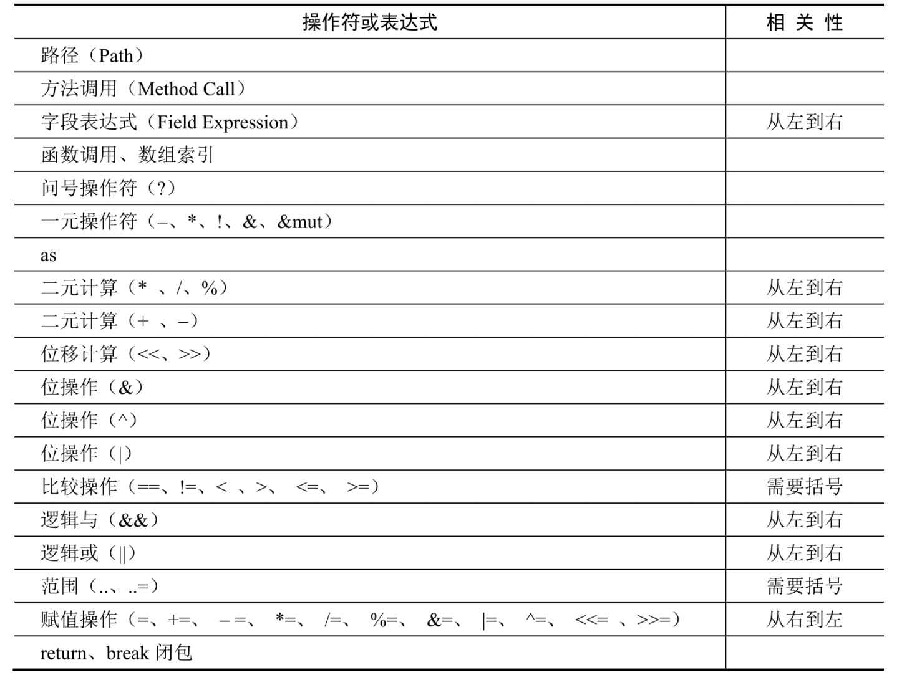{.u54410}
:::

## 2.13 注释与打印 {#text00008.html#Abdbf0046-f00c-46c1-9f22-d4216d2cc031 .title-left}

Rust是一门现代语言，这一点从注释方面也能体现出来。Rust文档的哲学是：**代码即文档，文档即代码** 。

所以Rust支持的注释种类比较丰富，介绍如下。

· 普通的注释。

➢ 使用**//** 对整行注释。

➢ 使用**/\*...\*/** 对区块注释。

· 文档注释，内部支持Markdown标记，也支持对文档中的示例代码进行测试，可以用rustdoc工具生成HTML文档。

➢ 使用**///** 注释可以生成库文档，一般用于函数或结构体的说明，置于说明对象的上方。

➢ 使用//！也可以生成库文档，一般用于说明整个模块的功能，置于模块文件的头部。

代码清单2-58展示了不同种类的注释。

**代码清单2-58：注释示例**

::: center
{.u54409}
:::

代码清单2-58展示了文档注释和普通的注释。使用cargo doc命令可以将文档注释直接生成HTML格式的文档，普通的注释和其他语言中的注释没什么区别。

读者也可以参考本书的随书源码，其中大量使用了文档注释。另外Rust还支持文档测试，在第9章会详细介绍。

在日常开发中，我们经常会使用println！宏语句来进行格式化打印，这对于调试代码非常重要。println！宏中的格式化形式列表如下：

· nothing代表Display，比如println！（＂{}＂，2）。

·**？** 代表Debug，比如println！（＂{：？}＂，2）。

· **o** 代表八进制，比如println！（＂{：o}＂，2）。

· **x** 代表十六进制小写，比如println！（＂{：x}＂，2）。

· **X** 代表十六进制大写，比如println！（＂{：X}＂，2）。

· **p** 代表指针，比如println！（＂{：p}＂，2）。

· **b** 代表二进制，比如println！（＂{：b}＂，2）。

· **e** 代表指数小写，比如println！（＂{：e}＂，2）。

· **E** 代表指数大写，比如println！（＂{：E}＂，2）。

## 2.14 小结 {#text00008.html#A083b0048-8361-44ae-a371-8a144dcfb684 .title-left}

Rust 是一门表达式语言，Rust 中一切皆表达式。在 Rust 的学习中，掌握表达式的求值机制很重要。

本章首先介绍了Rust中表达式的分类和性质，从而帮助读者掌握Rust中表达式的求值机制。不管Rust有多少种表达式，它们都包含在此分类中，并符合这些性质。同时也介绍了什么是常量表达式和CTFE机制，以及Rust中的CTFE的发展方向。

其中值得注意的是，if流程控制在Rust中也是表达式，所以Rust不需要单独提供？：条件表达式。当处理一些Option类型的时候，可以用if let或while let表达式来简化代码。然后通过一些示例对循环表达式做了深入探讨，揭示了Rust编译期对while循环条件不进行求值的事实，这同样也是因为受到了CTFE功能的限制。所以如果需要使用无限循环，则要使用loop循环。

本章还依次介绍了Rust中的一些重要的语法要素，目的是让读者了解Rust的语法风格，通过对这些概念和示例的掌握，消除对Rust语言的陌生感，从而为后面的深入学习做好准备。

------------------------------------------------------------------------

[\[1\]](#text00008.html#n939C00332F5548738A747AF0AA59E7CAs){#text00008.html#n939C00332F5548738A747AF0AA59E7CA} 该特性在RFC1909中被描述。

[]{#text00009.html}
