# 第3章 类型系统 {#text00009.html#A94bb2754-a86f-4838-8885-f163e89f33a0 .title-left}

本性决定行为，本性取决于行为。

众所周知，计算机以二进制的形式来存储信息。对于计算机而言，不管什么样的信息，都只是0和1的排列，所有的信息对计算机来说只不过是字节序列。作为开发人员，如果想要存储、表示和处理各种信息，直接使用0和1必然会产生巨大的心智负担，所以，类型应运而生。类型于20世纪50年代被FORTRAN语言引入，历经诸多高级语言的洗礼，其相关的理论和应用已经发展得非常成熟。直到现代，类型已经成为了各大编程语言的核心基础。

## 3.1 通用概念 {#text00009.html#Afa6f0049-0a2b-4377-9c2c-9acd37489509 .title-left}

所谓类型，其实就是对表示信息的值进行的细粒度的区分。比如整数、小数、文本等，粒度再细一点，就是布尔值、符号整型值、无符号整型值、单精度浮点数、双精度浮点数、字符和字符串，甚至还有各种自定义的类型。不同的类型占用的内存不同。与直接操作比特位相比，直接操作类型可以更安全、更有效地利用内存。例如，在Rust语言中，如果你创建一个u32类型的值，Rust会自动分配4个字节来存储该值。

计算机不只是用来存储信息的，它还需要处理信息。这就必然会面临一个问题：不同的类型该如何计算？因此需要对这些基本的类型定义一系列的组合、运算、转换等方法。如果把编程语言看作虚拟世界的话，那么类型就是构建这个世界的基本粒子，这些类型粒子通过各种组合、运算、转换等"物理化学反应"，造就了此世界中的各种"事物"。类型之间的纷繁复杂的交互形成了类型系统，类型系统是编程语言的基础和核心，因为编程语言的目的就是存储和处理信息。不同编程语言之间的区别就在于如何存储和处理信息。

其实在计算机科学中，对信息的存储和处理不止类型系统这一种方式，还有其他的一些理论框架，只不过类型系统是最轻量、最完善的一种方式。**在类型系统中，一切皆类型** 。**基于类型定义的一系列组合、运算和转换等方法，可以看作类型的行为** 。类型的行为决定了类型该如何计算，同时也是一种约束，有了这种约束才可以保证信息被正确处理。

### 3.1.1 类型系统的作用 {#text00009.html#Aad320049-ce3b-4f34-81fa-7abcf343778c .title-left}

类型系统是一门编程语言不可或缺的部分，它的优势有以下几个方面。

· **排查错误。** 很多编程语言都会在编译期或运行期进行类型检查，以排查违规行为，保证程序正确执行。如果程序中有类型不一致的情况，或有未定义的行为发生，则可能导致错误的产生。尤其是对于静态语言来说，能在编译期排查出错误是一个很大的优势，这样可以及早地处理问题，而不必等到运行后系统崩溃了再解决。

· **抽象。** 类型允许开发者在更高层面进行思考，这种抽象能力有助于强化编程规范和工程化系统。比如，面向对象语言中的类就可以作为一种类型。

· **文档。** 在阅读代码的时候，明确的类型声明可以表明程序的行为。

· **优化效率。** 这一点是针对静态编译语言来说的，在编译期可以通过类型检查来优化一些操作，节省运行时的时间。

· **类型安全。**

➢ **类型安全的语言可以避免类型间的无效计算** ，比如可以避免3/＂hello＂这样不符合算术运算规则的计算。

➢ **类型安全的语言还可以保证内存安全** ，避免诸如空指针、悬垂指针和缓存区溢出等导致的内存安全问题。

➢ **类型安全的语言也可以避免语义上的逻辑错误** ，比如以毫米为单位的数值和以厘米为单位的数值虽然都是以整数来存储的，但可以用不同的类型来区分，避免逻辑错误。

虽然类型系统有这么多优点，但并非所有的编程语言都能百分百拥有这些优点，这与它们的类型系统的具体设计和实现有关系。

### 3.1.2 类型系统的分类 {#text00009.html#A8579004a-7454-4a12-a64d-11a6e13c61cd .title-left}

在编译期进行类型检查的语言属于**静态类型** ，在运行期进行类型检查的语言属于**动态类型** 。如果一门语言不允许类型的自动隐式转换，在强制转换前不同类型无法进行计算，则该语言属于**强类型** ，反之则属于**弱类型** ^[\[1\]](#text00009.html#n553B9D8EA0044846A791CAAFC2270E74){#text00009.html#n553B9D8EA0044846A791CAAFC2270E74s}^ 。

**静态类型的语言能在编译期对代码进行静态分析，依靠的就是类型系统** 。我们以数组越界访问的问题为例来说明。有些静态语言，如C和C++，在编译期并不检查数组是否越界访问，运行时可能会得到难以意料的结果，而程序依旧正常运行，这属于类型系统中未定义的行为，所以它们不是类型安全的语言。而**Rust语言在编译期就能检查出数组是否越界访问** ，并给出警告，让开发者及时修改，如果开发者没有修改，那么在运行时也会抛出错误并退出线程，而不会因此去访问非法的内存，从而保证了运行时的内存安全，所以 **Rust 是类型安全的语言** 。强大的类型系统也可以对类型进行**自动推导** ，因此一些静态语言在编写代码的时候不用显式地指定具体的类型，比如 Haskell 就被称为隐式静态类型。Rust 语言的类型系统受Haskell启发，也可以自动推导，但不如Haskell强大。在Rust中大部分地方还是需要显式地指定类型的，类型是Rust语法的一部分，因此**Rust属于显式静态类型** 。

动态类型的语言只能在运行时进行类型检查，但是当有数组越界访问时，就会抛出异常，执行线程退出操作，而不是给出奇怪的结果。所以一些动态语言也是类型安全的，比如Ruby和Python语言。在其他语言中作为基本类型的整数、字符串、布尔值等，在Ruby和Python语言中都是对象。实际上，也可将对象看作类型，Ruby和Python语言在运行时通过一种名为Duck Typing的手段来进行运行时类型检查，以保证类型安全。在Ruby和Python语言中，对象之间通过消息进行通信，如果对象可以响应该消息，则说明该对象就是正确的类型。

对象是什么样的类型，决定了它有什么样的行为；反过来，对象在不同上下文中的行为，也决定了它的类型。这其实是一种**多态性** 。

### 3.1.3 类型系统与多态性 {#text00009.html#A4cbd004b-4c73-4335-94c6-669f6ddca6e9 .title-left}

如果一个类型系统允许一段代码在不同的上下文中具有不同的类型，这样的类型系统就叫作**多态类型系统** 。对于静态类型的语言来说，多态性的好处是可以在不影响类型丰富的前提下，为不同的类型编写通用的代码。

现代编程语言包含了三种多态形式：**参数化多态** （**Parametric polymorphism** ）、**Ad-hoc多态** （**Ad-hoc polymorphism** ）和**子类型多态** （**Subtype polymorphism** ）。如果按多态发生的时间来划分，又可分为**静多态** （**Static Polymorphism** ）和**动多态** （**Dynamic Polymorphism** ）。静多态发生在编译期，动多态发生在运行时。参数化多态和 Ad-hoc 多态一般是静多态，子类型多态一般是动多态。静多态牺牲灵活性获取性能，动多态牺牲性能获取灵活性。动多态在运行时需要查表，占用较多空间，所以一般情况下都使用静多态。Rust语言同时支持静多态和动多态，静多态就是一种零成本抽象。

**参数化多态实际就是指泛型** 。很多时候函数或数据类型都需要适用于多种类型，以避免大量的重复性工作。泛型使得语言极具表达力，同时也能保证静态类型安全。

**Ad-hoc多态也叫特定多态** 。Ad-hoc短语源自拉丁语系，用于表示一种特定情况。**Ad-hoc多态是指同一种行为定义，在不同的上下文中会响应不同的行为实现** 。Haskell 语言中使用Typeclass来支持Ad-hoc多态，Rust受Haskell启发，使用trait来支持Ad-hoc多态。所以，Rust的trait系统的概念类似于Haskell中的Typeclass。

子类型多态的概念一般用在面向对象语言中，尤其是Java语言。Java语言中的多态就是子类型多态，它代表一种包含关系，父类型的值包含了子类型的值，所以子类型的值有时也可以看作父类型的值，反之则不然。而 Rust语言中并没有类似Java 中的继承的概念，所以也不存在子类型多态。所以，**Rust中的类型系统目前只支持参数化多态和Ad-hoc多态，也就是，泛型和trait** 。

## 3.2 Rust类型系统概述 {#text00009.html#Aeac8004b-415b-4ec3-a957-d1c3bd5832d4 .title-left}

Rust是一门强类型且类型安全的静态语言。Rust中一切皆表达式，表达式皆有值，值皆有类型。所以可以说，**Rust中一切皆类型** 。

除了一些基本的原生类型和复合类型，Rust把作用域也纳入了类型系统，这就是第4章将要学到的生命周期标记。还有一些表达式，有时有返回值，有时没有返回值（也就是只返回单元值），或者有时返回正确的值，有时返回错误的值，Rust 将这类情况也纳入了类型系统，也就是Option＜T＞和Result＜T，E＞这样的可选类型，从而强制开发人员必须分别处理这两种情况。一些根本无法返回值的情况，比如线程崩溃、break或continue等行为，也都被纳入了类型系统，这种类型叫作never类型。可以说，Rust的类型系统基本囊括了编程中会遇到的各种情况，一般情况下不会有未定义的行为出现，所以说，Rust是类型安全的语言。

### 3.2.1 类型大小 {#text00009.html#Aec09004b-4ecb-486d-8ee5-8597c3111cc0 .title-left}

编程语言中不同的类型本质上是内存占用空间和编码方式的不同，Rust也不例外。Rust中没有GC，内存首先由编译器来分配，Rust代码被编译为LLVM IR，其中携带了内存分配的信息。**所以编译器需要事先知道类型的大小，才能分配合理的内存** 。

**可确定大小类型和动态大小类型**

Rust中绝大部分类型都是在**编译期可确定大小的类型（Sized Type）** ，比如原生整数类型u32固定是4个字节，u64固定是8个字节，等等，都是可以在编译期确定大小的类型。然而，Rust也有少量的**动态大小的类型（Dynamic Sized Type，DST）** ，比如str类型的字符串字面量，编译器不可能事先知道程序中会出现什么样的字符串，所以对于编译器来说，str类型的大小是无法确定的。对于这种情况，Rust提供了引用类型，因为引用总会有固定的且在编译期已知的大小。字符串切片&str就是一种引用类型，它由指针和长度信息组成，如图3-1所示。

::: center
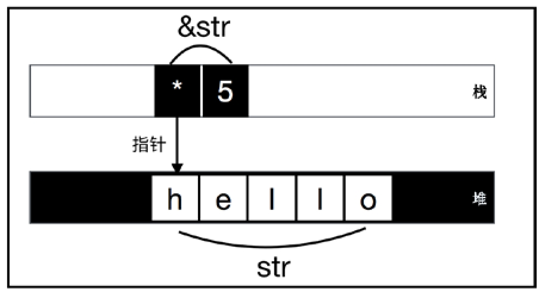{.u54408}

图3-1：&str由指针和长度信息组成
:::

&str存储于栈上，str字符串序列存储于堆上。这里的堆和栈是指不同的内存空间，在第4章会详细介绍。&str 由两部分组成：**指针** 和**长度信息** ，如代码清单3-1所示。其中指针是固定大小的，存储的是 str 字符串序列的起始地址，长度信息也是固定大小的整数。这样一来，&str就变成了可确定大小的类型，编译器就可以正确地为其分配栈内存空间，str也会在运行时在堆上开辟内存空间。

**代码清单3-1：&str的组成部分**

::: center
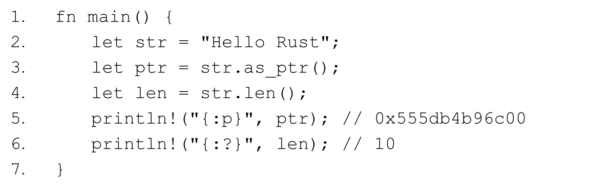{.u54407}
:::

代码清单3-1声明了字符串字面量str，通过as_ptr（）和len（）方法，可以分别获取该字符串字面量存储的地址和长度信息。这种包含了动态大小类型地址信息和携带了长度信息的指针，叫作**胖指针（Fat Pointer）** ，所以&str是一种胖指针。

与字符串切片同理，Rust中的数组\[T\]是动态大小类型，编译器难以确定它的大小。如代码清单3-2所示是将数组直接作为函数参数的情况。

**代码清单3-2：将数组直接作为函数参数**

::: center
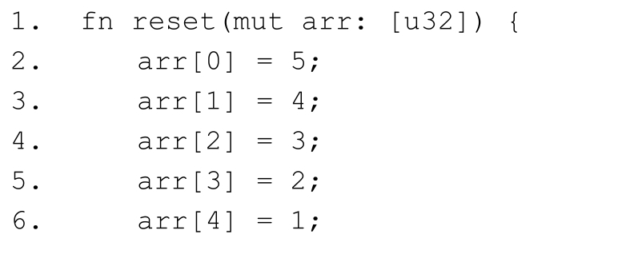{.u54406}
:::

::: center
{.u54405}
:::

代码清单3-2编译会报错：

::: center
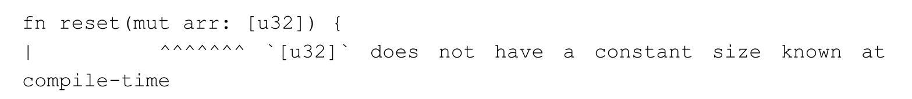{.u54404}
:::

意思是，编译器无法确定参数\[u32\]类型的大小。有两种方式可以修复此错误，第一种方式是使用\[u32；5\]类型，如代码清单3-3所示。

**代码清单3-3：函数参数使用\[u32；5\]类型**

::: center
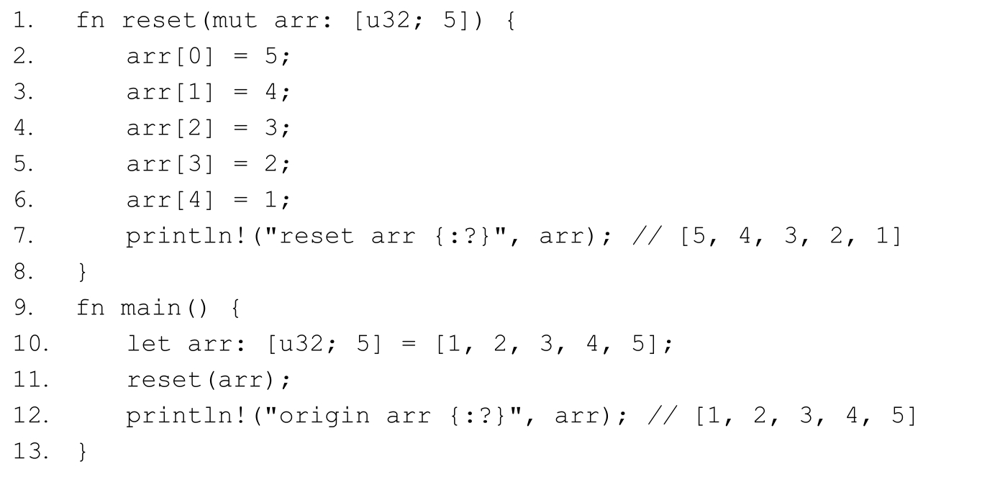{.u54403}
:::

代码清单3-3能够正常编译，从输出结果可以看出来，修改的数组并未影响原来的数组。这是因为u32类型是可复制的类型，实现了Copy trait，所以整个数组也是可复制的。所以当数组被传入函数中时就会被复制一份新的副本。这里值得注意的是，\[u32\]和\[u32；5\]是两种不同的类型。

另外一种解决代码清单 3-2 编译错误的方式是使用胖指针，类似&str，这里只需要将参数类型改为&mut \[u32\]即可。&mut \[u32\]是对\[u32\]数组的借用，会生成一个数组切片&\[u32\]，它会携带长度信息，如代码清单3-4所示。

**代码清单3-4：使用&mut \[u32\]作为参数类型**

::: center
{.u54402}
:::

::: center
{.u54401}
:::

代码清单 3-4 中使用了&mut \[u32\]，它是可变借用，&\[u32\]是不可变借用。因为这里要修改数组元素，所以使用可变借用。从输出的结果可以看出，胖指针&mut \[u32\]包含了长度信息。将引用当作函数参数，意味着被修改的是原数组，而不是最新的数组，所以原数组在reset之后也发生了改变。

代码清单3-5比较了&\[u32；5\]和&mut \[u32\]两种类型的空间占用情况。

**代码清单3-5：比较&\[u32；5\]和&mut \[u32\]两种类型的空间占用情况**

::: center
{.u54400}
:::

代码清单3-5中的std：：mem：：size_of＜&\[u32；5\]＞（）函数可以返回类型的字节数。输出结果分别为8和16。&\[u32；5\]类型为普通指针，占8个字节；&mut \[u32\]类型为胖指针，占16个字节。可见，整整多出了一倍的占用空间，这也是称其为胖指针的原因。

**零大小类型**

除了可确定大小类型和DST类型，Rust还支持**零大小类型（Zero Sized Type，ZST）** ，比如单元类型和单元结构体，大小都是零。代码清单3-6展示了一组零大小的类型。

**代码清单3-6：一组零大小的类型示例**

::: center
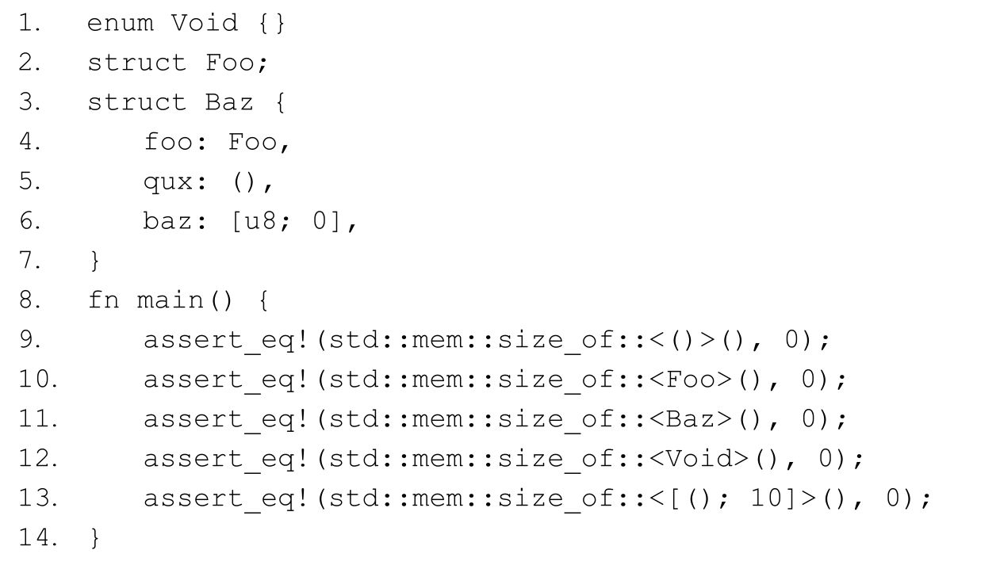{.u54399}
:::

代码清单3-6编译输出的类型大小均为零。所以，**单元类型和单元结构体大小为零，由单元类型组成的数组大小也为零。ZST类型的特点是，它们的值就是其本身，运行时并不占用内存空间。** ZST类型代表的意义正是"空"。

代码清单3-7展示了使用单元类型来查看数据类型的一个技巧。

**代码清单3-7：使用单元类型查看数据类型**

::: center
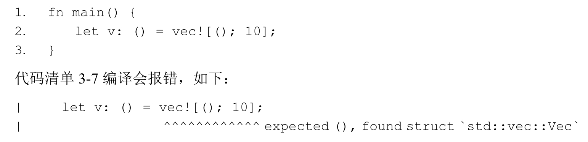{.u54398}
:::

编译器会提示：期望的是单元类型，这是因为代码里直接指定了单元类型，但是却发现了std：：vec：：Vec类型。这样我们就知道了右值vec！\[（）；10\]是向量类型。

代码清单3-8展示了一种迭代技巧，使用Vec＜（）＞迭代类型。

**代码清单3-8：使用Vec＜（）＞迭代类型**

::: center
{.u54397}
:::

在代码清单3-8中，使用了Vec＜（）＞类型，使用单元类型制造了一个长度为10的向量。在一些只需要迭代次数的场合中，使用这种方式能获得较高的性能。因为Vec内部迭代器中会针对ZST类型做一些优化。

另外一个使用单元类型的示例是在第2章中介绍过的Rust官方标准库中的HashSet＜T＞和BTreeSet＜T＞。它们其实只是把HashMap＜K，T＞换成了HashMap＜K，（）＞，然后就可以共用HashMap＜K，T＞之前的代码，而不需要再重新实现一遍HashSet＜T＞了。

**底类型**

底类型（Bottom Type）是源自类型理论的术语，它其实是第2章介绍过的never类型。它的特点是：

· 没有值。

· 是其他任意类型的子类型。

**如果说ZST类型表示"空"的话，那么底类型就表示"无"。** 底类型无值，而且它可以等价于任意类型，有点无中生有之意。

Rust中的**底类型用叹号（** ！**）** 表示。此类型也被称为Bang Type。Rust中有很多种情况确实没有值，但为了类型安全，必须把这些情况纳入类型系统进行统一处理。这些情况包括：

· **发散函数** （**Diverging Function** ）

· continue和break关键字

· loop循环

· **空枚举** ，比如enum Void{}

先来看前三种情况。发散函数是指会导致线程崩溃的 panic！（＂This function never returns！＂），或者用于退出函数的 std：：process：：exit，这类函数永远都不会有返回值。continue和break也是类似的，它们只是表示流程的跳转，并不会返回什么。loop循环虽然可以返回某个值，但也有需要无限循环的时候。

Rust中if语句是表达式，要求所有分支类型一致，但是有的时候，分支中可能包含了永远无法返回的情况，属于底类型的一种应用，如代码清单3-9所示。

**代码清单3-9：底类型的应用**

::: center
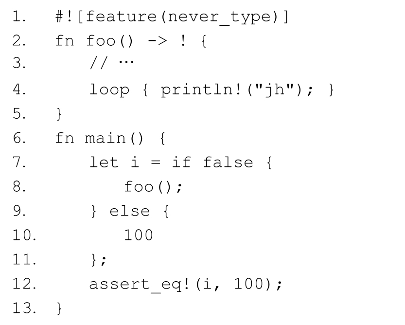{.u54396}
:::

代码清单3-9的if条件表达式中，foo函数返回！，而else表达式返回整数类型，但是编译可以正常通过，假如把else表达式中的整数类型换成字符串或其他类型，编译也可以通过。

空枚举，比如 enum Void{}，完全没有任何成员，因而无法对其进行变量绑定，不知道如何初始化并使用它，所以它也是底类型。代码清单3-10展示了空枚举的一种用法。

**代码清单3-10：空枚举的用法（编译无法通过，还在完善中）**

::: center
{.u54395}
:::

Rust中使用Result类型来进行错误处理，强制开发者处理Ok和Err两种情况，但是有时可能永远没有Err，这时使用enum Void{}就可以避免处理Err的情况。当然这里也可以用if let语句处理，但是这里为了说明空枚举的用法故意这样使用。

但是可惜的是，当前版本的Rust还不支持上面的语法，编译会报错。不过Rust团队还在持续完善中，在不久的将来Rust就会支持此用法。

底类型将上述几种特殊情况纳入了类型系统，以便让Rust可以统一进行处理，从而保证了类型安全。

### 3.2.2 类型推导 {#text00009.html#Aaa400050-88a0-49fd-ba29-f811451b3074 .title-left}

类型标注在Rust中属于语法的一部分，所以Rust属于显式类型语言。Rust支持类型推断，但其功能并不像Haskell那样强大，**Rust只能在局部范围内进行类型推导** 。

代码清单3-11展示了Rust中的类型推导。

**代码清单3-11：类型推导**

::: center
{.u54394}
:::

在代码清单3-11中，第5行和第6行声明了两个变量a和b，并没有标注类型。但是传入sum函数中却可以正常运行，这代表Rust自动推导了a和b的类型。代码第8行声明了一个u8类型elem，第9行创建了一个空的向量，类型为Vec＜\_＞，可以通过代码清单3-7的方法来查看此类型。第10行用push方法将elem插入vec中，此时vec的类型为Vec＜u8＞。

**Turbofish操作符**

当Rust无法从上下文中自动推导出类型的时候，编译器会通过错误信息提示你，请求你添加类型标注，代码清单3-12展示了这种情况。

**代码清单3-12：Rust无法根据上下文自动推导出类型的情况**

::: center
{.u54393}
:::

编译代码清单3-12，会给出如下错误信息：

::: center
{.u54392}
:::

代码清单3-12是想把字符串＂1＂转换为整数类型1，但是parse方法其实是一个泛型方法，当前无法自动推导类型，所以Rust编译器无法确定到底要转换成哪种类型的整数，是u32还是i32呢？毕竟Rust中整数类型很丰富。所以这里就需要直接给出明确的类型标注信息了，如代码清单3-13所示。

**代码清单3-13：添加明确的类型标注信息**

::: center
{.u54391}
:::

Rust还提供了一种标注类型的方法，用于方便地在值表达式中直接标注类型，如代码清单3-14所示。

**代码清单3-14：另一种标注类型的方法**

::: center
{.u54390}
:::

在代码清单3-14中，使用了parse：：＜i32＞（）这样的形式为泛型函数标注类型，这就避免了代码清单3-13第3行的变量声明。很多时候并不需要声明太多变量，代码看上去也能更加紧凑。这种标注类型（**：：＜＞** ）的形式就叫作**turbofish操作符** 。

**类型推导的不足**

目前看来，Rust的类型推导还不够强大。代码清单3-15展示了另外一种类型推导的缺陷。

**代码清单3-15：类型推导缺陷**

::: center
{.u54389}
:::

代码清单3-15中的is_positive（）是整数类型实现的用于判断正负的方法。但是当前Rust编译时此代码会出现下面的错误：

error\[E0599\]:no method named\`is_positive\`found for type\`{integer}\`in the current scope

这里出现的**{integer}** 类型并非真实类型，它只是被用于错误信息中，表明此时编译器已经知道变量a是整数类型，但并未推导出变量a的真正类型，因为此时没有足够的上下文信息帮助编译器进行推导。所以在用Rust编程的时候，应尽量显式声明类型，这样可以避免一些麻烦。

## 3.3 泛型 {#text00009.html#Aabdf0052-ee35-47ef-ae71-0c500e528223 .title-left}

泛型（Generic）是一种参数化多态。使用泛型可以编写更为抽象的代码，减少工作量。简单来说，泛型就是把一个泛化的类型作为参数，单个类型就可以抽象化为一簇类型。在第2章中介绍过的Box＜T＞、Option＜T＞和Result＜T，E＞等，都是泛型类型。

### 3.3.1 泛型函数 {#text00009.html#A078c0052-2f73-4218-a3d8-a25be7a7a9f4 .title-left}

除了定义类型，泛型也可以应用于函数中，代码清单3-16就是一个泛型函数的示例。

**代码清单3-16：泛型函数**

::: center
{.u54388}
:::

也可以在结构体中使用泛型，如代码清单3-17所示。

**代码清单3-17：泛型结构体**

::: center
{.u54387}
:::

与枚举类型和函数一样，结构体名称旁边的＜T＞叫作**泛型声明** 。**泛型只有被声明之后才可以被使用** 。在为泛型结构体实现具体方法的时候，也需要声明泛型类型，如代码清单3-18所示。

**代码清单3-18：为泛型结构体实现具体方法**

::: center
{.u54386}
:::

注意看第3行代码中的impl＜T＞，此处必须声明泛型T。Rust标准库提供的各种容器类型大多是泛型类型。比如向量Vec＜T＞就是一个泛型结构体，代码清单3-19展示了其在Rust源码中的实现。

**代码清单3-19：标准库中的Vec＜T＞源码**

::: center
{.u54385}
:::

Rust中的泛型属于静多态，它是一种编译期多态。在编译期，不管是泛型枚举，还是泛型函数和泛型结构体，都会被**单态化（Monomorphization）** 。单态化是编译器进行静态分发的一种策略。以代码清单3-16中的泛型函数为例，**单态化意味着编译器要将一个泛型函数生成两个具体类型对应的函数** ，代码清单3-16等价于代码清单3-20。

**代码清单3-20：编译期单态化的泛型函数**

::: center
{.u54384}
:::

泛型及单态化是Rust的最重要的两个功能。**单态化静态分发的好处是性能好，没有运行时开销；缺点是容易造成编译后生成的二进制文件膨胀** 。这个缺点并不影响使用Rust编程。但是需要明白单态化机制，在平时的编程中注意二进制的大小，如果变得太大，可以根据具体的情况重构代码来解决问题。

### 3.3.2 泛型返回值自动推导 {#text00009.html#A87000054-8733-4801-9986-35924b78445b .title-left}

编译器还可以对泛型进行自动推导。代码清单 3-21 展示了对泛型返回值类型的自动推导。

**代码清单3-21：泛型返回值类型的自动推导**

::: center
{.u54383}
:::

代码清单3-21中定义了两个元组结构体Foo和Bar，分别为它们实现了Inst trait中定义的new方法。然后定义了泛型函数foobar，以及函数内调用泛型T的new方法。

代码第22行调用foobar函数，并指定其返回值的类型为Foo，那么Rust就会根据该类型自动推导出要调用Foo：：new方法。同理，代码第24行指定了foobar函数的返回值应该为Bar类型，那么Rust就自动推导出应该调用Bar：：new方法。这为日常的编程带来了足够的方便。

## 3.4 深入trait {#text00009.html#Ad6c10054-cf7b-4dd8-bfe6-57e5834d8fcc .title-left}

可以说trait是Rust的灵魂。Rust中所有的抽象，比如接口抽象、OOP范式抽象、函数式范式抽象等，均基于trait来完成。同时，trait也保证了这些抽象几乎都是运行时零开销的。

那么，到底什么是trait？从类型系统的角度来说，trait是Rust对Ad-hoc多态的支持。从语义上来说，trait是在行为上对类型的约束，这种约束可以让trait有如下4种用法：

· **接口抽象** 。接口是对类型行为的统一约束。

· **泛型约束** 。泛型的行为被trait限定在更有限的范围内。

· **抽象类型** 。在运行时作为一种间接的抽象类型去使用，动态地分发给具体的类型。

· **标签trait** 。对类型的约束，可以直接作为一种"标签"使用。

下面依次介绍trait的这4种用法。

### 3.4.1 接口抽象 {#text00009.html#A86e30055-0f2a-4e3a-8f10-b531b55e576c .title-left}

trait最基础的用法就是进行接口抽象，它有如下特点：

· 接口中可以定义方法，并支持默认实现。

· 接口中不能实现另一个接口，但是接口之间可以继承。

· 同一个接口可以同时被多个类型实现，但不能被同一个类型实现多次。

· 使用impl关键字为类型实现接口方法。

· 使用trait关键字来定义接口。

图3-2形象地展示了trait接口抽象。

::: center
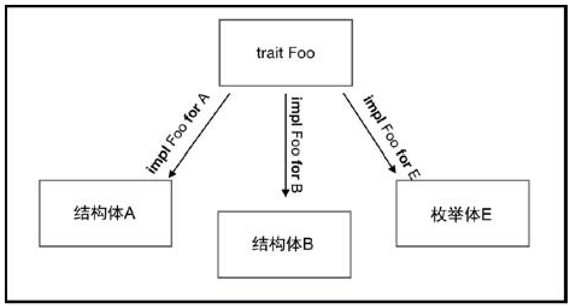{.u54382}

图3-2：trait作为接口抽象的形象表示
:::

在第2章的代码清单2-53中定义的Fly trait就是一个典型的接口抽象。类型Duck和Pig均实现了该trait，但具体的行为各不相同。**这正是一种 Ad-hoc 多态：同一个trait，在不同的上下文中实现的行为不同** 。为不同的类型实现 trait，属于一种**函数重载** ，也可以说函数重载就是一种Ad-hoc多态。

**关联类型**

事实上，Rust中的很多操作符都是基于trait来实现的。比如加法操作符就是一个trait，加法操作不仅可以针对整数、浮点数，也可以针对字符串。

那么如何对这个加法操作进行抽象呢？除了两个相加的值的类型，还有返回值类型，这三个类型不一定相同。我们首先能想到的一个方法就是结合泛型的trait，如代码清单3-22所示。

**代码清单3-22：利用泛型trait实现加法抽象**

::: center
{.u54381}
:::

::: center
{.u54380}
:::

代码清单3-22中定义了Add trait。它包含了两个类型参数：RHS和Output，分别代表加法操作符右侧的类型和返回值的类型。在该trait内定义的add方法签名中，以self为参数，代表实现该trait的类型。

接下来为i32和u32类型分别实现了Add trait。

代码第4行到第8行表示为i32类型实现Add，并且要求只能和i32类型相加，且返回值也是i32类型。

代码第9行到第13行表示为u32类型实现Add，并且要求只能和u32类型相加，但是返回值是i32类型。

然后在main函数中分别声明了i32和u32两组数字，分别让其相加，得到了预期的结果。

使用trait泛型来实现加法抽象，看上去好像没什么问题，但是仔细考虑一下，就会发现它有一个很大的问题。一般来说，对于加法操作要考虑以下两种情况：

· 基本数据类型，比如i32和i32类型相加，出于安全考虑，结果必然还是i32类型。

· 也可以对字符串进行加法操作，但是Rust中可以动态增加长度的只有String类型的字符串，所以一般是String类型的才会实现Add，其返回值也必须是String类型。但是加法操作符右侧也可以是字符串字面量。所以，面对这种情况，String 的加法操作还必须实现Add＜&str，String＞。

不管是以上两种情况中的哪一种，Add的第二个类型参数总是显得有点多余。所以，Rust标准库中定义的Add trait使用了另外一种写法。

代码清单3-23展示了Rust标准库中Add trait的定义。

**代码清单3-23：标准库Add trait的定义**

::: center
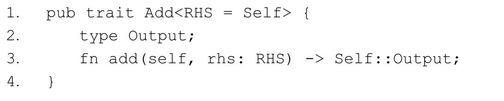{.u54379}
:::

代码清单3-23中同样使用了泛型trait，但是与代码清单3-22的区别在于，它将之前的第二个类型参数去掉了。取而代之的是type定义的Output，以这种方式定义的类型叫作**关联类型** 。而Add＜RHS=Self＞这种形式表示为类型参数RHS指定了默认值Self。Self是每个trait都带有的**隐式类型参数** ，代表实现当前trait的具体类型。

当代码中出现操作符"+"的时候，Rust就会自动调用操作符左侧的操作数对应的add（）方法，去完成具体的加法操作，也就是说"+"操作与调用add（）方法是等价的，如图3-3所示。

::: center
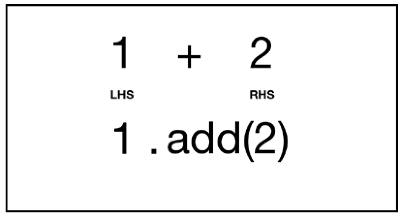{.u54378}

图3-3："+"操作等价于调用add（）方法
:::

代码清单3-24展示了标准库中为u32类型实现Add trait来定义加法的源码，为了突出重点，这里删减了一些不必要的内容。

**代码清单3-24：标准库中为u32类型实现Add trait**

::: center
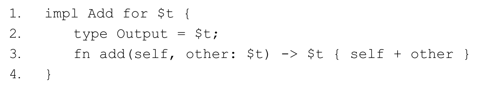{.u54377}
:::

因为Rust源码为u32实现Add trait的操作是用宏来完成的，所以代码清单3-24中出现了\$t这样的符号，在第12章会讲到关于宏的更多细节。当前这里的\$t可以看作u32类型，如代码清单3-25所示。

**代码清单3-25：可以将上面的\$t看作u32类型**

::: center
{.u54376}
:::

这里的关联类型是u32，因为两个u32整数相加结果必然还是u32整数。如果实现Add trait时并未指明泛型参数的具体类型，则默认为Self类型，也就是u32类型。

除了整数，String类型的字符串也支持使用加号进行连接。代码清单3-26展示了为String类型实现Add trait的源码。同样，为了突出重点，我们进行了删减。

**代码清单3-26：标准库中为String类型实现Add trait**

::: center
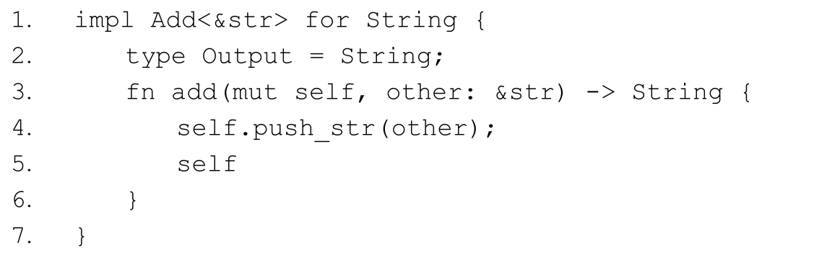{.u54375}
:::

代码清单3-26中的impl Add＜&str＞指明了泛型类型为&str，并没有使用Self默认类型参数，这表明对于String类型字符串来说，加号右侧的值类似&str类型，而非String类型。关联类型Output指定为String类型，意味着加法返回的是String类型。代码清单3-27展示了String字符串的加法运算。

**代码清单3-27：String类型字符串的加法运算**

::: center
{.u54374}
:::

在代码清单3-27中，变量a和b为&str类型，所以将二者相加时，必须将a转换为String类型。

综上所述，使用关联类型能够使代码变得更加精简，同时也对方法的输入和输出进行了很好的隔离，使得代码的可读性大大增强。**在语义层面上，使用关联类型也增强了trait表示行为的这种语义，因为它表示了和某个行为（trait）相关联的类型。在工程上，也体现出了高内聚的特点。**

**trait一致性**

既然Add是trait，那么就可以通过impl Add的功能来实现操作符重载的功能。在Rust中，通过上面对Add trait的分析就可以知道，u32和u64类型是不能直接相加的。代码清单3-28尝试重载整数的加法操作，实现u32和u64类型直接相加。

**代码清单3-28：尝试重载整数的加法操作**

::: center
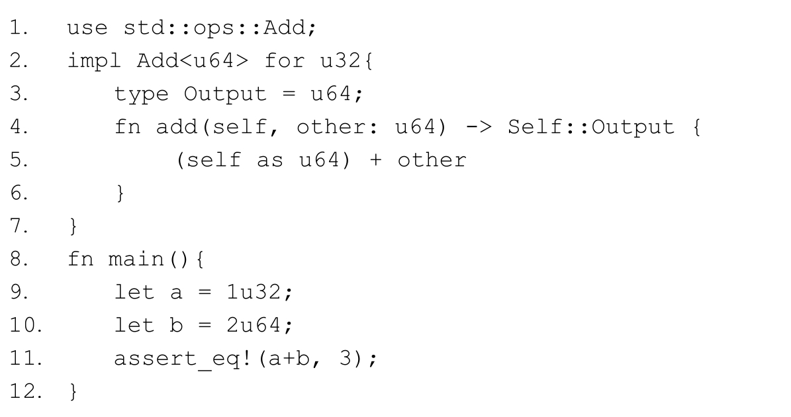{.u54373}
:::

代码清单3-28编译会出错：

::: center
{.u54372}
:::

这是因为Rust遵循一条重要的规则：**孤儿规则（Orphan Rule）** 。孤儿规则规定，**如果要实现某个trait，那么该trait和要实现该trait的那个类型至少有一个要在当前crate中定义** 。在代码清单3-28中，Add trait和u32、u64都不是在当前crate中定义的，而是定义于标准库中的。如果没有孤儿规则的限制，标准库中u32类型的加法行为就会被破坏性地改写，导致所有使用u32类型的crate可能产生难以预料的Bug。

因此，要想正常编译通过，就需要把Add trait放到当前crate中来定义，如代码清单3-29所示。

**代码清单3-29：在当前crate中定义Add trait**

::: center
{.u54371}
:::

代码清单3-29在当前crate中定义了Add trait，这样就不会违反孤儿规则。并且在impl Add的时候，将RHS和关联类型指定为u64类型。注意在调用的时候要用add，而非操作符+，以避免被Rust识别为标准库中的add实现。这样就可以正常编译通过了。

当然，除了在本地定义Add trait这个方法，还可以在本地创建一个新的类型，然后为此新类型实现Add，这同样不会违反孤儿规则，如代码清单3-30所示。

**代码清单3-30：为新类型实现Add操作**

::: center
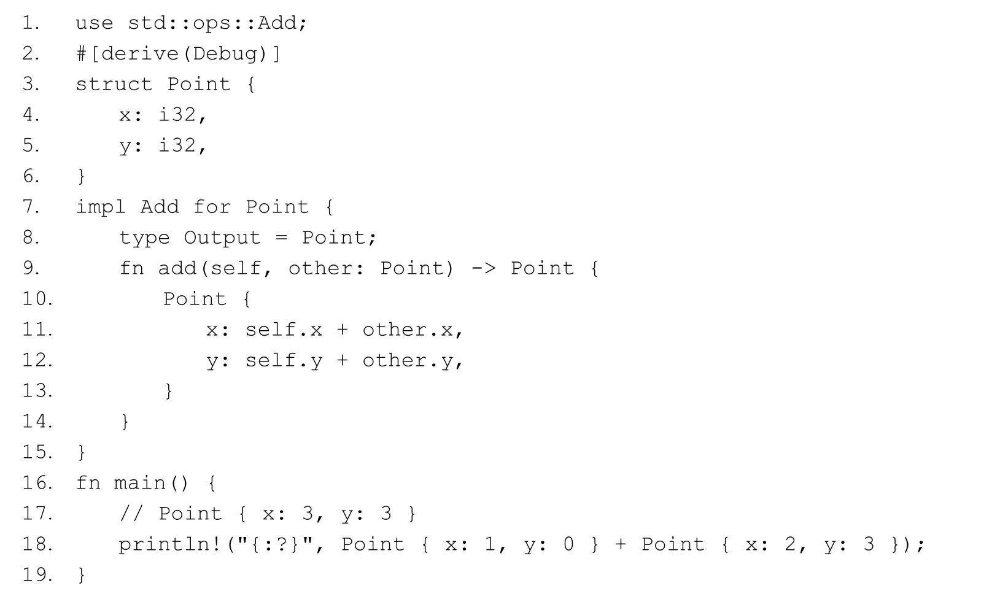{.u54370}
:::

还需要注意，**关联类型Output必须指定具体类型** 。函数add的返回类型可以写Point，也可以写Self，也可以写Self：：Output。

**trait继承**

Rust不支持传统面向对象的继承，但是**支持trait继承** 。子trait可以继承父trait中定义或实现的方法。在日常编程中，trait中定义的一些行为可能会有重复的情况，使用trait继承可以简化编程，方便组合，让代码更加优美。

接下来以Web编程中常见的分页为例，来说明trait继承的一些应用场景。代码清单3-31以分页为例展示了如何定义trait。

**代码清单3-31：以分页为例定义trait**

::: center
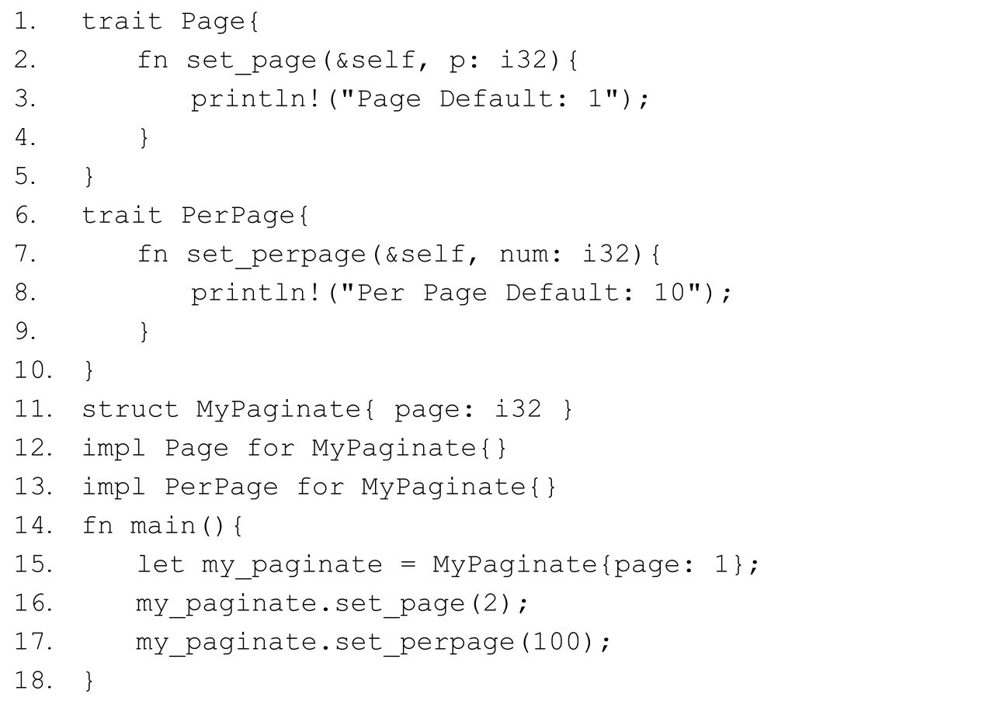{.u54369}
:::

代码清单3-31中定义了Page和PerPage两个trait，分别代表当前页面的页码和每页显示的条目数。并且分别实现了两个默认方法：set_page 和 set_perpage，分别用于设置当前页面页码和每页显示条目数，默认值被设置为了第1页和每页显示10个条目。

代码第11行定义了MyPaginate结构体。

代码第12行和第13行分别为MyPaginate实现了Page和PerPage，使用空的impl块代表使用trait的默认实现。

在代码第14行到第18行的main函数中，创建了MyPaginate的一个实例my_paginate，并分别调用set_page和set_perpage方法，输出结果为默认值。

假如此时需要多加一个功能，要求可以设置直接跳转的页面页码，为了不影响之前的代码，可以使用trait继承来实现，如代码清单3-32所示。

**代码清单3-32：使用trait继承扩展功能**

::: center
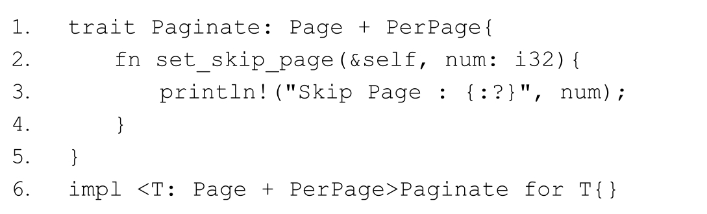{.u54368}
:::

代码清单3-32中定义了Paginate，并使用冒号代表继承其他trait。代码中Page+PerPage表示Paginate同时继承了Page和PerPage这两个trait。总体来说，trait名后面的冒号代表trait继承，其后跟随要继承的父trait名称，如果是多个trait则用加号相连。

代码第6行为泛型T实现了Paginate，并且包括空的impl块。整行代码的意思是，为所有拥有Page和PerPage行为的类型实现Paginate。

然后就可以使用set_skip_page方法了，如代码清单3-33所示。

**代码清单3-33：调用set_skip_page方法**

::: center
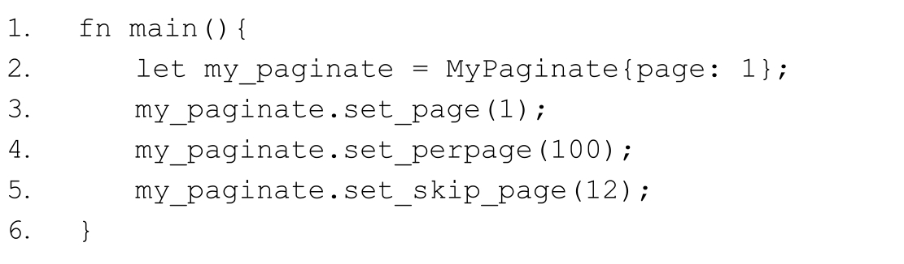{.u54367}
:::

在代码清单 3-33 中，我们直接调用了 set_skip_page 方法，而不会影响之前的代码。另外，trait继承也可以用于扩展标准库中的方法。

### 3.4.2 泛型约束 {#text00009.html#A293e005b-8a83-4b12-ab0a-5c84a09676d6 .title-left}

使用泛型编程时，很多情况下的行为并不是针对所有类型都实现的，代码清单3-34所示的泛型求和函数就是这样一个例子。

**代码清单3-34：泛型求和函数**

::: center
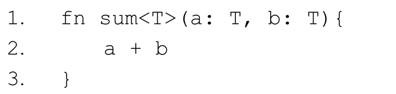{.u54366}
:::

想象一下，如果向代码清单 3-34 的 sum 函数中传入的参数是两个整数，那么加法行为是合法的。如果传入的参数是两个字符串，理论上也应该是合法的，加法行为可以是字符串相连。但是假如传入的两个参数是整数和字符串，或者整数和布尔值，意义就不太明确了，有可能引起程序崩溃。

那么，如何修正呢？答案是，用trait作为泛型的约束。

**trait限定**

对于代码清单3-34中的求和函数来说，只要两个参数是可相加的类型就可以，如代码清单3-35所示。

**代码清单3-35：修正泛型求和函数**

::: center
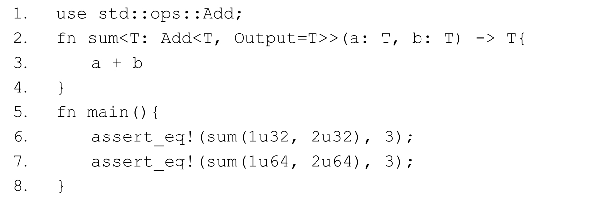{.u54365}
:::

在代码清单3-35中，我们使用＜T：Add＜T，Output=T＞＞对泛型进行了约束，表示sum函数的参数必须实现Add trait，并且加号两边的类型必须一致。这里值得注意的是，对泛型约束的时候，Add＜T，Output=T＞通过类型参数确定了关联类型Output也是T，也可以省略类型参数T，直接写为Add＜Output=T＞。

如果该sum函数传入两个String类型参数，就会报错。因为String字符串相加时，右边的值必须是&str类型。所以不满足此sum函数中Add trait的约束。

使用**trait** 对泛型进行约束，叫作**trait限定** （**trait Bound** ）。格式如下：

::: center
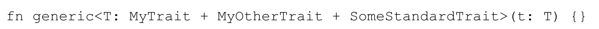{.u54364}
:::

该泛型函数签名要表达的意思是：需要一个类型 T，并且该类型 T 必须实现 MyTrait、MyOtherTrait和SomeStandardTrait中定义的全部方法，才能使用该泛型函数。

**理解trait限定**

trait限定的思想与Java中的泛型限定、Ruby和Python中的**Duck Typing** 、Golang中的**Structural Typing** 、Elixir和Clojure中的**Protocol** 都很相似。所以有编写这些编程语言经验的开发者看到trait限定会觉得很熟悉。在类型理论中，Structural Typing是一种根据结构来判断类型是否等价的理论，翻译过来为结构化类型。Duck Typing、Protocol都是Structural Typing的变种，一般用于动态语言，在运行时检测类型是否等价。Rust中的trait限定也是Structural Typing的一种实现，可以看作一种**静态Duck Typing** 。

从**数学角度** 来理解trait限定可能更加直观。**类型可以看作具有相同属性值的集合** 。当声明变量let x：u32时，意味着x∈u32，也就是说，x属于u32集合。可以再来回顾一下代码清单3-32中声明的trait：

::: center
{.u54363}
:::

**trait 也是一种类型，是一种方法集合，或者说，是一种行为的集合** 。它的意思是，Paginate⊂（Page∩Perpage），Paginate集合是Page和Perpage交集的子集，如图3-4所示。

::: center
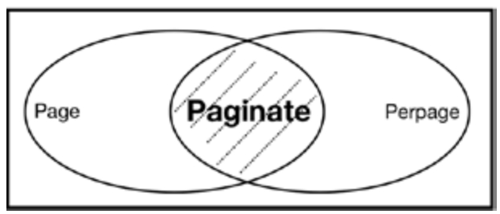{.u54362}

图3-4：Paginate集合包含于Page和Perpage集合的交集中
:::

由此可以得出，Rust中冒号代表集合的"包含于"关系，而加号则代表交集。所以下面这种写法：

::: center
{.u54361}
:::

可以解释为"为所有T⊂（A∩B）实现Trait C"，如图3-5所示。

::: center
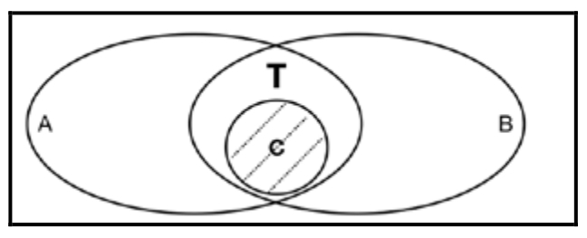{.u54360}

图3-5：为所有T⊂（A∩B）实现Trait C
:::

**Rust编程的哲学是组合优于继承** ，Rust并不提供类型层面上的继承，Rust中所有的类型都是独立存在的，所以Rust中的类型可以看作语言允许的最小集合，不能再包含其他子集。而trait限定可以对这些类型集合进行组合，也就是求交集。

总的来说，trait 限定给予了开发者更大的自由度，因为不再需要类型间的继承，也简化了编译器的检查操作。包含trait限定的泛型属于静态分发，在编译期通过单态化分别生成具体类型的实例，所以调用trait限定中的方法也都是运行时零成本的，因为不需要在运行时再进行方法查找。

如果为泛型增加比较多的trait限定，代码可能会变得不太易读，比如下面这种写法：

::: center
{.u54359}
:::

Rust提供了**where关键字** ，用来对这种情况进行重构：

::: center
{.u54358}
:::

这样重构之后，代码的可读性就提高了。

### 3.4.3 抽象类型 {#text00009.html#A6cde005d-99e2-4a05-89bd-11d2c3efb2d6 .title-left}

trait还可以用作**抽象类型** （**Abstract Type** ）。抽象类型属于类型系统的一种，也叫作**存在类型** （**Existential Type** ）。相对于具体类型而言，抽象类型无法直接实例化，它的每个实例都是具体类型的实例。

对于抽象类型而言，编译器可能无法确定其确切的功能和所占的空间大小。所以 Rust目前有两种方法来处理抽象类型：**trait对象** 和**impl Trait** 。

**trait对象**

在泛型中使用trait限定，可以将任意类型的范围根据类型的行为限定到更精确可控的范围内。从这个角度出发，也可以将共同拥有相同行为的类型集合抽象为一个类型，这就是trait**对象（trait Object）** 。"对象"这个词来自面向对象编程语言，因为trait对象是对具有相同行为的一组具体类型的抽象，等价于面向对象中一个封装了行为的对象，所以称其为trait对象。

代码清单3-36对比了trait限定和trait对象的用法。

**代码清单3-36：trait限定和trait对象的用法比较**

::: center
{.u54357}
:::

代码清单3-36中定义了结构体Foo和Bar trait，并且为Foo实现了Bar。

代码第9行到第14行分别定义了带trait限定的泛型函数staitc_dispatch和使用trait对象的dynamic_dispatch函数。

代码第15行到第19行分别调用了static_dispatch和dynamic_dispatch函数。static_dispatch是属于静态分发的，参数 t 之所以能调用 baz 方法，是因为 Foo 类型实现了 Bar。dynamic_dispatch是属于动态分发的，参数t标注的类型&Bar是trait对象。那么，什么是动态分发呢？它的工作机制是怎样的呢？

trait本身也是一种类型，但它的类型大小在编译期是无法确定的，所以trait对象必须使用指针。可以利用引用操作符&或 Box＜T＞来制造一个 trait 对象。trait 对象等价于代码清单3-37所示的结构体。

**代码清单3-37：等价于trait对象的结构体**

::: center
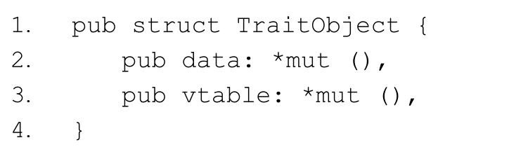{.u54356}
:::

代码清单3-37的结构体TraitObject来自Rust标准库，但它并不能代表真正的trait对象，它仅仅用于操作底层的一些 Unsafe 代码。这里使用该结构体只是为了用它来帮助理解 trait对象的行为。

**TraitObject** 包括两个指针：**data指针** 和**vtable指针** 。以impl MyTrait for T为例，data指针指向 trait 对象保存的类型数据 T，vtable 指针指向包含为 T 实现的 MyTrait 的 Vtable （Virtual Table），该名称来源于C++，所以可以称之为**虚表** 。虚表的本质是一个结构体，包含了析构函数、大小、对齐和方法等信息。TraitObject的结构如图3-6所示。

::: center
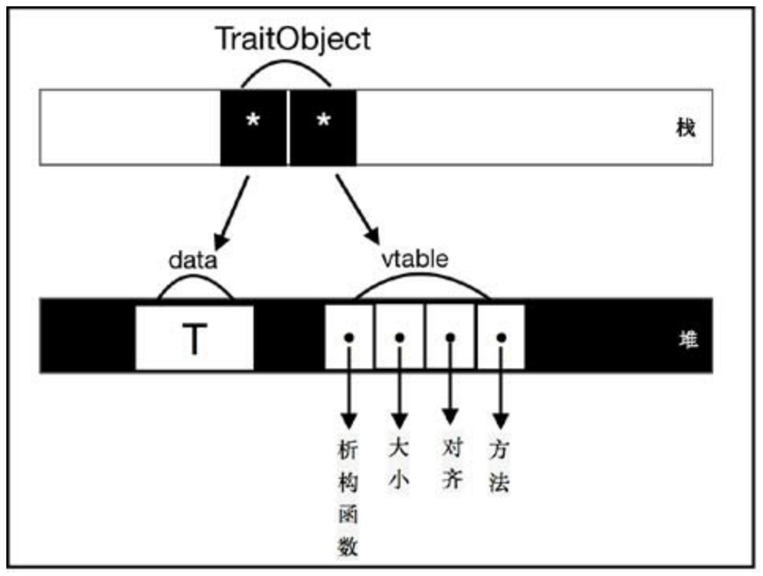{.u54355}

图3-6：TraitObject结构示意
:::

在编译期，编译器只知道TraitObject包含指针的信息，并且指针的大小也是确定的，并不知道要调用哪个方法。在运行期，当有trait_object.method（）方法被调用时，**TraitObject会根据虚表指针从虚表中查出正确的指针，然后再进行动态调用** 。这也是将trait对象称为动态分发的原因。

所以，当代码清单 3-36 中的 dynamic_dispatch（&foo）函数在运行期被调用时，会先去查虚表，取出相应的方法t.baz（），然后调用。

讲到trait对象时，我们需要特别讲一下对象安全的问题。

并不是每个trait都可以作为trait对象被使用，这依旧和类型大小是否确定有关系。每个trait都包含一个隐式的类型参数Self，代表实现该trait的类型。Self默认有一个隐式的trait限定？Sized，形如＜Self：？Sized＞，？Sized trait 包括了所有的动态大小类型和所有可确定大小的类型。Rust 中大部分类型都默认是可确定大小的类型，也就是＜T：Sized＞，这也是泛型代码可以正常编译的原因。

当trait对象在运行期进行动态分发时，也必须确定大小，否则无法为其正确分配内存空间。所以必须同时满足以下两条规则的trait才可以作为trait对象使用。

· trait的Self类型参数不能被限定为Sized。

· trait中所有的方法都必须是对象安全的。

满足这两条规则的trait就是对象安全的trait。那么，什么是对象安全呢？

trait的Self类型参数绝大部分情况默认是**？Sized** ，但也有可能出现被限定为Sized的情况，如代码清单3-38所示。

**代码清单3-38：标记为Sized的trait**

::: center
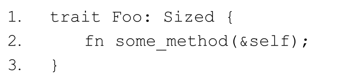{.u54354}
:::

代码清单3-38中的Foo继承自Sized，这表明，要为某类型实现Foo，必须先实现Sized。所以，Foo中的隐式Self也必然是Sized的，因为Self代表的是那些要实现Foo的类型。

按规则一，Foo不是对象安全的。trait对象本身是动态分发的，编译期根本无法确定Self具体是哪个类型，因为不知道给哪些类型实现过该trait，更无法确定其大小，现在又要求Self是可确定大小的，这就造就了图3-7所示的**薛定谔的类型** ：既能确定大小又不确定大小。

::: center
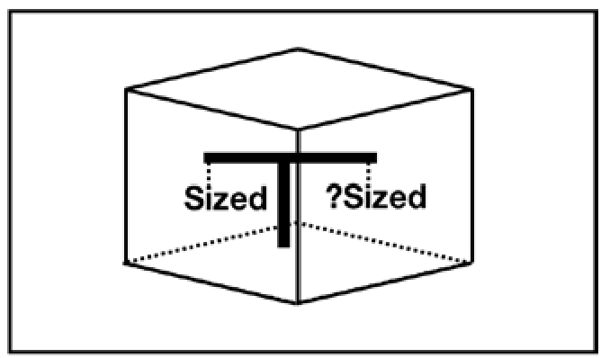{.u54353}

图3-7：薛定谔的类型
:::

当把trait当作对象使用时，其内部类型就默认为Unsize类型，也就是动态大小类型，只是将其置于编译期可确定大小的胖指针背后，以供运行时动态调用。对象安全的本质就是为了让trait对象可以安全地调用相应的方法。如果给trait加上Self：Sized限定，那么在动态调用trait对象的过程中，如果碰到了Unsize类型，在调用相应方法时，可能引发段错误。所以，就无法将其作为trait对象。反过来，当不希望trait作为trait对象时，可以使用Self：Sized进行限定。

而对象安全的方法必须满足以下三点之一。

· 方法受**Self：Sized** 约束。

· 方法签名同时满足以下三点。

➢ 必须不包含任何泛型参数。如果包含泛型，**trait** 对象在**虚表** （**Vtable** ）中查找方法时将不确定该调用哪个方法。

➢ **第一个参数必须为 Self 类型或可以解引用为 Self 的类型** （也就是说，必须有接收者，比如self、&self、&mut self和self：Box＜Self＞，没有接收者的方法对trait对象来说毫无意义）。

➢ Self不能出现在除第一个参数之外的地方，包括返回值中。这是因为如果出现Self，那就意味着Self和self、&self或&mut self的类型相匹配。但是对于trait对象来说，根本无法做到保证类型匹配，因此，这种情况下的方法是对象不安全的。

这三点可以总结为一句话：**没有额外Self类型参数的非泛型成员方法。**

· trait中不能包含关联常量（Associated Constant）。在Rust 2018版本中，trait中可以增加默认的关联常量，其定义方法和关联类型差不多，只不过需要使用const关键字。

代码清单3-39展示了一个标准的对象安全的trait。

**代码清单3-39：标准的对象安全的trait**

::: center
{.u54352}
:::

代码清单3-39满足对象安全trait的规则，所以它是对象安全的。trait Bar不受Sized限定，trait方法都是没有额外Self类型参数的非泛型成员方法。代码清单3-40展示了典型的对象不安全的trait。

**代码清单3-40：典型的对象不安全的trait**

::: center
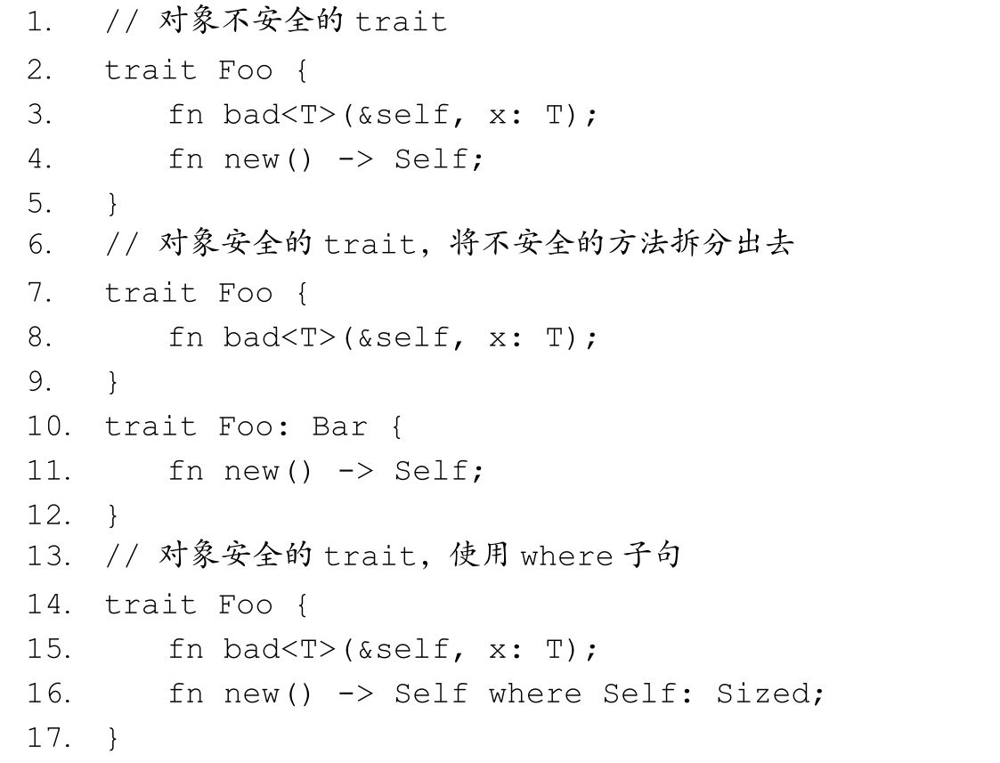{.u54351}
:::

在代码清单3-40中，代码第2行到第5行定义的trait Foo显然违反了对象安全trait方法的规则，所以它不能被作为trait对象使用。但是如果想继续把该trait作为对象使用，可以将此trait分离为两个trait，如代码第7行到第12行所示，将对象不安全的方法摘到另一个Bar trait中。但是这种方法比较烦琐。最好的办法是使用where子句，如代码第14行到第16行所示，在new方法签名后面使用where子句，增加Self：Sized限定，则trait Foo又成为了一个对象安全的trait。只不过在trait Foo作为trait对象且有**？Sized** 限定时，不允许调用该new方法。**impl Trait**

在**Rust 2018** 版本中，引入了可以**静态分发的抽象类型impl Trait** 。如果说**trait对象** 是**装箱抽象类型（Boxed Abstract Type）** 的话，那么**impl Trait** 就是**拆箱抽象类型（Unboxed Abstract Type）** 。"装箱"和"拆箱"是业界的抽象俗语，其中"装箱"代表将值托管到堆内存，而"拆箱"则是在栈内存中生成新的值，更详细的内容会在第4章中描述。总之，装箱抽象类型代表动态分发，拆箱抽象类型代表静态分发。

**目前impl Trait只可以在输入的参数和返回值这两个位置使用** ，在不远的将来，还会拓展到其他位置，比如let定义、关联类型等。

接下来使用impl Trait语法重构第2章的代码清单2-53，如代码清单3-41所示。

**代码清单3-41：使用impl Trait语法重构第2章的代码清单2-53**

::: center
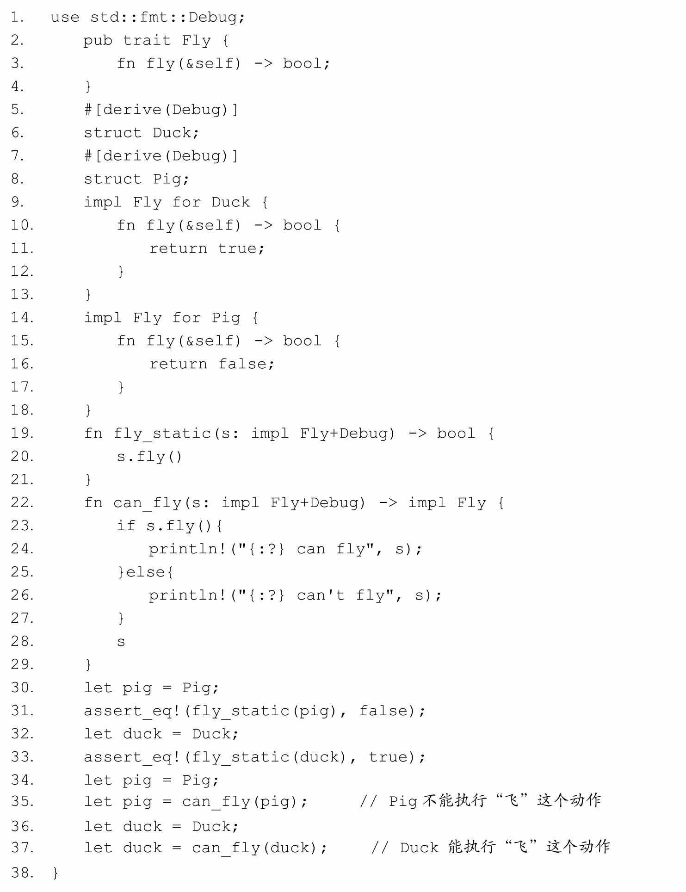{.u54350}
:::

代码清单3-41第19行到第21行使用impl Fly+Debug替换了之前的泛型写法，整个代码看上去清爽不少。将impl Trait语法用于参数位置的时候，等价于使用trait限定的泛型。

代码第22行到第29行定义了can_fly函数，参数使用impl Fly+Debug抽象类型，而返回值指定了impl Fly抽象类型。**将impl Trait语法用于返回值位置的时候，实际上等价于给返回类型增加一种trait限定范围** 。

在main函数中调用fly_static函数的时候，也不再需要使用turbofish操作符来指定类型。当然，如果在 Rust 无法自动推导类型的情况下，还需要显式指定类型，只不过无法使用turbofish操作符。调用can_fly函数可以返回impl Fly类型，但它属于静态分发，在调用的时候根据上下文确定返回的具体类型。

但是目前，还不能在 let 语句中为变量指定 impl Fly 类型。比如 let duck：impl Fly=can_fly（duck）这样的写法是不允许的，但是在不远的将来是可以使用的。相比于使用 trait 对象，使用impl Trait会拥有更高的性能。

另外，impl Trait只能用于为单个参数指定抽象类型，如果对多个参数使用impl Trait语法，编译器将报错，如代码清单3-42所示。

**代码清单3-42：多个参数类型使用impl Trait语法的情况**

::: center
{.u54349}
:::

代码清单 3-42 中的 sum 泛型函数包含了两个参数：a 和 b，如果都指定了 impl Add＜Output=T＞抽象类型，编译将会报错。a 和 b 会被编译器认为是两个不同的类型，不能进行加法操作。这一点在使用时要注意。

在Rust 2018版本中，为了在语义上和impl Trait语法相对应，专门为动态分发的**trait对象** 增加了新的语法**dyn Trait** ，其中dyn是Dynamic（动态）的缩写。即，impl Trait代表静态分发，dyn Trait代表动态分发。

我们可以在代码清单3-42的基础上新增使用dyn Trait语法的函数，如代码清单3-43所示。

**代码清单3-43：在代码清单3-42的基础上新增使用dyn Trait语法的函数**

::: center
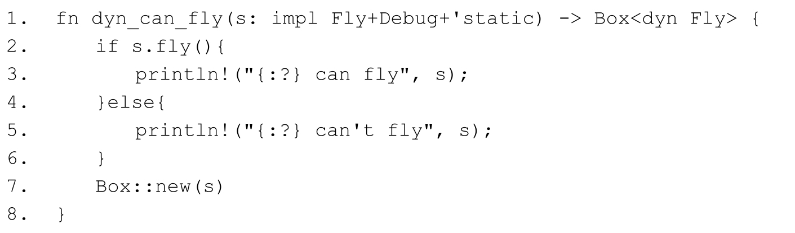{.u54348}
:::

代码清单3-43在代码清单3-42的基础上新增了函数dyn_can_fly，使用了新的dyn Trait语法。形如 Box＜dyn Fly＞实际上就是返回的 trait 对象，在 Rust 2015 版本中也可以写作Box＜Fly＞。方法签名中出现的＇static是一种生命周期参数，它限定了impl Fly+Debug抽象类型不可能是引用类型，因为这里出现引用类型可能会引发内存不安全。我们会在第5章更详细地介绍关于生命周期参数的内容。

### 3.4.4 标签trait {#text00009.html#A7dfc0063-ba68-4754-9da9-f7db224e7ad3 .title-left}

trait 这种对行为约束的特性也非常适合作为**类型的标签** 。这就好比市场上流通的产品，都被厂家盖上了"生产日期"和"有效期"这样的标签，消费者通过这种标签就可以识别出未过期的产品。Rust就是"厂家"，类型就是"产品"，标签trait就是"厂家"给"产品"盖上的各种标签，起到标识的作用。当开发者消费这些类型"产品"时，编译器会进行"严格执法"，以保证这些类型"产品"是"合格的"。

Rust一共提供了5个重要的标签trait，都被定义在标准库std：：marker模块中。它们分别是：

· **Sized** trait，用来标识编译期可确定大小的类型。

· **Unsize** trait，目前该trait为实验特性，用于标识动态大小类型（DST）。

· **Copy** trait，用来标识可以按位复制其值的类型。

· **Send** trait，用来标识可以跨线程安全通信的类型。

· **Sync** trait，用来标识可以在线程间安全共享引用的类型。

除此之外，Rust标准库还在增加新的标签trait以满足变化的需求。

**Sized trait**

Sized trait 非常重要，**编译器用它来识别可以在编译期确定大小的类型** 。代码清单 3-44展示了Sized trait的内部实现。

**代码清单3-44：Sized trait内部实现**

::: center
{.u54347}
:::

Sized trait是一个**空trait** ，因为仅仅作为标签trait供编译器使用。这里真正起"打标签"作用的是代码清单3-44第1行的属性**＃\[lang=＂sized＂\]** ，该属性lang表示Sized trait供Rust语言本身使用，声明为＂sized＂，称为**语言项（Lang Item）** ，这样编译器就知道Sized trait如何定义了。还有一个相似的例子是加号操作，当两个整数相加的时候，比如a+b，编译器就会去找Add：：add（a，b），这也是因为加号操作是语言项**＃\[lang=＂add＂\]** 。

Rust语言中大部分类型都是默认Sized的，所以在写泛型结构体的时候，没有显式地加上Sized trait限定，如代码清单3-45所示。

**代码清单3-45：泛型默认Sized trait限定**

::: center
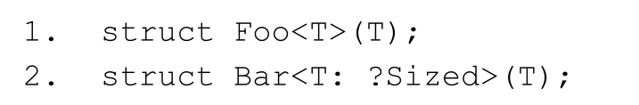{.u54346}
:::

代码清单3-45中的Foo是一个泛型结构体，等价于Foo＜T：Sized＞，如果需要在结构体中使用动态大小类型，则需要改为＜T：？Sized＞限定。

？Sized是Sized trait的另一种语法。Sized、Unsize和？Sized的关系如图3-8所示。

::: center
{.u54345}

图3-8：Sized、Unsize和？Sized的关系
:::

Sized标识的是在编译期可确定大小的类型，而Unsize标识的是动态大小类型，在编译期无法确定其大小。目前Rust中的动态类型有trait和\[T\]，其中\[T\]代表一定数量的T在内存中依次排列，但不知道具体的数量，所以它的大小是未知的，用Unsize来标记。比如str字符串和定长数组\[T；N\]。\[T\]其实是\[T；N\]的特例，当N的大小未知时就是\[T\]。

而？Sized标识的类型包含了Sized和Unsize所标识的两种类型。所以代码清单3-45中泛型结构体Bar＜T：？Sized＞支持编译期可确定大小类型和动态大小类型两种类型。

但是动态大小类型不能随意使用，还需要遵循如下三条限制规则：

· 只可以通过胖指针来操作Unsize类型，比如&\[T\]或&Trait。

· 变量、参数和枚举变量不能使用动态大小类型。

· 结构体中只有最后一个字段可以使用动态大小类型，其他字段不可以使用。

所以，当使用？Size限定时，应该想想这三条规则。

**Copy trait**

Copy trait用来标记可以按位复制其值的类型，按位复制等价于C语言中的memcpy ^[\[2\]](#text00009.html#n7B59ECC43F3747CDB066593DD4153F5D){#text00009.html#n7B59ECC43F3747CDB066593DD4153F5Ds}^ 。代码清单3-46展示了Copy trait的内部实现。

**代码清单3-46：Copy trait内部实现**

::: center
{.u54344}
:::

注意代码清单3-46第1行的lang属性，此时声明为＂copy＂。此Copy trait继承自Clone trait，意味着，要实现Copy trait的类型，必须实现Clone trait中定义的方法。代码清单3-47展示了定义于std：：clone模块中的Clone trait内部实现。

**代码清单3-47：Clone trait内部实现**

::: center
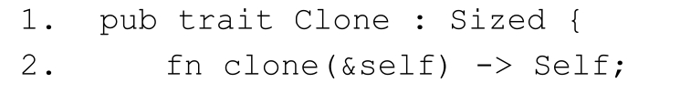{.u54343}
:::

::: center
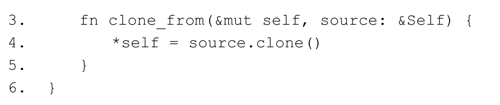{.u54342}
:::

看得出来，Clone trait继承自Sized，意味着要实现Clone trait的对象必须是Sized类型。代码清单3-47第3行的clone_from方法有默认的实现，并且其默认实现是调用clone方法，所以对于要实现Clone trait的对象，只需要实现clone方法就可以了。

如果想让一个类型实现Copy trait，就必须同时实现Clone trait，如代码清单3-48所示。

**代码清单3-48：想实现Copy trait就必须同时实现Clone trait**

::: center
{.u54341}
:::

如果每次都这样实现一遍，会比较麻烦。所以Rust提供了更方便的derive属性供我们完成这项重复的工作，如代码清单3-49所示。

**代码清单3-49：使用deriüe属性实现Copy trait和Clone trait**

::: center
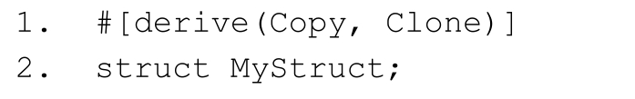{.u54340}
:::

这样代码就简练多了。

Rust为很多基本数据类型实现了Copy trait，比如常用的数字类型、字符（Char）、布尔类型、单元值、不可变引用等。代码清单3-50提供了一个检测函数，可以检测哪些类型实现了Copy trait。实际上就是利用了一个加上Copy trait限定的泛型函数test_copy，如果实现了Copy trait的类型，则可以正常编译；如果没有实现，则会报错。

**代码清单3-50：检测类型是否实现了Copy trait**

::: center
{.u54339}
:::

代码清单3-50测试的类型是String，即字符串，编译会报以下错误：

::: center
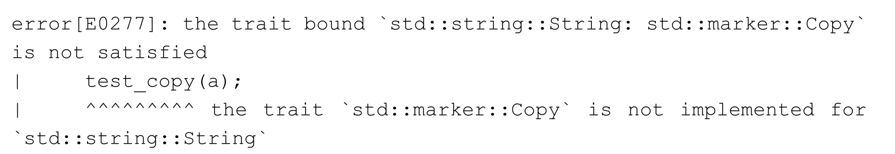{.u54338}
:::

看得出来，String类型并没有实现Copy trait。

那么这个空的Copy trait到底有什么作用呢？不要忘记，Copy是一个标签trait，编译器做类型检查时会检测类型所带的标签，以验证它是否"合格"。**Copy的行为是一个隐式的行为，开发者不能重载Copy行为，它永远都是一个简单的位复制** 。Copy隐式行为发生在执行变量绑定、函数参数传递、函数返回等场景中，因为这些场景是开发者无法控制的，所以需要编译器来保证。在学习完第4章之后，我们会对Copy语义有更深的了解。

Clone trait是一个显式的行为，任何类型都可以实现Clone trait，开发者可以自由地按需实现Copy行为。比如，String类型并没有实现Copy trait，但是它实现了Clone trait，如果代码里有需要，只需要调用String 类型的clone 方法即可。但需要记住一点，如果一个类型是Copy的，它的clone方法仅仅需要返回\*self即可（参考代码清单3-48）。

**并非所有类型都可以实现Copy trait** 。对于自定义类型来说，必须让所有的成员都实现了Copy trait，这个类型才有资格实现Copy trait。如果是数组类型，且其内部元素都是Copy类型，则数组本身就是Copy类型；如果是元组类型，且其内部元素都是Copy类型，则该元组会自动实现Copy；如果是结构体或枚举类型，只有当每个内部成员都实现Copy时，它才可以实现Copy，并不会像元组那样自动实现Copy。图3-9形象地总结了Copy和Clone的区别。

::: center
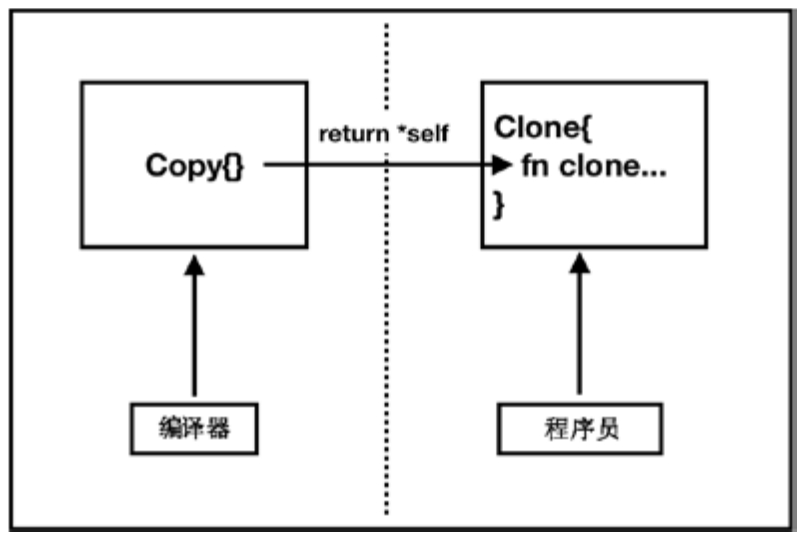{.u54337}

图3-9：Copy和Clone的区别
:::

**Send trait和Sync trait**

Rust作为现代编程语言，自然也提供了**语言级的并发支持** 。只不过Rust对并发的支持和其他语言有所不同。Rust在标准库中提供了很多并发相关的基础设施，比如线程、Channel、锁和Arc等，这些都是独立于语言核心之外的库，意味着基于Rust的并发方案不受标准库和语言的限制，开发人员可以编写自己所需的并发模型。

一直以来，多线程并发编程都存在很大问题，因为它会增加复杂性，想要编写正确非常困难，调试也非常困难，难以将问题复现。线程不安全的代码会因为共享内存而产生内存破坏（Memory Corruption）行为。

多线程编程之所以有这么严重的问题，是因为系统级的线程是不可控的，编写好的代码不一定会按期望的顺序执行，会带来**竞态条件（Race Condition）** 。不同的线程同时访问一块共享变量也会造成**数据竞争（Data Race）** 。**竞态条件是不可能被消除的，数据竞争是有可能被消除的，而数据竞争是线程安全最大的"隐患"** 。很多其他语言通过各种成熟的并发解决方案来支持并发编程，比如Erlang提供轻量级进程和Actor并发模型；Golang提供了协程和CSP并发模型。而Rust则从正面解决了这个问题，它的"秘密武器"是类型系统和所有权机制。

Rust提供了**Send** 和**Sync** 两个标签trait，它们是Rust无数据竞争并发的基石。

· 实现了Send的类型，可以安全地在线程间传递值，也就是说可以跨线程传递所有权。

· 实现了Sync的类型，可以跨线程安全地传递共享（不可变）引用。

有了这两个标签trait，就可以把Rust中所有的类型归为两类：**可以安全跨线程传递的值和引用** ，以及**不可以跨线程传递的值和引用** 。再配合所有权机制，带来的效果就是，**Rust能够在编译期就检查出数据竞争的隐患** ，而不需要等到运行时再排查。

代码清单3-51尝试在多线程之间共享不可变变量。

**代码清单3-51：多线程之间共享不可变变量**

::: center
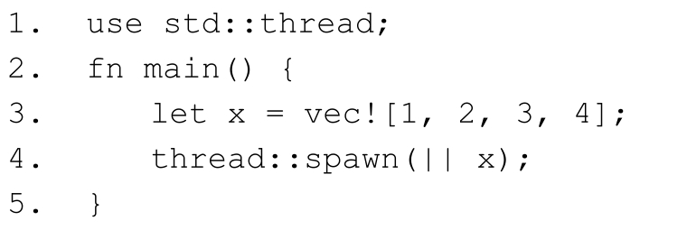{.u54336}
:::

代码清单3-51使用标准库thread模块中的spawn函数来创建子线程，需要一个闭包作为参数，可以编译通过。变量x被闭包捕获，传递到子线程中，但是x默认不可变，所以多线程之间共享是安全的。再看看如果传入的是可变变量会怎么样？如代码清单3-52所示。

**代码清单3-52：多线程之间共享可变变量**

::: center
{.u54335}
:::

我们在代码清单3-52中声明了可变变量x，然后在子线程中通过push方法在x中插入元素5，在父线程中又通过push方法插入元素2。

可以分析一下这个过程，假如编译正常通过的话，那么在父子线程中就都可以访问这个共享的可变变量，这就有可能出现数据竞争的问题。比如在父线程中其他地方判断数组长度等于 5 的时候，取出数组最后一个值，那么这个值可能是 2，也可能是 5，这就造成了线程不安全的问题。

但实际上，代码清单3-51是无法编译通过的，会报如下错误：

::: center
{.u54334}
:::

因为闭包中的x实际为借用，Rust无法确定本地变量x可以比闭包中的x存活得更久，假如本地变量x被释放了，闭包中的x借用就成了悬垂指针，造成内存不安全。所以这里的编译器建议在闭包前面使用move关键字来转移所有权，转移了所有权意味着x变量只可以在子线程中访问，而父线程再也无法操作变量x，这就阻止了数据竞争。代码清单3-53通过在多线程之间move可变变量修正了数据竞争的问题。

**代码清单3-53：在多线程之间moüe可变变量**

::: center
{.u54333}
:::

代码清单3-53中编译器的检查利用了所有权机制，我们会在第5章学习关于所有权的更多细节。但这里之所以可以正常地move变量，也是因为数组x中的元素均为原生数据类型，默认都实现了Send和Sync标签trait，所以它们跨线程传递和访问都很安全。在x被转移到子线程之后，就不允许父线程对x进行修改，如代码清单3-53的第5行所示，如果对该行代码解开注释，编译会报错。

代码清单3-54展示了没有实现Send和Sync的类型在多线程中传递的情况。

**代码清单3-54：在多线程之间传递没有实现Send和Sync的类型**

::: center
{.u54332}
:::

代码清单3-54中使用了std：：rc：：Rc容器来包装数组，Rc没有实现Send和Sync，所以不能在线程之间传递变量x。编译报错如下：

::: center
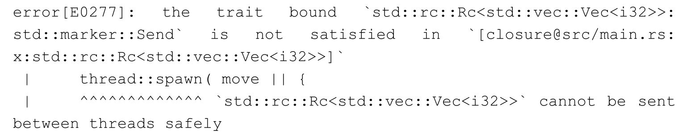{.u54331}
:::

编译错误信息显示：变量x，也就是std：：rc：：Rc＜std：：vec：：Vec＜i32＞＞，不能在线程之间传递。因为Rc是用于引用计数的智能指针，如果把Rc类型的变量x传递到另一个线程中，会导致不同线程的Rc变量引用同一块数据，Rc内部实现并没有做任何线程同步的处理，因此这样做必然不是线程安全的。可见，Rust又帮助开发者避免了一场"并发浩劫"。

Send和Sync标签trait和前面所说的Copy、Sized一样，内部也没有具体的方法实现。它们仅仅是标记，可以安全地跨线程传递和访问的类型用 Send 和 Sync 标记，否则用！Send和！Sync标记。代码清单3-55展示了其内部实现。

**代码清单3-55：Send和Sync的内部实现**

::: center
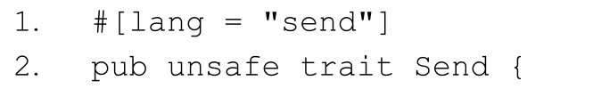{.u54330}
:::

::: center
{.u54329}
:::

代码清单3-56展示了Rust为所有类型实现Send和Sync的过程。

**代码清单3-56：Rust为所有类型实现Send和Sync**

::: center
{.u54328}
:::

代码清单3-56的第1行使用了特殊的语法for..，表示为所有类型实现Send，Sync也同理。同时，第2行和第3行也对两个原生指针实现了！Send，代表它们不是线程安全的类型，将它们排除出去。代码 3-56 仅仅展示了部分代码，完整的代码可以参考 Rust 源码的src/libcore/marker.rs源文件。

对于自定义的数据类型，如果其成员类型必须全部实现Send和Sync，此类型才会被自动实现Send和Sync。Rust也提供了类似Copy和Clone那样的derive属性来自动导入Send和 Sync 的实现，但并不建议开发者使用该属性，因为它可能引起编译器检查不到的线程安全问题。

总体来说，Rust 凭借 Send、Sync 和所有权机制，在编译期就可以检测出线程安全的问题，保证了无数据竞争的并发安全，让开发者可以"无恐惧"地编写多线程并发代码，并且可以让开发者自由使用各种并发模型。

## 3.5 类型转换 {#text00009.html#A039f0069-6289-4ca8-8c90-8ac249909278 .title-left}

在编程语言中，类型转换分为**隐式类型转换** （**Implicit Type Conversion** ）和**显式类型转换** （**Explicit Type Conversion** ）。隐式类型转换是由编译器或解释器来完成的，开发者并未参与，所以又称之为**强制类型转换** （**Type Coercion** ）。显式类型转换是由开发者指定的，就是一般意义上的**类型转换** （**Type Cast** ）。

不当的类型转换会带来内存安全问题。比如C语言和JavaScript语言中的隐式类型转换，如果不多加注意，可能会得到意料之外的结果。再比如C语言不同大小类型相互转换，长类型转换为短类型会造成溢出等问题。反观Rust语言，只要不乱用unsafe块来跳过编译器检查，就不会因为类型转换出现安全问题。

### 3.5.1 Deref解引用 {#text00009.html#A35e30069-d512-4aec-a49d-9d7b55a00157 .title-left}

Rust中的隐式类型转换基本上只有**自动解引用** 。自动解引用的目的主要是方便开发者使用智能指针。Rust 中提供的 Box＜T＞、Rc＜T＞和 String 等类型，实际上是一种**智能指针** 。它们的行为就像指针一样，可以通过"解引用"操作符进行解引用，来获取其内部的值进行操作。第4章会介绍关于智能指针的更多细节。

**自动解引用**

自动解引用虽然是编译器来做的，但是**自动解引用的行为可以由开发者来定义** 。

一般来说，引用使用&操作符，而解引用使用\*操作符。可以通过实现**Deref** trait来自定义解引用操作。Deref 有一个特性是强制隐式转换，规则是这样的：**如果一个类型 T实现了Deref＜Target=U＞，则该类型T的引用（或智能指针）在应用的时候会被自动转换为类型U。**

代码清单3-57展示了Deref trait内部实现。

**代码清单3-57：Deref trait内部实现**

::: center
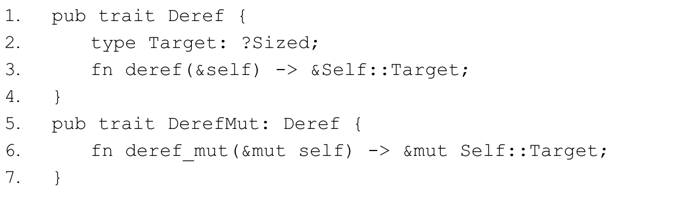{.u54327}
:::

**DerefMut** 和**Deref** 类似，只不过它是返回**可变引用** 的。Deref中包含关联类型Target，它表示解引用之后的目标类型。

**String** 类型实现了Deref。比如在代码清单3-58中连接了两个String字符串。

**代码清单3-58：连接两个String字符串**

::: center
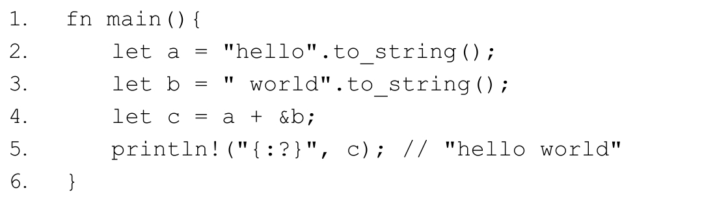{.u54326}
:::

变量a和b都是String类型字符串，当使用加号操作符将它们连接起来时，我们使用了&b，它应该是一个&String类型，而String类型实现的add方法的右值参数必须是&str类型。按理说，代码清单3-58应该编译出错，但现在它是可以正常运行的。原因就是String类型实现了Deref＜Target=str＞，代码清单3-59展示了其内部实现。

**代码清单3-59：String实现Deref＜Target=str＞**

::: center
{.u54325}
:::

所以&String类型会被自动隐式转换为&str，代码清单3-58才得以正常运行。除了String类型，标准库中常用的其他类型都实现了Deref，比如Vec＜T＞（其实现Deref的代码参见代码清单3-60）、Box＜T＞、Rc＜T＞、Arc＜T＞等。**实现Deref的目的只有一个，就是简化编程** 。

**代码清单3-60：Vec＜T＞实现Deref**

::: center
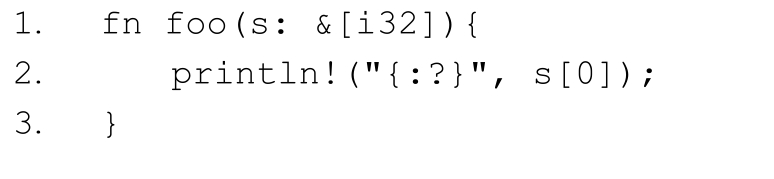{.u54324}
:::

::: center
{.u54323}
:::

在代码清单3-60中，foo函数的参数为&\[T\]类型。而在调用foo（&v）的时候，&v的类型为&Vec＜T＞，这里也发生了自动解引用，因为Vec＜T＞实现了Deref＜Target=\[T\]＞，所以&Vec＜T＞会被自动转换为&\[T\]类型，foo函数得以正确调用。自动解引用避免了开发者自己手工转换，简化了编程。

在函数调用时，自动解引用也提供了极大的方便。如代码清单 3-61 所示，Rc 指针实现了Deref，使函数调用变得非常方便。

**代码清单3-61：Rc指针实现Deref**

::: center
{.u54322}
:::

在代码清单3-61中，变量x是Rc＜&str＞类型，它并没有实现过chars（）方法。但是现在可以直接调用，因为Rc＜T＞实现了Deref＜Target＜T＞＞。这就是自动解引用的魔法，使用起来完全透明，就好像Rc并不存在一样。

**手动解引用**

但在有些情况下，就算实现了 Deref，编译器也不会自动解引用。比如，代码清单 3-61是因为Rc没有实现chars方法，所以正常解引用，但是当某类型和其解引用目标类型中包含了相同的方法时，编译器就不知道该用哪一个了。此时就需要**手动解引用** ，如代码清单3-62所示。

**代码清单3-62：手动解引用的情况**

::: center
{.u54321}
:::

在代码清单3-62中，clone方法在Rc和&str类型中都被实现了，所以调用时会直接调用Rc的clone方法，如果想调用Rc里面&str类型的clone方法，则需要使用"解引用"操作符手动解引用。

另外，match引用时也需要手动解引用，如代码清单3-63所示。

**代码清单3-63：match引用时需要手动解引用**

::: center
{.u54320}
:::

::: center
{.u54319}
:::

在代码清单3-63所示的情况中，只能通过手动解引用把&String类型转换成&str类型，具体有下列几种方式。

· match x.deref（），直接调用deref方法，需要use std：：ops：：Deref。

· match **x.as_ref（）** ，String类型提供了as_ref方法来返回一个&str类似，该方法定义于**AsRef** trait中。

· match **x.borrow（）** ，方法borrow定义于Borrow trait中，行为和AsRef类型一样。需要**use std：：borrow：：Borrow** 。

· match**&\*x** ，使用"解引用"操作符，将String转换为str，然后再用"引用"操作符转为&str。

· match**&x\[..\]** ，这是因为String类型的index操作可以返回&str类型。

总体来说，除了自动解引用隐式转换，Rust还提供了不少显式的手动转换类型的方式。平时编程过程中建议多翻阅标准库文档，能够发现很多技巧。

### 3.5.2 as操作符 {#text00009.html#A582e006c-8455-4e37-bc01-f9a41d3ece59 .title-left}

as 操作符最常用的场景就是转换 Rust 中的基本数据类型。需要注意的是，as 关键字不支持重载。原生类型使用as操作符进行转换的代码如代码清单3-64所示。

**代码清单3-64：原生类型使用as操作符进行转换**

::: center
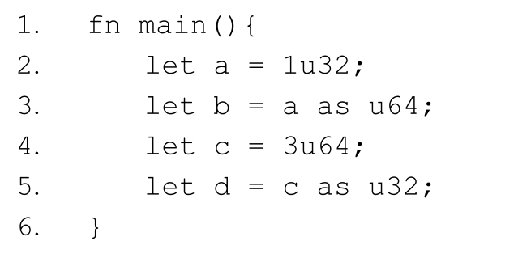{.u54318}
:::

代码清单3-64展示了u32和u64之间的转换，其他的原生类型也都可以使用as操作符进行转换。需要注意的是，短（大小）类型转换为长（大小）类型的时候是没有问题的，但是如果反过来，则会被**截断处理** ，如代码清单3-65所示。

**代码清单3-65：u32最大值转为u16类型时被截断处理**

::: center
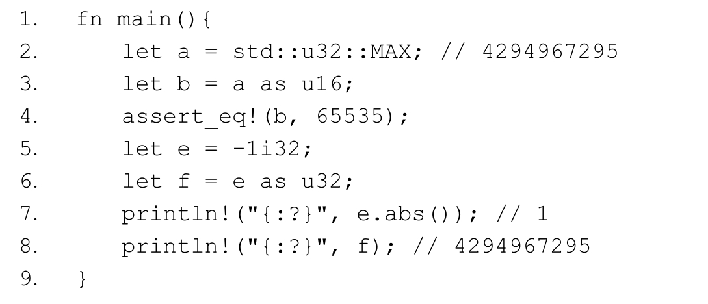{.u54317}
:::

在代码清单3-65中，变量a被赋予了u32类型的最大值，当转换为u16类型的时候，被截断处理，变量b的值就变成了u16类型的最大值。另外当从有符号类型向无符号类型转换的时候，最好使用标准库中提供的专门的方法，而不要直接使用as操作符。

**无歧义完全限定语法**

为结构体实现多个trait时，可能会出现同名的方法，代码清单3-66就展示了这种情况。此时使用as操作符可以帮助避免歧义。

**代码清单3-66：为结构体实现多个trait时出现同名方法的情况**

::: center
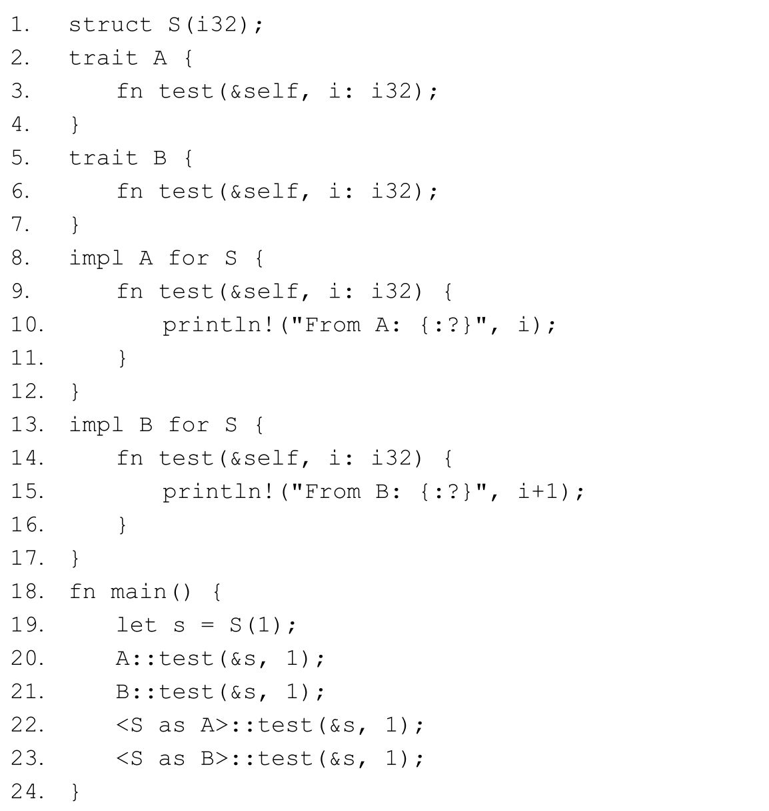{.u54316}
:::

在代码清单3-66中，结构体S实现了A和B两个trait，虽然包含了同名的方法test，但是其行为不同。有两种方式调用可以避免歧义。

· 第一种就是代码清单3-66中的第20行和21行，直接当作trait的静态函数来调用，A：：test（）或B：：test（）。

· 第二种就是使用as操作符，＜S as A＞：：test（）或＜S as B＞：：test（）。

这两种方式叫作**无歧义完全限定语法** （**Fully Qualified Syntax for Disambiguation** ），曾经也有另外一个名字：**通用函数调用语法** （**UFCS** ）。这两种方式的共同之处就是都需要将结构体实例变量s的引用显式地传入test方法中。但是建议使用第二种方式，因为＜S as A＞：：test（）语义比较完整，它表明了调用的是S结构体实现的A中的test方法。而第一种方式遗漏了S结构体这一信息，可读性相对差一些。这两种方式都可以看作对trait行为的转换。

**类型和子类型相互转换**

as转换还可以用于**类型** 和**子类型** 之间的转换。Rust中没有标准定义中的子类型，比如结构体继承之类，但是**生命周期标记可看作子类型** 。比如**&＇static str** 类型是**&＇a str** 类型的子类型，因为二者的生命周期标记不同，＇a 和＇static 都是生命周期标记，其中＇a 是泛型标记，是&str的通用形式，而＇static则是特指静态生命周期的&str字符串。所以，通过as操作符转换可以将&＇static str类型转为&＇a str类型，如代码清单3-67所示。

**代码清单3-67：通过as操作符转换类型和子类型**

::: center
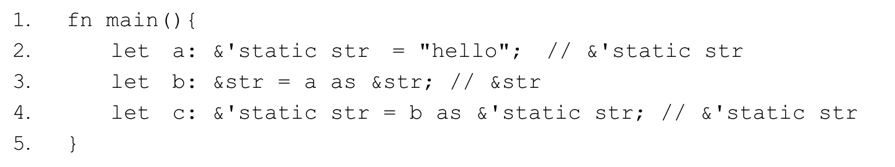{.u54315}
:::

代码清单3-67显示，可以通过as操作符将&＇static str和&＇a str相互转换。

### 3.5.3 From和Into {#text00009.html#Abad1006e-80f3-4150-bed8-333bd41ad773 .title-left}

**From** 和**Into** 是定义于std：：convert模块中的两个trait。它们定义了**from** 和**into** 两个方法，这两个方法互为反操作。代码清单3-68展示了这两个trait的内部实现。

**代码清单3-68：From和Into的内部实现**

::: center
{.u54314}
:::

对于类型T，如果它实现了From＜U＞，则可以通过T：：from（u）来生成T类型的实例，此处u为U的类型实例。代码清单3-69展示了String类型的from方法。

**代码清单3-69：String类型的from方法**

::: center
{.u54313}
:::

对于类型T，如果它实现了Into＜U＞，则可以通过into方法来消耗自身转换为类型U的新实例。代码清单3-70展示了如何使用String类型的into方法来简化代码。

**代码清单3-70：使用into方法来简化代码**

::: center
{.u54312}
:::

代码清单3-70第4行的new方法是一个泛型方法，它允许传入的参数是&str类型或String类型，方便进行开发。使用了＜T：Into＜String＞＞限定就意味着，实现了into方法的类型都可以作为参数。&str和String类型都实现了Into。当参数是&str类型时，会通过into转换为String类型；当参数是String类型时，则什么都不会发生。

关于Into有一条默认的规则：**如果类型U实现了From＜T＞，则T类型实例调用into方法就可以转换为类型U** 。这是因为Rust标准库内部有一个默认的实现，如代码清单3-71所示。

**代码清单3-71：为所有实现了From＜T＞的类型T实现Into＜U＞**

::: center
{.u54311}
:::

代码清单3-72通过String和&str类型展示了这条规则。

**代码清单3-72：可以使用into方法将&str类型转换为String类型**

::: center
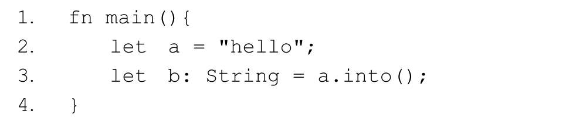{.u54310}
:::

String类型实现了From＜&str＞，所以可以使用into方法将&str转换为String。图3-10形象地展示了From和Into的关系。

::: center
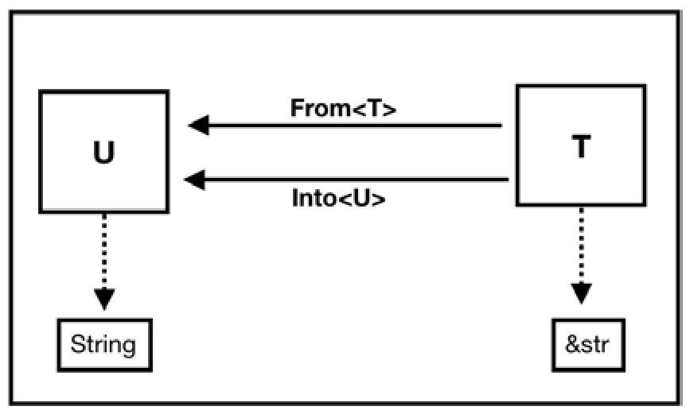{.u54309}

图3-10：From和Into的关系
:::

所以，一般情况下，只需要实现From即可，除非From不容易实现，才需要考虑实现Into。

在标准库中，还包含了**TryFrom** 和**TryInto** 两种trait，是**From** 和**Into** 的错误处理版本，因为类型转换是有可能发生错误的，所以在需要进行错误处理的时候可以使用 **TryFrom** 和**TryInto** 。不过**TryFrom** 和**TryInto** 目前还是实验性特性，只能在Nightly版本下使用，在不久的将来也许会稳定。

另外，标准库中还包含了**AsRef** 和**AsMut** 两种trait，可以将值分别转换为不可变引用和可变引用。AsRef和标准库的另外一个**Borrow** trait功能有些类似，但是AsRef比较轻量级，它只是简单地将值转换为引用，而Borrow trait可以用来将某个复合类型抽象为拥有借用语义的类型。更详细的内容请参考标准库文档。

## 3.6 当前trait系统的不足 {#text00009.html#A3a27006f-0de1-4a2c-8e40-bc16c5ff489c .title-left}

虽然当前的trait系统很强大，但依然有很多需要改进的地方，主要包括以下三点：

· 孤儿规则的局限性。

· 代码复用的效率不高。

· 抽象表达能力有待改进。

接下来分别讨论这三点。

### 3.6.1 孤儿规则的局限性 {#text00009.html#Ad3940070-4ee5-4864-8f8f-f0865dbb6e8b .title-left}

孤儿规则虽然在一定程度上保持了trait的一致性，但是它还有一些局限性。

在设计trait时，还需要考虑是否会影响下游的使用者。比如在标准库实现一些trait时，还需要考虑是否需要为所有的T或&＇a T实现该trait，如代码清单3-73所示。

**代码清单3-73：为所有的T或&＇a T实现Bar trait**

::: center
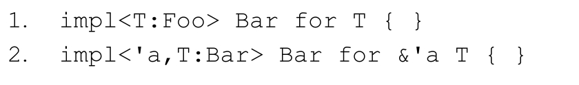{.u54308}
:::

对于下游的子crate来说，如果想要避免孤儿规则的影响，还必须使用NewType模式或者其他方式将远程类型包装为本地类型。这就带来了很多不便。

另外，对于一些本地类型，如果将其放到一些容器中，比如Rc＜T＞或Option＜T＞，那么这些本地类型就会变成远程类型（如代码清单3-74所示），因为这些容器类型都是在标准库中定义的，而非本地。

**代码清单3-74：Option＜T＞会将本地类型变成远程类型**

::: center
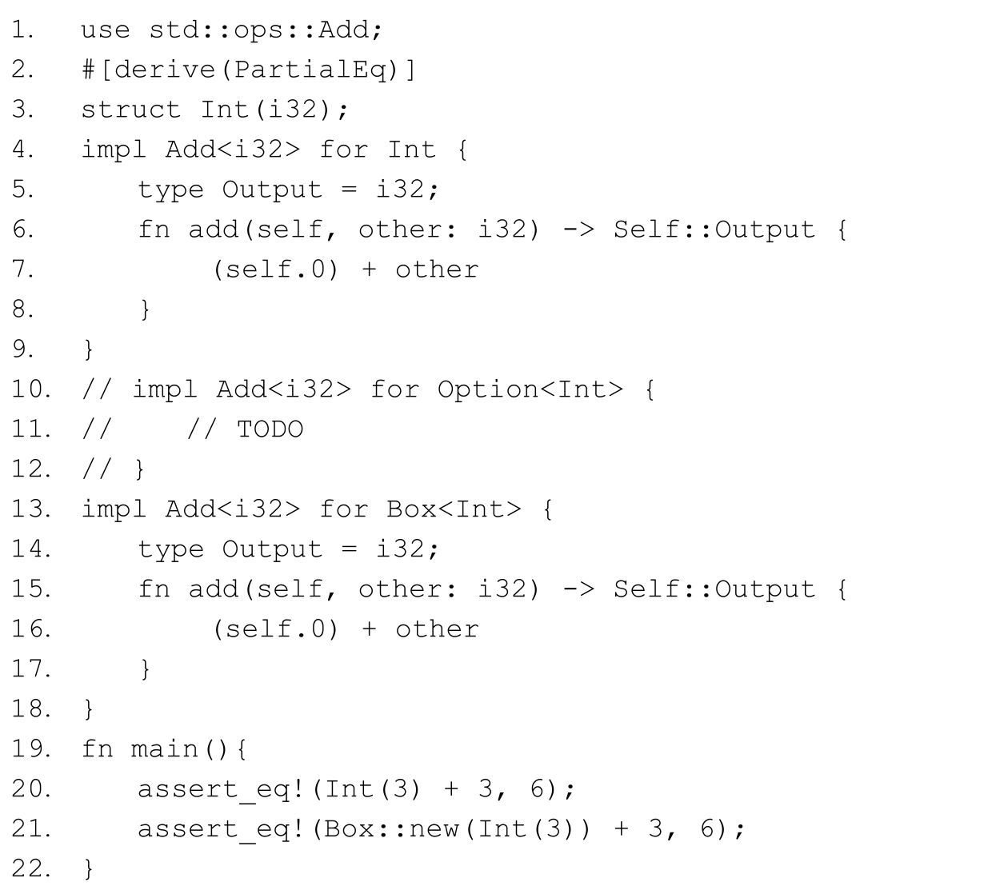{.u54307}
:::

代码清单3-74在本地创建了自定义类型Int，然后为其实现Add trait。Add trait是定义于标准库中的，Int是在本地的，所以并不违反孤儿规则。

但是当给 Option＜Int＞实现 Add 时，编译器就会报错，因为触发了孤儿规则。如代码第10行到第12行所示。

但是当给Box＜Int＞实现Add时，则可以正常编译执行。如代码第20行和第21行所示。看到这里是不是有些困惑？

这是因为Box＜T＞在Rust中属于最常用的类型，经常会遇到像代码清单3-74这样的情况：从子crate为Box＜Int＞这种自定义类型扩展trait实现。标准库中根本做不到覆盖所有的crate中的各种可能性，所以必须将Box＜T＞开放出来，脱离孤儿规则的限制，否则就会限制子crate要实现的一些功能。

那么，Box＜T＞是怎么做到如此特殊的呢？这其实是因为 Rust 内部使用了一个叫**＃\[fundamental\]** 的属性标识，Box＜T＞的实现源码如代码清单3-75所示。

**代码清单3-75：Box＜T＞实现源码示意**

::: center
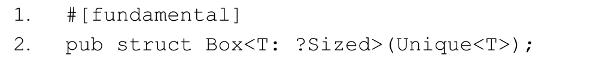{.u54306}
:::

代码清单 3-75 展示了 Box＜T＞的源码示意，可以看到其定义上方标识了**＃\[fundamental\]** 属性，该属性的作用就是告诉编译器，Box＜T＞享有"特权"，不必遵循孤儿规则。

除了Box＜T＞，还有Fn、FnMut、FnOnce、Sized等都加上了**＃\[fundamental\]** 属性，代表这些trait也同样不受孤儿规则的限制。所以，在阅读Rust源码的时候，如果看到该属性标识，就应该知道它和孤儿规则有关。

### 3.6.2 代码复用的效率不高 {#text00009.html#A00aa0071-0d6a-4cd0-960e-56d298b6ecad .title-left}

除了孤儿规则，Rust 其实还遵循另外一条规则：**重叠（Overlap）规则** 。该规则规定了不能为重叠的类型实现同一个trait。什么叫重叠的类型？如代码清单3-76所示。

**代码清单3-76：重叠的类型示意**

::: center
{.u54305}
:::

代码清单3-76中分别为三种类型实现了AnyTrait。

· T是泛型，指代所有的类型。

· T where T：Copy是受trait限定约束的泛型T，指代实现了Copy的一部分T，是所有类型的子集。

· i32是一个具体的类型。

显而易见，上面三种类型发生了重叠。T包含了T：Copy，而T：Copy包含了i32。这违反了重叠规则，所以编译会失败。这种实现 trait 的方式在 Rust 中叫**覆盖式实现（Blanket Impl）** 。

重叠规则和孤儿规则一样，都是为了保证trait一致性，避免发生混乱，但是它也带来了一些问题，主要包括以下两个方面：

· 性能问题。

· 代码很难重用。

性能会有什么问题呢？且看一个示例，如代码清单3-77所示。

**代码清单3-77：为所有类型T实现AddAssign**

::: center
{.u54304}
:::

::: center
{.u54303}
:::

在代码清单3-77中，为所有类型T实现了AddAssign，该trait定义的add_assign方法是+=赋值操作对应的方法。这样实现虽然好，但是会带来性能问题，因为会强制所有类型都使用clone方法，clone方法会有一定的成本开销，但实际上有的类型并不需要clone。因为有重叠规则的限制，不能为某些不需要clone 的具体类型重新实现add_assign方法。所以，在标准库中，为了实现更好的性能，只好为每个具体的类型都各自实现一遍AddAssign。

从代码清单3-77也看得出来，**重叠规则严重影响了代码的复用** 。试想一下，如果没有重叠规则，则可以默认使用上面对泛型 T 的实现，然后对不需要 clone 的类型重新实现AddAssign，那么就完全没必要为每个具体类型都实现一遍add_assign方法，可以省掉很多重复代码。当然，此处只是为了说明重叠规则的问题，实际上在标准库中会使用宏来简化具体的实现代码。

那么为了缓解重叠规则带来的问题，Rust 引入了**特化** （**Specialization** ）。特化功能暂时只能用于impl实现，所以也称为**impl特化** 。不过该功能目前还未稳定发布，只能在Nightly版本的Rust之下使用**＃！\[feature（specialization）\]** 特性。

trait包含默认实现的特化示例如代码清单3-78所示。

**代码清单3-78：trait包含默认实现的特化示例**

::: center
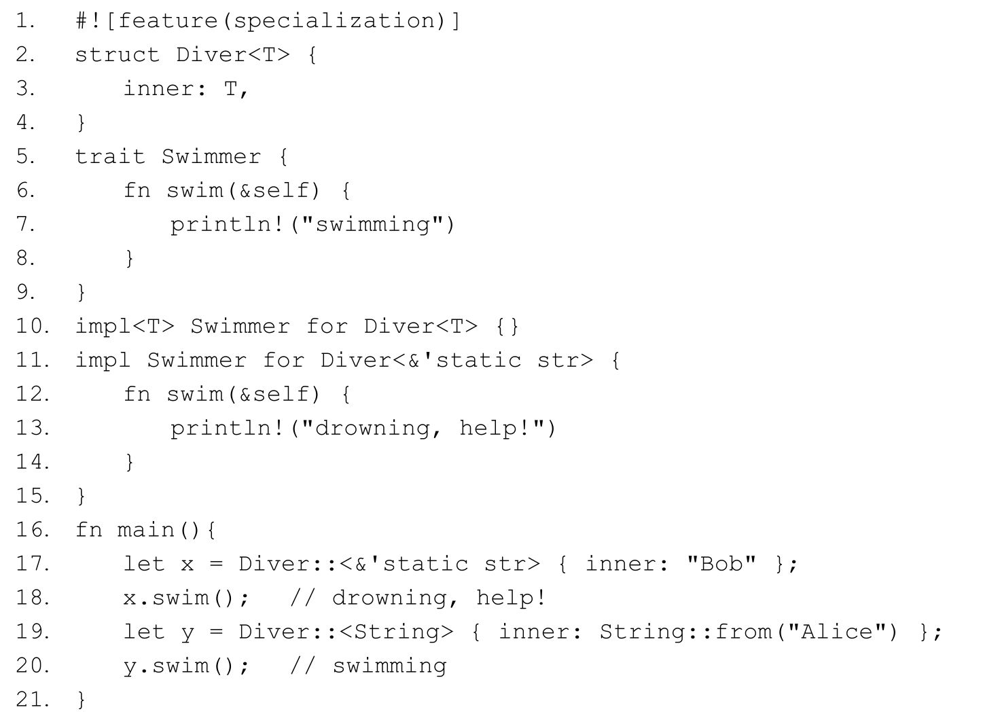{.u54302}
:::

在代码清单 3-78 中，定义了一个泛型结构体 Diver＜T＞，以及一个携带默认实现的Swimmer trait。然后为Diver＜T＞实现了该trait，如第10行所示。

代码第11行到第15行为Diver＜&＇static str＞实现了Swimmer。

然后在main函数中分别调用Diver：：＜&＇static str＞和Diver：：＜String＞类型的swim方法，输出不同的结果。

看得出来，特化功能有点类似面向对象语言中的继承，Diver：：＜String＞"继承"了Diver：：＜T＞中的实现。而Diver：：＜&＇static str＞则使用了本身的swim方法实现。

代码清单3-78展示了trait默认实现的情况。如果trait没有默认实现，特化功能的写法就会稍微有点区别，如代码清单3-79所示。

**代码清单3-79：trait没有默认实现的特化示例**

::: center
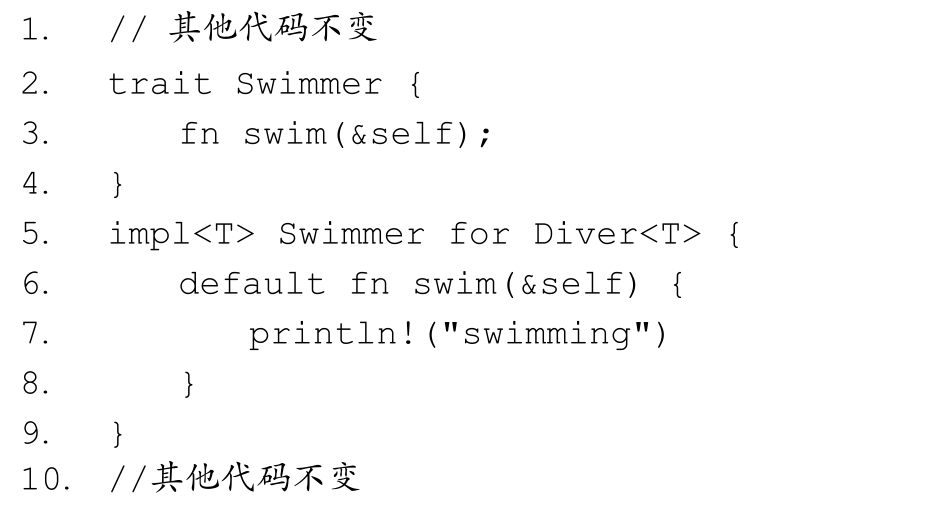{.u54301}
:::

代码清单3-79是对代码清单3-78进行的修改。将原本Swimmer中的默认实现去掉，然后在为Diver＜T＞实现Swimmer的时候编写具体的swim实现。请注意这里多了一个**default** 关键字。代码清单3-78中其余的代码保持不变。

如果不加 default，编译会报错。这是因为默认 impl 块中的方法不可被特化，必须使用default关键字来标记那个需要被特化的方法，这是出于代码的兼容性考虑的。同时，通过显式地使用default标记，也增强了代码的维护性和可读性。

目前特化的功能还在不断地演进和完善，在不远的将来会稳定发布。到时候Rust代码的性能和重用性将会显著提高，而且在特化的支持下，还可能会实现高效的继承方案。让我们拭目以待。

### 3.6.3 抽象表达能力有待改进 {#text00009.html#A14b40073-087d-46d9-8dfb-18d536a13bb6 .title-left}

迭代器在Rust中应用广泛，但是它目前有一个**缺陷：在迭代元素的时候，只能按值进行迭代，有的时候必须重新分配数据，而不能通过引用来复用原始的数据** 。比如标准库中的std：：io：：Lines 类型用于按行读取文件数据，但是该实现迭代器只能读一行数据分配一个新的String，而不能重用内部缓存区。这样就影响了性能。这里提到的迭代器相关的内容会在第6章进行详细介绍。

这是因为迭代器的实现基于关联类型，而关联类型目前只能支持具体的类型，而不能支持泛型。不能支持泛型就导致无法支持引用类型，因为Rust里规定使用引用类型必须标明生命周期参数，而生命周期参数恰恰是一种泛型类型参数。

为了解决这个问题，就必须允许迭代器支持引用类型。只有支持引用类型，才可以重用内部缓存区，而不需要重新分配新的内存。所以，就必须实现一种更高级别的类型多态性，即**泛型关联类型** （**Generic Associated Type，GAT** ） ^[\[3\]](#text00009.html#n5FF80073466548C1A0F88F642D5F184B){#text00009.html#n5FF80073466548C1A0F88F642D5F184Bs}^ ，如代码清单3-80所示。

**代码清单3-80：支持GAT的trait实现示例**

::: center
{.u54300}
:::

::: center
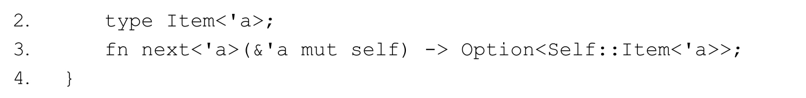{.u54299}
:::

我们在代码清单 3-80 中定义了一种迭代器 StreamingIterator，它的特点是包含了泛型关联类型，这里 Item＜＇a＞中的＇a 就是一种泛型类型参数，叫作生命周期参数，表示这里可以使用引用。

这样一来，如果给std：：io：：Lines实现了StreamingIterator迭代器，它就可以复用内存缓存区，而不需要为每行数据新开辟一份内存，因而提升了性能。

**Item＜＇a＞是一种类型构造器** 。就像Vec＜T＞类型，只有在为其指定具体的类型之后才算一个真正的类型，比如Vec＜i32＞。所以，**GAT** 也被称为**ACT** （**Associated type constructor** ），即**关联类型构造器** 。

但遗憾的是，目前 GAT 功能还在紧张地实现中，还不能使用。在不久的将来，GAT 稳定功能会被发布，到时候将进一步提升Rust类型系统的抽象能力。

## 3.7 小结 {#text00009.html#A01890074-e80f-4176-a99f-1e1692d4d06a .title-left}

本章阐述了Rust最为重要的类型系统：从通用概念开始，介绍了什么是类型系统、类型系统的种类、类型系统中的多态等；然后逐步探索了Rust中的类型系统。如果没有类型系统，Rust语言的安全基石将不复存在。通过学习本章，可以对Rust的类型系统建立完善的**心智模型** （**Mental Model** ），为彻底掌握Rust打下重要的基础。

Rust除了使用类型系统来存储信息，还试图将信息处理过程中的各种行为都纳入类型系统，以防止未定义的行为发生。如果说类型系统是"法律"，那么编译器就是Rust类型系统世界中最严格的"执法者"。编译器在编译期进行严格的类型检查，保证了Rust的内存安全和并发安全。

Rust的类型系统也是其"零成本抽象"的保证。trait是Rust中Ad-hoc多态的实现，trait可以进行接口抽象，对泛型进行限定，支持静态分发。trait 也模糊了类型和行为的界限，让开发者可以在多种类型之上按照行为统一抽象为抽象类型。抽象类型支持 trait 对象和 impl Trait语法，分别为动态分发和静态分发。

最后，我们了解了Rust中的隐式类型转换和显示类型转换的区别和各自的方法。其中隐式类型转换基本上只有自动解引用，它是为了简化编程而提供的。跟其他弱类型语言中的隐式类型转换不一样，Rust中的隐式类型转换是类型安全的。通过as关键字可以对原生类型进行安全的显示转换，但对一些自定义类型，还需要实现AsRef或From/Into这样的trait来支持显式类型转换。

------------------------------------------------------------------------

[\[1\]](#text00009.html#n553B9D8EA0044846A791CAAFC2270E74s){#text00009.html#n553B9D8EA0044846A791CAAFC2270E74} 这里只是从广义上来定义强类型和弱类型。事实上 Rust 也包含自动隐式转换，本章后面会讲到。

[\[2\]](#text00009.html#n7B59ECC43F3747CDB066593DD4153F5Ds){#text00009.html#n7B59ECC43F3747CDB066593DD4153F5D} C语言中的memcpy会从源所指的内存地址的起始位置开始拷贝*n* 个字节，直到目标所指的内存地址的起始位置。可以拷贝任意类型，主要是栈拷贝。

[\[3\]](#text00009.html#n5FF80073466548C1A0F88F642D5F184Bs){#text00009.html#n5FF80073466548C1A0F88F642D5F184B} 相关RFC：https：//github.com/rust-lang/rfcs/blob/master/text/1598-generic_associated_types.md。

[]{#text00010.html}
