# 第4章 内存管理 {#text00010.html#Ae0097119-f28f-4899-a334-6385f17384a3 .title-left}

清空你的杯子，方能再行注满，空无以求全。

在现代计算机体系中，内存是很重要的部件之一，程序的运行离不开内存。不同的编程语言对内存有着不同的管理方式。按照内存的管理方式可将编程语言大致分为两类：**手动内存管理类** 和**自动内存管理类** 。手动内存管理类需要开发者手动使用malloc和free等函数显式管理内存，比如C语言。自动内存管理类使用GC（Garbage Collection，垃圾回收）来对内存进行自动化管理，而无须开发者手动开辟和释放内存，比如Java、C＃、Ruby、Python等语言都是靠GC自动化管理内存的。

手动内存管理的优势在于性能，因为可以直接操控内存，但同时也带来不少问题。有人的地方就有Bug，即使是C/C++语言高手，在写了上千行代码之后，也会有忘记释放内存的情况，就有可能频繁地造成内存泄漏。手动内存管理的另一个常见问题就是悬垂指针（Dangling Pointer）。如果某个指针引用的内存被非法释放掉了，而该指针却依旧指向被释放的内存，这种情况下的指针就叫悬垂指针。如果将悬垂指针分配给某个其他的对象，将会产生无法预料的后果。

GC 自动内存管理接管了开发者分配和回收内存的任务，并帮助提升了代码的抽象度和可靠性。像悬垂指针之类的问题完全可以避免，因为一个被引用的对象的内存永远不会被释放，只有当它不被引用时才可被回收。GC 使用了各种精确的算法来解决内存分配和回收的问题，但并不代表能解决所有的问题。GC 最大的问题是会引起"世界暂停"，GC 在工作的时候必须保证程序不会引入新的"垃圾"，所以要使运行中的程序暂停，这就造成了性能问题。

所以，编程语言的使用现状就是，对性能要求高并且需要对内存进行精确操控的系统级开发，一般只能选择C和C++之类的语言，存在的问题是，如果开发者稍不留神就会造成内存不安全问题。其他类型的开发就选择Java、Python、Ruby之类的高级语言，一般不会出现内存不安全的问题，但是它们的性能却降低了不少。

有没有一门语言能够将两者的优势结合起来，做到既无GC又可以安全地进行手动内存管理，还不缺更高的抽象，可以像其他高级语言那般进行快速开发呢？答案毋庸置疑，有，就是Rust。作为一门强大的系统编程语言，Rust允许开发者直接操控内存，所以了解内存如何工作对于编写出高效的Rust代码至关重要。

## 4.1 通用概念 {#text00010.html#A33d30075-79a8-4d4a-9a0f-77bcc2957b56 .title-left}

现代操作系统在保护模式下都采用虚拟内存管理技术。虚拟内存是一种对物理存储设备的统一抽象，其中物理存储设备包括物理内存、磁盘、寄存器、高速缓存等。这样统一抽象的好处是，方便同时运行多道程序，使得每个进程都有各自独立的进程地址空间，并且可以通过操作系统调度将外存当作内存来使用。这就引出了一个新的概念：**虚拟地址空间** 。

虚拟地址空间是线性空间，用户所接触到的地址都是虚拟地址，而不是真实的物理地址。利用这种虚拟地址不但能保护操作系统，让进程在各自的地址空间内操作内存，更重要的是，用户程序可以使用比物理内存更大的地址空间。虚拟地址空间被人为地分为两部分：**用户空间** 和**内核空间** ，它们的比例是3：1（Linux系统中）或2：2（Windows系统中）。以Linux系统为例，32 位计算机的地址空间大小是 4GB，寻址范围是 0x00000000～0xFFFFFFFF。然后通过内存分页等底层复杂的机制来把虚拟地址翻译为物理地址，如图4-1所示。

::: center
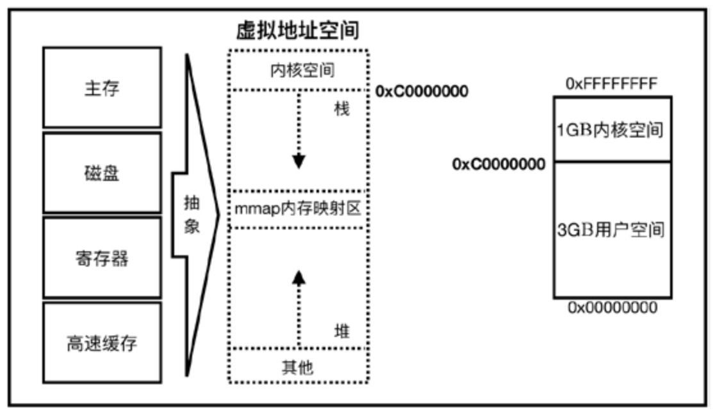{.u54298}

图4-1：Linux系统中的虚拟地址空间示意图
:::

图4-1是Linux虚拟地址空间的示意图，其中值得注意的是用户空间中的**栈** （**stack** ）和**堆** （**heap** ）。图中箭头的方向代表内存增长的方向，栈向下（由高地址向低地址）增长，堆向上（由低地址向高地址）增长 ^[\[1\]](#text00010.html#n7383007617FA487682293C2143D63A9A){#text00010.html#n7383007617FA487682293C2143D63A9As}^ ，这样的设计是为了更加有效地利用内存。关于虚拟内存的其他细节不在本章讨论范围内，因此不展开讲述。

### 4.1.1 栈 {#text00010.html#A1abd0076-0983-4906-8609-074ddcbbd0c4 .title-left}

栈（stack），也被称为堆栈，但是为了避免歧义，本书只称其为栈。栈一般有两种定义，一种是指数据结构，一种是指栈内存。

在数据结构中，栈是一种特殊的线性表，如图4-2所示。其特殊性在于限定了插入和删除数据只能在线性表固定的一端进行。

图4-2展示了栈的特性，操作栈的一端被称为**栈顶** ，相反的一端被称为**栈底** 。从栈顶压入数据叫**入栈** （**push** ），从栈顶弹出数据叫**出栈** （**pop** ），这意味着最后一个入栈的数据会第一个出栈，所以栈被称为**后进先出（LIFO，Last in First Out）线性表** 。

::: center
{.u54297}

图4-2：栈示意图
:::

物理内存本身并不区分堆和栈，但是虚拟内存空间需要分出一部分内存，用于支持CPU入栈或出栈的指令操作，这部分内存空间就是**栈内存** 。栈内存拥有和栈数据结构相同的特性，支持入栈和出栈操作，数据压入的操作使栈顶的地址减少，数据弹出的操作使栈顶的地址增多，如图4-3所示。

::: center
{.u54296}

图4-3：栈内存示意图
:::

栈顶由栈指针寄存器ESP保存，起初栈顶指向栈底的位置，当有数据入栈时，栈顶地址向下增长，地址由高地址变成低地址；当有数据被弹出时，栈顶地址向上增长，地址由低地址变成高地址。因此，降低ESP的地址等价于开辟栈空间，增加ESP的地址等价于回收栈空间。

**栈内存最重要的作用是在程序运行过程中保存函数调用所要维护的信息** 。存储每次函数调用所需信息的记录单元被称为**栈帧** （**Stack Frame** ，如图4-4所示），有时也被称为**活动记录** （**Activate Record** ）。因此栈内存被栈帧分割成了*N* 个记录块，而且这些记录块都是大小不一的。

::: center
{.u54295}

图4-4：栈帧示意图
:::

栈帧一般包括三方面的内容：

· 函数的返回地址和参数。

· **临时变量** 。包括函数内部的非静态局部变量和编译器产生的临时变量。

· 保存的上下文。

EBP指针是**帧指针** （**Frame Pointer** ），它指向当前栈帧的一个固定的位置，而ESP始终指向栈顶。EBP指向的值是调用该函数之前的旧的EBP值，这样在函数返回时，就可以通过该值恢复到调用前的值。由 EBP 指针和 ESP 指针构成的区域就是一个栈帧，一般是指**当前栈帧** 。

栈帧的分配非常快，其中的局部变量都是预分配内存，在栈上分配的值都是可以预先确定大小的类型。当函数结束调用的时候，栈帧会被自动释放，所以**栈上数据的生命周期都是在一个函数调用周期内的** 。

我们可以通过一个具体的代码示例来了解上述过程。代码清单4-1展示了一个函数调用过程，该程序由foo函数和main函数组成，其中包括x、y和z三个变量。

**代码清单4-1：通过简单函数调用展示栈帧**

::: center
{.u54294}
:::

代码清单4-1中的**main** 函数为入口函数，所以首先被调用。main函数中声明了变量x，在调用foo函数前，main函数先在栈里开辟了空间，压入了x变量。栈帧里EBP指向起始位置，变量x保存在帧指针EBP-4（只是为了演示）偏移处。

在调用 foo 函数时，将返回地址压入栈中，然后由 PC 指针（程序计数器）引导执行函数调用指令，进入foo函数栈帧中。此时同样在栈中开辟空间，依次将main函数的EBP地址、参数x以及局部变量y和z压入栈中。EBP指针依旧指向地址为0的固定位置，表明当前是在foo函数栈帧中，通过EBP-4、EBP-8和EBP-12就可以访问参数和变量。当foo函数执行完毕时，其参数或局部变量会依次弹出，直到得到main函数的EBP地址，就可以跳回main函数栈帧中，然后通过返回地址就可以继续执行main函数中其余的代码了，这个过程如图4-5所示。

::: center
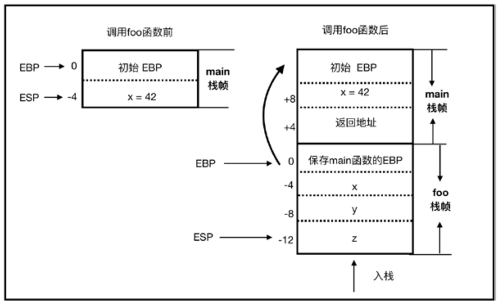{.u54293}

图4-5：函数调用栈帧示意图
:::

在上述过程中，调用main和foo函数时，栈顶ESP地址会降低，因为要分配栈内存，栈向下增长，当foo函数执行完毕时，ESP地址会增长，因为栈内存会被释放。**随着栈内存的释放，函数中的局部变量也会被释放** ，所以可想而知，全局变量不会被存储到栈中。该过程说来简单，但其实底层涉及寻址、寄存器、汇编指令等比较复杂的协作过程，这些都是由编译器或解释器自动完成的，对于上层开发者来说，只需要了解栈内存的工作机制即可。

栈内存的工作方式是一个通用概念，不仅仅适用于Rust语言，也适用于其他编程语言。

### 4.1.2 堆 {#text00010.html#A5d1e0079-a874-4867-abd0-e0315b50c0c3 .title-left}

与栈类似，**堆** （heap）一般也有两种定义，一种是指数据结构，另一种是指堆内存。

在数据结构中，堆表示一种特殊的树形数据结构，特殊之处在于此树是一棵完全二叉树，它的特点是父节点的值要么都大于两个子节点的值，称为**大顶堆；** 要么都小于两个子节点的值，称为**小顶堆** 。一般用于实现堆排序或优先队列。栈数据结构和栈内存在特性上还有所关联，但**堆数据结构和堆内存并无直接的联系** 。

栈内存中保存的数据，生命周期都比较短，会随着函数调用的完成而消亡。但很多情况下会需要能相对长久地保存在内存中的数据，以便跨函数使用，这就是堆内存发挥作用的地方。堆内存是一块巨大的内存空间，占了虚拟内存空间的绝大部分。程序不可以主动申请栈内存，但可以主动申请堆内存。在堆内存中存放的数据会在程序运行过程中一直存在，除非该内存被主动释放掉。

在C语言中，程序员可以通过调用malloc函数来申请堆内存，并可以通过free函数来释放它；在C++语言中，可以使用new和delete函数。包含GC的编程语言则是由GC来分配和回收堆内存的。

在实际工作中，对于事先知道大小的类型，可以分配到栈中，比如固定大小的数组。但是如果需要动态大小的数组，则需要使用堆内存。开发者只能通过指针来掌握已分配的堆内存，这本身就带来了安全隐患，如果指针指向的堆内存被释放掉但指针没有被正确处理，或者该指针指向一个不合法的内存，就会带来内存不安全问题。所以，面向对象大师Bertrand Meyer ^[\[2\]](#text00010.html#nAE7213BA37464AE5BB3C8D0CB9D5F828){#text00010.html#nAE7213BA37464AE5BB3C8D0CB9D5F828s}^ 才会说："要么保证软件质量，要么使用指针，两者不可兼得。"

堆是一大块内存空间，程序通过malloc申请到的内存空间是大小不一、不连续且无序的，所以如何管理堆内存是一个问题。这就涉及堆分配算法，堆分配算法有很多种，就本质而言可以分为两大类：**空闲链表** （**Free List** ）和**位图标记** （**Bitmap** ）。

空闲链表实际上就是把堆中空闲的内存地址记录为链表，当系统收到程序申请时，会遍历该链表；当找到适合的空间堆节点时，会将此节点从链表中删除；当空间被回收以后，再将其加到空闲链表中。空闲链表的优势是实现简单，但如果链表遭到破坏，整个堆就无法正常工作。

位图的核心思想是将整个堆划分为大量大小相等的块。当程序申请内存时，总是分配整数个块的空间。每块内存都用一个二进制位来表示其状态，如果该内存被占用，则相应位图中的位置置为 1；如果该内存空闲，则相应位图中的位置置为 0。位图的优势是速度快，如果单个内存块数据遭到破坏，也不会影响整个堆，但缺点是容易产生内存碎片。

不管是什么算法，分配的都是虚拟地址空间。所以当堆空间被释放时，并不代表指物理空间也马上被释放。堆内存分配函数 malloc 和回收函数 free 背后是内存分配器（memory allocator），比如glibc的内存分配器ptmallac2，或者FreeBSD平台的jemalloc。这些内存分配器负责管理申请和回收堆内存，当堆内存释放时，内存被归还给了内存分配器。内存分配器会对空闲的内存进行统一"整理"，在适合（比如空闲内存达到2048KB）的时候，才会把内存归还给系统，也就是指释放物理空间。

Rust编译器目前自带两个默认分配器：**alloc_system** 和**alloc_jemalloc** 。在**Rust 2015** 版本下，编译器产生的二进制文件默认使用alloc_jemalloc（某些平台可能不支持jemalloc），而对于静态或动态链接库，默认使用alloc_system。在**Rust 2018** 版本下，默认使用alloc_system，并且可以由开发者自己指派Jemalloc或其他第三方分配器。

Jemalloc的优势有以下几点：

· 分配或回收内存更快速。

· 内存碎片更少。

· 多核友好。

· 良好的可伸缩性。

Jemalloc 是现代化的业界流行的内存分配解决方案，它整块批发内存（称为 chunk）以供程序使用，而非频繁地使用系统调用（比如 brk 或 mmap）来向操作系统申请内存。其内存管理采用层级架构，分别是线程缓存tcache、分配区arena和系统内存（system memory），不同大小的内存块对应不同的分配区。每个线程对应一个 tcache，tcache 负责当前线程所使用内存块的申请和释放，避免线程间锁的竞争和同步。tcache是对arena中内存块的缓存，当没有tcache时则使用arena分配内存。arena采用内存池思想对内存区域进行了合理划分和管理，在有效保证低碎片的前提下实现了不同大小内存块的高效管理。当 arena 中有不能分配的超大内存时，再直接使用mmap从系统内存中申请，并使用红黑树进行管理。

即使堆分配算法再好，也只是解决了堆内存合理分配和回收的问题，其访问性能远不如栈内存。存放在堆上的数据要通过其存放于栈上的指针进行访问，这就至少多了一层内存中的跳转。所以，能放在栈上的数据最好不要放到堆上。因此，Rust的类型默认都是放到栈上的。

### 4.1.3 内存布局 {#text00010.html#Ab673007b-2077-4c2b-9c01-39ff226f7733 .title-left}

内存中数据的排列方式称为**内存布局** 。不同的排列方式，占用的内存不同，也会间接影响CPU访问内存的效率。为了权衡空间占用情况和访问效率，引入了内存对齐规则。

CPU在单位时间内能处理的一组二进制数称为**字** ，这组二进制数的位数称为**字长** 。如果是32位CPU，其字长为32位，也就是4个字节。一般来说，字长越大，计算机处理信息的速度就越快，例如，64位CPU就比32位CPU效率更高。

以32位CPU为例，CPU每次只能从内存中读取4个字节的数据，所以每次只能对4的倍数的地址进行读取。

假设现有一整数类型的数据，首地址并不是4的倍数，不妨设为0x3，则该类型存储在地址范围是 0x3～0x7 的存储空间中。因此，CPU 如果想读取该数据，则需要分别在 0x1 和0x5处进行两次读取，而且还需要对读取到的数据进行处理才能得到该整数，如图4-6所示。CPU 的处理速度比从内存中读取数据的速度要快得多，因此减少 CPU 对内存空间的访问是提高程序性能的关键。

::: center
{.u54292}

图4-6：CPU读取首地址非4的倍数的数据
:::

因此，采取内存对齐策略是提高程序性能的关键。对于图4-6中展示的整数类型，因为是32位CPU，所以只需要按4字节对齐，如图4-7所示，CPU只需要读取一次。

::: center
{.u54291}

图4-7：CPU读取内存对齐数据
:::

因为对齐的是字节，所以内存对齐也叫**字节对齐** 。内存对齐是编译器或虚拟机（比如JVM）的工作，不需要人为指定，但是作为开发者需要了解内存对齐的规则，这有助于编写出合理利用内存的高性能程序。

内存对齐包括基本数据对齐和结构体（或联合体）数据对齐。对于基本数据类型，默认对齐方式是按其大小进行对齐，也被称作**自然对齐** 。比如Rust中u32类型占4字节，则它默认对齐方式为4字节对齐。对于内部含有多个基本类型的结构体来说，对齐规则稍微有点复杂。

假设对齐字节数为*N* （*N* =1，2，4，8，16），每个成员内存长度为Len，Max（Len）为最大成员内存长度。如果没有外部明确的规定，*N* 默认按Max（Len）对齐。字节对齐规则为：

· 结构体的起始地址能够被Max（Len）整除。

· 结构体中每个成员相对于结构体起始地址的偏移量，即对齐值，应该是 Min（N，Len）的倍数，若不满足对齐值的要求，编译器会在成员之间填充若干个字节。

· 结构体的总长度应该是Min（N，Max（Len））的倍数，若不满足总长度要求，则编译器会在为最后一个成员分配空间后，在其后面填充若干个字节。

下面用代码清单4-2中展示的Rust结构体验证此规则。

**代码清单4-2：以Rust中的结构体为例验证结构体字节对齐规则**

::: center
{.u54290}
:::

代码清单4-2中的std：：mem：：size_of：：＜A＞（）函数可以计算结构体A的内存占用大小。基本数据类型u8占1个字节，u32占4个字节，u16占2个字节。结构体A的内存对齐（即字节对齐）前后的布局对比如图4-8所示。

::: center
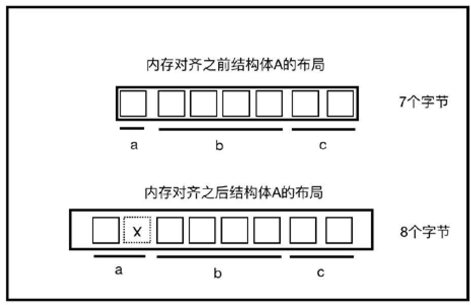{.u54289}

图4-8：结构体A的内存对齐前后的布局对比
:::

图4-8中的一个方块代表一个字节，注意一个字节是8个比特位。内存对齐之前，结构体A占用7个字节。代码清单4-2中结构体A没有明确指定字节对齐值，所以默认按其最长成员的值来对齐，结构体A中最长的成员是b，占4个字节。那么对于成员a来说，它的对齐值为Min（4，1），即1，所以a需要补齐一个字节的空间，如图4-8中虚线x框所示，那么现在a的大小是2个字节。成员b已经是对齐的，成员c是结构体中最后一位成员，当前结构体A的总长度为a、b、c之和，占8个字节，正好是Min（4，4），也就是4的倍数，所以成员c不需要再补齐。而结构体A实际占用也是8个字节。

联合体（Union）和结构体不同的地方在于，联合体中的所有成员都共享一段内存，所有成员的首地址都是一样的，但为了能够容纳所有成员，就必须可以容纳其中最长的成员。所以联合体以最长成员为对齐数。代码清单4-3展示了Rust中的联合体字节对齐。

**代码清单4-3：Rust中联合体字节对齐**

::: center
{.u54288}
:::

在代码清单4-3中，**f1** 和**f2** 各占4个字节，**f3** 占8个字节，其中f3最长，所以联合体U占8个字节。f1、f2和f3共用内存，8个字节够用了。

## 4.2 Rust中的资源管理 {#text00010.html#Ae886007d-1400-4387-8032-6f1daf25483d .title-left}

采用虚拟内存空间在栈和堆上分配内存，这是诸多编程语言通用的内存管理基石，Rust当然也不例外。然而，与C/C++语言不同的是，Rust不需要开发者显式地通过malloc/new或free/delete 之类的函数去分配和回收堆内存。Rust 可以静态地在编译时确定何时需要释放内存，而不需要在运行时去确定。Rust有一套完整的内存管理机制来保证资源的合理利用和良好的性能。

### 4.2.1 变量和函数 {#text00010.html#Ad58e007d-482d-40c6-9bf4-97a0e3697788 .title-left}

第2章提到过，变量有两种：**全局变量** 和**局部变量** 。全局变量分为**常量变量** 和**静态变量** 。局部变量是指在函数中定义的变量。

常量使用 **const** 关键字定义，并且需要显式指明类型，只能进行简单赋值，只能使用支持CTFE的表达式。常量没有固定的内存地址，因为其生命周期是全局的，随着程序消亡而消亡，并且会被编译器有效地内联到每个使用到它的地方。

静态变量使用 **static** 关键字定义，跟常量一样需要显式指明类型，进行简单赋值，而不能使用任何表达式。静态变量的生命周期也是全局的，但它并不会被内联，每个静态变量都有一个固定的内存地址。

静态变量并非被分配到栈中，也不是在堆中，而是和程序代码一起被存储于**静态存储区** 中。静态存储区是伴随着程序的二进制文件的生成（编译时）被分配的，并且在程序的整个运行期都会存在。Rust中的字符串字面量同样是存储于静态内存中的。

**检测是否声明未初始化变量**

**在函数中定义的局部变量都会被默认存储到栈中** 。这和C/C++语言，甚至更多的语言行为都一样，但不同的是，Rust编译器可以检查未初始化的变量，以保证内存安全，如代码清单4-4所示。

**代码清单4-4：检查未初始化变量**

::: center
{.u54287}
:::

代码清单4-4编译会报如下错误：

::: center
{.u54286}
:::

Rust编译器会对代码做基本的静态分支流程分析。代码清单4-4中的x在整个main函数中并没有绑定任何值，这样的代码会引起很多内存不安全的问题，比如计算结果非预期、程序崩溃等，所以Rust编译器必须报错。

**检测分支流程是否产生未初始化变量**

Rust编译器的静态分支流程分析比较严格。代码清单4-5展示了if语句中初始化变量的情况。

**代码清单4-5：if语句中初始化变量**

::: center
{.u54285}
:::

在代码清单4-5中，if分支的所有情况都给变量x绑定了值，所以它可以正确运行。但是如果去掉else分支，编译器就会报以下错误：

::: center
{.u54284}
:::

这说明编译器已经检查出变量x并未正确初始化。这可能有点反直觉，去掉了else分支之后，编译器的静态分支流程分析判断出在if表达式之外的println！也用到了变量x，但并未有任何值绑定行为。第2章提到过，编译器的静态分支流程分析并不能识别if表达式中的条件是true，所以它要检查所有的分支情况。

如果把代码清单4-5中else分支和第8行的println！语句都去掉，则可以正常编译运行。因为在if表达式之外再没有使用到x的地方，在唯一使用到x的if表达式中已经绑定了值，所以编译正常。

**检测循环中是否产生未初始化变量**

还有另外一种情况值得考虑，当在循环中使用 break 关键字的时候（如代码清单 4-6 所示），break会将分支中的变量值返回。

**代码清单4-6：在loop循环中使用break关键字**

::: center
{.u54283}
:::

::: center
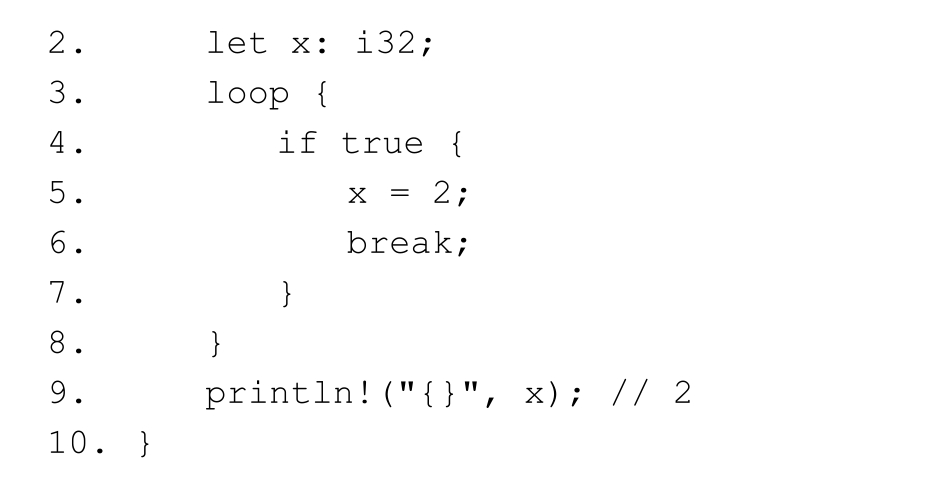{.u54282}
:::

从Rust编译器的静态分支流程分析可以知道，break会将x的值返回，所以在loop循环之外的println！语句可以正常打印x的值。

**空数组或向量可以初始化变量**

当变量绑定空的数组或向量时（如代码清单4-7所示），需要显式指定类型，否则编译器无法推断其类型。

**代码清单4-7：绑定空数组或向量**

::: center
{.u54281}
:::

如果不加显式类型标注，编译器会报如下错误：

::: center
{.u54280}
:::

空数组或向量可以用来初始化变量，但目前暂时无法用于初始化常量或静态变量。

**转移所有权产生了未初始化变量**

当将一个已初始化的变量y绑定给另外一个变量y2时（如代码清单4-8所示），Rust会把变量y看作逻辑上的**未初始化变量** 。

**代码清单4-8：将已初始化变量绑定给另外一个变量**

::: center
{.u54279}
:::

在代码清单4-8中，变量x为原生整数类型，默认存储在栈上。变量y属于指针类型，通过Box：：new方法在堆上分配的内存返回指针，并与y绑定，而指针y被存储于栈上，可以通过第4行println！语句打印指针地址验证这一点，代码清单4-8中的main函数的变量内存布局如图4-9所示。

::: center
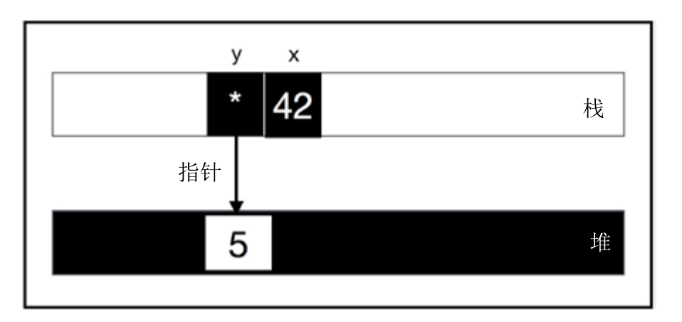{.u54278}

图4-9：main函数中变量内存布局示意图
:::

第5行代码让变量x2绑定了变量x，因为x是原生整数类型，实现了Copy trait，所以这里变量x并未发生任何变化。但是在第6行代码中，变量y2绑定了变量y，因为y是Box＜T＞指针，并未实现Copy trait，所以此时y的值会移动给y2，而变量y会被编译器看作一个未初始化的变量，所以当第7行代码再次使用变量y时，编译器就会报错。但是此时如果给y再重新绑定一个新值，y依然可用，这个过程称为**重新初始化** 。

当main函数调用完毕时，栈帧会被释放，变量x和y也会被清空。变量x为原生类型，本就存储在栈上，所以被释放是没关系的。但是变量y是指针，如果就这样被清空，那么其指向的已分配堆内存怎么办？代码清单4-8中并没有使用free之类的函数去清空堆内存，这会引起内存泄漏的问题吗？答案是不会，因为 Box＜T＞类型的指针会在变量 y 被清空之时，自动清空其指向的已分配堆内存。

像Box＜T＞这样的指针被称为**智能指针** 。使用智能指针，可以让Rust利用栈来隐式自动释放堆内存，从而避免显式调用free之类的函数去释放内存。这样其实更加符合开发者的直觉。

### 4.2.2 智能指针与RAII {#text00010.html#Ad30b0080-c9a0-4935-887b-e52e3f786bd6 .title-left}

Rust中的指针大致可以分为三种：**引用** 、**原生指针** （裸指针）和**智能指针** 。

引用就是Rust提供的普通指针，用&和&mut操作符来创建，形如&T和&mut T。原生指针是指形如\*const T和\*mut T这样的类型。

引用和原生指针类型之间的异同如下。

· 可以通过as操作符随意转换，例如&T as\*const T和&mut T as\*mut T。

· 原生指针可以在 unsafe 块下任意使用，不受 Rust 的安全检查规则的限制，而引用则必须受到编译器安全检查规则的限制。

**智能指针**

智能指针（smart pointer）实际上是一种结构体，只不过它的行为类似指针。智能指针是对指针的一层封装，提供了一些额外的功能，比如自动释放堆内存。智能指针区别于常规结构体的特性在于，它实现了**Deref** 和**Drop** 这两个trait。Deref提供了解引用能力，Drop提供了自动析构的能力，正是这两个trait让智能指针拥有了类似指针的行为。类型决定行为，同时类型也取决于行为，不是指针胜似指针，所以称其为智能指针。开发者也可以编写自己的智能指针。

第3章已经着重介绍过Deref，用它可以重载解引用运算符**\*** 。智能指针结构体中实现了Deref，重载了解引用运算符的行为。其实String和Vec类型也是一种智能指针（如代码清单4-9所示），它们也都实现了Deref和Drop。

**代码清单4-9：String和Vec类型也是一种智能指针**

::: center
{.u54277}
:::

String 类型和 Vec 类型的值都是被分配到堆内存并返回指针的，通过将返回的指针封装来实现Deref和Drop，以自动化管理解引用和释放堆内存。代码清单4-9中第3行代码对变量s进行了解引用操作，其返回的是str类型，因为str是大小不确定的类型，所以编译器会报错，这里将其注释掉了，String 类型和 Vec 类型虽然是智能指针的一种，但并不是让开发者把它们当作指针来使用的。这里只是为了演示说明，真实代码中并不会这样用。同理，第5行代码对变量v解引用，返回的是\[u32\]类型，依然是大小不确定的类型，所以这里也将其注释掉了。

当main函数执行完毕，栈帧释放，变量s和v被清空之后，其对应的已分配堆内存会被自动释放。这是因为它们实现了Drop。

Drop对于智能指针来说非常重要，因为它可以帮助智能指针在被丢弃时自动执行一些重要的清理工作，比如**释放堆内存** 。更重要的是，除了释放内存，Drop还可以做很多其他的工作，比如释放文件和网络连接。Drop的功能有点类似GC，但它比GC的应用更加广泛，GC只能回收内存，而Drop可以回收内存及内存之外的一切资源。

**确定性析构**

其实这种资源管理的方式有一个术语，叫**RAII** （**Resource Acquisition Is Initialization** ），意思是资源获取及初始化。RAII和智能指针均起源于现代C++，智能指针就是基于RAII机制来实现的。

在现代C++中，RAII的机制是使用构造函数来初始化资源，使用析构函数来回收资源。看上去RAII所要做的事确实跟GC差不多。但RAII和GC最大的不同在于，RAII将资源托管给创建堆内存的**指针对象** 本身来管理，并保证资源在其生命周期内始终有效，一旦生命周期终止，资源马上会被回收。而GC是由第三方只针对内存来统一回收垃圾的，这样就很被动。正是因为RAII的这些优势，Rust也将其纳入了自己的体系中。

Rust中并没有现代C++所拥有的那种构造函数（constructor），而是直接对每个成员的初始化来完成构造，也可以直接通过封装一个静态函数来构造"构造函数"。而Rust中的Drop就是析构函数（Destructor）。

Drop被定义于std：：ops模块中，其内部实现如代码清单4-10所示。

**代码清单4-10：Drop的内部实现**

::: center
{.u54276}
:::

从代码清单4-10可以看出来，Drop已经被标记为语言项，这表明该trait为语言本身所用，比如智能指针被丢弃后自动触发析构函数时，编译器知道该去哪里找Drop。

代码清单4-11通过为结构体实现Drop来展示其特性。

**代码清单4-11：为结构体实现Drop**

::: center
{.u54275}
:::

代码清单4-11中定义了元组结构体S，通过impl为结构体S实现了Drop定义的drop方法，令其在被调用的时候执行指定的打印输出。main函数中声明了两个结构体实例x和y，y被置于内部scope中。

代码清单4-11的输出结果如代码清单4-12所示。

**代码清单4-12：为结构体实现Drop的输出结果**

::: center
{.u54274}
:::

在代码清单4-11中，变量x的作用域范围是整个main函数，而变量y的作用域范围是内部scope所界定的范围。通过输出结果来看，在变量x和y分别离开其作用域时，都执行了drop方法。所以RAII也有另外一个别名，叫**作用域界定的资源管理** （**Scope-Bound Resource Management** ，**SBRM** ）。

**这也正是Drop的特性，它允许在对象即将消亡之时，自行调用指定代码（drop方法）** 。

Rust中的一些常用类型，比如Vec、String和File等，均实现了Drop，所以不管是开发者使用Vec创建的动态数组被丢弃时，还是使用String类型创建的字符串被丢弃时，都不需要显式地释放堆内存，也不需要使用File进行文件读取，甚至不需要显式地关闭文件，因为Rust会自动完成这些操作。

**使用Valgrind来检测内存泄漏**

代码清单4-13使用了Box＜T＞指针来分配堆内存，并配合一款知名的专门用于内存调试和检测内存泄漏的工具Valgrind来验证其是否有内存泄漏。

**代码清单4-13：使用Box＜T＞指针分配内存**

::: center
{.u54273}
:::

将代码清单4-13保存到box.rs文件中，使用rustc命令将其编译为二进制文件box：

::: center
{.u54272}
:::

然后再执行如下命令：

::: center
{.u54271}
:::

输出结果为：

::: center
{.u54270}
:::

Valgrind给出了提示：所有堆内存都已释放。证明了Box＜T＞指针随着栈帧销毁而被丢弃时，自动调用了析构函数，释放了堆内存。

**drop-flag**

在代码清单4-13中，变量box1和box3的析构函数分别是在离开main函数和create_box函数之后调用的。而变量 box2 是在离开由花括号构造的显式内部作用域时调用的。它们的析构函数调用顺序是在编译期（而非运行时）就确定好的。这是因为Rust编译器使用了名为**drop-flag** 的"魔法"，在函数调用栈中为离开作用域的变量自动插入布尔标记，标注是否调用析构函数，这样，在运行时就可以根据编译期做的标记来调用析构函数了。

对于结构体或枚举体这种复合类型来说，并不存在隐式的drop-flag。只有在函数调用时，这些复合结构实例被初始化之后，编译器才会加上drop-flag。如果复合结构本身实现了Drop，则会调用它自己的析构函数；否则，会调用其成员的析构函数。

当变量被绑定给另外一个变量，值发生移动时，也会被加上drop-flag，在运行时会调用析构函数。加上drop-flag的变量意味着其生命周期的结束，之后再也不能被访问。这其实就是第5章会讲到的所有权机制。

这意味着，可以使用花括号构造显式作用域来"主动析构"那些需要提前结束生命周期的变量，如代码清单4-14所示。

**代码清单4-14：使用花括号构造显式作用域主动析构局部变量**

::: center
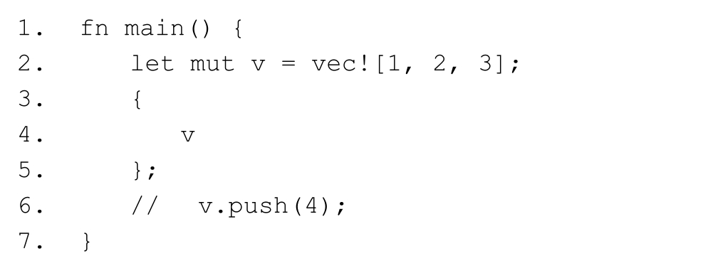{.u54269}
:::

在代码清单4-14中，变量v被置于花括号构造的显式内部作用域中，当其离开此内部作用域时，就会调用v的析构函数，所以如果在内部作用域外使用push方法，则会报错，因为变量v已经被释放了。

值得注意的是，对于实现Copy的类型，是没有析构函数的。因为实现了Copy的类型会复制，其生命周期不受析构函数的影响，所以也就没必要存在析构函数。

同时，**变量遮蔽** （**shadowing** ）并不会导致其生命周期提前结束，如代码清单4-15所示。

**代码清单4-15：变量遮蔽不等于生命周期提前结束**

::: center
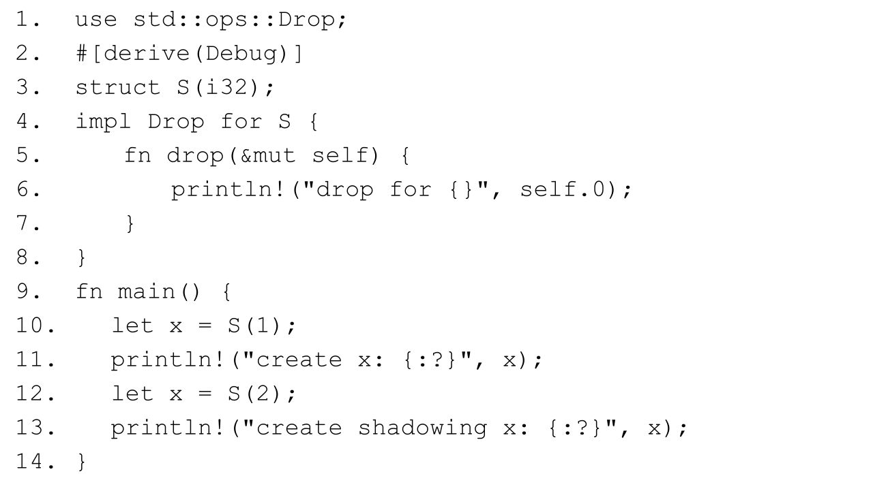{.u54268}
:::

代码清单4-15的输出结果表明，变量遮蔽并不会主动析构原来的变量，它会一直存在，直到函数退出。

### 4.2.3 内存泄漏与内存安全 {#text00010.html#A27810084-7501-4d2d-94f3-4fde8f6a1551 .title-left}

RAII的设计目标就是替代GC，防止内存泄漏。然而RAII并非"银弹"，如果使用不当，还是会造成内存泄漏的。

**制造内存泄漏**

有的时候，需要对同一个堆内存块进行多次引用。比如，要创建一个链表，如图4-10所示。

::: center
{.u54267}

图4-10：创建链表示意图
:::

那么，首先需要创建一个节点Node结构体，如代码清单4-16所示。

**代码清单4-16：链表节点Node结构体**

::: center
{.u54266}
:::

仔细思考，此处NodePtr＜T＞该如何设计呢？可以设想一下伪代码：

::: center
{.u54265}
:::

这里的NodePtr＜T＞首先是一个Option＜T＞，因为链表的结尾节点之后有可能不存在下一个节点，所以需要 Some＜T＞和 None。然后，还需要一个智能指针来保持节点之间的连接，所以此处设想NodePtr＜T＞为Opiton＜Box＜Node＜T＞＞＞。

然后就是对node1.next和node2.next赋值，使得node1、node2和node3节点相连，就像图4-10展示的那样。但是这里有个问题，因为Box＜T＞指针对所管理的堆内存有唯一拥有权，所以并不共享。代码清单4-17展示了如何使用Box＜T＞来构造链表节点之间的指针。

**代码清单4-17：使用Box＜T＞来构造链表节点之间的指针**

::: center
{.u54264}
:::

代码清单4-17编译会报如下错误：

::: center
{.u54263}
:::

代码清单4-17的第9行将second节点指定给了first，因为sencond使用了Box＜T＞指针，此时second发生了值移动，变成了未初始化变量，所以在第10行使用它的时候，编译器报错了。

Rust另外提供了智能指针**Rc＜T＞** ，它的名字叫**引用计数** （**reference counting** ）智能指针，使用它可以共享同一块堆内存。可以将 Box＜T＞换为 Rc＜T＞，此时 NodePtr＜T＞就变成了Option＜Rc＜Node＜T＞＞＞。但是Rc＜T＞有一个特性：它包含的数据T是不可变的，而second.next=Some（first）这种操作需要是可变的，因为要修改second中next成员的值。所以，仅仅使用Rc＜T＞还不够，如代码清单4-18所示。

**代码清单4-18：仅使用Rc＜T＞的情况**

::: center
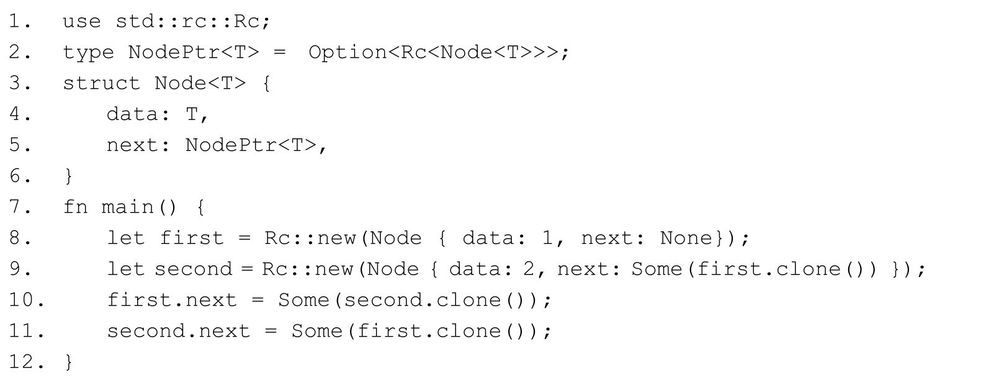{.u54262}
:::

在代码清单4-18中，变量first和second使用了clone方法，但并不会真的复制，Rc＜T＞内部维护着一个引用计数器，每clone一次，计数器加1，当它们离开main函数作用域时，计数器会被清零，对应的堆内存也会被自动释放。

不出所料，代码清单4-18编译会报错。

::: center
{.u54261}
:::

编译器提示，不能对不可变字段进行修改。不过，Rust 提供了另外一个智能指针RefCell＜T＞，它提供了一种内部可变性，这意味着，它对编译器来说是不可变的，但在运行过程中，包含在其中的内部数据是可变的。那么我们使用RefCell＜T＞来重构代码清单4-18，此时NodePtr＜T＞就变成了Option＜Rc＜RefCell＜Node＜T＞＞＞＞，如代码清单4-19所示。

**代码清单4-19：使用RefCell＜T＞保证内部可变**

::: center
{.u54260}
:::

::: center
{.u54259}
:::

代码清单 4-19 终于可以正常运行了，但是代码中使用了两种智能指针， **Rc＜T＞** 和**RefCell＜T＞** ，内存是否可以被正确释放？现在我们为Node结构体实现Drop，来验证内存是否可以被正确释放，如代码清单4-20所示。

**代码清单4-20：为Node结构体实现Drop**

::: center
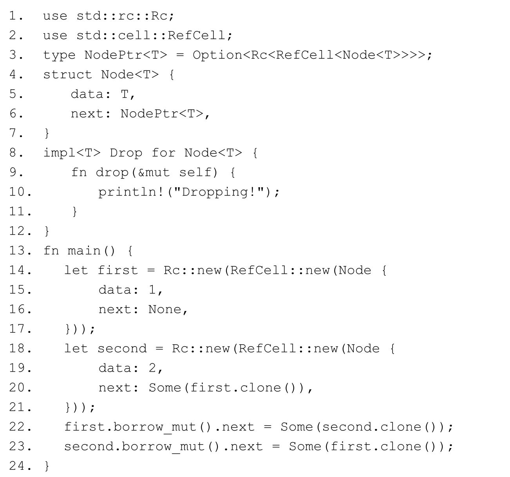{.u54258}
:::

在代码清单4-20中，Node＜T＞结构体实现了Drop，其析构函数drop会输出指定的字符串。第22行和第23行中出现了一个循环引用，first和second节点互相指向对方。但是编译运行之后并没有看到任何输出。这说明析构函数并没有执行，这里存在内存泄漏。

这是一次精心设计的内存泄漏，只是为了证明一件事：Rust并不能百分百地阻止内存泄漏，但也不是轻而易举就可以造成内存泄漏的**。**

**内存安全的含义**

Rust 不是号称内存安全的语言吗？为什么还可以造成内存泄漏？这也许是每个 Rust 初学者的疑问。但实际上，内存泄漏（Memory Leak）并不在内存安全（Memory Safety）概念范围内。

只要不会出现以下内存问题即为内存安全：

· **使用未定义内存。**

· **空指针。**

· **悬垂指针。**

· **缓冲区溢出。**

· **非法释放未分配的指针或已经释放过的指针。**

Rust中的变量必须初始化以后才可使用，否则无法通过编译器检查。所以，可以排除第一种情况，Rust不会允许开发者使用未定义内存。

**空指针** 就是指Java中的null、C++中的nullptr或者C中的NULL。而在Rust（特指Safe Rust）中，开发者没有任何办法去创建一个空指针，因为Rust不支持将整数转换为指针，也不支持未初始化变量。其他语言中引入空指针，是因为空指针可以在逻辑上表示不指向任何内存，比如一个方法返回空指针，表示其返回值不存在，便于在代码中进行逻辑判断。但这都是人为控制的，如果开发者并没有对空指针进行处理，就会出现问题。Rust中使用Option类型来代替空指针，Option实际是枚举体，包含两个值：Some（T）和None，分别代表两种情况，有和无。这就迫使开发者必须对这两种情况都做处理，以保证内存安全。

**悬垂指针** （**dangling pointer** ）是指堆内存已被释放，但其本身还没有做任何处理，依旧指向已回收内存地址的指针。如果悬垂指针被程序使用，则会出现无法预期的后果，代码清单4-21构造了一个垂悬指针。

**代码清单4-21：构造悬垂指针**

::: center
{.u54257}
:::

代码清单4-21定义了foo函数，返回&＇a str类型，其中＇a为生命周期标记，在第5章会着重介绍。&＇a str类型实际是标注了生命周期标记的&str类型。该函数体内定义了局部变量a，并返回a的引用。但是局部变量a在离开foo函数之后会被销毁。如果把该引用传到函数外面，绑定给main函数中的变量x，则会出现问题。foo函数中的&a就是一个悬垂指针。

当然，Rust编译器是不会允许代码清单4-21编译通过的，它会报如下错误：

::: center
{.u54256}
:::

编译器提示，变量a的生命周期很短暂------就这样简单地避免了一次悬垂指针导致的内存安全问题。这背后的功臣是第5章会着重介绍的Rust的所有权和借用机制。

缓冲区是指一块连续的内存区域，可保存相同类型的多个实例。缓冲区可以是栈内存，也可以是堆内存。一般可以使用数组来分配缓冲区。C和C++语言没有数组越界检查机制，当向局部数组缓冲区里写入的数据超过为其分配的大小时，就会发生缓冲区溢出。攻击者可利用缓冲区溢出来窜改进程运行时栈，从而改变程序正常流向，轻则导致程序崩溃，重则导致系统特权被窃取。而使用Rust则无须担心这种问题，Rust编译器在编译期就能检查出数组越界的问题，从而完美地避免了缓冲区溢出。在第3章和第4章中都已经举了不少相关示例。Rust中不会出现未分配的指针，所以也不存在非法释放的情况。同时，Rust的所有权机制严格地保证了析构函数只会调用一次，所以也不会出现非法释放已释放内存的情况。

总的来说，Rust对内存安全做出了百分之百的保证。但是这并不意味着能百分之百地阻止内存泄漏，因为内存泄漏是无法避免的，哪怕是拥有GC的语言，也照样会出现内存泄漏的问题。

**内存泄漏的原因**

在Rust中可导致内存泄漏的情况大概有以下三种：

· **线程崩溃，析构函数无法调用。**

· **使用引用计数时造成了循环引用。**

· **调用Rust标准库中的forget函数主动泄漏。**

对于线程崩溃，没有什么好的办法来阻止它；我们也已经见识过循环引用了。但是Rust为什么会提供一个主动泄漏内存的forget函数呢？

以上三种情况从本质上说就是，Rust并不会保证百分之百调用析构函数。析构函数可以做很多事情，除了释放内存，还可以释放其他资源，如果析构函数不能执行，不仅仅会导致内存泄漏，从更广的角度来看，还会导致其他资源泄漏。相比内存安全问题，资源泄漏其实并没有那么严重。以内存泄漏为例，一次内存泄漏不会有多大影响，但是一次内存不安全操作可能会导致灾难性的后果。

内存泄漏是指没有对应该释放的内存进行释放，属于没有对合法的数据进行操作。内存不安全操作是对不合法的数据进行了操作。两者性质不同，造成的后果也不同。

甚至有时候还需要进行主动泄漏。比如，通过FFI与外部函数打交道，把值交由C代码去处理，在Rust这边要使用forget函数来主动泄漏，防止Rust调用析构函数引起问题。第13章有关于forget函数的更详细的介绍。

### 4.2.4 复合类型的内存分配和布局 {#text00010.html#A397e0089-a79b-49d1-89b7-d11d83950ed6 .title-left}

对于基本原生数据类型来说，Rust是默认将其分配到栈中的。那么，结构体（Enum）或联合体（Union）是被分配在哪的呢？

结构体或联合体只是定义，看它们被分配在哪，主要是看其类型实例如何使用。代码清单4-22验证了三种复合结构内存的布局。

**代码清单4-22：验证三种复合结构内存布局**

::: center
{.u54255}
:::

::: center
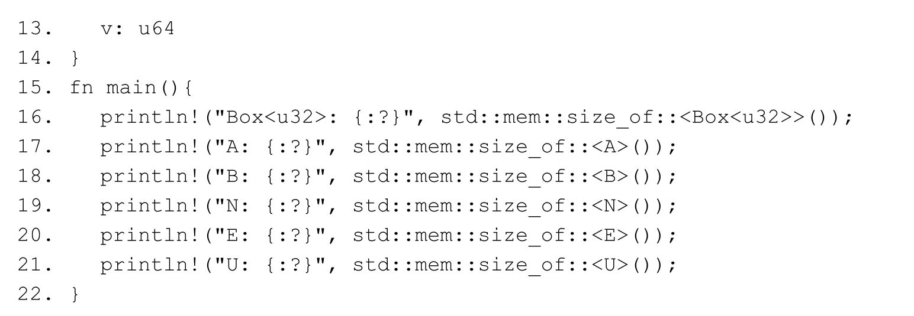{.u54254}
:::

代码清单4-22覆盖了Rust中三种自定义复合数据结构：结构体、枚举体和联合体。

结构体A的成员a为基本数字类型，b为Box＜T＞类型。根据内存对齐规则，结构体A的大小为16个字节，其内存对齐示意如图4-11所示。

::: center
{.u54253}

图4-11：结构体A的内存对齐示意图
:::

在图4-11中，每个方块代表一个字节。按照内存对齐规则，结构体A中的成员b最长，占8个字节，所以按8字节对齐，变量a需要补齐4个字节，整个结构体长度为a和b之和，占16个字节。

当结构体A在函数中有实例被初始化时，该结构体会被放到栈中，首地址为第一个成员变量a的地址，长度为16个字节。其中成员b是Box＜u32＞类型，会在堆内存上开辟空间存放数据，但是其指针会返回给成员b，并存放在栈中，一共占8个字节。

在代码清单 4-22 中，结构体 B 为元组结构体，其对齐规则和普通结构体一样，所以占16个字节。

结构体N为单元结构体，占0个字节。

枚举体E实际上是一种标签联合体（Tagged Union），和普通联合体（Union）的共同点在于，其成员变量也共用同一块内存，所以联合体也被称为共用体。不同点在于，标签联合体中每个成员都有一个标签（tag），用于显式地表明同一时刻哪一个成员在使用内存，而且标签也需要占用内存。操作枚举体的时候，需要匹配处理其所有成员，这也是其被称为枚举体的原因，图4-12展示了枚举体E内存对齐的布局。

::: center
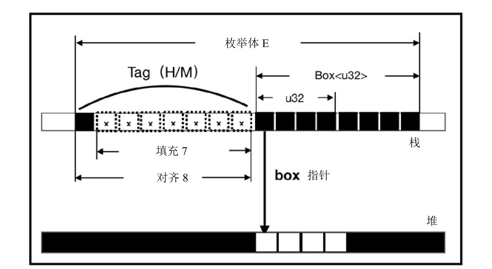{.u54252}

图4-12：枚举体E的内存对齐示意图
:::

在枚举体E的成员H（u32）和M（Box＜u32＞）中，H和M就是标签，占1个字节。但是H和M都带有自定义数据，u32和Box＜u32＞，其中Box＜u32＞最长，按联合体的内存对齐规则，此处按8字节对齐。所以，标签需要补齐到8个字节，自定义数据取最长字节，即8个字节，整个枚举体的长度为标签和自定义数据之和，为16个字节。联合体U没有标签，按内存对齐规则，占8个字节。

当枚举体和联合体在函数中有实例被初始化时，与结构体一样，也会被分配到栈中，占相应的字节长度。如果成员的值存放于堆上，那么栈中就存放其指针。

代码清单4-22最终的输出结果如代码清单4-23所示。

**代码清单4-23：三种复合结构内存布局的输出结果**

::: center
{.u54251}
:::

代码清单4-23展示的输出结果和按内存对齐规则计算出来的结果一致。

## 4.3 小结 {#text00010.html#A9347008b-2c5d-4c56-a65a-fa25bbd9e95c .title-left}

本章首先从诸多编程语言内存管理机制出发，将其归为两类：手动内存管理类和自动管理类。古老的C和C++语言采用手动内存管理机制，随着GC的发明以及垃圾回收算法的不断完善，大多数现代高级编程语言采用GC进行自动化管理内存，但是它们都有各自的优缺点------手动管理容易引起诸多安全问题，自动管理会影响性能。Rust作为现代化系统级编程语言，整合了两种内存管理方式的优势，同时兼顾了内存安全和性能。

接下来，我们回顾了关于内存的通用概念。首先是一条通用的规则：编程语言分配和回收内存都是基于虚拟内存进行操作的；然后介绍了栈和堆的异同，还介绍了数据存储时的内存布局和对齐规则。这些都是理解Rust编程语言所需的基础。

然后我们深入探索了Rust语言的资源管理机制。Rust没有使用GC，但是它引入了来自C++的RAII资源管理机制。默认在栈上分配，不提供显式的堆分配函数，而是通过智能指针Box＜T＞这样的类指针结构体来自动化管理堆内存。由于RAII机制，使用智能指针在堆上分配内存以后，返回的指针被绑定给栈上的变量，在函数调用完成后，栈帧被销毁，栈上变量被丢弃，之后会自动调用析构函数，回收资源。

RAII机制虽然可以防止内存泄漏，但还是可以通过精心设计来制造内存泄漏的。比如通过 Rc＜T＞和 RefCell＜T＞来构造循环引用，就可以制造内存泄漏。但实际上内存泄漏并不在Rust所百分之百保证的内存安全的概念范畴中。Rust保证不出现空指针和悬垂指针、没有缓冲区溢出、不能访问未定义内存以及不能非法释放不合法的内存（比如已经释放的内存和未定义的内存），当然这一切的前提是不要乱用 unsafe 块。Rust 并不保证内存泄漏不会发生，但使用Rust也不会"轻而易举"地造成内存泄漏的问题。

最后，本章通过一个示例探索了自定义复合数据结构的内存分配和布局，进一步回顾并验证通用概念中的内存对齐规则，以帮助读者加深理解。

通过本章的学习，希望读者可以对Rust中的内存管理机制建立一个完整的心智模型，通过阅读Rust代码就可以明白其中的内存分配和布局，以及资源管理机制，为第5章的所有权机制的学习奠定基础。

------------------------------------------------------------------------

[\[1\]](#text00010.html#n7383007617FA487682293C2143D63A9As){#text00010.html#n7383007617FA487682293C2143D63A9A} 栈和堆的增长方向取决于操作系统和CPU，此处是简化的32位Linux/x86进程地址空间模型。

[\[2\]](#text00010.html#nAE7213BA37464AE5BB3C8D0CB9D5F828s){#text00010.html#nAE7213BA37464AE5BB3C8D0CB9D5F828} Bertrand Meyer是Eiffel 语言和按契约设计（Design by Contract）思想的发明者，《面向对象软件构造》一书的作者。

[]{#text00011.html}
