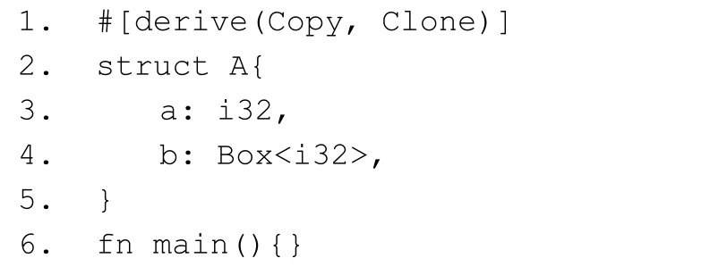
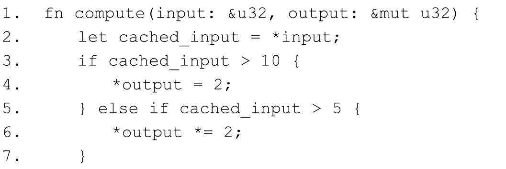
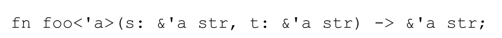
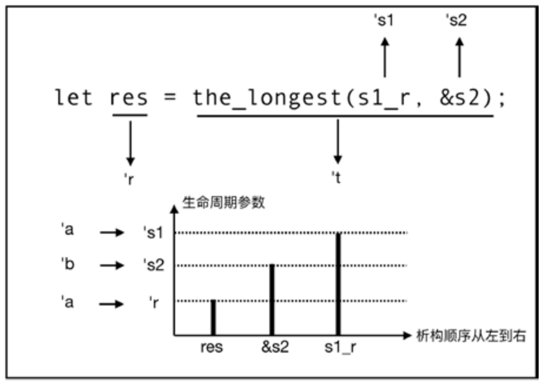

# 第5章 所有权系统 {#text00011.html#Aec510d2f-6296-4358-8ac6-e9642a53a82b .title-left}

律者，所以定分止争也。

《慎子》书中有一典故："一兔走街，百人追之，分未定也；积兔满市，过而不顾，非不欲兔，分定不可争也。"大意是，一只兔子在大街上乱跑，看到的人都想据为己有，是因为这只兔子"名分未定"，而到了兔市，谁也不能随便拿，就连小偷也不敢轻易下手，因为这些兔子"名分已定"，它们是有主人的。这就意味着，只有确定了权利归属，才能防止纠纷的发生。通过法律划分出明确的权属界限，才能厘清每个人的行为界限，合理保障个人的自由空间、利益范围和生命安全。

内存管理不外如是。栈内存的生命周期是短暂的，会随着栈展开（常见的是函数调用）的过程而被自动清理。而堆内存是动态的，其分配和重新分配并不遵循某个固定的模式，所以需要使用指针来对其进行跟踪。Rust受现代C++的启发，同样引入了智能指针来管理堆内存。智能指针在堆上开辟内存空间，并拥有其所有权，通过存储于栈中的指针来管理堆内存。智能指针的 RAII 机制利用栈的特点，在栈元素被自动清空时自动调用析构函数，来释放智能指针所管理的堆内存空间。

现代C++的RAII机制解决了无GC自动管理内存的基本问题，但并没有解决全部问题，还存在着很多安全隐患，代码清单5-1展示了其中一个例子。

**代码清单5-1：C++的RAI机制存在的安全隐患示例**

::: center
{.u54250}
:::

代码清单5-1等价于代码清单5-2中的Rust代码。

**代码清单5-2：等价于代码清单5-1的Rust代码**

::: center
{.u54249}
:::

::: center
{.u54248}
:::

代码清单5-1中的unique_ptr指针等价于Rust中的Box＜T＞智能指针。代码清单5-1和5-2，均是利用智能指针在堆上分配了内存，变量orig对此堆内存持有所有权（唯一控制权），然后将orig重新赋予变量stolen。

在代码清单5-1（C++代码）中，使用了move函数，将原来的unique_ptr指针赋予了stolen，并转让了所有权。原来的 orig 则变为了空指针，而对空指针解引用是很不安全的，所以该C++代码运行时就会抛出**段错误** （**segmentation fault** ）。但对于开发者来说，最想要的是一个编译期的保证，因为调试运行时错误比较困难，如果能在编译时发现隐藏的内存安全问题，就会方便很多，对于代码调试和稳定运行均有好处。

而代码清单5-2（Rust代码）在编译时就会报错。编译器提示orig是已经被"移动"的值。这里的"移动"在语义层面与C++代码中的move 函数等价。orig已经将所有权转让给了 stolen，Rust 编译器检查到了这一点，发现这里存在解引用空指针的安全隐患，然后就报错了。

在代码清单5-2（Rust代码）中，并没有显式地使用任何类似现代C++中的move函数来转移所有权，却拥有和现代C++一样的效果。现代C++中的RAII机制虽然也有所有权的概念，但其作用范围非常有限，仅智能指针有所有权，并且现代C++编译器也并没有依据所有权进行严格检查，所以才会出现代码清单5-1那样的解引用空指针的运行时错误。而在Rust中，所有权是系统性的概念，是Rust语言中的基础设施。Rust中的每个值都必定有一个唯一控制者，即，所有者。所有权的转移都是按系统性的规则隐式地自动完成的，这也是代码清单5-2如此简洁的原因。

Rust的所有权系统与法律上"定分止争"的思想是不谋而合的。所有权系统让每个值都有了明确的权属界限，它们的行为也有了明确的权属界限，这样内存安全就有了基本的保障。如果说所有权系统是内存管理的"法律"，那么Rust编译器就是"严格的执法者"，两者有机统一，保障了内存安全。如果代码中有违反所有权机制的行为，编译器就会检查出来，让错误在编译期就无所遁形，而不用等到运行时。

## 5.1 通用概念 {#text00011.html#A2a88008e-0aa6-490e-b72b-7742f41e2647 .title-left}

当今计算机内存栈和堆的分配机制，决定了编程语言中的值主要分为两类：**值类型** （**Value** ）和**引用类型** （**Reference** ）。像 C、C++、Java、JavaScript、C＃等语言都明确对值类型和引用类型作了区别，而一些纯面向对象语言只剩下了引用类型的概念，比如在 Ruby 和Python中，一切皆对象，而对象就是引用类型。

**值类型是指数据直接存储在栈中的数据类型** ，一些原生类型，比如数值、布尔值、结构体等都是值类型。因此对值类型的操作效率一般比较高，使用完立即会被回收。值类型作为**右值（在值表达式中）** 执行赋值操作时，会自动复制一个新的值副本。

**引用类型将数据存储在堆中，而栈中只存放指向堆中数据的地址（指针）** ，比如数组、字符串等。因此对引用类型的操作效率一般比较低，使用完交给GC回收，没有GC的语言则需要靠手工来回收。

基本的原生类型、结构体和枚举体都属于值类型。普通引用类型、原生指针类型等都属于引用类型。但随着语言的发展，类型越来越丰富，值类型和引用类型已经难以描述全部情况，比如一个Vector容器类型，其内部可以包含基本的值类型，也可以包含引用类型，那它属于什么类型？

为了更加精准地对这种情况进行描述，**值语义** （**Value Semantic** ）和**引用语义** （**Reference Semantic** ）被引入，定义如下。

· 值语义：按位复制以后，与原始对象无关。

· 引用语义：也叫指针语义。一般是指将数据存储于堆内存中，通过栈内存的指针来管理堆内存的数据，并且引用语义禁止按位复制。

**按位复制** 就是指**栈复制** ，也叫浅复制，它只复制栈上的数据。相对而言，**深复制** 就是对栈上和堆上的数据一起复制。

值语义可以保证变量值的独立性（Independence）。独立性的意思是，如果想修改某个变量，只能通过它本身来修改；而如果修改了它本身，并不影响其复制品。也就是说，如果只能通过变量本身来修改值，那么它就是具有值语义的变量。

而引用语义则是禁止按位复制的，因为按位复制只能复制栈上的指针，堆上的数据就多了一个管理者，多了一层内存安全的隐患。图5-1所示是原生整数类型和引用类型按位复制的示意图。

::: center
{.u54247}

图5-1：原生整数类型和引用类型按位复制示意图
:::

图5-1中变量x为5，是整数类型；变量y为动态数组，是Vector＜T＞类型。x为值语义，其值数据都存储在栈上，经过按位复制，产生另外一个副本，对自身和内存均没有什么影响。y为引用语义，其值数据是存储在堆上的，栈上只存放一个指针data_ptr和len数据（为了简单明了，此处省略其他元数据）。将 y 进行按位复制以后，只是栈上的指针和元数据进行了复制，堆内存并没有发生复制，于是就产生了两个指针管理着同一个堆空间的情况。这样带来的问题就是，当原生指针执行了析构函数之后，相应的堆内存已经被释放，复制后的指针就会成为悬垂指针，造成无法预料的后果。

在第2章介绍过的基本的原生类型都是值语义，这些类型也被称为POD（Plain Old Data，相对于面向对象语言新型的抽象数据而言）。要注意的是，POD 类型都是值语义，但值语义类型并不一定都是 POD 类型。具有值语义的原生类型，在其作为右值进行赋值操作时，编译器会对其进行按位复制，如代码清单5-3所示。

**代码清单5-3：编译器对原生类型进行按位复制**

::: center
{.u54246}
:::

代码清单5-3中的变量x为整数类型，当它作为右值赋值给变量y时，编译器会默认自动调用x的clone方法进行**按位复制** 。x是值语义类型，被复制以后，x和y就是两个不同的值，互不影响。

这是因为整数类型实现了Copy trait，第4章介绍过，对于实现Copy的类型，其clone方法必须是按位复制的。对于拥有值语义的整数类型，整个数据存储于栈中，按位复制以后，不会对原有数据造成破坏，不存在内存安全的问题。

反观C++，当对象作为右值参与赋值的时候，一般会建议开发者自定义实现复制构造函数，但开发者很有可能忘记这样做，那么这种情况下，编译器就会默认实现复制构造函数来进行按位复制，则会出现图5-1中那样的内存安全问题，解决的办法是自定义深复制构造函数，将堆上的数据也复制一遍。而Rust通过Copy这个标记trait，将类型按值语义和引用语义做了精准的分类，帮助编译器检测出潜在的内存安全问题。

智能指针Box＜T＞封装了原生指针，是典型的引用类型。Box＜T＞无法实现Copy，意味着它被Rust标记为了引用语义，禁止实现按位复制，如代码清单5-4所示。

**代码清单5-4：Box＜T＞无法实现Copy**

::: center
{.u54245}
:::

代码清单5-4编译会报如下错误：

::: center
{.u54244}
:::

Rust编译器阻止了Struct A实现Copy，因为Box＜T＞是引用语义，如果按位复制，会有内存安全隐患。

值得注意的是，虽然引用语义类型不能实现Copy，但可以实现Clone的clone方法，以实现深复制，在需要的时候可以显式调用。

## 5.2 所有权机制 {#text00011.html#A391e0091-e602-424a-acd1-4e8abc6466bb .title-left}

在Rust中，由Copy trait来区分值语义和引用语义。与此同时，Rust也引入了新的语义：**复制** （**Copy** ）**语义** 和**移动** （**Move** ）**语义** 。复制语义对应值语义，移动语义对应引用语义。这样划分是因为引入了所有权机制，在所有权机制下同时保证内存安全和性能。

对于可以安全地在栈上进行按位复制的类型，就只需要按位复制，也方便管理内存。对于在堆上存储的数据，因为无法安全地在栈上进行按位复制，如果要保证内存安全，就必须进行深度复制。深度复制需要在堆内存中重新开辟空间，这会带来更多的性能开销。如果堆上的数据不变，只需要在栈上移动指向堆内存的指针地址，不仅保证了内存安全，还可以拥有与栈复制同样的性能。

在下面的代码清单5-5中，变量x是Box＜T＞类型，当赋值给变量y时，默认行为不是按位复制，而是移动，如图5-2所示。

**代码清单5-5：具有引用语义的Box＜T＞默认会移动**

::: center
{.u54243}
:::

::: center
{.u54242}

图5-2：移动Box＜T＞类型变量示意图
:::

因为不会进行按位复制，所以只是把x的指针重新指向了y，完全杜绝了图5-1中出现的两个指针引用同一个堆空间的情况，保证了内存安全。

在代码清单5-5中，起初变量x对Box＜T＞拥有所有权，随后x将Box＜T＞通过移动转移给了y，那么最终y拥有了Box＜T＞的所有权，所以由它来释放Box＜T＞的堆内存。

**一个值的所有权被转移给另外一个变量绑定的过程，就叫作所有权转移。**

Rust中每个值都有一个所有者，更进一步说就是，Rust中分配的每块内存都有其所有者，所有者负责该内存的释放和读写权限，并且每次每个值只能有唯一的所有者。这就是 Rust的**所有权机制** （**OwnerShip** ）。

**所有权的类型系统理论**

Rust的所有权在类型系统理论中称为**仿射类型** （**affine type** ），它属于类型理论中**子结构类型系统** （ **Substructural Type System** ）的概念。子结构类型系统又是**子结构逻辑** （**Substructural Logic** ）在类型系统中的应用。而子结构逻辑属于证明理论里的推理规则，其规则包含如下几点。

· 线性逻辑（Linear Logic），如果某个变量符合某种特定的"结构"，它就内含一种规则：必须且只能使用一次。

· 仿射逻辑（Affine Logic），和线性逻辑是类似的，但它的规则是，最多使用一次，也就是说，可以使用0次或1次。看上去线性逻辑更严格一些。

· 其他。

子结构逻辑规则用于推理。基于仿射类型，Rust实现了所有权机制，在需要移动的时候自动移动，维护了内存安全。

**所有权的特点**

所有者拥有以下三种权限：

· 控制资源（不仅仅是内存）的释放。

· 出借所有权，包括不可变（共享）的和可变（独占）的。

· 转移所有权。

对于实现 Copy 的类型，也就是复制语义类型来说，按位复制并不会出现内存问题，并且可以简化内存管理。所以在赋值操作时，作为右值的变量会默认进行按位复制。但是对于禁止实现Copy的类型，也就是移动语义类型来说，如果对其执行按位复制，就会出现图5-1所示的重复释放同一块堆内存的问题，所以在进行赋值操作时，作为右值的变量会默认执行移动语义来转移所有权，从而保证了内存安全。

对于可以实现 Copy 的复制语义类型来说，所有权并未改变。对于复合类型来说，是复制还是移动，取决于其成员的类型。代码清单5-6所示的是结构体成员都为复制语义类型的情况。

**代码清单5-6：结构体A的成员都为复制语义类型**

::: center
{.u54241}
:::

代码清单5-6的第8行编译会报错，说明在进行赋值操作时，a 的所有权发生了转移。在后面的println！语句中，a就无法再次使用。

可见，虽然结构体A的成员都是复制语义类型，但是Rust并不会默认为其实现Copy，如果想解决这个问题，可以手动为结构体A实现Copy，如代码清单5-7所示。

**代码清单5-7：手动为结构体A实现Copy**

::: center
{.u54188}
:::

在代码清单5-7中，通过**＃\[derive（Debug，Copy，Clone）\]** 属性为结构体A实现了Copy，因此结构体A就可以按位复制了，所以这段代码可以正常编译运行。我们在代码清单5-4中已经看到，如果结构体中还有移动语义类型的成员，则无法实现Copy。因为按位复制可能会引发内存安全问题。

枚举体和结构体是类似的，当成员均为复制语义类型时，不会自动实现Copy。而对于**元组类型** 来说，其本身实现了Copy，如果元素均为复制语义类型，则默认是按位复制的，否则会执行移动语义，如代码清单5-8所示。

**代码清单5-8：当元素均为复制语义类型时，元组自动实现Copy**

::: center
{.u54240}
:::

在代码清单5-8中，变量a为元组类型，其元素为String类型，并非值语义类型，变量a在作为右值进行赋值操作时，转移了所有权，所以在println！中使用变量a会报错。变量c也是元组类型，其元素均为整数类型，是复制语义类型，支持按位复制，所以变量c在作为右值进行赋值操作后依然可用。

数组和Option类型与元组类型都遵循这样的规则：如果元素都是复制语义类型，也就是都实现了Copy，那么它们就可以按位复制，否则就转移所有权。

## 5.3 绑定、作用域和生命周期 {#text00011.html#Ada6a0093-3501-4d4e-af5b-fd2d2c672d75 .title-left}

Rust 使用 let 关键字来声明"变量"。let 关键字属于函数式语言中的传统关键字，比如Scheme、OCaml、Haskell等语言也都使用let关键字来声明"变量"。let有let binding之意，let声明的"变量"实际上不是传统意义上的变量，而是指一种绑定语义，如代码清单5-9所示。

**代码清单5-9：let绑定**

::: center
{.u54239}
:::

::: center
{.u54238}
:::

在代码清单 5-9 中，let 的意义是这样的：标识符 a 和 String 类型字符串＂hello＂通过 let绑定在了一起，a拥有字符串＂hello＂的所有权。更深层次的意义是，let绑定了标识符a和存储字符串＂hello＂的那块内存，从而a对那块内存拥有了所有权。所以此处a被称为**绑定** 。本书中的"变量""变量绑定"或"绑定"，均是指"绑定"的。

如果此时使用let声明另一个绑定b，并将a赋值给b，如let b=a，则此时必然会将a对字符串的所有权转移给b。因为a是String类型，不能实现Copy，所以这种行为其实也可以理解为对a进行解绑，然后重新绑定给b。

### 5.3.1 不可变与可变 {#text00011.html#Aace70094-220a-4292-8694-d89772d82abf .title-left}

"共享可变状态是万恶之源"，这句在业界流传已久的名言诉说着这样一个事实：可变状态绝不能共享，否则会增加函数之间的耦合度，函数中的变量状态在任何时候发生改变都将变得难以控制，从而让函数产生"副作用"。可变状态也更不利于多线程并发程序，容易引发数据竞争。

在很多传统的编程语言中，变量均为默认可变的，开发者很难避免"共享可变状态"。随着近几年来函数式编程语言的逐渐流行，其显著的优点也开始受到关注，其中**不可变** （**Immutable** ）的一些优点也逐渐体现了出来：

· 多线程并发时，不可变的数据可以安全地在线程间共享。

· 函数的"副作用"可以得到控制。

Rust语言吸收了函数式语言的诸多优势，其中之一就是声明的绑定默认为不可变，如代码清单5-10所示。

**代码清单5-10：绑定默认为不可变**

::: center
{.u54237}
:::

在代码清单5-10中，第4行代码中的+=操作相当于x=x+＂world＂，这样的操作在传统的变量默认可变的语言中很常见。但是在Rust中，编译器会报出第3行注释所示的错误。绑定x默认为不可变，所以编译器不允许修改一个不可变的绑定。

如果需要修改，Rust 提供了一个 mut 关键字，可以用它来声明可变（Mutable）绑定，如代码清单5-11所示。

**代码清单5-11：使用mut声明可变绑定**

::: center
{.u54236}
:::

在代码清单5-11中，使用mut声明的可变绑定x可以自由地追加字符串，编译器不会报错。

### 5.3.2 绑定的时间属性------生命周期 {#text00011.html#A380f0095-9201-4f2c-802c-b64dc0a2ae68 .title-left}

变量绑定具有"时空"双重属性。

· **空间属性** 是指标识符与内存空间进行了绑定。

· **时间属性** 是指绑定的时效性，也就是指它的生存周期。

一个绑定的生存周期也被称为**生命周期** （**lifetime** ），是和词法作用域有关的。代码清单5-9中的绑定a的生命周期就是整个main作用域。作为栈变量，a会随着main函数栈帧的销毁而被清理。并且，这是编译器可以知道的事实。

其实每个 let 声明都会创建一个默认的词法作用域，该作用域就是它的生命周期，如代码清单5-12所示。

**代码清单5-12：let默认创建词法作用域**

::: center
{.u54235}
:::

代码清单5-12中声明了4个let绑定，a、b、c、d，它们均有一个默认的隐式的词法作用域，可以通过伪代码表示如下：

::: center
{.u54234}
:::

看得出来，绑定a的作用域包含着＇b、＇c、＇d的作用域，以此类推，最后声明的绑定的作用域在最里面。

绑定的析构顺序和声明顺序相反，所以绑定d的生命周期是最短的，d会先析构，然后c、b、a依次析构，所以a的生命周期最长。所以，目前Rust的生命周期是基于词法作用域的，编译器能自动识别函数内部这些局部变量绑定的生命周期。

当向绑定在词法作用域中传递的时候，就会产生所有权的转移。代码清单5-10中的绑定c作为右值被赋值给绑定d，绑定c进入了绑定d的作用域内，按理应该会发生所有权的转移，但是因为c为字符串字面量，支持按位复制，所以此时c并没有发生所有权转移，依然可用。绑定生命周期的示意图请参见图5-3。

::: center
{.u54233}

图5-3：绑定生命周期示意图
:::

综上所述，let绑定会创建新的词法作用域，如果有其他变量作为右值进行赋值操作，也就是绑定操作，那么该变量因为进入了 let 创建的词法作用域，所以要么转移所有权，要么按位复制，这取决于该变量是复制语义还是移动语义的。

除了let声明，还有一些场景会创建新的词法作用域。

**花括号**

可以使用花括号在函数体内创建词法作用域，如代码清单5-13所示。

**代码清单5-13：使用花括号创建词法作用域**

::: center
{.u54232}
:::

在代码清单5-13中，第4行和第8行的花括号在main词法作用域中又创建了一个内部的作用域。第5行let声明的绑定inner_val的生命周期也只存活于此内部作用域，一旦出了内部作用域，就会被析构。所以如果取消第11行的注释，编译时就会遇到第10行注释中的报错内容。

第2行声明的outer_val是复制语义类型，在进入内部作用域之后，不会转移所有权，而只是按位复制，所以，在第9行出了内部作用域之后，还可以继续使用outer_val。第3行声明的outer_sp是引用语义类型，在进入内部作用域之后，它的所有权被转移，出了内部作用域之后，outer_sp就会被析构，所以如果取消第13行的注释，编译的时候就会出现第12行注释中的报错内容。

其实不仅仅是独立的花括号会产生词法作用域，在一些match匹配、流程控制、函数或闭包等所有用到花括号的地方都会产生词法作用域。

**match匹配**

match匹配也会产生一个新的词法作用域，如代码清单5-14所示。

**代码清单5-14：match匹配会产生新的词法作用域**

::: center
{.u54231}
:::

代码清单5-14中的match匹配会创建新的作用域，绑定a的所有权会被转移，因为绑定a是Option＜String＞类型，String类型具有移动语义，所以Option＜String＞就是移动语义类型。如果第8行再次使用绑定a，则会报第7行注释所示的错误。在match语句内部，每个匹配分支都是独立的词法作用域，比如第4行代码中的s只能用于该分支。

**循环语句**

for、loop以及while循环语句均可以创建新的作用域。代码清单5-15展示了for循环语句创建新的作用域的示例。

**代码清单5-15：for循环语句创建新的作用域**

::: center
{.u54230}
:::

在代码清单5-15中，绑定v为移动语义类型，进入for循环时已经转移了所有权，所以当第6行再次使用绑定v时，就会报第5行注释所示的错误。

**if let和while let块**

if let块和while let块也会创建新的作用域，代码清单5-16展示了if let块创建新的作用域的示例。

**代码清单5-16：if let块创建新的作用域**

::: center
{.u54229}
:::

在代码清单5-16中，绑定a为引用语义，因为是Option＜String＞类型，所以在第3行if let的赋值操作中会转移所有权，绑定a将不再可用。而if let块也创建了一个新的作用域。

代码清单5-17展示了while let块创建新作用域的示例。

**代码清单5-17：while let块创建新的作用域**

::: center
{.u54228}
:::

在代码清单5-17中，变量optional为Option＜i32＞类型，因为i32类型为复制语义，所以Option＜i32＞为复制语义。因此在while let匹配后，变量i的所有权并未转移。

**函数**

函数体本身是独立的词法作用域。当复制语义类型作为函数参数时，会按位复制，如果是移动语义作为函数参数，则会转移所有权，如代码清单5-18所示。

**代码清单5-18：引用移动语义类型作为函数参数**

::: center
{.u54227}
:::

代码清单5-18中的绑定s为String类型，当它作为参数传入foo函数中时，所有权会被转移。如果在main函数中再次使用绑定s，则编译时会报错。

**闭包**

闭包会创建新的作用域，对于环境变量来说有以下三种捕获方式：

· 对于复制语义类型，以不可变引用（&T）来捕获。

· 对于移动语义类型，执行移动语义（move）转移所有权来捕获。

· 对于可变绑定，如果在闭包中包含对其进行修改的操作，则以可变引用（&mut）来捕获。

代码清单5-19展示了上述第二种捕获。

**代码清单5-19：外部变量为移动语义类型，则转移所有权来进行捕获**

::: center
{.u54226}
:::

在代码清单5-19中，绑定s为String类型，被第3行声明的闭包join捕获，所以s的所有权被转移到了闭包中。如果第5行再次使用s，则编译器会报错。

## 5.4 所有权借用 {#text00011.html#Afe040099-300c-4525-84c7-503b5d532106 .title-left}

假设需要写一个函数，用于修改数组的第一个元素。基本思路可以是，将此数组直接当作函数的参数传入，修改之后再返回，如代码清单5-20所示。

**代码清单5-20：将数组作为函数参数传递**

::: center
{.u54225}
:::

在代码清单5-20中，因为数组类型签名为\[T；N\]，所以foo函数中参数v的类型直接指定为\[i32；3\]，代表长度为3的i32整数数组，并使用mut关键字将其指定为可变。在foo函数中，直接使用数组下标0来修改第一个元素的值，然后返回此数组。

在main函数中，第7行代码声明了一个不可变数组v，然后将其传入foo函数中。因为数组v的元素均为基本数字类型，所以v是复制语义，在传入foo函数时会按位复制。所以，在foo函数中修改后的v是\[3，2，3\]，而main函数中的v是\[1，2，3\]（代码第9行）。

这里还需要注意的地方是，第7行代码声明的数组v是不可变的，但是传入了foo函数中就变成了可变数组，主要原因是**函数参数签名也支持模式匹配** ，相当于使用 let 将 v 重新声明成了可变绑定。

所以，如果想使用foo函数返回的修改后的数组，则需要将其重新绑定方可继续使用。这是所有权系统带来的不便之处。其实大多数情况下可以使用Rust提供的引用来处理这种情况，如代码清单5-21所示。

**代码清单5-21：使用引用作为函数参数**

::: center
{.u54224}
:::

::: center
{.u54223}
:::

代码清单5-21比代码清单5-20更加精练。因为使用了可变引用&mut v，所以foo函数不需要有返回值，当foo函数调用完毕时，v依旧可用。需要注意，使用可变借用的前提是，出借所有权的绑定变量必须是一个可变绑定。第6行借用了&mut v，因为在从foo函数调用完毕之后就归还了所有权，所以在第7行代码中还可以继续使用v。

**引用与借用**

**引用** （**Reference** ）是 Rust 提供的一种指针语义。引用是基于指针的实现，它与指针的区别是，指针保存的是其指向内存的地址，而引用可以看作某块内存的**别名** （**Alias** ），使用它需要满足编译器的各种安全检查规则。引用也分为**不可变引用** 和**可变引用** 。使用&符号进行不可变引用，使用&mut符号进行可变引用。

在所有权系统中，引用&x也可称为x的**借用** （**Borrowing** ），通过&操作符来完成所有权租借。既然是借用所有权，那么引用并不会造成绑定变量所有权的转移。但是借用所有权会让**所有者** （**owner** ）受到如下限制：

· 在不可变借用期间，所有者不能修改资源，并且也不能再进行可变借用。

· 在可变借用期间，所有者不能访问资源，并且也不能再出借所有权。

**引用在离开作用域之时，就是其归还所有权之时** 。使用借用，与直接使用拥有所有权的值一样自然，而且还不需要转移所有权。

再看另外一个示例，这是一个冒泡排序的实现，如代码清单5-22所示。

**代码清单5-22：冒泡排序**

::: center
{.u54222}
:::

在代码清单5-22中，bubble_sort函数参数为可变借用。第2行中直接使用a来调用len方法，以便获取数组的长度，而不是先用解引用操作符对a解引用，然后再调用len方法（当然，这样调用也可以）。同样的用法还有第9行中的a.swap（i-1，i），用于交换指定索引的元素在数组中的位置。

代码清单5-23展示了std：：vec：：Vec中len（）方法的源码实现。

**代码清单5-23：len（）方法源码**

::: center
{.u54221}
:::

在代码清单5-23中，len方法中的&self实际上是self：&self的简写，因此，可以在方法体中直接使用self来调用len字段。这同样利用了函数参数的模式匹配。由此可见，通过借用，开发者可以在不转移所有权的情况下，更加方便地对内存进行操作，同时也让代码有良好的可读性和维护性。

**借用规则**

**为了保证内存安全，借用必须遵循以下三个规则。**

· 规则一：借用的生命周期不能长于出借方（拥有所有权的对象）的生命周期。

· 规则二：可变借用（引用）不能有别名（Alias），因为可变借用具有独占性。

· 规则三：不可变借用（引用）不能再次出借为可变借用。

规则一是为了防止出现悬垂指针。规则二和三可以总结为一条核心的原则：**共享不可变，可变不共享** 。Rust编译器会做严格的借用检查，违反以上规则的行为均无法正常通过编译。

规则一很好理解。如果出借方已经被析构了，但借用依然存在，就会产生一个悬垂指针，这是Rust绝对不允许出现的情况。

规则二和规则三描述的不可变借用和可变借用就相当于内存的读写锁，同一时刻，只能拥有一个写锁，或者多个读锁，不能同时拥有，如图5-4所示。

::: center
{.u54220}

图5-4：内存读写锁示意图
:::

不可变借用可以被出借多次，因为它不能修改内存数据，因此它也被称为共享借用（引用）。可变借用只能出借一次，否则，难以预料数据何时何地会被修改。

接下来我们一起分析一下代码清单5-24。

**代码清单5-24：借用检查保障了内存安全**

::: center
{.u54219}
:::

代码清单 5-24 可以正常编译运行，变量 o 的结果会被修改为 2。但是现在假如不存在Rust的借用检查，我们来看看该函数可能会存在什么问题。

如果声明一个绑定，并且把该绑定的可变借用和不可变借用都传入compute函数中，会发生什么呢？如代码清单5-25所示。

**代码清单5-25：假设不存在Rust的借用检查，compute函数可能存在的问题**

::: center
{.u54218}
:::

在代码清单5-25中，将绑定i的两种借用分别当作参数传到compute函数中，假设不考虑Rust的借用检查，最后输出的结果是1，而正常的结果应该是2，所以这里出现了问题。回到代码清单5-24中查看compute函数，此时传入的input和output都是20，经过第2行到第4行的if表达式处理后，output的值变为了1，但是此时input和output其实都是指向同一块内存的，所以当代码执行到第5行时，\*input＞5必然会返回false，此时函数compute调用完成，output的值被修改为了1。

但真实的情况是，Rust必然会进行借用检查，所以代码清单5-25根本不会编译通过，而会报错如下：

::: center
{.u54217}
:::

这违反了借用规则，不可变借用和可变借用不能同时存在。对于compute函数，Rust编译器知道，不会存在input和output借用自同一个绑定的情况。所以，可以对compute函数进一步优化，如代码清单5-26所示。

**代码清单5-26：优化compute函数**

::: center
{.u54216}
:::

::: center
{.u54215}
:::

代码清单5-26这样的优化在Rust中是非常合理的，但是在其他语言中不一定合理，因为其他语言没法保证input和output不会来自同一块内存。第2行声明了cached_input变量绑定，是为了方便编译器进一步优化，因为 input 是一个不可变借用，永远都不会改变，所以编译器可以将它的值保存在寄存器中，进一步提升性能。同时，通过cached_input可以将两个if表达式合并为一个if else表达式，因为大于10的分支永远都不会影响到大于5的分支。

总的来说，Rust的借用检查带来了如下好处：

· 不可变借用保证了没有任何指针可以修改值的内存，便于将值存储在寄存器中。

· 可变借用保证了在写的时候没有任何指针可以读取值的内存，避免了脏读。

· 不可变借用保证了内存不会在读取之后被写入新数据。

· 保证了不可变借用和可变借用不相互依赖，从而可以对读写操作进行自由移动和重新排序。

关于引用，还有一个值得注意的地方：**解引用操作会获得所有权** 。在需要对移动语义类型（例如&String类型）进行解引用操作时，需要注意这一点，如代码清单5-27所示。

**代码清单5-27：解引用&String类型**

::: center
{.u54214}
:::

在代码清单5-27中，join函数参数类型为&String，为一个不可变借用。第2行的let声明中对其进行解引用操作，编译器直接报如下错误：

::: center
{.u54213}
:::

这说明，编译器不允许将借用s的所有权转移给append。试想一下，如果s的所有权转移了，就会导致main函数中x的所有权被转移，那么&x指向的则是无效地址，这就造成了野指针。这在Rust中是绝对禁止的。

## 5.5 生命周期参数 {#text00011.html#A5e9b009d-f3a5-457e-b3fa-344b61377369 .title-left}

值的生命周期和词法作用域有关，但是借用可以在各个函数间传递，必然会跨越多个词法作用域。对于函数本地声明的拥有所有权的值或者借用来说，Rust编译器包含的借用检查器（borrow checker）可以检查它们的生命周期，但是对于跨词法作用域的借用，借用检查器就无法自动推断借用的合法性了，也就是说，无法判断这些跨词法作用域的借用是否满足借用规则。不合法的借用会产生悬垂指针，造成内存不安全。所以，Rust必须确保所有的借用都是有效的，不会存在悬垂指针，如代码清单5-28所示。

**代码清单5-28：借用检查示例**

::: center
{.u54212}
:::

在代码清单5-28中，绑定r将在整个main函数作用域中存活，其生命周期长度用**＇a** 表示；绑定x存活于第3行到第6行之间的内部词法作用域中，因为它离开内部作用域就会被析构，其生命周期长度用**＇b** 表示，**＇b** 要比**＇a** 小很多。如果该代码正常通过编译，则在运行时，第5行代码就会产生一个悬垂指针。幸运的是，Rust编译器不会允许这种事情发生。编译时会借用检查器检查代码中每个引用的有效性，因而代码清单5-28会报以下错误：

::: center
{.u54211}
:::

根据借用规则一，**借用的生命周期不能长于出借方的生命周期** 。在代码清单5-28中，借用&x要绑定给变量r，r就成了借用方，其生命周期长度是＇a，而出借方是x，出借方的生命周期长度是＇b，现在＇a远远大于＇b，说明借用的生命周期远远大于出借方的生命周期，出借方被析构，借用还存在，就会造成悬垂指针。由此证明借用无效，借用检查无法通过，编译器报错，成功地阻止了悬垂指针的产生。

如果只是在函数本地使用借用，那么借用检查器很容易推导其生命周期，因为此时Rust拥有关于此函数的所有信息。一旦跨函数使用借用，比如作为函数参数或返回值使用，编译器就无法进行检查，因为编译器无法判断出所有的传入或传出的借用生命周期范围，此时需要显式地对借用参数或返回值使用生命周期参数进行标注。

### 5.5.1 显式生命周期参数 {#text00011.html#A84ba009e-999b-4cc9-b4ae-ea672627da64 .title-left}

生命周期参数必须以单引号开头，参数名通常都是小写字母，比如**＇a** 。生命周期参数位于引用符号&后面，并使用空格来分割生命周期参数和类型，如下所示。

::: center
{.u54210}
:::

**标注生命周期参数并不能改变任何引用的生命周期长短，它只用于编译器的借用检查** ，来防止悬垂指针。

**函数签名中的生命周期参数**

函数签名中的生命周期参数使用如下标注语法：

::: center
{.u54209}
:::

函数名后面的**＜＇a＞** 为生命周期参数的声明，与泛型参数类似，必须先声明才能使用。函数或方法参数的生命周期叫作**输入生命周期** （**input lifetime** ），而返回值的生命周期被称为**输出生命周期** （**output lifetime** ）。

函数签名的生命周期参数有这样的限制条件：输出（借用方）的生命周期长度必须不长于输入（出借方）的生命周期长度（此条件依然遵循借用规则一）。

另外，需要注意，**禁止在没有任何输入参数的情况下返回引用** ，因为明显会造成悬垂指针，如代码清单5-29所示。

**代码清单5-29：无输入参数且返回引用的函数**

::: center
{.u54208}
:::

代码清单5-29编译会报如下错误：

::: center
{.u54207}
:::

错误消息显示，绑定s存活时间不够长，在离开return_str函数时就会被析构，而该函数还要返回绑定 s 的借用&s\[..\]，这明显违反了借用规则一，制造了悬垂指针，这是 Rust 绝对不允许的行为。所以，如果想修正此代码，可以返回一个String类型。

**从函数中返回（输出）一个引用，其生命周期参数必须与函数的参数（输入）相匹配，否则，标注生命周期参数也毫无意义，** 如代码清单5-30所示。

**代码清单5-30：foo函数的引用参数和返回的引用生命周期毫无关联**

::: center
{.u54206}
:::

代码清单5-30编译会报错，错误消息为第3行注释的内容。此时编译器拥有对函数foo的全部信息，生命周期标注完全没有派上用场，所以生命周期标注在此处是多余的。

下面来看一个正常需要进行生命周期参数标注的示例，如代码清单5-31所示的情况。

**代码清单5-31：需要进行生命周期标注的示例**

::: center
{.u54205}
:::

编译代码清单5-31会报以下错误：

::: center
{.u54204}
:::

编译器要求标注生命周期参数，此时编译器已经无法推导出返回的借用是否合法，代码清单5-32为标注了生命周期参数的代码。

**代码清单5-32：为the_longest函数标注生命周期参数**

::: center
{.u54203}
:::

代码清单5-32中the_longest函数签名标注了生命周期参数。其中＜＇a＞是对生命周期参数的声明，两个输入参数和返回参数都加上了生命周期参数，变为**&＇a str** 。函数声明中的**＇a** 可以看作一个生命周期**泛型参数** ，输入引用和输出引用都标记为**＇a** ，意味着输出引用（借用方）的生命周期不长于输入引用（出借方）的生命周期。

再来看 main 函数，当the_longest函数被实际调用时，借用检查器会根据函数签名时的生命周期参数标记的具体情况进行检查，如图5-5所示。

::: center
{.u54202}

图5-5：函数调用借用检查示意图
:::

the_longest函数的第一个参数是s1_r，它的实际生命周期是从代码清单5-32的第6行到第12行，我们将其命名为＇s1，那么可以说，the_longest函数签名中的泛型参数**＇a** 在调用时被单态化为了**＇s1** 。而该函数的第二个参数&s2的生命周期是从代码清单5-32的第7行到第10行，我们将其命名为**＇s2** 。同理，可以说，泛型参数**＇a** 在此时被单态化为了＇**s2** 。

the_longest（s1_r，&s2）返回引用的生命周期记为**＇t** 。第9行的let声明了绑定res，其生命周期记为**＇r** 。因为 res 绑定了 the_longest 函数返回的借用，本质上只是引用的按位复制，所以res成为了借用方，其生命周期长度为**＇r** ，且等于**＇t** 。经过以上分析，借用方的生命周期长度不长于出借方的生命周期长度，不会造成悬垂指针，所以借用生效，编译正常通过。

其实对于多个输入参数的情况，也可以标注不同的生命周期参数，如代码清单5-33所示。

**代码清单5-33：标注多个生命周期参数**

::: center
{.u54201}
:::

编译代码清单5-33，编译器会报错：

::: center
{.u54200}
:::

这是因为编译器无法判断这两个生命周期参数的大小，此时可以显式地指定＇a和＇b的关系，如代码清单5-34所示。

**代码清单5-34：指定生命周期参数之间的大小关系**

::: center
{.u54199}
:::

在代码清单5-34中，**＇b：＇a** 的意思是泛型生命周期参数**＇b** 的存活时间长于泛型生命周期参数**＇a** （即**＇b** outlive**＇a** ）。如果用集合来说明，那就是**＇b** 包含**＇a** ，即**＇a** 是**＇b** 的子集。但是通过上面的分析，main 函数中传入的参数 s1_r 的生命周期却长于&s2 的生命周期，对应到the_longest函数参数中，就是s1的存活时间长于s2的，而s1的生命周期是**＇a** ，s2的生命周期是**＇b** ，从直觉上来看，明显是**＇a** 的存活时间长于**＇b** 的，但为什么现在**＇b：＇a** 表示**＇b** 的存活时间长于**＇a** 的呢？

不要忘记生命周期参数的目的是什么。**生命周期参数是为了帮助借用检查器验证非法借用。函数间传入和返回的借用必须相关联，并且返回的借用生命周期必须比出借方的生命周期长** 。所以，这里＇b：＇a中的＇a是指返回引用（借用）的生命周期，必须不能长于＇b（出借方）的生命周期。

the_longest函数在调用时，其参数的泛型生命周期参数**＇a** 和**＇b** 会单态化为具体的生命周期参数**＇s1** 和**＇s2** ，其返回引用的泛型生命周期参数**＇a** 也会单态化为**＇t** ，因为res绑定了该函数返回的引用，所以**＇r** 和**＇t** 是等价的。Rust里let绑定的声明顺序正好和析构顺序相反，这是由栈结构的后进先出特性决定的。所以，res、&s2和s1_r的析构顺序是res最先，然后是&s2，最后是 s1_r。在 res 析构之前，&s2 必须存活，否则就会产生悬垂指针，造成内存不安全，这是 Rust 绝对不允许的。res 的生命周期参数是**＇r** ，&s2 的生命周期参数是**＇s2** ，它们的关系是**＇s2：＇r** ，**＇s2** 的存活时间长于**＇r** 。而**＇s2** 和**＇r** 分别对应其函数签名中的生命周期泛型参数**＇b** 和**＇a** ，所以得出**＇b：＇a** 。而对于参数s1_r来说，其生命周期参数**＇s1** 对应生命周期泛型参数**＇a** ，本身**＇s1** 和**＇r** 的关系就是**＇s1：＇r** ，这也满足**＇a：＇a** ，如图5-6所示。

::: center
{.u54198}

图5-6：the_longest函数调用时生命周期分析示意图
:::

函数签名中多个生命周期参数的关系看上去比较复杂，但是只要把握一个原则就可以理解它：**生命周期参数的目的是帮助借用检查器验证合法的引用，消除悬垂指针** 。在Rust官方文档中提到，这种生命周期参数包含关系是一种子类型，并且用&＇a str和&＇static str两种类型做了示例，对于所有允许使用&＇a str类型的地方，使用&＇static str也是合法的。但实际上，Rust中的生命周期参数并非类型，&＇static str也只是Rust中少有的特例。也有人按集合论总结出了判断生命周期参数的所谓公式，但即使使用公式，也一定要搞懂生命周期参数背后的意义。

**结构体定义中的生命周期参数**

除了函数签名，结构体在含有引用类型成员的时候也需要标注生命周期参数，否则编译器会报错：missing lifetime specifier。代码清单5-35是一个包含引用类型成员的结构体示例。**代码清单5-35：包含引用类型成员的结构体也需要标注生命周期参数**

::: center
{.u54197}
:::

在代码清单5-35中，结构体Foo有一个成员为&str类型，必须先声明生命周期泛型参数＜＇a＞，才能为成员part标注生命周期参数，变为&＇a str类型。**这里的生命周期参数标记，实际上是和编译器约定了一个规则：结构体实例的生命周期应短于或等于任意一个成员的生命周期。**

main 函数中声明了一个 String 类型的字符串 words，然后使用 split 方法按逗号规则将words进行分割，再通过next方法和expect方法返回一个字符串切片first。其中next方法为迭代器相关的内容，第6章会讲到。

在代码第7行，用first实例化结构体Foo。此时，编译器就会根据该结构体事先定义的生命周期规则对其成员part的生命周期长度进行检查。当前part的生命周期是整个main函数，而Foo结构体实例f的生命周期确实小于其成员part的生命周期，f会在first之前被析构。否则，如果first先被析构，f.part就会成为悬垂指针，这是Rust绝对不允许的。

**方法定义中的生命周期参数**

假如为结构体Foo实现方法（如代码清单5-36所示），因为其包含引用类型成员，标注了生命周期参数，所以需要在impl关键字之后声明生命周期参数，并在结构体Foo名称之后使用，这与泛型参数是相似的。

**代码清单5-36：为结构体Foo实现方法**

1.#\[derive(Debug)\]

::: center
{.u54196}
:::

Foo结构体中实现了两个方法，new和first，其中first是在new内部调用的，这两个方法签名中使用的生命周期参数**＇a** 是在impl关键字后面定义的，在整个impl块中适用。

如果new和first方法签名中不添加生命周期参数，则会报错：

::: center
{.u54195}
:::

这是因为编译器无法推断参数中引用的生命周期。在添加生命周期参数**＇a** 之后，约束了输入引用的生命周期长度要长于结构体Foo实例的生命周期长度。

另外，枚举体和结构体对生命周期参数的处理方式是一样的。

**静态生命周期参数**

Rust内置了一种特殊的生命周期**＇static** ，叫作**静态生命周期** 。**＇static** 生命周期存活于整个程序运行期间。所有的字符串字面量都有**＇static** 生命周期，类型为**&＇static str** ，请思考代码清单5-37。

**代码清单5-37：字符串字面量生命周期**

::: center
{.u54194}
:::

在代码清单5-37中，字符串字面量x执行y=x赋值操作之后，x继续可用，说明此处赋值执行的是按位复制，而非移动语义。

字符串字面量是全局静态类型，它的数据和程序代码一起存储于可执行文件的数据段中，其地址在编译期是已知的，并且是只读的，无法更改，可执行文件的组成结构如图 5-7所示。

::: center
{.u54193}

图5-7：可执行文件组成示意图
:::

所以，代码清单5-37中的静态字符串x按位复制的仅仅是存储于栈上的地址，因为数据段是只读的，并不会出现什么内存不安全的问题。

另外值得一提的是，在Rust 2018版本中，使用const和static定义字符串字面量时，都可以省掉**＇static** 静态生命周期参数。

### 5.5.2 省略生命周期参数 {#text00011.html#A3e3800a5-440a-48d0-9b0a-5d396a54a916 .title-left}

对于理论上需要显式地标注生命周期参数的情况，实际中依然存在可以省略生命周期参数的可能，如代码清单5-38所示。

**代码清单5-38：省略生命周期参数的示例**

::: center
{.u54192}
:::

代码清单5-38是可以正常编译通过的。函数first_word的功能是将传入的&str类型字符串通过as_bytes方法转换成字节序列。然后再通过for 循环找到空格，并返回空格前的所有字符组成的字符串切片&s\[0..i\]。其中第3行for循环迭代器中链式调用最后的enumerate方法返回的是字节序列下标和元素的引用，for 循环中的&item 是利用模式匹配来获取 item 的，这样就可以在第4行参与比较操作。最后，如果没有找到空格，则返回整个字符串。该函数的输入参数和返回值都属于引用，为什么不需要标注生命周期参数？当然，如果按生命周期参数规则进行标注，该代码也会正常通过编译。

这是因为Rust针对某些场景确定了一些常见的模式，将其硬编码到Rust编译器中，以便编译器可以自动补齐函数签名中的生命周期参数，这样就可以省略生命周期参数。被硬编码进编译器的模式称为**生命周期省略规则** （**Lifetime Elision Rule** ），一共包含三条规则：

· 每个输入位置上省略的生命周期都将成为一个不同的生命周期参数。

· 如果只有一个输入生命周期的位置（不管是否忽略），则该生命周期都将分配给输出生命周期。

· 如果存在多个输入生命周期的位置，但是其中包含着&self或&mut self，则self的生命周期都将分配给输出生命周期。

如果不满足上面三条规则，省略生命周期将会出错。代码清单5-39罗列了一些省略或非法的示例。

**代码清单5-39：各类函数签名生命周期省略或非法示例**

::: center
{.u54191}
:::

::: center
{.u54174}
:::

我们从代码清单 5-39 中抽取几个函数签名，对应看一下它们是否满足生命周期省略规则。

第1行，只有一个引用类型的参数，满足第二条规则，虽然没有返回值，但是可以推断出引用的生命周期。

第7行，没有任何参数，不满足任何一条规则，所以推断出错。

第8行，两个引用参数，也就是拥有两个生命周期参数的位置，分别补齐两个不同的生命周期参数，满足第一条规则，但是不满足另外两条规则，也不存在其他规则来帮助编译器推断生命周期，所以这里推断出错，还需要显式地指定生命周期参数。

第 12 行，两个引用参数代表两个生命周期参数的位置，但是其中之一是&mut self，满足第三条规则，返回引用的生命周期会指派为self的生命周期。所以此处可以省略生命周期。

现在，了解了省略生命周期规则以后，我们再为代码清单5-36添加一个新的方法，如代码清单5-40所示。

**代码清单5-40：为代码清单5-36添加新的方法get_part**

::: center
{.u54190}
:::

在代码清单5-40中，为结构体Foo添加了新的方法get_part（&self），其参数为&self，代表一个实例方法，此处满足生命周期省略规则，所以并没有添加显式的生命周期参数。

### 5.5.3 生命周期限定 {#text00011.html#A4a7800a7-e139-441d-90e7-26bae0baaf7a .title-left}

生命周期参数可以像trait那样作为泛型的限定，有以下两种形式。

· **T：＇a** ，表示T类型中的任何引用都要"活得"和**＇a** 一样长。

· **T：Trait+＇a** ，表示T类型必须实现Trait这个trait，并且T类型中任何引用都要"活得"和**＇a** 一样长。

代码清单5-41展示了生命周期限定的示例。

**代码清单5-41：生命周期限定示例**

::: center
{.u53924}
:::

代码清单5-41中定义了一个元组结构体Ref，用于保存泛型类型T的引用，但是却不知道该引用类型的生命周期。T可以是任何引用，这里使用**T：＇a** 来对类型T进行生命周期限定，将它的生命周期约束为和**＇a** 的一样长。此外，Ref的生命周期长度也不会超过**＇a** 的。然后定义两个泛型函数print和print_ref来分别打印值类型和引用类型，print_ref函数签名同样使用了生命周期限定。

对于引用类型&T 来说，可以显式地使用生命周期限定来约束其生命周期。但是对于没有引用的泛型类型T来说，可以看作使用静态生命周期作为限定，形如**T：＇static** ，因为引用的生命周期只可能是暂时的，而非**＇static** 的**。** 程序中一旦出现了**＇static** ，就代表其生命周期与硬编码（Hardcode）的生命周期一样长久。

在Rust 2018版本中，像代码清单5-41中结构体的**T：＇a限定** 可以省略，编译器将对此实现自动推断。

### 5.5.4 trait对象的生命周期 {#text00011.html#A8bf800a7-94cd-4ca4-814d-f83fc1d8f18d .title-left}

如果一个trait对象中实现trait的类型带有生命周期参数，该如何处理？如代码清单5-42所示。

**代码清单5-42：trait对象中实现trait的类型带有生命周期参数**

::: center
{.u54189}
:::

代码清单 5-42 定义了带生命周期参数的结构体 Bar，并实现了 trait Foo。第 8 行使用Box：：new装箱了结构体Bar的实例，并在第9行将其转换为trait对象Box＜Foo＞。该代码编译能够正常通过。

这是因为**trait** 对象和生命周期有默认遵循的规则：

· trait对象的生命周期默认是＇static。

· 如果实现trait的类型包含&＇a X 或&＇a mut X，则默认生命周期就是＇a。

· 如果实现trait的类型只有T：＇a，则默认生命周期就是＇a。

· 如果实现trait的类型包含多个类似T：＇a的从句，则生命周期需要明确指定（如代码清单5-43所示）。

**代码清单5-43：需要明确指定trait对象生命周期的示例**

::: center
{.u54188}
:::

代码清单 5-43 编译会出错，因为编译器无法推断生命周期。Box＜Foo＜＇a＞＞是一个 trait对象，它的默认生命周期是＇static的。而现在实现trait Foo的类型FooImpl有一个&＇a \[u32\]类型的成员，所以此时的 trait 对象生命周期应该是＇a。因此，如果想修复上面的错误，只需要显式地为trait对象增加生命周期参数，将Box＜Foo＜＇a＞＞改为Box＜Foo＜＇a＞+＇a＞即可，此时该trait对象的生命周期就是＇a，覆盖了默认的＇static生命周期。

## 5.6 智能指针与所有权 {#text00011.html#A758700a8-5249-402d-a8f1-0f54fb65f530 .title-left}

除了普通的引用（借用）类型，Rust还提供具有移动语义（引用语义）的智能指针。智能指针和普通引用的区别之一就是所有权的不同。智能指针拥有资源的所有权，而普通引用只是对所有权的借用。

代码清单5-44展示了智能指针独占所有权的一个示例。

**代码清单5-44：智能指时Box＜T＞独占所有权**

::: center
{.u54187}
:::

在代码清单5-44 中，绑定 x 会把所有权转移给绑定y。Box＜T＞智能指针也可以使用解引用操作符进行解引用，如代码清单5-45所示。

**代码清单5-45：解引用智能指针Box＜T＞**

::: center
{.u54186}
:::

代码清单5-45声明了两个变量绑定a和b，分别装箱了字符串字面量和String类型。对a和b分别进行解引用以后，a可以继续访问，b则不行。这是因为a装箱的字符串字面量进行了按位复制，而b装箱的String类型是引用语义，必须转移所有权。

之所可以解引用，是因为Box＜T＞实现了deref方法。代码清单5-46展示了Box＜T＞实现deref的源码。

**代码清单5-46：Box＜T＞实现deref方法的源码**

::: center
{.u54185}
:::

看得出来，此deref方法返回的是&T类型。这里没有添加生命周期参数是因为满足生命周期省略规则。但是在代码清单 5-45 中，解引用 a 和 b 得到的都是值类型，而非引用类型&T。实际上，这里的\*a和\*b操作相当于\*（a.deref）和\*（b.deref）操作。**对于Box＜T＞类型来说，如果包含的类型T属于复制语义，则执行按位复制；如果属于移动语义，则移动所有权** 。所以代码清单5-45中b的所有权被转移了。

这种对Box＜T＞使用操作符（\*）进行解引用而转移所有权的行为，被称为**解引用移动** ，理论上应该使用trait DerefMove定义此行为，这也是官方团队未来打算做的，但实际上Rust源码中并不存在此trait。**目前支持此行为的智能指针只有Box＜T＞** 。

如代码清单5-47所示，Rc＜T＞或Arc＜T＞智能指针不支持解引用移动。

**代码清单5-47：Rc＜T＞和Arc＜T＞不支持解引用移动**

::: center
{.u54184}
:::

::: center
{.u54183}
:::

这是因为Box＜T＞相对于其他智能指针来说比较特殊，代码清单5-48来自Box＜T＞的源码实现。

**代码清单5-48：Box＜T＞的原码实现**

::: center
{.u54182}
:::

Box＜T＞标注了Lang Item为＂owned_box＂，编译器由此来识别Box＜T＞类型，因为Box＜T＞与原生类型不同，并不具备类型名称（比如 bool 这种），但它代表所有权唯一的智能指针的特殊性，所以需要使用Lang Item来专门识别，而其他的智能指针则不是这样的。

Box＜T＞和其他智能指针相同的地方在于内部都使用了box关键字来进行堆分配。代码清单5-49罗列了Box：：new、Rc：：new和Arc：：new方法的源码。

**代码清单5-49：Box：：new、Rc：：new和Arc：：new方法的源码**

::: center
{.u54181}
:::

为了展示方便，代码清单5-49省略了具体实现的很多代码。但是可以看得出来，这几个方法都使用了box关键字来进行堆内存分配。box关键字只可以在Rust源码内部使用，并未作为公开API使用。

box关键字会调用内部堆分配方法exchange_malloc和堆释放方法box_free进行堆内存管理，相关代码如代码清单5-50所示。

**代码清单5-50：box_free和exchange_malloc源码示意**

::: center
{.u54180}
:::

代码清单5-50中展示了box_free和exchange_malloc方法的部分源码实现，看得出来，这两个方法都被标注为了Lang Item，方便编译器来识别。box_free用于释放（dealloc）堆内存，exchange_malloc用于分配（alloc）堆内存。

### 5.6.1 共享所有权Rc＜T＞和Weak＜T＞ {#text00011.html#A5e4500ab-673f-43b8-8fa7-c4941187207a .title-left}

引用计数（reference counting）可以说是简单的GC算法之一了，应用于多种语言。Rust中提供了Rc＜T＞智能指针来支持引用计数，但不同于GC的是，Rust是确定性的析构，开发者知道资源什么时候会被析构。

Rust中只有拥有所有权才能释放资源，Rc＜T＞可以将多个所有权共享给多个变量，每当共享一个所有权时，计数就会增加一次，只有当计数为零，也就是当所有共享变量离开作用域时，该值才会被析构。Rc＜T＞主要用于希望共享堆上分配的数据可以供程序的多个部分读取的场景，并且主要确保共享的资源析构函数都能被调用到。Rc＜T＞是单线程引用计数指针，不是线程安全的类型，Rust也不允许它被传递或共享给别的线程，如代码清单5-51所示。

**代码清单5-51：Rc＜T＞示例**

::: center
{.u54179}
:::

Rc＜T＞定义于标准库std：：rc模块，使用use声明可以省略掉前面的命名空间直接使用Rc。第3行代码声明了绑定x，第4行和第5行分别调用了一次clone方法，其所有权就被共享了两次，加上原有的所有权，第6行通过Rc：：strong_count方法输出引用计数，一共是3次。注意这里的 clone 方法并非深复制，只是简单地对共享所有权的计数，但是这个计数操作会产生一定的计算型开销。

通过clone方法共享的引用所有权被称为**强引用** 。第7行代码使用了downgrade方法创建了另外一种智能指针类型Weak＜T＞，它也是引用计数指针，属于Rc＜T＞的另一种版本，它共享的指针没有所有权，所以被称为**弱引用** ，但 Weak＜T＞还保留对 Rc＜T＞中值的引用。Rc：：strong_count返回的是强引用的计数，Rc：：weak_count返回的是弱引用的计数。

在第4章中，我们用Rc＜T＞"精心"构造了一个内存泄漏的示例。现在了解了Weak＜T＞之后，就可以利用Weak＜T＞无所有权的特点对其进行改造了，如代码清单5-52所示。

**代码清单5-52：利用Weak＜T＞解决循环引用的内存泄漏问题**

::: center
{.u54178}
:::

在代码清单5-52中，Node结构体中增加了另一个成员head，专门用于链接头部和尾部的Node。而next成员专门用于链接下一个Node。

第14行至第16行分别创建了三个节点，而且next和head都被设置为了None。

第17行将second节点的所有权通过强引用方式共享给了first的next，也就是将first和second连了起来。

第18行将third节点的所有权通过强引用方式共享给了second的next，也就是将second和third连了起来。

第19行将third节点的所有权通过弱引用方式共享给了first的head，也就是将third和first连了起来。

最终结果如图6-8所示。

::: center
{.u54177}

图5-8：使用Weak＜T＞解决循环引用示意图
:::

运行代码清单5-52，你会发现drop方法都能被正常调用了，证明已经不存在内存泄漏的问题了。顺便提一句，循环引用引起内存泄漏的问题还可以通过使用Arena模式来解决。简单来说，就是利用线性数组来模拟节点之间的关系，可以有效避免循环引用。

### 5.6.2 内部可变性Cell＜T＞和RefCell＜T＞ {#text00011.html#Aa73600ad-2c18-48e7-a43a-0f5cb7310a26 .title-left}

Rust中的可变或不可变主要是针对一个变量绑定而言的，比如对于结构体来说，可变或不可变只能对其实例进行设置，而不能设置单个成员的可变性。但是在实际的开发中，某个字段是可变而其他字段不可变的情况确实存在，比如在网络请求中，每个请求包含的路径、参数等状态，都应该是可变的。Rust提供了Cell＜T＞和RefCell＜T＞来应对这种情况。它们本质上不属于智能指针，只是可以提供内部可变性（Interior Mutability）的容器。

**Cell＜T＞**

内部可变性实际上是Rust中的一种设计模式。内部可变性容器是对Struct的一种封装，表面不可变，但内部可以通过某种方法来改变里面的值，代码清单5-53所示的是使用Cell＜T＞实现字段级可变的情况。

**代码清单5-53：使用Cell＜T＞实现字段级可变**

::: center
{.u54176}
:::

代码清单5-53中定义了结构体Foo，其中字段x是u32类型，y是Cell＜u32＞类型，main函数中创建了该结构体的实例 foo，默认是不可变的。第 9 行代码通过 get（）方法来取得Cell＜u32＞容器中的值，第10行代码通过set（）方法来重新设置y的值。整个代码编译成功。

使用Cell＜T＞内部可变容器确实方便了编程。它提供的set/get方法像极了OOP语言中常见的 setter/getter 方法，封装了对象属性的获取和设置行为。Cell＜T＞通过对外暴露的 set/get方法实现了对内部值的修改，而其本身却是不可变的。所以，实际上Cell＜T＞包裹的T本身合法地避开了借用检查。

对于包裹在Cell＜T＞中的类型T，只有实现了Copy的类型T，才可以使用get方法获取包裹的值，因为get方法返回的是对内部值的复制。但是任何类型T都可以使用set方法修改其包裹的值。由此可见，Cell＜T＞并没有违反Rust保证的内存安全原则，对于实现Copy的类型T，可以任意读取；对于没有实现Copy的类型T，则提供了get_mut方法来返回可变借用，依然遵循Rust的借用检查规则。

使用 Cell＜T＞虽然没有运行时开销，但是尽量不要用它包裹大的结构体，应该像代码清单5-49那样选择包装某个字段，因为Cell＜T＞内部每次get/set都会执行一次按位复制。

**RefCell＜T＞**

对于没有实现 Copy 的类型，使用Cell＜T＞有许多不便。Rust 提供的RefCell＜T＞适用的范围更广，对类型T并没有Copy的限制，代码清单5-54展示了其内部可变性。

**代码清单5-54：RefCell＜T＞内部可变性示例**

::: center
{.u54175}
:::

RefCell＜T＞提供了borrow/borrow_mut方法，对应Cell＜T＞的get/set方法。RefCell＜T＞虽然没有分配空间，但它是有运行时开销的，因为它自己维护着一个运行时借用检查器，如果在运行时出现了违反借用规则的情况，比如持有多个可变借用，则会引发线程panic，如清单代码5-55所示。

**代码清单5-55：违反RefCell＜T＞运行时借用规则，会引发线程panic**

::: center
{.u54174}
:::

代码清单5-55的第7行通过borrow_mut方法第二次获取可变借用，这显然违反了借用规则，虽然是运行时检查，但其借用规则和 Rust 编译器借用检查规则是一样的，所以此时main函数线程就会崩溃，并抛出第6行注释所示的错误内容。

Cell＜T＞和RefCell＜T＞使用最多的场景就是配合只读引用来使用，比如&T或Rc＜T＞。在代码清单5-49中就配合使用了Rc＜RefCell＜T＞＞。Cell＜T＞和RefCell＜T＞之间的区别可以总结如下：

· Cell＜T＞使用set/get方法直接操作包裹的值，RefCell＜T＞通过borrow/borrow_mut返回包装过的引用Ref＜T＞和RefMut＜T＞来操作包裹的值。

· Cell＜T＞一般适合复制语义类型（实现了Copy），RefCell＜T＞一般适合移动语义类型（未实现Copy）。

· Cell＜T＞无运行时开销，并且永远不会在运行时引发panic错误。RefCell＜T＞需要在运行时执行借用检查，所以有运行时开销，一旦发现违反借用规则的情况，则会引发线程panic而退出当前线程。

在日常的编程开发中，不要为了专门避开借用检查而使用 Cell＜T＞或 RefCell＜T＞，而应该仔细分析具体的需求来选择适合的解决方法。

### 5.6.3 写时复制Cow＜T＞ {#text00011.html#A82a300af-776c-4af7-b121-e6f47fcc8c56 .title-left}

写时复制（Copy on Write）技术是一种程序中的优化策略，被应用于多种场景。比如Linux中父进程创建子进程时，并不是立刻让子进程复制一份进程空间，而是先让子进程共享父进程的进程空间，只有等到子进程真正需要写入的时候才复制进程空间。这种"拖延"技术实际上很好地减少了开销。Rust也采纳了这种思想，提供了Cow＜T＞容器。

Cow＜T＞是一个枚举体的智能指针，包括两个可选值：

· Borrowed，用于包裹引用。

· Owned，用于包裹所有者。

跟 Option＜T＞类型有点相似，Option＜T＞表示的是值的"有"和"无"，而 Cow＜T＞表示的是所有权的"借用"和"拥有"。

Cow＜T＞提供的功能是，**以不可变的方式访问借用内容，以及在需要可变借用或所有权的时候再克隆一份数据** 。Cow＜T＞实现了Deref，这意味着可以直接调用其包含数据的不可变方法。Cow＜T＞旨在减少复制操作，提高性能，一般用于读多写少的场景，如代码清单 5-56所示。

**代码清单5-56：Cow＜T＞示例**

::: center
{.u54173}
:::

::: center
{.u54172}
:::

代码清单5-56中定义了一个函数abs_all，用于求数组中元素的绝对值。该函数参数类型为Cow＜\[i32\]＞，迭代每个元素，当判断出元素值小于0 的时候，调用to_mut方法获取可变借用来修改值。另外一个函数abs_sum利用了abs_all函数求元素绝对值之后再进行求和。

代码第17行到第21行声明了两个绑定s1和i1，其中i1是通过Cow：：from方法来创建的。并且将&mut i1作为参数传给abs_all函数，因为s1中元素都大于0，所以并不进入该函数中的if表达式里，也就不会调用to_mut方法，所以，并不会发生克隆。所以第20行和第21行的输出为如下。

::: center
{.u54171}
:::

代码第25行到第29行的s2中包含小于0的元素，所以会进入abs_all函数的if表达式中，此时会调用 to_mut 方法，to_mut 方法会在第一次调用时克隆一个新的对象，在后续的for循环中继续用新的克隆对象。所以第28行和第29行的输出如下。

::: center
{.u54170}
:::

第32行到第34行声明了v1，由Cow＜T＞包裹的数据本身就是拥有所有权的类型Vec＜T＞，因此在进入abs_all函数的if表达式中时，调用to_mut方法并不会克隆新对象，所以此处输出如下。

::: center
{.u54169}
:::

第36行到第39行虽然调用了abs_sum，但还是会调用abs_all函数去求绝对值。因为此时s3中的元素都是大于零的，所以不会调用to_mut方法，此处不会发生克隆，所以此处输出如下。

::: center
{.u54168}
:::

::: center
{.u54167}
:::

第41行到第44行的s4中包含负数，所以肯定会调用to_mut方法，此处会发生克隆，所以输出如下。

::: center
{.u54166}
:::

通过代码清单5-56可以看出来，Cow＜T＞确实做到了写时复制的效果，在使用它的时候，需要掌握以下几个要点。

· Cow＜T＞实现了Deref，所以可以直接调用T的不可变方法。

· 在需要修改 T 时，可以使用 to_mut 方法来获取可变借用。该方法会产生克隆，但仅克隆一次，如果多次调用，则只会使用第一次的克隆对象。如果T本身拥有所有权，则此时调用to_mut不会发生克隆。

· 在需要修改T时，也可以使用into_owned方法来获取一个拥有所有权的对象。如果T是借用类型，这个过程会发生克隆，并创建新的所有权对象。如果T是所有权对象，则会将所有权转移到新的克隆对象。

**Cow＜T＞的另一个用处是统一实现规范** 。比如现在需要设计一个结构体 Token，用来存放网络上的各种token数据，但是这些token不都是字符串字面量，还可能是动态生成的值。到底该用&str类型还是String类型呢？为了寻求统一，这里使用了Cow＜T＞，如代码清单5-57所示。

**代码清单5-57：利用Cow＜T＞来统一实现规范**

::: center
{.u54165}
:::

在代码清单5-57中，结构体Token中的字段类型为Cow＜＇a，str＞类型，在main函数中，不管传入的是&＇static str还是String类型的字符串，都通过into方法被转换成了Cow＜＇a，str＞，这就实现了统一。并且对于字符串字面量和String类型来说，还可以跨线程安全传递。

但是如果创建 token 的时候使用动态字符串切片，则会因为生命周期的问题而无法跨线程安全传递，比如将main函数修改为代码清单5-58所示的情况。

**代码清单5-58：无法跨线程传递动态字符串切片的情况示例**

::: center
{.u54164}
:::

代码清单5-58编译会出错：

::: center
{.u54163}
:::

## 5.7 并发安全与所有权 {#text00011.html#Ace9e00b2-354a-4b20-98fb-f3598d6a8a32 .title-left}

Rust的内存安全特性也非常适合用于并发，保证线程安全。第3章已经讲过，Rust使用了两个标签trait------Send和Sync------来对类型进行分类。

· 如果类型 T 实现了 Send，就是告诉编译器该类型的实例可以在线程间安全传递所有权。

· 如果类型T实现了Sync，就是向编译器表明该类型的实例在多线程并发中不可能导致内存不安全，所以可以安全地跨线程共享。

正是这两个特殊的trait保证了并发情况下的所有权。代码清单5-59所示为线程不安全的一个示例。

**代码清单5-59：线程不安全示例**

::: center
{.u54162}
:::

代码清单5-59编译会报如下错误：

::: center
{.u54161}
:::

错误显示，data所有权已经被转移了，但是编译器发现它还在被使用，所以报错。代码清单5-59是线程不安全的代码，在多线程情况下修改data的元素会引起数据竞争。

Rust提供了一些线程安全的同步机制，比如Arc＜T＞、Mutex＜T＞、RewLock＜T＞和Atomic系列类型。下面是关于这些类型的简要说明。

· Arc＜T＞是线程安全版本的Rc＜T＞。

· Mutex＜T＞是锁，同一时间仅允许有一个线程进行操作。

· RwLock＜T＞相当于线程安全版本的RefCell＜T＞，同时运行多个reader或者一个writer。

· Atomic 系列类型包括AtomicBool、AtomicIsize、AtomicUsize和AtomicPtr这4种，虽然比较少，但是可以用 AtomicPtr 来模拟其他想要的类型，它相当于线程安全版本的Cell＜T＞。

关于并发安全，第11章中会有更详细的内容。

## 5.8 非词法作用域生命周期 {#text00011.html#A449100b3-cf9c-4750-b4b1-f5aa01a55253 .title-left}

Rust严格的借用检查规则虽然避免了悬垂指针，保证了内存安全，但是代码的开发体验还是差强人意的。有时候严格的借用检查规则会让代码变得非常难以理解，如代码清单5-60所示。

**代码清单5-60：让人难以理解的代码错误**

::: center
{.u54160}
:::

代码清单5-60编译会出错，提示代码第12行中&y借用存活时间不够长。但是修复这个错误很简单，只需要将第10行和第11行代码互换位置即可。

这种行为让人很困惑。因为在其他语言中，基本上不会出现这种情况。这其实是由Rust目前的借用检查机制粒度太粗导致的。对于代码清单5-60中定义的x、y、z三个变量绑定来说，生命周期的长度由定义的先后顺序来决定，本质上是和词法作用域相关的。生命周期长度关系为**：** x的生命周期最长，z的次之，y的最短。代码第12行将&y传入foo函数时，必须满足借用检查规则，即借用方的生命周期不能长于出借方的生命周期。此时z是借用方，y是出借方，而目前借用方z的生命周期明显长于出借方y的，故编译器报错。按上述解决方法将代码互换位置之后，生命周期长度关系变为：x的生命周期最长，y的次之，z的最短，满足借用检查规则，故编译正常通过。

在了解过其背后的机制之后，就可以理解这样的行为了。但是这个问题往往是初学者认为Rust语言很难掌握的原因之一，实际开发也非常不便。因此，Rust团队在Rust 2018版本中引入了**非词法作用域生命周期** （**Non-Lexical Lifetime，NLL** ）来进行改善。

**基于MIR的借用检查**

第1章介绍过Rust的编译过程：从源码到抽象语法树，然后再由抽象语法树到高级中间语言（HIR），再由HIR到中级中间语言（MIR），最后由MIR到LLVM IR。当前的借用检查器是基于词法作用域的，具体到编译层面，是基于抽象语法树（AST）之后的HIR。HIR是AST 的简化版本，所以借用检查器本质上还是基于 AST 的。如果要改进借用检查器，就必须再往下一层，采用更细粒度的MIR。

MIR是基于**控制流图** （**Control Flow Graph，CFG** ）的抽象数据结构，它用有向图（DAG）形式包含了程序执行过程中所有可能的流转。所以将基于MIR的借用检查称为非词法作用域的生命周期，因为确实不依赖词法作用域了。在NLL最终发布之后，这个名词术语很可能就会被废弃。

MIR由以下关键部分组成。

· **基本块** （**Basic Block，bb** ），它是控制流图的基本单位，

➢语句（Statement）

➢终止句（Terminator）

· **本地** （**Local** ）**变量** ，栈中内存的位置，比如函数参数、临时值、局部变量等。一般用下画线和数字作为标识（比如_1），其中_0通常表示返回值地址。

· **位置** （**Place** ），在内存中标识位置的表达式，比如_1或_1.f。

· **右值** （**RValue** ），产生值的表达式，一般是指赋值操作的右侧表达式，也就是值表达式。

用于生成MIR的代码示例如代码清单5-61所示。

**代码清单5-61：用于生成MIR的代码示例**

::: center
{.u54159}
:::

代码清单5-61可以在play.rust-lang.org中生成MIR代码，如代码清单5-62所示。

**代码清单5-62：生成的MIR代码**

::: center
{.u54158}
:::

::: center
{.u54157}
:::

代码清单5-62是代码清单5-61生成的MIR代码，请注意查看上面配套的注释。整体来说，该段代码分成两个基本块，从bb0流向bb1。其中StorageLive和StorageDead语句表示变量的活跃信息，该活跃信息将会发给LLVM，LLVM会根据此信息将变量分配到不同的栈槽（Stack Slot）。只有活跃的变量才可以使用。读者可以自行尝试使用更加复杂的代码生成MIR，在其中还会发现drop等语句，其实就是由编译器自动插入的drop flag。

那么非词法作用域生命周期的工作机制是怎样的呢？它的工作原理可以概述为以下两个阶段。

· 借用检查第一阶段：计算作用域范围（Scope）内的借用。在GFC中的每个节点计算一系列的借用，并将其表示为元组，形如**（＇a，shared\|uniq\|mut，lvalue）** ，其中**＇a** 表示生命周期参数，**shared\|uniq\|mut** 分别表示共享、独占和可变，**lvalue** 表示左值。然后再进行各种计算，随着数据流进行传播。

· 借用检查第二阶段：报告错误。在确定了借用范围之后，通过遍历 MIR 来计算范围内的非法借用。MIR中的各种语句将派上用场，比如StorageLive、drop等。

目前NLL还在实现阶段，虽然解决了一部分问题，但是还有更多问题需要解决。关于NLL更详细的内容可以参考相关RFC ^[\[1\]](#text00011.html#nBC4213F4DC5E4A3BAD76F9788A40B30C){#text00011.html#nBC4213F4DC5E4A3BAD76F9788A40B30Cs}^ 。MIR除了做借用检查，还做边界、溢出和匹配等检查。关于MIR更详细的介绍，可以查看官方的编译器之书 ^[\[2\]](#text00011.html#nE0D400B5087A4731ACBAB1ECA24B6E0B){#text00011.html#nE0D400B5087A4731ACBAB1ECA24B6E0Bs}^ 。

**NLL目前可以改善的问题**

Rust 2018版本默认支持了NLL。前面代码清单5-60中的问题在Rust 2018版本中将不复存在。并且NLL可以识别一些常见的使用场景，如代码清单5-63所示。

**代码清单5-63：NLL示例之一**

::: center
{.u54156}
:::

::: center
{.u54155}
:::

在代码清单5-63的第2行中，我们定义了可变切片slice，然后将其传给了capitalize函数，在capitalize函数执行完毕后，理论上就没有需要使用可变借用&mut data的地方了，应该不会影响后面的push操作。但是因为当前借用检查是基于词法作用域的，&mut data的生命周期被认为是独占了foo函数整个作用域范围的，所以当data调用push方法并需要可变借用的时候，违反了借用规则。

在选择Rust 2018版本之后，代码清单5-63将正常编译通过，这应该才符合开发者的直觉。

再来看NLL另外一个示例，如代码清单5-64所示。

**代码清单5-64：NLL示例之二**

::: center
{.u54154}
:::

在代码清单5-64中，在一个loop循环中使用了可变借用&mut list.value，当前的借用检查器会认为这个可变借用是多次借用，从而编译报错。在使用Rust 2018版本时，该代码能够正常编译通过。也就是说NLL也解决了无限循环中借用检查的问题。

当然，NLL目前还有未解决的问题，如代码清单5-65所示。

**代码清单5-65：NLL示例之三**

::: center
{.u53964}
:::

代码清单5-65中的写法并不被NLL支持。NLL不仅改进了借用检查器，还提升了错误提示的精准度。根据预想，代码清单5-65将会报如下错误：

::: center
{.u54153}
:::

::: center
{.u54152}
:::

当然，目前的错误提示还不是这样的。官方团队正在努力完善NLL，未来的错误提示将会像上面的描述这样精准。

## 5.9 小结 {#text00011.html#A52cb00b7-37e4-4c21-a0c2-05bad4706796 .title-left}

本章依旧从内存管理出发，逐步探索了Rust中的重要概念：所有权系统。Rust中的每个值都有一个唯一的所有者，只有所有者才有权力对资源进行有效访问和释放。所有权的底层实现体现了Rust对内存或资源的精细控制能力。Rust通过Copy标记trait，将传统的值语义和引用语义类型做了精确的划分，并且将值语义和引用语义纳入了所有权系统中，产生了新的语义：复制语义和移动语义。并且这两种语义都是在编译器严格检查下执行的，以此来保证内存安全。

Rust也允许将所有权进行短暂租借。但是租借所有权需要满足一个核心原则：共享不可变，可变不共享。也就是说，在同一个词法作用域中，不可变借用可以共享多次，而可变借用只允许借用一次。当然，借用规则也不是空口而谈，编译器中的借用检查器会在编译期对借用的合法性进行验证，以消除悬垂指针的隐患。

编译器的借用检查机制无法对跨函数的借用进行检查，因为当前借用的有效性依赖于词法作用域，对于编译器来说，这项工作将变得很复杂。所以，需要开发者显式地对借用的生命周期参数进行标注。生命周期参数标注的唯一原则就是约束输出（借用方）的生命周期必须不能长于输入（出借方）的生命周期。Rust内部也硬编码了一些模式来实现自动补齐生命周期参数，这些模式被称为生命周期省略规则，但是生命周期省略规则不同于类型推断，适用的情况比较有限，在无法推断生命周期的情况下，编译器会报错，此时就必须显式地添加生命周期参数。当然，Rust官方团队正在努力改进生命周期省略规则，以减少需要显式地标注生命周期参数的情况，也在通过引入非词法作用域生命周期（Non Lexical Lifetime）来改进函数本地对借用的生命周期推断。

除了普通的引用，Rust还引入了智能指针来帮助开发者处理一些场景。比如引用计数智能指针Rc＜T＞可以共享所有权，方便在需要多个变量读取资源但不想转移或借用所有权的情况下使用。同时，Rust也提供了Rc＜T＞的弱引用版本Weak＜T＞，来帮助消除循环引用情况下引起的内存泄漏。除此之外，Rust还提供了内部可变容器Cell＜T＞和RefCell＜T＞，使用内部可变容器可以对不可变的结构体字段进行修改，以满足某些需求。Rust也提供了来自写时复制思想的Cow＜T＞容器，以帮助开发者减少复制，提升性能，并统一实现规范。

本章还简单介绍了所有权在保证并发安全中的重要作用，并罗列了Rust提供的一些用于线程同步的智能指针类型，在后面的章节中将介绍更详细的内容。

最后介绍了Rust 2018 版本中的非词法作用域生命周期（NLL），介绍了其工作原理，并且通过示例展示了NLL对开发者编写Rust代码的体验带来的提升。同时指明，目前NLL还未完善，期待官方的进一步改进。

所有权系统是Rust的核心，可以说掌握了所有权系统，就等于掌握了Rust。

------------------------------------------------------------------------

[\[1\]](#text00011.html#nBC4213F4DC5E4A3BAD76F9788A40B30Cs){#text00011.html#nBC4213F4DC5E4A3BAD76F9788A40B30C} https://github.com/rust-lang/rfcs/blob/master/text/2094-nll.md

[\[2\]](#text00011.html#nE0D400B5087A4731ACBAB1ECA24B6E0Bs){#text00011.html#nE0D400B5087A4731ACBAB1ECA24B6E0B} https://rust-lang-nursery.github.io/rustc-guide/mir/index.html

[]{#text00012.html}
