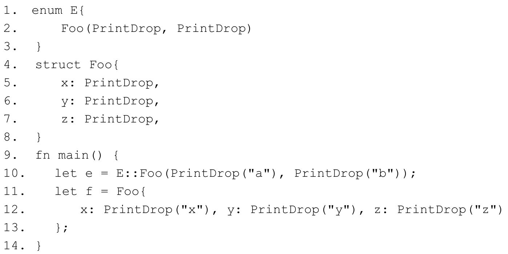
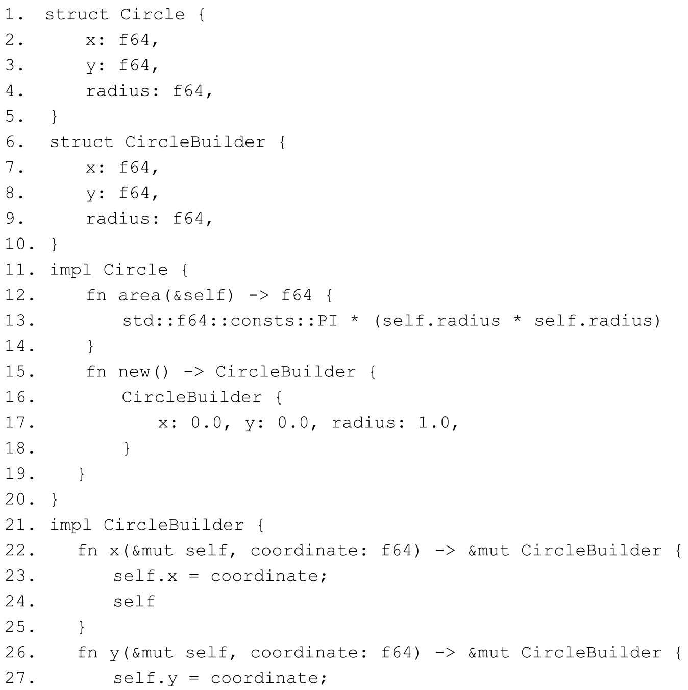
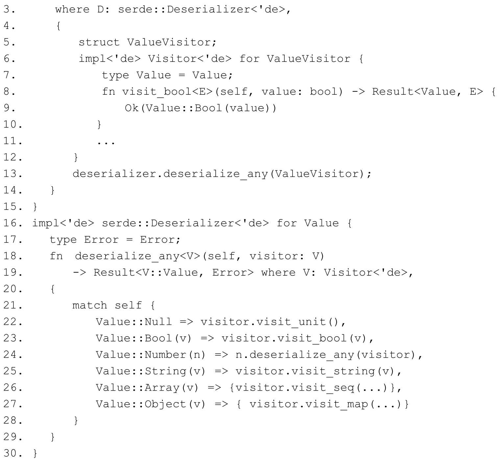

# 第7章 结构化编程 {#text00013.html#Afbbb302a-f861-46b8-aeea-299f62d14126 .title-left}

形每万变，神唯守一。

编程是一门技术，用它可以解决很多问题，创造很多新事物，甚至改变世界。编程更是一门艺术，在使用它解决问题或创造新事物的时候，本身就是一种精神实践活动，其中蕴含了开发者对于客观世界的认识和反映。在外行人的眼里，由 26 个英文字母加各种符号组合而成的程序代码可能毫无美感可言，那么编程的艺术性到底表现在哪里？对于开发者来说，编程的艺术性在于其组织结构极具审美价值。

编程完全可以类比建筑。2010年上海世博会上，中国馆"东方之冠"给人留下了深刻的印象。"东方之冠"的特色之处在于其采用了中华古建筑斗拱的结构，如图7-1所示。

::: center
{.u54030}

图7-1：中国古建筑斗拱结构示意图
:::

斗拱属于榫卯结构的一种，其上承屋顶，下接立柱，在中国古建筑中扮演的是顶天立地的角色。而斗拱仅仅由5个简单的部件组成，利用独一无二的榫卯结构，可以拼接出种类繁多且左右对称的各种样式，无不令人称赞。这正应了"形每万变，神唯守一"的规律。

编程也一样，同样需要考虑系统结构、分层和架构。无论是采用面向对象还是函数式的开发思想，可以代码复用和高内聚低耦合的架构就是一种美。而语言的范式在很大程度上决定了使用该语言编写出的代码的组织结构。对于面向对象范式的语言，其核心的概念是继承、多态和封装，它将对象作为程序的基本构建单元。而函数式范式语言将函数作为其程序的基本构建单元，采用抽象和复合等手段来组织和复用代码。这两种方式各有优缺点。面向对象范式在代码结构化方面的优点在于更加符合直觉，缺点是性能差、过度封装，而基于类继承的方式也会造成强耦合。函数式范式的优点在于它的核心思想是"组合优于继承"，与面向对象范式相比，其复用的粒度更小，更自由灵活，耦合程度更低，但其缺点是学习成本比较高。

作为现代系统级的编程语言，Rust汲取了两个不同编程范式的优势，提供了结构体、枚举体和 trait 这三驾马车来撑起程序结构。本章主要围绕结构体和枚举来阐述如何使用 Rust进行结构化编程。

## 7.1 面向对象风格编程 {#text00013.html#A618600ef-91a5-44d3-bb03-132ab4794396 .title-left}

严格来说，Rust并不符合标准的面向对象语言的定义。比如，Rust既不存在类或对象的概念，也没有父子继承的概念。然而，rust 却支持面向对象风格的封装。传统面向对象中的父子继承是为了实现代码复用和多态，其本质在类型系统概念中属于子类型多态，而 Rust使用trait和泛型提供的参数化多态就完全满足了这个需求。对于代码复用，Rust是通过泛型单态化和trait对象来避免代码重复，从而支持代码复用的，虽然相对于传统面向对象语言中的父子继承来说功能较弱，但Rust还提供了功能强大的宏（包括macro和procedural macro）系统来帮助复用代码，甚至还可以使用一些设计模式来避免代码重复。Rust还实现了一种名叫**特化** （**specialization** ）的功能来增强代码的高效复用。

总而言之，Rust对面向对象编程风格的支持可以总结为以下几点。

· **封装** 。Rust提供了结构体（Struct）和枚举体（Enum）来封装数据，并可使用pub关键字定义其字段可见性；提供了impl关键字来实现数据的行为。

· **多态** 。通过trait和泛型以及枚举体（Enum）来允许程序操作不同类型的值。

· **代码复用** 。通过泛型单态化、trait对象、宏（macro）、语法扩展（procedural macro）、代码生成（code generation）来设计模式。

### 7.1.1 结构体 {#text00013.html#A071c00ef-4650-42e6-b99b-4a5abba64c49 .title-left}

结构体（Struct）和枚举体（Enum）是Rust中最基本的两种复合类型。对于Rust类型系统而言，这两种复合类型实际上属于同一种概念，它们都属于**代数数据类型** （**ADT** ，**Algebraic Data Type** ）。代数数据类型的概念来自函数式语言，尤其在Haskell中应用最广，仅通过这两种数据类型就可以构造出大部分的数据结构。

**代数数据类型之积类型**

代数数据类型就是指具备了代数能力的数据类型，即数据类型可以进行代数运算并满足一定的运算规则（例如可以进行加法或乘法，满足交换律和结合律）。正是这一点保证了数据类型中的许多性质是可以**复合** 的。比如一个结构体中包含的成员都是拥有复制语义的简单原始数据类型，那么这个结构体也可以通过派生属性**＃\[derive\]** 来放心地为其实现Copy，如代码清单7-1所示。

**代码清单7-1：成员字段为简单原始数据类型的结构体示例**

::: center
{.u54029}
:::

::: center
{.u54028}
:::

在代码清单 7-1 中，因为结构体 Book 的成员字段均为复制语义的类型，所以在代码第12行输出book时，可以正常编译执行，说明第11行创建book2时，使用结构体更新语法".."时，book的所有权并未被转移。结构体的**更新语法** （**update syntax** ）允许使用".."语法来减少代码重复。

这说明复合类型结构体 Book 已经通过派生属性**＃\[derive（Copy，Clone）\]** 实现了 Copy。但是如果结构体Book使用了移动语义的成员字段，则不允许实现Copy，如代码清单7-2所示。

**代码清单7-2：成员字段为移动语义的情况**

::: center
{.u53408}
:::

在代码清单7-2中，将结构体Book的name字段修改为了拥有移动语义的String类型。该代码编译会报以下错误：

::: center
{.u54027}
:::

错误信息表明，Rust不允许包含了String类型字段的结构体实现Copy。看得出来，代数数据类型有力地保障了复合类型的类型安全。这里值得注意的是，更新语法会转移字段的所有权。在代码清单7-2的第11行中，..book语法会将除version字段之外的其他字段的所有权转移，这里name是String类型，属于移动语义，所以name会被转移所有权。如果把代码清单 7-2 结构体的派生属性＃\[derive（Copy，Clone）\]去掉，再编译该代码，则会报出代码第 12行注释展示的错误，表示book的部分字段的所有权已经被转移。

Rust中的结构体属于代数数据类型中的**积类型** 。积类型是来自范畴论的术语，毕竟Rust类型系统借鉴了Haskell语言，而Haskell语言是范畴论的最佳实践，但这并不代表需要深入Haskell或范畴论才能理解它。积类型也可以通过更直观的**乘法原理** 来理解，假如一件事需要分成*n* 个步骤来完成，第一步有*m* ~1~ 种不同的做法，第二步有*m* ~2~ 种不同的做法，以此类推，第 *n* 步有 *m~n~* 种不同的做法，那么完成这件事共有 *N* =*m* ~1~ ×*m* ~2~ ×*m* ~3~ ×...×*m* ~n~ 种不同的做法，这就是乘法原理。它描述的是做一件事需要分成很多步，每一步之间都相互依赖，它表示的是一种**组合** （combination）。如果用逻辑来表示，则是**逻辑与** （合取）。

同理，结构体这样的复合数据是通过不同字段的值组合而成的。比如一个元组结构体S（i32，u32，String），其实例是（i32，u32，String）这三种字段类型的值相互依赖而成的不同组合。由此可知，元组也属于积类型。积类型代表一种数据结构的复合方式，当一个复合类型需要组合多个成员来共同表达时，可以使用结构体。

Rust中的结构体虽然是代数数据类型，但也契合了面向对象思想中的封装。因此，通过结构体完全可以进行面向对象风格的编程。

**使用结构体进行面向对象风格编程**

下面以一个简单的示例来说明如何使用结构体进行面向对象风格的编程。假设需要实现一个库，该库的功能是在终端（Terminal）输出指定颜色的字符。使用该库输出指定颜色字符的代码如代码清单7-3所示。

**代码清单7-3：在终端输出指定颜色字符的代码示意**

::: center
{.u54026}
:::

代码清单7-3想实现的是在该代码运行时，在终端输出指定颜色的字符，具体来说，是想在终端输出黄色背景色下的红色字符串Hello。那么该如何设计代码才能实现此目标呢？

在终端显示带颜色的字符，需要使用**ANSI转义序列** （**ANSI Escape Code** ）。ANSI转义序列就是指形如 **ESC** 和**\[** 组合而成的字符序列，可以实现在屏幕上定位光标或改变输出字符颜色等功能，所以也被称为**控制字符** ，被定义于ASCII码中。ESC有三种表示方法：

· 在Shell中表示为**\\e** 。

· 以ASCII十六进制表示为**\\x1B** 。

· 以ASCII八进制表示为**\\033** 。

所以，如果想在终端输出带指定颜色的字符Hello，需要将其变为包含ANSI转义序列的字符串，如下所示：

::: center
{.u54025}
:::

将这三条echo指令放到Linux终端下，均会输出黄底红字的Hello。

**\\x1B\[** 为前缀，表示这是一个ANSI控制序列的开始。用分号相隔的**31；43** 属于颜色代码，31是前景色，代表红色；43为背景色，代表黄色。字母m为结束符，原始文本Hello置于其后。最后的**\\x1B\[0m** 结尾代表重置全部属性，表示一个ANSI控制序列的结束。图7-2以ESC的十六进制表示为例展示了ANSI转义序列的含义。

::: center
{.u54024}

图7-2：ANSI转义序列示意图
:::

那么，想把Hello转换为此ANSI序列，实际上就是一个字符串的组装。整个ANSI序列中动态变化的只有两部分，那就是颜色代码和原始文本，因此有了初步的实现步骤：

1.定义一个结构体，来封装动态变化的两部分数据。

2.为此结构体定义指定颜色的方法，比如red方法和on_yellow方法。

3.为了实现直接在字符串字面量上链式调用red和on_yellow方法，就必须为&＇a str 类型也实现red和on_yellow方法。

4.为此结构体实现方法，用于组装ANSI字符串序列。

5.打印结果。

接下来，按照此步骤来逐步实现目标。创建一个名为 **color.rs** 的文件存放整个代码，注意Rust代码文件以**.rs** 为扩展名。

第1步来设计一个结构体，命名为ColoredString，字段包含输入的原始字符串，以及前景色和背景色，如代码清单7-4所示。

**代码清单7-4：在color.rs文件中创建ColoredString结构体**

::: center
{.u54023}
:::

结构体ColoredString包含三个字段，均为String类型。其中input用于存储原始字符，fgcolor和bgcolor分别代表前景色和背景色。

第2步要为结构体实现颜色相关的方法，而第3步中也需要为**&＇a str** 类型实现相关方法，因此这里实际上需要一个统一的接口，这正是trait大显身手的地方，我们增加Colorize trait，如代码清单7-5所示。使用Rust的trait可以实现非侵入式接口，而不是面向对象语言（比如C++或Java）的那种有过多依赖的侵入式接口。

**代码清单7-5：在color.rs 中增加Colorize trait**

::: center
{.u53641}
:::

::: center
{.u54022}
:::

代码清单7-5定义了这个Colorize trait，该trait包含了FG_RED和BG_YELLOW两个常量，这两个常量叫**关联常量** 。关联常量是Rust 2018 版本中加入的新功能，和关联类型类似，由实现该trait的类型来指定常量的值，也可以像代码清单7-5这样指定默认常量值。这里的两个常量值分别代表前景色红色和背景色黄色，在后面的代码中将会使用。与直接在代码中使用数值相比，关联常量的可读性和可维护性更高一些。在使用关联常量的时候，要注意常量名必须全部大写，否则编译器会输出警告。并且在trait中要明确标注好常量的类型，因为此处编译器无法推断常量的具体类型。

该trait中还包含两个方法red和on_yellow，分别用于设置前景色和背景色。这两个方法均以self为第一个参数并返回ColoredString，表示该方法是和实现该trait的类型相关联的函数，其中self实际上代表self：Self，Self代表实现该trait的类型。这是Rust最具有面向对象风格的特点的地方，因为关联函数允许开发者使用点操作符来调用函数，同样也支持链式调用，就像使用面向对象语言那样。在面向对象语言中，形如recevier.message形式的调用方式被称为消息传递，点操作符左边的 recevier 被称为接收者，右边的部分被称为消息，在面向对象语言中，消息也被叫作方法。因此我们把这样的关联函数称为方法，用于和普通的函数区分开来。

然后就要分别为ColoredString和&＇a str类型实现Colorize。这里思考一个问题，当实现red 方法时，只需要设置前景色 fgcolor，而另外两个值却不知道，原始文本有可能是任意字符串，背景色bgcolor可以设置，也可以不设置。同理，实现on_yellow方法也存在类似的问题，所以必须使用默认值。最直观的办法是使用空字符串充当默认值，类似如下代码：

::: center
{.u54021}
:::

因为red和on_yellow方法返回的均为ColoredString实例，如果用这种方法，必然会出现重复代码，为了减少这种重复，可以使用结构体更新语法来隐式填充重复的字段，写法类似下面这样：

::: center
{.u54020}
:::

但是Rust并没有为结构体提供类似C++或其他面向对象编程语言中的构造函数，在实现red 或 on_yellow 方法时，如何提供默认值？Rust 标准库 std：：default 模块中提供了一个叫作**Default** 的trait，可以帮助解决此问题。使用Default可以为ColoredString提供默认值，代码清单7-6展示了如何为ColoredString实现Default。

**代码清单7-6：在color.rs 中为ColoredString实现Default**

::: center
{.u54019}
:::

::: center
{.u53523}
:::

因为Default已经在**std：：prelude：：v1** 模块中被导入，所以这里就可以直接使用而不需要显式地导入Default。**Rust已经为内置的大部分类型实现了Default** ，所以在代码清单7-6中，可以使用String：：default方法来设置String类型的默认值。接下来就可以正式为ColoredString和&＇a str实现Colorize了，如代码清单7-7所示。

**代码清单7-7：在color.rs 中为ColoredString和&＇a str实现Colorize**

::: center
{.u54018}
:::

如果只需要为字符串设置前景色或背景色中的某一种颜色，那么只需要为**&＇a str** 实现Colorize，就可以满足像＂Hello＂.red（）这样的调用。但是如果希望像＂Hello＂.red（）.on_yellow（）这样通过链式调用来同时设置前景色和背景色，就需要为ColoredString也实现Colorize，因为在第一次调用之后，返回的是ColoredString类型的实例，ColoredString必须实现Colorize才能满足这样的链式调用。

代码清单7-7的第4行和第9行的更新语法中使用了..self，而代码第18行和第25行的更新语法中使用的是..ColoredString：：default（）。其中的区别很容易理解，因为第一次调用 red或on_yellow方法的是字符串，所以需要调用ColoredString的默认值来进行第一次默认填充，如果有链式调用才会轮到ColoredString类型，所以需要用self来保存第一次调用时候的设置。

另外也需要注意代码中关联常量的用法。因为是给ColoredString类型实现的Colorize，所以调用关联常量必须以类型名为前缀，即ColoredString：：FG_RED和ColoredString：：BG_YELLOW。接下来的工作就是要将原始字符串组装为 ANSI 序列，为了实现这一点，需要为ColoredString实现compute_style方法，如代码清单7-8所示。

**代码清单7-8：在color.rs 中为ColoredString实现compute_style方法**

::: center
{.u54017}
:::

代码清单7-8为ColoredString实现的compute_style方法是为了组装ANSI序列的前半部分，也就是**\\x1B\[43；31m** 。前半部分是使用前缀**\\x1B** 来定义ANSI序列的开始，后面紧跟颜色编码**43；31** ，43和31分别代表红色前景色和黄色背景色，用分号相隔。结束符**m** 代表颜色控制字符已经设置完毕。前半部分是最关键的，它设置好以后，后面就可以紧跟原始文本和ANSI的属性重置符了，后面的部分要在最终打印输出时再进行拼接。

代码清单7-8的第3行初始化了一个可变的String类型字符串res，并包含了ANSI序列的起始前缀。

代码第4行设置了一个bool类型的变量has_wrote，用于判断是否有bgcolor的设置。

代码第5行到第8行通过标准库中String类型默认提供的is_empty方法，来判断结构体中的 bgcolor 字段是否为空。如果不为空，则说明设置了背景色，将 bgcolor 字段的值通过push_str 方法拼接到 res 字符串后面，因为 push_str 的参数需要&str 类型，所以这里使用了&self.bgcolor，虽然是&String类型，但它会自动解引用为&str类型，同时，将has_wrote设置为true。

代码第9行到第12行判断fgcolor字段是否为空，如果不为空，则将fgcolor的值拼接到res字符串后面。但是在此之前，还需判断has_wrote是否为真，如果为真，则先把分号拼接到 res 字符串后。这里需要注意的是，对于 ANSI 控制符来说，前景色和背景色是由相应的代码决定的，和它们的拼接顺序并无关系。所以，这里最终的拼接结果是 **43；31** ，先判断的是背景色，然后是前景色。其实如果反过来，**31；43** 也不会影响呈现结果。

第13行和第14行分别加上结束符**m** ，并返回最终拼接好的字符串res，就得到了预期的ANSI序列。

最后，需要将最终的输出结果拼接出完整的字符串**\\x1B\[43；31mHello\\x1B\[0m** ，那就需要为coloredstring实现Display，如代码清单7-9所示。

**代码清单7-9：在color.rs 中为ColoredString实现Display**

::: center
{.u54016}
:::

::: center
{.u53597}
:::

**Display** 是定义于std：：fmt中的trait，它和Debug很相似。Debug是专门用于格式化打印的trait，通过**{：？}** 来格式化打印指定的输出，其中的**？** 代表Debug模式，在本书中已经用到过很多次了，Debug 可以通过**＃\[derive（Debug）\]** 属性来自动派生。而 Display 是通过**{}** 来格式化打印的，它比Debug适用的范围更广，更常用于手工实现而非自动派生。

代码清单7-9是一个标准的实现Display的例子，fmt方法使用&self作为第一个参数，第二个参数为fmt：：Formatter类型，是一个结构体，专门用于提供记录格式化相关的信息，比如提供了 write_str，用于将指定的数据记录到底层的缓冲区中。fmt 方法返回的 fmt：：Result类型是和Option＜T＞相似的类型，专门用于错误处理。

代码第4行声明了input变量，用来存储ColoredString结构体实例中input字段所记录的原始文本。

代码第5行到第7行使用write_str方法，依次将ANSI序列的前半部分、原始文本和ANSI序列属性重置符放入底层缓冲区中。其中用到了try！宏，它是Rust标准库提供的专门用于错误处理的宏，如果出现错误，会自动返回相应的 Err，后面错误处理的章节会介绍更多相关内容。代码第8行返回Ok（（）），表示正常结束。

然后添加main函数，如代码清单7-10所示。

**代码清单7-10：在color.rs中添加main函数**

::: center
{.u54015}
:::

代码清单7-10中添加了main函数，可以自由地调用red或on_yellow方法对字符串字面量设置ANSI控制码，使其在终端输出时显示相应的颜色。可以通过**rustc** 命令来编译color.rs文件，如下所示：

::: center
{.u54014}
:::

编译通过以后，直接执行得到的二进制文件，即可观察到最终运行结果，正如所预期的那样。通过这个简单的示例，我们可以对Rust中使用结构体和trait进行面向对象风格编程有一个整体的了解。

但是目前的代码功能有限，如果想让它支持显示更多的颜色，该如何扩展现有的代码呢？不妨考虑使用枚举体，也可称为枚举类型或枚举。

### 7.1.2 枚举体 {#text00013.html#Af43300f7-c205-4efc-bb74-d35a7cb14ac8 .title-left}

枚举体（Enum）是 Rust 中除结构体之外的另一种重要的复合类型。Rust 之父 Graydon曾经这样评价枚举体："一门不支持枚举体的语言堪比一场悲剧，想想如果没有lambda会发生什么。"Graydon把枚举体看得和lambda一样重要，可想而知枚举体的重要性。事实也确实如此，枚举体让Rust更简洁，拥有更强大的表现力。

**代数数据类型之和类型**

枚举体属于代数数据类型中的**和类型** （Sum Type）。积类型可以借助乘法原理来理解，而和类型正好可以借助加法原理来理解。**加法原理** 是指，如果做一件事有*n* 类办法，在第一类办法中有*m* ~1~ 种不同的方法，在第二类办法中有*m* ~2~ 种不同的方法，以此类推，在第*n* 类办法中有 *m* ~n~ 种不同的方法，那么完成这件事一共有 *m* ~1~ +*m* ~2~ +...+*m* ~n~ 种不同的方法。因此，如果说积类型是步步相关的话，那么和类型就是各自独立的。如果积类型表示**逻辑与** （合取），那和类型就表示**逻辑或** （析取）。

Rust中用来消除空指针的Option＜T＞类型就是一种典型的枚举体，如代码清单7-11所示。

**代码清单7-11：Option＜T＞是一种典型的枚举体**

::: center
{.u54013}
:::

Option＜T＞是一种典型的和类型，它代表**有** 和**无** 之和，将两种不同的类型构造为一种新的复合类型。枚举体包含了有限的枚举值，要使用它们，必须逐个枚举其中每一个值。和结构体不同的是，枚举体中的成员是值，而非类型，一般把它们叫作**变体** （**variant** ）。使用枚举体可以更方便地实现多态。

可以使用枚举体方便地表示颜色，如代码清单7-12所示。

**代码清单7-12：使用枚举体表示颜色**

::: center
{.u54012}
:::

只有对比才能体现出枚举体的方便之处，不妨考虑用面向对象语言该如何实现这种情况？代码清单7-13展示出了相关伪代码。

**代码清单7-13：面向对象语言中表示颜色的伪代码示意**

::: center
{.u54011}
:::

代码清单7-13用伪代码展示了诸如Ruby、Python、Java、C++之类的面向对象语言会如何表示颜色。首先需要定义一个Color类，也需要为具体的颜色定义相应的类，比如Red、Yellow和Blue需要各自继承Color来实现相关的方法。而在Rust中，只需要枚举体就已足够。

接下来，我们使用枚举体来重构之前 **color.rs** 中实现的代码，以便可以方便地添加新的颜色。**之前的代码主要有三处需要变动** ：

· 使用枚举体来管理颜色，而不是直接在具体的方法中使用颜色代码。

· 使用模式匹配代替if来确认结构体中的fgcolor和bgcolor的设置情况。

· 可以支持通过字符串设置颜色。

**重构color.rs代码**

代码清单7-12已经创建了枚举体Color来管理颜色，接下来要为其实现一些方法，用于将Color中的每个变体和具体的ANSI颜色码对应起来，如代码清单7-14所示。

**代码清单7-14：为Color实现相应的方法，以对应具体的ANSI颜色码**

::: center
{.u54010}
:::

代码清单7-14通过impl关键字为Color实现了两个方法，to_fg_str和to_bg_str，分别用于对应前景色和背景色的 ANSI 颜色码。注意，这里使用了 match 模式匹配，覆盖了 Color中的每一个值，这是必须的，否则Rust会编译错误。这里值得注意的地方是，代码第3行和第10行中的\*self并不会获取self的所有权。

下一步要修改结构体 ColoredString 中 fgcolor 和 bgcolor 字段的类型，如代码清单 7-15所示。

**代码清单7-15：修改ColoredString结构体中fgcolor和bgcolor的类型**

::: center
{.u54009}
:::

::: center
{.u54008}
:::

代码清单7-15将fgcolor 和bgcolor 字段类型改为了Option＜Color＞。fgcolor和bgcolor有两种可能的值：要么有，要么无。因此，这里非常适合使用 Option＜T＞类型，就不需要再使用is_empty方法进行判断了。既然结构体变了，那么其默认值也需要进行相应的改变，因为修改为了Option＜Color＞，所以fgcolor和bgcolor的默认值完全可以统一设置为None。

接下来，需要为Color实现From，用于将&str或String类型的字符串转换为Color，这样做是为了实现通过字符串来设置颜色的需求，如代码清单7-16所示。

**代码清单7-16：为Color实现From**

::: center
{.u54007}
:::

要实现From，需要显式地导入 **std：：convert：：From** 、 **std：：str：：FromStr** 和**std：：string：：String** 。代码清单7-16的第4行到第13行为Color实现了可以从&str和String转换的from方法。其中用到了**parse** 方法，该方法要求目标类型必须实现**FromStr** ，所以代码第14行到第24行专门为Color实现了FromStr。

实现 FromStr 的 from_str 方法包含了**错误处理** 相关的代码，最终返回一个 **Result＜Self，Self：：Err＞** 类型的结果。该方法主要包含两个动作，第一个动作是使用标准库提供的to_lowercase方法将传入的字符串变为小写，第二个动作是使用match匹配可能的值，来返回相应的Color变体。注意match匹配使用了通配符来匹配可能值之外的全部情况，这里返回了Err。关于错误处理更详细的内容将在第9章介绍。

代码第6行和第11行的parse方法进行类型转换时，使用了unwrap_or方法。parse方法会返回Result类型的值，如果是Ok＜T＞类型，则会通过unwrap来获取其中的值；如果是Err＜T＞类型，则返回指定的默认值 Color：：Red。看得出来，使用枚举体可以非常干净安全地处理这种情况。

因为增加了新的颜色，下一步来修改Colorize这个trait，如代码清单7-17所示。

**代码清单7-17：修改Colorize**

::: center
{.u54006}
:::

除了添加了新的颜色设置方法，Colorize最明显的变化是第5行和第9行分别添加了color方法和on_color泛型方法。使用这两个方法就可以通过字符串来设置终端文本的颜色。

然后，ColoredString和&＇a str分别实现Colorize的代码也需要做相应的修改，如代码清单7-18所示。

**代码清单7-18：修改ColoredString和&＇a str实现Colorize的相关代码**

::: center
{.u54005}
:::

::: center
{.u54004}
:::

在代码清单 7-18 中，值得注意的是，color 和 on_color 泛型方法中使用了 trait 限定＜S：Into＜Color＞＞，这是因为Color实现了From，所以对于String和&＇a str类型的字符串均可通过into方法转换为Color。

最后一个需要修改变化的就是compute_style方法，因为ColoredString结构体中字段类型都变了，该方法中需要将if判断修改为模式匹配，如代码清单7-19所示。

**代码清单7-19：修改compute_style方法**

::: center
{.u54003}
:::

compute_style方法的基本逻辑并未改变，只是将if改为了if let模式匹配，最终的main函数如代码清单7-20所示。

**代码清单7-20：main函数**

::: center
{.u54002}
:::

::: center
{.u53910}
:::

现在可以使用新添加的方法来设置相应的颜色了，并且可以使用color和on_color 方法通过字符串来指定颜色。编译并运行重构后的color.rs，将成功输出预期的结果。

通过对color.rs进行重构，我们可以更深刻地体会到枚举体的方便和强大之处。枚举体、结构体和trait相互结合，完全可以进行面向对象风格的编程，甚至可以比一些面向对象语言更简洁更优雅。更重要的一点是，Rust是零成本抽象的。

### 7.1.3 析构顺序 {#text00013.html#A40a100fc-2485-4392-aa42-6cc046dbd2e7 .title-left}

通过第4章的学习，我们已经知道了结构体和枚举体的内存布局，但是结构体中的字段是如何析构的呢？Rust中变量的析构顺序是和其声明顺序相反的，但并非所有的类型都按这个顺序来析构。接下来我们用一些实验示例来说明其中的规律。

首先使用Newtype模式来创建一个元组结构体，让其实现Drop，如代码清单7-21所示。

**代码清单7-21：定义元组结构体并为其实现Drop**

::: center
{.u54001}
:::

代码清单7-21中定义的结构体主要用于测试析构顺序。这里使用了Newtype模式来创建结构体，实际上是用元组结构体包装了某个类型，从而相当于创造了一个新类型。Newtype模式在Rust中很常见。

这样创建的新类型和原始的类型是完全不同的，以下几种情况适合使用Newtype模式：

· **隐藏实际类型，限制功能** 。使用Newtype模式包装的类型并不能被外界访问，除非提供相应方法。

· **明确语义** 。比如可以将f64类型包装为Miles（f64）和Kilometers（f64），分别代表英里和千米。这样的语义提升是零成本的，没有多余的性能开销。

· **使复制语义的类型具有移动语义** 。比如 f64 本来是复制语义，而包装为 Miles（f64）之后，因为结构体本身不能被自动实现Copy，所以Miles（f64）就成了移动语义。

代码清单7-21使用Newtype模式只是为了提升语义，增强可读性，方便后面示例代码的展示。

**本地变量**

本地变量遵循先声明后析构的规则，实际上这也缘于栈结构先进后出的特性，本地变量的析构如代码清单7-22所示。

**代码清单7-22：本地变量的析构**

::: center
{.u54000}
:::

::: center
{.u53999}
:::

代码清单7-22的输出结果如代码清单7-23所示。

**代码清单7-23：代码清单7-22的输出结果**

::: center
{.u53998}
:::

看得出来，先声明了 x，但是先析构的是 y。因此，改变放置顺序有可能会导致悬垂指针。同样道理，在编写Rust代码时，你会发现有时只要修改一下变量声明的顺序，本来无法编译的代码就可以正常编译通过了。

**元组**

元组的析构如代码清单7-24所示。

**代码清单7-24：元组的析构**

::: center
{.u53997}
:::

代码清单7-24编译执行的结果如代码清单7-25所示。

**代码清单7-25：代码清单7-24的输出结果**

::: center
{.u53996}
:::

看得出来，元组整体的析构顺序和局部变量的析构顺序一致，但是元组内部元素的析构顺序则和局部变量的析构顺序相反，元组内部是按元素的出现顺序依次进行析构的。

现在把元组tup2 中最后一个元素修改为一个特殊的元素 panic！（），看看会发生什么，如代码清单7-26所示。

**代码清单7-26：将tup2中的最后一个元素修改为panic！（）**

::: center
{.u53995}
:::

宏panic！（）会引起main线程崩溃，但是析构函数还是会输出如代码清单7-27所示的结果。

**代码清单7-27：代码清单7-26的输出结果**

::: center
{.u53994}
:::

看得出来，tup2中元素的析构顺序改变了，和代码清单7-24中的析构顺序正好相反。可以理解为，线程的崩溃触发了 tup2 的提前析构，此时 tup2 其实并不算一个完整的元组，这种提前析构的顺序正好和局部变量的析构顺序一致：先声明的元素后析构。

**结构体和枚举体**

结构体和枚举体与元组的析构顺序是一致的，如代码清单7-28所示。

**代码清单7-28：结构体和枚举体的析构顺序**

::: center
{.u53993}
:::

代码清单7-28编译的结果如代码清单7-29所示。

**代码清单7-29：代码清单7-28输出结果**

::: center
{.u53992}
:::

看得出来，结构体实例f先析构，枚举值e最后析构。但是其内部元素的析构顺序是按排列顺序来析构的。同样，结构体字段如果指定了panic！（）为值，那么在相同的情况下，其析构顺序也会变得和元组的一致。

同理，Slice类型的集合类型的析构顺序，与元组、结构体和枚举体的析构行为一致。

**闭包捕获变量**

闭包的捕获变量的析构顺序和结构体的析构顺序也是一致的，如代码清单7-30所示。

**代码清单7-30：闭包捕获变量的析构顺序**

::: center
{.u53991}
:::

代码清单7-30的运行结果如代码清单7-31所示。

**代码清单7-31：代码清单7-30的输出结果**

::: center
{.u53990}
:::

看得出来，闭包捕获变量的析构顺序和闭包内该变量的排列顺序一致，与捕获变量声明的顺序是没有关系的，这里要和普通函数内局部变量相区分。但闭包和元组、结构体类似，也存在析构顺序变化的情况，如代码清单7-32所示。

**代码清单7-32：闭包捕获变量析构顺序变化的特殊情况**

::: center
{.u53989}
:::

代码清单7-32中的闭包使用了一个内部作用域来引用变量z，这次编译的结果如代码清单7-33所示。

**代码清单7-33：代码清单7-32的输出结果**

::: center
{.u53988}
:::

这次的析构顺序和代码清单7-30中的不一致，这是因为z在move到闭包之前先被借用了，所以需要等待其离开作用域归还所有权之后，才能被 move 到闭包中。因此，变量被捕获的顺序就变成了z → x → y，然后按此顺序再进行析构。

## 7.2 常用设计模式 {#text00013.html#Ad14900ff-97bd-4618-a403-b7002ef27a85 .title-left}

有了trait、结构体和枚举体这三驾马车，我们就可以自由地编写容易扩展的Rust代码了。它们简单、灵活和方便，也正因为如此，才更需要使用设计模式来帮助我们设计出更灵活、更简洁、更易扩展和更好维护的系统。

自GoF四人组提出23种设计模式的概念至今已经超过20年了，虽然设计模式最初是基于面向对象语言提出的，但是经过这 20 多年的发展，设计模式已经超越了面向对象语言的范畴。设计模式所阐述的思想被广泛应用于各种语言及其工程项目中。设计模式的思想一共涵盖了下面4点：

· 针对接口编程。

· 组合优于继承。

· 分离变和不变。

· 委托代替继承。

可以说，Rust语言本身的设计就非常符合这4点思想。trait可以强制性地实现针对接口编程；泛型和trait限定可替代继承实现多态，基于代数数据类型的结构体或枚举体在没有继承的情况下也一样可以更自由地构造各种类型；类型系统天生分离了变与不变；常用的迭代器就是利用委托来代替继承的。

Rust是一门已经实现自举的语言，其内部实现也用到了很多设计模式。比如第6章学到的迭代器就包含了委托模式和迭代器模式的思想。在Rust的其他诸多项目中也大量使用了设计模式。接下来会依次介绍Rust编程中常用的另外几个设计模式。

### 7.2.1 建造者模式 {#text00013.html#A72560100-6b43-4480-acc2-c067894b25e0 .title-left}

Rust这门语言没有提供构造函数，这主要是出于对类型安全的考量。我们以一个结构体为例来说明，如果要构造结构体的实例，有时候需要一些默认值，像Java这种语言会提供默认的构造函数，并可以将值初始化为0，而对于C++来说，就有可能引起未定义行为，这属于类型不安全的问题。Rust并没有类似Java那样的默认机制，所以Rust没有提供构造函数，而是可以像函数式语言那样直接绑定值来构造类型实例。所以，就需要一些设计模式来辅助完成复杂类型实例的构造工作，而建造者模式比较适合这种应用场景，这也是Rust中大量使用这种模式的原因。

**建造者模式** （**Builder Pattern** ）是Rust中最常用的设计模式之一。建造者模式是指使用多个简单的对象一步步构建一个复杂对象的模式。该模式的主要思想就是将变和不变分离。对于一个复杂的对象，肯定会有不变的部分，也有变化的部分，将它们分离开，然后依次构建，如代码清单7-34所示。

**代码清单7-34：建造者模式示例**

::: center
{.u53987}
:::

::: center
{.u53986}
:::

代码清单7-34是一个典型的建造者模式，整段代码的功能是可以自由地通过指定的方法创建一个圆，并可访问其面积和坐标。

代码第1行到第5行定义了结构体Circle，包含x、y和radius三个字段，分别代表横纵坐标和半径。

代码第6行到第10行定义了结构体CircleBuilder，包含的字段和Circle结构体的一样。这里实际上还是利用了委托的思想，Circle委托了CircleBuilder来帮助构建其实例。

代码第11行到第20行为结构体实现了求面积的area和new方法。area方法中用到的std：：f64：：consts：：PI是由标准库提供的数学常量圆周率（π）。而new方法返回的是CircleBuilder实例。

代码第21行到第39行为CircleBuilder实现了一系列方法。首先是x、y和radius方法，分别用于修改CircleBuilder实例中相关字段的值，并在修改完之后返回自身的可变借用。最后是build方法，它根据CircleBuilder的实例构建最终的Circle实例并将其返回。

经过这样精心的构造，就可以在 main 函数中使用 **Circle：：new（）.x（1.0）.y（2.0）.radius （2.0）.build（）** 这样优雅的链式调用来创建Circle的实例了。

在Rust标准库中有一个用于创建进程的结构体std：：process：：Command，它使用了创建者模式，代码清单7-35展示了其用法。

**代码清单7-35：std：：process：：Command使用示例**

::: center
{.u53985}
:::

看得出来，代码清单7-35中的Commad使用示例和代码清单7-34中创建的Circle实例的用法非常相似。

### 7.2.2 访问者模式 {#text00013.html#A69950102-38cc-4009-a282-01c4f4185f5c .title-left}

Rust中另一个重要的模式是**访问者模式** （**Visitor Pattern** ）。访问者模式用于将数据结构和作用于结构上的操作解耦。Rust语言自身在解析抽象语法树时就用到了访问者模式。

**Rust编译器源码中的访问者模式**

Rust解析抽象语法树如代码清单7-36所示。

**代码清单7-36：Rust解析抽象语法树示意**

::: center
{.u53984}
:::

代码清单7-36只是展示了部分相关代码。这段代码是用于构建**抽象语法树的** ，Rust语法中包含语句、标识符名称和表达式，分别被定义于**ast** 模块中的Stmt、Name和Expr来表示。关键字mod用于定义一个模块，在第10章会介绍更多关于模块的内容。

这些包含在 ast 模块中的类型虽然各不相同，但是它们整体是在描述同一个抽象语法树结构的。因此，整个抽象语法树就是一个异构的结构，其中的每个语法节点都是不同的类型，对于这些节点的操作也各不相同。语法节点是基本确定好的，变化不会太大，但是对节点的操作需要经常改动，比如Rust现在正处于发展期，会定时添加一些新特性。使用访问者模式将不变的节点和变化的操作分离开，可以方便后续扩展。所以，**访问者模式一般包含两个层次** ：

· 定义需要操作的元素。

· 定义相关的操作。

对于代码清单 7-36 来说，ast 模块定义了抽象语法树中的全部节点相关的数据结构，而visit模块中的Visitor trait则定义了相关的操作。所以在解析语法树的时候，只需要为解析器实现相关的visit方法即可操作相关节点，如代码清单7-37所示。

**代码清单7-37：为解析器实现Visitor**

::: center
{.u53983}
:::

代码清单7-37为解析器Interpreter实现了Visitor，对不同的语法树节点有不同的操作方法。访问者模式优雅地把节点数据结构与其解析操作分离开了，为后续自由灵活地解析语法节点提供了方便。

**Serde库中的访问者模式**

访问者模式的另一个经典的应用场景是第三方库**Serde** ，它是一个对Rust数据结构进行序列化和反序列化的高效框架。Serde 的命名就是分别从 **Serialize** （**序列化** ）和 **Deserialize** （**反序列化** ）两个单词中拿出**Ser** 和**De** 两部分组合而成的。Serde之所以称为框架，是因为其定义了统一的数据模型，并通过访问者模式开放了序列化和反序列化的操作接口。Serde目前已经支持了很多数据格式，包括JSON、XML、BinCode、YAML、MessagePack、TOML等。

Serde中序列化和反序列化都使用了访问者模式，这里只以反序列化为例说明。Serde中自定义了一些类型来对应 Rust 中可能出现的所有数据类型，包括基本的原生类型、String、option、unit、seq、tuple、tuple_struct、map、struct等。比如，option代表Option＜T＞类型，tuple_struct代表元组结构体，seq代表线性序列（像Vec＜T＞之类的集合），而map则代表k-v结构的容器（比如HashMap＜k，v＞）。这些异构的类型构成了Serde框架的统一的数据模型。

接下来，Serde提供了三个trait，如代码清单7-38所示。

**代码清单7-38：Serde中的trait示意**

::: center
{.u53982}
:::

::: center
{.u53981}
:::

代码清单7-38中展示了部分反序列化相关的trait。通过Deserializer和Visitor两个trait定义了反序列化开放的操作接口。这就是 Serde 框架利用访问者模式所定义的主要内容：**统一的数据模型和开放的操作接口** 。然后再针对不同的数据格式实现不同的访问者操作方法。

下面以JSON 格式数据反序列化为例来说明。第三方库serde_json是基于Serde实现的JSON解析库，该库将JSON格式中出现的数据类型统一定义为一个Value枚举体，如代码清单7-39所示。

**代码清单7-39：serde_json库中定义Value枚举体示意**

::: center
{.u53980}
:::

代码清单7-39中定义的Value包含了6种枚举值，基本上涵盖了JSON数据格式中所出现的所有数据类型。所谓反序列化，就是将JSON格式的字符串解析为Rust数据类型。接下来，serde_json实现了Serde框架开放的trait接口：Deserialize、Vistitor和Deserializer，代码清单7-40展示了其中的Visitor和Deserializer的实现。

**代码清单7-40：serde_json实现Visitor和Deserializer代码示意**

::: center
{.u53979}
:::

::: center
{.u53978}
:::

由于篇幅限制，代码清单7-40只展示了部分源码。看得出来serde_json实现了Deserialize，其中定义的 deserialize 方法正是最终用于反序列化的方法。在 deserialize 方法中定义了结构体ValueVisitor，并为其实现了Visitor，这是一种委托模式。

serde_json也为Value实现了serde：：Deserializer，其中deserialize_any方法是专门用于自定义类型反序列化的，比如Value类型。通过一个match匹配枚举体Value中定义的6种类型，分别调用了相应的visit_xxx系列方法。

以上就是 Serde 框架中对访问者模式的应用说明，看得出来，访问者模式将数据结构和操作分离开，为代码的扩展提供了极大的便利。读者也可以查看本书配套源码中包含的另一个自定义访问者模式案例。

### 7.2.3 RAII模式 {#text00013.html#Ac55a0105-6270-4004-b7ce-0eb00ff6ba6a .title-left}

Rust 的一大特色就是利用 RAII 进行资源管理，让我们能够编写更安全的代码。接下来以一个示例来说明RAII模式，如代码清单7-41所示。

**代码清单7-41：RAII模式示例**

::: center
{.u53977}
:::

::: center
{.u53976}
:::

代码清单7-41展示的是一个送信的逻辑。代码第1行到第4行定义了结构体Letter，代表信件。代码第5行到第7行定义了结构体Envelope，代表信封，其中字段为Option＜Letter＞类型，代表信封里有信或无信两种状态。代码第 8 行到第 10 行定义了结构体PickupLorryHandle，表示信件被装车送走，包含 bool 类型字段，done 表示其状态。代码第11行到第20行分别为Letter和Envelope实现了new（写信）和wrap（装信）两个方法。

第21行到第23行定义了函数buy_prestamped_envelope，其返回一个letter被设置为None的Envelope实例，表示购买带邮戳的空信封。

第24行到第32行为PickupLorryHandle实现pickup（装车）和done（寄送）两个方法。第33行到第35行实现了order_pickup函数，表示将信封下单装车准备寄送。

整个逻辑过程如图7-3所示。

::: center
{.u53975}

图7-3：代码清单7-41逻辑示意图
:::

最后，main函数如代码清单7-42所示。

**代码清单7-42：相关main函数**

::: center
{.u53974}
:::

初看整段代码，好像没有什么逻辑问题，但是仔细思考，还是**存在以下问题** ：

· Letter有可能被复制多份并被装到多个信封（envelope）里，不安全。

· 信封里可能有信，也可能没有信；或者同一个信封可能装多封不同的信件，不安全。

· 无法保证一定把信交给邮车了，不安全。

为了修正这三个问题，可以使用 RAII 模式来重构代码清单 7-41。重构后的代码如代码清单7-43所示。

**代码清单7-43：利用RAII模式重构代码清单7-41**

::: center
{.u53973}
:::

::: center
{.u53972}
:::

代码清单 7-43 中为了解决前两个问题，将 Envelope 结构体变为了 EmptyEnvelope 和ClosedEnvelope 两个结构体，分别代表空信封和已装好信件的信封。并且为 EmptyEnvelope实现了wrap方法，确保信件被放到空信封中。将letter用于实例化ClosedEnvelope，并且转移了 letter 所有权，保证信件只封装一次。在 buy_prestamped_envelope 方法中使用EmptyEnvelope，确保购买的是空信封。

PickupLorryHandle实现的pickup方法中的第二个参数envelope被设置为ClosedEnvelope类型，确保装车的信件不是空信封。最重要的一步是，为PickupLorryHandle实现了Drop，使用drop方法替代了原来的done方法。

代码清单7-44展示了main函数的变化：

**代码清单7-44：重构main函数**

::: center
{.u53971}
:::

代码清单7-44运行之后，会输出sent，这证明PickupLorryHandle的实例lorry在main函数结束之后运行了drop方法，这正是RAII的体现，不仅释放了资源，也在逻辑上保证了信件已经安全送出。

所以，所谓RAII模式，并非经典的GoF中的模式，它实际上就是利用Rust的RAII机制来确保逻辑安全性的一种模式。这种模式在某些场景中非常适用，比如处理HTTP请求的场景。它也是Rust官方团队推荐使用的模式。

## 7.3 小结 {#text00013.html#A73540109-cb15-47fc-8675-c4565c21c51a .title-left}

本章从结构体和枚举体的角度详细介绍了Rust语言如何结构化编程。Rust属于混合范式语言，利用 trait、结构体和枚举体可以完全支持面向对象风格的编程。但是需要注意的是，Rust基于代数数据类型统一了结构体和枚举体，当进行面向对象风格的编程时，不要以传统面向对象语言的思路去写程序，而应该遵循Rust语言自身的特性。

Rust语言的哲学是组合优于继承，结构体和枚举体就像真实建筑中用到的榫卯，可以自由组合出想要的结构。在日常的编程中，使用设计模式可以更好地复用代码，写出易扩展、易维护的程序。本章介绍了三种常用的设计模式：创建者模式、访问者模式和 RAII 模式，这三种模式在Rust内部及第三方库中都被大量应用。除了这三种模式，还有其他的设计模式，比如观察者模式、策略模式等，这些留给读者自己去学习和探索。

但是要注意，直接将面向对象设计中的设计模式应用在Rust中是不妥的，应该结合Rust语言的特点来用。一个经典的案例就是，在RustConf 2018大会的闭幕演讲 ^[\[1\]](#text00013.html#nAD7E01090FD5402EB080F40793802008){#text00013.html#nAD7E01090FD5402EB080F40793802008s}^ 中，演讲者提到了一种面向数据（Data-Oriented）的设计，它比面向对象设计更加适合游戏开发。演讲中提到了使用Rust进行面向数据设计来实现ECS架构的游戏引擎，同时提出了三种模式：分代索引（Generational Index）模式、动态类型（AnyMap）模式、注册表（Register）模式，读者可以自行查看。

------------------------------------------------------------------------

[\[1\]](#text00013.html#nAD7E01090FD5402EB080F40793802008s){#text00013.html#nAD7E01090FD5402EB080F40793802008} RustConf 2018闭幕演讲中文梳理稿参见https：//zhuanlan.zhihu.com/p/44657202。

[]{#text00014.html}
