# 第8章 字符串与集合类型 {#text00014.html#A4671ae18-d9e0-472e-98db-b97ae38af114 .title-left}

阵而后战，兵法之常，运用之妙，存乎一心。

曾经有一个人因为说了一句话而获得图灵奖，这个人就是 Pascal 语言之父尼古拉斯（Nicklaus Wirth），他说的那句话是：程序等于数据结构加算法。因为一句话而获得图灵奖，这当然是开玩笑，得奖完全得益于他创造的Pascal语言所做出的贡献，他也写了一本以那句话为书名的计算机专著。但这足以说明了数据结构的重要性。

数据结构是计算机存储和组织数据的方式。对于不同的场景，精心选择的数据结构可以带来更高的运行效率或存储效率。通常，通过确定数据结构来选择相应的算法，也可能通过算法来选择数据结构，不管是哪种情况，选择合适的数据结构都相当重要。

程序中最常用的三大数据结构是字符串、数组和映射。字符串是特殊的线性表，是由零个或多个字符组成的有限序列。但字符串和数组、映射的区别在于，字符串是被作为一个整体来关注和使用的；而数组和映射关注最多的是其中的元素及它们之间的关系。所以，数组和映射也被称为集合类型。Rust作为一门现代高级语言，也自然为这三大数据结构提供了丰富的操作支持。

## 8.1 字符串 {#text00014.html#A062a010a-f8bc-49de-87a5-e70f1d974dce .title-left}

在编程中字符串具有非常重要的地位。当你在看互联网上的某篇博客，或者去电商网站购物时，所看到的商品名称或价格等信息都是用字符串来表示的。众所周知，计算机底层只存储0和1这两个数字，如果想让计算机处理各种字符串，就必须建立字符和特定数字的一一映射关系。比如，想让计算机存储字符 **A** ，则存储二进制数 **0100_0001** ，在读取的时候，再将**0100_0001** 显示为字符A，这样就将字符**A** 和**0100_0001** 建立了一一映射关系。这种方案，就叫作**字符编码（Character Encoding）** 。

### 8.1.1 字符编码 {#text00014.html#Aad49010a-2a20-47c8-95e2-67353bbc2406 .title-left}

最早的字符编码就是常见的ASCII编码。因为计算机起源于美国，美国是以英语为母语的国家，所以ASCII码表中只记录了英文字母大小写和一些常用的基本符号，并使用0～127的数字来表示它们。最大数字127的二进制数是1111111，所以用1字节（8比特位）足以表示全部ASCII编码。

随着计算机的普及，只有英文字母的ASCII码表已不能满足世界各地人们的需求。因此出现了很多编码标准，比如GB2312就是我国基于ASCII编码进行中文扩充以后产生的，可以表示6000多个汉字。慢慢地，GB2312也无法满足需求了，于是又出现了GBK编码，它除包括GB2312中的汉字之外，又扩充了近2万个汉字。再后来，为了兼容少数民族的语言，又扩充成GB18030编码。而与此同时，日本、韩国等其他国家也都分别创造了属于自己语言的字符编码标准。这样带来的后果就是，如果想同时显示多个国家的文字，就必须在计算机中安装多套字符编码系统，这就带来了诸多不便。

为了解决这个问题，国际标准化组织制定了通用的多字节编码字符集，也就是 Unicode字符集。Unicode 字符集相当于一张表，其中包含了世界上所有语言中可能出现的字符，每个字符对应一个非负整数，该数字称为**码点（Code Point）** 。这些码点也分为不同的类型，包括**标量值（Scala Value）** 、代理对码点、非字符码点、保留码点和私有码点。其中标量值最常用，它是指实际存在对应字符的码位，其范围是0x0000～0xD7FF 和 0xE000～0x10FFFF两段。Unicode 字符集只规定了字符所对应的码点，却没有指定如何存储。如果直接存储码位，则太耗费空间了，因为Unicode字符集的每个字符都占4字节，传输效率非常低。虽然Unicode字符集解决了字符通用的问题，但是必须寻求另外一种存储方式，在保证Unicode字符集通用的情况下更加节约流量和硬盘空间。这种存储方式就是**码元（Code Unit）** 组成的序列，如图8-1所示。

::: center
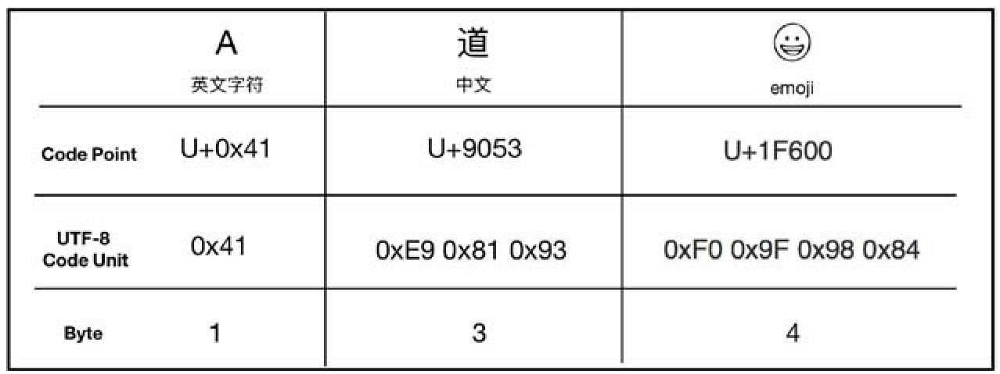{.u53970}

图8-1：码位和码元对应关系示意图
:::

码元是指用于处理和交换编码文本的最小比特组合。比如计算机处理字符的最小单位 1字节就是一个码元。通过将Unicode标量值和码元序列建立一一映射关系，就构成了编码表。在Unicode中一共有三种这样的字符编码表：UTF-8、UTF-16和UTF-32，它们正好对应了1字节、2字节和4字节的码元。对于UTF-16和UTF-32来说，因为它们的码元分别是2字节和4字节，所以就得考虑字节序问题；而对于UTF-8来说，一个码元只有1字节，所以不存在字节序问题，可以直接存储。

UTF-8是以1字节为编码单位的可变长编码，它根据一定的规则将码位编码为1～4字节，如图8-2所示。

::: center
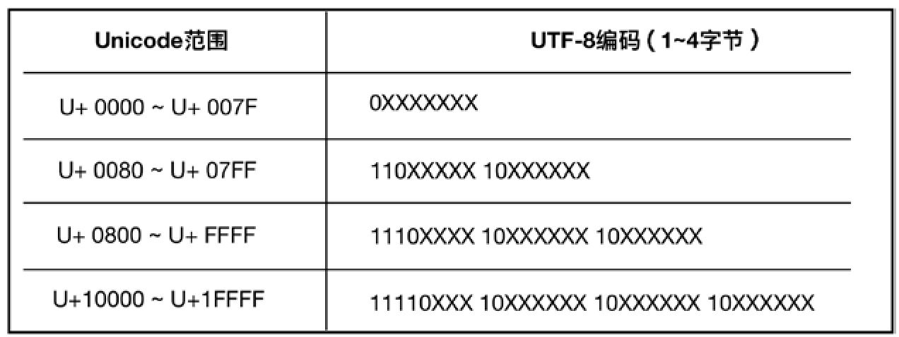{.u53969}

图8-2：UTF-8编码规则示意图
:::

UTF-8编码规则大致如下：

· 当一个字符在ASCII码的范围（兼容ASCII码）内时，就用1字节表示，因为ASCII码中的字符最多使用7个比特位，所以前面需要补0。

· 当一个字符占用了*n* 字节时，第一字节的前*n* 位设置为1，第*n* +1位设置为0，后面字节的前两位设置为10。

拿图 8-1 中展示的汉字"道"来说，它的码位是 U+9053，相应的二进制表示为1001_0000_0101_0011，按上述 UTF-8 编码规则进行编码，则变为字节序列1110_1001_10_000001_10_010011，用十六进制表示的话，就是0xE90x810x93。

像这种将 Unicode 码位转换为字节序列的过程，就叫作**编码（Encode）** ；反过来，将编码字节序列转变为字符集中码位的过程，就叫作**解码（Decode）** 。

UTF-8编码的好处就是在实际传输过程中其占据的长度不是固定的，在保证Unicode通用性的情况下避免了流量和空间的浪费，而且还保证了在传输过程中不会错判字符。想一想，如果只是按Unicode码位存储，则在传输过程中是按固定的字节长度来识别字符的，如果在传输过程中出现问题，就会发生错判字符的可能。正是因为这些优点，UTF-8才能被广泛应用于互联网中。

整个过程如图8-3所示。

::: center
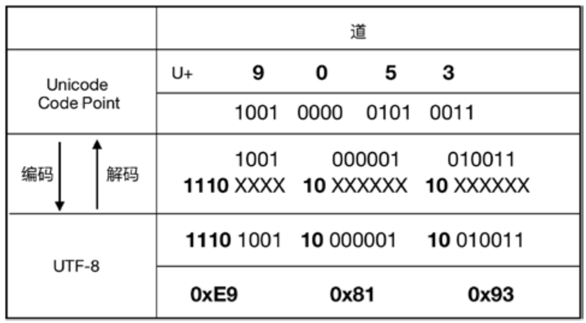{.u53968}

图8-3：UTF-8编码和解码过程示意图
:::

图8-3展示了从Unicode码位编码到UTF-8的过程。也可以从代码中得到印证，如代码清单8-1所示。

**代码清单8-1：字符串编码示例**

::: center
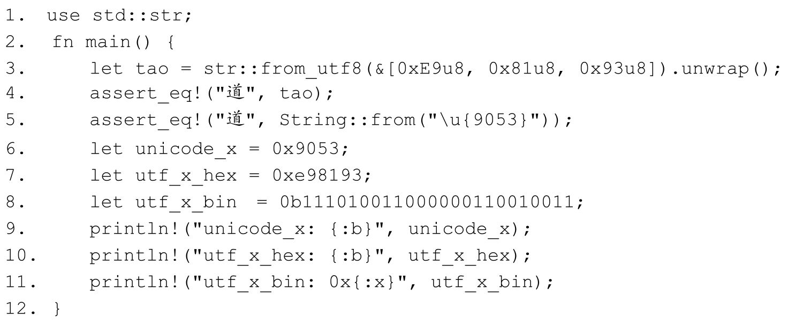{.u53967}
:::

在代码清单8-1中，使用str模块提供的from_utf8方法并为其传递一个UTF-8字节序列**&\[0xE9u8，0x81u8，0x93u8\]** 作为参数，将其转换为字符串＂道＂。在Rust中，使用**u8** 来表示字节类型，如果此处没有加u8后缀，Rust也会通过from_utf8的函数签名推导出此数组参数为u8类型数组。也可以通过String：：from（＂\\u{9053}＂）方法将一个十六进制形式的Unicode码位转换为字符串＂道＂。

代码第6～8行，分别使用0x和0b前缀声明了十六进制和二进制形式的变量，它们实际上是字符串＂道＂的十六进制形式的码位，以及UTF-8编码之后的十六进制和二进制表示。通过println！输出语句可以将它们转换为对应的二进制和十六进制形式的结果，与图8-3所示一致。

### 8.1.2 字符 {#text00014.html#Aae21010d-9b31-4097-ac12-94585d0c8c90 .title-left}

Rust使用char类型表示单个字符。char类型使用整数值与Unicode标量值一一对应，如代码清单8-2所示。

**代码清单8-2：字符与标量值一一对应**

::: center
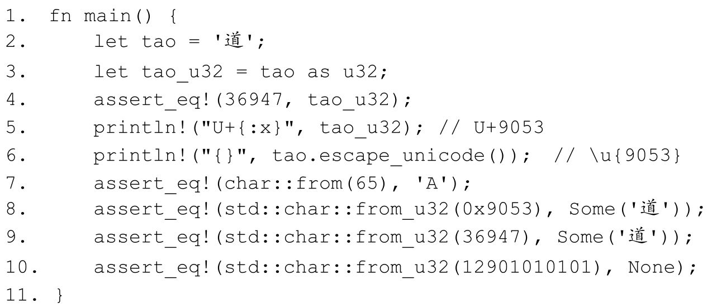{.u53966}
:::

在代码清单8-2中，声明了字符＇道＇。注意，这里使用单引号来定义字符，使用双引号定义的是字符串字面量。在Rust中每个char类型的字符都代表一个有效的u32类型的整数，但不是每个 u32 类型的整数都能代表一个有效的字符，因为并不是每个整数都属于 Unicode标量值，如代码第10行中的数字，将会返回None。

代码第3行，通过as将char类型转换为u32类型，那么字符tao对应的u32整数值是36947。通过代码第5行的println！语句打印其十六进制形式的值为U+9053，正是汉字"道"对应的Unicode标量值。通过char类型内建的escape_unicode方法也可以得到其Unicode标量值。

为了能够存储任何Unicode标量值，Rust规定每个字符都占4字节，如代码清单8-3所示。

**代码清单8-3：将字符转换为字符串要注意字节长度**

::: center
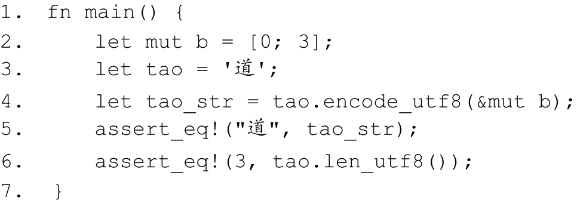{.u53965}
:::

在代码清单8-3中定义了一个可变数组b，将其作为参数传入字符内建的encode_utf8方法，将字符转换为一个字符串字面量。这里值得注意的是，如果将数组b的长度改为1或2，则无法将tao转换为字符串，因为字符＇道＇的UTF-8编码占3字节。所以，如果要转换为合法的字符串，则数组b的长度最少为3。通过代码第6行的字符内建的len_utf8方法，也可以获得字符tao按UTF-8编码的字节长度。

需要注意的是，只有包含单个Unicode标量值（实际码位）的才能被声明为字符，如代码清单8-4所示。

**代码清单8-4：包含两个码位的字符示例**

::: center
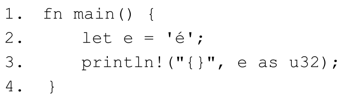{.u53964}
:::

编译代码清单8-4，会出现如下错误：

::: center
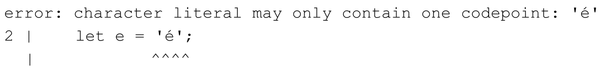{.u53963}
:::

错误提示说明，字符e所代表的拉丁小写字母é包含的码位不止一个，不能声明为字符。事实上，它包含两个码位。从Rust 1.30版本起，开始支持多码位字符，该段代码将不会报错。

作为基本原生类型，char提供了一些内建方法帮助开发者来方便处理字符。代码清单8-5中罗列了一些常用方法的示例。

**代码清单8-5：字符内建的常用方法示例**

::: center
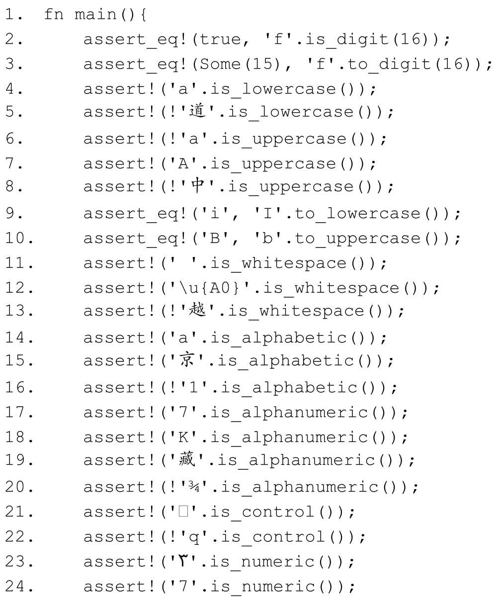{.u53962}
:::

::: center
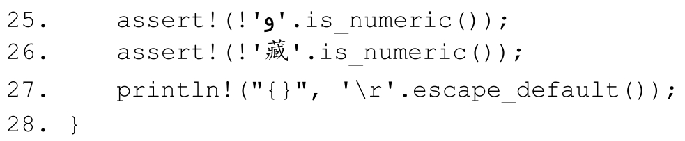{.u53961}
:::

代码清单8-5中所罗列方法说明如下：

· is_digit（16），用于判断给定字符是否属于十六进制形式。如果参数为10，则判断是否为十进制形式。

· to_digit（16），用于将给定字符转换为十六进制形式。如果参数为10，则将给定字符转换为十进制形式。

· is_lowercase，用于判断给定字符是否为小写的。作用于 Unicode 字符集中具有Lowercase属性的字符。

· is_uppercase，用于判断给定字符是否为大写的。作用于 Unicode 字符集中具有Uppercase属性的字符。

· to_lowercase，用于将给定字符转换为小写的。作用于Unicode字符集中具有Lowercase属性的字符。

· to_uppercase，用于将给定字符转换为大写的。作用于Unicode字符集中具有Uppercase属性的字符。

· is_whitespace，用于判断给定字符（或十六进制形式的码点）是否为空格字符。

· is_alphabetic，用于判断给定字符是否为字母。汉字也算是字母。

· is_alphanumeric，用于判断给定字符是否为字母、数字。

· is_control，用于判断给定字符是否为控制符。

· is_numeric，用于判断给定字符是否为数字。

· escape_default，用于转义\\t、\\r、\\n、单引号、双引号、反斜杠等特殊符号。

### 8.1.3 字符串分类 {#text00014.html#Afa02010f-bcc8-4dad-a0b9-47151a712768 .title-left}

字符串是由字符组成的有限序列。字符可以用整数值直接表示Unicode标量值，然而字符串却不能，因为字符串不能确定大小，所以在 Rust 中字符串是 UTF-8 编码序列。出于内存安全的考虑，在Rust中字符串分为以下几种类型：

· **str** ，表示固定长度的字符串。

· **String** ，表示可增长的字符串。

· **CStr** ，表示由C分配而被Rust借用的字符串，一般用于和C语言交互。

· **CString** ，表示由Rust分配且可以传递给C函数使用的C字符串，同样用于和C语言交互。

· **OsStr** ，表示和操作系统相关的字符串。这是为了兼容Windows系统。

· **OsString** ，表示OsStr的可变版本。与Rust字符串可以相互转换。

· **Path** ，表示路径，定义于std：：path模块中。Path包装了OsStr。

· **PathBuf** ，跟Path配对，是Path的可变版本。PathBuf包装了OsString。

但是在Rust中最常用的字符串是str和String。在第3章中已经介绍过str属于动态大小类型（DST），在编译期并不能确定其大小，所以在程序中最常见到的是str的**切片** （**Slice** ）类型&str。&str代表的是不可变的UTF-8字节序列，创建后无法再为其追加内容或更改其内容。&str类型的字符串可以存储在任意地方：

· **静态存储区** 。有代表性的是字符串字面量，&＇static str类型的字符串被直接存储到已编译的可执行文件中，随着程序一起加载启动。

· **堆分配** 。如果&str类型的字符串是通过堆String类型的字符串取切片生成的，则存储在堆上。因为String类型的字符串是堆分配的，&str只不过是其在堆上的切片。

· **栈分配** 。比如使用str：：from_utf8方法，就可以将栈分配的\[u8；N\]数组转换为一个&str字符串，如代码清单8-1所示。

与&str类型相对应的是String类型的字符串。&str是一个引用类型，而String类型的字符串拥有所有权。String 是由标准库提供的可变字符串，可以在创建后为其追加内容或更改其内容。String 类型本质为一个成员变量是 Vec＜u8＞类型的结构体，所以它是直接将字符内容存放于堆中的。**String类型由三部分组成** ：**指向堆中字节序列的指针** （as_ptr方法）、**记录堆中字节序列的字节长度** （len方法）和**堆分配的容量** （capacity方法），如代码清单8-6所示。

**代码清单8-6：组成String类型的三部分**

::: center
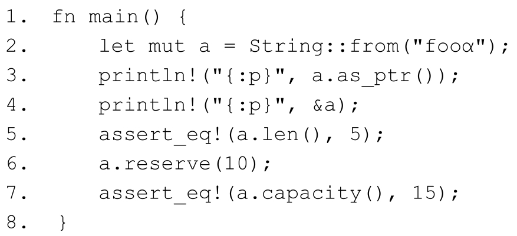{.u53960}
:::

在代码清单8-6中，使用as_ptr获取的是堆中字节序列的指针地址，而通过引用操作符&a得到的地址为字符串变量在栈上指针的地址，注意这两个是不同的指针。

代码第5行，通过len方法获取的是堆中字节序列的字节数，而非字符个数。

代码第6行，reserve方法可以为字符串再次分配容量。本例中分配了10字节，所以第7行通过capacity获取的字符串堆中已分配容量为15字节，因为要加上已有的5字节容量。

Rust提供了多种方法来创建&str和String类型的字符串，如代码清单8-7所示。

**代码清单8-7：创建字符串的各种方法示例**

::: center
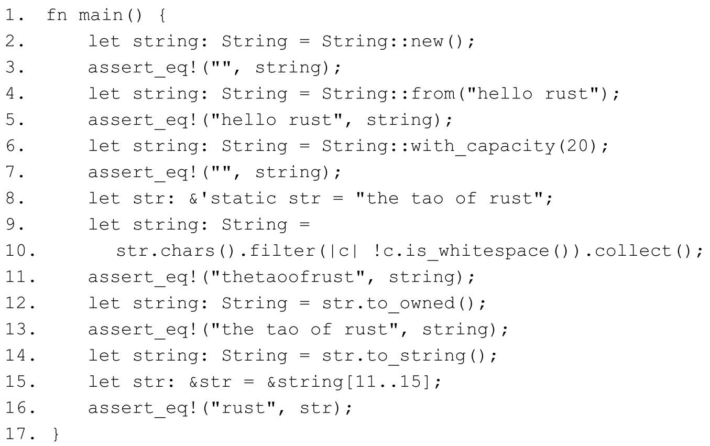{.u53959}
:::

在代码清单8-7中，代码第2行使用String：：new方法来创建空字符串，但实际上该方法并未在堆上开辟空间。

代码第4行，通过String：：from方法使用字符串字面量作为参数来创建字符串，这是因为String类型实现了From trait。

代码第6行，通过String：：with_capacity方法来创建空字符串，但是与String：：new方法不同的是，with_capacity方法接收一个usize类型的参数，用于指定创建字符串预先要在堆上分配的容量空间。此例中指定的参数是20，则会在堆中分配至少20字节的空间。如果预先知道最终要创建的字符串长度，则用此方法可以降低分配堆空间的频率。这里需要注意的是，容量只是存储空间（比如堆）的一种刻度，实际申请的堆内存空间为每个字符的字节大小乘以容量值。

代码第8行，创建的是字符串字面量，为&＇static str类型。

代码第9行，通过第8行创建的str调用chars方法返回一个迭代器，然后利用迭代器的collect方法来生成String类型的字符串。这是因为chars方法返回的迭代器实现了FromIterator trait。

代码第12行和第14行，分别使用to_owned和to_string方法将&str类型转换为String类型的字符串。两个方法的性能相差无几，to_owned 方法利用&str 切片字节序列生成新的String字符串，to_string方法是对String：：from的包装。

代码第15行，使用切片语法，从String字符串中获取索引第11～14个字符组成的字符串切片。

### 8.1.4 字符串的两种处理方式 {#text00014.html#A74f40111-3b44-4fb4-ae84-97fd18ff0bef .title-left}

Rust中的字符串不能使用索引访问其中的字符，因为字符串是UTF-8字节序列，到底是返回字节还是码点是一个问题。但是Rust提供了bytes和chars两个方法来分别返回按字节和按字符迭代的迭代器。所以，在Rust中对字符串的操作大致分为两种方式：**按字节处理** 和**按字符处理** 。

使用chars和bytes方法示例如代码清单8-8所示。

**代码清单8-8：使用chars和bytes方法示例**

::: center
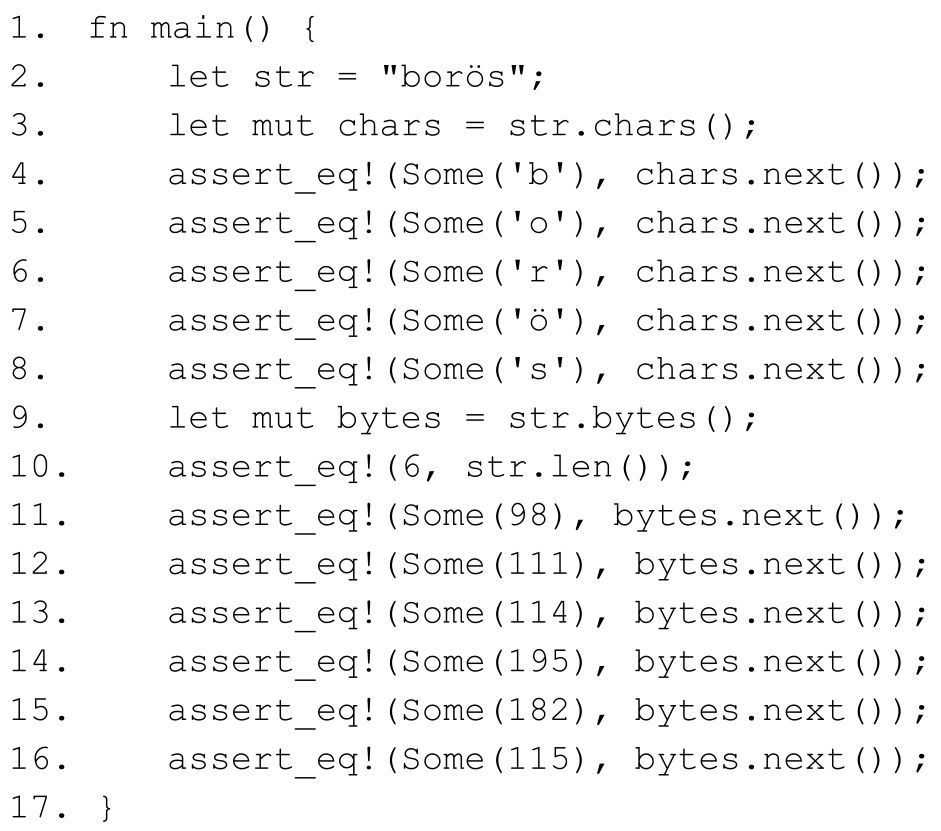{.u53958}
:::

在代码清单8-8中，代码第3行使用chars方法返回Chars迭代器，Chars迭代器的next方法是按码位进行迭代的。而代码第9行使用bytes方法返回的是Bytes迭代器，Bytes迭代器的next方法是按字节进行迭代的。字符串的一些内建方法也默认按字节来处理，比如代码第10行中用到的len方法，返回的是字符串字节长度，而非字符长度。

虽然字符串不能按索引来访问字符，但Rust提供了另外两个方法：get和get_mut，可以通过指定索引范围来获取字符串切片，并且 Rust 默认会检查字符串的序列是否为有效的UTF-8序列，如代码清单8-9所示。

**代码清单8-9：使用get和get_mut方法示例**

::: center
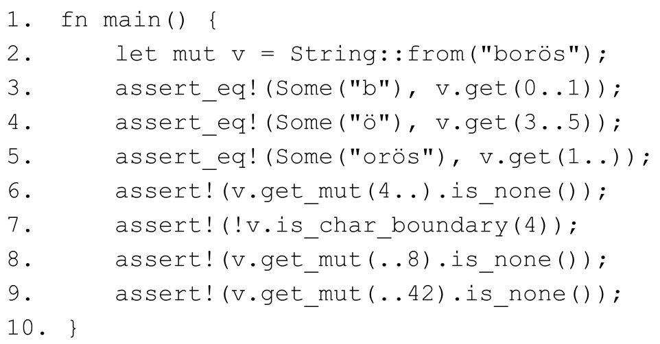{.u53957}
:::

在代码清单8-9中使用的是String类型的字符串，因为只有String字符串才是可变的。代码第3～6行，通过给get方法传递索引范围，获取到了预期的字符串切片，注意这里是Option类型。代码第6行，传递的索引范围是从4开始的，4正好是字符ö的字节序列中间地带，相当于舍弃了字符ö的第一字节，这自然是非法的UTF-8序列，所以此时Rust会返回None，从而避免了线程崩溃。也可以通过 is_char_boundary 方法来验证某个索引位置是否为合法的字符边界，代码第7行就验证了第4个索引位置为非法的字符边界。

所以，在使用字符串内建的split_at和split_at_mut方法分割字符串时，需要注意，一定要使用合法的字符串边界索引，否则就会引起线程崩溃，如代码清单8-10所示。

**代码清单8-10：使用split_at方法示例**

::: center
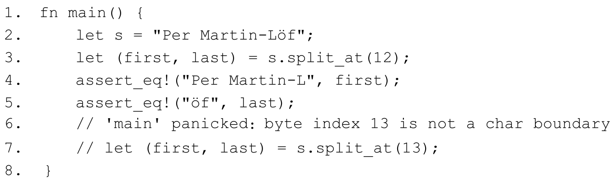{.u53956}
:::

在代码清单8-10中，使用split_at方法指定了字符串的分割索引位置。代码第3行指定的是12，正好是一个合法的字符边界，所以可以将字符串合法地分成两部分。但是注释掉的第7行，给定的索引值为13，恰好是字符ö的字节序列中间位置，为非法的字符边界，所以引发线程崩溃。

因此，在日常处理字符串时，要注意是按字节还是按字符进行的，以避免发生预期之外的错误。

### 8.1.5 字符串的修改 {#text00014.html#A24e80113-2b19-4b25-ac0e-3e6ef090fc18 .title-left}

一般情况下，如果需要修改字符串，则使用String类型。修改字符串大致分为追加、插入、连接、更新和删除5种情形。

**追加字符串**

对于追加的情形，Rust提供了push和push_str两个方法，如代码清单8-11所示。

**代码清单8-11：使用push和push_str方法示例**

::: center
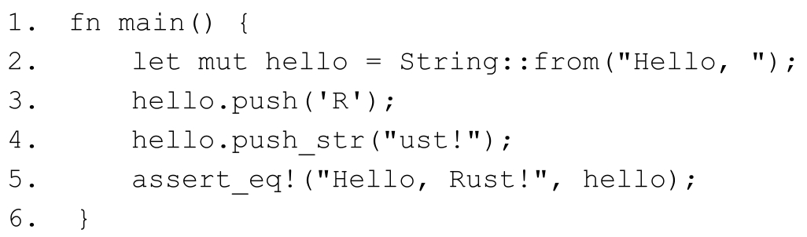{.u53955}
:::

在代码清单8-11中，使用push方法为String类型字符串hello追加字符，使用push_str方法为hello追加&str类型的字符串切片。push和push_str在内部实现上其实是类似的，因为String本质是对Vec＜u8＞动态数组的包装，所以对于push来说，如果字符是单字节的，则将字符转换为u8类型直接追加到Vec＜u8＞尾部；如果是多字节的，则转换为UTF-8字节序列，通过Vec＜u8＞的extend_from_slice方法来扩展。因为push_str接收的是&str类型的字符串切片，所以直接使用extend_from_slice方法扩展String类型字符串的内部Vec＜u8＞数组。

除了上面两个方法，也可以通过迭代器为String追加字符串，因为String实现了Extend迭代器，如代码清单8-12所示。

**代码清单8-12：使用Extend迭代器追加字符串**

::: center
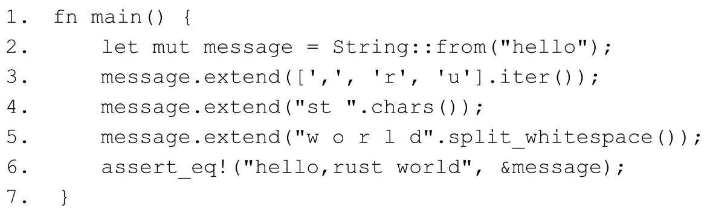{.u53954}
:::

在代码清单 8-12 中，String 类型的字符串实现了 Extend 迭代器，所以可以使用 extend方法，其参数也为迭代器。代码第3行，使用iter方法返回Iter迭代器。代码第4行，使用chars 方法返回的是 Chars 迭代器。代码第 5 行，使用 split_whitespace 方法返回的是SplitWhitespace迭代器。

**插入字符串**

如果想从字符串的某个位置开始插入一段字符串，则需要使用insert和insert_str方法，其用法和push/push_str方法类似，如代码清单8-13所示。

**代码清单8-13：使用insert和insert_str方法插入字符串**

::: center
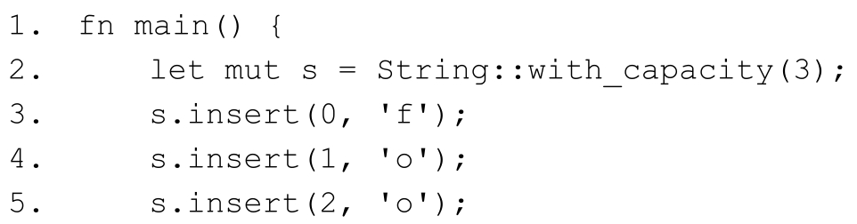{.u53953}
:::

::: center
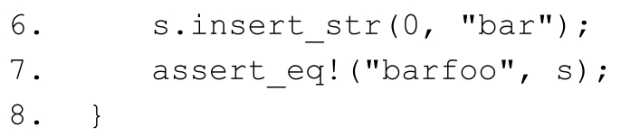{.u53952}
:::

在代码清单8-13中，使用insert方法，其参数为要插入的位置和字符；而使用insert_str方法，其参数为要插入的位置和字符串切片。值得注意的是，insert 和insert_str 是基于字节序列的索引进行操作的，其内部实现会通过 is_char_boundary 方法来判断插入的位置是否为合法的字符边界，如果插入的位置非法，则会引发线程崩溃。

**连接字符串**

String 类型的字符串也实现了 Add＜&str＞ 和 AddAssign＜&str＞两个 trait，这意味着可以使用"+"和"+="操作符来连接字符串，如代码清单8-14所示。

**代码清单8-14：使用** "**+** "**和** "**+** "**=连接字符串**

::: center
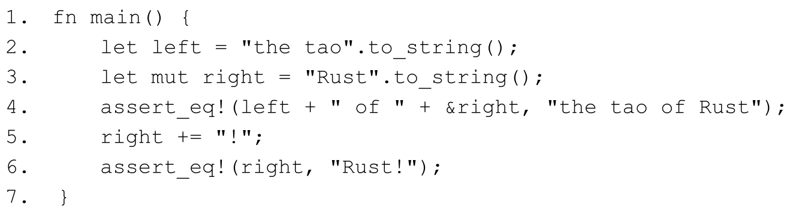{.u53851}
:::

在代码清单8-14中，使用"+"和"+="操作符连接字符串，但需要注意的是，操作符右边的字符串为切片类型（&str）。在代码第4行中，&right实为&String类型，但是因为String类型实现了**Deref** trait，所以这里执行加法操作时自动解引用为&str类型。

**更新字符串**

因为Rust不支持直接按索引操作字符串中的字符，一些常规的算法在Rust中必然无法使用。比如想修改某个字符串中符合条件的字符为大写，就无法直接通过索引来操作，只能通过迭代器的方式或者某些unsafe方法，如代码清单8-15所示。

**代码清单8-15：尝试使用索引来操作字符串**

::: center
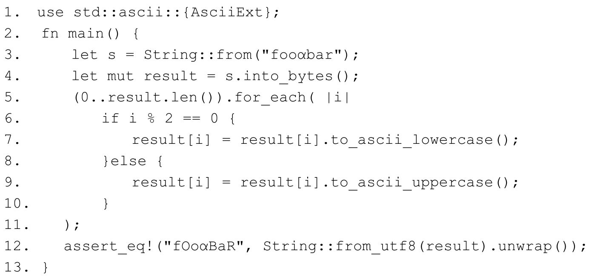{.u53951}
:::

在代码清单8-15中，通过into_bytes方法将字符串转换为Vec＜u8＞序列，这样就可以使用索引来修改它的内容了。然后通过 String：：from_utf8 方法将 Vec＜u8＞转换为 Result＜String，FromUtf8Error＞，再通过unwrap方法取出Result中的String字符串。

代码第 5～11 行，在 result 字节序列长度范围内循环，如果序列索引是偶数，则通过to_ascii_lowercase方法将其转换为小写的；否则，通过to_ascii_uppercase方法将其转换为大写的。注意，这里引入了 std：：ascii：：{AsciiExt}，因为 result 现在是字节序列，所以需要使用标准库中提供的扩展方法。

最终得到的结果字符串是＂fOoαBaR＂，这和预期的结果不太相符，因为第4个字符α的大写应该是A。这是因为to_ascii_uppercase和to_ascii_lowercase方法只针对ASCII字符，α是多字节字符，并不能进行合法的转换。

代码清单8-15展示了Rust中的String字符串无法用在其他语言中处理字符串的常规思维来处理。Rust中的字符串永远都是UTF-8字节序列。当然，在确定的字符串序列中，已知按字节可以得到正确处理的情况下，也是可以用的。但是一般处理多字节字符串的情况比较多，要合法正确地操作字符串，推荐使用按字符来迭代，如代码清单8-16所示。

**代码清单8-16：按字符迭代来处理字符串**

::: center
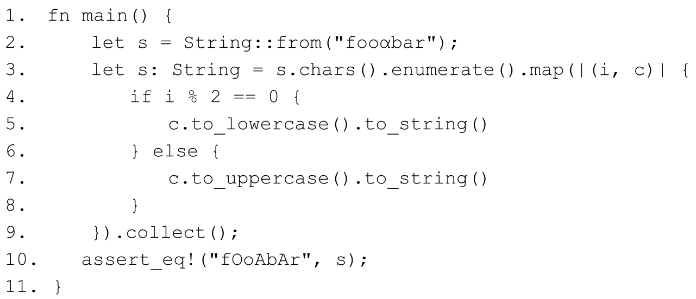{.u53950}
:::

在代码清单8-16中，使用chars方法获得Chars迭代器，然后通过enumerate和map两个迭代器方法对字符进行处理，最后通过collect消费迭代器转换为String类型，得到正确的预期结果。

**删除字符串**

Rust 标准库的 std：：string 模块提供了一些专门用于删除字符串中字符的方法，如代码清单8-17所示。

**代码清单8-17：删除字符串示例**

::: center
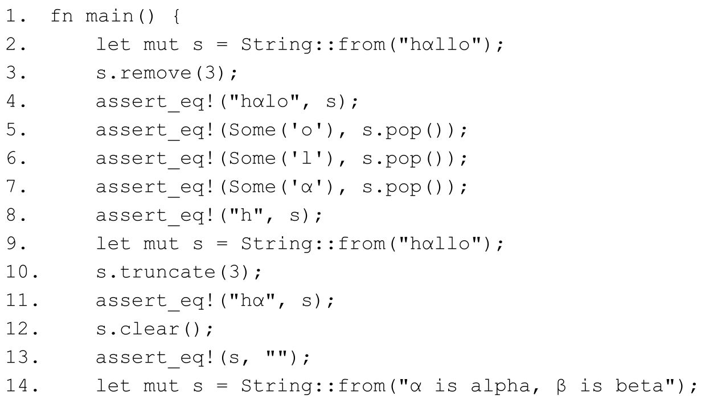{.u53949}
:::

::: center
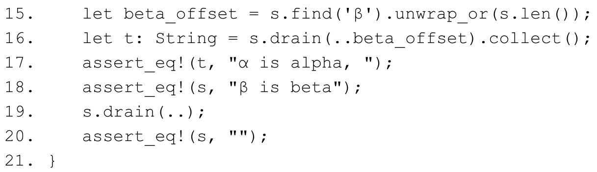{.u53948}
:::

代码清单8-17展示了删除字符串的各种方法。

如果想删除字符串中某个位置的字符，则可以使用标准库提供的 remove 方法，如代码第 3 行，remove 的参数为该字符的起始索引位置。这里需要注意，remove 也是按字节处理字符串的，如果给定的索引位置不是合法的字符边界，那么线程就会崩溃。可以将该方法的参数3改为2，然后看看有何结果。

代码第 5～7 行，使用 pop 方法可以将字符串结尾的字符依次弹出，并返回该字符。通过代码第8行可以看出，该方法同样会修改字符串本身。

代码第10行使用了truncate方法，该方法接收索引位置为参数，并将以此索引位置开始到结尾的字符全部移除。此行指定truncate方法的参数为3，那么第3位正好是字符α的字符边界，因为α占两字节。所以字符串s只剩下了"hα"。truncate方法同样是按字节进行操作的，所以使用时需要注意，如果给定的索引位置不是合法的字符边界，则同样会引发线程崩溃。

代码第12行使用的clear方法，实际上是truncate的语法糖，只要给truncate指定参数为0，那么就可以截断字符串中的全部字符，达到clear的效果。

代码第14～20行，使用drain方法来移除指定范围内的字符。代码第15行通过find方法，找到指定字符 β 的位置。代码第 16 行以此作为范围的起始位置，以字符串结尾作为结束位置，对字符串进行移除，drain方法会返回Drain迭代器，可以通过消费Drain迭代器来获得已移除的那段字符串。

### 8.1.6 字符串的查找 {#text00014.html#A5ba40116-7c3d-4e88-be44-f38795ec2b7f .title-left}

在Rust标准库中并没有提供正则表达式支持，这是因为正则表达式算是外部DSL，如果直接将其引入标准库中，则会破坏Rust的一致性。因为现成的正则表达式引擎都是其他语言实现的，比如C语言。除非完全使用Rust来实现。目前Rust支持的正则表达式引擎是官方实现的第三方包**regex** ，未来是否会归为标准库中，不得而知。虽然Rust在标准库中不提供正则表达式支持，但它提供了另外的字符串匹配功能供开发者使用，一共包含 20 个方法。这20个方法涵盖了以下几种字符串匹配操作：

· **存在性判断** 。相关方法包括contains、starts_with、ends_with。

· **位置匹配** 。相关方法包括find、rfind。

· **分割字符串** 。相关方法包括split、rsplit、split_terminator、rsplit_terminator、splitn、rsplitn。

· **捕获匹配** 。相关方法包括matches、rmatches、match_indices、rmatch_indices。

· **删除匹配** 。相关方法包括trim_matches、trim_left_matches、trim_right_matches。

· **替代匹配** 。相关方法包括replace、replacen。

看得出来，这些功能基本上可以满足日常正则表达式的开发需求。

**存在性判断**

可以通过contains方法判断字符串中是否存在符合指定条件的字符，该方法返回bool类型，如代码清单8-18所示。

**代码清单8-18：使用contains方法示例**

::: center
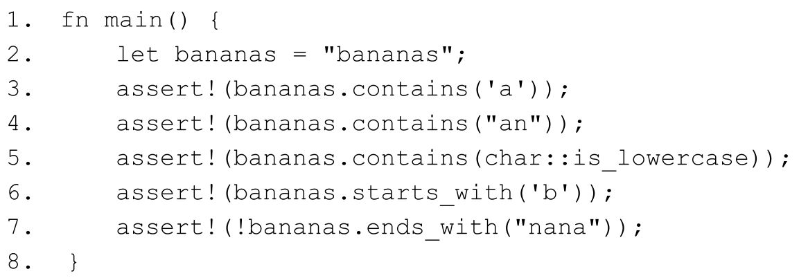{.u53947}
:::

注意，在代码清单8-18中，代码第3～5行中contains的参数是三种不同的类型，分别为char、&str 和 fn pointer，这是因为contains 是一个泛型方法。代码清单8-19 展示了std：：str模块中contains方法的源码。

**代码清单8-19：std：：str模块中contains方法的源码展示**

::: center
{.u53946}
:::

从代码清单8-19可以看出，contains的参数pat是一个泛型，并且有一个**Pattern＜＇a＞** 限定。Pattern＜＇a＞是一个专门用于搜索&＇a str字符串的模式trait。Rust中的char类型、String、&str、&&str、&\[char\]类型，以及FnMut（char）-＞bool的闭包均已实现了该trait。因此，contains才可以接收不同类型的值作为参数。

回到代码清单8-18中，代码第6行和第7行分别用到的starts_with和ends_with与contains一样，也可以接收实现了 Pattern＜＇a＞的类型作为参数。为了方便描述，暂且称这种参数为pattern参数。starts_with和ends_with分别用于判断指定的pattern参数是否为字符串的起始边界和结束边界。

**位置匹配**

如果想查找指定字符串中字符所在的位置，则可以使用find方法，如代码清单8-20所示。

**代码清单8-20：使用find方法查找字符位置**

::: center
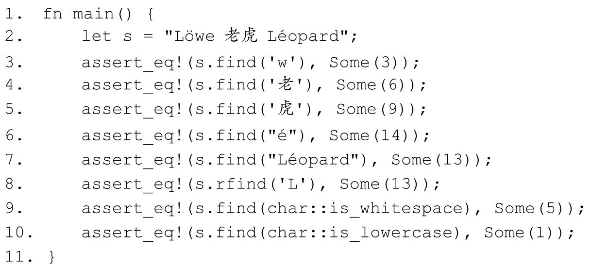{.u53945}
:::

find方法同样可以接收pattern参数。通过代码清单8-20可以看出，find方法默认是从左向右按字符进行遍历查找的，最终返回Option＜usize＞类型的位置索引；如果没有找到，则会返回None。对于代码第8行使用的rfind方法，表示从右向左来匹配字符串，r前缀代表右边（right），所以它返回的结果是Some（13）。

**分割字符串**

如果想通过指定的模式来分割字符串，则可以使用 split 系列方法，如代码清单 8-21 所示。

**代码清单8-21：split系列方法使用示例**

::: center
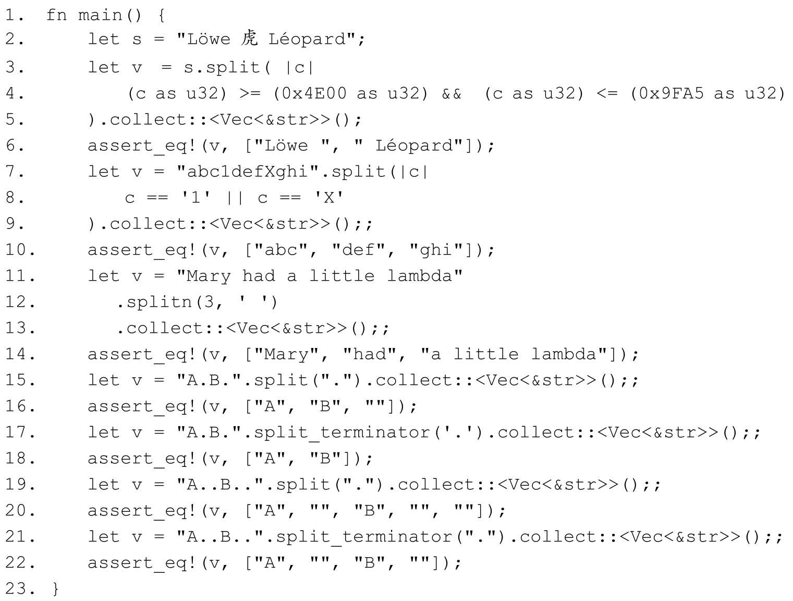{.u53944}
:::

在代码清单8-21中，代码第2行声明了一个&str字符串，注意其中包含了多字节字符。

代码第3～5行，使用split方法来分割字符串s。split方法同样支持pattern参数，该方法使用闭包作为参数。闭包的行为是想通过字符串中字符的码位范围来锁定中文字符，然后以中文字符作为字符串的分割位置，最终返回代码第 6 行所示的 Vec＜&str＞类型数组。这里暂时使用U+4E00～U+9FA5码位作为中文字符的范围，但实际上这是不太严谨的，该范围并没有包含全部的中文字符，这里仅作为演示之用。因为在 Rust 中每个字符的码位对应于一个u32数字，所以在闭包中使用as将字符和码位均转换为u32进行比较。

代码第 7～9 行的行为同样是通过闭包指定的条件来分割字符串的，最终得到代码第 10行所示的数组。

代码第11～13行，使用了splitn方法，注意这个方法的命名比split多了一个n，这个n代表指定分割的数组长度。该方法的第一个参数就是指定要分割的数组长度，第二个参数为要分割的pattern参数。最终的分割结果正如第14行展示的那样，是一个长度为3的数组，也就是包含3个元素。

代码第15～22行，主要展示了split和split_terminator方法的区别。顾名思义，terminator为终结之意，通过代码可以看出，split_terminator 会把分割结果数组最后一位出现的空字符串去掉。

对应的，也存在rsplit、rsplitn和rsplit_terminator方法，它们均是按从右向左的方向进行字符匹配的。那为什么没有lsplit之类的方法呢？不要忘记，split本身的匹配方向就是从左向右的。需要注意的是，split系列方法返回的是迭代器，所以在使用它们时最后需要用collect来消费这些迭代器。

**捕获匹配**

在处理字符串时，最常见的一个需求就是得到字符串中匹配某个条件的字符，通常通过正则表达式来完成。在Rust中，通过pattern参数配合matches系列方法可以获得同样的效果，如代码清单8-22所示。

**代码清单8-22：matches系列方法使用示例**

::: center
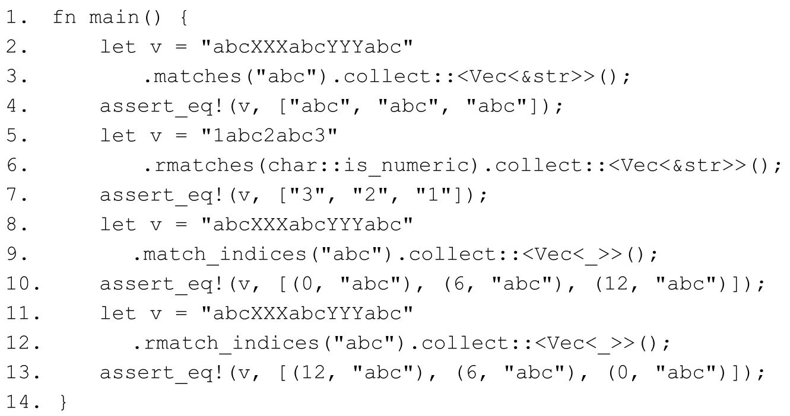{.u53943}
:::

在代码清单8-22中，代码第2行和第3行，使用matches方法来获取字符串中匹配到的元素。matches方法返回的同样是迭代器，所以需要使用 collect 来消费迭代器收集到指定容器中以备使用，此例收集到了 Vec＜&str＞类型的数组容器中，最终得到代码第 4 行所示的结果。

代码第5行和第6行，使用了rmatches方法，从右向左进行匹配。注意，最终得到的数组中元素也是按原字符串从右向左依次排列的。

代码第8行和第9行，使用了match_indices方法，返回的结果是元组数组，其中元组的第一个元素代表匹配字符的位置索引，第二个元素为匹配的字符本身。从方法的命名来看，indices为index的复数形式，在语义上就指明了匹配结果会包含索引。其实在标准库中也有不少以"\_indices"结尾的方法名，在语义上都表明其返回值会包含索引。

代码第11行和第12行，使用了rmatch_indices方法，它同样是从右向左进行匹配的。

通过matches系列方法，可以获得最终匹配的结果数组，然后按需使用即可。

**删除匹配**

在 std：：str 模块中提供了 trim 系列方法，可以删除字符串两头的指定字符，如代码清单8-23所示。

**代码清单8-23：trim系列方法使用示例**

::: center
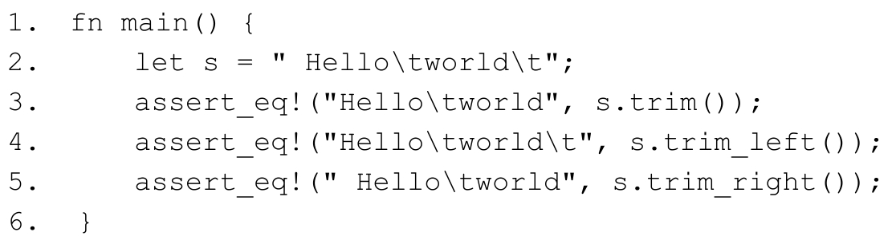{.u53942}
:::

在代码清单8-23中用到的trim系列方法，可以删除字符串两头的空格、制表符（\\t）和换行符（\\n）。注意代码第2行声明的字符串s是以空格为起始字符、以\\t为结尾字符的单个字符串。从代码第3行可以看出，trim方法将左边起始处的空格和右边结尾处的\\t都清除了。

代码第4行和第5行中用到的trim_left和trim_right分别用于去除左边和右边的特定字符。值得注意的是，trim、trim_left和trim_right这三个方法并不能使用pattern参数，只是固定地清除空格、制表符和换行符。Rust提供了trim_matches系列方法支持pattern参数，可以指定自定义的删除规则，如代码清单8-24所示。

**代码清单8-24：trim_matches系列方法使用示例**

::: center
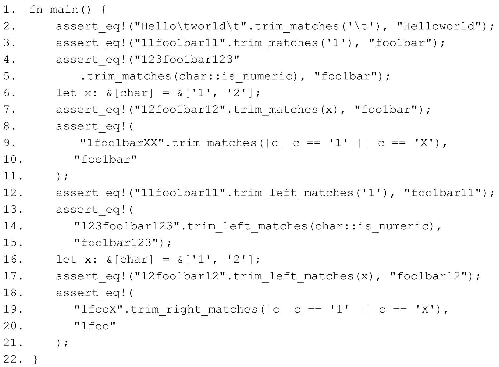{.u53941}
:::

在代码清单8-24中使用了trim_matches系列方法，与trim系列方法不同的是，该系列方法可以接收pattern参数。通过传递pattern参数可以自定义需要删除的字符。

代码第2～11行，展示了trim_matches接收各种类型的pattern参数，最后删除了字符串两头相匹配的字符。

代码第12～21行，展示了trim_left_matches和trim_right_matches方法，分别用于删除字符串左边和右边相匹配的字符。

**替代匹配**

使用trim_matches系列方法可以满足基本的字符串删除匹配需求，但是其只能去除字符串两头的字符，无法去除字符串内部包含的字符。可以通过replace系列方法来实现此需求，如代码清单8-25所示。

**代码清单8-25：replace系列方法使用示例**

::: center
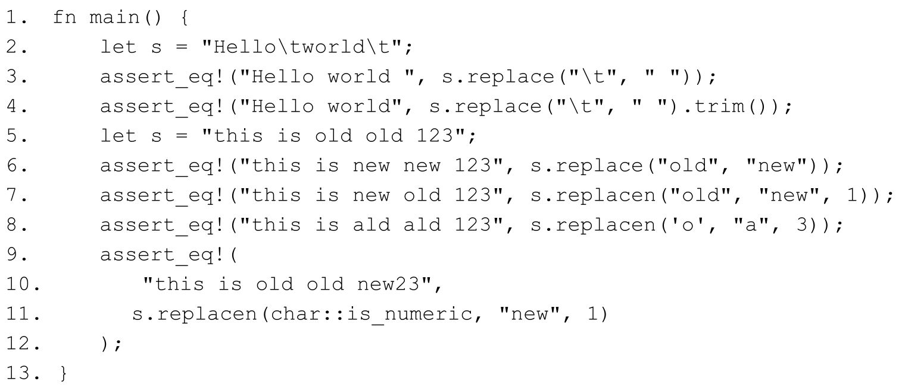{.u53940}
:::

在代码清单8-25中，代码第3行使用空格替换了制表符，虽然满足了需求，但是在字符串结尾又多了空格，所以，这里其实再配合使用一次trim方法即可，如代码第4行所示。

replace方法也支持pattern参数，默认从左到右将所有匹配到的字符替换为指定字符。与之相对应的replacen方法，支持通过第三个参数来指定替换字符的个数，如代码第7～12行所示。

**字符串匹配模式原理**

Rust提供的这些字符串匹配方法看似繁多，但实际上其背后是一套统一的迭代器适配器。我们从matches方法说起，代码清单8-26展示了matches方法的源码。

**代码清单8-26：matches方法源码**

::: center
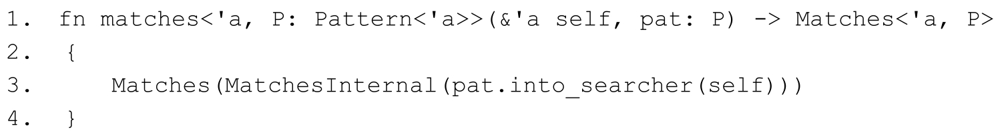{.u53939}
:::

在代码清单8-26中，matches方法返回的是Matches＜＇a，P＞类型，它是一个结构体，也是一个迭代器。其源码如代码清单8-27所示。

**代码清单8-27：Matches迭代器源码**

::: center
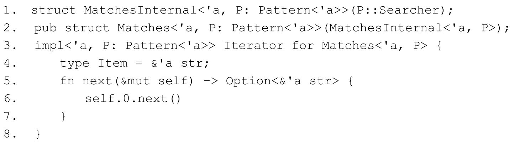{.u53938}
:::

在代码清单8-27中展示的是部分源码，其中第2～7行实际上是通过generate_pattern_iterators！宏生成的代码。

Matches结构体是一个元组结构体，也就是NewType模式，它包装了MatchesInternal结构体。代码第3～7行，为Matches实现了Iterator，它就成为迭代器。在next方法中，它又调用了MatchesInternal结构体的next方法，如代码第6行所示。

代码清单8-28展示了MatchesInternal实现next和next_back方法的源码。

**代码清单8-28：MatchesInternal实现next和next_back方法的源码**

::: center
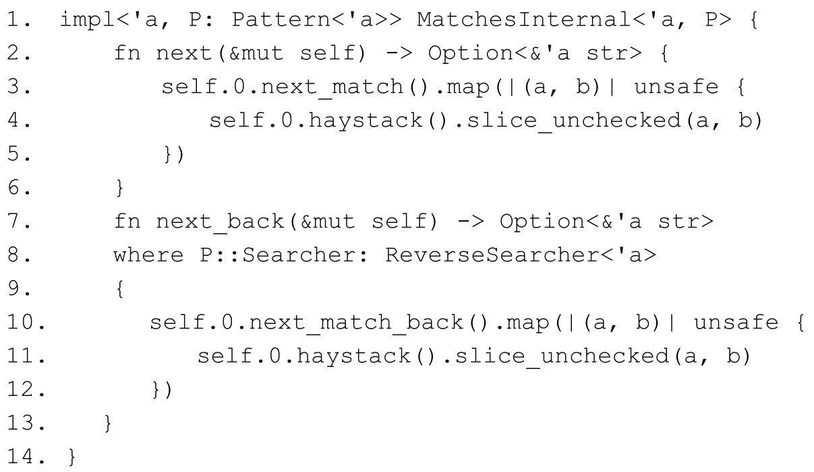{.u53937}
:::

MatchesInternal 也是一个 NewType 模式的结构体，它包装了 P：：Searcher。其中 next 和next_back方法内部分别调用了P：：Searcher的next_match和next_match_back方法，最终返回Map迭代器供将来collect使用。

Matches迭代器适配器工作示意图如图8-4所示。

::: center
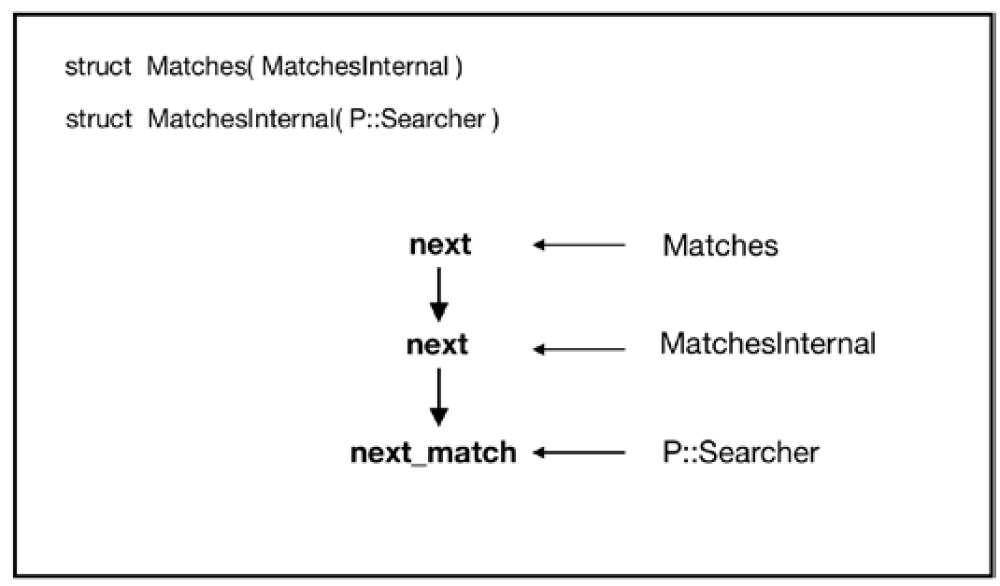{.u53936}

图8-4：Matches迭代器适配器工作示意图
:::

在上面代码中，值得注意的是Pattern＜＇a＞，该trait实际上是字符串匹配算法的抽象。代码清单8-29展示了Pattern＜＇a＞和SearchStep的定义。

**代码清单8-29：Pattern＜＇a＞和SearchStep定义**

::: center
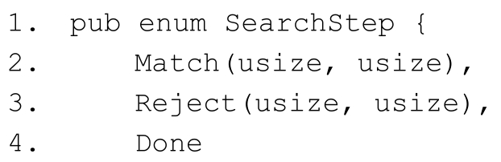{.u53935}
:::

::: center
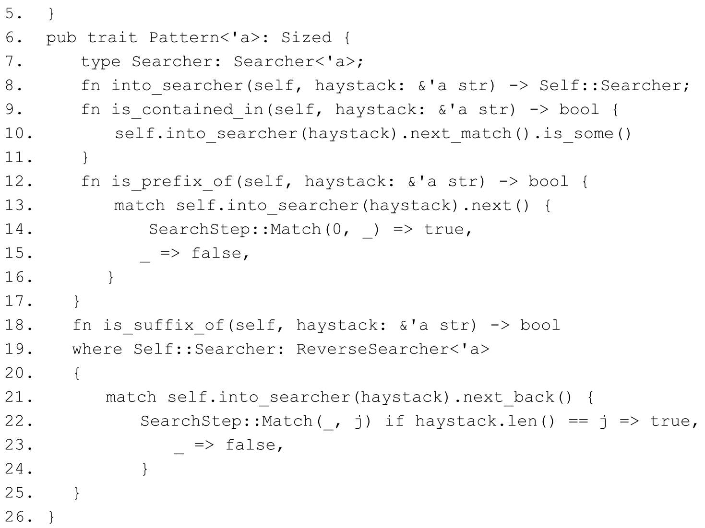{.u53934}
:::

在代码清单8-29中，Pattern＜＇a＞包含了一个关联类型和四个方法。关联类型为Searcher，表示一个可以通过into_searcher方法得到的具体搜索类型，并且该搜索类型必须实现另一个Searcher＜＇a＞trait。into_searcher方法中haystack参数的命名来自英语俚语"find a needle in a haystack"，意思为"大海捞针"，所以在一般的字符串匹配算法中，通常用 haystack 表示待匹配的原字符串，needle 代表子串。比如用子串"nana"来匹配字符串"banana"，那么"banana"就是haystack，"nana"就是needle。所以，后面为了描述方便，直接用"haystack串"和"needle串"来分别指代它们。

SearchStep是一个枚举类型，其中Match（usize，usize）代表匹配到的字符索引位置范围，比如haystack\[0..3\]，Reject（usize，usize）代表未匹配的索引范围，Done则代表匹配完毕。

is_contained_in 方法用于判断 needle 串是否包含在 haystack 串中。is_prefix_of 和is_suffix_of方法分别代表前缀和后缀。如果熟悉KMP字符串匹配算法，则会比较敏感，前缀是指除最后一个字符以外的其余字符的组合，后缀是指除第一个字符以外的全部尾部字符的组合，如代码第14行和第22行匹配的索引所示。

在KMP算法中，前缀和后缀用于产生部分匹配表，而在Rust中这里使用的字符匹配算法并非 KMP，而是它的变种**双向（Two-Way）字符串匹配算法** ，该算法的优势在于拥有常量级的空间复杂度。它和KMP的共同点在于其时间复杂度也是*O* （*n* ），并且都用到了前缀和后缀的概念。

代码清单8-30展示了Searcher＜＇a＞的源码。

**代码清单8-30：Searcher＜＇a＞源码**

::: center
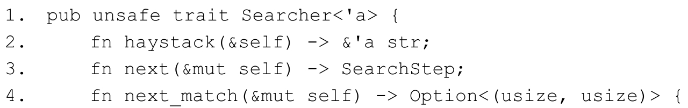{.u53933}
:::

::: center
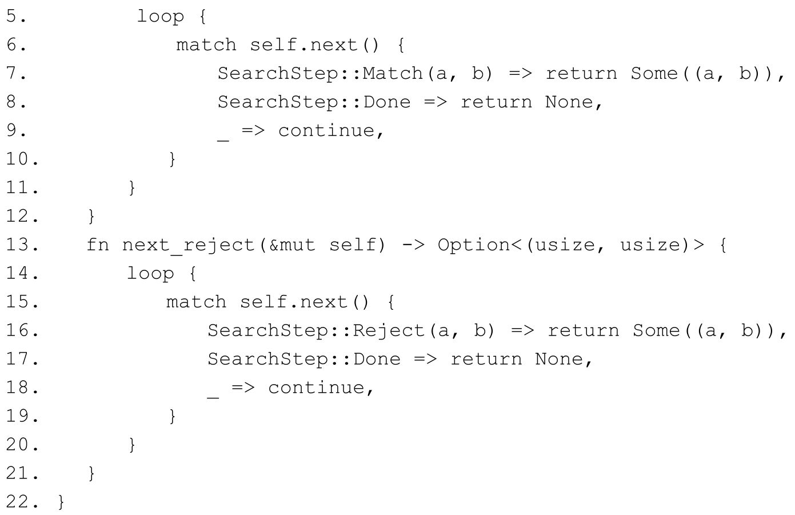{.u53932}
:::

代码清单8-30中的Searcher＜＇a＞有点类似于迭代器，其中包含了四个方法。代码第2行的haystack方法用于传递haystack串。

代码第3行的next方法用于返回SearchStep。比如needle串为"aaaa"，haystack串为"cbaaaaab"，则通过next方法可以得到"\[Reject（0，1），Reject（1，2），Match（2，5），Reject（5，8）\]"。

代码第4～21行，分别实现了next_match和next_reject，用于匹配SearchStep来返回最终匹配或未匹配的索引范围。注意，索引范围为Option＜（usize，usize）＞类型。

代码清单8-31展示了为&＇a str类型实现Pattern＜＇a＞的源码。

**代码清单8-31：为&＇a str类型实现Pattern＜＇a＞的源码**

::: center
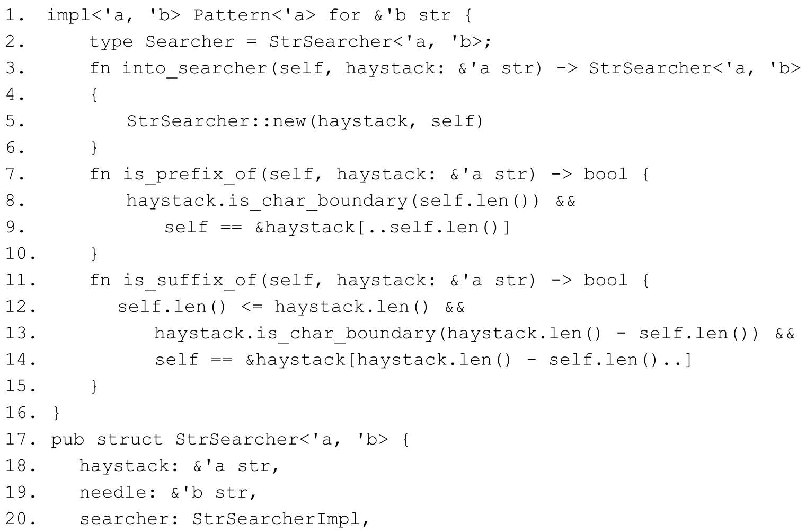{.u53711}
:::

::: center
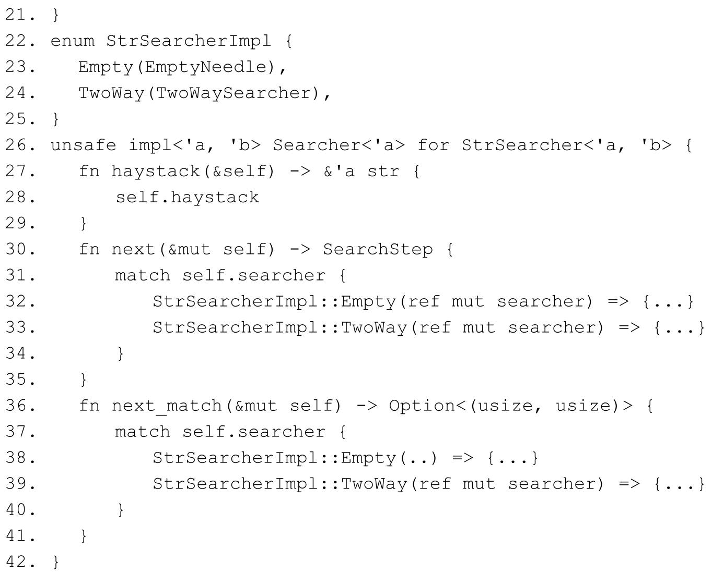{.u53931}
:::

仔细看代码清单8-31所示的代码结构，发现into_searcher生成用于匹配&＇a str类型字符串的搜索类型为StrSearcher＜＇a，＇b＞，它是一个结构体，包含了三个字段，其中haystack和needle分别表示haystack串和needle串，而searcher是一个StrSearcherImpl枚举体。

StrSearcherImpl枚举体包含的两个变体Empty（EmptyNeedle）和TwoWay（TwoWaySearcher），分别代表处理空字符串和非空字符串两种情况。当处理空字符串时，实际使用 EmptyNeedle来处理；当处理非空字符串时，实际使用TwoWaySearcher来处理。其中TwoWaySearch就是双向字符串匹配算法的具体实现。

以上就是**字符串匹配算法的背后机制** ，**使用Pattern＜＇a ＞** 、**Searcher＜＇a ＞** 和**SearchStep来抽象字符串匹配算法** ，**然后利用迭代器模式进行检索** 。同样，这里也是Rust一致性的体现。

### 8.1.7 与其他类型相互转换 {#text00014.html#A4779011f-bb3b-4c5a-8d4a-27fc226fad16 .title-left}

在日常开发中，字符串和其他类型的转换是很常见的需求。Rust也提供了一些方法来帮助开发者方便地完成这类转换。

**将字符串转换为其他类型**

可以通过std：：str模块中提供的parse泛型方法来将字符串转换为指定的类型，如代码清单8-32所示。

**代码清单8-32：parse方法使用示例**

::: center
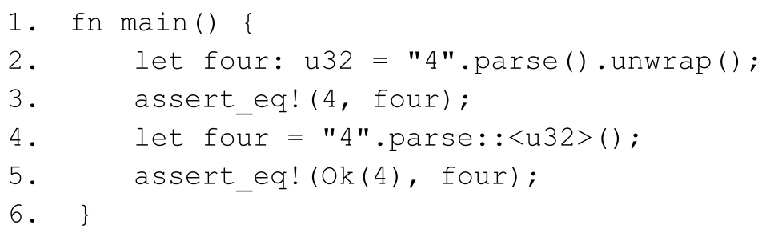{.u53930}
:::

在代码清单8-32中，使用parse方法将字符串＂4＂转换为u32类型。因为parse为泛型方法，所以也可以使用turobfish操作符为其指定类型，如代码第4行所示。

其实parse方法内部是使用FromStr：：from_str方法来实现转换的。FromStr是一个trait，其命名符合Rust的一致性惯例，代码清单8-33展示了该trait的定义。

**代码清单8-33：FromStr 定义**

::: center
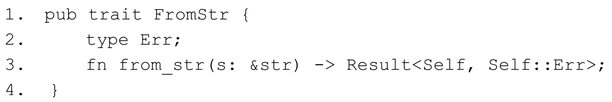{.u53929}
:::

从代码清单8-33中可以看出，在FromStr中定义了一个from_str方法，实现了此trait的类型，可以通过from_str将字符串转换为该类型。返回值为一个Result类型，该类型会在解析失败时返回 Err。Rust 为一些基本的原生类型、布尔类型以及 IP 地址等少数类型实现了FromStr，对于自定义的类型需要自己手工实现，如代码清单8-34所示。

**代码清单8-34：为自定义结构体实现FromStr**

::: center
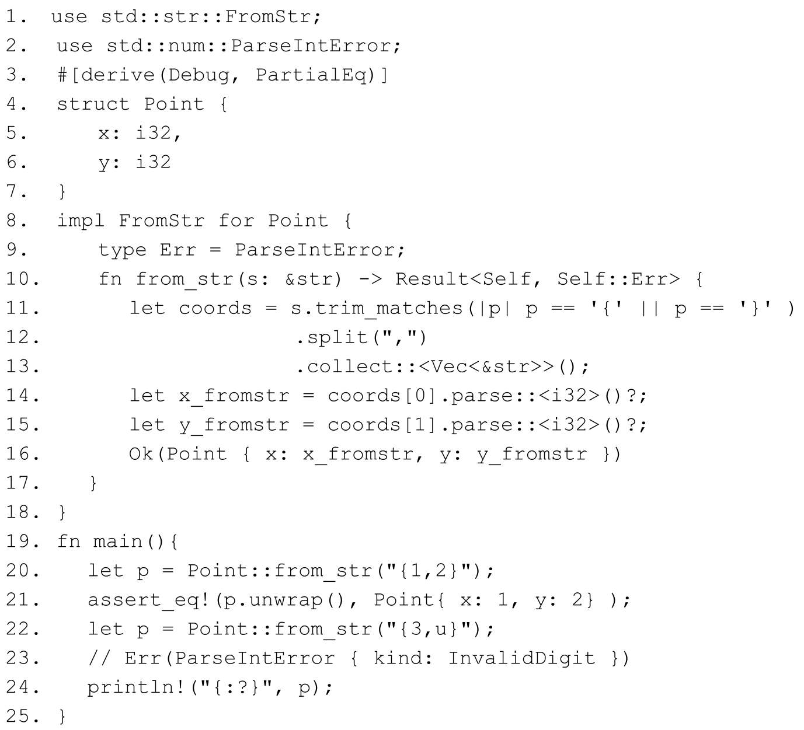{.u53928}
:::

在代码清单8-34中，实现了将特定格式的字符串转换为Point结构体类型。代码很简单，重点在于第11～16行，通过trim_matches将字符串两头的花括号去掉，然后使用split将字符串按逗号分割为包含两个字符串的 Vec＜&str＞数组，再分别通过索引将其解析为数字，最后构造为Point结构体的实例并返回相应的Result类型。

如果是不满足特定格式的字符串，则会返回对应的错误类型，比如代码第 22 行，最终得到的结果是Err（ParseIntError{kind：InvalidDigit}）错误类型。

**将其他类型转换为字符串**

如果想把其他类型转换为字符串，则可以使用format！宏。format！宏与println！及write！宏类似，同样可以通过格式化规则来生成String类型的字符串，如代码清单8-35所示。

**代码清单8-35：使用format！根据字符串生成字符串**

::: center
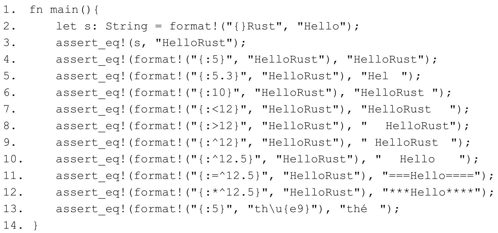{.u53927}
:::

代码清单8-35展示了format！格式化示例，格式化效果如图8-5所示。

::: center
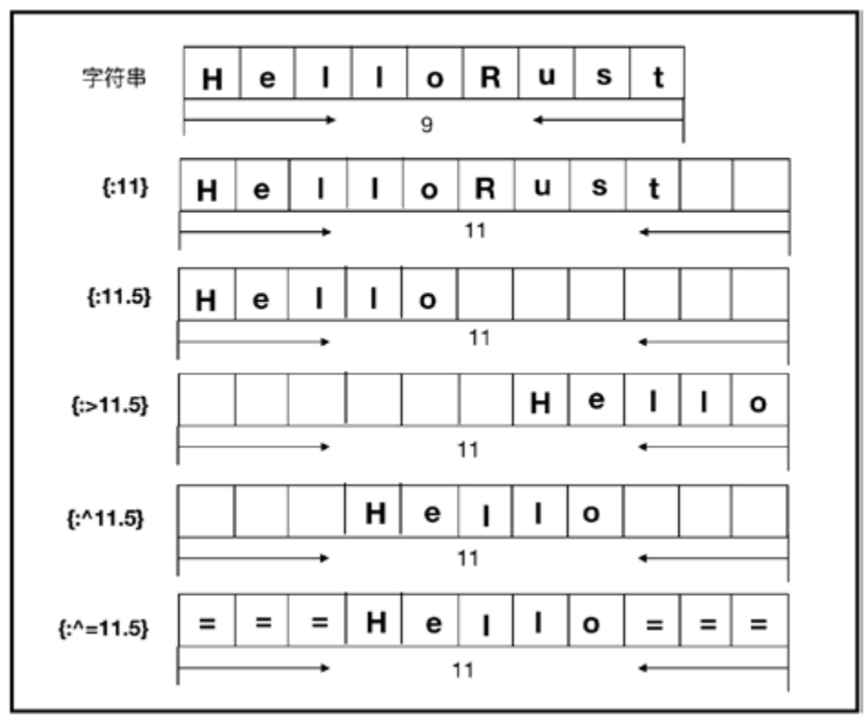{.u53926}

图8-5：format！格式化效果
:::

基本的格式化规则可以总结为下面三条：

· **填充字符串宽度** 。格式为{：number}，其中number表示数字。如代码清单8-35中第4行所示。如果number的长度小于字符串长度，则什么都不做；如果number的长度大于字符串的长度，则会默认填充空格来扩展字符串的长度，如代码第6行所示。

· **截取字符串** 。格式为{：.number}，注意number前面有符号"."，number代表要截取的字符长度，也可以和填充格式配合使用，如代码清单8-35中第5行所示。

· **对齐字符串** 。格式为{：＞}、{：\^}和{：＜}，分布表示左对齐、位于中间和右对齐。如代码清单8-35中第7～10行所示，也可以与其他格式代码配合使用。

在代码清单8-35中，代码第11行和第12行，直接在冒号后面使用"="和"\*"替代默认的空格填充。format！格式化字符串是按字符来处理的，如代码第 13 行所示，不管字符串多长，对于里面的Unicode码位都会以单个字符位来处理。

除满足上述格式化规则之外，Rust还提供了专门针对整数和浮点数的格式化代码。代码清单8-36展示了针对整数的format！格式化示例。

**代码清单8-36：针对整数使用format！格式化为字符串**

::: center
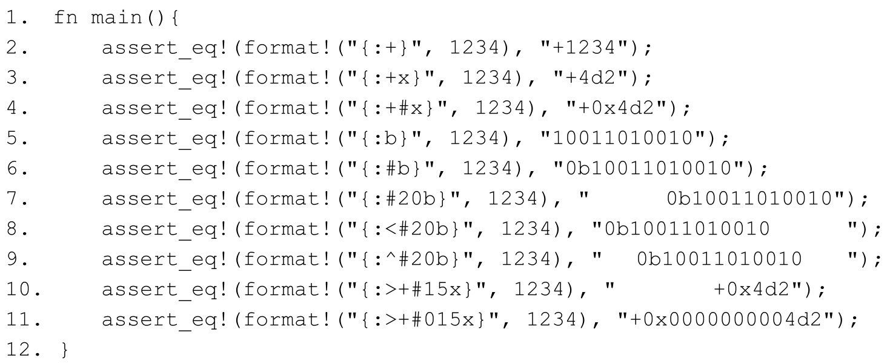{.u53925}
:::

在代码清单8-36中，除使用上面介绍的格式化代码之外，还用到了针对整数提供的格式化代码。总结如下：

· **符号+** ，表示强制输出整数的正负符号。

· **符号＃** ，用于显示进制的前缀。比如十六进制显示0x，二进制显示0b。

· **数字0** ，用于把默认填充的空格替换为数字0。

为了便于理解，图8-6展示了针对整数的format！格式化规则。

::: center
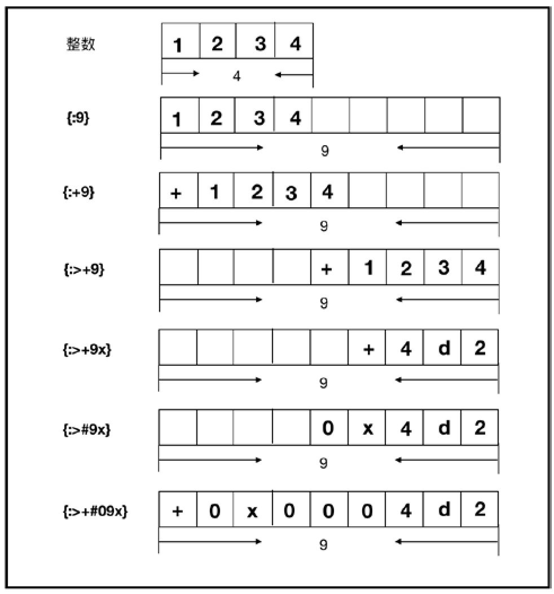{.u53924}

图8-6：针对整数的format！格式化规则
:::

针对浮点数，某些格式化代码又表示不同的含义，如代码清单8-37所示。

**代码清单8-37：针对浮点数使用format！格式化为字符串**

::: center
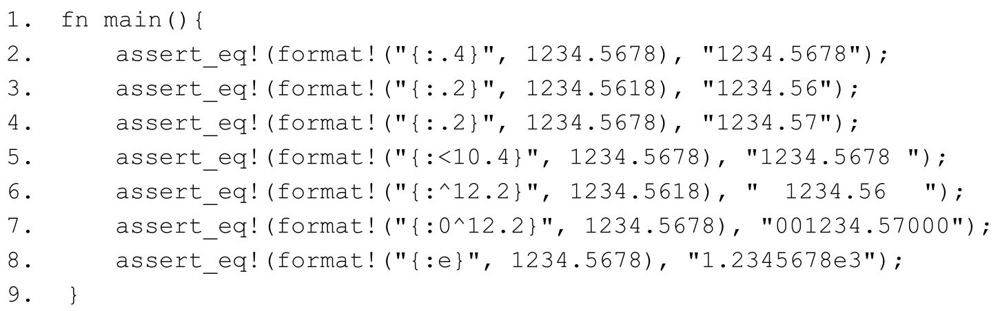{.u53923}
:::

浮点数格式化主要注意以下两点：

· 指定小数点后的有效位。符号"**.** "代表的是指定浮点数小数点后的有效位。这里需要注意的是，在指定有效位时会四舍五入，如代码清单8-37中第3行和第4行所示。

· 科学计数法。使用**{：e}** 可以将浮点数格式化为科学计数法的表示形式。

图8-7展示了针对浮点数的format！格式化规则。

::: center
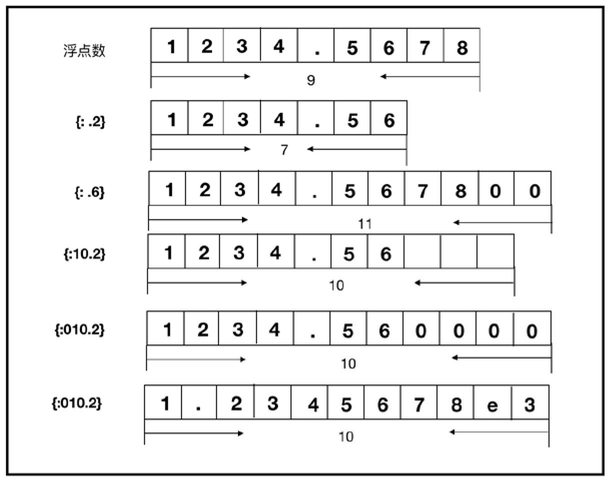{.u53922}

图8-7：针对浮点数的format！格式化规则
:::

以上所有的格式化规则，对println！和write！宏均适用。前面展示的都是字符串、整数和浮点数等内置类型的格式化，如果要对自定义类型格式化，则需要实现Display trait，如代码清单8-38所示。

**代码清单8-38：对自定义类型format！格式化为字符串**

::: center
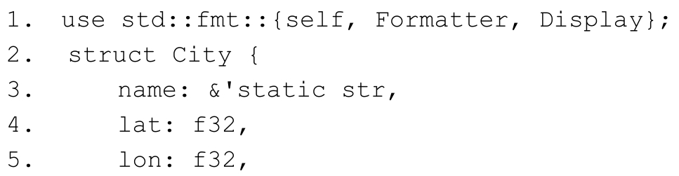{.u53921}
:::

::: center
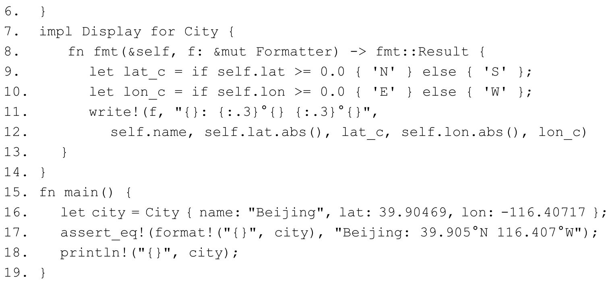{.u53411}
:::

在代码清单8-38中，为结构体City实现了Display trait，所以可以通过format！宏根据结构体实例city生成相应的字符串，如代码第17行所示。

### 8.1.8 回顾 {#text00014.html#Aee090124-7e08-4ec4-b40d-7bca2cb87e48 .title-left}

关于字符串的介绍，到此告一段落。现在用一个小例子来回顾一下之前讲过的内容。如图8-8所示，有一个数字方阵，求出其对角线位置的所有数字之和。

::: center
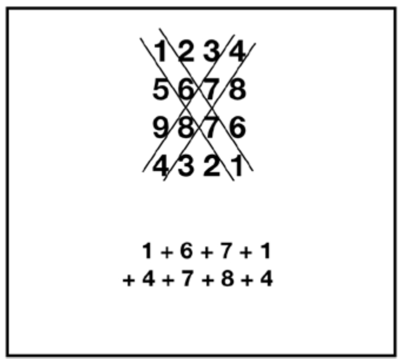{.u53920}

图8-8：求数字方阵对角线位置的数字之和
:::

使用原生字符串声明语法（r＂\...＂）将此数字方阵定义为字符串，然后按行遍历其字符即可得到结果，如代码清单8-39所示。

**代码清单8-39：求数字方阵的对角线数字之和**

::: center
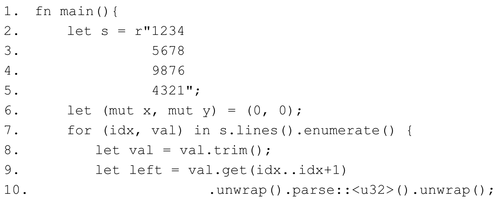{.u53919}
:::

::: center
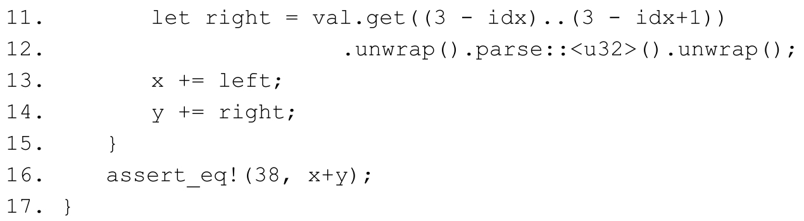{.u53918}
:::

在代码清单8-39中，代码第2～5行，使用原生字符串声明语法（r＂\...＂）将数字方阵定义为字符串。该语法的好处是，可以保留原来字符串中的特殊符号。

代码第6行，声明两个整数变量用于记录两条对角线上的数字之和，最终将这两个变量加起来就得到所求结果。

代码第7～15行，使用for循环迭代数字方阵字符串的每一行来获取对角线上的数字进行累加求和。其中使用了字符串的 lines 方法，可以自动按换行符迭代字符串，然后使用了enumerate方法来获取行号索引。

代码第8行，在for循环中使用trim方法将每一行的子字符串两头多余的空格删除。

代码第9行和第10行，使用get方法结合范围参数来获取相关位置的字符。这里使用了一个技巧，斜线对角线位置字符的索引正好等于循环行号索引。获取到相应位置的字符，需要用parser方法将该字符转换为u32类型。

代码第11行和第12行，使用get方法获取反斜线对角线位置的字符，而该对角线上的字符位置索引正好和循环行号索引相反，所以这里使用了另一个技巧，使用3减去循环行号索引就得到相应对角线上的位置。

第13行和第14行，分别累加两条对角线上的字符值之和。代码第16行，分别将两条对角线上的数字之和相加，即可得到最终结果38。

随书源码中也给出了其他实现方法。

## 8.2 集合类型 {#text00014.html#A83160125-2c61-4f64-8a35-f399f12dca12 .title-left}

Rust标准库中提供的集合类型包括以下几种：

· **Vec＜T＞** ，动态可增长数组。

· **VecDeque＜T＞** ，基于环形缓冲区的先进先出（FIFO）双端队列实现。

· **LinkedList＜T＞** ，双向链表实现。

· **BinaryHeap＜T＞** ，二叉堆（最大堆）实现，可用作优先队列。

· **HashMap＜K，V＞** ，基于哈希表的无序K-V映射集实现。

· **BTreeMap＜K，V＞** ，基于B树的有序映射集实现，按Key排序。

· **HashSet＜T＞** ，无序集合实现。

· **BTreeSet＜T＞** ，基于B树的有序集合实现。

以上最常用的集合类型为Vec＜T＞和HashMap＜K，V＞，接下来主要介绍这两种集合类型。

### 8.2.1 动态可增长数组 {#text00014.html#A573e0125-84a0-47f6-98ca-c618548c5304 .title-left}

Rust中数组有两种类型：一种是原生类型array，它拥有固定的长度，类型签名为\[T；N\]；另一种是动态可增长数组Vector，它是可增长的动态数组，类型签名为Vec＜T＞，在运行时才可知道大小。在第4章中已经介绍过，array和Vector的区别在于，array中的元素可以在栈上存储；而Vector中的元素只能在堆上分配。本章着重介绍动态可增长数组Vector。

**基本操作与内存分配**

创建Vector和创建String类型字符串的方法很相似，因为String类型的字符串本身就是对Vec＜u8＞类型的包装。代码清单8-40展示了Vector的基本操作。

**代码清单8-40：Vector基本操作**

::: center
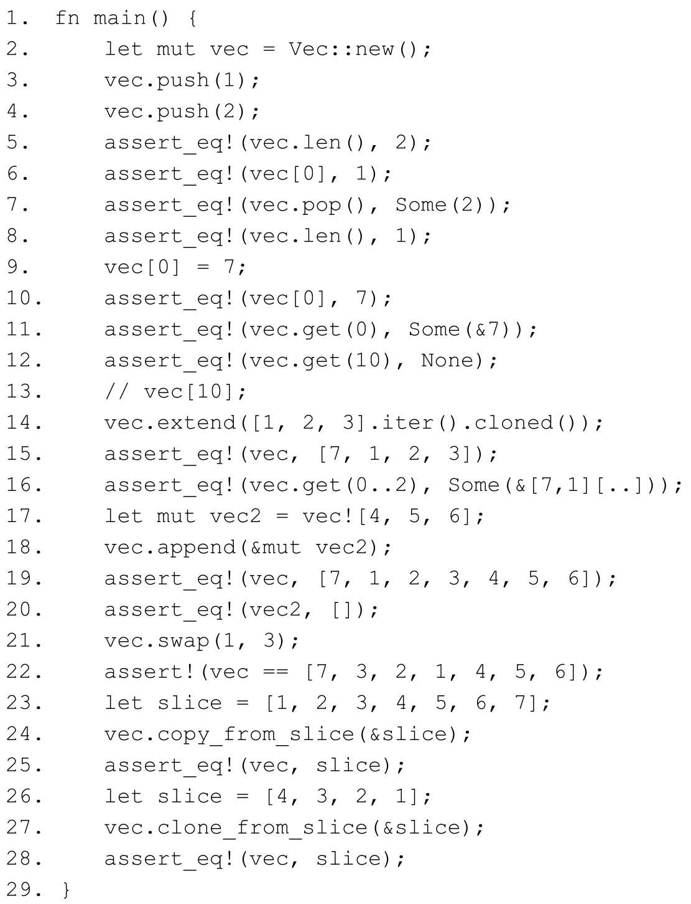{.u53917}
:::

在代码清单8-40中，代码第2行，使用Vec：：new方法可以创建一个可变的Vector空数组，与String：：new类似，实际上并未分配堆内存。如果在整个函数中都未为其填充元素，则Rust编译器会认定它为未初始化内存，编译器报错。

代码第3行和第4行，使用push方法插入数字类型，这里编译器会默认推断其类型为i32。

代码第5行，使用len方法查看vec的大小为2，因为已经插入了两个元素。

代码第6行，通过索引访问相应位置的元素。

代码第7行，通过pop方法弹出vec末尾的元素。可以看出，Vector数组天生就可以作为先进后出（FILO）的栈结构使用。注意pop方法返回的是Option＜T＞类型，当数组为空时，会返回None，从而避免线程崩溃。此时使用len 方法查看vec，其长度已经变为1，如代码第8行所示。

代码第9行，通过索引访问也可以修改相应位置的元素，这里把索引为0的元素改为7，如代码第10行所示。

代码第11～13行，分别使用get方法和索引对vec进行越界访问。get方法返回的是None，而通过索引直接访问则会导致线程崩溃。

代码第14行，使用extend方法给vec数组追加元素，其参数为一个迭代器。其结果如代码第15行所示。Vector数组也支持迭代器，在本书中迭代器相关章节已经有足够详细的介绍，这里不再赘述。

代码第16行，通过给get方法传入索引范围，可以获取相应的数组切片。

代码第17～20行，通过append方法可以给一个Vector数组追加另一个数组，其参数为可变借用，如代码第18行所示。但是这两个Vector数组都将发生变化，如代码第19行和第20行所示。

代码第21行，使用swap方法可以交换两个指定索引位置的元素，所得结果如代码第22行所示。

代码第23行和第24行，通过copy_from_slice方法可以使用一个数组切片将原vec数组中的元素全部替换，如代码第 25 行所示。但是注意，数组切片必须和原数组等长，否则会引发线程崩溃。需要注意的是，该方法只支持实现Copy语义的元素。

代码第26行和第27行，使用clone_from_slice方法的效果和copy_from_slice是等价的，但它们的区别是，clone_from_slice方法支持实现Clone的类型元素。

除了这些方法，还可以使用with_capacity预分配堆内存的方式来创建Vector数组，如代码清单8-41所示。

**代码清单8-41：Vector堆内存预分配示例**

::: center
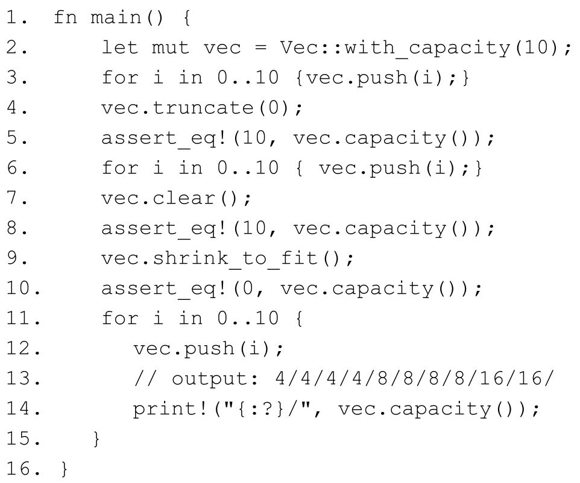{.u53916}
:::

在代码清单8-41中，使用了Vec：：with_capacity方法，和String：：with_capacity方法类似，可以预分配堆内存。这里分配了容量为 10 个单位的堆内存，实际上真正分配的堆内存大小等于数组中元素类型所占字节与给定容量值之积。

代码第3行，通过for循环在vec数组中插入数字0～9。数字默认推断为4字节，那么这里预分配的堆内存大小为容量值10乘以4字节等于40字节。

代码第4行，使用truncate方法从索引0开始截断，实际上效果等同于clear方法。但是这样只是清空了元素，并未释放预分配的堆内存。代码第5行显示vec容量依旧是10。

代码第6～8行，使用clear方法重复上述过程，结果相同，预分配的堆内存并未被释放。

代码第9行，使用了shrink_to_fit方法，预分配的堆内存被释放了。实际上，该方法只有在vec数组中元素被清空之后才会释放预分配的堆内存，当vec数组中元素并未占满容量空间时，就会压缩未被使用的那部分容量空间，相当于重新分配堆内存。

代码第11～15行，对已经被释放堆内存的vec数组，重新循环插入数字0～9，通过代码第14行的输出结果可以看出，第一次分配了容量为4，用完以后，自动将容量加到了8，待容量8用尽之后，又自动将容量加到了16，可见，容量是按倍数递增的。

所以，在日常编程中，使用Vec：：with_capacity方法来创建Vector数组可以有效地避免频繁申请堆内存带来的性能损耗。在代码清单8-41中用到的类型有基本大小，比如i32占4字节。但在Rust中有些类型是不占字节的，属于零大小类型（ZST），那么它是怎么存储的呢？对于使用Vec：：new方法创建的空数组，如果没有分配堆内存，那么它的指针指向哪里？代码清单8-42展示了Vector数组存储零大小类型示例。

**代码清单8-42：Vector数组存储零大小类型示例**

::: center
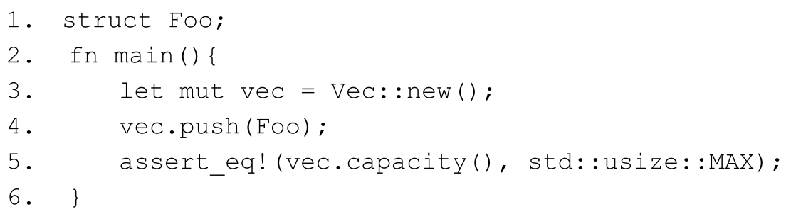{.u53915}
:::

在代码清单8-42中，定义了一个单元结构体Foo，该结构体并不占用内存，属于零大小类型。代码第3行使用Vec：：new初始化了一个Vector空数组。Vector数组本质属于一种智能指针，跟 String 类型的字符串一样，它也由三部分组成：指向堆中字节序列的指针（as_ptr方法）、记录堆中字节序列的字节长度（len方法）和堆分配的容量（capacity方法）。因为此时并未预分配堆内存，所以其内部指针并非指向堆内存，但它也不是空指针，Rust在这里做了空指针优化。

代码第4行，使用push方法插入Foo实例（单元结构体的实例就是它自己），因为Foo是零大小类型，所以也不会预分配堆内存。

代码第5行显示，此时vec的容量竟然等于std：：usize：：MAX，该值代表usize类型的最大值。实际上这里是Rust内部实现的一个技巧，用一个实际不可能分配的最大值来表示零大小类型的容量。

所以，我们可以放心地使用Vector，而不必担心内存分配会带来任何不安全的问题。

**查找与排序**

数组也支持字符串中提供的一些查找方法，比如contains、starts_with和ends_with方法，如代码清单8-43所示。

**代码清单8-43：contains等方法使用示例**

::: center
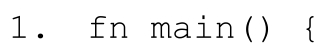{.u53914}
:::

::: center
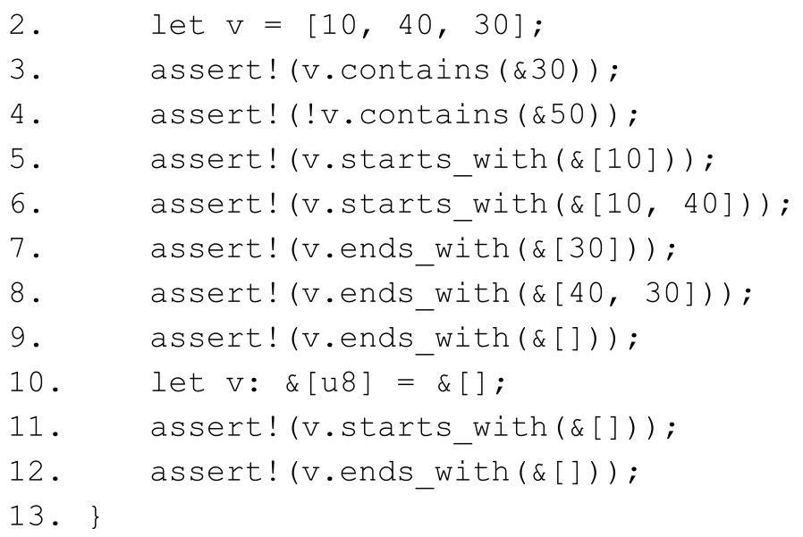{.u53853}
:::

在代码清单8-43中展示的contains、starts_with和ends_with都是泛型方法。它们有一个共同的trait限定：PartialEq＜T＞，该trait定义了一些方法用于判断等价关系，本章后面会有详细介绍。contains只能接收引用类型，starts_with和ends_with接收的是数组切片类型。

除这三个方法之外，标准库中还提供了binary_search系列泛型方法来帮助开发者方便地检索数组中的元素，如代码清单8-44所示。

**代码清单8-44：binary_search系列泛型方法使用示例**

::: center
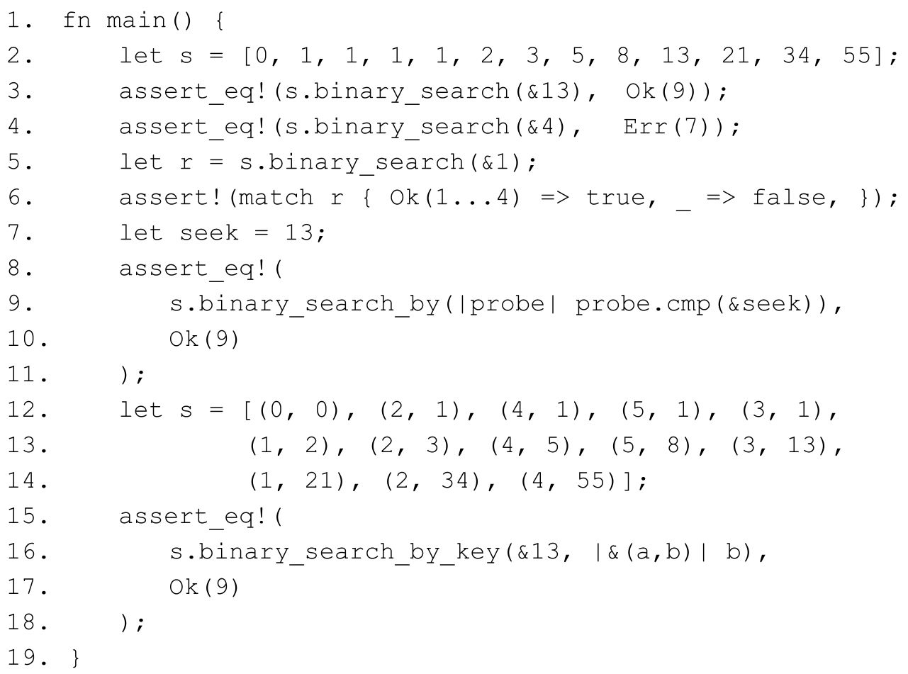{.u53913}
:::

binary_search 方法又叫作二分查找或折半查找方法，基本要求是待查找的数组必须是有序的，该算法的平均时间复杂度为*O* （log*n* ），空间复杂度用迭代实现，所以是*O* （1）。

在代码清单8-44中，代码第2～6行展示了binary_search方法，其参数为一个引用类型，且该参数类型必须实现Ord。Ord trait抽象了比较操作，本章后面会有详细介绍。在本例中，binary_search 方法接收&13 作为参数，返回 Result 类型的参数 Ok（9），表示其所在索引为 9的位置。对于找不到的元素，则返回Err。如果要处理Result类型，则可以使用match匹配，如代码6行所示。

代码第 7～11 行展示了 binary_search_by 方法，该方法的参数是一个 FnMut（&＇a T）-＞Ordering闭包。Ordering是一个枚举类型，记录的是三种比较结果：小于（Less）、等于（Equal）和大于（Greater）。代码第9行闭包中所用的cmp方法是Ord trait中所定义的，所以该方法只能用于检索实现了Ord的类型。binary_search_by方法最终返回的结果同样是Result类型。

代码第12～18行，binary_search_by_key方法和binary_search_by方法一样，都可以接收闭包参数，但它们的区别在于，binary_search_by_key方法接收的是FnMut（&＇a T）-＞B闭包，其中B对应于参数的类型（&B），相比于binary_search_by方法，该方法的闭包参数覆盖范围比较广，相当于开发者可以指定任意检索条件。代码第 12 行定义的数组是以元组第二位进行排序的有序数组。代码第16行中使用的闭包，同样是按元组第二位来设置检索条件的，最终返回的结果是Result类型。

上面介绍的二分查找binary_search系列泛型方法的前置要求是必须是有序数组，对于没有排序的数组怎么办？Rust当然也提供了性能高效的排序方法：sort系列方法和sort_unstable系列方法。sort系列方法使用示例如代码清单8-45所示。

**代码清单8-45：sort系列方法使用示例**

::: center
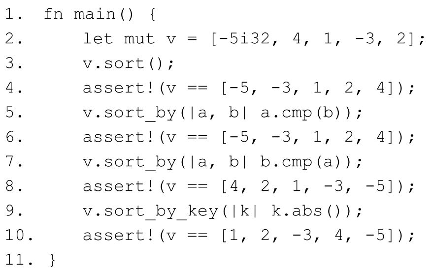{.u53912}
:::

在代码清单8-45中所用到的sort、sort_by和sort_by_key方法，其内部所用算法为自适应迭代归并排序（Adaptive/Iterative Merge Sort）算法，灵感来自Python语言中的TimSort算法。该算法为稳定排序算法，即序列中等价的元素在排序之后相对位置并不改变。其时间复杂度为*O* （*n* ），最坏情况为*O* （*n* log*n* ）。

代码清单 8-45 中的 sort 系列方法均可被直接替换为 sort_unstable、sort_unstable_by 和sort_unstable_by_key方法。但是sort_unstable 系列方法其内部实现的排序算法为模式消除快速排序（Pattern-Defeating Quicksort）算法，该算法为不稳定排序算法，也就是说，序列中等价的元素在排序之后相对位置有可能发生变化。其时间复杂度为*O* （*n* ），最坏情况为*O* （*n* log*n* ）。在不考虑稳定性的情况下，推荐使用sort_unstable系列方法，其性能要高于sort系列方法，因为它们不会占用额外的内存。

不管是sort系列方法还是sort_unstable系列方法，其命名规则和binary_search系列方法相类似，所以它们在语义上也是相同的，xxxx_by方法表示接收返回Ordering类型的闭包参数；而xxxx_by_key方法接收的闭包参数覆盖范围更广，适合表示任意检索（排序）条件。

**与排序和比较相关的trait**

在上面介绍的诸多数组方法中，其实都涉及数组内部元素的比较，比如判断是否存在、检索和排序都必须要在元素间进行比较。在 Rust 中把比较操作也抽象为一些 triat，定义在std：：cmd模块中。该模块中定义的trait是基于数学集合论中的二元关系偏序、全序和等价的。

偏序的定义，对于非空集合中的*a* 、*b* 、*c* 来说，满足下面条件为偏序关系。

· 自反性：*a* ≤*a* 。

· 反对称性：如果*a* ≤*b* 且*b* ≤*a* ，则*a* =*b* 。

· 传递性：如果*a* ≤*b* 且*b* ≤*c* ，则*a* ≤*c* 。

全序的定义，对于非空集合中的*a* 、*b* 、*c* 来说，满足下面条件为全序关系。

· 反对称性：若*a* ≤*b* 且*b* ≤*a* ，则*a* =*b* 。

· 传递性：若*a* ≤*b* 且*b* ≤*c* ，则*a* ≤*c* 。

· 完全性：*a* ＜*b* 、*b* ＜*a* 或*a* ==*b* 必须满足其一，表示任何元素都可以相互比较。

全序实际上是一种特殊的偏序。

等价的定义，对于非空集合中的*a* 、*b* 、*c* 来说，满足下面条件为等价关系。

· 自反性：*a* ==*b* 。

· 对称性：*a* ==*b* ，意味着*b* ==*a* 。

· 传递性：若*a* ==*b* 且*b* ==*c* ，则*a* ==*c* 。

在 Rust 中一共涉及四个 trait 和一个枚举体来表示上述二元关系。四个 trait 分别是PartialEq、Eq、PartialOrd和Ord。这些trait的关系可以总结为以下几点：

· PartialEq代表部分等价关系，其中定义了eq和ne两个方法，分别表示"=="和"！="操作。

· Eq 代表等价关系，该 trait 继承自 PartialEq，但是其中没有定义任何方法。它实际上相当于标记实现了Eq的类型拥有等价关系。

· PartialOrd对应于偏序，其中定义了partial_cmp、lt、le、gt和ge五个方法。

· Ord对应于全序，其中定义了cmp、max和min三个方法。

还有一个枚举体为 Ordering，用于表示比较结果，其中定义了小于、等于和大于三种状态。

代码清单8-46展示了PartialEq和Eq的定义。

**代码清单8-46：PartialEq和Eq定义**

::: center
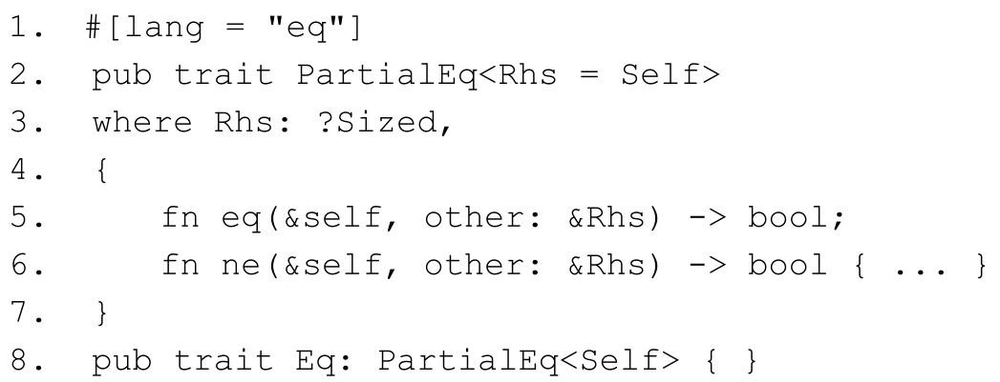{.u53718}
:::

PartialEq中定义了eq和ne方法，但是其中ne有默认实现。如果需要实现PartialEq，只需要实现eq这一个方法就可以。Eq实则起标记作用，并没有实际的方法。

代码清单8-47展示了PartialOrd的定义。

**代码清单8-47：PartialOrd定义**

::: center
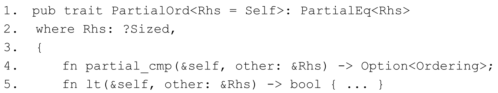{.u53472}
:::

::: center
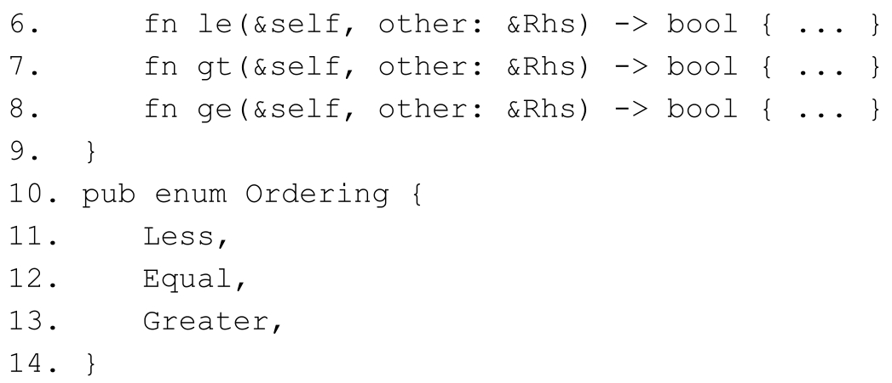{.u53911}
:::

代码清单8-47展示了定义于std：：cmp模块中的PartialOrd。该trait中定义了五个方法，其中partial_cmp方法表示具体的比较规则，注意其返回Option＜Ordering＞类型，因为对于偏序的比较来说，并不是所有元素都具有可比性，有些元素的比较结果可能为None。其他四个方法 lt、le、gt、ge 分别代表小于、小于或等于、大于和大于或等于，包含了默认实现。如果要给某个类型实现PartialOrd，只需要实现partial_cmp方法即可。

代码清单8-48展示了Ord的定义。

**代码清单8-48：Ord定义**

::: center
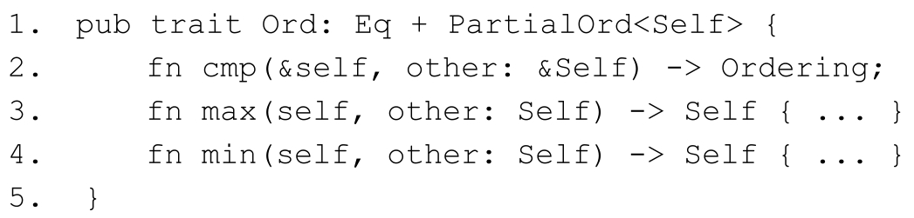{.u53910}
:::

从代码清单8-48中可以看出，Ord继承自Eq和PartialOrd，这是因为全序的比较必须满足三个条件：反对称性、传递性和完全性，其中完全性一定是每个元素都可以相互比较。举个例子，在浮点数中用于定义特殊情况值而使用的 NaN，其本身就不可比较，因为 NaN！=NaN，它不满足全序的完全性，所以浮点数只能实现PartialEq和PartialOrd，而不能实现Ord。如果要实现Ord，只需要实现cmp方法即可，因为max和min都有默认实现。注意cmp方法返回Ordering类型，而不是Option＜Ordering＞类型，因为对于全序关系来说，每个元素都是可以获得合法的比较结果的。

在Rust中基本的原生数字类型和字符串均已实现了上述trait，如代码清单8-49所示。

**代码清单8-49：比较操作示例**

::: center
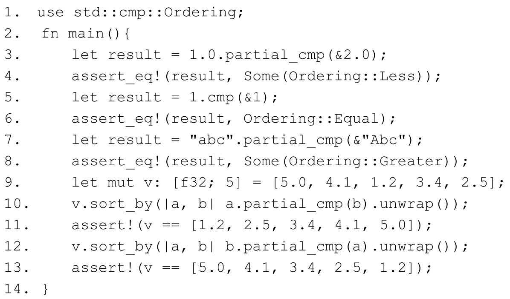{.u53909}
:::

在代码清单8-49中，代码第3行比较的是浮点数，只能用偏序比较，所以使用partial_cmp方法，最终返回Some（Ordering：：Less），如代码第4行所示。

代码第 5 行比较的是整数类型，满足全序关系，所以使用 cmp 方法，最终返回Ordering：：Equal。

代码第7行比较的是字符串，满足偏序关系，其默认为字典序，也就是按字符串首字母进行比较的，所以使用partial_cmp方法。最终结果如代码第8行所示。

代码第9行定义了一个浮点数数组，代码第10行使用sort_by方法为其排序，传入的闭包参数为a.partial_cmp（b）。而sort_by是按a和b的比较结果是否等于Less的规则进行排序的，如果a小于b，则为升序，如代码第11行所示；如果b小于a，则为降序，如代码第13行所示。

如果要在自定义类型中实现相关 trait，则必须搞清楚全序和偏序关系，然后再实现相应的trait。可以手工实现，也可以使用＃\[derive\]来自动派生。

**回顾与展望**

本节虽然重点介绍的是Vector，但是里面涉及的方法同样适用于array。因为这些方法实际上是为**\[T\]** 类型实现的，如代码清单8-50所示。

**代码清单8-50：为\[T\]类型实现的方法**

::: center
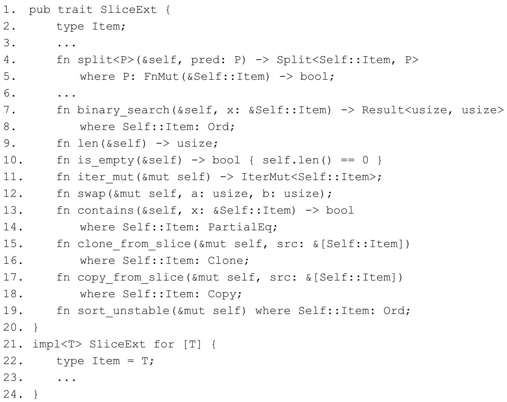{.u53908}
:::

在代码清单8-50中展示了定义于core：：slice模块中的SliceExt，该trait中定义了很多方法，这里只展示了一部分，本节介绍过的一些方法都定义于其中。从代码第21行可以看到，实际上为\[T\]类型实现了SliceExt。

当然，array也有自己专用的方法，比如连接两个array可以使用join方法。在标准库中还为数组提供了很多其他方法，限于篇幅，这里无法一一介绍，但是可以在标准库文档中看到每个方法的具体方法签名和使用示例。

在Rust 2018中，还加入了针对array数组和切片进行match匹配的新语法。match匹配array数组示例如代码清单8-51所示。

**代码清单8-51：match匹配array数组示例**

::: center
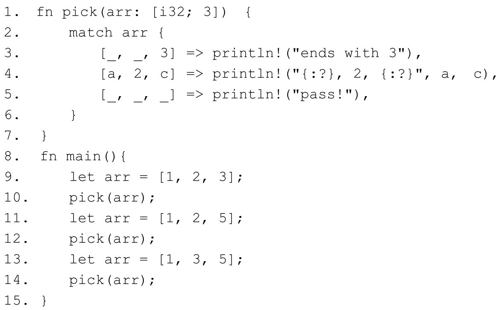{.u53907}
:::

在代码清单 8-51 中实现了 pick 函数，它接收一个定长的数组，通过匹配数组的不同元素，可以实现指定的功能。该代码可以挑选出以3结尾和第二个元素为2的数组。注意match匹配的最后一个分支，必须使用通配符或其他变量来穷尽枚举。

当前Rust使用array数组局限性比较大，不过该语法还支持数组切片，所以利用数组切片就可以模拟变长参数的函数，如代码清单8-52所示。

**代码清单8-52：match匹配数组切片示例**

::: center
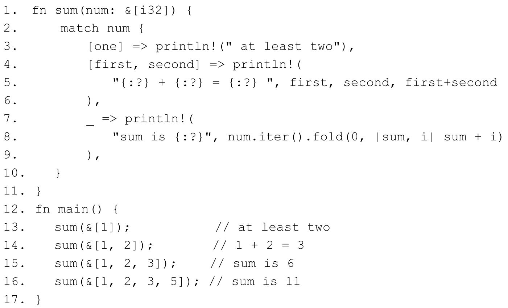{.u53906}
:::

在代码清单8-52中利用数组切片的match语法，模拟了可变参数的sum函数的实现。从输出结果可以看出，切片数组不同的元素个数，产生了不同的输出结果。

### 8.2.2 映射集 {#text00014.html#Af40d012f-b051-4627-b963-796784b9bd1b .title-left}

在日常编程中，另一个常用的数据结构非**映射集（Map）** 莫属。Map 是依照键值对（Key-Value）形式存储的数据结构，每个键值对都被称为一个**Entry** 。在Map中不能存在重复的Key，并且每个Key必须有一个一一对应的值。Map提供的查找、插入和删除操作的时间复杂度基本都是*O* （1），最坏情况也只是*O* （*n* ），虽然需要消耗额外的空间，但是随着当下可利用的内存越来越多，这种用空间换时间的做法也是值得的。Rust提供了两种类型的Map：基于哈希表（HashTable）的 **HashMap** 和基于多路平衡查找树（B-Tree）的 **BTreeMap** 。本节主要介绍HashMap。

**HashMap的增、删、改、查**

代码清单8-53展示了部分HashMap使用示例。

**代码清单8-53：部分HashMap使用示例**

::: center
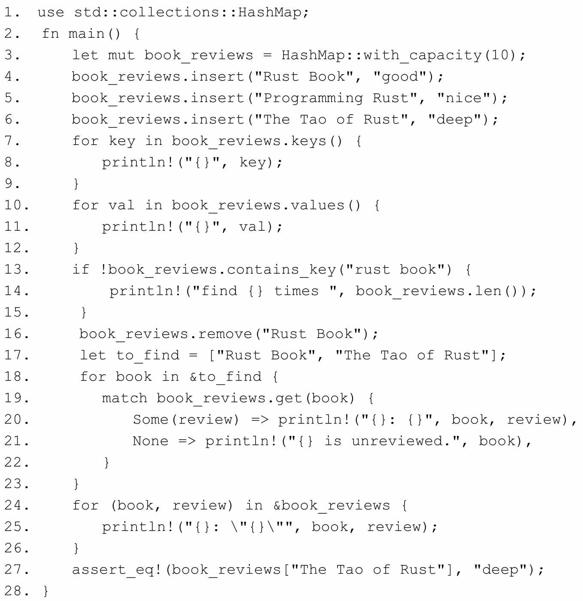{.u53905}
:::

在代码清单8-53中，使用HashMap：：with_capacity方法来创建一个空的HashMap，跟String或Vector类似，该方法可以预分配内存。同样，也可以使用HashMap：：new，但不会预分配内存。

代码第 4～6 行，通过 insert 方法向 HashMap 中插入字符串字面量类型的键值对，此时HashMap的类型确定为HashMap＜&str，&str＞。

代码第7～12行，通过keys和values方法可以分别单独获取HashMap中的键和值，注意这两个方法是迭代器。因为HashMap是无序的映射表，所以在迭代键和值的时候，输出的顺序并不一定和插入的顺序相同。

代码第13～15行，使用contains_key方法来查找指定的键，如果没有找到，就输出相应的信息，如代码第14行所示，这里通过len方法输出了HashMap键值对的长度。

代码第16～23行，使用remove方法按指定的键删除HashMap中的一个键值对，然后在对HashMap的迭代中通过get方法逐个查找指定的键。因为get方法返回的是Option＜T＞类型，所以这里需要用match进行匹配。如果找到，则匹配 Some（review），打印键值对；如果没找到，则输出相关信息。

代码第24～26行，通过元组（book，review）在for循环中分别使用键（book）和值（review）。

代码第27行，通过Index语法可以按指定的键来获取对应的值。这里需要注意的是，目前Rust只支持Index，而不支持IndexMut。也就是说，只可以通过hash\[key\]方式来取值，而不能通过hash\[key\]=value方式来插入键值对，这是因为针对该特性正在准备一个更好的设计方案，并在不远的将来得到支持。

**Entry模式**

对于 HashMap 中的单个桶（Bucket）来说，其状态无非是"空"和"满"，所以 Rust对此做了一层抽象，使用Entry枚举体来表示每个键值对，如代码清单8-54所示。

**代码清单8-54：Entry定义**

::: center
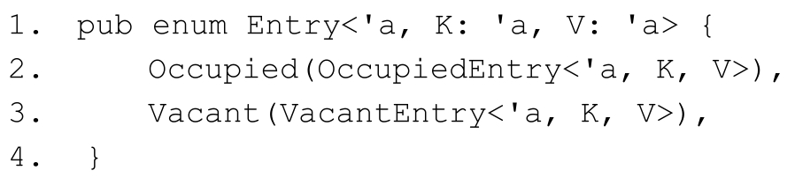{.u53904}
:::

在代码清单8-54中展示了Entry的定义，其中包含两个变体：Occupied（OccupiedEntry＜＇a，K，V＞）和Vacant（VacantEntry＜＇a，K，V＞）。OccupiedEntry＜＇a，K，V＞和VacantEntry＜＇a，K，V＞是内部定义的两个结构体，分别对应HashMap底层桶的存储信息。其中Occupied代表占用，Vacant代表留空。

Entry一共实现了三个方法，通过这三个方法可以方便地对HashMap中的键值对进行操作，如代码清单8-55所示。

**代码清单8-55：entry方法使用示例**

::: center
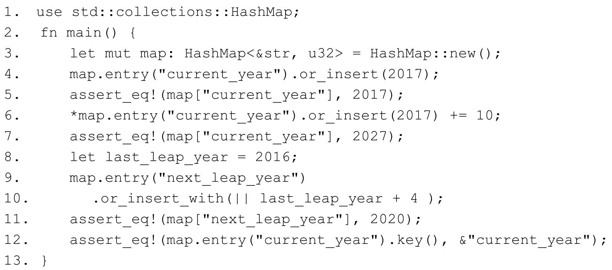{.u53903}
:::

在代码清单8-55中展示了Entry枚举体实现的三个稳定的方法：or_insert、or_insert_with和key。要使用这三个方法，必须先通过entry方法得到Entry＜K，V＞。

代码第3行，使用HashMap：：new创建了一个空的HashMap。代码第4行，通过entry方法，将键作为参数传入得到Entry。本例中的键为"current_year"，它被传入entry方法内部之后，首先会判断哈希表是否有足够的空间，如果没有，则进行自动扩容。接下来调用内部的hash函数生成此键的hash值，然后通过这个hash值在底层的哈希表中搜索，如果能找到此键，则返回相应的桶（Occupied）；如果找不到，则返回空桶（Vacant）。最后，将得到的桶转换为Entry＜K，V＞并返回。

在得到Entry之后，就可以调用其实现的or_insert方法，该方法的参数就是要插入的值，并且返回该值的可变借用。所以才可以像代码第6行那样，通过解引用操作符"\*"对or_insert方法的结果进行修改。

代码第8～10行，使用or_insert_with方法可以传递一个可计算的闭包作为要插入的值。注意，其只允许传入FnOnce（）-＞V的闭包，也就是说，闭包不能包含参数。

代码第12行，可以通过key方法来获取Entry的键。

代码清单8-56展示了or_insert方法的源码。

**代码清单8-56：or_insert方法源码**

::: center
{.u53902}
:::

从代码清单8-56中可以看出，通过entry方法从底层找到相应的桶之后，再通过match方法分别处理不同类型的桶。如果是占用的桶（Occupied（entry）），则通过into_mut方法将其变成可变借用，这样就可以被新插入的键值对覆盖。如果是空桶（Vacant（entry）），则使用相应的insert方法直接插入，注意此时的insert方法是为VacantEntry定义的insert方法。

**合并HashMap**

如果需要合并两个HashMap，则可以使用迭代器的方式，如代码清单8-57所示。

**代码清单8-57：HashMap的三种合并方式**

::: center
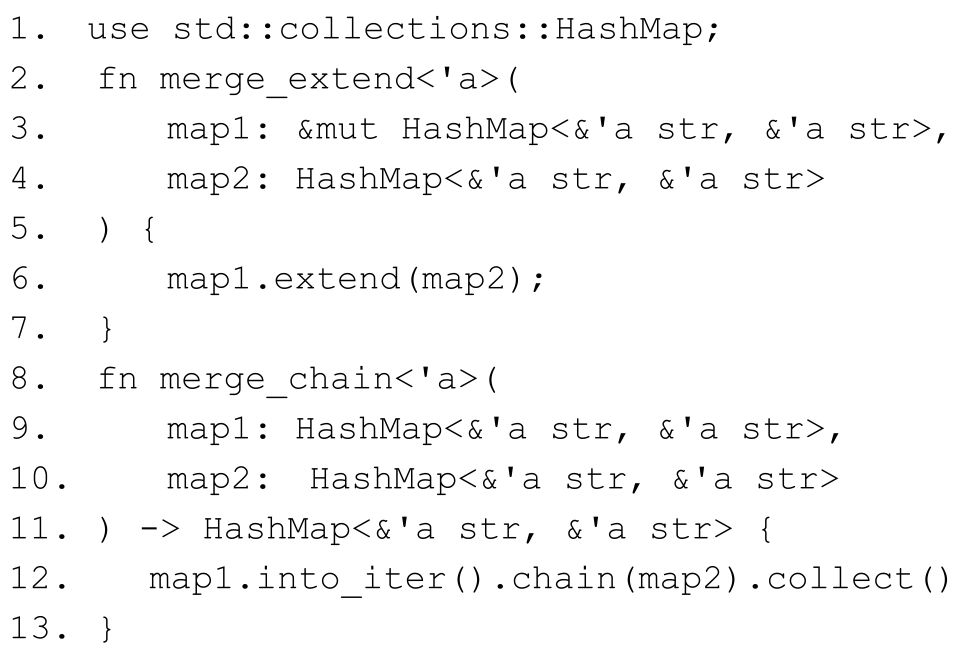{.u53901}
:::

::: center
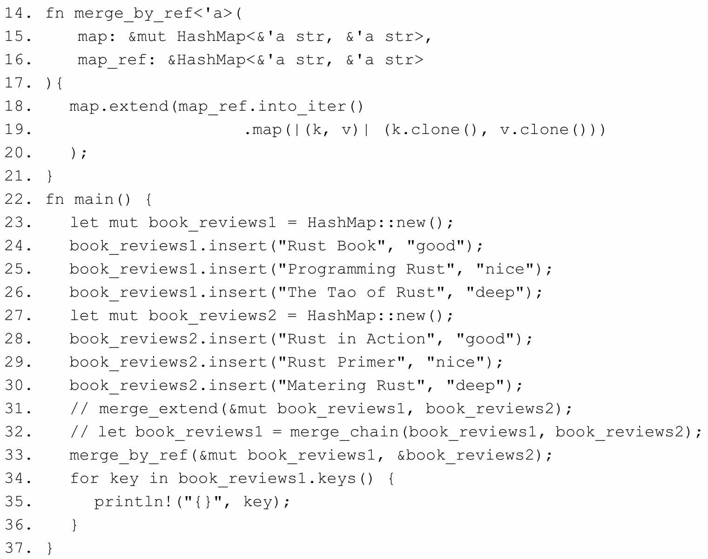{.u53541}
:::

在代码清单8-57中展示了HashMap的三种合并方式。

代码第2～7行，定义了merge_extend方法，通过extend方法来合并两个HashMap。代码第31行调用了此方法。本质上，在extend方法内部也将HashMap转换为迭代器进行操作。

代码第8～13行，定义了merge_chain方法，同样是通过into_iter得到Chain迭代器，然后合并的。代码第32行是对该方法的调用。

代码第14～21行，定义了merge_by_ref方法，使用的同样是extend，只不过传入了第二个HashMap的引用。代码第33行调用了此方法，其参数都是引用，它不会把两个HashMap的所有权转移掉，所以代码第34行的for循环才可以正常打印。

**HashMap底层实现原理**

不管哪门语言，实现一个HashMap的过程均可以分为三大步骤：

（1）实现一个Hash函数。

（2）合理地解决Hash冲突。

（3）实现HashMap的操作方法。

HashMap的底层实际上是基于数组来存储的，当插入键值对时，并不是直接插入该数组中，而是通过对键进行Hash运算得到Hash值，然后和数组的容量（Capacity）取模，得到具体的位置后再插入的。HashMap插入过程示意图如图8-9所示。

::: center
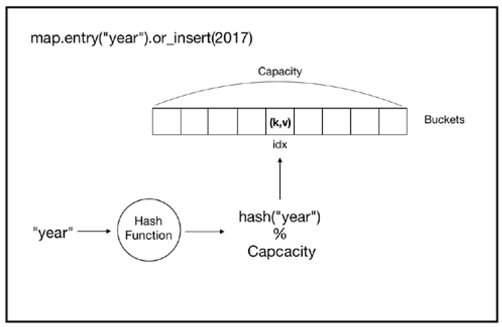{.u53900}

图8-9：HashMap插入过程示意图
:::

从HashMap中取值的过程与之相似，对指定的键求得Hash值，再和容量取模之后就能得到底层数组对应的索引位置，如果指定的键和存储的键相匹配，则返回该键值对；如果不匹配，则代表没有找到相应的键。

在整个过程中最重要的是**Hash函数** 。一个好的Hash函数不仅性能优越，而且还会让存储于底层数组中的值分布得更加均匀，减少冲突的发生。简单来说，Hash函数相当于把原来的数据映射到一个比它更小的空间中，所以冲突是无法避免的，可以做的只能是减少 Hash碰撞发生的概率。一个好的Hash函数增强了映射的随机性，所以碰撞的概率会降低。

**Hash碰撞（Hash Collision）** 也叫Hash冲突，是指两个元素通过Hash函数得到了相同的索引地址，该存储哪一个是需要解决的问题，而这两个元素就叫作同义词。除 Hash 函数的好坏之外，Hash 冲突还取决于**负载因子（Load Factor）** 这个因素。负载因子是存储的键值对数目与容量的比例，比如容量为100，存储了90个键值对，负载因子就是0.9。负载因子决定了HashMap什么时候扩容，如果它的值太大了，则说明存储的键值对接近容量，增加了冲突的风险；如果值太小了，则浪费空间。所以，单靠 Hash 函数和负载因子是不行的，还需要有另外解决冲突的方法。

Rust标准库实现的HashMap，默认的Hash函数算法是SipHash13。另外，标准库还实现了SipHash24。SipHash算法可以防止**Hash碰撞拒绝服务攻击（Hash Collision DoS）** ，这种攻击是一种基于各语言Hash算法的随机性而精心构造出来的增强Hash碰撞的手段，被攻击的服务器CPU占用率会轻松地飙升到100%，造成服务的性能呈指数级下降。正是基于这个原因，很多语言都换成了SipHash算法，该算法配合随机种子可以起到很好的防范作用。Rust提供的SipHash13性能更好，而SipHash24更安全。但使用SipHash并非强制性的，Rust提供了**可插拔** 的实现机制，让开发者可以根据实际需要更换 Hash 算法，比如换成随机性更好的Fnv算法。

代码清单8-58展示了与Rust中Hash相关的trait源码。

**代码清单8-58：Rust中与Hash相关的trait源码**

::: center
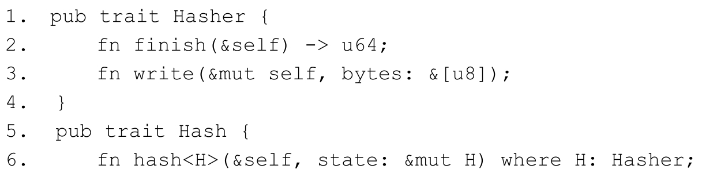{.u53899}
:::

::: center
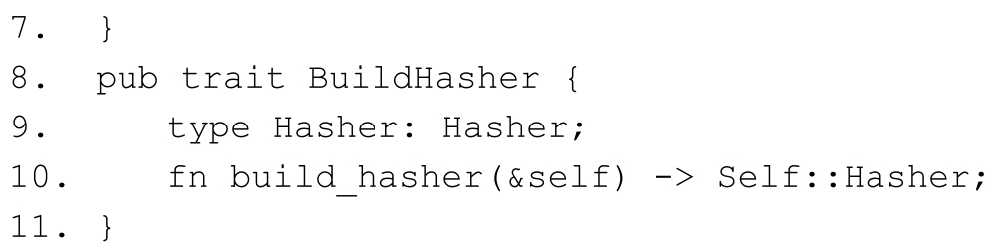{.u53898}
:::

代码清单8-58只是展示了部分与Hash相关的trait源码。代码第1～4行定义的**Hasher** 是对具体Hash算法的抽象，其中write方法根据传入的键写入相应的映射结果，finish方法则得到最终的写入结果。

代码第5～7行定义了**Hash** trait，其中包含了hash方法，是对Hasher中write行为的包装。

代码第8～11行定义的**BuildHasher** ，则是对Hasher的抽象，通过build_hasher可以指定适合的Hasher。

这三个trait是Rust中Hash算法可插拔的基础。在Rust中，每个实现了**Hash** 和**Eq** 两个trait的类型，均可以作为HashMap的键，所以并不能直接用浮点数类型作为HashMap的键。代码清单8-59展示了第三方包fnv实现的Fnv算法。

**代码清单8-59：Fnü算法实现源码**

::: center
{.u53897}
:::

代码清单8-59只是展示了部分源码，可以看出，只需要实现Hasher即可，非常方便。再来看看标准库中HashMap的实现，如代码清单8-60所示。

**代码清单8-60：HashMap实现源码**

::: center
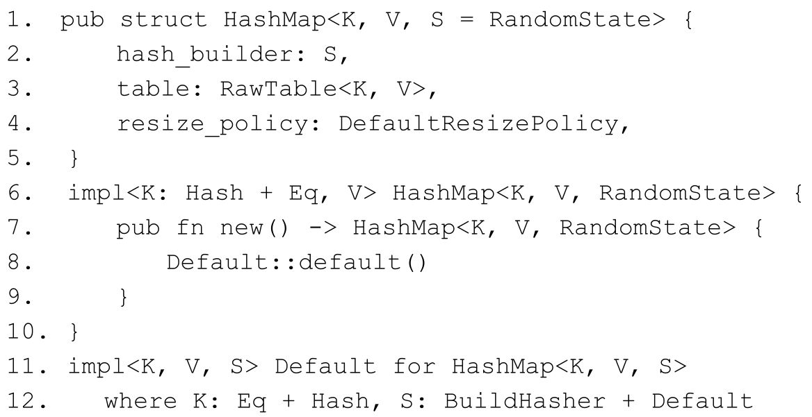{.u53896}
:::

::: center
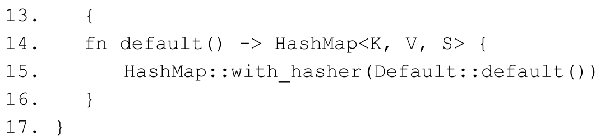{.u53895}
:::

在代码清单 8-60 中，代码第 1～5 行是 HashMap 结构体的定义，包含了三个字段：hash_builder、table和resize_policy。其中hash_builder字段指定了泛型类型S，且给定了一个RandomState类型，RandomState类型实际包装了一个DefaultHasher，它指定了SipHasher13为默认的 Hash 算法，并且 RandomState 在线程启动时指定了一个随机种子，以此来增强对Hash碰撞拒绝服务的保护。

table字段是HashMap用于底层存储的数组RawTable＜K，V＞。resize_policy属于预留字段，用于以后方便从外部指定HashMap的扩容策略，现在还未有具体实现，当前的默认扩容策略为负载因子达到0.9时则进行扩容。

代码第6～10行，为HashMap实现了new方法，该方法调用的是Default：：default方法。从代码第11～17行可以看出，HashMap实现了Default trait，其中with_hasher方法调用的是默认的SipHasher13。

现在完成了第一步，实现并创建了合理的 Hash 函数，接下来要寻找一种方法来合理地解决Hash冲突。在业界一共有四类解决Hash冲突的方法：**外部拉链法** 、**开放定址法** 、**公共溢出区** 和**再Hash法** 。

**外部拉链法** 并不直接在桶中存储键值对，它基于数组和链表的组合来解决冲突，每个Bucket都链接一个链表，当发生冲突时，将冲突的键值对插入链表中。外部拉链法的优点在于方法简单，非同义词之间也不会产生聚集现象（相比于开放定址法），并且其空间结构是动态申请的，所以比较适合无法确定表长的情况；缺点是链表指针需要额外的空间，并且遇到碰撞拒绝服务时HashMap会退化为单链表。

**开放定址法** 是指在发生冲突时直接去寻找下一个空的地址，只要底层的表足够大，就总能找到空的地址。这种寻找下一个空地址的行为，叫作**探测（Probe）** 。如何探测也是非常有讲究的，直接依次一个个地寻找叫作**线性探测（Linear Probing）** ，但是它在处理冲突时很容易聚集在一起。因此还有二次探测（Quadratic Probing），应该算是目前最常用的一种探测方法。另外还有随机探测，像Ruby语言在2.4版本中就使用了这种探测方法，在此之前，Ruby用的还是外部拉链法来解决冲突问题，而Python中的字典使用的是开放定址法和二次探测。开放定址法的优点在于计算简单、快捷，处理方便；缺点是它会产生聚集现象，并且删除元素也会变得十分复杂。

**公共溢出区** 就是指建立一个独立的公共区，把冲突的键值对都放在其中。**再 Hash 法** 就是指换另外一个Hash函数来算Hash值。这两种方法不太常用。

Rust采用的是**开放定址法加线性探测** ，对于线性探测容易聚集在一起的缺陷，Rust使用了**罗宾汉（Robin Hood Hashing）算法** 来解决。在线性探测时，如果遇到空桶，则正常插入；如果遇到桶已经被占用，那么就要看占用这个桶的键值对是经历过几次探测才被插入该位置的，如果该键值对的探测次数比当前待插入的键值对的探测次数少，则它属于"富翁"，就把当前的键值对插入该位置，再接着找下一个位置来安置被替换的"富翁"键值对。正是因为这种"劫富济贫"的思路，这种算法才被称为罗宾汉算法。

图8-10展示了Rust标准库中HashMap的实现思路。

::: center
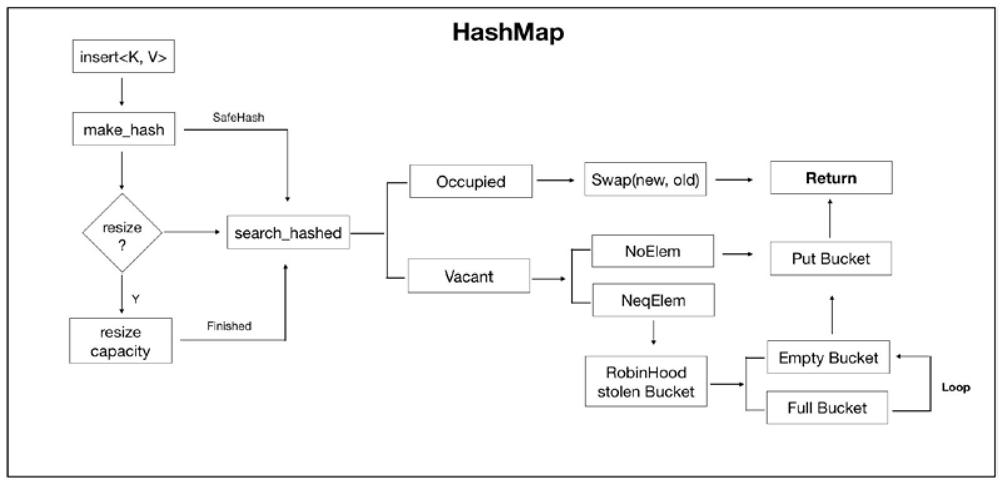{.u53894}

图8-10：Rust标准库中HashMap实现思路示意图
:::

当调用HashMap的insert方法时，首先会通过make_hash方法，将传入的键生成Hash值，通过内部的特殊处理（为了防止冲突）生成 SafeHash。得到 Hash 值之后，通过 resize方法判断是否需要扩容，不管是否需要扩容，最终都会调用到search_hashed方法。

search_hashed方法需要三个参数：HashMap的内部table指针、SafeHash和用于指定检索条件的FnMut（&K）-＞ bool闭包。该方法是按线性探测来寻找桶的，如果找到的是"空桶（Vacant）"，则直接返回。在内部，有两种类型的桶被认为是空桶，即NoElem和NeqElem，分别表示底层数组索引未被占用的桶和索引被占用但是可以被替换的桶。代码清单8-61展示了VacentEntryState内部定义。

**代码清单8-61：VacentEntryState内部定义**

::: center
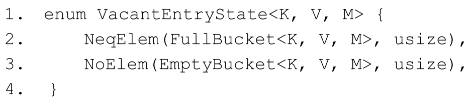{.u53893}
:::

从代码清单8-61中可以看出，NeqElem是对FullBucket的包装，NoElem是对EmptyBucket的包装，这两种桶类型分别代表底层被占用的桶和空桶。对于底层的桶只有占用和空两种状态，而通过VacantEntryState包装之后，空桶（Vacant）就多了一层语义：真正的空桶和值随时可以被替换的桶。其实在此处也体现了Rust中Enum枚举体的方便性。

如果在线性探测过程中找到的是 EmptyBucket，那么就将其包装为 NoElem 返回，然后就可以调用NoElem的insert方法将值直接插入。如果此时返回的是FullBucket，那么需要判断其探测次数是否比当前要插入的键值对的探测次数少，如果少，则将此桶中的值包装为NeqElem并返回。

对于NeqElem，其包含的是当前FullBucket中存储的值，Rust内部会使用robin_hood方法用新的值将其替换掉。替换掉的值当然不能扔掉，而要再次通过线性探测为其找到新的位置。在robin_hood方法内部通过两个嵌套的loop循环来保证新值和替换掉的值均被存储到合适的桶中。

如果探测次数不满足要求，那么比对 FullBucket 中存储的值的 Hash 值是否和search_hashed 方法传入的 Hash 值相匹配，如果匹配，则再比对存储的键是否和传入的键一致，如果一致就返回"满桶（Occupied）"。满桶（Occupied）是指最终查找到的和指定键一一对应的桶。如果是insert操作，则其内部会调用std：：mem：：swap方法用新值替换掉旧值。如果是get操作，则返回该桶中保存的值。

以上就是HashMap的整个实现思路。前面提到过，开放定址法的一个缺点是根据指定的键删除键值对比较复杂，因为并不能真的删除，否则会破坏寻址的正确性，但是Rust很轻松地解决了这个问题。

当使用HashMap的remove方法删除键值对时，同样需要将传入的键通过Hash函数计算出Hash值，然后经过search_hashed方法的检索，返回满桶（如果没有找到则返回None），再调用内部的 pop_internal 方法对桶进行删除处理。但这个删除并非真正的删除，而是通过gap_peek方法返回一个枚举类型GapThenFull，如代码清单8-62所示。

**代码清单8-62：GapThenFull枚举体示意**

::: center
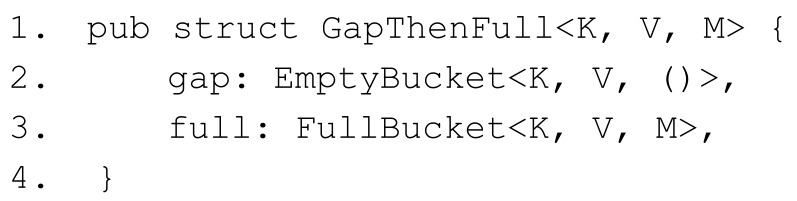{.u53892}
:::

使用GapThenFull枚举体来表示内部桶的两种状态，就完美地解决了remove的问题。此处也体现了Enum的强大之处。

在了解了 HashMap 的各种使用方法及其实现原理之后，有一点需要注意，在使用HashMap时，如果要合并两个或多个HashMap，则尽量使用extend或其他迭代器适配器方式，而不要用for循环来插入，否则会带来性能问题。

## 8.3 理解容量 {#text00014.html#Aedb70137-a112-447f-b061-d32bcebeae0d .title-left}

无论是 Vec 还是HashMap，使用这些集合容器类型，最重要的是理解容量（Capacity）和大小（Size/Len）的区别，如图8-11所示。

::: center
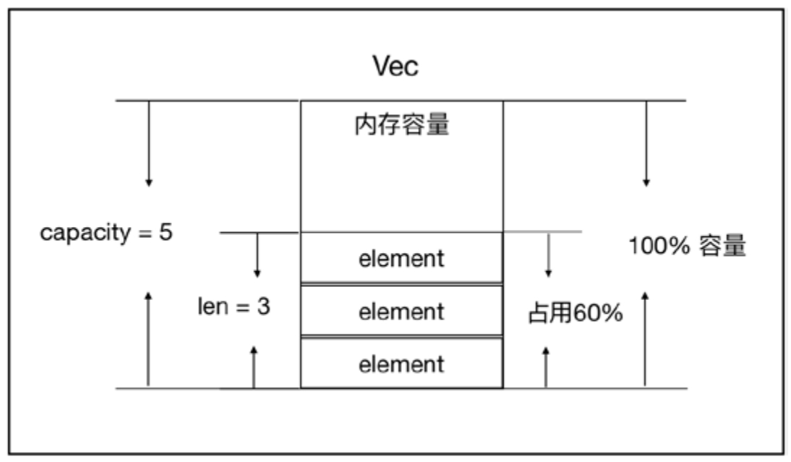{.u53891}

图8-11：容量和大小的区别
:::

从图8-11中可以看出，容量是指为集合容器分配的内存容量，而大小是指该集合中包含的元素数量。也就是说，容量和内存分配有关系，大小只是衡量该集合容器中包含的元素。当容量满了之后，这些集合容器都会自动扩容。但是对于不同的集合容器，定义容量**满** 或**空** 两种状态是不同的。如果搞不清楚这个问题，就可能会写出有安全漏洞的代码，即便是Rust这种号称内存安全的语言，也无法避免这种逻辑上的漏洞。

在Rust 1.21到1.3中，VecDeque集合类型中的reserve方法暴露了一个缓冲区溢出漏洞 ^[\[1\]](#text00014.html#n94840138219F46D092ADCCB1AC309D32){#text00014.html#n94840138219F46D092ADCCB1AC309D32s}^ ，允许任意代码执行。就是这样的逻辑漏洞，本质原因就是搞错了容量。

Rust的**VecDeque＜T＞** 是一种可增长容量的双端队列（Double-Ended Queue），具体用法在第2章中介绍过。其内部主要维护一个**环形缓冲区** （**Ring Buffer** ），如图8-12所示。

::: center
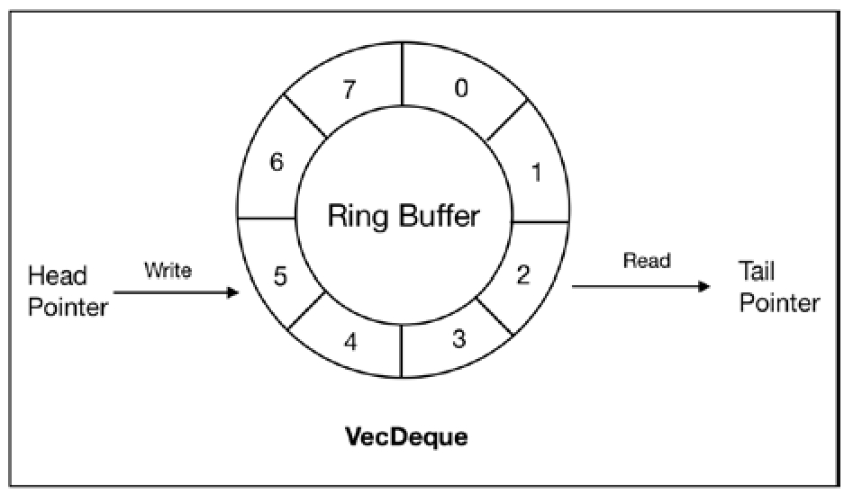{.u53890}

图8-12：VecDeque中环形缓冲区示意图
:::

该环形缓冲区由两个指针和一个可增长数组组成。这两个指针分别为**头指针（Head Pointer）** 和**尾指针（Tail Pointer）** 。其中头指针永远指向应该写入数据的位置，而尾指针永远指向可以读取的第一个元素。

以图8-12为例，环形缓冲区为空时，两个指针都指向位置0。当有新元素插入时，如果直接插入位置0，则将用于写入数据的Head指针指向位置1，而用于读取数据的Tail指针依旧指向位置0。依此类推，当插入第8个元素时，Head和Tail指针将再次重叠。那么在这种情况下，该如何区分头和尾？如果这时继续给缓冲区添加新元素，那么位置0处的数据将被其他数据覆盖，这就会造成**缓冲区溢出攻击** 。所以，为了避免这种情况，需要空出一个位置，不能插入元素，这样才可以区分头和尾。

在Rust中VecDeque＜T＞也是按这种思路来实现环形缓冲区的。在创建新的缓冲区时，自动保留一位，如代码清单8-63所示。

**代码清单8-63：VecDeque＜T＞中的with_capacity方法源码**

::: center
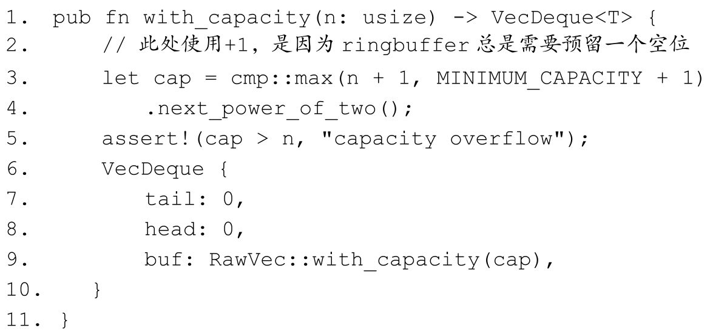{.u53889}
:::

代码清单8-63展示了VecDeque＜T＞中with_capacity方法的源码，注意代码第2行的注释，在初始化容量cap时，就已经考虑了至少保留一个空位的问题。

代码第3行，使用了一种特别的算法来计算要分配的容量。该算法就是next_power_of_two方法，表示要分配的容量必须大于或等于容量数*n* 的最小二次幂，比如传入的*n* 为2，则分配容量为 4。这是一种出于安全考虑的优化，如果传入的容量数溢出，则容量值会返回 0，也就是不预分配内容。

所以，要判断环形缓冲区是否为满状态，就必须看容量和大小的差是否为 1，如代码清单8-64所示。

**代码清单8-64：VecDeque＜T＞中的is_full方法源码**

::: center
{.u53888}
:::

代码清单8-64 展示了 VecDeque＜T＞中is_full 方法的源码，该方法用于判断容器是否为满状态。可以看出，该方法满足预期要求。

接下来看看曝出CVE的原始代码，如代码清单8-65所示。

**代码清单8-65：VecDeque＜T＞中出现安全漏洞代码**

::: center
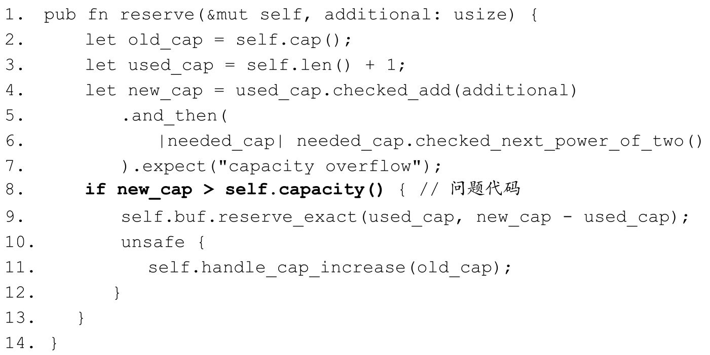{.u53887}
:::

代码清单8-65展示了出现安全漏洞代码的reserve方法。该方法一般用来为集合容器生成指定的更多的容量，这样可以避免容器频繁扩容。但是该方法的第8行犯了一个致命的错误。

代码第8行使用了capacity方法来判断容量。但是在VecDeque＜T＞中，capacity方法用于给开发者展示可用的逻辑容量，而cap方法展示的才是真正的物理容量，它们之间的关系是**cap=capacity+1** ，因为环形缓冲区必须保留一个空位。所以，这里使用capacity方法判断容量会导致容量分配少一位。如果容量少分配一位，那么在读写数据的过程中，指针还是按cap 表示的真实容量来计算，最终的后果就是本来空出的一位，也被写入了数据。这样就出现了本节开始提到的情况，指针错乱。在这种情况下，如果再写入新的数据，就会产生缓冲区溢出攻击的风险。

这个漏洞修复起来也很简单，只需要将第8行改成"if new_cap＞old_cap{"即可。其中old_cap才是真实的容量。

通过这个案例我们了解到，容量不仅仅是指"物理"上的内存容量，还包括由相应数据结构特性产生的"逻辑"容量。在日常开发中，需要注意这种情况，避免引入逻辑漏洞。

## 8.4 小结 {#text00014.html#Adef9013a-69fe-4313-bf9c-26c5738f0b92 .title-left}

字符串是一门编程语言必不可少的类型，Rust出于内存安全的考虑，将字符串划分为几种相互配对的类型，其中最常用的是&str和String类型的字符串。&str代表的是不可变的字符串，这里不可变的意思是指，这种类型的字符串是一个不可变的整体，无法对其中的单个字符进行任意操作（引起整个字符串发生变化）。&str 类型的字符串可以被存储在栈上，也可以被存储在堆上，还可以被存储在静态区域。而String代表的是可变的字符串，其只能被存储在堆上。可变是指String字符串中的单个字符可以随时被增、删、改。

在对Rust中的字符和字符串进行操作时，最好按字符来进行操作，因为Rust中的字符串内部存储的都是UTF-8字节序列，如果按字节进行操作，那么在某些情况下会出现问题。并且字符串也不支持按索引来访问其中的字符，如果要操作字符串中的字符，则需要使用迭代的方式。

不管是什么类型的字符串，都支持标准库中提供的字符串检索匹配方法，只要实现了Pattern＜＇a＞的类型，就均可作为匹配参数。比较常用的方法有contains、trim、trim_matches、matches、find等。因为Rust并没有内置正则表达式引擎，所以使用这些字符串匹配方法也是一种选择。在实际项目开发中，可以使用官方提供的正则表达式引擎 regex 包来支持正则匹配。

实际上，&str和String均为动态大小类型（DST）。字符串切片&str和数组切片是类似的，String是对Vec＜u8＞的包装。所以，字符串的某些方法和数组类型（array和Vector，以及slice）是通用的，比如with_capacity，不管是String字符串还是Vector数组，均可通过此方法来预分配堆内存。但是数组也有其独有的方法，比如实现了Index，可以按索引访问数组中的值。Rust标准库也为数组提供了方便、高效的排序和检索方法。

除数组之外，本章还重点介绍了HashMap类型。在Rust中，只有实现了Eq和Hash的类型才可以当作HashMap的键，所以浮点数无法直接作为HashMap的键。但是不妨碍开发者通过NewType模式对浮点数进行包装来实现将其作为键。

HashMap只实现了Index，而没有实现IndexMut，所以只能用索引语法查找键值对，而无法插入或修改键值对。但是Rust标准库另外提供了Entry模式来帮助开发者方便操作键值对。如果需要合并HashMap，则可以使用extend或其他迭代器适配器来完成，尽量不要使用for循环将一个HashMap插入另一个中。

本章介绍了HashMap的内部实现。我们知道Rust使用开放定址法来解决Hash冲突，并使用罗宾汉算法来解决聚集问题。当负载因子达到0.9的时候，HashMap会自动扩容，以保证容纳更多的键值对。通过了解HashMap的内部实现，我们可以学习到一些实用的开发技巧，比如利用Enum来解决remove键值对的问题。

本章最后还分析了VecDeque＜T＞中reserve方法曝出的CVE漏洞，主要原因是混用了"物理"容量和"逻辑"容量。这个案例说明了一个问题：Rust虽然可以保证内存安全，但无法保证逻辑安全。这是需要每个Rust开发者注意的地方。

在std：：collection中还提供了很多其他集合类型，比如 LinkedList＜T＞、BinaryHeap＜T＞、BTreeMap＜T＞、HashSet＜T＞和 BTreeSet＜T＞。限于篇幅，本章没有对它们做过多的介绍，但Rust是非常注重一致性的语言，在这些集合类型操作方法的命名上，和Vec＜T＞或HashMap＜K，V＞都是一致的，可以通过查阅标准库文档自行学习理解。总的来说，Rust实现的这些集合类型及其相关操作方法，都是从高性能和节省内存方向来考虑的，毕竟Rust的目标之一是系统级语言。Rust还在不断的进化中，标准库提供的这些集合类型还未达到最优，在不久的将来，它们会更加完善。

------------------------------------------------------------------------

[\[1\]](#text00014.html#n94840138219F46D092ADCCB1AC309D32s){#text00014.html#n94840138219F46D092ADCCB1AC309D32} CVE-2018-1000657.

[]{#text00015.html}
