# 第9章 构建健壮的程序 {#text00015.html#A1042f0df-cd73-4112-891c-8e5756dc2411 .title-left}

每个人都有错，但只有愚者才会执迷不悟。

一个人，在经历挫折之时，可以反思错误，然后坚强面对；一栋大楼，在地震来临之际，可以吸收震力，屹立不倒；一套软件系统，在异常出现之时，可以阻止崩溃，稳定运行。这就是健壮性。健壮性是指系统在一定的内外部因素的扰动下，仍然可以维持其结构和功能的稳定性。健壮性，是保证系统在异常和危险情况下生存的关键。

健壮性又叫鲁棒性（Robust）。鲁棒性是一个跨领域的术语，在建筑、机械、控制、经济和计算机领域均意味着系统的容错和恢复能力。现实中建筑的鲁棒性带来的后果是非常直观和致命的，鲁棒性差的建筑很可能会因为一些局部性意外而使得整个建筑垮塌，所以在建筑行业，鲁棒性是非常重要的标准之一。而在软件行业，鲁棒性差的系统虽然不会带来像建筑那样显而易见的灾难性后果，但随着人类生活对互联网的依赖程度越来越深，其带来的破坏力会越来越严重。

纵观软件开发的历史，为了保证软件的健壮性，各门语言所用的办法各有特色，但总归可以分为两大类：**返回错误值** 和**异常** 。

比如在C语言中，并不存在专门的异常处理机制，开发者只能通过返回值、goto、setjump、assert 断言等方式来处理程序中发生的错误，这些方式的优点是比较灵活，但是缺点更多。第一，这种错误并不是强制性检查的，很容易被开发者疏忽而进一步引起更多的问题，成为Bug的温床；第二，可读性差，错误处理代码和正常的功能代码交织在一起，有可能会让正常逻辑陷入混乱中，有人称之为"错误地狱"。

随着C++、Java等高级语言的发展，引入了语言级别的异常处理机制，才让开发者摆脱了"错误地狱"。异常处理机制利用**栈回退（Stack Unwind）** 或**栈回溯（Stack Backtrack）** 机制，自动处理异常，解放了开发者。异常处理的优点是它是全局且独立的，不需要所有的函数都考虑捕获异常，并且用专门的语法将异常处理逻辑和正常的功能逻辑清晰地分离开来。但是异常处理并不完美。首先，异常处理的开销比较大，尤其是在抛出异常时；其次，异常处理包含的信息太多，对于开发者来说，如何优雅高效地进行异常处理，又成为另一个难题。

Rust作为一门现代安全的系统级编程语言，如何构建健壮的程序是其必然要解决的问题之一，而工程性、安全性和性能是其必须要考虑的三重标准。

## 9.1 通用概念 {#text00015.html#A34d3013c-11d5-422f-80bc-14ede5eba42c .title-left}

在编程中遇到的非正常情况，大概可以分为三类：**失败（Failure）、错误（Error）** 和**异常（Exception）** 。

**失败** 是指违反了"契约"的行为。此处的"契约"用来表示满足程序正确运行的前提条件。比如一个函数在定义时规定必须传入某种类型的参数和返回某种类型的值，这就创建了一个契约，在调用该函数时，需要满足此"契约"才是程序正确运行的前提条件。

**错误** 是指在可能出现问题的地方出现了问题。比如建立一个HTTP连接时超时、打开一个不存在的文件或查询某些数据时返回了空。这些都是完全在意料之中，并且有办法解决的问题。而且这些问题通常都和具体的业务相关联。

**异常** 是指完全不可预料的问题。比如引用了空指针、访问了越界数组、除数为零等行为。这些问题是非业务相关的。

很多支持异常处理的语言，比如 C++、Java、Python 或 Ruby 等，并没有对上述三种情况做出语言级的区分。这就导致很多开发者在处理异常时把一切非正常情况都当作异常来处理，甚至把异常处理当作控制流程来使用。把一切非正常情况都当作异常来处理，不利于管理。在开发中很多错误需要在第一时间就暴露出来，才不至于传播到生产环境中进一步造成危害。有些开发者虽然对异常的三种情况做了不同的处理，比如对错误使用返回值的形式来处理、对真正的异常使用异常机制来处理，但是却并没有形成统一的标准；社区里只有最佳实践在口口相传，但并非强制性执行。

现代编程语言Go在语言层面上区分了异常（Panic）和错误，但是带来了巨大的争议。在Go语言中错误处理是强制性的，开发人员必须显式地处理错误，这就导致Go语言代码变得相当冗长，因为每次函数调用都需要 if 语句来判断是否出现错误。Go 语言错误处理的理念很好，但是具体实现却差强人意。Rust语言也区分了异常和错误，但相比于Go语言，Rust的错误处理机制就显得非常优雅。

## 9.2 消除失败 {#text00015.html#Ae419013d-2c4a-4934-bd7c-6c3900e28af8 .title-left}

Rust使用以下两种机制来消除失败：

· 强大的类型系统。

· 断言。

Rust是类型安全的语言，一切皆类型。Rust中的函数签名都显式地指定了类型，通过编译器的类型检查，就完全可以消除函数调用违反"契约"的情况，如代码清单9-1所示。

**代码清单9-1：依赖类型检查消除错误**

::: center
{.u53886}
:::

在代码清单9-1中定义的sum函数需要的参数类型为i32，而在main函数中传入的参数类型为u32，编译器在编译期就能检查出来这种违反"契约"的情况，报错如下：

::: center
{.u53885}
:::

编译器的错误提示也非常友好，明确地告诉开发者sum函数需要的是i32类型，但是发现了u32类型，类型不匹配。

仅仅依赖编译器的类型检查还不足以消除大部分失败，有些失败会发生在运行时。比如Vector 数组提供了一个 insert 方法，通过该方法可以为指定的索引位置插入值，如代码清单9-2所示。

**代码清单9-2：Vec＜T＞类型的insert方法使用示例**

::: center
{.u53884}
:::

在代码清单 9-2 中展示的 insert 方法的第一个参数为指定的索引位置，第二个参数为要插入的值。代码第3行和第5行，指定的索引位置是合法的，因为均小于待插入数组的长度。但是代码第7行会引发线程恐慌，因为给定的索引位置并不存在，超过了数组的长度。

对于代码第7行所示的这种情况，通过类型检查是无法判断的，因为无法预先知道开发者会指定什么索引。这时就需要使用**断言（Assert）** 。Rust标准库中一共提供了以下六个常用的断言：

· assert！，用于断言布尔表达式在运行时一定返回true。

· assert_eq！，用于断言两个表达式是否相等（使用PartialEq）。

· assert_ne！，用于断言两个表达式是否不相等（使用PartialEq）。

· debug_assert！，等价于assert！，只能用于调试模式。

· debug_assert_eq！，等价于assert_eq！，只能用于调试模式。

· debug_assert_ne！，等价于assert_ne！，只能用于调试模式。

以上六个断言都是宏。assert系列宏在调试（Debug）和发布（Release）模式下均可用，并且不能被禁用。debug_assert系列宏只在调试模式下起作用。在使用断言时，要注意具体的场合是否一定需要 assert 系列宏，因为断言的性能开销不可忽略，请尽量使用 debug_assert系列宏。

所以，对于代码清单9-2中用到的insert方法，可以使用assert！断言来消除可能指定非法索引而造成插入失败的情况，如代码清单9-3所示。

**代码清单9-3：在insert方法中使用assert！断言**

::: center
{.u53883}
:::

代码清单9-3展示了部分Vec＜T＞类型的insert方法源码。注意代码第3行，使用assert！断言来判断指定的索引index一定小于或等于数组的长度len，如果传入了超过len的索引值，则该判断表达式会返回false，此时assert！就会引发线程恐慌。

引发线程恐慌算消除失败吗？这其实是一种**快速失败（Fast Fail）** 的策略，这样做可以让开发中的错误尽早地暴露出来，使得Bug无处藏身。所以assert系列宏也支持自定义错误消息，如代码清单9-4所示。

**代码清单9-4：自定义错误消息**

::: center
{.u53882}
:::

在代码清单9-4中，代码第3行和第5行均会引发线程恐慌，但是在线程恐慌的时候会输出指定的消息，便于开发者修正错误。

综上所述，通过断言可以对函数进行契约式的约束。所谓"契约"就是指可以确保程序正常运行的条件，一旦"契约"被毁，就意味着程序出了Bug。程序运行的条件大概可以分为以下三类。

· **前置条件** ：代码执行之前必须具备的特性。

· **后置条件** ：代码执行之后必须具备的特性。

· **前后不变** ：代码执行前后不能变化的特性。

在日常开发中，如果必要的话，则可以依据这三类情况来设置断言。

除断言之外，还可以直接通过 panic！宏来制造线程恐慌，其实在 assert 系列宏内部也使用了 panic！宏。那么什么时候使用呢？其实还是遵循快速失败的原则，在处理某些在运行时绝不允许或绝不可能发生的情况时，可以使用panic！宏。

## 9.3 分层处理错误 {#text00015.html#A80cd013f-4dfb-4f98-82c7-560900e1254e .title-left}

Rust提供了分层式错误处理方案：

· **Option＜T＞** ，用于处理**有** 和**无** 的情况。比如在HashMap中指定一个键，但不存在对应的值，此时应返回None，开发者应该对None进行相应的处理，而不是直接引发线程恐慌。

· **Result＜T，E＞** ，用于处理可以合理解决的问题。比如文件没有找到、权限被拒绝、字符串解析出错等错误。

· **线程恐慌（Panic）** ，用于处理无法合理解决的问题。比如为不存在的索引插值，就必须引发线程恐慌。需要注意的是，如果在主线程中引发了线程恐慌，则会造成应用程序以非零退出码退出进程，也就是发生崩溃。

· **程序中止（Abort）** ，用于处理会发生灾难性后果的情况，使用 abort 函数可以将进程正常中止。

Rust的错误处理方案来源于函数式语言（比如Haskell），不仅仅区分了错误和异常，而且将错误更进一步区分为Option＜T＞和Result＜T，E＞。使用和类型Enum，使得基于返回值的错误处理粒度更细、更加优雅。在Rust中，线程发生恐慌就是异常。

### 9.3.1 可选值Option＜T＞ {#text00015.html#A21460140-3eba-4440-a6c7-7b3a1a14c804 .title-left}

Option＜T＞类型属于枚举体，包括两个可选的变体：**Some（T）** 和**None** 。作为可选值，Option＜T＞可以被使用在多种场景中。比如可选的结构体、可选的函数参数、可选的结构体字段、可空的指针、占位（如在HashMap实现中解决remove问题）等。

Option＜T＞类型在日常开发中非常常见，它基本上消除了空指针问题，如代码清单9-5所示。

**代码清单9-5：Option＜T＞使用示例**

::: center
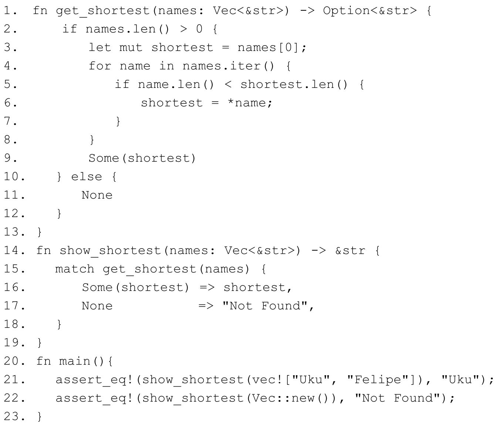{.u53881}
:::

在代码清单9-5中定义了get_shortest函数，传入Vec＜&str＞数组，得到其中长度最短的字符串。在实现该函数时，需要考虑：如果传入的是空数组怎么办？有多种处理方式。第一，判断是否为空，如果为空则不处理，或者直接引发线程恐慌；第二，使用 Option＜T＞，空数组返回None，非空数组返回Some。显然第二种处理方式好过第一种，因为对于这种问题，不处理显得函数行为不统一，引发线程恐慌则显得小题大做。所以，get_shortest函数最终返回Option＜&str＞类型。

代码第14～19行，定义了show_shortest方法，内部调用get_shortest，并使用match匹配来处理该函数返回的Option＜&str＞。如果是Some，则返回其内部的字符串；如果是None，则返回固定的字符串"Not Found"。这样在main函数中调用show_shortest方法时，则可以得到预料中的结果。

**unwrap系列方法**

看得出来，在代码清单 9-5 中使用 Option＜T＞保证了代码的基本健壮性。除使用 match匹配之外，标准库中还提供了unwarp系列方法，如代码清单9-6所示。

**代码清单9-6：使用unwrap系列方法**

::: center
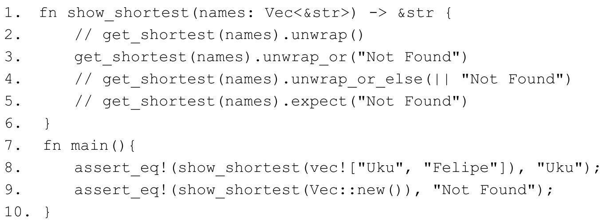{.u53880}
:::

在代码清单9-6中展示了unwrap、unwrap_or和unwrap_or_else三个方法。其中unwrap方法可以取出包含于 Some 内部的值，但是遇到 None 就会引发线程恐慌。所以，当show_shortest函数传入空数组时，代码第2行所示的写法会引发线程恐慌。

代码第3行使用的unwrap_or方法实际上是对match匹配包装的语法糖，该方法可以指定处理None时返回的值。该行指定了字符串"Not Found"，最终效果等价于代码清单9-5。

代码第 4 行使用的 unwrap_or_else 方法和 unwrap_or 类似，只不过它的参数是一个FnOnce（）-＞T闭包。

代码第5行展示了expect方法，该方法会在遇到None值时引发线程恐慌，并可通过传入参数来展示指定的异常消息。

在日常开发中可以根据具体的需求选择适合的unwrap系列方法。unwrap方法适合在开发过程中快速失败，提早暴露 Bug，如果要自定义异常消息，则可以使用 expect。对于明显需要处理None的情况，则可以直接使用match，但是使用unwrap_or或unwrap_or_else可以让代码更加简洁。

**高效处理Option＜T＞**

在大多数情况下，需要使用 Option＜T＞中包含的值进行计算，有时候只需要单步计算，有时候则需要连续多步计算。如果把Option＜T＞中的值通过unwrap取出来再去参与计算，则会多出很多校验代码，比如判断是否为None值。如果使用match 方法，则代码显得比较冗余，如代码清单9-7所示。

**代码清单9-7：使用match匹配来操作Option＜T＞**

::: center
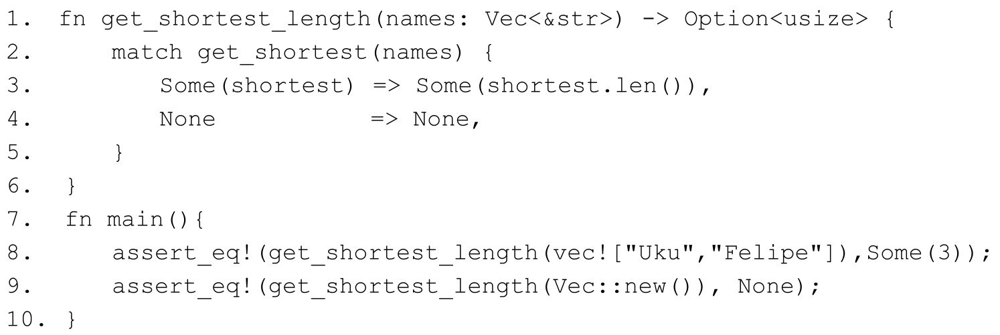{.u53879}
:::

在代码清单9-7中定义了get_shortest_length方法，用来获取数组中最短字符串的长度。代码第2行，通过match匹配get_shortest方法返回的Option＜&str＞来进行计算，如果是Some，则调用内部值shortest的len方法得到长度，然后再用Some将其包装并返回；如果是None，则继续返回None。使用match来处理也保证了健壮性，但是代码看上去显得非常冗余。在标准库std：：option模块中，还提供了map系列方法来改善这种情况，如代码清单9-8所示。

**代码清单9-8：使用map来操作Option＜T＞**

::: center
{.u53878}
:::

在代码清单9-8中使用了map方法，相比于代码清单9-7中的写法，代码瞬间变得更加简洁。实际上，map方法是对match匹配的包装，其具体实现如代码清单9-9所示。

**代码清单9-9：std：：option：：Option：：map方法的具体实现**

::: center
{.u53877}
:::

从代码清单9-9中可以看出，map是一个泛型方法，内部是一个match匹配，对于Some和None分别做了相应的处理，并且该方法的参数为FnOnce（T）-＞U闭包。通过map方法就可以在无须取出Option＜T＞值的情况下，方便地在Option＜T＞内部进行计算。像map这样的方法，叫作组合子（Combinator）。

除map方法之外，还有map_or和map_or_else方法，它们跟map方法类似，都是对match的包装，不同的地方在于，它们可以为 None 指定默认值（回想一下 unwrap_or 和unwrap_or_else）。

在有些情况下，只靠map方法还不足以满足需要。比如对Option＜T＞中的T进行处理的函数返回的也是一个Option＜T＞，如果此时用map，就会多包装一层Some。假如现在要对一个浮点数进行一系列计算，提供的计算函数包括：**inverse** （**符号取反** ）、**double** （**加倍** ）、**log** （**求以 2 为底的对数** ）、**square** （**平方** ）、**sqrt** （**开方** ）。在这些计算函数中，求对数和开方的计算有可能出现异常值，比如对负数求对数和开方都会出现**NaN** ，所以这两个计算函数的返回值一定是Option＜T＞类型，如代码清单9-10所示。

**代码清单9-10：map和and_then共用示例**

::: center
{.u53876}
:::

::: center
{.u53875}
:::

在代码清单9-10中，代码第1～9行，分别定义了double、square和inverse函数，返回值都是f64类型，因为这些计算产生的值只可能是唯一的结果。

代码第10～21行定义的log和sqrt函数，返回值都为Option＜f64＞类型，这是因为求对数和开方有可能产生NaN。在这两个函数中分别调用标准库中提供的log2和sqrt方法来计算，并通过is_normal来判断是否为合法的浮点数，如果合法则返回Some，否则返回None。

在main函数中声明了浮点数number，并通过Option：：from方法将其转换为Some（number）进行计算。如代码第25行所示，可以通过map组合子方法将double、square和inverse函数组成链式调用，而不需要从Some＜number＞中将number取出来进行计算。但是当求对数和开方时，使用map就不方便了。返回map的定义，如果此处使用map，那么求对数的结果会被包装两层 Some，变成 Some（Some（number））的形式，如果再进行开方操作，则又会被包装为Some（Some（Some（number）））的形式，这就变得复杂了。所以，标准库中提供了另外一个组合子方法and_then来解决这个问题。

代码第26行所示，使用and_then来处理log和sqrt，就可以和map组合子正常配合使用，最后输出正常的结果。当把第23行number的值改为负数，则会输出"This failed."。

代码清单9-11展示了and_then组合子方法的实现。

**代码清单9-11：and_then组合子方法的实现**

::: center
{.u53874}
:::

在代码清单9-11中展示的and_then方法和map方法的区别在于，代码第5行匹配Some时，and_then方法的返回值并不像map方法那样包装了一层Some。

除 map 和 and_then 之外，标准库中还提供了其他组合子方法，用于高效、方便地处理Option＜T＞的各种情况。限于篇幅，这里不再一一介绍，读者可自行查看标准库文档。

### 9.3.2 错误处理Result＜T，E＞ {#text00015.html#A80c90144-ba84-4f32-9e74-4cad6e8d8702 .title-left}

Option＜T＞解决的是**有** 和**无** 的问题，它在一定程度上消灭了空指针，保证了内存安全。但使用Option＜T＞实际上并不算错误处理。Rust专门提供了Result＜T，E＞来进行错误处理，和Option＜T＞相似，均为枚举类型，但Result＜T，E＞更关注的是编程中可以合理解决的错误。从语义上看，Option＜T＞可以被看作是忽略了错误类型的Result＜T，（）＞，所以有时候它们也是可以相互转换的。

代码清单9-12展示了Result＜T，E＞的定义。

**代码清单9-12：Result＜T，E＞定义**

::: center
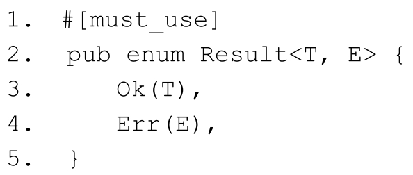{.u53873}
:::

从代码清单9-12中可以看出，Result＜T，E＞枚举体包含两个变体：Ok（T）和Err（E），其中Ok（T）表示正常情况下的返回值，Err（E）表示发生错误时返回的错误值。其中**＃\[must_use\]** 属性表示，如果对程序中的 Result＜T，E＞结果没有进行处理，则会发出警告来提示开发者必须处理相应的错误，有助于提升程序的健壮性。

代码清单9-13展示了使用parse方法把字符串解析为数字。

**代码清单9-13：使用parse方法将字符串解析为数字示例**

::: center
{.u53872}
:::

在代码清单9-13中，对于可以解析成数字的字符串，是可以正常解析的。如代码第2行和第3行所示。但是对于无法解析为数字的字符串，则会抛出错误。如代码第4行所示，字符串为字母，无法解析为数字，那么在代码第6行使用parse 方法解析之后，就会引发线程恐慌，并提示错误类型为**Err（ParseIntError{kind：InvalidDigit}）** ，其为标准库内置的错误类型，专门用于表示解析处理失败的错误，此处是指无效的数字（InvalidDigit）。

**高效处理Result＜T，E＞**

在标准库std：：result模块中，也为Result＜T，E＞实现了很多方法，比如unwrap系列方法。对于代码清单9-13中返回的解析错误，就可以使用unwrap_or方法指定一个默认值来解决，但并不优雅。其实std：：result模块中也提供了很多组合子方法，比如map和and_then等，其用法和Option＜T＞相似，使用组合子方法可以更加优雅地处理错误，如代码清单9-14所示。**代码清单9-14：解析字符串为数字错误处理示例**

::: center
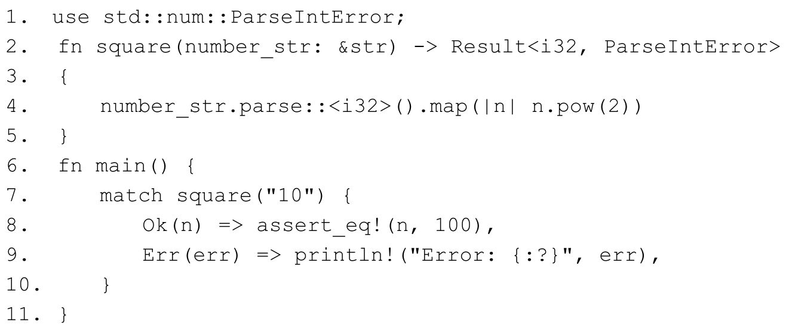{.u53871}
:::

在代码清单9-14中定义了square方法，传入字符串，然后通过parse泛型方法将其解析为i32类型，再使用map方法计算其值。因为parse方法返回的是Result类型，所以这里可以直接使用 map 方法。注意 square 函数的返回值为 Result＜i32，ParseIntError＞类型，其中ParseIntError是在std：：num模块中定义的，所以这里需要使用use引入。

在main函数中使用match匹配square函数的结果，如果是Ok（n），则返回正常的结果；如果是Err（err），则打印错误结果。

还可以使用type关键字定义类型别名来简化函数签名，如代码清单9-15所示。

**代码清单9-15：使用type关键字定义类型别名来简化函数签名**

::: center
{.u53870}
:::

在代码清单9-15中，代码第1行使用type关键字将Result＜T，ParseIntError＞定义为别名ParseResult＜T＞，这样在square函数中使用就显得十分简洁。

**处理不同类型的错误**

通过第 8 章我们了解到，使用 parse 方法将字符串解析为十进制数字，内部实际上是FromStr：：from_str方法的包装，并且其返回值为Result＜F，＜F as FromStr＞：：Err＞。对于u32类型实现的FromStr：：from_str来说，整个解析过程如下：

· 判断字符串是否为空。如果为空，则返回错误Err（ParseIntError{kind：Empty}）。

· 将字符串转换为字节数组，根据第一个字节判断是正数还是负数，并将符号位从字节数组中分离出去，只剩下数字。

· 循环分离符号位之后的字节数组，逐个用as转换为char类型，调用to_digit方法将字符转换为数字，并在循环中累加。循环完毕后，如果全部字符解析成功，则返回正常的结果；否则，返回错误Err（ParseIntError{kind：InvalidDigit}）。在循环过程中还需要计算是否超过了对应数字类型的最大范围，如果超过了就会返回错误Err（ParseIntError{kind：Overflow}）。

看得出来，一个看似简单的 parse 方法，其解析过程如此曲折，其间要抛出多种错误类型。但是对于Result＜T，E＞来说，最终只能返回一个Err类型，如果在方法中返回了不同的错误类型，编译就会报错。那么在parse方法内部是如何处理的呢？如代码清单9-16所示。

**代码清单9-16：ParseIntError源码**

::: center
{.u53869}
:::

代码清单9-16展示了ParseIntError的源码，可以看出，parse返回的其实是一个统一的类型ParseIntError。其内部成员是一个枚举类型IntErrorKind，其中根据解析过程中可能发生的情况定义了四个相应的变体作为具体的错误类型。这就解决了返回多种错误类型的问题。

在日常开发中，最容易出错的地方是I/O操作。所以在Rust标准库**std：：io** 模块中定义了**统一的错误类型Error** ，以便开发者能够方便地处理多种类型的I/O错误，如代码清单9-17所示。

**代码清单9-17：std：：io模块中的Error源码**

::: center
{.u53868}
:::

代码清单9-17展示了std：：io：：Error的源码。Error结构体只有一个成员repr，为Repr枚举类型。Repr枚举体包含了三个变体：Os（i32）、Simple（ErrorKind）和Custom（Box＜Custom＞），分别表示操作系统返回的错误码、一些内建的错误以及开发者自定义的错误。其中，在ErrorKind枚举体中根据日常开发中比较常见的场景抽象出了一些相应的错误变体。

下面通过一个具体的示例来看看在实际开发中如何进行错误处理。

假如有一个文件，文件的每一行都是一个数字，要求从此文件中读取每一行的数字并对它们求和。思路比较简单，就是直接读取该文件，并将读取到的每一行解析为相应的数字，再迭代求和，如代码清单9-18所示。

**代码清单9-18：从文件中读取数字并计算其和**

::: center
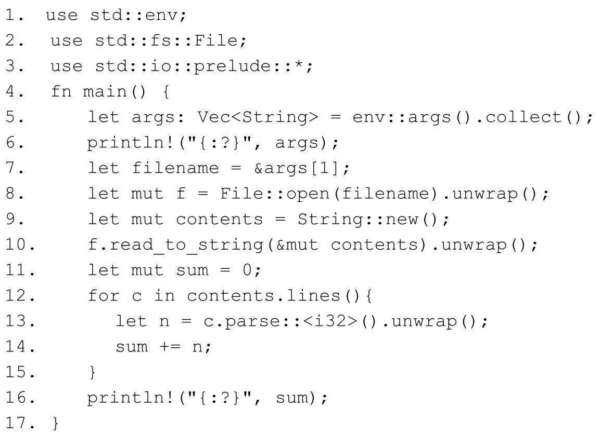{.u53867}
:::

代码清单9-18的思路是，从命令行中接收参数作为文件名，然后打开文件逐行读取。首先用到了std：：env：：args方法，通过该方法可以得到命令行中传入的参数，如代码第5行所示，将参数收集为一个Vec＜String＞类型的数组。代码第7行，获取命令行参数数组中索引为1的元素，就是文件名。这里需要注意，args中索引为0的元素是该程序本身的命名。

代码第8行，使用File：：open方法打开指定的文件，该方法会返回一个Result＜File，Error＞，这是因为有可能存在文件打开失败的情况，比如文件名不正确或者文件不存在等。但实际上在std：：io模块中已经使用type关键字为Result＜T，Error＞定义了别名Result＜T＞，所以该方法返回的类型就可以写为Result＜File＞。因此，这里需要调用unwarp方法来解开Result包装，得到其中的文件引用，以进行后续操作。

代码第9行和第10行，通过read_to_string方法将文件中的内容读取到一个可变字符串contents中。使用read_to_string方法从文件中读取内容也是有风险的，比如读取的内容不是一个合法的UTF-8字节，则读取出错。该方法会返回Result＜usize＞类型，其中usize表示读取到的文件内容总字节数。

代码第11～15行，对读取到的字符串中的内容进行迭代解析，并累加求和。这里解析也是存在风险的，万一文件中混入了无法解析为数字的字符，则会报错。

将该段代码命名为io_origin.rs，通过rustc进行编译，然后执行：

::: center
{.u53866}
:::

其中，io_origin为编译后的程序二进制文件，test_txt为要读取的文件，其每一行分别保存着1、2、3，所以代码执行结果为6。

假如在test_txt文件中加入一行汉字，执行代码时就会报出如下错误：

::: center
{.u53389}
:::

看得出来，错误消息显示了解析错误ParseIntError {kind：InvalidDigit}。可见，代码清单9-18的健壮性有很大问题。如果此时想顺利地对能正常解析出来的数字进行求和而不受新加入汉字的干扰，该如何处理错误？

办法之一是像I/O或parse方法内部实现那样，自定义统一的错误处理类型。办法之二是通过Rust提供的Error trait。标准库中提供的所有错误都实现了此trait，这意味着只要使用trait对象就可以统一错误类型。代码清单9-19展示了Error trait的定义。

**代码清单9-19：Error trait定义**

::: center
{.u53865}
:::

在代码清单9-19中定义了description和cause两个方法，分别表示错误的简短描述和导致错误发生的原因。所以实现该trait的错误类型，还必须同时实现Debug和Display。然后就可以使用Box＜Error＞或&Error来表示统一的错误类型了。

代码清单9-19还展示了为Box＜Error+＇a＞实现From trait，这意味着可以通过From：：from方法将一个实现了Error的错误类型方便地转换为Box＜Error＞。

现在来重构代码清单9-18，首先想到的一个问题是：如果要返回解析过程中的错误，该怎么处理？因为在Rust 2015版本中，main函数是没有返回值的（但是在Rust 2018中，main函数可以有返回值），所以需要把处理文件的代码独立到另外一个函数中，如代码清单 9-20所示。

**代码清单9-20：重构代码清单9-18，将处理文件代码独立到run函数中**

::: center
{.u53864}
:::

在代码清单9-20中，为了处理返回的错误，将之前main函数中处理文件的代码独立到run函数中。run函数会返回Result＜i32，Box＜Error＞＞类型，在main函数中做match匹配处理，如果是Err（e），则以退出码1退出主进程。

代码清单9-21展示了run函数的具体实现。

**代码清单9-21：run函数的具体实现**

::: center
{.u53863}
:::

在代码清单 9-21 中，run 函数的返回值是 Result＜i32，Box＜Error＞＞的别名ParseResult＜i32＞。在该函数中大量使用了组合子方法来处理错误。

代码第2行，File：：open方法会返回Result＜File＞，此时用map_err（\|e\|e.into（））来处理打开文件出错的情况。如果出错，则会通过into方法将错误转换为Box＜Error＞类型。前面提到过，标准库内部的错误都已经实现了 Error trait 和 From trait，可以将具体的错误类型转换为Box＜Error＞类型。注意这个类型转换，实际上是基于类型自动推导的，因为在函数签名中返回值类型是确定的。如果没有出错，则将正常的文件引用往后面传递。在运行该代码时，如果给了一个错误的文件参数，则会抛出错误。这是因为在 File：：open 方法内部的实现中，使用return向外抛出了错误，毕竟，如果连文件都没有正确读取，那么后续的步骤也就没有继续往下执行的必要了。

代码第 3～7 行，使用 and_then 组合子方法来处理由上一步 map_err 传递过来的Result＜File＞。代码第4行和第5行，跟之前一样，通过read_to_string方法将文件内容读取到字符串中。但是这个过程有风险，所以这里继续使用map_err来处理出错的情况，并在后面紧接了map组合子方法来向后传递正常读取到的字符串contents。

代码第8～20行，使用and_then组合子方法处理传递过来的字符串。此时需要遍历文件的每一行字符串，将其一一解析为合法的数字并相加。解析为数字的过程是有风险的，有可能出错，所以这里使用match匹配来分别处理正常和出错的情况。如果是正常解析，则将数字n累加到sum中；如果出错，则将错误转换为Box＜Error＞类型，并且通过调用其description和cause方法分别打印具体的错误信息和出错原因。

代码第21行，返回Ok（sum）。在main函数中得到处理。

需要注意的是，将字符串解析为数字默认处理Err（err）的情况，是不会返回错误类型的。所以在代码运行时，就算文件中有不合法的字符存在，该程序也可以正常处理合法的字符，将它们的值相加并返回，进程不会崩溃。

但是如果开发者对文件的管理比较严格，绝不允许混入任何非法字符，那么就需要在解析字符串时通过使用return关键字向上传播错误，如代码第18行所示。如果取消此行注释，将代码第13～17行注释掉，重新编译、运行之后会发现，在读取文件时，遇到非法字符就会解析到无效数字的报错信息，进程崩溃。但是这种写法和直接使用 unwrap 相比，其更加优雅，也可以方便地管理错误。

使用trait对象虽然方便，但它属于动态分发，在性能上弱于自定义统一的错误类型。现在继续对代码进行重构，使用自定义错误类型，如代码清单9-22所示。

**代码清单9-22：自定义错误类型CliError**

::: center
{.u53862}
:::

在代码清单 9-22 中创建了自定义错误类型 CliError，其包含两个自带数据的变体：Io（io：：Error）和Parse（num：：ParseIntError），分别表示I/O错误和解析错误，并为CliError实现了Display和Error。

注意代码第32行，在type定义别名ParseResult＜i32＞时，将之前的Box＜Error＞错误类型转换为CliError。

继续重构代码。main函数不需要改变，run函数同样需要将之前的Box＜Error＞错误类型改为CliError，如代码清单9-23所示。

**代码清单9-23：修改run函数，使用CliError**

::: center
{.u53861}
:::

代码清单9-23主要的变化是将Box＜Error＞转换为CliError，使得代码更加清晰、可读。代码第2行，map_err（\|e\|e.into（））被替换为map_err（CliError：：Io），除性能上有所改善之外，可读性也有了提高，可以直接看出这里处理的是I/O错误。

注意此处map_err方法接收的参数为闭包，但传递的却是枚举体，不要忘记带数据的枚举体实际上可以作为函数指针来使用。此处CliError：：Io相当于fn（io：：Error）-＞CliError函数指针。

代码第6行也做了同样的改变。

代码第14～17行，相应地改为CliError：：Parse（err），如果是解析出错的字符，则打印具体的错误信息和出错原因，但依旧不会向上返回错误。如果一定要返回错误，还是需要使用return的，如代码第18行所示。

最终返回Ok（sum），供main函数使用。通过这样的重构，代码的性能和可读性都有了提高。**那么是否还有进一步优化的空间** ？答案是肯定的。

Rust提供了一个**try！** 宏，通过它可以允许开发者简化处理Result错误的过程。代码清单9-24展示了try！宏的源码。

**代码清单9-24：try！宏的源码**

::: center
{.u53860}
:::

在代码清单9-24中，可以通过macro_rules！来定义一个宏，以符号"\$"开头的均为宏定义中可替换的变量，在第 12 章中会做更详细的介绍。此处大致可以看出，该宏会自动生成match 匹配 Result 的处理，并且会将错误通过 return 返回。注意代码第 6 行，通过调用From：：from方法转换错误类型。

接下来可以继续重构run函数，如代码清单9-25所示。

**代码清单9-25：使用try！宏重构run函数**

::: center
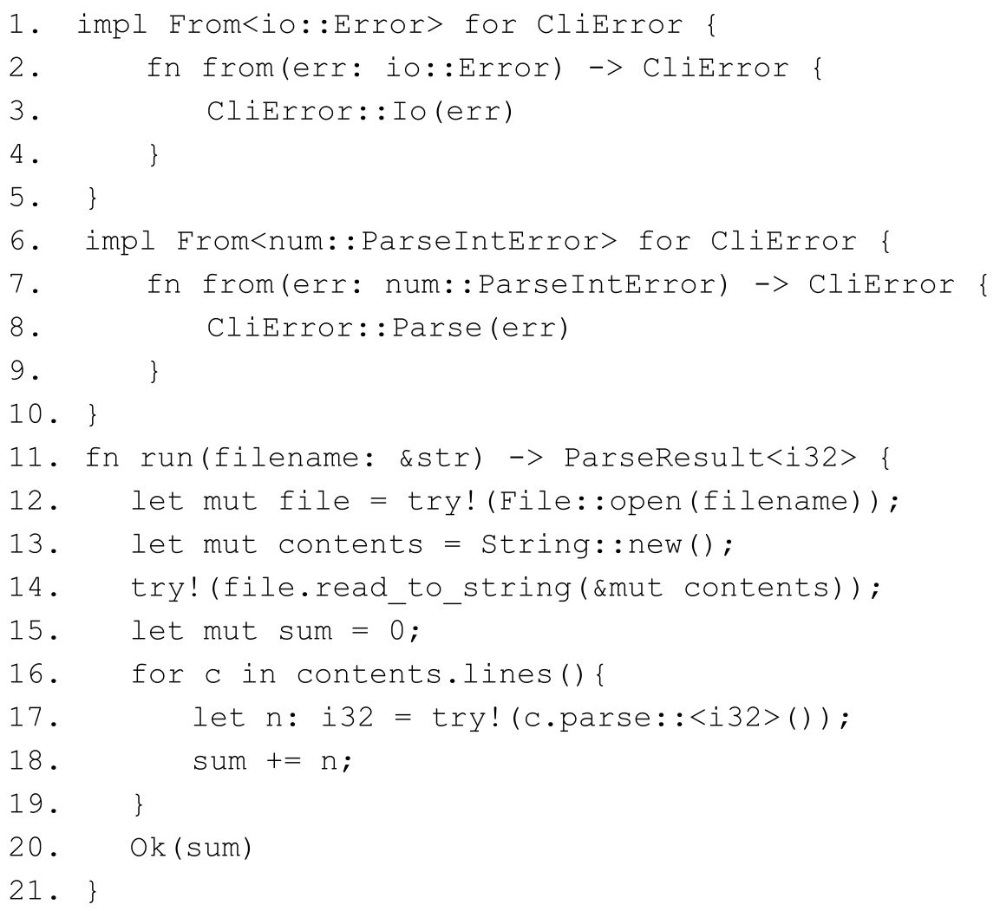{.u53859}
:::

在代码清单9-25中，代码第1～10行，为CliError实现了From转换函数，可以将io：：Error转换为 ClieError：：Io（err），将 num：：ParseIntError 转换为 CliError：：Parse（err），这样就可以使用try！宏了。

代码第12行，使用try！宏来包装File：：open，如果打开文件出错，则会返回错误。

代码第14行，使用try！宏包装了read_to_string方法，如果读取到非UTF-8的字节序列，则会返回错误。

代码第17行，使用try！宏包装了parse方法，如果解析到非法字符，则会返回错误。

使用 try！宏使代码进一步精简，尤其是代码第 17 行。这里值得注意的是，try！宏会将错误返回，传播到外部函数调用中，在具体的开发需求中要确定是否真的需要传播错误，而不要图省事而滥用try！。

**是否还可以继续精简代码** ？答案是肯定的。因为在日常开发中，使用 try！宏的问题是有可能造成多重嵌套，比如try！（try！（try！...））这种形式，非常影响代码的可读性。为了改善这种情况，Rust引入了一个语法糖，使用问号操作符"**？** "来代替try！宏。代码清单9-26展示了如何使用问号操作符重构之前的代码。

**代码清单9-26：使用问号操作符替代try！宏**

::: center
{.u53858}
:::

在代码清单9-26中使用问号操作符替代了try！宏，代码清晰了不少，提高了可读性。问号操作符被放到要处理错误的代码后面，这种写法更加凸显了程序的功能代码，从可读性上降低了错误处理的存在感，更加优雅。

**将Option＜T＞转换为Result＜T，E＞**

上面的一系列重构主要是针对run函数来改进错误处理的。但是在main函数中，还存在可以改进的空间，如代码清单9-27所示。

**代码清单9-27：在main函数中从命令行读取参数示例**

::: center
{.u53857}
:::

在代码清单9-27中，使用env：：args从命令行读取参数时，假如命令行没有传递参数，那么args中就只存在一个元素（二进制文件自己的文件名），执行到代码第2行就会抛出索引错误，引发main主线程崩溃。这是我们不希望发生的事情。

可以使用env：：args的nth方法来解决此问题，nth方法返回的是Option＜T＞类型，如代码清单9-28所示。

**代码清单9-28：使用nth方法重构main函数**

::: center
{.u53856}
:::

::: center
{.u53855}
:::

在代码清单 9-28 中，使用 nth 方法直接取参数中索引为 1 的值，就不需要显式地将env：：args转换为数组了。如果有参数，则会返回Some（String）；如果未传递参数，则返回None。此时filename为Option＜String＞类型，将filename传入run函数中。

相应地，run函数也需要做出改变，如代码清单9-29所示。

**代码清单9-29：重构相关代码**

::: center
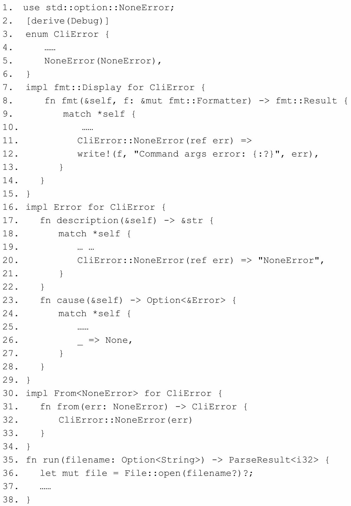{.u53854}
:::

在代码清单9-29中只展示了修改代码，其余的代码则不变。完整代码可以查看随书源码。

代码第35行，将run函数的参数类型修改为Option＜String＞，然后在代码第36行中，继续使用问号操作符。注意此时filename为Option＜String＞类型，但是问号语法糖（try！宏）会自动将Option＜String＞转换为Result＜T，NoneError＞类型，并自动匹配。

注意，如果想让Option＜String＞支持问号语法糖，那么必须得实现From允许NoneError转换为CliError，如代码第30～34行所示。

代码第3～29行，在之前CliError的基础上，增加了NoneErr（NoneError）变体，所以需要使用use引入std：：option：：NoneError。同时修改实现Display和Error中match匹配CliError的相关代码，因为match必须穷尽所有可能。但要注意，std：：option：：NoneError并没有实现Error trait。

鉴于目前让 Option＜T＞类型支持问号语法糖还属于**实验特性** ，所以需要在整个代码文件的顶部添加**＃！\[feature（try_trait）\]** 特性。然后整个代码就可以运行了，如果在命令行中没有指定文件名，则会抛出指定的错误信息。

**main函数返回Result**

在Rust 2018 版本中，允许main函数返回Result＜T，E＞来传播错误。继续在代码清单9-29的基础上对main函数进行重构，如代码清单9-30所示。

**代码清单9-30：重构main函数，基于Rust 2018版本**

::: center
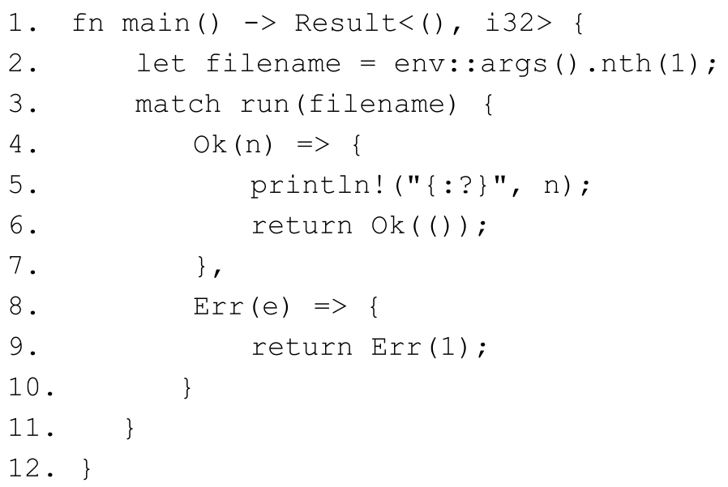{.u53853}
:::

在代码清单9-30中，让main函数返回Result＜（），i32＞类型。针对该示例，返回单元类型"（）"是因为当前有一个限制，必须实现**std：：process：：Terminatio** n这个trait才可以作为main函数的Result＜T，E＞返回类型。当前只有单元类型、数字、bool、字符串、never类型等实现了该trait。

代码清单9-30编译之后，在终端执行以下命令：

::: center
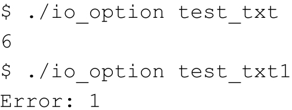{.u53852}
:::

当正确读取文件时，将正常输出结果6。而当文件指定错误时，则会返回错误退出码1，与预期的一致。

目前该特性还在逐步完善中，在不久的将来，在main函数的Result＜T，E＞中应该可以允许使用更多的类型。

**问号语法糖相关trait**

和问号语法糖相关的trait是std：：ops：：Try，代码清单9-30展示了其定义。

**代码清单9-31：std：：ops：：Try 定义**

::: center
{.u53851}
:::

在代码清单 9-31 中，在 Try trait 中定义了两个关联类型 Ok 和 Error，以及三个方法into_result、from_error 和 from_ok。我们看一下为 Option＜T＞实现 Try 的源码，如代码清单9-32所示。

**代码清单9-32：为Option＜T＞实现std：：ops：：Try 的源码**

::: center
{.u53850}
:::

从代码清单 9-32 中可以看出，在 into_result 方法中通过 ok_or 将 Option＜T＞转换为Result＜T，NoneError＞。而 from_ok 和 from_error 则可以从 Result＜T，NoneError＞中得到Option＜T＞。

## 9.4 恐慌（Panic） {#text00015.html#Af9b70150-8c2d-42da-9546-b2bde4777d7f .title-left}

对于Rust来说，无法合理处理的情况就必须引发恐慌。比如，使用thread：：spawn无法创建线程只能产生恐慌，也许是平台内存用尽之类的原因，在这种情况下 Result＜T，E＞已经无用。

Rust的恐慌本质上（底层的实现机制）相当于C++异常。C++支持通过throw抛出异常，也可以使用try/catch来捕获异常，但是如果使用不当，就会引起内存不安全的问题，从而造成Bug或比较严重的安全漏洞。使用C++写代码，需要开发人员来保证**异常安全（Exception Safety）** 。

为什么抛出异常有可能产生内存不安全的问题呢？这其实很容易理解。可以想象一个函数，如果执行了一半，突然抛出了异常，那么会发生什么？函数提前返回，异常发生点之后的代码也许就永远不会被调用到，有可能造成资源泄漏和数据结构恶化（比如合法指针变成了悬垂指针）。这就是异常不安全。

异常安全的代码要求就是不能在异常抛出时造成资源泄漏和数据结构恶化。现代C++使用RAII 可以解决此问题，在异常抛出时，利用**栈回退** （**Stack Unwind** ）机制来确保在栈内构造的局部变量或指针的析构函数都可以被一一调用。这样就可以保证异常安全。而对于Rust语言，其底层也是基于 RAII 机制来管理资源的，在恐慌发生之后，同样会利用栈回退机制触发局部变量的析构函数来保证异常安全。Rust和C++的不同点在于，Rust中的一切都是编译器可以保证的；而C++要靠开发者自己来保证，如果开发者没有使用RAII，那么就有可能导致异常不安全。

在Rust中，使用**恐慌安全（Panic Safety）** 来代替异常安全的说法。虽然在Rust中可以保证基本的恐慌安全，但还是有很多代码会引发恐慌，比如对None进行unwrap操作、除以0等，这些恐慌发生在Safe Rust中是没有问题的，Rust提供了一个叫作**UnwindSafe** 的标记trait，专门用来标记那些恐慌安全的类型。但是在**Unsafe Rust** 中就需要小心了，这里是Rust编译器鞭长莫及的地方。在第13章中会有关于Unsafe Rust更详细的介绍。

Rust也提供了**catch_unwind** 方法来让开发者捕获恐慌，恢复当前线程。Rust团队在引入 catch_unwind 方法时考虑了很多关于内存安全的问题，所以该方法只针对那些实现了**UnwindSafe** 的类型。这样做其实是为了避免开发者滥用catch_unwind，Rust并不希望开发者把catch_unwind当作处理错误的惯用方法。万一将catch_unwind方法用于恐慌不安全的代码，则会导致内存不安全。除trait限定之外，还有一些恐慌是catch_unwind无法捕获的。比如在一些嵌入式平台中，恐慌是使用abort（进程中止）来引发的，并不存在栈回退，所以也就无法捕获了。

代码清单9-33展示了catch_unwind方法的使用示例。

**代码清单9-33：catch_unwind使用示例**

::: center
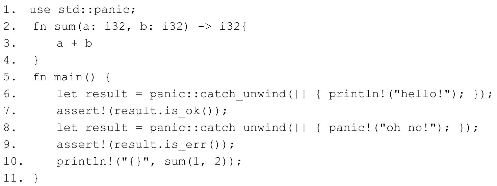{.u53849}
:::

在代码清单9-33中，代码第6行，catch_unwind接收的是一个正常的闭包，在该闭包中并未发生恐慌，所以正常执行。

代码第8行，catch_unwind接收的闭包会通过panic！宏引发恐慌，但是catch_unwind会捕获此恐慌，并恢复当前线程，所以代码第9行和第10行才能顺利执行，执行结果如下：

::: center
{.u53848}
:::

看得出来，虽然在输出结果中打印了恐慌信息，但是并没有影响到后续代码的执行。如果想消除此恐慌信息，则可以使用**std：：panic：：set_hook** 方法来自定义消息，并把错误消息输出到标准错误流中，如代码清单9-34所示。

**代码清单9-34：使用set_hook示例**

::: center
{.u53847}
:::

在代码清单9-34中使用set_hook来自定义错误消息，如代码第8～16行所示。并且通过获取panic_info的location信息，准确地输出了发生恐慌的文件和行号。输出如下：

::: center
{.u53846}
:::

需要注意的是，set_hook 是全局性设置，并不是只针对单个代码模块的。通过配合使用take_hook方法，可以满足开发中的大部分需求。

## 9.5 第三方库 {#text00015.html#A1cb60152-9f22-4f54-a57e-8c89018e72d8 .title-left}

Rust标准库中提供了最原始的错误处理抽象，使用了统一的Error，但是在实际开发中还是不够方便。为了提供更加方便和工程性的错误处理方案，Rust社区也涌现出不少第三方库（crate），其中比较知名的有error-chain和failure。目前官方比较推荐的库是failure。

接下来使用failure库继续改写前文中读取文件并对其中包含的数字进行求和的示例。要使用第三方库，必须先使用cargo new命令来创建一个本地库。

::: center
{.u53845}
:::

该命令是由Rust自带的包管理器Cargo提供的，在第10章中会详细介绍Cargo。该命令默认会创建一个二进制可执行库（Bin）。

然后进入到 failure_crate 根目录下，打开 cargo.toml 文件输入依赖库，如代码清单 9-35所示。

**代码清单9-35：cargo.toml配置**

::: center
{.u53844}
:::

在 cargo.toml 中添加了两个依赖库：failure 和 failure_derive，这是因为在 failure_derive中定义了很多宏，方便开发者管理错误。

再打开src/main.rs文件输入引入的相关库和模块，如代码清单9-36所示。

**代码清单9-36：src/main.rs引入相关库和模块**

::: center
{.u53843}
:::

在代码清单 9-36 中引入了 failure 和 failure_derive 库，同时引入了在 failure 中定义的Context、Fail和Backtrace，还引入了与读取文件相关的模块。接下来需要定义一个Error结构体和ErrorKind枚举体来统一管理错误，如代码清单9-37所示。

**代码清单9-37：在src/main.rs中添加Error和ErrorKind**

::: center
{.u53842}
:::

failure库对错误处理做了进一步抽象，它给开发者提供了多种错误处理模式，比如：

· 使用字符串作为错误类型，这种模式一般适合原型设计。

· 自定义失败类型，可以让开发者更加自由地控制错误。

· 使用Error类型，可以方便开发者将多个错误进行汇总处理。

· Error和ErrorKind组合，利用自定义错误和ErrorKind枚举体来创建强大的错误类型，这种模式比较适合生产级应用。

具体还得根据实际的场景来采用合适的模式。本例将采用Error和ErrorKind组合的模式。代码清单9-37中可以看出，在Error结构体中定义了inner字段，用于汇总处理各种错误类型。而具体的错误类型则由ErrorKind枚举体来进行统一管理。

failure 库一共包含两个核心组件来提供统一的错误管理抽象，其中一个是 failure：：Fail trait，替代标准库中的std：：error：：Error trait，用来自定义错误；另一个是failure：：Error结构体，可以转换任何实现Fail的类型，在某种无须自定义错误的场合使用该结构体很方便，任何实现了Fail的类型都可以使用问号操作符返回failure：：Error。

我们可以自己实现Fail trait，也可以使用failure库提供的derive宏自动实现。代码清单9-37 就是自动实现 Fail 的。所有的自定义错误都需要实现 Display，所以代码第 7 行和第 9行通过failure库提供的属性宏自动为枚举实现了Display。通过＃\[cause\]属性，可以指定标准库中内置的基础错误类型。

Fail trait受Send和Sync约束，表明它可以在线程中安全地传播错误。它也受＇static约束，表示对于实现Fail的动态trait对象，也可以被转换为具体的类型。它还受Display和Debug约束，表示可以通过这两种方式来打印错误。在Fail trait中包含了cause和backtrace两个方法，允许开发者获取错误发生的详细信息。Fail trait更像一个工程化版本的Error trait，帮助开发者处理实际开发中的问题。

接下来为Error实现Fail和Display，如代码清单9-38所示。

**代码清单9-38：在src/main.rs中为Error实现Fail和Display**

::: center
{.u53841}
:::

在代码清单9-38中为Error实现了Fail，其中cause和backtrace方法只需要调用inner的相应方法即可。而具体的inner类型即是ErrorKind中定义的各种类型的错误，通过failure提供的属性宏已经自动实现了cause。而backtrace则使用默认的实现。

接下来则需要为Error实现From转换，如代码清单9-39所示。

**代码清单9-39：在src/main.rs中为Error实现From转换**

::: center
{.u53840}
:::

在代码清单9-39中，通过From为Error实现转换到std：：io：：Error和std：：num：：ParseIntError的能力。

最后通过 type 关键字定义统一的 ParseResult＜i32＞类型进行错误处理，其中默认的错误类型是Error。这样就实现了统一的错误管理，而且还附带了Fail trait的诸多默认好处，比如前文中所描述的并发安全等。本例的完整代码可以参考随书源码中的failure_crate包。

failure库的具体用法未来可能有所变更，但是基本的错误统一管理思想不会有太大改变。而且官方还在考虑将failure引入标准库中，但是未来到底如何，目前还未有定论，让我们拭目以待吧。

## 9.6 小结 {#text00015.html#A3b390155-a6a1-4624-a72d-cff9073edb60 .title-left}

通过本章的学习，我们了解到Rust通过区分错误和异常来保证程序的健壮性。

Rust强大的类型系统，在一定程度上保证了函数调用不会因为违反"契约"而导致失败，但也无法覆盖所有失败的情况。然而，Rust也提供了断言机制，用于保证函数运行中的检查，如果出现违反"契约"的情况，则会引发线程恐慌。这是基于"快速失败（Fast Fail）"的思想，可以让Bug提前暴露出来。但是不能滥用断言宏，因为assert！宏有一定的性能开销，因此需要根据具体的情况来选择，尽量使用debug_assert！来代替assert！宏。

Rust并不提供传统语言的异常处理机制，而是从函数式语言中借鉴了基于返回值的错误处理机制。通过Option＜T＞和Result＜T，E＞将错误处理进一步区分为不同的层次。Option＜T＞专门用来解决"有或无"的问题，而 Result＜T，E＞专门用来处理错误和传播错误。这里要区分错误和异常，所谓错误是和业务相关的，是可以被合理解决的问题；而异常则和业务无关，是无法被合理解决的问题。在Rust中，基于Result＜T，E＞的错误处理机制是主流。虽然Rust也提供了catch_unwind方法来捕获线程恐慌，但它是有限制的，并不能捕获所有的恐慌。

Rust还提供了问号语法糖来简化基于Result＜T，E＞的错误处理机制，这不仅方便了开发者，而且还提高了代码的可读性。

为了增强错误处理的工程性，Rust社区还涌现出很多优秀的第三方库，其中有代表性的是error_chain和failure。error_chain的特色是使用自定义的宏来方便开发者统一管理错误，而failure的错误管理思维则是对标准库中Error的进一步增强，更加贴近Rust的错误处理思想，所以目前官方比较推荐failure。

总的来说，Rust的错误处理机制是基于对当前各门编程语言的异常处理机制的深刻反思，结合自身内存安全系统级的设计目标而实现的。开发者只有按Rust的设计哲学进行正确的错误处理，才有利于写出更加健壮的程序。

[]{#text00016.html}
