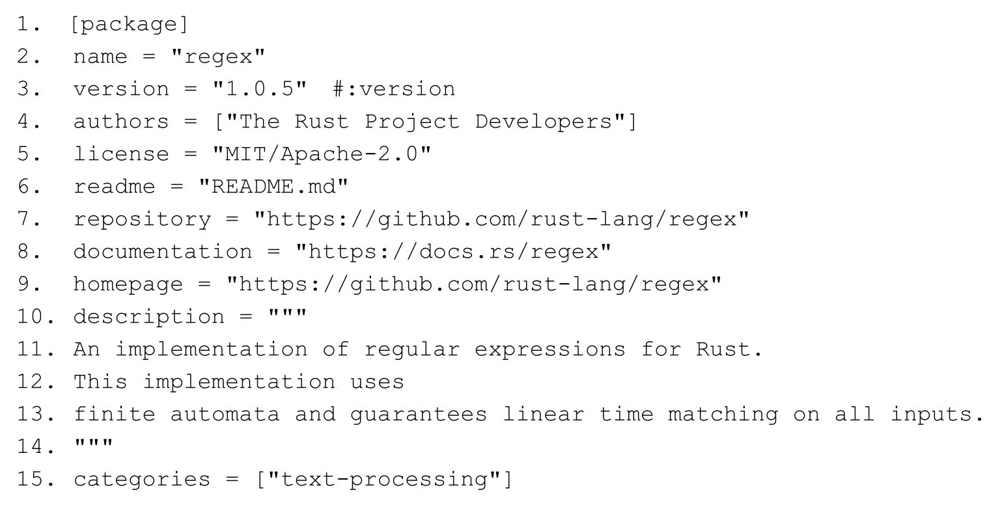
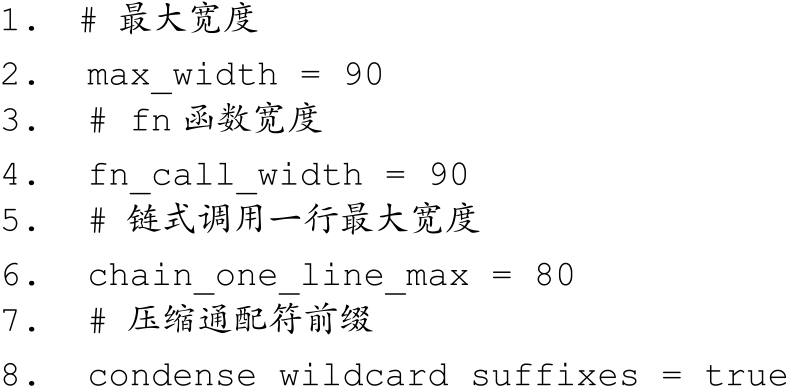

# 第10章 模块化编程 {#text00016.html#A4166d824-20de-43e6-9d58-62382f67206d .title-left}

良好的秩序是一切美好事物的基础。

时至今日，软件开发早已从单打独斗迈入了相互协作的时代。在日常开发中，几乎每一个系统都在依赖别人编写的类库或框架。自开源运动兴起，到现在 GitHub 网站蓬勃发展，软件开发越来越高效和便利。如果想要解决什么问题，只需要到 GitHub 之类的开源平台直接寻找现成的解决方案即可。而这些现成的解决方案大多是由不同国家的不同开发者提供的，而且针对同一个问题也有多种不同的解决方案。这些不同的解决方案之所以能够被有效、方便地复用，完全是因为模块化编程。

模块化编程，是指可以把整个代码分成小块的、分散的、独立的代码块，这些独立的代码块就被称为**模块** 。把一个复杂的软件系统按一定的信息分割为彼此独立的模块，有利于控制和克服系统的复杂性。模块化开发除支持多人协作之外，还支持各部分独立开发、测试和系统集成，甚至可以限制程序错误的影响范围。总的来说，模块化编程拥有如下三点好处：

· **增强维护性** 。一个设计良好的模块，独立性更高，对外界的依赖更少，更方便维护。

· **隔离性** 。拥有各自的命名空间，避免命名冲突，限制错误范围等。

· **代码复用** 。通过引入现成的模块来避免代码复制。

基于模块化的诸多好处，很多编程语言都支持模块化，只是模块化的方式和程度均有不同。比如C或C++，使用头文件的方式来进行模块化编程。而Ruby在语法层面直接支持模块（Module），Python的一个文件就是一个模块。本来在语言层面不支持模块化的JavaScript语言，因为大前端时代的来临，也不得不在ES 6中加入模块化支持。Java语言之前也不支持模块化，社区长期使用JAR文件来进行模块化开发，但是Java 9也在语法层面支持了模块化系统。由此可见模块化的重要性。

但是只有模块还不足以高效编写结构化的软件系统。那么如何方便地集成第三方开发的功能模块？一个简单的解决办法就是按照约定的目录结构来组织模块，并把此目录结构进一步打包成一个独立的模块，以方便外部集成。这种按约定的目录结构打包的模块，就被称为**包** 。在编写一个包的时候，也难免会依赖第三方包，而这些被依赖的包也随时可能被更新、修改、升级，所以一般使用版本化管理。包与包之间的版本依赖关系，手工处理起来比较麻烦，所以需要使用包管理工具来解决依赖、打包、编译、安装等功能。常见的包管理工具有Linux上面的rpm、yum和apt等，语言级别的有Ruby的RubyGems、Python的pip，以及JavaScript的npm。

Rust作为现代化编程语言，强有力地支持模块化编程。Rust中的包管理工具叫作**Cargo** ，第三方包叫作**crate** 。Rust拥抱开源，所有的第三方包都可以在GitHub上面找到，并且可以通过Cargo直接发布到包仓库平台crates.io上面。

## 10.1 包管理 {#text00016.html#Af05e0157-89ec-4c17-91cd-47b830610486 .title-left}

与其他大多数语言不同的是，使用Rust编写代码的最基本单位是包（crate）。Rust语言内置了包管理器Cargo，通过使用Cargo可以方便地创建包。**Cargo一共做了四件事情** ：

· 使用两个元数据（metadata）文件来记录各种项目信息。

· 获取并构建项目的依赖关系。

· 使用正确的参数调用rustc或其他构建工具来构建项目。

· 为Rust生态系统开发建立了统一标准的工作流。

· 通过Cargo提供的命令可以很方便地管理包。

### 10.1.1 使用Cargo创建包 {#text00016.html#Aae9e0157-4ff5-4676-847b-c730af0b2d47 .title-left}

使用cargo new命令创建包csv-read：

::: center
{.u53839}
:::

在终端使用tree命令查看包目录结构：

::: center
{.u53838}
:::

该包中包含的文件有Cargo.toml和src/lib.rs。其中Cargo.toml是包的配置文件，是使用**TOML** 语言 ^[\[1\]](#text00016.html#nE8490157BCE449C383A83335E1A3000F){#text00016.html#nE8490157BCE449C383A83335E1A3000Fs}^ 编写的。TOML语言的特色是：规范简单、语义明显、阅读性高。TOML专门被设计为可以无歧义地映射为哈希表，从而可以更容易地解析为各种语言中的数据结构。而Cargo.toml正是元数据文件之一。打开Cargo.toml，可以看到如代码清单10-1所示的代码。

**代码清单10-1：Cargo.toml文件内容**

::: center
{.u53837}
:::

代码清单10-1展示了Cargo.toml文件的内容（manifest文件），它里面记录了用于编译整个包所用到的元数据。代码第1～5行定义的是包信息，记录了包的名字为"csv-read"。

从Rust 1.30版本开始，默认创建的crate都会带有**edition** 选项，其默认设置为"**2018** "。这代表默认crate使用**Rust 2018** 版本。如果有需要，也可以将其修改为"2015"，以便支持**Rust 2015 版本** 。

再打开src/lib.rs文件，其初始内容如代码清单10-2所示。

**代码清单10-2：src/lib.rs初始内容**

::: center
{.u53836}
:::

::: center
{.u53835}
:::

在src/lib.rs中，初始内容只有tests模块。在Rust中使用关键字mod来定义模块。＃\[cfg（test）\]属性为条件编译，告诉编译器只在运行测试（cargo test命令）时才编译执行。在tests模块中，生成了一个示例方法it_works。只要进入该包的根目录下，然后执行cargo test命令，即可看到测试正常运行，如下所示。

::: center
{.u53834}
:::

可以看出，tests：：it_works测试方法被成功执行，显示"ok.1 passed"。但是我们看到下面又有Doc-tests，这其实是指文档测试，因为Rust支持在文档注释里写测试。而这里并没有写任何文档测试。

此时再使用tree命令来查看目录结构，如下所示。

::: center
{.u53833}
:::

可以看出，多了一个**Cargo.lock** 文件和target文件夹。Cargo.lock是另外一个元数据文件，它和Cargo.toml的不同点如下：

· Cargo.toml 是由开发者编写的，从广义上来描述项目所需要的各种信息，包括第三方包的依赖。

· Cargo.lock只记录依赖包的详细信息，不需要开发者维护，而是由Cargo自动维护的。

target文件夹是专门用于存储编译后的目标文件的。编译默认为**Debug** 模式，在该模式下编译器不会对代码进行任何优化，所以编译时间较短，代码运行速度较慢。也可以使用**\--release** 参数来使用发布模式，在该模式下，编译器会对代码进行优化，使得编译时间变慢，但是代码运行速度会变快。

使用**cargo new** 命令默认创建的是库文件（生成静态或动态链接库），它并非可执行文件，而是专门用于被其他应用程序共享的功能模块。如果想创建可执行文件，那么需要使用**\--bin** 参数。

::: center
{.u53832}
:::

加**\--bin** 参数或者什么都不加，所创建的包就可被编译为可执行文件。使用tree命令来查看其目录结构，如下所示。

::: center
{.u53831}
:::

这里唯一的变化是在src下面的是main.rs文件。代码清单10-3展示了main.rs文件的初始内容。

**代码清单10-3：src/main.rs初始内容**

::: center
{.u53830}
:::

在main.rs文件中默认定义了main函数，这理所当然，因为可执行文件必须要有程序入口。可以通过执行cargo build命令来编译该包，但要注意，必须在包的根目录下执行该命令。也可以直接使用cargo run命令来编译并运行该包，如下所示。

::: center
{.u53829}
:::

### 10.1.2 使用第三方包 {#text00016.html#Af5ea0159-aa33-4e30-af44-8b38dd98b272 .title-left}

在日常开发中，经常会使用到第三方包。在 Rust 中使用第三方包非常简单，只需要在Cargo.toml中的**\[dependencies\]** 下面添加想依赖的包即可。

假如想在上面创建好的csv-read中添加linked-list包，如代码清单10-4所示。

**代码清单10-4：在Cargo.toml文件中添加linked-list依赖**

::: center
{.u53828}
:::

然后在src/main.rs或src/lib.rs文件中，使用extern crate命令声明引入该包即可使用，如代码清单10-5所示。

**代码清单10-5：在src/main.rs文件中使用extern crate命令声明引入第三方包**

::: center
{.u53827}
:::

在代码清单10-5中，代码第1行使用**extern crate** 声明引入第三方包。这是Rust 2015版本的写法。在**Rust 2018 版本** 中，可以省略掉extern crate这种写法，因为在Cargo.toml中已经添加了依赖。

另外，值得注意的是，使用**extern crate** 声明包的名称是linked_list，用的是下画线"**\_** "，而在Cargo.toml中用的是连字符"-"。这是怎么回事呢？其实Cargo默认会把连字符转换成下画线。这是为了统一包名称，因为linked-list和linked_list到底是不是同一个包，容易造成歧义。

Rust也不建议以"-rs"或"\_rs"为后缀来命名包名，并且会强制性地将此后缀去掉，所以在命名时要注意。接下来，通过介绍在日常编程中两个比较实用的第三方包，来看看如何集成第三方包完成功能。

**使用正则表达式regex包**

在Rust标准库中并没有内置正则表达式的支持，它是作为第三方包而存在的，名为regex。现在使用cargo new\--bin use_regex命令创建一个新的包，然后在Cargo.toml文件中添加regex依赖，如代码清单10-6所示。

**代码清单10-6：在Cargo.toml文件中添加regex依赖**

::: center
{.u53826}
:::

当前regex最新的版本是1.0.5。然后，在src/main.rs中同样使用extern crate来声明引入regex包，如代码清单10-7所示。

**代码清单10-7：在src/main.rs中声明引入regex包**

::: center
{.u53825}
:::

使用cargo run命令编译并执行该包，会得到如下执行结果：

::: center
{.u53824}
:::

在代码清单 10-7 中，先使用 extern crate regex 声明引入 regex 包，然后使用 use regex：：Regex声明，是为了简化代码，这样就可以直接在use_regex包里使用Reg ex了，如代码第7行所示。

如果不使用 use 声明，那么也可以直接使用 regex：：Regex：：new，但是在可读性上就差了许多。

代码第7行，给定了正则表达式字符串，由此生成正则实例re。然后在代码第8行，通过**captures_iter** 方法，对给定的常量字符串TO_SEARCH进行匹配和迭代，并依次将捕获匹配到的字符串打印出来，因为给定的正则表达式是带有捕获组的表达式。

regex 包支持大部分正则匹配功能，但**不支持环视（look-around）** 和**反向引用（backreference）** 。这是因为 regex 注重性能和安全，而环视和反向引用更容易被黑客利用制造**ReDos** 攻击。如果一定要使用环视和反向引用，则可以使用**fancy-regex** 包。

regex包也支持命名捕获，如代码清单10-8所示。

**代码清单10-8：使用命名捕获的示例**

::: center
{.u53823}
:::

在代码清单10-8中，代码第2～8行，传给Regex：：new方法的正则表达式以（？x）为前缀，这是指定了正则表达式标记x。regex包支持多种正则表达式标记，意义如下：

· **i** ，匹配时不区分大小写。

· **m，** 多行模式，"\^"和"\$"对应行首和行尾。

· **s，** 允许通配符"."匹配"\\n"。

· **U，** 大写U，交换"x\*"和"x\*？"的意义。

· **u，** 小写u，允许支持Unicode（默认启用）。

· **x** ，忽略空格并允许行注释（以"＃"开头）。

所以，在代码清单10-8中，从代码第2～8行可以看到，为正则表达式加上了空格和注释也不影响最终的匹配结果。也要注意在该正则表达式中使用了（？P＜name＞exp）这种格式来定义命名捕获组。

代码第9行，使用captures方法就可以获取匹配的捕获变量，并保存到一个HashMap中，以命名变量作为HashMap的键，匹配的字符串作为值。代码第10～12行，就可以直接从caps中按指定的键取相应的值。

代码第13行和第14行，使用replace_all方法按指定的格式来替换匹配的字符串。注意指定的格式是以"\$"符号和命名捕获变量组合而成的。

regex还有很多其他功能和用法，可以翻阅其文档来获取更多内容。

**惰性静态初始化lazy_static包**

在编程中，经常会有对全局常量或变量的需求。Rust 支持两种全局类型：**普通常量（Constant）** 和**静态变量（Static）** 。它们的异同之处在于以下几点：

· 都是在编译期求值的，所以不能用于存储需要动态分配内存的类型，比如HashMap、Vector等。

· 普通常量是可以被内联的，它没有确定的内存地址，不可变。

· 静态变量不能被内联，它有精确的内存地址，拥有静态生命周期。

· 静态变量可以通过内部包含UnsafeCell等的容器实现内部可变性。

· 静态变量还有其他限制，比如不包含任何析构函数、包含的值类型必须实现了 Sync以保证线程安全、不能引用其他静态变量。

· 普通常量也不能引用静态变量。

**在存储的数据比较大、需要引用地址或具有可变性的情况下使用静态变量** ；**否则，应该优先使用普通常量** 。但也有一些情况是这两种全局类型无法满足的，比如想使用全局的HashMap或Vector，或者在使用正则表达式时只让其编译一次来提升性能。在这种情况下，推荐使用lazy_static包。

利用lazy_static包可以把定义全局静态变量延迟到运行时，而非编译时，所以冠之以"惰性（lazy）"。在Cargo.toml中添加lazy_static依赖如代码清单10-9所示。

**代码清单10-9：在Cargo.toml中添加lazy_static依赖**

::: center
{.u53822}
:::

继续在use_regex包中添加lazy_static依赖。然后在src/main.rs中通过extern crate引入lazy_static包，如代码清单10-10所示。

**代码清单10-10：修改src/main.rs文件，通过extern crate引入lazy_static包**

::: center
{.u53821}
:::

::: center
{.u53820}
:::

代码清单10-10是Rust 2015 的写法。代码第1行，使用了**＃\[macro_use\] extern crate lazy_static** ，是因为需要使用lazy_static包中定义的lazy_static！宏。＃\[macro_use\]可以和extern crate lazy_static写成两行，未来＃\[macro_use\]或可省略，该属性的意思是导出包中定义的宏。当然，在**Rust 2018** 中，extern crate语法可以省略，那么相应的**＃\[macro_use\]** 也可以省略，也就是说，代码第1代和第2行皆可省略**。**

代码第4～13行，使用lazy_static！宏定义了两个全局静态变量RE和EMAIL_RE，它们是不同的正则表达式。这样一来，就只需要编译一次，而不会重复编译。之所以把正则表达式定义为全局静态变量，是出于编译性能的考虑，如果该正则表达式被用于循环匹配中，那么会降低编译的性能，并且不利于正则表达式引擎内部的优化。

代码第14～19行，分别定义了regex_date和regex_email方法，用来匹配传入的字符串。在main函数中，则可以方便地使用它们。

当需要全局的容器时，比如HashMap，也可以使用lazy_static包。

首先使用**cargo new\--bin static_hashmap** 命令创建新的包，然后在**Cargo.toml** 中添加lazy_static依赖，再修改src/main.rs代码，如代码清单10-11所示。

**代码清单10-11：修改新创建的static_hashmap包中的src/main.rs代码**

::: center
{.u53819}
:::

::: center
{.u53818}
:::

在代码清单10-11中，代码第1行，同样是通过＃\[macro_use\] extern crate lazy_static引入包和lazy_static！宏的。

代码第2～19行，使用mod关键字定义了static_kv模块。模块是Rust模块化编程的基础，其作用域是独立的、封闭的，在static_kv中定义的常量或方法默认是私有的。所以，想要在模块外调用模块中的常量或方法，就必须通过**pub** 关键字将可见性改为公开的。

所以，代码第3行和第4行，使用use引入了std：：collections和std：：sync模块，使用其中定义的HashMap和RwLock，只对模块static_kv有效。

代码第5行，使用pub const定义了公开的普通常量NF，它是一个字符串字面量类型。如果想在模块外使用它，就必须带上命名空间，也就是模块的名字：static_hash：：NF。

代码第6～18行，使用lazy_static！宏定义了两个全局静态变量MAP和MAP_MUT，分别代表只读的HashMap和可变的HashMap。lazy_static！宏的语法格式如代码清单10-12所示。

**代码清单10-12：lazy_static！宏的语法格式**

::: center
{.u53817}
:::

在使用lazy_static！宏时，必须严格按照此语法格式来书写，否则会引发线程恐慌。

回到代码清单10-11中，代码第7～11行，定义了一个不可变（只读）的HashMap类型的全局静态变量MAP，并插入了一个初始化的键值对"{0：＂foo＂}"。

代码第12～17行，定义了可变（可读可写）的RwLock＜HashMap＜u32，&＇static str＞＞类型的全局静态变量MAP_MUT。注意，这里使用了**RwLock读写锁** 来包装HashMap，这是因为可能会有多个线程来访问HashMap，而HashMap并没有实现Sync，所以HashMap不是线程安全的类型。因此，必须使用同步锁来保护HashMap，让其线程安全。其实也可以使用Metux互斥锁来保护HashMap，它们的区别在于：

· RwLock读写锁，是多读单写锁，也叫共享独占锁。它允许多个线程读，单个线程写。但是在写的时候，只能有一个线程占有写锁；而在读的时候，允许任意线程获取读锁。读锁和写锁不能被同时获取。

· Metux互斥锁，只允许单个线程读和写。

所以在读数据比较频繁远远大于写数据的情况下，使用RwLock读写锁可以给程序带来更高的并发支持。在第11章中还会对它们做更详细的介绍。

作为全局静态变量，希望 MAP_MUT 希望用于多读单写的场景中，所以这里使用了RwLock读写锁。

代码第20～25行，定义了read_kv函数。在该函数内部，使用了static_kv：：MAP来获取static_kv 模块中定义好的全局静态变量 MAP，如果不加命名空间 static_kv，则无法访问到MAP。

代码第 21 行，使用了 ref 模式匹配来获取 static_kv：：MAP 的引用 m，也可以直接使用&static_kv：：MAP来获取引用m。代码第22～24行，通过对m解引用，得到其内部的HashMap类型，并使用get方法来获取存储于MAP中的初始键值对。这里使用get方法来获取HashMap指定键的值，是一个很好的工程实践，因为 get 方法会返回 Option＜T＞类型。如果没有获取到，则会返回 None，或者是指定的其他值，比如该行中的&static_kv：：NF，这样更有利于错误处理。也可以直接使用\*m\[&0\]这样的写法，但它返回的是&T 类型，如果没有匹配的值，则线程会发生恐慌。

代码第26～38行，定义了rw_mut_kv函数，该函数返回一个Result＜（），String＞类型。在该函数中使用的是 static_kv：：MAP_MUT 全局静态变量，它的类型实际上是RwLock＜HashMap＜u32，&＇static str＞＞。RwLock读写锁提供了read和write方法来获取读锁和写锁。

注意，在函数rw_mut_kv中，使用了代码块对read和write进行了隔离，如代码第27～31行以及代码第32～36行所示。这是因为读锁和写锁不能被同时获取。只有放到代码块中，才能让读锁和写锁得到释放，因为Rust的RAII机制，在资源（这里是锁）出了作用域之后会得到释放。

如果把代码块去掉，则会发生死锁情况。在Rust中，叫作"**中毒（Poison）** "。但是，如果该函数中只存在读的情况，而没有写，则不需要引入代码块隔离，因为RwLock是允许多个线程同时读的。同样，在第11章中会介绍更多的相关内容。

在main函数中，分别调用了read_kv和rw_mut_kv。因为rw_mut_kv返回的是Result类型，所以需要使用match匹配处理Ok和Err两种情况。如果写入正常，那么也可以正常读取HashMap中写入的值；否则输出错误。

综上所述，就是惰性静态初始化 lazy_static 包的两个使用场景。另外，**还有两个值得注意的地方** ：

· 使用lazy_static！宏定义的全局静态变量如果有析构函数，则是不会被调用的，因为是静态生命周期。

· 在 lazy_static！宏中不能定义太多的全局静态变量，否则会引发线程恐慌。这是因为在lazy_static！宏中调用了内部的宏，Rust 对宏的递归调用有调用次数限制。可以通过在当前编写的包中加上＃！\[recursion_limit=＂128＂\]属性修改上限，默认值为 32，比如可以修改为128。

在不久的将来，Rust 的 CTFE（编译时函数执行）功能进一步完善之后，在某些场景中也许就不需要使用lazy_static包了。

**指定第三方包的依赖关系**

Rust包使用的是**语义化版本号** ^[\[2\]](#text00016.html#n897E016021834B4D8685FE806DD84201){#text00016.html#n897E016021834B4D8685FE806DD84201s}^ （**SemVer** ）。基本格式为"**X.Y.Z** "，版本号递增规则如下：

· **X，主版本号** （major）。当做了不兼容或颠覆性的更新时，修改此版本号。

· **Y，次版本号** （minor）。当做了向下兼容的功能性修改时，修改此版本号。

· **Z，修订版本号** （patch）。当做了向下兼容的问题修正时，修改此版本号。

语义化版本号是为了解决所谓"依赖地狱"的问题。随着系统规模的增长，加入的第三方包就会越来越多，包之间的依赖关系也会越来越复杂，容易造成"依赖地狱"。

比如增加lazy_static依赖时，指定了版本号为"1.0.0"。该版本号等价于"\^1.0.0"，这意味着当有新的lazy_static包发布时，允许Cargo在主版本号不变的情况下，更新次版本号或修订版本号。比如发布了"1.1.0"，那么当执行cargo build或cargo run命令时，会自动依赖最新的"1.1.0"包。

指定版本号范围的标记有以下几种：

· **补注号（\^）** ，允许新版本号在不修改\[major，minor，patch\]中最左边非零数字的情况下才能更新。

· **通配符（\*）** ，可以用在\[major，minor，patch\]的任何一个上面。

· **波浪线（～）** ，允许修改\[major，minor，patch\]中没有明确指定的版本号。

· **手动指定** ，通过＞、＞=、＜、＜=、=来指定版本号。

具体的示例如代码清单10-13所示。

**代码清单10-13：语义化版本号示例**

::: center
{.u53816}
:::

::: center
{.u53815}
:::

除语义化版本号之外，Cargo 还全面支持 git。可以直接指定 git 仓库地址，如代码清单10-14所示。

**代码清单10-14：可以直接指定git仓库地址**

::: center
{.u53814}
:::

当一个包依赖本地的包时，也可以指定其依赖路径。比如在上面创建的 static_hashmap包中，又创建了一个新的包hello_world，就可以在static_hashmap的Cargo.toml文件中按路径指定依赖关系，如代码清单10-15所示。

**代码清单10-15：可以使用path来指定本地包hello_world**

::: center
{.u53813}
:::

注意，在代码清单10-15中，hello_world是在static_hashmap包的根目录下创建的，path默认的根目录就是static_hashmap包的根目录。但是这种通过path指定本地依赖的包，不允许被发布到crates.io仓库平台上面。

### 10.1.3 Cargo.toml文件格式 {#text00016.html#Ab9a50161-3e95-4174-9e6b-f2a45687c130 .title-left}

TOML文件是通用的格式，可以用它表示任何配置格式。Cargo也有一套专用的TOML配置格式。现在以第三方包regex ^[\[3\]](#text00016.html#n88B10161087A448D9B91A5D2B55D925F){#text00016.html#n88B10161087A448D9B91A5D2B55D925Fs}^ 作为示例来说明。代码清单10-16展示了regex包的目录结构。

**代码清单10-16：regex包的目录结构**

::: center
{.u53812}
:::

在regex包里还包含着另外四个包，分别是bench、regex-capi、regex-debug和regex-syntax。

**\[package\]表配置**

现在打开Cargo.toml 文件看看相关配置。代码清单10-17 展示了regex 包中Cargo.toml文件的\[package\]表配置。

**代码清单10-17：regex包中Cargo.toml文件的\[package\]表配置**

::: center
{.u53811}
:::

在TOML语言中，\[package\]这种语法叫作**表** （**Table** ）。在\[package\]表里描述的都是和regex包有关的元数据，比如包名（name）、作者（authors）、源码仓库地址（repository）、文档地址（documentation）、包功能的简要介绍（description）、包的分类（categories）等。

注意其中的语法，基本都是字符串。如果是数组，则使用中括号；如果是多段的文字，则使用三引号"**＂＂＂** "。

\[package\]表是每个包必不可少的，它相当于代码清单10-18中描述的JSON格式。

**代码清单10-18：\[package\]表等价于这样的JSON格式**

::: center
{.u53810}
:::

**\[badges\]表配置**

继续看regex包的Cargo.toml文件，接下来是**\[badges\]** 表配置，如代码清单10-19所示。

**代码清单10-19：\[badges\]表配置**

::: center
{.u53809}
:::

在代码清单10-19中展示了\[badges\]表配置，设置了travis-ci和appveyor。这两项表配置表示可以在crates.io网站上显示travis-ci和appveyor的展示徽章。travis-ci和appveyor都是云端的持续集成服务平台，前者支持Linux和Mac OS系统，后者支持Windows系统。另外，\[badges\]表还支持 GitLab、codecov 等诸多平台。\[badges\]表是一个可选表，如果没有持续集成服务，则可以不配置此表。

**\[workspace\]表配置**

接下来是\[workspace\]表配置，如代码清单10-20所示。

**代码清单10-20：\[workspace\]表配置**

::: center
{.u53808}
:::

在代码清单 10-20 中，\[workspace\]表代表工作空间（Workspace）。工作空间是指在同一个根包（crate）下包含了多个子包（crate）。在本例中，根包就是regex，而在代码第2行，members键指定了bench、regex-capi、regex-debug、regex-syntax四个子包。

工作空间中的子包都有自己的Cargo.toml配置，各自独立，互不影响。在根包regex的Cargo.toml 中指定的依赖项，也不会影响到子包。不管是编译根包还是子包，最终的编译结果永远都会输出到根包的target目录下，并且整个工作空间只允许有一个Cargo.lock文件。

**\[dependencies\]表配置**

继续看根包regex的Cargo.toml文件，接下来就是\[dependencies\]表配置，如代码清单10-21所示。

**代码清单10-21：\[dependencies\]表和\[deü-dependencies\]表配置**

::: center
{.u53807}
:::

在代码清单10-21中展示了**\[dependencies\]** 表和**\[dev-dependencies\]** 表配置。\[dependencies\]表在前面介绍过，它专门用于设置第三方包的依赖，这些依赖会在执行cargo build命令编译时使用。\[dev-dependencies\]表的作用与之类似，只不过它只用来设置测试（tests）、示例（examples）和基准测试（benchmarks）时使用的依赖，在执行**cargo test** 或**cargo bench** 命令时使用。

**\[features\]表配置**

接下来是**\[features\]** 表配置，如代码清单10-22所示。

**代码清单10-22：\[features\]表配置**

::: center
{.u53806}
:::

在代码清单10-22中，**\[features\]** 表中的配置项与条件编译功能相关。在Rust中，有一种特殊的属性**＃\[cfg\]** ，叫作**条件编译属性** ，该属性允许编译器按指定的标记选择性地编译代码。在此例中，pattern表示允许使用std标准库中定义的Pattern trait，但是该trait目前还处于未稳定状态，所以使用了unstable配置。

代码清单10-23展示了在regex包中如何使用条件编译属性。

**代码清单10-23：在regex包中使用＃\[cfg\]属性**

::: center
{.u53805}
:::

在代码清单10-23中，代码第3行使用了**＃\[cfg（feature=＂pattern＂）\]** ，这意味着当执行**cargo build\--features ＂pattern＂** 命令时，在 Cargo 内部调用 Rust 编译器 rustc 时会传**\--cfg feature=＂pattern＂** 标记，那么在输出中也会包含pattern模块；否则，不会编译pattern模块。

代码第1行使用了**＃\[cfg（not（feature=＂use_std＂））\]** ，其作用正好和**＃\[cfg（feature=＂use_std＂）\]** 相反，表示在编译时不指定features参数。

**\[lib\]表配置**

继续看regex根包的Cargo.toml文件，接下来是\[lib\]表配置，如代码清单10-24所示。

**代码清单10-24：\[lib\]表配置**

::: center
{.u53804}
:::

代码清单 10-24 展示的\[lib\]表用来表示最终编译目标库的信息，该表完整的配置项主要包含以下几类：

· **name** 。比如name=＂foo＂，表示将来编译的库名字为"libfoo.a"或"libfoo.so"等。

· **crate-type** 。比如crate-type=\[＂dylib＂，＂staticlib＂\]，表示可以同时编译生成动态库和静态库。

· **path** 。比如path=＂src/lib.rs＂，表示库文件入口，如果不指定，则默认是src/lib.rs。

· **test** 。比如test=true，表示可以使用单元测试。

· **bench** 。比如bench=true，表示可以使用性能基准测试。

还有其他配置项，这里就不一一列举了。在本例中，因为根包中没有提供性能基准测试，所以将bench设置为false。

**\[test\]表配置**

接下来是**\[\[test\]\]** 表配置，注意到该表由两个中括号嵌套表示，这在TOML语言中代表表数组，如代码清单10-25所示。

**代码清单10-25：\[\[test\]\]表配置**

::: center
{.u53803}
:::

::: center
{.u53802}
:::

在代码清单10-25中列举了三组\[\[test\]\]表配置，这只是regex根包中Cargo.toml配置的一部分。这三组\[\[test\]\]表表示一个数组，**等价的JSON格式** 如代码清单10-26所示。

**代码清单10-26：\[\[test\]\]表数组等价的JSON格式**

::: center
{.u53801}
:::

可以得出，\[\[test\]\]表数组表示的是同一个数组中的三组不同配置。\[\[test\]\]表支持的配置项和\[lib\]表基本相同。

**\[profile\]表配置**

接下来是\[profile\]表配置，如代码清单10-27所示。

**代码清单10-27：\[profile\]表配置**

::: center
{.u53800}
:::

Cargo支持自定义rustc编译配置，使用\[profile\]表进行配置即可，但只对根包中的profile配置有效。

在代码清单 10-27 中，在\[profile\]表中使用了点（**.** ）符号来表示嵌套，分别是\[profile.release\]、\[profile.bench\]和\[profile.test\]，**与其等价的JSON格式** 如代码清单10-28所示。

**代码清单10-28：\[profile\]表配置对应的JSON格式**

::: center
{.u53799}
:::

这三项表配置分别代表 Release、Bench 和 Test 编译模式。除此之外，Cargo 还支持\[profile.dev\]代表Debug模式。在本例中，当前的配置代表在Release、Bench和Test模式下，均包含Debug信息。除debug配置项之外，还支持用于指定优化级别的opt-level、连接时间优化的lto等。

快速浏览了一遍根包的Cargo.toml配置文件，大概了解到这些配置表的作用。接下来看看子包bench中的Cargo.toml文件。

子包bench的目录结构如代码清单10-29所示。

**代码清单10-29：子包bench的目录结构**

::: center
{.u53798}
:::

Bench 子包用来和其他语言编写的正则表达式引擎比较性能基准测试，在 log 文件夹里保存的是曾经的测试记录。src目录是Rust包结构的原生目录。Cargo.toml是Cargo的配置文件。**build.rs** 叫作**构建脚本（Build Script）** ，它是先于cargo build被编译的脚本，因为有时候需要在编译时依赖第三方非Rust代码，比如C库，这时就需要先编译C库，然后Rust代码才能链接到C库。关于build.rs，在第12章中还会做更详细的介绍。compile和run是shell脚本，分别包装了cargo build和cargo bench命令，用于更方便地执行基准测试。

现在查看子包bench的Cargo.toml文件，如代码清单10-30所示。

**代码清单10-30：子包bench中的Cargo.toml文件部分配置**

::: center
{.u53797}
:::

代码清单10-30只展示了之前没有见到过的Cargo.toml文件的部分配置，因为大部分配置和根包regex中的Cargo.toml文件一致。

代码第1～4行，**\[package\]** 表中有两个键值对配置项build和workspace。其中build用于设置构建脚本，这里直接指定 build.rs，因为默认的根路径就是当前包（bench）的根目录，而build.rs正好位于当前包的根目录下。workspace和根包（regex）中Cargo.toml的\[workspace\]表配置相呼应，这里设置了两个点"**..** "，表示workspace是当前包根目录的上一层目录。

代码第5～8行的\[\[bin\]\]表和第9～13行的\[\[bench\]\]表以及上面提到的\[lib\]表的配置项是相同的。当想在一个作为库的包里同时包含main.rs（可执行程序的入口main函数）时，就需要配置\[\[bin\]\]表。这里配置项 name 表示生成的可执行文件的名字；path 表示当前包含入口main函数的文件路径。如果想把该入口文件直接置于src目录下，则文件名必须是main.rs；如果想用其他文件名，则必须将其放到src/bin目录下。这里配置项bench被设置为false，就是希望在生成可执行文件时不会去执行基准测试。同理，可推出\[\[bench\]\]表中配置的含义。

至此，对子包bench中Cargo.toml文件的配置也有了比较全面的了解。关于更多的细节，可以参考crates.io网站上更详细的文档。

### 10.1.4 自定义Cargo {#text00016.html#A739c0167-f0a8-41e7-8ab4-77be1e302b35 .title-left}

Cargo 允许修改本地配置来自定义一些信息，比如命令别名、源地址等。默认的全局配置位于"\$HOME/.cargo/config"文件（基于 Linux/类 UNIX 系统，如果是 Windows，则为%USERPROFILE%\\.cargo\\config）中。具体的配置信息如代码清单10-31所示。

**代码清单10-31：\$HOME/.cargo/config配置信息**

::: center
{.u53796}
:::

代码清单 10-30 展示了 Cargo 配置文件的部分配置信息，可以看出，配置语言同样是TOML。其中**\[registry\]** 表代表crates.io的相关配置；**token** 是在crates.io上注册账号以后由网站颁发的，用于开发者在发布包（crate）时通过平台验证。

**\[source.crates-io\]** 表表示Cargo的源是crates.io。registry配置项指定了crates.io的索引文件地址。GitHub是默认配置，如果无法访问GitHub，则可以通过指定其他的源来解决问题，具体可参考附录A中的方法。

**在\[alias\]** 表中可以指定 Cargo 各种命令的别名，以方便使用。甚至还能定义比较复杂的组合命令，如代码第11行所示，当执行cargo space_example命令时，实际上会执行cargo run\--release\--command list命令。

**Cargo配置文件的层级关系说明**

Cargo配置文件和git差不多，支持层级的概念。也就是说，可以进行全局配置，也可以针对具体的项目（包）进行配置，如下所示。

· 所有用户的全局配置：/.cargo/config

· 当前用户的全局配置：\$HOME/.cargo/config

· 根包regex的配置：/regex/.cargo/config

· 子包bench的配置：/regex/bench/.cargo/config

**Cargo配置会从上到下层层覆盖** ，**上下层的配置并不会相互影响** 。假如在子包bench中定义了cargo build的别名为"cargo bu"，那么在bench根目录下执行cargo build、cargo bu、cargo b命令中的任意一个都是可以的。回到根包regex中执行cargo bu命令则不行，但依然可以执行cargo build和cargo b命令。

**自定义Cargo子命令**

Cargo 允许自定义命令来满足一些特殊的需求。只要在**\$PATH** （环境变量）中能查到以"**cargo** -"为前缀的二进制文件，比如cargo-something，就可以通过cargo something来调用该命令。比如，在日常开发中专门用于格式化Rust代码的第三方Cargo扩展rustfmt，就是这样来扩展Cargo命令的。

可以通过下列命令来安装rustfmt。

· 稳定版（Stable）Rust：rustup component add rustfmt

· 夜版（Nightly）Rust：rustup component add rustfmt\--toolchain nightly

通过执行cargo\--list命令来查看当前可用的全部命令，就可以发现多了一个fmt命令，然后就可直接调用cargo fmt令来格式化Rust文件。比如在前面创建的static_hashmap包的根目录下执行cargo fmt命令，则会对src/main.rs重新格式化，同时还会生成src/main.rs.bk文件作为备份。一般在团队开发中多使用此Cargo扩展，不管每个团队成员的编码风格是否一致，只需要在提交代码前执行一遍cargo fmt命令，就可以统一整个团队的编码风格。如果有些地方不想被rustfmt处理，那么只需要在该处上方添加＃\[rustfmt_skip\]属性即可。

打开rustfmt源码中的Cargo.toml文件，会看到如代码清单10-32所示的配置。

**代码清单10-32：rustfmt源码中Cargo.toml文件的部分配置**

::: center
{.u53795}
:::

从代码清单10-32中可以看出，\[\[bin\]\]表数组一共配置了四个可执行文件的名字，其中包括了cargo-fmt，用户通过cargo install命令安装rustfmt之后就自动拥有了cargo fmt命令。与这四个可执行文件相对应，在 rustfmt 源码中的 src/bin 目录下有四个 Rust 文件，分别是rustfmt.rs、cargo-fmt.rs、rustfmt-format-diff.rs 和 git-rustfmt.rs，因此在\[\[bin\]\]表数组下没有使用path来设置文件路径。

除了可以直接使用rustfmt默认的代码风格，还可以通过在包的根目录下添加rustfmt.toml文件来自定义代码风格，代码清单10-33展示了一份自定义的格式化配置供参考。

**代码清单10-33：rustfmt.toml配置**

::: center
{.u53794}
:::

关于更多的配置，可以参考rustfmt的相关文档。

另外，Cargo 还提供了两个在开发中相当有用的工具：cargo-fix 和 cargo-clippy。其中cargo-fix 提供了 cargo fix 命令，可以为开发者自动修复编译过程中出现的 Warning。cargo-clippy是Rust静态代码分析工具，其提供了cargo clippy命令，帮助开发者检测代码中潜在的错误和坏味道，并且从Rust 1.29版本开始可用于Rust稳定版中。

## 10.2 模块系统 {#text00016.html#Ab3530169-08b4-428e-ad10-950d0b5347a0 .title-left}

Rust官方团队鼓励开发者在开发包（crate）的时候，尽可能做到最小化。也就是说，每个包都应该尽量只负责单一的完整功能。有些第三方包，代码量比较少，只需要单个文件（比如 src/lib.rs）就能完成整个功能。有些包代码量却很多，可以写在单个文件中来实现整个功能，但是不利于维护。Rust是一门支持模块化的语言，对于代码量比较大的包，可以将其按文件分割为不同的模块，这样可以更合理地组织代码。

在单个文件中，可以使用**mod** 关键字来声明一个模块。在static_hashmap包中，就使用mod关键字声明了static_kv模块。在Rust中单个文件同时也是一个默认的模块，文件名就是模块名。**每个包都拥有一个顶级** （**top-level** ）**模块src/lib.rs或src/main.rs** 。

**Rust 2015 模块**

现在对static_hashmap包按**Rust 2015** 的模块系统规则进行重构。先将在src/main.rs中定义的static_kv模块移动到新的文件static_kv.rs中。文件结构如代码清单10-34所示。

**代码清单10-34：文件结构**

::: center
{.u53793}
:::

此时需要将main.rs中的mod static_kv{...}整块代码移动到static_kv.rs中，但要注意把mod声明去掉，如代码清单10-35所示。

**代码清单10-35：将static_kü模块代码移动到static_kü.rs文件中**

::: center
{.u53792}
:::

如代码清单10-35所示的是static_kv.rs文件中的代码，这里已经去掉了之前的mod声明。这是因为Cargo会默认把static_kv.rs文件当作一个模块static_kv，如果加上之前的mod声明，那么在 main.rs 中调用该模块中定义的常量或静态变量时，则需要改成static_kv：：static_kv：：MAP 或&static_kv：：static_kv：：NF 这样的形式。这就相当于有两层命名空间，使用起来十分不便。

要想在main.rs中使用新定义的static_kv.rs文件，还需要使用mod关键字引入static_kv模块，如代码清单10-36所示。

**代码清单10-36：在main.rs中使用mod关键字引入static_kü模块**

::: center
{.u53791}
:::

在代码清单10-36中，代码第4行使用mod关键字引入了static_kv模块，Cargo会自动查找到static_kv.rs文件。其他代码不变，故这里省略。

现在main.rs文件中的另外两个函数read_kv和rw_mut_kv，同样可以被放到独立的文件中。在src目录下创建一个新的文件read_func.rs，然后把这两个函数都移动到这个新文件中，如代码清单10-37所示。

**代码清单10-37：将read_kü和rw_mut_kü两个函数从main.rs中移动到read_func.rs中**

::: center
{.u53790}
:::

代码清单10-37展示了将read_kv和rw_mut_kv这两个函数移动到read_func.rs中以后能够正常编译的最终修改代码。注意跟之前的代码不同的地方一共有三处。

因为在这两个函数中均用到了 static_kv 模块中定义的常量或静态变量，所以需要引入static_kv 模块。但是因为在顶级模块 main.rs 中已经使用 mod 关键字引入过了，所以在read_func.rs中只需要使用use直接打开模块即可，如代码第2行所示。这是其中一处变化。

另外两处变化是，在read_kv和rw_mut_kv函数前面都加上了pub关键字，它表示public （公开的）。这是因为每个模块对外都是封闭的，在模块中定义的一切都是私有的，只有通过添加pub才可修改其可见性，变为对外可公开访问，如代码第3行和第10行所示。

然后，在main.rs中通过mod关键字引入read_func模块，如代码清单10-38所示。

**代码清单10-38：在main.rs中引入read_func模块**

::: center
{.u53789}
:::

代码清单10-38展示了main.rs文件的最终修改代码。代码第5行，通过mod关键字引入了read_func模块。代码第6行，使用use关键字来打开read_func模块，引入其中的read_kv和rw_mut_kv 函数，这样就可以直接在main函数中使用这两个函数了（之前的代码不需要修改）；否则，必须在 main 函数中用到这两个函数的地方加上命名空间，比如read_func：：read_kv和read_func：：rw_mut_kv。

这样，通过模块化就将之前单个main.rs文件中的代码重构到了两个独立的文件中，代码结构变得更加清晰。接下来，在static_hashmap的根目录下执行cargo run命令，代码可以正常编译和运行。

现在 src 目录下一共有三个独立文件：main.rs、read_func.rs 和 static_kv.rs。但实际上static_kv.rs和read_func.rs在逻辑层面上并不独立，前者定义了静态变量MAP和MAP_MUT，后者定义了操作它们的读写行为。基于这种考虑，应该把 static_kv.rs 和 read_func.rs 合并为同一个模块。那么应该如何做呢？把它们归到同一个文件里吗？答案是否定的。其实完全可以把这两个文件放到同一个文件夹下来达成目的，如代码清单10-39所示。

**代码清单10-39：将static_kü.rs和read_func.rs放到同一个文件夹下**

::: center
{.u53788}
:::

在代码清单10-39中，创建了一个新的文件夹static_func，将static_kv.rs和read_func.rs置于其中，然后创建了新的文件mod.rs。此时，static_func就可以作为一个模块来使用，Cargo会自动查找该文件夹下的 mod.rs 文件作为该模块的根文件。现在只需要在 mod.rs 中引入static_kv和read_func两个模块即可，如代码清单10-40所示。

**代码清单10-40：在mod.rs中引入static_kü和read_func模块**

::: center
{.u53787}
:::

在代码清单10-40中使用mod关键字引入了static_kv和read_func模块，并通过pub关键字将其设置为对外公开。

但是现在还无法通过编译，使用cargo build命令编译时会报出如下错误：

::: center
{.u53786}
:::

在read_func.rs中，use static_kv这行会报错，错误信息表明无法在根（root）目录下找到 static_kv。Cargo 查找文件是从包的根目录开始的，而不是当前文件的相对目录。想解决这个错误，只需要将use static_kv修改为use super：：static_kv，就可以找到static_kv。在路径上使用super关键字，可以让Cargo以相对路径的方式查找文件，super代表当前文件的上一层目录。

还需要修改main.rs，如代码清单10-41所示。

**代码清单10-41：修改main.rs**

::: center
{.u53785}
:::

在代码清单10-41中，代码第4行，使用mod关键字引入了static_func模块。代码第5行和第6行，通过use关键字打开static_func：：static_kv和static_func：：read_func两个模块供main函数使用，main函数之前的代码依然不需要修改。

最后将Cargo.toml文件中的edtion修改为"2015"。此时使用cargo run命令可以正常编译和运行。可以通过随书源码中的static_hashmap_2015包来查看完整代码。

经过这一系列重构，我们大概可以了解到，Rust中的模块可以按照类似于文件系统的方式进行组织，Cargo会根据**文件名即模块名** 的默认约定来查找相关模块。

**Rust 2018模块**

Rust 2018对模块系统进行了改进，主要包括下面内容：

· 不再需要在根模块中使用extern crate语法导入第三方包。

· 在模块导入路径中使用crate关键字表示当前crate。

· 按照特定的规则，mod.rs可以省略。

· use语句可以使用嵌套风格来导入模块。

下面通过再次重构static_hashmap_2015项目来说明Rust 2018中模块系统的变化。首先使用**cargo new** 命令创建新的项目**static_hashmap_2018** ，然后打开Cargo.toml文件添加依赖的第三方包lazy_static，注意此时edtion选项默认为"2018"。

现在重新审视static_hashmap_2015项目中的static_func目录下的read_func和static_kv，发现它们之间还存在一层依赖关系。在 main.rs 中用的是 read_func 中的函数，而 read_func又依赖于static_kv。其实在static_hashmap_2015项目中并没有很好地反映出这一层关系。

现在使用Rust 2018的新模块系统来修改。在**static_hashmap_2018** 项目的src目录下创建read_func.rs文件，同时创建read_func目录，并在此目录下创建static_kv.rs文件。此时src目录结构如代码清单10-42所示。

**代码清单10-42：src目录结构**

::: center
{.u53784}
:::

代码清单10-42所示的结构明确地反映出read_func和 static_kv的关系。在Rust 2018中，如果存在与文件同名的目录，则在该目录下定义的模块都是该文件的子模块。也就是说，在当前项目中，read_func.rs和read_func目录是同名的，所以定义在read_func目录下的static_kv模块就是read_func的子模块。注意，在Rust 2015中则不允许文件与目录同名。

同时，在read_func.rs文件中需要使用mod关键字引入static_kv模块，如代码清单10-43所示。

**代码清单10-43：在read_func.rs文件中引入static_kü模块**

::: center
{.u53783}
:::

在代码清单 10-43 中省略了 read_kv 和 rw_mut_kv 函数的代码，其函数体等同于static_hashmap_2015项目中对应内容。需要注意，代码第1行直接引入了static_kv模块，并未加其余的路径前缀。这说明Rust会通过mod关键字自动到当前read_func模块的子模块中寻找static_kv模块。

接下来修改static_kv.rs文件，如代码清单10-44所示。

**代码清单10-44：修改read_func/static_kü.rs文件**

::: center
{.u53437}
:::

在代码清单10-44中同样省略了lazy_static！宏的具体代码。该文件主要的变化是代码第1行，使用 use 关键字引入了 lazy_static 包中的 lazy_static！宏。如果不加这一行，则无法使用lazy_static！宏。因为在Rust 2018中，可以在项目的根模块下也就是main.rs中省略**＃\[macro_use\] extern crate lazy_static** ，但是在具体使用到lazy_static！宏的模块时就必须使用use引入。

接下来修改main.rs文件，如代码清单10-45所示。

**代码清单10-45：修改main.rs文件**

::: center
{.u53782}
:::

在代码清单10-45中，使用mod关键字引入了read_func模块。相比于static_hashmap_2015项目中的 main.rs 文件，代码要清晰很多，可读性更高。另外，代码第 7 行，调用 static_kv模块中的静态变量MAP_MUT需要使用read_func前缀，又一次体现了这种层次关系。

另外，在代码第2行中，use语句使用了**crate** 关键字前缀，代表引入的是当前crate中定义的 read_func 模块。当然，此处也可以使用 **self** 关键字来代替 **crate** 关键字，Rust 会以main.rs为起点寻找当前相对路径下的read_func模块。如果是第三方包，则不需要写crate前缀。这样也可以提高代码的可读性。

## 10.3 从零开始实现一个完整功能包 {#text00016.html#Af56a016e-5141-4c66-84b7-bd191108106e .title-left}

通过对Cargo包管理和模块系统的学习，我们现在完全有能力写一个具有完整功能的包。以2017年C++17编码挑战赛为例，用Rust来实现挑战题。

这道挑战题是这样的：编写一个命令行工具，可以接收一个CSV文件，并且可以指定固定的值来覆盖指定列的所有数据，然后将结果输出到新的CSV文件中。原始CSV文件内容如代码清单10-46所示。

**代码清单10-46：原始CSV文件内容**

::: center
{.u53781}
:::

然后执行如下命令：

::: center
{.u53780}
:::

your_program为编译后的可执行程序，其接收三个参数，分别是字段名（City）、要替换的城市（Beijing）和输出的文件名（output/output.csv）。执行命令后，输出文件内容如代码清单10-47所示。

**代码清单10-47：替换后的CSV文件内容**

::: center
{.u53779}
:::

可以看到，City字段下面的所有值都被替换成了Beijing。挑战题其实很简单，本意是想让参与者完全用C++17的新特性来完成。借用此题，现在用Rust来实现。

### 10.3.1 使用Cargo创建新项目 {#text00016.html#Ae90d016f-2cf4-4cb0-9216-34c0c9b4346b .title-left}

现在使用Cargo命令来创建新的二进制项目csv_challenge。

::: center
{.u53778}
:::

此时会生成标准的包目录，主要文件包括 src/main.rs 和 Cargo.toml。进入csv_challenge目录中，在根目录下创建input文件夹，然后在该文件夹下创建一个challenge.csv文件，将原始CSV文件内容复制到其中。再回到csv_challenge根目录下，创建一个空文件夹output，用于存放将来输出的CSV文件。此时包的目录结构如下：

::: center
{.u53777}
:::

接下来要考虑的是如何从命令行接收参数。**基本思路有两种** ：直接使用std：：env：：args和使用第三方包。前者的方式比较原始，还需要手动解析参数，所以这里使用第三方包。

### 10.3.2 使用structopt解析命令行参数 {#text00016.html#Acebf016f-9e6e-4af3-a483-b55c7d91821a .title-left}

可选的第三方包有两个：clap和structopt。其中clap的功能非常强大，但是使用起来没有那么直观；而structopt则是在clap基础上构建而成的，简化了操作。所以这里选用structopt包。打开Cargo.toml文件，加入下面依赖：

::: center
{.u53776}
:::

然后运行cargo build命令，从crates.io（或指定的国内源）下载并编译安装这两个包。因为structopt是基于过程宏（Procedural Macro）的，所以它需要依赖structopt-derive包。关于过程宏会在第12章中介绍。

根据structopt的用法，需要一个结构体来封装所需要的参数。为了模块化，在src 根目录下创建新的文件opt.rs。此时csv_challenge包的目录结构如下：

::: center
{.u53775}
:::

在opt.rs文件中创建结构体Opt，如代码清单10-48所示。

**代码清单10-48：在src/opt.rs文件中创建结构体Opt**

::: center
{.u53774}
:::

在代码清单10-48中定义的结构体**Opt专门用于构建如下命令** ：

::: center
{.u53773}
:::

说明如下：

· **csv_challenge** ，为编译后的可执行文件。

· **\[FLAGS\]** ，为Flag参数，一般是侧重于表示"开"和"关"的标记。

· **＜input＞** ，表示输入文件，也就是原始CSV文件路径。它对应于代码第6行的字段input，并通过＃\[structopt...\]属性设置help说明文字。

· **＜column_name＞** ，表示指定要替换的CSV文件头部字段。它对应于代码第8行的字段column_name。

· **＜replacement＞** ，表示要替换的新值。它对应于代码第10行的字段replacement。

· **\[output\]** ，表示输出的文件路径。它对应于代码第 12 行的字段 output，注意它为Option＜String＞类型，因为该参数可以省略，由默认的输出文件路径代替。

因为结构体和字段都需要在opt模块外使用，所以在代码清单10-48中使用pub关键字将它们的可见性都修改为公开。

接下来修改src/main.rs文件，如代码清单10-49所示。

**代码清单10-49：修改src/main.rs文件**

::: center
{.u53772}
:::

在代码清单 10-49 中，因为使用的是 Rust 2018，所以可以省略使用 extern crate 和＃\[macro_use\]声明引入structopt和structopt_derive。现在可以直接使用use关键字引入StructOpt供本地使用。

代码第2行和第3行，使用mod和use关键字来引入Opt供本地使用。在main函数中，使用structopt包提供的Opt：：from_args方法就可以接收来自命令行的参数。使用cargo run命令编译并运行，会看到如下提示：

::: center
{.u53771}
:::

此时structopt包提供的方法会自动检查命令行有没有输入需要的参数，如果没有则给出提示，并自动提供\--help参数。当执行**cargo run\-\--help** 命令后，会有如下输出：

::: center
{.u53770}
:::

structopt会根据Opt结构体中的定义，生成这样一份命令帮助清单，csv_challenge包的用法一目了然。在开始处理接收的参数之前，应该考虑定义统一的错误类型。

### 10.3.3 定义统一的错误类型 {#text00016.html#Aef7d0171-d463-49cc-bc13-61a8c1dbfc42 .title-left}

同样使用单独的模块来定义错误类型。在src目录下创建新的文件src/err.rs，并在其中写入如代码清单10-50所示的内容。

**代码清单10-50：src/err.rs文件内容**

::: center
{.u53769}
:::

::: center
{.u53768}
:::

在代码清单 10-50 中定义了枚举类型 Error，其中包含两个值，即 Io（io：：Error）和Program（&＇static str），分别代表 I/O 错误和包自身的逻辑错误。同时实现了 From，使得 I/O错误和字符串类型错误可以方便地转换为Error。然后在src/main.rs中将此模块引入即可。

此时csv_challenge包的目录结构如下：

::: center
{.u53767}
:::

接下来就可以通过从命令行接收的参数来读取CSV文件了。

### 10.3.4 读取CSV文件 {#text00016.html#A0d4c0172-cd7e-4b03-b26b-bdb6e7351b6b .title-left}

在src目录下创建新的文件core.rs和文件夹core，所有操作CSV文件的代码都放在这里。处理CSV文件需要两步，先读取，再按指定的字段和值来替换旧值。把这两步分成两个独立的文件，即core/read.rs和core/write.rs。此时csv_challenge包的目录结构如下：

::: center
{.u53766}
:::

接下来修改core.rs文件，如代码清单10-51所示。

**代码清单10-51：修改core.rs 文件**

::: center
{.u53765}
:::

注意要使用 pub 将模块的可见性修改为公开的，因为在 main 函数中要使用模块中的函数。另外，在read模块中要用到Error，所以必须从core.rs中引入才可以。

接下来在core/read.rs中添加读取文件的方法，如代码清单10-52所示。

**代码清单10-52：在core/read.rs中添加读取文件的方法**

::: center
{.u53764}
:::

在代码清单10-52中，代码第1～4行，使用use引入了需要使用的几个标准库的类型，包括std：：path：：PathBuf、std：：fs：：File和std：：io：：prelude：：\*。这里需要注意的是，Rust会为每个包自动插入extern crate std，为每个模块自动插入use std：：prelude：：v1：：\*，所以在任何一个模块中都可以直接使用use来引入包含在std：：prelude：：v1：：\*中的模块 ^[\[4\]](#text00016.html#nE1580173459143E290EC6C7E0A1C603B){#text00016.html#nE1580173459143E290EC6C7E0A1C603Bs}^ 。代码第3行使用了**super** 关键字，是为了使用在当前模块的父模块core中引入的Error。

**Rust将文件路径抽象为两种类型：Path** 和**PathBuf** ，这两种类型的关系有点类似于&str和String的关系。**Path** 没有所有权，而**PathBuf** 有独立的所有权。通过对路径进行抽象，可以让开发者无视底层操作系统的差异，统一处理文件路径。

在模块**std：：fs** 中定义了操作本地文件系统的基本方法，并且所有方法都可以跨平台，开发者同样可以无视操作系统的差异而统一使用其中的方法。这里只用到了File结构体，使用其提供的open和create方法来打开和创建CSV文件。在离开作用域的时候，文件会自动被关闭。

在模块**std：：io** 中定义了核心I/O功能的trait、类型和一些基本方法。包括**Read** 、**Write** 、**Seek** 、**BufRead** 这四个trait，是对I/O操作的抽象。通过std：：io：：prelude：：\*可以引入一些I/O操作中最常见的模块。

代码第5～13行定义了两个pub函数：load_csv和write_csv，分别用于读取和写入CSV文件。在这两个函数中又调用了封装好的独立函数read、open和write，像这样一个函数只做一件事，是一种最佳实践。

接下来就可以在main.rs中使用这两个函数来操作CSV文件了，如代码清单10-53所示。

**代码清单10-53：在main.rs中使用load_csü和write_csü函数来操作CSV文件**

::: center
{.u53763}
:::

在代码清单10-53中，引入了所有新添加的模块。

代码第11行，使用PathBuf：：from方法将存储于opt.input字段中的输入CSV文件路径字符串转换为PathBuf类型。

代码第12～18行，将得到的CSV文件路径filename传入load_csv函数中。这里使用match来处理load_csv返回的Result类型。

代码第19行和第20行，声明了output变量绑定，代表输出CSV文件路径。因为opt.output是可以忽略的参数，所以这里使用unwrap_or方法定义了默认的输出路径。

代码第21～29行，将读取到的原始CSV文件内容csv_data和输出路径output_file传入write_csv方法中来输出CSV文件。这里也需要使用match来处理Result，否则编译会发出警告。

执行**cargo run input/challenge.csv City Beijing** 命令，会看到生成output/output.csv文件，其内容和input/challenge.csv一致。

但是挑战赛要求必须把指定字段（City）下的所有值都替换为新值（Beijing）。于是，接下来在core/write.rs中添加用于替换的函数。

### 10.3.5 替换CSV文件中的内容 {#text00016.html#Ab3e60175-f03a-43fd-a28a-8d68e0947085 .title-left}

替换的基本思路是：使用lines方法将读取到的原始CSV字符串转换为迭代器，这样就可以按行处理这些内容了。第一行内容就是 CSV 文件的头部，将其用逗号分隔存储为Vec＜&str＞数组。通过和指定的字段对比，就可以得到要替换字段的索引位置。然后将其他行的字符串存储到新的字符串中，继续通过lines方法转换为迭代器，结合前面得到的索引位置逐行替换相应位置的值。

考虑到处理替换同样需要PathBuf、File和Error这三种类型的支持，为了避免代码重复，现在将引入这三种类型的代码移动到core.rs文件中，如代码清单10-54所示。

**代码清单10-54：修改core.rs和core/read.rs文件**

::: center
{.u53762}
:::

在代码清单10-54中，将在core/read.rs中引入的std模块都移出来，此处使用了Rust 2018新模块系统支持的use语句内嵌语法。在修改core.rs的同时，也需要修改core/read.rs，通过super前缀从父模块中引入要使用的类型。

接下来修改core/write.rs文件，如代码清单10-55所示。

**代码清单10-55：修改core/write.rs文件**

::: center
{.u53761}
:::

::: center
{.u53760}
:::

在代码清单10-55中，代码第1行，同样使用了use spuer：：\*来引入父模块core中的类型。

代码第2行定义的pub函数replace_column接收三个参数：读取到的原始CSV字符串data、指定的字段column和要匹配的新值replacement。

代码第4～11行，通过lines方法将data 转换为迭代器，通过调用一次next方法，得到CSV 文件的头部 headers。然后通过 split 方法用逗号分隔将 headers 转换为 Vec＜&str＞数组columns，就可以通过position方法获取到指定字段的索引位置column_number。使用match匹配position方法的查找结果，因为有可能输入的字段是不存在的。

代码第12～20行，创建了一个可变的新字符串result，将头部数组columns使用join方法转换为用逗号分隔的字符串，加上换行符。然后将剩余的 lines 按行迭代，每一行先转换为Vec＜&str＞可变数组records，再通过column_number将指定位置的值替换为新值replacement。最后将替换好的records通过join方法转换为用逗号分隔的字符串，加上换行符。

代码第21行，返回最终结果。

现在就可以在main函数中使用replace_column方法了，如代码清单10-56所示。

**代码清单10-56：在main.函数中使用replace_column方法**

::: center
{.u53759}
:::

::: center
{.u53758}
:::

代码清单10-56展示了main.rs中需要修改的部分。代码第2～5行，使用use引入core模块中的子模块read和write。

代码第8～16行，使用replace_column方法替换原始CSV内容并生成新的修改过的内容modified_data。

代码第18行，将修改过的内容modified_data写入output_file中。

执行**cargo run input/challenge.csv City Beijing** 命令，会看到在生成的output/output.csv文件中City字段下的所有值均被修改成Beijing。大功告成！

### 10.3.6 进一步完善包 {#text00016.html#Af0fa0177-602c-4e52-aff6-48bf9fa2b7ad .title-left}

虽然代码功能基本可用，但如果公开给别人使用的话，则还缺少一些必要的测试和文档。接下来就为csv_challenge包增加一些测试和文档。Rust支持四种测试：**单元测试** 、**文档测试** 、**集成测试** 和**基准测试** 。其中基准测试专门用于性能测试。

**增加单元测试**

Rust允许在文件中使用mod test为相关功能提供单元测试。现在为load_csv函数增加单元测试，如代码清单10-57所示。

**代码清单10-57：为load_csü函数增加单元测试**

::: center
{.u53757}
:::

在代码清单10-57中，代码第1行的**＃\[cfg（test）\]** 表示只有在执行**cargo test** 时才编译下面的模块。

代码第2行定义了test模块，其中通过use引入了PathBuf和load_csv，否则PathBuf和load_csv函数无法在test模块中使用。

代码第 5 行的**＃\[test\]** 属性表示其标识的函数为测试函数，否则为普通的函数。如果想忽略此测试函数，只需要在＃\[test\]属性下面再添加**＃\[ignore\]** 属性即可。

代码第6行定义了测试函数。注意，对测试函数名称并没有特殊的规定。

执行cargo test会看到正常的测试输出。限于篇幅，这里只为load_csv增加测试函数，同理，还可以为 write_csv 和 replace_column 方法增加单元测试。可以在随书源码中查看csv_challenge包的完整源码及测试代码。

**增加集成测试**

有时候只有单元测试还不够，还需要增加集成测试来测试包的整体功能。但是Rust对于二进制包是不能增加集成测试的，因为二进制包只能独立使用，并不能对外提供可调用的函数。当前csv_challenge包是二进制包，需要将其改造一下。

为了支持集成测试，只需要新增src/lib.rs文件，将所有的模块都引入其中，并暴露对外可以调用的函数，然后在main.rs中调用这些函数即可，如代码清单10-58所示。

**代码清单10-58：新增src/lib.rs文件**

::: center
{.u53756}
:::

在代码清单10-58中，分别引入了opt、err和core模块。

代码第5～9行，使用了叫作**重新导出** （Re-exporting）的功能，这是为了简化外部调用的导出路径，而且也不需要对外暴露模块。

然后修改mian.rs文件，如代码清单10-59所示。

**代码清单10-59：修改main.rs文件**

::: center
{.u53755}
:::

代码清单 10-59 展示了 main.rs 文件中需要修改的部分。代码第 3 行，通过引入库包csv_challenge来使用其中暴露的函数。

值得注意的是，这种main.rs配合lib.rs的形式，是二进制包的**最佳实践** 。

如果使用cargo build命令编译正常，就可以增加集成测试了。在csv_challenge包的根目录下创建tests文件夹，在其中创建integration_test.rs文件。同时，在input目录下创建一个非法的CSV文件no_header.csv，将去掉头部的CSV内容复制到其中，用于测试异常情况。

此时csv_challenge包的目录结构如下：

::: center
{.u53754}
:::

接下来在integration_test.rs中增加集成测试，如代码清单10-60所示。

**代码清单10-60：integration_test.rs中增加集成测试**

::: center
{.u53753}
:::

在技术上，写集成测试和写单元测试相差无几，主要目的是为了全局性测试所有模块是否可以正常协调工作。直接执行**cargo test** 命令就可以运行集成测试，因为Cargo可以自动识别**tests** 目录。

**增加文档和文档测试**

Rust支持通过注释来生成文档，以及在文档中进行测试，如代码清单10-61所示。

**代码清单10-61：为core/read.rs中的write_csü函数增加文档**

::: center
{.u53408}
:::

代码清单10-61展示了为函数write_csv增加文档。普通的注释使用两个斜杠（**//** ），而文档注释使用三个斜杠（**///** ）。在文档注释中支持 **Markdown** 语法，但是如果要增加代码块，则需要指定语言，如果没有指定语言，则默认会将其识别为Rust代码，并且会执行文档测试。"**///** "会为其注释下方的语法元素生成文档。

比如代码第2行，如果将**ignore** 去掉，则在执行cargo test命令时注释中的代码会被当成 Rust 代码执行；如果去掉"**\`\`\`** "语法，则生成代码时无法高亮显示。因为在前面已经为write_csv 增加了单元测试，这里就没必要再进行测试了，所以使用"\`\`\`ignore"可以在编译时忽略这段代码的文档测试属性，只用来生成文档。

也可以使用"**//！** "在包的根模块或任意模块文件顶部增加模块级文档，如代码清单10-62所示。所谓模块级文档，是指为整个模块而不是单独为其下方的语法元素生成文档。

**代码清单10-62：在src/lib.rs中增加模块级文档**

::: center
{.u53752}
:::

在代码清单10-62中，在src/lib.rs模块文件顶部使用"**//！** "增加了模块级文档，所以在执行**cargo test** 命令时文档注释中的代码不会被作为文档测试执行。

现在执行**cargo doc** 命令，则会在target/doc下根据文档注释生成相关的文档，**UI** 界面和标准库文档是一样的。

**增加性能基准测试**

Rust也支持性能基准测试，在csv_challenge包的根目录下创建**benches** 目录，该目录是基准测试的默认目录，Cargo可以自动识别。

创建benches/file_op_bench.rs文件，在其中写入如代码清单10-63所示的内容。

**代码清单10-63：benches/file_op_bench.rs文件内容**

::: center
{.u53751}
:::

要使用基准测试，必须启用**＃\[features（test）\]** 。注意，只有在Rust夜版下才可使用features功能。需要使用extern crate导入test包，此处不能省略。test：：Bencher提供了iter方法，它接收闭包作为参数。如果要写性能测试代码，那么只要将其放到该闭包中即可。

代码第11～16行，创建bench_read_100times函数，使用**＃\[bench\]** 属性对其标注，表示这是一个基准测试函数。在 iter 方法的闭包参数中，使用 test：：black_box（100）来确保调用test_load_csv函数100次不受编译器优化的影响，可以较为准确地测出load_csv函数的性能。然后用fold方法调用test_load_csv函数100次，如代码第14行所示。

使用**cargo bench** 命令执行基准测试，可以看到类似于下面这条内容的输出：

::: center
{.u53750}
:::

**发布到crates.io**

现在可以把具有完整功能的包发布到**crates.io** 平台。首先需要注册crates.io网站的账号，登录之后在个人主页里生成一个Api Token，将此Token配置到**.cargo/config的\[registry\]** 表下面，然后使用cargo login登录。注意，为了个人安全，不要对外公开此Token。

接下来就可以直接在包的根目录下使用**cargo publish** 命令，该命令会自动将其编译打包上传到crates.io平台。也可以单独使用**cargo package** 命令先将其打包，然后再发布。打包以后的文件可以在target/package目录下找到。

如果执行cargo publish命令报出如下错误：

::: center
{.u53749}
:::

则说明该包 Cargo.toml 文件的**\[package\]** 表中还缺失必要的元信息，比如 description、license等。可以到错误信息提示的网址中查找更详细的内容。这些必要信息添加以后，就可以正常发布了。这样，其他开发者就可以通过**cargo install** 命令来安装并使用此包了。

## 10.4 可见性和私有性 {#text00016.html#A2db9017c-0b9b-42f1-9b91-6eb42274d867 .title-left}

在Rust中代码以包、模块、结构体和Enum等复合类型、函数等分成不同层次结构的**项** （Item）。这些项默认是私有的，但是可以通过pub关键字来改变它们的可见性。通过这样的设定，开发者可以在创建对外公共接口的同时隐藏内部的实现细节。

代码清单10-64展示了Rust 2015模块的可见性。

**代码清单10-64：Rust 2015模块可见性展示**

::: center
{.u53748}
:::

::: center
{.u53747}
:::

在代码清单10-64中，模块可见性的层级结构是outer_mod包含inner_mod，而outer_mod又被包含于默认的顶级模块中，也就是当前crate范围。

代码第2行，使用**pub（self）** 关键字标注outer_mod_fn函数的可见性，只限于**self** 的范围。也就是说，在outer_mod和inner_mod内部都可见，但是对顶级模块不可见。

代码第5行，使用**pub（in outer_mod）** 关键字标注outer_mod_visible_fn函数的可见性，只限于outer_mod范围。也就是说，该函数虽然定义于inner_mod内部，但是可以在outer_mod中访问。但不能在顶级模块中访问。

代码第7行，使用**pub（crate）** 关键字标注crate_visible_fn函数的可见性，代表该函数对整个crate范围可见。

代码第9行，使用**pub（super）** 关键字标注super_mod_visible_fn函数的可见性，代表该函数只在outer_mod内部可见，和pub（in outer_mod）效果等价。**super** 关键字表示当前模块的父模块。

代码第13行，在super_mod_visible_fn函数中调用outer_mod中定义的outer_mod_fn函数，需要使用"**：：** "前缀，代表从根模块开始寻找相应的模块路径。所以，"**：：outer_mod** "就表示从顶级模块开始查找outer_mod模块，然后在此模块中查找outer_mod_fn函数。这种路径写法在Rust中叫作**统一路径** （**Uniform Path）** 。

代码第16行，使用**pub（self）** 在inner_mod中定义了inner_mod_visible_fn函数，表示该函数仅在inner_mod内部可见。

代码第18～24行，使用**pub** 关键字定义了foo函数，其内部分别调用了在inner_mod中定义的那四个函数。但是在调用inner_mod_visible_fn函数时会出错，因为它仅对inner_mod可见。通过pub关键字，可以将foo函数对外开放给顶层模块去调用。这样就实现了对外公共统一接口，而封装了内部的实现细节。

代码第26～35行，在顶层模块中定义了bar函数。其中调用了在outer_mod中定义的函数------只有对整个crate可见的crate_visible_fn函数，以及对顶层模块可见的foo函数；而另外两个函数则无法在外层模块中被调用。

由此可推出下列结论：

· 如果不显示使用pub声明，则函数或模块的可见性默认为私有的。

· pub，可以对外暴露公共接口，隐藏内部实现细节。

· pub（crate），对整个crate可见。

· pub（in Path），其中Path是模块路径，表示可以通过此Path路径来限定可见范围。

· pub（self），等价于pub（in self），表示只限当前模块可见。

· pub（super），等价于pub（in super），表示在当前模块和父模块中可见。

有了这几种可见性的设定，接下来就可以方便地组织项目代码了。

然而，在 **Rust 2018** 中，模块系统有所变化，需要修改上面的代码，如代码清单 10-65所示。

**代码清单10-65：Rust 2018模块可见性展示**

::: center
{.u53746}
:::

代码清单10-65展示了Rust 2018中模块可见性的相关变化。和Rust 2015 相比，主要变化的地方有以下几处：

· **将统一路径** 暂时改为了**锚定路径（Anchored Path）** 。所以在代码第5行，需要使用use明确地将outer_mod模块引入inner_mod模块中。不过，在不久的将来，应该会向统一路径迁移。

· 代码第7行，**pub（in crate：：outer_mod）** 中的路径需要以**crate** 开头。因为crate代表当前crate，也就是顶层模块。锚定路径是以顶层模块为**根** （**root** ）来查找模块的。

· 代码第13行，可以直接使用outer_mod_fn函数，因为前面已经使用use从父模块中引入了该函数。

以上就是在Rust 2018中关于模块可见性的一些变化。

另外，需要注意的是，对于**trait中关联类型** 和**Enum中变体** 的可见性，会随着trait和Enum 的可见性而变化。但是结构体中的字段则不是这样的，还需要单独使用 pub 关键字来改变其可见性。

## 10.5 小结 {#text00016.html#Acf11017e-e38f-4bc9-a943-b3aeaa7b47f1 .title-left}

通过本章的学习，我们对Rust的模块化编程有了较为全面的了解。Rust提供了现代化的包管理系统 Cargo，通过它提供的一系列命令，开发者可以方便地处理从开发到发布的整个流程。同时 Cargo 也非常易于扩展，Rust 社区中也有一些优秀的第三方包管理插件，比如cargo-fix、rustfmt和clippy，是日常开发的必备利器。

Rust的模块系统与文件系统有一定的联系。不仅可以使用mod关键字定义模块，而且单个文件也是一个默认的模块。将单个文件都聚合到同一个文件夹下，然后通过mod.rs文件，就可以将它们组织成一个更大的以文件夹名称命名的模块。模块天生是封闭的，这意味着其中定义的一切语法元素都不是对外公开的。所以，如果想在外部使用某个模块或方法，就需要使用pub关键字来修改其可见性。模块之间的路径依赖也遵循文件系统的规律，默认从当前包的根目录开始查找，但是可以通过super或self来指定相对于当前模块的相对路径，super表示上一层，self表示当前模块，这和文件系统中的".."和"."操作十分相似。

在Rust 2018中使用了新的模块系统，极大地提高了Rust代码模块化的可读性和可维护性。因此，在开发中要注意和Rust 2015模块系统的区别。

接下来，以一道编程挑战赛的题目为例，基于Rust 2018从实现思路到具体的代码实现都做了详细的描述，包括模块组织、代码复用、第三方包的选择、Path和I/O相关模块，以及增加单元测试、集成测试和性能测试等。通过从零开始实现一个功能完整的包，我们对Rust的模块化编程有了更深入的理解。

最后，通过简单的示例我们了解了Rust 2015和Rust 2018中模块可见性的差异，主要和模块系统相关。

本章虽然涵盖了Rust包管理和模块的主要内容，但并非所有细节，书中未讲到的细节还需要读者自行探索。

------------------------------------------------------------------------

[\[1\]](#text00016.html#nE8490157BCE449C383A83335E1A3000Fs){#text00016.html#nE8490157BCE449C383A83335E1A3000F} 可以到GitHub上面查看由作者翻译的TOML语言中文规范（0.4.0版），地址为：toml-lang/toml。

[\[2\]](#text00016.html#n897E016021834B4D8685FE806DD84201s){#text00016.html#n897E016021834B4D8685FE806DD84201} 关于语义化版本号的详细说明，请参见：https：//semver.org。

[\[3\]](#text00016.html#n88B10161087A448D9B91A5D2B55D925Fs){#text00016.html#n88B10161087A448D9B91A5D2B55D925F} 在GitHub上面查找rust-lang/regex，可以看到源码。

[\[4\]](#text00016.html#nE1580173459143E290EC6C7E0A1C603Bs){#text00016.html#nE1580173459143E290EC6C7E0A1C603B} 可以在https：//doc.rust-lang.org/std/prelude/index.html中查看。

[]{#text00017.html}
