# 第12章 元编程 {#text00018.html#Aedd163b9-fb37-4d1b-8a1f-5636b6249a5e .title-left}

道生一，一生二，二生三，三生万物。

元编程来源于 **Meta-Programming** 一词。**Meta** 表示"关于某事本身的某事"。比如Meta-Knowledge，代表"关于知识本身的知识"，称为元知识。再如 Meta-Cognition，代表"关于认知本身的认知"，称为元认知。所以，Meta-Programming就代表了**元编程** 。人类通过培养和扩展自己的元知识或元认知，就可以拥有独立思考进一步产生新知识或新认知的能力。同样，通过元编程的手段可以让程序生成新的程序。Meta被译为"元"，在语义上比较合理，"元"有本源和开端之意，和中国的道家思想相契合。

元编程在计算机领域是一个非常重要的概念，它允许程序将代码作为数据，在运行（或编译）时对代码进行修改或替换，从而让编程语言产生更加强大的表达能力。总之，元编程就是支持用代码生成代码的一种方式。各种编程语言中或多或少都提供了基本的元编程能力。像C或C++中，可以使用预编译器对宏定义进行文本替换。像Rust、Ruby或Elixir等语言，则是通过操作抽象语法树（AST）来提供更强大的元编程能力。另外，Rust中利用泛型进行静态分发，所以泛型也是元编程的一种能力，同样，C++中的模板也可以做到和泛型编程类似的事情。

元编程技术大概可以分为以下几类。

· **简单文本替换** ，比如，C/C++中的宏定义，在编译期直接进行文本替换。

· **类型模板** ，比如C++语言支持模板元编程。

· **反射** ，比如，Ruby、Java、Go和Rust等或多或少都支持反射，在运行时或编译时获取程序的内部信息。

· **语法扩展** ，比如，Ruby、Elixir、Rust 等语言可以对抽象语法树进行操作而扩展语言的语法。

· **代码自动生成，** 比如，Go语言提供go generate命令来根据指定的注释自动生成代码。

其实语法扩展和代码自动生成的关系比较微妙，语法扩展是对AST进行扩展，实际上也相当于生成了代码。但是语法扩展是为了扩展语法而生成代码，比如Rust的derive属性，可以为结构体自动实现一些 trait。而代码自动生成是指在开发中为了减少代码重复或其他原因而自动生成一些代码。

使用元编程可以做到很多普通函数做不到的事情，比如复用代码、编写领域专用语言（DSL）等。Rust语言通过反射和AST语法扩展两种手段来支持元编程。

## 12.1 反射 {#text00018.html#A9c5d01ca-3ec3-4b9c-9d4a-a584eaed38ca .title-left}

反射（Reflect）机制一般是指程序自我访问、检测和修改其自身状态或行为的能力。Rust标准库提供了std：：any：：Any来支持运行时反射。

代码清单12-1展示了Any的定义。

**代码清单12-1：Any定义**

::: center
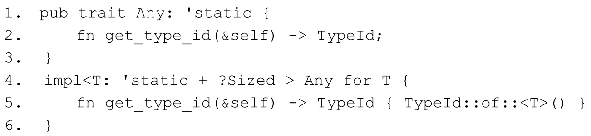{.u53622}
:::

代码清单12-1中第1～3行展示了**Any** 的定义，注意到该trait加上了**＇static** 生命周期限定，意味着该trait不能被非静态生命周期的类型实现。代码第4～6行显示，Rust中满足**＇static** 生命周期的类型均实现了它。

其中，get_type_id方法返回**TypeId** 类型，代表Rust中某个类型的全局唯一标识，它是在编译时生成的。每个TypeId都是一个"黑盒"，不能检查其内部内容，但是允许复制、比较、打印等其他操作。TypeId同样仅限于静态生命周期的类型，但在未来可能会取消该限制。

Any还实现了一些方法用于运行时检测类型，比如is方法，如代码清单12-2所示。

**代码清单12-2：Any中实现的is方法源码示意**

::: center
{.u53621}
:::

代码清单12-2中，为Any实现了is方法，因为Any是trait，所以这里的is方法的&self必然是一个trait对象。

代码第3行通过TypeId：：of函数来获取类型T的全局唯一标识符t。

代码第4行通过调用self的get_type_id方法，同样得到一个全局唯一标识符boxed。通过代码清单12-1也得知，get_type_id方法内部实际上也是调用了TypeId：：of函数。

代码第5行通过比较t和boxed是否相等，最终返回bool类型的值。

### 12.1.1 通过is函数判断类型 {#text00018.html#Af80f01ca-ba27-4b49-b6e2-f05ab1e2b658 .title-left}

代码清单12-3展示了is函数的一些用法。

**代码清单12-3：Any中实现的is方法源码示意**

::: center
{.u53620}
:::

::: center
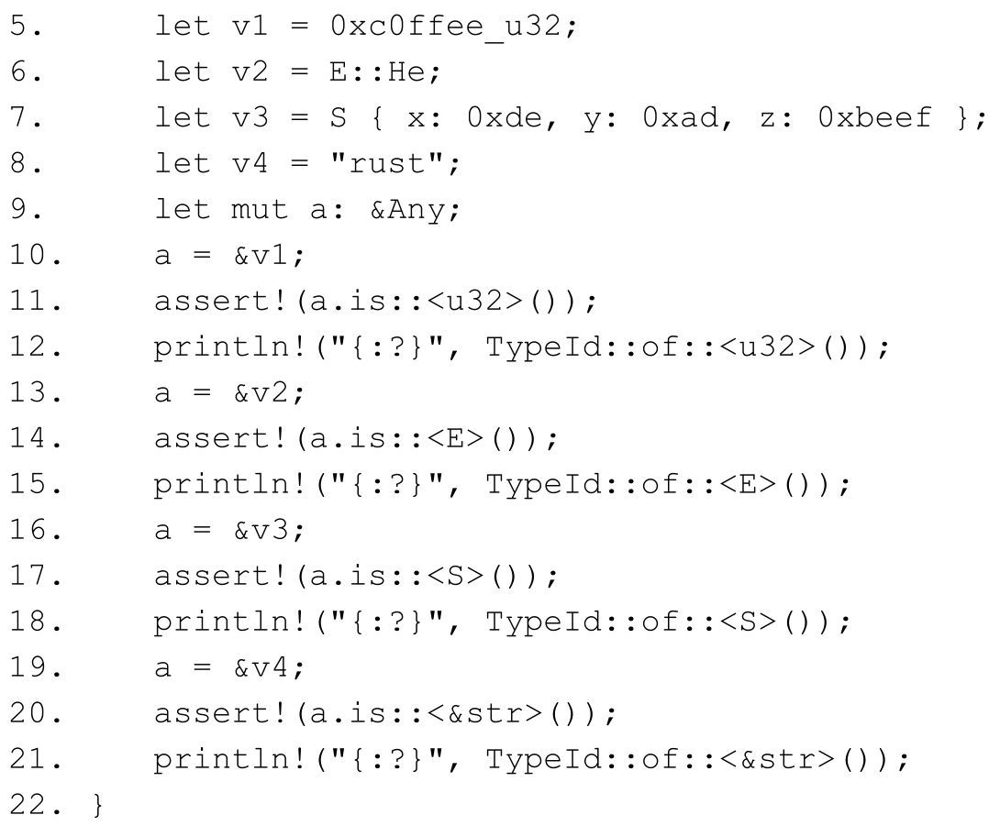{.u53619}
:::

代码清单12-3中，第2行和第3行是两个自定义类型，枚举体E和结构体S。在main函数中，通过调用is函数来判断类型。

代码第5～8行分别声明了绑定v1为u32类型、v2为枚举体实例、v3为结构体实例、v4为字符串字面量。

代码第9行声明了可变绑定a为&Any类型，&Any在此处用作trait对象。从第11行开始，直到第21行，是分别把a的值指定为v1到v4，然后通过is函数判断它们的类型。与此同时，使用了TypeId：：of方法分别打印这些类型的全局唯一标识符。

代码可以正常编译运行，输出结果如代码清单12-4所示。

**代码清单12-4：输出结果**

::: center
{.u53618}
:::

从代码清单12-4中看得出来，TypeId是一个结构体，其字段t存储了一串数字，这就是**全局唯一类型标识符** ，实际上是u64类型。代表唯一标识符的这串数字，在不同的编译环境中，产生的结果是不同的。所以在实际开发中，最好不要将TypeId暴露到外部接口中被当作依赖。

### 12.1.2 转换到具体类型 {#text00018.html#A0cc201cb-3a13-4ad1-8764-538b00ecb0cc .title-left}

Any也提供了**downcast_ref** 和**downcast_mut** 两个成对的泛型方法，用于将泛型T向下转换为具体的类型，返回值分别为Option＜&T＞和Option＜&mut T＞类型。其中downcast_ref将类型T转换为不可变引用，而downcast_mut将类型T转换为可变引用。代码清单12-5展示了downcast_ref的用法。

**代码清单12-5：使用downcast_ref向下转换类型**

::: center
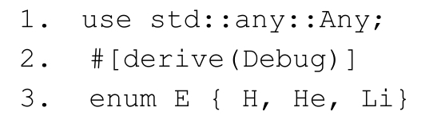{.u53617}
:::

::: center
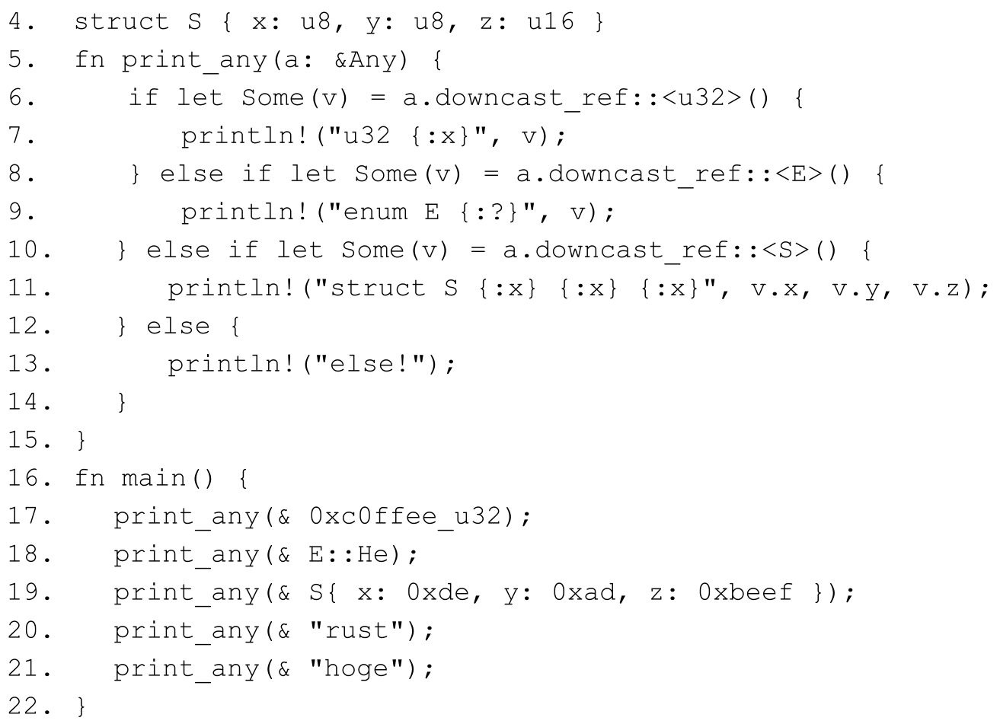{.u53616}
:::

代码清单12-5中，从第5～15行定义了print_any方法，以&Any作为参数类型。在print_any方法中，使用if let语句对downcast_ref的转换结果进行匹配，如果转换成功，则打印相应的结果。

在main函数中，分别将不同类型的值传入print_any函数中。这里需要注意的是，参数必须是引用，因为参数类型为trait对象，而大部分类型都实现了Any。最终的输出结果如代码清单12-6所示。

**代码清单12-6：打印结果**

::: center
{.u53615}
:::

除使用&Any外，也可以使用Box＜Any＞，如代码清单12-7所示。

**代码清单12-7：使用Box＜Any＞**

::: center
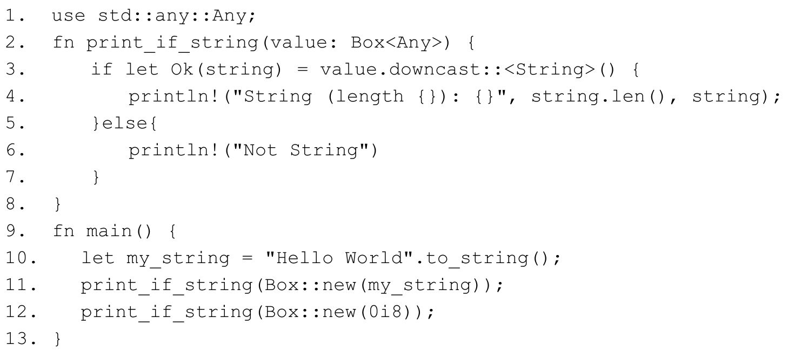{.u53614}
:::

代码清单12-7中定义了print_if_string函数，该参数使用了Box＜Any＞类型。这里需要注意，因为Box＜Any＞类型是独占所有权的类型，所以无法像代码清单12-5中的print_any方法那样匹配多种类型。

代码第3行的if let匹配中，使用了Box＜Any＞实现的downcast方法将类型转换为String。注意，downcast方法最终返回的是Result类型。

代码执行的结果如代码清单12-8所示。

**代码清单12-8：打印结果**

::: center
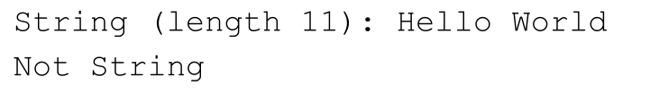{.u53613}
:::

### 12.1.3 非静态生命周期类型 {#text00018.html#Aaf5f01cd-a3c5-4a98-a3e0-5ed39777dff0 .title-left}

非静态生命周期类型没有实现Any，如代码清单12-9所示。

**代码清单12-9：非静态生命周期类型没有实现Any**

::: center
{.u53612}
:::

代码清单12-9中定义了一个带引用字段的结构体UnStatic＜＇a＞，注意其生命周期不是静态（**＇static** ）生命周期。

在main函数中，第6行声明了类型为&Any的绑定any，但是在第7行将UnStatic的引用实例&v绑定给any的时候，编译会出错。

如果使用一个静态生命周期的值生成UnStatic实例，则不会出现编译错误，如代码清单12-10所示。

**代码清单12-10：使用静态生命周期类型的值创建UnStatic实例**

::: center
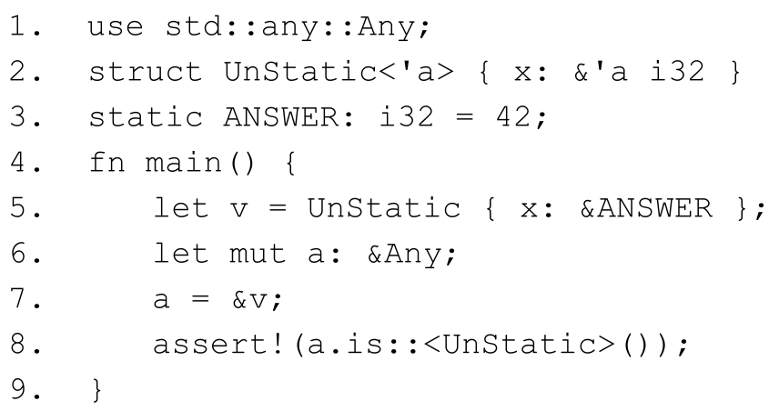{.u53611}
:::

代码清单 12-10 中，第 3 行新增了静态绑定 ANSWER，其生命周期是静态的，其引用&ANSWER也是静态的。所以在main函数中，使用&ANSWER创建的Unstatic实例v的生命周期也是静态的。所以，在本例中，UnStatic是实现了Any的类型。

代码第6行定义了&Any类型的可变绑定a，在第7行可以正常将&v绑定给a，同样在第8行可以正常调用is函数来判断类型。

## 12.2 宏系统 {#text00018.html#Ab09201ce-eb9b-401f-a370-68b9a6b5efd5 .title-left}

Rust 中反射功能虽然有限，但除此之外，Rust 还提供了功能强大的**宏** （Macro）来支持元编程。宏是一种批处理的称谓，通常来说，是指根据预定义的规则转换成相应的输出。这种转换过程叫作**宏展开** （Macro Expansion）。

### 12.2.1 起源 {#text00018.html#A930c01ce-1ef1-48e7-9c8c-70184d1f4633 .title-left}

现在很多语言都提供了宏操作，大致可以分为两类：**文本替换** 和**语法扩展** 。

C语言中的宏函数就属于文本替换，比如"＃define min（X，Y） （（X）＜（Y）？（X）：（Y））"，当调用min（1，2）时，通过预处理器将宏展开之后就会变为"（（1）＜（2）？（1）：（2））"。由于C的宏是纯文本替换，预处理器并不会对宏体做任何检查，所以使用它的时候经常会出现问题。

另外一种可以进行语法扩展的宏起源于Lisp语言。Lisp的宏可以利用**S表达式** （S-Expr），将代码作为数据，生成新的代码，而这些代码又可以被执行，这就赋予了Lisp宏强大的可能性，包括可以由此进行语法扩展，甚至创造新的语法。简单来说，Lisp宏就是将一个S表达式转变为另一个S表达式。如代码清单12-11所示。

**代码清单12-11：定义Lisp宏示意**

::: center
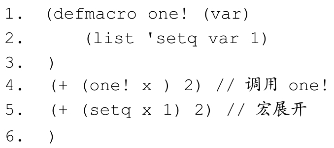{.u53610}
:::

代码清单12-11展示了Lisp语言中的宏定义。代码第1～3行通过defmacro定义了宏one！。代码第 4 行定义了一个使用 one！调用的 S 表达式，该表达式会通过宏展开，将 one！替换为"（setq x 1）"，从而生成新的S表达式"（+（setq x 1） 2）"。

所谓S表达式，是指人类可读的文本形式的一种三元结构，形如"（1 2 3）"，在Lisp语言中既可以作为代码，也可用作数据。代码清单12-11中"（+（setq x 1） 2）"就是一个S表达式。S表达式实际上等价于二叉树结构，如图12-1所示。

::: center
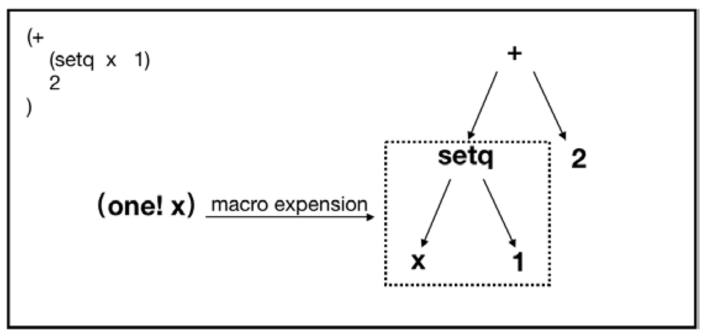{.u53609}

图12-1：S表达式等价于二叉树
:::

图12-1中展示了和S表达式等价的二叉树结构，其中每个节点就是S表达式中的元素。当S表达式中存在宏的时候，就会将其展开，从而让之前的S表达式形成新的S表达式。**这里值得注意的是** ，宏调用和函数调用之间的区别，宏调用产生的是S表达式，而函数调用会产生具体的值，认清这个区别比较重要。S表达式是Lisp语言的精华所在，这种思想对现在的很多语言都影响颇深。

除C语言的文本替换宏外，其他现代编程语言中提供的宏都可以通过直接操作抽象语法树的方式来进行语法扩展。不同的语言提供的宏形式有所不同。有的提供了显式的宏语法，比如defmacro、macro等关键字来定义宏，有的语言则通过其他形式，比如Python语言中的装饰器（decorator）和Ruby中的块（block），均可以达成操作抽象语法树的目的，殊途同归。而抽象语法树就等价于Lisp中的S表达式，用S表达式可以表示任何语言的抽象语法树。

Rust也不例外，开发者可以编写特定的宏，在编译时通过宏展开的方式操作抽象语法树，从而达到语法扩展的目的。

### 12.2.2 Rust中宏的种类 {#text00018.html#Afde701cf-35b7-4674-b4c7-935f403dc5f3 .title-left}

Rust的宏系统按定义的方式可以分为两大类：

· **声明宏** （Declarative Macro）

· **过程宏** （Procedural Macro）

声明宏是指通过 macro_rules！声明定义的宏，它是 Rust 中最常用的宏。当前在 Nightly版本的Rust之下，使用**＃！\[feature（decl_macro）\]** 就允许使用macro关键字来定义声明宏，在不远的将来，**macro** 关键字会在Stable版的Rust中稳定下来。

过程宏是编译器语法扩展的方式之一。Rust允许通过特定的语法编写编译器插件，但该编写插件的语法还未稳定，所以提供了过程宏来让开发者实现自定义派生属性的功能。比如Serde库中实现的**＃\[derive（Serialize，Deserialize）\]** 就是基于过程宏实现的。

具体到宏使用的语法形式又分为以下两种：

· **调用宏** ，形如 println！、assert_eq！、thread_local！等可以当作函数调用的宏。这种形式的宏通常由声明宏来实现，也可以通过过程宏实现。

· **属性宏** ，也就是形如**＃\[derive（Debug）\]** 或**＃\[cfg\]** 这种形式的语法。这种形式的宏可以通过过程宏来实现，也可以通过编译器插件来实现。

按宏的来源，可以分为以下两类：

· **内置宏** ，是指Rust本身内置的一些宏，包括两种：一种由标准库中具体的代码实现，另一种属于编译器固有行为。

· **自定义宏** ，是指由开发者自己定义的声明宏或者过程宏等。

代码清单12-12展示了声明宏定义。

**代码清单12-12：定义unless！宏**

::: center
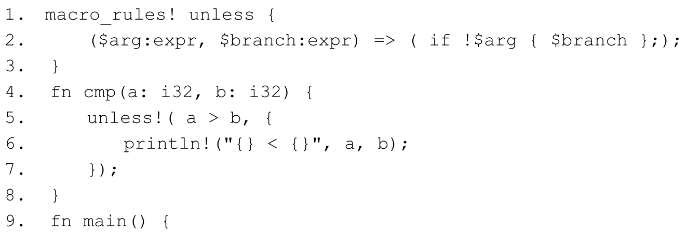{.u53597}
:::

::: center
{.u53565}
:::

代码清单12-12中使用macro_rules！定义了unless！声明宏，暂时不需要理会代码第2行所示的具体代码是什么意思，后面会进行详细介绍。现在只需要知道unless！宏可以在条件为假的情况下执行分支代码。

在代码第4～8行定义了cmp函数，并调用unless！宏判断a和b的大小，如果a大于b为假，则打印相应的结果。最终代码会输出"1＜2"。

代码清单12-13展示了过程宏实现的自定义派生属性用例。

**代码清单12-13：使用自定义派生属性示例**

::: center
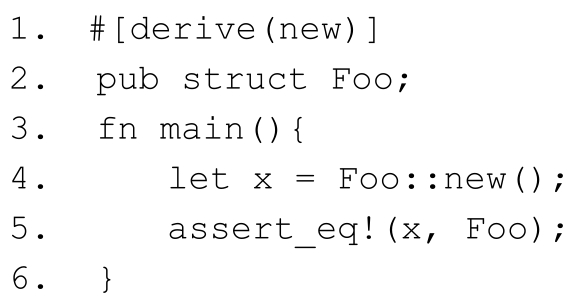{.u53608}
:::

代码清单12-13**假定** 已经实现了自定义派生属性new，可以通过**＃\[derive（new）\]** 的方式为结构体Foo在编译时自动生成new方法，如代码第1行和第2行所示。

在main函数中，可以直接调用new方法来创建Foo结构体的实例x。目前可以利用过程宏的方法来自定义派生属性，具体如何实现，在本章后面会有详细介绍。

代码清单12-14展示了两种内置宏的定义。

**代码清单12-14：内置宏展示**

::: center
{.u53607}
:::

代码清单12-14中代码第1行展示的是**stringify！** 宏，它的作用是可以将任何代码转换为字符串，通过源码可以看出，该宏的行为属于编译器内置行为，所以在源码层面上并未体现出具体的实现。

代码第2～7行是最常见的println！宏。看得出来，它不属于编译器内置行为，而属于标准库内定义的声明宏，其中用到的 concat！也属于编译器内置行为的宏，而 print！是另外一个声明宏。

那么，如何编写自定义声明宏或过程宏呢？声明宏和过程宏的工作原理分别是什么？在寻找这两个问题的答案之前，还需要先了解Rust代码的编译过程。

### 12.2.3 编译过程 {#text00018.html#A7bc801d0-d9e6-48f6-ad9c-eab428bb39ba .title-left}

回顾一下Rust的整个编译过程，如图12-2所示。

::: center
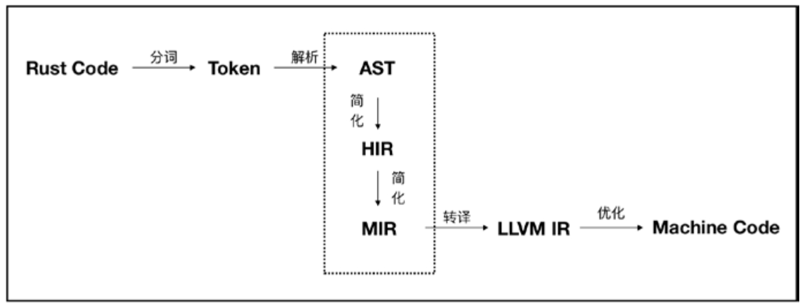{.u53606}

图12-2：Rust代码编译过程
:::

Rust源码的整个编译过程可以大致分为六个主要阶段 ^[\[1\]](#text00018.html#n7F6901D11183453DAB96A5D8143A00C4){#text00018.html#n7F6901D11183453DAB96A5D8143A00C4s}^ ：

1.**分词阶段** ，通过词法分析将源码分为一系列的词条（Token）。

2.**解析阶段** ，通过语法解析，将词条解析为抽象语法树（AST）。

3.**提炼HIR** ，通过对抽象语法树进一步提炼简化，得到高级中间语言（High-Level IR，HIR），专门用于类型检查和一些相关的分析工作。HIR相比于AST，简化了语法信息，因为HIR不需要知道代码的语法元素。

4.**提炼MIR** ，通过对HIR的再次提炼，剔除一些不必要的元素之后得到中级中间语言（Middle-Level IR，MIR），专门用于检查以及其他的优化工作，比如支持增量编译等。

5.**转译为LLVM IR** ，将MIR转译生成为LLVM IR语言，交由LLVM去做后续处理。

6.**生成机器码** ，将LLVM IR经过一系列的优化生成机器码（.o）文件，最终交给链接器处理。

以上工作均由Rust编译器来完成，不同的阶段使用了不同的内部组件，并且不同的编译阶段有不同的工作目标。现在只关注与宏系统相关的分词和解析。

**词条流**

Rust代码编译的第一步，就是通过词法分析把代码文本分词为一系列的词条（Tokens），以代码清单12-15中的普通函数作为示例来看词法分析如何分词。

**代码清单12-15：普通函数示例**

::: center
{.u53605}
:::

可以将代码清单12-15中的代码保存为一个Rust文件，假定是**main.rs** 文件。亦或是使用 Cargo 生成一个二进制 crate 项目，将上面的代码放到 src/main.rs 文件中。当使用 **rustc mian.rs** 或**cargo build** 命令编译时，编译器就会按之前所述的流程对代码进行处理。

词条一般包括以下几类：

· **标识符** ，源码中的关键字、变量等都将被识别为标识符。

· **字面量** ，比如字符串字面量。

· **运算符** ，比如加、减、乘、除、逻辑运算符等。

· **界符** ，比如分号、逗号、冒号、圆括号、花括号、箭头等。

以函数**t** 为例来说，编译器会对该函数从左到右依次识别。**fn** 关键字会被识别为一个标识符（Identifier），函数名t同样也是一个标识符。当碰到圆括号的时候，编译器会以圆括号为界，将其看作一个独立的组合进行分词处理。函数签名代表返回值的右箭头（-＞）也会被识别为一个独立的界符词条，返回值类型 i32 同样也是一个标识符。最后的函数体会以花括号为界，作为一个独立的组合进行分词处理。

通过编译器提供的命令可以查看代码清单12-15生成的词条和抽象语法树信息，如代码清单12-16所示。

**代码清单12-16：输出语法树的rustc命令**

::: center
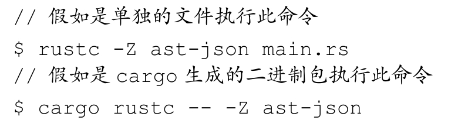{.u53604}
:::

该命令会生成JSON格式的AST信息，其中包含了词法分析之后的词条信息和抽象语法树信息。图12-3展示了从JSON信息中提取到的词条信息。

::: center
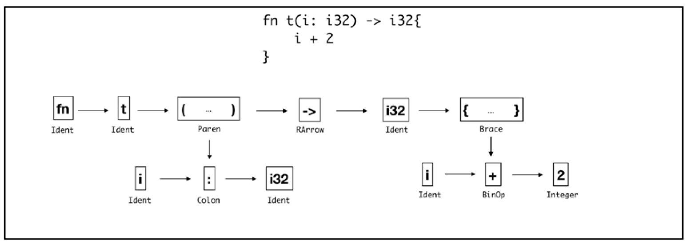{.u53603}

图12-3：词条信息示意
:::

图12-3展示了经过词法分析后函数t的词条信息。看得出来，代码中的空格换行已经被丢弃，关键字等各种语法元素已经被识别为单独的词条。整段函数最后就变为由词条组成的序列，称为词条流。词条流对于编译器后续生成抽象语法树来说意义重大。

**抽象语法树**

词条流虽然可以区分标识符、括号或箭头等其他语法元素，但本身并不携带任何语法信息，必须经过语法解析阶段，生成抽象语法树，编译器才能最终识别Rust代码的意义。

代码清单12-17展示了另外一个较复杂的示例。

**代码清单12-17：另外一个较复杂的示例**

::: center
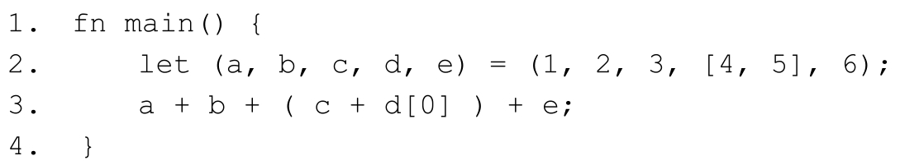{.u53602}
:::

代码清单12-17定义了多个变量，代码第3行对多个变量进行求和。之所以称其为"复杂的示例"，是因为该示例生成的抽象语法树比代码清单12-15中的复杂。

图12-4展示了代码第3行编译后产生的抽象语法树结构示意。

::: center
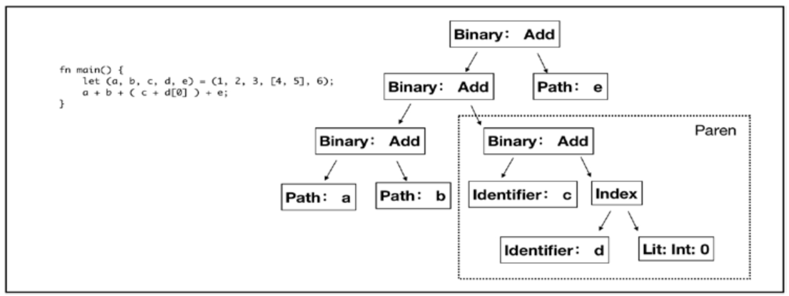{.u53601}

图12-4：抽象语法树示意
:::

图12-4展示的抽象语法树可以用S表达式表示，如代码清单12-18所示。

**代码清单12-18：用S表达式来表示抽象语法树**

::: center
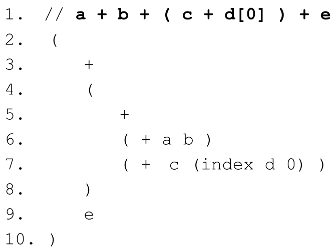{.u53600}
:::

在生成抽象语法树之后，编译器就可以完全识别原始代码中所携带的语法信息。接下来只需要依次遍历节点就可以进行之后的工作，比如，节点中如果包含了宏，则继续将其展开为抽象语法树，直到最终节点中不包含任何宏为止。

### 12.2.4 声明宏 {#text00018.html#Ab3d301d3-c494-41a8-a8f4-febf932845a9 .title-left}

声明宏是Rust语言中最常用的宏，它可以通过macro_rules！来创建，它有时也被称为"示例宏（Macro by example，MBE）"。

**声明宏的定义和展开过程**

使用macro_rules！定义声明宏，基本满足如代码清单12-19所示的格式。

**代码清单12-19：macro_rules！定义声明宏的格式示意**

::: center
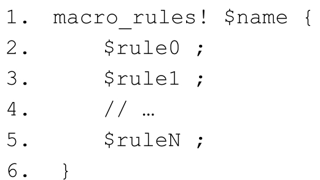{.u53599}
:::

代码清单12-19是伪代码示意，其中**\$name** 表示宏的名字，**\$rule0** 到**\$ruleN** 表示N个宏要匹配的规则。其中每个规则也有固定的格式，如代码清单12-20所示。

**代码清单12-20：声明宏中每个匹配规则要满足的格式示意**

::: center
{.u53598}
:::

代码清单12-20中，**\$pattern** 代表每个匹配规则的模式，**\$expansion** 代表与模式相应的展开代码。以之前代码清单 12-12 中出现过的 **unless！** 宏定义来说，匹配模式为"（\$arg：expr，\$branch：expr）"，展开代码是"（if！\$arg{\$branch}；）"。声明宏中定义的规则也属于一种类似于match的模式匹配。

匹配模式中"\$arg：expr"这种格式为声明宏定义中的通用格式。**\$arg** 为**捕获变量** ，可以自由命名，但必须以"\$"字符开头。冒号后面的叫**捕获类型** ，在该示例中 expr 对应于宏解析器解析生成之后词条的类型，指代表达式。

展开代码中包含了捕获变量\$arg和\$branch，表示在宏规则匹配成功之后，将捕获到的变量的内容替换到相应的位置，从而达到生成代码的目的。

代码清单12-21继续沿用了unless！宏定义。

**代码清单12-21：unless宏定义示例**

::: center
{.u53597}
:::

可以将代码清单12-21中的代码保存为Rust文件，比如main.rs。然后对其进行编译，即可得到宏展开后的代码，如代码清单12-22所示。

**代码清单12-22：输出宏展开后代码的编译器命令**

::: center
{.u53596}
:::

宏展开后的代码如代码清单12-23所示。

**代码清单12-23：宏展开后的代码**

::: center
{.u53595}
:::

宏展开的过程如图12-5所示。

::: center
{.u53594}

图12-5：宏展开过程示意
:::

代码清单12-21中第6～8行unless！宏调用的展开过程如图12-5所示。看得出来，unless！宏调用之时，先根据宏定义中火箭符（=＞）左侧的模式进行匹配，然后根据匹配之后捕获的结果对火箭符右侧的展开代码进行替换。这个匹配和替换的过程就是宏展开，整个过程发生在语法解析阶段。

实际上，编译器内部有两个解析器，一个是**通用解析器** （Normal Parser），另一个是**宏解析器** （Macro Parser）。通用解析器用于处理大部分词条流进一步生成抽象语法树，但是在碰到宏调用时则会跳过，并不对宏调用进行任何处理，反而会在抽象语法树中保留宏调用节点。然后，宏解析器会将这些宏调用节点展开为正常的抽象语法树节点，如图12-6所示。

::: center
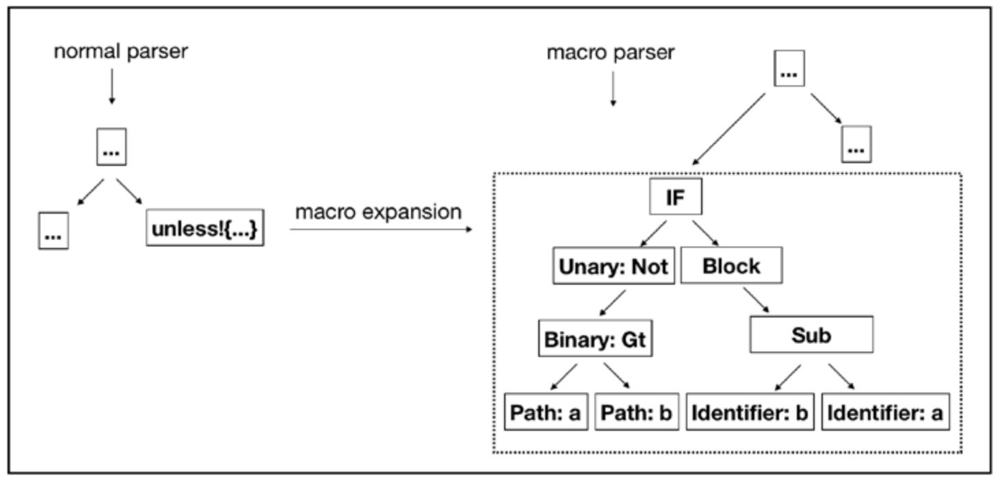{.u53593}

图12-6：宏解析器将宏调用节点展开为正常的AST节点示意
:::

图12-6以unless！宏调用为例，首先经过通用解析器解析完整个模块中的代码，但是只保留unless！宏调用节点，没有对它进行处理。然后宏解析器会将unless！宏调用节点进一步展开为正常的抽象语法树节点。

**声明宏的工作机制**

宏解析器的工作机制大概等价于代码清单12-24所示的函数签名。

**代码清单12-24：宏解析器工作机制等价的函数签名示意**

::: center
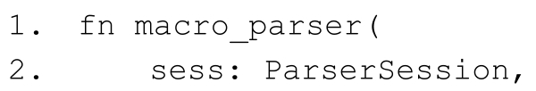{.u53592}
:::

::: center
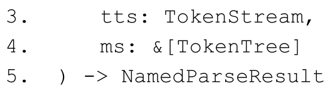{.u53591}
:::

代码清单12-24中的函数签名macro_parser定义了三个参数：

· **sess** ，代表解析会话，用于跟踪一些元数据，包括错误信息等。

· **tts** ，代表**词条流** （TokenStream），是词条序列的抽象表示。

· **ms** ，代表匹配器，代表一组词条树结构。

另一方面，macro_rules！本身也是一种声明宏，只不过它由编译器内部 ^[\[2\]](#text00018.html#nD38E01D66FBC45C0B3DE7B9F6EAFB11B){#text00018.html#nD38E01D66FBC45C0B3DE7B9F6EAFB11Bs}^ 所定义。它定义了一种声明宏的通用解析模式，形如代码清单12-24所示。

**代码清单12-24：宏定义通用模式示意**

::: center
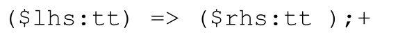{.u53590}
:::

也就是说，当宏解析器碰到 macro_rules！定义的声明宏时，它会使用这个模式来解析该声明宏，将宏定义中火箭符左右两侧都解析为**tt** ，即**词条树** 。然后，宏解析器会将左右两侧的词条树保存起来作为宏调用的匹配器（ms）。结尾的"+"代表该模式可以是一个或多个。

当宏解析器碰到宏调用时，首先会将宏调用中的具体参数解析为词条流（tts），然后在之前保存的匹配器（ms）中取左侧的词条树（\$lhs）来匹配该词条流。对于代码清单 12-21 中unless！宏调用的示例来说，其调用参数"（a＞b，{b-a；}）"会被宏解析器解析为词条流（tts）和宏定义中"（\$arg：expr，\$branch：expr）"生成的词条树进行匹配，最终，"a ＞ b"匹配到"\$arg：expr"，"{b-a；}"匹配到"\$branch：expr"。然后通过捕获变量\$arg和\$branch替换匹配器（ms）中右侧的词条树（\$rhs）上相应的代码，替换后的\$rhs 词条树将生成最终的代码。

这就是宏解析器展开声明宏的全过程，整个过程和正则表达式的工作机制类似。匹配器（ms）相当于正则表达式中的模式，而宏调用参数生成的词条流则相当于正则表达式待匹配的字符串。甚至，宏定义中规则的模式是可以像正则表达式那样使用元符"+"或"\*"来指定重复的，分别代表重复一次或一次以上。

前面的宏示例中也出现过声明宏内嵌套另外一个声明宏的情况，宏解析器碰到这样的嵌套会继续将其展开，直到抽象语法树中再无任何宏调用节点。但也不是无限制地展开，编译器内设置了一个上限来限定嵌套展开次数，如果超过该次数还存在宏调用节点，则编译器会报错。开发者也可以通过指定**＃！\[recursion_limit=＂...＂\]** 属性来修改包内允许的嵌套展开次数上限。

声明宏中可以捕获的类型不仅仅是表达式（expr），以下是捕获类型列表。

· **item** ，代表语言项，就是组成一个Rust包的基本单位，比如模块、声明、函数定义、类型定义、结构体定义、impl实现等。

· **block** ，代表代码块，由花括号限定的代码。

· **stmt** ，代表语句，一般是指以分号结尾的代码。

· **expr** ，指代表达式，会生成具体的值。

· **pat** ，指代模式。

· **ty** ，表示类型。

· **ident** ，指代标识符。

· **path** ，指代路径，比如foo、std：：iter等。

· **meta** ，元信息，表示包含在＃\[...\]或＃！\[...\]属性内的信息。

· **tt** ，TokenTree的缩写，指代词条树。

· **vis** ，指代可见性，比如pub。

· **lifetime** ，指代生命周期参数。

在写声明宏规则的时候，要注意这些捕获类型匹配的范围。比如tt类型，代表词条树，就比expr能匹配的范围要广，需要根据具体的情况来选择。只有了解声明宏的规则及其工作机制之后，才可以毫无障碍地编写声明宏。

**声明宏的实现技巧**

接下来，以一个具体的示例来说明实现声明宏过程中需要注意的地方。Rust中初始化一个HashMap写起来比较烦琐，现在通过实现一个宏来简化这个过程。如代码清单12-25所示。

**代码清单12-25：hashmap！宏用法示意**

::: center
{.u53448}
:::

代码清单12-25展示了hashmap！宏的最终用法，看上去非常简单且直观。这也是创建一个声明宏的第一步，先确定它将来要使用的形式。接下来如何实现该宏呢？

首先，匹配"key=＞value"这样的定义格式。按照声明宏的语法规则，首先能想到的匹配模式就是"\$key：expr=＞\$value：expr"，不管key还是value，在Rust里至少是一个表达式。但是，这样的键值对可能不止一对，而且数目是无法确定的。这就要求匹配模式可以重复匹配，幸好，Rust的声明宏支持重复匹配。

声明宏重复匹配的格式是"\$（...） sep rep"，具体说明如下：

· **\$（...）** ，代表要把重复匹配的模式置于其中。

· **sep** ，代表分隔符，常用逗号（，）、分号（；）和火箭符（=＞）。这个分隔符可依据具体的情况省略。

· **rep** ，代表控制重复次数的标记，目前支持两种：星号（\*）和加号（+），代表的意义和正则表达式中的一致，分别是"重复零次及以上"和"重复一次及以上"。

那么，根据这样的规则，之前的匹配模式就改进为"\$（\$key：expr=＞\$value：expr），\*"，中间的分隔符用了逗号，这是因为每个键值对后面都有一个逗号进行分隔，当然也可以不用逗号分隔，**宏里的语法可以自由设计** 。当前示例中选择使用逗号分隔。

到此，可以写出第一版hashmap！宏，如代码清单12-26所示。

**代码清单12-26：hashmap！宏的实现**

::: center
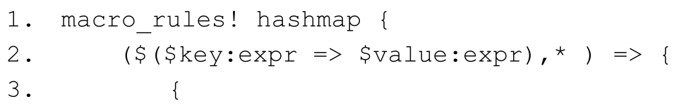{.u53589}
:::

::: center
{.u53585}
:::

在代码清单12-26中，代码第2行使用了"\$（\$key：expr=＞\$value：expr），\*"模式，该模式在处理最后一行键值对的时候，只能匹配没有逗号结尾的情况。匹配过程如图12-7所示。

::: center
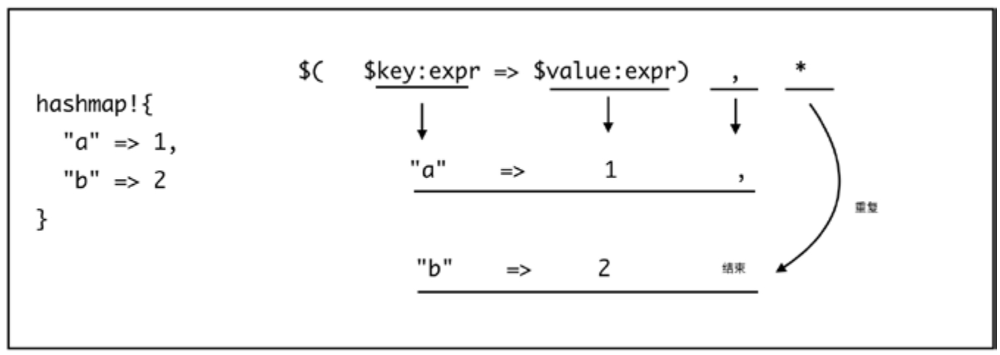{.u53588}

图12-7：hashmap！宏匹配过程示意
:::

代码第4行在生成代码中定义一个空的HashMap实例_map。注意，这里使用了绝对路径：：std：：collections：：HashMap，这也是一个技巧，可以避免冲突。

代码第5～7行与匹配模式中的重复格式相对应，也使用"\$（...）\*"格式，不同点在于不需要分隔符了。在_map里插入键值对，也需要根据匹配捕获的键值对重复插入。

最终hashmap！宏调用展开的结果如代码清单12-27所示。

**代码清单12-27：hashmap！调用展开后代码示意**

::: center
{.u53587}
:::

代码清单12-27中展示的正是预料中的代码。但是目前该宏还有一个问题，就是在调用的时候，最后一个键值对加上逗号时，编译就会出错。之前最后的键值对没有逗号的时候，匹配模式匹配完该键值对就会正常结束，但是现在加了逗号，当匹配模式匹配完逗号之后，就会继续匹配星号，从而激活重复匹配，但此时后续已经没有键值对供其匹配了。所以会报错，编译器宣告该宏意外结束。

解决这个错误有两种办法，第一种就是利用宏的递归调用，将最后一行的逗号消去，如代码清单12-28所示。

**代码清单12-28：hashmap！递归调用消去最后键值对的结尾逗号**

::: center
{.u53586}
:::

::: center
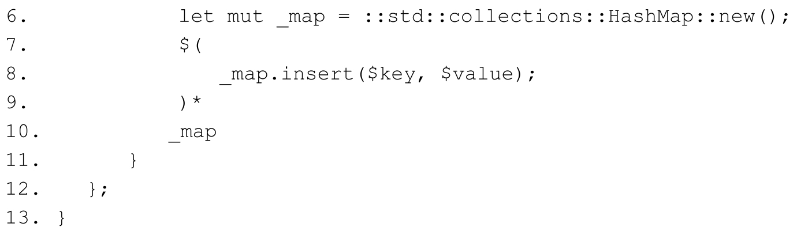{.u53585}
:::

代码清单 12-28 中第 2 行是新添加的一条匹配规则，注意其左侧的匹配规则为"\$（\$key：expr=＞\$value：expr，）\*"，逗号在匹配模式里面，而右侧递归调用了hashmap！宏。所以，该行规则经过"hashmap！（\$（\$key=＞\$value），\*）"匹配之后，实际上会将"hashmap！（＂a＂=＞1，＂b＂=＞2，）替换为"hashmap！（＂a＂=＞1，＂b＂=＞2）"。再次调用hashmap！的时候就会和代码清单12-27一样直接匹配第二条规则生成代码。

另外一种方法更简单了，只需要利用重复匹配的技巧即可，如代码清单12-29所示。

**代码清单12-29：利用重复匹配技巧来匹配结尾逗号**

::: center
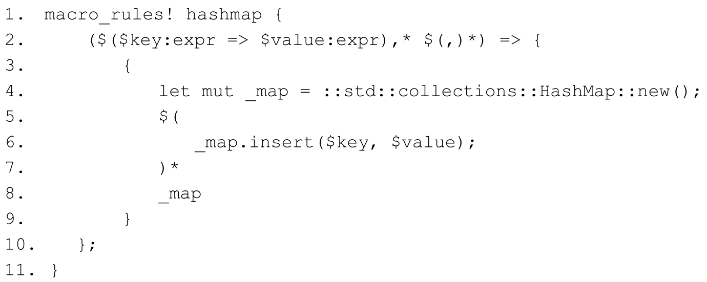{.u53584}
:::

代码清单12-29中，在之前匹配模式"\$（\$key：expr=＞\$value：expr，）"**的基础上，增加了** "**\$（，）** \*"，变为"\$（\$key：expr=＞\$value：expr，）\***\$（，）** \*"。这样就可以同时匹配最后键值对结尾是否带逗号的情况。

这下 hashmap！宏就可以正常使用了，但它还有改进空间。假如要在创建 HashMap 的时候根据给定键值对的个数来预分配容量，该如何修改？

首要的问题就是要计算出键值对的个数。只需要想办法生成如代码清单12-30所示的代码即可。

**代码清单12-30：生成代码示意**

::: center
{.u53583}
:::

代码清单 12-30 中，是想利用 len 方法来计算传入键值对的个数，知道个数以后就可以使用HashMap的with_capacity方法来预分配容量。因为len方法是**\[T\]** 类型实现的方法，所以可以通过"＜\[（）\]＞：：len（&\[..\]）"这样的形式来调用。这里借用了"\[（）\]"类型来辅助计算键值对的个数，其实也可以使用其他类型，比如 String 字符串，但是这里用单元类型"（）"的好处是不占用空间。

接下来的问题就是，如何构造这个用于辅助计算键值对个数的"\[（）\]"类型数组。基本思路如图12-8所示。

::: center
{.u53582}

图12-8：将给定的键值对替换为指定单元值数组过程示意
:::

图12-8示意的思路如下：

· 通过匹配输入的键值对，得到所有的键。

· 将所有的键通过匹配替换为单元值。

· 生成最终预期的代码。

这里需要匹配两次，意味着可以通过创建两个不同的宏来完成需求。如代码清单 12-31所示。

**代码清单12-31：可根据键值对个数预分配的hashmap！宏**

::: center
{.u53581}
:::

代码清单12-31中又定义了两个宏unit！和count！，借助这两个宏来完成图12-8所示的替换过程。具体的宏规则匹配过程如图12-9所示。

::: center
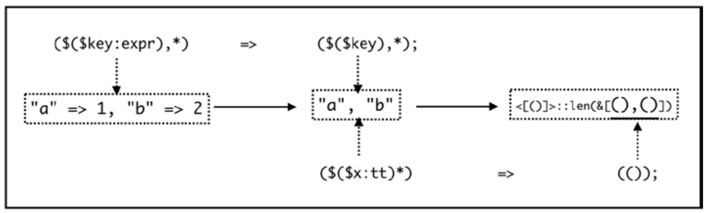{.u53580}

图12-9：unit！和count！宏规则匹配示意图
:::

代码清单 12-31 虽然完成了预定的目标，但是引入了另外两个宏。这就导致目标宏hashmap！依赖于两个独立的宏，如果以后想把hashmap！宏放到独立的包（crate）中对外公开，那依赖的这两个独立的宏也必须公开，但是这两个宏对外部来说，基本没有其他作用。如何解决这个问题呢？答案很简单，只需要把依赖的两个宏转移到hashmap！宏定义内部作为内部规则即可，如代码12-32所示。

**代码清单12-32：在hashmap！宏内部定义依赖宏**

::: center
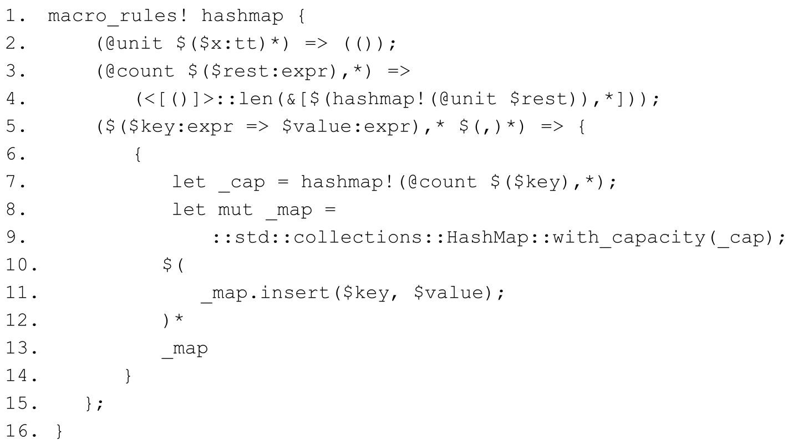{.u53579}
:::

注意代码清单12-32中第2～4行，分别把unit！宏和count！宏的定义移到了hashmap！宏定义内部，并且这里利用了宏递归调用的特性。在代码第7行，当hashmap！宏调用第一次匹配时，内部规则就会被激活，经过递归替换，最终生成目标代码。

其中"@unit"和"@count"相当于是内部宏规则的宏名，暂且称之为**内部宏** ^[\[3\]](#text00018.html#n916001DBCDCE45C5BC697DCFB9011E40){#text00018.html#n916001DBCDCE45C5BC697DCFB9011E40s}^ 。内部宏的名字必须放到真正的匹配规则之前，否则编译器会将其当作普通的匹配规则去处理。内部宏的名字并非必须用"@"符号开头，它只是一种社区惯用法。你可以使用"unit"或"unit！"命名。

**调试宏**

调试宏代码基本有**两种办法** ：

· 使用编译器命令来输出展开后的代码，如代码清单12-32所示。

· 在Nightly版本下使用＃！\[feature（trace_macros）\]属性来跟踪宏展开过程。

代码清单12-33展示了如何给代码清单12-32中定义的hashmap！跟踪宏展开过程。

**代码清单12-33：调试hashmap！宏**

::: center
{.u53578}
:::

代码清单12-33中使用了＃！\[feature（trace_macros）\]属性，注意此时必须使用Nightly版本的Rust才能编译。在代码第17行也就是hashmap！宏调用的上方，加上trace_macros！（true）就可以调试宏展开过程。

编译结果如代码清单12-34所示。

**代码清单12-34：编译输出hashmap！宏调试信息**

::: center
{.u53577}
:::

代码清单12-34展示了编译过程中输出的调试信息，完整地展示了hashmap！宏的展开过程。除trace_macros！宏外，还有其他的宏调试方法。限于篇幅，这里不再展开介绍。

**声明宏的卫生性**

声明宏在展开后，不会污染原来的词法作用域，具有这种特性的宏叫**卫生宏** （Hygienic Macro）。Rust的声明宏具有部分卫生性，如代码清单12-35所示。

**代码清单12-35：展示声明宏的卫生性**

::: center
{.u53576}
:::

代码清单12-35如果编译，会报错，如代码清单12-36所示。

**代码清单12-36：错误信息**

::: center
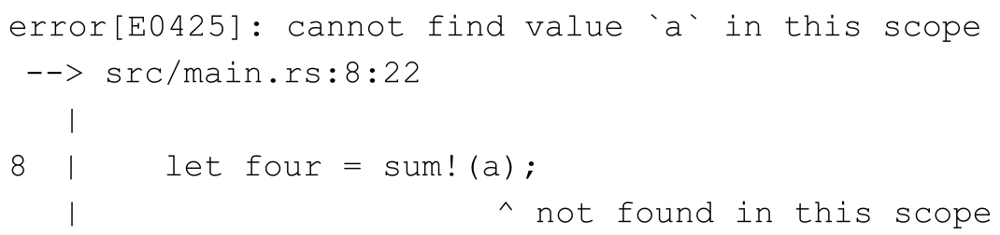{.u53575}
:::

代码清单 12-36 的错误信息提示，在当前作用域找不到变量 a。预想中，sum！宏如果展开以后，会有一个变量a的定义，如代码清单12-37所示。

**代码清单12-37：假想中sum！展开后的代码**

::: center
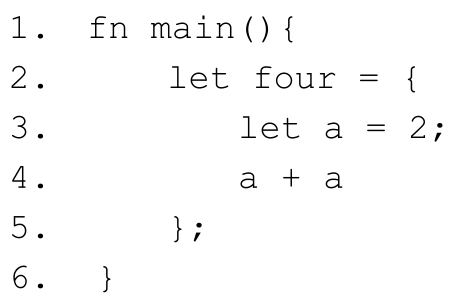{.u53574}
:::

事实上，声明宏展开以后的代码拥有独立的作用域，并不会污染当前宏调用的作用域。所以Rust编译器会报找不到变量a的错误。这就体现了Rust声明宏的卫生性。

目前Rust 声明宏的卫生性并不完整，只有对变量和标签（比如循环外部的标签＇out）可以保证卫生。像生命周期、类型等都无法保证卫生性，所以在写宏的时候，需要注意，在宏里如果使用非当前作用域内定义的变量，一定要用绝对路径，并且这些变量必须在使用宏的任何地方都可见。在宏的卫生性方面，Rust还在逐渐完善。

**导入/导出**

在日常开发中，经常会将一些常用的宏打包起来方便使用，从而提高开发效率。比如，可以将hashmap！宏打包起来。为了演示，现在使用cargo命令创建一个二进制包，此处命名为hashmap_lite，默认会生成src/main.rs文件。然后在src文件夹内创建一个lib.rs文件，代码结构如代码清单12-38所示。

**代码清单12-38：hashmap_lite包代码结构示意**

::: center
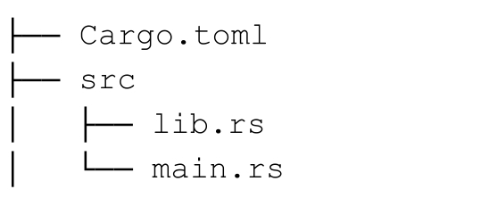{.u53573}
:::

然后，将hashmap！的宏定义代码复制到src/lib.rs文件中，如代码清单12-39所示。

**代码清单12-39：src/lib.rs代码示意**

::: center
{.u53572}
:::

注意代码清单12-39中使用了**＃\[macro_export\]** 属性，表示其下面的宏定义hashmap对其他包也是可以见的。然后在src/main.rs中使用＃\[macro_use\]属性导入此宏，如代码清单12-40所示。

**代码清单12-40：src/main.rs代码示意**

::: center
{.u53571}
:::

代码清单12-40中，如果是Rust 2015，则使用＃\[macro_use\]属性用在extern crate之前，表示将hashmap_lite中定义的宏hashmap！导出，然后main函数中才可以自由使用hashmap！宏。需要注意的是，在Rust 2015中只有在包的根文件下才可以为extern crate使用＃\[macro_use\]属性。如果是Rust 2018，则只需要使用use将hashmap_lite：：hashmap导入即可。并且在Rust 2018 中，外部crate 中定义的宏是可以在根文件之外的地方导入的。也就是说，哪里需要就在哪里导入。

＃\[macro_use\]属性也可以用于导出同一个包内mod定义的模块上。如代码清单12-41所示。

**代码清单12-41：使用＃\[macro_ues\]导出mod模块中的宏**

::: center
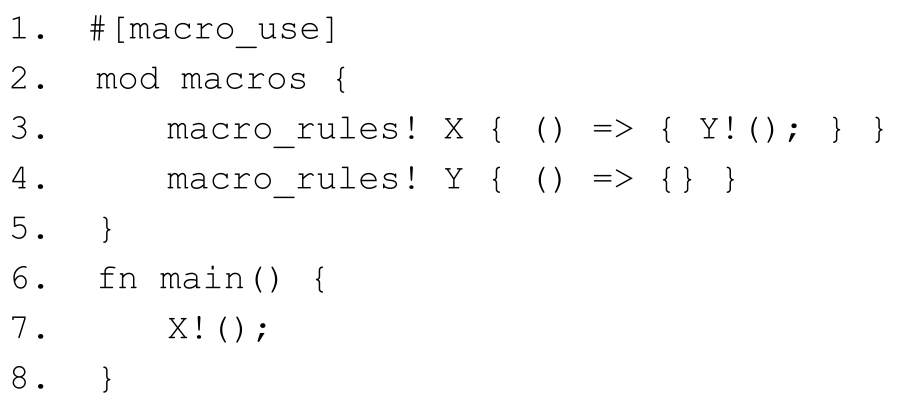{.u53570}
:::

代码清单12-41中X！可以被正常调用。

当宏被导出到包外被使用的时候，可能会碰到麻烦。有时候导出的宏定义内部会依赖包内的一些函数，如代码清单12-42所示。

**代码清单12-42：mycrate内定义的宏依赖于函数incr**

::: center
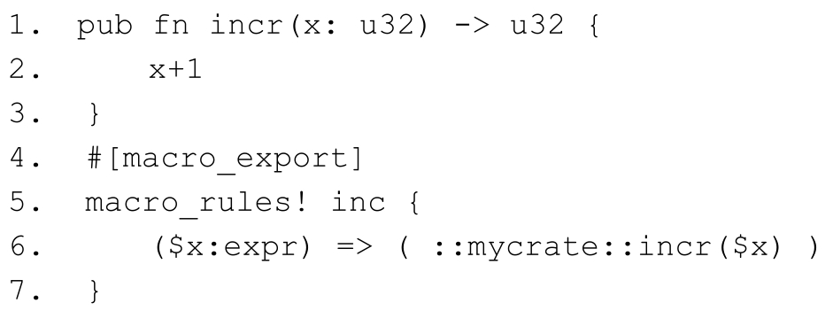{.u53569}
:::

代码清单12-42展示了mycrate包内宏定义依赖于本地的函数incr，所以在inc！宏定义内部使用了绝对路径"：：mycrate：：incr（\$x）"来调用该函数。但是实际情况中，使用mycrate包的时候有可能将其改名，如代码清单12-43所示。

**代码清单12-43：extern crate mycrate改名为mc**

::: center
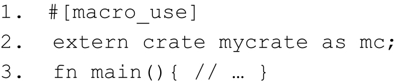{.u53568}
:::

碰到代码清单12-43所示的这种情况时，inc！宏中依赖的函数调用就会失效。Rust为此提供了一种解决方案：在宏定义内使用\$crate变量。如代码清单12-44所示。

**代码清单12-44：使用\$crate变量**

::: center
{.u53567}
:::

代码清单12-44使用&crate变量，就可以在该宏定义被导出的时候，自动根据上下文来选择函数调用路径中的包名，比如在代码清单12-43所示的情况下，会使用"：：mc：：incr（\$x）"。

另外需要注意的是，如果一个包中导入多个声明宏包含了重复的命名，则最后导入的声明宏会覆盖先导入的声明宏定义。

**使用macro关键字**

目前只有在 Nightly 版本的 Rust 之下，使用＃！\[feature（decl_macro）\]属性才能使用 macro关键字。如代码清单12-45所示。

**代码清单12-45：使用macro关键字**

::: center
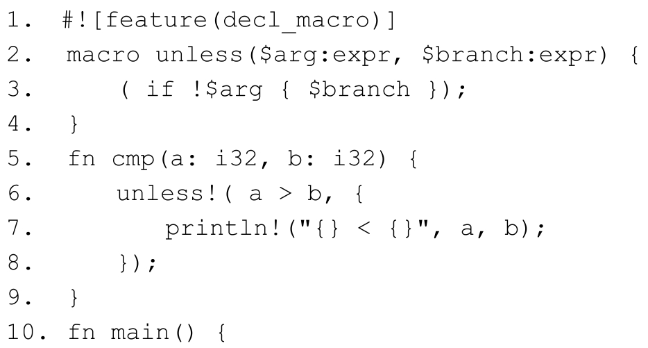{.u53566}
:::

::: center
{.u53565}
:::

代码清单12-45中使用macro关键字重新定义unless！宏的代码。比起macro_rules！定义的宏可读性更高。然而macro关键字属于官方的宏2.0计划，在不久的将来会稳定发布，到时候就不需要使用feature属性了。

### 12.2.5 过程宏 {#text00018.html#A631101e0-9cbd-477c-a6c0-6eb578b20d50 .title-left}

使用声明宏可以实现像函数一样被调用的宏，但是也仅局限于代码自动生成的场景。对于需要语法扩展的场景用声明宏无法满足，比如为现有结构体自动生成特定的实现代码，或者进行代码检查等。在过程宏出现之前，开发者可以通过Rust编译器的插件机制来满足语法扩展的诸多需求。但可惜的是，这些插件机制并未稳定，暂时只能在Nightly版本的Rust中使用＃！\[feature（plugin_registrar）\]这样的feature才能实现。

官方核心团队一直致力于解决稳定化发布插件机制的工作，因为这么强大的功能应该稳定地提供给开发者。所以，经过核心团队和社区的共同努力，终于确定了一种方案，就是过程宏（Procedural Macros）。图12-10从宏观层面展示了过程宏的工作机制。

::: center
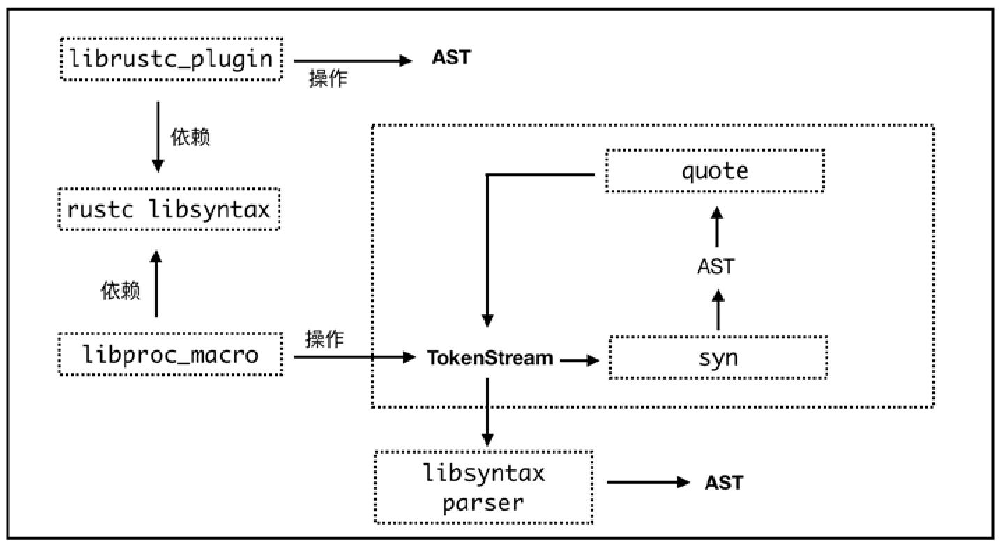{.u53564}

图12-10：过程宏工作机制示意图
:::

Rust编译器插件机制由内置的librustc_plugin包提供，它通过直接操作AST来达成目的。所以，它依赖于内置的libsyntax包，该包中定义了词法分析、语法分析、操作语法树相关的各种操作。但是要稳定发布给开发者，就不能依赖于AST结构。因为Rust语言正处于上升发展期，Rust内部还有很多工作要做，如果与AST结构耦合起来，将来AST结构有所变化，就会影响到广大开发者编写的程序，这是任何一门编程语言都在避免的问题。

所以，Rust官方团队在libsyntax的基础之上，又抽象出一层通用的接口，这套接口就叫**过程宏** ，它被定义于内置的 libproc_macro 包中。过程宏建立在**词条流** （TokenStream）的基础上，开发者可以借助于过程宏输入词条流，对其进行修改或替换，最后将修改后的词条流输出，交给语法解析器（libsyntax中包含的parser）处理。

基于词条流的好处在于未来不管语法如何变化，都不会影响到过程宏的使用，因为词法分析不需要关心语法信息。使用过程宏的时候，可以直接把传入的词法流转为字符串处理，也可以配合另外两个第三方库来使用：**syn** 和 **quote** 。其中 syn 库可以将词条流再次解析为AST结构，然后开发者在此结构之上对其进行各种修改或替换，最后通过quote库，将修改后的AST结构重新转换为词条流输出，这样就比直接处理字符串要方便、精准，如图12-10右侧虚线框选中的部分所示。

所以，在学习Rust过程宏系统的时候，需要了解一个"变"与一个"不变"。

· **变** ：Rust在上升发展期，还在随时添加各种新的功能以及优化性能，有可能会影响到AST结构。所以会把过程宏、编译器插件、syn、quote库都独立出来，以便更好地将过程宏机制向开发者稳定发布。

· **不变** ：过程宏基于词条流，不会随语法的不断变化而受影响。

但要明白，"变"与"不变"只是指语言结构层面。比如libproc_macro库自身也在进化，在写本书的时候，又出现了proc_macro2库，它是对libproc_macro库的进一步抽象和包装，更易于使用。但基于词条流来处理过程宏的整体思路依然不变。

目前，使用过程宏可以实现三种类型的宏：

· **自定义派生属性** ，可以自定义类似于＃\[derive（Debug）\]这样的derive属性，可以自动为结构体或枚举类型进行语法扩展。在官方 RFC 或一些社区资料中，过程宏也被称为宏1.1（Macro1.1）。

· **自定义属性** ，可以自定义类似于＃\[cfg（）\]这种属性。

· **Bang宏** ，和macro_rules！定义的宏类似，以Bang符号（就是叹号"！"）结尾的宏。可以像函数一样被调用。

接下来，使用cargo命令来创建一个lib包，名字为simple_proc_macro，在此包中依次实现这三种过程宏。包目录结构如代码清单12-46所示。

**代码清单12-46：simple_proc_macro目录结构示意**

::: center
{.u53563}
:::

在Cargo.toml中将该包设置为proc_macro类型，如代码清单12-47所示。

**代码清单12-47：Cargo.toml中设置lib类型为proc_macro**

::: center
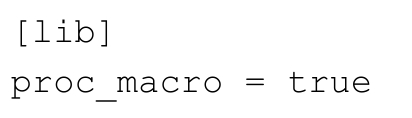{.u53562}
:::

编写过程宏必须要求放到proc_macro类型的lib包中。

**自定义派生属性**

可以使用TDD ^[\[4\]](#text00018.html#n0E1C01E15DE94F59AA689E5FF3FA931E){#text00018.html#n0E1C01E15DE94F59AA689E5FF3FA931Es}^ 的方式来开发自定义派生属性，因为在开发之前，必须要设计好自动派生的代码是什么。打开simple_proc_macro包中的tests/test.rs文件，在其中先编写预期的测试代码，如代码清单12-48所示。

**代码清单12-48：tests/test.rs文件中写入测试代码**

::: center
{.u53561}
:::

测试代码表示，打算实现一个**自定义派生属性＃\[derive（A）\]** ，然后为单元结构体A自动实现一个实例方法a。在调用方法a的时候，输出指定的字符串，如代码第7行所示。注意，使用自定义的派生属性过程宏，需要用**＃\[macro_use\]** 将其导出。

打开src/lib.rs文件，开始实现自定义派生属性，如代码清单12-49所示。

**代码清单12-49：在src/lib.rs中实现＃\[deriüe（A）\]过程宏**

::: center
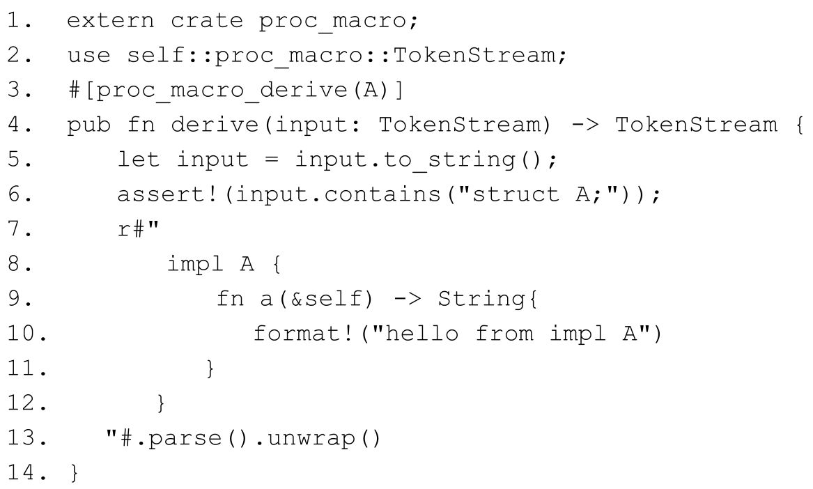{.u53560}
:::

注意当前代码均基于Rust 2018。

代码清单12-49中第1行和第2行分别引入了Rust内置的proc_macro包及其中定义的TokenStrem结构体类型。值得注意的是，proc_macro包属于Rust自带包，不需要在Cargo.toml中配置依赖。引入路径前的self前缀也不可省略。

代码第 3 行中，＃\[proc_macro_derive（A）\]属性表示其下方的函数专门处理自定义派生属性，其中的"A"与＃\[derive（A）\]中的"A"相对应。

代码第4行定义了函数derive。注意其函数签名，输入的参数类型为TokenStrem，输出的参数类型也为TokenStrem。

代码第 5 行将输入的参数 input 转换为字符串类型来处理。该示例用于演示实现自定义派生属性最简单的情况，即从字符串开始处理，并不涉及AST结构。

代码第6行展示了input实际上就是测试代码中＃\[derive（A）\]下方的结构体A的定义。可以想象，当编译器在编译的时候碰到＃\[derive（A）\]属性，就会自动将其下方的代码解析为词条流传入事先定义好的过程宏函数derive中进行处理。

代码第 7～13 行定义了一个字符串，并调用它的 parse 方法，该方法最终会返回一个Result＜TokenSteam，Err＞类型，所以还需要再次用unwrap方法才能返回。该字符串中包含了一个硬编码的方法a的实现，该字符串最终转为TokenStream类型返回，会被Rust编译器再次处理，从而生成指定的代码。

在包的根目录下运行cargo test，会发现测试将正常通过。

**自定义属性**

派生属性的目的比较单一，就是为了给结构体或枚举体自动派生各种实现，而属性的用途就相对比较多。可以说自定义派生属性是自定义属性的特例。Rust自身有很多内置的属性，比如条件编译属性**＃\[cfg（）\]** 和测试属性**＃\[test\]** ，早期版本的Rust可以通过编译器插件的方式来实现属性，但插件方式并未稳定，不推荐使用。过程宏实现自定义属性的功能还未稳定。在该版本稳定之前，必须在Nightly版本下使用**＃！\[feature（custom_attribute）\]** 特性。但在编写本书时，最新的NightlyRust 1.31中，已经不需要此特性了。更改详情请参考随书源码中的对应示例。

依旧使用TDD的方式来实现自定义属性功能。继续打开tests/test.rs文件，编写新的测试代码，如代码清单12-50所示。

**代码清单12-50：继续在tests/test.rs中编写自定义属性的测试代码**

::: center
{.u53559}
:::

代码清单 12-50 中使用＃！\[feature（custom_attribute）\]属性。新添加的测试代码表示要实现一个自定义属性＃\[attr_with_args（＂Hello，Rust！＂）\]，作用于函数foo之上，并自动修改foo函数的定义和实现，按属性中指定的文本来输出结果，如代码清单12-50中第7行所示。

继续打开src/lib.rs文件，编写实现代码，如代码清单12-51所示。

**代码清单12-51：在src/lib.rs中继续编写自定义属性的实现代码**

::: center
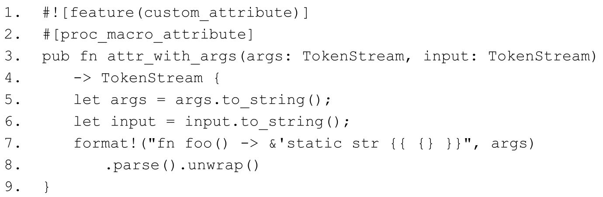{.u53558}
:::

代码清单12-51中第1行使用了＃！\[feature（custom_attribute）\]特性。

代码第2行使用＃\[proc_macro_attribute\]属性表示其下方的函数处理自定义属性。

代码第3行开始定义了attr_with_args函数，其函数签名包括两个输入参数args和input，均为TokenStream类型，返回值也是TokenStream类型。输入参数args代表测试用例自定义属性**＃\[attr_with_args（＂Hello，Rust！＂）\]** 括号中的指定文本，而参数input则代表测试用例中该属性下方作用的函数定义foo。

代码第5行和第6行分别将args和input转为字符串。

代码第7行通过format！宏将args动态地替换到foo重新定义的字符串中，随后通过调用parse方法解析为Result＜TokenStream，Err＞类型，经过unwrap之后返回。

执行cargo test，测试正常通过。

**编写Bang宏**

在声明宏章节中，通过macro_rules 实现过hashmap！宏，可以作为函数调用，使用起来十分方便。现在使用过程宏重新实现 hashmap！宏，同样，先写测试用例，如代码清单 12-52所示。

**代码清单12-52：继续在tests/test.rs中实现hashmap！测试用例**

::: center
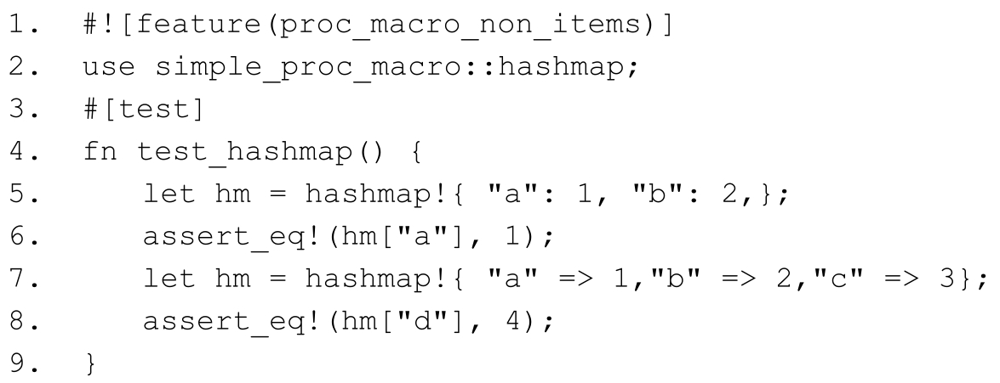{.u53557}
:::

代码清单12-52中引入了＃！\[feature（proc_macro_non_items）\]属性，是因为当前要用到。实现Bang宏，不需要通过＃\[macro_use\]导出，而是通过use关键字直接导入。

可以看出，即将实现的hashmap！宏支持两种宏语法格式，分别如代码第5行和第7行所示。

打开src/lib.rs，开始写实现代码，如代码清单12-53所示。

**代码清单12-53：继续在src/lib.rs中编写实现代码**

::: center
{.u53556}
:::

::: center
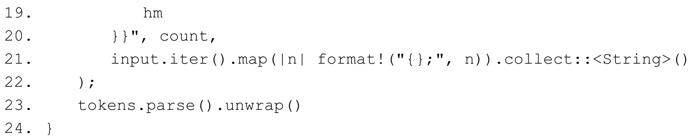{.u53555}
:::

代码清单12-53中，引入了＃！\[feature（proc_macro_non_items）\]特性，这就需要使用Nightly Rust，只有该特性彻底稳定才可去掉。属性＃\[proc_macro\]表示其下方的函数hashmap是要实现一个Bang宏，该函数前面输入和输出参数均为TokenStream类型。

整个hashmap 函数的实现思路比较简单，就是把input 转为字符串，将该字符串解析为数组，再通过format！宏将字符串拼接为所需的格式，最后由parse方法解析返回。具体请查看随书源码中详细的注释。

这里值得注意的是，过程宏实现Bang宏的思路与macro_rules！宏的思路相似，都是拼接生成代码，而代码清单12-53中，是完全对字符串进行解析和拼接，这种实现方法其实并不推崇。

其实proc_macro包中还提供了TokenNode、TokenTree等结构体，以及可以将这些结构转换为 TokenStream 的 quote！宏，只不过目前该功能尚未完善，要完成当前示例，使用起来还不如解析字符串来得方便。

**使用第三方包syn和quote**

虽然官方的proc_macro包功能尚未完善，但是Rust社区提供了方便的包可以使用。通过**syn** 和**quote** 这两个包和proc_macro2的相互配合，可以方便地处理大部分需要用到过程宏的场景，比如自定义派生属性。序列化框架包serde就大量使用了syn和quote，实际上，这两个包就是serde作者在编写serde过程中实现的。

其中，syn完整实现了Rust源码的语法树结构。而quote可以将syn的语法树结构转为proc_macro：：TokenStrem类型。接下来使用proc_macro、syn和quote共同实现一个自定义派生属性功能derive-new ^[\[5\]](#text00018.html#n526401E51CBB43989FAD930A8D74E56A){#text00018.html#n526401E51CBB43989FAD930A8D74E56As}^ 。

使用cargo new命令创建新的包derive-new，并添加tests/test.rs文件，目录结构如代码清单12-54所示。

**代码清单12-54：deriüe-new目录结构示意**

::: center
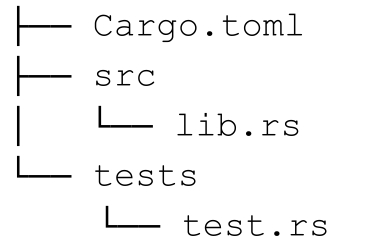{.u53554}
:::

然后在Cargo.toml中引入要依赖的包，如代码清单12-55所示。

**代码清单12-55：Cargo.toml配置文件**

::: center
{.u53553}
:::

::: center
{.u53552}
:::

代码清单12-55中指定了该包为proc-macro类型的lib库，并且在依赖项配置了quote 0.6和syn 0.15。需要注意的是，syn和quote的这两个版本从0.12起进行了重构，API接口有重大变动。

继续使用TDD的方式来编写代码，derive-new的功能就是为结构体自动派生new方法。打开tests/test.rs文件，编写测试用例，如代码清单12-56所示。

**代码清单12-56：tests/test.rs中编写测试用例**

::: center
{.u53551}
:::

代码清单12-56中定义了四个结构体，均使用了**＃\[derive（New，PartialEq，Debug）\]** 属性，其中New属性就是即将要实现的自定义派生属性，用于给这四个结构体自动实现new方法，此处自动实现PartialEq和Debug用于比较和打印测试用例中的结构体实例。这四个结构体覆盖了Rust中结构体的全部种类：具名结构体、单元结构体和元组结构体。

结构体定义完之后，还需要编写这四种结构体实例分别调用new方法的测试用例，如代码清单12-57所示。

**代码清单12-57：tests/test.rs中编写调用new方法的测试用例**

::: center
{.u53550}
:::

::: center
{.u53549}
:::

通过编写测试用例，对要编写的实现代码做了大致设计，对于三类结构体都需要支持自动实现new方法。现在打开src/lib.rs来编写实现代码，如代码清单12-58所示。

**代码清单12-58：src/lib.rs中开始编写实现代码**

::: center
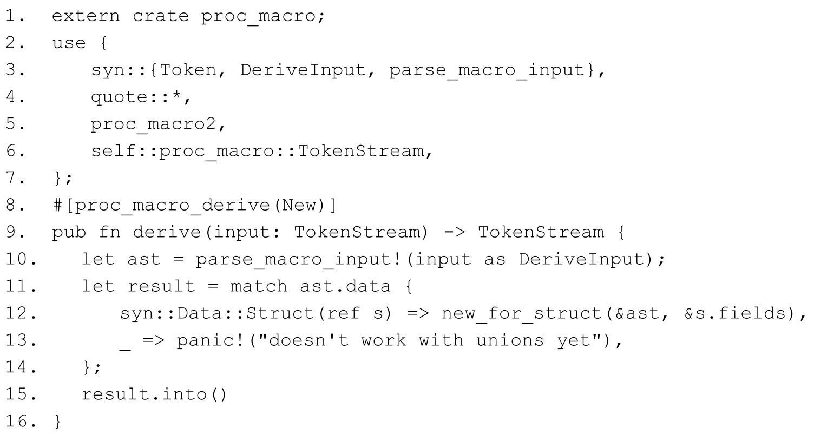{.u53548}
:::

代码清单12-58中第1～7行引入必须的包和TokenStream类型。

代码第 8 行使用＃\[proc_macro_derive（New）\]属性，代表其下方的函数用于处理＃\[derive （New）\]自动派生属性。

代码第 9 行开始定义 derive 函数，使用 pub 公开其可见性，输入参数和返回类型均为TokenStream类型。该函数主要做了三件事：

· 通过parse_macro_input！宏将input解析为syn：：DeriveInput类型的抽象语法树结构。如代码第10行所示。

· 通过ast.data判断数据类型是否为结构体。syn：：Data是syn包中定义的枚举体，一共包含三个值：Struct（DataStruct）、Enum（DataEnum）和 Union（DataUnion），分别代表结构体、枚举体和联合体。但是本示例中只处理结构体，对于结构体类型，通过new_for_struct函数进行处理，如代码第11～14行所示。

· 处理后的最终结果result应该属于proc_macro2：：TokenStream类型，然后通过into方法将其转换为TokenStream类型并返回，如代码第16行所示。其中，proc_macro2是对内置的proc_macro简单包装。它用于桥接Rust 1.15稳定的旧接口和Rust 1.30中引入新接口。在不久的将来，也许会合并到Rust中。

暂且将如何实现new_for_struct函数放一边，现在来看syn：：DeriveInput这个类型，该类型是专门为proc_macro_derive宏而设计的，源码如代码清单12-59所示。

**代码清单12-59：syn：：DeriüeInput结构体源码示意**

::: center
{.u53547}
:::

::: center
{.u53546}
:::

代码清单12-59中展示的DeriveInput结构体包含了五个字段，它们代表的信息如下：

· **attrs** ，实际为 Vec＜syn：：Attribute＞类型，syn：：Atrribute 代表属性，比如＃\[repr（C）\]，使用Vec＜T＞代表可以定义多个属性。用于存储作用于结构体或枚举体的属性。

· **vis** ，为syn：：Visibility类型，代表结构体或枚举体的可见性。

· **ident** ，为syn：：Ident类型，将会存储结构体或枚举体的名称。

· **generics** ，为syn：：Generics，用于存储泛型信息。

· **data** ，为syn：：Data，包括结构体、枚举体和联合体这三种类型。

另外，DeriveInput结构体还实现了一个重要的trait，如代码清单12-60所示。

**代码清单12-60：syn：：DeriüeInput结构体实现了Parse示意**

::: center
{.u53545}
:::

在syn 0.15之前，Parse由Synom代替。从syn 0.15开始，Synom已移除。

Parse中定义了parse方法，其输入参数类型为syn：：parse：：ParseStream，用于syn内部解析token的缓冲流，由TokenStream转换而成。

可以使用parse_macro_input！宏将任意输入参数转换为实现了Parse的类型。在本例中是DeriveInput 结构体。注意，该宏使用的是固定格式的宏语法： **parse_macro_input！（输入参数as 目标类型）** ，其中的**as** 后面必须指定明确的类型。

除了使用 parse_macro_input！宏，其实也可以直接调用 syn：：parse 函数来解析输入参数input。syn：：parse 函数可以将输入的词法流都解析为指定的数据结构，也就是抽象语法树。syn：：parse函数签名如代码清单12-61所示。

**代码清单12-61：syn：：parse函数签名示意**

::: center
{.u53544}
:::

该函数内部会调用T：：parse方法。所以，如果在代码清单12-58中使用syn：：parse解析input参数，并将其声明为syn：：DriveInput类型时，就可以调用syn：：DriveInput中实现的parse方法，最终生成syn：：DriveInput类型实例。

所以，syn 包主要是通过覆盖了全部 Rust 语法结构的自定义抽象语法树数据结构、syn：：Parse 和 parse_macro_input！/syn：：parse 这三大要素，满足开发者方便地将传入的TokenStream类型的词条流转化为指定的syn抽象语法树，如图12-11所示。另外，syn还提供了功能强大的Token！\[...\]宏，用于实现自定义的AST。读者可以通过查阅syn相关文档了解自定义AST的用法。

::: center
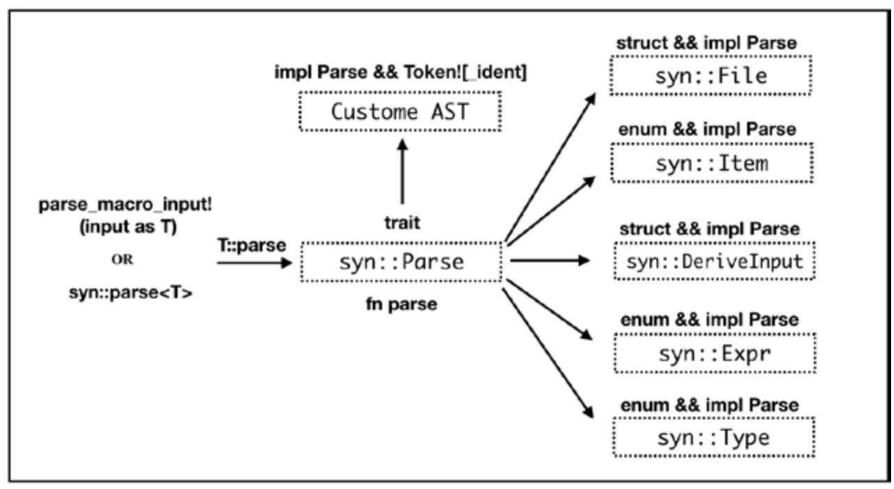{.u53543}

图12-11：syn三大要素示意
:::

在对syn有一定认识之后，回到derive-new的示例中，接下来要实现new_for_struct函数。前面提到过，在Rust中，一共有三种结构体，那么该函数就必须同时满足这三种结构体才行。如代码清单12-62所示。

**代码清单12-62：在src/lib.rs中继续实现new_for_struct函数**

::: center
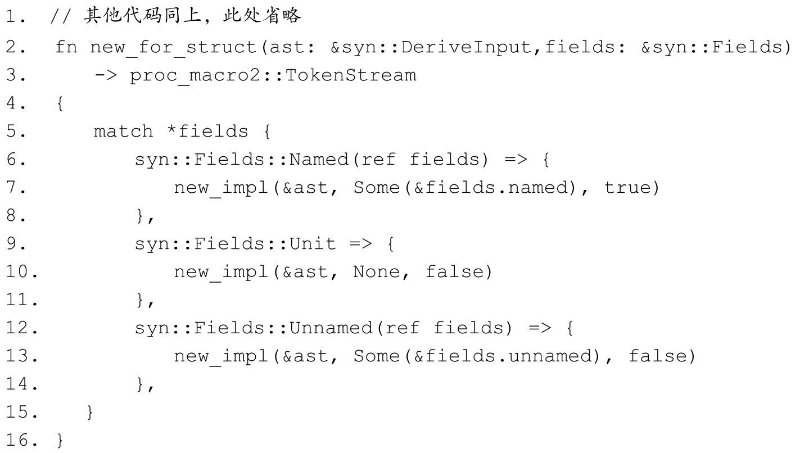{.u53542}
:::

代码清单 12-62 中，new_for_struct 函数包括两个参数：ast 和 fields。其中 ast 是syn：：DeriveInput 引用类型，fields 是 syn：：Fields 引用类型。该函数返回值为proc_macro2：：TokenStream 类型，因为该函数是在 derive 函数中被调用，最终需要转为proc_macro2的TokenStream类型。

此处用到的syn：：Fields类型属于syn：：Expr枚举体中定义的一个值，并且syn：：Fields本身也是枚举体，定义了三个值：syn：：Fields：：Named、syn：：Fields：：Unit和syn：：Fields：：Unnamed，分别代表命名结构体、单元结构体和元组结构体中的字段信息。

函数实现比较简单，通过match匹配fields的类型，调用相应的new_impl函数，需要将ast、不同结构体的字段信息、判断是否为命名结构体的布尔值一起传进去。

接下来继续实现new_impl函数，如代码清单12-63所示。

**代码清单12-63：在src/lib.rs中继续实现new_impl函数**

::: center
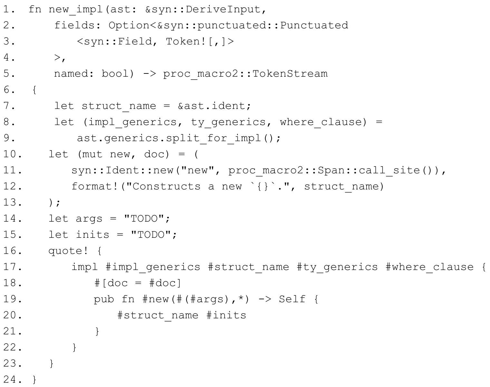{.u53541}
:::

代码清单12-63中，函数new_impl包含三个参数，其中ast和named类型已经介绍过。fields的Option＜&syn：：punctuated：：Punctuated＜syn：：Field，Token！\[，\]＞＞ 类型看上去比较长，下面将其"拆解"为几个独立的部分来理解它：

· 最外层的类型为 Option＜T＞，表示 fields 类型整体是一个可选值，因为对于单元结构体来说，fields的值为None。

· 第二层是syn：：punctuated：：Punctuated＜T，P＞类型，该结构用于存储由标点符号分隔的语法树节点序列。常用的有：

➢Punctuated＜Field，Token！\[，\]＞，用逗号分隔的结构体字段序列。

➢Punctuated＜PathSegment，Token！\[：：\]＞，用双冒号（：：）分隔的路径序列。

➢Punctuated＜TypeParamBound，Token！\[+\]＞，泛型参数序列。

➢Punctuated＜Expr，Token！\[，\]＞，函数调用参数。

· 第三层是＜syn：：Field，Token！\[，\]＞，分别是结构体字段和逗号标记。

所以，整个fields类型可以理解为表示类似于"Struct{a：1，b：2，c：3}"或"Struct（1，2，3）"中字段的语法树结构。该函数返回值依然是proc_macro2：：TokenStream。

代码第7行中，因为ast是DeriveInput结构，所以调用它的ident字段，就可以得到当前结构体的名称struct_name。

代码第8行和第9行通过ast的generics取得结构体中泛型相关的信息，然后通过调用split_for_impl方法返回元组结构，通过let模式匹配分别赋值给impl_generics、ty_generics和where_clause。

代码第10～13行分别声明了new标识符和文档说明doc，会用于后面的生成代码。这里值得注意的是，使用了syn：：Ident：：new 方法将字符串转换为syn的语法树结构以备使用，在后面使用quote！进行代码生成的时候不允许直接使用字符串，当然文档doc除外。

代码第14行和第15行声明了两个变量args和inits，分别用于表示将来new函数中传入的参数和字段信息。这个比较复杂，此处暂时用字符串占位。

代码第16～23行中，quote！宏的使用方法和定义macro_rules！宏时差不多，不同点在于，quote！宏中使用符号"＃"来代替macro_rules！宏中的"\$"。整个quote！宏相当于是生成代码的"模板"，等价于要生成代码清单12-64。

**代码清单12-64：和quote！宏要生成的代码等价的生成代码示意**

::: center
{.u53540}
:::

代码清单 12-64 使用伪代码展示了 quote！宏要生成的代码示意。由此可以看出，代码清单12-63中第19行定义new方法的时候，用到了"＃（＃args），\*"模式，这和marco_rules！宏的"\$（\$args），\*"模式类似，同样表示重复零次或多次，这里表示new参数可能是零个，也可能是多个。

接下来只需要搞定args和inits两个变量即可。因为字段信息比较复杂，所以需要一个独立的结构体来存储字段的信息，如代码清单12-65所示。

**代码清单12-65：在src/lib.rs中定义FieldExt＜＇a＞结构体**

::: center
{.u53539}
:::

代码清单12-65中定义了FieldExt＜＇a＞结构体，其中字段ty用来存储结构体字段的类型信息，ident用于存储结构体字段的字段名，named用来存储判断该字段是否为命名结构体的布尔标记。实际上，new方法的参数名和字段名也是一一对应的，所以也可以用该结构体来存储参数信息。

接下来为FieldExt＜＇a＞结构体实现一些方法，如代码清单12-66所示。

**代码清单12-66：在src/lib.rs中为FieldExt＜＇a＞结构体实现一些方法**

::: center
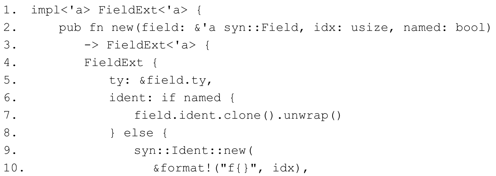{.u53538}
:::

::: center
{.u53537}
:::

代码清单12-66中为FieldExt＜＇a＞结构体实现了new方法用于创建该结构体实例，as_arg实例方法用于得到参数信息的 proc_macro2：：TokenStream 结构，as_init 实例方法用于得到字段信息的proc_macro2：：TokenStream结构。

代码第2～15行new方法中，第一个参数field为syn：：Field的引用类型，该类型为结构体，记录了结构体字段的信息，包括类型（ty 字段）、字段名称（Option＜Ident＞）等。注意和前面出现过的syn：：Fields区分。第二个参数idx是用于记录元组结构体的字段位置。

代码第17～21行中，as_arg方法为FieldExt＜＇a＞结构体的实例方法。通过获取ty和ident信息，分别得到参数的类型和名称，最后通过quote！宏生成函数参数形式的词条结构。

代码第 22～30 行中，as_init 方法用于处理字段的信息，如果命名结构体，生成形如"＃f_name：＃init"这样的词条结构，否则只需要得到单独的"＃init"词条结构即可。

注意，new方法的参数名和返回结构体实例字段名是一样的，参考代码清单12-64。

接下来继续完善new_impl函数，如代码清单12-67所示。

**代码清单12-67：在src/lib.rs中继续完善new_impl函数**

::: center
{.u53536}
:::

::: center
{.u53535}
:::

代码清单12-67中代码第8～21行为新增内容。

代码第8行声明unit变量用于判断是否为单元结构体。代码第9行声明empty变量，利用Default：：default方法自动推断单元结构体的字段值为单元值。

第10～12行通过迭代器将fileds转换为FieldExt＜＇a＞的数组集合。

代码第13行和第14行分别通过as_args和as_init得到参数和字段的词条结构。

代码第15～21行中，判断如果是单元结构体，则直接调用空的quote！宏，没有任何宏体。如果是命名结构体，则使用"{＃（＃inits），\*}"模式，将字段循环生成形如"{arg1：arg1，arg2：arg2}"这样的词条结构。如果是元组结构体，则使用"（＃（＃inits），\*）"模式，将字段循环生成形如"（arg1，arg2）"这样的词条结构。

至此，derive-new的代码就全部完成了，执行**cargo test** 命令之后，可以看到测试正常执行通过。上面的代码还有可以扩展的地方，比如通过属性为字段添加默认值，如代码清单12-68所示。

**代码清单12-68：改进＃\[deriüe（New）\]属性，支持＃\[new（üalue=xxx）\]为字段指定默认值**

::: center
{.u53534}
:::

要实现代码清单 12-68 测试用例描述的功能，需要使用＃\[proc_macro_derive（New，attributes（new））\]宏，然后在对应的derive函数中处理attributes的信息。具体如何实现，就留给读者来完成。

## 12.3 编译器插件 {#text00018.html#A69c301ee-815f-4c93-8ae2-a96700392ff0 .title-left}

Rust中最强大的元编程工具非编译器插件莫属，但可惜的是，编译器插件目前还不稳定。在Nightly版本的Rust之下，配合＃！\[feature（plugin_registrar）\]特性，可以实现编译器插件。

编译器插件由内置的**librustc_plugin** 包提供，该包对外公开了八种方法供开发者编写不同功能的编译器插件，具体如下：

· register_syntax_extension，可以通过它实现任意语法扩展。

· **register_custom_derive** ，是对register_syntax_extension的包装，专门用于实现自定义派生属性。

· **register_macro** ，同样是对register_syntax_extension的包装，用于实现Bang宏。

· register_attribute，用于实现编译器属性。

**其他四种** 与lint属性和llvm相关。

接下来实现一个简单的编译器插件，使用 cargo new 命令创建一个 lib 包，名称为plugin_demo，再添加tests/test.rs文件用于测试，目录结构如代码清单12-69所示。

**代码清单12-69：plugin_demo目录结构**

::: center
{.u53533}
:::

在Cargo.toml文件中将lib设置为plugin类型，如代码清单12-70所示。

**代码清单12-70：Cargo.toml文件中将lib设置为plugin类型**

::: center
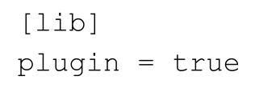{.u53532}
:::

打开tests/test.rs文件，编写测试用例，如代码清单12-71所示。

**代码清单12-71：在tests/test.rs中编写测试用例**

::: center
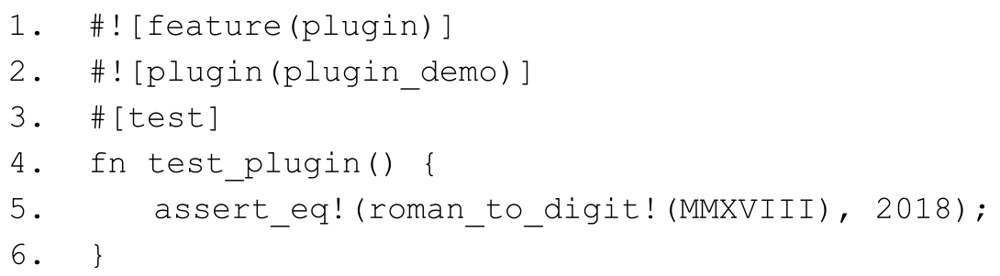{.u53531}
:::

代码清单12-71中使用了**＃！\[feature（plugin）\]** 特性，如第1行所示，所以需要在Nightly版本的Rust下运行。

代码第2行使用**＃！\[plugin（plugin_demo）\]** 属性将plugin_demo中定义的语法扩展导出。

代码第4行定义了测试函数，该函数中使用**roman_to_digit！** 宏，将罗马数字MMXVIII转换为阿拉伯数字2018，并对转换结果进行判断。

打开src/lib.rs文件并编写实现代码，如代码清单12-72所示。

**代码清单12-72：在src/lib.rs中编写插件的实现代码**

::: center
{.u53530}
:::

::: center
{.u53492}
:::

代码清单 12-72 中第 1 行使用了＃！\[feature（plugin_registrar，rustc_private）\]，包含特性plugin_registrar 和 rustc_private。目前自定义编译器插件功能还未稳定，所以必须在 Nightly下使用这两个特性。

代码第2～10行引入相关的包和类型。Syntax包实际上就是Rust源码内的libsyntax包，而rustc_plugin就是Rust源码内的librustc_plugin包。

代码第11～16行定义一个静态变量ROMAN_NUMERALS，其中记录了基本的罗马数字到阿拉伯数字的配对元组，用于后续计算。

接下来，实现具体的罗马数字到阿拉伯数字的转换函数，如代码清单12-73所示。

**代码清单12-73：继续在src/lib.rs中添加expand_roman函数**

::: center
{.u53529}
:::

::: center
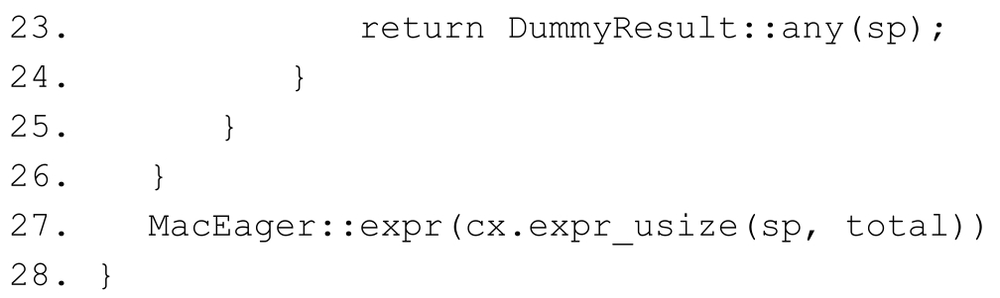{.u53528}
:::

代码清单12-73中，定义了expand_roman函数，该函数包含以下三个参数：

· **cx** ，代表代码的上下文环境，为ExtCtxt的可变引用类型。

· **Span** 类型，表示代码的位置等信息。

· **TokenTree** 切片数组，表示经过编译器分词器得到的代码词条树。

函数的返回值是**Box＜MacResult+＇static＞** 类型，是一个trait对象。其中**MacResult** 是一个trait，该trait中定义了很多方法用于组装AST结构。因为编译器插件是直接修改AST结构来实现语法扩展的。

代码第4～10行定义了text绑定。其中args\[0\]是一个TokenTree数据类型，通过match匹配，将token：：Ident标识符类型的值**s** 匹配出来，然后生成字符串，并赋值给text。因为在测试代码中传给**roman_to_digit！** 宏的罗马数字**MMXVIII** 会被识别为标识符。但是，如果匹配失败，则表示传入的参数不是标识符，而是其他类型，比如数字、字符串等。则通过调用cx.span_err方法，为位置信息sp设置错误提示，并通过DummyResult：：any函数将错误信息sp返回去，以便使用者排除错误。

代码第12行定义total绑定，并赋值为0，用于计算最终的阿拉伯数字。

代码第13～26行迭代得到的罗马数字字符串text，将其中的字符在ROMAN_NUMERALS静态变量中查找相对应的阿拉伯数字，并累计求和，然后将结果赋予最终的total绑定。如果在ROMAN_NUMERALS静态变量中没有查到对应的罗马数字，则继续通过调用cx.span_err方法，为位置信息sp设置相应的错误提示，并将sp返回。

代码第27行通过MacEager：：expr将最终的total和sp返回。cx.expr_usize指定了total的类型为usize。

**MacEager** 是一个枚举体，它定义Rust的语法结构作为枚举值，包括**表达式** （expr）、**模式** （pat）、**语言项** （items）、**实现项** （impl_items）、**语句** （stmts）和**类型** （ty）等。

接下来定义roman_to_digit宏，如代码清单12-74所示。

**代码清单12-74：继续在src/lib.rs中定义roman_to_digit函数**

::: center
{.u53527}
:::

代码清单12-74中第1行使用＃\[plugin_registrar\]属性，表示其下方的函数实现编译器插件功能。在 roman_to_digit 函数中使用 reg 的 register_macro 来定义一个宏，名字叫作roman_to_digit，然后对应expand_roman函数的功能。

最后，在plugin_demo包根目录下执行cargo rest命令，测试正常编译通过。需要注意的是，该自定义编译器插件示例当前可以在Rust 1.30下正常编译执行，在未来很有可能编译失败，因为Rust内部的libsyntax包是不断变化的。但是，即便libsyntax的语法会改变，基本的原理也是不变的，只要掌握基本的原理，也可以在编译失败的基础上很快将其修复。

通过此例可以看出，编写编译器插件和编写过程宏整体流程很相似，但是在细节上有差距，前者直接依赖AST结构，而后者只是依赖TokenStream词法结构。从语言功能稳定的角度看，过程宏要优于编译器插件，也属于宏 2.0 稳定发布的计划内容。另外，过程宏的文档比较全，而编译器插件的文档很少，开发者只能从源码中获取信息。所以，作为开发者，应该优先选择过程宏，而非编译器插件，除非过程宏无法达成目的。

## 12.4 小结 {#text00018.html#A2f2801f1-aa2e-4e4c-8fb9-a5f57a437c2f .title-left}

本章从元编程概念谈起，总结了编程语言中提供的元编程方式，包括反射和语法扩展。Rust语言作为系统级静态语言，对于反射的支持相比其他动态语言来说，功能不够强大，仅仅可以识别静态生命周期的类型信息。但Rust提供的宏功能是强大的。

Rust提供了两种宏，一种是声明宏，另一种是过程宏。

声明宏在Rust中最常用，它可以编写Bang宏，也就是可以像函数调用那样使用，但是和函数调用不同的地方在于，Bang宏返回的是生成代码，而函数调用返回的是求值结果，分清这个差别很重要。当前只能用macro_rules！来定义声明宏，但在Rust 2018发布之后，宏2.0计划应该可以实施完成，到时候就可以使用macro关键字来定义声明宏。

Rust也支持编译器插件机制，但是编译器插件依赖于AST结构。如果要面向开发者稳定地自定义编译器插件功能，就不能太依赖于AST结构，因为Rust还在发展期，Rust本身还在不断地优化，虽然在语法上已经稳定，但是其内部的语法树结构有可能会变化，这就不利于将其对外稳定公开给广大开发者。所以，过程宏就出现了，它基于词条流（TokenStream），不管语法树如何变化，它都不会改变，因为它本身不携带语法信息。

使用过程宏可以自定义派生属性、编写 Bang 宏，以及编写自定义属性。最早稳定的过程宏功能是自定义派生属性，也被称为宏1.1。编写Bang宏在Rust 1.30中已稳定，在此版本前需要使用＃！\[feature（proc_macro）\]特性。若要使用过程宏编写自定义属性，则需要使用＃！\[feature（custom_attribute）\]特性。此处也注意参考随书源码中的更新。

过程宏配合第三方库syn和quote可以更方便地编码。但值得注意的是，syn和quote只支持Rust的语法。如果想像声明宏那样定义比较自由的宏语法，是不支持的。这在一定程度上保证了Rust宏不会被滥用，即便开发者使用过程宏来定义Bang宏，其宏语法也只能是Rust的语法，而不是其他奇怪的语法。再加上宏展开过程也会经过Rust编译器的安全检查，所以大可放心地使用Rust的宏。

最后，通过一个简单的示例了解了如何编写编译器插件，虽然鼓励开发者优先选择过程宏，但是了解一下如何编写编译器插件也很有帮助。当前Rust社区的第三方包或框架也有使用编译器插件实现相应的语法扩展。比如Web开发框架rocket，在Rust 0.3中就用了编译器插件的方式来实现自定义属性，如代码清单12-75所示。

**代码清单12-75：rocket示例**

::: center
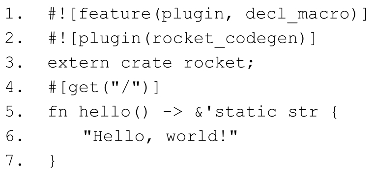{.u53526}
:::

::: center
{.u53525}
:::

代码清单12-75展示了Web开发框架rocket的一个Hello World示例。从代码第1行看得出来，用到了 plugin 和 decl_macro 两个特性，代表 rocket 内部使用了编译器插件机制和macro关键字。

代码第2行中，＃！\[plugin（rocket_codegen）\]代表rocket_codegen包中使用编译器插件方式定义了一些语法扩展。

代码第4行中，＃\[get（＂/＂）\]自定义属性，为第5行的hello函数自动生成了路由相关的代码，这样一来，当有"GET https：//domain/"这样的HTTP请求时，就可以自动调用到hello函数。

这就是Rust关于元编程的一切，虽然Rust还在不断完善，但它实现元编程的"道"是不变的。

------------------------------------------------------------------------

[\[1\]](#text00018.html#n7F6901D11183453DAB96A5D8143A00C4s){#text00018.html#n7F6901D11183453DAB96A5D8143A00C4} 实际的编译过程并非是严格按这个先后顺序的，有些过程实际上是同时进行的。

[\[2\]](#text00018.html#nD38E01D66FBC45C0B3DE7B9F6EAFB11Bs){#text00018.html#nD38E01D66FBC45C0B3DE7B9F6EAFB11B} 定义于Rust源码src/libsyntax/ext/tt/macro_rules.rs文件中。

[\[3\]](#text00018.html#n916001DBCDCE45C5BC697DCFB9011E40s){#text00018.html#n916001DBCDCE45C5BC697DCFB9011E40} 事实上没有这样的术语，这里只是为了方便说明。

[\[4\]](#text00018.html#n0E1C01E15DE94F59AA689E5FF3FA931Es){#text00018.html#n0E1C01E15DE94F59AA689E5FF3FA931E} TDD：测试驱动开发。

[\[5\]](#text00018.html#n526401E51CBB43989FAD930A8D74E56As){#text00018.html#n526401E51CBB43989FAD930A8D74E56A} 模仿GitHub nrc/derive-new的实现。

[]{#text00019.html}
