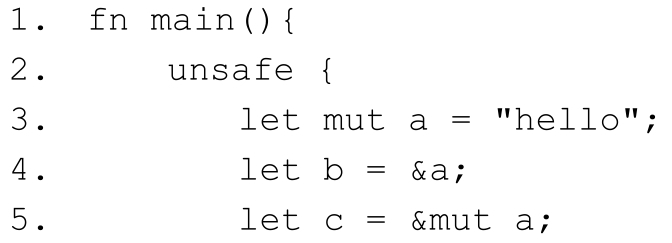
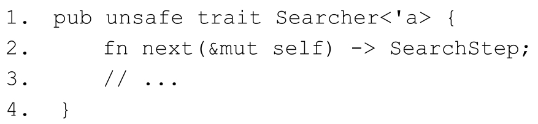
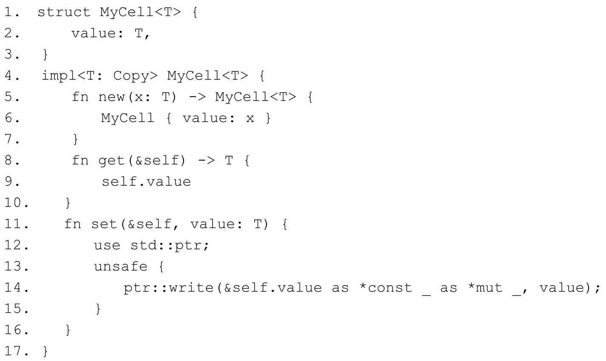
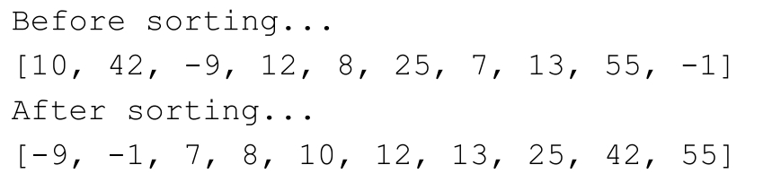
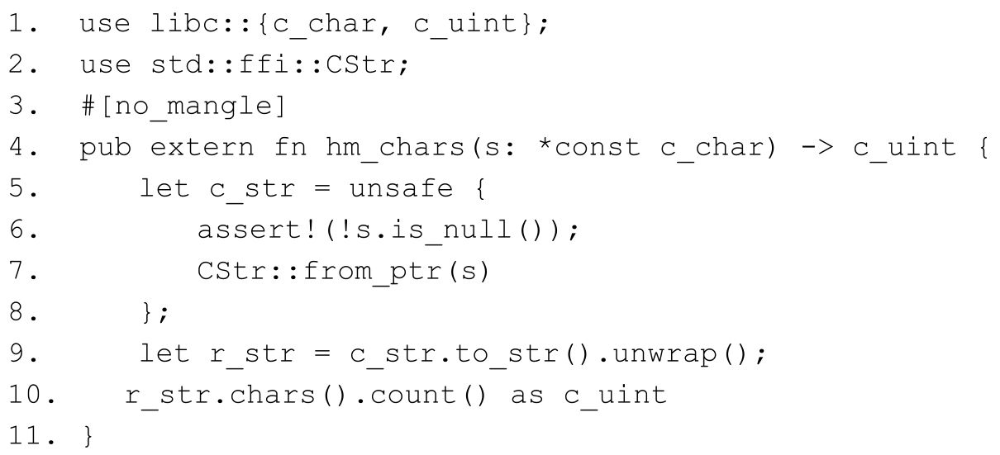

# 第13章 超越安全的边界 {#text00019.html#Ac1aed812-68b8-41eb-9e8d-4d8a63a9352c .title-left}

混沌涌现秩序，光明源自黑暗。

现代人类依靠钢筋混凝土结构的现代建筑来挡风遮雨、袪暑避寒，舒服地享受生活；在大气层和地球磁场的保护下，削弱了一次又一次能够重创现代文明的强太阳高能电子流和其他宇宙射线的冲击；木星、土星等巨行星形成的屏障，大大地降低了小天体撞击地球的概率。这是一个无奈的事实：**不安全是这个世界的本质，绝对的安全并不存在** 。

计算机世界中亦是如此。Rust语言通过一系列静态分析机制保障了内存安全。然而，作为系统级编程语言，Rust无可避免地需要直接与操作系统或裸机打交道。操作系统主要由C语言实现，包括UNIX、Linux、Windows内核。所以，Rust程序在和外部环境"打交道"的时候，无论Rust编译器有多么智能和强大，都很难检测到外部环境涉及的内存安全问题。

不妨打个比方。Rust就像是一艘遨游于太空的宇宙飞船，不管外太空多么危险，宇航员只要待在飞船内部，就是安全的。当宇航员需要去飞船外执行任务时，就必须穿好宇航服，经由减压舱到达飞船外部。宇航员一旦进入外太空，就必须自己保证安全，因为此时他已完全暴露于不安全的环境之下。

严格地说，Rust语言可以分为**Safe Rust** 和**Unsafe Rust** 两部分。Safe Rust就是提供安全庇护的"宇宙飞船"，而Unsafe Rust就是"宇航服、减压舱，以及飞船外部与宇航员有一切关联的部分"。

Safe Rust涵盖了前面章节中所介绍的内容，包括类型系统和所有权等静态分析机制。在使用Safe Rust的时候，开发者完全不必担心有内存不安全的问题出现。但是当需要和其他语言交互，甚至与底层操作系统或硬件设备交互的时候，就只能依靠另外一套"语言"：Unsafe Rust。

## 13.1 Unsafe Rust介绍 {#text00019.html#Ab4e201f3-e88d-4887-835a-27551a55b3d6 .title-left}

Unsafe Rust是Safe Rust的一个超集。也就是说，在Unsafe Rust中，并不会禁用Safe Rust中的任何安全检查。如代码清单13-1所示。

**代码清单13-1：unsafe块中使用引用依旧会进行借用检查**

::: center
{.u53524}
:::

::: center
{.u53523}
:::

代码清单13-1中，在unsafe块中同时对变量a进行不可变借用和可变借用，这违反了借用规则，编译器会报错。所以，即使在Unsafe Rust下，如果依旧编写Safe Rust的代码，也完全可以保证某种程度的安全性。

Unsafe Rust是指在进行以下五种操作的时候，并不会提供任何安全检查：

· 解引用裸指针。

· 调用unsafe的函数或方法。

· 访问或修改可变静态变量。

· **实现** unsafe trait。

· 读写**Union** 联合体中的字段。

这五种操作基本上适用于Rust和外部环境"打交道"的所有场景。对于这些场景的操作来说，Rust的安全检查完全无用武之地，反而会是一种障碍。比如解引用裸指针的时候，也许会是一个空指针或悬垂指针，此时就会造成未定义行为，即便此时编译器会进行安全检查，代码也无法通过编译，从而也就完全无法和外部环境"打交道"了。所以，针对这五种操作，就完全不提供任何安全检查。

Unsafe Rust**和** Safe Rust**的区分带来以下三方面结果** ：

· Unsafe Rust由于不需要安全检查，意味着有一定的性能提升。

· Unsafe Rust内存安全完全交由开发者来保证，否则会出现未定义行为。

· 区分了编译器和开发者的职责，如果代码出现了问题，可以先排查Unsafe Rust的代码。

这其中包含缺点，也有优点。值得注意的是，Unsafe Rust的存在并不与Safe Rust相矛盾，也不与Rust语言保证内存安全的目标相冲突。反而是Unsafe Rust的存在成就了Rust。

### 13.1.1 Unsafe语法 {#text00019.html#A007901f4-d243-4640-ac44-7d342c00e7f3 .title-left}

通过unsafe关键字和unsafe块就可以使用Unsafe Rust，它们的作用如下：

· **unsafe关键字** ，用于标记（或者说声明）函数、方法和trait。

· **unsafe块** ，用于执行Unsafe Rust允许的五种操作。

**unsafe关键字**

Rust标准库中包含了很多被unsafe关键字标记的函数、方法和trait。以String中实现的函数来说，如代码清单13-2所示。

**代码清单13-2：String中内置的unsafe函数示意**

::: center
{.u53522}
:::

代码清单13-2中展示了String内置的unsafe函数from_utf8_unchecked的源码实现。其函数签名包含了unsafe关键字，该函数接收一个Vec＜u8＞类型的字节数组，返回一个String类型。

乍一看，该函数中只是简单地返回一个String结构体实例而已，也没有进行Unsafe Rust允许的那五种操作中的任意一种，完全是正常的Safe Rust代码，而且也在编译器的安全检查之下。**那么这里为什么用unsafe关键字来标记该函数呢** ？因为该函数并未对传入的参数bytes进行任何合法性验证，如果传入的是一个非法的UTF-8字节序列，则会出现内存不安全的问题。换句话说，就是使用该函数时有可能会发生违反"契约"的风险。

函数 from_utf8_unchecked 的"契约"是指，传入的参数是有效的 UTF-8 字节序列。这就是unsafe关键字存在的意义。该函数被标记上unsafe之后，使用该函数的开发者就会主动去了解这一"契约"，看看当前的使用是否满足"契约"的要求。如果开发者没有做到满足"契约"的要求，将来出现了问题，也可以在unsafe标记的范围内排查问题。

所以，在使用 Rust 编写一个函数的时候，需要注意该函数在使用的时候是否存在违反"契约"的风险。如果存在风险，请使用unsafe关键字将其标记出来，在其他人使用该函数时，就可以多加注意。这里最大的风险在于，如果一个函数存在违反"契约"的风险，而开发者并没有使用unsafe关键字将其标记，那该函数就很可能会成为Bug的"温床"。

除标记函数或方法外，**unsafe** 也用于标记**trait** 。

标准库中包含的**unsafe trait** 有**Send** 和**Sync** 。编译器依赖Rust内置的类型和内部严格的规则，为开发者自定义的类型自动实现这两个trait，这是Rust能保证并发安全的基石。使用unsafe对Send和Sync进行标记，就意味着开发者手动实现它会有安全风险。

标准库中另外一个unsafe trait就是**std：：str：：pattern：：Searcher** ，在字符串章节中已介绍过它，它是字符串搜索模式的抽象，提供了一系列方法，行为像迭代器。如代码清单13-3所示。

**代码清单13-3：Searcher示意**

::: center
{.u53521}
:::

代码清单13-3中展示了Searcher源码示意，它是一个unsafe trait。这里unsafe标记的为什么是trait而不是方法next呢？

这是因为要实现 Searcher 里的 next 方法，必须要保证其返回的索引位于有效的 UTF-8边界上，否则会出现内存不安全的问题。而依据Searcher的工作机制来看，next方法并不会引起任何内存不安全问题，只是它的返回结果在另外一个地方使用才会发生问题。而考虑到字符串检索的性能，Searcher也不想对结果进行检查。所以，这里只能给trait加上unsafe标记，以此来警告实现该trait的开发者在实现该trait时必须遵守这些条件。另外，在实现unsafe trait的时候，也必须相应地使用**unsafe impl** 才可以。

**unsafe块**

被 unsafe 关键字标记的不安全函数或方法只能在 unsafe 块中被调用。如代码清单 13-4所示。

**代码清单13-4：unsafe块示意**

::: center
{.u53520}
:::

::: center
{.u53519}
:::

代码清单13-4中使用from_utf8_unchecked函数将字节数组转为字符串，这里必须使用unsafe块，否则会报如代码清单13-5所示的错误。

**代码清单13-5：未使用unsafe块调用unsafe函数会报错**

::: center
{.u53518}
:::

从代码清单13-5中看得出来，在未使用unsafe块的情况下就调用unsafe函数，编译器会报错。强制使用unsafe块，意味着强制让开发者将unsafe函数的调用和安全代码隔离起来，便于排查错误。

除调用不安全函数或方法外，unsafe块也可以进行其他操作。

### 13.1.2 访问和修改可变静态变量 {#text00019.html#A6f0901f6-07db-47ea-afa7-05fa944a453e .title-left}

静态变量是全局可访问的。对于不可变静态变量来说，访问它不存在任何安全问题。Rust也允许定义可变的静态变量，但是试想一下，如果多个线程同时访问这个可变静态变量，会发生什么？答案是：会引起数据竞争。这是Rust安全检查绝对不允许发生的事情。

所以，如果一定要定义可变的静态变量，就必须在unsafe块中进行操作，以此来警示该操作属于不安全行为，开发者必须保证其安全。如代码清单13-6所示。

**代码清单13-6：访问和修改可变静态变量必须在unsafe块中**

::: center
{.u53517}
:::

代码清单13-6中定义了可变静态变量COUNTER，并在unsafe块中对其进行修改和访问。如果此时不使用unsafe块，编译器就会报错提示你应该使用unsafe块来操作可变静态变量。

一般情况下，很少有人使用可变静态变量，但是要和其他语言交互（尤其是C语言）的时候，可变静态变量就会非常有用，在后面与C交互的内容会有更详细的介绍。

### 13.1.3 Union联合体 {#text00019.html#Ac7a501f6-425a-48b5-b2cc-9a7f68a962b0 .title-left}

Rust也提供了像C语言中那样的Union联合体。Union和Enum相似，Enum属于Tagged Union，优点在于其存储的 Tag 可以保证内存安全，缺点是 Tag 要占用多余的内存空间。而Union 并不需要多余的 Tag，如果想访问其中的字段，就必须靠程序逻辑来保证其安全性，如果访问错误，就会引发未定义行为。所以，它的优点是比Enum省内存空间，缺点是使用起来不安全。

Union 的内存布局和 Enum 也是相似的，字段共用同一片内存空间，所以也被称为共用体。内存对齐方式也是按字段中内存占用最大的类型为主。Rust里引入Union的主要原因还是为了方便Rust和C语言"打交道"。如代码清单13-7所示。

**代码清单13-7：使用Union联合体和Struct模拟Enum类型**

::: center
{.u53516}
:::

代码清单13-7中使用Union和Struct来模拟一个Enum类型MyZero。该类型的特点是，可以同时存储整数0和浮点数0.0。

代码第1～5行使用union关键字定义了Union联合体，包含两个字段i和f，用i32和f32类型分别代表整数和浮点数。当使用Union联合体时，配合使用了**＃\[repr（C）\]** 属性是必需的，该属性会告诉Rust编译器，此联合体应该使用和C语言一样的**内存布局** 。如果不加＃\[repr（C）\]属性，则有可能发生未定义行为。

代码第6～10行定义了结构体Value，包含tag字段和value字段，是为了模拟Enum类型中的值。因为Enum类型中的每个值还包含一个tag。此处也必须为结构体Value使用＃\[repr（C）\]属性，因为value字段是联合体类型U。

代码第11～15行定义了MyZero联合体，包含两个字段i和f，它们的类型均为Value。该联合体相当于代码第16～19行定义的一个Enum类型MyEnumZero。

然后就可以在main函数中使用MyZero了，每次使用一个值。需要注意的是，代码清单13-7**并不能正常编译运行** 。因为当前版本的Rust**不支持Union联合体的字段为非Copy** （Non-Copy）**类型** ，联合体MyZero中的字段就是非Copy类型。如果使用**＃！\[feature（untagged_unions）\]** 特性，该段代码就能正常编译，不久的将来该特性会稳定。

接下来对代码清单13-7做一次重构，让它可以正常运行。如代码清单13-8所示。

**代码清单13-8：对代码清单13-7进行重构**

::: center
{.u53515}
:::

代码第1、2行定义了Enum枚举体Tag，包含I和F两个值，分别代表整数和浮点数。注意，它使用了＃\[repr（u32）\]属性来指定布局，如果不使用该属性，则默认是Rust类型。因为该枚举体准备在联合体中使用，所以必须指定好布局，否则可能会出现未定义行为。

代码第3～7行使用union关键字定义了联合体U，包含字段i和f，同代码清单13-7中一样。

代码第8～12行定义了结构体Value，包含字段**tag** 和u，分别是Tag和U类型。该结构体所指代的意义和代码清单13-7中一致。

代码第13～21行定义了is_zero函数，该函数传入Value类型的参数，返回布尔值，目的是为了判断传入的Value是否为零。整数零和浮点数零均会返回true。注意，该函数中对Value可能的值进行了匹配，包含在unsafe块中。对联合体U的字段进行操作是不安全的行为，所以必须放到unsafe 块中。另外，代码第17行有浮点数字面量参与匹配，在编译时会发出警告，该问题暂时可以忽略，这里只作为教学示例，Rust官方也正在完善此问题。

代码第22～28行的main函数中，声明了int_0和float_0两个Value的实例，调用is_zero函数均得到了预期的结果。代码第27行验证了联合体U的内存对齐是4字节，和预期的一致，并没有占空间的**tag** 。

联合体和枚举体一样，每次只能使用一个字段，因为联合体中的字段均共用内存空间。如果不小心使用了未初始化的字段，则可能发生未定义行为。如代码清单13-9所示。

**代码清单13-9：访问联合体中未初始化的字段**

::: center
{.u53514}
:::

代码清单13-9中定义了联合体U，在main函数中定义了U的实例。在代码第9行，本来应该访问字段i，但是这里错误地访问了字段f，导致第12行的输出为第11行注释中的浮点数。

值得注意的是，代码第12 行的输出等价于f32：：from_bits（1）函数调用。在当前示例中，该输出属于正常的输出，不属于未定义行为。但是广义地看，这种用法是不安全的，在某些应用场合下很可能会造成不可预期的结果。

代码第13～16行被注释的原因是它们会报错。对于一个联合体来说，不能同时使用两个字段，当然也不能同时出借两个字段的可变借用。虽然可以同时出借两个不可变借用，但这种用法依旧不安全，没有人会故意这样使用。

### 13.1.4 解引用原生指针 {#text00019.html#A0ddf01f9-1b1b-480d-8fca-1a4f15a4abf2 .title-left}

Rust提供了**\*const T** （不变）和**\*mut T** （可变）两种指针类型。因为这两种指针和C语言中的指针十分相近，所以叫其**原生指针** （Raw Pointer）。原生指针具有以下特点：

· **并不保证指向合法的内存** 。比如很可能是一个空指针。

· **不能像智能指针那样自动清理内存** 。需要像C语言那样手动管理内存。

· **没有生命周期的概念** 。也就是说，编译器不会对其提供借用检查。

· **不能保证线程安全** 。

可见，原生指针并不受Safe Rust提供的那一层"安全外衣"保护，所以也被称为"**裸指针** "。所以，在对裸指针进行解引用操作的时候，属于不安全行为。如代码清单13-10所示。

**代码清单13-10：解引用裸指针是不安全行为**

::: center
{.u53513}
:::

::: center
{.u53403}
:::

代码清单13-10中代码第2～4行，通过as操作符将变量s的不可变引用和可变引用分别转换成不可变裸指针**\*const String** 和可变裸指针**\*mut String** 。注意，这里同时出现了不可变和可变的指针，但它们不是引用，Rust借用检查会对它们"睁一只眼，闭一只眼"。创建裸指针本身并不会触发任何未定义行为，所以不需要放到unsafe块中操作。

代码第5行验证裸指针r1和r2是否相同。事实上，它们是相同的。

代码第6、7行通过随意指定一个地址address，以及as操作符重新创建了一个裸指针r3。

代码第9、10行通过"\*"操作符对r1和r2进行解引用，打印输出字符串s的内容。但这个操作是不安全的，必须在unsafe块下进行。

被注释的代码第12行解引用裸指针r3，会引发**段错误** （Segmentation Fault）。因为r3是随意定义的指针，开发者根本无法确定它指向的是否为合法内存。

## 13.2 基于Unsafe进行安全抽象 {#text00019.html#Ab6ff01fa-54b6-4b3b-8f1c-c5bc5280fa4e .title-left}

通过unsafe关键字和unsafe块可以执行一些跳过安全检查的特定操作，但并不代表使用了unsafe就不安全。在日常开发中，往往需要在unsafe的基础上抽象安全的函数。使用unsafe块的函数需要满足基本的"契约"，才能保证整个函数的安全性。除此之外，还需要了解一些其他的概念，才能更安全地使用Unsafe Rust。

### 13.2.1 原生指针 {#text00019.html#A442601fa-e0b6-4854-b3da-56b28b195113 .title-left}

原生指针是Unsafe Rust中最常用的，它主要有以下两种用途：

· **在需要的时候跳过 Rust 安全检查** 。有些情况下，程序逻辑完全不会有任何内存安全问题，使用原生指针就可以避免那些不必要的安全检查，从而提升性能。

· **与C语言"打交道"** ，需要使用原生指针。

标准库为原生指针内建了很多方法和函数，为开发者利用指针进行各种操作提供了方便。在此主要介绍以下几个内建函数和方法：

· std：：ptr：：null函数和is_null方法

· offset方法

· read/write方法

· replace/swap方法

这几个是比较常用的函数和方法，在标准库原生指针模块中还有其他很多方法，可以通过相关文档查看更多。

**创建空指针**

创建空指针并判断是否为空指针的实现如代码清单13-11所示。

**代码清单13-11：创建空指针并判断是否为空指针**

::: center
{.u53512}
:::

代码清单13-11中的代码第2、3行，通过**std：：ptr** 模块提供的null函数可以创建一个空指针，通过is_null方法可以判断其是否为空。

代码第4～6行，通过&str类型字符串s的as_ptr方法得到一个不可变原生指针，该指针指向合法的堆内存，所以它不是一个空指针。注意，第5行指针ptr的类型为**\*const u8** ，这是因为字符串是以字节为单位存储的。

代码第7～9行，通过数组s的as_mut_ptr方法得到类型为**\*mut u32** 的可变原生指针，因为数组中的元素为数字类型。同样，它也不是空指针。

在创建空指针的时候，并不会引起任何未定义行为，所以这里并没有使用unsafe块。

**使用offset方法**

顾名思义，**offset** 就是指**偏移量** ，通过该方法可以指定相对于指针地址的偏移字节数，从而得到相应地址的内容。如代码清单13-12所示。

**代码清单13-12：使用offset方法**

::: center
{.u53511}
:::

代码清单13-12中，代码第2、3行得到一个**\*const u8** 类型的不可变指针ptr，该指针指向字符串s的起始字符。然后通过offset方法获取字符串s中的其他字符。

代码第 4～8 行，因为 offset 方法是 unsafe 方法，所以要在 unsafe 块中调用。其中"**\*ptr.offset（1） as char** "等价于"**\*（ptr.offset（1）） as char** "。上面之所以可以省略括号，是因为**解引用操作优先级低于方法调用** ，**但高于as操作符** 。通过给offset方法指定偏移量（以字节为单位），就可以得到相应的字符。代码第5、6行分别得到字符u和t。

因为 offset 方法并不能保证传入的偏移量是合法的，如果超出了字符串的边界，就可能会产生未定义行为，所以该方法被标记为unsafe方法。如代码第7行所示，打印出的字符完全是不可预料的。

**使用read/write方法**

通过read和write方法可以读取或写入指针相应内存中的内容。注意，这两个方法也是unsafe方法。代码清单13-13展示了read方法的使用。

**代码清单13-13：使用read/write方法**

::: center
{.u53510}
:::

代码清单13-13中第2行定义了String类型字符串x，代码第3行通过调用x的**as_ptr** 方法得到其**指向堆内存的原生指针** ，因为String类型本质是一个字节序列数组，所以该指针类型是**\*const u8** ，指向第一个字节序列。第4～6行在unsafe块中调用指针y的read方法，获取到字符串的第一个字符，并将其转换为字符类型，与预期的字符进行比较。

注意，read方法是unsafe方法，这是因为read方法通过指针来读取当前指针指向的内存，但不会转移所有权。也就是说，在该指针读取完内存之后，该内存有可能会被其他内容覆盖。

代码第7～11行定义了固定长度数组x，并通过调用as_ptr方法得到类型为**\*const \[u32；4\]** 的原生指针y。通过调用y的read方法，可以读取到数组的内容。注意，这里的原生指针类型是带长度的，如果将类型改为**\*const \[u32；3\]** ，则通过read方法只能读取到前三个元素的值。

代码第12～16行定义了一个动态数组x，但这次并没有用as_ptr获取指向堆内存的原生指针，而是直接将x的引用通过as操作符转换为原生指针。这次调用该指针的read方法读出来的并不是该动态数组的第一个元素，而是全部元素。

要注意通过as_ptr获取和由引用转换为原生指针的区别。通过as_ptr得到的指针是字符串或数组内部的指向存放数据堆（或栈）内存的指针，而引用则是对字符串或数组本身的引用。

对应于read方法，代码第17～23行展示了write方法的使用。write方法会覆盖掉指定位置上内存的内容。同理，write方法也属于unsafe方法。

**使用replace/swap方法**

利用replace或swap方法，可以快速替换指定位置的内存数据。如代码清单13-14所示。

**代码清单13-14：使用replace/swap方法**

::: center
{.u53509}
:::

代码清单13-14中，第2、3行通过as_mut_ptr得到动态数组v中指向堆内存的可变原生指针，所以该指针指向动态数组的第一个元素。第4～8行，在unsafe块中使用**replace** 方法将v的第一个元素替换为5。该方法会返回旧的值，所以old_v的值是1，而动态数组v就变成了\[5，2\]。

第9～15行同样是动态数组v，但只是将v的可变引用转换为了可变原生指针，该指针指向数组的全部元素。所以在unsafe块中使用replace方法，传入的参数是整个Vec＜i32＞类型的动态数组，而非单个元素。

代码第16～24行展示了**swap** 方法的使用，该方法接收两个可变原生指针作为参数，并将其指向内存位置上的数据进行互换。

代码第16～18行定义了固定长度数组array，并使用as_mut_ptr得到两个可变原生指针x和y，类型均为**\*mut \[u32；2\]** 。

代码第19～24行通过read方法可以得到x和y的数据，分别为\[0，1\]和\[1，2\]。然后调用x的swap方法与y互换数据，最终得到结果\[1，0，1，3\]。交互过程如图13-1所示。

::: center
{.u53508}

图13-1：swap（x，y）过程示意
:::

从图 13-1 可以看出，swap 方法因为传入的可变原生指针都来自同一个数组，操作的内存区域有重叠的地方，**这种操作很有可能引起内部数据混乱，从而引发未定义行为** ，所以swap也是unsafe方法。

在**std：：mem模块中提供了一个安全的swap** 方法，其函数签名为**fn swap＜T＞（x：&mut T，y：&mut T）** ，注意其参数为可变引用。因为可变引用是独占的，不可能对同一个变量进行两次可变借用，所以就保证了该方法不可能出现内存重叠的情况。**同样** ，std：：mem模块中也提供了**安全的replace** 方法。

**使用原生指针进行安全抽象**

在标准库中有很多方法是基于Unsafe Rust实现的安全抽象。比如，Vec＜T＞动态数组的insert方法。假设使用Safe Rust来实现insert方法，可以想象得到，将无法避免要使用多次&mut Vec＜T＞，这是完全无法做到的。Safe Rust的借用检查不允许对同一个变量进行多次可变借用。在这种情况下，使用原生指针是唯一的办法。

代码清单13-15展示了Vec＜T＞中insert方法的源码。

**代码清单13-15：Vec＜T＞的insert方法源码示意**

::: center
{.u53507}
:::

代码清单13-15中，insert方法传入了三个参数：&mut self、index和element，分别表示Vec＜T＞的实例可变借用、要插入位置的索引和要插入的元素。

代码第2、3行通过断言保证了index的值不能超过数组长度len，从而保证了该函数的基本"契约"：插入的索引不能越界。

代码第4～6行，判断数组的长度是否达到了数组的容量上限，如果达到，则通过reserve方法来扩容。传给reserve的参数1代表每次扩展一个类型大小的字节数。

从代码第7行开始，在unsafe块下进行操作。

代码第8～12行，将这三行代码放到一个单独块中是因为它们表示一个完整的插入逻辑。代码第9行通过as_mut_ptr方法获取到实例的原生可变指针，再进一步通过offset方法和index的值，得到要插入位置的指针p。代码第10行通过ptr：：copy方法将当前位置的内容右移一位，这样才能给当前位置留下空位来便于插入新的元素。代码第11行使用ptr：：write向该位置写入新的元素。

代码第13行将数组的长度加一。至此，整个insert方法才算完整。

综合来说，insert 方法内部使用了 unsafe 块直接操作原生指针，**通过断言判断指定插入的index无法越界操作** ，以及**通过判断长度是否达到容量极限来决定是否进行扩容** 。如果没有这两个判断条件，insert方法就无法保证安全，它就不是一个安全抽象，就必须在方法签名前面加unsafe标签。

### 13.2.2 子类型与型变 {#text00019.html#A597601ff-b570-4972-ad9a-aab7157262a4 .title-left}

**子类型** （subtype）在计算机科学中是相对于另外一种有替代关系的数据类型（父类型，supertype）而言的。一般来说，可以用在父类型的地方，也可以用子类型来替代。在类型理论中，子类型关系一般写为**A＜：B** ，这意味着A是B的子类型。

在面向对象语言中，子类型也被称为**子类型多态** （subtype polymorphism），通过多态消除了类型之间的耦合性，实现统一接口。比如，在需要圆形工作的环境，也可以使用其他任何圆形几何体（比如圆环），它们的关系可表示为**Ring＜：Circle** 。在面向对象语言中，一般用**里氏替换原则** （Liskov Substitution Principle，LSP）来描述这种关系：所有引用基类（父类）的地方必须能透明地使用其子类的对象。通俗地说，就是允许子类可以方便扩展父类的功能，但不能改变父类原有的功能。LSP是接口设计和继承复用的基石，遵循该原则可以让代码有更好的维护性和复用性。

**型变的基本概念**

在原始类型的基础上通过类型构造器构造更复杂的类型时，原始类型的子类型关系在复杂类型之上如何变化，也是支持子类型编程语言需要考虑的问题。计算机科学中把这种根据原始类型子类型关系确定复杂类型子类型关系的规则称为**型变** （variance）。比如，如果 Cat是Animal的子类型，Cat类型可以出现在任何需要Animal类型表达式的地方。那么List＜Cat＞是否可以出现在List＜Animal＞的地方？下面看看型变的三种形式就知道答案了。

型变一般可以分为三种形式：

· **协变** （covariant）。可以继续保持子类型关系。Cat是Animal的子类型，那么List＜Cat＞也是List＜Animal＞的子类型。

· **逆变** （contravariant）。逆转子类型关系。Cat是Animal的子类型，那么List＜Animal＞是List＜Cat＞的子类型。

· **不变** （invariant）。既不保持，也不逆转子类型关系。也就是说，Cat是Animal的子类型，但List＜Animal＞和List＜Cat＞是没有关系的。

**Rust语言中只有生命周期具有子类型关系** 。如果有生命周期满足"**＇long：＇short** "这样的关系，那么可以说**＇long** 是**＇short** 的子类型。这个关系代表生命周期**＇long** 存活的时间比**＇short** 要长，也可以说，长生命周期是短生命周期的子类型。比如，**&＇static str** 是**&＇a str** 的子类型。

了解由生命周期组成的复合类型，具体什么样的型变规则很重要。因为在编写 Unsafe代码的时候，很可能会因为没有合理使用型变而造成未定义行为。

**未合理使用型变将会引起未定义行为**

代码清单13-16展示了自定义的内部可变类型。

**代码清单13-16：自定义内部可变类型MyCell＜T＞**

::: center
{.u53506}
:::

代码清单13-16中第1～3行定义了泛型结构体MyCell＜T＞，包含一个字段value。

代码第4～17行为MyCell＜T＞实现了new、get和set三个方法。其中，new和get方法没什么特别，重点是set方法。

代码第11～16行在set方法中使用了unsafe块。通过ptr：：write方法将当前值覆盖为新传入的值。其中ptr：：write的第一个参数是由&self.value先转为不可变原生指针，再由不可变原生指针转为可变原生指针，因为**Rust不允许直接将不可变借用转为可变原生指针** 。

MyCell＜T＞看上去暂时没什么问题，接下来实现两个函数来使用它，如代码清单 13-17所示。

**代码清单13-17：使用MyCell＜T＞示例**

::: center
{.u53505}
:::

::: center
{.u53504}
:::

代码清单13-17中第1～5行定义了函数step1，只接收一个参数r_c1，为&MyCell＜&＇a i32＞类型。函数体里定义了局部变量val，并将其引用&val传给了stpe2函数。

代码第6～8行定义了step2函数，接收两个类型分别为&＇b i32和&MyCell＜&＇a i32＞的参数。

代码第9行定义了一个静态变量X。

在main函数中，代码第11行使用静态变量的引用&X声明了MyCell实例cell。代码第12行将&cell传入step1函数中。最后打印cell.value的值。

代码清单 13-17 可以正常编译运行。但是**这里存在未定义行为的风险** 。注意看代码第 3行，step1函数中调用step2，并传入了局部变量val的不可变引用&val。然后在step2函数中使用set函数将传入&val的值设置为新值。整个过程都是通过传递引用&val来实现的。试想一下：当step2函数执行完再返回到step1会发生什么？当step1调用执行完，整个调用栈就会被清理，局部变量val将不复存在，那么&val也会成为悬垂指针，这意味着cell.value也会成为无法预期的值。

这里Rust的借用检查为什么没有起作用呢？

原因在于现在定义的MyCell＜T＞是一个**协变类型** 。Rust中**大部分结构都是协变** 的，像这种自定义的结构体默认也是协变的。代码清单13-17中，**静态变量X** 的引用**&X** 的生命周期是**＇static** 的，所以在main函数中传入step1的是**&MyCell＜&＇static i32＞** 类型，而step1函数定义中要求是**&MyCell＜&＇a i32＞** 类型。正因为MyCell＜T＞是协变，**&＇static i32** 是**&＇a i32** 的子类型，所以**&MyCell＜&＇static i32＞** 是**&MyCell＜&＇a i32＞** 的子类型。按照子类型的规则，**&MyCell＜&＇static i32＞** 可以代替**&MyCell＜&＇a i32＞** 。

实际上，Rust允许这种协变是以"**忘记原始生命周期** "为代价的。所以在代码第3行中，step1函数第一个参数&val的生命周期本来应该是**＇a** ，因为允许协变而成为**＇static** ，所以借用检查就正常通过了。

可见，如果没有合理利用协变，将会产生未定义行为的风险。那么如何修复它呢？既然知道了问题的原因，**解决方案** 就简单了：**把MyCell＜T＞的协变性质改成逆变或不变就可以** 。

**使用PhantomData＜T＞**

之前的章节介绍过，**PhantomData＜T＞** 是一个**零大小类型的标记结构体** ，也叫作"**幻影类型** "，在需要指定一个并不使用的类型时，就可以使用它。除此之外，PhantomData＜T＞**还扮演以下三种其他角色** ：

· **型变** 。可以产生协变、逆变和不变三种情况。

· **标记拥有关系** 。和drop检查有关。

· **自动** trait**实现** 。比如Send和Sync。

所以，利用PhantomData＜T＞的型变特性，就可以修复代码清单13-17的问题，如代码清单13-18所示。

**代码清单13-18：利用PhantomData＜T＞修改MyCell＜T＞为不变**

::: center
{.u53503}
:::

代码清单 13-18 重构了 MyCell＜T＞的定义，重点是在之前的基础上增加了一个类型为**PhantomData＜fn（T）＞** 的mark字段。PhantomData＜fn（T）＞类型属于**逆变** ，因为**fn（T）** 指针类型在Rust中是逆变，未来的Rust版本中可能会修改为**不变** 。

修改完MyCell＜T＞之后再次执行代码清单13-17中的代码，编译器会报以下错误：

::: center
{.u53502}
:::

看得出来，Rust借用检查开始正常工作，代码变得更加安全。

**协变、逆变与不变类型列表**

以下罗列了Rust中几个重要的型变类型：

·&＇a T在＇a和T上是协变，对应的\*const T也是协变。

·**&＇a mut T** 在**＇a** 上是协变，但是在**T** 上是不变。

· **Fn（T）-＞U** 在**T** 上是不变，在**U** 上是协变。

· **Box＜T＞** 、**Vec＜T＞** ，以及其他集合对于它们包含的类型来说都是协变。

· UnsafeCell＜T＞、Cell＜T＞、RefCell＜T＞、Mutex＜T＞，以及其他内部可变类型在T上都是不变，对应的\*mut T也是不变。

比如，**&mut&＇static str** 和**&mut&＇a str** 不存在子类型关系，所以它们是不变。如果允许它们协变，将会有产生未定义行为的可能，正如代码清单 13-16 展示的那样。所以， **UnsafeCell＜T＞** 等内部可变性（包括可变原生指针**\*mut T）** 都是**不变** 。

对结构体来说，如果包含的字段全部是协变，则结构体是协变，否则为不变。所以，对**Phantomdata＜T＞** 类型来说，则有以下规则：

· PhantomData＜T＞，在T上是协变。

· PhantomData＜&＇a T＞，在＇a 和T上是协变。

· PhantomData＜&＇a mut T＞，在＇a上是协变，在T上是不变。

· PhantomData＜\*const T＞，在T上是协变。

· PhantomData＜\*mut T＞，在T上是不变。

· PhantomData＜fn（T）＞，在T上是逆变，如果以后修改语法，会成为不变。

· PhantomData＜fn（）-＞T＞，在T上是协变。

· PhantomData＜fn（T）-＞T＞，在T上是不变。

· PhantomData＜Cell＜&＇a （）＞＞，在＇a上是不变。

Rust中仅存在函数指针**fn（T）** 的**逆变** 情况，如代码清单13-19所示。

**代码清单13-19：fn（T）的逆变示例**

::: center
{.u53501}
:::

代码清单13-19中，第1～3行定义了trait A。该trait包含foo函数签名，接收一个&＇static str类型的参数。

代码第4～9行定义了结构体B，并为其实现A。注意，此时foo函数的签名已经改变为接收一个&str类型的参数。

代码第10～14行为结构体B单独实现另外一个函数foo2，接收类型为&＇static str的参数。

在代码第15～19行的main函数中，直接调用结构体实例B的foo方法，传入一个字符串字面量，可以正常编译运行。注意，字符串字面量为&＇static str类型。代码第17、18行编译会出错，所以将其注释。

从该示例中可以得出以下**结论** ：

· fn（T）**在实现trait方法时，是逆变** 。因为&＇static str＜：&＇a str，而现在fn（&＇a str）可以替代需要fn（&＇static str）的情况，所以得出 fn（&＇a str）＜：fn（&＇static str），逆转了原有类型的子类型关系。

· **普通的函数调用，参数是不变** 。当参数需要&＇static str类型时，不能用&str代替它。但是函数的返回值是协变，当返回值是&str的时候，可以返回&＇static str类型的值作为替代。

代码清单13-20是另一个逆变的示例。

**代码清单13-20：另一个fn（T）逆变示例**

::: center
{.u53500}
:::

代码清单13-20中，在bar函数签名中，参数f为**fn（&＇static str）** 类型。在main函数中，代码第 9 行将函数指针 foo 传给了 bar 函数，代码正常编译运行。函数指针 foo 的类型为**fn（&str）** ，所以满足 **fn（&str）＜：fn（&＇static str）** ，此处为逆变。

**在不久的将来，Rust官方有可能取消逆变。**

总之，了解型变对写Unsafe代码很有帮助。**当协变不会引起未定义行为的时候，可以用协变，否则就保证该类型为不变或逆变** 。

### 13.2.3 未绑定生命周期 {#text00019.html#A85690204-3143-49db-a743-e6376169c7f8 .title-left}

Unsafe代码很容易产生**未绑定生命周期** （Unbound Lifetime），即可以被随意推断的生命周期。主要**注意下面两种情况** ：

· 当从原生指针得到引用时，比如**&\*raw_ptr** 。

· 使用 std：：mem：：transmute 方法但没有显式给定生命周期，比如 transmute：：＜&T，&U＞（foo）。

代码清单13-21展示了从原生指针得到引用的情况。

**代码清单13-21：从原生指针得到引用**

::: center
{.u53499}
:::

::: center
{.u53498}
:::

代码清单13-21中定义了函数foo，其参数input为原生指针**\*const u32** 类型，然后通过解引用原生指针和引用符号将其转为引用，其中"**&\*input** "相当于"**&（\*input）** "。

在main函数中，代码第8～11行使用了作用域块，其中调用了函数foo，并将借用&y传入。在第12行打印x的值。如果按Safe Rust的规则，由于foo函数返回的是一个引用，此处是对y的引用，但是在离开作用域之后，y已经被丢弃，所以此处x就是一个**悬垂指针** 。Rust 编译器应该阻止该程序编译。但实际情况是，该程序可以正常编译。这是因为经过 **foo函数产生了一个未绑定生命周期的借用** ，**所以就跳过了Rust的借用检查** 。

在Debug模式下编译运行会输出正常的结果"hello：42"，但是在Release模式下编译运行，则会输出超出预期的结果，比如"hello：1151157120"，产生了未定义行为。

代码清单13-22展示了另外一种产生未绑定生命周期的情形。

**代码清单13-22：使用transmute函数得到引用**

::: center
{.u53497}
:::

代码清单13-22中，使用了std：：mem：：transmute＜T，U＞函数，该函数可以将类型T转为类型U。这是一个unsafe函数，使用不当将会产生未定义行为。

在main函数中，将原生指针ptr通过transmute函数转为&i32类型，此时会产生未绑定生命周期。在离开作用域块之后，x将会产生悬垂指针。跟代码清单13-21类似，在Release模式下编译将会产生无法预期的值，比如"hello：-697728128"。

所以，从原生指针得到引用的时候，需要避免以上两种情况，从而避免未定义行为的发生。

### 13.2.4 Drop检查 {#text00019.html#A0dff0205-3006-436c-ad50-c4f1cc121814 .title-left}

Drop检查（dropck）是借用检查器的附属程序，它是为了让析构函数可以更安全合理地被调用而存在。

一般来说，析构函数的调用顺序与变量的声明顺序相反。也就是说，如果存在明确的声明顺序，则编译器可以推断析构函数的调用顺序。但是对于同时声明的情况，比如声明一个元组时，其内部元素的生命周期是相同的，编译器无法推断到底该先调用谁的析构函数。当出现这种情况的时候，就容易产生悬垂指针。

**在Safe Rust中由dropck引起的问题**

在Safe Rust中出现这种情况时，Rust编译器会报错，如代码清单13-23所示。

**代码清单13-23：声明元组变量测试dropck**

::: center
{.u53496}
:::

代码清单13-23中第2、3行定义了枚举类型**State** ，目的是为了在析构函数中输出变量的状态。

代码第4～19行定义了一个泛型结构体**Hello＜T＞** ，并为其实现new方法和析构函数。该析构函数会在Hello被释放的时候调用，并输出预期的结果。

代码第 20～27 行定义了新的结构体 **WrapBox＜T＞** ，是对 Box＜T＞的包装，并为WrapBox＜T＞实现了new方法。

代码第28～33行实现了函数f1。在第30行通过元组形式声明了变量，这是故意为之，目的是让编译器无法推断x和y的析构顺序。注意，在代码第32行中，WrapBox＜T＞的实例包含了x的引用。

所以整个代码编译执行以后，会抛出代码清单13-24所示的错误。

**代码清单13-24：代码清单13-23编译产生的错误信息**

::: center
{.u53483}
:::

代码清单13-24显示变量x存活时间不够久。这正是由于编译器无法准确推断x和y的析构顺序导致的。如果x先于y被释放，则&x就成为悬垂指针，这是Safe Rust不允许出现的事情。

解决这个问题也很简单，只需要修改x和y的声明顺序即可，如代码清单13-23中第29行所示。只要按该行指定的顺序声明变量x和y，整个代码就可以正常编译运行，因为此时编译器可以准确推断x和y的析构顺序。正常输出的结果如代码清单13-25所示。

**代码清单13-25：代码清单13-23经过修改后正常输出结果**

::: center
{.u53495}
:::

代码清单13-25清楚地显示出，先调用y的析构函数，然后调用x的析构函数，并且两个变量在调用析构函数的时候都是Valid状态，表示一切安全，并未出现悬垂指针。

在Safe Rust中，WrapBox＜T＞包装了Box＜T＞，会被Rust编译器识别为WrapBox＜T＞通过Box＜T＞间接拥有T。虽然WrapBox＜T＞没有显式实现Drop，但因为这一层拥有关系，Rust也会在WrapBox＜T＞被释放之后逐个自动地调用T上的析构函数。

**＃\[may_dangle\]属性与dropck**

接下来尝试在修正后的代码清单13-23的基础上新增一个自定义的结构体**MyBox＜T＞** ，该结构体利用原生指针来替代Box＜T＞。这就需要手动在堆上分配内存，所以需要在Nightly Rust版本之下使用**＃！\[feature（allocator_api\]** 特性，如代码清单13-26所示。

**代码清单13-26：使用原生指针的结构体**

::: center
{.u53494}
:::

::: center
{.u53493}
:::

代码清单13-26中为了展示而省略了代码清单13-23中关于State、Hello，以及为Hello实现new和drop的代码，但实际上它们还会被用到。

代码第1、2行使用＃！\[feature（allocator_api）\]特性，以及引入std：：alloc模块中的GlobalAlloc、System和Layout都是为了在堆中分配内存。注意，本章使用的feature在未来的Rust Nightly版本中会有所变化，请以本书的随书源码为准。

代码第3、4行引入**std：：ptr** 和**std：：mem** 模块，要用到其中的函数。

代码第6～8行定义了新的结构体MyBox＜T＞，其字段v是\*const T类型的原生指针。

代码第9～18行为MyBox＜T＞实现了new方法，在new方法中使用**System.alloc** 方法分配堆内存，其参数**Layout：：array：：＜T＞（1）** 按照**T** 类型来指定布局。在分配好内存之后，再通过得到的指针写入数据。最后将指针存入MyBox＜T＞结构体实例中。

代码第19～27行为MyBox＜T＞实现**Drop** ，在drop方法中使用ptr：：read读取指针v对应的数据 T，然后通过 **System.dealloc** 方法将 T 的内存释放，其参数 **Layout：：array：：＜T＞（mem：：align_of：：＜T＞（））** 表示按**T** 的内存对齐方式获取相应的内存布局。

代码第28～39行实现了f2函数。最后在main函数中调用f2函数。注意，f1函数已被注释。

代码清单13-26编译会报如代码清单13-27所示的错误。

**代码清单13-27：代码清单13-26编译错误信息**

::: center
{.u53492}
:::

**代码清单13-27的错误依旧是因为编译器无法推断变量的析构顺序而引起的** 。编译器担心开发者会在 drop 方法中调用 T 的数据，避免出现悬垂指针。但现在代码清单 13-26 中MyBox＜T＞的drop方法是开发人员自己实现的，并且没有使用到T的数据，不会出现悬垂指针。那么有什么办法让代码通过编译呢？答案是使用**＃\[may_dangle\]** 属性。

利用**＃\[may_dangle\]** 属性来修改drop方法，如代码清单13-28所示。

**代码清单13-28：修改drop方法**

::: center
{.u53491}
:::

代码清单13-28中第1行引入了＃！\[feature（allocator_api，dropck_eyepatch）\]特性。

代码第 3 行变为"**unsafe impl＜＃\[may_dangle\] T＞ Drop for MyBox＜T＞** "。其中，"**＜＃\[may_dangle\] T＞** "代表在drop方法实现中，将不会用到T，否则可能会出现悬垂指针（many_dangle就是may dangle pointer的意思）。因为这是需要开发人员去保证的，所以要用unsafe关键字来标记impl。

经过这样的修改之后，代码即可正常编译运行。**但是这样就可以了吗** ？答案是否定的。如果在drop方法中使用了T，则会发生悬垂指针，如代码清单13-29所示。

**代码清单13-29：修改drop方法和f2函数**

::: center
{.u53490}
:::

::: center
{.u53489}
:::

代码清单13-29修改了两处，分别是代码第5行和第19行。

代码第5行新增了ptr：：read函数读取T的内容。此行代码表示MyBox＜T＞的drop方法中用到了T。

代码第19行故意将之前x2和y2的声明顺序换了位置。于是代码编译之后，输出结果如代码清单13-30所示。

**代码清单13-30：打印结果**

::: center
{.u53488}
:::

从代码清单13-30中可以看出，x1和y1是正常的释放顺序，但是x2和y2就出现了问题。最后一行显示内层Hello实例的状态是**InValid** ，说明此处产生了悬垂指针，因为访问到已经执行了析构函数的T的值。

这样的结果有违Rust的安全理念，有什么办法可以让Rust执行更严格的drop检查呢？

**使用PhantomData＜T＞得到更严格的drop检查**

因为MyBox＜T＞用了原生指针，而原生指针没有所有权语义。也就是说，Rust编译器不会认为MyBox＜T＞拥有T。这就意味着，在进行drop检查时，不会严格要求T的生命周期必须长于MyBox＜T＞。所以在MyBox＜T＞的drop方法中使用T的时候，编译器完全忽视了T很可能被提前释放的可能。前面提到PhantomData＜T＞的功能之一就是标记拥有关系，正好可以解决这个问题。

在代码清单13-29的基础上，再重新创建MyBox2＜T＞结构体，如代码清单13-31所示。**代码清单13-31：新增MyBox2＜T＞**

::: center
{.u53487}
:::

代码清单 13-31 中，新增了 MyBox2＜T＞，与 MyBox＜T＞唯一的不同就是多了一个PhantomData＜T＞字段_pd，该字段的作用就是告诉Rust编译器一个事实：**MyBox2＜T＞拥有T** 。这就意味着，在执行 MyBox2＜T＞的析构函数时，不管有没有使用**＃\[may_dangle\]** 属性，都必须要求T的生命周期长于MyBox2＜T＞。

代码第17～26行为MyBox2＜T＞实现了Drop，并且使用了＃\[may_dangle\]属性。

代码第27～33行定义了函数f3。**在该函数中必须强制指定** x**和** y**的声明顺序** ，**以便编译器推断变量的** drop **顺序** 。对于代码第 28 行和第 29 行所注释的两种写法，编译器无法推断drop顺序，不予通过编译。

所以在处理**drop** 检查的时候，可以通过以下两个维度来处理代码避免出现未定义行为：

·**＃\[may_dangle\]** 属性，该属性使用unsafe对impl Drop进行标记，以此来警示开发者不要在析构函数中使用其拥有的数据。

· **PhantomData＜T＞** ，用于标记复合类型拥有其包含的数据。这意味着，该复合类型将会遵循严格的drop检查，包含数据的生命周期必须长于复合类型的生命周期。

**来自标准库中的用法**

在Rust标准库中经常结合两者使用。代码清单13-32展示了Vec＜T＞和LinkedList＜T＞的相关代码。

**代码清单13-32：标准库中Vec＜T＞和LinkedList＜T＞相关实现**

::: center
{.u53486}
:::

代码清单13-32中，Vec＜T＞通过RawVec＜T＞间接拥有T，而RawVec＜T＞靠Unique＜T＞间接拥有T。在Unique＜T＞中使用**PhantomData＜T＞** 来保证拥有关系，这样drop检查就会严格要求开发者保证析构顺序。

Vec＜T＞的析构函数使用了**＃\[may_dangle\]** 属性，这将警示编写该析构函数的开发者注意不要去使用拥有的数据。

同理，LinkedList＜T＞也使用了PhantomData＜T＞和＃\[may_dangle\]属性达到与Vec＜T＞相同的目的。

**使用std：：mem：：forget阻止析构函数调用**

Rust中的析构函数默认是会被调用的，但在有些场合不希望调用析构函数。比如，通过FFI和C语言交互，在Rust中创建的数据需要在C中被调用，如果在Rust中被释放，则C中调用的时候会出问题。所以Rust提供了一个函数**std：：mem：：forget** 来处理这种情况。

如代码清单13-33所示。

**代码清单13-33：转移结构体中字段所有权示例**

::: center
{.u53485}
:::

代码清单13-33中定义了结构体Foo，其字段a和b的类型分别是结构体A和B。为Foo结构体实现了take方法，该方法返回由Foo字段值组成的（A，B）类型的元组。

这里的**重点** 是，take方法会将Foo结构体字段a和b的所有权转移。这是Rust允许的，该段代码是可以正常编译通过的。但是，**如果给 Foo 结构体实现了 Drop** ，情况就会发生变化，如代码清单13-34所示。

**代码清单13-34：为结构体Foo实现Drop**

::: center
{.u53484}
:::

代码清单13-34中为Foo结构体实现了Drop，再次编译代码会出现代码清单13-35所示的错误。

**代码清单13-35：代码清单13-34的错误信息**

::: center
{.u53483}
:::

代码清单13-35中错误信息显示，Rust编译器不允许移动Foo结构体的两个字段，原因是Foo结构体实现了Drop。在Foo的析构函数中，有可能会用到其字段，所以不能把所有权转移走。

如果在这种情况下必须转移Foo字段所有权，则可以使用**std：：mem：：forget** 函数。如代码清单13-36所示。

**代码清单13-36：重新为Foo实现take方法**

::: center
{.u53482}
:::

代码清单13-36中，将Foo结构体的take方法重新实现了一遍，代码将正常编译通过。该代码中主要用到两个重要的函数：**mem：：uninitialized** 和**mem：：forget** 。

其中，mem：：uninitialized是一个unsafe函数，在take方法中，将a和b的值都通过该函数修改为"**伪装的初始化值** "，**用于跳过 Rust 的内存初始化检查** 。但这样做是危险的，如果此时对a和b进行读取或写入，都会**引起未定义行为** 。该函数一般用于FFI和C语言交互。

另外，**mem：：forget** 函数会将当前的Foo实例"忘掉"，这样Foo实例就不会被释放，析构函数也不会被调用。但forget函数不是unsafe函数，因为使用该函数引起的后果是**内存泄漏** ，对Rust来说，**属于安全范畴** 。而对开发者来说，**需要在适合的地方手动调用** drop**方法来运行析构函数** 。

**在析构函数中手动指定析构顺序**

在std：：mem模块中还提供了另外一个联合体ManuallyDrop，通过它可以实现在析构函数中手动指定析构顺序。

如代码清单13-37所示。

**代码清单13-37：ManuallyDrop使用示例**

::: center
{.u53481}
:::

::: center
{.u53480}
:::

代码清单 13-37 中，FruitBox 结构体中，peach 和 banana 两个字段的类型均为ManuallyDrop＜T＞类型。所以在其析构函数中，通过ManuallyDrop：：drop函数显式指定peach和banana的析构顺序。

那么，ManuallyDrop是如何做到这一点的？Rust代码中析构函数不是自动调用的吗？它有什么神奇之处呢？代码清单13-38展示了ManuallyDrop的源码。

**代码清单13-38：ManuallyDrop＜T＞源码示例**

::: center
{.u53479}
:::

代码清单13-38展示了ManuallyDrop＜T＞的主要实现。ManuallyDrop＜T＞是一个联合体，Rust**不会为联合体自动实现** Drop。**因为联合体是所有的字段共用内存，不能随便被析构，否则会引起未定义行为** 。

所以，只要通过 ManuallyDrop：：new 方法创建一个 ManuallyDrop＜T＞实例，就只能通过ManuallyDrop：：drop函数手动调用析构函数。实际上，std：：mem：：forget＜T＞函数的实现就是用了ManuallyDrop：：new方法，如代码清单13-39所示。

**代码清单13-39：forget＜T＞函数源码示意**

::: center
{.u53478}
:::

代码清单13-39展示了std：：mem：：forget＜T＞函数的源码实现，看上去十分简单。

### 13.2.5 NonNull＜T＞指针 {#text00019.html#A84f2020f-34a5-4004-bfde-fbb659cdbc4f .title-left}

NonNull＜T＞指针实际上是一种特殊的**\*mut T** 原生指针，它的特殊之处有两点：**协变** （covariant）和**非零** （non-zero）。

**NonNull＜T＞旨在成为Unsafe Rust默认的原生指针** ，而非**\*const T** 和**\*mut T** 。因为**\*const T** 和**\*mut T** 基本上是等价的，它们可以相互转换。**但不能从** \*const T**直接得到** &mut T。

在 NonNull 被引入之前，Unsafe 代码中最常见的模式就是使用\*const T，结合PhantomData＜T＞得到协变结构体，并且在需要的时候会将\*const T 转换为\*mut T。使用**NonNull＜T＞** 就不需要进行转换了，因为**它本身就等价于一个协变版本的\*mut T** ，但是还需要PhantomData＜T＞在必要时提供**不变** 或**加强drop检查** 。

**NonNull＜T＞的本质**

代码清单13-40展示了NonNull＜T＞的源码。

**代码清单13-40：NonNull＜T＞和NonZero源码示意**

::: center
{.u53477}
:::

代码清单13-40展示了NonNull＜T＞实际上是对NonZero＜\*const T＞的包装。因为\*const T是协变类型，所以NonZero＜\*const T＞是协变，NonNull＜T＞也是协变。NonNull＜T＞和代码清单13-32中展示的Unique＜T＞非常相似，不同点在于NonNull＜T＞少了一个PhantomData＜T＞类型的字段。**所以** NonNull＜T＞**和** T**没有严格的拥有关系** 。

代码第4～6行展示了**NonZero＜T＞** 的定义，它属于Rust 核心库（core）的类型。其定义中的**Zeroable** 限定用于判断T是否为零（Null或零值）。NonZero＜T＞**的作用就是两个** ：**协变** 和**非零** ，并且加上了**＃\[lang=＂non_zero＂\]** 属性让其成为**语言项** ，方便编译器识别。

NonNull＜T＞也提供了一些方法，允许开发者可以更安全地使用原生指针，如代码清单13-41所示。

**代码清单13-41：NonNull＜T＞内置方法示例**

::: center
{.u53476}
:::

代码清单13-41中第3、4行使用了**NonNull：：dangling** 函数来创建一个新的悬垂NonNull指针，但它的内存是对齐的。它在一些场景里用于类型初始化，比如使用Vec：：new创建一个空的动态数组，需要初始化一个指针。它是安全的。

代码第5～7行可以通过**NonNull：：new** 函数将已知的可变原生指针生成Option＜NonNull＜T＞＞类型。

代码第8、9行可以通过as_ptr和as_mut方法分别得到NonNull＜T＞类型对应的\*mut T指针和&mut T引用。注意，这里的as_mut方法得到的引用是有正常生命周期的引用，而非未绑定生命周期的引用。

代码第10～12行可以通过**NonNull：：from** 函数将一个可变引用转为NonNull＜T＞类型。

代码第13～15行通过**null** 函数创建了一个空指针，然后传给NonNull：：new函数，将生成None值。

**空指针优化**

因为NonNull的**非零特性** ，所以可以**帮助编译器进行优化** ，如代码清单13-42所示。

**代码清单13-42：空指针优化展示**

::: center
{.u53475}
:::

代码清单13-42中定义了两个结构体Foo和FooUsingNonNull，前者只用了原生指针，后者的字段中包含了NonNull＜\*mut u64＞指针。

在main函数中，通过mem：：size_of函数比较它们的内存大小，代码清单13-43展示了输出结果。

**代码清单13-43：空指针优化输出结果**

::: center
{.u53474}
:::

从代码清单 13-43 中可以看出，\*mut u64 的大小和 NonNull＜\*mut u64＞相等，NonNull＜\*mut u64＞和Option＜NonNull＜\*mut u64＞＞大小相等，但是Option＜\*mut u64＞的大小却不等于\*mut u64。

这是因为Rust 对包含了NonNull＜T＞指针的 Option＜T＞类型进行了优化行为，这种优化叫作"空指针优化"。因为NonNull＜T＞本身是不可能为空的，所以Option＜T＞就不需要多余的判别式（tag）来判断是不是None，这样在内存布局上就不需要占用多余的内存。而对\*mut T指针来说，无法保证它一定不是空指针，所以Option＜\*mut u64＞还需要保留判别式，内存布局还需要按正常的枚举体来进行对齐，所以会多占用一倍内存。

空指针优化固然可以省内存，但在使用FFI和C语言"打交道"的时候要慎用。

### 13.2.6 Unsafe与恐慌安全 {#text00019.html#A913e0212-3dcf-4249-bde3-9a929592b497 .title-left}

在Unsafe Rust中就需要小心恐慌安全，这里是Rust编译器鞭长莫及的地方，如代码清单13-44所示。

**代码清单13-44：Unsafe Rust中需要注意恐慌安全问题**

::: center
{.u53473}
:::

代码清单13-44为Vec＜T＞实现了一个push_all方法，在第3行使用reserve预留了传入数组大小的内存容量。然后使用了unsafe代码块，因为要使用write方法来直接覆盖内存的数据，属于unsafe操作。

整个函数唯一有可能发生恐慌的地方就是 **clone** 方法，因为其他方法都是简单的函数，并不会发生恐慌，**但是** clone**方法的实现是未知的，存在发生恐慌的可能** 。所以整个push_all函数就不是恐慌安全的函数，它也不保证内存安全。假如 clone 方法发生了恐慌，那么后续的元素将无法继续写入内存，但是之前已经使用 reserve 方法预分配了内存，并通过 set_len方法为数组重置了长度，如果后续的元素无法写入内存，那么就会出现未初始化的内存，最终导致内存不安全。但是出于Rust的设计，这些未初始化的内存并不会被暴露出来。所以，总的来说，相比于其他语言，比如C++，Rust程序员几乎不会担心恐慌安全的问题。

Rust 也提供了 **catch_unwind** 方法来让开发者捕获恐慌，恢复当前线程。但是，对于代码清单13-44中展示的非恐慌安全的push_all函数来说，如果想捕捉clone方法可能引发的恐慌，则需要小心。数组的长度已经确定，但是还有未初始化的内存，整个数据结构的不变性被破坏了。所以，Rust编译器也不会允许开发者在push_all函数中使用catch_unwind。

### 13.2.7 堆内存分配 {#text00019.html#A66c70212-2621-44ef-b482-f15c5300abd3 .title-left}

在编写Unsafe Rust的过程中，也需要手动进行堆内存分配，所以Rust标准库std：：alloc模块中也提供了堆内存分配的相关API。

Rust在Rust **1.28之前** 默认都是使用**jemalloc** 作为默认内存分配器，虽然jemalloc很强大，但它也带来不少问题，所以在Rust **1.28** 中将jemalloc分配器从标准库中剥离了出来，作为一个可选的第三方库而存在，**标准库默认分配器就是** System**分配器** 。

在std：：alloc模块中有一个**GlobalAlloc** trait，其源码如代码清单13-45所示。

**代码清单13-45：GlobalAlloc trait源码示意**

::: center
{.u53472}
:::

在代码清单13-45中展示了GlobalAlloc中最重要的两个方法签名：**alloc** 和**dealloc** ，分别表示内存的分配和释放。

注意，GlobalAlloc和其定义方法都用unsafe做了标记。要实现该trait，**必须注意遵守以下约定** ：

· 如果全局分配器发生了恐慌，则会产生未定义行为。

· 布局（Layout）的查询和计算必须正确。

这就意味着，开发者可以通过实现该trait 而指定自己的全局分配器。如代码清单13-46所示。

**代码清单13-46：自定义全局分配器示例**

::: center
{.u53471}
:::

代码清单13-46中定义了结构体MyAllocator，然后为其实现GlobalAlloc trait，如代码第2～10行所示。具体的实现中使用了**System.alloc** 和**System.dealloc** 是标准库默认的分配器。

代码第 11、12 行使用**＃\[global_allocator\]** 属性就可以将静态变量 **GLOBAL** 指派的MyAllocator声明为全局分配器。在main函数中，Vec＜T＞数组的内存分配器就会默认使用自定义的MyAllocator分配器。

当然，也可以通过**＃\[global_allocator\]** 属性指定全局分配器为**jemalloc** 。如代码清单13-47所示。

**代码清单13-47：声明jemalloc为全局内存分配器**

::: center
{.u53470}
:::

代码清单13-47展示了如何将jemalloc设置为全局内存分配器。在Rust 1.28中，jemalloc分配器已经被独立为第三方包，叫作 jemallocator。这也是需要通过 extern crate 命令导入jemallocator的原因。

然后同样使用**＃\[global_allocator\]** 属性就可以将静态变量GLOBAL指派的Jemalloc作为全局分配器。**注意，该属性只能用于静态变量** 。

同理，将来也可以使用其他的内存分配器，比如Redox操作系统中用纯Rust实现的**ralloc** 内存分配器。

### 13.2.8 混合代码内存安全架构三大原则 {#text00019.html#Ab6e40214-5365-43a7-99f7-7966807dd4ba .title-left}

除了前面介绍的编写Unsafe代码需要注意的事项，还有来自Rust社区的指导Safe和Unsafe Rust代码混合编程中保证内存安全三大原则 ^[\[1\]](#text00019.html#n57550214298D40C2ACA95BEA620D5C48){#text00019.html#n57550214298D40C2ACA95BEA620D5C48s}^ ：

· 不安全的组件不应该削弱其安全性，特别是公共的API和数据结构。

· 不安全的组件应该尽可能小，并与安全组件分离（隔离和模块化）。

· 不安全的组件应该明确标记并轻松升级。

在开发中遵循上述原则进行架构设计，可以在一定程度上获得更好的安全保证。

## 13.3 和其他语言交互 {#text00019.html#A03c50214-0de0-4629-92a1-855f6c67195c .title-left}

在日常开发中，难免要和其他语言进行交互。其中，最显而易见的就是和C语言进行交互，比如Rust程序要进行系统调用，或者通过Rust来提升动态语言的性能瓶颈。这也是几乎所有编程语言都要面对的问题。

Common Lisp语言规范中首次提出了术语"**外部函数接口** （Foreign Function Interface，FFI）"，用于规范语言间调用的语言特征。后来，该术语也逐渐被引入到Haskell和Python等大多数语言中。也有个别语言使用其他术语，比如 Ada 语言使用"**语言绑定** （Language Bindings）"，Java语言则将FFI称为**JNI** （Java Native Interface）。

所以，现在编程语言之间都是通过FFI技术来进行交互的。

### 13.3.1 外部函数接口 {#text00019.html#A5b540214-ceec-4977-ac23-d0895dfa8c7e .title-left}

FFI 技术的主要功能就是将一种编程语言的**语义** 和**调用约定** 与另一种编程语言的语义和调用约定**相匹配** 。如何匹配呢？

不管哪种编程语言，无论是编译执行还是解释执行，最终都会到达处理器指令这个环节。在这个环节所处的层面上，编程语言之间的语法、数据类型等语义差异均以消除，只需要匹配调用约定，这就给编程语言之间的相互调用带来了可能。

**应用程序二进制接口**

调用约定如何匹配，与**应用程序二进制接口** （**ABI** ）高度相关。

什么是ABI？ABI是一个规范，主要涵盖以下内容：

· **调用约定** 。一个函数的调用过程本质就是参数、函数、返回值如何传递。编译器按照调用规则去编译，把数据放到相应的堆栈中，函数的调用方和被调用方（函数本身）都需要遵循这个统一的约定。

· **内存布局** 。规定了大小和对齐方式。

· **处理器指令集** 。不同平台的处理器指令集不同。

· **目标文件和库的二进制格式** 。

ABI规范由编译器、操作平台、硬件厂商等共同制定。ABI**是二进制层面程序兼容的契约，只有拥有相同的** ABI**，来自不同编译器之间的库才可以相互链接和调用** ，否则将无法链接，或者即使可以链接，也无法正确运行。

不同的体系结构、操作系统、编程语言、每种编程语言的不同编译器实现基本都有自己规定或者遵循的ABI和调用规范。目前只能通过FFI技术遵循C语言ABI才可以做到编程语言的相互调用。也就是说，C语言ABI是唯一通用的稳定的标准ABI。这是由历史原因决定的，C语言伴随着操作系统一路发展而来，导致其成为事实上的"标准ABI"。

Rust语言也提供了ABI，但因为Rust语言目前处于上升期，语言还在不断地完善和改进，导致ABI还不能够稳定下来，在不久的未来，Rust ABI应该是可以稳定的。Rust提供了FFI技术，允许开发者通过稳定的C-ABI和其他语言进行交互。

图13-2展示了Rust FFI和C语言相互调用的原理。

::: center
{.u53469}

图13-2：Rust FFI和C语言相互调用原理示意
:::

在Rust中使用FFI非常简单，只需要通过**extern关键字** 和**ertern块** 对FFI接口进行标注即可。在编译时会由LLVM默认生成C-ABI。

**链接与Crate Type**

有了统一的ABI之后，还需要经过**链接** 才能实现最终的相互调用。

链接是将编译单元产生的目标文件按照特定的约定组合在一起，最终生成可执行文件、静态库或动态库。链接产生于程序开发的模块化。这里的模块是指编译层面的模块。比如C或C++语言中每个文件都是一个编译单元，所以也可以说是一个编译模块，编译之后就能产生一个目标文件。Rust 和 C/C++不同，它以包（crate）为编译单元。在一个 Rust 包中通过extern crate声明来引入其他包之后，编译器支持各种方法可以将包链接在一起，生成指定的可执行文件、动态库或静态库。

在一个编译模块中，通常包含了函数和全局数据的定义。函数和数据由符号来标识，一般有全局和静态之分。全局符号可以在模块间引用，而静态符号只能在当前模块引用。编译各个模块的时候，编译器的一项重要工作就是建立**符号表** 。符号表中包含了模块的哪些符号是全局符号，哪些是静态符号，每个符号都会关联一个地址。在链接过程中，链接器会扫描各个编译模块的符号表，建立全局符号表，由此决定，符号在哪里被定义，以及在哪里被调用。这个过程叫作**符号解析** 。除此之外，因为可执行文件和库的内存地址空间使用的差异，还需要进行存储空间的分配。地址重新分配之后，相应符号的引用也需要重新被调整，这个过程叫作**重定位** 。经过符号解析、存储空间分配和重定位之后，链接过程就完成了，最终生成可执行文件或库。

从概念上看，库可以分为两种：**静态库** 和**动态库** 。

**静态库** 是这样一种库：在功能上，可以在链接时将引用的代码和数据复制到引用该库的程序中；在格式上，它只是普通目标文件的集合，只是一种简单的拼接。静态库使用简单，原理上容易理解，但是它容易浪费空间。**动态库** 和静态库差异比较大。动态库可以把链接这个过程延迟到运行时进行，比如重定位发生在运行时而非编译时。动态库相对来说比较省空间。

除可执行文件外，Rust一共支持四种库，如图13-3所示。

::: center
{.u53468}

图13-3：crate_type类型示意
:::

可以通过设置命令行参数**Flag** 或者**crate_type** 属性指定生成的库类型：

·\--crate-type=bin或＃\[crate_type=＂bin＂\]，表示将生成一个可执行文件。要求程序中必须包含一个main函数。

·**\--crate-type=lib** 或**＃\[crate_type=＂lib＂\]** ，表示将生成一个Rust库。这里lib是对Rust库的统称，具体生成什么库，由编译器自行决定。一般情况下，默认会产生**rlib** 静态库。

·\--crate-type=rlib或＃\[crate_type=＂rlib＂\]，可以理解为静态Rust库，由Rust编译器来使用。

·**\--crate-type=dylib** 或**＃\[crate_type=＂dylib＂\]** ，可以理解为动态Rust库，同样由Rust编译器来使用。该类型在Linux上会创建**\*.so** 文件，在MacOSX上会创建**\*.dylib** 文件，在Windows上会创建**\*.dll** 文件。

·**\--crate-type=staticlib** 或**＃\[crate_type=＂staticlib＂\]** ，将生成静态系统库。Rust编译器永远不会链接该类型库，主要用于和C语言进行链接，达成和其他语言交互的目的。静态系统库在Linux和MacOSX上会创建**\*.a** 文件，在Windows上会创建**\*.lib** 文件。

·**\--crate-type=cdylib** 或**＃\[crate_type=＂cdylib＂\]** ，将生成动态系统库。同样用于生成C接口，和其他语言交互。该类型在Linux上会创建**\*.so** 文件，在MacOSX上会创建**\*.dylib** 文件，在Windows上会创建**\*.dll** 文件。

需要注意的是，**crate_type可以指定多个** 。有时候会有这种情况出现：**包** A**依赖包** B，而包B需要生成一个staticlib静态系统库。这时，就需要为包B同时指定staticlib和rlib两种包类型。

只要ABI统一，两个库就可以相互链接。在链接之后，就可以实现相互调用。所以，Rust要和其他语言交互，可以通过导出为C-ABI接口的静态库或动态库，然后其他语言链接该库，就可以实现语言之间的相互调用。

**交叉编译**

以上说的是本地编译的情况，Rust也支持**交叉编译** ，几乎做到了开箱即用。在本地平台上编译出需要放在其他平台运行的程序，就叫交叉编译。比如，在x86平台上编译可以在ARM嵌入式单片机上运行的程序。

可以使用rustc进行交叉编译，只需要给rustc传递一个target 参数即可。如代码清单13-48所示。

**代码清单13-48：rustc交叉编译命令展示**

::: center
{.u53467}
:::

这样就可以工作了。当然，如果是针对ARM嵌入式开发平台，你的hello.rs文件不能使用std标准库。如代码清单13-49所示。

**代码清单13-49：hello.rs需要配置好no_std**

::: center
{.u53466}
:::

因为std不支持ARM单片机，所以这里使用了**＃！\[no_std\]** 属性。当然，嵌入式推荐的做法应该是使用**core** 。

除了rustc，也可以使用Cargo进行交叉编译。使用方法和rustc类似，给**cargo build** 命令传递**\--target** 参数即可。默认情况下，cargo命令会使用cc作为交叉编译的链接器。也可以通过修改Cargo的配置文件来指定链接器。如代码清单13-50所示。

**代码清单13-50：使用cargo进行交叉编译示意**

::: center
{.u53465}
:::

上面的示例中，target参数后面类似于**arm-unknown-linux-gnueabihf** 这样的格式，叫作**target triple** 格式。Triple格式是交叉编译前必须要确认好的，格式含义如下：

::: center
{.u53464}
:::

其中，**arch** 代表编译程序的主机系统，如果是嵌入式系统，就是arm。第二个**vendor** 是指供应商，如果是未知，就可以指定为unknow。第三个**sys** 代表操作系统，比如Linux。最后的abi代表的是ABI接口，比如gnueabihf表示的是系统使用glibc作为C标准库（libc）的实现，并具有硬件加速浮点运算（FPU）功能。这样就得到了最终的arm-unknown-linux-gnueabihf目标triple格式。当然，有时候也可以省略最后的abi，比如x86_64-apple-darwin、wasm32-unknown-unknown等 ^[\[2\]](#text00019.html#n22015619F696466084007036469E57DD){#text00019.html#n22015619F696466084007036469E57DDs}^ 。

Rust社区还提供了第三方交叉编译工具**xargo** ，使用该工具可以更方便地进行交叉编译，还允许开发者构建一个定制的std库。当前，Rust官方着手进行xargo和rustup工具的整合。

**extern语法**

Rust提供了extern语法使得FFI非常便于使用。

· **extern关键字** 。通过extern关键字声明的函数，可以在Rust和C语言中自由使用。

· **extern块** 。如果在Rust中调用C代码，则可以使用extern块，将外部的C函数进行逐个标记，以供Rust内部调用。

编译器会根据extern语法自动在Rust-ABI和C-ABI之间切换。有三个extern ABI字符串是跨平台的：

· **extern＂Rust＂** ，这是默认的ABI，任何普通的fn函数都将使用该ABI。

· **extern＂C＂** ，这是指定使用C-ABI，等价于"extern fn foo（）"这样的函数声明。

· **extern＂system＂** ，这和extern＂C＂是相似的，只是在Win32平台上等价于＂stdcall＂。

除此之外，Rust还支持其他extern ABI字符串，详情可以参见官方Reference页面 ^[\[3\]](#text00019.html#n159F0218655748F797FEB17986DF9A1B){#text00019.html#n159F0218655748F797FEB17986DF9A1Bs}^ 。另外还有三个Rust编译器专用的ABI字符串：

· extern＂rust-intrinsic＂，代表Rust编译器内部函数的ABI。

· extern＂rust-call＂，Fn：：call的ABI。

· extern＂platform-intrinsic＂，特定平台内在函数的ABI。

接下来，看看具体如何使用extern语法和其他语言进行交互。

### 13.3.2 与C/C++语言交互 {#text00019.html#Aabef0218-5ec2-4b5f-a9f8-d5cbd9f57593 .title-left}

C语言这种万能"胶水"语言赋予了Rust和其他语言通信的能力。

Rust中可以方便无缝地调用C函数，所以对于现有的操作系统和一些C/C++实现的底层系统库，可以使用Rust进行安全无缝地绑定和扩展，达到从C/C++向Rust迁移的目的，甚至也可以让Rust和C/C++协同工作。比如，把系统中对安全要求高的部分迁移到Rust，其余部分继续用C/C++，保留原始的性能。

通过C-ABI，Rust也可以被其他语言调用。一般用于提升动态语言的性能，比如Ruby、Python、Node.js等。可以把系统中造成性能瓶颈的部分用Rust来重写，然后通过FFI在动态语言中调用。

**在Rust中调用C函数**

代码清单13-51简单展示了在Rust中调用C标准库函数。

**代码清单13-51：Rust中调用C标准库函数**

::: center
{.u53463}
:::

代码清单13-51中，第1行在extern ＂C＂块内部定义了isalnum函数签名。然后在main函数中就可以直接调用操作系统C标准库内置的isalnum函数。这里也可以直接使用extern块，而省略掉ABI字符串＂C＂。因为默认的extern块就是按C-ABI处理的。

注意，被注释的代码第7行给isalnum函数传入了字符＇a＇，但是编译会报错。这是因为在extern块内的函数签名要求参数必须是数字类型。可以看出，Rust的类型系统在这里相当有用。

**在Rust中调用C++函数**

在Rust中也可以调用C++函数，前提是C++也需要使用C-ABI。

现在使用cargo来创建一个新的bin项目rustcallcpp，如代码清单13-52所示。

**代码清单13-52：创建新项目rustcallcapp**

::: center
{.u53462}
:::

接下来修改项目rustcallcapp中的Cargo.toml文件，如代码清单13-53所示。

**代码清单13-53：修改Cargo.toml文件**

::: center
{.u53461}
:::

代码清单13-53中，添加了build.rs文件配置，以及build依赖库**cc** ^[\[4\]](#text00019.html#n3BF8021943CE467AB824B88A3D9E3C39){#text00019.html#n3BF8021943CE467AB824B88A3D9E3C39s}^ 。Rust中想要调用C/C++，首先需要链接C/C++生成的静态/动态库。可以通过手动调用gcc或g++来编译C/C++文件，使用**ar** 工具来生成静态库。但是，现在是制作Rust的crate，这些工作需要自动化。所以这里要利用**build.rs** 文件，在Rust构建之前，将依赖的C/C++库打包好。构建依赖的库**cc** 是对gcc等各大平台C/C++编译器的抽象。

接下来在rustcallcpp项目中创建一个文件夹cpp_src，用于放置C++代码。在目录中创建sorting.cpp和sorting.h文件。整个项目的目录结构如代码清单13-54所示。

**代码清单13-54：当前rustcallcpp文件目录结构**

::: center
{.u53460}
:::

该目录中的sorting.cpp文件正是Rust中调用的C++函数定义所在。如代码清单13-55所示。

**代码清单13-55：sorting.cpp代码**

::: center
{.u53459}
:::

在sorting.cpp中定义了一个排序函数interop_sort，接收两个参数，分别是数组和数组长度。然后调用C++内置的sort函数对传入的数组进行排序。

在sorting.h头文件中，为其声明C接口。如代码清单13-56所示。

**代码清单13-56：sorting.h头文件代码**

::: center
{.u53458}
:::

在sorting.h头文件中，使用extern ＂C＂将interop_sort函数导出为C接口，以便在Rust中调用。

接下来，在src/main.rs中调用该函数，如代码清单13-57所示。

**代码清单13-57：src/main.rs代码**

::: center
{.u53457}
:::

::: center
{.u53456}
:::

代码清单13-57中，代码第1行使用**＃\[link（name=＂sorting＂，kind=＂static＂）\]** 属性，表示和Rust链接的是名为**libsorting** 的静态库 ^[\[5\]](#text00019.html#nDCF8021B4886453BB4979019CA0D4C65){#text00019.html#nDCF8021B4886453BB4979019CA0D4C65s}^ 。该属性也可以省略，Rust会使用默认生成的名字。这个属性主要用于在需要的时候指定链接库的名字。

代码第2～4行在extern块中声明了interop_sort的函数签名。注意输入的参数类型，第一个是数组的引用，因为C++中的数组实际上就是指针，这里要对应起来。

在代码第5～9行定义了Rust的函数sort_from_cpp，是对C++中interop_sort函数的安全抽象。接下来在main函数中进行调用。

到目前为止，C++和Rust两头的代码都写完了，是不是可以直接编译运行了呢？其实还差一个步骤，那就是编写自动链接的代码。还记得build.rs文件吗？如代码清单13-58所示。

**代码清单13-58：build.rs**

::: center
{.u53455}
:::

在代码清单13-58中，使用了cc库。通过指定的参数，cc库会帮助开发者把cpp_src中的C++文件进行编译并自动生成静态库。整个过程相当于以下操作：

· **g++-Wall-std=c++14-c sorting.cpp** ，使用g++编译sorting.cpp文件。

· **ar rc libsorting.a sorting.o** ，通过ar制作一份静态库libsorting.a。

现在就可以执行cargo run命令来运行代码了。输出结果如代码清单13-59所示。

**代码清单13-59：输出结果**

::: center
{.u53454}
:::

看得出来，C++中的排序函数输出了正确的结果。值得注意的是，如果main.rs中传入的数组长度小于10位，或者大于10位，均会引起Rust编译器报错。这也从侧面反映了从C++迁移到Rust有利于提升程序的健壮性。同时，如果查看target/debug/build文件夹，会看到生成的cpp_src/sorting.o和libsorting.a文件。

如果不使用cc库，也可以在build.rs文件中使用Command：：new（＂g++＂）等命令来自动化编译C++文件的过程，但是不如cc库方便。当然，cc库也可以用于编写C绑定。

**在C中调用Rust函数**

在C中调用Rust函数中的思路同样也是通过静态库或动态库进行链接的。现在通过cargo命令创建callrust项目，如代码清单13-60所示。

**代码清单13-60：创建callrust项目**

::: center
{.u53453}
:::

为了生成链接库，必须使用\--lib参数创建库类型的项目。然后进入callrust项目中，创建需要的文件，目录结构如代码清单13-61所示。

**代码清单13-61：callrust目录结构**

::: center
{.u53452}
:::

注意代码清单13-61中，新增的文件夹和文件包括以下四个：

· c_src，用于存放C文件。

· c_src/main.c，用于编写C代码。

· src/callrust.h，用于编写Rust暴露的外部C接口。

· makefile，自动化编译链接过程。

接下来，修改Cargo.toml文件，如代码清单13-62所示。

**代码清单13-62：修改Cargo.toml文件**

::: center
{.u53451}
:::

在Cargo.toml文件中增加**libc** 依赖。libc库是对各大操作系统平台C标准库的Rust抽象，其中对C标准库接口函数做好了Rust绑定，可以直接拿来使用。

同时也设置了 Rust 链接库的名称为 **callrust** 。指定了生成两种类型的链接库：**staticlib** 和**cdylib** ，分别代表兼容C-ABI的静态库和动态库。

然后修改src/lib.rs文件，如代码清单13-63所示。

**代码清单13-63：修改src/lib.rs文件**

::: center
{.u53450}
:::

代码清单13-63中引入了libc库。同时定义了print_hello_from_rust函数，**pub extern** 关键字声明表明该函数为外部调用接口，extern默认是兼容C-ABI。

其中，**＃\[no_mangle\]** 属性是告诉Rust关闭函数名称修改功能。如果不加这个属性，Rust编译器就会修改函数名，这是现代编译器为了解决唯一名称解析引起的各种问题所引入的技术。如果函数名被修改了，那么在C代码中就无法按原名称调用，开发者也没办法知道修改后的函数名。

接下来打开src/callrust.h头文件，在其中声明print_hello_from_rust函数。该头文件将用于C和Rust库的链接。如代码清单13-64所示。

**代码清单13-64：修改src/callrust.h文件**

::: center
{.u53449}
:::

现在可以编写C代码了，打开c_src/main.c文件编写以下代码，如代码清单13-65所示。

**代码清单13-65：修改c_src/main.c文件**

::: center
{.u53448}
:::

代码清单13-65中引入了**callrust.h** 头文件，以及其他标准头文件。然后在main函数直接调用print_hello_from_rust函数。

接下来还需要编写**makefile** 文件，这样就可以把编译链接过程通过**make** 命令进行自动化处理，如代码清单13-66所示。

**代码清单13-66：修改makefile文件**

::: center
{.u53447}
:::

::: center
{.u53446}
:::

代码清单13-66中定义了三个make命令：**run** 、**clean** 和**build** 。其中build命令包含两步操作：

· 通过**cargo build** 命令构建Rust程序，生成已指定的C-ABI兼容的静态库和动态库。

· 使用**gcc** 命令编译C代码，链接Rust库，生成目标二进制可执行文件main。

注意makefile文件中的缩进，必须是**制表符** （tab），而非空格。

接下来就可以在项目根目录下执行make命令或make run命令，编译并运行程序，输出结果如代码清单13-67所示。

**代码清单13-67：输出结果**

::: center
{.u53445}
:::

代码清单13-67输出结果中包含了make执行的命令，以及最终print_hello_from_rust函数的执行结果。

**类型匹配与内存布局**

前面的演示代码中，没有展示Rust和C相互传递参数的情况。实际上，在开发Rust和C相互调用的程序时，根本无法避免相互传递参数。所以，在需要传递参数的情况下，必须保证参数的类型和内存布局可以满足调用约定。

继续使用callrust项目作为演示。在Rust中实现一个检测字符串长度的函数，然后在C中调用。在callrust项目的src/lib.rs中添加代码，如代码清单13-68所示。

**代码清单13-68：在src/lib.rs中新增代码**

::: center
{.u53444}
:::

代码清单13-68中，定义了外部接口函数hm_chars，该函数主要用于统计传入的字符串长度。这时就应该考虑这样一个问题：该函数会在C代码中被调用，但是C语言中的字符串是一个以"**\\n** "结尾的字符数组，实际上由一个**char\*str** 指针来定义。那么在Rust中定义该函数时，**参数的类型应该是什么** ？如图13-4所示。

::: center
{.u53443}

图13-4：C中调用Rust函数参数类型示意
:::

C中调用hm_chars函数时传入char\*str指针，所以Rust中定义该函数时，也应该注意参数的类型与C语言的char\*str指针相匹配。

Rust的Char类型和C的Char类型完全不同，在Rust中Char类型是一个Unicode标量值，但是C中Char只是一个普通的整数。Rust标准库在std：：os：：raw模块中提供了与C语言中各种类型相匹配的映射类型。比如提供了 c_char 类型，其实就是 i8 类型的别名。所以，hm_chars函数的参数可以标注为std：：os_raw模块中的c_char类型。

但是在callrust项目中已经依赖了libc库，该库也提供了对C中基本数据类型的映射。在本示例中选择使用libc库中的c_char类型。通常情况下，使用std：：os：：raw模块或libc都没有什么区别，除非使用了libc特有的功能。但是需要知道一个事实，libc库不依赖std，所以请根据实际的使用情况进行选择。

在Rust函数内部进行处理的时候，需要转换成Rust中的字符串类型。为了方便转换，Rust标准库std：：ffi模块中提供了**CStr** 类型，该类型会产生一个以"\\n"字符数组的引用。所以在代码第5～8行先通过CStr：：from函数将c_char字符类型转成Rust可用的CStr类型。当然，要判断传入的字符串是否为空。

在代码第9行，将CStr类型的字符串转换成&strl类型，然后在第10行中通过调用chars方法转换成Rust的字符数组，通过调用数组的count方法进行字符串长度统计，最终返回统计数字。这里需要再次注意，**该返回值在** C**代码中有可能被使用** ，所以返回类型应该是兼容C-ABI的类型。这里使用了libc库中定义的**c_uint** 类型。

接下来，在**callrust.h** 头文件中添加hm_chars函数的声明，就可以保证其在链接之后在C代码中被调用。如代码清单13-69所示。

**代码清单13-69：在src/callrust.h头文件中新增代码**

::: center
{.u53442}
:::

代码清单13-69中新增了两行声明，其中hm_chars返回值在C语言中是**uint32_t** 类型，该类型在**inttypes.h** 头文件中被定义，所以这里需要引入该头文件。

然后回到c_str/main.c文件中，在main函数中调用hm_chars函数。如代码清单13-70所示。

**代码清单13-70：在c_str/main.c文件的main函数中新增代码**

::: center
{.u53441}
:::

::: center
{.u53440}
:::

代码清单13-70展示的是在main函数中新增的两行代码。第1行调用hm_chars函数，传入字符串字面量，返回值赋值给count变量。第2行输出count的值。

在命令行中，callrust项目根目录下执行make命令，代码正常编译运行。输出结果如代码清单13-71所示。

**代码清单13-71：执行make后的输出结果**

::: center
{.u53439}
:::

看得出来，输出结果是正确的。

接下来，在src/lib.rs中实现另外一个函数，如代码清单13-72所示。

**代码清单13-72：在src/lib.rs中实现新的函数**

::: center
{.u53438}
:::

代码清单13-72中定义了新的函数batman_song，它的目的是输出一个字符串"boom nana nana nana Batman！boom"，可以称其为"**蝙蝠侠之歌** "。该字符串中的"nana"可以重复，重复次数是由batman_song函数的参数来指定。

该函数在C代码中被调用，传入C语言的一个数字类型，然后创建Rust的一个String字符串，只有String字符串才可以动态扩展。接着通过std：：ffi模块中的**CString** 类型将String转换成C-ABI兼容的字符串。这里和**CStr** 的区别是，因为String是拥有所有权的数据类型，所以需要使用CString。如代码第8行和第9行所示，先由String创建CString类型的数据，然后通过into_raw方法转换为C兼容字符串。

因为CString是拥有所有权的结构，现在将其返回为**\*mut c_char** 类型，供C代码使用。所有权的概念只存在于Rust，在C代码中使用完毕，该字符串的内存不会被自动清理。所以还必须再实现一个释放字符串内存的方法供C代码调用，如代码清单13-73所示。

**代码清单13-73：在src/lib.rs中增加新的函数free_song**

::: center
{.u53437}
:::

代码清单 13-73 中，新增了函数 free_song，主要是将**\*mut c_char** 指针类型通过CString：：from函数转换为CString类型的字符串，然后就可以交给Rust编译器按所有权机制自动释放内存。

接下来需要在src/callrust.h头文件中声明上面两个函数，以便在C中可以被调用，如代码清单13-74所示。

**代码清单13-74：在src/callrust.h头文件中增加新的函数声明**

::: center
{.u53436}
:::

然后打开c_src/main.c文件，在main函数中调用，如代码清单13-75所示。

**代码清单13-75：在c_src/main.c文件的main函数中调用**

::: center
{.u53435}
:::

代码清单13-75中，调用完batman_song函数之后，还需要调用free_song函数释放生成的字符串对应的内存，否则会引起内存泄漏。总之，需要记住，由谁分配内存，就由谁来释放。本例中是由Rust分配了堆内存（String字符串），所以依然需要由Rust来释放内存。

在终端执行make命令之后，代码正常编译运行，输出结果如代码清单13-76所示。

**代码清单13-76：输出结果**

::: center
{.u53434}
:::

输出结果如预期显示，说明调用正常。

Rust和C之间除了可以相互传递字符串，还可以传递更复杂的类型，比如切片、元组和结构体等。

现在编写一个函数，用于计算整数数组中奇数元素之和，如代码清单13-77所示。

**代码清单13-77：在src/lib.rs新增函数**

::: center
{.u53433}
:::

C函数中的数组就是指针加数组长度，对应于Rust中就是切片类型。所以代码清单13-77中新增的函数sum_of_even的参数就是**\*const c_uint** 类型的指针，以及c_uint类型的长度。

在代码第5～8行，使用slice：：from_raw_parts函数将C语言对应的数组转为切片类型。然后在代码第9～11行中，通过迭代过滤掉偶数，并累计剩余奇数之和。最终将求和结果返回。

修改src/callrust.h头文件，声明该函数，如代码清单13-78所示。

**代码清单13-78：在src/callrust.h头文件中新增函数声明**

::: center
{.u53432}
:::

在代码清单13-78中，需要引入**stdio.h** 头文件，因为函数签名中用到了**size_t** 类型。

接下来在c_src/main.c文件的main函数中添加调用代码，如代码清单13-79所示。

**代码清单13-79：在c_src/main.c文件的main函数中调用**

::: center
{.u53431}
:::

执行make命令，可以看到正确的输出结果。

在C和Rust之间**如何传递元组** 呢？C语言中虽然没有元组类型，但是有结构体，**可以用结构体来模拟元组** 。C和Rust之间可以传递结构体，只需要满足调用约定即可，如代码清单13-80所示。

**代码清单13-80：在src/lib.rs中新增处理元组相关代码**

::: center
{.u53430}
:::

代码清单13-80中，第1～5行定义了结构体Tuple，它是用来模拟元组的。该结构体使用**＃\[repr（C）\]** 属性，表明它的内存布局兼容C-ABI。**在** C**和** Rust**之间传递元组，本质就是传递该结构体** 。

代码第6～9行为Tuple结构体实现From＜（u32，u32）＞，这是为了方便将Rust的（u32，u32）元组类型转换为Tuple类型。同理，代码第10～15行为（u32，u32）实现了From＜Tuple＞，是为了将Tuple类型逆转为元组类型。

代码第16～19行用于计算元组中的元素，并返回新的元组。

代码第 20～23 行则定义了外部函数接口 flip_things_around，其函数内部调用了compute_tuple函数。注意，调用tup.into方法是将Tuple转换为元组类型，传到computer_tuple函数中进行计算，并在之后返回新的元组。然后再次调用into方法，则可以由元组转换为Tuple类型并返回。

接下来修改src/callrust.h头文件，如代码清单13-81所示。

**代码清单13-81：在src/callrust.h头文件中新增函数声明**

::: center
{.u53429}
:::

代码清单13-81中定义了结构体**tuple_t** ，和Rust中定义的Tuple结构体相对应。之后，再修改src/main.c文件中的main函数，如代码清单13-82所示。

**代码清单13-82：在c_src/main.c中新增函数调用**

::: center
{.u53428}
:::

代码清单13-82中，初始化了tuple_t类型的结构体实例，然后传入flip_things_around函数中，并分别打印结构体字段x和y的值。在执行make命令之后，输出结果按预期显示为"（21，9）"。

**如果 C 和 Rust 之间需要传递更加复杂的类型，可以使用 C 语言中的不透明数据类型（Opaque）和Rust中的Box＜T＞相对应。** 如代码清单13-83所示。

**代码清单13-83：在src/lib.rs中新增代码**

::: center
{.u53427}
:::

::: center
{.u53426}
:::

代码清单13-83中定义了结构体Database，包含HashMap＜String，u32＞类型的字段，用于模拟一个数据库，并且定义了 new 函数，以及 insert 和 get 方法。其中 new 函数用于创建Database实例。另外的insert方法则默认往结构体实例中插入1000000个形如"**＂100086＂=＞100086** "的键值对，其中字符串类型为键，数字类型为值。get方法则是根据传入的字符串，取出对应的值。

注意，这里的 Database 结构体是需要传递给 C 代码使用的，但是为什么这里没有使用**＃\[repr（C）\]** 来保证其内存布局是C-ABI兼容呢？**因为在** C**代码中，要使用抽象的结构体类型与其相对应，并非一个具体的结构体类型** 。这种抽象的结构体类型叫作**不透明数据类型** 。

如何在C代码中使用该结构体及其方法呢？如代码清单13-84所示。

**代码清单13-84：继续在src/lib.rs中新增代码**

::: center
{.u53425}
:::

::: center
{.u53424}
:::

在代码清单 13-84 中定义了三个外部函数接口：database_new、database_insert 和database_query，分别对应Database结构体的new、insert和get。

代码第2～4行定义了database_new函数，返回值类型是\*mut Database，代表Database结构体实例的原生可变指针。因为在C代码中使用的不透明数据类型实际上是一个指针。函数体内先使用Database：：new函数创建了结构体实例，然后使用Box：：new函数将其装箱，最后使用Box：：into_raw生成\*mut Database类型原生指针返回。**将** Database**的结构体实例放到堆内存，是为了拥有稳定的内存地址，因此传递给** C**使用是安全的** 。

代码第5～27行分别定义了database_insert和database_query方法，主要是对结构体实例中的 HashMap＜String，u32＞进行插入和查询操作。这里需要注意的是，第一个参数\*mut Database指针需要转换为引用才可以调用Database的实例方法。

代码第28～32行定义了database_free函数，**因为堆内存是在** Rust**中分配的，所以必须由** Rust**来释放** 。在C代码中调用该函数就可以释放Box分配的堆内存。注意，释放内存的操作也很简单，只需要将原生指针转换为Box类型即可，因为Box拥有所有权，在该函数调用完毕会自动释放掉相应的堆内存。

接下来，就可以在lib/callrust.h头文件中声明这些函数接口，如代码清单13-85所示。

**代码清单13-85：在src/callrust.h头文件中声明新的函数接口**

::: center
{.u53423}
:::

代码清单13-85中第2行定义了抽象结构体database_S和database_t类型，也就是前面提到的不透明数据类型，它实际上是一个指针。

然后在c_src/main.c文件的main函数中调用这些函数，如代码清单13-86所示。

**代码清单13-86：在c_src/main.c文件的main函数中新增调用代码**

::: center
{.u53422}
:::

执行make命令，代码正常编译运行，并输出预期结果为"666"。

**第三方工具介绍**

在前面编写Rust中调用C函数的代码时，重复最多的工作就是在extern块中声明外部函数接口。而在写 C 中调用 Rust 的代码时，重复最多的工作就是在头文件中增加外部函数接口。

于是社区中出现了一些工具可以帮助开发者自动完成以下这些工作：

· **rust-bindgen** ^[\[6\]](#text00019.html#n7752D3C1B66045F88BB4AC3605E431B1){#text00019.html#n7752D3C1B66045F88BB4AC3605E431B1s}^ ，该库可以根据头文件自动生成Rust FFI的C绑定，也支持部分C++功能。

· **cbindgen** ^[\[7\]](#text00019.html#n84A70226EAE443D29CA99DCE16EAF7E1){#text00019.html#n84A70226EAE443D29CA99DCE16EAF7E1s}^ ，该库可以根据Rust代码自动生成头文件。

· **ctest** ^[\[8\]](#text00019.html#nE4C10226F5C243B59D6C86FDB485E8F9){#text00019.html#nE4C10226F5C243B59D6C86FDB485E8F9s}^ ，该库可以为Rust FFI的C绑定自动生成测试文件。

使用这三个库，就可以提升FFI的开发效率。更多的使用细节可以参考它们的文档。

另外，针对移动平台，也有两个库推荐：

· **cargo-lipo** ^[\[9\]](#text00019.html#n39D8022645704EA884767AFDF0F53243){#text00019.html#n39D8022645704EA884767AFDF0F53243s}^ ，提供cargo lipo命令，自动生成用于iOS的通用库。

· **jni** ^[\[10\]](#text00019.html#n67930226F4DF4E2F9C58021B428AB547){#text00019.html#n67930226F4DF4E2F9C58021B428AB547s}^ ，提供Rust的JNI绑定，用于和Android平台交互。

Rust用于iOS/Android平台时，涉及交叉编译，要注意设置相关的target格式。

### 13.3.3 使用Rust提升动态语言性能 {#text00019.html#Aa8d50226-6a7f-430d-b5a5-ecb2e89cd91b .title-left}

使用Rust可以为Ruby、Python、Node.js等动态语言编写本地扩展。在Rust诞生之前，普遍使用C和C++为动态语言编写扩展，但是存在内存安全风险，甚至引起内存泄漏。使用Rust为动态语言编写扩展，既可以保证性能，还能提升内存安全。

动态语言都有自己的虚拟机，所以调用Rust代码不可能像C/C++那样可以直接链接Rust的链接库获取相关的函数调用信息。所以，动态语言提供的 FFI 基本都是基于 **libffi** 库来实现动态调用C函数的能力，兼容C-ABI的链接库都可以直接被动态调用。该libffi库是动态语言虚拟机和二进制的一道桥梁。

**为Ruby写扩展**

在Ruby语言中，可以使用ffi gem来编写扩展。继续使用callrust项目的示例，在根目录下创建Ruby目录，并在其中创建database.rb文件，然后编写扩展代码。如代码清单13-87所示。

**代码清单13-87：在Ruby/database.rb中添加Ruby代码**

::: center
{.u53421}
:::

::: center
{.u53420}
:::

代码清单13-87是在Ruby中调用Rust中定义的Database及其方法。为此，引入了ffi gem。

代码第2～11行定义了继承于FFI：：AutoPointer的Database类**。在** FFI：：AutoPointer**中定义了一个** self.release**方法，该方法会被** Ruby**的** GC**自动调用，以达到回收内存的目的。本着在** Rust**里分配内存就必须由** Rust**来释放的原则，** Database**类通过重载** self.release**方法，指定了一个** Rust**的回调方法来清理内存** 。同时也定义了insert和query实例方法，包装了Rust的函数调用。

代码第 12～20 行定义了Binding模块。该模块通过extend方法混入（Mixin）FFI：：Library模块，就可以使用底层libffi的功能，动态调用Rust的链接库中的方法。其中代码第14行通过**ffi_lib** 方法指定了Rust共享库 ^[\[11\]](#text00019.html#nB9BF022753C04A96A2C1CB323F7D373D){#text00019.html#nB9BF022753C04A96A2C1CB323F7D373Ds}^ （此处用动态链接库）的位置。然后通过**attach_function** 方法将Rust共享库中的函数绑定为Ruby中的方法。

代码第22～26行在Ruby中调用这些方法。执行该Ruby文件，程序可正确运行。

在Rust社区也提供了一些工具帮助开发者更方便地编写Ruby扩展，罗列如下：

· **Ruru** 和**Rutie** ，均是Rust实现的Ruby虚拟机接口绑定，把Ruby中的各种内置数据类型、类定义等都进行了封装，方便编写Ruby扩展。

· **Helix** ，同样是对Ruby虚拟机接口的绑定，但是其实现了一个Ruby运行时，使用起来可以和Ruby进行无缝对接，更加方便。Helix还实现了helix-rails gem用于支持Rails框架，使用它可以方便地在Rails中引入Helix写的Ruby扩展。

**这三个工具虽然方便，但都存在一个问题** ：就是在Rust中创建的Ruby对象，如果放到堆内存中再传递给Ruby中调用，Ruby GC将无视该对象的存在，这样势必会引起**内存泄漏** 。解决办法也比较简单，比如可以将这些 Ruby 对象用 Rust 中的固定长度数组包裹起来传给Ruby，因为固定长度数组是在栈上。

**为Python写扩展**

同样，也可以为Python写Rust扩展。以Python 3为例，只需要使用内置的CTypes模块就可以。基于底层libffi的能力，CTypes模块可以直接加载兼容C-ABI的共享库。

在callrust项目根目录中创建Python文件夹和database.py文件，并编写代码，如代码清单13-88所示。

**代码清单13-88：在Python/database.py中添加Python代码**

::: center
{.u53419}
:::

代码清单13-87中第2、3行导入了**CTypes** 模块及需要的类型。

代码第4～6行定义了Rust共享库所在位置。注意，这里做了跨平台处理。

代码第7～8行定义了空类DatabaseS，是为了在后面使用。

代码第9～14行，使用CTypes模块中的方法动态加载共享库，并且为共享库中外部接口函数的参数和返回值指定了类型。**利用** CTypes**模块的** POINTER**函数将空类** DatabaseS**转换为指针类型，如果不用** DatabaseS**作为参数，则** POINTER**会产生空指针** 。

代码第15～25行定义了Database类。除默认的构造方法、insert和query外，还使用了\_\_enter\_\_和\_\_exit\_\_方法，这是为了让Database类的对象兼容**with** 方法。with方法可以定义一个**上下文管理器** 。当出现with语句的时候，对象的\_\_enter\_\_方法会被触发，其返回值会被赋值给as声明的变量。代码执行完之后，\_\_exit\_\_方法被触发进行最后的清理工作。

所以，在代码第26～30行中使用with语句调用共享库中绑定的函数。整个代码将正确执行，并且在执行完毕后，会触发\_\_exit\_\_方法调用Rust中的database_free方法来释放内存。

与Ruby类似，**社区中也提供了一些第三方的工具** 支持更方便地为Python开发Rust扩展：

· **rust-cpython** ，是Python解释器的Rust绑定。支持Python 2.7和Python 3.3+。

· **PyO3** ，同样是 Python 解释器的 Rust 绑定，由 rust-cpython 分支演化而成，但比rust-cpython更好用。

两者有本质的不同，PyO3性能更快，并且更方便扩展。

**为Node.js写扩展**

众所周知，Node.js非常擅长处理I/O，但是如果业务中包含计算密集的操作会严重影响到性能，比如网络服务中URL解析，随着流量上升，CPU的占用就会越来越多。通常，Node.js支持使用C++编写原生模块来解决这个问题。但是既然现在有了更现代化的工具Rust，就可以用它花费比以前更少的成本来编写更有效、更安全的原生模块。

Node.js在V8.0之前，一般使用**NAN** （Native Abstractions for Node.js）通用API来开发原生模块。但是在 V8.0 版本中加入了全新的 **N-API** 接口，相比 NAN，N-API 提供了兼容C-ABI的接口，消除了Node.js的版本差异，也消除了JavaScript引擎的差异。

在callrust项目中创建Node.js/database.js文件并编写代码，如代码清单13-89所示。

**代码清单13-89：在Node.js/database.js中添加代码**

::: center
{.u53418}
:::

代码清单13-89中，第1～7行使用了**ffi-napi** 包加载Rust共享库，为其中的函数参数和返回值指定了Node.js中相应的类型。其中，ffi-napi包支持N-API接口 ^[\[12\]](#text00019.html#nA9B5022AE8124F19B17A8DF6FEBA1D73){#text00019.html#nA9B5022AE8124F19B17A8DF6FEBA1D73s}^ 。

代码第8～10行定义了一个JavaScript类Database，并将指针lib.database_new返回的指针指定给了ptr属性。

代码第11～19行通过prototype属性分别为Database添加free、insert和query方法，对应于Rust共享库中的database_free、database_insert和database_query。

代码第20～28行创建Database实例，并且在try块中调用实例方法。在finally块中调用database.free方法是为了保证Rust中定义的对象可以得到正确释放。然后执行此代码，得到预期结果。

同样，社区中也提供第三方工具来提升Node.js写Rust扩展的效率，其中最常用的就是**Neon** 。

Neon由Rust实现的安全快速的本地Node.js模块绑定。它提供了JavaScript类型的包装，以及工程化的命令行工具，可以极大地提升开发者的效率。但要注意，目前 Neon 底层还是基于NAN接口，还未适配N-API。

**为其他语言写扩展**

除Ruby、Python和Node.js外，另外一种构建于Erlang虚拟机BEAM的动态语言Elixir也支持使用Rust进行扩展。

Elixir写原生扩展的能力是继承自Erlang语言的**NIF** （Native Implemented Function））功能。NIF允许Erlang动态加载C语言的动态库到进程空间中（和libffi功能差不多），可以拥有和C接近的性能。但是NIF编写的扩展安全性不高，如果产生了段错误（使用C/C++比较容易产生段错误），就会导致NIF崩溃，进而导致整个Erlang虚拟机崩溃。Erlang的虚拟机如果崩溃了，那么 Erlang 所带来的可靠、容错等特性都将烟消云散。所以，使用 Rust 可以有效地解决编写NIF扩展安全性不高的问题。

Rust 社区提供了一个方便开发者编写安全 NIF 扩展的工具 **Rustler** ，使用它不会导致BEAM崩溃，并且同时适用于Erlang和Elixir。当然，优先适用于Elixir。更多的内容可以参考Rustler的文档和示例。

通过FFI，Rust还可以和其他很多语言打交道，包括Java、Swfit、Lua、Haskell和OCmal等。社区中也存在如下方便的开发工具：

· **jni-rs** ，Rust的JNI绑定，用于和Java通信。

· **rlua** ，Rust的Lua绑定，用于和Lua通信。

· **rmal** ，Rust的OCmal绑定，用于和OCmal通信。

相信随着时间的推移，这些工具会越来越丰富。

## 13.4 Rust与WebAssembly {#text00019.html#A96e0022a-976a-406f-b5d8-b7a9c9135ffc .title-left}

**WebAssembly** 是近两年兴起的一种**新的字节码格式** ，它的缩写是"WASM"。这种格式背后的意义在于，在某种程度上，它将改变整个Web的生态。所以，Rust 2018的重点发展目标之一就是建立针对便于开发WebAssembly的生态工具。

WebAssembly项目是Google、MicroSoft、Mozilla等多家公司联合发起的一个面向Web的通用二进制和文本格式项目。它的出现并不是为了让开发者手写代码，而是作为C/C++/Rust语言的一种编译目标，这样就产生了一个巨大的意义：**在客户端提供了一种接近本地运行速度的多种语言编写代码的方式** 。在某种意义上，WebAssembly 相当于一种**中间语言** （IR）。其实WebAssembly的名字也由此而来，就像汇编（Assembly）语言那样是所有语言转换成机器码的通用底层语言，WebAssembly就是面向Web的汇编。

目前WebAssembly的重要应用领域是在浏览器中配合JavaScript API提升前端应用的性能，虽然 JavaScript 目前有很多优化的手段，效果也不错，但是它的计算性能还是很慢，对于一些计算密集型场景，就可以使用WebAssembly来替代。比如游戏的渲染引擎、物理引擎，图像音频/视频的处理和编辑、加密算法等。

WebAssembly比JavaScript更快的原因主要体现在以下几方面：

· WebAssembly体积更小，下载和解析更快。WebAssembly的二进制格式就是为了更适合解析而设计，其解析速度要比JavaScript快一个数量级。

· WebAssembly不受JavaScript的约束，可以利用更多的CPU特性。比如64位整数、内存读写偏移量、非内存对齐读写和多种CPU指令等。

· 生成WebAssembly编译器工具链的优化和改进。比如在Rust中，可以使用wasm-gc工具来优化生成的wasm文件的大小。

· WebAssembly不需要垃圾回收。内存操作是手动控制，但也没必要担心内存泄漏的问题，因为WebAssembly使用的整个内存空间是由JavaScript分配的，它实际上是一个JavaScript对象，最终会由JavaScript的GC去管理。

同时，WebAssembly还在不断地朝着执行效率更高的方向发展。目前WebAssembly还不支持DOM操作，但是已经有了解决方案，就是依赖**Reference Types** ^[\[13\]](#text00019.html#nA21B85E39BE14A67AEE449E80CB3EAF0){#text00019.html#nA21B85E39BE14A67AEE449E80CB3EAF0s}^ 和**Host Bindings** ^[\[14\]](#text00019.html#n1A62022BE88A48FE8EA07FECB9AC10CA){#text00019.html#n1A62022BE88A48FE8EA07FECB9AC10CAs}^ 技术在WebAssembly中直接操作 JavaScript+DOM 对象和调用其方法。

**WebAssembly** 名称里虽然包含了 Web，但其发展至今，**已经不仅仅局限于 Web** 。为了将WebAssembly嵌入到不同的环境中，其**规范** 是被拆分到了独立的文档中，并区分了层级：

· **核心层** 。定义WebAssembly模块及其指令集的语义。

· **API层** 。定义应用程序接口，目前指定了两个API：**JavaScript API** 和**Web API** 。

由此可看出，WebAssembly**是独立于** Web**的规范，** Web**只是其应用的特定环境** 。事实上，WebAssembly还应用于除Web之外的其他领域：桌面图形化程序、区块链智能合约和编写操作系统微内核。

当然，也不仅仅局限于上面所列领域，还有更多的想象空间。随着该技术的发展，将会应用到更多领域。

### 13.4.1 WebAssembly要点介绍 {#text00019.html#A81e6022b-78a6-47b0-88d2-466ca5057d5f .title-left}

为了理解WebAssembly的工作机制，需要了解如下关键概念：

· **模块** 。模块是WebAssembly的基本编译单位，一个.wasm文件就是一个模块。其中定义了各种函数，可以被JavaScript加载调用。

· **线性内存** 。用于和JavaScript通信，是一个可变大小的ArrayBuffer，由JavaScript分配。WebAssembly提供了对其进行操作的指令。

· **表格** 。用于存放函数引用，支持动态调用函数。

· **实例** 。一个模块的实例包括其在运行时使用的所有状态，比如内存、表格和一系列的值。同一个模块的多个实例可以共享相同的内存和表格。

· **栈式机器** 。WebAssembly指令的运行是基于栈式机器定义的，每种类型的指令都是在栈上进行出栈和入栈操作。

**文本格式wast**

WebAssembly模块提供两种格式：**二进制** 和**文本格式** 。其中文本格式是基于**S表达式** ，供人类读写，所以也称为**wast** 。文本格式和二进制格式也可以通过工具相互转换。

接下来通过手写几个示例来了解WebAssembly。本书使用webassembly.studio ^[\[15\]](#text00019.html#n0AAC022C03724B8B85C3140073C46FDD){#text00019.html#n0AAC022C03724B8B85C3140073C46FDDs}^ 在线WebAssembly IDE来编写示例代码。打开webassembly.studio网站，从弹出的窗口中选择Empty Wat Project，单击下方的create按钮，就可以创建一个WebAssembly项目模板。项目目录如代码清单13-90所示。

**代码清单13-90：Empty Wat Project 模板目录**

::: center
{.u53417}
:::

代码清单13-90中build.ts文件专门用于构建wasm文件，并输出到out目录下。在src目录中，main.wat是一个文本格式的WebAssembly文件，在构建之后，它生成一个main.wasm文件。然后在main.js中将生成的wasm文件导入，最终在main.html中使用。

接下来看看main.wat文件中默认的代码，如代码清单13-91所示。

**代码清单13-91：main.wat代码展示**

::: center
{.u53416}
:::

看得出来，代码清单13-91中模块被表示为一个多行的S表达式。其中每一对括号都代表一个**节点** 。括号内第一个元素是代表节点的类型，后面由空格分隔的是属性或子节点列表。所以，在代码清单13-91中一共可以分成三大节点：**module** 、**func** 和**export** 。其中，module显然表示模块，func代表的是函数，export是指将模块内定义的函数导出。

在代码第2行func节点中，定义了函数签名**\$add** ，以美元符**\$** 开头可以为参数、函数名或局部变量等起一个名字。除了那些导入/导出的指令，模块中几乎所有的代码都被划分到函数中。由func定义的函数签名中包含的头两个param节点是表示函数的参数，均为i32类型。最后一个result节点代表函数的返回值，同为i32类型。

代码第3～5行则定义了函数体。其中get_local指令是用于获取参数的值，最后调用i32.add操作，表示将两个i32类型的参数进行相加，该操作是WebAssembly内置的运算符 ^[\[16\]](#text00019.html#n1BFB022D113A4F02B496B96E332FE2D9){#text00019.html#n1BFB022D113A4F02B496B96E332FE2D9s}^ 。wasm文件执行是以**栈式机器** 定义的，**get_local** 指令会将它读到的参数值压到栈上，然后i32.add从栈上取出两个i32类型的值进行求和，将计算结果压到栈顶。

代码第6行中，export节点是一个导出声明。在export指令后面定义的"add"是指定给JavaScript用的函数名。

这就是文本格式的WebAssembly代码，然后看看main.js中如何导入。如代码清单13-92所示。

**代码清单13-92：main.js代码展示**

::: center
{.u53415}
:::

代码清单13-92中使用了**fetch** 方法来异步加载编译好的out/main.wasm二进制文件，然后将其转换成**ArrayBuffer** 。当然也可以使用XHR来加载wasm文件。

接着使用**WebAssembly.instantiate** 方法编译并实例化模块，在此过程中会导出一个add方法给JavaScript使用。最后通过**instance.exports.add** 调用该方法。

最终，通过单击webassembly.studio在线IDE提供的build&run按钮，编译并运行该示例，会输出结果"**2** "。

**使用WebAssembly内存和JaüaScript交互**

因为WebAssembly当前只支持**i32、i64、f32和f64** 这四种可用的基本类型，所以，为了处理字符串以及其他复杂的类型，WebAssembly提供了内存。WebAssembly**的内存实际上是一种可增长的线性字节数组，由** JavaScript**通过** WebAssembly.Memory**接口来创建** 。

接下来重新编写main.wat，让其可以输出字符串"Hi WASM"，如代码清单13-93所示。

**代码清单13-93：重写main.wat以便打印字符串**

::: center
{.u53414}
:::

::: center
{.u53413}
:::

代码清单13-93定义的模块中，一共包含三种主要的节点：**import** 、**data** 和**func** 。

代码第2行和第3行的**import** 节点是导入JavaScript的方法或对象供WebAssembly使用。其中第2行导入console.log方法，为其起名为**\$log** 。代码第3行导入由JavaScript创建的内存，并且指定了内存至少为**1页** （64KB）。导入的函数签名会被WebAssembly进行静态检查。

代码第4行使用**data** 指令把数据写入到内存中。其中"（i32 const 0）"用于指定在线性内存中放置数据的**偏移量** ，这里的数字0**代表起始位置** 。代码第5行通过data指令把另一个字符串存入内存中，但是其偏移量为8，这是因为第一个字符串"Hi WASM，"的长度为8，而起始地址是0，只有偏移量设置为8或者是大于8的数字，才不会覆盖第一个字符串。

代码第6～9行导出writeHi函数给JavaScript来调用。其中call指令调用了由JavaScript导入的\$log函数。

接下来修改main.js，如代码清单13-94所示。

**代码清单13-94：重写main.js**

::: center
{.u53412}
:::

代码清单13-94中第1行使用**WebAssembly.Memory** 方法为wasm分配指定的1页内存。

代码第2～6行实现了consoleLogString函数，通过传入内存偏移地址offset和字符串长度length，调用**Uint8Array** 和**TextDecoder** 方法**对** wasm**内存中的字符串进行解码** ，**因为** wasm**中的字符串只是原始的字节，只有通过解码才能在** JavaScript**中使用。**

代码第7～14行定义了importObject，该JavaScript对象是用于导入到wasm中使用的log方法和内存。与wat文本格式代码中的两个import节点相对应。

代码第15～19行，通过**WebAssembly.instantiateStreaming** 方法直接从底层进行流式源码编译和实例化模块，这是加载wasm最有效、最优化的方法。

现在单击webassembly.studio在线IDE提供的build&run按钮，代码编译并正常运行，输出结果为预期的"**Hi WASM，I＇m Coming** " ^[\[17\]](#text00019.html#n5693022FA6434187929C0C7AC40258AE){#text00019.html#n5693022FA6434187929C0C7AC40258AEs}^ 。

**表格与动态链接**

**表格** 和内存类似，只不过表格是必须通过索引才能获取的可变大小的数组。在日常开发中，经常需要动态调用一些函数。而这些函数不能直接存储在内存中，因为内存会把存储的原始内容作为字节暴露出去。如果函数存储在内存中，wasm 就可以任意查看和修改原始函数地址，**这是极度不安全的行为** 。所以，**在表格中存储函数引用，然后返回表格的索引** ，通常为i32类型。通过**call_indirect** 指令可以调用索引值，从而达到调用函数的目的。

多个wasm可以实现动态链接，模块实例可以共享相同的内存和表格。通过内存和表格，就可以实现JavaScript和wasm的基本互操作。接下来使用webassembly.studio在线IDE重新创建一个空的 wat 项目。将默认的 src/main.wat 删除，重新创建 src/shared0.wat 和src/shared1.wat，然后修改build.ts代码，如代码清单13-95所示。

**代码清单13-95：修改build.ts中的代码**

::: center
{.u53411}
:::

将build.ts文件中的gulp.task任务代码修改为代码清单13-95所示。因为现在需要编译shared0.wat和shared1.wat这两个WebAssembly文件。

打开shared0.wat文件编写代码，如代码清单13-96所示。

**代码清单13-96：为shared0.wat编写代码**

::: center
{.u53410}
:::

代码清单13-96中，第2行和第3行导入了由JavaScript定义的内存和表格。其中定义的表中数字1代表初始大小，表示该表中将存储1个函数引用，而**anyfunc** 代表"任意签名的函数"。

代码第4行，使用**elem** 指令表示将**\$shared0func** 函数存储到表格偏移量为0的位置上。该elem的用法和内存**data** 操作类似。

代码第 5～7 行定义了函数**\$shared0func** ，包含两个指令。首先创建一个常数 0，然后使用i32.load指令从内存中获取存储到常数0位置的值，获取回来的值会被放到栈顶，就是该函数的返回值。

然后继续为shared1.wat编写代码，如代码清单13-97所示。

**代码清单13-97：为shared1.wat编写代码**

::: center
{.u53409}
:::

代码清单13-97中同样导入了由JavaScript端创建的内存和表格对象。然后代码第4行通过 type 指令创建了一个函数类型\$void_to_i32，该类型用于在后续的表格函数引用调用时进行类型检查。

代码第5～10行定义了导出给JavaScript用的函数doIt。其中代码第6～8行的指令等价于"（i32.store （i32.const 0） （i32.const 42））"，就是将常量42存储到索引为0的内存中。

代码第9、10行等价于"（call_indirect （type\$void_to_i32） （i32.const 0））"，是从表格中取索引为0的函数引用，该函数引用正是shared0.wat中所存储的\$shared0func。

最后，编写src/main.js文件，在其中创建wasm需要的内存和表格，并加载由shared0.wat和shared1.wat生成的wasm二进制文件。如代码清单13-98所示。

**代码清单13-98：为main.js编写代码**

::: center
{.u53408}
:::

代码清单13-98中创建了importObj对象，通过WebAssembly.Memory和**WebAssembly.Table** 分别创建内存和表格。

然后通过 Promise.all 方法异步加载 shared0.wasm 和 shared1.wasm，最后调用实例模块shared1中导出的函数doIt。

现在单击webassembly.studio在线IDE提供的build&run按钮，代码编译并正常运行，输出结果为预期的"**42** " ^[\[18\]](#text00019.html#n746D023105B048EF9B1BCCAAF2C6D69F){#text00019.html#n746D023105B048EF9B1BCCAAF2C6D69Fs}^ 。

### 13.4.2 使用Rust开发WebAssembly {#text00019.html#Af1f20231-c430-479f-b410-8e1aeff0aded .title-left}

固然可以手写wat文本格式开发wasm模块，但是效率显然不会很高。WebAssembly设计之初也是为了作为一种编译目标而存在的，它可以作为很多编程语言的编译目标：

· **C/C++** ，可以通过**EmScripten** 工具来编译到wasm。EmScripten是一个LLVM后端工具，可以将LLVM中间码编译到asm.js。所以，C/C++的编译流程是通过任何一个LLVM前端工具（比如Clang）生成LLVM IR，然后通过EmScripten生成asm.js，最后通过一个WebAssembly编译工具链Binaryen将asm.js生成wasm二进制格式。其中asm.js是JavaScript的一个子集，可以说它是WebAssembly的雏形。在一些不支持wasm的浏览器中，也可以使用asm.js来代替。

· **Rust** ，支持wasm的两种编译目标。

➢**wasm32-unknown-unknown** ，使用的是LLVM WebAssembly Backend和lld链接器。

➢**wasm32-unknown-emscripten** ，会继续使用EmScripten，和C/C++类似。

以wasm32-unknown-unknown目标为例，来看看Rust如何开发wasm。首先，需要搭建wasm的开发环境。使用rustup命令即可，如代码清单13-99所示。

**代码清单13-99：rustup命令**

::: center
{.u53407}
:::

清单 13-99 中使用 rustup 命令选择 Nightly 工具链，然后使用 rustup target add 添加wasm32-unknown-unknown目标，rustup会自动安装所需要的环境。

环境配置好以后，使用**cargo new\--lib** 命令创建新的项目hello_wasm。先在Cargo.toml文件中添加lib配置，如代码清单13-100所示。

**代码清单13-100：修改Cargo.toml**

::: center
{.u53406}
:::

然后修改src/lib.rs文件，如代码清单13-101所示。

**代码清单13-101：修改src/lib.rs**

::: center
{.u53405}
:::

::: center
{.u53404}
:::

在代码清单13-101中，第1～5行通过extern ＂C＂块导入JavaScript中定义的函数logit和hello函数。其中**logit** 函数是打算调用JavaScript中的console.log方法，而**hello** 函数是接收指针和长度作为参数，目的是打算将Rust中的字符串通过wasm传递到JavaScript中使用。注意，在第1行使用了**＃\[link（wasm_import_module=＂env＂）\]** 属性来指定extern块的wasm模块名字为env，也可以改为其他名字，但如果不使用该属性，默认就是env。

本质上，Rust还是通过导出兼容C-ABI的接口，经过**LLVM WebAssembly Backend** 的编译和**lld** 的链接，最终输出为wasm二进制。所以这里使用extern块。

在代码第6～12行，使用**＃\[no_mangle\]** 和**pub extern＂C＂** 定义函数**add_one** ，该函数会接收一个 i32 整数类型，在函数中会对其进行指定的计算，最后输出一行字符串。该函数中调用了logit和hello函数。在第9行定义了msg字符串变量，然后通过调用msg.as_ptr方法得到该字符串的原生指针传给hello函数。

接下来在hello_wasm项目根目录下创建hello.html和hello.js文件，并修改hello.html文件，如代码清单13-102所示。

**代码清单13-102：修改hello.html文件**

::: center
{.u53403}
:::

代码清单13-102是一个简单的HTML文件。注意，代码第6行引入了hello.js文件。然后开始修改hello.js文件，如代码清单13-103所示。

**代码清单13-103：修改hello.js文件**

::: center
{.u53402}
:::

::: center
{.u53401}
:::

代码清单13-103中第1行声明了mod变量，代表加载的wasm模块实例，供后面使用。在代码第2～13行定义了imports对象，包含了logit和hello的函数定义。

值得注意的是，hello函数的**ptr** 参数实际上只是一个数字，它**代表** WebAssembly.Memory**内存中数据的索引** 。在该函数内部，通过Uint8Array和TextDecoder方法将ptr对应的内存中的值转换为JavaScript字符串。注意，Uint8Array的第一个参数**mod.instance.exports.memory.buffer** 将得到ArrayBuffer对象以供操作。

最后，在第 14～20 行使用 fetch 方法加载 wasm 文件，并得到 arrayBuffer，通过WebAssembly.instantiate将imports对象传给指定的模块env，对wasm模块进行编译和实例化。最后调用模块实例化对象中的方法add_one。

接下来就可以将Rust代码编译为wasm，在**hello_wasm目录下创建output目录** ，以便存放生成的wasm文件。生成wasm需要三条命令，如代码清单13-104所示。

**代码清单13-104：生成wasm需要的三条命令**

::: center
{.u53400}
:::

代码清单13-104中第一条是cargo build指定了wasm32-unknown-unknown作为target，最终会在 taget/wasm32-unknown-unknown/debug 目录下生成 hello.wasm。然后将其复制到output 目录下。最后使用 **wasm-gc** 工具将 output/hello_wasm.wasm 的大小进行裁剪，得到output/small_hello.wasm文件。当然也可以使用make自动化处理这三条命令。

可以通过**cargo install wasm-gc** 安装该工具。在网页中加载的wasm越小越好。不过随着lld链接器的进一步完善，增加了**链接时优化** （LTO）功能就不需要使用wasm-gc了。

现在通过浏览器 ^[\[19\]](#text00019.html#n10E70233BCD948F4A90501133D66FC7F){#text00019.html#n10E70233BCD948F4A90501133D66FC7Fs}^ 打开hello_wasm/hello.html，会看到弹出窗口中显示"**Hello world：42** "，说明Rust代码编译的wasm已经可以正常使用。

### 13.4.3 打造WebAssembly开发生态 {#text00019.html#A79db0233-3c68-4343-9c4c-b460861309a8 .title-left}

即便是使用Rust编写代码再编译为wasm，开发效率还是比较低。WebAssembly标准只定义了四种类型：两种数字和两种浮点数。在大多数情况下，这四种类型完全不够用。因此，Rust官方打造了以wasm-bindgen为首的一系列工具，旨在提升Rust开发wasm的体验。这一系列工具重点包括：

· **wasm-bindgen** ，核心是促进Javascript和Rust之间使用wasm进行通信。它允许开发者直接使用Rust的结构体、Javascript的类、字符串等类型，而不仅仅是wasm支持的整数或浮点数。开发者只需要专注于他的业务即可。

· **wasm-pack** ，一站式构建、发布Rust编译的wasm到npm平台。不需要安装npm、node.js等JavaScript环境，wasm-pack会编译并优化生成JavaScript绑定，然后发布到npm中。

· **cargo-generate** ，直接生成wasm-bindgen和wasm-pack项目模板，方便开发。

从这三个工具可以一瞥Rust官方对Rust和WebAssembly的愿景：**希望可以更方便地使用** Rust**开发** wasm**，并且不需要改变现有开发流程** 。

wasm-bindgen 致力于为 JavaScript 生态和 Rust crate 生态系统建立共享的基础。wasm-bindgen 通过内置的 **js-sys** 包提供了对所有全局 JavaScript API 的绑定，只需要通过wasm_bindgen：：js即可调用。同样，通过内置的**web-sys** 包提供了对所有Web API的绑定，方便开发者调用。

可以使用 **cargo install cargo-generate** 命令安装 cargo-generate，安装好之后使用cargo-generate命令可以生成wasm-bindgen项目的模板，如代码清单13-105所示。

**代码清单13-105：cargo-generate命令生成模板项目**

::: center
{.u53399}
:::

此命令生成的模板项目会默认在 Cargo.toml 文件中配置好 wasm-bindgen。要使用wasm-bindgen，目前必须在Nightly版本之下先安装wasm-bindgem-cli工具，如代码清单13-106所示。

**代码清单13-106：安装wasm-bindgen-cli**

::: center
{.u53398}
:::

安装好wasm-bindgen-cli工具就可以使用wasm-bindgen命令来开发wasm项目了。在开发完成之后使用wasm-pack工具，如清单13-107所示。

**代码清单13-107：安装wasm-pack以及使用wasm-pack打包命令**

::: center
{.u53397}
:::

代码清单 13-107 中展示了两条命令。第一条是安装最新版的 wasm-pack，第二条是wasm-pack build命令，在项目的根目录下执行该命令，就会自动生成JavaScript相关文件，方便打包wasm到npm平台。

这就是Rust的一站式wasm开发体验。更多详细的内容可以参考wasm-bindgen的文档 ^[\[20\]](#text00019.html#n078202345A29428C8EDF7DC43D19A4D9){#text00019.html#n078202345A29428C8EDF7DC43D19A4D9s}^ 和项目中的示例代码。

除官方外，社区也在不断地对WebAssembly进行探索，比较有代表性的框架有：

· **stdweb** ，基于Rust和WebAssembly实现的Web客户端标准库。该库主要用于写Web客户端。未来可能会被web-sys替代。

· **cargo-web** ，方便编写Web客户端的Cargo子命令库。

· **yew** ，用于构建客户端Web应用的Rust框架，基于stdweb库，灵感来自Elm和React框架。

· **percy** ，实现了一个虚拟Dom，可以根据服务端的HTML字符串渲染到浏览器的Dom，完全同构，纯Rust和Wasm实现一个Web应用。

· **ruukh** ，一个实验性的Rust Web前端开发框架。受Vue.js和React.js的启发，基于Rust和WebAssembly。

看来，使用Rust进行全栈Web开发指日可待。

## 13.5 小结 {#text00019.html#A9b790235-2b18-48ed-9cff-91f5561dcdef .title-left}

只有彻底了解什么是不安全，才能对安全有更深的认知。学习Unsafe Rust的过程，才能对Safe Rust有更深的理解。从这个角度来说，本章算得上是全书的"点睛之笔"。

可以说，Safe Rust是构建于Unsafe Rust之上的。使用Unsafe Rust意味着编译器将不能百分百地保证类型安全和内存安全，将会有产生未定义行为的风险。Unsafe Rust是将保证安全的职责交给了开发者。本章通过深入探讨Unsafe Rust编程中可能产生未定义行为的情况，阐述了如何对Unsafe代码进行安全抽象。标准库里也封装了很多Unsafe代码。事实上，Rust迄今为止曝光的安全漏洞基本和Unsafe代码有关。

当然，目前Rust官方还在努力构建Unsafe Rust的内存模型。在未来，也许可以由Rust编译器检查出Unsafe代码中的未定义行为。

为了和其他语言"打交道"，Rust也提供了FFI，允许开发者非常方便地生成兼容C-ABI的库。本章通过Rust和C、CPP、Ruby、Python、Node.js语言交互的示例，阐述了Rust如何编写FFI，以及深入理解FFI。

随着WebAssembly技术的兴起，Rust在2018年也开始以"打造WebAssembly最佳开发工具链"为目标发展。本章介绍了WebAssembly基础，以及如何使用Rust开发WebAssembly。此外，Rust官方还推出了wasm-bindgen和wasm-pack工具链，为WebAssembly的开发提供了极大的便利。

除了WebAssembly，Rust还应用于众多领域，比如Web、网络基础、分布式系统、游戏和区块链等。因篇幅有限，本书不能一一为读者展现。读者在学会Rust之后，可以自行探索感兴趣的领域。

------------------------------------------------------------------------

[\[1\]](#text00019.html#n57550214298D40C2ACA95BEA620D5C48s){#text00019.html#n57550214298D40C2ACA95BEA620D5C48} 来自rust-sgx-sdk项目。

[\[2\]](#text00019.html#n22015619F696466084007036469E57DDs){#text00019.html#n22015619F696466084007036469E57DD} 官方所有支持平台的目标triple格式的列表：https：//forge.rust-lang.org/platform-support.html.

[\[3\]](#text00019.html#n159F0218655748F797FEB17986DF9A1Bs){#text00019.html#n159F0218655748F797FEB17986DF9A1B} https://doc.rust-lang.org/reference/items/external-blocks.html.

[\[4\]](#text00019.html#n3BF8021943CE467AB824B88A3D9E3C39s){#text00019.html#n3BF8021943CE467AB824B88A3D9E3C39} https://crates.io/crates/cc.

[\[5\]](#text00019.html#nDCF8021B4886453BB4979019CA0D4C65s){#text00019.html#nDCF8021B4886453BB4979019CA0D4C65} 本书代码的平台是Linux或macOS。

[\[6\]](#text00019.html#n7752D3C1B66045F88BB4AC3605E431B1s){#text00019.html#n7752D3C1B66045F88BB4AC3605E431B1} https://github.com/rust-lang-nursery/rust-bindgen.

[\[7\]](#text00019.html#n84A70226EAE443D29CA99DCE16EAF7E1s){#text00019.html#n84A70226EAE443D29CA99DCE16EAF7E1} https://github.com/eqrion/cbindgen.

[\[8\]](#text00019.html#nE4C10226F5C243B59D6C86FDB485E8F9s){#text00019.html#nE4C10226F5C243B59D6C86FDB485E8F9} https://github.com/alexcrichton/ctest.

[\[9\]](#text00019.html#n39D8022645704EA884767AFDF0F53243s){#text00019.html#n39D8022645704EA884767AFDF0F53243} https://github.com/TimNN/cargo-lipo.

[\[10\]](#text00019.html#n67930226F4DF4E2F9C58021B428AB547s){#text00019.html#n67930226F4DF4E2F9C58021B428AB547} https://github.com/prevoty/jni-rs.

[\[11\]](#text00019.html#nB9BF022753C04A96A2C1CB323F7D373Ds){#text00019.html#nB9BF022753C04A96A2C1CB323F7D373D} 笔者本地使用macOS，其动态共享库格式为.dylib。

[\[12\]](#text00019.html#nA9B5022AE8124F19B17A8DF6FEBA1D73s){#text00019.html#nA9B5022AE8124F19B17A8DF6FEBA1D73} 本例使用了Node.js V10.7.0，在该版本中N-API已经稳定。

[\[13\]](#text00019.html#nA21B85E39BE14A67AEE449E80CB3EAF0s){#text00019.html#nA21B85E39BE14A67AEE449E80CB3EAF0} https://github.com/WebAssembly/reference-types/blob/master/proposals/reference-types/Overview.md.

[\[14\]](#text00019.html#n1A62022BE88A48FE8EA07FECB9AC10CAs){#text00019.html#n1A62022BE88A48FE8EA07FECB9AC10CA} https://github.com/WebAssembly/host-bindings/blob/master/proposals/host-bindings/Overview.md.

[\[15\]](#text00019.html#n0AAC022C03724B8B85C3140073C46FDDs){#text00019.html#n0AAC022C03724B8B85C3140073C46FDD} https://webassembly.studio/.

[\[16\]](#text00019.html#n1BFB022D113A4F02B496B96E332FE2D9s){#text00019.html#n1BFB022D113A4F02B496B96E332FE2D9} 这里查阅更多语义操作https：//webassembly.org/docs/semantics/。

[\[17\]](#text00019.html#n5693022FA6434187929C0C7AC40258AEs){#text00019.html#n5693022FA6434187929C0C7AC40258AE} 完整代码地址为https：//webassembly.studio/？f=asqnsl6ru3o。

[\[18\]](#text00019.html#n746D023105B048EF9B1BCCAAF2C6D69Fs){#text00019.html#n746D023105B048EF9B1BCCAAF2C6D69F} 完整代码地址为 https：//webassembly.studio/？f=ottwfve7all。

[\[19\]](#text00019.html#n10E70233BCD948F4A90501133D66FC7Fs){#text00019.html#n10E70233BCD948F4A90501133D66FC7F} 推荐使用Firefox Nightly版本。

[\[20\]](#text00019.html#n078202345A29428C8EDF7DC43D19A4D9s){#text00019.html#n078202345A29428C8EDF7DC43D19A4D9} https://rustwasm.github.io/wasm-bindgen/introduction.html.

[]{#text00020.html}
