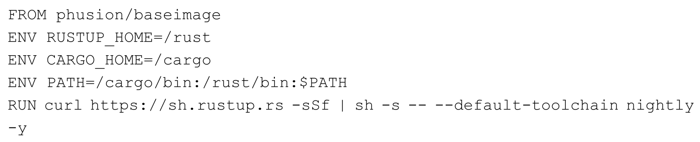
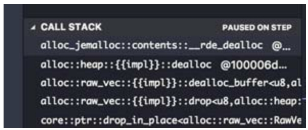

# 附录A Rust开发环境指南 {#text00020.html#Aee41b2fb-b814-4547-b371-cc28a055c769 .title-left}

**A.1 无须安装环境也可以玩转Rust**

不需要在本地安装 Rust，也可以玩转 Rust。官方提供了在线的 PlayGroud 环境：https：//play.rust-lang.org/，如图A-1所示。你只需要有网络，打开浏览器，输入此网址，就可以方便地玩转Rust。

::: center
{.u53396}

图A-1：Playground示意
:::

Rust并没有提供方便的交互式运行（Read-eval-print-loop，REPL）环境，虽然也有第三方库，但并不好用。所以 Playgroud 暂时就是最佳的选择，也许以后会有更好用的 REPL 工具。

PlayGroud的功能很丰富，你可以方便地查看编译后的ASM、LLVM IR和MIR，如图A-2所示。

单击MIR按钮，就可以看到输出了MIR代码。PlayGroud还可以选择Rust的不同版本，比如Stable、Beat和Nightly，也可以选择编译模式，例如，Debug和Release。

::: center
{.u53395}

图A-2：可以选择要编译的目标格式
:::

**A.2 在本地安装Rust**

Rust工具集里包含了两个重要的组件：rustc和cargo。

· rustc，是Rust的编译器。

· cargo，是Rust的包管理器，包含构建工具和依赖管理。

Rust的工具集分为以下三类版本：

· Nightly，通常称之为"夜版"。它是Rust日常开发的主分支，其中包含了一些特性是不稳定的，有可能会改。

· Beta，测试版。该版本是每六周发布一次，其中只包含 Nightly 版本中被标记为稳定的特性。

· Stable，稳定版。该版本也是每六周发布一次，基于修复了已发现Bug的最新Beta版来发布。

开发人员一般是基于 Stable 版本来开发的，但是 Nightly 版本包含很多新的特性，一些第三方库有时也会用到Nightly版本。

**A.2.1 安装Rust**

Rust为我们提供了非常方便的安装工具：rustup，此工具和Ruby的rbenv、Python的pyenv，以及Node的nvm类似。

通过执行以下命令来安装rustup：

::: center
{.u53394}
:::

也可以通过参数指定默认使用Nightly版本：

::: center
{.u53393}
:::

此工具是全平台通用的，所以不管是Windows，还是Mac或Ubuntu，都适用。rustup会在Cargo目录下安装rustc、cargo、rustup，以及其他一些标准工具。类UNIX平台默认安装于\$HOME/.cargo/bin，Windows平台默认安装于%USERPROFILE%\\.cargo\\bin。

安装完毕，可以通过输入如下命令检测：

::: center
{.u53392}
:::

如果能看见终端显示出rust的最新版本号，则安装成功。

rustup可以帮助你管理本地的多个编译器版本，通过rustup default命令指定一个默认的rustc版本：

::: center
{.u53391}
:::

或者

::: center
{.u53390}
:::

通过指定日期，rustup 会自动下载相应的编译器版本来安装，如果报错，可以换一个日期，直到成功为止。你还可以通过执行**rustup-h** 来查看关于rustup的其他帮助。

**A.2.2 修改国内源**

国内有些地区访问Rustup的服务器不太顺畅，可以配置中国科学技术（USTC）的Rustup镜像。

（1）设置环境变量。

::: center
{.u53389}
:::

（2）设置cargo使用的国内镜像。

在CARGO_HOME目录下（默认是～/.cargo）建立一个名叫config的文件，内容如下：

::: center
{.u53388}
:::

**A.3 在Docker中使用Rust**

在你的**Dockerfile** 中添加如下配置：

::: center
{.u53387}
:::

如果你不想使用Nightly版本，可以将nightly换成stable。如果你想指定固定的nightly版本，则可以再添加如下一行命令：

::: center
{.u53386}
:::

**A.4 Rust IDE或编辑器**

IDE有很多选择，比如Visual Studio Code、IntelliJ IDEA等。

当然，你也可以用你最熟悉的编辑器：Emacs、Emacspace、Vim、Atom等。

**A.5 开发依赖工具介绍**

**A.5.1 Racer代码补全**

Racer是Rust代码补全库，很多编辑器都需要安装它（Interllij IDEA Rust已经默认包含了代码补全功能，但并非基于Racer，而是基于其自己实现的相关语言AST）：

::: center
{.u53385}
:::

代码补全需要源代码。以前需要下载源代码，手动放到某处并定期更新，现在有了 rustup很方便：

::: center
{.u53384}
:::

之后需要配置环境变量为：

::: center
{.u53383}
:::

**A.5.2 RLS**

RLS 是Rust Language Server的简写，微软提出编程语言服务器的概念，将 IDE 的一些编程语言相关的部分由单独的服务器来实现，比如代码补全、跳转定义、查看文档等。这样，不同的IDE或编辑器只需要实现客户端接口即可。

RLS是**Rust** 官方提供的，不过现在只有Visual Studio Code支持，并且需要在系统中安装nightly版本的Rust（不必启用）。

RLS的安装请查阅项目README ^[\[1\]](#text00020.html#n35A60239483D470E9FA20EDB048B74C7){#text00020.html#n35A60239483D470E9FA20EDB048B74C7s}^ ，也是rustup轻松完成。但因为目前部分功能还依赖于racer来实现，需要配置racer的环境变量（不必安装）。

**A.5.3 cargo 插件**

作为 Rust 最常用的工具，cargo 提供对项目的依赖管理、build、文档生成、发布等功能支持，还可以通过插件的方式扩展。下面这几个就是必装的 cargo 插件。

**clippy**

可以分析你的源代码，检查代码中的Code Smell。可以通过rustup工具安装clippy。

::: center
{.u53382}
:::

**rustfmt**

可以帮助你统一代码风格，团队开发中推荐使用。使用cargo可以方便地安装：

::: center
{.u53381}
:::

**cargo fix**

从1.29版本开始，Cargo自带子命令 cargo fix，可以帮助开发者自动修复编译器中有警告的代码。

------------------------------------------------------------------------

[\[1\]](#text00020.html#n35A60239483D470E9FA20EDB048B74C7s){#text00020.html#n35A60239483D470E9FA20EDB048B74C7} https://github.com/rust-lang-nursery/rls#setup.

[]{#text00021.html}

# 附录B Rust如何调试代码 {#text00021.html#A8db3454a-e77e-47ad-be4c-24fb83b860ed .title-left}

本文通过调试Rust语言的一个安全漏洞来展示Rust如何调试代码。Rust语言在2018年9月曝光过一个安全漏洞，编号为CVE-2018-1000657 ^[\[1\]](#text00021.html#n749339EA8880417A9C8E118B0A8A0F0E){#text00021.html#n749339EA8880417A9C8E118B0A8A0F0Es}^ 。Rust官方的GitHub仓库也有issues ^[\[2\]](#text00021.html#nCFF2023B5A774801942030D9FF4C79DC){#text00021.html#nCFF2023B5A774801942030D9FF4C79DCs}^ 的相关讨论。

该漏洞的成因如下：

· 混用了VecDeque＜T＞容器中"逻辑"容量和"物理"容量引发的UB。

· Rust产生segfault的条件，正是因为产生了UB。

· Rust里产生UB，只可能是在Unsafe Rust之下。

· 这个UB是因为逻辑漏洞导致指针错乱，然后导致std：：ptr：：write指针覆盖了合法数据。但这个不是段错误的原因。

· Rust在函数执行完之后，自动执行析构函数，也就是VecDeque的析构函数，其中也用到了unsafe，因为指针是错乱的，那么析构也错乱了。析构错乱导致合法的内存数据被释放，发生Segfault。

接下来使用**LLDB** 对相关issues中的代码进行调试，以便验证漏洞分析是否正确。LLDB是macOS平台下的工具，命令和Linux平台的GDB基本相似。

**B.1 环境配置**

首先，使用 **rustup install 1.20.0** 命令安装好有漏洞的 Rust 版本。别忘记使用 rustup default 1.20.0选择该版本为Rust默认版本。

有关调试工具，笔者使用的是**VSCode** ，需要安装**CodeLLDB** 插件（Mac环境，Linux请用GDB相关）。环境配置好之后，使用**cargo new lldb_demo** 命令在 **src/main.rs** 文件中保存issues中相关的示例代码。

代码大致如下：

::: center
{.u53380}
:::

::: center
{.u53379}
:::

完整代码可以在随书源码src/appendix/lldb.rs中找到。当然，你可以使用lldb命令进行调试，安装rust-lldb，但是不如使用VSCode方便。如图B-1所示，在VSCode Debug界面选择好配置，可以直接选择 Add Configuration\...来添加新的配置。

::: center
{.u53378}

图B-1：在VSCode Debug界面选择配置
:::

如图B-2所示，在选择Debug配置时，只需要选择 LLDB：Debug Cargo Output 就可以自动配置。然后，就可以开始进行调试了。

::: center
{.u53377}

图B-2：选择Debug配置
:::

**B.2 调试代码**

经过前文的分析，已经知道在哪里设置断点。如图B-3所示，在main函数中设置断点，因为问题出在 main 函数调用结束后的析构函数中。当然，只有这两个断点是不够的。但是可以开始进行调试了。

::: center
{.u53376}

图B-3：在main函数中设置好断点
:::

选择Debug界面，并单击该界面左上角的绿色三角形按钮，就可以开始调试代码。

如图B-4所示，刚开始缓慢单击Step Over（F10）按钮，也就是调试悬浮窗口的第二个按钮。

::: center
{.u53375}

图B-4：单击Step Over（F10）按钮调试代码
:::

直到程序执行完main函数，有结果输出为止，如图B-5所示。

::: center
{.u53374}

图B-5：单击Step Over（F10）按钮直到有结果输出为止
:::

此时观察VSCode侧边栏左侧的CALL STACK栏目，如图B-6所示。

::: center
{.u53373}

图B-6：CALL STACK栏展示了当前的函数调用栈
:::

这里首先需要介绍一个知识点：

· main函数执行的时候，Rust提供了一个很小的运行时std：：rt：：lang_start，会将main函数作为一个闭包传进去。

· lang_start支持Gloabl Heap和栈回溯支持。main函数中如果出现了panic，则会由它来负责恢复。

· Rust是基于LLVM的，实际上异常处理会分为两个阶段：搜索阶段和清理（cleanup）阶段。在搜索阶段，会检查 panic，并决定是否捕获它。在清理阶段，会决定到底运行哪个（如果有的话）清理代码对当前堆栈进行清理。它会调用析构函数和内存释放等。

前面分析漏洞的成因，可能是因为逻辑Bug导致析构函数释放了合法的内存，进而引起段错误。现在调试是想确认到底是不是这个原因。所以需要在 rt：：lang_start 调用的时候打上断点，这样才可以更精细地调试到底层的每个细节。所以需要单击 CALL STACK 栏中的std：：rt：：lang_start，这时调试界面会跳转到一个汇编界面，在默认选中的那行代码设置好断点，如图B-7所示。

::: center
{.u53372}

图B-7：在CALL STACK中选中std：：rt：：lang_start并设置断点
:::

此时再次单击Step Over应该会跳入汇编界面，如图B-8所示。

::: center
{.u53371}

图B-8：单击Step Over（F10）按钮跳到汇编界面
:::

此时使用Step Into（F11）按钮，单步递进调试代码。看到左侧CALLSTACK调用栈已经执行到了core：：ptr：：drop_in_place函数，这应该是VecDeque调用析构函数，正在释放内存。继续Step Into，会看到另外一个core：：ptr：：drop_in_place函数调用，如图B-9所示。

::: center
{.u53370}

图B-9：单击Step Into（F11）看到执行了另外一个drop_in_place函数
:::

现在回顾一下VecDeque函数的析构函数定义。

::: center
{.u53369}
:::

看来此时代码已经释放了 VecDeque 的内存。但是此时代码还在正常运行，并未报出段错误。所以，继续使用Step Into单步递进调试，发现VecDeque：：drop开始调用，如图B-10所示。

::: center
{.u53368}

图B-10：单击Step Into（F11）看到执行了vec_deque：：drop函数
:::

继续使用Step Into，发现drop函数执行完毕，代码依旧正常运行，说明段错误不是在析构函数的时候发生的。继续调试。

因为当前是main函数在执行。在析构函数执行完毕，main函数退出之前，Rust会将内存再归还给操作系统。那么接下来运行的代码应该都是做这一部分工作。在调试过程中，还可以通过左上角的VARIABLES栏观察函数调用中变量值的变化，如图B-11所示。

::: center
{.u53367}

图B-11：在Step Into过程中，通过VARIABLES窗口观察变量值的变化
:::

这个调试过程需要比较长的时间，在这个过程中，还能看到 VecDeque 底层的 RawVec在析构函数调用之后，多次调用dealloc_buffer来释放内存，如图B-12所示。

::: center
{.u53366}

图B-12：在Step Into过程中，能观察到多次dealloc_buffer 被调用
:::

继续调试，会看到heap：：dealloc被调用，这意味着堆内存被释放，如图B-13所示。

::: center
{.u53365}

图B-13：在Step Into过程中，看到heap：：dealloc被调用
:::

还会看到jemalloc的相关函数被调用，如图B-14所示。

::: center
{.u53364}

图B-14：在Step Into过程中，看到jemalloc的dealloc方法被调用
:::

在Rust 1.20中，Rust的默认内存分配器是Jemalloc，这里调用dealloc，意味着Jemallloc把内存归还给操作系统。直到此时，代码依旧正常运行。

直到最后的清理阶段完成之后，代码崩溃了，让VSCode出现了死锁，如图B-15所示。

::: center
{.u53363}

图B-15：代码崩溃
:::

直到执行完 std：：syscommon：：at_exit_imp：：cleanup 之后，段错误才发生。std：：syscommon：：at_exit_imp是rt运行时的最后退出阶段，此时代码执行完毕，要将内存归还给操作系统。

同时，VSCode LLDB Debug工具抛出了EXC_BAD_ACCESS错误，并且此时代码调用停留在pthread_mutex_lock调用处。pthread_mutex_lock其实是调用libc库中的一个系统API，已经到操作系统底层了。抛出EXC_BAD_ACCESS错误一般是由"调用了已经释放的内存空间，或者说重复释放了某个地址空间"而引起的。

分析到这里，真相已经浮出了水面。

**B.3 总结**

（1）前文中分析段错误产生的原因经过了LLDB的实证。

（2）因为容量使用错误，导致指针混乱。

（3）在 main 函数析构函数调用之后，因为指针混乱，将不该释放的内存释放掉了。但是此时并未发生panic。

（4）在 main 函数退出运行时的时候，需要将内存归还给操作系统。此时调用了另外一个cleanup方法，在给操作系统归还内存的过程中，通过抛出的错误EXC_BAD_ACCESS分析，应该是调用了本来不该释放但已经释放的内存空间。

（5）错误发生在操作系统接口pthread_mutex_lock中，Rust根本无法捕捉，所以发生段错误。

------------------------------------------------------------------------

[\[1\]](#text00021.html#n749339EA8880417A9C8E118B0A8A0F0Es){#text00021.html#n749339EA8880417A9C8E118B0A8A0F0E} https://cve.mitre.org/cgi-bin/cvename.cgi?name=%20CVE-2018-1000657.

[\[2\]](#text00021.html#nCFF2023B5A774801942030D9FF4C79DCs){#text00021.html#nCFF2023B5A774801942030D9FF4C79DC} https://github.com/rust-lang/rust/issues/44800.
