[]{#text00000.html}

**内容简介**

Rust是一门利用现代化的类型系统，有机地融合了内存管理、所有权语义和混合编程范式的编程语言。它不仅能科学地保证程序的正确性，还能保证内存安全和线程安全。同时，还有能与 C/C++语言媲美的性能，以及能和动态语言媲美的开发效率。

本书并非对语法内容进行简单罗列讲解，而是从四个维度深入全面且通透地介绍了Rust语言。从设计哲学出发，探索Rust语言的内在一致性；从源码分析入手，探索Rust地道的编程风格；从工程角度着手，探索Rust对健壮性的支持；从底层原理开始，探索Rust内存安全的本质。

本书涵盖了Rust 2018的特性，适合有一定编程经验且想要学习Rust的初学者，以及对Rust有一定的了解，想要继续深入学习的进阶者。\
\
\

未经许可，不得以任何方式复制或抄袭本书之部分或全部内容。

版权所有，侵权必究。\
\
\

**图书在版编目(CIP)数据**

Rust编程之道/张汉东著.---北京：电子工业出版社，2019.1

ISBN 978-7-121-35485-4

Ⅰ.①R... Ⅱ.①张... Ⅲ.①程序语言-程序设计 Ⅳ.①TP312

中国版本图书馆CIP数据核字(2018)第251334号\
\
\

策划编辑：刘恩惠

责任编辑：张春雨

印刷：

装订：

出版发行：电子工业出版社

北京市海淀区万寿路173信箱 邮编：100036

开本：787×1092 1/16 印张：36.25 字数：1018千字

版次：2019年1月第1版

印次：2019年1月第1次印刷

定价：128.00元\
\

凡所购买电子工业出版社图书有缺损问题，请向购买书店调换。若书店售缺，请与本社发行部联系，联系及邮购电话：(010)88254888，88258888。

质量投诉请发邮件至zlts@phei.com.cn，盗版侵权举报请发邮件至dbqq@phei.com.cn。

本书咨询联系方式：(010)51260888-819，faq@phei.com.cn。

[]{#text00001.html}

# 推荐序一 {#text00001.html#Aa8728708-6fca-4dea-985b-061240142526 .title-left}

Even though I had to read this book through Google Translate, *The Tao of Rust* is an extremely interesting book.It starts off explaining exactly why it is different:it\'s a book that gets you to think about Rust,and its perspective on the world.I only wish I could read it in its native tounge,as I\'m sure it\'s even better then!I have been working on Rust for six years now,and this book changed my perspective on some aspects of the language.That\'s very powerful!

即便我不得不通过谷歌翻译阅读这本书，但也不难发现《Rust编程之道》是一本非常有趣的书。它解释了Rust为何与众不同：这本书可以让你思考Rust，以及Rust语言所蕴含的世界观。我好希望能读懂中文原版书，因为我相信它会更精彩！我已经从事 Rust的相关工作六年了，这本书改变了我对Rust语言的某些看法。这非常强大！

------Steve Klabnik，Rust官方核心团队成员及文档团队负责人

[]{#text00002.html}

# 推荐序二 {#text00002.html#Abdca2435-e282-42b7-90f2-4a774e6e3b2e .title-left}

I knew Rust was a notoriously difficult programming language to learn,but it wasn\'t until I read the preface to *The Tao of Rust* ,by Alex Zhang,that I realized why it is so difficult.Alex writes:

Rust covers a wide range of knowledge,including object-oriented,functional programming,generics,underlying memory management,type systems,design patterns,and more.

Alex covers all of these topics and more in *The Tao of Rust* .A single text that ties all of this together will be invaluable for Rust learners.So far I\'ve read a couple of chapters translated from the original Chinese,and I can\'t wait to read more.

Rust语言难学，这已经是众所周知的了。但是直到我看到Alex（张汉东）的《Rust编程之道》的前言时，我才明白它为什么如此难学，Alex写道：

"Rust 涉及的知识范围非常广泛，涵盖了面向对象、函数式、泛型、底层内存管理、类型系统、设计模式等知识。"

《Rust编程之道》一书涵盖了所有这些主题和内容，并且将这些内容有机地联系在一起，这对于Rust的学习者来说是非常宝贵的。我阅读了本书部分内容的英文译稿后，就已经迫不及待地想要阅读更多的内容了。

------Patrick Shaughnessy，《Ruby原理剖析》原著作者

[]{#text00003.html}

# 推荐序三 {#text00003.html#Acfee9382-653c-42dd-a431-7f84774f3ac7 .title-left}

三年前，当我们决定为TiDB开发自有的分布式key-value存储系统TiKV时，我们首先要面对的就是选择什么语言的问题。当时，摆在我们面前的有多个选择：Go、C++、Java和Rust。在仔细评估之后，我们决定使用Rust，虽然那时候Rust并没有太多成功的项目案例。我清晰地记得当时选择一门语言的条件如下。

· 我们需要一门安全的语言，让我们处理内存和多线程的时候更加游刃有余，不用担心类似垂悬指针、数据争用等问题。

· 我们需要一门高性能的静态语言，以便更好地与内存、CPU打交道，不用担心GC引起的延迟突然上升等问题。

· 我们需要一个强大的包管理系统，以避免陷入编译构建工具的细节中，也不用为管理多个版本的库而发愁。

· 我们需要一个友善的社区，在需要时能从这个社区得到帮助，与大家一起成长。

以上这些条件，Rust全部满足。事实也没有让我们失望。我们使用Rust快速地对TiKV进行了迭代。现在，TiKV 不仅大量用在生产环境中，还进入了 CNCF 基金会，成为了一个在Cloud上面构建其他服务的原生基础组件。

但是，我们使用Rust的历程并不是一帆风顺的。在早期，Rust相关的文档非常稀缺，网上也没有很好的参考资料，更别提专业系统的 Rust书籍了。所以，当我拿到汉东同学的《Rust编程之道》时，我是非常兴奋的。本书不仅介绍了 Rust 的基础知识，还详细地解释了 Rust里面非常难以理解的所有权系统、内存模型、并发编程等特性。尤其是所有权这个概念，对很多同学来说，所有权就是从其他语言切换到Rust的第一个拦路虎，而汉东同学在本书中进行了细致清晰的讲解，相信大家会有一种"哦，原来如此"的感慨。更难能可贵的是，本书还从工程角度讲解了如何使用Rust来编写健壮的应用程序，提升产品质量。

Rust是一门相对难学的语言，我个人认为它的学习曲线比C++的学习曲线更陡峭，但我相信，通过《Rust编程之道》，大家能快速掌握Rust，体验使用Rust编程的乐趣，也能更快地在项目中使用Rust来保证程序的健壮性。如果你遇到了困难，不用害怕，你可以很方便地从Rust社区得到帮助。

欢迎来到 Rust的世界！！！

------唐刘，PingCAP首席架构师，TiKV负责人

[]{#text00004.html}

# 序 {#text00004.html#A86c660b8-8936-4227-8216-dbeeba0d0a24 .title-left}

当我2015年开始学习Rust的时候，我绝对没有想过要写一本Rust编程的书。

**缘起**

当时我刚刚翻译完《Ruby原理剖析》一书，开始对底层开发产生了一点点兴趣。从2006年入行以来，我就一直和动态语言打交道。虽然自己也想学习底层开发，但能选择的语言几乎只有 C++。我在学校里浅浅地学过 C++这门语言，也许是第一印象作怪，总难以提起对C++的兴趣。

当Rust 1.0发布时，我去官方网站了解了一下Rust语言，发现它的主要特点有以下几方面：

· 系统级语言

· 无GC

· 基于LLVM

· 内存安全

· 强类型+静态类型

· 混合编程范式

· 零成本抽象

· 线程安全

我一下子就被这些鲜明的特性"击中"了，从此开始了Rust的学习。

**再一次爱上编程**

第一次爱上编程是在上小学时。父亲给我买回来一台金字塔学习机，这台学习机有两种功能，一种是学习Logo语言，另一种是玩卡带游戏。编写Logo语言就是用小海龟画图，也许是因为太早了，也许是因为没有人引导，那时的我选择了痛快地玩游戏。总想着先玩游戏，再去学怎么编程，然后还幻想着能不能用 Logo 语言编写一个游戏。其实这时候的我对编程更多的是一种憧憬，并没有在学习编程上付出更多的实际行动。

第二次爱上编程是在大学初次学习C语言的时候。我本可以选择计算机科学专业，但是最后还是选了电子信息科学与技术专业。这样选是因为我想把软硬件都学了。想法是好的，可惜实施起来并不容易。最后的结果就是，软硬件都没学好。

第三次爱上编程是在遇到Ruby语言的时候。当时我在用Java，并且已经完全陷入了Java语言和Web框架纷繁复杂的细节中，痛苦不堪。Ruby on Rails框架的横空出世，把我从这种状态中解救了出来。Ruby语言的优雅和自由，以及"让程序员更快乐"的口号深深地吸引了我。这一次我是真正爱上了编程，并且积极付诸行动去学习和提升自己。此时也恰逢互联网创业大潮的开始，Ruby语言的开发效率让它迅速成为创业公司的宠儿，因此，我也借着Ruby这门语言参与到了这股创业洪流中。

第四次爱上编程是在遇到Rust的时候。此时，创业洪流已经退潮。技术圈有句话，叫"十年一轮回"。当年喜欢Ruby给开发过程带来的快乐，但是随着时代的变革和业务规模的增长，我不禁开始重新思考一个问题：何谓快乐？真正的快乐不仅仅是写代码时的"酸爽"，更应该是代码部署到生产环境之后的"安稳"。Rust恰恰可以给我带来这种"双重快乐"体验。

**为什么是Rust**

社区中有人模仿阿西莫夫的机器人三大定律，总结了程序的三大定律 ^[\[1\]](#text00004.html#nE317000745E947DFA0DCD59F5E5C0E5A){#text00004.html#nE317000745E947DFA0DCD59F5E5C0E5As}^ ：

· 程序必须正确。

· 程序必须可维护，但不能违反第一条定律。

· 程序必须高效，但不能违反前两条定律。

程序的正确性，一方面可以理解为该程序满足了实际的问题需求，另一方面是指满足了它自身的程序规约。那么如何保证程序的正确性呢？首先，可以通过对程序的各种测试、断言和错误处理机制，来保证其满足实际的问题需求。其次，在数学和计算机科学已经融合的今天，通过较为成熟的类型理论即可保证程序自身的规约正确。

以我最熟悉的 Ruby 语言为例，程序的正确性必须依赖于开发者的水平，并需要大量的测试代码来保证正确性。即便在100%测试覆盖率的条件下，也经常会遇到NilError之类的空指针问题。也就是说，Ruby程序自身的正确性还没有得到保证。以此类推，C、C++、Python、Java、JavaScript等语言都有同样的问题。

而函数式编程语言在这方面要好很多，尤其是号称纯函数式的 Haskell 语言，它具有融合了范畴理论的类型系统，利用了范畴理论自身的代数性质和定律保证了程序自身的正确性。然而，Haskell也有比较明显的缺点，比如它不满足上述第三条定律，运行效率不高。

反观Rust语言，对程序的三定律支持得恰到好处。它借鉴了Haskell的类型系统，保证了程序的正确性。但还不止于此，在类型系统的基础上，Rust借鉴了现代C++的内存管理机制，建立了所有权系统。不仅保证了类型安全，还保证了内存安全。同时，也解决了多线程并发编程中的数据竞争问题，默认线程安全。再来看代码的可维护性，Rust代码的可读性和抽象能力都是一流的。不仅拥有高的开发效率，还拥有可以和C/C++媲美的性能。当然，没有银弹，但Rust就是我目前想要的语言。

目前Rust被陆续应用在区块链、游戏、WebAssembly技术、机器学习、分布式数据库、网络服务基础设施、Web框架、操作系统和嵌入式等领域。时代在变化，未来的互联网需要的是安全和性能并重的语言，Rust必然会在其中大放异彩。

**学习Rust带来了什么收获**

Rust是一门现代化的语言，融合了多种语言特性，而且Rust语言可以应用的领域范围非常广泛。在学习Rust的过程中，我发现自己的编程能力在很多方面存在短板。突破这些短板的过程实际上就是一次自我提升的过程。

Rust 是一门成长中的新语言，学习 Rust，跟随 Rust 一起成长，可以体验并参与到一门真正工业化语言的发展进程中，感觉就像在创造历史。虽然我并未给Rust语言提交过PR，但也为Rust语言和社区多次提交过Bug，以及文档和工具的改进意见。

Rust自身作为一个开源项目，算得上是开源社区中的"明星"项目了。学习Rust的过程加深了我对开源社区的认识，也开拓了我的眼界。

**为什么要写这本书**

在学习Rust一年之后，我写下了《如何学习一门新语言》一文，其中记录了我学习Rust的心得，这篇文章颇受好评。也正因为这篇文章，电子工业出版社的刘恩惠编辑找到了我，并询问是否可以出一本Rust编程的书籍。我当时也正想通过一本书来完整地表达自己的学习心得，再加上中文社区中没有较全面系统的Rust书籍，于是，一拍即合。

写书的过程可以形容为痛并快乐着。Rust语言正值成长期，很多语言特性还在不断地完善。举一个极端的例子，比如写下某段代码示例并成功编译后，过了三天却发现它无法编译通过了。于是，我再一次跟进Rust的RFC、源码、ChangeLog去看它们的变更情况，然后再重新修订代码示例。这个过程虽然痛苦，但改完之后会发现Rust的这个改进确实是有必要的。在这个过程中，我看到了Rust的成长，以及Rust团队为保证语言一致性和开发者的开发体验所付出的努力，让我感觉自己花再多时间和精力去修改本书的内容都是值得的。

话说回来，任何人做事都是有动机或目的的，我也不例外。我写这本书的目的主要有以下三个。

· 为Rust中文社区带来一本真正可以全面系统地学习Rust的书。

· 以教为学。在写作的过程中，让自己所学的知识进一步内化。

· 传播一种自学方法。本书内容以Rust语言的设计哲学为出发点，按照从整体到细节的思路逐个阐述每个语言特性，希望读者可以产生共鸣。

**结语**

我自己作为本书的第一位读者，目前对这本书是非常满意的。衷心希望每一位读者都能从本书中收获新知。当然，我也知道不可能让每一位读者都满意。在我看来，写书不仅是在传播知识和思想，更是一种交流和沟通。所以，当你不满意的时候，可以来找我交流，提出更多建设性意见，帮助我成长。我争取在写下一本书的时候，让更多的人满意。而且，如果你的建议确实中肯，让我得到了成长，我也为你准备了不错的小礼物。

------------------------------------------------------------------------

[\[1\]](#text00004.html#nE317000745E947DFA0DCD59F5E5C0E5As){#text00004.html#nE317000745E947DFA0DCD59F5E5C0E5A} https://medium.com/@schemouil/rust-and-the-three-laws-of-informatics-4324062b322b

[]{#text00005.html}

# 前言 {#text00005.html#A6add9b71-0682-41b8-bef6-1b5a168651aa .title-left}

在我刚开始学习Rust的时候，在社区里听到最多的声音就是"Rust学习曲线陡"。已经有一定编程经验的人在学习一门新语言时，都喜欢直接上手写代码，因为这样可以快速体验这门语言的特色。对于大多数语言来说，这样确实可以达到一定的学习目的。但是当他们在初次学习Rust的时候，就很难通过直接上手来体验这种快感。

我第一次学习Rust时就遇到了这样的情况。我按以往的编程经验直接写下了代码，但是编译无法通过；可是有时候简单调换两行代码的顺序，程序就能顺利编译成功了，这让我非常困惑。我想这也是大多数人感觉"Rust学习曲线陡"的原因吧。经过和Rust编译器的多次"斗争"之后，我不得不重新反思自己的学习方法。看样子，Rust 编译器暗含了某种规则，只要程序员违反了这些规则，它就会检查出来并阻止你。这就意味着，作为程序员，你必须主动理解并遵守这些规则，编译器才能和你"化敌为友"。

所以，我就开始了对Rust的第二轮学习，忘掉自己以往的所学，抱着初学者的心态，从零开始系统地学习Rust。然而，事情并没有这么简单。

Rust官方虽然提供了*Rust Book* ，但是内容的组织非常不友好，基本就是对知识点的罗列，系统性比较差。后来官方也意识到了这个问题，推出了第2版的*Rust Book* ，内容组织方面改善了很多，对学习者也非常友好，但系统性还是差了点。后来又看了国内Rust社区组织群友们合著的*Rust Primer* ，以及国外的*Programming Rust* ，我才对Rust建立了基本的认知体系。

直到此时，我才意识到一个重要的问题：Rust学习曲线陡的根本原因在于Rust语言融合了多种语言特性和多种编程范式。这就意味着，Rust涉及的知识范围非常广泛，涵盖了面向对象、函数式、泛型、底层内存管理、类型系统、设计模式等知识。从底层到上层抽象，从模式到工程化健壮性，无所不包。可以说，Rust是编程语言发展至今的集大成者。对于大多数Rust语言的初学者来说，他掌握的知识体系范围是小于Rust所包含的知识量的，所以在学习Rust的过程中会遇到无法理解的内容。

我在学习Rust之前，所掌握的编程语言知识体系大多是和拥有GC的动态语言相关的，对于底层内存管理知之甚少。所以在我学习Rust所有权的时候，就很难理解这种机制对于内存安全的意义所在；而我所认识的一些拥有 C 语言编程经验的朋友，在学习 Rust 时面临的问题是，难以理解Rust支持的上层抽象，对他们来说，Rust中融合的类型系统和编程范式就是他们学习道路上的"拦路虎"；对于拥有 Haskell 等函数式编程经验的朋友，会感觉 Rust的类型系统很容易理解，但是底层的内存管理和所有权机制又成了需要克服的学习障碍；来自C++编程圈的朋友，尤其是懂现代C++的朋友，对Rust所有权机制理解起来几乎没有困难，但是类型系统和函数式编程范式可能会阻碍他们的学习。当然，如果正好你没有上述情况，那说明你的相关知识体系已经很全面了，你在Rust的学习之路上将会非常顺利。

这是不是意味着，在学习Rust之前需要把其他语言都学一遍呢？答案是否定的。

Rust编程语言虽然融合了很多其他语言的特性和范式，但它不是进行简单的内容堆叠，而是有机地融合了它们。也就是说，Rust遵循着高度的一致性内核来融合这些特性。我们只需要从Rust的设计哲学出发，牢牢地把握它的设计一致性，就可以把它的所有特性都串起来，从而达到掌握它的目的。这正是本书遵循的写作逻辑。

**本书特点**

**从设计哲学出发，探索 Rust 语言的内在一致性** 。设计哲学是一门优秀编程语言保持语言一致性的关键所在。设计哲学是语言特性和语法要素设计的诱因和准则。理解Rust语言的设计哲学，有助于把握Rust语言的内核与一致性，把Rust看似纷繁复杂的特性都系统地串起来。

**从源码分析入手，探索Rust地道的编程风格** 。Rust是一门自举的语言，也就是说，Rust语言由Rust自身实现。通过阅读Rust标准库和一些第三方库的源码，不仅可以深入理解Rust提供的数据类型和数据结构，更能体验和学习地道的Rust编程风格。

**从工程角度着手，探索 Rust 对健壮性的支持** 。Rust 通过类型系统、断言、错误处理等机制保证内存安全的同时，还保证了系统的健壮性。从工程角度去看Rust，才能看到Rust对系统健壮性的支持是多么优雅。

**从底层原理开始，探索Rust内存安全的本质** 。只有深入底层，才能理解Rust所有权机制对于内存安全的意义。而且可以进一步理解Rust的类型系统，以及Unsafe Rust存在的必要性。

**读者群体**

适合本书的读者群体包括：

· 有一定编程经验，想要学习Rust的初学者。

· 对Rust有一定了解，还想对Rust深入学习的进阶者。

本书不适合完全没有编程基础的人学习。

**如何阅读本书**

对于Rust初学者，建议按照章节顺序去阅读。因为本书每一章内容基本都依赖于前一章内容的前置知识。

对于Rust有一定了解的朋友，可以选择你感兴趣的章节去阅读。因为本书的每一章也是对一个垂直主题的深入探讨。

一些章节的开头罗列出了通用概念，这是为了更通透地讲解相关知识的来龙去脉。如果你对这部分内容不了解，那么建议你把这部分内容（属于前置知识）认真看完再去看后面的内容。如果你对这部分内容已经有了充分的了解，那么完全可以跳过，直接选择你最关心的内容去阅读。

**章节概述**

**第1章 新时代的语言** 。这一章将从Rust语言的发展历史概述开始，引出Rust的设计哲学，通过设计哲学进一步阐述Rust的语言架构。该语言架构也是本书组织内容时遵循的准则之一。这一章还将介绍 Rust 语言社区的现状和未来展望。最重要的是，这一章将介绍 Rust代码的执行流程，这对于理解本书后面的章节会有所帮助。

**第 2 章 语言精要** 。学习任何一门语言时，首先要做的就是了解其语法。这一章将罗列Rust语言中的常用语法，但不是简单罗列，而是遵循一定的逻辑进行罗列。在介绍语法之前，这一章会先对Rust语言的基本构成做整体概述。然后将介绍一个非常重要的概念：表达式。它是Rust语法遵循的最简单的准则之一。接下来才会依次介绍Rust中最常用的语法，让读者对Rust语言有一个初步的了解。

**第 3 章 类型系统** 。类型系统是现代编程语言的重要支柱。这一章首先将以通用概念的形式介绍类型系统相关的概念，目的是帮助不了解类型系统的读者建立初步认知。接下来将从三方面阐述Rust的类型系统。为了理解Rust基于栈来管理资源的思想，有必要先了解Rust中对类型的分类，比如可确定大小类型、动态大小类型和零大小类型等。这一章还将介绍Rust类型推导功能及其不足。接下来将介绍Rust中的泛型编程。泛型是Rust类型系统中最重要的一个概念。最后会介绍Rust 的"灵魂"，trait 系统。对类型系统建立一定的认知，有利于学习后面的内容。

**第 4 章 内存管理** 。这一章首先将介绍底层内存管理的通用概念。在此基础上，围绕内存安全这个核心，从变量定义到智能指针，逐渐阐述Rust中资源管理的哲学。这部分内容是真正理解Rust所有权机制的基础。

**第 5 章 所有权系统** 。这一章首先会介绍关于值和引用语义的通用概念，然后在此基础上探讨Rust的所有权机制。读者将看到，Rust如何结合类型系统和底层内存管理机制，以及上层值和引用的语义形成现在的Rust所有权系统。然后，进一步围绕内存安全的核心，阐述借用检查和生命周期参数的意义。通过这一章的学习，读者将会对Rust的所有权系统有全面深入的了解。

**第6章 函数、闭包和迭代器** 。在对Rust的类型系统和内存安全机制有了一定了解之后，我们将开始深入学习 Rust 编程最常用的语法结构。函数是 Rust 中最常用的语法单元。Rust的函数承载了诸多函数式编程范式的特性，比如高阶函数、参数模式匹配等，同时也承载了面向对象范式的特性，比如为结构体及其实例实现方法，实际上就是一个函数调用的语法糖。然后将介绍闭包的用法和特性，帮助读者对闭包建立全面深入的认知，更重要的是，通过学习闭包的实现原理，进一步了解Rust中零成本抽象的哲学思想。最后介绍迭代器模式，以及Rust中的迭代器实现机制。迭代器也是Rust最常用的特性，通过这一章的学习，你将彻底了解迭代器。

**第7章 结构化编程** 。这一章将对Rust混合范式编程进行探讨，会重点介绍Rust中的结构体和枚举体，以及它们如何在日常编程中以面向对象风格编程。同时，还将介绍三种设计模式，前两种是Rust标准库以及第三方库常用的设计模式，最后是一种合理利用Rust资源管理哲学的设计模式。通过学习这一章的内容，有利于掌握地道的Rust编程风格。

**第 8 章 字符串与集合类型** 。字符串是每门编程语言最基本的数据类型，Rust 自然也不例外。出于内存安全的考虑，Rust中的字符串被分为了多种，并且语言自身没有自带正则表达式引擎。这一章将从字符编码开始，围绕内存安全，对Rust中的字符和字符串做彻底梳理，并且阐述如何在没有正则表达式引擎的情况下，满足字符串进行匹配搜索等的需求。集合类型也是编程中必不可少的数据结构。这一章将着重介绍动态数组Vector和Key-Value映射集HashMap 的使用，而且还会深入挖掘 HashMap 底层的实现原理，介绍 Rust 标准库提供的HashMap安全性，进一步探讨如何用Rust实现一个生产级的数据结构。最后将通过探讨一个Rust安全漏洞的成因，来帮助读者正确理解容量的概念，从而写出更安全的代码。

**第 9 章 构建健壮的程序** 。对于如何构建健壮的系统，Rust 给出了非常工程化的解决方案。Rust将系统中的异常分为了多个层次，分别给出了对应的处理手段。在这一章，读者将学习Rust是如何以分层的错误处理解决方案来帮助开发者构建健壮系统的。

**第10章 模块化编程** 。现代编程语言的一大特色就是可以方便地进行模块化，这样有利于系统的设计、维护和协作。Rust在模块化编程方面做得很好。这一章首先将介绍Rust强大的包管理系统Cargo。然后会以真实的代码实例阐述Rust的模块系统，并且将包含Rust 2018版本中模块系统的重大改进。最后将以一个完整的项目为例阐述如何使用 Rust 开发自己的crate。

**第11章 安全并发** 。Rust从两方面支持并发编程。首先，利用类型安全和内存安全的基础，解决了多线程并发安全中的痛点：数据竞争。Rust可以在编译时发现多线程并发代码中的安全问题。其次，Rust为了达成高性能服务器开发的目标，开始全面拥抱异步开发。这一章将从线程安全的通用概念开始，从Rust多线程并发讲到异步并发支持，带领读者逐步形成全面、深入、通透的理解。

**第12章 元编程** 。元编程即程序生成程序的能力。Rust为开发者提供了多种元编程能力。这一章将从反射开始介绍Rust中的元编程。虽然Rust的反射功能没有动态语言的那么强大，但是Rust提供了强大的宏系统。这一章将从Rust的编译过程出发，带领读者深入理解Rust的宏系统的工作机制，并且以具体的实例帮助读者理解编写宏的技巧。从声明宏到过程宏，再到编译器插件，以及第三方库syn和quote最新版的配合使用，都将在本章进行阐述。

**第13章 超越安全的边界** 。前面的章节内容基本都是建立在Safe Rust的基础上的。而这一章将主要围绕Unsafe Rust的内容来构建，主要分为4大部分。首先将介绍Unsafe Rust的基本语法和特性。然后，围绕基于Unsafe进行安全抽象的核心，阐述Unsafe Rust开发过程中可能引起未定义行为的地方，以及相应的解决方案。然后介绍 FFI，通过具体的实例来阐述Rust如何和其他语言交互，涉及C、C++、Ruby、Python、Node.js等语言，还将介绍相关的第三方库。最后，将介绍未来互联网的核心技术 WebAssembly，以及 Rust 如何开发WebAssembly和相关的工具链。

相信通过这13章的内容，读者将会对Rust有全面、深入和系统的认识。

**勘误及更多资源**

有人的地方就有Bug，此书当然也不例外。写书不仅是正确地传播知识和思想的途径，更是一种交流和沟通的方式。如果你发现本书中的任何错误、遗漏和解释不清楚的地方，欢迎提出反馈。

随书源码地址：https://github.com/ZhangHanDong/tao-of-rust-codes

::: center
{.u54483}
:::

**勘误说明：**

· 直接提交issues。

· 标明具体的页码、行数和错误信息。

· 积极提出勘误者将获得合金Rust勋章一枚。

**更多的学习资源：**

· 官方doc.rust-lang.org列出了很多学习文档和资源。

· 订阅Rust每日新闻 ^[\[1\]](#text00005.html#n169E000D5253448B8F1E50F394EF6EA5){#text00005.html#n169E000D5253448B8F1E50F394EF6EA5s}^ ，了解Rust社区生态发展，学习Rust。

**致谢**

首先，我要感谢Rust社区中每一位帮助过我的朋友，没有你们的奉献，就没有这本书。

感谢Mike组织社区编写的免费书籍*Rust Primer* 。感谢Rust社区中不知名的翻译者翻译官方的*Rust Book* 。感谢知乎《Rust编程》专栏作者辛苦的写作。感谢KiChjang、ELTON、CrLF0710、F001、Lingo、tennix、iovxw、wayslog、Xidorn、42、黑腹喵等其他社区里的朋友们，你们在我学习的过程中给予了我无私的帮助和解答，Rust社区有你们真好。感谢知道我写作并一直鼓励和支持我的朋友们。衷心希望Rust社区可以一直这么强大、温柔和友好。

然后，我要感谢电子工业出版社的刘恩惠编辑。感谢你给了我这个机会，让这本书从想法成为了现实。

最后，感谢我的妻子宋欣欣，因为她的温柔、大度、包容、信任和支持，才让我能够踏实且满含信心地做我自己想做的事。感谢我的父母，正是他们的培养，才使我具有积极、坚持不懈做事情的品格。

**读者服务**

轻松注册成为博文视点社区用户（www.broadview.com.cn），扫码直达本书页面。

· **下载资源** ：本书如提供示例代码及资源文件，均可在 [下载资源]{.underline} 处下载。

· **提交勘误** ：您对书中内容的修改意见可在 [提交勘误]{.underline} 处提交，若被采纳，将获赠博文视点社区积分（在您购买电子书时，积分可用来抵扣相应金额）。

· **交流互动** ：在页面下方 [读者评论]{.underline} 处留下您的疑问或观点，与我们和其他读者一同学习交流。

页面入口：http：//www.broadview.com.cn/35485

::: center
{.u54483}
:::

------------------------------------------------------------------------

[\[1\]](#text00005.html#n169E000D5253448B8F1E50F394EF6EA5s){#text00005.html#n169E000D5253448B8F1E50F394EF6EA5} https://github.com/RustStudy/rust_daily_news

[]{#text00006.html}

# 目录

[推荐序一](#text00001.html#Aa8728708-6fca-4dea-985b-061240142526)

[推荐序二](#text00002.html#Abdca2435-e282-42b7-90f2-4a774e6e3b2e)

[推荐序三](#text00003.html#Acfee9382-653c-42dd-a431-7f84774f3ac7)

[序](#text00004.html#A86c660b8-8936-4227-8216-dbeeba0d0a24)

[前言](#text00005.html#A6add9b71-0682-41b8-bef6-1b5a168651aa)

[第1章 新时代的语言](#text00007.html#A13345fa2-ca9e-4443-b387-3be4be4ad807)

[1.1 缘起](#text00007.html#A2e390017-16f6-4767-888c-ac30171cf3dd)

[1.2 设计哲学](#text00007.html#Aed7f0019-4d35-4813-9045-1325129be2ec)

[1.2.1 内存安全](#text00007.html#A5d590019-f625-42fa-977c-68d5497c12b9)

[1.2.2 零成本抽象](#text00007.html#A25bb001a-ea7e-4415-bb38-2c42ad6ba144)

[1.2.3 实用性](#text00007.html#A93e9001b-07a4-4ef1-b0aa-5974bb850d10)

[1.3 现状与未来](#text00007.html#A8646001d-26aa-439b-b693-15e20ec5604f)

[1.3.1 语言架构](#text00007.html#A4a8f001e-2d5f-490e-96b7-70917d6acd94)

[1.3.2 开源社区](#text00007.html#A261a001f-2076-4801-990e-463085bc922e)

[1.3.3 发展前景](#text00007.html#Ae4fd001f-497d-47f3-a529-2e1a1a0af2a6)

[1.4 Rust代码如何执行](#text00007.html#Ac7100020-27df-4646-a368-affa8b0d076b)

[1.5 小结](#text00007.html#A9ede0020-c27b-442f-932d-9310ae9bacb4)

[第2章 语言精要](#text00008.html#A672b422f-6011-45a1-9bcd-716732b44efd)

[2.1 Rust语言的基本构成](#text00008.html#Aa2840021-48d9-4370-ab36-0cfd5e696c49)

[2.1.1 语言规范](#text00008.html#A2c6c0021-f6fc-4751-ba12-d6c630810c78)

[2.1.2 编译器](#text00008.html#Ad2310022-0fba-48fe-b1ff-6a55c6b38b9d)

[2.1.3 核心库](#text00008.html#A35000022-235b-4f28-85b5-0951fec89bfe)

[2.1.4 标准库](#text00008.html#Ac8a30022-7b3b-488a-b0be-7226a15dd514)

[2.1.5 包管理器](#text00008.html#Abc020023-3d4a-4ac4-bdb1-499e34da314d)

[2.2 语句与表达式](#text00008.html#Af96f0023-36f7-4614-a364-822d1ceeb79f)

[2.3 变量与绑定](#text00008.html#A02a60024-1356-4822-a930-cc2f737c5417)

[2.3.1 位置表达式和值表达式](#text00008.html#A14a50025-c010-43d3-80fd-93a8209276c1)

[2.3.2 不可变绑定与可变绑定](#text00008.html#Aea3c0025-eab9-4870-924d-035ba9f5797e)

[2.3.3 所有权与引用](#text00008.html#A9e910026-4c7a-400a-ad95-2fb171bfee0f)

[2.4 函数与闭包](#text00008.html#A23b60027-4382-4a74-b676-671aa8cbb163)

[2.4.1 函数定义](#text00008.html#Ad6a00027-5da3-48d7-9cd2-57b1a68a3445)

[2.4.2 作用域与生命周期](#text00008.html#A023e0028-d832-4805-9640-e97f0c7d9681)

[2.4.3 函数指针](#text00008.html#A5a270029-76fb-4450-b1b2-915c6625f59d)

[2.4.5 CTFE机制](#text00008.html#A8e32002a-bbd2-404e-b7b9-b554f687c760)

[2.4.6 闭包](#text00008.html#Aa887002a-4299-4cc8-b210-73f59138bd82)

[2.5 流程控制](#text00008.html#A88d9002c-ddd7-4f48-95bd-46cebb4c290d)

[2.5.1 条件表达式](#text00008.html#Ae0d2002c-03b0-461b-a6a9-1c2337cb2526)

[2.5.2 循环表达式](#text00008.html#A238b002d-8410-4d72-9e47-69cc175f4cfd)

[2.5.3 match表达式与模式匹配](#text00008.html#Ac22a002e-4b82-4a6d-a0b6-6e18c38d7ca0)

[2.5.4 if let和while let表达式](#text00008.html#Abd0f002f-43a0-4860-a538-d5dc5f2d05c0)

[2.6 基本数据类型](#text00008.html#A24e90030-c749-401f-8eed-4d5e097d3529)

[2.6.1 布尔类型](#text00008.html#A38910030-98d3-409f-9989-bfe60f40df63)

[2.6.2 基本数字类型](#text00008.html#A4d9d0030-a018-491e-8cb4-acd00b11f933)

[2.6.3 字符类型](#text00008.html#A495a0031-288c-4de3-8e79-aefe9ee83ee8)

[2.6.4 数组类型](#text00008.html#A77800032-34c3-4ef9-89fc-8ea5bd7ca97f)

[2.6.5 范围类型](#text00008.html#A6f4d0033-8d9e-45d0-b823-02f0c0377bfc)

[2.6.6 切片类型](#text00008.html#Afb960033-2f11-463c-80aa-3dd214949582)

[2.6.7 str字符串类型](#text00008.html#Acaee0034-a571-4e7d-8914-a4f6fbd53507)

[2.6.8 原生指针](#text00008.html#Aacf50035-55ad-46e4-925e-367bd7bd0639)

[2.6.9 never类型](#text00008.html#A78c30035-5b63-4f96-a560-794d1153ec23)

[2.7 复合数据类型](#text00008.html#A9e880036-9172-48b5-b36b-97820775cc55)

[2.7.1 元组](#text00008.html#A4f480036-58f0-42ac-9540-4110607e9f7f)

[2.7.2 结构体](#text00008.html#Af1720037-6ed8-41c7-b571-e1a7f82e6b70)

[2.7.3 枚举体](#text00008.html#A60a6003a-0c25-4594-be4a-387d9ed9617b)

[2.8 常用集合类型](#text00008.html#Aee9a003c-aeec-4146-9f02-0037ef0e9b86)

[2.8.1 线性序列：向量](#text00008.html#A3df4003c-ea0b-43d6-bf29-d23146263b1f)

[2.8.2 线性序列：双端队列](#text00008.html#Acfba003d-21bf-4c16-9ba9-8b64a8adfd68)

[2.8.3 线性序列：链表](#text00008.html#Ac072003e-24a7-454d-851c-7c6e90f443fb)

[2.8.4 Key-Value映射表：HashMap和BTreeMap](#text00008.html#A53bf003e-dc93-4783-8dd3-8fb09e8ca2ff)

[2.8.5 集合：HashSet和BTreeSet](#text00008.html#Aaf1f003f-0101-4d93-bc0d-54454f77f2f5)

[2.8.6 优先队列：BinaryHeap](#text00008.html#A74090040-c484-45e4-bbd4-13cf6e6ae96b)

[2.9 智能指针](#text00008.html#Afe8d0040-705b-44db-bee3-469d25c8777f)

[2.10 泛型和trait](#text00008.html#A5dad0041-8417-4f7c-bd06-302211239349)

[2.10.1 泛型](#text00008.html#A580713c2-16a0-4765-af13-547beecc42c2)

[2.10.2 trait](#text00008.html#Ac782f051-1d93-4586-828e-878262cf08c5)

[2.11 错误处理](#text00008.html#Ad4640045-098d-4091-8b59-91ca5c96e07e)

[2.12 表达式优先级](#text00008.html#Ad54f0046-9a46-455b-ab97-fc87b5bc82ea)

[2.13 注释与打印](#text00008.html#Abdbf0046-f00c-46c1-9f22-d4216d2cc031)

[2.14 小结](#text00008.html#A083b0048-8361-44ae-a371-8a144dcfb684)

[第3章 类型系统](#text00009.html#A94bb2754-a86f-4838-8885-f163e89f33a0)

[3.1 通用概念](#text00009.html#Afa6f0049-0a2b-4377-9c2c-9acd37489509)

[3.1.1 类型系统的作用](#text00009.html#Aad320049-ce3b-4f34-81fa-7abcf343778c)

[3.1.2 类型系统的分类](#text00009.html#A8579004a-7454-4a12-a64d-11a6e13c61cd)

[3.1.3 类型系统与多态性](#text00009.html#A4cbd004b-4c73-4335-94c6-669f6ddca6e9)

[3.2 Rust类型系统概述](#text00009.html#Aeac8004b-415b-4ec3-a957-d1c3bd5832d4)

[3.2.1 类型大小](#text00009.html#Aec09004b-4ecb-486d-8ee5-8597c3111cc0)

[3.2.2 类型推导](#text00009.html#Aaa400050-88a0-49fd-ba29-f811451b3074)

[3.3 泛型](#text00009.html#Aabdf0052-ee35-47ef-ae71-0c500e528223)

[3.3.1 泛型函数](#text00009.html#A078c0052-2f73-4218-a3d8-a25be7a7a9f4)

[3.3.2 泛型返回值自动推导](#text00009.html#A87000054-8733-4801-9986-35924b78445b)

[3.4 深入trait](#text00009.html#Ad6c10054-cf7b-4dd8-bfe6-57e5834d8fcc)

[3.4.1 接口抽象](#text00009.html#A86e30055-0f2a-4e3a-8f10-b531b55e576c)

[3.4.2 泛型约束](#text00009.html#A293e005b-8a83-4b12-ab0a-5c84a09676d6)

[3.4.3 抽象类型](#text00009.html#A6cde005d-99e2-4a05-89bd-11d2c3efb2d6)

[3.4.4 标签trait](#text00009.html#A7dfc0063-ba68-4754-9da9-f7db224e7ad3)

[3.5 类型转换](#text00009.html#A039f0069-6289-4ca8-8c90-8ac249909278)

[3.5.1 Deref解引用](#text00009.html#A35e30069-d512-4aec-a49d-9d7b55a00157)

[3.5.2 as操作符](#text00009.html#A582e006c-8455-4e37-bc01-f9a41d3ece59)

[3.5.3 From和Into](#text00009.html#Abad1006e-80f3-4150-bed8-333bd41ad773)

[3.6 当前trait系统的不足](#text00009.html#A3a27006f-0de1-4a2c-8e40-bc16c5ff489c)

[3.6.1 孤儿规则的局限性](#text00009.html#Ad3940070-4ee5-4864-8f8f-f0865dbb6e8b)

[3.6.2 代码复用的效率不高](#text00009.html#A00aa0071-0d6a-4cd0-960e-56d298b6ecad)

[3.6.3 抽象表达能力有待改进](#text00009.html#A14b40073-087d-46d9-8dfb-18d536a13bb6)

[3.7 小结](#text00009.html#A01890074-e80f-4176-a99f-1e1692d4d06a)

[第4章 内存管理](#text00010.html#Ae0097119-f28f-4899-a334-6385f17384a3)

[4.1 通用概念](#text00010.html#A33d30075-79a8-4d4a-9a0f-77bcc2957b56)

[4.1.1 栈](#text00010.html#A1abd0076-0983-4906-8609-074ddcbbd0c4)

[4.1.2 堆](#text00010.html#A5d1e0079-a874-4867-abd0-e0315b50c0c3)

[4.1.3 内存布局](#text00010.html#Ab673007b-2077-4c2b-9c01-39ff226f7733)

[4.2 Rust中的资源管理](#text00010.html#Ae886007d-1400-4387-8032-6f1daf25483d)

[4.2.1 变量和函数](#text00010.html#Ad58e007d-482d-40c6-9bf4-97a0e3697788)

[4.2.2 智能指针与RAII](#text00010.html#Ad30b0080-c9a0-4935-887b-e52e3f786bd6)

[4.2.3 内存泄漏与内存安全](#text00010.html#A27810084-7501-4d2d-94f3-4fde8f6a1551)

[4.2.4 复合类型的内存分配和布局](#text00010.html#A397e0089-a79b-49d1-89b7-d11d83950ed6)

[4.3 小结](#text00010.html#A9347008b-2c5d-4c56-a65a-fa25bbd9e95c)

[第5章 所有权系统](#text00011.html#Aec510d2f-6296-4358-8ac6-e9642a53a82b)

[5.1 通用概念](#text00011.html#A2a88008e-0aa6-490e-b72b-7742f41e2647)

[5.2 所有权机制](#text00011.html#A391e0091-e602-424a-acd1-4e8abc6466bb)

[5.3 绑定、作用域和生命周期](#text00011.html#Ada6a0093-3501-4d4e-af5b-fd2d2c672d75)

[5.3.1 不可变与可变](#text00011.html#Aace70094-220a-4292-8694-d89772d82abf)

[5.3.2 绑定的时间属性------生命周期](#text00011.html#A380f0095-9201-4f2c-802c-b64dc0a2ae68)

[5.4 所有权借用](#text00011.html#Afe040099-300c-4525-84c7-503b5d532106)

[5.5 生命周期参数](#text00011.html#A5e9b009d-f3a5-457e-b3fa-344b61377369)

[5.5.1 显式生命周期参数](#text00011.html#A84ba009e-999b-4cc9-b4ae-ea672627da64)

[5.5.2 省略生命周期参数](#text00011.html#A3e3800a5-440a-48d0-9b0a-5d396a54a916)

[5.5.3 生命周期限定](#text00011.html#A4a7800a7-e139-441d-90e7-26bae0baaf7a)

[5.5.4 trait对象的生命周期](#text00011.html#A8bf800a7-94cd-4ca4-814d-f83fc1d8f18d)

[5.6 智能指针与所有权](#text00011.html#A758700a8-5249-402d-a8f1-0f54fb65f530)

[5.6.1 共享所有权Rc＜T＞和Weak＜T＞](#text00011.html#A5e4500ab-673f-43b8-8fa7-c4941187207a)

[5.6.2 内部可变性Cell＜T＞和RefCell＜T＞](#text00011.html#Aa73600ad-2c18-48e7-a43a-0f5cb7310a26)

[5.6.3 写时复制Cow＜T＞](#text00011.html#A82a300af-776c-4af7-b121-e6f47fcc8c56)

[5.7 并发安全与所有权](#text00011.html#Ace9e00b2-354a-4b20-98fb-f3598d6a8a32)

[5.8 非词法作用域生命周期](#text00011.html#A449100b3-cf9c-4750-b4b1-f5aa01a55253)

[5.9 小结](#text00011.html#A52cb00b7-37e4-4c21-a0c2-05bad4706796)

[第6章 函数、闭包与迭代器](#text00012.html#A932a435d-0ff0-4c07-bc05-cc6a9c3804d6)

[6.1 函数](#text00012.html#Ab63400b8-ea97-4c74-950d-929c1b1c1164)

[6.1.1 函数屏蔽](#text00012.html#Aee9900ba-b866-4143-bf4f-d5cddbd51b64)

[6.1.2 函数参数模式匹配](#text00012.html#A41a600ba-2fe7-4d68-a9d2-3cfb9f4fa37c)

[6.1.3 函数返回值](#text00012.html#A542800bb-e67c-4a20-822c-742bb4306465)

[6.1.4 泛型函数](#text00012.html#A1fad00bc-d734-4b90-b041-32c6c6507f81)

[6.1.5 方法与函数](#text00012.html#Aba3200bd-8196-4da9-8145-8885435e6454)

[6.1.6 高阶函数](#text00012.html#A9bde00be-44f0-492e-942e-05e4c5633a11)

[6.2 闭包](#text00012.html#Aa16f00c1-c5eb-4e3c-9aec-544011a53760)

[6.2.1 闭包的基本语法](#text00012.html#Ae21b00c2-8899-41e5-b20d-867f558af6f1)

[6.2.2 闭包的实现](#text00012.html#Aa83c00c3-3bc3-4738-ae4a-8e7a513411f5)

[6.2.3 闭包与所有权](#text00012.html#A6fe200c8-c08a-4638-be93-5b94f13d513b)

[6.2.4 闭包作为函数参数和返回值](#text00012.html#A0d9000ce-e976-4774-af4c-83b0c7d52e25)

[6.2.5 高阶生命周期](#text00012.html#A8d6b00d4-c965-4aa2-bb59-af4c263bbb73)

[6.3 迭代器](#text00012.html#A9e7f00d8-499f-4d1e-9f58-2144eb0226c4)

[6.3.1 外部迭代器和内部迭代器](#text00012.html#A9d0100d8-9482-4a1d-a643-5d4e2e0e08db)

[6.3.2 Iterator trait](#text00012.html#A296d00d9-185d-4e85-a24b-ccad26ee1817)

[6.3.3 IntoIterator trait和迭代器](#text00012.html#Af5e200dd-722e-4668-bf46-14fc5402801c)

[6.3.4 迭代器适配器](#text00012.html#A163e00e0-1340-4c11-bf2a-a015e1a96801)

[6.3.5 消费器](#text00012.html#Ae3e200e5-84a1-41a3-b409-7012790ec2ab)

[6.3.6 自定义迭代器适配器](#text00012.html#Ac59b00e9-6d97-4598-b513-acf25f182e38)

[6.4 小结](#text00012.html#A5a0000ec-0124-4117-acd7-e8a201b8026a)

[第7章 结构化编程](#text00013.html#Afbbb302a-f861-46b8-aeea-299f62d14126)

[7.1 面向对象风格编程](#text00013.html#A618600ef-91a5-44d3-bb03-132ab4794396)

[7.1.1 结构体](#text00013.html#A071c00ef-4650-42e6-b99b-4a5abba64c49)

[7.1.2 枚举体](#text00013.html#Af43300f7-c205-4efc-bb74-d35a7cb14ac8)

[7.1.3 析构顺序](#text00013.html#A40a100fc-2485-4392-aa42-6cc046dbd2e7)

[7.2 常用设计模式](#text00013.html#Ad14900ff-97bd-4618-a403-b7002ef27a85)

[7.2.1 建造者模式](#text00013.html#A72560100-6b43-4480-acc2-c067894b25e0)

[7.2.2 访问者模式](#text00013.html#A69950102-38cc-4009-a282-01c4f4185f5c)

[7.2.3 RAII模式](#text00013.html#Ac55a0105-6270-4004-b7ce-0eb00ff6ba6a)

[7.3 小结](#text00013.html#A73540109-cb15-47fc-8675-c4565c21c51a)

[第8章 字符串与集合类型](#text00014.html#A4671ae18-d9e0-472e-98db-b97ae38af114)

[8.1 字符串](#text00014.html#A062a010a-f8bc-49de-87a5-e70f1d974dce)

[8.1.1 字符编码](#text00014.html#Aad49010a-2a20-47c8-95e2-67353bbc2406)

[8.1.2 字符](#text00014.html#Aae21010d-9b31-4097-ac12-94585d0c8c90)

[8.1.3 字符串分类](#text00014.html#Afa02010f-bcc8-4dad-a0b9-47151a712768)

[8.1.4 字符串的两种处理方式](#text00014.html#A74f40111-3b44-4fb4-ae84-97fd18ff0bef)

[8.1.5 字符串的修改](#text00014.html#A24e80113-2b19-4b25-ac0e-3e6ef090fc18)

[8.1.6 字符串的查找](#text00014.html#A5ba40116-7c3d-4e88-be44-f38795ec2b7f)

[8.1.7 与其他类型相互转换](#text00014.html#A4779011f-bb3b-4c5a-8d4a-27fc226fad16)

[8.1.8 回顾](#text00014.html#Aee090124-7e08-4ec4-b40d-7bca2cb87e48)

[8.2 集合类型](#text00014.html#A83160125-2c61-4f64-8a35-f399f12dca12)

[8.2.1 动态可增长数组](#text00014.html#A573e0125-84a0-47f6-98ca-c618548c5304)

[8.2.2 映射集](#text00014.html#Af40d012f-b051-4627-b963-796784b9bd1b)

[8.3 理解容量](#text00014.html#Aedb70137-a112-447f-b061-d32bcebeae0d)

[8.4 小结](#text00014.html#Adef9013a-69fe-4313-bf9c-26c5738f0b92)

[第9章 构建健壮的程序](#text00015.html#A1042f0df-cd73-4112-891c-8e5756dc2411)

[9.1 通用概念](#text00015.html#A34d3013c-11d5-422f-80bc-14ede5eba42c)

[9.2 消除失败](#text00015.html#Ae419013d-2c4a-4934-bd7c-6c3900e28af8)

[9.3 分层处理错误](#text00015.html#A80cd013f-4dfb-4f98-82c7-560900e1254e)

[9.3.1 可选值Option＜T＞](#text00015.html#A21460140-3eba-4440-a6c7-7b3a1a14c804)

[9.3.2 错误处理Result＜T，E＞](#text00015.html#A80c90144-ba84-4f32-9e74-4cad6e8d8702)

[9.4 恐慌（Panic）](#text00015.html#Af9b70150-8c2d-42da-9546-b2bde4777d7f)

[9.5 第三方库](#text00015.html#A1cb60152-9f22-4f54-a57e-8c89018e72d8)

[9.6 小结](#text00015.html#A3b390155-a6a1-4624-a72d-cff9073edb60)

[第10章 模块化编程](#text00016.html#A4166d824-20de-43e6-9d58-62382f67206d)

[10.1 包管理](#text00016.html#Af05e0157-89ec-4c17-91cd-47b830610486)

[10.1.1 使用Cargo创建包](#text00016.html#Aae9e0157-4ff5-4676-847b-c730af0b2d47)

[10.1.2 使用第三方包](#text00016.html#Af5ea0159-aa33-4e30-af44-8b38dd98b272)

[10.1.3 Cargo.toml文件格式](#text00016.html#Ab9a50161-3e95-4174-9e6b-f2a45687c130)

[10.1.4 自定义Cargo](#text00016.html#A739c0167-f0a8-41e7-8ab4-77be1e302b35)

[10.2 模块系统](#text00016.html#Ab3530169-08b4-428e-ad10-950d0b5347a0)

[10.3 从零开始实现一个完整功能包](#text00016.html#Af56a016e-5141-4c66-84b7-bd191108106e)

[10.3.1 使用Cargo创建新项目](#text00016.html#Ae90d016f-2cf4-4cb0-9216-34c0c9b4346b)

[10.3.2 使用structopt解析命令行参数](#text00016.html#Acebf016f-9e6e-4af3-a483-b55c7d91821a)

[10.3.3 定义统一的错误类型](#text00016.html#Aef7d0171-d463-49cc-bc13-61a8c1dbfc42)

[10.3.4 读取CSV文件](#text00016.html#A0d4c0172-cd7e-4b03-b26b-bdb6e7351b6b)

[10.3.5 替换CSV文件中的内容](#text00016.html#Ab3e60175-f03a-43fd-a28a-8d68e0947085)

[10.3.6 进一步完善包](#text00016.html#Af0fa0177-602c-4e52-aff6-48bf9fa2b7ad)

[10.4 可见性和私有性](#text00016.html#A2db9017c-0b9b-42f1-9b91-6eb42274d867)

[10.5 小结](#text00016.html#Acf11017e-e38f-4bc9-a943-b3aeaa7b47f1)

[第11章 安全并发](#text00017.html#A29dbf5f7-6719-41ed-8b33-7c90928ae4cc)

[11.1 通用概念](#text00017.html#A510f0180-21e4-42be-9b92-5f9c65f15933)

[11.1.1 多进程和多线程](#text00017.html#A03420181-6189-439e-87ee-9b7724b64b79)

[11.1.2 事件驱动、异步回调和协程](#text00017.html#Ac79a0182-fbd7-47a4-b46c-5284d0315594)

[11.1.3 线程安全](#text00017.html#A21430183-eec7-4385-9303-5d21fc4c6f8b)

[11.2 多线程并发编程](#text00017.html#A92b20188-cb28-408c-ae7b-28657fb672a8)

[11.2.1 线程管理](#text00017.html#Ad8850189-5578-41e3-b954-b4a1f7f3915f)

[11.2.2 Send和Sync](#text00017.html#A16bd018d-5bca-4f75-9cef-caabb22a190b)

[11.2.3 使用锁进行线程同步](#text00017.html#A74980191-dad9-4e1b-a556-3f59123a7d4b)

[11.2.4 屏障和条件变量](#text00017.html#Aeab20196-f74f-44fe-a2fe-daefaadafbd8)

[11.2.5 原子类型](#text00017.html#A2e7d0198-a36b-4489-b956-3cae34bc2d1a)

[11.2.6 使用Channel进行线程间通信](#text00017.html#A66e1019a-e598-45a1-81bf-944250701fe7)

[11.2.7 内部可变性探究](#text00017.html#A122001a3-e396-457f-b581-f5170efa0c7d)

[11.2.8 线程池](#text00017.html#A4d5e01a5-0d3c-43be-ac47-ef1c2e51fa29)

[11.2.9 使用Rayon执行并行任务](#text00017.html#Af24501ad-11af-4cb1-9c84-8d2275414ba3)

[11.2.10 使用Crossbeam](#text00017.html#A851ae4e8-0614-43f4-a430-aca86b3b1127)

[11.3 异步并发](#text00017.html#Acfb601b2-dae8-4632-8772-5cf93e4112ec)

[11.3.1 生成器](#text00017.html#A16e201b3-827d-44a2-88b1-8cccd1051712)

[11.3.2 Future并发模式](#text00017.html#Ac7e901b8-985d-48a8-82bc-73eef6bfaf5a)

[11.3.3 async/await](#text00017.html#A113501bb-9ae3-4aec-b820-8b3421af22ad)

[11.4 数据并行](#text00017.html#A4d5401c2-3222-4628-8cee-5f743229de04)

[11.4.1 什么是SIMD](#text00017.html#Af6b501c3-a9fe-4437-94b7-406aefda4e21)

[11.4.2 在Rust中使用SIMD](#text00017.html#A22e801c4-5d7f-4aba-8a94-87b36df59abc)

[11.5 小结](#text00017.html#Aa84f01c8-8041-4ff7-8230-1cf607a1bb2d)

[第12章 元编程](#text00018.html#Aedd163b9-fb37-4d1b-8a1f-5636b6249a5e)

[12.1 反射](#text00018.html#A9c5d01ca-3ec3-4b9c-9d4a-a584eaed38ca)

[12.1.1 通过is函数判断类型](#text00018.html#Af80f01ca-ba27-4b49-b6e2-f05ab1e2b658)

[12.1.2 转换到具体类型](#text00018.html#A0cc201cb-3a13-4ad1-8764-538b00ecb0cc)

[12.1.3 非静态生命周期类型](#text00018.html#Aaf5f01cd-a3c5-4a98-a3e0-5ed39777dff0)

[12.2 宏系统](#text00018.html#Ab09201ce-eb9b-401f-a370-68b9a6b5efd5)

[12.2.1 起源](#text00018.html#A930c01ce-1ef1-48e7-9c8c-70184d1f4633)

[12.2.2 Rust中宏的种类](#text00018.html#Afde701cf-35b7-4674-b4c7-935f403dc5f3)

[12.2.3 编译过程](#text00018.html#A7bc801d0-d9e6-48f6-ad9c-eab428bb39ba)

[12.2.4 声明宏](#text00018.html#Ab3d301d3-c494-41a8-a8f4-febf932845a9)

[12.2.5 过程宏](#text00018.html#A631101e0-9cbd-477c-a6c0-6eb578b20d50)

[12.3 编译器插件](#text00018.html#A69c301ee-815f-4c93-8ae2-a96700392ff0)

[12.4 小结](#text00018.html#A2f2801f1-aa2e-4e4c-8fb9-a5f57a437c2f)

[第13章 超越安全的边界](#text00019.html#Ac1aed812-68b8-41eb-9e8d-4d8a63a9352c)

[13.1 Unsafe Rust介绍](#text00019.html#Ab4e201f3-e88d-4887-835a-27551a55b3d6)

[13.1.1 Unsafe语法](#text00019.html#A007901f4-d243-4640-ac44-7d342c00e7f3)

[13.1.2 访问和修改可变静态变量](#text00019.html#A6f0901f6-07db-47ea-afa7-05fa944a453e)

[13.1.3 Union联合体](#text00019.html#Ac7a501f6-425a-48b5-b2cc-9a7f68a962b0)

[13.1.4 解引用原生指针](#text00019.html#A0ddf01f9-1b1b-480d-8fca-1a4f15a4abf2)

[13.2 基于Unsafe进行安全抽象](#text00019.html#Ab6ff01fa-54b6-4b3b-8f1c-c5bc5280fa4e)

[13.2.1 原生指针](#text00019.html#A442601fa-e0b6-4854-b3da-56b28b195113)

[13.2.2 子类型与型变](#text00019.html#A597601ff-b570-4972-ad9a-aab7157262a4)

[13.2.3 未绑定生命周期](#text00019.html#A85690204-3143-49db-a743-e6376169c7f8)

[13.2.4 Drop检查](#text00019.html#A0dff0205-3006-436c-ad50-c4f1cc121814)

[13.2.5 NonNull＜T＞指针](#text00019.html#A84f2020f-34a5-4004-bfde-fbb659cdbc4f)

[13.2.6 Unsafe与恐慌安全](#text00019.html#A913e0212-3dcf-4249-bde3-9a929592b497)

[13.2.7 堆内存分配](#text00019.html#A66c70212-2621-44ef-b482-f15c5300abd3)

[13.2.8 混合代码内存安全架构三大原则](#text00019.html#Ab6e40214-5365-43a7-99f7-7966807dd4ba)

[13.3 和其他语言交互](#text00019.html#A03c50214-0de0-4629-92a1-855f6c67195c)

[13.3.1 外部函数接口](#text00019.html#A5b540214-ceec-4977-ac23-d0895dfa8c7e)

[13.3.2 与C/C++语言交互](#text00019.html#Aabef0218-5ec2-4b5f-a9f8-d5cbd9f57593)

[13.3.3 使用Rust提升动态语言性能](#text00019.html#Aa8d50226-6a7f-430d-b5a5-ecb2e89cd91b)

[13.4 Rust与WebAssembly](#text00019.html#A96e0022a-976a-406f-b5d8-b7a9c9135ffc)

[13.4.1 WebAssembly要点介绍](#text00019.html#A81e6022b-78a6-47b0-88d2-466ca5057d5f)

[13.4.2 使用Rust开发WebAssembly](#text00019.html#Af1f20231-c430-479f-b410-8e1aeff0aded)

[13.4.3 打造WebAssembly开发生态](#text00019.html#A79db0233-3c68-4343-9c4c-b460861309a8)

[13.5 小结](#text00019.html#A9b790235-2b18-48ed-9cff-91f5561dcdef)

[附录A Rust开发环境指南](#text00020.html#Aee41b2fb-b814-4547-b371-cc28a055c769)

[附录B Rust如何调试代码](#text00021.html#A8db3454a-e77e-47ad-be4c-24fb83b860ed)

[]{#text00007.html}

# 第1章 新时代的语言 {#text00007.html#A13345fa2-ca9e-4443-b387-3be4be4ad807 .title-left}

不谋全局者，不足谋一域。

你肯定有过夏夜仰望星空的时候，但不知道你是否思考过这样一个问题：如何才能知道宇宙万物星罗棋布的规律？科学家们殚精竭虑地研究，就是为了探寻这个秘密。如果科学家们能和宇宙的设计者对话，就可以通过设计者的亲口描述了解其对宇宙万物的规划，这样就可以对研究宇宙万物起到提纲挈领的作用，科学家们的工作会更有成效。但是，没有这种"如果"。

一门编程语言就像一个小宇宙，语言中的各种语法概念就像一颗颗星辰。对于初学者来说，看这些语法概念与看星罗棋布时产生的迷惑是相似的。幸亏编程语言是由人类创造的，编程语言的作者可以被找到，编程语言的源码也可以被看到，甚至一些好的编程语言还会为你准备好非常丰富的文档，供你参阅学习。通过这些信息我们可以了解到：一门语言缘何诞生？它想解决什么问题？它遵循什么样的设计哲学？一门好的语言是有内涵哲学的语言，它表里如一，有所想，有所为。

Rust 语言就是这样一门哲学内涵丰富的编程语言。通过了解 Rust 遵循什么样的设计哲学，进一步了解它的语法结构和编程理念，就可以系统地掌握这门语言的核心，而不至于在其纷繁复杂的语法细节中迷失。

## 1.1 缘起 {#text00007.html#A2e390017-16f6-4767-888c-ac30171cf3dd .title-left}

任何一门新技术的兴起，都是为了解决一个问题。

自操作系统诞生以来，系统级主流编程语言，从汇编语言到 C++，已经发展了近 50 个年头，但依然存在两个难题：

· 很难编写内存安全的代码。

· 很难编写线程安全的代码。

这两个难题存在的本质原因是C/C++属于类型不安全的语言，它们薄弱的内存管理机制导致了很多常见的漏洞。其实20世纪80年代也出现过非常优秀的语言，比如Ada语言。Ada拥有诸多优秀的特性：可以在编译期进行类型检查、无GC式确定性内存管理、内置安全并发模型、无数据竞争、系统级硬实时编程等。但它的性能和同时期的C/C++相比确实是有差距的。那个时代计算资源匮乏，大家追求的是性能。所以，大家都宁愿牺牲安全性来换取性能。这也是C/C++得以普及的原因。

时间很快到了2006年，自称"职业编程语言工程师"的**Graydon Hoare** （简称为GH），开始开发一门名为Rust的编程语言。

什么是"职业编程语言工程师"？用GH自己的话说，职业编程语言工程师的日常工作就是给其他语言开发编译器和工具集，但并未参与这些语言本身的设计。自然而然地，GH萌生了自己开发一门语言的想法，这门语言就是**Rust** 。

"Rust"这个名字包含了GH对这门语言的预期。在自然界有一种叫作锈菌（Rust Fungi）的真菌，这种真菌寄生于植物中，引发病害，而且号称"本世纪最可怕的生态病害"之一。这种真菌的生命力非常顽强，其在生命周期内可以产生多达5种孢子类型，这5种生命形态还可以相互转化，如果用软件术语来描述这种特性，那就是"鲁棒性超强"。可以回想一下Rust的Logo形状（如图1-1所示），像不像一个细菌？Logo上面有5个圆圈，也和锈菌这5种生命形态相对应，暗示了Rust语言的鲁棒性也超强。"Rust"也有"铁锈"的意思，暗合"裸金属"之意，代表了Rust的系统级编程语言属性，有直接操作底层硬件的能力。此外，"Rust"在字形组合上也糅合了"Trust"和"Robust"，暗示了"信任"与"鲁棒性"。因此，"Rust"真可谓一个好名字。事实证明，Rust语言不仅仅是名字起得好。

::: center
{.u54482}

图1-1：Rust语言的Logo
:::

GH认为，未来的互联网除了关注性能，还一定会高度关注安全性和并发性。整个世界对C和C++的设计方式的青睐在不断地发生改变。其实20世纪七八十年代涌现了很多优秀的语言，拥有很多优秀的特性，但它们的内存模型非常简易，不能保证足够的安全。比如Ada语言的动态内存管理虽然是高规格的安全设计，但还是引起了非常重大的安全事故 ^[\[1\]](#text00007.html#n93417129831443FC9D6AFD03B2F8F126){#text00007.html#n93417129831443FC9D6AFD03B2F8F126s}^ 。

所以，GH对这门语言的期望如下。

· 必须是更加安全、不易崩溃的，尤其在操作内存时，这一点更为重要。

· 不需要有垃圾回收这样的系统，不能为了内存安全而引入性能负担。

· 不是一门仅仅拥有一个主要特性的语言，而应该拥有一系列的广泛特性，这些特性之间又不乏一致性。这些特性可以很好地相互协作，从而使该语言更容易编写、维护和调试，让程序员写出更安全、更高效的代码。

总而言之，就是可以提供高的开发效率，代码容易维护，性能还能与C/C++媲美，还得保证安全性的一门语言。正是因为GH以这种观点作为基石，才使得今天的**Rust成为了一门同时追求安全、并发和性能的现代系统级编程语言** 。

GH 确实找对了本质问题------互联网发展至今，性能问题已经不再是其发展瓶颈，安全问题才是阻碍其发展的"重疾"。但凭什么说Rust就能解决这个问题呢？

## 1.2 设计哲学 {#text00007.html#Aed7f0019-4d35-4813-9045-1325129be2ec .title-left}

为了达成目标，Rust语言遵循了三条设计哲学：

· **内存安全**

· **零成本抽象**

· **实用性**

也就是说，Rust语言中所有语法特性都围绕这三条哲学而设计，这也是Rust语言一致性的基础。

### 1.2.1 内存安全 {#text00007.html#A5d590019-f625-42fa-977c-68d5497c12b9 .title-left}

安全是Rust要保证的重中之重。如果不能保证安全，那么Rust就没有存在的意义。Rust语言如何设计才能保证安全呢？

现代编程语言早已发展到了"程序即类型证明"的阶段，类型系统基本已经成为了各大编程语言的标配，尤其是近几年新出现的编程语言。类型系统提供了以下好处：

· 允许编译器侦测无意义甚至无效的代码，暴露程序中隐含的错误。

· 可以为编译器提供有意义的类型信息，帮助优化代码。

· 可以增强代码的可读性，更直白地阐述开发者的意图。

· 提供了一定程度的高级抽象，提升开发效率。

一般来说，一门语言只要保证类型安全，就可以说它是一门安全的语言。简单来说，类型安全是指类型系统可以保证程序的行为是意义明确、不出错的。像C/C++语言的类型系统就不是类型安全的，因为它们并没有对无意义的行为进行约束。一个最简单的例子就是数组越界，在C/C++语言中并不对其做任何检查，导致发生了语言规范规定之外的行为，也就是**未定义行为** （**Undefined Behavior** ）。而这些未定义行为恰恰是漏洞的温床。所以，像C/C++这种语言就是类型不安全的语言。

**Rust语言如果想保证内存安全，首先要做的就是保证类型安全。**

在诸多编程语言中，OCaml 和Haskell 是公认的类型安全的典范，它们的类型系统不仅仅有强大的类型论理论"背书"，而且在实践生产环境中也久经考验。所以，Rust 语言借鉴了它们的类型系统来保证类型安全，尤其是Haskell，你能在Rust语言中看到更多Haskell类型系统的影子。

然而，直接使用 Haskell 的类型系统也无法解决内存安全问题。类型系统的作用是定义编程语言中值和表达式的类型，将它们归类，赋予它们不同的行为，指导它们如何相互作用。Haskell是一门纯函数式编程语言，它的类型系统主要用于承载其"纯函数式"的思想，是范畴论的体现。而对于Rust来说，它的类型系统要承载其"内存安全"的思想。所以，还需要有一个安全内存管理模型，并通过类型系统表达出来，才能保证内存安全。

那么，什么是内存安全呢？简单来说，就是不会出现内存访问错误。

只有当程序访问未定义内存的时候才会产生内存错误。一般来说，发生以下几种情况就会产生内存错误：

· 引用空指针。

· 使用未初始化内存。

· 释放后使用，也就是使用悬垂指针。

· 缓冲区溢出，比如数组越界。

· 非法释放已经释放过的指针或未分配的指针，也就是重复释放。

这些情况之所以会产生内存错误，是因为它们都访问了未定义内存。为了保证内存安全，Rust语言建立了严格的安全内存管理模型：

· **所有权系统** 。每个被分配的内存都有一个独占其所有权的指针。只有当该指针被销毁时，其对应的内存才能随之被释放。

· **借用和生命周期** 。每个变量都有其生命周期，一旦超出生命周期，变量就会被自动释放。如果是借用，则可以通过标记生命周期参数供编译器检查的方式，防止出现悬垂指针，也就是释放后使用的情况。

其中所有权系统还包括了从现代C++那里借鉴的RAII机制，这是Rust无GC但是可以安全管理内存的基石。

建立了安全内存管理模型之后，再用类型系统表达出来即可。Rust 从 Haskell 的类型系统那里借鉴了以下特性：

· 没有空指针

· 默认不可变

· 表达式

· 高阶函数

· 代数数据类型

· 模式匹配

· 泛型

· trait和关联类型

· 本地类型推导

为了实现内存安全，Rust还具备以下独有的特性：

· 仿射类型（Affine Type），该类型用来表达Rust所有权中的Move语义。

· 借用、生命周期。

借助类型系统的强大，Rust编译器可以在编译期对类型进行检查，看其是否满足安全内存模型，在编译期就能发现内存不安全问题，有效地阻止未定义行为的发生。

内存安全的Bug和并发安全的Bug产生的内在原因是相同的，都是因为内存的不正当访问而造成的。同样，利用装载了所有权的强大类型系统，Rust还解决了并发安全的问题。Rust编译器会通过静态检查分析，在编译期就检查出多线程并发代码中所有的数据竞争问题。

### 1.2.2 零成本抽象 {#text00007.html#A25bb001a-ea7e-4415-bb38-2c42ad6ba144 .title-left}

除了安全性，Rust还追求高效开发和性能。

编程语言如果想做到高效开发，就必须拥有一定的抽象表达能力。关于抽象表达能力，最具代表性的语言就是Ruby。Ruby代码和Rust代码的对比示意如代码清单1-1所示。

**代码清单1-1：Ruby代码和Rust代码对比示意**

::: center
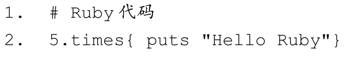{.u54481}
:::

::: center
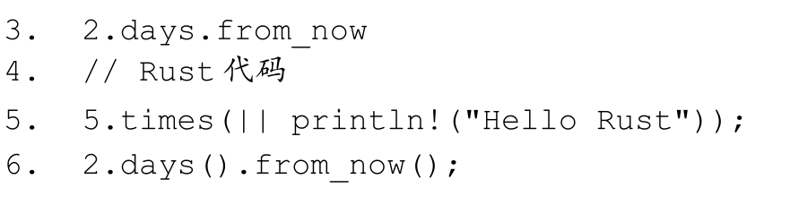{.u54480}
:::

在代码清单1-1中，代码第2行和第3行是Ruby代码，分别表示"输出5次＂Hello Ruby＂"和"从现在开始两天之后"，代码的抽象表达能力已经非常接近自然语言。再看第5行和第6行的Rust代码，它和Ruby语言的抽象表达能力是不相上下的。

但是Ruby的抽象表达能力完全是靠牺牲性能换来的。而Rust的抽象是零成本的，Rust的抽象并不会存在运行时性能开销，这一切都是在编译期完成的。代码清单 1-1 中的迭代 5次的抽象代码，在编译期会被展开成和手写汇编代码相近的底层代码，所以不存在运行时因为解释这一层抽象而产生的性能开销。对于一门系统级编程语言而言，运行时零成本是非常重要的。这一点，Rust做到了。

Rust中零成本抽象的基石就是泛型和trait，在后面的章节中会逐步探索其中的"魔法"。

### 1.2.3 实用性 {#text00007.html#A93e9001b-07a4-4ef1-b0aa-5974bb850d10 .title-left}

如何评价一门编程语言的实用性？事实上并没有统一的说法，但可以从以下三个方面进行评判：

· **实践性** ，首先必须能够应用于开发工业级产品，其次要易于学习和使用。

· **有益性** ，是指能够对业界产生积极的效果或影响。

· **稳定性** ，是指语言自身要稳定。在解决同一个问题时，不会因为使用者不同而出现随机的结果。

那么Rust语言在这三个方面的表现如何呢？

**实践性**

Rust已经为开发工业级产品做足了准备。

为了保证安全性，Rust引入了强大的类型系统和所有权系统，不仅保证内存安全，还保证了并发安全，同时还不会牺牲性能。

为了保证支持硬实时系统，Rust从C++那里借鉴了确定性析构、RAII和智能指针，用于自动化地、确定性地管理内存，从而避免了GC的引入，因而就不会有"世界暂停"的问题了。这几项虽然借鉴自C++，但是使用起来比C++更加简洁。

为了保证程序的健壮性，Rust重新审视了错误处理机制。日常开发中一般有三类非正常情况：失败、错误和异常。但是像C语言这种面向过程的语言，开发者只能通过返回值、goto等语句进行错误处理，并且没有统一的错误处理机制。而C++和Java这种高级语言虽然引入了异常处理机制，但没有专门提供能够有效区分正常逻辑和错误逻辑的语法，而只是统一全局进行处理，导致开发者只能将所有的非正常情况都当作异常去处理，这样不利于健壮系统的开发。并且异常处理还会带来比较大的性能开销。

Rust语言针对这三类非正常情况分别提供了专门的处理方式，让开发者可以分情况去选择。

· 对于失败的情况，可以使用断言工具。

· 对于错误，Rust提供了基于返回值的分层错误处理方式，比如Option＜T＞可以用来处理可能存在空值的情况，而 Result＜T＞就专门用来处理可以被合理解决并需要传播的错误。

· 对于异常，Rust将其看作无法被合理解决的问题，提供了线程恐慌机制，在发生异常的时候，线程可以安全地退出。

通过这样精致的设计，开发者就可以从更细的粒度上对非正常情况进行合理处理，最终编写出更加健壮的系统。

为了和现有的生态系统良好地集成，Rust 支持非常方便且零成本的 FFI 机制，兼容C-ABI，并且从语言架构层面上将Rust语言分成Safe Rust和Unsafe Rust两部分。其中Unsafe Rust专门和外部系统打交道，比如操作系统内核。之所以这样划分，是因为Rust编译器的检查和跟踪是有能力范围的，它不可能检查到外部其他语言接口的安全状态，所以只能靠开发者自己来保证安全。Unsafe Rust提供了unsafe关键字和unsafe块，显式地将安全代码和访问外部接口的不安全代码进行了区分，也为开发者调试错误提供了方便。Safe Rust表示开发者将信任编译器能够在编译时保证安全，而Unsafe Rust表示让编译器信任开发者有能力保证安全。

有人的地方就有Bug。Rust语言通过精致的设计，将机器可以检查控制的部分都交给编译器来执行，而将机器无法控制的部分交给开发者自己来执行。Safe Rust保证的是编译器在编译时最大化地保障内存安全，阻止未定义行为的发生。Unsafe Rust用来提醒开发者，此时开发的代码有可能引起未定义行为，请谨慎！人和编译器共享同一个"安全模型"，相互信任，彼此和谐，以此来最大化地消除人产生Bug的可能。

为了让开发者更方便地相互协作，Rust提供了非常好用的包管理器Cargo。Rust代码是以包（crate）为编译和分发单位的，Cargo提供了很多命令，方便开发者创建、构建、分发、管理自己的包。Cargo也提供插件机制，方便开发者编写自定义的插件，来满足更多的需求。比如官方提供的rustfmt和clippy工具，分别可以用于自动格式化代码和发现代码中的"坏味道"。再比如，rustfix工具甚至可以帮助开发者根据编译器的建议自动修复出错的代码。Cargo还天生拥抱开源社区和Git，支持将写好的包一键发布到crates.io网站，供其他人使用。

为了方便开发者学习Rust，Rust官方团队做出了如下努力：

· 独立出专门的社区工作组，编写官方*Rust Book* ^[\[2\]](#text00007.html#n794E001CD0C740D393B7415BF3DAD499){#text00007.html#n794E001CD0C740D393B7415BF3DAD499s}^ ，以及其他各种不同深度的文档，比如编译器文档、nomicon book等。甚至组织免费的社区教学活动Rust Bridge，大力鼓励社区博客写作，等等。

· Rust语言的文档支持MarkDown格式，因此Rust标准库文档表现力丰富。生态系统内很多第三方包的文档的表现力也同样得以提升。

· 提供了非常好用的在线Playground工具，供开发者学习、使用和分享代码。

· Rust语言很早就实现了自举，方便学习者通过阅读源码了解其内部机制，甚至参与贡献。

· Rust 核心团队一直在不断改进Rust，致力于提升Rust 的友好度，极力降低初学者的心智负担，减缓学习曲线。比如引入 NLL 特性来改进借用检查系统，使得开发者可以编写更加符合直觉的代码。

· 虽然从Haskell那里借鉴了很多类型系统相关的内容，但是Rust团队在设计和宣传语言特性的时候，会特意地去学术化，让Rust的概念更加亲民。

· 在类型系统基础上提供了混合编程范式的支持，提供了强大而简洁的抽象表达能力，极大地提升了开发者的开发效率。

· 提供更加严格且智能的编译器。基于类型系统，编译器可以严格地检查代码中隐藏的问题。Rust官方团队还在不断优化编译器的诊断信息，使得开发者可以更加轻松地定位错误，并快速理解错误发生的原因。

虽然Rust官方团队做了以上诸多努力，但是目前还有一大部分开发者认为Rust语言学习曲线颇陡。其中最为诟病的就是Rust目前的借用检查系统。这其实是因为Rust语言的设计融合了诸多语言的特点，而当今大部分开发者只是擅长其中一门语言，对其他语言的特性不太了解。C语言的开发者虽然对底层内存管理比较熟悉，但是未必熟悉C++的RAII机制；即使熟悉C++，也未必熟悉Haskell的类型系统；即便熟悉Haskell的类型系统，也未必懂得底层内存管理机制。更不用说内置GC的Java、Ruby、Python等面向对象语言的开发者了。

要解决这个问题，可以从以下几点出发来学习Rust：

· **保持初学者心态** 。当面对Rust中难以理解的概念时，先不要急于把其他语言的经验套用其上，而应该从Rust的设计哲学出发，去理解如此设计Rust的语言特性的原因，寻找其内在的一致性。

· **先学习概念再动手实践** 。很多传统语言开发者在学习Rust的时候，一上来就开始动手写代码，结果却栽了跟头，连编译都无法通过。看似符合直觉的代码，却因为借用检查而导致编译失败。这是因为Rust编译器在你编写的代码中发现了隐藏的错误，而你却未察觉。所以，其实不是Rust学习曲线陡，而是直接动手写代码的学习方法有问题。

· **把编译器当作朋友** 。不要忽略Rust编译器的诊断信息，大多数情况下，这些诊断信息里已经把错误原因阐述得非常明确。这些诊断信息可以帮助你学习Rust，纠正自己的错误认知。

俗话说得好，逆境也是机遇。正是因为Rust有这些特点，学习Rust的过程也是一次自我提升的过程，能够帮助你成为更好的程序员。

**有益性和稳定性**

Rust语言解决了内存安全和并发安全的问题，可以极大地提升软件的质量。Rust的诞生为业界提供了一个除C和C++之外的更好的选择。因为Rust是对安全、并发和性能都很看重的语言，它可以用于嵌入式系统、操作系统、网络服务等底层系统，但它并不局限于此，它还可以用于开发上层Web应用、游戏引擎和机器学习，甚至基于WebAssembly 技术还可以开发前端组件。因为高的安全性和不逊于C/C++的性能，Rust也被应用于新的前沿领域，比如区块链技术。

看得出来，Rust的诞生给业界带来了非常积极的影响。Rust语言自从发布了1.0版以来已经进入了稳定期。虽然还在不断地改进和发布新的特性，但是Rust的核心是不变的。

综上所述，Rust在实践性、有益性和稳定性三方面都做到位了，Rust的实用性毋庸置疑。

## 1.3 现状与未来 {#text00007.html#A8646001d-26aa-439b-b693-15e20ec5604f .title-left}

从2015年Rust发布1.0版本以来，Rust语言已经被广泛应用于各大公司及诸多领域。每一年，Rust社区都会聚集在一起制订路线图，规划Rust未来的发展。在2018年，Rust团队推出了新的大版本（edition）计划：

· **Rust 2015版本** ，包含Rust 1.0～1.30语义化版本。目标是让Rust更加稳定。

· **Rust 2018版本** ，Rust 1.31将是Rust 2018版本的首个语义版本。目标是让Rust进一步走向生产级。

这个大版本和语义化版本是正交的。大版本的意义在于方便Rust自身的进化。例如，想在Rust 中引入新的关键字 try，但是如果只有语义化版本这一个维度，新的关键字可能会破坏现有的Rust生态系统。所以，就需要引入一个大版本，在Rust 2018版本中引入try关键字。开发者选择"edition=2018"，就代表了开发者接受 Rust 的这种内部变化，接受新的关键字try。大版本升级的只是表面的语法功能，Rust的核心概念是不会改变的。

Rust的编译器可以方便地管理版本的兼容性：

· Rust 2015和Rust 2018是彼此兼容的。

· Rust编译器知道如何编译这两个版本，就像javac知道如何编译Java 9和Java 10、gcc和clang知道如何处理C++14和C++17一样。

· 可以在Rust 2018版本中依赖Rust 2015的库，反之亦然。

· Rust 2015版本并未冻结。

此外，大版本可能是每三年发布一次，那么下一次发布就是在2021年。不过Rust团队对此还保留修改权。

### 1.3.1 语言架构 {#text00007.html#A4a8f001e-2d5f-490e-96b7-70917d6acd94 .title-left}

为了便于学习，笔者针对Rust语言概念的层次结构进行了梳理，如图1-2所示。

::: center
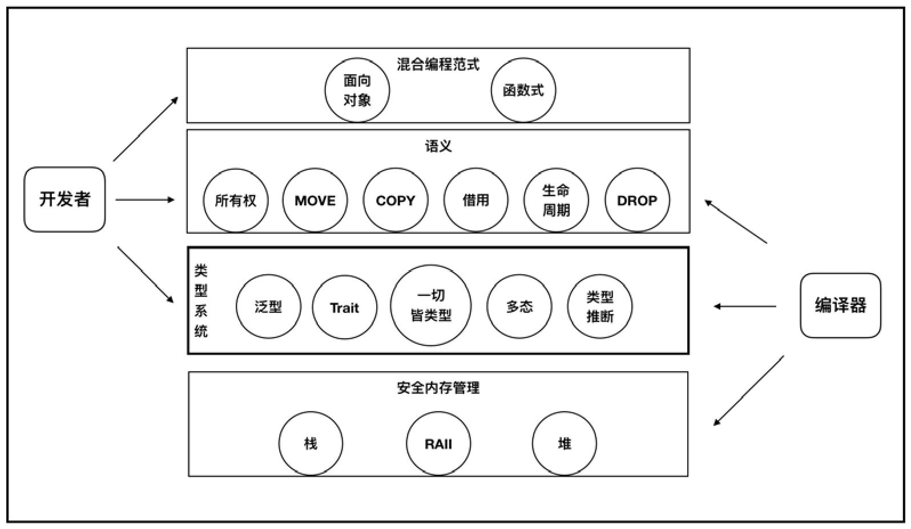{.u54479}

图1-2：Rust中概念层次结构梳理
:::

图1-2将Rust语言中的概念分成了4个层次。

最底层是安全内存管理层，该层主要是涉及内存管理相关的概念。

倒数第二层是类型系统层，该层起到承上启下的作用。类型系统层承载了上层的所有权系统语义和混合编程范式，赋予了Rust语言高级的抽象表达能力和安全性。同时，还保留了对底层代码执行、数据表示和内存分配等操作的控制能力。

对于开发者而言，只需要掌握类型系统、所有权系统和混合式编程范式即可，不需要操心底层的内存是否安全，因为有编译器和类型系统帮忙处理。在这个语言架构之下，人和编译器共用同一套"心智模型"，这样可以极大地保证系统的安全和健壮性。

在后续的章节中，会依照该语言架构对Rust语言自底向上进行分层探索，以帮助读者对Rust语言的概念融会贯通。

### 1.3.2 开源社区 {#text00007.html#A261a001f-2076-4801-990e-463085bc922e .title-left}

Rust语言自身作为一个开源项目，也是现代开源软件中的一颗璀璨的明珠。

在Rust之前诞生的所有语言，都仅仅用于商用开发，但是Rust语言改变了这一状况。对于Rust语言来说，Rust开源社区也是语言的一部分。同时，Rust语言也是属于社区的。

Rust团队由Mozilla和非Mozilla成员组成，至今 ^[\[3\]](#text00007.html#n7116001F85F9496E8D0459C5D3FDC8FD){#text00007.html#n7116001F85F9496E8D0459C5D3FDC8FDs}^ Rust项目贡献者已经超过了1900人。Rust团队分为核心组和其他领域工作组，针对Rust 2018的目标，Rust团队被分为了嵌入式工作组、CLI工作组、网络工作组以及WebAssembly工作组，另外还有生态系统工作组和社区工作组等。

这些领域中的设计都会先经过一个RFC流程，对于一些不需要经过RFC流程的更改，只需要给Rust项目库提交Pull Request即可。所有的过程都是对社区透明的，并且贡献者都可参与评审，当然，最终决策权归核心组及相关领域工作组所有。

Rust 团队维护三个发行分支：**稳定版** （**Stable** ）、**测试版** （**Beta** ）和**开发版** （**Nightly** ）。其中稳定版和测试版每6周发布一次。标记为**不稳定** （**Unstable** ）和**特性开关** （**Feature Gate** ）的语言特性或标准库特性只能在开发版中使用。

### 1.3.3 发展前景 {#text00007.html#Ae4fd001f-497d-47f3-a529-2e1a1a0af2a6 .title-left}

根据社区的流行度调查报告，截至2018年7月，由Pull Request统计的GitHub Octoverse报告显示，Rust语言的总PR数排名第15位，呈上升趋势。从活跃的项目数来看，Rust语言一共有2604个活跃项目。

目前在商业领域，Rust的重磅商业用户增长迅速，其中包括：

· Amazon，使用Rust作为构建工具。

· Atlassian，在后端使用Rust。

· Dropbox，在前后端均使用了Rust。

· Facebook，使用Rust重写了源码管理工具。

· Google，在Fuchsia项目中部分使用了Rust。

· Microsoft，在Azure IoT网络上部分使用了Rust。

· npm，在其核心服务上使用了Rust。

· RedHat，使用Rust创建了新的存储系统。

· Reddit，使用Rust处理评论。

· Twitter，在构建团队中使用Rust。

除了以上罗列的公司，还有很多其他公司，可以在官方Rust之友页面上找到，包括百度、三星、Mozilla等。Rust覆盖了数据库、游戏、云计算、安全、科学、医疗保健和区块链等领域，相关的工作岗位越来越多。Rust的前景越来越明朗，未来Rust将大有可为。

## 1.4 Rust代码如何执行 {#text00007.html#Ac7100020-27df-4646-a368-affa8b0d076b .title-left}

在进一步学习之前，我们有必要了解一下Rust代码是如何执行的。Rust是跨平台语言，一次编译，到处运行，这得益于LLVM。Rust编译器是一个LLVM编译前端，它将代码编译为LLVM IR，然后经过LLVM编译为相应的平台目标。

Rust 源码经过分词和解析，生成 AST（抽象语法树）。然后把 AST 进一步简化处理为HIR（High-level IR），目的是让编译器更方便地做类型检查。HIR 会进一步被编译为 MIR （Middle IR），这是一种中间表示，它在Rust1.12版本中被引入，主要用于以下目的。

· **缩短编译时间** 。MIR可以帮助实现增量编译，当你修改完代码重新编译的时候，编译器只计算更改过的部分，从而缩短了编译时间。

· **缩短执行时间** 。MIR 可以在 LLVM 编译之前实现更细粒度的优化，因为单纯依赖LLVM的优化粒度太粗，而且Rust无法控制，引入MIR就增加了更多的优化空间。

· **更精确的类型检查** 。MIR 将帮助实现更灵活的借用检查，从而可以提升 Rust 的使用体验。

最终，MIR会被翻译为LLVM IR，然后被LLVM的处理编译为能在各个平台上运行的目标机器码。

## 1.5 小结 {#text00007.html#A9ede0020-c27b-442f-932d-9310ae9bacb4 .title-left}

Rust的产生看似偶然，其实是必然。未来的互联网注重安全和高性能是必然的趋势。GH看到了这一点，Mozilla也看到了这一点，所以两者才能一拍即合，创造出Rust。

Rust从2006年诞生之日开始，目标就很明确------追求安全、并发和高性能的现代系统级编程语言。为了达成这一目标，Rust语言遵循着内存安全、零成本抽象和实用性三大设计哲学。借助现代化的类型系统，赋予了Rust语言高级的抽象表达能力，与此同时又保留了对底层的控制能力。开发者和Rust编译器共享着同一套"心智模型"，相互信任，相互协作，最大化地保证系统的安全和健壮性。

Rust语言有别于传统语言的另一点在于，其将开源社区视为语言的一部分。Rust本身就是开源项目中的典范，非常值得学习。通过本章的讲解，希望可以帮助读者建立对Rust语言的系统性认知，在以后的学习中起到提纲挈领的作用，不至于迷失在细节中。

------------------------------------------------------------------------

[\[1\]](#text00007.html#n93417129831443FC9D6AFD03B2F8F126s){#text00007.html#n93417129831443FC9D6AFD03B2F8F126} 20世纪90年代，欧洲空间局阿丽亚娜五号运载火箭发射失败，原因是Ada在将64位浮点数转换为16位无符号整数时，发生了溢出。

[\[2\]](#text00007.html#n794E001CD0C740D393B7415BF3DAD499s){#text00007.html#n794E001CD0C740D393B7415BF3DAD499} 即*The Rust Programming Language* 。

[\[3\]](#text00007.html#n7116001F85F9496E8D0459C5D3FDC8FDs){#text00007.html#n7116001F85F9496E8D0459C5D3FDC8FD} 写作本节时是2018年7月。

[]{#text00008.html}

# 第2章 语言精要 {#text00008.html#A672b422f-6011-45a1-9bcd-716732b44efd .title-left}

好读书，不求甚解；每有会意，便欣然忘食。

在学习一门新语言的时候，不要力求一次性就掌握它的全部，因为那是不可能做到的事情。应该先从整体出发，对该语言的语法做系统性梳理。这样做有两个目的：第一，可以消除对该语言的陌生感；第二，可以对基本的语法建立结构化的知识体系。

基于上述认知，本章对Rust语言的语法要点进行了归纳与提炼，基本可以覆盖大部分语法，更多的细节会在后面的章节中逐步进行探索。在学习本章之前，希望你能保持内心的平静，看不懂不必着急，该动手练习的时候不要偷懒。

## 2.1 Rust语言的基本构成 {#text00008.html#Aa2840021-48d9-4370-ab36-0cfd5e696c49 .title-left}

Rust语言主要由以下几个核心部件组成：

· **语言规范**

· **编译器**

· **核心库**

· **标准库**

· **包管理器**

### 2.1.1 语言规范 {#text00008.html#A2c6c0021-f6fc-4751-ba12-d6c630810c78 .title-left}

Rust语言规范主要由Rust语言参考（The Rust Reference）和RFC文档共同构成。

**Rust语言参考**

Rust语言参考是官方团队维护的一份参考文档，包含了三类内容：

· 对每种语言结构及其用法的描述。

· 对内存模型、并发模型、链接、调试等内存的描述。

· 影响语言设计的基本原理和参考。

该参考文档不算Rust语言的正式规范，但目前官方只有这么一份最接近规范的文档，在不久的将来，Rust官方会出一份正式的文档。虽然该文档还在变更中，但目前也可以作为初学者的参考。

**RFC文档**

Rust引入了规范化的RFC流程，RFC文档是涵盖了语言特性的设计意图、详细设计、优缺点的完整技术方案。社区中的每个人都可以提RFC，经过社区讨论、核心开发团队评审，通过之后才能进入具体实现阶段。

Rust源码中也规范地使用了RFC编号，来对应相应的功能特性。使用RFC的好处是，形成了规范化的文档，利于方案实施和后期维护，利于核心开发组主导项目进展方向。Rust学习者也可以通过RFC来深入了解某个语言特性的来龙去脉。

### 2.1.2 编译器 {#text00008.html#Ad2310022-0fba-48fe-b1ff-6a55c6b38b9d .title-left}

Rust是一门静态编译型语言。Rust官方的编译器叫**rustc** ，负责将Rust源代码编译为可执行文件或其他库文件（.a、.so、.lib、.dll等）。

rustc有如下特点：

· rustc是跨平台的应用程序，支持UNIX/Linux等类UNIX平台，也支持Windows平台。

· rustc支持交叉编译，可以在当前平台下编译出可运行于其他平台上的应用程序和库。

· rustc 使用 LLVM 作为编译器后端，具有很好的代码生成和优化技术，支持多个目标平台。

· rustc是用Rust语言开发的，包含在Rust语言源码中。

· rustc对Rust源码进行词法语法分析、静态类型检查，最终将代码翻译为LLVM IR。

· rustc输出的错误信息非常友好和详尽，是开发者的良师益友。

### 2.1.3 核心库 {#text00008.html#A35000022-235b-4f28-85b5-0951fec89bfe .title-left}

Rust语言的语法由核心库和标准库共同提供。其中Rust核心库是标准库的基础。核心库中定义的是Rust语言的核心，不依赖于操作系统和网络等相关的库，甚至不知道堆分配，也不提供并发和I/O。

可以通过在模块顶部引入＃！\[no_std\]来使用核心库。核心库和标准库的功能有一些重复，包括如下部分：

· 基础的trait，如Copy、Debug、Display、Option等。

· 基本原始类型，如bool、char、i8/u8、i16/u16、i32/u32、i64/u64、isize/usize、f32/f64、str、array、slice、tuple、pointer等。

· 常用功能型数据类型，满足常见的功能性需求，如String、Vec、HashMap、Rc、Arc、Box等。

· 常用的宏定义，如println！、assert！、panic！、vec！等。

做嵌入式应用开发的时候，核心库是必需的。

### 2.1.4 标准库 {#text00008.html#Ac8a30022-7b3b-488a-b0be-7226a15dd514 .title-left}

Rust标准库提供应用程序开发所需要的基础和跨平台支持。标准库包含的内容大概如下：

· 与核心库一样的基本trait、原始数据类型、功能型数据类型和常用宏等，以及与核心库几乎完全一致的API。

· 并发、I/O和运行时。例如线程模块、用于消息传递的通道类型、Sync trait等并发模块，文件、TCP、UDP、管道、套接字等常见I/O。

· 平台抽象。os模块提供了许多与操作环境交互的基本功能，包括程序参数、环境变量和目录导航；路径模块封装了处理文件路径的平台特定规则。

· 底层操作接口，比如 std：：mem、std：：ptr、std：：intrinsics 等，操作内存、指针、调用编译器固有函数。

· 可选和错误处理类型Option和Result，以及各种迭代器等。

### 2.1.5 包管理器 {#text00008.html#Abc020023-3d4a-4ac4-bdb1-499e34da314d .title-left}

把按一定规则组织的多个rs文件编译后就得到一个**包** （**crate** ）。包是Rust代码的基本编译单元，也是程序员之间共享代码的基本单元。

Rust社区的公开第三方包都集中在crates.io网站上面，它们的文档被自动发布到docs.rs网站上。

Rust提供了非常方便的**包管理器Cargo** 。Rust中的Cargo类似于Ruby中的bundler、Python中的pip、Node.js中的npm。但Cargo不仅局限于包管理，它还为Rust生态系统提供了标准的工作流。Cargo 能够管理整个工作流程，从创建项目、运行单元测试和基准测试，到构建发布链接库，再到运行可执行文件，等等。Cargo为开发者提供了极大的方便。

在安装好Rust环境之后，可以直接使用Cargo命令来创建包。Cargo命令的示例如代码清单2-1所示。

**代码清单2-1：cargo命令示例**

::: center
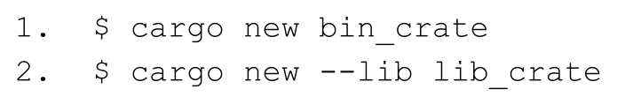{.u54478}
:::

在代码清单2-1中，使用**cargo new** 命令默认可以创建一个用于编写可执行二进制文件的项目。通过给cargo new命令添加\--lib参数，则可以创建用于编写库的项目。此外，通过cargo build和cargo run命令可以方便地对项目进行编译和运行。

## 2.2 语句与表达式 {#text00008.html#Af96f0023-36f7-4614-a364-822d1ceeb79f .title-left}

Rust 中的语法可以分成两大类：**语句** （**Statement** ）和**表达式** （**Expression** ）。语句是指要执行的一些操作和产生副作用的表达式。表达式主要用于计算求值。

语句又分为两种：**声明语句** （ **Declaration statement** ）和**表达式语句** （ **Expression statement** ）。

· 声明语句，用于声明各种语言项（Item），包括声明变量、静态变量、常量、结构体、函数等，以及通过extern和use关键字引入包和模块等。

· 表达式语句，特指以分号结尾的表达式。此类表达式求值结果将会被舍弃，并总是返回单元类型（）。

语句和表达式的示例如代码清单2-2所示。

**代码清单2-2：语句和表达式**

::: center
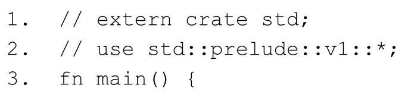{.u54477}
:::

::: center
{.u54476}
:::

在代码清单2-2中，第1行和第2行是声明语句，它们并不需要求值，只是用来引入标准库包以及prelude模块的。这里之所以将它们注释掉，是因为Rust会为每个crate都自动引入标准库模块，除非使用＃\[no_std\]属性明确指定了不需要标准库。

然后使用fn关键字定义了两个函数answer和sum。关键字fn是function的缩写。

函数answer没有输入参数，并且返回值为**单元类型（）** 。单元类型拥有唯一的值，就是它本身，为了描述方便，将该值称为**单元值** 。单元类型的概念来自OCmal，它表示"没有什么特殊的价值"。所以，这里将单元类型作为函数返回值，就表示该函数无返回值。当然，通常无返回值的函数默认不需要在函数签名中指定返回类型。

在函数answer中，使用let声明了两个变量a和b，其后必须加分号。assert_eq！则是宏语句，它是Rust提供的断言，允许判断给定的两个表达式求值结果是否相同。像这种名字以叹号结尾，并且可以像函数一样被调用的语句，在Rust中叫作**宏** 。

函数sum的两个输入参数和返回值均指定为i32类型。其函数体只包含了一个表达式，用于计算a与b的值，并返回。

代码清单2-2其实可以去掉换行符，完全写成一整行代码，而不影响程序编译。

**Rust编译器在解析代码的时候，如果碰到分号，就会继续往后面执行；如果碰到语句，则执行语句；如果碰到表达式，则会对表达式求值，如果分号后面什么都没有，就会补上单元值（）。**

**当遇到函数的时候，会将函数体的花括号识别为块表达式（Block Expression）。块表达式是由一对花括号和一系列表达式组成的，它总是返回块中最后一个表达式的值** 。因此，对于answer函数来说，它也是一个块表达式，块中的最后一个表达式是宏语句，所以返回单元值（）。对于sum函数来说，其最后一行是一个表达式，因为没有分号，所以直接返回其求值结果。

从这个角度来看，可以将Rust看作一切皆表达式。由于当分号后面什么都没有时自动补单元值（）的特点，我们可以将 Rust 中的语句看作计算结果均为（）的特殊表达式。而对于普通的表达式来说，则会得到正常的求值结果。

## 2.3 变量与绑定 {#text00008.html#A02a60024-1356-4822-a930-cc2f737c5417 .title-left}

通过let关键字来创建变量，这是Rust语言从函数式语言中借鉴的语法形式。let创建的变量一般称为**绑定** （**Binding** ），它表明了标识符（Identifier）和值（Value）之间建立的一种关联关系。

### 2.3.1 位置表达式和值表达式 {#text00008.html#A14a50025-c010-43d3-80fd-93a8209276c1 .title-left}

Rust 中的表达式一般可以分为**位置表达式** （ **Place Expression** ）和**值表达式** （ **Value Expression** ）。在其他语言中，一般叫作左值（LValue）和右值（RValue）。

顾名思义，位置表达式就是表示内存位置的表达式。分别有以下几类：

· 本地变量

· 静态变量

· 解引用（\*expr）

· 数组索引（expr\[expr\]）

· 字段引用（expr.field）

· 位置表达式组合

通过位置表达式可以对某个数据单元的内存进行读写。主要是进行写操作，这也是位置表达式可以被赋值的原因。

除此之外的表达式就是值表达式。值表达式一般只引用了某个存储单元地址中的数据。它相当于数据值，只能进行读操作。

**从语义角度来说，位置表达式代表了持久性数据，值表达式代表了临时数据** 。位置表达式一般有持久的状态，值表达式要么是字面量，要么是表达式求值过程中创建的临时值。

表达式的求值过程在不同的上下文中会有不同的结果。求值上下文也分为**位置上下文** （**Place Context** ）和**值上下文** （**Value Context** ）。下面几种表达式属于位置上下文：

· 赋值或者复合赋值语句左侧的操作数。

· 一元引用表达式的独立操作数。

· 包含隐式借用（引用）的操作数。

· match判别式或let绑定右侧在使用ref模式匹配的时候也是位置上下文。

除了上述几种情况，其余表达式都属于值上下文。值表达式不能出现在位置上下文中，如代码清单2-3所示。

**代码清单2-3：值表达式不能出现在位置上下文中**

::: center
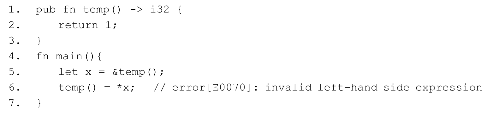{.u54475}
:::

代码清单2-3定义了函数temp。在main函数中，使用temp函数的调用放到了赋值语句左边的位置上下文中，此时编译器就会报错。因为temp函数调用是一个无效的位置表达式，它是值表达式。

### 2.3.2 不可变绑定与可变绑定 {#text00008.html#Aea3c0025-eab9-4870-924d-035ba9f5797e .title-left}

使用let关键字声明的**位置表达式默认不可变** ，**为不可变绑定** 。代码清单2-4展示了不可变绑定与可变绑定。

**代码清单2-4：不可变绑定与可变绑定**

::: center
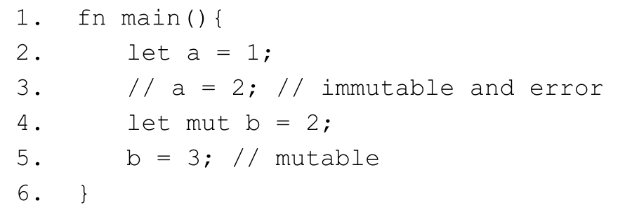{.u54474}
:::

在代码清单2-4中，变量a默认是不可变绑定，对其重新赋值后编译器会报错，如代码第3行所示。通过mut关键字，可以声明可变的位置表达式，即可变绑定。可变绑定可以正常修改和赋值。

从语义上来说，let 默认声明的不可变绑定只能对相应的存储单元进行读取，而 let mut声明的可变绑定则是可以对相应的存储单元进行写入的。

### 2.3.3 所有权与引用 {#text00008.html#A9e910026-4c7a-400a-ad95-2fb171bfee0f .title-left}

当位置表达式出现在值上下文中时，该位置表达式将会把内存地址转移给另外一个位置表达式，这其实是所有权的转移，如代码清单2-5所示。

**代码清单2-5：所有权转移**

::: center
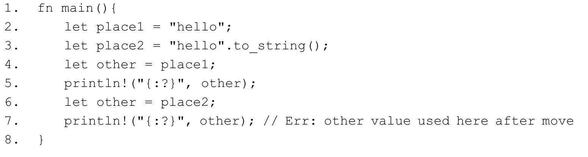{.u54473}
:::

在代码清单2-5中，使用let声明了两个绑定，place1和place2。然后将place1赋值给新的变量 other。**因为 place1 是一个位置表达式，现在出现在了赋值操作符右侧，即一个值上下文内，所以place1会将内存地址转移给other** 。同理，将place2赋值给新声明的other，place2的内存地址同样会转移给other。

代码编译执行以后，代码第5行可以正常打印other的值，但是代码第7行就会报错，编译器提示"other value used here after move"，此提示的意思是该处使用了已经移动的值。为什么会有这两种区别呢？这其实和底层内存安全管理有关系。这两种行为虽然不同，但都是Rust为了保证内存安全刻意而为之的，在第3章中会有更详细的解释。

**在语义上，每个变量绑定实际上都拥有该存储单元的所有权，这种转移内存地址的行为就是所有权（OwnerShip）的转移，在 Rust 中称为移动（Move）语义，那种不转移的情况实际上是一种复制（Copy）语义** 。Rust没有GC，所以完全依靠所有权来进行内存管理。

在日常开发中，有时候并不需要转移所有权。Rust提供**引用操作符** （**&** ），可以直接获取表达式的存储单元地址，即内存位置。可以通过该内存位置对存储进行读取。引用操作示例如代码清单2-6所示。

**代码清单2-6：引用操作示例**

::: center
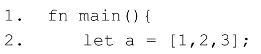{.u54472}
:::

::: center
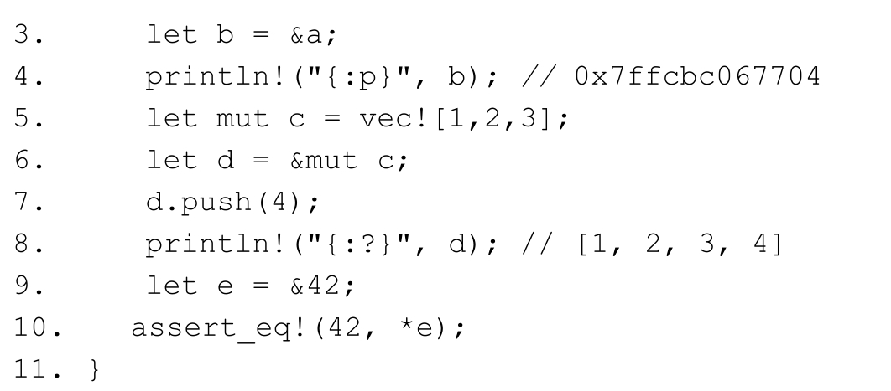{.u54471}
:::

在代码清单2-6中，定义了固定长度数组a，并且使用引用操作符&取得a的内存地址，赋值给 b。这种方式不会引起所有权的转移，因为使用引用操作符已经将赋值表达式右侧变成了位置上下文，它只是共享内存地址。通过println！宏指定{：p}格式，可以打印b的指针地址，也就是内存地址。

同时，也通过let mut声明了动态长度数组c。然后通过&mut获取c的可变引用，赋值给d。调用d的push方法插入新的元素4。注意，要获取可变引用，必须先声明可变绑定。

对于字面量 42 来说，其本身属于值表达式。通过引用操作符，相当于值表达式在位置上下文中进行求值，所以编译器会为&42创建一个临时值，如代码清单2-7所示。

**代码清单2-7：值表达式在位置上下文中求值时会被创建临时值**

::: center
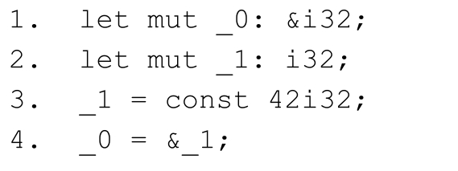{.u54470}
:::

代码清单2-7是编译器为let e=&42创建临时值的示意代码，仅用于演示。

最后，通过解引用操作符\*将引用e中的值取出来，以供assert_eq！宏使用。

从语义上来说，不管是&a还是&mut c，都相当于对a和c所有权的借用，因为a和c还依旧保留它们的所有权，所以引用也被称为借用。

## 2.4 函数与闭包 {#text00008.html#A23b60027-4382-4a74-b676-671aa8cbb163 .title-left}

前文已经出现了不少函数，出现最多的就是 **main 函数，它代表程序的入口** 。对于二进制可执行文件来说，main函数必不可少。对于库函数来说，main函数就没那么必要了。

### 2.4.1 函数定义 {#text00008.html#Ad6a00027-5da3-48d7-9cd2-57b1a68a3445 .title-left}

通过前文我们也了解到，**函数是通过关键字fn定义的** 。这种关键字使用了极简缩写，这也算是Rust独有的一种风格，不仅仅是fn，还有很多其他关键字都使用了缩写。有些初学者可能不太喜欢这样缩写，但是习惯之后，这种想法就会改变。

接下来定义一个FizzBuzz函数。FizzBuzz函数很简单：输入一个数字，当数字是3的倍数时，输出fizz；当数字是5的倍数时，输出buzz；当数字是3和5共同的倍数时，输出fizzbuzz；其他情况返回该数字，如代码清单2-8所示。

**代码清单2-8：FizzBuzz函数示例**

::: center
{.u54469}
:::

::: center
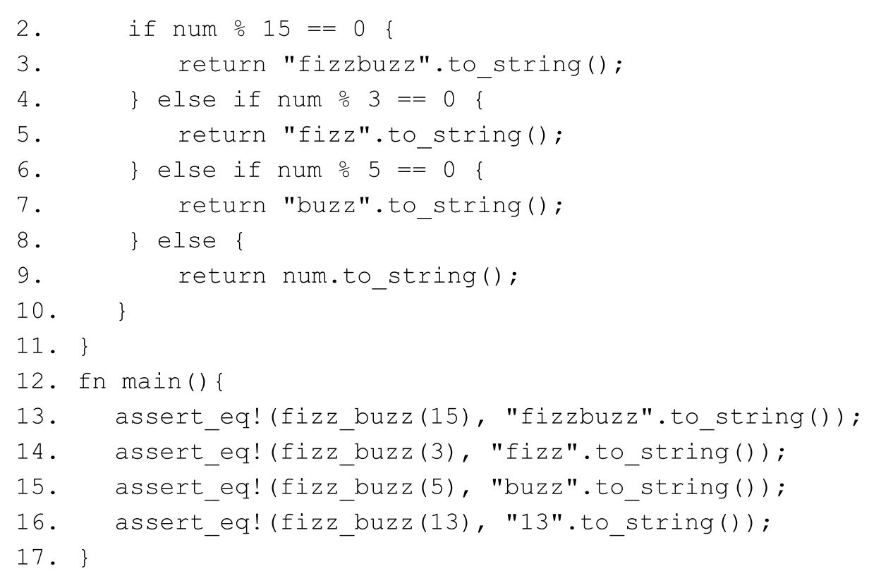{.u54468}
:::

代码清单2-8中使用fn关键字定义了fizz_buzz函数，其函数签名pub fn fizz_buzz（num：i32）-＞String清晰地反映了**函数的类型约定** ：**传入i32类型，返回String类型。Rust编译器会严格遵守此类型的契约，如果传入或返回的不是约定好的类型，则编译时会报错** 。

我们从前文中已经知晓，函数体是由花括号括起来的，它实际上是一个块表达式，最终只返回块中最后一个表达式的求值结果。如果想提前返回，则需要使用return关键字。请参考代码清单2-8。

return 表达式用于退出一个函数，并返回一个值。但是如果 return 后面没有值，就会默认返回单元值。

代码清单2-8中使用了to_string方法，它将表达式的求值结果转换为String类型。Rust中的字符串类型不仅包括String类型，第8章讲字符串的时候会介绍更多相关内容。

### 2.4.2 作用域与生命周期 {#text00008.html#A023e0028-d832-4805-9640-e97f0c7d9681 .title-left}

**Rust 语言的作用域是静态作用域，即词法作用域（Lexical Scope）** 。由一对花括号来开辟作用域，其作用域在词法分析阶段就已经确定了，不会动态改变。词法作用域如代码清单2-9所示。

**代码清单2-9：词法作用域示例**

::: center
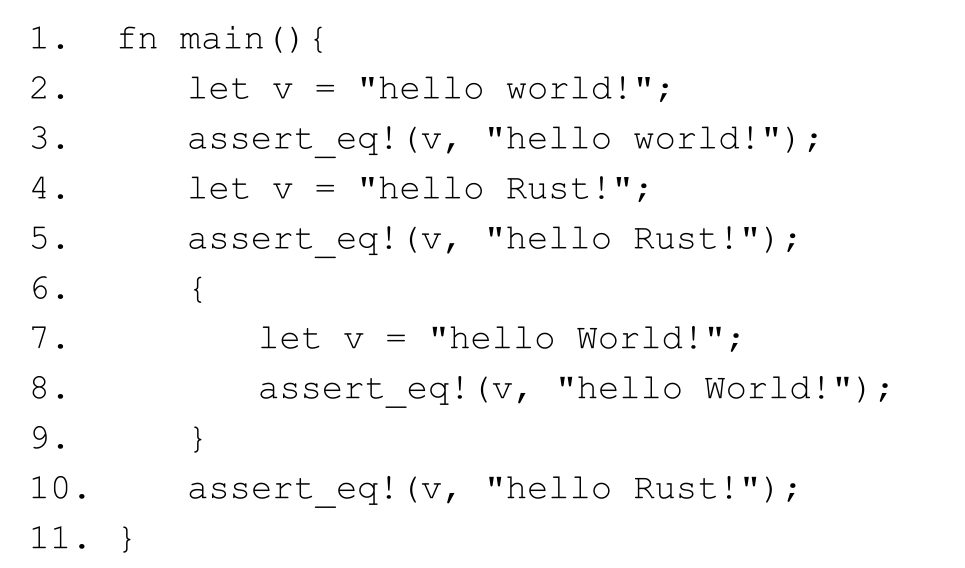{.u54467}
:::

在代码清单2-9中，代码第2行到第5行首先定义了变量绑定v，赋值为hello world！，然后通过断言验证其值。再次通过 let 声明变量绑定 v，赋值为 hello Rust！。这种连续用 let定义同名变量的做法叫**变量遮蔽** （**Variable Shadow** ）。但是最终的变量v的值是由第二个变量定义所决定的。变量遮蔽可以为日常开发提供诸多方便。

代码第6行到第9行使用花括号开辟了一个块空间，它实际上是一段词法作用域。其中同样使用let声明了变量绑定v，赋值为hello World！。

代码第10行使用宏断言assert_eq！验证v的值，该值依然等于hello Rust！，并没有因为块代码中的重新声明而发生改变。

这证明，在词法作用域内部使用花括号开辟新的词法作用域后，两个作用域是相互独立的。在不同的词法作用域内声明的变量绑定，拥有不同的**生命周期** （**LifeTime** ）。尽管如此，变量绑定的生命周期总是遵循这样的规律：**从使用 let 声明创建变量绑定开始，到超出词法作用域的范围时结束** 。

### 2.4.3 函数指针 {#text00008.html#A5a270029-76fb-4450-b1b2-915c6625f59d .title-left}

在Rust中，**函数为一等公民** 。这意味着，函数自身就可以作为函数的参数和返回值使用。

代码清单2-10展示了函数作为参数的情况。

**代码清单2-10：函数作为参数的情况**

::: center
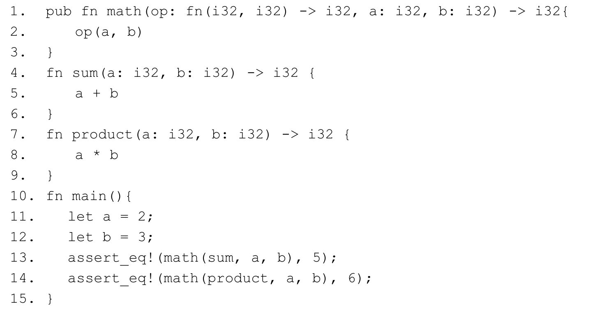{.u54466}
:::

在代码清单2-10中，定义了函数math，其函数签名的第一个参数为fn（i32，i32）-＞i32类型，这在Rust中是函数指针（fn pointer）类型。

在main函数中，调用了math函数两次，分别传入了sum和product作为参数。而sum和product分别是用于求和和求积的两个函数，它们的类型是fn（i32，i32）-＞i32，所以可以作为参数传给math函数。注意这里直接使用函数的名字来作为函数指针。

函数也可以作为返回值使用，如代码清单2-11所示。

**代码清单2-11：函数作为返回值的情况**

::: center
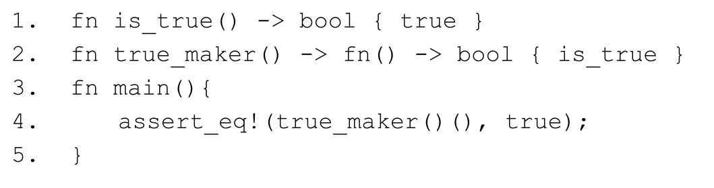{.u54465}
:::

在代码清单 2-11 中，定义了函数 is_true，返回 true。还定义了函数 true_maker，返回fn（）-＞bool 类型，其函数体内直接将 is_true 函数指针返回。注意此处也使用了函数名字作为函数指针，如果加上括号，就会调用该函数。

在 main 函数的断言中，true_maker（）（）调用相当于（true_maker（））（）。首先调用true_maker（），会返回is_true函数指针；然后再调用is_true（）函数，最终得到true。

### 2.4.5 CTFE机制 {#text00008.html#A8e32002a-bbd2-404e-b7b9-b554f687c760 .title-left}

Rust编译器也可以像C++或D语言那样，拥有**编译时函数执行（Compile-Time Function Execution，CTFE）** 的能力。在Rust 2018 版本的首个语义化版本 1.30中，CTFE的一个最小化子集已经稳定了。在该版本之前，如果想使用此功能，必须使用Nightly Rust版本。代码清单2-12展示了使用CTFE功能的一个示例------const fn示例。

**代码清单2-12：const fn示例**

::: center
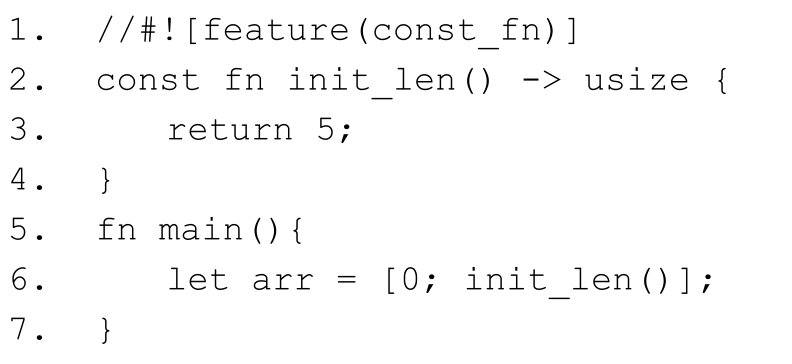{.u54464}
:::

在代码清单2-12中，使用了const fn来定义函数init_len，该函数返回一个固定值5。并且在main函数中，通过\[0；N\]这种形式来初始化初始值为0、长度为N的数组，其中N是由调用函数init_len来求得的。

Rust 中固定长度的数组必须在编译期就知道长度，否则会编译出错。所以函数 init_len必须在编译期求值。这就是 CTFE 的能力。注意，使用 Rust 2018 版本时，不需要加＃！\[feature（const_fn）\]特性；而使用Rust 2015版本时，还需要加此特性。使用const fn定义的函数，必须可以确定值，不能存在歧义。与fn定义函数的区别在于，const fn可以强制编译器在编译期执行函数。其中关键字const一般用于定义全局常量。

除了const fn，官方还在实现const generics特性。支持const generics特性，将可以实现类似impl＜T，const N：usize＞Foo for \[T；N\]{\...}的代码，可以为所有长度的数组实现triat Foo。那么使用数组的体验将会得到很大的提升。

**Rust中的CTFE是由miri来执行的** 。miri是一个MIR解释器，目前已经被集成到了Rust编译器 rustc 中。Rust 编译器目前可以支持的常量表达式有：字面量、元组、数组、字段结构体、枚举、只包含单行代码的块表达式、范围等。Rust想要拥有完善的CTFE支持，还有很多工作要做。

### 2.4.6 闭包 {#text00008.html#Aa887002a-4299-4cc8-b210-73f59138bd82 .title-left}

闭包也叫匿名函数。闭包有以下几个特点：

· 可以像函数一样被调用。

· 可以捕获上下文环境中的自由变量。

· 可以自动推断输入和返回的类型。

代码清单2-13展示了一个闭包的示例。

**代码清单2-13：闭包示例**

::: center
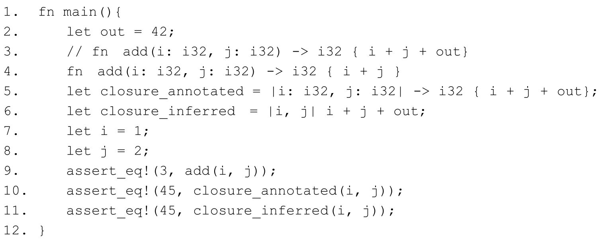{.u54463}
:::

在代码清单 2-13 中，在 main 函数中定义了另外一个函数 add，以及两个闭包closure_annotated和closure_inferred。

闭包调用和函数调用非常像，如代码第9行到第11行所示。**但是闭包和函数有一个重要的区别，那就是闭包可以捕获外部变量，而函数不可以** 。如代码第3行，在add函数内使用外部定义的变量out，编译器会报错。但是代码第5行和第6行定义的闭包就可以直接使用out。

闭包也可以作为函数参数和返回值，但使用起来略有区别。代码清单2-14展示了闭包作为参数的情况。

**代码清单2-14：闭包作为参数的情况**

::: center
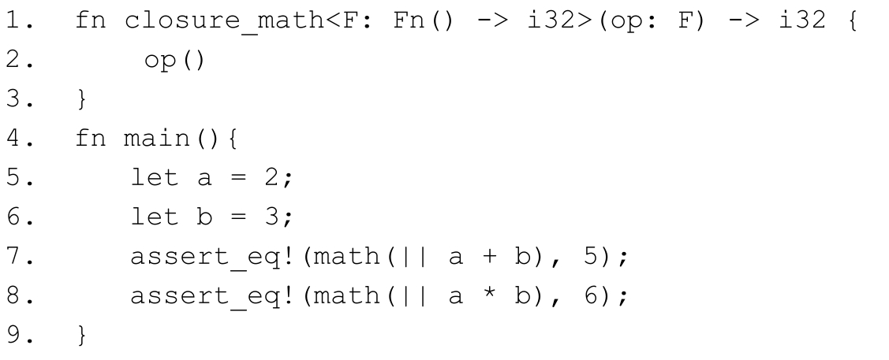{.u54462}
:::

在代码清单 2-14 中，定义了函数 closure_math，其参数是一个泛型 F，并且该泛型受Fn（）-＞i32 trait的限定，代表该函数只允许实现Fn（）-＞i32 trait的类型作为参数。

**Rust中闭包实际上就是由一个匿名结构体和trait来组合实现的** 。所以，在main函数调用math函数的时候，分别传入\|\|a+b和\|\|a\*b这两个闭包，都实现了Fn（）-＞i32。在math函数内部，通过在后面添加一对圆括号来调用传入的闭包。

闭包同样也可以作为返回值，如代码清单2-15所示。

**代码清单2-15：闭包作为返回值的情况**

::: center
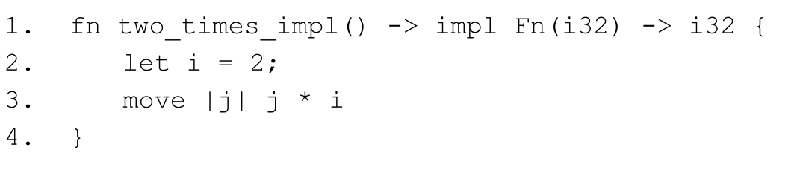{.u54461}
:::

::: center
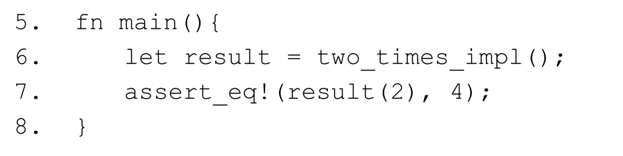{.u54460}
:::

在代码清单2-15中使用了impl Fn（i32）-＞i32作为函数的返回值，它表示实现Fn（i32）-＞i32 的类型。在函数定义时并不知道具体的返回类型，但是在函数调用时，编译器会推断出来。这个过程也是零成本抽象的，一切都发生在编译期。

需要注意的是，在函数two_times_impl中最后返回闭包时使用了**move** 关键字。这是因为在一般情况下，闭包默认会按引用捕获变量。如果将此闭包返回，则引用也会跟着返回。但是在整个函数调用完毕之后，函数内的本地变量 i 就会被销毁。那么随闭包返回的变量 i的引用，也将成为悬垂指针。Rust是注重内存安全的语言，绝对不会让这种事情发生。所以如果不使用move关键字，编译器会报错。使用move关键字，将捕获变量i的所有权转移到闭包中，就不会按引用进行捕获变量，这样闭包才可以安全地返回。

在第5章中还会讲述更多关于闭包的内容。

## 2.5 流程控制 {#text00008.html#A88d9002c-ddd7-4f48-95bd-46cebb4c290d .title-left}

一般编程语言都会有常用的流程控制语句：条件语句和循环语句，Rust也不例外。但是在Rust中不叫流程控制语句，而叫流程控制表达式。

### 2.5.1 条件表达式 {#text00008.html#Ae0d2002c-03b0-461b-a6a9-1c2337cb2526 .title-left}

表达式一定会有值，所以if表达式的分支必须返回同一个类型的值才可以。这也是Rust没有三元操作符？：的原因。if表达式的求值规则和块表达式一致。

if表达式如代码清单2-16所示。

**代码清单2-16：if表达式**

::: center
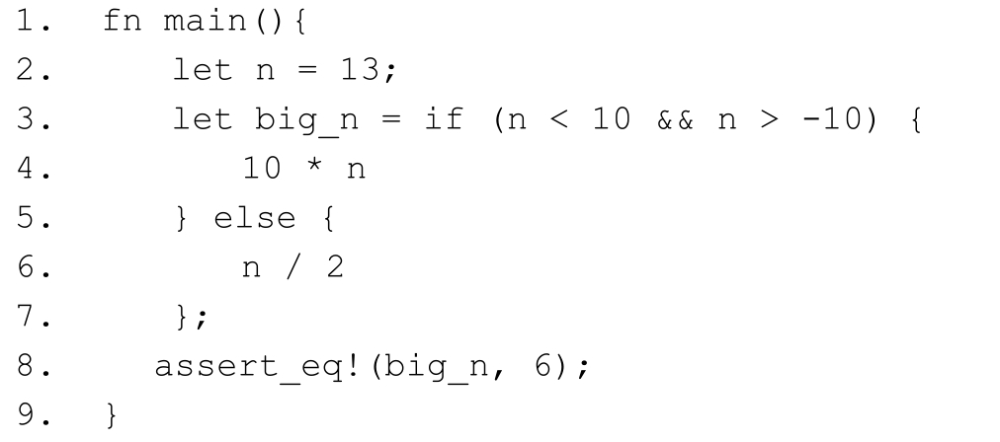{.u54459}
:::

在代码清单2-16中，变量绑定big_n的赋值是由一个if表达式来完成的。通过计算n的区间大小，来决定最终的值。因为n是整数13，虽然没有明确指定类型，但Rust编译器会默认推断其为i32类型。在if条件分支中，对n求积得到的结果肯定是整数。在else分支中，按直觉来说，n除以2应该是小数6.5才对。但是如果是小数，if和else分支的求值结果类型会不一致，编译器会不会报错？

其实这里不需要担心，因为big_n的类型已经被Rust编译器根据上下文默认推断为i32类型。类型已经确定了，所以在计算n除以2的时候，Rust编译器会将结果进行截取，去除小数点后面的部分。最终big_n的值是6。

### 2.5.2 循环表达式 {#text00008.html#A238b002d-8410-4d72-9e47-69cc175f4cfd .title-left}

Rust中包括三种循环表达式：while、loop和for...in表达式，其用法和其他编程语言相应的表达式基本类似。

现在我们用for...in表达式来实现FizzBuzz，如代码清单2-17所示。

**代码清单2-17：用for...in表达式实现FizzBuzz**

::: center
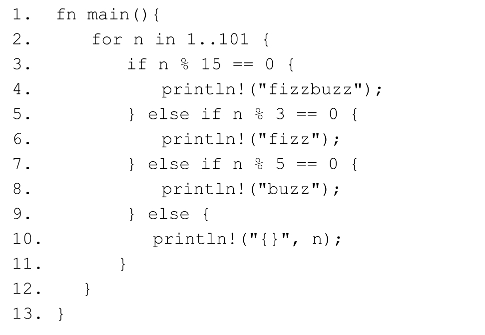{.u54458}
:::

在代码清单2-17中，for...in表达式本质上是一个迭代器。其中1..101是一个Range类型，它是一个迭代器。for 的每一次循环都从迭代器中取值，当迭代器中没有值的时候，for循环结束。第5章会介绍关于迭代器的更多内容。

在本书源码包中还可以找到使用while和loop循环的FizzBuzz示例。这里值得注意的是，当需要使用无限循环的时候，请务必使用loop循环，避免使用while true循环。代码清单2-18展示了使用while true循环的情况，我们看看会产生什么后果。

**代码清单2-18：使用while true循环示例**

::: center
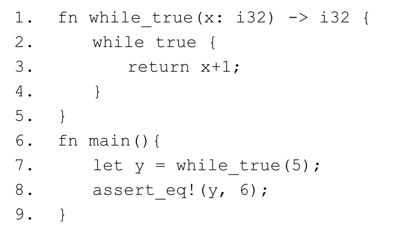{.u54457}
:::

代码清单2-18中定义了函数while_true，其中while循环条件使用了硬编码true，目的是实现无限循环。这种看似非常正确的代码会引起Rust编译器报错。

错误提示称while true循环块返回的是单元值，而函数while_true返回值是i32，所以不匹配。但是在while true循环中使用了return 关键字，应该返回i32类型才对，为什么会报错呢？

这是因为Rust编译器在对while循环做**流分析** （**Flow Sensitive** ）的时候，不会检查循环条件，编译器会认为 while 循环条件可真可假，所以循环体里的表达式也会被忽略，此时编译器只知道while true循环返回的是单元值，而函数返回的是i32，其他情况一概不知。这一切都是因为 CTFE 功能的限制，while 条件表达式无法作为编译器常量来使用。只有等将来CTFE功能完善了，才可以正常使用。同理，if true在只有一条分支的情况下，也会发生类似情况。

修复此错误也很容易，如代码清单2-19所示。

**代码清单2-19：while true错误修复**

::: center
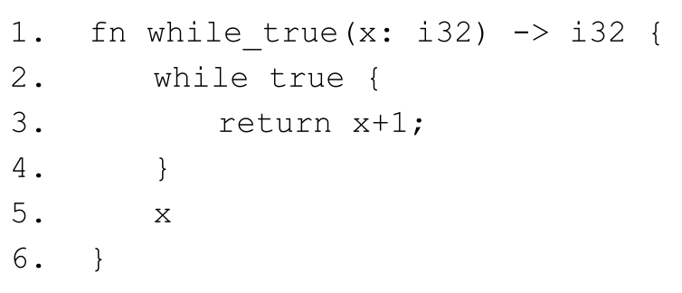{.u54456}
:::

在代码清单2-19中，在while_true函数的最后一行（第5行）加了x变量，这是为了让编译器以为返回的类型是i32类型。但实际上，程序在运行以后，将永远在while true循环中执行。

### 2.5.3 match表达式与模式匹配 {#text00008.html#Ac22a002e-4b82-4a6d-a0b6-6e18c38d7ca0 .title-left}

Rust提供了match表达式，如代码清单2-20所示。

**代码清单2-20：match表达式**

::: center
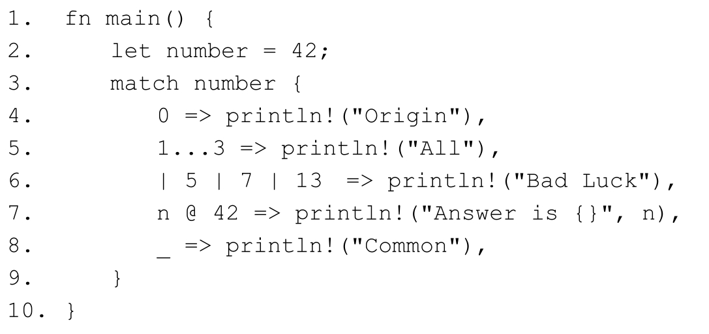{.u54455}
:::

在代码清单2-20中，match用于匹配各种情况。有点类似其他编程语言中的switch或case语句。

在Rust语言中，match分支使用了**模式匹配** （**Pattern Matching** ）技术。模式匹配在数据结构字符串中经常出现，比如在某个字符串中找出与该子串相同的所有子串。在编程语言中，模式匹配用于判断类型或值是否存在可以匹配的模式。模式匹配在很多函数式语言中已经被广泛应用。

**在Rust语言中，match分支左边就是模式，右边就是执行代码** 。模式匹配同时也是一个表达式，和if表达式类似，所有分支必须返回同一个类型。但是左侧的模式可以是不同的。代码清单2-20中使用的模式分别是单个值、范围、多个值和通配符。其中值得注意的是，在代码第7行中，使用操作符@可以将模式中的值绑定给一个变量，供分支右侧的代码使用，**这类匹配叫绑定模式** （**Binding Mode** ）。match表达式必须穷尽每一种可能，所以一般情况下，会使用通配符**\_** 来处理剩余的情况。

除了match表达式，还有let绑定、函数参数、for循环等位置都用到了模式匹配，在后面章节中我们会陆续看到相关示例。

### 2.5.4 if let和while let表达式 {#text00008.html#Abd0f002f-43a0-4860-a538-d5dc5f2d05c0 .title-left}

Rust还提供了if let和while let表达式，分别用来在某些场合替代match表达式。使用if let表达式的代码如代码清单2-21所示。

**代码清单2-21：使用if let表达式**

::: center
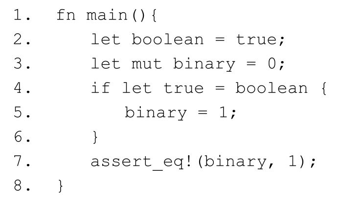{.u54454}
:::

代码清单2-21中使用了if let表达式，和match表达式相似，if let左侧为模式，右侧为要匹配的值。该代码表示binary默认为0，如果boolean为true，则将binary的值修改为1。

在使用循环的某些场合下，也可以使用while let来简化代码。我们先来看不使用while let表达式，而使用match表达式的情况，如代码清单2-22所示。

**代码清单2-22：使用match表达式**

::: center
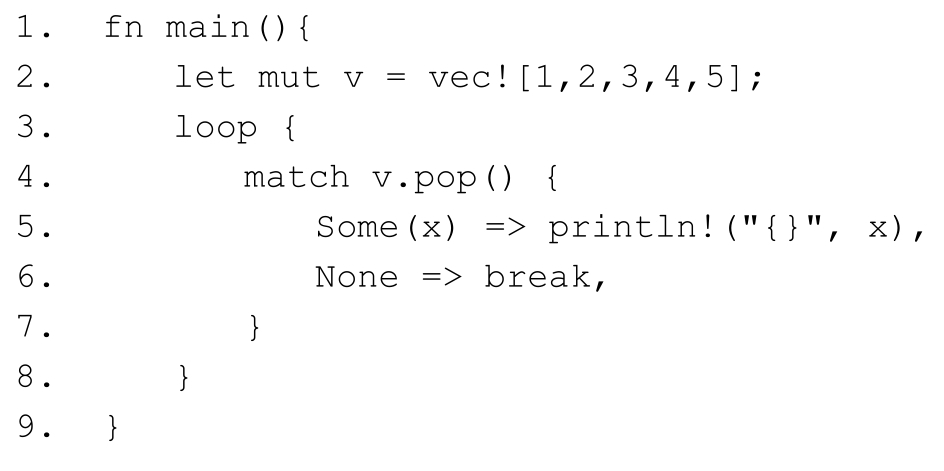{.u54453}
:::

在代码清单2-22中，创建了动态数组v，并且想要将其中的元素通过pop方法依次取出来并打印。此处使用loop循环，因为调用v的pop方法会返回Option类型，所以用match匹配两种情况，Some（x）和None。Rust中引入Option类型是为了防止空指针的出现。Some（x）用于匹配数组中的元素，而 None 用于匹配数组被取空的情况。当数组取空时，就从循环中跳出（break）。

这段代码比较烦琐，因为第6行代码其实什么都没做，只是跳出循环而已。使用while let正好可以简化这段代码，如代码清单2-23所示。

**代码清单2-23：使用while let简化代码**

::: center
{.u54452}
:::

代码清单2-23使用了while let表达式。与if let类似，其左侧Some（x）为匹配模式，它会匹配右侧pop方法调用返回的Option类型结果，并自动创建x绑定供println！宏语句使用。如果数组中的值取空，则自动跳出循环。

## 2.6 基本数据类型 {#text00008.html#A24e90030-c749-401f-8eed-4d5e097d3529 .title-left}

Rust提供了很多原始基本数据类型，下面分别介绍它们。

### 2.6.1 布尔类型 {#text00008.html#A38910030-98d3-409f-9989-bfe60f40df63 .title-left}

Rust内置了布尔类型，类型名为bool。bool类型只有两个值------true和false，其示例如代码清单2-24所示。

**代码清单2-24：bool类型示例**

::: center
{.u54451}
:::

在代码清单2-24中，第2行和第3行声明x和y绑定的写法是等价的。对于x绑定，Rust可以自动推断其类型为bool。当然也可以像声明y那样显式地指定其类型为bool。

任意一个比较操作都会产生bool类型，如第5行代码所示。

也可以通过as操作符将bool类型转换为数字0和1。但要注意，Rust并不支持将数字转换为bool类型。

### 2.6.2 基本数字类型 {#text00008.html#A4d9d0030-a018-491e-8cb4-acd00b11f933 .title-left}

Rust提供的基本数字类型大致可以分为三类：固定大小的类型、动态大小的类型和浮点数，分别介绍如下。

· 固定大小的类型包括无符号整数（Unsigned Integer）和符号整数（Signed Integer）。其

中，无符号整数包括：

➢u8，数值范围为0～2^8-1^ ，占用1个字节。u8类型通常在Rust中表示字节序列。在文件I/O或网络I/O中读取数据流时需要使用u8。

➢u16，数值范围为0～2^16-1^ ，占用2个字节。

➢u32，数值范围为0～2^32-1^ ，占用4个字节。

➢u64，数值范围为0～2^64-1^ ，占用8个字节。

➢u128，数值范围为0～2^128-1^ ，占用16个字节。

符号整数包括：

➢i8，数值范围为-2^7^ ～2^7-1^ ，占用1个字节。

➢i16，数值范围为-2^15^ ～2^15-1^ ，占用2个字节。

➢i32，数值范围为-2^31^ ～2^31-1^ ，占用4个字节。

➢i64，数值范围为-2^63^ ～2^63-1^ ，占用8个字节。

➢i128，数值范围为-2^127^ ～2^127-1^ ，占用16个字节。

· 动态大小类型分为：

➢usize，数值范围为0～2^32-1^ 或0～2^64-1^ ，占用4个或8个字节，具体取决于机器的字长。

➢isize，数值范围为-2^31^ ～2^31-1^ 或-2^63^ ～2^63-1^ ，占用4个或8个字节，同样取决于机器的字长。

· 浮点数类型分为：

➢f32，单精度32位浮点数，至少6位有效数字，数值范围为-3.4×10^38^ ～3.4×10^38^ 。

➢f64，单精度64位浮点数，至少15位有效数字，数值范围为-1.8×10^308^ ～1.8×10^308^ 。

基本数字类型的示例如代码清单2-25所示。

**代码清单2-25：基本数字类型示例**

::: center
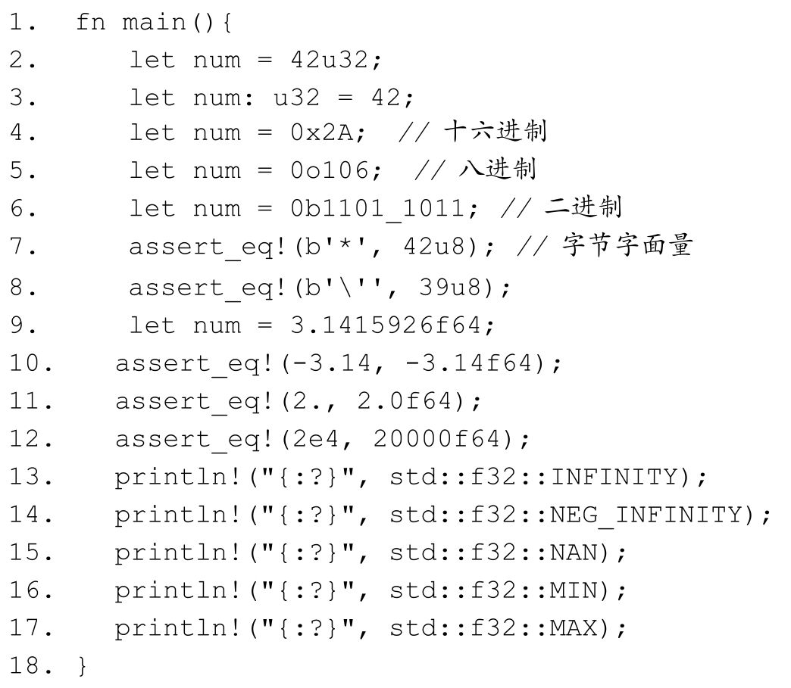{.u54450}
:::

代码清单2-25中创建的数字字面量后面可以直接使用**类型后缀** ，比如42u32，代表这是一个u32类型。如果不加后缀或者没有指定类型，Rust编译器会**默认推断** 数字为i32类型。

可以用前缀0x、0o和0b分别表示十六进制、八进制和二进制类型。比如0x2A、0o106、0b1101_1011。

Rust中也可以写**字节字面量** ，比如以b开头的字符b＇\*＇，它实际等价于42u8。

浮点数同样也可以为字面量加类型后缀。如果不加后缀或没有指定类型，Rust会默认推断浮点数为 f64 类型。标准库 std：：f32 和 std：：f64 都提供了 IEEE 所需的特殊常量值，比如INFINITY（无穷大）、NEG_INFINITY（负无穷大）、NAN（非数字值）、MIN（最小有限值）和MAX（最大有限值）。

### 2.6.3 字符类型 {#text00008.html#A495a0031-288c-4de3-8e79-aefe9ee83ee8 .title-left}

在Rust中，使用**单引号** 来定义字符（Char）类型。字符类型代表的是一个**Unicode标量值** ，每个字符占4个字节，字符类型的示例如代码清单2-26所示。

**代码清单2-26：字符类型示例**

::: center
{.u54449}
:::

::: center
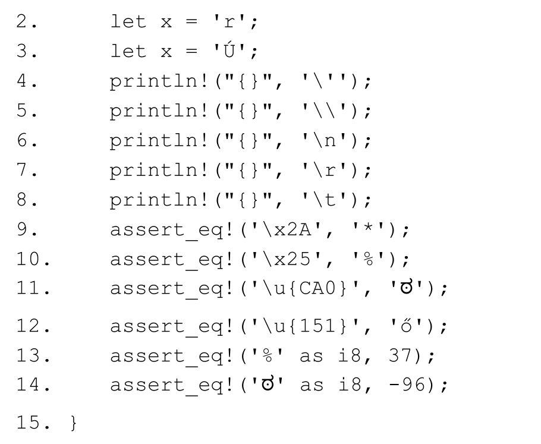{.u54448}
:::

在代码清单2-26中，使用了多个Unicode值来定义字符，比如＇Ú＇、＇ಠ＇、＇\*＇等。同时，Rust的字符也支持转义符，如代码第4行到第8行所示。

字符也可以使用ASCII码和Unicode码来定义，＇2A＇为ASCII码表中表示符号＇\*＇的十六进制数，格式为＇\\xHH＇。＇151＇是Unicode 十六进制码，格式为＇\\u{HHH}＇，如代码第9 行到第12行所示。

同样，可以使用as操作符将字符转为数字类型。＇%＇的十进制ASCII值是37。＇ಠ＇转换为i8，该字符值的高位会被截断，最终得到-96。

### 2.6.4 数组类型 {#text00008.html#A77800032-34c3-4ef9-89fc-8ea5bd7ca97f .title-left}

数组（Array）是Rust内建的原始集合类型，数组的特点为：

· 数组大小固定。

· 元素均为同类型。

· 默认不可变。

**数组的类型签名为\[T；N\]** 。T是一个泛型标记，后面会具体介绍，它代表数组中元素的某个具体类型。N代表数组的长度，是一个编译时常量，必须在编译时确定其值。数组类型的示例如代码清单2-27所示。

**代码清单2-27：数组类型示例**

::: center
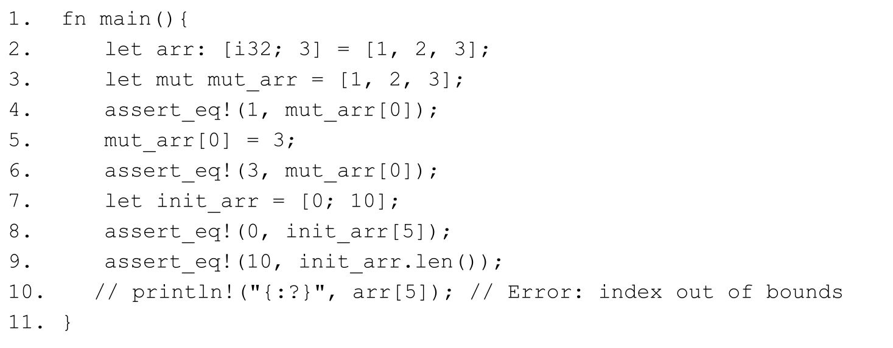{.u54447}
:::

在代码清单2-27中，定义了类型为\[i32；3\]的数组，该数组是固定长度的，不允许对其添加或删除元素。即使通过let mut关键字定义可变绑定mut_arr，也只能修改已存在于索引位上的元素。

另外，还可以通过\[0；10\]这样的语法创建初始值为0且指定长度为10的数组。对于越界访问的情况，Rust会报编译错误，有效阻止了内存不安全的操作，如代码第10行所示。

对于原始固定长度数组，只有实现Copy trait的类型才能作为其元素，也就是说，只有可以在栈上存放的元素才可以存放在该类型的数组中。不过，在不远的将来，Rust还将支持**VLA （variable-length array）** 数组，即**可变长度数组** 。对于可变长度数组，将会基于可以在栈上动态分配内存的函数来实现。在本书写作时，支持该功能的Unsized Rvalues特性 ^[\[1\]](#text00008.html#n939C00332F5548738A747AF0AA59E7CA){#text00008.html#n939C00332F5548738A747AF0AA59E7CAs}^ 已经被实现了一小部分。

### 2.6.5 范围类型 {#text00008.html#A6f4d0033-8d9e-45d0-b823-02f0c0377bfc .title-left}

Rust 内置了范围（Range）类型，包括**左闭右开** 和**全闭** 两种区间。范围类型的示例如代码清单2-28所示。

**代码清单2-28：范围类型示例**

::: center
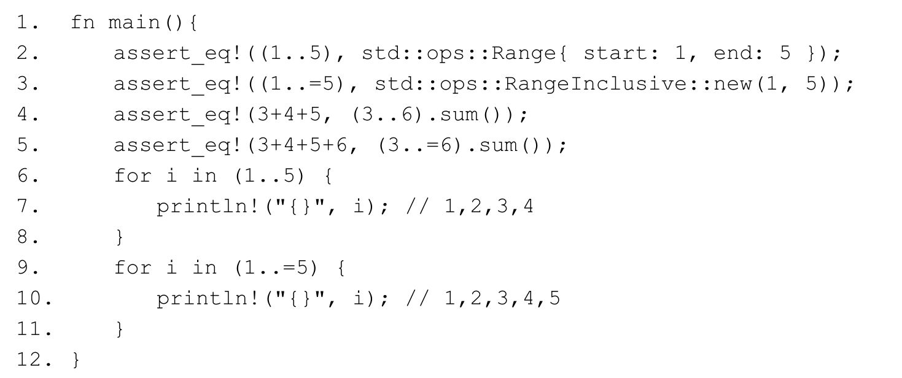{.u54446}
:::

代码清单2-28中展示了两种范围区间。（1..5）表示左闭右开区间，（1..=5）则表示全闭区间。它们分别是std：：ops：：Range和std：：ops：：RangeInclusive的实例。

范围自带了一些方法，比如sum，可以为范围中的元素进行求和。并且每个范围都是一个迭代器，可以直接使用for循环进行打印。请注意两种区间的不同。

### 2.6.6 切片类型 {#text00008.html#Afb960033-2f11-463c-80aa-3dd214949582 .title-left}

切片（Slice）类型是对一个数组（包括固定大小数组和动态数组）的引用片段，有利于安全有效地访问数组的一部分，而不需要拷贝。因为理论上讲，切片引用的是已经存在的变量。在底层，切片代表一个指向数组起始位置的指针和数组长度。用\[T\]类型表示连续序列，那么切片类型就是&\[T\]和&mut \[T\]。

切片类型的示例如代码清单2-29所示。

**代码清单2-29：切片类型示例**

::: center
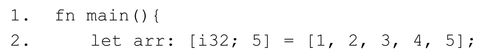{.u54445}
:::

::: center
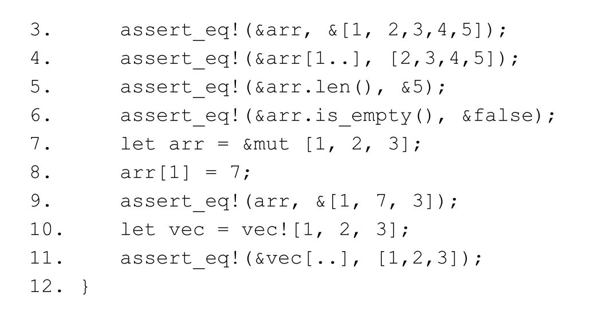{.u54444}
:::

在代码清单2-29中，通过引用操作符&对数组进行引用，就产生了一个切片&arr。也可以结合范围对数组进行切割，比如&arr\[1..\]，表示获取arr数组中在索引位置1之后的所有元素。

切片也提供了两个const fn方法，len和is_empty，分别用来得到切片的长度和判断切片是否为空。

通过&mut可以定义可变切片，这样可以直接通过索引来修改相应位置的值，如代码第7行到第9行所示。

对于使用vec！宏定义的动态数组，也可以通过引用操作符来得到一个切片，如代码第10行和第11行所示。

### 2.6.7 str字符串类型 {#text00008.html#Acaee0034-a571-4e7d-8914-a4f6fbd53507 .title-left}

Rust提供了原始的字符串类型str，也叫作**字符串切片** 。它通常以不可变借用的形式存在，即&str。**出于内存安全的考虑，Rust将字符串分为两种类型** ，一种是固定长度字符串，不可随便更改其长度，就是str字符串；另一种是可增长字符串，可以随意改变其长度，就是String字符串。str字符串的示例如代码清单2-30所示。

**代码清单2-30：str字符串示例**

::: center
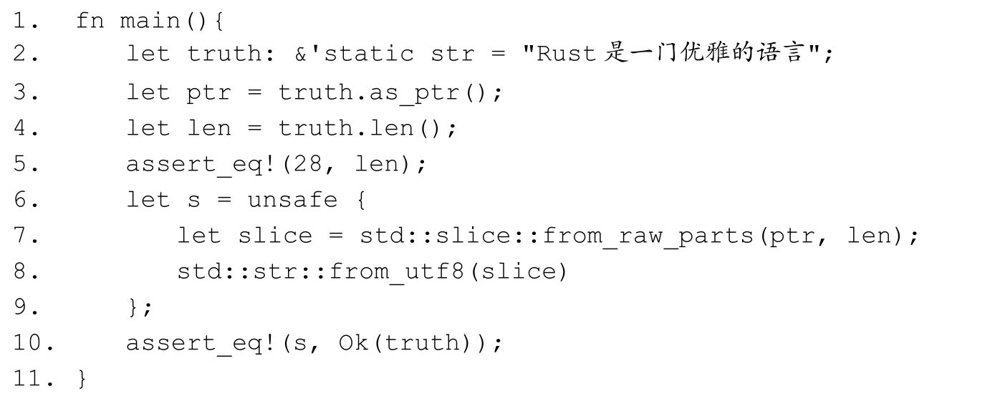{.u54443}
:::

代码清单2-30中定义了字符串字面量truth。本质上，字符串字面量也属于str类型，只不过它是**静态生命周期字符串&＇static str** 。所谓静态生命周期，可以理解为该类型字符串和程序代码一样是持续有效的。

str字符串类型由两部分组成：指向字符串序列的指针和记录长度的值。可以通过str模块提供的as_ptr和len方法分别求得指针和长度，如代码第3行和第4行所示。

Rust中的字符串本质上是一段有效的UTF8字节序列。所以，可以将一段字节序列转换为str字符串。如代码第6行到第9行所示。通过调用std：：slice：：from_raw_parts函数，传入指针和长度，可以将相应的字节序列转换为切片类型&\[u8\]。然后再使用std：：str：：from_utf8函数将得到的切片转换为 str 字符串。因为整个过程并没有验证字节序列是否为合法的 UTF8字符串，所以需要放到**unsafe块** 中执行整个转换过程。如果开发者看到unsafe块，就意味着Rust编译器将内存安全交由开发者自行负责了。关于unsafe块的更多细节，将在第13章详细阐述。

### 2.6.8 原生指针 {#text00008.html#Aacf50035-55ad-46e4-925e-367bd7bd0639 .title-left}

我们将可以表示内存地址的类型称为**指针** 。Rust 提供了多种类型的指针，包括引用（Reference）、原生指针（Raw Pointer）、函数指针（fn Pointer）和智能指针（Smart Pointer）。

我们在前面介绍过引用，它本质上是一种**非空指针** 。Rust可以划分为**Safe Rust和Unsafe Rust** 两部分，引用主要应用于Safe Rust中。在Safe Rust中，编译器会对引用进行借用检查，以保证内存安全和类型安全。

原生指针主要用于Unsafe Rust中。直接使用原生指针是不安全的，比如原生指针可能指向一个Null，或者一个已经被释放的内存区域，因为使用原生指针的地方不在Safe Rust的可控范围内，所以需要程序员自己保证安全。Rust支持两种原生指针：不可变原生指针\*const T和可变原生指针\*mut T。

原生指针的示例如代码清单2-31所示。

**代码清单2-31：原生指针示例**

::: center
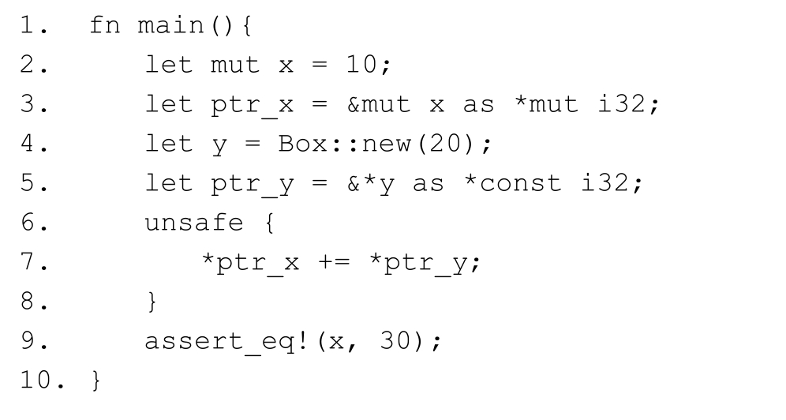{.u54442}
:::

在代码清单 2-31 中，通过 as 操作符将&mut x 可变引用转换为\*mut i32 可变原生指针ptr_x，如代码第2行和第3行所示。

代码第4行使用Box：：new（20）代表在堆内存上存储数字20。然后通过一系列操作转成不可变原生指针ptr_y。

然后对ptr_x和ptr_y指针解引用，并将两个指针指向的值求和，最终得到30。如代码第6行到第8行所示，注意操作原生指针要使用unsafe块。

关于原生指针的更多内容，在第13章中有详细阐述。

### 2.6.9 never类型 {#text00008.html#A78c30035-5b63-4f96-a560-794d1153ec23 .title-left}

Rust中提供了一种特殊数据类型，never类型，即！。**该类型用于表示永远不可能有返回值的计算类型** ，比如线程退出的时候，就不可能有返回值。Rust是一个类型安全的语言，所以也需要将这种情况纳入类型系统中进行统一管理。

never类型的示例如代码清单2-32所示。

**代码清单2-32：neüer类型示例**

::: center
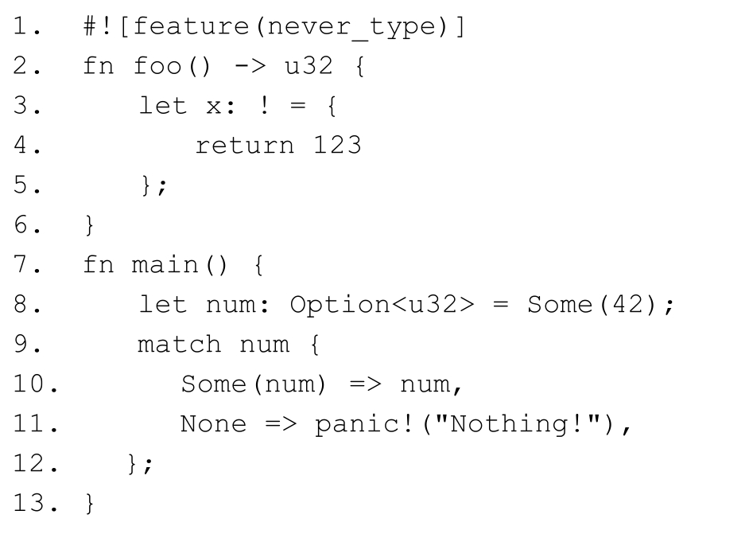{.u54441}
:::

在代码清单2-32中使用了＃！\[feature（never_type）\]特性，这是因为当前never类型属于实验特性，所以必须在Nightly版本下使用该特性，才可以显式地使用never类型。

代码第2行到第6行定义了foo函数，其内部定义的绑定x指定了never类型，右侧块中使用了return表达式。因为return表达式会将123返回，绑定x永远都不会被赋值，所以这里使用never类型不会出现编译错误。与return表达式类似的还有break和continue。

在main函数中使用了match匹配表达式，注意其中None分支使用了panic！宏。因为match表达式要求所有的分支都必须返回相同的类型，这里panic！宏其实是会返回never类型！的，而Some（num）分支会返回u32类型。为什么编译器没有报错呢？这是因为never类型是可以强制转换为其他任何类型的。

## 2.7 复合数据类型 {#text00008.html#A9e880036-9172-48b5-b36b-97820775cc55 .title-left}

Rust提供了4种复合数据类型，分别是：

· **元组** （Tuple）

· **结构体** （Struct）

· **枚举体** （Enum）

· **联合体** （Union）

这4种数据类型都是异构数据结构，意味着可以使用它们将多种类型构建为统一的数据类型。本章只介绍前3种复合数据类型，联合体将在第7章介绍。

### 2.7.1 元组 {#text00008.html#A4f480036-58f0-42ac-9540-4110607e9f7f .title-left}

元组（Tuple）是一种异构有限序列，形如（T，U，M，N）。所谓异构，就是指元组内的元素可以是不同类型的；所谓有限，是指元组有固定的长度，如代码清单2-33所示。

**代码清单2-33：元组示例**

::: center
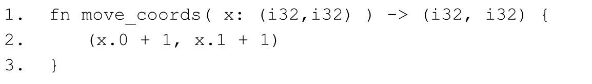{.u54440}
:::

::: center
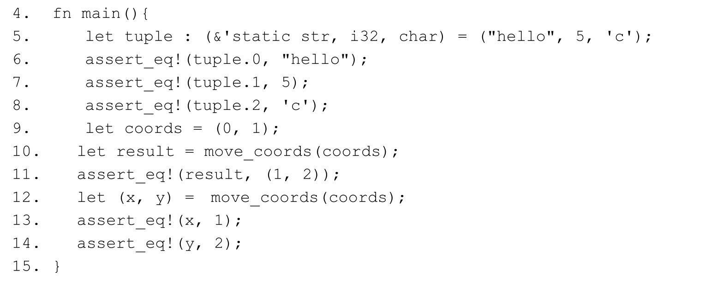{.u54439}
:::

在代码清单2-33中，定义了类型为（&＇static str，i32，char）的元组tuple。可以通过**索引** 来获取元组内元素的值，如代码第6行到第8行所示。

利用元组也可以让函数返回多个值，如代码第1行到第3行函数move_coords的定义所示。

**因为let支持模式匹配，所以可以用来解构元组** ，如代码第12行到第14行所示。函数move_coords返回一个元组，通过let解构，返回的元组第一位会绑定给x，第二位会绑定给y。之后就可以直接使用x和y。

当元组中只有一个值的时候，需要加逗号，即 （0，），这是为了和括号中的其他值进行区分，其他值形如（0）。实际上前面函数部分讲到的单元类型就是一个空元组，即**（）** 。

### 2.7.2 结构体 {#text00008.html#Af1720037-6ed8-41c7-b571-e1a7f82e6b70 .title-left}

Rust提供三种结构体：

· 具名结构体（Named-Field Struct）

· 元组结构体（Tuple-Like Struct）

· 单元结构体（Unit-Like Struct）

具名结构体是最常见的结构体，如代码清单2-34所示。

**代码清单2-34：具名结构体示例**

::: center
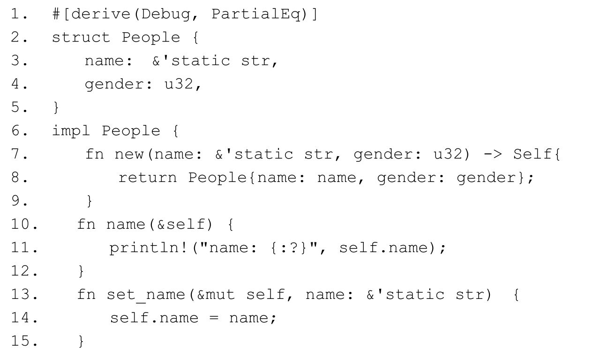{.u54438}
:::

::: center
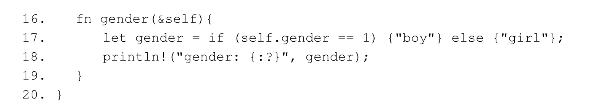{.u54437}
:::

代码清单2-34中通过struct关键字定义了一个结构体People，注意结构体名称要遵从**驼峰式命名** 规则。虽然不按驼峰式命名也可以通过编译，但是编译器会警告你：should have a camel case name。

结构体里面字段格式为name：type，name是字段的名称，type是此字段的类型，所以称此类结构体为具名结构体。结构体中字段默认不可变，而且字段可以是任意类型的，甚至是结构体本身。

People结构体上方的**＃\[derive（Debug，PartialEq）\]** 是属性，可以让结构体自动实现Debug trait和PartialEq trait，它们的功能是允许对结构体实例进行打印和比较。

在impl People{...}块中为People结构体实现了4个方法，new、name、set_name和gender。

在Rust中，函数和方法是有区别的。如果不是在impl块里定义的函数，就是自由函数。**而在impl块中定义的函数被称为方法，这和面向对象有点渊源** 。从代码清单2-34中可以看出来，name和gender函数的定义中有一个参数&self，它代表一个对结构体实例自身的引用，这样方便我们使用圆点记号来调用结构体实例中定义的相关函数，如代码清单2-35所示。

**代码清单2-35：用圆点记号调用结构体实例中定义的相关函数**

::: center
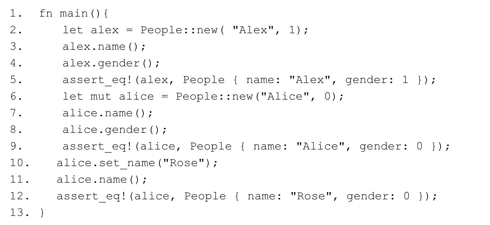{.u54436}
:::

在代码清单2-35中，通过People：：new方法来创建People结构体实例alex。并且可以通过圆点记号来调用结构体中的函数name和gender。代码第3行和第4行的写法完全符合面向对象消息通信模型receiver.message。所以说，**Rust具名结构体是面向对象思想的一种体现** 。

所以，这里实现的name和set_name两个方法，有点类似于面向对象中的getter和setter方法，这两个方法的作用就是获取和修改成员变量的具体值。注意这两个方法签名中的&self和&mut self的用法。结构体中定义的new方法，则类似于面向对象语言中类的构造函数，但实际上Rust中并没有构造函数。注意new方法参数并没有&self，在调用new方法的时候直接使用了一对冒号，而不是圆点记号。

除了具名结构体，Rust中还有一种结构体，它看起来像元组和具名结构体的混合体，叫**元组结构体** ，如代码清单2-36所示。其**特点是，字段没有名称，只有类型** 。

**代码清单2-36：元组结构体示例**

::: center
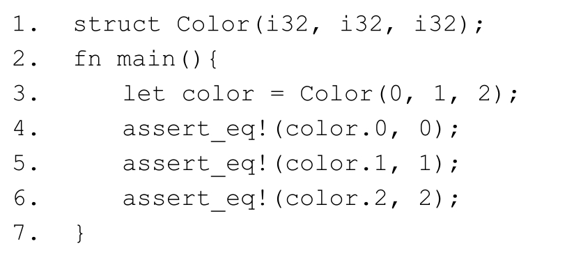{.u54435}
:::

代码清单2-36中定义了元组结构体Color，看上去就像具名的元组。注意，元组结构体后面要加分号。元组结构体访问字段的方式和元组一样，也是使用圆点记号按位置索引访问。

**当一个元组结构体只有一个字段的时候，我们称之为New Type模式** ，如代码清单2-37所示。

**代码清单2-37：New Type模式示例**

::: center
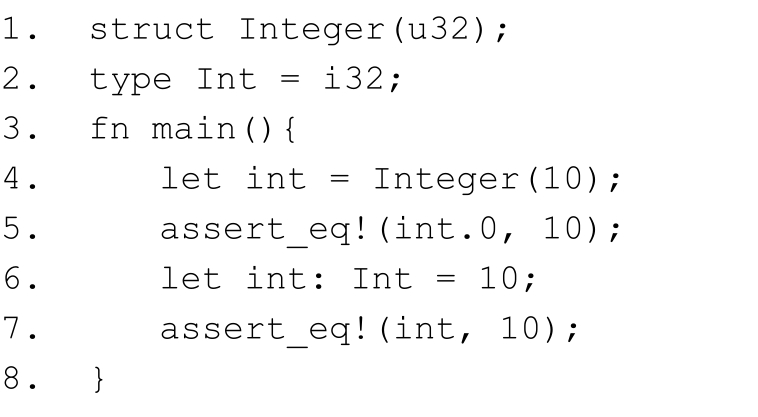{.u54434}
:::

代码清单2-37中定义了Integer单字段结构体，字段为u32类型。之所以称为New Type模式，是因为相当于把u32类型包装成了新的Integer类型。

也可以使用type关键字为一个类型创建别名，如代码第2行为i32类型创建了一个别名Int，但是其本质还是i32类型，它所拥有的行为和i32是一样的。相比之下，New Type模式属于自定义类型，更加灵活。

Rust中可以定义一个没有任何字段的结构体，即单元结构体，如代码清单2-38所示。

**代码清单2-38：单元结构体示例**

::: center
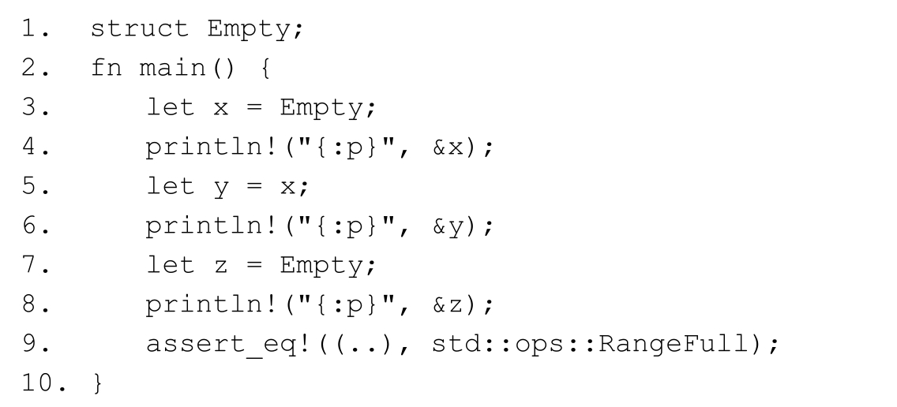{.u54433}
:::

代码清单2-38中定义了Empty结构体，等价于struct Empty{}。单元结构体实例就是其本身。也许有的人会有疑问：为同一个单元结构体创建多个实例，这些实例是否是同一个对象？注意，此处的"对象"是广义层面的，并非特指面向对象中的"对象"。

代码第5行将x赋值给新的绑定y。此时因为x是位置表达式，而它的上下文是值上下文，所以它的内存地址会移动给新的位置表达式y。

代码第7行定义了新的绑定z，将新的单元结构体实例赋予了z。

然后通过{：p}格式符在println！宏语句中打印&x、&y和&z的内存地址，会发现以下事实：

· 在Debug编译模式下，x、y和z是不同的内存地址。

· 在Release编译模式下，x、y和z是相同的内存地址。

这证明，在 Release 编译模式下，单元结构体实例会被优化为同一个对象。而在 Debug模式下，则不会进行这样的优化。

单元结构体与New Type模式类似，也相当于定义了一个新的类型。单元结构体一般用于一些特定场景，标准库中表示全范围（..）的 RangeFull，就是一个单元结构体，如代码第 9行所示。

### 2.7.3 枚举体 {#text00008.html#A60a6003a-0c25-4594-be4a-387d9ed9617b .title-left}

枚举体（Enum，也可称为枚举类型或枚举），顾名思义，该类型包含了全部可能的情况，可以有效地防止用户提供无效值。在Rust中，枚举类型可以使用enum关键字来定义，并且有三种形式，其中一种是无参数枚举体，如代码清单2-39所示。

**代码清单2-39：无参数枚举体示例**

::: center
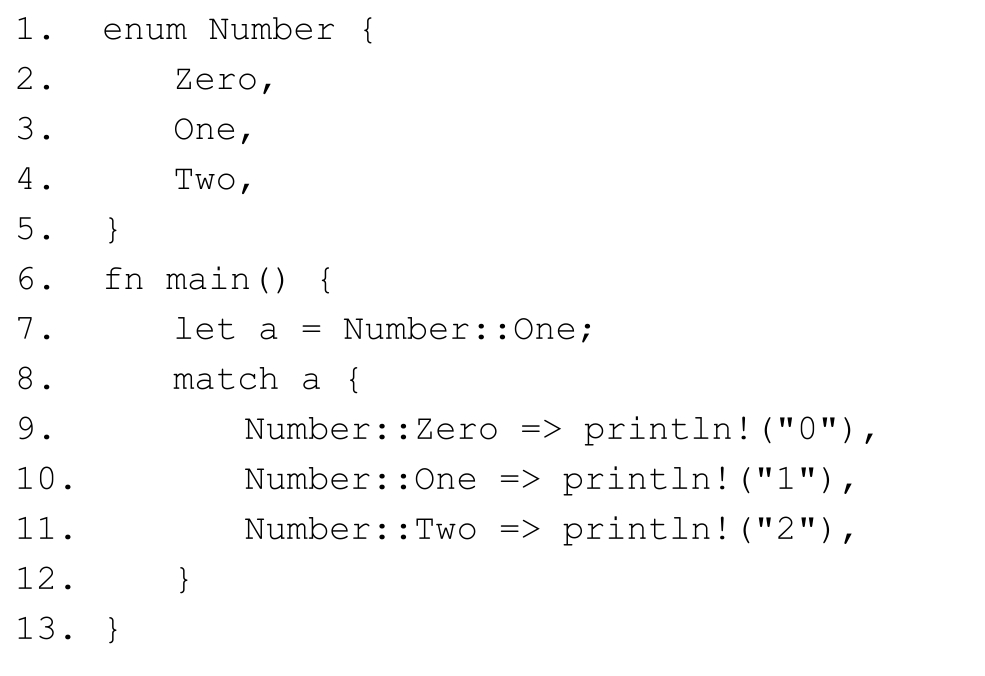{.u54432}
:::

代码清单2-39中定义了枚举体Number，包含了三个值Zero、One和Two。需要注意，这三个是值，而非类型。

在main函数中，想要使用枚举体的值，需要使用Number前缀，如代码第7行所示。可以使用match匹配来枚举所有的值，以处理相应的情况。

Rust也可以编写像C语言中那种形式的枚举体，就是我们要讲的第二种形式的枚举体，我们称之为类C枚举体，如代码清单2-40所示。

**代码清单2-40：类C枚举体示例**

::: center
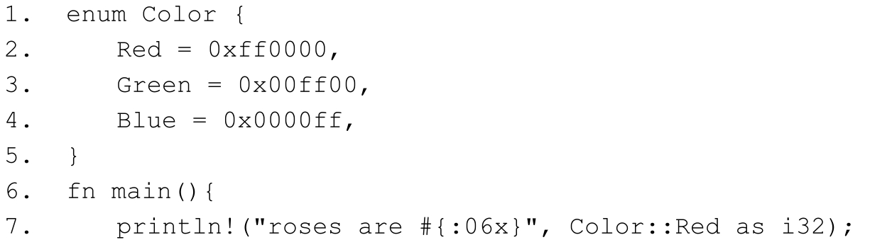{.u54431}
:::

::: center
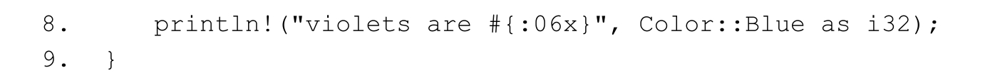{.u54430}
:::

代码清单2-40中定义了枚举体Color，其中包含了三个枚举值：Red、Green和Blue，还分别被赋予了相应的值。同样，如果要使用具体的枚举值，需要加 Color 前缀，如代码第 7行和第8行所示。

Rust还支持携带类型参数的枚举体，也就是我们要讲的第三种枚举体，如代码清单2-41所示。

**代码清单2-41：带参数枚举体示例**

::: center
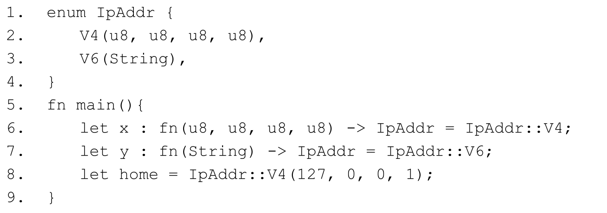{.u54429}
:::

代码清单2-41中定义的枚举体IpAddr，其枚举值携带了类型参数。这样的枚举值本质上属于函数指针类型。

从代码第6行和第7行中看得出来，IpAddr：：V4是fn（u8，u8，u8，u8）-＞IpAddr函数指针，IpAddr：：V6是fn（String）-＞IpAddr函数指针。

使用这类枚举值就像函数调用那样，需要传入实际的参数，如代码第8行所示。

**枚举体在 Rust 中属于非常重要的类型之一** 。一方面它为编程提供了很多方便，另一方面，它保证了Rust中避免出现空指针。其应用示例如代码清单2-42所示。

**代码清单2-42：枚举体应用示例**

::: center
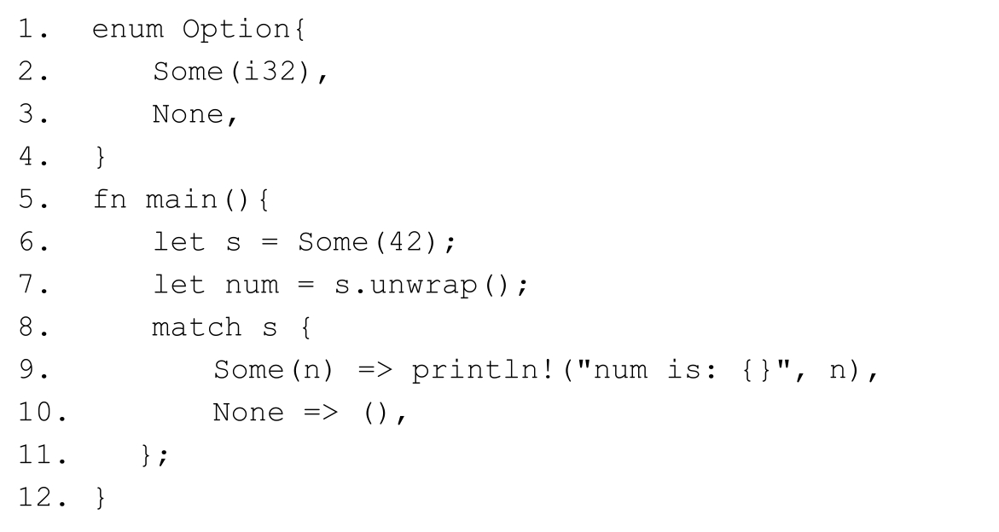{.u54428}
:::

在代码清单2-42中定义了**Option枚举类型** ，现在想用该类型表示**有值** 和**无值** 两种情况。其中Some（i32）代表有i32类型的值，而None代表无任何值。

该类型可以作为某些函数的返回值。如果函数有合法的值返回，则使用Some（i32）枚举值；如果函数要返回空，则可以使用None。这样一来，该函数的值就确定了，无非就是两种，有值或无值。调用该函数的开发者就可以分别处理这两种情况，从而提升程序的健壮性。

在main函数中，定义了绑定s的值为Some（42）。因为这里的值是确定的，所以可以使用unwrap方法将Some（42）中的数字42取出来。如果在不确定的情况下使用unwrap，可能会导致运行时错误。我们可以使用match匹配来枚举这两种情况，并分别处理，如代码第8行到第11行所示。

这个Option类型可以有效地避免开发中出现Null值，所以Rust标准库中也内置了相应的类型，只不过它是泛型的枚举体Option＜T＞，如代码清单2-43所示。这样一来，开发者无须自己定义就可以直接使用泛型的枚举体了。

**代码清单2-43：Option＜T＞示例**

::: center
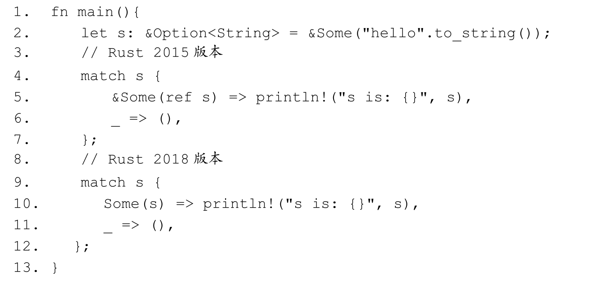{.u54427}
:::

在代码清单2-43中，可以直接使用Some（T），T是泛型，此处具体类型为&str字符串。

代码第2行定义了&Option＜&str＞类型的绑定s，这里使用引用是为了演示match匹配的两种写法。

代码第4行到第7行是Rust 2015版本中的写法。在match匹配分支中，使用&Some（ref s）这样的匹配模式是为了解构&Some（＂hello＂.to_string（））。其中ref也是一种模式匹配，是为了解构&Some（ref s）中s的引用，避免其中的s被转移所有权。

代码第9行到第12行是Rust 2018版本中的写法。目的和第4行到第7行相同，但是不需要再使用引用操作符和ref来进行解构了。在新的版本中，match匹配会自动处理这种情况。

## 2.8 常用集合类型 {#text00008.html#Aee9a003c-aeec-4146-9f02-0037ef0e9b86 .title-left}

在Rust标准库std：：collections模块下有4种通用集合类型，分别如下。

· 线性序列：向量（Vec）、双端队列（VecDeque）、链表（LinkedList）。

· Key-Value映射表：无序哈希表（HashMap）、有序哈希表（BTreeMap）。

· 集合类型：无序集合（HashSet）、有序集合（BTreeSet）。

· 优先队列：二叉堆（BinaryHeap）。

### 2.8.1 线性序列：向量 {#text00008.html#A3df4003c-ea0b-43d6-bf29-d23146263b1f .title-left}

向量也是一种数组，和基本数据类型中的数组的区别在于，向量可动态增长。代码清单2-44展示了一个向量的示例。

**代码清单2-44：Vec＜T＞示例**

::: center
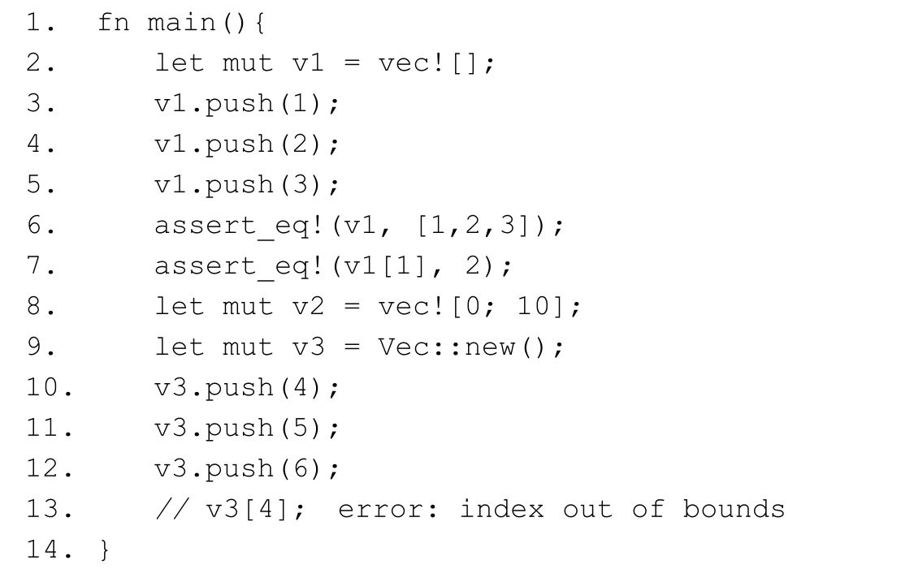{.u54426}
:::

在代码清单2-44中，使用了三种方法来初始化向量，分别见v1、v2和v3的初始化方法。向量的用法和一般数组是类似的，但是如果要往向量中增加元素，则需要用mut来创建可变绑定。访问元素也是通过下标索引来访问的。

vec！是一个宏，用来创建向量字面量。宏语句可以使用圆括号，也可以使用中括号和花括号，一般使用中括号来表示数组。可以使用push方法往向量数组中添加新的元素。向量也内置了很多其他方法，在第8章将详细介绍它们。

Rust对向量和数组都会做越界检查，以保证安全。如代码第13行所示，调用v3\[4\]，编译器会报panic错误：thread＇main＇panicked at＇index out of bounds。

### 2.8.2 线性序列：双端队列 {#text00008.html#Acfba003d-21bf-4c16-9ba9-8b64a8adfd68 .title-left}

双端队列（Double-ended Queue，缩写为Deque）是一种同时具有队列（先进先出）和栈（后进先出）性质的数据结构。双端队列中的元素可以从两端弹出，插入和删除操作被限定在队列的两端进行。

Rust中的VecDeque是基于可增长的RingBuffer算法实现的双端队列。代码清单2-45展示了一个双端队列的示例。

**代码清单2-45：VecDeque＜T＞示例**

::: center
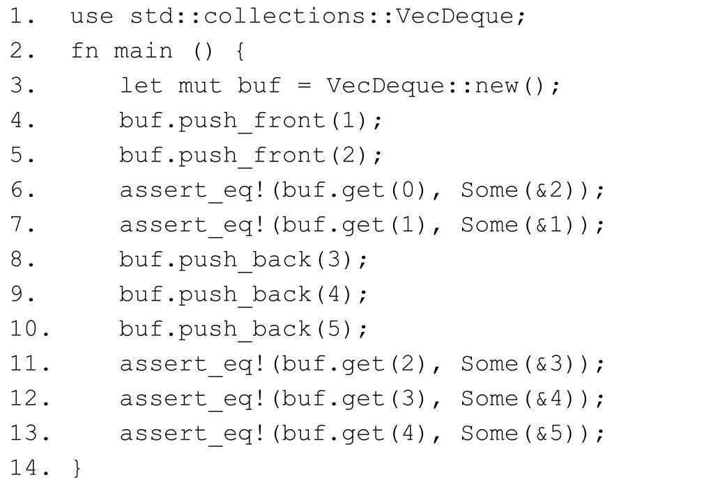{.u54425}
:::

在代码清单 2-45 中，需要通过 use 关键字引入 std：：collections：：VecDeque，因为VecDeque＜T＞并不会像Vec＜T＞那样被自动引入。

双端队列VecDeque实现了两种push方法，push_front和push_back。push_front的行为像栈，push_back的行为像队列。通过get方法加索引值可以获取队列中相应的值。

代码第6行和第7行通过push_front先后添加了元素1和2，但是相应的索引是1和0，正是栈数据结构先进后出的体现。

代码第11行到第13行通过push_back先后添加了元素3、4和5，相应的索引位置是2、3和4，正是队列先进先出的体现。

### 2.8.3 线性序列：链表 {#text00008.html#Ac072003e-24a7-454d-851c-7c6e90f443fb .title-left}

Rust提供的链表是双向链表，允许在任意一端插入或弹出元素。但是通常最好使用Vec或VecDeque类型，因为它们比链表更加快速，内存访问效率更高，并且可以更好地利用CPU缓存。

代码清单2-46展示了一个链表的示例。

**代码清单2-46：LinkedList＜T＞示例**

::: center
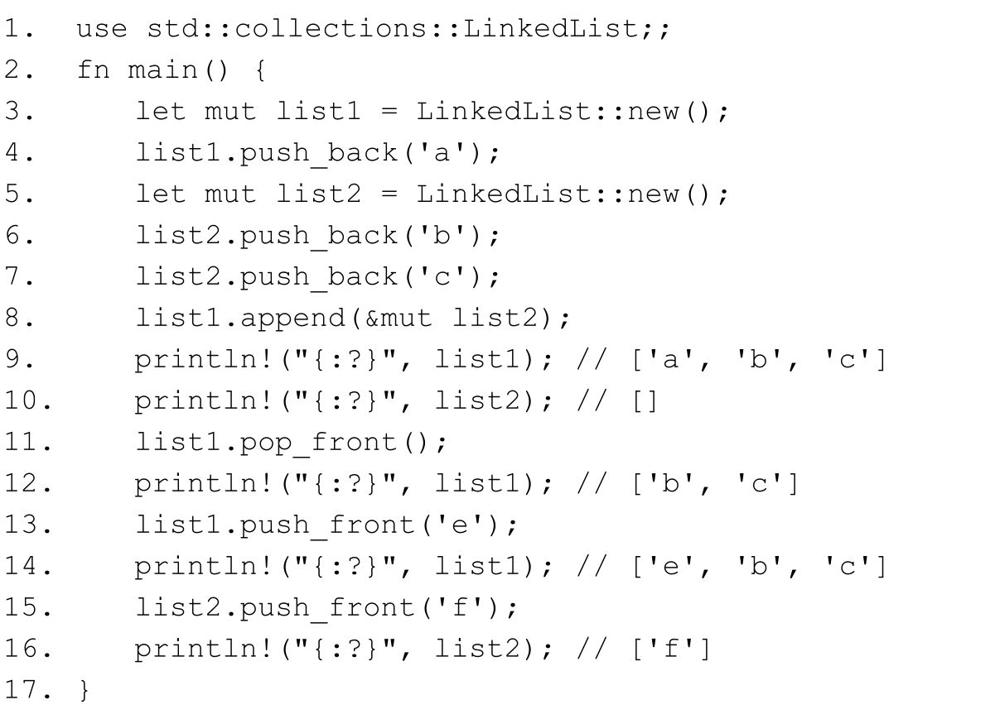{.u54424}
:::

在代码清单2-46中，依然使用use显式引入std：：collections：：LinedList。因为是双向列表，所以提供了push_back和push_front两类方法，方便操作此链表。也提供了append方法，可以用来连接两个链表。更多相关的操作，可以查看标准库文档。

### 2.8.4 Key-Value映射表：HashMap和BTreeMap {#text00008.html#A53bf003e-dc93-4783-8dd3-8fb09e8ca2ff .title-left}

Rust集合模块一共为我们提供了两个Key-Value哈希映射表：

· **HashMap＜K,V＞**

· **BTreeMap＜K,V＞**

Key必须是可哈希的类型，Value必须是在编译期已知大小的类型。这两种类型的区别之一是，**HashMap是无序的，BTreeMap是有序的** 。它们的类型签名分别是HashMap＜K，V＞和BTreeMap＜K，V＞，如代码清单2-47所示。

**代码清单2-47：HashMap＜K，V＞和BTreeMap＜K，V＞示例**

::: center
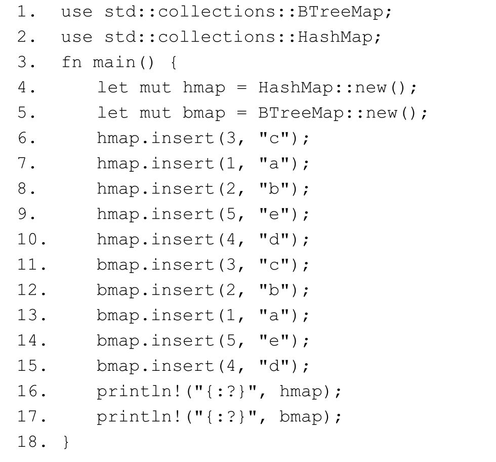{.u54423}
:::

在代码清单 2-47 中，同样引入了 use std：：collections：：BTreeMap 和 use std：：collections：：HashMap。通过内置的new方法，可以创建相应的实例hmap和bmap。然后通过insert方法插入键值对。

代码第16行的hmap的输出结果为{1：＂a＂，2：＂b＂，3：＂c＂，5：＂e＂，4：＂d＂}，但key的顺序是随机的，每次执行可能会不一样，因为HashMap是无序的。

代码第17行的bmap的输出结果永远都是{1：＂a＂，2：＂b＂，3：＂c＂，4：＂d＂，5：＂e＂}，顺序不会改变，因为BTreeMap是有序的。

标准库中还提供了不少操作这两种映射表的方法，可以去文档中查看。在第8章中也会有更详细的介绍。

### 2.8.5 集合：HashSet和BTreeSet {#text00008.html#Aaf1f003f-0101-4d93-bc0d-54454f77f2f5 .title-left}

HashSet＜K＞和BTreeSet＜K＞其实就是HashMap＜K，V＞和BTreeMap＜K，V＞把Value设置为空元组的特定类型，等价于HashSet＜K，（）＞和BTreeSet＜K，（）＞。所以这两种集合类型的特性大概如下：

· 集合中的元素应该是唯一的，因为是Key-Value映射表的Key。

· 同理，集合中的元素应该都是可哈希的类型。

· HashSet应该是无序的，BTreeSet应该是有序的。

HashSet＜K＞和BTreeSet＜K＞的示例如代码清单2-48所示。

**代码清单2-48：HashSet＜K＞和BTreeSet＜K＞示例**

::: center
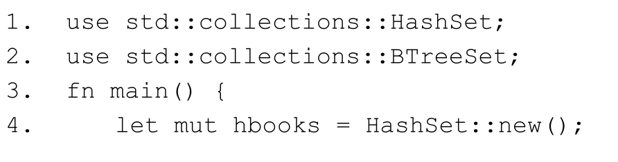{.u54422}
:::

::: center
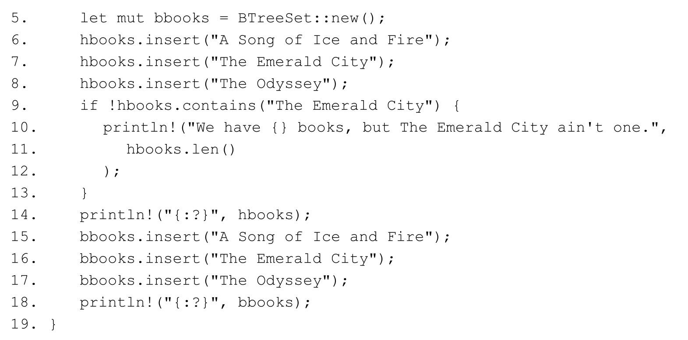{.u54421}
:::

在代码清单2-48中，第14行的hbooks内容的输出顺序是随机的，因为HashSet是无序的。

第18行的bbooks的输出顺序永远是{＂A Song of Ice and Fire＂，＂The Emerald City＂，＂The Odyssey＂}，因为BTreeSet是有序的。

### 2.8.6 优先队列：BinaryHeap {#text00008.html#A74090040-c484-45e4-bbd4-13cf6e6ae96b .title-left}

Rust提供的优先队列是基于**二叉最大堆（Binary Heap）** 实现的，如代码清单2-49所示。

**代码清单2-49：BinaryHeap＜T＞示例**

::: center
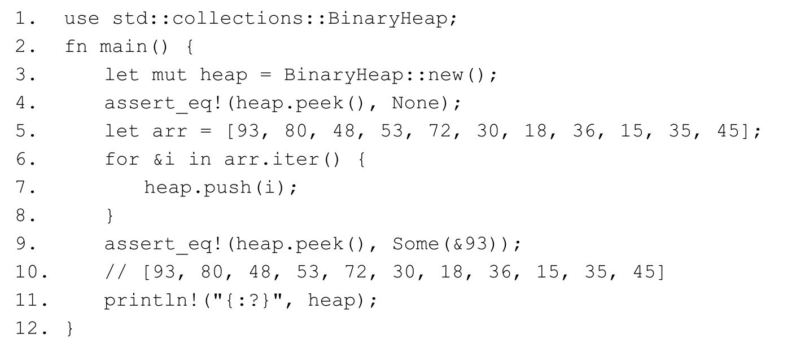{.u54420}
:::

在代码清单2-49中，我们使用BinaryHeap：：new创建了空的最大堆。使用peek方法可以取出堆中的最大值。在代码第4行中，因为堆中没有任何值，所以peek方法取出的是None。

代码第5行到第8行通过迭代将数组中的元素依次push到堆中。然后再通过peek方法取出堆中最大的元素，即93。

标准库还提供了很多操作BinaryHeap的方法，可以查看其文档。

## 2.9 智能指针 {#text00008.html#Afe8d0040-705b-44db-bee3-469d25c8777f .title-left}

智能指针（Smart Pointer）的功能并非Rust独有的，它源自C++语言，Rust将其引入，并使之成为Rust语言中最重要的一种数据结构。

**Rust 中的值默认被分配到栈内存** 。可以通过 **Box ＜T＞** 将值**装箱（在堆内存中分配）** 。Box＜T＞是指向类型为T的堆内存分配值的智能指针。当Box＜T＞超出作用域范围时，将调用其析构函数，销毁内部对象，并自动释放堆中的内存。可以通过解引用操作符来获取Box＜T＞中的T。

**看得出来，Box＜T＞的行为像引用，并且可以自动释放内存，所以我们称其为智能指针。**

Rust中提供了很多智能指针类型，本章只介绍Box＜T＞。使用Box＜T＞可以在堆内存中分配一个值，如代码清单2-50所示。

**代码清单2-50：Box＜T＞在堆内存中分配值的示例**

::: center
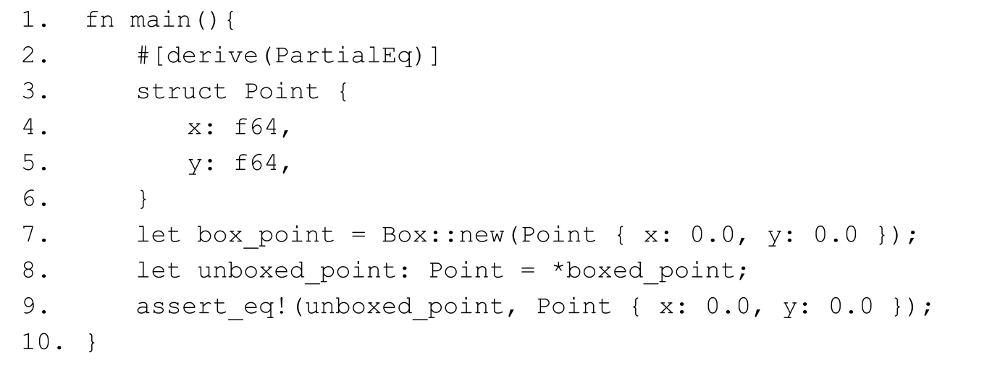{.u54419}
:::

在代码清单2-50中，我们在main函数内部定义了结构体Point，并使用Box：：new方法将其直接装箱，这样它就被分配给了堆内存。然后使用解引用操作符将其解引用，就可以得到内部的Point实例。

通过 Box＜T＞，开发者可以方便无痛地使用堆内存，并且无须手工释放堆内存，可以确保内存安全。第5章会介绍关于智能指针的更多细节。

## 2.10 泛型和trait {#text00008.html#A5dad0041-8417-4f7c-bd06-302211239349 .title-left}

**泛型** 和**trait** 是Rust类型系统中最重要的两个概念。

**泛型** 并不是Rust特有的概念，在很多强类型编程语言中也支持泛型。泛型允许开发者编写一些在使用时才指定类型的代码。泛型，顾名思义，就是泛指的类型。我们在日常的编程中会写一些函数，并可能将其用在很多类型中。如果为每个类型都实现一遍，那么工作量会成倍增加。泛型就是为了解决这个问题的，可以方便代码的复用。

**trait** 同样也不是Rust独有的概念，它借鉴了Haskell的Typeclass。第1章已经介绍过，trait是Rust实现零成本抽象的基石，它有如下机制：

· trait是Rust唯一的接口抽象方式。

· 可以静态生成，也可以动态调用。

· 可以当作标记类型拥有某些特定行为的"标签"来使用。

**简单来说，trait是对类型行为的抽象。**

### 2.10.1 泛型 {#text00008.html#A580713c2-16a0-4765-af13-547beecc42c2 .title-left}

Rust 标准库中定义了很多泛型类型，包括 Option＜T＞、Vec＜T＞、HashMap＜K，V＞以及Box＜T＞等。其中 Option＜T＞就是一种典型的使用了泛型的类型，代码清单 2-51 展示了其定义。

**代码清单2-51：Option＜T＞定义示例**

::: center
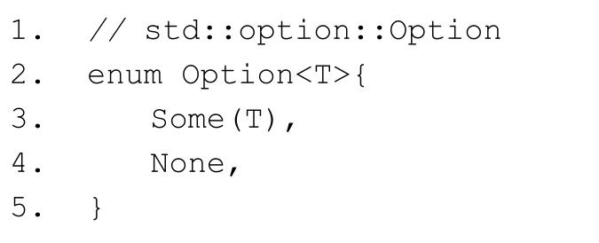{.u54418}
:::

在泛型的类型签名中，通常使用字母T来代表一个泛型。也就是说这个Option＜T＞枚举类型对于任何类型都适用。这样的话，我们就没必要给每个类型都定义一遍Option枚举，比如 Option＜u32＞或 Option＜String＞等。标准库提供的 Option＜T＞类型已经通过 use std：：prelude：：v1：：\*自动引入了每个Rust包中，所以可以直接使用Some（T）或None来表示一个Option＜T＞类型，而不需要写Option：：Some（T）或Option：：None。

Option＜T＞的应用示例如代码清单2-52所示。

**代码清单2-52：Option＜T＞应用示例**

::: center
{.u54417}
:::

在代码清单2-52中，定义了match_option泛型函数，此处＜T：Debug＞是增加了trait限定的泛型，也就是说，只有实现了Debug trait的类型才适用。只有实现了Debug trait的类型才拥有使用＂{：？}＂格式化打印的行为。

如果去掉Debug限定，编译器会报错＇T＇ cannot be formatted using ＇：？＇，这也充分体现了Rust的类型安全保证。

代码第9行到第12行定义的a、b、c、d这4个变量绑定，分别为Option＜T＞指定了4种具体的类型。Rust编译器会在编译期间自动为这4种类型生成Option＜i32＞、Option＜&str＞、Option＜char＞和Option＜u32＞这4种具体的代码实现，方便开发者直接使用。

### 2.10.2 trait {#text00008.html#Ac782f051-1d93-4586-828e-878262cf08c5 .title-left}

trait和类型的行为有关，trait的示例如代码清单2-53所示。

**代码清单2-53：trait示例**

::: center
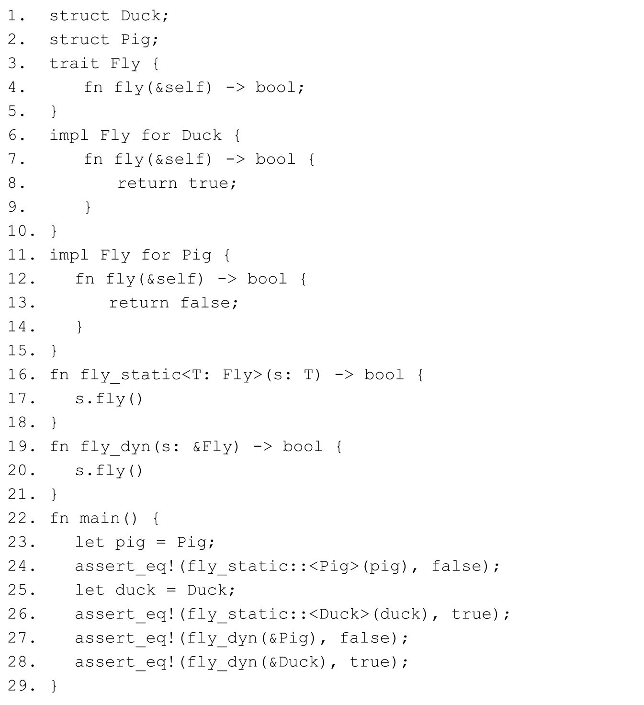{.u54416}
:::

在代码清单2-53中，代码第1行和第2行分别定义了两个结构体Duck和Pig。如果你有编写面向对象语言的经验，你甚至可以将它们看作两个类。

代码第3行到第5行使用trait关键字定义了一个Fly trait。**在Rust中，trait是唯一的接口抽象方式** 。使用trait可以让不同的类型实现同一种行为，也可以为类型添加新的行为。在Fly trait中只包含了一个函数签名fly，包含了参数及参数类型、返回值类型，但没有函数体。函数签名已经基本反映了该函数的所有意图，在返回值类型中甚至还可以包含错误处理相关的信息。这就是类型系统带来的好处之一：提升了可读性。当然，在trait中也可以定义函数的默认实现。

代码第6行到第10行使用impl关键字为Duck实现Fly trait。形如impl Trait for Type的写法在语义上也非常直观，可以表达"为Type实现Trait接口"这样的意思。在该段代码中，对fly函数增加了Duck这个类型的具体实现。因为Duck是可以执行"飞"这个动作的，所以其fly函数的返回值为true。

同理，代码第11行到第15行使用impl关键字为Pig实现Fly trait。但是因为Pig不能执行"飞"这个动作，所以fly函数的返回值为false。

这就是一种接口抽象。Duck和Pig根据自身的类型针对同一个接口进行Fly，实现了不同的行为。Rust中并没有传统面向对象语言中的继承的概念。Rust通过trait将类型和行为明确地进行了区分，充分贯彻了**组合优于继承** 和**面向接口编程** 的编程思想。

代码第16行到第18行实现了fly_static泛型函数，其中泛型参数声明为T，代表任意类型。T：Fly这种语法形式使用Fly trait对泛型T进行行为上的限制，代表实现了Fly trait的类型，或者拥有fly这种行为的类型。这种限制在Rust中称为trait限定（trait bound）。通过trait限定，限制了fly_static泛型函数参数的类型范围。如果有不满足该限定的类型传入，编译器就会识别并报错。

代码第19行到第21行实现了fly_dyn函数，它的参数是一个&Fly类型。&Fly类型是一种动态类型，代表所有拥有fly这种行为的类型。fly_static和fly_dyn的区别是，其函数实现内fly方法的调用机制不同。

代码第22行到第29行的main函数调用了fly_static和fly_dyn函数。

代码第23行通过let声明了变量pig，并指定一个Pig结构体实例。代码第24行使用了assert！断言，用于判断 fly_static：：＜Pig＞（pig）的调用结果是否将会返回 false。其中：：＜Pig＞这样的语法形式用于给泛型函数指定具体的类型，这里调用的是Pig实现的fly方法。

同理，代码第25行和第26行通过fly_static：：＜Duck＞（duck）调用了Duck实现的fly方法，并返回true。

上面这种调用方式在 **Rust** 中叫**静态分发** 。Rust 编译器会为 fly_static：：＜Pig＞（pig）和fly_static：：＜Duck＞（duck）这两个具体类型的调用生成特殊化的代码。也就是说，对于编译器来说，这种抽象并不存在，因为在编译阶段，泛型已经被展开为具体类型的代码。

代码第27行和第28行分别调用了fly_dyn（&Pig）和fly_dyn（&Duck），也可以实现同样的效果。但是 fly_dyn 函数是**动态分发** 方式的，它会在运行时查找相应类型的方法，会带来一定的运行时开销，不过这种开销很小。

通过此例可以看出来，Rust的trait完全符合C++之父提出的**零开销原则** ：如果你不使用某个抽象，就不用为它付出开销（静态分发）；如果你确实需要使用该抽象，可以保证这是开销最小的使用方式（动态分发）。目前在一些基准测试中，Rust 已经拥有了能够和 C/C++竞争的性能。

Rust中内置了很多trait，开发者可以通过实现这些trait来扩展自定义类型的行为。比如，实现了最常用的Debug trait，就可以拥有在println！宏语句中使用{：？}格式进行打印的行为，如代码清单2-54所示。

**代码清单2-54：实现Debug trait**

::: center
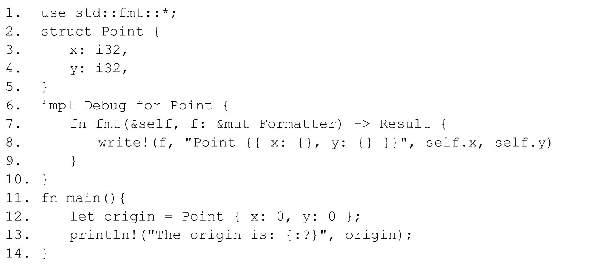{.u54415}
:::

在代码清单2-54中，定义了结构体Point，为了给Point实现Debug trait，必须先使用use引入std：：fmt模块，因为Debug是在其中定义的。

Debug trait中定义了fmt函数，所以只需要为Point实现该函数即可，如代码第6行到第10行所示。之后，main函数就可以直接使用println！宏语句来打印Point结构体实例origin的值。

也可以使用**＃\[derive（Debug）\]** 属性帮助开发者自动实现Debug trait。这类属性本质上属于Rust中的一种宏，在第12章中会详细介绍关于宏的各种细节。

第3章会介绍关于泛型和trait的更多内容。

## 2.11 错误处理 {#text00008.html#Ad4640045-098d-4091-8b59-91ca5c96e07e .title-left}

**Rust 中的错误处理是通过返回 Result＜T，E＞类型的方式进行的** 。Result＜T，E＞类型是Option＜T＞类型的升级版本，同样定义于标准库中。

代码清单2-55展示了Result＜T，E＞的源码实现。

**代码清单2-55：Result＜T，E＞源码实现**

::: center
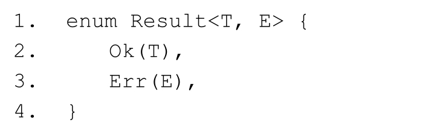{.u54414}
:::

Option＜T＞类型表示值存在的可能性，Result＜T，E＞类型表示错误的可能性，其中泛型E代表Error。Result＜T，E＞的使用示例如代码清单2-56所示。

**代码清单2-56：Result＜T，E＞使用示例**

::: center
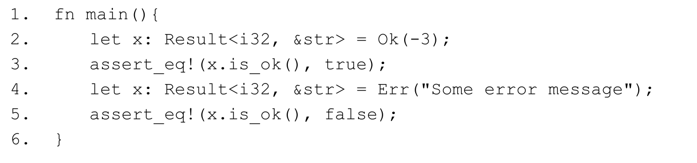{.u54413}
:::

在代码清单2-56中，分别定义了Ok（-3）和Err（＂Some error message＂）枚举值，可通过is_ok方法来判断是否为Ok（T）枚举值。

和Option＜T＞类似，可以将Result＜T，E＞作为函数返回值。这样一来，在调用该函数的时候，如果返回类型是 Result＜T，E＞，那么开发者就不得不处理正常和错误这两种情况，这就为程序的健壮性提供了保证。

在**Rust 2015** 版本中，main函数并不能返回Result＜T，E＞。但是在实际开发中，二进制可执行库也需要返回错误，比如，读取文件的时候发生了错误，这时需要正常退出程序。于是在**Rust 2018** 版本中，允许main函数返回Result＜T，E＞了，如代码清单2-57所示。

**代码清单2-57：main函数中返回Result＜T，E＞示例**

::: center
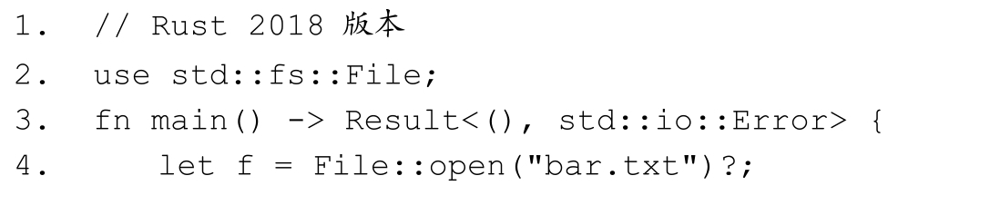{.u54412}
:::

::: center
{.u54411}
:::

代码清单2-57中的main函数通过调用File：：open方法打开一个文件，后面跟随的问号操作符（？）是一个错误处理的语法糖，它会自动在出现错误的情况下返回 std：：io：：Error。这样就可以在程序发生错误时自动返回错误码，并在退出程序时打印相关的错误信息，方便调试，而不需要开发者手动处理错误了。

关于错误处理的更多细节会在第9章进行详细阐述。

## 2.12 表达式优先级 {#text00008.html#Ad54f0046-9a46-455b-ab97-fc87b5bc82ea .title-left}

在Rust中，一切皆表达式，那么了解表达式的优先级就非常重要了，表2-1将Rust的操作符和表达式按优先级由高到低的顺序列了出来，具有相同优先级的操作符按相关性给定的顺序进行优先级计算。

::: center
表2-1：操作符和表达式的优先级

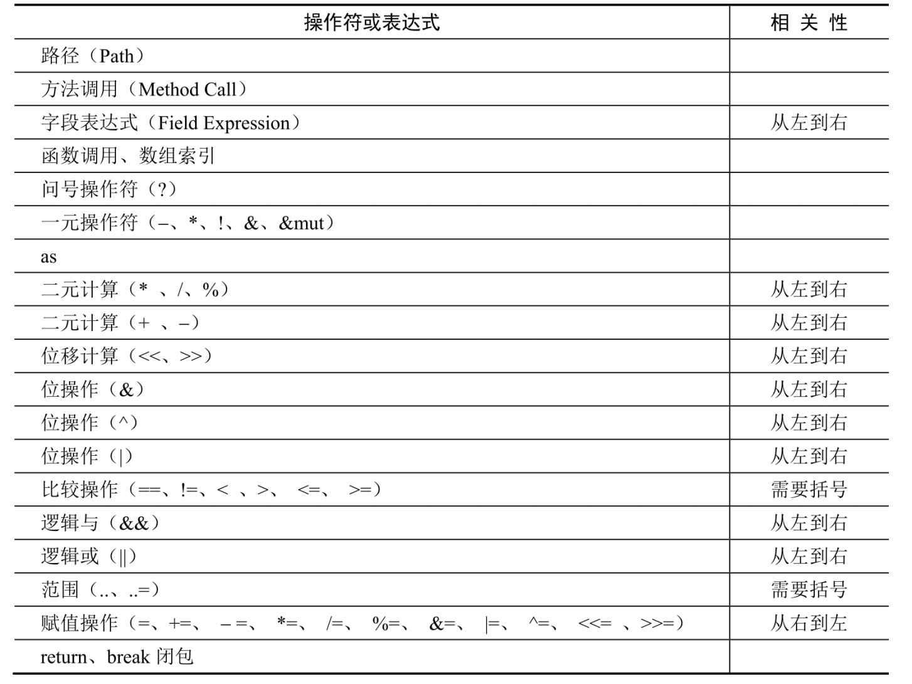{.u54410}
:::

## 2.13 注释与打印 {#text00008.html#Abdbf0046-f00c-46c1-9f22-d4216d2cc031 .title-left}

Rust是一门现代语言，这一点从注释方面也能体现出来。Rust文档的哲学是：**代码即文档，文档即代码** 。

所以Rust支持的注释种类比较丰富，介绍如下。

· 普通的注释。

➢ 使用**//** 对整行注释。

➢ 使用**/\*...\*/** 对区块注释。

· 文档注释，内部支持Markdown标记，也支持对文档中的示例代码进行测试，可以用rustdoc工具生成HTML文档。

➢ 使用**///** 注释可以生成库文档，一般用于函数或结构体的说明，置于说明对象的上方。

➢ 使用//！也可以生成库文档，一般用于说明整个模块的功能，置于模块文件的头部。

代码清单2-58展示了不同种类的注释。

**代码清单2-58：注释示例**

::: center
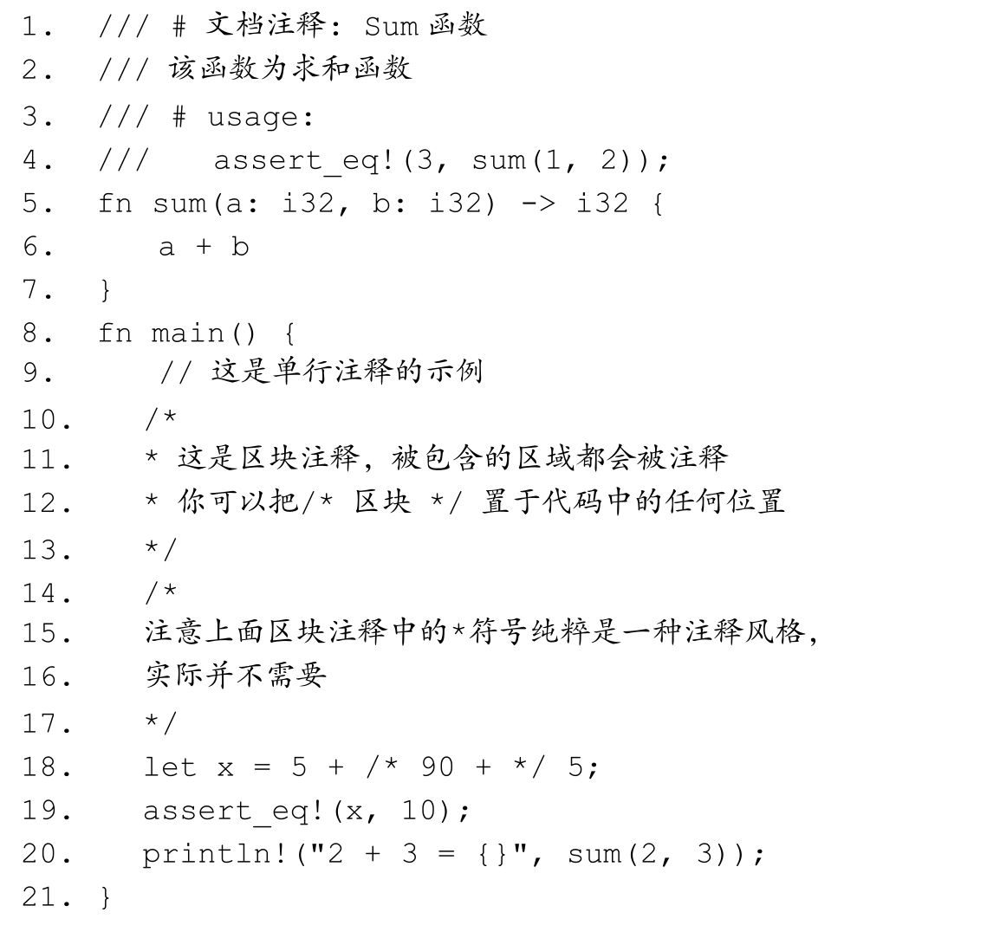{.u54409}
:::

代码清单2-58展示了文档注释和普通的注释。使用cargo doc命令可以将文档注释直接生成HTML格式的文档，普通的注释和其他语言中的注释没什么区别。

读者也可以参考本书的随书源码，其中大量使用了文档注释。另外Rust还支持文档测试，在第9章会详细介绍。

在日常开发中，我们经常会使用println！宏语句来进行格式化打印，这对于调试代码非常重要。println！宏中的格式化形式列表如下：

· nothing代表Display，比如println！（＂{}＂，2）。

·**？** 代表Debug，比如println！（＂{：？}＂，2）。

· **o** 代表八进制，比如println！（＂{：o}＂，2）。

· **x** 代表十六进制小写，比如println！（＂{：x}＂，2）。

· **X** 代表十六进制大写，比如println！（＂{：X}＂，2）。

· **p** 代表指针，比如println！（＂{：p}＂，2）。

· **b** 代表二进制，比如println！（＂{：b}＂，2）。

· **e** 代表指数小写，比如println！（＂{：e}＂，2）。

· **E** 代表指数大写，比如println！（＂{：E}＂，2）。

## 2.14 小结 {#text00008.html#A083b0048-8361-44ae-a371-8a144dcfb684 .title-left}

Rust 是一门表达式语言，Rust 中一切皆表达式。在 Rust 的学习中，掌握表达式的求值机制很重要。

本章首先介绍了Rust中表达式的分类和性质，从而帮助读者掌握Rust中表达式的求值机制。不管Rust有多少种表达式，它们都包含在此分类中，并符合这些性质。同时也介绍了什么是常量表达式和CTFE机制，以及Rust中的CTFE的发展方向。

其中值得注意的是，if流程控制在Rust中也是表达式，所以Rust不需要单独提供？：条件表达式。当处理一些Option类型的时候，可以用if let或while let表达式来简化代码。然后通过一些示例对循环表达式做了深入探讨，揭示了Rust编译期对while循环条件不进行求值的事实，这同样也是因为受到了CTFE功能的限制。所以如果需要使用无限循环，则要使用loop循环。

本章还依次介绍了Rust中的一些重要的语法要素，目的是让读者了解Rust的语法风格，通过对这些概念和示例的掌握，消除对Rust语言的陌生感，从而为后面的深入学习做好准备。

------------------------------------------------------------------------

[\[1\]](#text00008.html#n939C00332F5548738A747AF0AA59E7CAs){#text00008.html#n939C00332F5548738A747AF0AA59E7CA} 该特性在RFC1909中被描述。

[]{#text00009.html}

# 第3章 类型系统 {#text00009.html#A94bb2754-a86f-4838-8885-f163e89f33a0 .title-left}

本性决定行为，本性取决于行为。

众所周知，计算机以二进制的形式来存储信息。对于计算机而言，不管什么样的信息，都只是0和1的排列，所有的信息对计算机来说只不过是字节序列。作为开发人员，如果想要存储、表示和处理各种信息，直接使用0和1必然会产生巨大的心智负担，所以，类型应运而生。类型于20世纪50年代被FORTRAN语言引入，历经诸多高级语言的洗礼，其相关的理论和应用已经发展得非常成熟。直到现代，类型已经成为了各大编程语言的核心基础。

## 3.1 通用概念 {#text00009.html#Afa6f0049-0a2b-4377-9c2c-9acd37489509 .title-left}

所谓类型，其实就是对表示信息的值进行的细粒度的区分。比如整数、小数、文本等，粒度再细一点，就是布尔值、符号整型值、无符号整型值、单精度浮点数、双精度浮点数、字符和字符串，甚至还有各种自定义的类型。不同的类型占用的内存不同。与直接操作比特位相比，直接操作类型可以更安全、更有效地利用内存。例如，在Rust语言中，如果你创建一个u32类型的值，Rust会自动分配4个字节来存储该值。

计算机不只是用来存储信息的，它还需要处理信息。这就必然会面临一个问题：不同的类型该如何计算？因此需要对这些基本的类型定义一系列的组合、运算、转换等方法。如果把编程语言看作虚拟世界的话，那么类型就是构建这个世界的基本粒子，这些类型粒子通过各种组合、运算、转换等"物理化学反应"，造就了此世界中的各种"事物"。类型之间的纷繁复杂的交互形成了类型系统，类型系统是编程语言的基础和核心，因为编程语言的目的就是存储和处理信息。不同编程语言之间的区别就在于如何存储和处理信息。

其实在计算机科学中，对信息的存储和处理不止类型系统这一种方式，还有其他的一些理论框架，只不过类型系统是最轻量、最完善的一种方式。**在类型系统中，一切皆类型** 。**基于类型定义的一系列组合、运算和转换等方法，可以看作类型的行为** 。类型的行为决定了类型该如何计算，同时也是一种约束，有了这种约束才可以保证信息被正确处理。

### 3.1.1 类型系统的作用 {#text00009.html#Aad320049-ce3b-4f34-81fa-7abcf343778c .title-left}

类型系统是一门编程语言不可或缺的部分，它的优势有以下几个方面。

· **排查错误。** 很多编程语言都会在编译期或运行期进行类型检查，以排查违规行为，保证程序正确执行。如果程序中有类型不一致的情况，或有未定义的行为发生，则可能导致错误的产生。尤其是对于静态语言来说，能在编译期排查出错误是一个很大的优势，这样可以及早地处理问题，而不必等到运行后系统崩溃了再解决。

· **抽象。** 类型允许开发者在更高层面进行思考，这种抽象能力有助于强化编程规范和工程化系统。比如，面向对象语言中的类就可以作为一种类型。

· **文档。** 在阅读代码的时候，明确的类型声明可以表明程序的行为。

· **优化效率。** 这一点是针对静态编译语言来说的，在编译期可以通过类型检查来优化一些操作，节省运行时的时间。

· **类型安全。**

➢ **类型安全的语言可以避免类型间的无效计算** ，比如可以避免3/＂hello＂这样不符合算术运算规则的计算。

➢ **类型安全的语言还可以保证内存安全** ，避免诸如空指针、悬垂指针和缓存区溢出等导致的内存安全问题。

➢ **类型安全的语言也可以避免语义上的逻辑错误** ，比如以毫米为单位的数值和以厘米为单位的数值虽然都是以整数来存储的，但可以用不同的类型来区分，避免逻辑错误。

虽然类型系统有这么多优点，但并非所有的编程语言都能百分百拥有这些优点，这与它们的类型系统的具体设计和实现有关系。

### 3.1.2 类型系统的分类 {#text00009.html#A8579004a-7454-4a12-a64d-11a6e13c61cd .title-left}

在编译期进行类型检查的语言属于**静态类型** ，在运行期进行类型检查的语言属于**动态类型** 。如果一门语言不允许类型的自动隐式转换，在强制转换前不同类型无法进行计算，则该语言属于**强类型** ，反之则属于**弱类型** ^[\[1\]](#text00009.html#n553B9D8EA0044846A791CAAFC2270E74){#text00009.html#n553B9D8EA0044846A791CAAFC2270E74s}^ 。

**静态类型的语言能在编译期对代码进行静态分析，依靠的就是类型系统** 。我们以数组越界访问的问题为例来说明。有些静态语言，如C和C++，在编译期并不检查数组是否越界访问，运行时可能会得到难以意料的结果，而程序依旧正常运行，这属于类型系统中未定义的行为，所以它们不是类型安全的语言。而**Rust语言在编译期就能检查出数组是否越界访问** ，并给出警告，让开发者及时修改，如果开发者没有修改，那么在运行时也会抛出错误并退出线程，而不会因此去访问非法的内存，从而保证了运行时的内存安全，所以 **Rust 是类型安全的语言** 。强大的类型系统也可以对类型进行**自动推导** ，因此一些静态语言在编写代码的时候不用显式地指定具体的类型，比如 Haskell 就被称为隐式静态类型。Rust 语言的类型系统受Haskell启发，也可以自动推导，但不如Haskell强大。在Rust中大部分地方还是需要显式地指定类型的，类型是Rust语法的一部分，因此**Rust属于显式静态类型** 。

动态类型的语言只能在运行时进行类型检查，但是当有数组越界访问时，就会抛出异常，执行线程退出操作，而不是给出奇怪的结果。所以一些动态语言也是类型安全的，比如Ruby和Python语言。在其他语言中作为基本类型的整数、字符串、布尔值等，在Ruby和Python语言中都是对象。实际上，也可将对象看作类型，Ruby和Python语言在运行时通过一种名为Duck Typing的手段来进行运行时类型检查，以保证类型安全。在Ruby和Python语言中，对象之间通过消息进行通信，如果对象可以响应该消息，则说明该对象就是正确的类型。

对象是什么样的类型，决定了它有什么样的行为；反过来，对象在不同上下文中的行为，也决定了它的类型。这其实是一种**多态性** 。

### 3.1.3 类型系统与多态性 {#text00009.html#A4cbd004b-4c73-4335-94c6-669f6ddca6e9 .title-left}

如果一个类型系统允许一段代码在不同的上下文中具有不同的类型，这样的类型系统就叫作**多态类型系统** 。对于静态类型的语言来说，多态性的好处是可以在不影响类型丰富的前提下，为不同的类型编写通用的代码。

现代编程语言包含了三种多态形式：**参数化多态** （**Parametric polymorphism** ）、**Ad-hoc多态** （**Ad-hoc polymorphism** ）和**子类型多态** （**Subtype polymorphism** ）。如果按多态发生的时间来划分，又可分为**静多态** （**Static Polymorphism** ）和**动多态** （**Dynamic Polymorphism** ）。静多态发生在编译期，动多态发生在运行时。参数化多态和 Ad-hoc 多态一般是静多态，子类型多态一般是动多态。静多态牺牲灵活性获取性能，动多态牺牲性能获取灵活性。动多态在运行时需要查表，占用较多空间，所以一般情况下都使用静多态。Rust语言同时支持静多态和动多态，静多态就是一种零成本抽象。

**参数化多态实际就是指泛型** 。很多时候函数或数据类型都需要适用于多种类型，以避免大量的重复性工作。泛型使得语言极具表达力，同时也能保证静态类型安全。

**Ad-hoc多态也叫特定多态** 。Ad-hoc短语源自拉丁语系，用于表示一种特定情况。**Ad-hoc多态是指同一种行为定义，在不同的上下文中会响应不同的行为实现** 。Haskell 语言中使用Typeclass来支持Ad-hoc多态，Rust受Haskell启发，使用trait来支持Ad-hoc多态。所以，Rust的trait系统的概念类似于Haskell中的Typeclass。

子类型多态的概念一般用在面向对象语言中，尤其是Java语言。Java语言中的多态就是子类型多态，它代表一种包含关系，父类型的值包含了子类型的值，所以子类型的值有时也可以看作父类型的值，反之则不然。而 Rust语言中并没有类似Java 中的继承的概念，所以也不存在子类型多态。所以，**Rust中的类型系统目前只支持参数化多态和Ad-hoc多态，也就是，泛型和trait** 。

## 3.2 Rust类型系统概述 {#text00009.html#Aeac8004b-415b-4ec3-a957-d1c3bd5832d4 .title-left}

Rust是一门强类型且类型安全的静态语言。Rust中一切皆表达式，表达式皆有值，值皆有类型。所以可以说，**Rust中一切皆类型** 。

除了一些基本的原生类型和复合类型，Rust把作用域也纳入了类型系统，这就是第4章将要学到的生命周期标记。还有一些表达式，有时有返回值，有时没有返回值（也就是只返回单元值），或者有时返回正确的值，有时返回错误的值，Rust 将这类情况也纳入了类型系统，也就是Option＜T＞和Result＜T，E＞这样的可选类型，从而强制开发人员必须分别处理这两种情况。一些根本无法返回值的情况，比如线程崩溃、break或continue等行为，也都被纳入了类型系统，这种类型叫作never类型。可以说，Rust的类型系统基本囊括了编程中会遇到的各种情况，一般情况下不会有未定义的行为出现，所以说，Rust是类型安全的语言。

### 3.2.1 类型大小 {#text00009.html#Aec09004b-4ecb-486d-8ee5-8597c3111cc0 .title-left}

编程语言中不同的类型本质上是内存占用空间和编码方式的不同，Rust也不例外。Rust中没有GC，内存首先由编译器来分配，Rust代码被编译为LLVM IR，其中携带了内存分配的信息。**所以编译器需要事先知道类型的大小，才能分配合理的内存** 。

**可确定大小类型和动态大小类型**

Rust中绝大部分类型都是在**编译期可确定大小的类型（Sized Type）** ，比如原生整数类型u32固定是4个字节，u64固定是8个字节，等等，都是可以在编译期确定大小的类型。然而，Rust也有少量的**动态大小的类型（Dynamic Sized Type，DST）** ，比如str类型的字符串字面量，编译器不可能事先知道程序中会出现什么样的字符串，所以对于编译器来说，str类型的大小是无法确定的。对于这种情况，Rust提供了引用类型，因为引用总会有固定的且在编译期已知的大小。字符串切片&str就是一种引用类型，它由指针和长度信息组成，如图3-1所示。

::: center
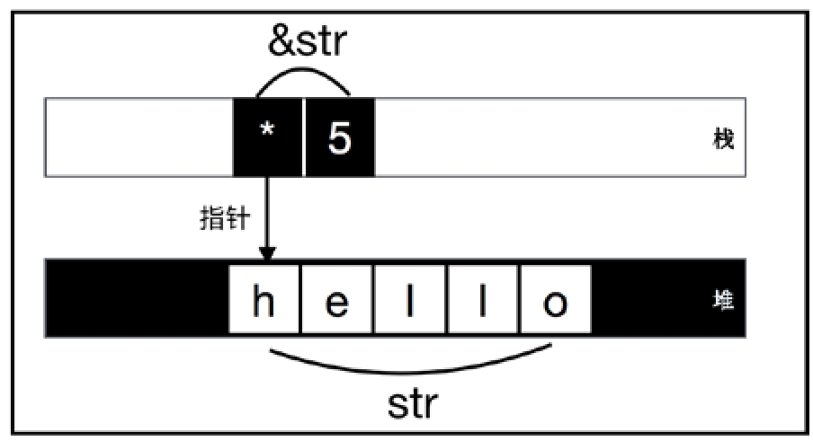{.u54408}

图3-1：&str由指针和长度信息组成
:::

&str存储于栈上，str字符串序列存储于堆上。这里的堆和栈是指不同的内存空间，在第4章会详细介绍。&str 由两部分组成：**指针** 和**长度信息** ，如代码清单3-1所示。其中指针是固定大小的，存储的是 str 字符串序列的起始地址，长度信息也是固定大小的整数。这样一来，&str就变成了可确定大小的类型，编译器就可以正确地为其分配栈内存空间，str也会在运行时在堆上开辟内存空间。

**代码清单3-1：&str的组成部分**

::: center
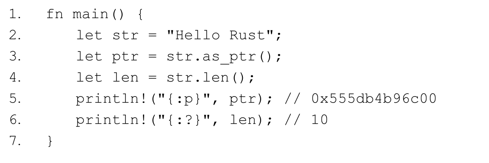{.u54407}
:::

代码清单3-1声明了字符串字面量str，通过as_ptr（）和len（）方法，可以分别获取该字符串字面量存储的地址和长度信息。这种包含了动态大小类型地址信息和携带了长度信息的指针，叫作**胖指针（Fat Pointer）** ，所以&str是一种胖指针。

与字符串切片同理，Rust中的数组\[T\]是动态大小类型，编译器难以确定它的大小。如代码清单3-2所示是将数组直接作为函数参数的情况。

**代码清单3-2：将数组直接作为函数参数**

::: center
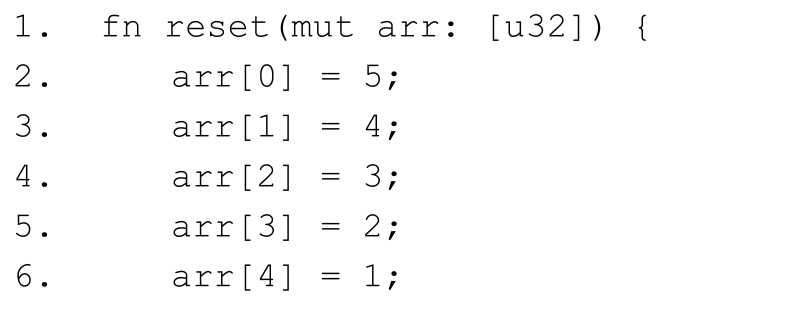{.u54406}
:::

::: center
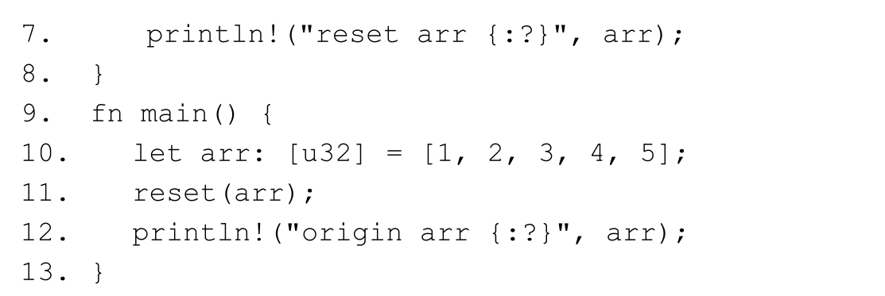{.u54405}
:::

代码清单3-2编译会报错：

::: center
{.u54404}
:::

意思是，编译器无法确定参数\[u32\]类型的大小。有两种方式可以修复此错误，第一种方式是使用\[u32；5\]类型，如代码清单3-3所示。

**代码清单3-3：函数参数使用\[u32；5\]类型**

::: center
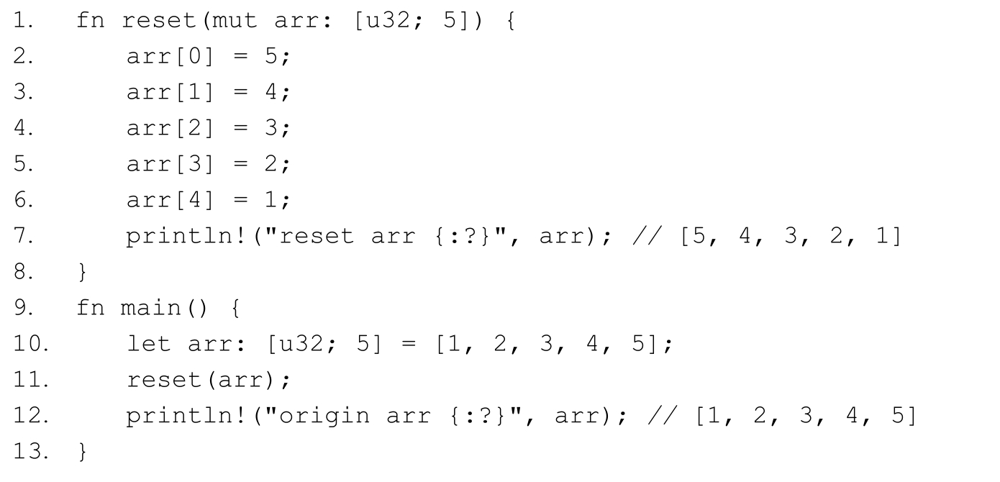{.u54403}
:::

代码清单3-3能够正常编译，从输出结果可以看出来，修改的数组并未影响原来的数组。这是因为u32类型是可复制的类型，实现了Copy trait，所以整个数组也是可复制的。所以当数组被传入函数中时就会被复制一份新的副本。这里值得注意的是，\[u32\]和\[u32；5\]是两种不同的类型。

另外一种解决代码清单 3-2 编译错误的方式是使用胖指针，类似&str，这里只需要将参数类型改为&mut \[u32\]即可。&mut \[u32\]是对\[u32\]数组的借用，会生成一个数组切片&\[u32\]，它会携带长度信息，如代码清单3-4所示。

**代码清单3-4：使用&mut \[u32\]作为参数类型**

::: center
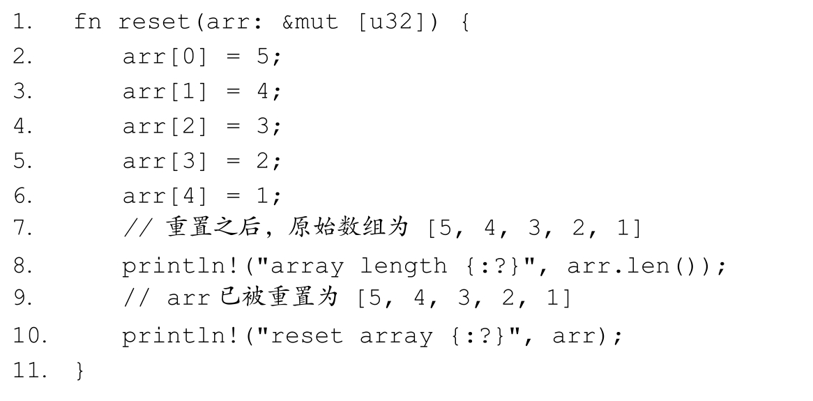{.u54402}
:::

::: center
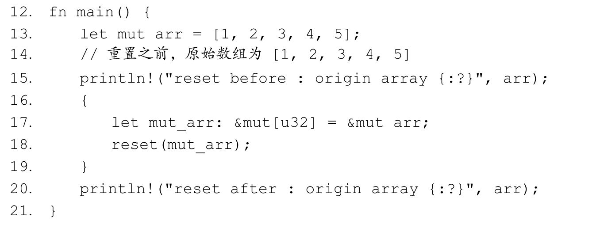{.u54401}
:::

代码清单 3-4 中使用了&mut \[u32\]，它是可变借用，&\[u32\]是不可变借用。因为这里要修改数组元素，所以使用可变借用。从输出的结果可以看出，胖指针&mut \[u32\]包含了长度信息。将引用当作函数参数，意味着被修改的是原数组，而不是最新的数组，所以原数组在reset之后也发生了改变。

代码清单3-5比较了&\[u32；5\]和&mut \[u32\]两种类型的空间占用情况。

**代码清单3-5：比较&\[u32；5\]和&mut \[u32\]两种类型的空间占用情况**

::: center
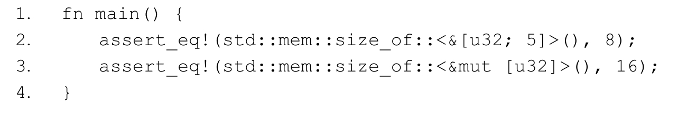{.u54400}
:::

代码清单3-5中的std：：mem：：size_of＜&\[u32；5\]＞（）函数可以返回类型的字节数。输出结果分别为8和16。&\[u32；5\]类型为普通指针，占8个字节；&mut \[u32\]类型为胖指针，占16个字节。可见，整整多出了一倍的占用空间，这也是称其为胖指针的原因。

**零大小类型**

除了可确定大小类型和DST类型，Rust还支持**零大小类型（Zero Sized Type，ZST）** ，比如单元类型和单元结构体，大小都是零。代码清单3-6展示了一组零大小的类型。

**代码清单3-6：一组零大小的类型示例**

::: center
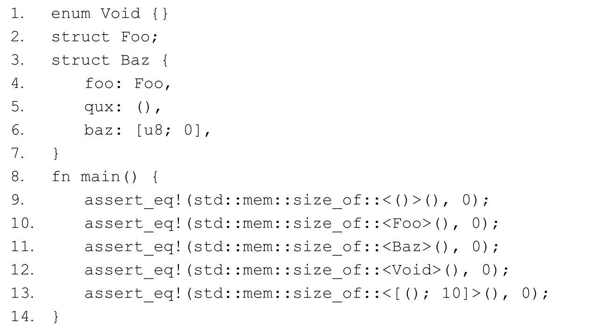{.u54399}
:::

代码清单3-6编译输出的类型大小均为零。所以，**单元类型和单元结构体大小为零，由单元类型组成的数组大小也为零。ZST类型的特点是，它们的值就是其本身，运行时并不占用内存空间。** ZST类型代表的意义正是"空"。

代码清单3-7展示了使用单元类型来查看数据类型的一个技巧。

**代码清单3-7：使用单元类型查看数据类型**

::: center
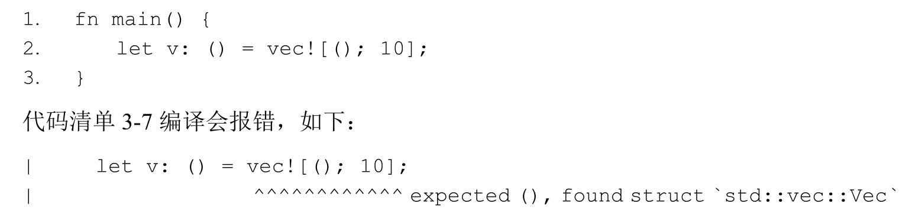{.u54398}
:::

编译器会提示：期望的是单元类型，这是因为代码里直接指定了单元类型，但是却发现了std：：vec：：Vec类型。这样我们就知道了右值vec！\[（）；10\]是向量类型。

代码清单3-8展示了一种迭代技巧，使用Vec＜（）＞迭代类型。

**代码清单3-8：使用Vec＜（）＞迭代类型**

::: center
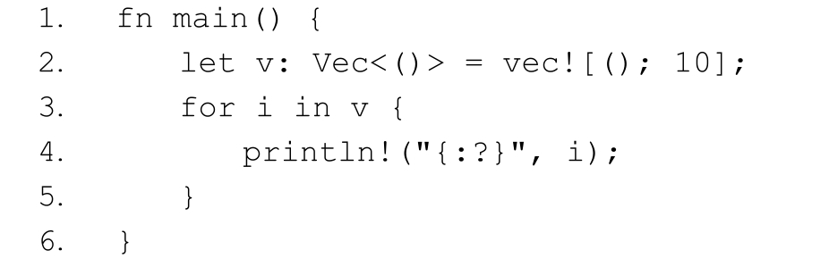{.u54397}
:::

在代码清单3-8中，使用了Vec＜（）＞类型，使用单元类型制造了一个长度为10的向量。在一些只需要迭代次数的场合中，使用这种方式能获得较高的性能。因为Vec内部迭代器中会针对ZST类型做一些优化。

另外一个使用单元类型的示例是在第2章中介绍过的Rust官方标准库中的HashSet＜T＞和BTreeSet＜T＞。它们其实只是把HashMap＜K，T＞换成了HashMap＜K，（）＞，然后就可以共用HashMap＜K，T＞之前的代码，而不需要再重新实现一遍HashSet＜T＞了。

**底类型**

底类型（Bottom Type）是源自类型理论的术语，它其实是第2章介绍过的never类型。它的特点是：

· 没有值。

· 是其他任意类型的子类型。

**如果说ZST类型表示"空"的话，那么底类型就表示"无"。** 底类型无值，而且它可以等价于任意类型，有点无中生有之意。

Rust中的**底类型用叹号（** ！**）** 表示。此类型也被称为Bang Type。Rust中有很多种情况确实没有值，但为了类型安全，必须把这些情况纳入类型系统进行统一处理。这些情况包括：

· **发散函数** （**Diverging Function** ）

· continue和break关键字

· loop循环

· **空枚举** ，比如enum Void{}

先来看前三种情况。发散函数是指会导致线程崩溃的 panic！（＂This function never returns！＂），或者用于退出函数的 std：：process：：exit，这类函数永远都不会有返回值。continue和break也是类似的，它们只是表示流程的跳转，并不会返回什么。loop循环虽然可以返回某个值，但也有需要无限循环的时候。

Rust中if语句是表达式，要求所有分支类型一致，但是有的时候，分支中可能包含了永远无法返回的情况，属于底类型的一种应用，如代码清单3-9所示。

**代码清单3-9：底类型的应用**

::: center
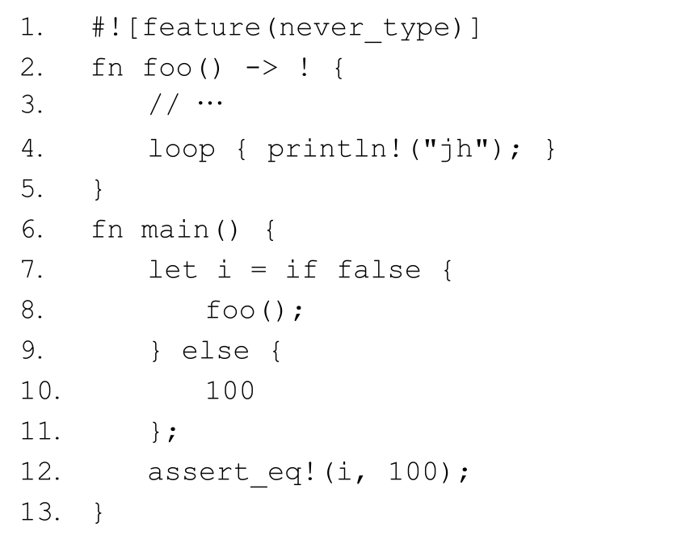{.u54396}
:::

代码清单3-9的if条件表达式中，foo函数返回！，而else表达式返回整数类型，但是编译可以正常通过，假如把else表达式中的整数类型换成字符串或其他类型，编译也可以通过。

空枚举，比如 enum Void{}，完全没有任何成员，因而无法对其进行变量绑定，不知道如何初始化并使用它，所以它也是底类型。代码清单3-10展示了空枚举的一种用法。

**代码清单3-10：空枚举的用法（编译无法通过，还在完善中）**

::: center
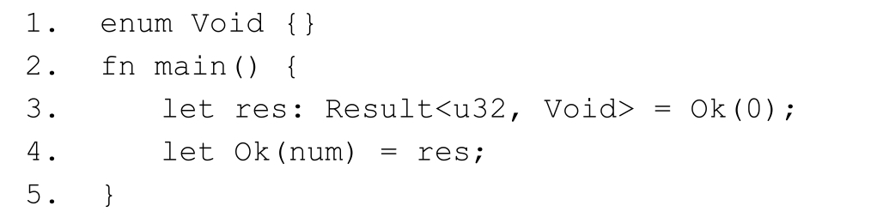{.u54395}
:::

Rust中使用Result类型来进行错误处理，强制开发者处理Ok和Err两种情况，但是有时可能永远没有Err，这时使用enum Void{}就可以避免处理Err的情况。当然这里也可以用if let语句处理，但是这里为了说明空枚举的用法故意这样使用。

但是可惜的是，当前版本的Rust还不支持上面的语法，编译会报错。不过Rust团队还在持续完善中，在不久的将来Rust就会支持此用法。

底类型将上述几种特殊情况纳入了类型系统，以便让Rust可以统一进行处理，从而保证了类型安全。

### 3.2.2 类型推导 {#text00009.html#Aaa400050-88a0-49fd-ba29-f811451b3074 .title-left}

类型标注在Rust中属于语法的一部分，所以Rust属于显式类型语言。Rust支持类型推断，但其功能并不像Haskell那样强大，**Rust只能在局部范围内进行类型推导** 。

代码清单3-11展示了Rust中的类型推导。

**代码清单3-11：类型推导**

::: center
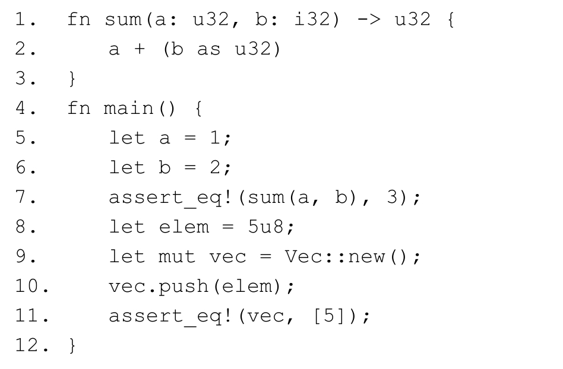{.u54394}
:::

在代码清单3-11中，第5行和第6行声明了两个变量a和b，并没有标注类型。但是传入sum函数中却可以正常运行，这代表Rust自动推导了a和b的类型。代码第8行声明了一个u8类型elem，第9行创建了一个空的向量，类型为Vec＜\_＞，可以通过代码清单3-7的方法来查看此类型。第10行用push方法将elem插入vec中，此时vec的类型为Vec＜u8＞。

**Turbofish操作符**

当Rust无法从上下文中自动推导出类型的时候，编译器会通过错误信息提示你，请求你添加类型标注，代码清单3-12展示了这种情况。

**代码清单3-12：Rust无法根据上下文自动推导出类型的情况**

::: center
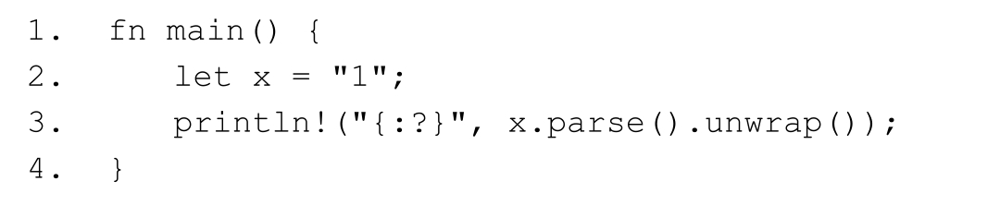{.u54393}
:::

编译代码清单3-12，会给出如下错误信息：

::: center
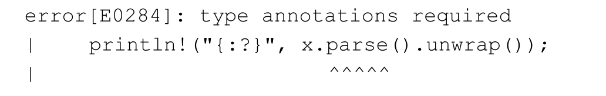{.u54392}
:::

代码清单3-12是想把字符串＂1＂转换为整数类型1，但是parse方法其实是一个泛型方法，当前无法自动推导类型，所以Rust编译器无法确定到底要转换成哪种类型的整数，是u32还是i32呢？毕竟Rust中整数类型很丰富。所以这里就需要直接给出明确的类型标注信息了，如代码清单3-13所示。

**代码清单3-13：添加明确的类型标注信息**

::: center
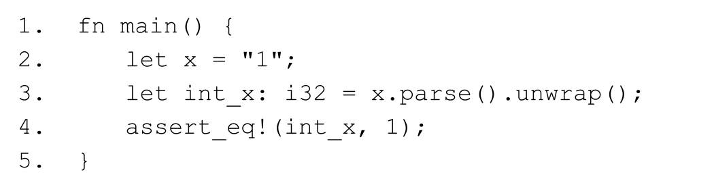{.u54391}
:::

Rust还提供了一种标注类型的方法，用于方便地在值表达式中直接标注类型，如代码清单3-14所示。

**代码清单3-14：另一种标注类型的方法**

::: center
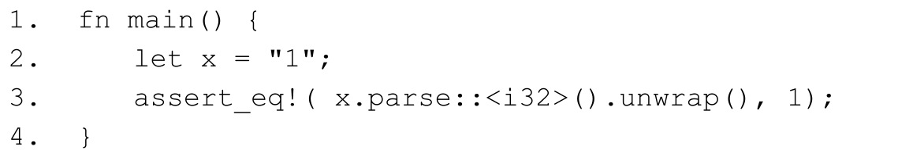{.u54390}
:::

在代码清单3-14中，使用了parse：：＜i32＞（）这样的形式为泛型函数标注类型，这就避免了代码清单3-13第3行的变量声明。很多时候并不需要声明太多变量，代码看上去也能更加紧凑。这种标注类型（**：：＜＞** ）的形式就叫作**turbofish操作符** 。

**类型推导的不足**

目前看来，Rust的类型推导还不够强大。代码清单3-15展示了另外一种类型推导的缺陷。

**代码清单3-15：类型推导缺陷**

::: center
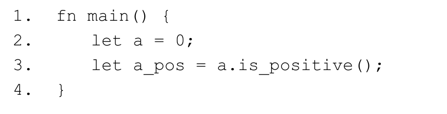{.u54389}
:::

代码清单3-15中的is_positive（）是整数类型实现的用于判断正负的方法。但是当前Rust编译时此代码会出现下面的错误：

error\[E0599\]:no method named\`is_positive\`found for type\`{integer}\`in the current scope

这里出现的**{integer}** 类型并非真实类型，它只是被用于错误信息中，表明此时编译器已经知道变量a是整数类型，但并未推导出变量a的真正类型，因为此时没有足够的上下文信息帮助编译器进行推导。所以在用Rust编程的时候，应尽量显式声明类型，这样可以避免一些麻烦。

## 3.3 泛型 {#text00009.html#Aabdf0052-ee35-47ef-ae71-0c500e528223 .title-left}

泛型（Generic）是一种参数化多态。使用泛型可以编写更为抽象的代码，减少工作量。简单来说，泛型就是把一个泛化的类型作为参数，单个类型就可以抽象化为一簇类型。在第2章中介绍过的Box＜T＞、Option＜T＞和Result＜T，E＞等，都是泛型类型。

### 3.3.1 泛型函数 {#text00009.html#A078c0052-2f73-4218-a3d8-a25be7a7a9f4 .title-left}

除了定义类型，泛型也可以应用于函数中，代码清单3-16就是一个泛型函数的示例。

**代码清单3-16：泛型函数**

::: center
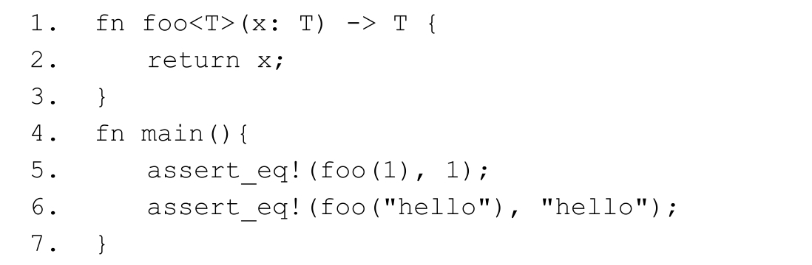{.u54388}
:::

也可以在结构体中使用泛型，如代码清单3-17所示。

**代码清单3-17：泛型结构体**

::: center
{.u54387}
:::

与枚举类型和函数一样，结构体名称旁边的＜T＞叫作**泛型声明** 。**泛型只有被声明之后才可以被使用** 。在为泛型结构体实现具体方法的时候，也需要声明泛型类型，如代码清单3-18所示。

**代码清单3-18：为泛型结构体实现具体方法**

::: center
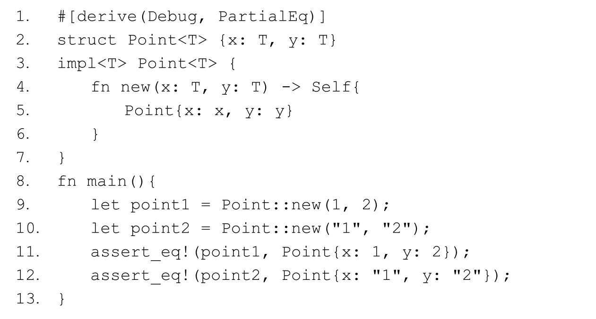{.u54386}
:::

注意看第3行代码中的impl＜T＞，此处必须声明泛型T。Rust标准库提供的各种容器类型大多是泛型类型。比如向量Vec＜T＞就是一个泛型结构体，代码清单3-19展示了其在Rust源码中的实现。

**代码清单3-19：标准库中的Vec＜T＞源码**

::: center
{.u54385}
:::

Rust中的泛型属于静多态，它是一种编译期多态。在编译期，不管是泛型枚举，还是泛型函数和泛型结构体，都会被**单态化（Monomorphization）** 。单态化是编译器进行静态分发的一种策略。以代码清单3-16中的泛型函数为例，**单态化意味着编译器要将一个泛型函数生成两个具体类型对应的函数** ，代码清单3-16等价于代码清单3-20。

**代码清单3-20：编译期单态化的泛型函数**

::: center
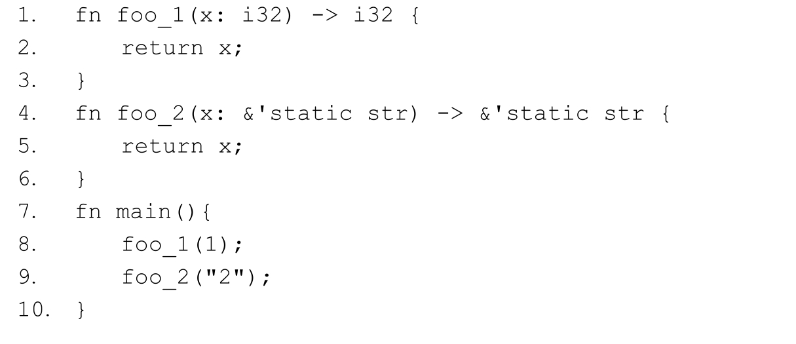{.u54384}
:::

泛型及单态化是Rust的最重要的两个功能。**单态化静态分发的好处是性能好，没有运行时开销；缺点是容易造成编译后生成的二进制文件膨胀** 。这个缺点并不影响使用Rust编程。但是需要明白单态化机制，在平时的编程中注意二进制的大小，如果变得太大，可以根据具体的情况重构代码来解决问题。

### 3.3.2 泛型返回值自动推导 {#text00009.html#A87000054-8733-4801-9986-35924b78445b .title-left}

编译器还可以对泛型进行自动推导。代码清单 3-21 展示了对泛型返回值类型的自动推导。

**代码清单3-21：泛型返回值类型的自动推导**

::: center
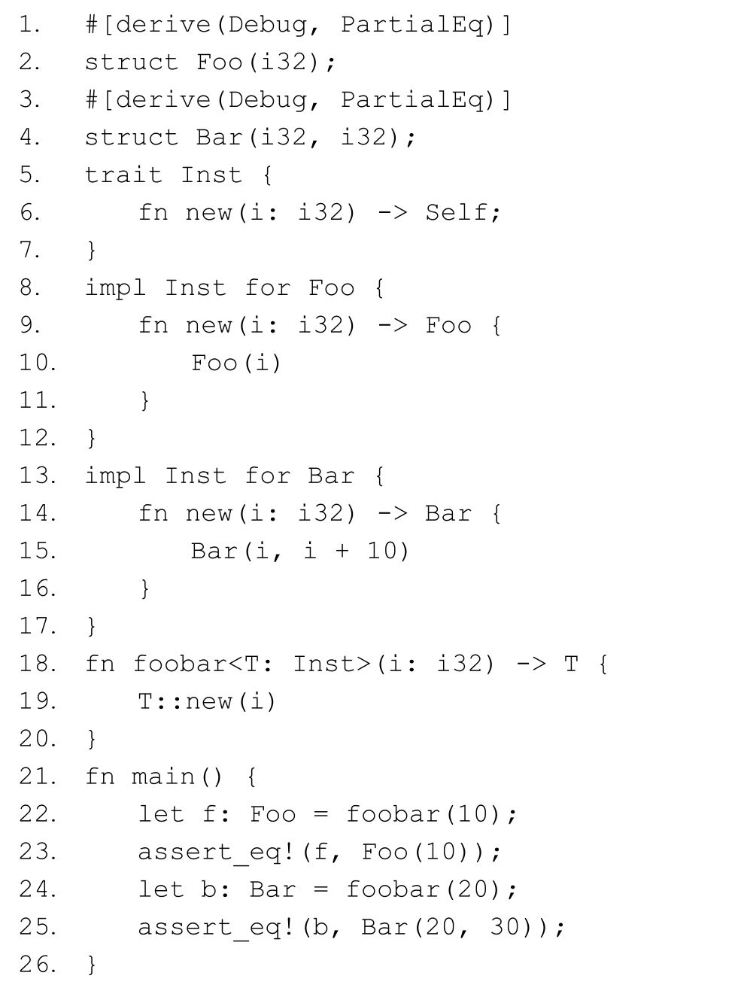{.u54383}
:::

代码清单3-21中定义了两个元组结构体Foo和Bar，分别为它们实现了Inst trait中定义的new方法。然后定义了泛型函数foobar，以及函数内调用泛型T的new方法。

代码第22行调用foobar函数，并指定其返回值的类型为Foo，那么Rust就会根据该类型自动推导出要调用Foo：：new方法。同理，代码第24行指定了foobar函数的返回值应该为Bar类型，那么Rust就自动推导出应该调用Bar：：new方法。这为日常的编程带来了足够的方便。

## 3.4 深入trait {#text00009.html#Ad6c10054-cf7b-4dd8-bfe6-57e5834d8fcc .title-left}

可以说trait是Rust的灵魂。Rust中所有的抽象，比如接口抽象、OOP范式抽象、函数式范式抽象等，均基于trait来完成。同时，trait也保证了这些抽象几乎都是运行时零开销的。

那么，到底什么是trait？从类型系统的角度来说，trait是Rust对Ad-hoc多态的支持。从语义上来说，trait是在行为上对类型的约束，这种约束可以让trait有如下4种用法：

· **接口抽象** 。接口是对类型行为的统一约束。

· **泛型约束** 。泛型的行为被trait限定在更有限的范围内。

· **抽象类型** 。在运行时作为一种间接的抽象类型去使用，动态地分发给具体的类型。

· **标签trait** 。对类型的约束，可以直接作为一种"标签"使用。

下面依次介绍trait的这4种用法。

### 3.4.1 接口抽象 {#text00009.html#A86e30055-0f2a-4e3a-8f10-b531b55e576c .title-left}

trait最基础的用法就是进行接口抽象，它有如下特点：

· 接口中可以定义方法，并支持默认实现。

· 接口中不能实现另一个接口，但是接口之间可以继承。

· 同一个接口可以同时被多个类型实现，但不能被同一个类型实现多次。

· 使用impl关键字为类型实现接口方法。

· 使用trait关键字来定义接口。

图3-2形象地展示了trait接口抽象。

::: center
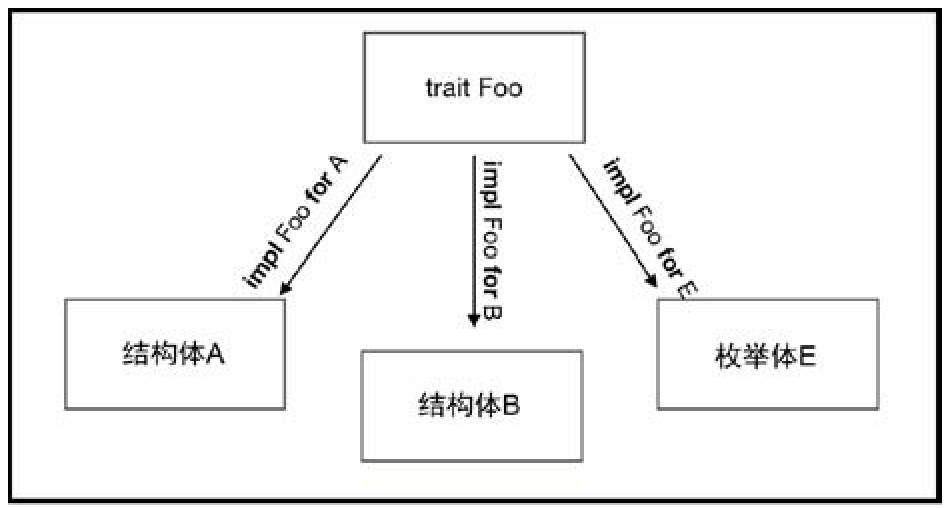{.u54382}

图3-2：trait作为接口抽象的形象表示
:::

在第2章的代码清单2-53中定义的Fly trait就是一个典型的接口抽象。类型Duck和Pig均实现了该trait，但具体的行为各不相同。**这正是一种 Ad-hoc 多态：同一个trait，在不同的上下文中实现的行为不同** 。为不同的类型实现 trait，属于一种**函数重载** ，也可以说函数重载就是一种Ad-hoc多态。

**关联类型**

事实上，Rust中的很多操作符都是基于trait来实现的。比如加法操作符就是一个trait，加法操作不仅可以针对整数、浮点数，也可以针对字符串。

那么如何对这个加法操作进行抽象呢？除了两个相加的值的类型，还有返回值类型，这三个类型不一定相同。我们首先能想到的一个方法就是结合泛型的trait，如代码清单3-22所示。

**代码清单3-22：利用泛型trait实现加法抽象**

::: center
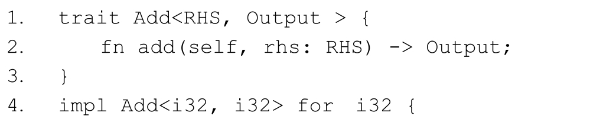{.u54381}
:::

::: center
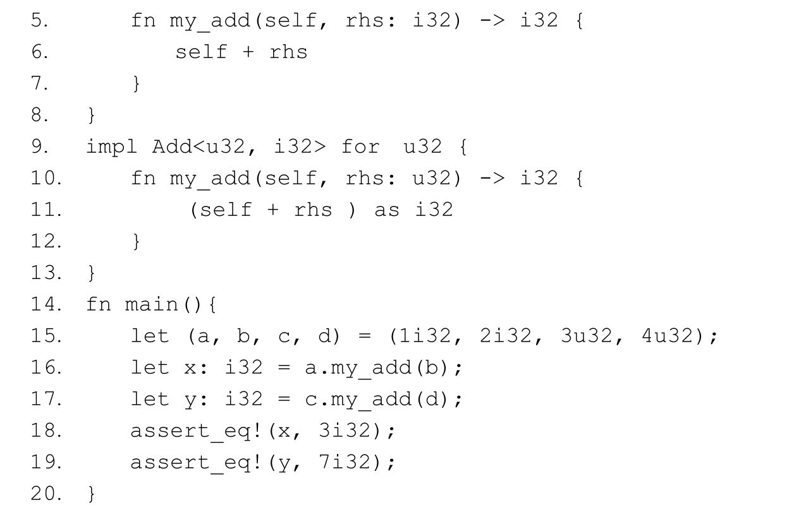{.u54380}
:::

代码清单3-22中定义了Add trait。它包含了两个类型参数：RHS和Output，分别代表加法操作符右侧的类型和返回值的类型。在该trait内定义的add方法签名中，以self为参数，代表实现该trait的类型。

接下来为i32和u32类型分别实现了Add trait。

代码第4行到第8行表示为i32类型实现Add，并且要求只能和i32类型相加，且返回值也是i32类型。

代码第9行到第13行表示为u32类型实现Add，并且要求只能和u32类型相加，但是返回值是i32类型。

然后在main函数中分别声明了i32和u32两组数字，分别让其相加，得到了预期的结果。

使用trait泛型来实现加法抽象，看上去好像没什么问题，但是仔细考虑一下，就会发现它有一个很大的问题。一般来说，对于加法操作要考虑以下两种情况：

· 基本数据类型，比如i32和i32类型相加，出于安全考虑，结果必然还是i32类型。

· 也可以对字符串进行加法操作，但是Rust中可以动态增加长度的只有String类型的字符串，所以一般是String类型的才会实现Add，其返回值也必须是String类型。但是加法操作符右侧也可以是字符串字面量。所以，面对这种情况，String 的加法操作还必须实现Add＜&str，String＞。

不管是以上两种情况中的哪一种，Add的第二个类型参数总是显得有点多余。所以，Rust标准库中定义的Add trait使用了另外一种写法。

代码清单3-23展示了Rust标准库中Add trait的定义。

**代码清单3-23：标准库Add trait的定义**

::: center
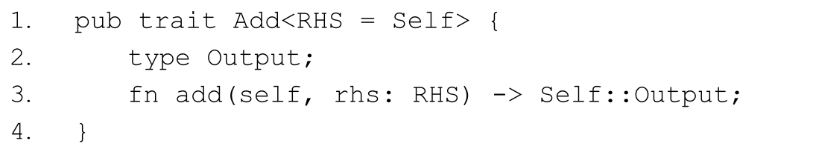{.u54379}
:::

代码清单3-23中同样使用了泛型trait，但是与代码清单3-22的区别在于，它将之前的第二个类型参数去掉了。取而代之的是type定义的Output，以这种方式定义的类型叫作**关联类型** 。而Add＜RHS=Self＞这种形式表示为类型参数RHS指定了默认值Self。Self是每个trait都带有的**隐式类型参数** ，代表实现当前trait的具体类型。

当代码中出现操作符"+"的时候，Rust就会自动调用操作符左侧的操作数对应的add（）方法，去完成具体的加法操作，也就是说"+"操作与调用add（）方法是等价的，如图3-3所示。

::: center
{.u54378}

图3-3："+"操作等价于调用add（）方法
:::

代码清单3-24展示了标准库中为u32类型实现Add trait来定义加法的源码，为了突出重点，这里删减了一些不必要的内容。

**代码清单3-24：标准库中为u32类型实现Add trait**

::: center
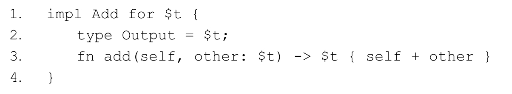{.u54377}
:::

因为Rust源码为u32实现Add trait的操作是用宏来完成的，所以代码清单3-24中出现了\$t这样的符号，在第12章会讲到关于宏的更多细节。当前这里的\$t可以看作u32类型，如代码清单3-25所示。

**代码清单3-25：可以将上面的\$t看作u32类型**

::: center
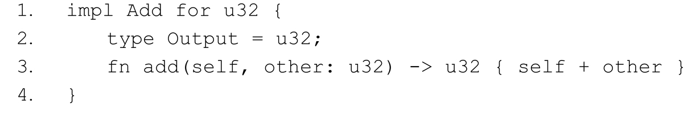{.u54376}
:::

这里的关联类型是u32，因为两个u32整数相加结果必然还是u32整数。如果实现Add trait时并未指明泛型参数的具体类型，则默认为Self类型，也就是u32类型。

除了整数，String类型的字符串也支持使用加号进行连接。代码清单3-26展示了为String类型实现Add trait的源码。同样，为了突出重点，我们进行了删减。

**代码清单3-26：标准库中为String类型实现Add trait**

::: center
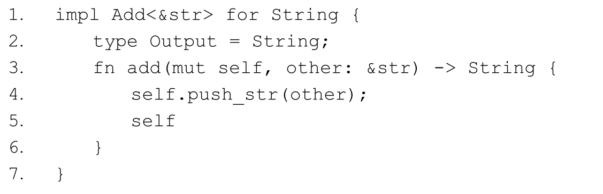{.u54375}
:::

代码清单3-26中的impl Add＜&str＞指明了泛型类型为&str，并没有使用Self默认类型参数，这表明对于String类型字符串来说，加号右侧的值类似&str类型，而非String类型。关联类型Output指定为String类型，意味着加法返回的是String类型。代码清单3-27展示了String字符串的加法运算。

**代码清单3-27：String类型字符串的加法运算**

::: center
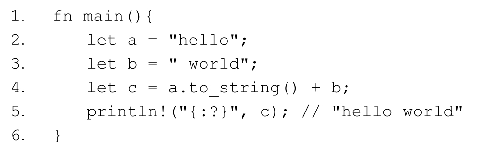{.u54374}
:::

在代码清单3-27中，变量a和b为&str类型，所以将二者相加时，必须将a转换为String类型。

综上所述，使用关联类型能够使代码变得更加精简，同时也对方法的输入和输出进行了很好的隔离，使得代码的可读性大大增强。**在语义层面上，使用关联类型也增强了trait表示行为的这种语义，因为它表示了和某个行为（trait）相关联的类型。在工程上，也体现出了高内聚的特点。**

**trait一致性**

既然Add是trait，那么就可以通过impl Add的功能来实现操作符重载的功能。在Rust中，通过上面对Add trait的分析就可以知道，u32和u64类型是不能直接相加的。代码清单3-28尝试重载整数的加法操作，实现u32和u64类型直接相加。

**代码清单3-28：尝试重载整数的加法操作**

::: center
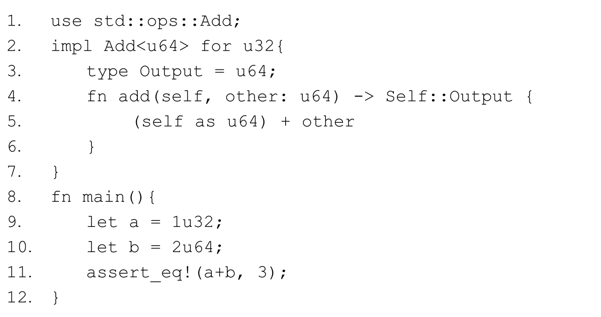{.u54373}
:::

代码清单3-28编译会出错：

::: center
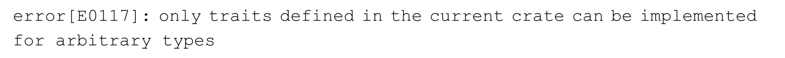{.u54372}
:::

这是因为Rust遵循一条重要的规则：**孤儿规则（Orphan Rule）** 。孤儿规则规定，**如果要实现某个trait，那么该trait和要实现该trait的那个类型至少有一个要在当前crate中定义** 。在代码清单3-28中，Add trait和u32、u64都不是在当前crate中定义的，而是定义于标准库中的。如果没有孤儿规则的限制，标准库中u32类型的加法行为就会被破坏性地改写，导致所有使用u32类型的crate可能产生难以预料的Bug。

因此，要想正常编译通过，就需要把Add trait放到当前crate中来定义，如代码清单3-29所示。

**代码清单3-29：在当前crate中定义Add trait**

::: center
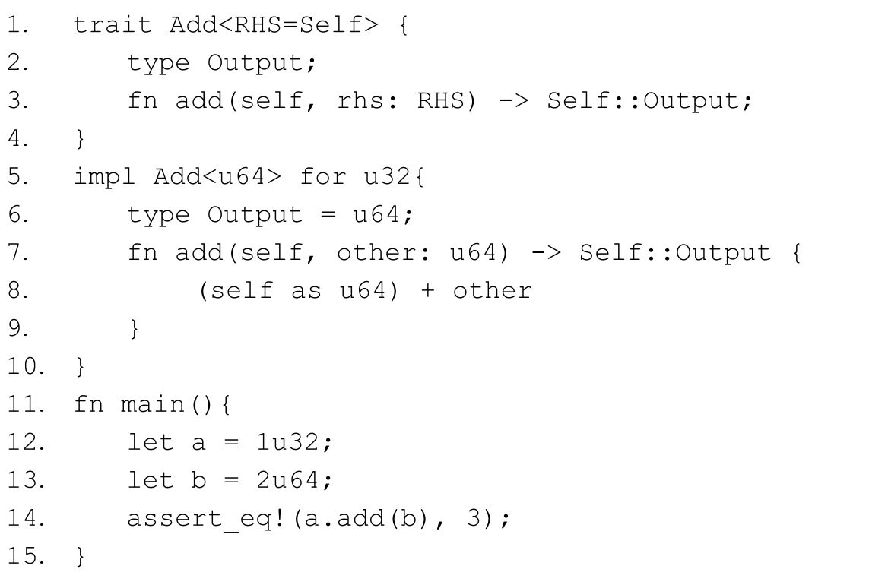{.u54371}
:::

代码清单3-29在当前crate中定义了Add trait，这样就不会违反孤儿规则。并且在impl Add的时候，将RHS和关联类型指定为u64类型。注意在调用的时候要用add，而非操作符+，以避免被Rust识别为标准库中的add实现。这样就可以正常编译通过了。

当然，除了在本地定义Add trait这个方法，还可以在本地创建一个新的类型，然后为此新类型实现Add，这同样不会违反孤儿规则，如代码清单3-30所示。

**代码清单3-30：为新类型实现Add操作**

::: center
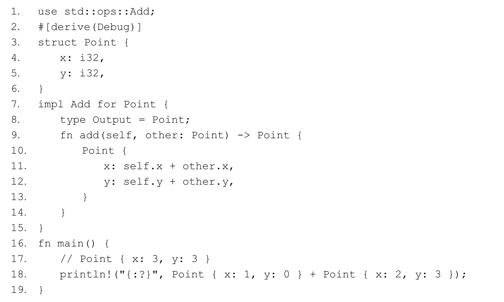{.u54370}
:::

还需要注意，**关联类型Output必须指定具体类型** 。函数add的返回类型可以写Point，也可以写Self，也可以写Self：：Output。

**trait继承**

Rust不支持传统面向对象的继承，但是**支持trait继承** 。子trait可以继承父trait中定义或实现的方法。在日常编程中，trait中定义的一些行为可能会有重复的情况，使用trait继承可以简化编程，方便组合，让代码更加优美。

接下来以Web编程中常见的分页为例，来说明trait继承的一些应用场景。代码清单3-31以分页为例展示了如何定义trait。

**代码清单3-31：以分页为例定义trait**

::: center
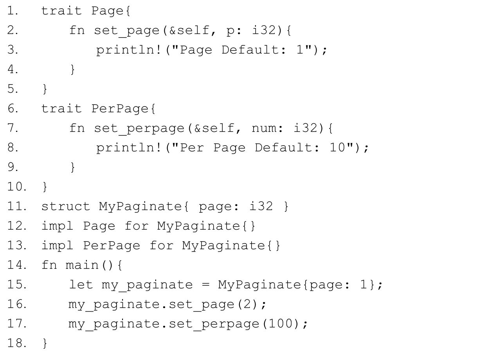{.u54369}
:::

代码清单3-31中定义了Page和PerPage两个trait，分别代表当前页面的页码和每页显示的条目数。并且分别实现了两个默认方法：set_page 和 set_perpage，分别用于设置当前页面页码和每页显示条目数，默认值被设置为了第1页和每页显示10个条目。

代码第11行定义了MyPaginate结构体。

代码第12行和第13行分别为MyPaginate实现了Page和PerPage，使用空的impl块代表使用trait的默认实现。

在代码第14行到第18行的main函数中，创建了MyPaginate的一个实例my_paginate，并分别调用set_page和set_perpage方法，输出结果为默认值。

假如此时需要多加一个功能，要求可以设置直接跳转的页面页码，为了不影响之前的代码，可以使用trait继承来实现，如代码清单3-32所示。

**代码清单3-32：使用trait继承扩展功能**

::: center
{.u54368}
:::

代码清单3-32中定义了Paginate，并使用冒号代表继承其他trait。代码中Page+PerPage表示Paginate同时继承了Page和PerPage这两个trait。总体来说，trait名后面的冒号代表trait继承，其后跟随要继承的父trait名称，如果是多个trait则用加号相连。

代码第6行为泛型T实现了Paginate，并且包括空的impl块。整行代码的意思是，为所有拥有Page和PerPage行为的类型实现Paginate。

然后就可以使用set_skip_page方法了，如代码清单3-33所示。

**代码清单3-33：调用set_skip_page方法**

::: center
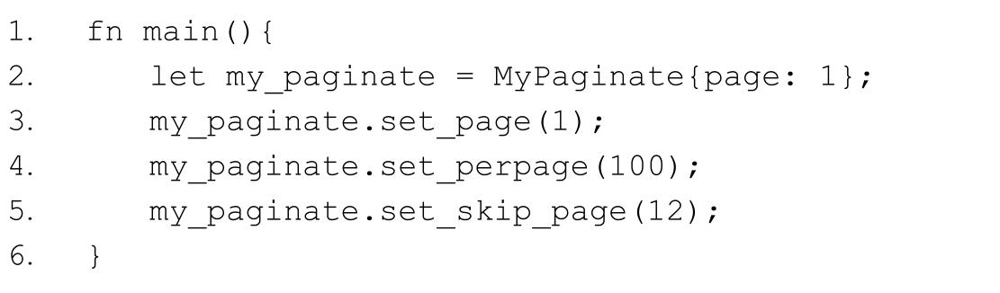{.u54367}
:::

在代码清单 3-33 中，我们直接调用了 set_skip_page 方法，而不会影响之前的代码。另外，trait继承也可以用于扩展标准库中的方法。

### 3.4.2 泛型约束 {#text00009.html#A293e005b-8a83-4b12-ab0a-5c84a09676d6 .title-left}

使用泛型编程时，很多情况下的行为并不是针对所有类型都实现的，代码清单3-34所示的泛型求和函数就是这样一个例子。

**代码清单3-34：泛型求和函数**

::: center
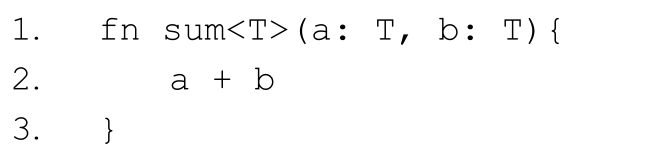{.u54366}
:::

想象一下，如果向代码清单 3-34 的 sum 函数中传入的参数是两个整数，那么加法行为是合法的。如果传入的参数是两个字符串，理论上也应该是合法的，加法行为可以是字符串相连。但是假如传入的两个参数是整数和字符串，或者整数和布尔值，意义就不太明确了，有可能引起程序崩溃。

那么，如何修正呢？答案是，用trait作为泛型的约束。

**trait限定**

对于代码清单3-34中的求和函数来说，只要两个参数是可相加的类型就可以，如代码清单3-35所示。

**代码清单3-35：修正泛型求和函数**

::: center
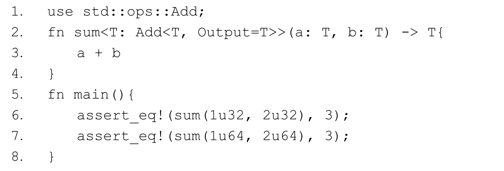{.u54365}
:::

在代码清单3-35中，我们使用＜T：Add＜T，Output=T＞＞对泛型进行了约束，表示sum函数的参数必须实现Add trait，并且加号两边的类型必须一致。这里值得注意的是，对泛型约束的时候，Add＜T，Output=T＞通过类型参数确定了关联类型Output也是T，也可以省略类型参数T，直接写为Add＜Output=T＞。

如果该sum函数传入两个String类型参数，就会报错。因为String字符串相加时，右边的值必须是&str类型。所以不满足此sum函数中Add trait的约束。

使用**trait** 对泛型进行约束，叫作**trait限定** （**trait Bound** ）。格式如下：

::: center
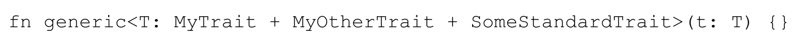{.u54364}
:::

该泛型函数签名要表达的意思是：需要一个类型 T，并且该类型 T 必须实现 MyTrait、MyOtherTrait和SomeStandardTrait中定义的全部方法，才能使用该泛型函数。

**理解trait限定**

trait限定的思想与Java中的泛型限定、Ruby和Python中的**Duck Typing** 、Golang中的**Structural Typing** 、Elixir和Clojure中的**Protocol** 都很相似。所以有编写这些编程语言经验的开发者看到trait限定会觉得很熟悉。在类型理论中，Structural Typing是一种根据结构来判断类型是否等价的理论，翻译过来为结构化类型。Duck Typing、Protocol都是Structural Typing的变种，一般用于动态语言，在运行时检测类型是否等价。Rust中的trait限定也是Structural Typing的一种实现，可以看作一种**静态Duck Typing** 。

从**数学角度** 来理解trait限定可能更加直观。**类型可以看作具有相同属性值的集合** 。当声明变量let x：u32时，意味着x∈u32，也就是说，x属于u32集合。可以再来回顾一下代码清单3-32中声明的trait：

::: center
{.u54363}
:::

**trait 也是一种类型，是一种方法集合，或者说，是一种行为的集合** 。它的意思是，Paginate⊂（Page∩Perpage），Paginate集合是Page和Perpage交集的子集，如图3-4所示。

::: center
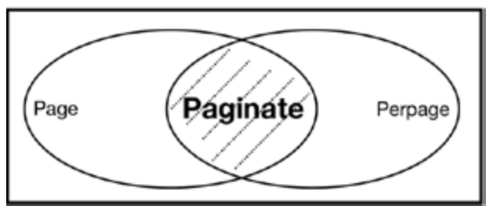{.u54362}

图3-4：Paginate集合包含于Page和Perpage集合的交集中
:::

由此可以得出，Rust中冒号代表集合的"包含于"关系，而加号则代表交集。所以下面这种写法：

::: center
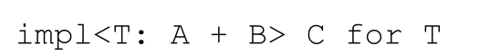{.u54361}
:::

可以解释为"为所有T⊂（A∩B）实现Trait C"，如图3-5所示。

::: center
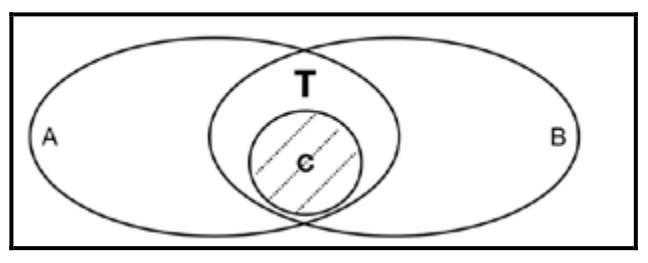{.u54360}

图3-5：为所有T⊂（A∩B）实现Trait C
:::

**Rust编程的哲学是组合优于继承** ，Rust并不提供类型层面上的继承，Rust中所有的类型都是独立存在的，所以Rust中的类型可以看作语言允许的最小集合，不能再包含其他子集。而trait限定可以对这些类型集合进行组合，也就是求交集。

总的来说，trait 限定给予了开发者更大的自由度，因为不再需要类型间的继承，也简化了编译器的检查操作。包含trait限定的泛型属于静态分发，在编译期通过单态化分别生成具体类型的实例，所以调用trait限定中的方法也都是运行时零成本的，因为不需要在运行时再进行方法查找。

如果为泛型增加比较多的trait限定，代码可能会变得不太易读，比如下面这种写法：

::: center
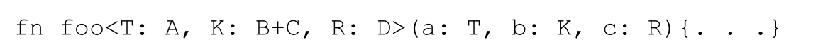{.u54359}
:::

Rust提供了**where关键字** ，用来对这种情况进行重构：

::: center
{.u54358}
:::

这样重构之后，代码的可读性就提高了。

### 3.4.3 抽象类型 {#text00009.html#A6cde005d-99e2-4a05-89bd-11d2c3efb2d6 .title-left}

trait还可以用作**抽象类型** （**Abstract Type** ）。抽象类型属于类型系统的一种，也叫作**存在类型** （**Existential Type** ）。相对于具体类型而言，抽象类型无法直接实例化，它的每个实例都是具体类型的实例。

对于抽象类型而言，编译器可能无法确定其确切的功能和所占的空间大小。所以 Rust目前有两种方法来处理抽象类型：**trait对象** 和**impl Trait** 。

**trait对象**

在泛型中使用trait限定，可以将任意类型的范围根据类型的行为限定到更精确可控的范围内。从这个角度出发，也可以将共同拥有相同行为的类型集合抽象为一个类型，这就是trait**对象（trait Object）** 。"对象"这个词来自面向对象编程语言，因为trait对象是对具有相同行为的一组具体类型的抽象，等价于面向对象中一个封装了行为的对象，所以称其为trait对象。

代码清单3-36对比了trait限定和trait对象的用法。

**代码清单3-36：trait限定和trait对象的用法比较**

::: center
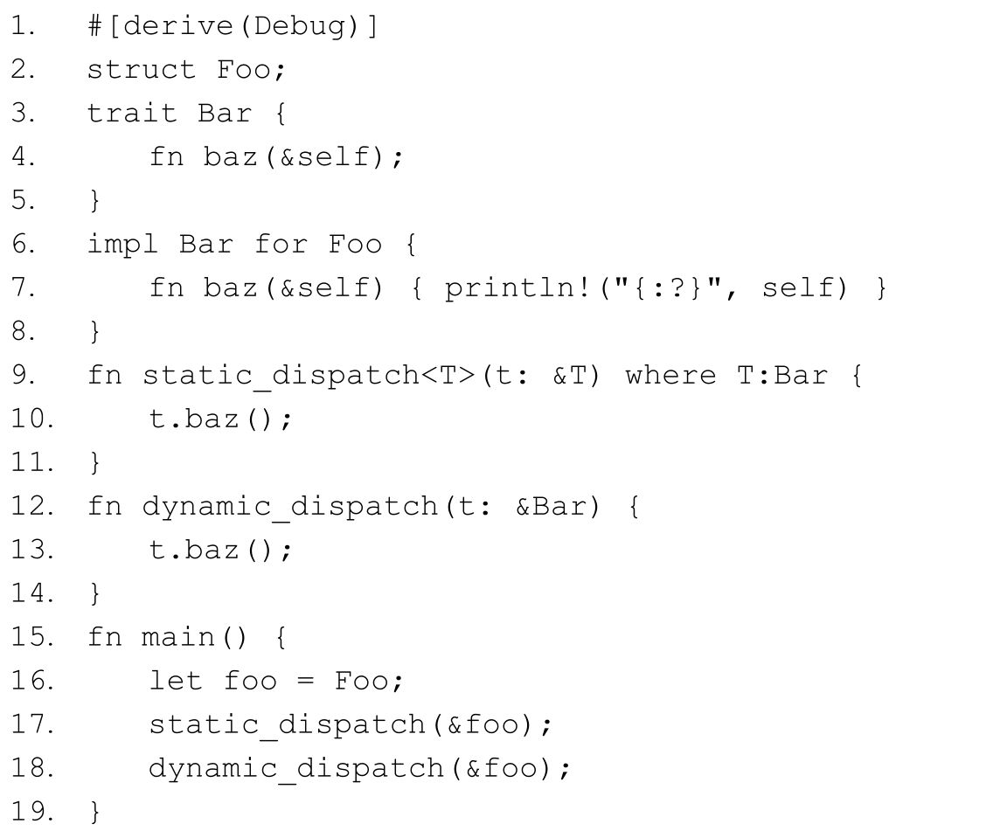{.u54357}
:::

代码清单3-36中定义了结构体Foo和Bar trait，并且为Foo实现了Bar。

代码第9行到第14行分别定义了带trait限定的泛型函数staitc_dispatch和使用trait对象的dynamic_dispatch函数。

代码第15行到第19行分别调用了static_dispatch和dynamic_dispatch函数。static_dispatch是属于静态分发的，参数 t 之所以能调用 baz 方法，是因为 Foo 类型实现了 Bar。dynamic_dispatch是属于动态分发的，参数t标注的类型&Bar是trait对象。那么，什么是动态分发呢？它的工作机制是怎样的呢？

trait本身也是一种类型，但它的类型大小在编译期是无法确定的，所以trait对象必须使用指针。可以利用引用操作符&或 Box＜T＞来制造一个 trait 对象。trait 对象等价于代码清单3-37所示的结构体。

**代码清单3-37：等价于trait对象的结构体**

::: center
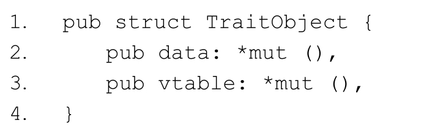{.u54356}
:::

代码清单3-37的结构体TraitObject来自Rust标准库，但它并不能代表真正的trait对象，它仅仅用于操作底层的一些 Unsafe 代码。这里使用该结构体只是为了用它来帮助理解 trait对象的行为。

**TraitObject** 包括两个指针：**data指针** 和**vtable指针** 。以impl MyTrait for T为例，data指针指向 trait 对象保存的类型数据 T，vtable 指针指向包含为 T 实现的 MyTrait 的 Vtable （Virtual Table），该名称来源于C++，所以可以称之为**虚表** 。虚表的本质是一个结构体，包含了析构函数、大小、对齐和方法等信息。TraitObject的结构如图3-6所示。

::: center
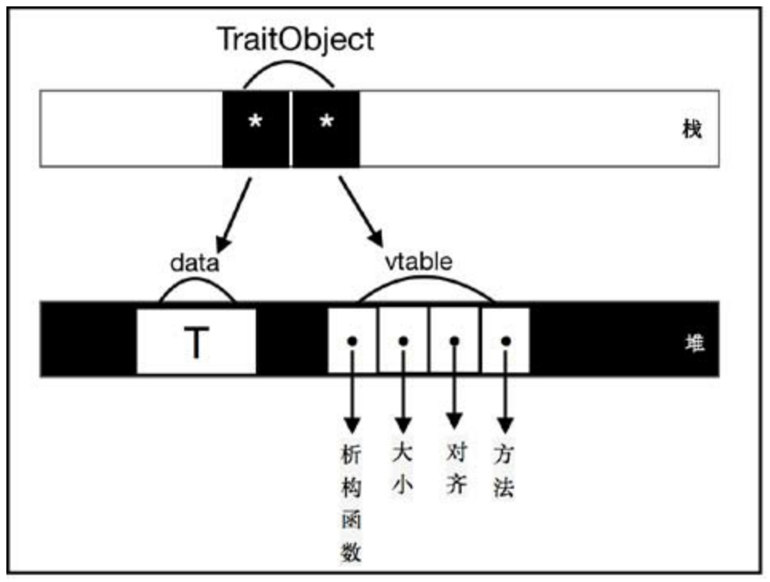{.u54355}

图3-6：TraitObject结构示意
:::

在编译期，编译器只知道TraitObject包含指针的信息，并且指针的大小也是确定的，并不知道要调用哪个方法。在运行期，当有trait_object.method（）方法被调用时，**TraitObject会根据虚表指针从虚表中查出正确的指针，然后再进行动态调用** 。这也是将trait对象称为动态分发的原因。

所以，当代码清单 3-36 中的 dynamic_dispatch（&foo）函数在运行期被调用时，会先去查虚表，取出相应的方法t.baz（），然后调用。

讲到trait对象时，我们需要特别讲一下对象安全的问题。

并不是每个trait都可以作为trait对象被使用，这依旧和类型大小是否确定有关系。每个trait都包含一个隐式的类型参数Self，代表实现该trait的类型。Self默认有一个隐式的trait限定？Sized，形如＜Self：？Sized＞，？Sized trait 包括了所有的动态大小类型和所有可确定大小的类型。Rust 中大部分类型都默认是可确定大小的类型，也就是＜T：Sized＞，这也是泛型代码可以正常编译的原因。

当trait对象在运行期进行动态分发时，也必须确定大小，否则无法为其正确分配内存空间。所以必须同时满足以下两条规则的trait才可以作为trait对象使用。

· trait的Self类型参数不能被限定为Sized。

· trait中所有的方法都必须是对象安全的。

满足这两条规则的trait就是对象安全的trait。那么，什么是对象安全呢？

trait的Self类型参数绝大部分情况默认是**？Sized** ，但也有可能出现被限定为Sized的情况，如代码清单3-38所示。

**代码清单3-38：标记为Sized的trait**

::: center
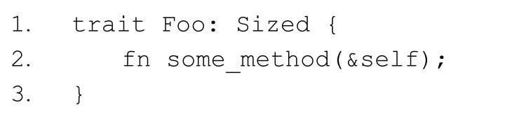{.u54354}
:::

代码清单3-38中的Foo继承自Sized，这表明，要为某类型实现Foo，必须先实现Sized。所以，Foo中的隐式Self也必然是Sized的，因为Self代表的是那些要实现Foo的类型。

按规则一，Foo不是对象安全的。trait对象本身是动态分发的，编译期根本无法确定Self具体是哪个类型，因为不知道给哪些类型实现过该trait，更无法确定其大小，现在又要求Self是可确定大小的，这就造就了图3-7所示的**薛定谔的类型** ：既能确定大小又不确定大小。

::: center
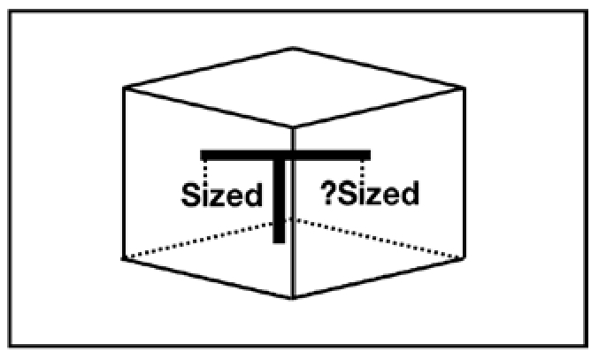{.u54353}

图3-7：薛定谔的类型
:::

当把trait当作对象使用时，其内部类型就默认为Unsize类型，也就是动态大小类型，只是将其置于编译期可确定大小的胖指针背后，以供运行时动态调用。对象安全的本质就是为了让trait对象可以安全地调用相应的方法。如果给trait加上Self：Sized限定，那么在动态调用trait对象的过程中，如果碰到了Unsize类型，在调用相应方法时，可能引发段错误。所以，就无法将其作为trait对象。反过来，当不希望trait作为trait对象时，可以使用Self：Sized进行限定。

而对象安全的方法必须满足以下三点之一。

· 方法受**Self：Sized** 约束。

· 方法签名同时满足以下三点。

➢ 必须不包含任何泛型参数。如果包含泛型，**trait** 对象在**虚表** （**Vtable** ）中查找方法时将不确定该调用哪个方法。

➢ **第一个参数必须为 Self 类型或可以解引用为 Self 的类型** （也就是说，必须有接收者，比如self、&self、&mut self和self：Box＜Self＞，没有接收者的方法对trait对象来说毫无意义）。

➢ Self不能出现在除第一个参数之外的地方，包括返回值中。这是因为如果出现Self，那就意味着Self和self、&self或&mut self的类型相匹配。但是对于trait对象来说，根本无法做到保证类型匹配，因此，这种情况下的方法是对象不安全的。

这三点可以总结为一句话：**没有额外Self类型参数的非泛型成员方法。**

· trait中不能包含关联常量（Associated Constant）。在Rust 2018版本中，trait中可以增加默认的关联常量，其定义方法和关联类型差不多，只不过需要使用const关键字。

代码清单3-39展示了一个标准的对象安全的trait。

**代码清单3-39：标准的对象安全的trait**

::: center
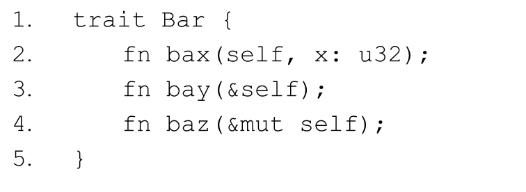{.u54352}
:::

代码清单3-39满足对象安全trait的规则，所以它是对象安全的。trait Bar不受Sized限定，trait方法都是没有额外Self类型参数的非泛型成员方法。代码清单3-40展示了典型的对象不安全的trait。

**代码清单3-40：典型的对象不安全的trait**

::: center
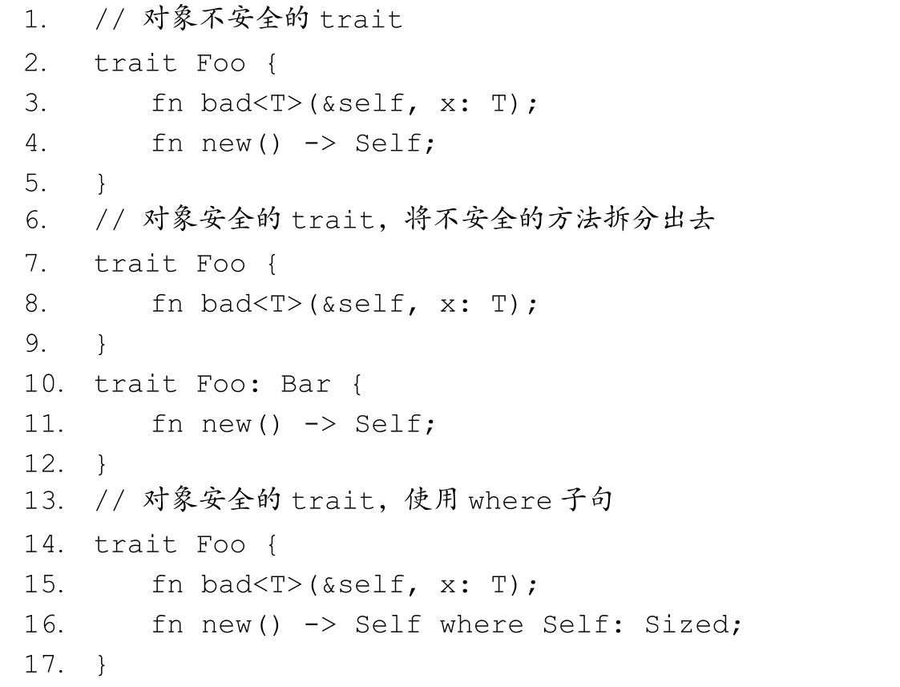{.u54351}
:::

在代码清单3-40中，代码第2行到第5行定义的trait Foo显然违反了对象安全trait方法的规则，所以它不能被作为trait对象使用。但是如果想继续把该trait作为对象使用，可以将此trait分离为两个trait，如代码第7行到第12行所示，将对象不安全的方法摘到另一个Bar trait中。但是这种方法比较烦琐。最好的办法是使用where子句，如代码第14行到第16行所示，在new方法签名后面使用where子句，增加Self：Sized限定，则trait Foo又成为了一个对象安全的trait。只不过在trait Foo作为trait对象且有**？Sized** 限定时，不允许调用该new方法。**impl Trait**

在**Rust 2018** 版本中，引入了可以**静态分发的抽象类型impl Trait** 。如果说**trait对象** 是**装箱抽象类型（Boxed Abstract Type）** 的话，那么**impl Trait** 就是**拆箱抽象类型（Unboxed Abstract Type）** 。"装箱"和"拆箱"是业界的抽象俗语，其中"装箱"代表将值托管到堆内存，而"拆箱"则是在栈内存中生成新的值，更详细的内容会在第4章中描述。总之，装箱抽象类型代表动态分发，拆箱抽象类型代表静态分发。

**目前impl Trait只可以在输入的参数和返回值这两个位置使用** ，在不远的将来，还会拓展到其他位置，比如let定义、关联类型等。

接下来使用impl Trait语法重构第2章的代码清单2-53，如代码清单3-41所示。

**代码清单3-41：使用impl Trait语法重构第2章的代码清单2-53**

::: center
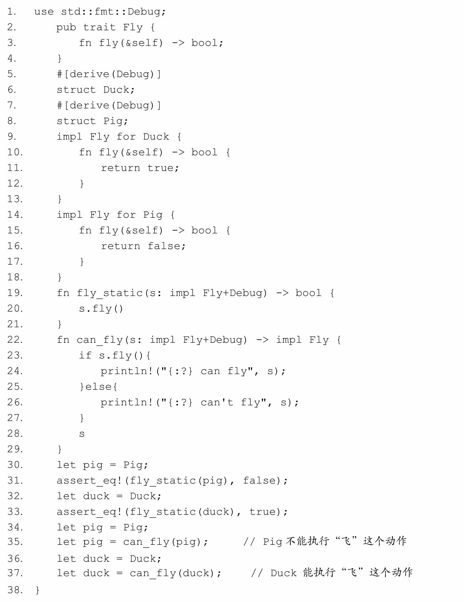{.u54350}
:::

代码清单3-41第19行到第21行使用impl Fly+Debug替换了之前的泛型写法，整个代码看上去清爽不少。将impl Trait语法用于参数位置的时候，等价于使用trait限定的泛型。

代码第22行到第29行定义了can_fly函数，参数使用impl Fly+Debug抽象类型，而返回值指定了impl Fly抽象类型。**将impl Trait语法用于返回值位置的时候，实际上等价于给返回类型增加一种trait限定范围** 。

在main函数中调用fly_static函数的时候，也不再需要使用turbofish操作符来指定类型。当然，如果在 Rust 无法自动推导类型的情况下，还需要显式指定类型，只不过无法使用turbofish操作符。调用can_fly函数可以返回impl Fly类型，但它属于静态分发，在调用的时候根据上下文确定返回的具体类型。

但是目前，还不能在 let 语句中为变量指定 impl Fly 类型。比如 let duck：impl Fly=can_fly（duck）这样的写法是不允许的，但是在不远的将来是可以使用的。相比于使用 trait 对象，使用impl Trait会拥有更高的性能。

另外，impl Trait只能用于为单个参数指定抽象类型，如果对多个参数使用impl Trait语法，编译器将报错，如代码清单3-42所示。

**代码清单3-42：多个参数类型使用impl Trait语法的情况**

::: center
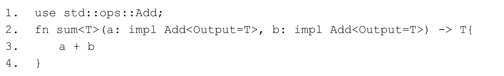{.u54349}
:::

代码清单 3-42 中的 sum 泛型函数包含了两个参数：a 和 b，如果都指定了 impl Add＜Output=T＞抽象类型，编译将会报错。a 和 b 会被编译器认为是两个不同的类型，不能进行加法操作。这一点在使用时要注意。

在Rust 2018版本中，为了在语义上和impl Trait语法相对应，专门为动态分发的**trait对象** 增加了新的语法**dyn Trait** ，其中dyn是Dynamic（动态）的缩写。即，impl Trait代表静态分发，dyn Trait代表动态分发。

我们可以在代码清单3-42的基础上新增使用dyn Trait语法的函数，如代码清单3-43所示。

**代码清单3-43：在代码清单3-42的基础上新增使用dyn Trait语法的函数**

::: center
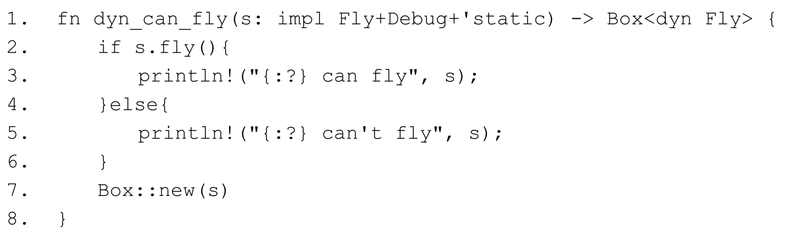{.u54348}
:::

代码清单3-43在代码清单3-42的基础上新增了函数dyn_can_fly，使用了新的dyn Trait语法。形如 Box＜dyn Fly＞实际上就是返回的 trait 对象，在 Rust 2015 版本中也可以写作Box＜Fly＞。方法签名中出现的＇static是一种生命周期参数，它限定了impl Fly+Debug抽象类型不可能是引用类型，因为这里出现引用类型可能会引发内存不安全。我们会在第5章更详细地介绍关于生命周期参数的内容。

### 3.4.4 标签trait {#text00009.html#A7dfc0063-ba68-4754-9da9-f7db224e7ad3 .title-left}

trait 这种对行为约束的特性也非常适合作为**类型的标签** 。这就好比市场上流通的产品，都被厂家盖上了"生产日期"和"有效期"这样的标签，消费者通过这种标签就可以识别出未过期的产品。Rust就是"厂家"，类型就是"产品"，标签trait就是"厂家"给"产品"盖上的各种标签，起到标识的作用。当开发者消费这些类型"产品"时，编译器会进行"严格执法"，以保证这些类型"产品"是"合格的"。

Rust一共提供了5个重要的标签trait，都被定义在标准库std：：marker模块中。它们分别是：

· **Sized** trait，用来标识编译期可确定大小的类型。

· **Unsize** trait，目前该trait为实验特性，用于标识动态大小类型（DST）。

· **Copy** trait，用来标识可以按位复制其值的类型。

· **Send** trait，用来标识可以跨线程安全通信的类型。

· **Sync** trait，用来标识可以在线程间安全共享引用的类型。

除此之外，Rust标准库还在增加新的标签trait以满足变化的需求。

**Sized trait**

Sized trait 非常重要，**编译器用它来识别可以在编译期确定大小的类型** 。代码清单 3-44展示了Sized trait的内部实现。

**代码清单3-44：Sized trait内部实现**

::: center
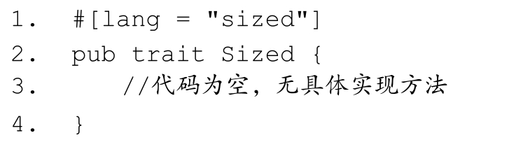{.u54347}
:::

Sized trait是一个**空trait** ，因为仅仅作为标签trait供编译器使用。这里真正起"打标签"作用的是代码清单3-44第1行的属性**＃\[lang=＂sized＂\]** ，该属性lang表示Sized trait供Rust语言本身使用，声明为＂sized＂，称为**语言项（Lang Item）** ，这样编译器就知道Sized trait如何定义了。还有一个相似的例子是加号操作，当两个整数相加的时候，比如a+b，编译器就会去找Add：：add（a，b），这也是因为加号操作是语言项**＃\[lang=＂add＂\]** 。

Rust语言中大部分类型都是默认Sized的，所以在写泛型结构体的时候，没有显式地加上Sized trait限定，如代码清单3-45所示。

**代码清单3-45：泛型默认Sized trait限定**

::: center
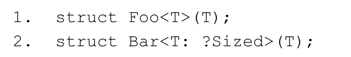{.u54346}
:::

代码清单3-45中的Foo是一个泛型结构体，等价于Foo＜T：Sized＞，如果需要在结构体中使用动态大小类型，则需要改为＜T：？Sized＞限定。

？Sized是Sized trait的另一种语法。Sized、Unsize和？Sized的关系如图3-8所示。

::: center
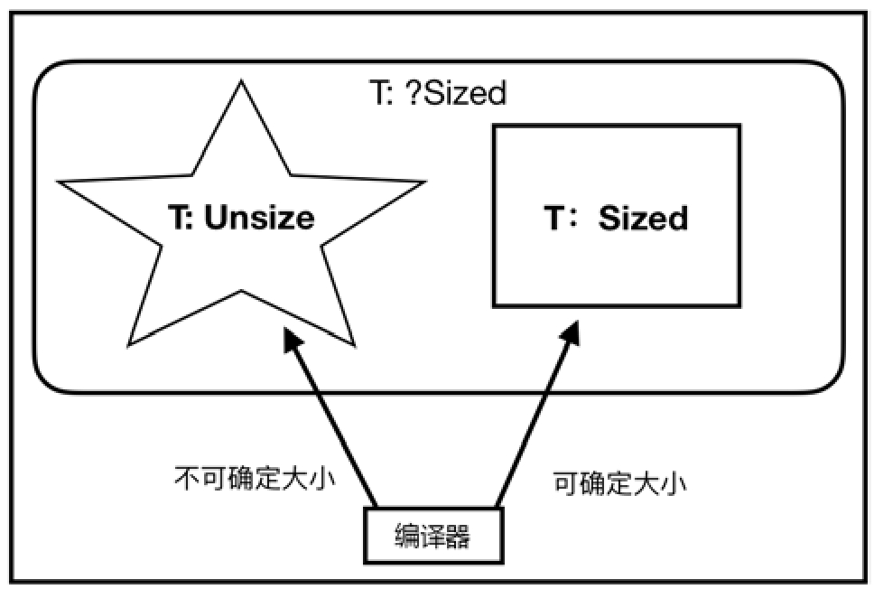{.u54345}

图3-8：Sized、Unsize和？Sized的关系
:::

Sized标识的是在编译期可确定大小的类型，而Unsize标识的是动态大小类型，在编译期无法确定其大小。目前Rust中的动态类型有trait和\[T\]，其中\[T\]代表一定数量的T在内存中依次排列，但不知道具体的数量，所以它的大小是未知的，用Unsize来标记。比如str字符串和定长数组\[T；N\]。\[T\]其实是\[T；N\]的特例，当N的大小未知时就是\[T\]。

而？Sized标识的类型包含了Sized和Unsize所标识的两种类型。所以代码清单3-45中泛型结构体Bar＜T：？Sized＞支持编译期可确定大小类型和动态大小类型两种类型。

但是动态大小类型不能随意使用，还需要遵循如下三条限制规则：

· 只可以通过胖指针来操作Unsize类型，比如&\[T\]或&Trait。

· 变量、参数和枚举变量不能使用动态大小类型。

· 结构体中只有最后一个字段可以使用动态大小类型，其他字段不可以使用。

所以，当使用？Size限定时，应该想想这三条规则。

**Copy trait**

Copy trait用来标记可以按位复制其值的类型，按位复制等价于C语言中的memcpy ^[\[2\]](#text00009.html#n7B59ECC43F3747CDB066593DD4153F5D){#text00009.html#n7B59ECC43F3747CDB066593DD4153F5Ds}^ 。代码清单3-46展示了Copy trait的内部实现。

**代码清单3-46：Copy trait内部实现**

::: center
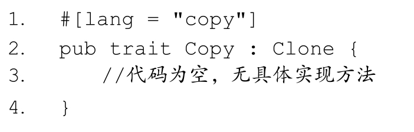{.u54344}
:::

注意代码清单3-46第1行的lang属性，此时声明为＂copy＂。此Copy trait继承自Clone trait，意味着，要实现Copy trait的类型，必须实现Clone trait中定义的方法。代码清单3-47展示了定义于std：：clone模块中的Clone trait内部实现。

**代码清单3-47：Clone trait内部实现**

::: center
{.u54343}
:::

::: center
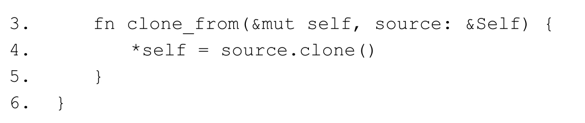{.u54342}
:::

看得出来，Clone trait继承自Sized，意味着要实现Clone trait的对象必须是Sized类型。代码清单3-47第3行的clone_from方法有默认的实现，并且其默认实现是调用clone方法，所以对于要实现Clone trait的对象，只需要实现clone方法就可以了。

如果想让一个类型实现Copy trait，就必须同时实现Clone trait，如代码清单3-48所示。

**代码清单3-48：想实现Copy trait就必须同时实现Clone trait**

::: center
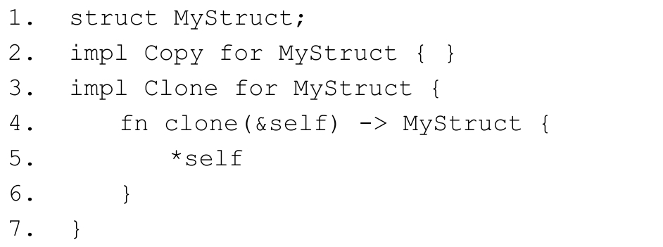{.u54341}
:::

如果每次都这样实现一遍，会比较麻烦。所以Rust提供了更方便的derive属性供我们完成这项重复的工作，如代码清单3-49所示。

**代码清单3-49：使用deriüe属性实现Copy trait和Clone trait**

::: center
{.u54340}
:::

这样代码就简练多了。

Rust为很多基本数据类型实现了Copy trait，比如常用的数字类型、字符（Char）、布尔类型、单元值、不可变引用等。代码清单3-50提供了一个检测函数，可以检测哪些类型实现了Copy trait。实际上就是利用了一个加上Copy trait限定的泛型函数test_copy，如果实现了Copy trait的类型，则可以正常编译；如果没有实现，则会报错。

**代码清单3-50：检测类型是否实现了Copy trait**

::: center
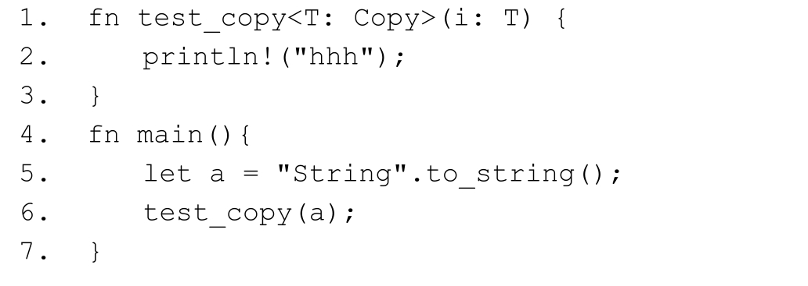{.u54339}
:::

代码清单3-50测试的类型是String，即字符串，编译会报以下错误：

::: center
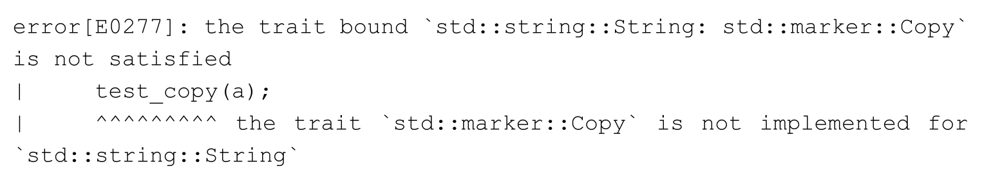{.u54338}
:::

看得出来，String类型并没有实现Copy trait。

那么这个空的Copy trait到底有什么作用呢？不要忘记，Copy是一个标签trait，编译器做类型检查时会检测类型所带的标签，以验证它是否"合格"。**Copy的行为是一个隐式的行为，开发者不能重载Copy行为，它永远都是一个简单的位复制** 。Copy隐式行为发生在执行变量绑定、函数参数传递、函数返回等场景中，因为这些场景是开发者无法控制的，所以需要编译器来保证。在学习完第4章之后，我们会对Copy语义有更深的了解。

Clone trait是一个显式的行为，任何类型都可以实现Clone trait，开发者可以自由地按需实现Copy行为。比如，String类型并没有实现Copy trait，但是它实现了Clone trait，如果代码里有需要，只需要调用String 类型的clone 方法即可。但需要记住一点，如果一个类型是Copy的，它的clone方法仅仅需要返回\*self即可（参考代码清单3-48）。

**并非所有类型都可以实现Copy trait** 。对于自定义类型来说，必须让所有的成员都实现了Copy trait，这个类型才有资格实现Copy trait。如果是数组类型，且其内部元素都是Copy类型，则数组本身就是Copy类型；如果是元组类型，且其内部元素都是Copy类型，则该元组会自动实现Copy；如果是结构体或枚举类型，只有当每个内部成员都实现Copy时，它才可以实现Copy，并不会像元组那样自动实现Copy。图3-9形象地总结了Copy和Clone的区别。

::: center
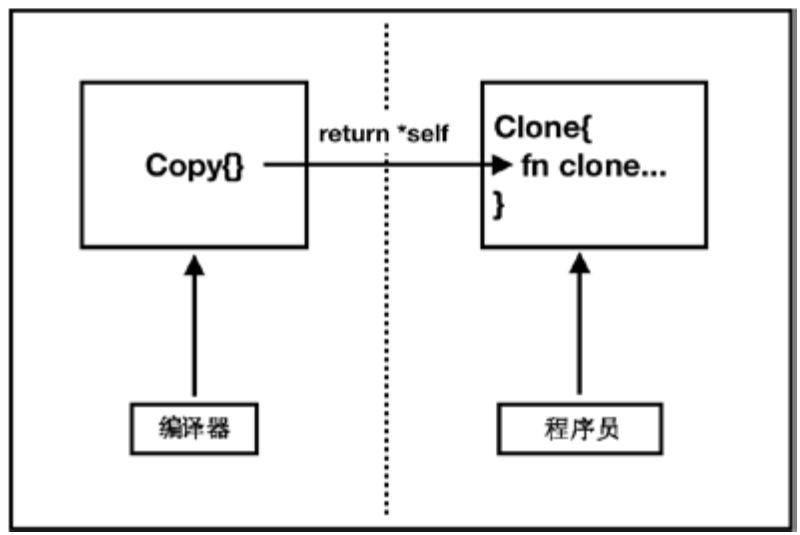{.u54337}

图3-9：Copy和Clone的区别
:::

**Send trait和Sync trait**

Rust作为现代编程语言，自然也提供了**语言级的并发支持** 。只不过Rust对并发的支持和其他语言有所不同。Rust在标准库中提供了很多并发相关的基础设施，比如线程、Channel、锁和Arc等，这些都是独立于语言核心之外的库，意味着基于Rust的并发方案不受标准库和语言的限制，开发人员可以编写自己所需的并发模型。

一直以来，多线程并发编程都存在很大问题，因为它会增加复杂性，想要编写正确非常困难，调试也非常困难，难以将问题复现。线程不安全的代码会因为共享内存而产生内存破坏（Memory Corruption）行为。

多线程编程之所以有这么严重的问题，是因为系统级的线程是不可控的，编写好的代码不一定会按期望的顺序执行，会带来**竞态条件（Race Condition）** 。不同的线程同时访问一块共享变量也会造成**数据竞争（Data Race）** 。**竞态条件是不可能被消除的，数据竞争是有可能被消除的，而数据竞争是线程安全最大的"隐患"** 。很多其他语言通过各种成熟的并发解决方案来支持并发编程，比如Erlang提供轻量级进程和Actor并发模型；Golang提供了协程和CSP并发模型。而Rust则从正面解决了这个问题，它的"秘密武器"是类型系统和所有权机制。

Rust提供了**Send** 和**Sync** 两个标签trait，它们是Rust无数据竞争并发的基石。

· 实现了Send的类型，可以安全地在线程间传递值，也就是说可以跨线程传递所有权。

· 实现了Sync的类型，可以跨线程安全地传递共享（不可变）引用。

有了这两个标签trait，就可以把Rust中所有的类型归为两类：**可以安全跨线程传递的值和引用** ，以及**不可以跨线程传递的值和引用** 。再配合所有权机制，带来的效果就是，**Rust能够在编译期就检查出数据竞争的隐患** ，而不需要等到运行时再排查。

代码清单3-51尝试在多线程之间共享不可变变量。

**代码清单3-51：多线程之间共享不可变变量**

::: center
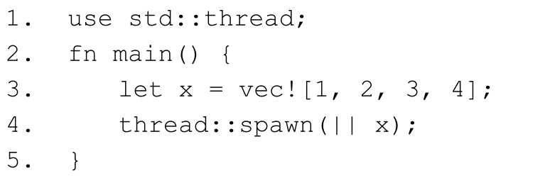{.u54336}
:::

代码清单3-51使用标准库thread模块中的spawn函数来创建子线程，需要一个闭包作为参数，可以编译通过。变量x被闭包捕获，传递到子线程中，但是x默认不可变，所以多线程之间共享是安全的。再看看如果传入的是可变变量会怎么样？如代码清单3-52所示。

**代码清单3-52：多线程之间共享可变变量**

::: center
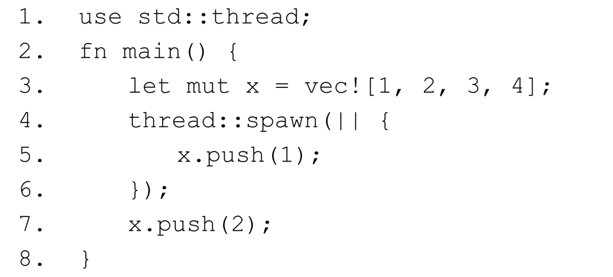{.u54335}
:::

我们在代码清单3-52中声明了可变变量x，然后在子线程中通过push方法在x中插入元素5，在父线程中又通过push方法插入元素2。

可以分析一下这个过程，假如编译正常通过的话，那么在父子线程中就都可以访问这个共享的可变变量，这就有可能出现数据竞争的问题。比如在父线程中其他地方判断数组长度等于 5 的时候，取出数组最后一个值，那么这个值可能是 2，也可能是 5，这就造成了线程不安全的问题。

但实际上，代码清单3-51是无法编译通过的，会报如下错误：

::: center
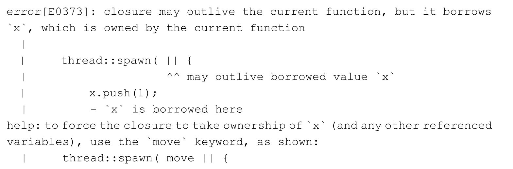{.u54334}
:::

因为闭包中的x实际为借用，Rust无法确定本地变量x可以比闭包中的x存活得更久，假如本地变量x被释放了，闭包中的x借用就成了悬垂指针，造成内存不安全。所以这里的编译器建议在闭包前面使用move关键字来转移所有权，转移了所有权意味着x变量只可以在子线程中访问，而父线程再也无法操作变量x，这就阻止了数据竞争。代码清单3-53通过在多线程之间move可变变量修正了数据竞争的问题。

**代码清单3-53：在多线程之间moüe可变变量**

::: center
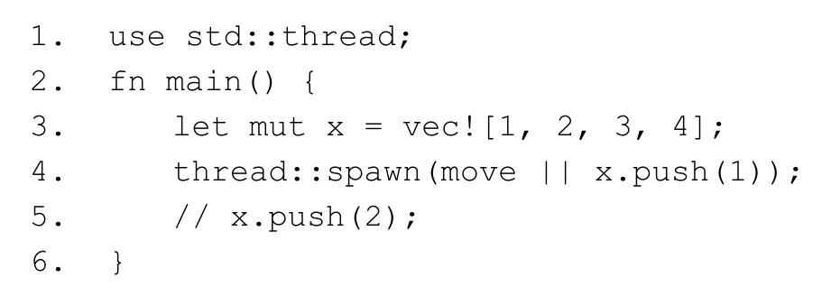{.u54333}
:::

代码清单3-53中编译器的检查利用了所有权机制，我们会在第5章学习关于所有权的更多细节。但这里之所以可以正常地move变量，也是因为数组x中的元素均为原生数据类型，默认都实现了Send和Sync标签trait，所以它们跨线程传递和访问都很安全。在x被转移到子线程之后，就不允许父线程对x进行修改，如代码清单3-53的第5行所示，如果对该行代码解开注释，编译会报错。

代码清单3-54展示了没有实现Send和Sync的类型在多线程中传递的情况。

**代码清单3-54：在多线程之间传递没有实现Send和Sync的类型**

::: center
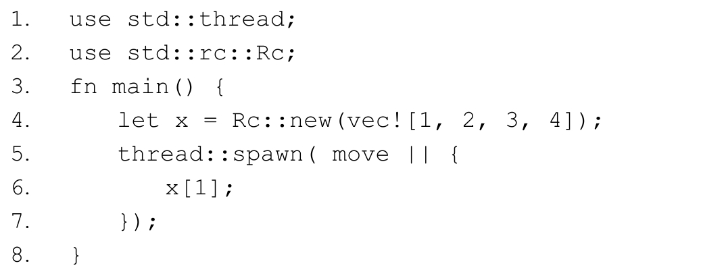{.u54332}
:::

代码清单3-54中使用了std：：rc：：Rc容器来包装数组，Rc没有实现Send和Sync，所以不能在线程之间传递变量x。编译报错如下：

::: center
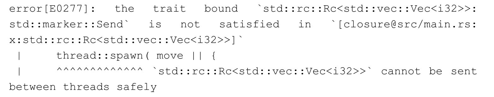{.u54331}
:::

编译错误信息显示：变量x，也就是std：：rc：：Rc＜std：：vec：：Vec＜i32＞＞，不能在线程之间传递。因为Rc是用于引用计数的智能指针，如果把Rc类型的变量x传递到另一个线程中，会导致不同线程的Rc变量引用同一块数据，Rc内部实现并没有做任何线程同步的处理，因此这样做必然不是线程安全的。可见，Rust又帮助开发者避免了一场"并发浩劫"。

Send和Sync标签trait和前面所说的Copy、Sized一样，内部也没有具体的方法实现。它们仅仅是标记，可以安全地跨线程传递和访问的类型用 Send 和 Sync 标记，否则用！Send和！Sync标记。代码清单3-55展示了其内部实现。

**代码清单3-55：Send和Sync的内部实现**

::: center
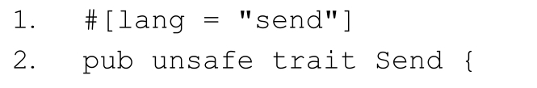{.u54330}
:::

::: center
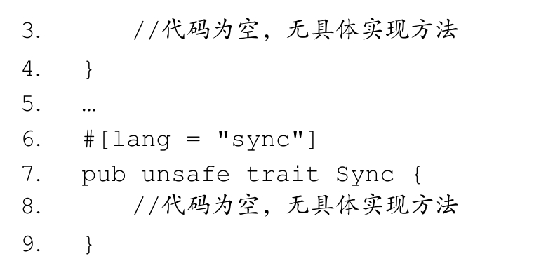{.u54329}
:::

代码清单3-56展示了Rust为所有类型实现Send和Sync的过程。

**代码清单3-56：Rust为所有类型实现Send和Sync**

::: center
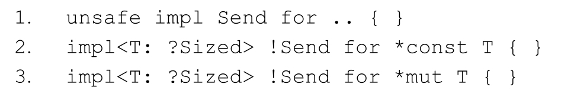{.u54328}
:::

代码清单3-56的第1行使用了特殊的语法for..，表示为所有类型实现Send，Sync也同理。同时，第2行和第3行也对两个原生指针实现了！Send，代表它们不是线程安全的类型，将它们排除出去。代码 3-56 仅仅展示了部分代码，完整的代码可以参考 Rust 源码的src/libcore/marker.rs源文件。

对于自定义的数据类型，如果其成员类型必须全部实现Send和Sync，此类型才会被自动实现Send和Sync。Rust也提供了类似Copy和Clone那样的derive属性来自动导入Send和 Sync 的实现，但并不建议开发者使用该属性，因为它可能引起编译器检查不到的线程安全问题。

总体来说，Rust 凭借 Send、Sync 和所有权机制，在编译期就可以检测出线程安全的问题，保证了无数据竞争的并发安全，让开发者可以"无恐惧"地编写多线程并发代码，并且可以让开发者自由使用各种并发模型。

## 3.5 类型转换 {#text00009.html#A039f0069-6289-4ca8-8c90-8ac249909278 .title-left}

在编程语言中，类型转换分为**隐式类型转换** （**Implicit Type Conversion** ）和**显式类型转换** （**Explicit Type Conversion** ）。隐式类型转换是由编译器或解释器来完成的，开发者并未参与，所以又称之为**强制类型转换** （**Type Coercion** ）。显式类型转换是由开发者指定的，就是一般意义上的**类型转换** （**Type Cast** ）。

不当的类型转换会带来内存安全问题。比如C语言和JavaScript语言中的隐式类型转换，如果不多加注意，可能会得到意料之外的结果。再比如C语言不同大小类型相互转换，长类型转换为短类型会造成溢出等问题。反观Rust语言，只要不乱用unsafe块来跳过编译器检查，就不会因为类型转换出现安全问题。

### 3.5.1 Deref解引用 {#text00009.html#A35e30069-d512-4aec-a49d-9d7b55a00157 .title-left}

Rust中的隐式类型转换基本上只有**自动解引用** 。自动解引用的目的主要是方便开发者使用智能指针。Rust 中提供的 Box＜T＞、Rc＜T＞和 String 等类型，实际上是一种**智能指针** 。它们的行为就像指针一样，可以通过"解引用"操作符进行解引用，来获取其内部的值进行操作。第4章会介绍关于智能指针的更多细节。

**自动解引用**

自动解引用虽然是编译器来做的，但是**自动解引用的行为可以由开发者来定义** 。

一般来说，引用使用&操作符，而解引用使用\*操作符。可以通过实现**Deref** trait来自定义解引用操作。Deref 有一个特性是强制隐式转换，规则是这样的：**如果一个类型 T实现了Deref＜Target=U＞，则该类型T的引用（或智能指针）在应用的时候会被自动转换为类型U。**

代码清单3-57展示了Deref trait内部实现。

**代码清单3-57：Deref trait内部实现**

::: center
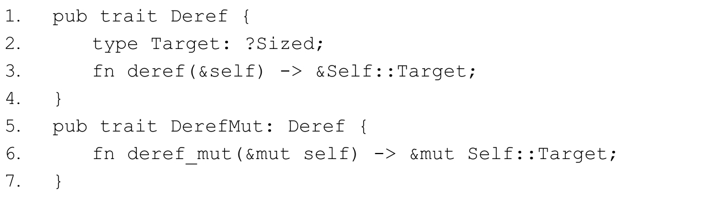{.u54327}
:::

**DerefMut** 和**Deref** 类似，只不过它是返回**可变引用** 的。Deref中包含关联类型Target，它表示解引用之后的目标类型。

**String** 类型实现了Deref。比如在代码清单3-58中连接了两个String字符串。

**代码清单3-58：连接两个String字符串**

::: center
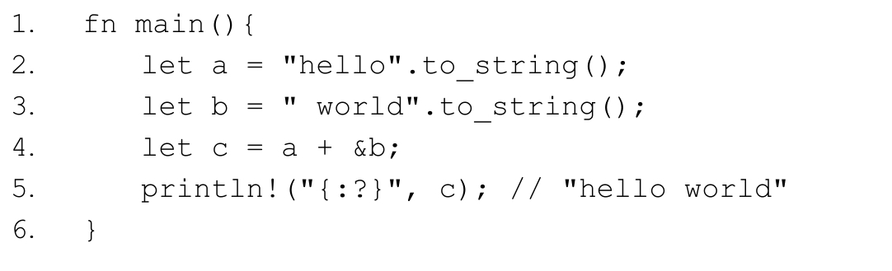{.u54326}
:::

变量a和b都是String类型字符串，当使用加号操作符将它们连接起来时，我们使用了&b，它应该是一个&String类型，而String类型实现的add方法的右值参数必须是&str类型。按理说，代码清单3-58应该编译出错，但现在它是可以正常运行的。原因就是String类型实现了Deref＜Target=str＞，代码清单3-59展示了其内部实现。

**代码清单3-59：String实现Deref＜Target=str＞**

::: center
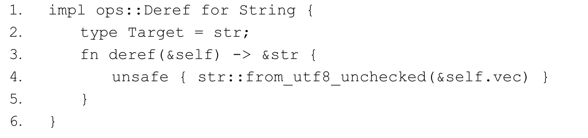{.u54325}
:::

所以&String类型会被自动隐式转换为&str，代码清单3-58才得以正常运行。除了String类型，标准库中常用的其他类型都实现了Deref，比如Vec＜T＞（其实现Deref的代码参见代码清单3-60）、Box＜T＞、Rc＜T＞、Arc＜T＞等。**实现Deref的目的只有一个，就是简化编程** 。

**代码清单3-60：Vec＜T＞实现Deref**

::: center
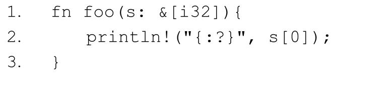{.u54324}
:::

::: center
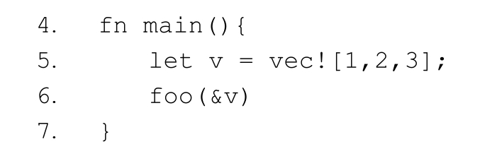{.u54323}
:::

在代码清单3-60中，foo函数的参数为&\[T\]类型。而在调用foo（&v）的时候，&v的类型为&Vec＜T＞，这里也发生了自动解引用，因为Vec＜T＞实现了Deref＜Target=\[T\]＞，所以&Vec＜T＞会被自动转换为&\[T\]类型，foo函数得以正确调用。自动解引用避免了开发者自己手工转换，简化了编程。

在函数调用时，自动解引用也提供了极大的方便。如代码清单 3-61 所示，Rc 指针实现了Deref，使函数调用变得非常方便。

**代码清单3-61：Rc指针实现Deref**

::: center
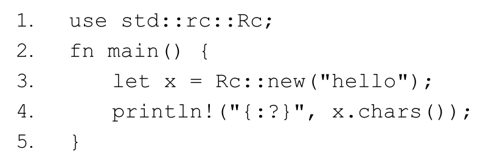{.u54322}
:::

在代码清单3-61中，变量x是Rc＜&str＞类型，它并没有实现过chars（）方法。但是现在可以直接调用，因为Rc＜T＞实现了Deref＜Target＜T＞＞。这就是自动解引用的魔法，使用起来完全透明，就好像Rc并不存在一样。

**手动解引用**

但在有些情况下，就算实现了 Deref，编译器也不会自动解引用。比如，代码清单 3-61是因为Rc没有实现chars方法，所以正常解引用，但是当某类型和其解引用目标类型中包含了相同的方法时，编译器就不知道该用哪一个了。此时就需要**手动解引用** ，如代码清单3-62所示。

**代码清单3-62：手动解引用的情况**

::: center
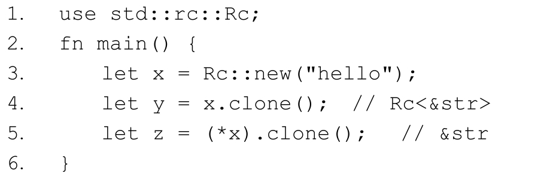{.u54321}
:::

在代码清单3-62中，clone方法在Rc和&str类型中都被实现了，所以调用时会直接调用Rc的clone方法，如果想调用Rc里面&str类型的clone方法，则需要使用"解引用"操作符手动解引用。

另外，match引用时也需要手动解引用，如代码清单3-63所示。

**代码清单3-63：match引用时需要手动解引用**

::: center
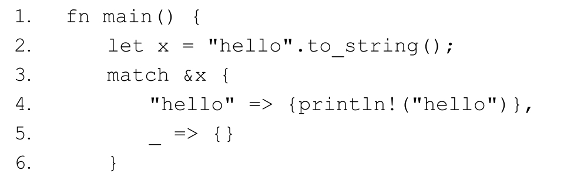{.u54320}
:::

::: center
{.u54319}
:::

在代码清单3-63所示的情况中，只能通过手动解引用把&String类型转换成&str类型，具体有下列几种方式。

· match x.deref（），直接调用deref方法，需要use std：：ops：：Deref。

· match **x.as_ref（）** ，String类型提供了as_ref方法来返回一个&str类似，该方法定义于**AsRef** trait中。

· match **x.borrow（）** ，方法borrow定义于Borrow trait中，行为和AsRef类型一样。需要**use std：：borrow：：Borrow** 。

· match**&\*x** ，使用"解引用"操作符，将String转换为str，然后再用"引用"操作符转为&str。

· match**&x\[..\]** ，这是因为String类型的index操作可以返回&str类型。

总体来说，除了自动解引用隐式转换，Rust还提供了不少显式的手动转换类型的方式。平时编程过程中建议多翻阅标准库文档，能够发现很多技巧。

### 3.5.2 as操作符 {#text00009.html#A582e006c-8455-4e37-bc01-f9a41d3ece59 .title-left}

as 操作符最常用的场景就是转换 Rust 中的基本数据类型。需要注意的是，as 关键字不支持重载。原生类型使用as操作符进行转换的代码如代码清单3-64所示。

**代码清单3-64：原生类型使用as操作符进行转换**

::: center
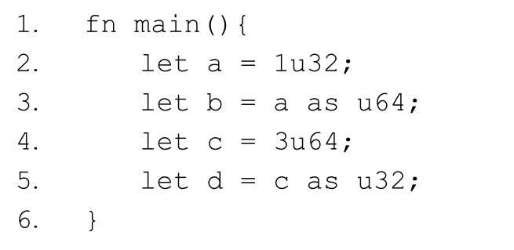{.u54318}
:::

代码清单3-64展示了u32和u64之间的转换，其他的原生类型也都可以使用as操作符进行转换。需要注意的是，短（大小）类型转换为长（大小）类型的时候是没有问题的，但是如果反过来，则会被**截断处理** ，如代码清单3-65所示。

**代码清单3-65：u32最大值转为u16类型时被截断处理**

::: center
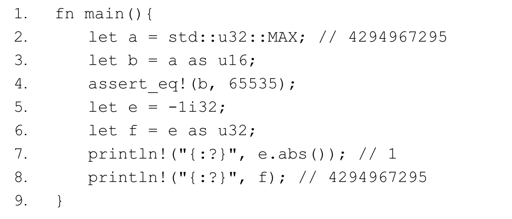{.u54317}
:::

在代码清单3-65中，变量a被赋予了u32类型的最大值，当转换为u16类型的时候，被截断处理，变量b的值就变成了u16类型的最大值。另外当从有符号类型向无符号类型转换的时候，最好使用标准库中提供的专门的方法，而不要直接使用as操作符。

**无歧义完全限定语法**

为结构体实现多个trait时，可能会出现同名的方法，代码清单3-66就展示了这种情况。此时使用as操作符可以帮助避免歧义。

**代码清单3-66：为结构体实现多个trait时出现同名方法的情况**

::: center
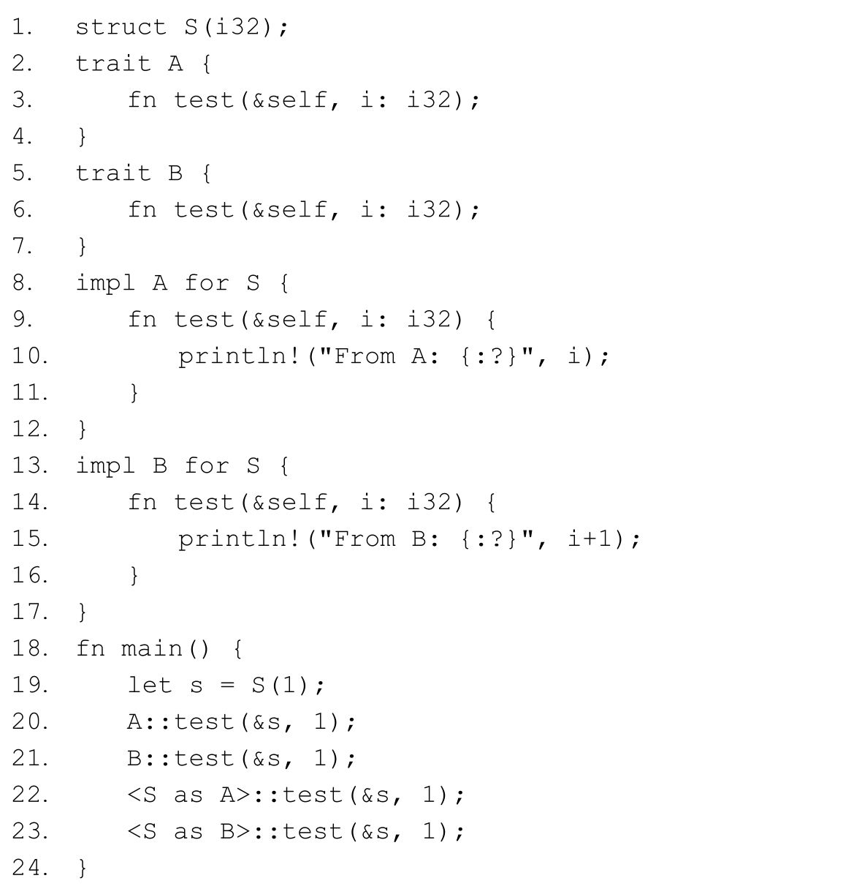{.u54316}
:::

在代码清单3-66中，结构体S实现了A和B两个trait，虽然包含了同名的方法test，但是其行为不同。有两种方式调用可以避免歧义。

· 第一种就是代码清单3-66中的第20行和21行，直接当作trait的静态函数来调用，A：：test（）或B：：test（）。

· 第二种就是使用as操作符，＜S as A＞：：test（）或＜S as B＞：：test（）。

这两种方式叫作**无歧义完全限定语法** （**Fully Qualified Syntax for Disambiguation** ），曾经也有另外一个名字：**通用函数调用语法** （**UFCS** ）。这两种方式的共同之处就是都需要将结构体实例变量s的引用显式地传入test方法中。但是建议使用第二种方式，因为＜S as A＞：：test（）语义比较完整，它表明了调用的是S结构体实现的A中的test方法。而第一种方式遗漏了S结构体这一信息，可读性相对差一些。这两种方式都可以看作对trait行为的转换。

**类型和子类型相互转换**

as转换还可以用于**类型** 和**子类型** 之间的转换。Rust中没有标准定义中的子类型，比如结构体继承之类，但是**生命周期标记可看作子类型** 。比如**&＇static str** 类型是**&＇a str** 类型的子类型，因为二者的生命周期标记不同，＇a 和＇static 都是生命周期标记，其中＇a 是泛型标记，是&str的通用形式，而＇static则是特指静态生命周期的&str字符串。所以，通过as操作符转换可以将&＇static str类型转为&＇a str类型，如代码清单3-67所示。

**代码清单3-67：通过as操作符转换类型和子类型**

::: center
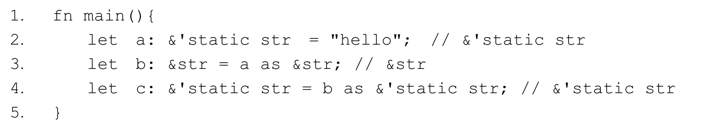{.u54315}
:::

代码清单3-67显示，可以通过as操作符将&＇static str和&＇a str相互转换。

### 3.5.3 From和Into {#text00009.html#Abad1006e-80f3-4150-bed8-333bd41ad773 .title-left}

**From** 和**Into** 是定义于std：：convert模块中的两个trait。它们定义了**from** 和**into** 两个方法，这两个方法互为反操作。代码清单3-68展示了这两个trait的内部实现。

**代码清单3-68：From和Into的内部实现**

::: center
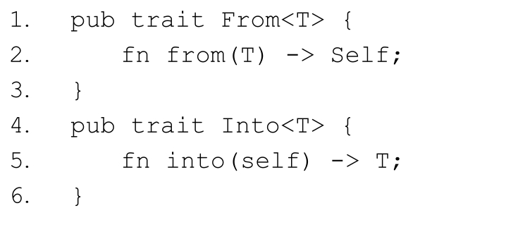{.u54314}
:::

对于类型T，如果它实现了From＜U＞，则可以通过T：：from（u）来生成T类型的实例，此处u为U的类型实例。代码清单3-69展示了String类型的from方法。

**代码清单3-69：String类型的from方法**

::: center
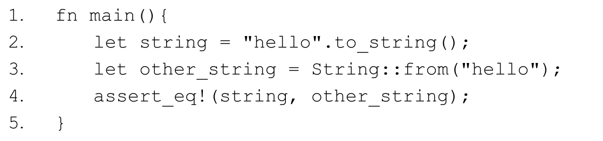{.u54313}
:::

对于类型T，如果它实现了Into＜U＞，则可以通过into方法来消耗自身转换为类型U的新实例。代码清单3-70展示了如何使用String类型的into方法来简化代码。

**代码清单3-70：使用into方法来简化代码**

::: center
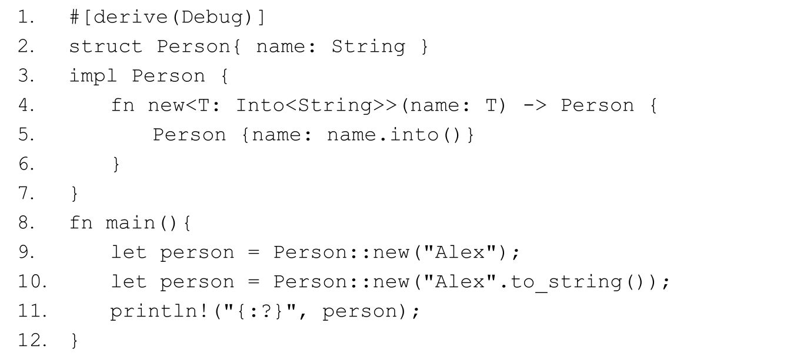{.u54312}
:::

代码清单3-70第4行的new方法是一个泛型方法，它允许传入的参数是&str类型或String类型，方便进行开发。使用了＜T：Into＜String＞＞限定就意味着，实现了into方法的类型都可以作为参数。&str和String类型都实现了Into。当参数是&str类型时，会通过into转换为String类型；当参数是String类型时，则什么都不会发生。

关于Into有一条默认的规则：**如果类型U实现了From＜T＞，则T类型实例调用into方法就可以转换为类型U** 。这是因为Rust标准库内部有一个默认的实现，如代码清单3-71所示。

**代码清单3-71：为所有实现了From＜T＞的类型T实现Into＜U＞**

::: center
{.u54311}
:::

代码清单3-72通过String和&str类型展示了这条规则。

**代码清单3-72：可以使用into方法将&str类型转换为String类型**

::: center
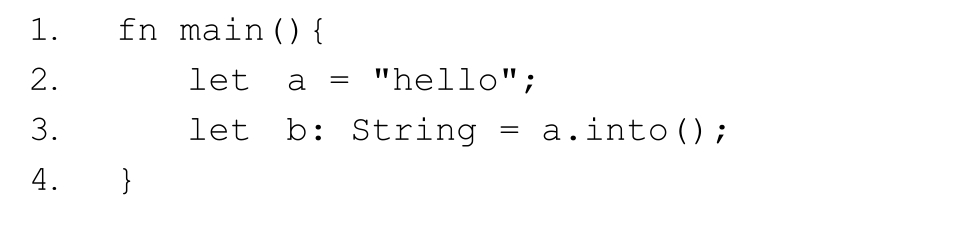{.u54310}
:::

String类型实现了From＜&str＞，所以可以使用into方法将&str转换为String。图3-10形象地展示了From和Into的关系。

::: center
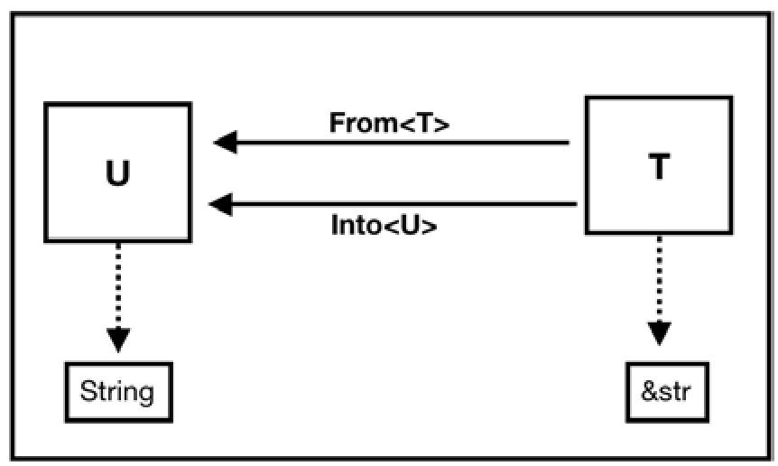{.u54309}

图3-10：From和Into的关系
:::

所以，一般情况下，只需要实现From即可，除非From不容易实现，才需要考虑实现Into。

在标准库中，还包含了**TryFrom** 和**TryInto** 两种trait，是**From** 和**Into** 的错误处理版本，因为类型转换是有可能发生错误的，所以在需要进行错误处理的时候可以使用 **TryFrom** 和**TryInto** 。不过**TryFrom** 和**TryInto** 目前还是实验性特性，只能在Nightly版本下使用，在不久的将来也许会稳定。

另外，标准库中还包含了**AsRef** 和**AsMut** 两种trait，可以将值分别转换为不可变引用和可变引用。AsRef和标准库的另外一个**Borrow** trait功能有些类似，但是AsRef比较轻量级，它只是简单地将值转换为引用，而Borrow trait可以用来将某个复合类型抽象为拥有借用语义的类型。更详细的内容请参考标准库文档。

## 3.6 当前trait系统的不足 {#text00009.html#A3a27006f-0de1-4a2c-8e40-bc16c5ff489c .title-left}

虽然当前的trait系统很强大，但依然有很多需要改进的地方，主要包括以下三点：

· 孤儿规则的局限性。

· 代码复用的效率不高。

· 抽象表达能力有待改进。

接下来分别讨论这三点。

### 3.6.1 孤儿规则的局限性 {#text00009.html#Ad3940070-4ee5-4864-8f8f-f0865dbb6e8b .title-left}

孤儿规则虽然在一定程度上保持了trait的一致性，但是它还有一些局限性。

在设计trait时，还需要考虑是否会影响下游的使用者。比如在标准库实现一些trait时，还需要考虑是否需要为所有的T或&＇a T实现该trait，如代码清单3-73所示。

**代码清单3-73：为所有的T或&＇a T实现Bar trait**

::: center
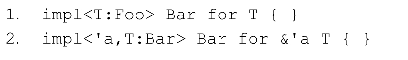{.u54308}
:::

对于下游的子crate来说，如果想要避免孤儿规则的影响，还必须使用NewType模式或者其他方式将远程类型包装为本地类型。这就带来了很多不便。

另外，对于一些本地类型，如果将其放到一些容器中，比如Rc＜T＞或Option＜T＞，那么这些本地类型就会变成远程类型（如代码清单3-74所示），因为这些容器类型都是在标准库中定义的，而非本地。

**代码清单3-74：Option＜T＞会将本地类型变成远程类型**

::: center
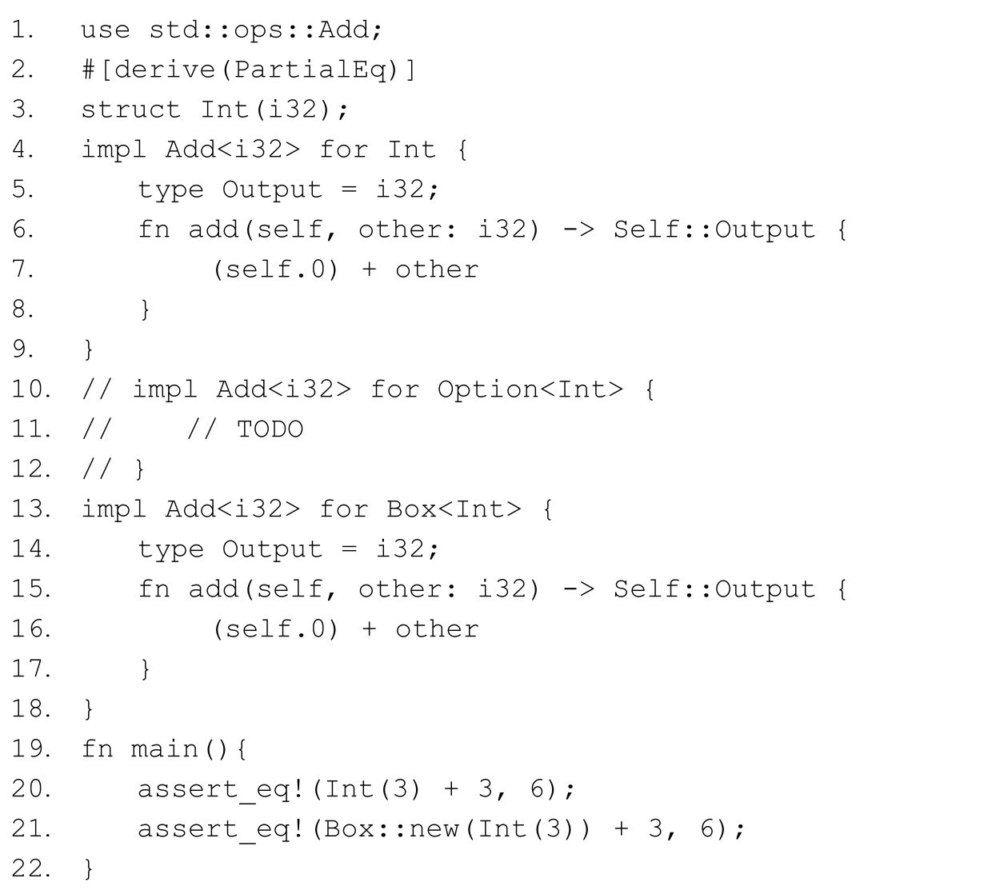{.u54307}
:::

代码清单3-74在本地创建了自定义类型Int，然后为其实现Add trait。Add trait是定义于标准库中的，Int是在本地的，所以并不违反孤儿规则。

但是当给 Option＜Int＞实现 Add 时，编译器就会报错，因为触发了孤儿规则。如代码第10行到第12行所示。

但是当给Box＜Int＞实现Add时，则可以正常编译执行。如代码第20行和第21行所示。看到这里是不是有些困惑？

这是因为Box＜T＞在Rust中属于最常用的类型，经常会遇到像代码清单3-74这样的情况：从子crate为Box＜Int＞这种自定义类型扩展trait实现。标准库中根本做不到覆盖所有的crate中的各种可能性，所以必须将Box＜T＞开放出来，脱离孤儿规则的限制，否则就会限制子crate要实现的一些功能。

那么，Box＜T＞是怎么做到如此特殊的呢？这其实是因为 Rust 内部使用了一个叫**＃\[fundamental\]** 的属性标识，Box＜T＞的实现源码如代码清单3-75所示。

**代码清单3-75：Box＜T＞实现源码示意**

::: center
{.u54306}
:::

代码清单 3-75 展示了 Box＜T＞的源码示意，可以看到其定义上方标识了**＃\[fundamental\]** 属性，该属性的作用就是告诉编译器，Box＜T＞享有"特权"，不必遵循孤儿规则。

除了Box＜T＞，还有Fn、FnMut、FnOnce、Sized等都加上了**＃\[fundamental\]** 属性，代表这些trait也同样不受孤儿规则的限制。所以，在阅读Rust源码的时候，如果看到该属性标识，就应该知道它和孤儿规则有关。

### 3.6.2 代码复用的效率不高 {#text00009.html#A00aa0071-0d6a-4cd0-960e-56d298b6ecad .title-left}

除了孤儿规则，Rust 其实还遵循另外一条规则：**重叠（Overlap）规则** 。该规则规定了不能为重叠的类型实现同一个trait。什么叫重叠的类型？如代码清单3-76所示。

**代码清单3-76：重叠的类型示意**

::: center
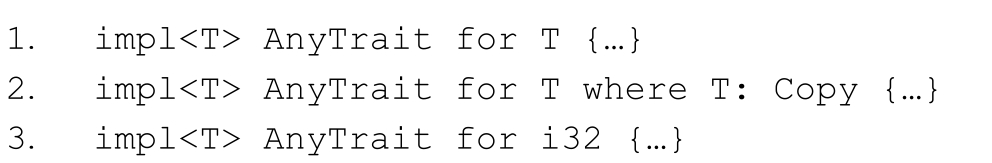{.u54305}
:::

代码清单3-76中分别为三种类型实现了AnyTrait。

· T是泛型，指代所有的类型。

· T where T：Copy是受trait限定约束的泛型T，指代实现了Copy的一部分T，是所有类型的子集。

· i32是一个具体的类型。

显而易见，上面三种类型发生了重叠。T包含了T：Copy，而T：Copy包含了i32。这违反了重叠规则，所以编译会失败。这种实现 trait 的方式在 Rust 中叫**覆盖式实现（Blanket Impl）** 。

重叠规则和孤儿规则一样，都是为了保证trait一致性，避免发生混乱，但是它也带来了一些问题，主要包括以下两个方面：

· 性能问题。

· 代码很难重用。

性能会有什么问题呢？且看一个示例，如代码清单3-77所示。

**代码清单3-77：为所有类型T实现AddAssign**

::: center
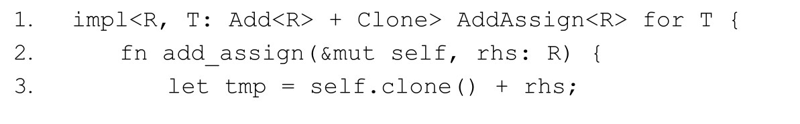{.u54304}
:::

::: center
{.u54303}
:::

在代码清单3-77中，为所有类型T实现了AddAssign，该trait定义的add_assign方法是+=赋值操作对应的方法。这样实现虽然好，但是会带来性能问题，因为会强制所有类型都使用clone方法，clone方法会有一定的成本开销，但实际上有的类型并不需要clone。因为有重叠规则的限制，不能为某些不需要clone 的具体类型重新实现add_assign方法。所以，在标准库中，为了实现更好的性能，只好为每个具体的类型都各自实现一遍AddAssign。

从代码清单3-77也看得出来，**重叠规则严重影响了代码的复用** 。试想一下，如果没有重叠规则，则可以默认使用上面对泛型 T 的实现，然后对不需要 clone 的类型重新实现AddAssign，那么就完全没必要为每个具体类型都实现一遍add_assign方法，可以省掉很多重复代码。当然，此处只是为了说明重叠规则的问题，实际上在标准库中会使用宏来简化具体的实现代码。

那么为了缓解重叠规则带来的问题，Rust 引入了**特化** （**Specialization** ）。特化功能暂时只能用于impl实现，所以也称为**impl特化** 。不过该功能目前还未稳定发布，只能在Nightly版本的Rust之下使用**＃！\[feature（specialization）\]** 特性。

trait包含默认实现的特化示例如代码清单3-78所示。

**代码清单3-78：trait包含默认实现的特化示例**

::: center
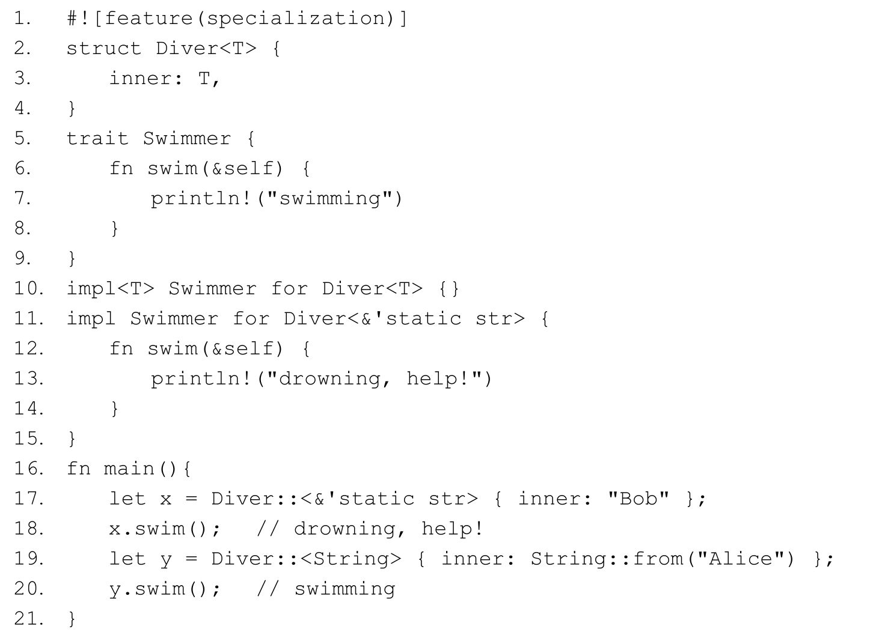{.u54302}
:::

在代码清单 3-78 中，定义了一个泛型结构体 Diver＜T＞，以及一个携带默认实现的Swimmer trait。然后为Diver＜T＞实现了该trait，如第10行所示。

代码第11行到第15行为Diver＜&＇static str＞实现了Swimmer。

然后在main函数中分别调用Diver：：＜&＇static str＞和Diver：：＜String＞类型的swim方法，输出不同的结果。

看得出来，特化功能有点类似面向对象语言中的继承，Diver：：＜String＞"继承"了Diver：：＜T＞中的实现。而Diver：：＜&＇static str＞则使用了本身的swim方法实现。

代码清单3-78展示了trait默认实现的情况。如果trait没有默认实现，特化功能的写法就会稍微有点区别，如代码清单3-79所示。

**代码清单3-79：trait没有默认实现的特化示例**

::: center
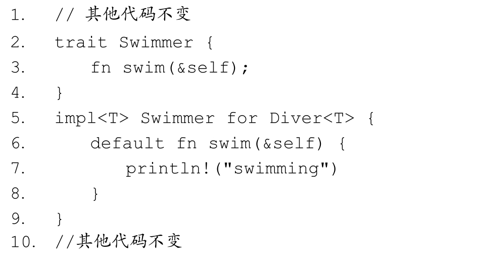{.u54301}
:::

代码清单3-79是对代码清单3-78进行的修改。将原本Swimmer中的默认实现去掉，然后在为Diver＜T＞实现Swimmer的时候编写具体的swim实现。请注意这里多了一个**default** 关键字。代码清单3-78中其余的代码保持不变。

如果不加 default，编译会报错。这是因为默认 impl 块中的方法不可被特化，必须使用default关键字来标记那个需要被特化的方法，这是出于代码的兼容性考虑的。同时，通过显式地使用default标记，也增强了代码的维护性和可读性。

目前特化的功能还在不断地演进和完善，在不远的将来会稳定发布。到时候Rust代码的性能和重用性将会显著提高，而且在特化的支持下，还可能会实现高效的继承方案。让我们拭目以待。

### 3.6.3 抽象表达能力有待改进 {#text00009.html#A14b40073-087d-46d9-8dfb-18d536a13bb6 .title-left}

迭代器在Rust中应用广泛，但是它目前有一个**缺陷：在迭代元素的时候，只能按值进行迭代，有的时候必须重新分配数据，而不能通过引用来复用原始的数据** 。比如标准库中的std：：io：：Lines 类型用于按行读取文件数据，但是该实现迭代器只能读一行数据分配一个新的String，而不能重用内部缓存区。这样就影响了性能。这里提到的迭代器相关的内容会在第6章进行详细介绍。

这是因为迭代器的实现基于关联类型，而关联类型目前只能支持具体的类型，而不能支持泛型。不能支持泛型就导致无法支持引用类型，因为Rust里规定使用引用类型必须标明生命周期参数，而生命周期参数恰恰是一种泛型类型参数。

为了解决这个问题，就必须允许迭代器支持引用类型。只有支持引用类型，才可以重用内部缓存区，而不需要重新分配新的内存。所以，就必须实现一种更高级别的类型多态性，即**泛型关联类型** （**Generic Associated Type，GAT** ） ^[\[3\]](#text00009.html#n5FF80073466548C1A0F88F642D5F184B){#text00009.html#n5FF80073466548C1A0F88F642D5F184Bs}^ ，如代码清单3-80所示。

**代码清单3-80：支持GAT的trait实现示例**

::: center
{.u54300}
:::

::: center
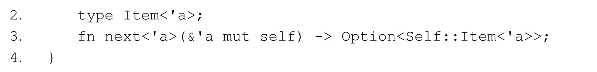{.u54299}
:::

我们在代码清单 3-80 中定义了一种迭代器 StreamingIterator，它的特点是包含了泛型关联类型，这里 Item＜＇a＞中的＇a 就是一种泛型类型参数，叫作生命周期参数，表示这里可以使用引用。

这样一来，如果给std：：io：：Lines实现了StreamingIterator迭代器，它就可以复用内存缓存区，而不需要为每行数据新开辟一份内存，因而提升了性能。

**Item＜＇a＞是一种类型构造器** 。就像Vec＜T＞类型，只有在为其指定具体的类型之后才算一个真正的类型，比如Vec＜i32＞。所以，**GAT** 也被称为**ACT** （**Associated type constructor** ），即**关联类型构造器** 。

但遗憾的是，目前 GAT 功能还在紧张地实现中，还不能使用。在不久的将来，GAT 稳定功能会被发布，到时候将进一步提升Rust类型系统的抽象能力。

## 3.7 小结 {#text00009.html#A01890074-e80f-4176-a99f-1e1692d4d06a .title-left}

本章阐述了Rust最为重要的类型系统：从通用概念开始，介绍了什么是类型系统、类型系统的种类、类型系统中的多态等；然后逐步探索了Rust中的类型系统。如果没有类型系统，Rust语言的安全基石将不复存在。通过学习本章，可以对Rust的类型系统建立完善的**心智模型** （**Mental Model** ），为彻底掌握Rust打下重要的基础。

Rust除了使用类型系统来存储信息，还试图将信息处理过程中的各种行为都纳入类型系统，以防止未定义的行为发生。如果说类型系统是"法律"，那么编译器就是Rust类型系统世界中最严格的"执法者"。编译器在编译期进行严格的类型检查，保证了Rust的内存安全和并发安全。

Rust的类型系统也是其"零成本抽象"的保证。trait是Rust中Ad-hoc多态的实现，trait可以进行接口抽象，对泛型进行限定，支持静态分发。trait 也模糊了类型和行为的界限，让开发者可以在多种类型之上按照行为统一抽象为抽象类型。抽象类型支持 trait 对象和 impl Trait语法，分别为动态分发和静态分发。

最后，我们了解了Rust中的隐式类型转换和显示类型转换的区别和各自的方法。其中隐式类型转换基本上只有自动解引用，它是为了简化编程而提供的。跟其他弱类型语言中的隐式类型转换不一样，Rust中的隐式类型转换是类型安全的。通过as关键字可以对原生类型进行安全的显示转换，但对一些自定义类型，还需要实现AsRef或From/Into这样的trait来支持显式类型转换。

------------------------------------------------------------------------

[\[1\]](#text00009.html#n553B9D8EA0044846A791CAAFC2270E74s){#text00009.html#n553B9D8EA0044846A791CAAFC2270E74} 这里只是从广义上来定义强类型和弱类型。事实上 Rust 也包含自动隐式转换，本章后面会讲到。

[\[2\]](#text00009.html#n7B59ECC43F3747CDB066593DD4153F5Ds){#text00009.html#n7B59ECC43F3747CDB066593DD4153F5D} C语言中的memcpy会从源所指的内存地址的起始位置开始拷贝*n* 个字节，直到目标所指的内存地址的起始位置。可以拷贝任意类型，主要是栈拷贝。

[\[3\]](#text00009.html#n5FF80073466548C1A0F88F642D5F184Bs){#text00009.html#n5FF80073466548C1A0F88F642D5F184B} 相关RFC：https：//github.com/rust-lang/rfcs/blob/master/text/1598-generic_associated_types.md。

[]{#text00010.html}

# 第4章 内存管理 {#text00010.html#Ae0097119-f28f-4899-a334-6385f17384a3 .title-left}

清空你的杯子，方能再行注满，空无以求全。

在现代计算机体系中，内存是很重要的部件之一，程序的运行离不开内存。不同的编程语言对内存有着不同的管理方式。按照内存的管理方式可将编程语言大致分为两类：**手动内存管理类** 和**自动内存管理类** 。手动内存管理类需要开发者手动使用malloc和free等函数显式管理内存，比如C语言。自动内存管理类使用GC（Garbage Collection，垃圾回收）来对内存进行自动化管理，而无须开发者手动开辟和释放内存，比如Java、C＃、Ruby、Python等语言都是靠GC自动化管理内存的。

手动内存管理的优势在于性能，因为可以直接操控内存，但同时也带来不少问题。有人的地方就有Bug，即使是C/C++语言高手，在写了上千行代码之后，也会有忘记释放内存的情况，就有可能频繁地造成内存泄漏。手动内存管理的另一个常见问题就是悬垂指针（Dangling Pointer）。如果某个指针引用的内存被非法释放掉了，而该指针却依旧指向被释放的内存，这种情况下的指针就叫悬垂指针。如果将悬垂指针分配给某个其他的对象，将会产生无法预料的后果。

GC 自动内存管理接管了开发者分配和回收内存的任务，并帮助提升了代码的抽象度和可靠性。像悬垂指针之类的问题完全可以避免，因为一个被引用的对象的内存永远不会被释放，只有当它不被引用时才可被回收。GC 使用了各种精确的算法来解决内存分配和回收的问题，但并不代表能解决所有的问题。GC 最大的问题是会引起"世界暂停"，GC 在工作的时候必须保证程序不会引入新的"垃圾"，所以要使运行中的程序暂停，这就造成了性能问题。

所以，编程语言的使用现状就是，对性能要求高并且需要对内存进行精确操控的系统级开发，一般只能选择C和C++之类的语言，存在的问题是，如果开发者稍不留神就会造成内存不安全问题。其他类型的开发就选择Java、Python、Ruby之类的高级语言，一般不会出现内存不安全的问题，但是它们的性能却降低了不少。

有没有一门语言能够将两者的优势结合起来，做到既无GC又可以安全地进行手动内存管理，还不缺更高的抽象，可以像其他高级语言那般进行快速开发呢？答案毋庸置疑，有，就是Rust。作为一门强大的系统编程语言，Rust允许开发者直接操控内存，所以了解内存如何工作对于编写出高效的Rust代码至关重要。

## 4.1 通用概念 {#text00010.html#A33d30075-79a8-4d4a-9a0f-77bcc2957b56 .title-left}

现代操作系统在保护模式下都采用虚拟内存管理技术。虚拟内存是一种对物理存储设备的统一抽象，其中物理存储设备包括物理内存、磁盘、寄存器、高速缓存等。这样统一抽象的好处是，方便同时运行多道程序，使得每个进程都有各自独立的进程地址空间，并且可以通过操作系统调度将外存当作内存来使用。这就引出了一个新的概念：**虚拟地址空间** 。

虚拟地址空间是线性空间，用户所接触到的地址都是虚拟地址，而不是真实的物理地址。利用这种虚拟地址不但能保护操作系统，让进程在各自的地址空间内操作内存，更重要的是，用户程序可以使用比物理内存更大的地址空间。虚拟地址空间被人为地分为两部分：**用户空间** 和**内核空间** ，它们的比例是3：1（Linux系统中）或2：2（Windows系统中）。以Linux系统为例，32 位计算机的地址空间大小是 4GB，寻址范围是 0x00000000～0xFFFFFFFF。然后通过内存分页等底层复杂的机制来把虚拟地址翻译为物理地址，如图4-1所示。

::: center
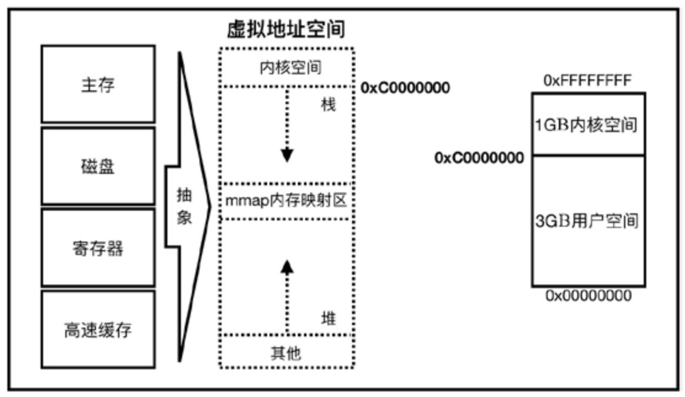{.u54298}

图4-1：Linux系统中的虚拟地址空间示意图
:::

图4-1是Linux虚拟地址空间的示意图，其中值得注意的是用户空间中的**栈** （**stack** ）和**堆** （**heap** ）。图中箭头的方向代表内存增长的方向，栈向下（由高地址向低地址）增长，堆向上（由低地址向高地址）增长 ^[\[1\]](#text00010.html#n7383007617FA487682293C2143D63A9A){#text00010.html#n7383007617FA487682293C2143D63A9As}^ ，这样的设计是为了更加有效地利用内存。关于虚拟内存的其他细节不在本章讨论范围内，因此不展开讲述。

### 4.1.1 栈 {#text00010.html#A1abd0076-0983-4906-8609-074ddcbbd0c4 .title-left}

栈（stack），也被称为堆栈，但是为了避免歧义，本书只称其为栈。栈一般有两种定义，一种是指数据结构，一种是指栈内存。

在数据结构中，栈是一种特殊的线性表，如图4-2所示。其特殊性在于限定了插入和删除数据只能在线性表固定的一端进行。

图4-2展示了栈的特性，操作栈的一端被称为**栈顶** ，相反的一端被称为**栈底** 。从栈顶压入数据叫**入栈** （**push** ），从栈顶弹出数据叫**出栈** （**pop** ），这意味着最后一个入栈的数据会第一个出栈，所以栈被称为**后进先出（LIFO，Last in First Out）线性表** 。

::: center
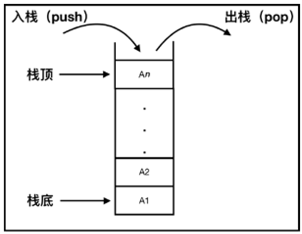{.u54297}

图4-2：栈示意图
:::

物理内存本身并不区分堆和栈，但是虚拟内存空间需要分出一部分内存，用于支持CPU入栈或出栈的指令操作，这部分内存空间就是**栈内存** 。栈内存拥有和栈数据结构相同的特性，支持入栈和出栈操作，数据压入的操作使栈顶的地址减少，数据弹出的操作使栈顶的地址增多，如图4-3所示。

::: center
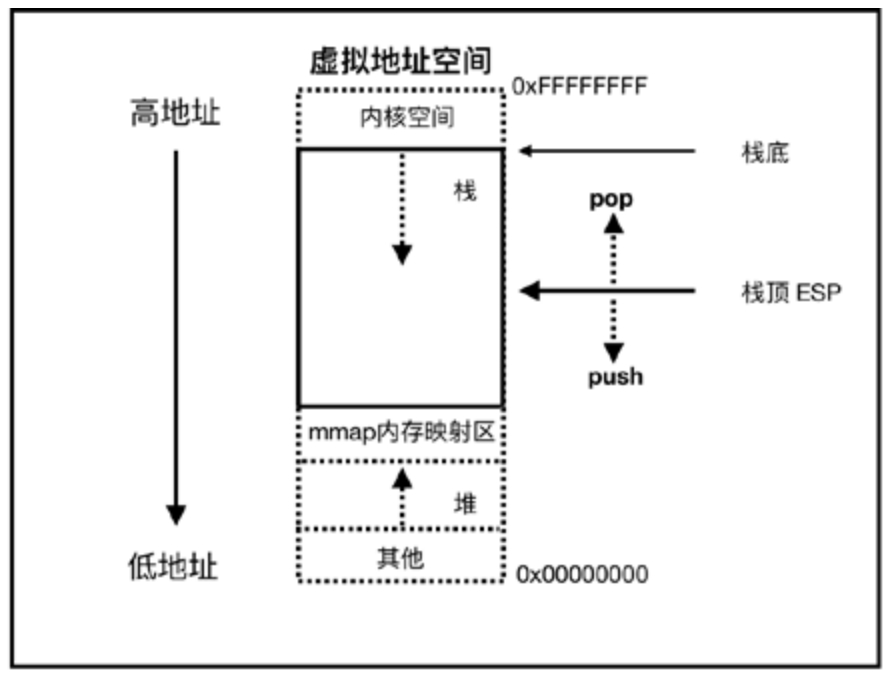{.u54296}

图4-3：栈内存示意图
:::

栈顶由栈指针寄存器ESP保存，起初栈顶指向栈底的位置，当有数据入栈时，栈顶地址向下增长，地址由高地址变成低地址；当有数据被弹出时，栈顶地址向上增长，地址由低地址变成高地址。因此，降低ESP的地址等价于开辟栈空间，增加ESP的地址等价于回收栈空间。

**栈内存最重要的作用是在程序运行过程中保存函数调用所要维护的信息** 。存储每次函数调用所需信息的记录单元被称为**栈帧** （**Stack Frame** ，如图4-4所示），有时也被称为**活动记录** （**Activate Record** ）。因此栈内存被栈帧分割成了*N* 个记录块，而且这些记录块都是大小不一的。

::: center
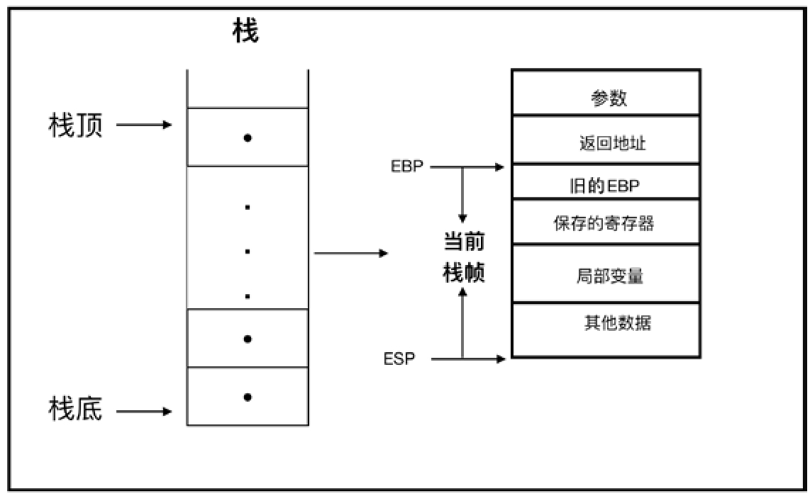{.u54295}

图4-4：栈帧示意图
:::

栈帧一般包括三方面的内容：

· 函数的返回地址和参数。

· **临时变量** 。包括函数内部的非静态局部变量和编译器产生的临时变量。

· 保存的上下文。

EBP指针是**帧指针** （**Frame Pointer** ），它指向当前栈帧的一个固定的位置，而ESP始终指向栈顶。EBP指向的值是调用该函数之前的旧的EBP值，这样在函数返回时，就可以通过该值恢复到调用前的值。由 EBP 指针和 ESP 指针构成的区域就是一个栈帧，一般是指**当前栈帧** 。

栈帧的分配非常快，其中的局部变量都是预分配内存，在栈上分配的值都是可以预先确定大小的类型。当函数结束调用的时候，栈帧会被自动释放，所以**栈上数据的生命周期都是在一个函数调用周期内的** 。

我们可以通过一个具体的代码示例来了解上述过程。代码清单4-1展示了一个函数调用过程，该程序由foo函数和main函数组成，其中包括x、y和z三个变量。

**代码清单4-1：通过简单函数调用展示栈帧**

::: center
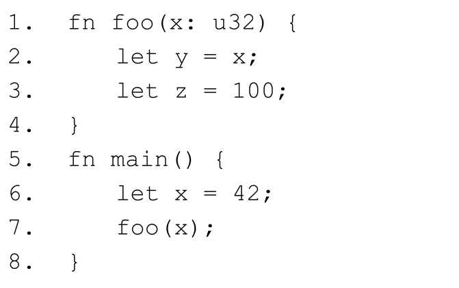{.u54294}
:::

代码清单4-1中的**main** 函数为入口函数，所以首先被调用。main函数中声明了变量x，在调用foo函数前，main函数先在栈里开辟了空间，压入了x变量。栈帧里EBP指向起始位置，变量x保存在帧指针EBP-4（只是为了演示）偏移处。

在调用 foo 函数时，将返回地址压入栈中，然后由 PC 指针（程序计数器）引导执行函数调用指令，进入foo函数栈帧中。此时同样在栈中开辟空间，依次将main函数的EBP地址、参数x以及局部变量y和z压入栈中。EBP指针依旧指向地址为0的固定位置，表明当前是在foo函数栈帧中，通过EBP-4、EBP-8和EBP-12就可以访问参数和变量。当foo函数执行完毕时，其参数或局部变量会依次弹出，直到得到main函数的EBP地址，就可以跳回main函数栈帧中，然后通过返回地址就可以继续执行main函数中其余的代码了，这个过程如图4-5所示。

::: center
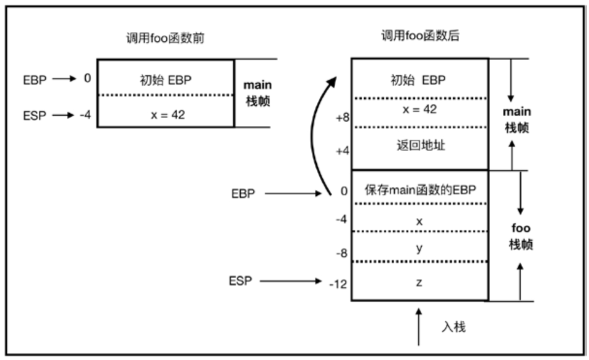{.u54293}

图4-5：函数调用栈帧示意图
:::

在上述过程中，调用main和foo函数时，栈顶ESP地址会降低，因为要分配栈内存，栈向下增长，当foo函数执行完毕时，ESP地址会增长，因为栈内存会被释放。**随着栈内存的释放，函数中的局部变量也会被释放** ，所以可想而知，全局变量不会被存储到栈中。该过程说来简单，但其实底层涉及寻址、寄存器、汇编指令等比较复杂的协作过程，这些都是由编译器或解释器自动完成的，对于上层开发者来说，只需要了解栈内存的工作机制即可。

栈内存的工作方式是一个通用概念，不仅仅适用于Rust语言，也适用于其他编程语言。

### 4.1.2 堆 {#text00010.html#A5d1e0079-a874-4867-abd0-e0315b50c0c3 .title-left}

与栈类似，**堆** （heap）一般也有两种定义，一种是指数据结构，另一种是指堆内存。

在数据结构中，堆表示一种特殊的树形数据结构，特殊之处在于此树是一棵完全二叉树，它的特点是父节点的值要么都大于两个子节点的值，称为**大顶堆；** 要么都小于两个子节点的值，称为**小顶堆** 。一般用于实现堆排序或优先队列。栈数据结构和栈内存在特性上还有所关联，但**堆数据结构和堆内存并无直接的联系** 。

栈内存中保存的数据，生命周期都比较短，会随着函数调用的完成而消亡。但很多情况下会需要能相对长久地保存在内存中的数据，以便跨函数使用，这就是堆内存发挥作用的地方。堆内存是一块巨大的内存空间，占了虚拟内存空间的绝大部分。程序不可以主动申请栈内存，但可以主动申请堆内存。在堆内存中存放的数据会在程序运行过程中一直存在，除非该内存被主动释放掉。

在C语言中，程序员可以通过调用malloc函数来申请堆内存，并可以通过free函数来释放它；在C++语言中，可以使用new和delete函数。包含GC的编程语言则是由GC来分配和回收堆内存的。

在实际工作中，对于事先知道大小的类型，可以分配到栈中，比如固定大小的数组。但是如果需要动态大小的数组，则需要使用堆内存。开发者只能通过指针来掌握已分配的堆内存，这本身就带来了安全隐患，如果指针指向的堆内存被释放掉但指针没有被正确处理，或者该指针指向一个不合法的内存，就会带来内存不安全问题。所以，面向对象大师Bertrand Meyer ^[\[2\]](#text00010.html#nAE7213BA37464AE5BB3C8D0CB9D5F828){#text00010.html#nAE7213BA37464AE5BB3C8D0CB9D5F828s}^ 才会说："要么保证软件质量，要么使用指针，两者不可兼得。"

堆是一大块内存空间，程序通过malloc申请到的内存空间是大小不一、不连续且无序的，所以如何管理堆内存是一个问题。这就涉及堆分配算法，堆分配算法有很多种，就本质而言可以分为两大类：**空闲链表** （**Free List** ）和**位图标记** （**Bitmap** ）。

空闲链表实际上就是把堆中空闲的内存地址记录为链表，当系统收到程序申请时，会遍历该链表；当找到适合的空间堆节点时，会将此节点从链表中删除；当空间被回收以后，再将其加到空闲链表中。空闲链表的优势是实现简单，但如果链表遭到破坏，整个堆就无法正常工作。

位图的核心思想是将整个堆划分为大量大小相等的块。当程序申请内存时，总是分配整数个块的空间。每块内存都用一个二进制位来表示其状态，如果该内存被占用，则相应位图中的位置置为 1；如果该内存空闲，则相应位图中的位置置为 0。位图的优势是速度快，如果单个内存块数据遭到破坏，也不会影响整个堆，但缺点是容易产生内存碎片。

不管是什么算法，分配的都是虚拟地址空间。所以当堆空间被释放时，并不代表指物理空间也马上被释放。堆内存分配函数 malloc 和回收函数 free 背后是内存分配器（memory allocator），比如glibc的内存分配器ptmallac2，或者FreeBSD平台的jemalloc。这些内存分配器负责管理申请和回收堆内存，当堆内存释放时，内存被归还给了内存分配器。内存分配器会对空闲的内存进行统一"整理"，在适合（比如空闲内存达到2048KB）的时候，才会把内存归还给系统，也就是指释放物理空间。

Rust编译器目前自带两个默认分配器：**alloc_system** 和**alloc_jemalloc** 。在**Rust 2015** 版本下，编译器产生的二进制文件默认使用alloc_jemalloc（某些平台可能不支持jemalloc），而对于静态或动态链接库，默认使用alloc_system。在**Rust 2018** 版本下，默认使用alloc_system，并且可以由开发者自己指派Jemalloc或其他第三方分配器。

Jemalloc的优势有以下几点：

· 分配或回收内存更快速。

· 内存碎片更少。

· 多核友好。

· 良好的可伸缩性。

Jemalloc 是现代化的业界流行的内存分配解决方案，它整块批发内存（称为 chunk）以供程序使用，而非频繁地使用系统调用（比如 brk 或 mmap）来向操作系统申请内存。其内存管理采用层级架构，分别是线程缓存tcache、分配区arena和系统内存（system memory），不同大小的内存块对应不同的分配区。每个线程对应一个 tcache，tcache 负责当前线程所使用内存块的申请和释放，避免线程间锁的竞争和同步。tcache是对arena中内存块的缓存，当没有tcache时则使用arena分配内存。arena采用内存池思想对内存区域进行了合理划分和管理，在有效保证低碎片的前提下实现了不同大小内存块的高效管理。当 arena 中有不能分配的超大内存时，再直接使用mmap从系统内存中申请，并使用红黑树进行管理。

即使堆分配算法再好，也只是解决了堆内存合理分配和回收的问题，其访问性能远不如栈内存。存放在堆上的数据要通过其存放于栈上的指针进行访问，这就至少多了一层内存中的跳转。所以，能放在栈上的数据最好不要放到堆上。因此，Rust的类型默认都是放到栈上的。

### 4.1.3 内存布局 {#text00010.html#Ab673007b-2077-4c2b-9c01-39ff226f7733 .title-left}

内存中数据的排列方式称为**内存布局** 。不同的排列方式，占用的内存不同，也会间接影响CPU访问内存的效率。为了权衡空间占用情况和访问效率，引入了内存对齐规则。

CPU在单位时间内能处理的一组二进制数称为**字** ，这组二进制数的位数称为**字长** 。如果是32位CPU，其字长为32位，也就是4个字节。一般来说，字长越大，计算机处理信息的速度就越快，例如，64位CPU就比32位CPU效率更高。

以32位CPU为例，CPU每次只能从内存中读取4个字节的数据，所以每次只能对4的倍数的地址进行读取。

假设现有一整数类型的数据，首地址并不是4的倍数，不妨设为0x3，则该类型存储在地址范围是 0x3～0x7 的存储空间中。因此，CPU 如果想读取该数据，则需要分别在 0x1 和0x5处进行两次读取，而且还需要对读取到的数据进行处理才能得到该整数，如图4-6所示。CPU 的处理速度比从内存中读取数据的速度要快得多，因此减少 CPU 对内存空间的访问是提高程序性能的关键。

::: center
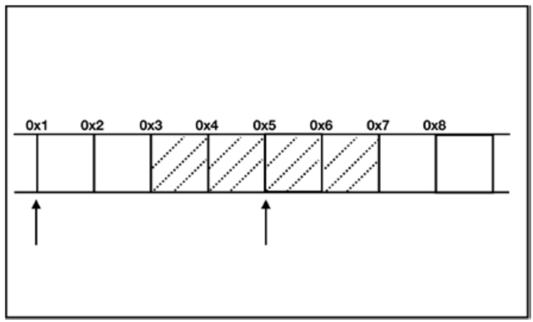{.u54292}

图4-6：CPU读取首地址非4的倍数的数据
:::

因此，采取内存对齐策略是提高程序性能的关键。对于图4-6中展示的整数类型，因为是32位CPU，所以只需要按4字节对齐，如图4-7所示，CPU只需要读取一次。

::: center
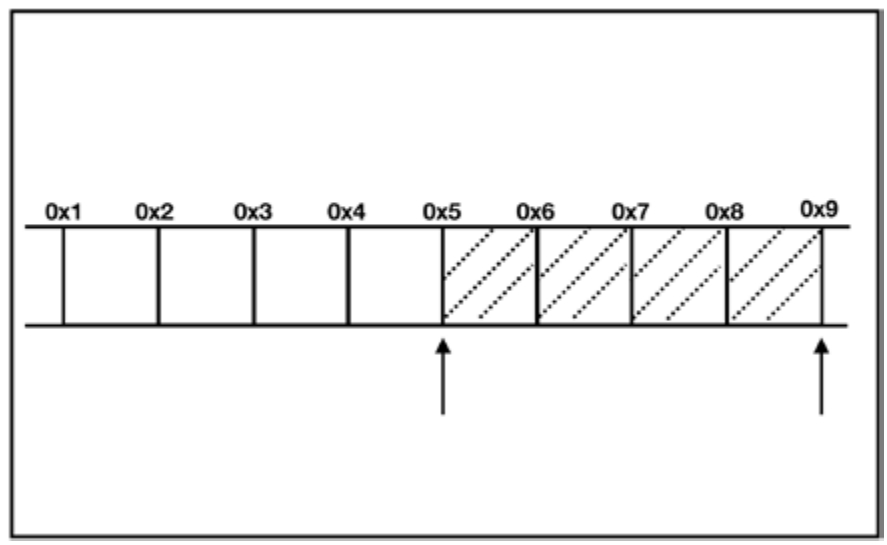{.u54291}

图4-7：CPU读取内存对齐数据
:::

因为对齐的是字节，所以内存对齐也叫**字节对齐** 。内存对齐是编译器或虚拟机（比如JVM）的工作，不需要人为指定，但是作为开发者需要了解内存对齐的规则，这有助于编写出合理利用内存的高性能程序。

内存对齐包括基本数据对齐和结构体（或联合体）数据对齐。对于基本数据类型，默认对齐方式是按其大小进行对齐，也被称作**自然对齐** 。比如Rust中u32类型占4字节，则它默认对齐方式为4字节对齐。对于内部含有多个基本类型的结构体来说，对齐规则稍微有点复杂。

假设对齐字节数为*N* （*N* =1，2，4，8，16），每个成员内存长度为Len，Max（Len）为最大成员内存长度。如果没有外部明确的规定，*N* 默认按Max（Len）对齐。字节对齐规则为：

· 结构体的起始地址能够被Max（Len）整除。

· 结构体中每个成员相对于结构体起始地址的偏移量，即对齐值，应该是 Min（N，Len）的倍数，若不满足对齐值的要求，编译器会在成员之间填充若干个字节。

· 结构体的总长度应该是Min（N，Max（Len））的倍数，若不满足总长度要求，则编译器会在为最后一个成员分配空间后，在其后面填充若干个字节。

下面用代码清单4-2中展示的Rust结构体验证此规则。

**代码清单4-2：以Rust中的结构体为例验证结构体字节对齐规则**

::: center
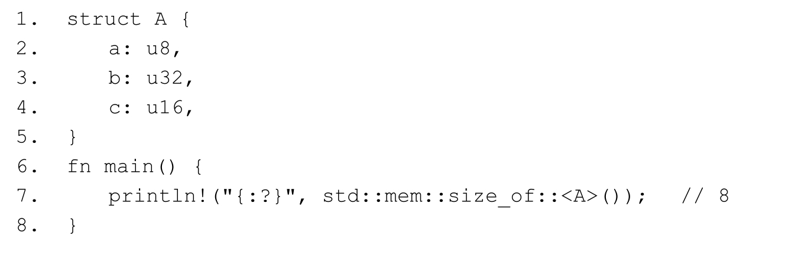{.u54290}
:::

代码清单4-2中的std：：mem：：size_of：：＜A＞（）函数可以计算结构体A的内存占用大小。基本数据类型u8占1个字节，u32占4个字节，u16占2个字节。结构体A的内存对齐（即字节对齐）前后的布局对比如图4-8所示。

::: center
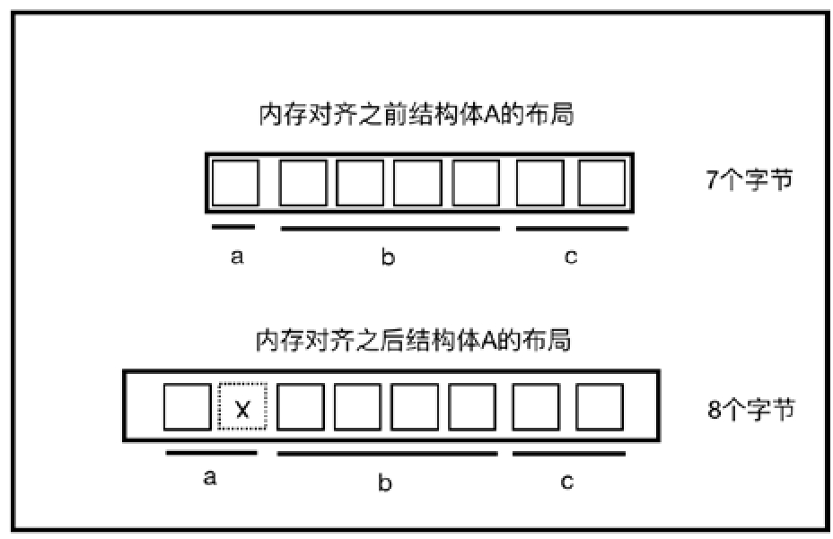{.u54289}

图4-8：结构体A的内存对齐前后的布局对比
:::

图4-8中的一个方块代表一个字节，注意一个字节是8个比特位。内存对齐之前，结构体A占用7个字节。代码清单4-2中结构体A没有明确指定字节对齐值，所以默认按其最长成员的值来对齐，结构体A中最长的成员是b，占4个字节。那么对于成员a来说，它的对齐值为Min（4，1），即1，所以a需要补齐一个字节的空间，如图4-8中虚线x框所示，那么现在a的大小是2个字节。成员b已经是对齐的，成员c是结构体中最后一位成员，当前结构体A的总长度为a、b、c之和，占8个字节，正好是Min（4，4），也就是4的倍数，所以成员c不需要再补齐。而结构体A实际占用也是8个字节。

联合体（Union）和结构体不同的地方在于，联合体中的所有成员都共享一段内存，所有成员的首地址都是一样的，但为了能够容纳所有成员，就必须可以容纳其中最长的成员。所以联合体以最长成员为对齐数。代码清单4-3展示了Rust中的联合体字节对齐。

**代码清单4-3：Rust中联合体字节对齐**

::: center
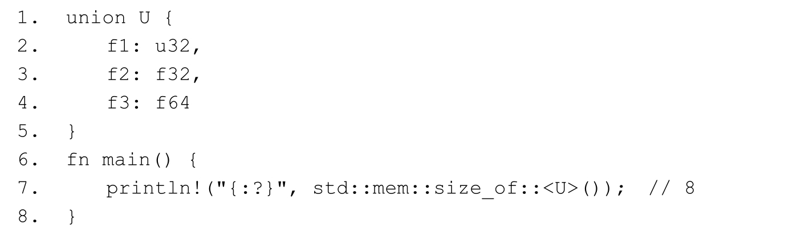{.u54288}
:::

在代码清单4-3中，**f1** 和**f2** 各占4个字节，**f3** 占8个字节，其中f3最长，所以联合体U占8个字节。f1、f2和f3共用内存，8个字节够用了。

## 4.2 Rust中的资源管理 {#text00010.html#Ae886007d-1400-4387-8032-6f1daf25483d .title-left}

采用虚拟内存空间在栈和堆上分配内存，这是诸多编程语言通用的内存管理基石，Rust当然也不例外。然而，与C/C++语言不同的是，Rust不需要开发者显式地通过malloc/new或free/delete 之类的函数去分配和回收堆内存。Rust 可以静态地在编译时确定何时需要释放内存，而不需要在运行时去确定。Rust有一套完整的内存管理机制来保证资源的合理利用和良好的性能。

### 4.2.1 变量和函数 {#text00010.html#Ad58e007d-482d-40c6-9bf4-97a0e3697788 .title-left}

第2章提到过，变量有两种：**全局变量** 和**局部变量** 。全局变量分为**常量变量** 和**静态变量** 。局部变量是指在函数中定义的变量。

常量使用 **const** 关键字定义，并且需要显式指明类型，只能进行简单赋值，只能使用支持CTFE的表达式。常量没有固定的内存地址，因为其生命周期是全局的，随着程序消亡而消亡，并且会被编译器有效地内联到每个使用到它的地方。

静态变量使用 **static** 关键字定义，跟常量一样需要显式指明类型，进行简单赋值，而不能使用任何表达式。静态变量的生命周期也是全局的，但它并不会被内联，每个静态变量都有一个固定的内存地址。

静态变量并非被分配到栈中，也不是在堆中，而是和程序代码一起被存储于**静态存储区** 中。静态存储区是伴随着程序的二进制文件的生成（编译时）被分配的，并且在程序的整个运行期都会存在。Rust中的字符串字面量同样是存储于静态内存中的。

**检测是否声明未初始化变量**

**在函数中定义的局部变量都会被默认存储到栈中** 。这和C/C++语言，甚至更多的语言行为都一样，但不同的是，Rust编译器可以检查未初始化的变量，以保证内存安全，如代码清单4-4所示。

**代码清单4-4：检查未初始化变量**

::: center
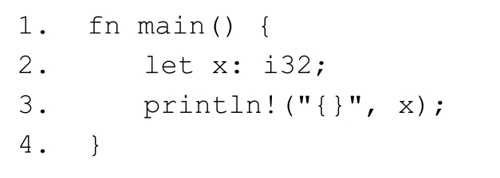{.u54287}
:::

代码清单4-4编译会报如下错误：

::: center
{.u54286}
:::

Rust编译器会对代码做基本的静态分支流程分析。代码清单4-4中的x在整个main函数中并没有绑定任何值，这样的代码会引起很多内存不安全的问题，比如计算结果非预期、程序崩溃等，所以Rust编译器必须报错。

**检测分支流程是否产生未初始化变量**

Rust编译器的静态分支流程分析比较严格。代码清单4-5展示了if语句中初始化变量的情况。

**代码清单4-5：if语句中初始化变量**

::: center
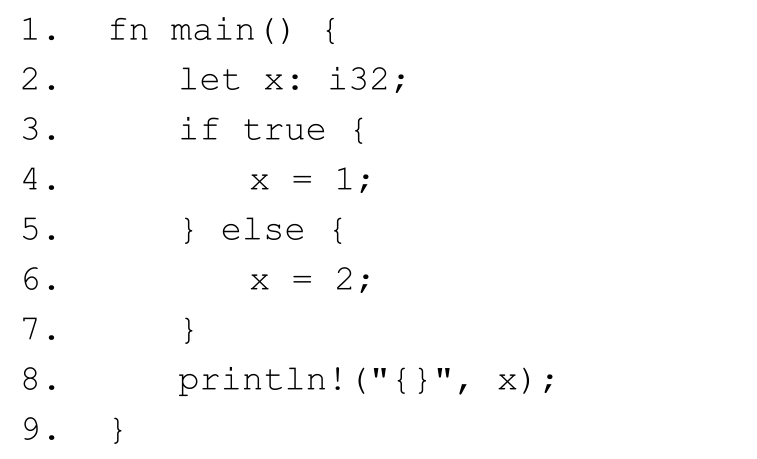{.u54285}
:::

在代码清单4-5中，if分支的所有情况都给变量x绑定了值，所以它可以正确运行。但是如果去掉else分支，编译器就会报以下错误：

::: center
{.u54284}
:::

这说明编译器已经检查出变量x并未正确初始化。这可能有点反直觉，去掉了else分支之后，编译器的静态分支流程分析判断出在if表达式之外的println！也用到了变量x，但并未有任何值绑定行为。第2章提到过，编译器的静态分支流程分析并不能识别if表达式中的条件是true，所以它要检查所有的分支情况。

如果把代码清单4-5中else分支和第8行的println！语句都去掉，则可以正常编译运行。因为在if表达式之外再没有使用到x的地方，在唯一使用到x的if表达式中已经绑定了值，所以编译正常。

**检测循环中是否产生未初始化变量**

还有另外一种情况值得考虑，当在循环中使用 break 关键字的时候（如代码清单 4-6 所示），break会将分支中的变量值返回。

**代码清单4-6：在loop循环中使用break关键字**

::: center
{.u54283}
:::

::: center
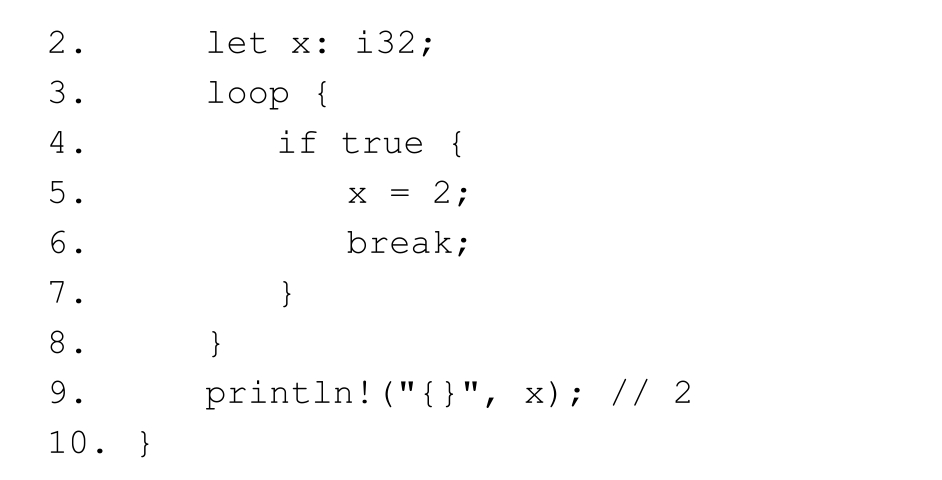{.u54282}
:::

从Rust编译器的静态分支流程分析可以知道，break会将x的值返回，所以在loop循环之外的println！语句可以正常打印x的值。

**空数组或向量可以初始化变量**

当变量绑定空的数组或向量时（如代码清单4-7所示），需要显式指定类型，否则编译器无法推断其类型。

**代码清单4-7：绑定空数组或向量**

::: center
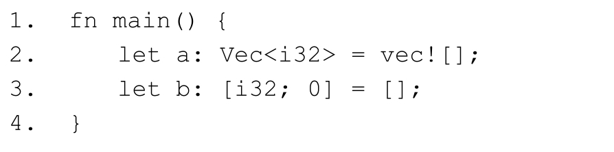{.u54281}
:::

如果不加显式类型标注，编译器会报如下错误：

::: center
{.u54280}
:::

空数组或向量可以用来初始化变量，但目前暂时无法用于初始化常量或静态变量。

**转移所有权产生了未初始化变量**

当将一个已初始化的变量y绑定给另外一个变量y2时（如代码清单4-8所示），Rust会把变量y看作逻辑上的**未初始化变量** 。

**代码清单4-8：将已初始化变量绑定给另外一个变量**

::: center
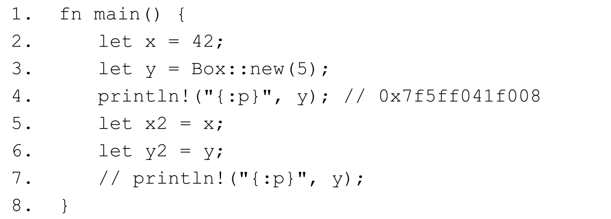{.u54279}
:::

在代码清单4-8中，变量x为原生整数类型，默认存储在栈上。变量y属于指针类型，通过Box：：new方法在堆上分配的内存返回指针，并与y绑定，而指针y被存储于栈上，可以通过第4行println！语句打印指针地址验证这一点，代码清单4-8中的main函数的变量内存布局如图4-9所示。

::: center
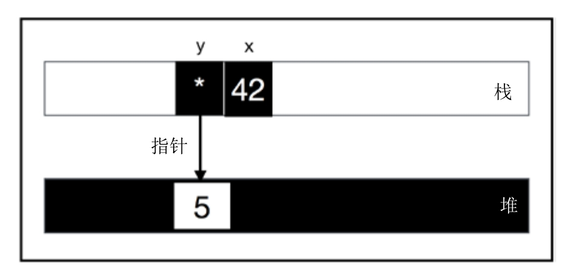{.u54278}

图4-9：main函数中变量内存布局示意图
:::

第5行代码让变量x2绑定了变量x，因为x是原生整数类型，实现了Copy trait，所以这里变量x并未发生任何变化。但是在第6行代码中，变量y2绑定了变量y，因为y是Box＜T＞指针，并未实现Copy trait，所以此时y的值会移动给y2，而变量y会被编译器看作一个未初始化的变量，所以当第7行代码再次使用变量y时，编译器就会报错。但是此时如果给y再重新绑定一个新值，y依然可用，这个过程称为**重新初始化** 。

当main函数调用完毕时，栈帧会被释放，变量x和y也会被清空。变量x为原生类型，本就存储在栈上，所以被释放是没关系的。但是变量y是指针，如果就这样被清空，那么其指向的已分配堆内存怎么办？代码清单4-8中并没有使用free之类的函数去清空堆内存，这会引起内存泄漏的问题吗？答案是不会，因为 Box＜T＞类型的指针会在变量 y 被清空之时，自动清空其指向的已分配堆内存。

像Box＜T＞这样的指针被称为**智能指针** 。使用智能指针，可以让Rust利用栈来隐式自动释放堆内存，从而避免显式调用free之类的函数去释放内存。这样其实更加符合开发者的直觉。

### 4.2.2 智能指针与RAII {#text00010.html#Ad30b0080-c9a0-4935-887b-e52e3f786bd6 .title-left}

Rust中的指针大致可以分为三种：**引用** 、**原生指针** （裸指针）和**智能指针** 。

引用就是Rust提供的普通指针，用&和&mut操作符来创建，形如&T和&mut T。原生指针是指形如\*const T和\*mut T这样的类型。

引用和原生指针类型之间的异同如下。

· 可以通过as操作符随意转换，例如&T as\*const T和&mut T as\*mut T。

· 原生指针可以在 unsafe 块下任意使用，不受 Rust 的安全检查规则的限制，而引用则必须受到编译器安全检查规则的限制。

**智能指针**

智能指针（smart pointer）实际上是一种结构体，只不过它的行为类似指针。智能指针是对指针的一层封装，提供了一些额外的功能，比如自动释放堆内存。智能指针区别于常规结构体的特性在于，它实现了**Deref** 和**Drop** 这两个trait。Deref提供了解引用能力，Drop提供了自动析构的能力，正是这两个trait让智能指针拥有了类似指针的行为。类型决定行为，同时类型也取决于行为，不是指针胜似指针，所以称其为智能指针。开发者也可以编写自己的智能指针。

第3章已经着重介绍过Deref，用它可以重载解引用运算符**\*** 。智能指针结构体中实现了Deref，重载了解引用运算符的行为。其实String和Vec类型也是一种智能指针（如代码清单4-9所示），它们也都实现了Deref和Drop。

**代码清单4-9：String和Vec类型也是一种智能指针**

::: center
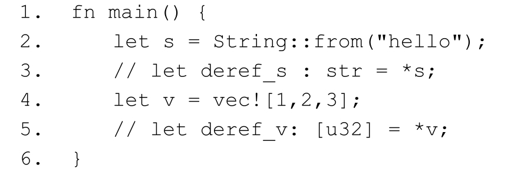{.u54277}
:::

String 类型和 Vec 类型的值都是被分配到堆内存并返回指针的，通过将返回的指针封装来实现Deref和Drop，以自动化管理解引用和释放堆内存。代码清单4-9中第3行代码对变量s进行了解引用操作，其返回的是str类型，因为str是大小不确定的类型，所以编译器会报错，这里将其注释掉了，String 类型和 Vec 类型虽然是智能指针的一种，但并不是让开发者把它们当作指针来使用的。这里只是为了演示说明，真实代码中并不会这样用。同理，第5行代码对变量v解引用，返回的是\[u32\]类型，依然是大小不确定的类型，所以这里也将其注释掉了。

当main函数执行完毕，栈帧释放，变量s和v被清空之后，其对应的已分配堆内存会被自动释放。这是因为它们实现了Drop。

Drop对于智能指针来说非常重要，因为它可以帮助智能指针在被丢弃时自动执行一些重要的清理工作，比如**释放堆内存** 。更重要的是，除了释放内存，Drop还可以做很多其他的工作，比如释放文件和网络连接。Drop的功能有点类似GC，但它比GC的应用更加广泛，GC只能回收内存，而Drop可以回收内存及内存之外的一切资源。

**确定性析构**

其实这种资源管理的方式有一个术语，叫**RAII** （**Resource Acquisition Is Initialization** ），意思是资源获取及初始化。RAII和智能指针均起源于现代C++，智能指针就是基于RAII机制来实现的。

在现代C++中，RAII的机制是使用构造函数来初始化资源，使用析构函数来回收资源。看上去RAII所要做的事确实跟GC差不多。但RAII和GC最大的不同在于，RAII将资源托管给创建堆内存的**指针对象** 本身来管理，并保证资源在其生命周期内始终有效，一旦生命周期终止，资源马上会被回收。而GC是由第三方只针对内存来统一回收垃圾的，这样就很被动。正是因为RAII的这些优势，Rust也将其纳入了自己的体系中。

Rust中并没有现代C++所拥有的那种构造函数（constructor），而是直接对每个成员的初始化来完成构造，也可以直接通过封装一个静态函数来构造"构造函数"。而Rust中的Drop就是析构函数（Destructor）。

Drop被定义于std：：ops模块中，其内部实现如代码清单4-10所示。

**代码清单4-10：Drop的内部实现**

::: center
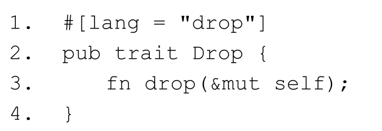{.u54276}
:::

从代码清单4-10可以看出来，Drop已经被标记为语言项，这表明该trait为语言本身所用，比如智能指针被丢弃后自动触发析构函数时，编译器知道该去哪里找Drop。

代码清单4-11通过为结构体实现Drop来展示其特性。

**代码清单4-11：为结构体实现Drop**

::: center
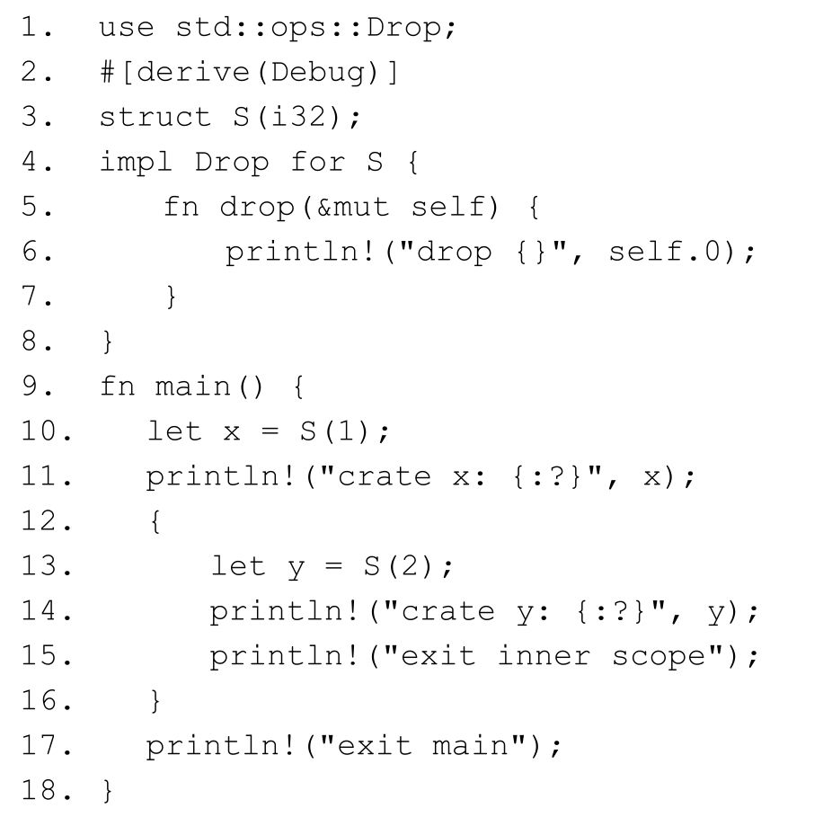{.u54275}
:::

代码清单4-11中定义了元组结构体S，通过impl为结构体S实现了Drop定义的drop方法，令其在被调用的时候执行指定的打印输出。main函数中声明了两个结构体实例x和y，y被置于内部scope中。

代码清单4-11的输出结果如代码清单4-12所示。

**代码清单4-12：为结构体实现Drop的输出结果**

::: center
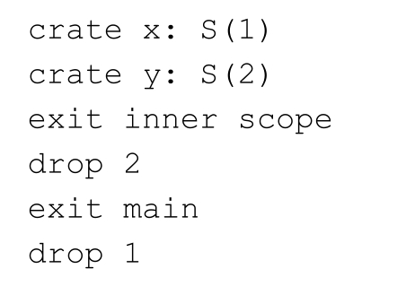{.u54274}
:::

在代码清单4-11中，变量x的作用域范围是整个main函数，而变量y的作用域范围是内部scope所界定的范围。通过输出结果来看，在变量x和y分别离开其作用域时，都执行了drop方法。所以RAII也有另外一个别名，叫**作用域界定的资源管理** （**Scope-Bound Resource Management** ，**SBRM** ）。

**这也正是Drop的特性，它允许在对象即将消亡之时，自行调用指定代码（drop方法）** 。

Rust中的一些常用类型，比如Vec、String和File等，均实现了Drop，所以不管是开发者使用Vec创建的动态数组被丢弃时，还是使用String类型创建的字符串被丢弃时，都不需要显式地释放堆内存，也不需要使用File进行文件读取，甚至不需要显式地关闭文件，因为Rust会自动完成这些操作。

**使用Valgrind来检测内存泄漏**

代码清单4-13使用了Box＜T＞指针来分配堆内存，并配合一款知名的专门用于内存调试和检测内存泄漏的工具Valgrind来验证其是否有内存泄漏。

**代码清单4-13：使用Box＜T＞指针分配内存**

::: center
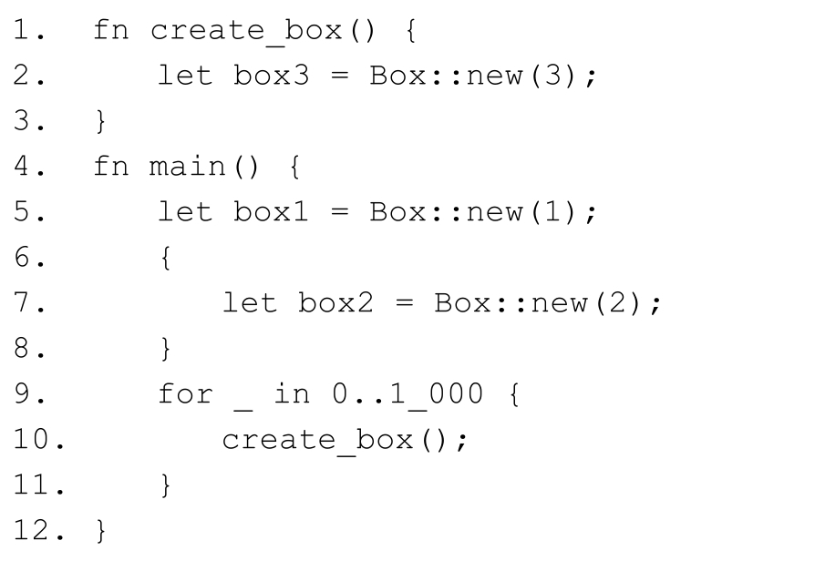{.u54273}
:::

将代码清单4-13保存到box.rs文件中，使用rustc命令将其编译为二进制文件box：

::: center
{.u54272}
:::

然后再执行如下命令：

::: center
{.u54271}
:::

输出结果为：

::: center
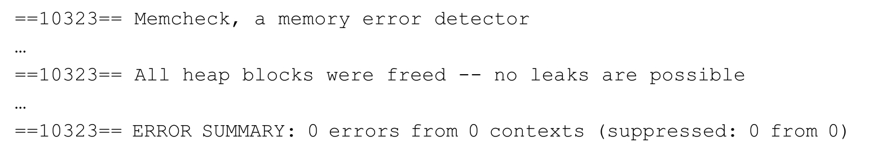{.u54270}
:::

Valgrind给出了提示：所有堆内存都已释放。证明了Box＜T＞指针随着栈帧销毁而被丢弃时，自动调用了析构函数，释放了堆内存。

**drop-flag**

在代码清单4-13中，变量box1和box3的析构函数分别是在离开main函数和create_box函数之后调用的。而变量 box2 是在离开由花括号构造的显式内部作用域时调用的。它们的析构函数调用顺序是在编译期（而非运行时）就确定好的。这是因为Rust编译器使用了名为**drop-flag** 的"魔法"，在函数调用栈中为离开作用域的变量自动插入布尔标记，标注是否调用析构函数，这样，在运行时就可以根据编译期做的标记来调用析构函数了。

对于结构体或枚举体这种复合类型来说，并不存在隐式的drop-flag。只有在函数调用时，这些复合结构实例被初始化之后，编译器才会加上drop-flag。如果复合结构本身实现了Drop，则会调用它自己的析构函数；否则，会调用其成员的析构函数。

当变量被绑定给另外一个变量，值发生移动时，也会被加上drop-flag，在运行时会调用析构函数。加上drop-flag的变量意味着其生命周期的结束，之后再也不能被访问。这其实就是第5章会讲到的所有权机制。

这意味着，可以使用花括号构造显式作用域来"主动析构"那些需要提前结束生命周期的变量，如代码清单4-14所示。

**代码清单4-14：使用花括号构造显式作用域主动析构局部变量**

::: center
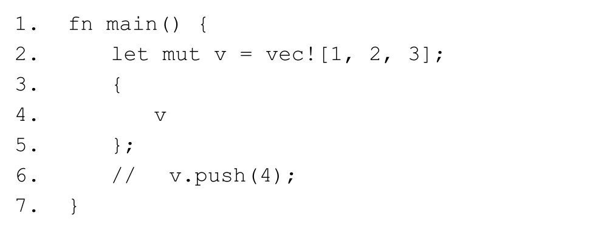{.u54269}
:::

在代码清单4-14中，变量v被置于花括号构造的显式内部作用域中，当其离开此内部作用域时，就会调用v的析构函数，所以如果在内部作用域外使用push方法，则会报错，因为变量v已经被释放了。

值得注意的是，对于实现Copy的类型，是没有析构函数的。因为实现了Copy的类型会复制，其生命周期不受析构函数的影响，所以也就没必要存在析构函数。

同时，**变量遮蔽** （**shadowing** ）并不会导致其生命周期提前结束，如代码清单4-15所示。

**代码清单4-15：变量遮蔽不等于生命周期提前结束**

::: center
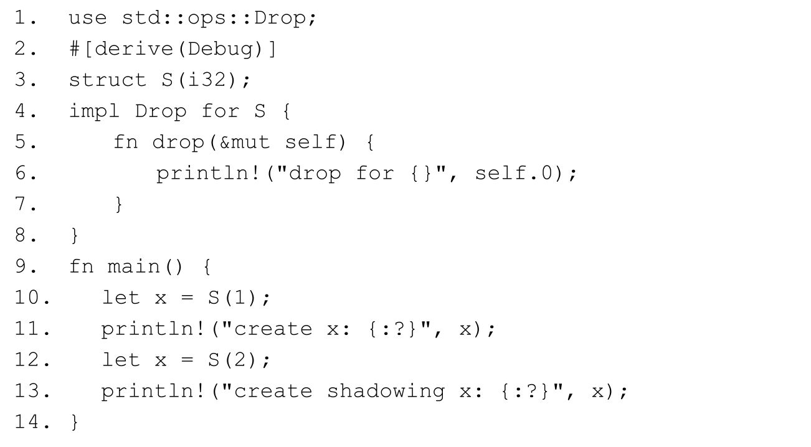{.u54268}
:::

代码清单4-15的输出结果表明，变量遮蔽并不会主动析构原来的变量，它会一直存在，直到函数退出。

### 4.2.3 内存泄漏与内存安全 {#text00010.html#A27810084-7501-4d2d-94f3-4fde8f6a1551 .title-left}

RAII的设计目标就是替代GC，防止内存泄漏。然而RAII并非"银弹"，如果使用不当，还是会造成内存泄漏的。

**制造内存泄漏**

有的时候，需要对同一个堆内存块进行多次引用。比如，要创建一个链表，如图4-10所示。

::: center
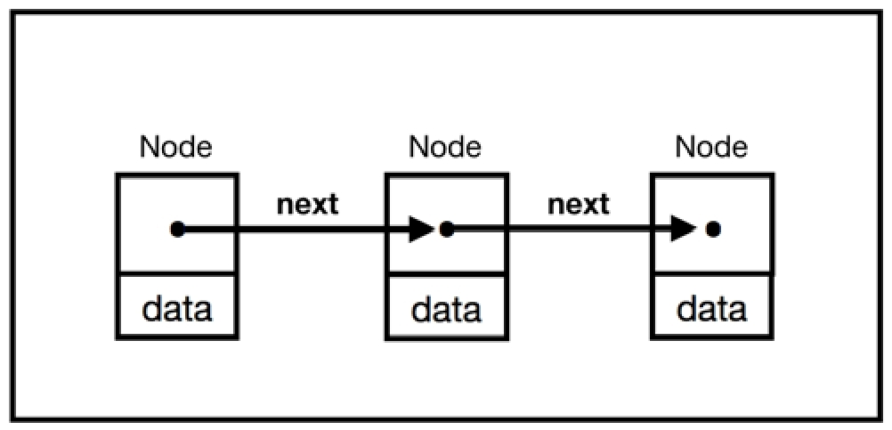{.u54267}

图4-10：创建链表示意图
:::

那么，首先需要创建一个节点Node结构体，如代码清单4-16所示。

**代码清单4-16：链表节点Node结构体**

::: center
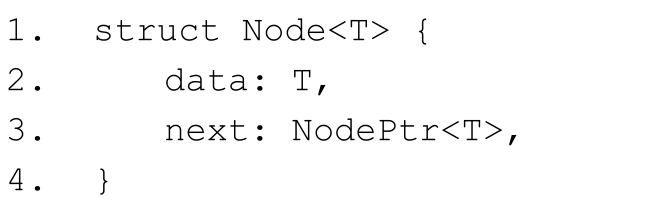{.u54266}
:::

仔细思考，此处NodePtr＜T＞该如何设计呢？可以设想一下伪代码：

::: center
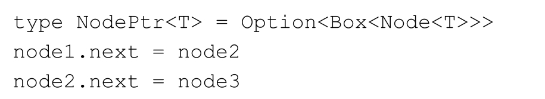{.u54265}
:::

这里的NodePtr＜T＞首先是一个Option＜T＞，因为链表的结尾节点之后有可能不存在下一个节点，所以需要 Some＜T＞和 None。然后，还需要一个智能指针来保持节点之间的连接，所以此处设想NodePtr＜T＞为Opiton＜Box＜Node＜T＞＞＞。

然后就是对node1.next和node2.next赋值，使得node1、node2和node3节点相连，就像图4-10展示的那样。但是这里有个问题，因为Box＜T＞指针对所管理的堆内存有唯一拥有权，所以并不共享。代码清单4-17展示了如何使用Box＜T＞来构造链表节点之间的指针。

**代码清单4-17：使用Box＜T＞来构造链表节点之间的指针**

::: center
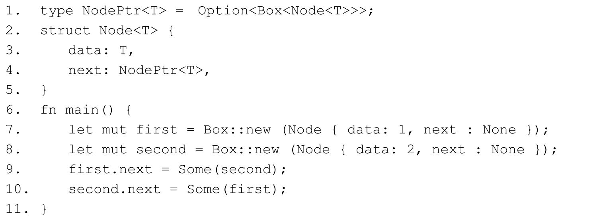{.u54264}
:::

代码清单4-17编译会报如下错误：

::: center
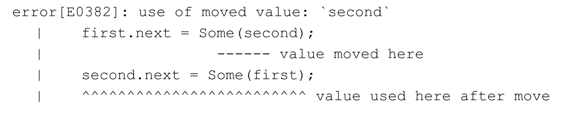{.u54263}
:::

代码清单4-17的第9行将second节点指定给了first，因为sencond使用了Box＜T＞指针，此时second发生了值移动，变成了未初始化变量，所以在第10行使用它的时候，编译器报错了。

Rust另外提供了智能指针**Rc＜T＞** ，它的名字叫**引用计数** （**reference counting** ）智能指针，使用它可以共享同一块堆内存。可以将 Box＜T＞换为 Rc＜T＞，此时 NodePtr＜T＞就变成了Option＜Rc＜Node＜T＞＞＞。但是Rc＜T＞有一个特性：它包含的数据T是不可变的，而second.next=Some（first）这种操作需要是可变的，因为要修改second中next成员的值。所以，仅仅使用Rc＜T＞还不够，如代码清单4-18所示。

**代码清单4-18：仅使用Rc＜T＞的情况**

::: center
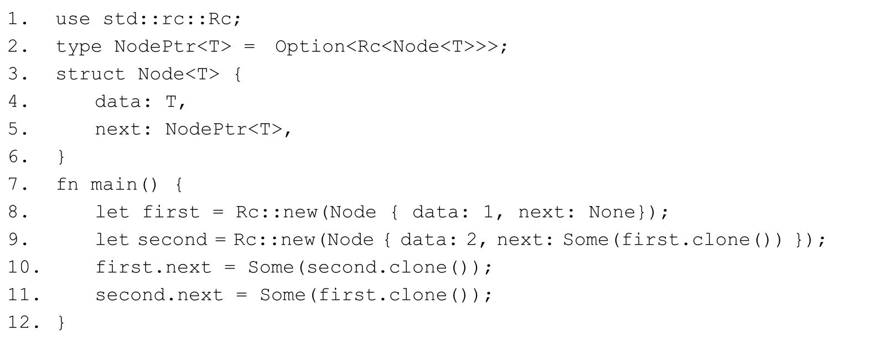{.u54262}
:::

在代码清单4-18中，变量first和second使用了clone方法，但并不会真的复制，Rc＜T＞内部维护着一个引用计数器，每clone一次，计数器加1，当它们离开main函数作用域时，计数器会被清零，对应的堆内存也会被自动释放。

不出所料，代码清单4-18编译会报错。

::: center
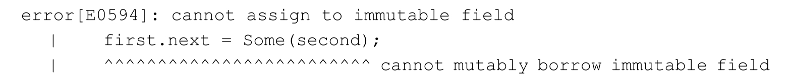{.u54261}
:::

编译器提示，不能对不可变字段进行修改。不过，Rust 提供了另外一个智能指针RefCell＜T＞，它提供了一种内部可变性，这意味着，它对编译器来说是不可变的，但在运行过程中，包含在其中的内部数据是可变的。那么我们使用RefCell＜T＞来重构代码清单4-18，此时NodePtr＜T＞就变成了Option＜Rc＜RefCell＜Node＜T＞＞＞＞，如代码清单4-19所示。

**代码清单4-19：使用RefCell＜T＞保证内部可变**

::: center
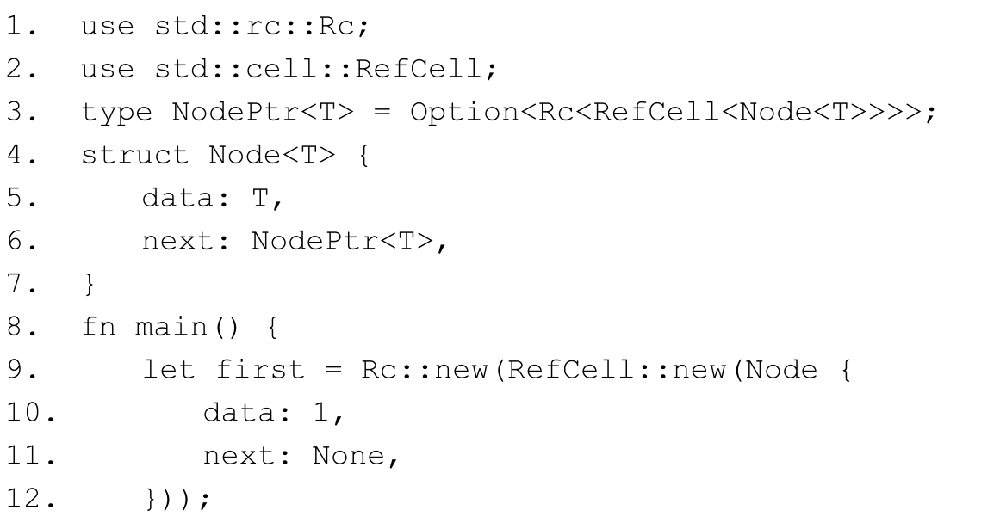{.u54260}
:::

::: center
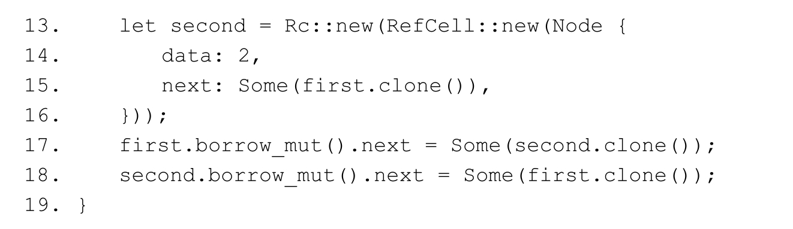{.u54259}
:::

代码清单 4-19 终于可以正常运行了，但是代码中使用了两种智能指针， **Rc＜T＞** 和**RefCell＜T＞** ，内存是否可以被正确释放？现在我们为Node结构体实现Drop，来验证内存是否可以被正确释放，如代码清单4-20所示。

**代码清单4-20：为Node结构体实现Drop**

::: center
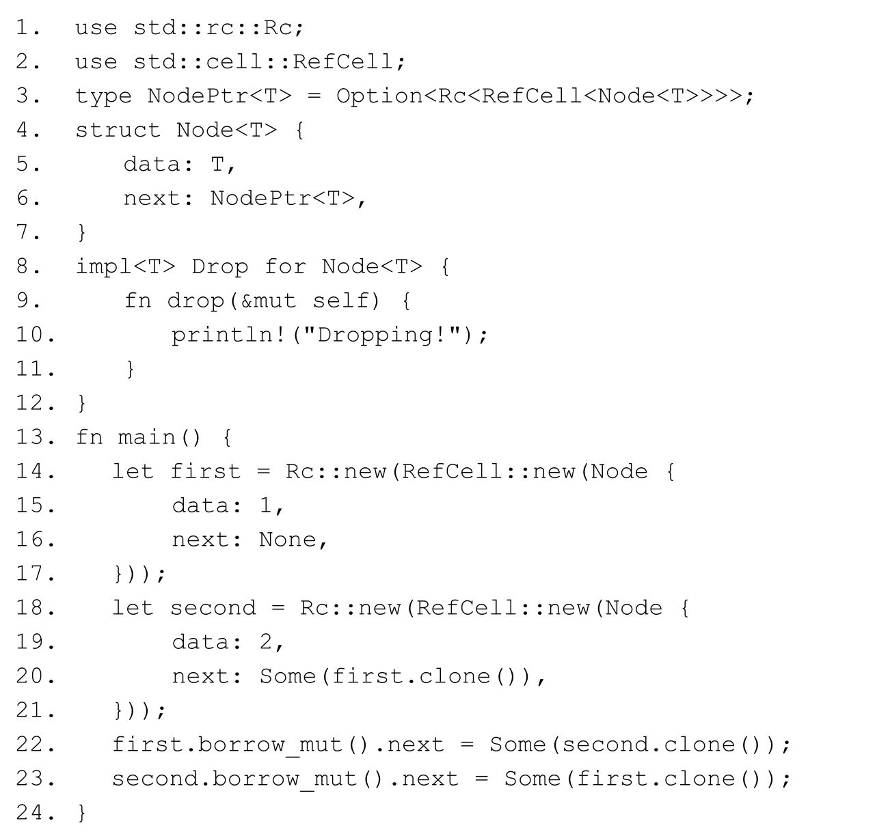{.u54258}
:::

在代码清单4-20中，Node＜T＞结构体实现了Drop，其析构函数drop会输出指定的字符串。第22行和第23行中出现了一个循环引用，first和second节点互相指向对方。但是编译运行之后并没有看到任何输出。这说明析构函数并没有执行，这里存在内存泄漏。

这是一次精心设计的内存泄漏，只是为了证明一件事：Rust并不能百分百地阻止内存泄漏，但也不是轻而易举就可以造成内存泄漏的**。**

**内存安全的含义**

Rust 不是号称内存安全的语言吗？为什么还可以造成内存泄漏？这也许是每个 Rust 初学者的疑问。但实际上，内存泄漏（Memory Leak）并不在内存安全（Memory Safety）概念范围内。

只要不会出现以下内存问题即为内存安全：

· **使用未定义内存。**

· **空指针。**

· **悬垂指针。**

· **缓冲区溢出。**

· **非法释放未分配的指针或已经释放过的指针。**

Rust中的变量必须初始化以后才可使用，否则无法通过编译器检查。所以，可以排除第一种情况，Rust不会允许开发者使用未定义内存。

**空指针** 就是指Java中的null、C++中的nullptr或者C中的NULL。而在Rust（特指Safe Rust）中，开发者没有任何办法去创建一个空指针，因为Rust不支持将整数转换为指针，也不支持未初始化变量。其他语言中引入空指针，是因为空指针可以在逻辑上表示不指向任何内存，比如一个方法返回空指针，表示其返回值不存在，便于在代码中进行逻辑判断。但这都是人为控制的，如果开发者并没有对空指针进行处理，就会出现问题。Rust中使用Option类型来代替空指针，Option实际是枚举体，包含两个值：Some（T）和None，分别代表两种情况，有和无。这就迫使开发者必须对这两种情况都做处理，以保证内存安全。

**悬垂指针** （**dangling pointer** ）是指堆内存已被释放，但其本身还没有做任何处理，依旧指向已回收内存地址的指针。如果悬垂指针被程序使用，则会出现无法预期的后果，代码清单4-21构造了一个垂悬指针。

**代码清单4-21：构造悬垂指针**

::: center
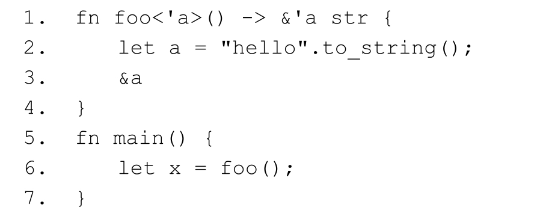{.u54257}
:::

代码清单4-21定义了foo函数，返回&＇a str类型，其中＇a为生命周期标记，在第5章会着重介绍。&＇a str类型实际是标注了生命周期标记的&str类型。该函数体内定义了局部变量a，并返回a的引用。但是局部变量a在离开foo函数之后会被销毁。如果把该引用传到函数外面，绑定给main函数中的变量x，则会出现问题。foo函数中的&a就是一个悬垂指针。

当然，Rust编译器是不会允许代码清单4-21编译通过的，它会报如下错误：

::: center
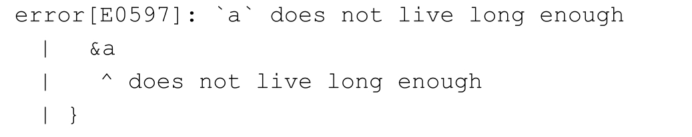{.u54256}
:::

编译器提示，变量a的生命周期很短暂------就这样简单地避免了一次悬垂指针导致的内存安全问题。这背后的功臣是第5章会着重介绍的Rust的所有权和借用机制。

缓冲区是指一块连续的内存区域，可保存相同类型的多个实例。缓冲区可以是栈内存，也可以是堆内存。一般可以使用数组来分配缓冲区。C和C++语言没有数组越界检查机制，当向局部数组缓冲区里写入的数据超过为其分配的大小时，就会发生缓冲区溢出。攻击者可利用缓冲区溢出来窜改进程运行时栈，从而改变程序正常流向，轻则导致程序崩溃，重则导致系统特权被窃取。而使用Rust则无须担心这种问题，Rust编译器在编译期就能检查出数组越界的问题，从而完美地避免了缓冲区溢出。在第3章和第4章中都已经举了不少相关示例。Rust中不会出现未分配的指针，所以也不存在非法释放的情况。同时，Rust的所有权机制严格地保证了析构函数只会调用一次，所以也不会出现非法释放已释放内存的情况。

总的来说，Rust对内存安全做出了百分之百的保证。但是这并不意味着能百分之百地阻止内存泄漏，因为内存泄漏是无法避免的，哪怕是拥有GC的语言，也照样会出现内存泄漏的问题。

**内存泄漏的原因**

在Rust中可导致内存泄漏的情况大概有以下三种：

· **线程崩溃，析构函数无法调用。**

· **使用引用计数时造成了循环引用。**

· **调用Rust标准库中的forget函数主动泄漏。**

对于线程崩溃，没有什么好的办法来阻止它；我们也已经见识过循环引用了。但是Rust为什么会提供一个主动泄漏内存的forget函数呢？

以上三种情况从本质上说就是，Rust并不会保证百分之百调用析构函数。析构函数可以做很多事情，除了释放内存，还可以释放其他资源，如果析构函数不能执行，不仅仅会导致内存泄漏，从更广的角度来看，还会导致其他资源泄漏。相比内存安全问题，资源泄漏其实并没有那么严重。以内存泄漏为例，一次内存泄漏不会有多大影响，但是一次内存不安全操作可能会导致灾难性的后果。

内存泄漏是指没有对应该释放的内存进行释放，属于没有对合法的数据进行操作。内存不安全操作是对不合法的数据进行了操作。两者性质不同，造成的后果也不同。

甚至有时候还需要进行主动泄漏。比如，通过FFI与外部函数打交道，把值交由C代码去处理，在Rust这边要使用forget函数来主动泄漏，防止Rust调用析构函数引起问题。第13章有关于forget函数的更详细的介绍。

### 4.2.4 复合类型的内存分配和布局 {#text00010.html#A397e0089-a79b-49d1-89b7-d11d83950ed6 .title-left}

对于基本原生数据类型来说，Rust是默认将其分配到栈中的。那么，结构体（Enum）或联合体（Union）是被分配在哪的呢？

结构体或联合体只是定义，看它们被分配在哪，主要是看其类型实例如何使用。代码清单4-22验证了三种复合结构内存的布局。

**代码清单4-22：验证三种复合结构内存布局**

::: center
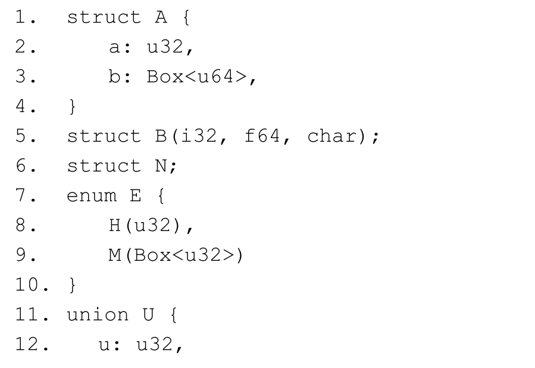{.u54255}
:::

::: center
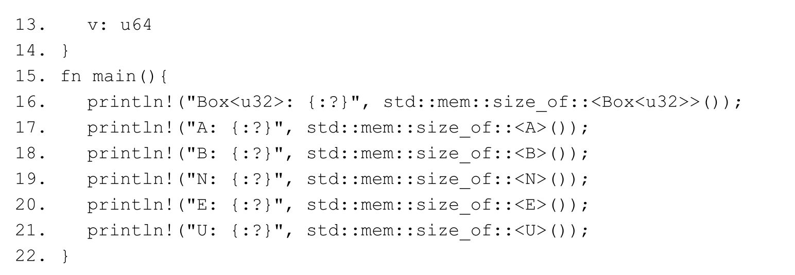{.u54254}
:::

代码清单4-22覆盖了Rust中三种自定义复合数据结构：结构体、枚举体和联合体。

结构体A的成员a为基本数字类型，b为Box＜T＞类型。根据内存对齐规则，结构体A的大小为16个字节，其内存对齐示意如图4-11所示。

::: center
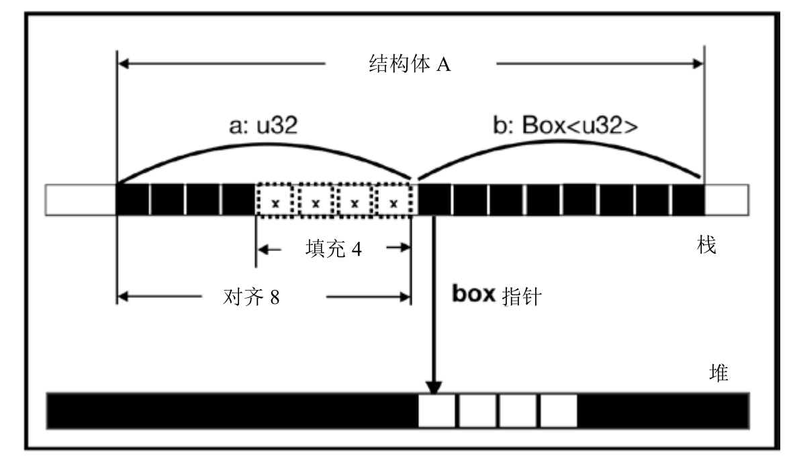{.u54253}

图4-11：结构体A的内存对齐示意图
:::

在图4-11中，每个方块代表一个字节。按照内存对齐规则，结构体A中的成员b最长，占8个字节，所以按8字节对齐，变量a需要补齐4个字节，整个结构体长度为a和b之和，占16个字节。

当结构体A在函数中有实例被初始化时，该结构体会被放到栈中，首地址为第一个成员变量a的地址，长度为16个字节。其中成员b是Box＜u32＞类型，会在堆内存上开辟空间存放数据，但是其指针会返回给成员b，并存放在栈中，一共占8个字节。

在代码清单 4-22 中，结构体 B 为元组结构体，其对齐规则和普通结构体一样，所以占16个字节。

结构体N为单元结构体，占0个字节。

枚举体E实际上是一种标签联合体（Tagged Union），和普通联合体（Union）的共同点在于，其成员变量也共用同一块内存，所以联合体也被称为共用体。不同点在于，标签联合体中每个成员都有一个标签（tag），用于显式地表明同一时刻哪一个成员在使用内存，而且标签也需要占用内存。操作枚举体的时候，需要匹配处理其所有成员，这也是其被称为枚举体的原因，图4-12展示了枚举体E内存对齐的布局。

::: center
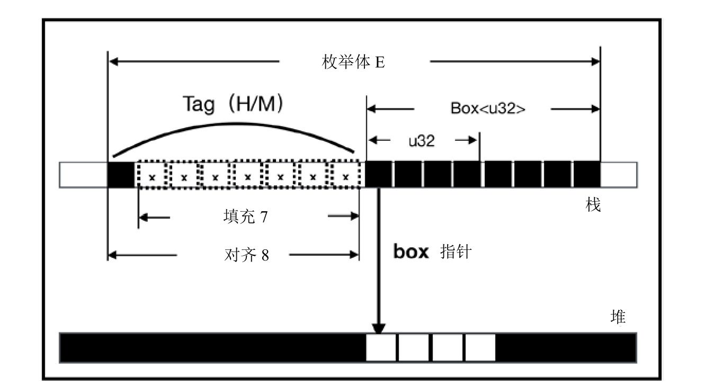{.u54252}

图4-12：枚举体E的内存对齐示意图
:::

在枚举体E的成员H（u32）和M（Box＜u32＞）中，H和M就是标签，占1个字节。但是H和M都带有自定义数据，u32和Box＜u32＞，其中Box＜u32＞最长，按联合体的内存对齐规则，此处按8字节对齐。所以，标签需要补齐到8个字节，自定义数据取最长字节，即8个字节，整个枚举体的长度为标签和自定义数据之和，为16个字节。联合体U没有标签，按内存对齐规则，占8个字节。

当枚举体和联合体在函数中有实例被初始化时，与结构体一样，也会被分配到栈中，占相应的字节长度。如果成员的值存放于堆上，那么栈中就存放其指针。

代码清单4-22最终的输出结果如代码清单4-23所示。

**代码清单4-23：三种复合结构内存布局的输出结果**

::: center
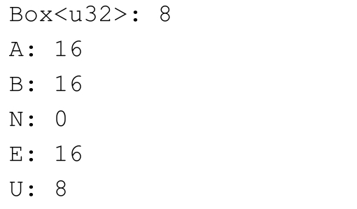{.u54251}
:::

代码清单4-23展示的输出结果和按内存对齐规则计算出来的结果一致。

## 4.3 小结 {#text00010.html#A9347008b-2c5d-4c56-a65a-fa25bbd9e95c .title-left}

本章首先从诸多编程语言内存管理机制出发，将其归为两类：手动内存管理类和自动管理类。古老的C和C++语言采用手动内存管理机制，随着GC的发明以及垃圾回收算法的不断完善，大多数现代高级编程语言采用GC进行自动化管理内存，但是它们都有各自的优缺点------手动管理容易引起诸多安全问题，自动管理会影响性能。Rust作为现代化系统级编程语言，整合了两种内存管理方式的优势，同时兼顾了内存安全和性能。

接下来，我们回顾了关于内存的通用概念。首先是一条通用的规则：编程语言分配和回收内存都是基于虚拟内存进行操作的；然后介绍了栈和堆的异同，还介绍了数据存储时的内存布局和对齐规则。这些都是理解Rust编程语言所需的基础。

然后我们深入探索了Rust语言的资源管理机制。Rust没有使用GC，但是它引入了来自C++的RAII资源管理机制。默认在栈上分配，不提供显式的堆分配函数，而是通过智能指针Box＜T＞这样的类指针结构体来自动化管理堆内存。由于RAII机制，使用智能指针在堆上分配内存以后，返回的指针被绑定给栈上的变量，在函数调用完成后，栈帧被销毁，栈上变量被丢弃，之后会自动调用析构函数，回收资源。

RAII机制虽然可以防止内存泄漏，但还是可以通过精心设计来制造内存泄漏的。比如通过 Rc＜T＞和 RefCell＜T＞来构造循环引用，就可以制造内存泄漏。但实际上内存泄漏并不在Rust所百分之百保证的内存安全的概念范畴中。Rust保证不出现空指针和悬垂指针、没有缓冲区溢出、不能访问未定义内存以及不能非法释放不合法的内存（比如已经释放的内存和未定义的内存），当然这一切的前提是不要乱用 unsafe 块。Rust 并不保证内存泄漏不会发生，但使用Rust也不会"轻而易举"地造成内存泄漏的问题。

最后，本章通过一个示例探索了自定义复合数据结构的内存分配和布局，进一步回顾并验证通用概念中的内存对齐规则，以帮助读者加深理解。

通过本章的学习，希望读者可以对Rust中的内存管理机制建立一个完整的心智模型，通过阅读Rust代码就可以明白其中的内存分配和布局，以及资源管理机制，为第5章的所有权机制的学习奠定基础。

------------------------------------------------------------------------

[\[1\]](#text00010.html#n7383007617FA487682293C2143D63A9As){#text00010.html#n7383007617FA487682293C2143D63A9A} 栈和堆的增长方向取决于操作系统和CPU，此处是简化的32位Linux/x86进程地址空间模型。

[\[2\]](#text00010.html#nAE7213BA37464AE5BB3C8D0CB9D5F828s){#text00010.html#nAE7213BA37464AE5BB3C8D0CB9D5F828} Bertrand Meyer是Eiffel 语言和按契约设计（Design by Contract）思想的发明者，《面向对象软件构造》一书的作者。

[]{#text00011.html}

# 第5章 所有权系统 {#text00011.html#Aec510d2f-6296-4358-8ac6-e9642a53a82b .title-left}

律者，所以定分止争也。

《慎子》书中有一典故："一兔走街，百人追之，分未定也；积兔满市，过而不顾，非不欲兔，分定不可争也。"大意是，一只兔子在大街上乱跑，看到的人都想据为己有，是因为这只兔子"名分未定"，而到了兔市，谁也不能随便拿，就连小偷也不敢轻易下手，因为这些兔子"名分已定"，它们是有主人的。这就意味着，只有确定了权利归属，才能防止纠纷的发生。通过法律划分出明确的权属界限，才能厘清每个人的行为界限，合理保障个人的自由空间、利益范围和生命安全。

内存管理不外如是。栈内存的生命周期是短暂的，会随着栈展开（常见的是函数调用）的过程而被自动清理。而堆内存是动态的，其分配和重新分配并不遵循某个固定的模式，所以需要使用指针来对其进行跟踪。Rust受现代C++的启发，同样引入了智能指针来管理堆内存。智能指针在堆上开辟内存空间，并拥有其所有权，通过存储于栈中的指针来管理堆内存。智能指针的 RAII 机制利用栈的特点，在栈元素被自动清空时自动调用析构函数，来释放智能指针所管理的堆内存空间。

现代C++的RAII机制解决了无GC自动管理内存的基本问题，但并没有解决全部问题，还存在着很多安全隐患，代码清单5-1展示了其中一个例子。

**代码清单5-1：C++的RAI机制存在的安全隐患示例**

::: center
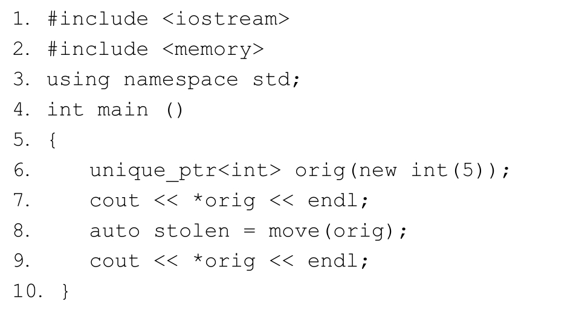{.u54250}
:::

代码清单5-1等价于代码清单5-2中的Rust代码。

**代码清单5-2：等价于代码清单5-1的Rust代码**

::: center
{.u54249}
:::

::: center
{.u54248}
:::

代码清单5-1中的unique_ptr指针等价于Rust中的Box＜T＞智能指针。代码清单5-1和5-2，均是利用智能指针在堆上分配了内存，变量orig对此堆内存持有所有权（唯一控制权），然后将orig重新赋予变量stolen。

在代码清单5-1（C++代码）中，使用了move函数，将原来的unique_ptr指针赋予了stolen，并转让了所有权。原来的 orig 则变为了空指针，而对空指针解引用是很不安全的，所以该C++代码运行时就会抛出**段错误** （**segmentation fault** ）。但对于开发者来说，最想要的是一个编译期的保证，因为调试运行时错误比较困难，如果能在编译时发现隐藏的内存安全问题，就会方便很多，对于代码调试和稳定运行均有好处。

而代码清单5-2（Rust代码）在编译时就会报错。编译器提示orig是已经被"移动"的值。这里的"移动"在语义层面与C++代码中的move 函数等价。orig已经将所有权转让给了 stolen，Rust 编译器检查到了这一点，发现这里存在解引用空指针的安全隐患，然后就报错了。

在代码清单5-2（Rust代码）中，并没有显式地使用任何类似现代C++中的move函数来转移所有权，却拥有和现代C++一样的效果。现代C++中的RAII机制虽然也有所有权的概念，但其作用范围非常有限，仅智能指针有所有权，并且现代C++编译器也并没有依据所有权进行严格检查，所以才会出现代码清单5-1那样的解引用空指针的运行时错误。而在Rust中，所有权是系统性的概念，是Rust语言中的基础设施。Rust中的每个值都必定有一个唯一控制者，即，所有者。所有权的转移都是按系统性的规则隐式地自动完成的，这也是代码清单5-2如此简洁的原因。

Rust的所有权系统与法律上"定分止争"的思想是不谋而合的。所有权系统让每个值都有了明确的权属界限，它们的行为也有了明确的权属界限，这样内存安全就有了基本的保障。如果说所有权系统是内存管理的"法律"，那么Rust编译器就是"严格的执法者"，两者有机统一，保障了内存安全。如果代码中有违反所有权机制的行为，编译器就会检查出来，让错误在编译期就无所遁形，而不用等到运行时。

## 5.1 通用概念 {#text00011.html#A2a88008e-0aa6-490e-b72b-7742f41e2647 .title-left}

当今计算机内存栈和堆的分配机制，决定了编程语言中的值主要分为两类：**值类型** （**Value** ）和**引用类型** （**Reference** ）。像 C、C++、Java、JavaScript、C＃等语言都明确对值类型和引用类型作了区别，而一些纯面向对象语言只剩下了引用类型的概念，比如在 Ruby 和Python中，一切皆对象，而对象就是引用类型。

**值类型是指数据直接存储在栈中的数据类型** ，一些原生类型，比如数值、布尔值、结构体等都是值类型。因此对值类型的操作效率一般比较高，使用完立即会被回收。值类型作为**右值（在值表达式中）** 执行赋值操作时，会自动复制一个新的值副本。

**引用类型将数据存储在堆中，而栈中只存放指向堆中数据的地址（指针）** ，比如数组、字符串等。因此对引用类型的操作效率一般比较低，使用完交给GC回收，没有GC的语言则需要靠手工来回收。

基本的原生类型、结构体和枚举体都属于值类型。普通引用类型、原生指针类型等都属于引用类型。但随着语言的发展，类型越来越丰富，值类型和引用类型已经难以描述全部情况，比如一个Vector容器类型，其内部可以包含基本的值类型，也可以包含引用类型，那它属于什么类型？

为了更加精准地对这种情况进行描述，**值语义** （**Value Semantic** ）和**引用语义** （**Reference Semantic** ）被引入，定义如下。

· 值语义：按位复制以后，与原始对象无关。

· 引用语义：也叫指针语义。一般是指将数据存储于堆内存中，通过栈内存的指针来管理堆内存的数据，并且引用语义禁止按位复制。

**按位复制** 就是指**栈复制** ，也叫浅复制，它只复制栈上的数据。相对而言，**深复制** 就是对栈上和堆上的数据一起复制。

值语义可以保证变量值的独立性（Independence）。独立性的意思是，如果想修改某个变量，只能通过它本身来修改；而如果修改了它本身，并不影响其复制品。也就是说，如果只能通过变量本身来修改值，那么它就是具有值语义的变量。

而引用语义则是禁止按位复制的，因为按位复制只能复制栈上的指针，堆上的数据就多了一个管理者，多了一层内存安全的隐患。图5-1所示是原生整数类型和引用类型按位复制的示意图。

::: center
{.u54247}

图5-1：原生整数类型和引用类型按位复制示意图
:::

图5-1中变量x为5，是整数类型；变量y为动态数组，是Vector＜T＞类型。x为值语义，其值数据都存储在栈上，经过按位复制，产生另外一个副本，对自身和内存均没有什么影响。y为引用语义，其值数据是存储在堆上的，栈上只存放一个指针data_ptr和len数据（为了简单明了，此处省略其他元数据）。将 y 进行按位复制以后，只是栈上的指针和元数据进行了复制，堆内存并没有发生复制，于是就产生了两个指针管理着同一个堆空间的情况。这样带来的问题就是，当原生指针执行了析构函数之后，相应的堆内存已经被释放，复制后的指针就会成为悬垂指针，造成无法预料的后果。

在第2章介绍过的基本的原生类型都是值语义，这些类型也被称为POD（Plain Old Data，相对于面向对象语言新型的抽象数据而言）。要注意的是，POD 类型都是值语义，但值语义类型并不一定都是 POD 类型。具有值语义的原生类型，在其作为右值进行赋值操作时，编译器会对其进行按位复制，如代码清单5-3所示。

**代码清单5-3：编译器对原生类型进行按位复制**

::: center
{.u54246}
:::

代码清单5-3中的变量x为整数类型，当它作为右值赋值给变量y时，编译器会默认自动调用x的clone方法进行**按位复制** 。x是值语义类型，被复制以后，x和y就是两个不同的值，互不影响。

这是因为整数类型实现了Copy trait，第4章介绍过，对于实现Copy的类型，其clone方法必须是按位复制的。对于拥有值语义的整数类型，整个数据存储于栈中，按位复制以后，不会对原有数据造成破坏，不存在内存安全的问题。

反观C++，当对象作为右值参与赋值的时候，一般会建议开发者自定义实现复制构造函数，但开发者很有可能忘记这样做，那么这种情况下，编译器就会默认实现复制构造函数来进行按位复制，则会出现图5-1中那样的内存安全问题，解决的办法是自定义深复制构造函数，将堆上的数据也复制一遍。而Rust通过Copy这个标记trait，将类型按值语义和引用语义做了精准的分类，帮助编译器检测出潜在的内存安全问题。

智能指针Box＜T＞封装了原生指针，是典型的引用类型。Box＜T＞无法实现Copy，意味着它被Rust标记为了引用语义，禁止实现按位复制，如代码清单5-4所示。

**代码清单5-4：Box＜T＞无法实现Copy**

::: center
{.u54245}
:::

代码清单5-4编译会报如下错误：

::: center
{.u54244}
:::

Rust编译器阻止了Struct A实现Copy，因为Box＜T＞是引用语义，如果按位复制，会有内存安全隐患。

值得注意的是，虽然引用语义类型不能实现Copy，但可以实现Clone的clone方法，以实现深复制，在需要的时候可以显式调用。

## 5.2 所有权机制 {#text00011.html#A391e0091-e602-424a-acd1-4e8abc6466bb .title-left}

在Rust中，由Copy trait来区分值语义和引用语义。与此同时，Rust也引入了新的语义：**复制** （**Copy** ）**语义** 和**移动** （**Move** ）**语义** 。复制语义对应值语义，移动语义对应引用语义。这样划分是因为引入了所有权机制，在所有权机制下同时保证内存安全和性能。

对于可以安全地在栈上进行按位复制的类型，就只需要按位复制，也方便管理内存。对于在堆上存储的数据，因为无法安全地在栈上进行按位复制，如果要保证内存安全，就必须进行深度复制。深度复制需要在堆内存中重新开辟空间，这会带来更多的性能开销。如果堆上的数据不变，只需要在栈上移动指向堆内存的指针地址，不仅保证了内存安全，还可以拥有与栈复制同样的性能。

在下面的代码清单5-5中，变量x是Box＜T＞类型，当赋值给变量y时，默认行为不是按位复制，而是移动，如图5-2所示。

**代码清单5-5：具有引用语义的Box＜T＞默认会移动**

::: center
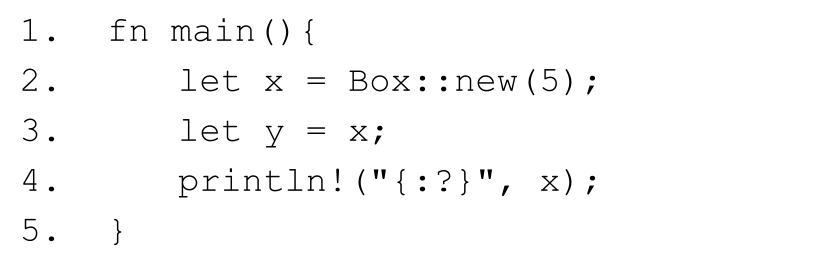{.u54243}
:::

::: center
{.u54242}

图5-2：移动Box＜T＞类型变量示意图
:::

因为不会进行按位复制，所以只是把x的指针重新指向了y，完全杜绝了图5-1中出现的两个指针引用同一个堆空间的情况，保证了内存安全。

在代码清单5-5中，起初变量x对Box＜T＞拥有所有权，随后x将Box＜T＞通过移动转移给了y，那么最终y拥有了Box＜T＞的所有权，所以由它来释放Box＜T＞的堆内存。

**一个值的所有权被转移给另外一个变量绑定的过程，就叫作所有权转移。**

Rust中每个值都有一个所有者，更进一步说就是，Rust中分配的每块内存都有其所有者，所有者负责该内存的释放和读写权限，并且每次每个值只能有唯一的所有者。这就是 Rust的**所有权机制** （**OwnerShip** ）。

**所有权的类型系统理论**

Rust的所有权在类型系统理论中称为**仿射类型** （**affine type** ），它属于类型理论中**子结构类型系统** （ **Substructural Type System** ）的概念。子结构类型系统又是**子结构逻辑** （**Substructural Logic** ）在类型系统中的应用。而子结构逻辑属于证明理论里的推理规则，其规则包含如下几点。

· 线性逻辑（Linear Logic），如果某个变量符合某种特定的"结构"，它就内含一种规则：必须且只能使用一次。

· 仿射逻辑（Affine Logic），和线性逻辑是类似的，但它的规则是，最多使用一次，也就是说，可以使用0次或1次。看上去线性逻辑更严格一些。

· 其他。

子结构逻辑规则用于推理。基于仿射类型，Rust实现了所有权机制，在需要移动的时候自动移动，维护了内存安全。

**所有权的特点**

所有者拥有以下三种权限：

· 控制资源（不仅仅是内存）的释放。

· 出借所有权，包括不可变（共享）的和可变（独占）的。

· 转移所有权。

对于实现 Copy 的类型，也就是复制语义类型来说，按位复制并不会出现内存问题，并且可以简化内存管理。所以在赋值操作时，作为右值的变量会默认进行按位复制。但是对于禁止实现Copy的类型，也就是移动语义类型来说，如果对其执行按位复制，就会出现图5-1所示的重复释放同一块堆内存的问题，所以在进行赋值操作时，作为右值的变量会默认执行移动语义来转移所有权，从而保证了内存安全。

对于可以实现 Copy 的复制语义类型来说，所有权并未改变。对于复合类型来说，是复制还是移动，取决于其成员的类型。代码清单5-6所示的是结构体成员都为复制语义类型的情况。

**代码清单5-6：结构体A的成员都为复制语义类型**

::: center
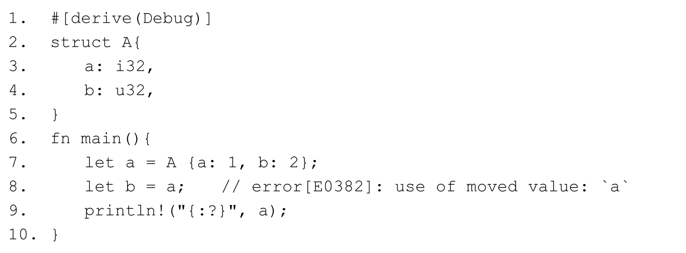{.u54241}
:::

代码清单5-6的第8行编译会报错，说明在进行赋值操作时，a 的所有权发生了转移。在后面的println！语句中，a就无法再次使用。

可见，虽然结构体A的成员都是复制语义类型，但是Rust并不会默认为其实现Copy，如果想解决这个问题，可以手动为结构体A实现Copy，如代码清单5-7所示。

**代码清单5-7：手动为结构体A实现Copy**

::: center
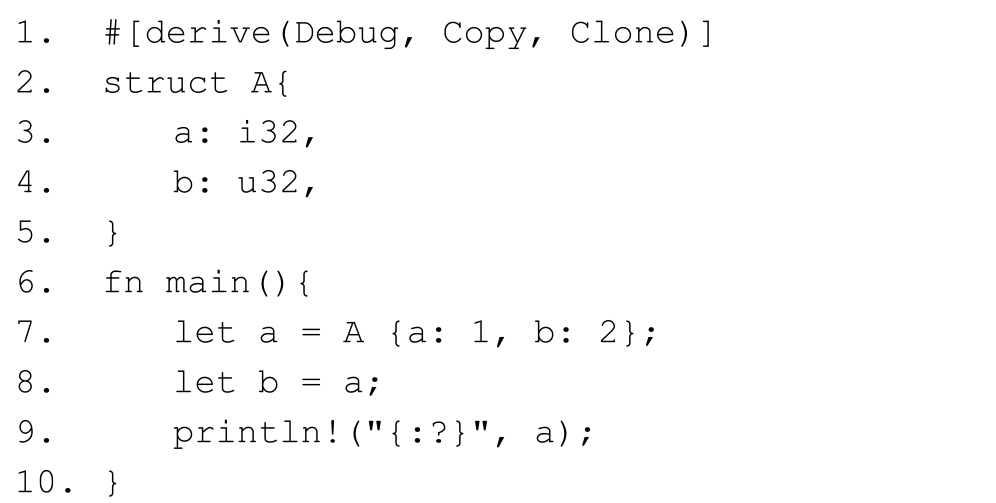{.u54188}
:::

在代码清单5-7中，通过**＃\[derive（Debug，Copy，Clone）\]** 属性为结构体A实现了Copy，因此结构体A就可以按位复制了，所以这段代码可以正常编译运行。我们在代码清单5-4中已经看到，如果结构体中还有移动语义类型的成员，则无法实现Copy。因为按位复制可能会引发内存安全问题。

枚举体和结构体是类似的，当成员均为复制语义类型时，不会自动实现Copy。而对于**元组类型** 来说，其本身实现了Copy，如果元素均为复制语义类型，则默认是按位复制的，否则会执行移动语义，如代码清单5-8所示。

**代码清单5-8：当元素均为复制语义类型时，元组自动实现Copy**

::: center
{.u54240}
:::

在代码清单5-8中，变量a为元组类型，其元素为String类型，并非值语义类型，变量a在作为右值进行赋值操作时，转移了所有权，所以在println！中使用变量a会报错。变量c也是元组类型，其元素均为整数类型，是复制语义类型，支持按位复制，所以变量c在作为右值进行赋值操作后依然可用。

数组和Option类型与元组类型都遵循这样的规则：如果元素都是复制语义类型，也就是都实现了Copy，那么它们就可以按位复制，否则就转移所有权。

## 5.3 绑定、作用域和生命周期 {#text00011.html#Ada6a0093-3501-4d4e-af5b-fd2d2c672d75 .title-left}

Rust 使用 let 关键字来声明"变量"。let 关键字属于函数式语言中的传统关键字，比如Scheme、OCaml、Haskell等语言也都使用let关键字来声明"变量"。let有let binding之意，let声明的"变量"实际上不是传统意义上的变量，而是指一种绑定语义，如代码清单5-9所示。

**代码清单5-9：let绑定**

::: center
{.u54239}
:::

::: center
{.u54238}
:::

在代码清单 5-9 中，let 的意义是这样的：标识符 a 和 String 类型字符串＂hello＂通过 let绑定在了一起，a拥有字符串＂hello＂的所有权。更深层次的意义是，let绑定了标识符a和存储字符串＂hello＂的那块内存，从而a对那块内存拥有了所有权。所以此处a被称为**绑定** 。本书中的"变量""变量绑定"或"绑定"，均是指"绑定"的。

如果此时使用let声明另一个绑定b，并将a赋值给b，如let b=a，则此时必然会将a对字符串的所有权转移给b。因为a是String类型，不能实现Copy，所以这种行为其实也可以理解为对a进行解绑，然后重新绑定给b。

### 5.3.1 不可变与可变 {#text00011.html#Aace70094-220a-4292-8694-d89772d82abf .title-left}

"共享可变状态是万恶之源"，这句在业界流传已久的名言诉说着这样一个事实：可变状态绝不能共享，否则会增加函数之间的耦合度，函数中的变量状态在任何时候发生改变都将变得难以控制，从而让函数产生"副作用"。可变状态也更不利于多线程并发程序，容易引发数据竞争。

在很多传统的编程语言中，变量均为默认可变的，开发者很难避免"共享可变状态"。随着近几年来函数式编程语言的逐渐流行，其显著的优点也开始受到关注，其中**不可变** （**Immutable** ）的一些优点也逐渐体现了出来：

· 多线程并发时，不可变的数据可以安全地在线程间共享。

· 函数的"副作用"可以得到控制。

Rust语言吸收了函数式语言的诸多优势，其中之一就是声明的绑定默认为不可变，如代码清单5-10所示。

**代码清单5-10：绑定默认为不可变**

::: center
{.u54237}
:::

在代码清单5-10中，第4行代码中的+=操作相当于x=x+＂world＂，这样的操作在传统的变量默认可变的语言中很常见。但是在Rust中，编译器会报出第3行注释所示的错误。绑定x默认为不可变，所以编译器不允许修改一个不可变的绑定。

如果需要修改，Rust 提供了一个 mut 关键字，可以用它来声明可变（Mutable）绑定，如代码清单5-11所示。

**代码清单5-11：使用mut声明可变绑定**

::: center
{.u54236}
:::

在代码清单5-11中，使用mut声明的可变绑定x可以自由地追加字符串，编译器不会报错。

### 5.3.2 绑定的时间属性------生命周期 {#text00011.html#A380f0095-9201-4f2c-802c-b64dc0a2ae68 .title-left}

变量绑定具有"时空"双重属性。

· **空间属性** 是指标识符与内存空间进行了绑定。

· **时间属性** 是指绑定的时效性，也就是指它的生存周期。

一个绑定的生存周期也被称为**生命周期** （**lifetime** ），是和词法作用域有关的。代码清单5-9中的绑定a的生命周期就是整个main作用域。作为栈变量，a会随着main函数栈帧的销毁而被清理。并且，这是编译器可以知道的事实。

其实每个 let 声明都会创建一个默认的词法作用域，该作用域就是它的生命周期，如代码清单5-12所示。

**代码清单5-12：let默认创建词法作用域**

::: center
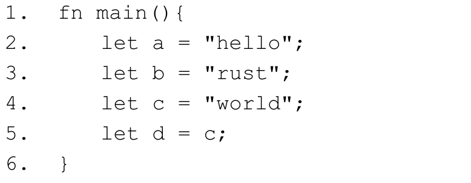{.u54235}
:::

代码清单5-12中声明了4个let绑定，a、b、c、d，它们均有一个默认的隐式的词法作用域，可以通过伪代码表示如下：

::: center
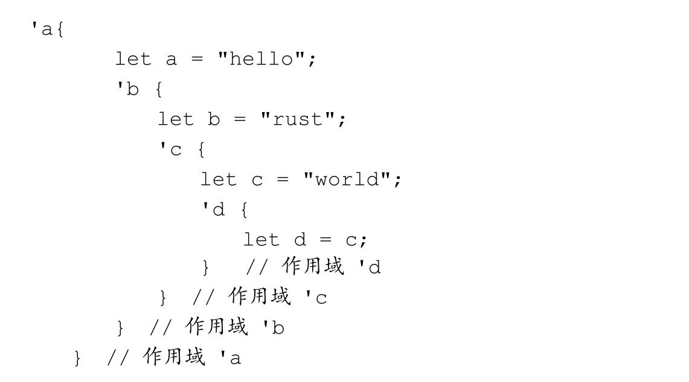{.u54234}
:::

看得出来，绑定a的作用域包含着＇b、＇c、＇d的作用域，以此类推，最后声明的绑定的作用域在最里面。

绑定的析构顺序和声明顺序相反，所以绑定d的生命周期是最短的，d会先析构，然后c、b、a依次析构，所以a的生命周期最长。所以，目前Rust的生命周期是基于词法作用域的，编译器能自动识别函数内部这些局部变量绑定的生命周期。

当向绑定在词法作用域中传递的时候，就会产生所有权的转移。代码清单5-10中的绑定c作为右值被赋值给绑定d，绑定c进入了绑定d的作用域内，按理应该会发生所有权的转移，但是因为c为字符串字面量，支持按位复制，所以此时c并没有发生所有权转移，依然可用。绑定生命周期的示意图请参见图5-3。

::: center
{.u54233}

图5-3：绑定生命周期示意图
:::

综上所述，let绑定会创建新的词法作用域，如果有其他变量作为右值进行赋值操作，也就是绑定操作，那么该变量因为进入了 let 创建的词法作用域，所以要么转移所有权，要么按位复制，这取决于该变量是复制语义还是移动语义的。

除了let声明，还有一些场景会创建新的词法作用域。

**花括号**

可以使用花括号在函数体内创建词法作用域，如代码清单5-13所示。

**代码清单5-13：使用花括号创建词法作用域**

::: center
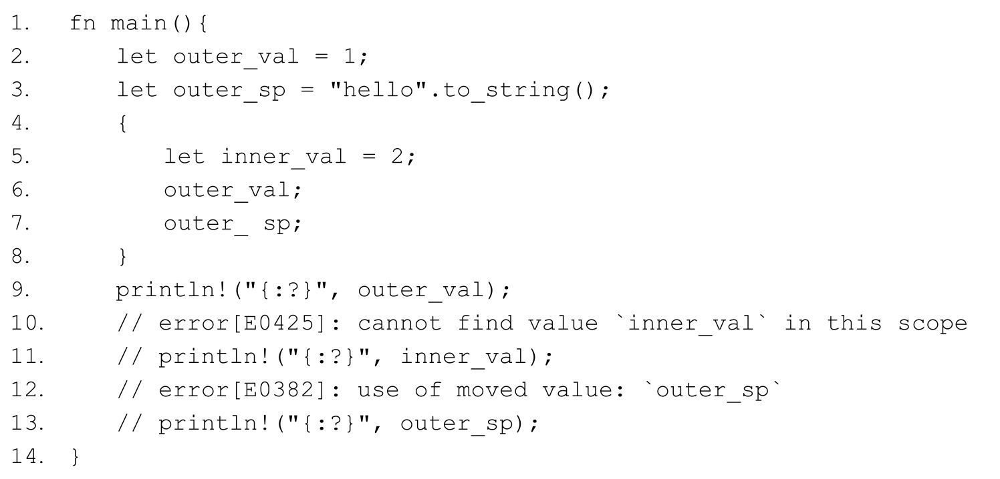{.u54232}
:::

在代码清单5-13中，第4行和第8行的花括号在main词法作用域中又创建了一个内部的作用域。第5行let声明的绑定inner_val的生命周期也只存活于此内部作用域，一旦出了内部作用域，就会被析构。所以如果取消第11行的注释，编译时就会遇到第10行注释中的报错内容。

第2行声明的outer_val是复制语义类型，在进入内部作用域之后，不会转移所有权，而只是按位复制，所以，在第9行出了内部作用域之后，还可以继续使用outer_val。第3行声明的outer_sp是引用语义类型，在进入内部作用域之后，它的所有权被转移，出了内部作用域之后，outer_sp就会被析构，所以如果取消第13行的注释，编译的时候就会出现第12行注释中的报错内容。

其实不仅仅是独立的花括号会产生词法作用域，在一些match匹配、流程控制、函数或闭包等所有用到花括号的地方都会产生词法作用域。

**match匹配**

match匹配也会产生一个新的词法作用域，如代码清单5-14所示。

**代码清单5-14：match匹配会产生新的词法作用域**

::: center
{.u54231}
:::

代码清单5-14中的match匹配会创建新的作用域，绑定a的所有权会被转移，因为绑定a是Option＜String＞类型，String类型具有移动语义，所以Option＜String＞就是移动语义类型。如果第8行再次使用绑定a，则会报第7行注释所示的错误。在match语句内部，每个匹配分支都是独立的词法作用域，比如第4行代码中的s只能用于该分支。

**循环语句**

for、loop以及while循环语句均可以创建新的作用域。代码清单5-15展示了for循环语句创建新的作用域的示例。

**代码清单5-15：for循环语句创建新的作用域**

::: center
{.u54230}
:::

在代码清单5-15中，绑定v为移动语义类型，进入for循环时已经转移了所有权，所以当第6行再次使用绑定v时，就会报第5行注释所示的错误。

**if let和while let块**

if let块和while let块也会创建新的作用域，代码清单5-16展示了if let块创建新的作用域的示例。

**代码清单5-16：if let块创建新的作用域**

::: center
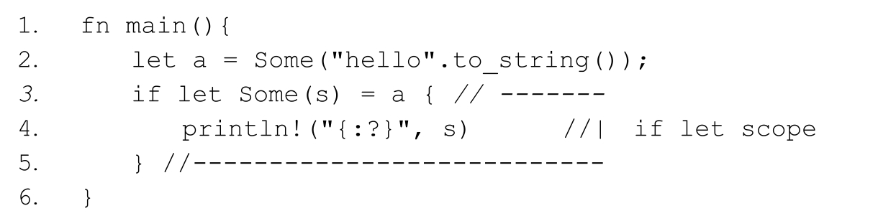{.u54229}
:::

在代码清单5-16中，绑定a为引用语义，因为是Option＜String＞类型，所以在第3行if let的赋值操作中会转移所有权，绑定a将不再可用。而if let块也创建了一个新的作用域。

代码清单5-17展示了while let块创建新作用域的示例。

**代码清单5-17：while let块创建新的作用域**

::: center
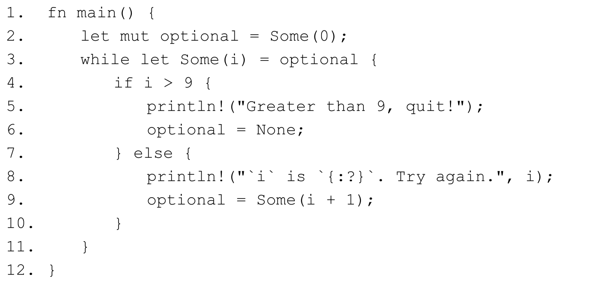{.u54228}
:::

在代码清单5-17中，变量optional为Option＜i32＞类型，因为i32类型为复制语义，所以Option＜i32＞为复制语义。因此在while let匹配后，变量i的所有权并未转移。

**函数**

函数体本身是独立的词法作用域。当复制语义类型作为函数参数时，会按位复制，如果是移动语义作为函数参数，则会转移所有权，如代码清单5-18所示。

**代码清单5-18：引用移动语义类型作为函数参数**

::: center
{.u54227}
:::

代码清单5-18中的绑定s为String类型，当它作为参数传入foo函数中时，所有权会被转移。如果在main函数中再次使用绑定s，则编译时会报错。

**闭包**

闭包会创建新的作用域，对于环境变量来说有以下三种捕获方式：

· 对于复制语义类型，以不可变引用（&T）来捕获。

· 对于移动语义类型，执行移动语义（move）转移所有权来捕获。

· 对于可变绑定，如果在闭包中包含对其进行修改的操作，则以可变引用（&mut）来捕获。

代码清单5-19展示了上述第二种捕获。

**代码清单5-19：外部变量为移动语义类型，则转移所有权来进行捕获**

::: center
{.u54226}
:::

在代码清单5-19中，绑定s为String类型，被第3行声明的闭包join捕获，所以s的所有权被转移到了闭包中。如果第5行再次使用s，则编译器会报错。

## 5.4 所有权借用 {#text00011.html#Afe040099-300c-4525-84c7-503b5d532106 .title-left}

假设需要写一个函数，用于修改数组的第一个元素。基本思路可以是，将此数组直接当作函数的参数传入，修改之后再返回，如代码清单5-20所示。

**代码清单5-20：将数组作为函数参数传递**

::: center
{.u54225}
:::

在代码清单5-20中，因为数组类型签名为\[T；N\]，所以foo函数中参数v的类型直接指定为\[i32；3\]，代表长度为3的i32整数数组，并使用mut关键字将其指定为可变。在foo函数中，直接使用数组下标0来修改第一个元素的值，然后返回此数组。

在main函数中，第7行代码声明了一个不可变数组v，然后将其传入foo函数中。因为数组v的元素均为基本数字类型，所以v是复制语义，在传入foo函数时会按位复制。所以，在foo函数中修改后的v是\[3，2，3\]，而main函数中的v是\[1，2，3\]（代码第9行）。

这里还需要注意的地方是，第7行代码声明的数组v是不可变的，但是传入了foo函数中就变成了可变数组，主要原因是**函数参数签名也支持模式匹配** ，相当于使用 let 将 v 重新声明成了可变绑定。

所以，如果想使用foo函数返回的修改后的数组，则需要将其重新绑定方可继续使用。这是所有权系统带来的不便之处。其实大多数情况下可以使用Rust提供的引用来处理这种情况，如代码清单5-21所示。

**代码清单5-21：使用引用作为函数参数**

::: center
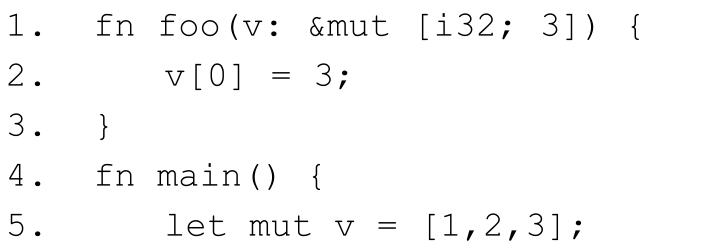{.u54224}
:::

::: center
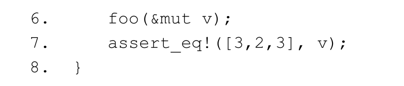{.u54223}
:::

代码清单5-21比代码清单5-20更加精练。因为使用了可变引用&mut v，所以foo函数不需要有返回值，当foo函数调用完毕时，v依旧可用。需要注意，使用可变借用的前提是，出借所有权的绑定变量必须是一个可变绑定。第6行借用了&mut v，因为在从foo函数调用完毕之后就归还了所有权，所以在第7行代码中还可以继续使用v。

**引用与借用**

**引用** （**Reference** ）是 Rust 提供的一种指针语义。引用是基于指针的实现，它与指针的区别是，指针保存的是其指向内存的地址，而引用可以看作某块内存的**别名** （**Alias** ），使用它需要满足编译器的各种安全检查规则。引用也分为**不可变引用** 和**可变引用** 。使用&符号进行不可变引用，使用&mut符号进行可变引用。

在所有权系统中，引用&x也可称为x的**借用** （**Borrowing** ），通过&操作符来完成所有权租借。既然是借用所有权，那么引用并不会造成绑定变量所有权的转移。但是借用所有权会让**所有者** （**owner** ）受到如下限制：

· 在不可变借用期间，所有者不能修改资源，并且也不能再进行可变借用。

· 在可变借用期间，所有者不能访问资源，并且也不能再出借所有权。

**引用在离开作用域之时，就是其归还所有权之时** 。使用借用，与直接使用拥有所有权的值一样自然，而且还不需要转移所有权。

再看另外一个示例，这是一个冒泡排序的实现，如代码清单5-22所示。

**代码清单5-22：冒泡排序**

::: center
{.u54222}
:::

在代码清单5-22中，bubble_sort函数参数为可变借用。第2行中直接使用a来调用len方法，以便获取数组的长度，而不是先用解引用操作符对a解引用，然后再调用len方法（当然，这样调用也可以）。同样的用法还有第9行中的a.swap（i-1，i），用于交换指定索引的元素在数组中的位置。

代码清单5-23展示了std：：vec：：Vec中len（）方法的源码实现。

**代码清单5-23：len（）方法源码**

::: center
{.u54221}
:::

在代码清单5-23中，len方法中的&self实际上是self：&self的简写，因此，可以在方法体中直接使用self来调用len字段。这同样利用了函数参数的模式匹配。由此可见，通过借用，开发者可以在不转移所有权的情况下，更加方便地对内存进行操作，同时也让代码有良好的可读性和维护性。

**借用规则**

**为了保证内存安全，借用必须遵循以下三个规则。**

· 规则一：借用的生命周期不能长于出借方（拥有所有权的对象）的生命周期。

· 规则二：可变借用（引用）不能有别名（Alias），因为可变借用具有独占性。

· 规则三：不可变借用（引用）不能再次出借为可变借用。

规则一是为了防止出现悬垂指针。规则二和三可以总结为一条核心的原则：**共享不可变，可变不共享** 。Rust编译器会做严格的借用检查，违反以上规则的行为均无法正常通过编译。

规则一很好理解。如果出借方已经被析构了，但借用依然存在，就会产生一个悬垂指针，这是Rust绝对不允许出现的情况。

规则二和规则三描述的不可变借用和可变借用就相当于内存的读写锁，同一时刻，只能拥有一个写锁，或者多个读锁，不能同时拥有，如图5-4所示。

::: center
{.u54220}

图5-4：内存读写锁示意图
:::

不可变借用可以被出借多次，因为它不能修改内存数据，因此它也被称为共享借用（引用）。可变借用只能出借一次，否则，难以预料数据何时何地会被修改。

接下来我们一起分析一下代码清单5-24。

**代码清单5-24：借用检查保障了内存安全**

::: center
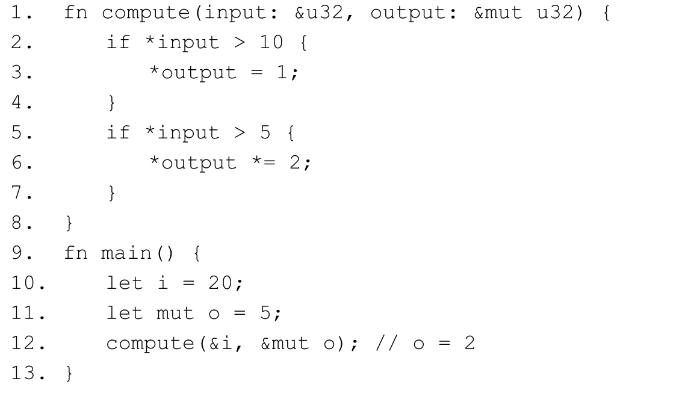{.u54219}
:::

代码清单 5-24 可以正常编译运行，变量 o 的结果会被修改为 2。但是现在假如不存在Rust的借用检查，我们来看看该函数可能会存在什么问题。

如果声明一个绑定，并且把该绑定的可变借用和不可变借用都传入compute函数中，会发生什么呢？如代码清单5-25所示。

**代码清单5-25：假设不存在Rust的借用检查，compute函数可能存在的问题**

::: center
{.u54218}
:::

在代码清单5-25中，将绑定i的两种借用分别当作参数传到compute函数中，假设不考虑Rust的借用检查，最后输出的结果是1，而正常的结果应该是2，所以这里出现了问题。回到代码清单5-24中查看compute函数，此时传入的input和output都是20，经过第2行到第4行的if表达式处理后，output的值变为了1，但是此时input和output其实都是指向同一块内存的，所以当代码执行到第5行时，\*input＞5必然会返回false，此时函数compute调用完成，output的值被修改为了1。

但真实的情况是，Rust必然会进行借用检查，所以代码清单5-25根本不会编译通过，而会报错如下：

::: center
{.u54217}
:::

这违反了借用规则，不可变借用和可变借用不能同时存在。对于compute函数，Rust编译器知道，不会存在input和output借用自同一个绑定的情况。所以，可以对compute函数进一步优化，如代码清单5-26所示。

**代码清单5-26：优化compute函数**

::: center
{.u54216}
:::

::: center
{.u54215}
:::

代码清单5-26这样的优化在Rust中是非常合理的，但是在其他语言中不一定合理，因为其他语言没法保证input和output不会来自同一块内存。第2行声明了cached_input变量绑定，是为了方便编译器进一步优化，因为 input 是一个不可变借用，永远都不会改变，所以编译器可以将它的值保存在寄存器中，进一步提升性能。同时，通过cached_input可以将两个if表达式合并为一个if else表达式，因为大于10的分支永远都不会影响到大于5的分支。

总的来说，Rust的借用检查带来了如下好处：

· 不可变借用保证了没有任何指针可以修改值的内存，便于将值存储在寄存器中。

· 可变借用保证了在写的时候没有任何指针可以读取值的内存，避免了脏读。

· 不可变借用保证了内存不会在读取之后被写入新数据。

· 保证了不可变借用和可变借用不相互依赖，从而可以对读写操作进行自由移动和重新排序。

关于引用，还有一个值得注意的地方：**解引用操作会获得所有权** 。在需要对移动语义类型（例如&String类型）进行解引用操作时，需要注意这一点，如代码清单5-27所示。

**代码清单5-27：解引用&String类型**

::: center
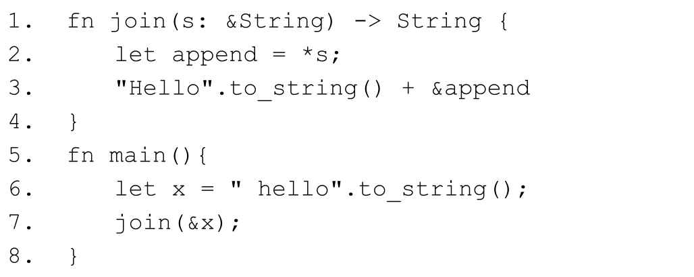{.u54214}
:::

在代码清单5-27中，join函数参数类型为&String，为一个不可变借用。第2行的let声明中对其进行解引用操作，编译器直接报如下错误：

::: center
{.u54213}
:::

这说明，编译器不允许将借用s的所有权转移给append。试想一下，如果s的所有权转移了，就会导致main函数中x的所有权被转移，那么&x指向的则是无效地址，这就造成了野指针。这在Rust中是绝对禁止的。

## 5.5 生命周期参数 {#text00011.html#A5e9b009d-f3a5-457e-b3fa-344b61377369 .title-left}

值的生命周期和词法作用域有关，但是借用可以在各个函数间传递，必然会跨越多个词法作用域。对于函数本地声明的拥有所有权的值或者借用来说，Rust编译器包含的借用检查器（borrow checker）可以检查它们的生命周期，但是对于跨词法作用域的借用，借用检查器就无法自动推断借用的合法性了，也就是说，无法判断这些跨词法作用域的借用是否满足借用规则。不合法的借用会产生悬垂指针，造成内存不安全。所以，Rust必须确保所有的借用都是有效的，不会存在悬垂指针，如代码清单5-28所示。

**代码清单5-28：借用检查示例**

::: center
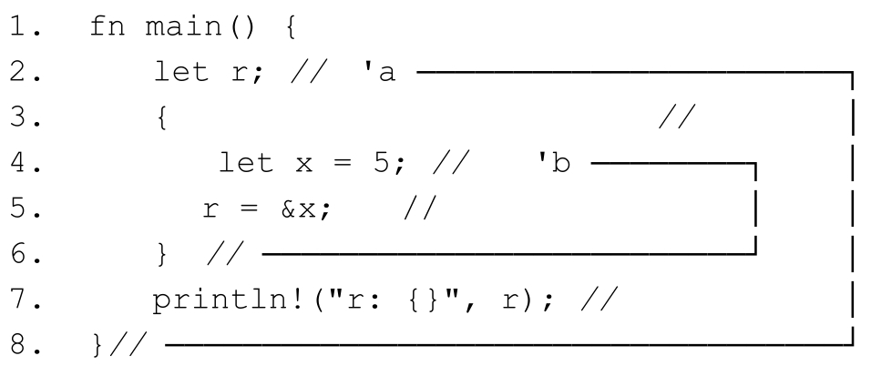{.u54212}
:::

在代码清单5-28中，绑定r将在整个main函数作用域中存活，其生命周期长度用**＇a** 表示；绑定x存活于第3行到第6行之间的内部词法作用域中，因为它离开内部作用域就会被析构，其生命周期长度用**＇b** 表示，**＇b** 要比**＇a** 小很多。如果该代码正常通过编译，则在运行时，第5行代码就会产生一个悬垂指针。幸运的是，Rust编译器不会允许这种事情发生。编译时会借用检查器检查代码中每个引用的有效性，因而代码清单5-28会报以下错误：

::: center
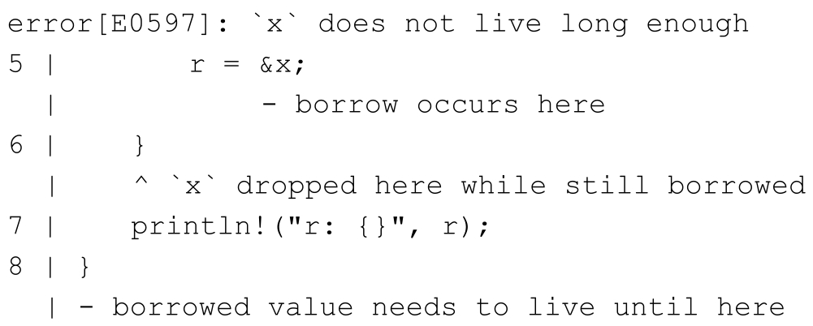{.u54211}
:::

根据借用规则一，**借用的生命周期不能长于出借方的生命周期** 。在代码清单5-28中，借用&x要绑定给变量r，r就成了借用方，其生命周期长度是＇a，而出借方是x，出借方的生命周期长度是＇b，现在＇a远远大于＇b，说明借用的生命周期远远大于出借方的生命周期，出借方被析构，借用还存在，就会造成悬垂指针。由此证明借用无效，借用检查无法通过，编译器报错，成功地阻止了悬垂指针的产生。

如果只是在函数本地使用借用，那么借用检查器很容易推导其生命周期，因为此时Rust拥有关于此函数的所有信息。一旦跨函数使用借用，比如作为函数参数或返回值使用，编译器就无法进行检查，因为编译器无法判断出所有的传入或传出的借用生命周期范围，此时需要显式地对借用参数或返回值使用生命周期参数进行标注。

### 5.5.1 显式生命周期参数 {#text00011.html#A84ba009e-999b-4cc9-b4ae-ea672627da64 .title-left}

生命周期参数必须以单引号开头，参数名通常都是小写字母，比如**＇a** 。生命周期参数位于引用符号&后面，并使用空格来分割生命周期参数和类型，如下所示。

::: center
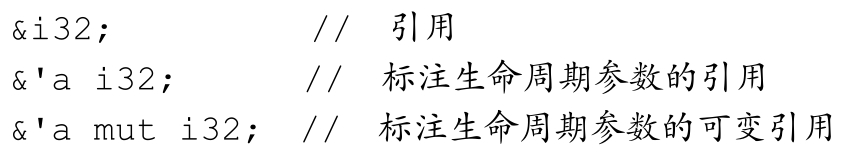{.u54210}
:::

**标注生命周期参数并不能改变任何引用的生命周期长短，它只用于编译器的借用检查** ，来防止悬垂指针。

**函数签名中的生命周期参数**

函数签名中的生命周期参数使用如下标注语法：

::: center
{.u54209}
:::

函数名后面的**＜＇a＞** 为生命周期参数的声明，与泛型参数类似，必须先声明才能使用。函数或方法参数的生命周期叫作**输入生命周期** （**input lifetime** ），而返回值的生命周期被称为**输出生命周期** （**output lifetime** ）。

函数签名的生命周期参数有这样的限制条件：输出（借用方）的生命周期长度必须不长于输入（出借方）的生命周期长度（此条件依然遵循借用规则一）。

另外，需要注意，**禁止在没有任何输入参数的情况下返回引用** ，因为明显会造成悬垂指针，如代码清单5-29所示。

**代码清单5-29：无输入参数且返回引用的函数**

::: center
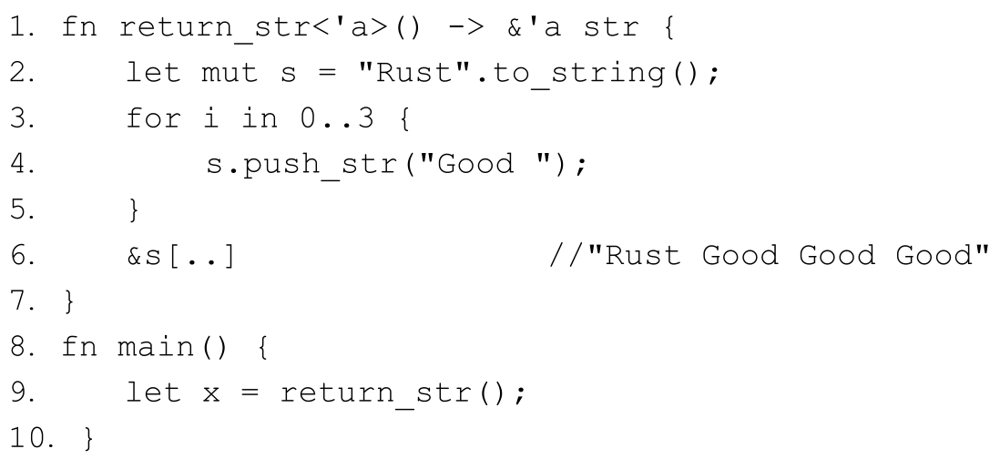{.u54208}
:::

代码清单5-29编译会报如下错误：

::: center
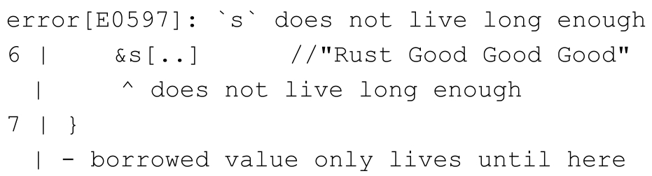{.u54207}
:::

错误消息显示，绑定s存活时间不够长，在离开return_str函数时就会被析构，而该函数还要返回绑定 s 的借用&s\[..\]，这明显违反了借用规则一，制造了悬垂指针，这是 Rust 绝对不允许的行为。所以，如果想修正此代码，可以返回一个String类型。

**从函数中返回（输出）一个引用，其生命周期参数必须与函数的参数（输入）相匹配，否则，标注生命周期参数也毫无意义，** 如代码清单5-30所示。

**代码清单5-30：foo函数的引用参数和返回的引用生命周期毫无关联**

::: center
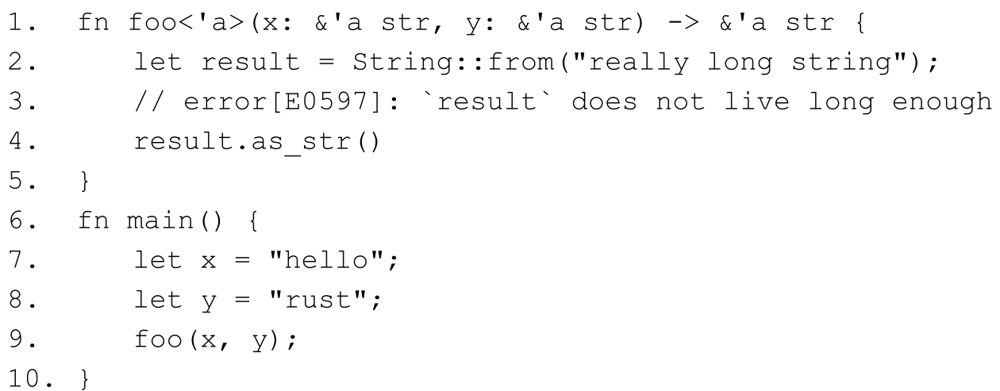{.u54206}
:::

代码清单5-30编译会报错，错误消息为第3行注释的内容。此时编译器拥有对函数foo的全部信息，生命周期标注完全没有派上用场，所以生命周期标注在此处是多余的。

下面来看一个正常需要进行生命周期参数标注的示例，如代码清单5-31所示的情况。

**代码清单5-31：需要进行生命周期标注的示例**

::: center
{.u54205}
:::

编译代码清单5-31会报以下错误：

::: center
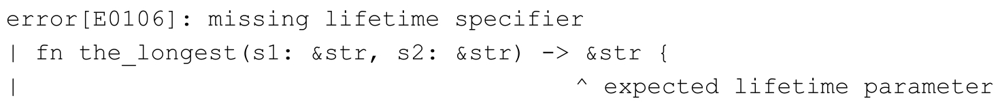{.u54204}
:::

编译器要求标注生命周期参数，此时编译器已经无法推导出返回的借用是否合法，代码清单5-32为标注了生命周期参数的代码。

**代码清单5-32：为the_longest函数标注生命周期参数**

::: center
{.u54203}
:::

代码清单5-32中the_longest函数签名标注了生命周期参数。其中＜＇a＞是对生命周期参数的声明，两个输入参数和返回参数都加上了生命周期参数，变为**&＇a str** 。函数声明中的**＇a** 可以看作一个生命周期**泛型参数** ，输入引用和输出引用都标记为**＇a** ，意味着输出引用（借用方）的生命周期不长于输入引用（出借方）的生命周期。

再来看 main 函数，当the_longest函数被实际调用时，借用检查器会根据函数签名时的生命周期参数标记的具体情况进行检查，如图5-5所示。

::: center
{.u54202}

图5-5：函数调用借用检查示意图
:::

the_longest函数的第一个参数是s1_r，它的实际生命周期是从代码清单5-32的第6行到第12行，我们将其命名为＇s1，那么可以说，the_longest函数签名中的泛型参数**＇a** 在调用时被单态化为了**＇s1** 。而该函数的第二个参数&s2的生命周期是从代码清单5-32的第7行到第10行，我们将其命名为**＇s2** 。同理，可以说，泛型参数**＇a** 在此时被单态化为了＇**s2** 。

the_longest（s1_r，&s2）返回引用的生命周期记为**＇t** 。第9行的let声明了绑定res，其生命周期记为**＇r** 。因为 res 绑定了 the_longest 函数返回的借用，本质上只是引用的按位复制，所以res成为了借用方，其生命周期长度为**＇r** ，且等于**＇t** 。经过以上分析，借用方的生命周期长度不长于出借方的生命周期长度，不会造成悬垂指针，所以借用生效，编译正常通过。

其实对于多个输入参数的情况，也可以标注不同的生命周期参数，如代码清单5-33所示。

**代码清单5-33：标注多个生命周期参数**

::: center
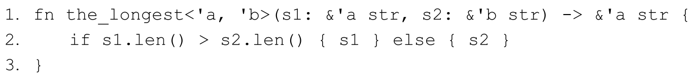{.u54201}
:::

编译代码清单5-33，编译器会报错：

::: center
{.u54200}
:::

这是因为编译器无法判断这两个生命周期参数的大小，此时可以显式地指定＇a和＇b的关系，如代码清单5-34所示。

**代码清单5-34：指定生命周期参数之间的大小关系**

::: center
{.u54199}
:::

在代码清单5-34中，**＇b：＇a** 的意思是泛型生命周期参数**＇b** 的存活时间长于泛型生命周期参数**＇a** （即**＇b** outlive**＇a** ）。如果用集合来说明，那就是**＇b** 包含**＇a** ，即**＇a** 是**＇b** 的子集。但是通过上面的分析，main 函数中传入的参数 s1_r 的生命周期却长于&s2 的生命周期，对应到the_longest函数参数中，就是s1的存活时间长于s2的，而s1的生命周期是**＇a** ，s2的生命周期是**＇b** ，从直觉上来看，明显是**＇a** 的存活时间长于**＇b** 的，但为什么现在**＇b：＇a** 表示**＇b** 的存活时间长于**＇a** 的呢？

不要忘记生命周期参数的目的是什么。**生命周期参数是为了帮助借用检查器验证非法借用。函数间传入和返回的借用必须相关联，并且返回的借用生命周期必须比出借方的生命周期长** 。所以，这里＇b：＇a中的＇a是指返回引用（借用）的生命周期，必须不能长于＇b（出借方）的生命周期。

the_longest函数在调用时，其参数的泛型生命周期参数**＇a** 和**＇b** 会单态化为具体的生命周期参数**＇s1** 和**＇s2** ，其返回引用的泛型生命周期参数**＇a** 也会单态化为**＇t** ，因为res绑定了该函数返回的引用，所以**＇r** 和**＇t** 是等价的。Rust里let绑定的声明顺序正好和析构顺序相反，这是由栈结构的后进先出特性决定的。所以，res、&s2和s1_r的析构顺序是res最先，然后是&s2，最后是 s1_r。在 res 析构之前，&s2 必须存活，否则就会产生悬垂指针，造成内存不安全，这是 Rust 绝对不允许的。res 的生命周期参数是**＇r** ，&s2 的生命周期参数是**＇s2** ，它们的关系是**＇s2：＇r** ，**＇s2** 的存活时间长于**＇r** 。而**＇s2** 和**＇r** 分别对应其函数签名中的生命周期泛型参数**＇b** 和**＇a** ，所以得出**＇b：＇a** 。而对于参数s1_r来说，其生命周期参数**＇s1** 对应生命周期泛型参数**＇a** ，本身**＇s1** 和**＇r** 的关系就是**＇s1：＇r** ，这也满足**＇a：＇a** ，如图5-6所示。

::: center
{.u54198}

图5-6：the_longest函数调用时生命周期分析示意图
:::

函数签名中多个生命周期参数的关系看上去比较复杂，但是只要把握一个原则就可以理解它：**生命周期参数的目的是帮助借用检查器验证合法的引用，消除悬垂指针** 。在Rust官方文档中提到，这种生命周期参数包含关系是一种子类型，并且用&＇a str和&＇static str两种类型做了示例，对于所有允许使用&＇a str类型的地方，使用&＇static str也是合法的。但实际上，Rust中的生命周期参数并非类型，&＇static str也只是Rust中少有的特例。也有人按集合论总结出了判断生命周期参数的所谓公式，但即使使用公式，也一定要搞懂生命周期参数背后的意义。

**结构体定义中的生命周期参数**

除了函数签名，结构体在含有引用类型成员的时候也需要标注生命周期参数，否则编译器会报错：missing lifetime specifier。代码清单5-35是一个包含引用类型成员的结构体示例。**代码清单5-35：包含引用类型成员的结构体也需要标注生命周期参数**

::: center
{.u54197}
:::

在代码清单5-35中，结构体Foo有一个成员为&str类型，必须先声明生命周期泛型参数＜＇a＞，才能为成员part标注生命周期参数，变为&＇a str类型。**这里的生命周期参数标记，实际上是和编译器约定了一个规则：结构体实例的生命周期应短于或等于任意一个成员的生命周期。**

main 函数中声明了一个 String 类型的字符串 words，然后使用 split 方法按逗号规则将words进行分割，再通过next方法和expect方法返回一个字符串切片first。其中next方法为迭代器相关的内容，第6章会讲到。

在代码第7行，用first实例化结构体Foo。此时，编译器就会根据该结构体事先定义的生命周期规则对其成员part的生命周期长度进行检查。当前part的生命周期是整个main函数，而Foo结构体实例f的生命周期确实小于其成员part的生命周期，f会在first之前被析构。否则，如果first先被析构，f.part就会成为悬垂指针，这是Rust绝对不允许的。

**方法定义中的生命周期参数**

假如为结构体Foo实现方法（如代码清单5-36所示），因为其包含引用类型成员，标注了生命周期参数，所以需要在impl关键字之后声明生命周期参数，并在结构体Foo名称之后使用，这与泛型参数是相似的。

**代码清单5-36：为结构体Foo实现方法**

1.#\[derive(Debug)\]

::: center
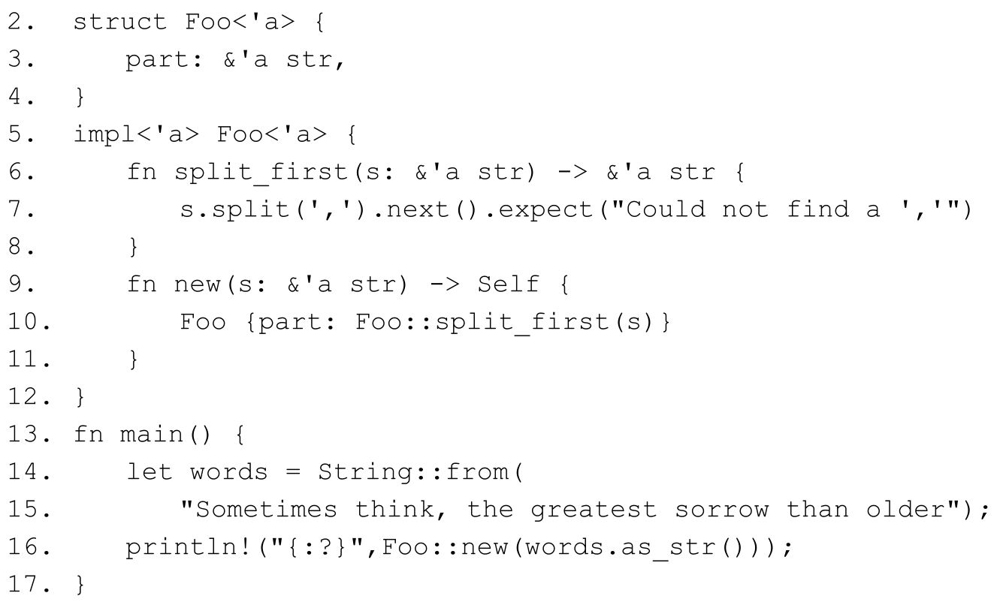{.u54196}
:::

Foo结构体中实现了两个方法，new和first，其中first是在new内部调用的，这两个方法签名中使用的生命周期参数**＇a** 是在impl关键字后面定义的，在整个impl块中适用。

如果new和first方法签名中不添加生命周期参数，则会报错：

::: center
{.u54195}
:::

这是因为编译器无法推断参数中引用的生命周期。在添加生命周期参数**＇a** 之后，约束了输入引用的生命周期长度要长于结构体Foo实例的生命周期长度。

另外，枚举体和结构体对生命周期参数的处理方式是一样的。

**静态生命周期参数**

Rust内置了一种特殊的生命周期**＇static** ，叫作**静态生命周期** 。**＇static** 生命周期存活于整个程序运行期间。所有的字符串字面量都有**＇static** 生命周期，类型为**&＇static str** ，请思考代码清单5-37。

**代码清单5-37：字符串字面量生命周期**

::: center
{.u54194}
:::

在代码清单5-37中，字符串字面量x执行y=x赋值操作之后，x继续可用，说明此处赋值执行的是按位复制，而非移动语义。

字符串字面量是全局静态类型，它的数据和程序代码一起存储于可执行文件的数据段中，其地址在编译期是已知的，并且是只读的，无法更改，可执行文件的组成结构如图 5-7所示。

::: center
{.u54193}

图5-7：可执行文件组成示意图
:::

所以，代码清单5-37中的静态字符串x按位复制的仅仅是存储于栈上的地址，因为数据段是只读的，并不会出现什么内存不安全的问题。

另外值得一提的是，在Rust 2018版本中，使用const和static定义字符串字面量时，都可以省掉**＇static** 静态生命周期参数。

### 5.5.2 省略生命周期参数 {#text00011.html#A3e3800a5-440a-48d0-9b0a-5d396a54a916 .title-left}

对于理论上需要显式地标注生命周期参数的情况，实际中依然存在可以省略生命周期参数的可能，如代码清单5-38所示。

**代码清单5-38：省略生命周期参数的示例**

::: center
{.u54192}
:::

代码清单5-38是可以正常编译通过的。函数first_word的功能是将传入的&str类型字符串通过as_bytes方法转换成字节序列。然后再通过for 循环找到空格，并返回空格前的所有字符组成的字符串切片&s\[0..i\]。其中第3行for循环迭代器中链式调用最后的enumerate方法返回的是字节序列下标和元素的引用，for 循环中的&item 是利用模式匹配来获取 item 的，这样就可以在第4行参与比较操作。最后，如果没有找到空格，则返回整个字符串。该函数的输入参数和返回值都属于引用，为什么不需要标注生命周期参数？当然，如果按生命周期参数规则进行标注，该代码也会正常通过编译。

这是因为Rust针对某些场景确定了一些常见的模式，将其硬编码到Rust编译器中，以便编译器可以自动补齐函数签名中的生命周期参数，这样就可以省略生命周期参数。被硬编码进编译器的模式称为**生命周期省略规则** （**Lifetime Elision Rule** ），一共包含三条规则：

· 每个输入位置上省略的生命周期都将成为一个不同的生命周期参数。

· 如果只有一个输入生命周期的位置（不管是否忽略），则该生命周期都将分配给输出生命周期。

· 如果存在多个输入生命周期的位置，但是其中包含着&self或&mut self，则self的生命周期都将分配给输出生命周期。

如果不满足上面三条规则，省略生命周期将会出错。代码清单5-39罗列了一些省略或非法的示例。

**代码清单5-39：各类函数签名生命周期省略或非法示例**

::: center
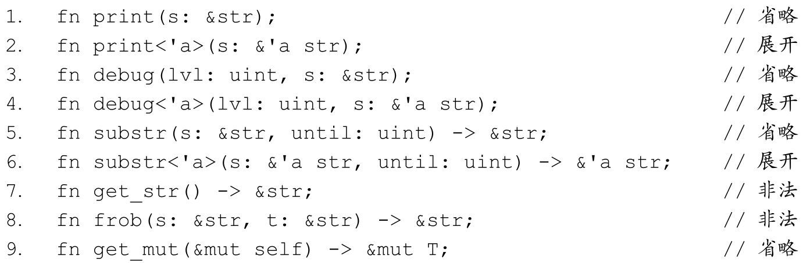{.u54191}
:::

::: center
{.u54174}
:::

我们从代码清单 5-39 中抽取几个函数签名，对应看一下它们是否满足生命周期省略规则。

第1行，只有一个引用类型的参数，满足第二条规则，虽然没有返回值，但是可以推断出引用的生命周期。

第7行，没有任何参数，不满足任何一条规则，所以推断出错。

第8行，两个引用参数，也就是拥有两个生命周期参数的位置，分别补齐两个不同的生命周期参数，满足第一条规则，但是不满足另外两条规则，也不存在其他规则来帮助编译器推断生命周期，所以这里推断出错，还需要显式地指定生命周期参数。

第 12 行，两个引用参数代表两个生命周期参数的位置，但是其中之一是&mut self，满足第三条规则，返回引用的生命周期会指派为self的生命周期。所以此处可以省略生命周期。

现在，了解了省略生命周期规则以后，我们再为代码清单5-36添加一个新的方法，如代码清单5-40所示。

**代码清单5-40：为代码清单5-36添加新的方法get_part**

::: center
{.u54190}
:::

在代码清单5-40中，为结构体Foo添加了新的方法get_part（&self），其参数为&self，代表一个实例方法，此处满足生命周期省略规则，所以并没有添加显式的生命周期参数。

### 5.5.3 生命周期限定 {#text00011.html#A4a7800a7-e139-441d-90e7-26bae0baaf7a .title-left}

生命周期参数可以像trait那样作为泛型的限定，有以下两种形式。

· **T：＇a** ，表示T类型中的任何引用都要"活得"和**＇a** 一样长。

· **T：Trait+＇a** ，表示T类型必须实现Trait这个trait，并且T类型中任何引用都要"活得"和**＇a** 一样长。

代码清单5-41展示了生命周期限定的示例。

**代码清单5-41：生命周期限定示例**

::: center
{.u53924}
:::

代码清单5-41中定义了一个元组结构体Ref，用于保存泛型类型T的引用，但是却不知道该引用类型的生命周期。T可以是任何引用，这里使用**T：＇a** 来对类型T进行生命周期限定，将它的生命周期约束为和**＇a** 的一样长。此外，Ref的生命周期长度也不会超过**＇a** 的。然后定义两个泛型函数print和print_ref来分别打印值类型和引用类型，print_ref函数签名同样使用了生命周期限定。

对于引用类型&T 来说，可以显式地使用生命周期限定来约束其生命周期。但是对于没有引用的泛型类型T来说，可以看作使用静态生命周期作为限定，形如**T：＇static** ，因为引用的生命周期只可能是暂时的，而非**＇static** 的**。** 程序中一旦出现了**＇static** ，就代表其生命周期与硬编码（Hardcode）的生命周期一样长久。

在Rust 2018版本中，像代码清单5-41中结构体的**T：＇a限定** 可以省略，编译器将对此实现自动推断。

### 5.5.4 trait对象的生命周期 {#text00011.html#A8bf800a7-94cd-4ca4-814d-f83fc1d8f18d .title-left}

如果一个trait对象中实现trait的类型带有生命周期参数，该如何处理？如代码清单5-42所示。

**代码清单5-42：trait对象中实现trait的类型带有生命周期参数**

::: center
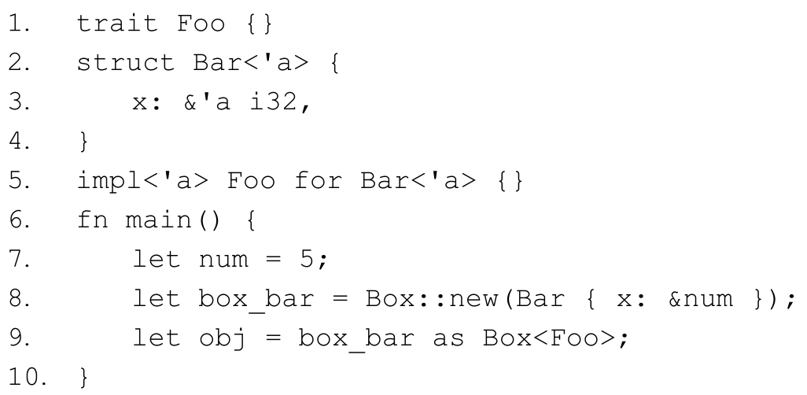{.u54189}
:::

代码清单 5-42 定义了带生命周期参数的结构体 Bar，并实现了 trait Foo。第 8 行使用Box：：new装箱了结构体Bar的实例，并在第9行将其转换为trait对象Box＜Foo＞。该代码编译能够正常通过。

这是因为**trait** 对象和生命周期有默认遵循的规则：

· trait对象的生命周期默认是＇static。

· 如果实现trait的类型包含&＇a X 或&＇a mut X，则默认生命周期就是＇a。

· 如果实现trait的类型只有T：＇a，则默认生命周期就是＇a。

· 如果实现trait的类型包含多个类似T：＇a的从句，则生命周期需要明确指定（如代码清单5-43所示）。

**代码清单5-43：需要明确指定trait对象生命周期的示例**

::: center
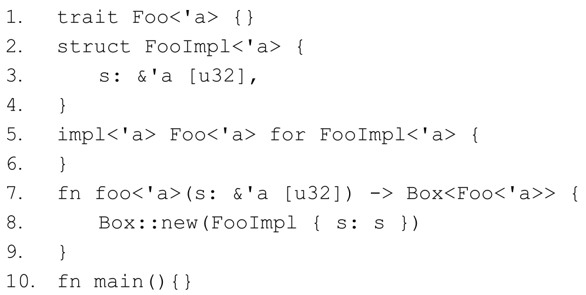{.u54188}
:::

代码清单 5-43 编译会出错，因为编译器无法推断生命周期。Box＜Foo＜＇a＞＞是一个 trait对象，它的默认生命周期是＇static的。而现在实现trait Foo的类型FooImpl有一个&＇a \[u32\]类型的成员，所以此时的 trait 对象生命周期应该是＇a。因此，如果想修复上面的错误，只需要显式地为trait对象增加生命周期参数，将Box＜Foo＜＇a＞＞改为Box＜Foo＜＇a＞+＇a＞即可，此时该trait对象的生命周期就是＇a，覆盖了默认的＇static生命周期。

## 5.6 智能指针与所有权 {#text00011.html#A758700a8-5249-402d-a8f1-0f54fb65f530 .title-left}

除了普通的引用（借用）类型，Rust还提供具有移动语义（引用语义）的智能指针。智能指针和普通引用的区别之一就是所有权的不同。智能指针拥有资源的所有权，而普通引用只是对所有权的借用。

代码清单5-44展示了智能指针独占所有权的一个示例。

**代码清单5-44：智能指时Box＜T＞独占所有权**

::: center
{.u54187}
:::

在代码清单5-44 中，绑定 x 会把所有权转移给绑定y。Box＜T＞智能指针也可以使用解引用操作符进行解引用，如代码清单5-45所示。

**代码清单5-45：解引用智能指针Box＜T＞**

::: center
{.u54186}
:::

代码清单5-45声明了两个变量绑定a和b，分别装箱了字符串字面量和String类型。对a和b分别进行解引用以后，a可以继续访问，b则不行。这是因为a装箱的字符串字面量进行了按位复制，而b装箱的String类型是引用语义，必须转移所有权。

之所可以解引用，是因为Box＜T＞实现了deref方法。代码清单5-46展示了Box＜T＞实现deref的源码。

**代码清单5-46：Box＜T＞实现deref方法的源码**

::: center
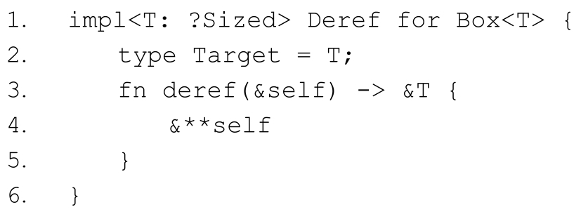{.u54185}
:::

看得出来，此deref方法返回的是&T类型。这里没有添加生命周期参数是因为满足生命周期省略规则。但是在代码清单 5-45 中，解引用 a 和 b 得到的都是值类型，而非引用类型&T。实际上，这里的\*a和\*b操作相当于\*（a.deref）和\*（b.deref）操作。**对于Box＜T＞类型来说，如果包含的类型T属于复制语义，则执行按位复制；如果属于移动语义，则移动所有权** 。所以代码清单5-45中b的所有权被转移了。

这种对Box＜T＞使用操作符（\*）进行解引用而转移所有权的行为，被称为**解引用移动** ，理论上应该使用trait DerefMove定义此行为，这也是官方团队未来打算做的，但实际上Rust源码中并不存在此trait。**目前支持此行为的智能指针只有Box＜T＞** 。

如代码清单5-47所示，Rc＜T＞或Arc＜T＞智能指针不支持解引用移动。

**代码清单5-47：Rc＜T＞和Arc＜T＞不支持解引用移动**

::: center
{.u54184}
:::

::: center
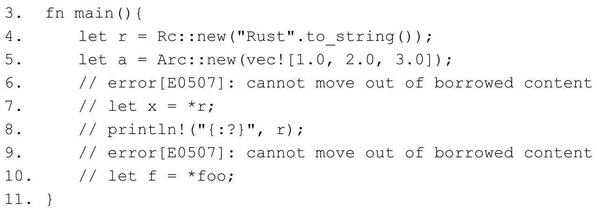{.u54183}
:::

这是因为Box＜T＞相对于其他智能指针来说比较特殊，代码清单5-48来自Box＜T＞的源码实现。

**代码清单5-48：Box＜T＞的原码实现**

::: center
{.u54182}
:::

Box＜T＞标注了Lang Item为＂owned_box＂，编译器由此来识别Box＜T＞类型，因为Box＜T＞与原生类型不同，并不具备类型名称（比如 bool 这种），但它代表所有权唯一的智能指针的特殊性，所以需要使用Lang Item来专门识别，而其他的智能指针则不是这样的。

Box＜T＞和其他智能指针相同的地方在于内部都使用了box关键字来进行堆分配。代码清单5-49罗列了Box：：new、Rc：：new和Arc：：new方法的源码。

**代码清单5-49：Box：：new、Rc：：new和Arc：：new方法的源码**

::: center
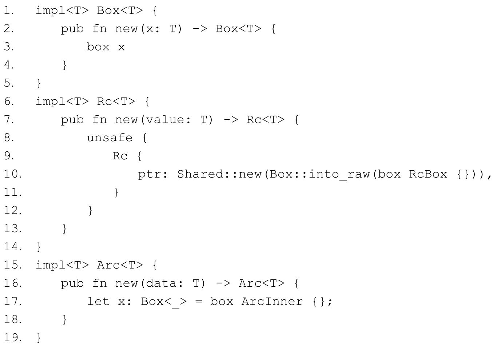{.u54181}
:::

为了展示方便，代码清单5-49省略了具体实现的很多代码。但是可以看得出来，这几个方法都使用了box关键字来进行堆内存分配。box关键字只可以在Rust源码内部使用，并未作为公开API使用。

box关键字会调用内部堆分配方法exchange_malloc和堆释放方法box_free进行堆内存管理，相关代码如代码清单5-50所示。

**代码清单5-50：box_free和exchange_malloc源码示意**

::: center
{.u54180}
:::

代码清单5-50中展示了box_free和exchange_malloc方法的部分源码实现，看得出来，这两个方法都被标注为了Lang Item，方便编译器来识别。box_free用于释放（dealloc）堆内存，exchange_malloc用于分配（alloc）堆内存。

### 5.6.1 共享所有权Rc＜T＞和Weak＜T＞ {#text00011.html#A5e4500ab-673f-43b8-8fa7-c4941187207a .title-left}

引用计数（reference counting）可以说是简单的GC算法之一了，应用于多种语言。Rust中提供了Rc＜T＞智能指针来支持引用计数，但不同于GC的是，Rust是确定性的析构，开发者知道资源什么时候会被析构。

Rust中只有拥有所有权才能释放资源，Rc＜T＞可以将多个所有权共享给多个变量，每当共享一个所有权时，计数就会增加一次，只有当计数为零，也就是当所有共享变量离开作用域时，该值才会被析构。Rc＜T＞主要用于希望共享堆上分配的数据可以供程序的多个部分读取的场景，并且主要确保共享的资源析构函数都能被调用到。Rc＜T＞是单线程引用计数指针，不是线程安全的类型，Rust也不允许它被传递或共享给别的线程，如代码清单5-51所示。

**代码清单5-51：Rc＜T＞示例**

::: center
{.u54179}
:::

Rc＜T＞定义于标准库std：：rc模块，使用use声明可以省略掉前面的命名空间直接使用Rc。第3行代码声明了绑定x，第4行和第5行分别调用了一次clone方法，其所有权就被共享了两次，加上原有的所有权，第6行通过Rc：：strong_count方法输出引用计数，一共是3次。注意这里的 clone 方法并非深复制，只是简单地对共享所有权的计数，但是这个计数操作会产生一定的计算型开销。

通过clone方法共享的引用所有权被称为**强引用** 。第7行代码使用了downgrade方法创建了另外一种智能指针类型Weak＜T＞，它也是引用计数指针，属于Rc＜T＞的另一种版本，它共享的指针没有所有权，所以被称为**弱引用** ，但 Weak＜T＞还保留对 Rc＜T＞中值的引用。Rc：：strong_count返回的是强引用的计数，Rc：：weak_count返回的是弱引用的计数。

在第4章中，我们用Rc＜T＞"精心"构造了一个内存泄漏的示例。现在了解了Weak＜T＞之后，就可以利用Weak＜T＞无所有权的特点对其进行改造了，如代码清单5-52所示。

**代码清单5-52：利用Weak＜T＞解决循环引用的内存泄漏问题**

::: center
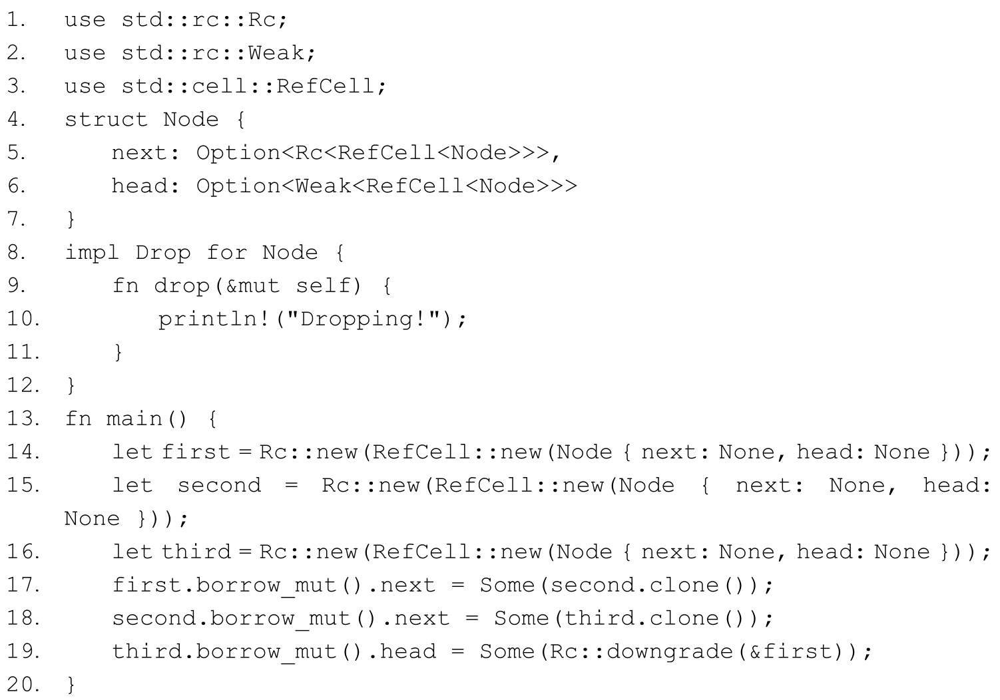{.u54178}
:::

在代码清单5-52中，Node结构体中增加了另一个成员head，专门用于链接头部和尾部的Node。而next成员专门用于链接下一个Node。

第14行至第16行分别创建了三个节点，而且next和head都被设置为了None。

第17行将second节点的所有权通过强引用方式共享给了first的next，也就是将first和second连了起来。

第18行将third节点的所有权通过强引用方式共享给了second的next，也就是将second和third连了起来。

第19行将third节点的所有权通过弱引用方式共享给了first的head，也就是将third和first连了起来。

最终结果如图6-8所示。

::: center
{.u54177}

图5-8：使用Weak＜T＞解决循环引用示意图
:::

运行代码清单5-52，你会发现drop方法都能被正常调用了，证明已经不存在内存泄漏的问题了。顺便提一句，循环引用引起内存泄漏的问题还可以通过使用Arena模式来解决。简单来说，就是利用线性数组来模拟节点之间的关系，可以有效避免循环引用。

### 5.6.2 内部可变性Cell＜T＞和RefCell＜T＞ {#text00011.html#Aa73600ad-2c18-48e7-a43a-0f5cb7310a26 .title-left}

Rust中的可变或不可变主要是针对一个变量绑定而言的，比如对于结构体来说，可变或不可变只能对其实例进行设置，而不能设置单个成员的可变性。但是在实际的开发中，某个字段是可变而其他字段不可变的情况确实存在，比如在网络请求中，每个请求包含的路径、参数等状态，都应该是可变的。Rust提供了Cell＜T＞和RefCell＜T＞来应对这种情况。它们本质上不属于智能指针，只是可以提供内部可变性（Interior Mutability）的容器。

**Cell＜T＞**

内部可变性实际上是Rust中的一种设计模式。内部可变性容器是对Struct的一种封装，表面不可变，但内部可以通过某种方法来改变里面的值，代码清单5-53所示的是使用Cell＜T＞实现字段级可变的情况。

**代码清单5-53：使用Cell＜T＞实现字段级可变**

::: center
{.u54176}
:::

代码清单5-53中定义了结构体Foo，其中字段x是u32类型，y是Cell＜u32＞类型，main函数中创建了该结构体的实例 foo，默认是不可变的。第 9 行代码通过 get（）方法来取得Cell＜u32＞容器中的值，第10行代码通过set（）方法来重新设置y的值。整个代码编译成功。

使用Cell＜T＞内部可变容器确实方便了编程。它提供的set/get方法像极了OOP语言中常见的 setter/getter 方法，封装了对象属性的获取和设置行为。Cell＜T＞通过对外暴露的 set/get方法实现了对内部值的修改，而其本身却是不可变的。所以，实际上Cell＜T＞包裹的T本身合法地避开了借用检查。

对于包裹在Cell＜T＞中的类型T，只有实现了Copy的类型T，才可以使用get方法获取包裹的值，因为get方法返回的是对内部值的复制。但是任何类型T都可以使用set方法修改其包裹的值。由此可见，Cell＜T＞并没有违反Rust保证的内存安全原则，对于实现Copy的类型T，可以任意读取；对于没有实现Copy的类型T，则提供了get_mut方法来返回可变借用，依然遵循Rust的借用检查规则。

使用 Cell＜T＞虽然没有运行时开销，但是尽量不要用它包裹大的结构体，应该像代码清单5-49那样选择包装某个字段，因为Cell＜T＞内部每次get/set都会执行一次按位复制。

**RefCell＜T＞**

对于没有实现 Copy 的类型，使用Cell＜T＞有许多不便。Rust 提供的RefCell＜T＞适用的范围更广，对类型T并没有Copy的限制，代码清单5-54展示了其内部可变性。

**代码清单5-54：RefCell＜T＞内部可变性示例**

::: center
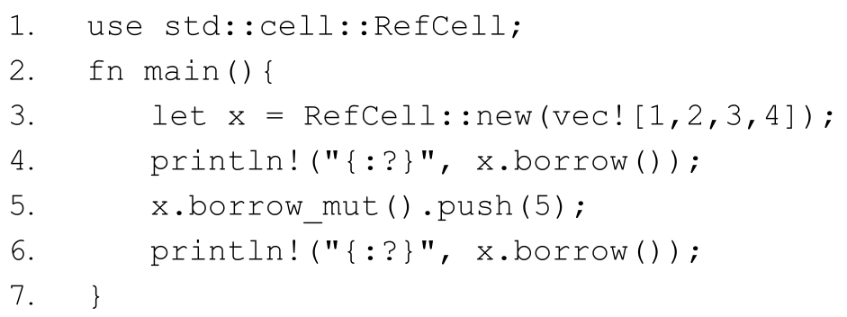{.u54175}
:::

RefCell＜T＞提供了borrow/borrow_mut方法，对应Cell＜T＞的get/set方法。RefCell＜T＞虽然没有分配空间，但它是有运行时开销的，因为它自己维护着一个运行时借用检查器，如果在运行时出现了违反借用规则的情况，比如持有多个可变借用，则会引发线程panic，如清单代码5-55所示。

**代码清单5-55：违反RefCell＜T＞运行时借用规则，会引发线程panic**

::: center
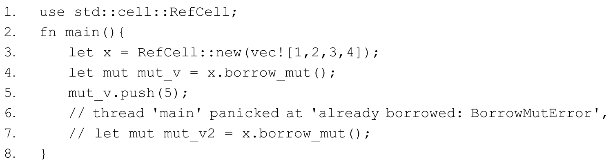{.u54174}
:::

代码清单5-55的第7行通过borrow_mut方法第二次获取可变借用，这显然违反了借用规则，虽然是运行时检查，但其借用规则和 Rust 编译器借用检查规则是一样的，所以此时main函数线程就会崩溃，并抛出第6行注释所示的错误内容。

Cell＜T＞和RefCell＜T＞使用最多的场景就是配合只读引用来使用，比如&T或Rc＜T＞。在代码清单5-49中就配合使用了Rc＜RefCell＜T＞＞。Cell＜T＞和RefCell＜T＞之间的区别可以总结如下：

· Cell＜T＞使用set/get方法直接操作包裹的值，RefCell＜T＞通过borrow/borrow_mut返回包装过的引用Ref＜T＞和RefMut＜T＞来操作包裹的值。

· Cell＜T＞一般适合复制语义类型（实现了Copy），RefCell＜T＞一般适合移动语义类型（未实现Copy）。

· Cell＜T＞无运行时开销，并且永远不会在运行时引发panic错误。RefCell＜T＞需要在运行时执行借用检查，所以有运行时开销，一旦发现违反借用规则的情况，则会引发线程panic而退出当前线程。

在日常的编程开发中，不要为了专门避开借用检查而使用 Cell＜T＞或 RefCell＜T＞，而应该仔细分析具体的需求来选择适合的解决方法。

### 5.6.3 写时复制Cow＜T＞ {#text00011.html#A82a300af-776c-4af7-b121-e6f47fcc8c56 .title-left}

写时复制（Copy on Write）技术是一种程序中的优化策略，被应用于多种场景。比如Linux中父进程创建子进程时，并不是立刻让子进程复制一份进程空间，而是先让子进程共享父进程的进程空间，只有等到子进程真正需要写入的时候才复制进程空间。这种"拖延"技术实际上很好地减少了开销。Rust也采纳了这种思想，提供了Cow＜T＞容器。

Cow＜T＞是一个枚举体的智能指针，包括两个可选值：

· Borrowed，用于包裹引用。

· Owned，用于包裹所有者。

跟 Option＜T＞类型有点相似，Option＜T＞表示的是值的"有"和"无"，而 Cow＜T＞表示的是所有权的"借用"和"拥有"。

Cow＜T＞提供的功能是，**以不可变的方式访问借用内容，以及在需要可变借用或所有权的时候再克隆一份数据** 。Cow＜T＞实现了Deref，这意味着可以直接调用其包含数据的不可变方法。Cow＜T＞旨在减少复制操作，提高性能，一般用于读多写少的场景，如代码清单 5-56所示。

**代码清单5-56：Cow＜T＞示例**

::: center
{.u54173}
:::

::: center
{.u54172}
:::

代码清单5-56中定义了一个函数abs_all，用于求数组中元素的绝对值。该函数参数类型为Cow＜\[i32\]＞，迭代每个元素，当判断出元素值小于0 的时候，调用to_mut方法获取可变借用来修改值。另外一个函数abs_sum利用了abs_all函数求元素绝对值之后再进行求和。

代码第17行到第21行声明了两个绑定s1和i1，其中i1是通过Cow：：from方法来创建的。并且将&mut i1作为参数传给abs_all函数，因为s1中元素都大于0，所以并不进入该函数中的if表达式里，也就不会调用to_mut方法，所以，并不会发生克隆。所以第20行和第21行的输出为如下。

::: center
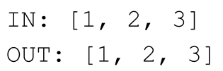{.u54171}
:::

代码第25行到第29行的s2中包含小于0的元素，所以会进入abs_all函数的if表达式中，此时会调用 to_mut 方法，to_mut 方法会在第一次调用时克隆一个新的对象，在后续的for循环中继续用新的克隆对象。所以第28行和第29行的输出如下。

::: center
{.u54170}
:::

第32行到第34行声明了v1，由Cow＜T＞包裹的数据本身就是拥有所有权的类型Vec＜T＞，因此在进入abs_all函数的if表达式中时，调用to_mut方法并不会克隆新对象，所以此处输出如下。

::: center
{.u54169}
:::

第36行到第39行虽然调用了abs_sum，但还是会调用abs_all函数去求绝对值。因为此时s3中的元素都是大于零的，所以不会调用to_mut方法，此处不会发生克隆，所以此处输出如下。

::: center
{.u54168}
:::

::: center
{.u54167}
:::

第41行到第44行的s4中包含负数，所以肯定会调用to_mut方法，此处会发生克隆，所以输出如下。

::: center
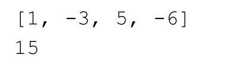{.u54166}
:::

通过代码清单5-56可以看出来，Cow＜T＞确实做到了写时复制的效果，在使用它的时候，需要掌握以下几个要点。

· Cow＜T＞实现了Deref，所以可以直接调用T的不可变方法。

· 在需要修改 T 时，可以使用 to_mut 方法来获取可变借用。该方法会产生克隆，但仅克隆一次，如果多次调用，则只会使用第一次的克隆对象。如果T本身拥有所有权，则此时调用to_mut不会发生克隆。

· 在需要修改T时，也可以使用into_owned方法来获取一个拥有所有权的对象。如果T是借用类型，这个过程会发生克隆，并创建新的所有权对象。如果T是所有权对象，则会将所有权转移到新的克隆对象。

**Cow＜T＞的另一个用处是统一实现规范** 。比如现在需要设计一个结构体 Token，用来存放网络上的各种token数据，但是这些token不都是字符串字面量，还可能是动态生成的值。到底该用&str类型还是String类型呢？为了寻求统一，这里使用了Cow＜T＞，如代码清单5-57所示。

**代码清单5-57：利用Cow＜T＞来统一实现规范**

::: center
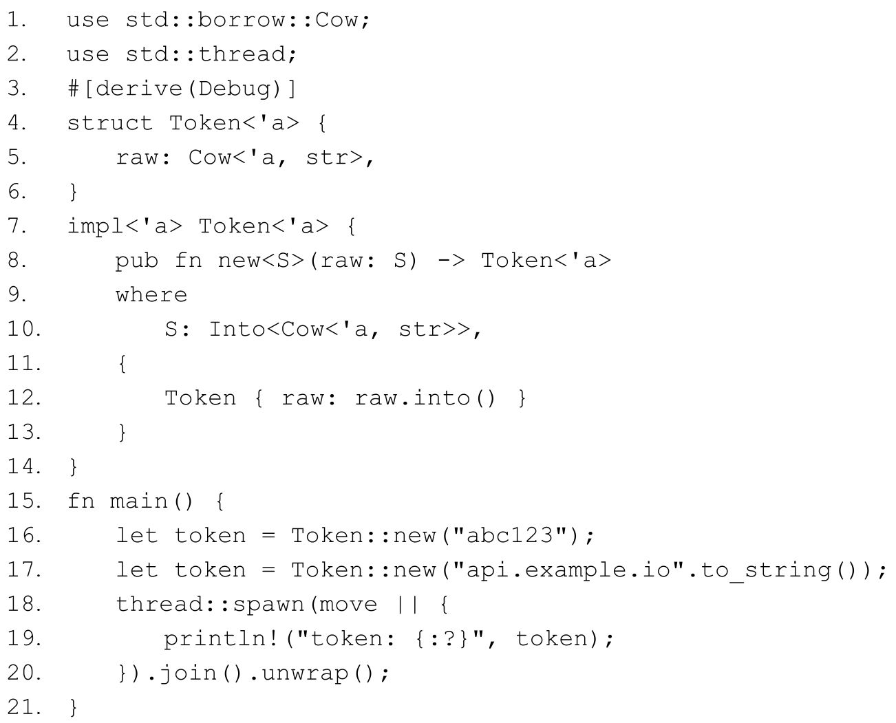{.u54165}
:::

在代码清单5-57中，结构体Token中的字段类型为Cow＜＇a，str＞类型，在main函数中，不管传入的是&＇static str还是String类型的字符串，都通过into方法被转换成了Cow＜＇a，str＞，这就实现了统一。并且对于字符串字面量和String类型来说，还可以跨线程安全传递。

但是如果创建 token 的时候使用动态字符串切片，则会因为生命周期的问题而无法跨线程安全传递，比如将main函数修改为代码清单5-58所示的情况。

**代码清单5-58：无法跨线程传递动态字符串切片的情况示例**

::: center
{.u54164}
:::

代码清单5-58编译会出错：

::: center
{.u54163}
:::

## 5.7 并发安全与所有权 {#text00011.html#Ace9e00b2-354a-4b20-98fb-f3598d6a8a32 .title-left}

Rust的内存安全特性也非常适合用于并发，保证线程安全。第3章已经讲过，Rust使用了两个标签trait------Send和Sync------来对类型进行分类。

· 如果类型 T 实现了 Send，就是告诉编译器该类型的实例可以在线程间安全传递所有权。

· 如果类型T实现了Sync，就是向编译器表明该类型的实例在多线程并发中不可能导致内存不安全，所以可以安全地跨线程共享。

正是这两个特殊的trait保证了并发情况下的所有权。代码清单5-59所示为线程不安全的一个示例。

**代码清单5-59：线程不安全示例**

::: center
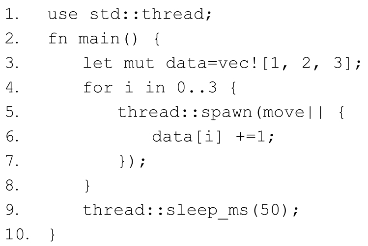{.u54162}
:::

代码清单5-59编译会报如下错误：

::: center
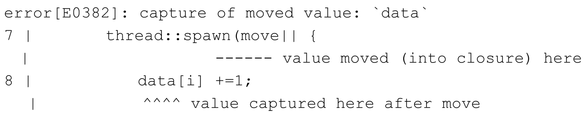{.u54161}
:::

错误显示，data所有权已经被转移了，但是编译器发现它还在被使用，所以报错。代码清单5-59是线程不安全的代码，在多线程情况下修改data的元素会引起数据竞争。

Rust提供了一些线程安全的同步机制，比如Arc＜T＞、Mutex＜T＞、RewLock＜T＞和Atomic系列类型。下面是关于这些类型的简要说明。

· Arc＜T＞是线程安全版本的Rc＜T＞。

· Mutex＜T＞是锁，同一时间仅允许有一个线程进行操作。

· RwLock＜T＞相当于线程安全版本的RefCell＜T＞，同时运行多个reader或者一个writer。

· Atomic 系列类型包括AtomicBool、AtomicIsize、AtomicUsize和AtomicPtr这4种，虽然比较少，但是可以用 AtomicPtr 来模拟其他想要的类型，它相当于线程安全版本的Cell＜T＞。

关于并发安全，第11章中会有更详细的内容。

## 5.8 非词法作用域生命周期 {#text00011.html#A449100b3-cf9c-4750-b4b1-f5aa01a55253 .title-left}

Rust严格的借用检查规则虽然避免了悬垂指针，保证了内存安全，但是代码的开发体验还是差强人意的。有时候严格的借用检查规则会让代码变得非常难以理解，如代码清单5-60所示。

**代码清单5-60：让人难以理解的代码错误**

::: center
{.u54160}
:::

代码清单5-60编译会出错，提示代码第12行中&y借用存活时间不够长。但是修复这个错误很简单，只需要将第10行和第11行代码互换位置即可。

这种行为让人很困惑。因为在其他语言中，基本上不会出现这种情况。这其实是由Rust目前的借用检查机制粒度太粗导致的。对于代码清单5-60中定义的x、y、z三个变量绑定来说，生命周期的长度由定义的先后顺序来决定，本质上是和词法作用域相关的。生命周期长度关系为**：** x的生命周期最长，z的次之，y的最短。代码第12行将&y传入foo函数时，必须满足借用检查规则，即借用方的生命周期不能长于出借方的生命周期。此时z是借用方，y是出借方，而目前借用方z的生命周期明显长于出借方y的，故编译器报错。按上述解决方法将代码互换位置之后，生命周期长度关系变为：x的生命周期最长，y的次之，z的最短，满足借用检查规则，故编译正常通过。

在了解过其背后的机制之后，就可以理解这样的行为了。但是这个问题往往是初学者认为Rust语言很难掌握的原因之一，实际开发也非常不便。因此，Rust团队在Rust 2018版本中引入了**非词法作用域生命周期** （**Non-Lexical Lifetime，NLL** ）来进行改善。

**基于MIR的借用检查**

第1章介绍过Rust的编译过程：从源码到抽象语法树，然后再由抽象语法树到高级中间语言（HIR），再由HIR到中级中间语言（MIR），最后由MIR到LLVM IR。当前的借用检查器是基于词法作用域的，具体到编译层面，是基于抽象语法树（AST）之后的HIR。HIR是AST 的简化版本，所以借用检查器本质上还是基于 AST 的。如果要改进借用检查器，就必须再往下一层，采用更细粒度的MIR。

MIR是基于**控制流图** （**Control Flow Graph，CFG** ）的抽象数据结构，它用有向图（DAG）形式包含了程序执行过程中所有可能的流转。所以将基于MIR的借用检查称为非词法作用域的生命周期，因为确实不依赖词法作用域了。在NLL最终发布之后，这个名词术语很可能就会被废弃。

MIR由以下关键部分组成。

· **基本块** （**Basic Block，bb** ），它是控制流图的基本单位，

➢语句（Statement）

➢终止句（Terminator）

· **本地** （**Local** ）**变量** ，栈中内存的位置，比如函数参数、临时值、局部变量等。一般用下画线和数字作为标识（比如_1），其中_0通常表示返回值地址。

· **位置** （**Place** ），在内存中标识位置的表达式，比如_1或_1.f。

· **右值** （**RValue** ），产生值的表达式，一般是指赋值操作的右侧表达式，也就是值表达式。

用于生成MIR的代码示例如代码清单5-61所示。

**代码清单5-61：用于生成MIR的代码示例**

::: center
{.u54159}
:::

代码清单5-61可以在play.rust-lang.org中生成MIR代码，如代码清单5-62所示。

**代码清单5-62：生成的MIR代码**

::: center
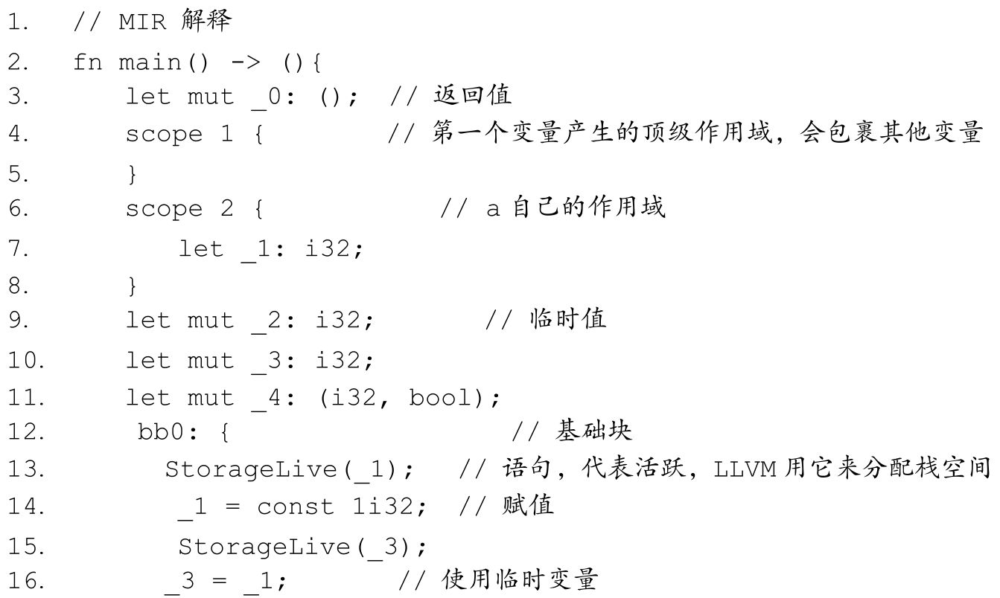{.u54158}
:::

::: center
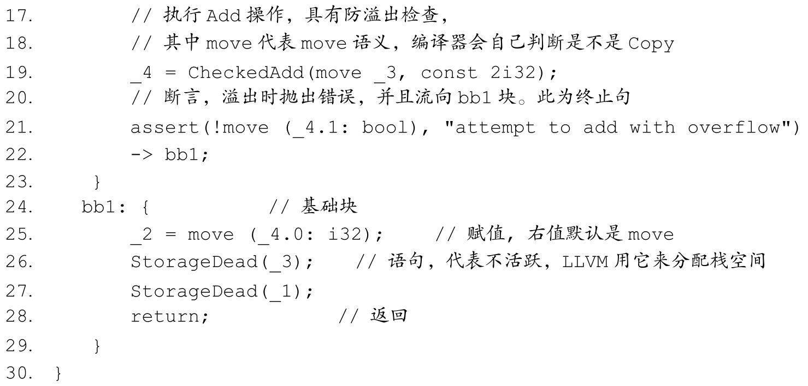{.u54157}
:::

代码清单5-62是代码清单5-61生成的MIR代码，请注意查看上面配套的注释。整体来说，该段代码分成两个基本块，从bb0流向bb1。其中StorageLive和StorageDead语句表示变量的活跃信息，该活跃信息将会发给LLVM，LLVM会根据此信息将变量分配到不同的栈槽（Stack Slot）。只有活跃的变量才可以使用。读者可以自行尝试使用更加复杂的代码生成MIR，在其中还会发现drop等语句，其实就是由编译器自动插入的drop flag。

那么非词法作用域生命周期的工作机制是怎样的呢？它的工作原理可以概述为以下两个阶段。

· 借用检查第一阶段：计算作用域范围（Scope）内的借用。在GFC中的每个节点计算一系列的借用，并将其表示为元组，形如**（＇a，shared\|uniq\|mut，lvalue）** ，其中**＇a** 表示生命周期参数，**shared\|uniq\|mut** 分别表示共享、独占和可变，**lvalue** 表示左值。然后再进行各种计算，随着数据流进行传播。

· 借用检查第二阶段：报告错误。在确定了借用范围之后，通过遍历 MIR 来计算范围内的非法借用。MIR中的各种语句将派上用场，比如StorageLive、drop等。

目前NLL还在实现阶段，虽然解决了一部分问题，但是还有更多问题需要解决。关于NLL更详细的内容可以参考相关RFC ^[\[1\]](#text00011.html#nBC4213F4DC5E4A3BAD76F9788A40B30C){#text00011.html#nBC4213F4DC5E4A3BAD76F9788A40B30Cs}^ 。MIR除了做借用检查，还做边界、溢出和匹配等检查。关于MIR更详细的介绍，可以查看官方的编译器之书 ^[\[2\]](#text00011.html#nE0D400B5087A4731ACBAB1ECA24B6E0B){#text00011.html#nE0D400B5087A4731ACBAB1ECA24B6E0Bs}^ 。

**NLL目前可以改善的问题**

Rust 2018版本默认支持了NLL。前面代码清单5-60中的问题在Rust 2018版本中将不复存在。并且NLL可以识别一些常见的使用场景，如代码清单5-63所示。

**代码清单5-63：NLL示例之一**

::: center
{.u54156}
:::

::: center
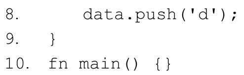{.u54155}
:::

在代码清单5-63的第2行中，我们定义了可变切片slice，然后将其传给了capitalize函数，在capitalize函数执行完毕后，理论上就没有需要使用可变借用&mut data的地方了，应该不会影响后面的push操作。但是因为当前借用检查是基于词法作用域的，&mut data的生命周期被认为是独占了foo函数整个作用域范围的，所以当data调用push方法并需要可变借用的时候，违反了借用规则。

在选择Rust 2018版本之后，代码清单5-63将正常编译通过，这应该才符合开发者的直觉。

再来看NLL另外一个示例，如代码清单5-64所示。

**代码清单5-64：NLL示例之二**

::: center
{.u54154}
:::

在代码清单5-64中，在一个loop循环中使用了可变借用&mut list.value，当前的借用检查器会认为这个可变借用是多次借用，从而编译报错。在使用Rust 2018版本时，该代码能够正常编译通过。也就是说NLL也解决了无限循环中借用检查的问题。

当然，NLL目前还有未解决的问题，如代码清单5-65所示。

**代码清单5-65：NLL示例之三**

::: center
{.u53964}
:::

代码清单5-65中的写法并不被NLL支持。NLL不仅改进了借用检查器，还提升了错误提示的精准度。根据预想，代码清单5-65将会报如下错误：

::: center
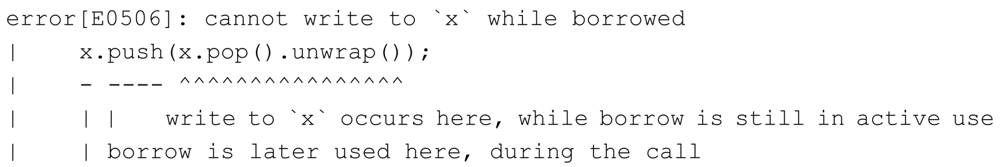{.u54153}
:::

::: center
{.u54152}
:::

当然，目前的错误提示还不是这样的。官方团队正在努力完善NLL，未来的错误提示将会像上面的描述这样精准。

## 5.9 小结 {#text00011.html#A52cb00b7-37e4-4c21-a0c2-05bad4706796 .title-left}

本章依旧从内存管理出发，逐步探索了Rust中的重要概念：所有权系统。Rust中的每个值都有一个唯一的所有者，只有所有者才有权力对资源进行有效访问和释放。所有权的底层实现体现了Rust对内存或资源的精细控制能力。Rust通过Copy标记trait，将传统的值语义和引用语义类型做了精确的划分，并且将值语义和引用语义纳入了所有权系统中，产生了新的语义：复制语义和移动语义。并且这两种语义都是在编译器严格检查下执行的，以此来保证内存安全。

Rust也允许将所有权进行短暂租借。但是租借所有权需要满足一个核心原则：共享不可变，可变不共享。也就是说，在同一个词法作用域中，不可变借用可以共享多次，而可变借用只允许借用一次。当然，借用规则也不是空口而谈，编译器中的借用检查器会在编译期对借用的合法性进行验证，以消除悬垂指针的隐患。

编译器的借用检查机制无法对跨函数的借用进行检查，因为当前借用的有效性依赖于词法作用域，对于编译器来说，这项工作将变得很复杂。所以，需要开发者显式地对借用的生命周期参数进行标注。生命周期参数标注的唯一原则就是约束输出（借用方）的生命周期必须不能长于输入（出借方）的生命周期。Rust内部也硬编码了一些模式来实现自动补齐生命周期参数，这些模式被称为生命周期省略规则，但是生命周期省略规则不同于类型推断，适用的情况比较有限，在无法推断生命周期的情况下，编译器会报错，此时就必须显式地添加生命周期参数。当然，Rust官方团队正在努力改进生命周期省略规则，以减少需要显式地标注生命周期参数的情况，也在通过引入非词法作用域生命周期（Non Lexical Lifetime）来改进函数本地对借用的生命周期推断。

除了普通的引用，Rust还引入了智能指针来帮助开发者处理一些场景。比如引用计数智能指针Rc＜T＞可以共享所有权，方便在需要多个变量读取资源但不想转移或借用所有权的情况下使用。同时，Rust也提供了Rc＜T＞的弱引用版本Weak＜T＞，来帮助消除循环引用情况下引起的内存泄漏。除此之外，Rust还提供了内部可变容器Cell＜T＞和RefCell＜T＞，使用内部可变容器可以对不可变的结构体字段进行修改，以满足某些需求。Rust也提供了来自写时复制思想的Cow＜T＞容器，以帮助开发者减少复制，提升性能，并统一实现规范。

本章还简单介绍了所有权在保证并发安全中的重要作用，并罗列了Rust提供的一些用于线程同步的智能指针类型，在后面的章节中将介绍更详细的内容。

最后介绍了Rust 2018 版本中的非词法作用域生命周期（NLL），介绍了其工作原理，并且通过示例展示了NLL对开发者编写Rust代码的体验带来的提升。同时指明，目前NLL还未完善，期待官方的进一步改进。

所有权系统是Rust的核心，可以说掌握了所有权系统，就等于掌握了Rust。

------------------------------------------------------------------------

[\[1\]](#text00011.html#nBC4213F4DC5E4A3BAD76F9788A40B30Cs){#text00011.html#nBC4213F4DC5E4A3BAD76F9788A40B30C} https://github.com/rust-lang/rfcs/blob/master/text/2094-nll.md

[\[2\]](#text00011.html#nE0D400B5087A4731ACBAB1ECA24B6E0Bs){#text00011.html#nE0D400B5087A4731ACBAB1ECA24B6E0B} https://rust-lang-nursery.github.io/rustc-guide/mir/index.html

[]{#text00012.html}

# 第6章 函数、闭包与迭代器 {#text00012.html#A932a435d-0ff0-4c07-bc05-cc6a9c3804d6 .title-left}

语言影响或决定人类的思维方式。

Rust是一门混合范式的编程语言，有机地融合了面向对象、函数式和泛型编程范式。它并非将这些特性进行简单堆砌，而是通过高度一致性的类型系统融合了这三种范式的编程思想。可以通过impl关键字配合结构体和trait来实现面向对象范式中的多态和封装，也可以通过函数、高阶函数、闭包、模式匹配来实现函数式范式中的一些编程工具。Rust支持零成本静态分发的泛型编程，并且将它很好地融入了其他两种编程范式中，提供了更高的抽象层次。通过将这三种编程范式完美融合起来，Rust语言拥有了更高程度的抽象以及更强的表达能力。

函数式语言的历史要比面向对象语言悠久，它源自古老的 LISP 语言，其后发明的语言或多或少都受到了函数式编程思想的影响，比如 Python、Ruby，以及更纯的函数式语言Haskell。随着摩尔定律的失效，CPU性能的提升转为主要依赖核数的增加，多核时代到来后，函数式编程因为其天生对并发友好的特性又逐渐受到了重视。所以近年来很多新诞生的语言也吸收了函数式范式的诸多特性，比如Elixir、Scala、Swift都受到了LISP和Haskell的影响，对代数数据类型（algebraic data type）、模式匹配、高阶函数、闭包等特性各有所支持。甚至一些年代久远的主流语言，比如C++和Java也都开始吸收函数式语言的特性。Rust作为一门在多核时代诞生的现代编程语言，引入函数式编程范式完全是顺势而为的。

本章内容主要从函数和闭包两个方面来探讨Rust对函数式编程范式的支持，还会讲迭代器及其在闭包中的应用。

## 6.1 函数 {#text00012.html#Ab63400b8-ea97-4c74-950d-929c1b1c1164 .title-left}

对于一些重复执行的代码，可以将其定义为一个函数，方便调用。在第2章我们已经了解到，可以使用fn关键字来定义函数。一个标准的函数定义如代码清单6-1所示。

**代码清单6-1：函数定义示例**

::: center
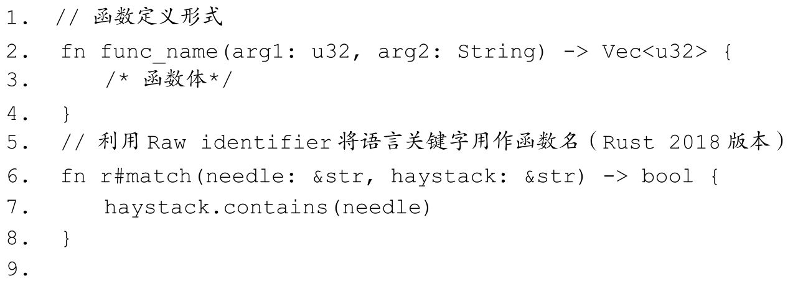{.u54151}
:::

::: center
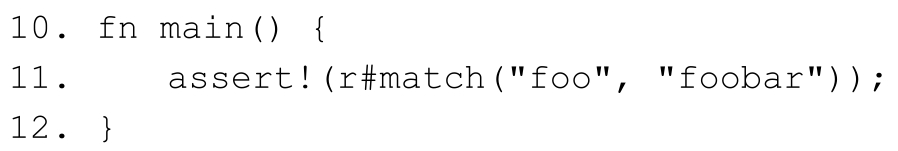{.u54150}
:::

如代码清单 6-1 所示，**fn** 关键字后面为函数名称，通常以**蛇形命名法** （**snake_case** ）命名，否则编译器会发出警告。函数参数必须明确地指定类型，如果有返回值也必须指定返回值的类型。需要注意的是，Rust中的函数参数不能指定默认值。函数体被包含于花括号之内，除函数体之外的函数声明被称为**函数签名** 。可以说，一个函数是由函数签名和函数体组合而成的。

一般来说，函数定义时不允许直接使用语言中的保留字和关键字等作为函数名。但是在**Rust 2018** 版本中，通过将原生标识操作符（Raw Identifier）**r＃** 作为前缀，即可使用关键字为函数命名，该语法一般用于FFI中，用于避免C函数名和Rust的关键字或保留字重名而引起的冲突，如代码清单6-1的第6行所示。

通过前面的章节我们了解到，函数参数可以按值传递，也可以按引用传递。当参数按值传递时，会转移所有权或者执行复制（Copy）语义。当参数按引用传递时，所有权不会发生变化，但是需要有生命周期参数。当符合生命周期参数省略规则时，编译器可以通过自动推断补齐函数参数的生命周期参数，否则，需要显式地为参数标明生命周期参数。

函数参数也分为可变和不可变。Rust的函数参数默认不可变，当需要可变操作的时候，需要使用mut关键字来修饰。代码清单6-2展示了当参数按值传递时使用mut的情况。

**代码清单6-2：按值传递的参数使用mut关键字**

::: center
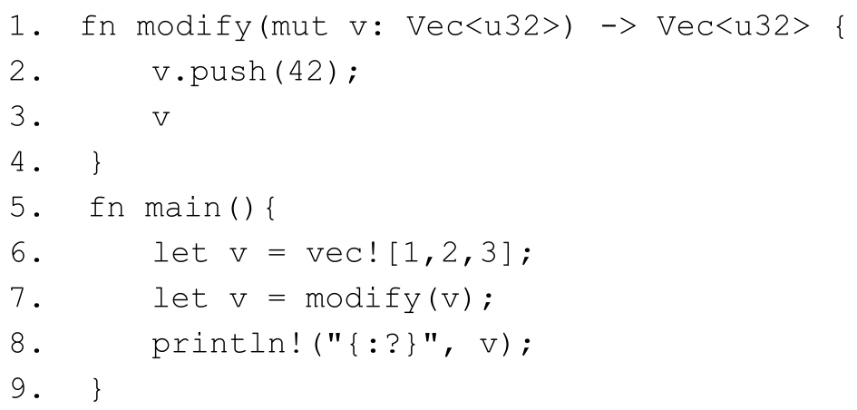{.u54149}
:::

代码清单6-2定义了modify函数，以对传入其中的动态数组进行修改，所以需要其参数为可变的。main函数的第6行声明的变量绑定v是Vec＜u32＞类型，将其传到modify中，它的所有权会被转移。对于第1行的modify函数来说，参数相当于重新声明的另一个变量绑定， **mut** 关键字被放到参数变量前面作为可变修饰。所以，在main函数中，声明v的时候并没有使用mut关键字。

代码清单6-3展示了按引用传递参数时mut的用法。

**代码清单6-3：按引用传递参数时的mut用法**

::: center
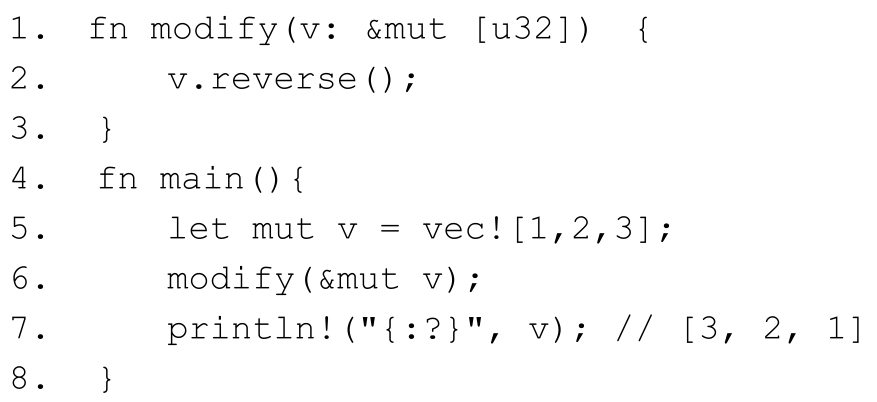{.u53884}
:::

代码清单6-3中的modify函数参数本身已经是可变引用类型&mut \[u32\]，所以此处的函数参数前面不需要再使用 mut 关键字。在 main 函数中，如果想把第5 行声明的变量绑定v作为可变引用参数，就必须使用mut关键字来将其声明为可变变量。

### 6.1.1 函数屏蔽 {#text00012.html#Aee9900ba-b866-4143-bf4f-d5cddbd51b64 .title-left}

当声明变量绑定之后，如果再次声明同名的变量绑定，则之前的变量绑定会被屏蔽，这叫作变量屏蔽（variable shadow）。变量可以如此，但函数不能被多次定义。假如代码清单6-3中的modify函数被定义多次，编译器会报如下错误：

::: center
{.u54148}
:::

可以通过显式地使用花括号将同名的函数分隔到不同的作用域中，这样编译器就不会报错。也就是说，在同一个作用域中不能定义多个同名函数，因为**默认的函数定义只在当前作用域内有效** ，会屏蔽作用域外的同名函数，如代码清单6-4所示。

**代码清单6-4：作用域内的函数会屏蔽掉作用域外的同名函数**

::: center
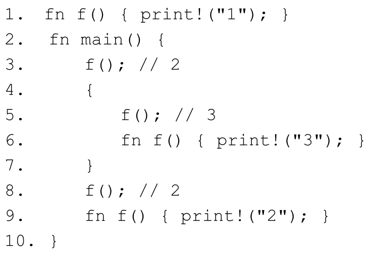{.u54147}
:::

代码清单6-4的输出结果为232。在main函数第9行定义的函数f屏蔽了main函数外定义的函数f，所以第3行和第8行会输出2。第6行定义的函数f则屏蔽了main函数中定义的函数f，所以第5行会输出3。

### 6.1.2 函数参数模式匹配 {#text00012.html#A41a600ba-2fe7-4d68-a9d2-3cfb9f4fa37c .title-left}

函数中的参数等价于一个隐式的let绑定，而let绑定本身是一个模式匹配的行为。所以函数参数也支持模式匹配，如代码清单6-5所示。

**代码清单6-5：函数参数支持模式匹配**

::: center
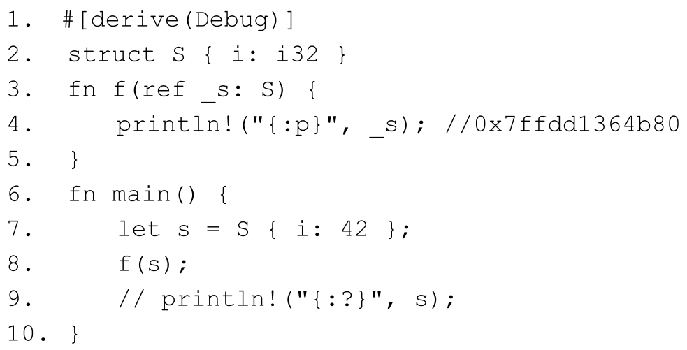{.u54146}
:::

代码清单6-5中定义了函数f，其参数使用ref关键字来修饰，这意味着要使用模式匹配来获取参数的不可变引用。与ref相对的是ref mut，ref mut用来匹配可变引用。所以，代码第4行才可以通过＂{：p}＂来打印指针地址。但是main函数中作为参数传递的变量绑定s的所有权会被转移。

除了ref和ref mut，函数参数也可以使用通配符来忽略参数，如代码清单6-6所示。

**代码清单6-6：使用通配符忽略参数**

::: center
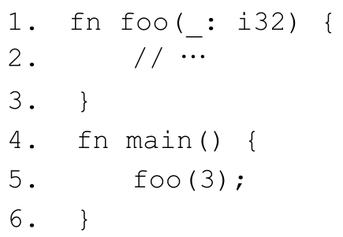{.u54145}
:::

实现某个trait中的方法时，有时并不会用到其函数签名中声明的所有参数，这时可以使用通配符来进行忽略，这样不会引起编译错误。

Rust 中的 let 语句可以通过模式匹配解构元组（Tuple），函数参数也可以，如代码清单6-7所示。

**代码清单6-7：函数参数利用模式匹配来解构元组**

::: center
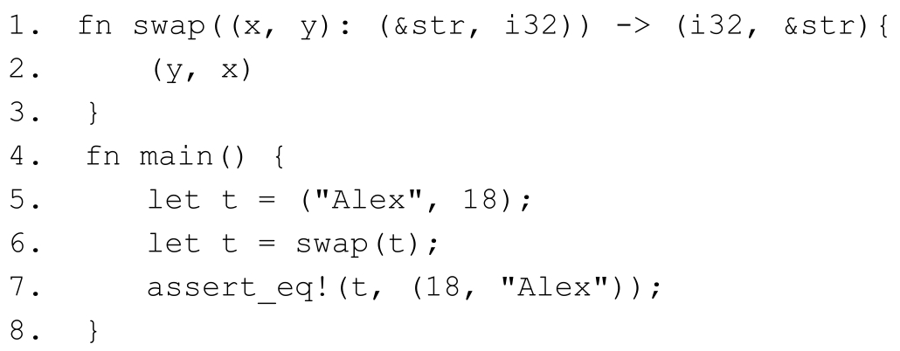{.u54144}
:::

在代码清单6-7中，函数swap的参数利用了模式匹配来解构元组。当然，如果只想解构元组中的单个值，则使用通配符将其他值忽略掉即可。

### 6.1.3 函数返回值 {#text00012.html#A542800bb-e67c-4a20-822c-742bb4306465 .title-left}

Rust中的函数只能有唯一的返回值，即便是没有显式返回值的函数，其实也相当于返回了一个单元值**（）** 。如果需要返回多个值，亦可使用元组类型，如代码清单6-8所示。

**代码清单6-8：使用元组类型让函数返回多个值**

::: center
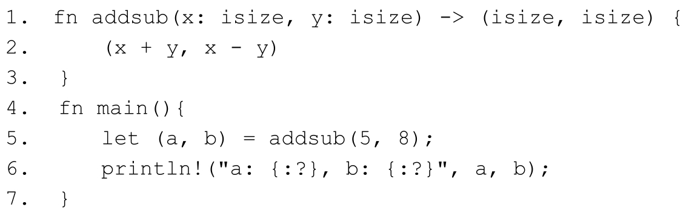{.u54143}
:::

代码清单6-8中的addsub函数返回了元组类型，main函数中使用let模式匹配解构了返回的元组，分别声明了变量绑定a和b。

Rust语言提供了return关键字来返回函数中的值。对于只需要返回函数体最后一行表达式所求值的函数，return可以省略，比如addsub函数。在某些控制结构中，比如循环或条件分支，如果需要提前退出函数并返回某些值，则需要显式地使用return关键字来返回，如代码清单6-9所示。

**代码清单6-9：使用return提前返回示例**

::: center
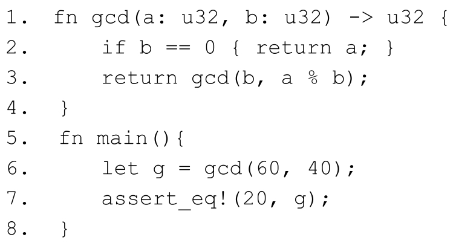{.u54142}
:::

在代码清单 6-9 中，函数 gcd 使用欧几里得算法（辗转相除法）求两数中的最大公约数。如果a%b的余数不为0，则将b和a相互置换，将余数作为b的值，继续递归求值；如果余数为0，则提前返回a。其实此例中如果gcd函数使用if-else条件分支，阅读性会更好一些。

我们在第2章中见到过函数返回值类型为"！"的发散函数（diverging function），这类函数将永远不会有任何返回值。

### 6.1.4 泛型函数 {#text00012.html#A1fad00bc-d734-4b90-b041-32c6c6507f81 .title-left}

Rust 的函数也支持泛型。通过实现泛型函数，可以节省很多工作量，如代码清单 6-10所示。

**代码清单6-10：实现泛型函数示例**

::: center
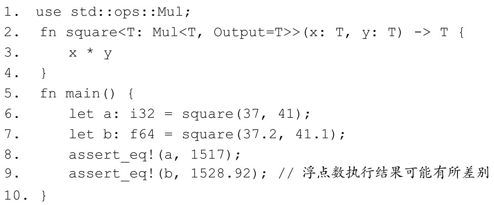{.u54141}
:::

代码清单6-10实现了一个求平方的函数square，该函数参数并未指定具体的类型，而是用了泛型**T** ，对T只有一个Mul trait限定，即只有实现了Mul的类型才可以作为参数，从而保证了类型安全，这是实现泛型函数需要注意的地方。因为Mul trait有关联类型，所以这里需要显式指定为Output=T。这样，在main函数中可以将其应用于i32或f64等类型，而不需要单独为某个类型实现一遍square函数。

注意，这里调用square函数的时候并未指定具体类型，而是靠编译器来进行自动推断的。此示例使用的都是基本原生类型，编译器推断起来比较简单。但肯定存在编译器无法自动推断的情况，此时就需要显式地指定函数调用的类型，需要用到第3章提到过的turbofish操作符：：＜＞，如代码清单6-11所示。

**代码清单6-11：使用turbofish操作符**

::: center
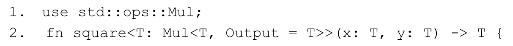{.u54140}
:::

::: center
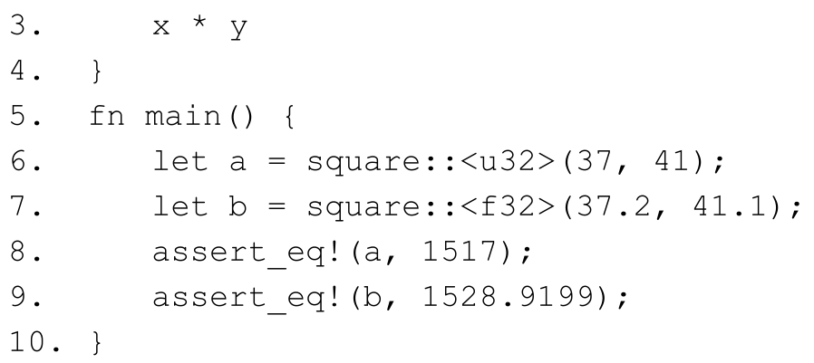{.u53403}
:::

代码清单6-11的第6行和第7行使用turbofish操作符指定了具体的类型，因而就不需要在变量绑定a和b之后再次显式地指定类型了。

### 6.1.5 方法与函数 {#text00012.html#Aba3200bd-8196-4da9-8145-8885435e6454 .title-left}

Rust中的**方法和函数是有区别的** 。方法来自面向对象编程范式，在语义上，它代表某个实例对象的行为。函数只是一段简单的代码，它可以通过名字来进行调用。方法也是通过名字来进行调用的，但它必须关联一个**方法接收者** 。

代码清单6-12中为结构体User实现了方法。

**代码清单6-12：为结构体User实现方法**

::: center
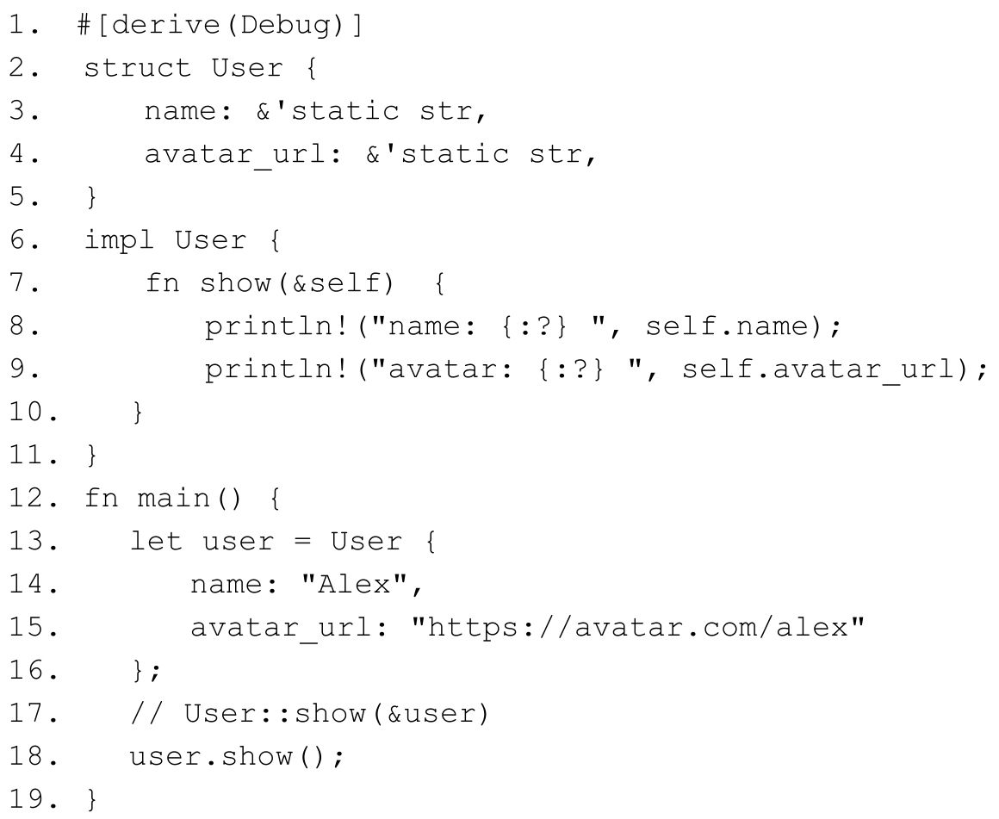{.u54139}
:::

代码清单6-12中定义了结构体User，包含两个成员字段name和avatar_url。我们使用impl关键字为User实现了show方法，其参数为&self。此处self为结构体User的任意实例，&self则为实例的引用。

这样就可以在main函数中使用点操作来调用show方法了（代码第18行），而结构体实例 user 会被隐式传递给 show 方法，user 就是 show 方法的接收者。user.show 等价于User：：show（&user）这样的函数调用。在第7章中还会讲到更多关于结构体和方法的内容。

### 6.1.6 高阶函数 {#text00012.html#A9bde00be-44f0-492e-942e-05e4c5633a11 .title-left}

在数学和计算机科学里均有高阶函数的定义。在数学中，高阶函数也叫算子或泛函。比如微积分中的导数就是一个函数到另一个函数的映射。在计算机科学里，高阶函数是指以函数作为参数或返回值的函数，它也是函数式编程语言最基础的特性。Rust语言也支持高阶函数，因为函数在Rust中是一等公民。

函数可以作为参数进行传递，如代码清单6-13所示。

**代码清单6-13：函数本身作为参数**

::: center
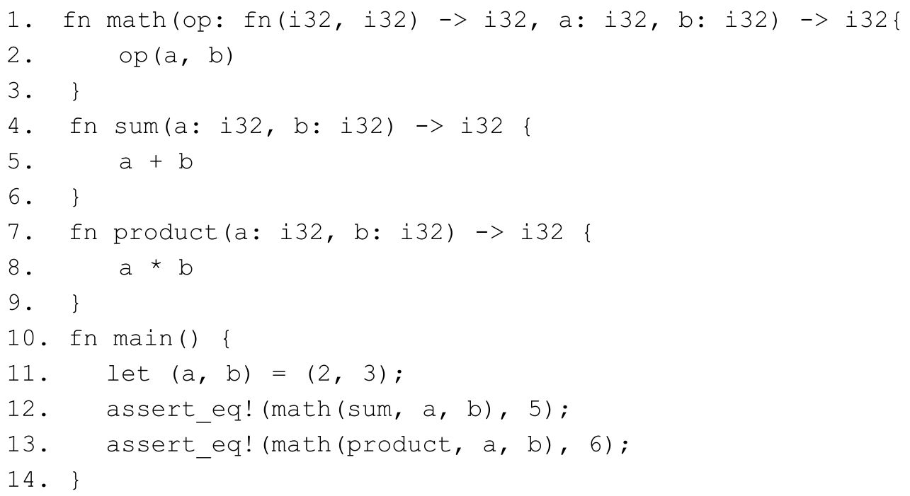{.u54138}
:::

代码清单6-13的第1行代码定义了函数math，其中第一个参数op类型为fn（i32，i32）-＞i32，代表其为一个函数。第4行到第6行定义了一个求和函数sum，第7行到第9行定义了一个求积函数product，然后在main函数中将sum和product分别作为参数传到math中进行调用，编译运行之后得到预期的值。函数 math 就是一个高阶函数，注意其在调用的时候传入的只是函数名。

实现这一切的基础在于Rust支持类似C/C++语言中的**函数指针** 。函数指针，顾名思义，是指向函数的指针，其值为函数的地址，如代码清单6-14所示。

**代码清单6-14：函数指针**

::: center
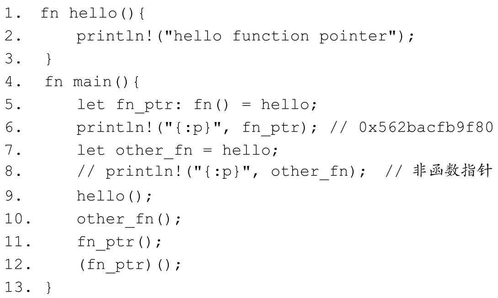{.u54137}
:::

代码清单6-14的第5行声明了一个函数指针。这里需要注意的地方是，let声明必须显式指定函数指针类型fn（），以及赋值使用的是函数名hello而非带括号的函数调用。第6行通过打印fn_ptr的指针地址，证明其为一个函数指针。

代码第7行的let声明并没有指定函数指针类型，如果取消第8行的注释，那么编译此代码时，打印other_fn指针地址会报如下错误：

::: center
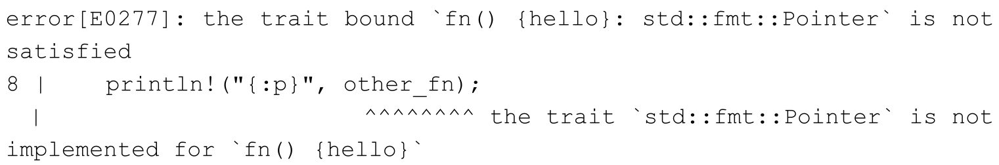{.u54136}
:::

根据此错误信息可以了解到，other_fn的类型实际上是fn（） {hello}，这其实是函数hello本身的类型，而非函数指针类型，所以other_fn不是函数指针类型。虽然如此，并不会影响第10行的函数调用。

回到代码清单6-13中，函数math的参数op的类型指定为fn（i32，i32）-＞i32，就是函数指针类型。当main函数中调用math函数时，传入sum和product函数名之后，会自动通过模式匹配转换为函数指针类型。

对于函数指针类型，可以使用type关键字为其定义别名，便于提升代码可读性，如代码清单6-15所示。

**代码清单6-15：使用type关键字定义函数指针类型别名**

::: center
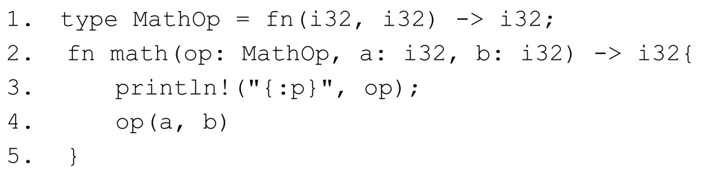{.u54135}
:::

当然，也可以将函数作为返回值，如代码清单6-16所示。

**代码清单6-16：将函数作为返回值**

::: center
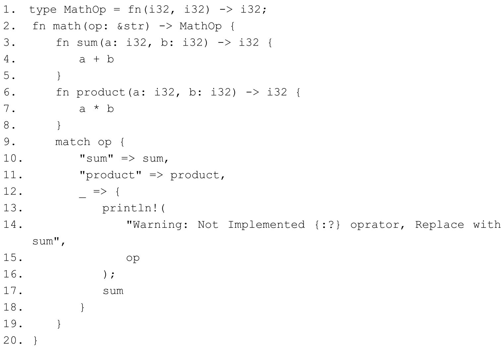{.u54134}
:::

::: center
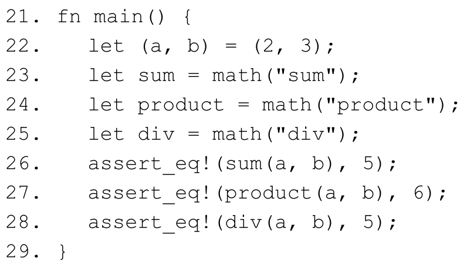{.u54133}
:::

代码清单6-16中实现的math函数，接收一个字符串作为参数，函数中使用match进行匹配，如果字符串为sum，则返回sum函数；如果字符串是product，则返回product函数。注意在match匹配中，sum和product函数均只是函数指针（函数名）。该代码可以正确编译执行，注意代码第25行，因为没有实现div函数，所以代码会打印指定的warning提示，并使用sum函数替代div函数。

假设现在想把 math 函数修改一下，让其作为返回值的函数直接和参与计算的值进行绑定，如代码清单6-17所示。

**代码清单6-17：将返回的函数和参与计算的参数直接绑定**

::: center
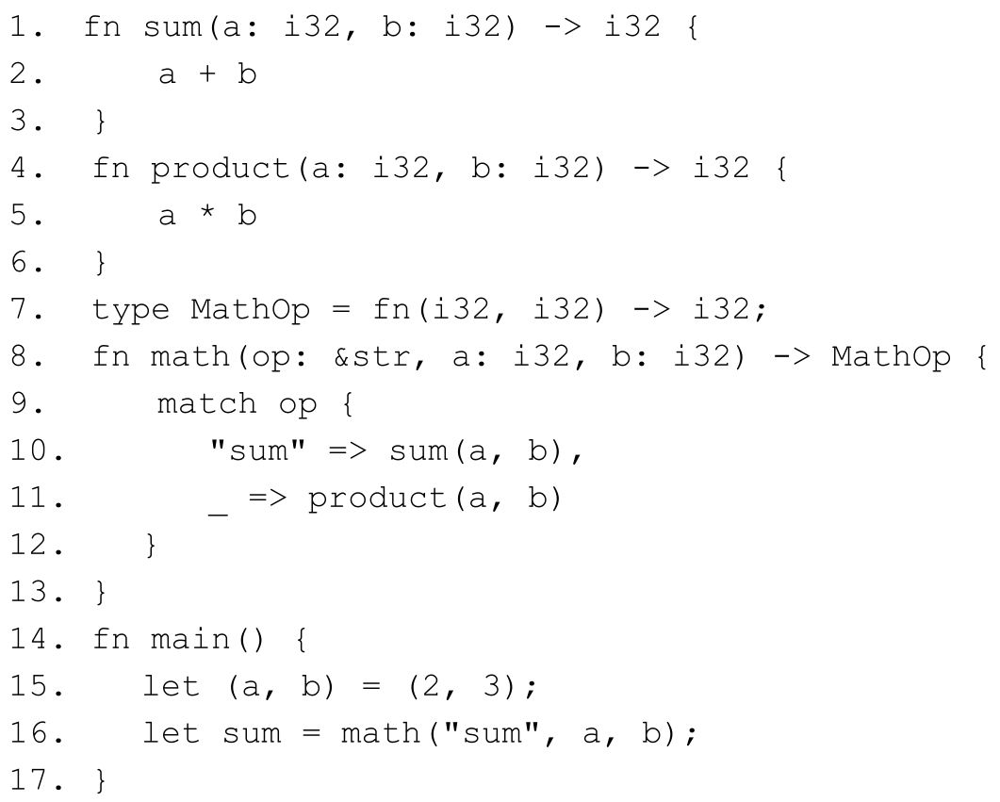{.u54132}
:::

代码清单6-17编译会报类型不匹配的错误。因为在math函数调用的时候，match匹配中的sum（a，b）和product（a，b）会同时进行求值，得到的是i32类型，而不是MathOp类型。所以，要想返回函数，还必须使用函数指针。

再来看另外一个将函数作为返回值的示例，如代码清单6-18所示。

**代码清单6-18：返回默认加1的计数函数**

::: center
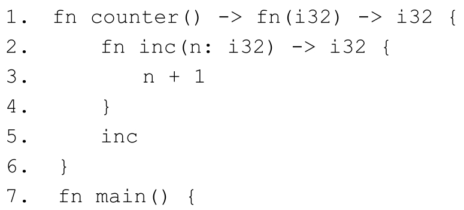{.u54131}
:::

::: center
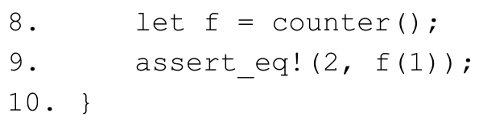{.u54109}
:::

代码清单6-18中定义了默认加1的计数函数，现在我们把其改为可以直接指定增长值的函数，如代码清单6-19所示。

**代码清单6-19：让counter函数可以直接指定增长值i**

::: center
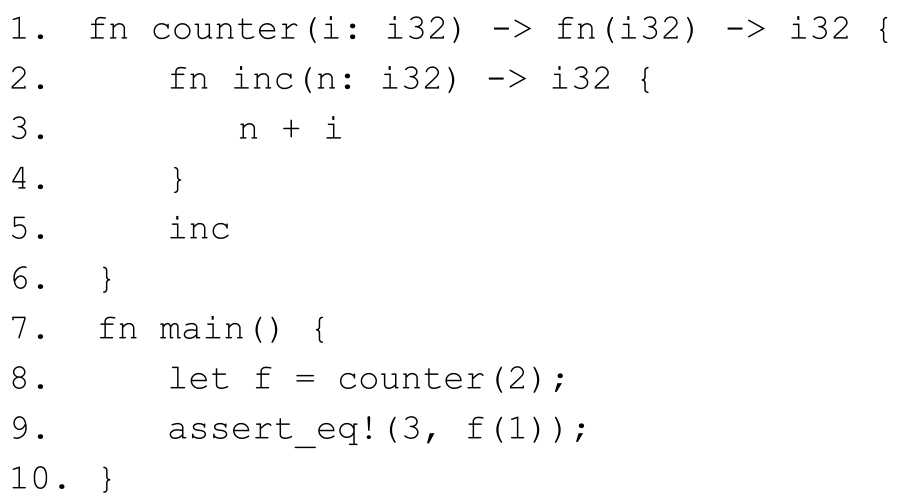{.u54130}
:::

代码清单6-19编译会报以下错误：

::: center
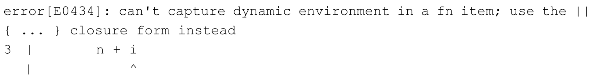{.u53518}
:::

Rust不允许fn定义的函数inc捕捉动态环境（函数counter）中的变量绑定i，因为变量绑定i会随着栈帧的释放而释放。如果一定要这么做，需要使用闭包来代替。

## 6.2 闭包 {#text00012.html#Aa16f00c1-c5eb-4e3c-9aec-544011a53760 .title-left}

**闭包** （**Closure** ）通常是指词法闭包，是一个持有外部环境变量的函数。**外部环境** 是指闭包定义时所在的词法作用域。外部环境变量，在函数式编程范式中也被称为**自由变量** ，是指并不是在闭包内定义的变量。**将自由变量和自身绑定的函数就是闭包** 。

回到代码清单6-19中，如果想在返回的函数中继续使用变量 i，则需要用到闭包，如代码清单6-20所示。

**代码清单6-20：返回闭包**

::: center
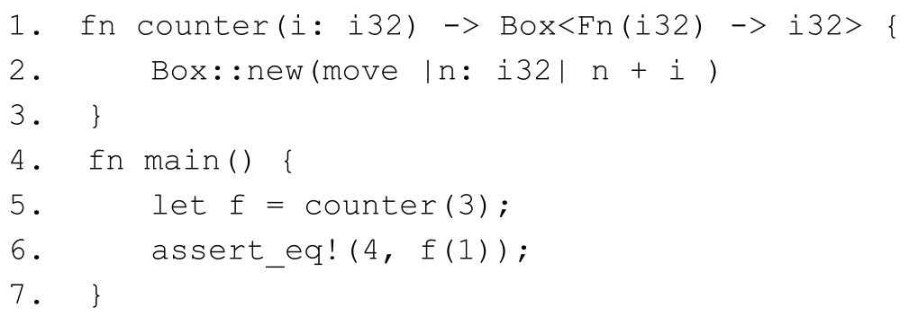{.u54129}
:::

在代码清单6-20中，counter函数返回的是一个闭包，放到了Box＜T＞中，因为闭包的大小在编译期是未知的。在Rust 2018版本中，返回的闭包也可以使用**impl Trait** 语法写成impl Fn（i32）-＞i32，这样就不需要使用Box＜T＞了。

在代码第2行的闭包**\|n：i32\|n+i** 中，i为自由变量，因为闭包自身的参数只有n。第5章介绍过闭包捕获自由变量的三种方式，因为此时 i 为复制语义类型，所以它肯定会按引用被捕获。此引用会妨碍闭包作为函数返回值，编译器会报错。所以这里使用 move 关键字来把自由变量 i 的所有权转移到闭包中，当然，因为变量 i 是复制语义，所以这里只会进行按位复制。

注意这里闭包的类型为 **Fn（i32）-＞ i32** ，以大写字母 F 开头的 **Fn** 并不是函数指针类型fn（i32）-＞i32，它是一个trait，本章后面的章节有更详细的介绍。

在main函数中，第5行变量f绑定了counter（3）函数调用返回的闭包。该闭包持有counter函数传入的参数值3，在第6行调用f（1）时参与了计算，得到最终的结果4。

通过此例看得出来，闭包包含以下两种特性：

· **延迟执行** 。返回的闭包只有在需要调用的时候才会执行。

· **捕获环境变量** 。闭包会获取其定义时所在作用域中的自由变量，以供之后调用时使用。

现在我们对闭包有了大致的了解，接下来将系统地学习Rust中闭包的具体概念和实现。

### 6.2.1 闭包的基本语法 {#text00012.html#Ae21b00c2-8899-41e5-b20d-867f558af6f1 .title-left}

Rust的闭包语法形式参考了Ruby语言的lambda表达式，如代码清单6-21所示。

**代码清单6-21：闭包基本语法示例**

::: center
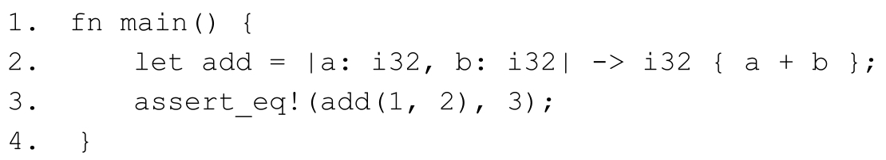{.u54128}
:::

闭包由**管道符** （两个对称的竖线）和花括号（或圆括号）组合而成。管道符里是闭包函数的参数，可以像普通函数参数那样在冒号后面添加类型标注，也可以省略为以下形式：

::: center
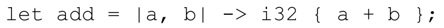{.u54127}
:::

花括号里包含的是闭包函数执行体，花括号和返回值也可以省略：

::: center
{.u54126}
:::

当闭包函数没有参数只有捕获的自由变量时，管道符里的参数也可以省略：

::: center
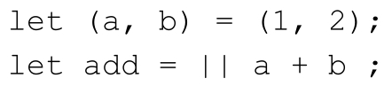{.u54125}
:::

闭包的参数可以是任意类型的，如代码清单6-22所示。

**代码清单6-22：闭包参数可以为任意类型**

::: center
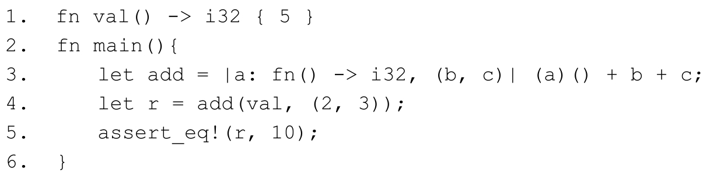{.u53899}
:::

代码清单6-22的第3行定义的闭包有两个参数，第一个是函数指针类型，第二个是元组类型。虽然元组类型中的参数没有显式地标注类型，但是Rust编译器会通过函数指针类型的信息来推断其为i32类型，所以代码可以正常编译运行。

需要注意的是，两个定义一模一样的闭包也并不一定属于同一种类型，如代码清单6-23所示。

**代码清单6-23：两个相同定义的闭包却不属于同一种类型**

::: center
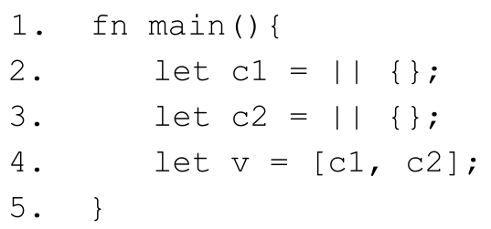{.u54124}
:::

代码清单6-23声明了两个形式一样的闭包，将它们保存到一个数组中。因为数组只能保存相同类型的元素，所以编译会报如下错误：

::: center
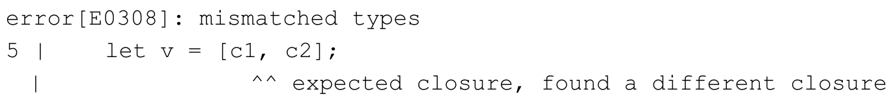{.u54123}
:::

这表示两个相同定义的闭包完全不属于同一种类型。

### 6.2.2 闭包的实现 {#text00012.html#Aa83c00c3-3bc3-4738-ae4a-8e7a513411f5 .title-left}

假如现在想显式地指定闭包的类型，该如何操作？可以通过代码清单6-24所示的方法来查看一个闭包的类型。

**代码清单6-24：查看闭包类型**

::: center
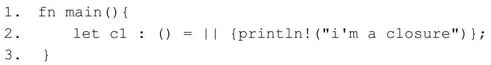{.u54122}
:::

代码清单6-24编译会报如下错误：

::: center
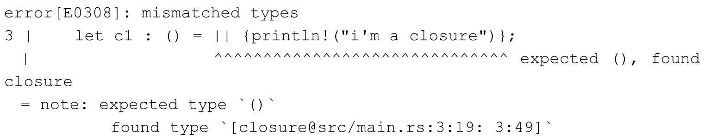{.u53714}
:::

错误信息提示，期望得到的类型是单元类型，但是实际得到的类型是**\[closure@src/main.rs：3：19：3：49\]** 。这个闭包类型与 Rust 类型系统提供的常规类型不同，它是一个由编译器制造的临时存在的闭包实例类型。

**其实在Rust中，闭包是一种语法糖** 。也就是说，闭包不属于Rust语言提供的基本语法要素，而是在基本语法功能之上又提供的一层方便开发者编程的语法。闭包和普通函数的差别就是闭包可以捕获环境中的自由变量。如果用现在已经学过的知识来实现一个自己的闭包，该如何做？

能想到的第一个办法是使用指针。如图6-1所示，闭包\|\|{a+b}的实现可以通过函数指针和捕获变量指针组合来实现。指针放栈上，捕获变量放到堆上。实际上，早期的Rust版本实现闭包就采用了类似的方式，因为要把闭包捕获变量放到堆上，所以称其为**装箱** （**Boxed** ）**闭包** 。这种方式带来的问题就是影响性能。Rust是基于LLVM的语言，这种闭包实现方式使得LLVM难以对其进行内联和优化。

::: center
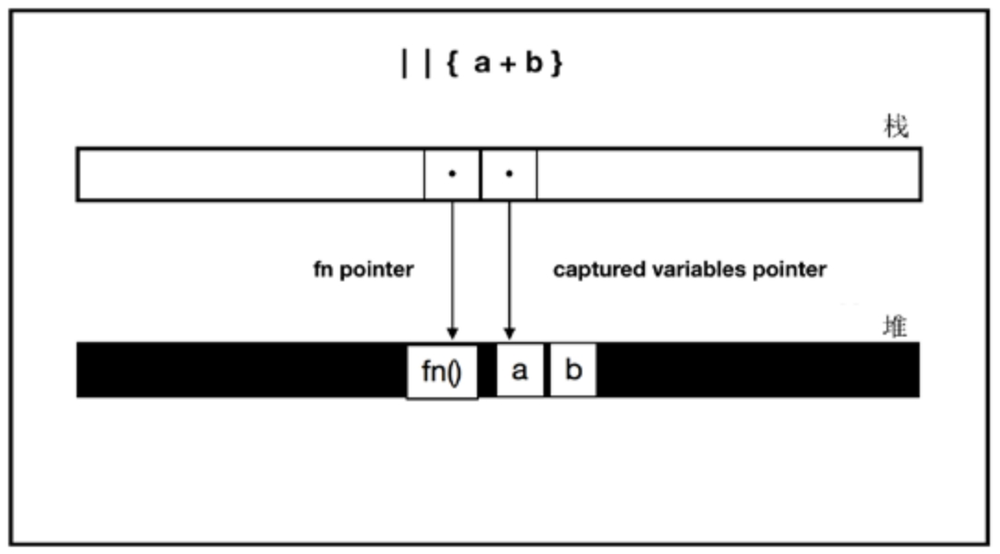{.u54121}

图6-1：使用指针实现闭包
:::

所以，Rust团队又对闭包的实现做了重大改进，也就是当前版本中的闭包实现方式。改进方案称为非装箱（Unboxed）闭包，此方案是Rust语言一致性的再一次体现。

非装箱闭包方案有三个目标：

· 可以让用户更好地控制优化。

· 支持闭包按值和按引用绑定环境变量。

· 支持三种不同的闭包访问，对应self、&self和&mut self三种方法。

实现这三个目标的核心思想是，通过增加trait将函数调用变为可重载的操作符。比如，将a（b，c，d）这种函数调用变为如下形式：

::: center
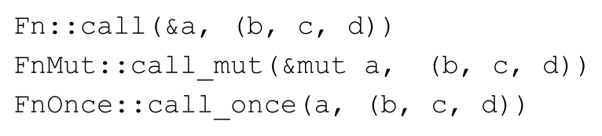{.u54120}
:::

Rust增加的这三个trait分别就是Fn、FnMut和FnOnce。它们在Rust源码中的定义如代码清单6-25所示。

**代码清单6-25：Fn、FnMu、FnOnce在源码中的定义示例**

::: center
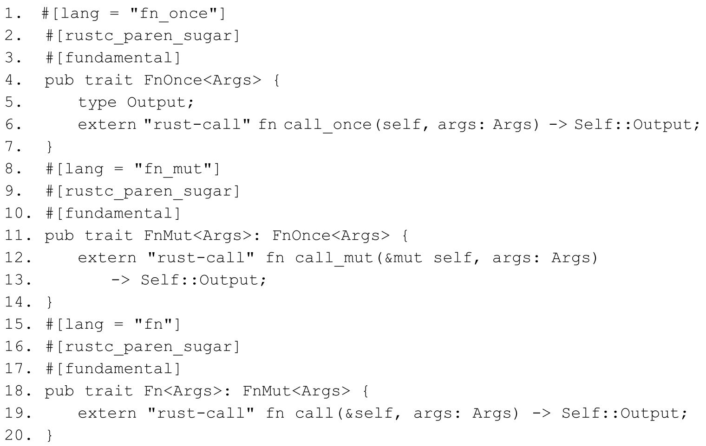{.u54119}
:::

从代码清单6-25中看得出来，这三个trait都标记了三个相同的属性。

第一个属性是**＃\[lang=＂fn/fn_mut/fn_once＂\]** ，表示其属于语言项（Lang Item），分别以**fn** 、**fn_mut** 、**fn_once** 名称来查找这三个trait。

第二个属性是**＃\[rustc_paren_sugar\]** ，表示这三个trait是对括号调用语法的特殊处理，在编译器内部进行类型检查的时候，仅会将最外层为圆括号的情况识别为方法调用。在类型签名或方法签名中有时候有尖括号，比如**＜F：Fn（u8，u8）-＞u8＞** ，而此时尖括号里面的括号就不会被识别为方法调用。

第三个属性为**＃\[fundamental\]** ，在第3章介绍过，这是为了支持trait一致性而增加的属性，加上此属性则被允许为Box＜T＞实现指定的trait，在此例中是这三个Fn系列的trait。

函数调用为什么要分成三个trait？这和所有权系统有关。

· FnOnce调用参数为self，这意味着它会转移方法接收者的所有权。换句话说，就是这种方法调用只能被调用一次。

· FnMut调用参数为&mut self，这意味着它会对方法接收者进行可变借用。

· Fn调用参数为&self，这意味着它会对方法接收者进行不可变借用，也就是说，这种方法调用可以被调用多次。

现在函数调用被抽象成为了三个 trait，实现闭包就简单了，只需要用结构体代替闭包表达式，然后按具体的需求为此结构体实现对应的trait即可。这样的话，每个闭包表达式实际上就是该闭包结构体的具体实例，该结构体内部成员可以存储闭包捕获的变量，然后在调用的时候使用即可，如代码清单6-26所示。

**代码清单6-26：模拟编译器对闭包的实现**

::: center
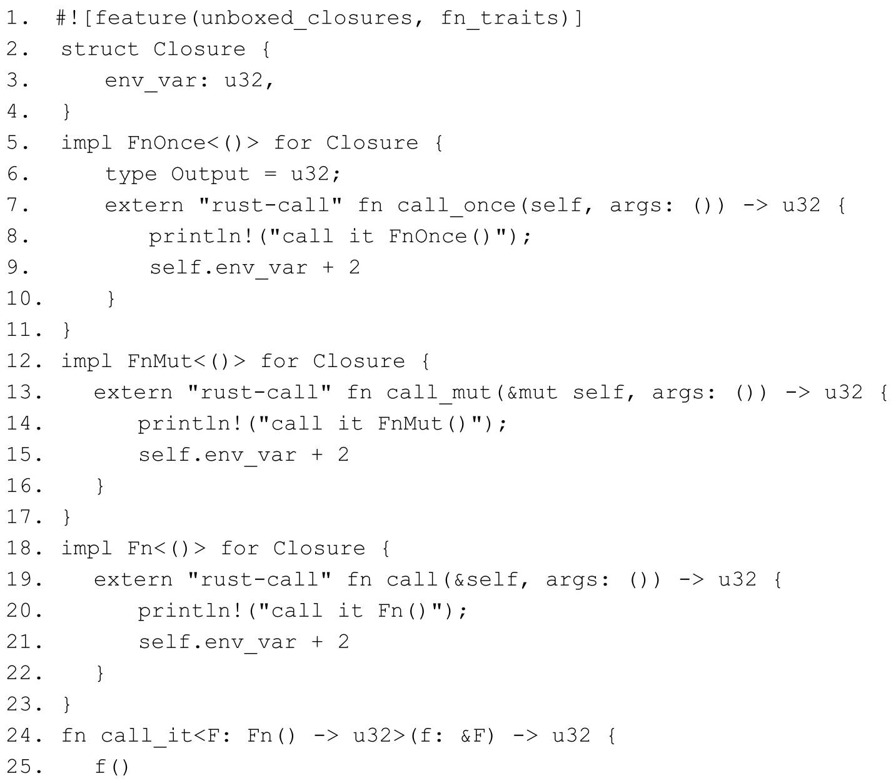{.u54118}
:::

::: center
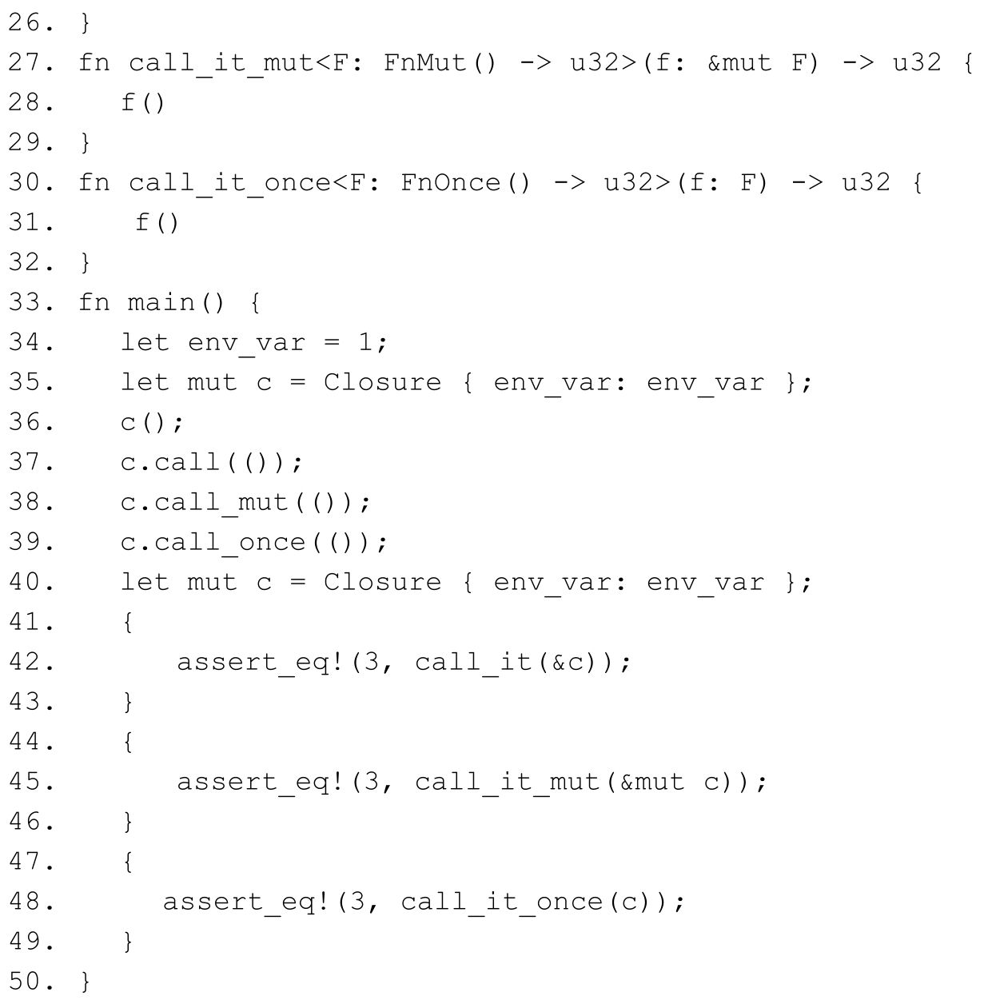{.u54117}
:::

代码清单6-26的第1行使用了feature特性**＃！\[feature（unboxed_closures，fn_traits）\]** ，注意此特性只能应用于Nightly版本下。

第2行定义了结构体Closure，有一个成员字段代表从环境中捕获的自由变量。然后分别为其实现了FnOnce、FnMut、Fn这三个trait。

第24行到第32行定义了call_it、call_it_mut、call_it_once三个泛型函数，它们分别使用FnOnce、FnMut、Fn这三个trait来做泛型参数的限定，用来测试Closure结构体实例调用。

在main函数中，第35行定义了Closure结构体实例，将环境变量env_var保存在其成员字段中。因为该结构体实现了指定的trait，所以在第36行其实例c可以像函数那样被调用。

最终的执行结果如代码清单6-27所示。

**代码清单6-27：自定义闭包实现的输出结果**

::: center
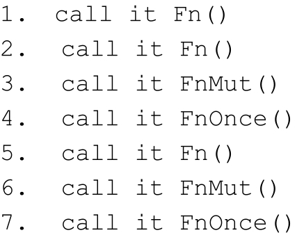{.u54116}
:::

代码清单6-27第1行是代码清单6-26中第36行的输出结果。它说明，默认的函数调用c（）是Fn trait中实现的call方法。此处结构体实例可以像函数那样被调用，这看起来像"魔法"，实际上是由下面的代码实现的。

::: center
{.u54115}
:::

此处extern关键字用于fn前面，表示使用指定的ABI（Application Binary Interface，程序二进制接口），此处代表指定使用Rust语言的rust-call ABI，它的作用是将函数参数中的元组类型做动态扩展，以便支持可变长参数。因为在 Fn、FnMut、FnOnce 这三个 trait 里的方法要接收闭包的参数，而编译器本身并不可能知道开发者给闭包设定的参数个数，所以这里只能传元组，然后由rust-call ABI在底层做动态扩展。

但是需要注意的是，如果想使用 rust-call ABI，必须像代码清单 6-26 第 1 行那样声明unboxed_closures特性。

代码清单6-26第37行至第39行分别显式地调用了相应的call、call_mut、call_once方法，但是注意必须显式地指定一个单元值为参数，这里为了演示，指定了args参数为单元类型。分别输出代码清单6-27的第2行至第4行的结果。

代码清单6-26的第40行重新声明了Closure结构体实例，这是因为在第39行call_once调用之后，之前的实例c的所有权被转移，无法再次被使用。要注意call_once方法中的参数是self。

代码清单6-26的第41行到第49行使用了call_it、call_it_mut、call_it_once函数来测试相应的trait限定，对应的trait限定如下。

::: center
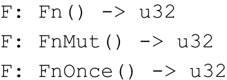{.u54114}
:::

输出的结果为代码清单6-27的第5行至第7行，和预期相符。

代码清单6-26等价于下面的闭包代码，如代码清单6-28所示。

**代码清单6-28：与代码清单6-26等价的闭包示例**

::: center
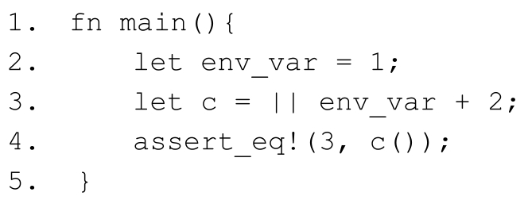{.u54113}
:::

代码清单 6-28 中定义的闭包 c 相当于代码清单 6-26 中已经实现了相应 trait 的结构体Closure的实例c。

代码清单6-26模拟的闭包实现并不等同于Rust编译器源码中真正的闭包实现。这里只是做一个思路的演示。

现在我们知道了闭包是基于trait的语法糖，那么就可以通过使用trait对象来显式地指定其类型，如代码清单6-29所示。

**代码清单6-29：显式指定闭包类型**

::: center
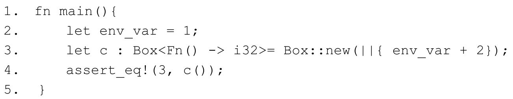{.u54112}
:::

代码清单6-29的第3行显式地指定了闭包的类型为Box＜Fn（）-＞i32＞，该类型为trait对象，此处必须使用trait对象。

### 6.2.3 闭包与所有权 {#text00012.html#A6fe200c8-c08a-4638-be93-5b94f13d513b .title-left}

闭包表达式会由编译器自动翻译为结构体实例，并为其实现Fn、FnMut、FnOnce三个trait中的一个。但是对于开发者来说，如何才能知道某个闭包表达式由编译器默认实现了哪种trait呢？

前面提到过，这三个trait和所有权有关系。更准确地说，这三个trait的作用如下。

· **Fn** ，表示闭包以不可变借用的方式来捕获环境中的自由变量，同时也表示该闭包没有改变环境的能力，并且可以多次调用。对应&self。

· **FnMut** ，表示闭包以可变借用的方式来捕获环境中的自由变量，同时意味着该闭包有改变环境的能力，也可以多次调用。对应&mut self。

· **FnOnce** ，表示闭包通过转移所有权来捕获环境中的自由变量，同时意味着该闭包没有改变环境的能力，只能调用一次，因为该闭包会消耗自身。对应self。

第5章讲所有权系统时，对不同环境变量类型介绍过闭包捕获其环境变量的方式：

· 对于复制语义类型，以不可变引用（&T）来进行捕获。

· 对于移动语义类型，执行移动语义，转移所有权来进行捕获。

· 对于可变绑定，并且在闭包中包含对其进行修改的操作，则以可变引用（&mut T）来进行捕获。

也就是说，闭包会根据环境变量的类型来决定实现哪种trait。这三个trait的关系如图6-2所示。

::: center
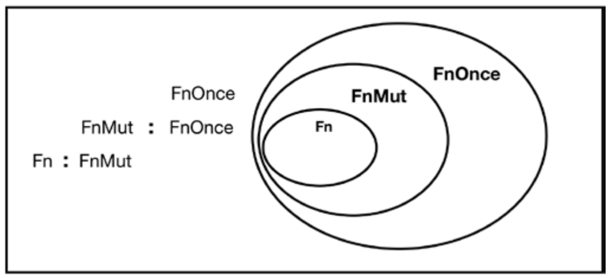{.u54111}

图6-2：Fn、FnMut、FnOnce之间的关系
:::

图6-2展示了Fn、FnMut、FnOnce三个trait之间的关系。FnMut继承了FnOnce，Fn又继承了FnMut。这意味着，如果要实现Fn，就必须实现FnMut和FnOnce；如果要实现FnMut，就必须实现FnOnce；如果只需要实现FnOnce，就不需要实现FnMut和Fn。

**复制语义类型自动实现Fn**

相关代码如代码清单6-30所示。

**代码清单6-30：复制语义类型自动实现Fn**

::: center
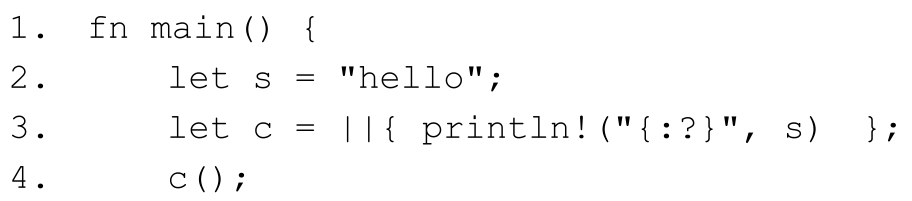{.u54110}
:::

::: center
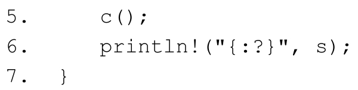{.u54109}
:::

在代码清单6-30中，声明了变量绑定s为字符串字面量，其为复制语义类型。闭包c会按照不可变引用来捕获s。第4行和第5行代码两次调用闭包c，第6行的println！打印s，均可以正常编译运行，因此就可以做出这样的推理：闭包c可以两次调用，说明编译器自动为闭包表达式实现的结构体实例并未失去所有权。第6行的println！语句会对s进行一次不可变借用，这就证明第3行闭包对s进行了不可变借用，只有不可变借用才可以借用多次。

综上所述，闭包c默认自动实现了Fn这个trait，并且该闭包以不可变借用捕获环境中的自由变量。

要实现Fn就必须实现FnMut和FnOnce，所以，代码清单6-30中的闭包如果被编译器翻译为匿名结构体和trait，那么Fn、FnMut、FnOnce都会被实现，如代码清单6-31所示。

**代码清单6-31：代码清单6-30中的闭包被翻译为匿名结构体和trait的情况**

::: center
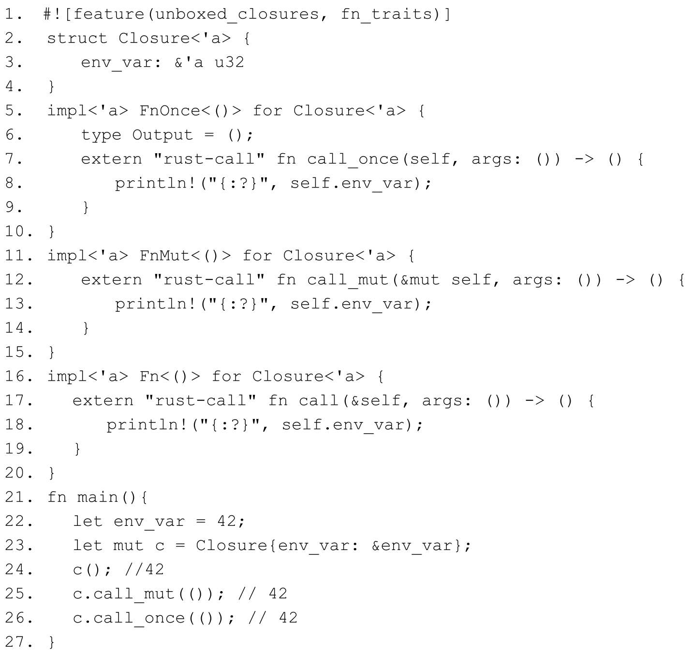{.u54108}
:::

在代码清单6-31中，闭包被翻译为结构体Closure＜＇a ＞，因为环境变量是按不可变借用进行捕获的，所以其成员字段是引用类型，注意这里需要明确指定生命周期参数。在 main函数的第24行，闭包结构体实例c的调用操作默认是执行Fn实现中的call方法。因为这里要实现 Fn，必须同时实现 FnMut 和 FnOnce，所以第 25 行和第 26 行可以显式地直接调用call_mut和call_once方法。

因此，在代码清单6-30的闭包调用中也可以显式地调用call_mut和call_once方法，如代码清单6-32所示。

**代码清单6-32：实现了Fn的闭包也可以显式调用call_mut和call_once方法**

::: center
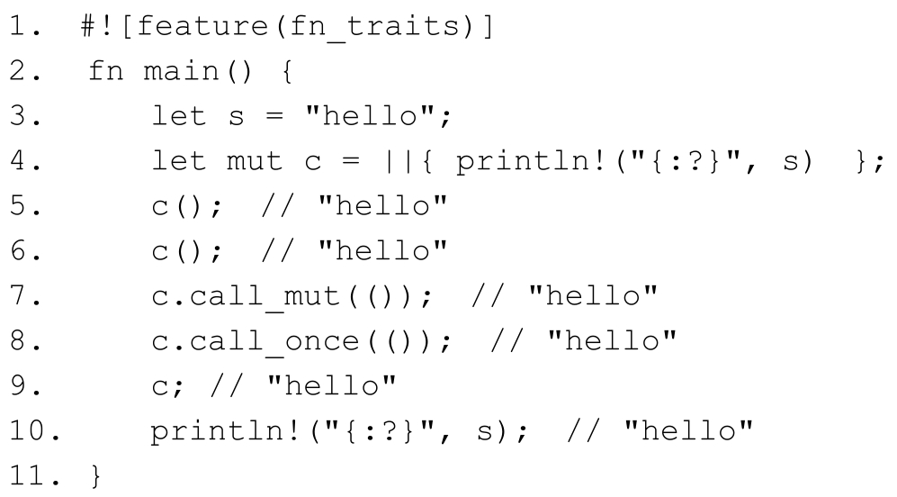{.u54107}
:::

代码清单6-32的第1行使用了**＃！\[feature（fn_traits）\]** 特性，是为了显式调用trait实现中的call、call_mut、call_once方法，如果是默认的闭包调用，并不需要此特性（比如代码清单6-30）。

代码第4行使用了mut关键字改变了闭包的可变性，这是为了调用call_mut方法，此方法需要可变闭包。

代码第5行默认的闭包调用是Fn实现的call方法。第6行依然可以再次调用闭包c。

代码第7行显式地调用了call_mut方法，正常输出结果。

代码第8行显式地调用了call_once方法，正常输出结果。此时闭包c捕获的变量s默认实现了Copy，因此默认实现的FnOnce也会自动实现Copy。此处调用call_once方法并不会导致闭包c的所有权被转移。第9行再次调用闭包c，正常输出。但是如果闭包c的捕获变量是移动语义，那么调用call_once就会转移所有权。

第10行正常打印变量绑定s，证明闭包c并没有被后面的call_mut和call_once调用所影响，闭包依旧是按不可变借用捕获的。这也证明闭包被编译器翻译为的结构体是一种固定的结构体。

**移动语义类型自动实现FnOnce**

相关代码如代码清单6-33所示。

**代码清单6-33：移动语义类型自动实现FnOnce**

::: center
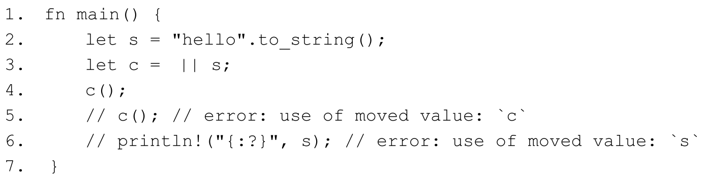{.u54104}
:::

在代码清单6-33中，变量绑定s为String，是典型的移动语义类型。第5行第二次调用闭包c的时候，编译出错，提示c已经被转移了所有权，因而无法使用。而第6行在第4行闭包c调用之后，也会编译出错，提示s已经被转移了所有权而无法使用。综上所述，可以做出这样的推理：闭包c在第一次调用时转移了其所有权，导致第二次调用失效，证明其实现的闭包结构体实例所实现的trait方法参数必然是self。足以证明该闭包实现的是FnOnce。第6行的s因为失去所有权而失效，也足以证明闭包c夺走了s的所有权。

既然闭包的默认调用是FnOnce，这也说明，编译器翻译的闭包结构体中记录捕获变量的成员字段不是引用类型，并且只实现 FnOnce，所以，肯定无法显式地调用 call 或 call_mut方法，如代码清单6-34所示。

**代码清单6-34：闭包只实现了FnOnce，所以无法显式地调用call和call_mut方法**

::: center
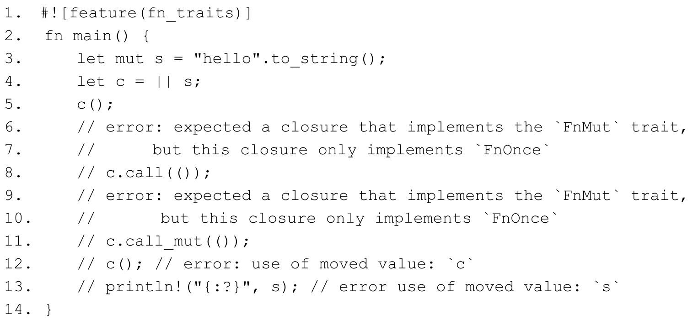{.u54106}
:::

代码清单6-34的第3行声明闭包时使用了mut关键字来设置闭包的可变性，同样是为了显式调用call_mut。

闭包c默认实现了FnOnce，所以代码第8行和第11行分别显式地调用call和call_mut方法时，编译器都报错了，并且提示闭包只实现了FnOnce。

注意代码中已被注释掉的第12行，再次调用闭包c将报所有权转移的错误。这是因为闭包c的捕获变量是String类型，它是移动语义，所以在上面第一次调用闭包c之后，它的所有权已被转移。

**使用moüe关键字自动实现Fn**

Rust 针对闭包提供了一个关键字 move，使用此关键字的作用是强制让闭包所定义环境中的自由变量转移到闭包中，如代码清单6-35所示。

**代码清单6-35：环境变量为复制语义类型时使用moüe关键字**

::: center
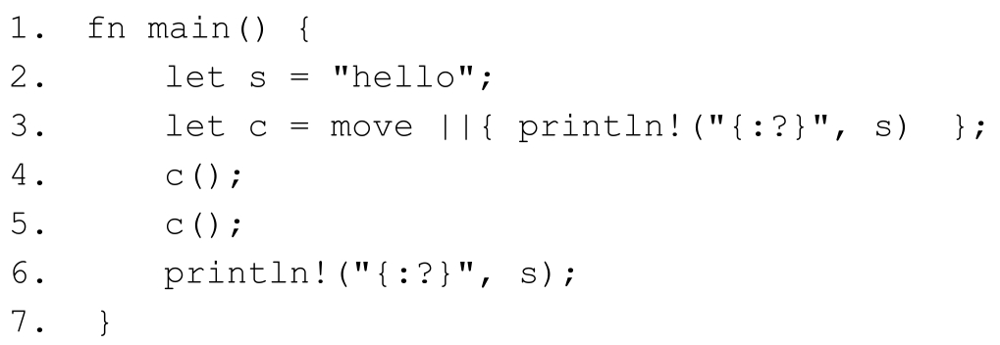{.u54105}
:::

代码清单6-35中的变量绑定s为复制语义类型，虽然move关键字强制执行，但闭包捕获的s执行的对象是复制语义后获取的新变量。原始的s并未失去所有权。所以整个代码可以正常通过编译。由此，可以做出这样的推理：闭包c可以连续两次被调用，说明编译器自动生成的闭包结构体实例并未失去所有权，所以肯定是&self和&mut self中的一种。又因为闭包c本身是不可变的，所以只存在&self。因为要进行不可变借用，所以必须使用mut关键字将c本身修改为可变。因此，该闭包实现的一定是Fn。

代码清单6-36展示的是环境变量为移动语义类型的情况。

**代码清单6-36：环境变量为移动语义类型时使用moüe关键字**

::: center
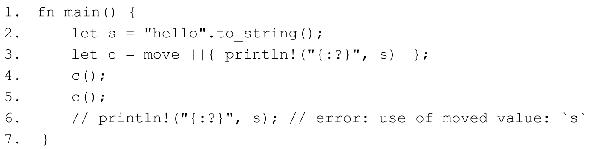{.u54104}
:::

代码清单6-36中的变量绑定s为移动语义类型String。在使用move关键字强制转移所有权之后，变量s已经无法再次被使用了，所以第6行会出错。而闭包c依然是默认不可变的，并且可以进行多次调用。同理，该闭包实现的一定是Fn。

那么，move 关键字是否只影响捕获自由变量的所有权的转移情况，而不影响闭包本身呢？我们来看一下代码清单6-37。

**代码清单6-37：moüe关键字是否影响闭包本身**

::: center
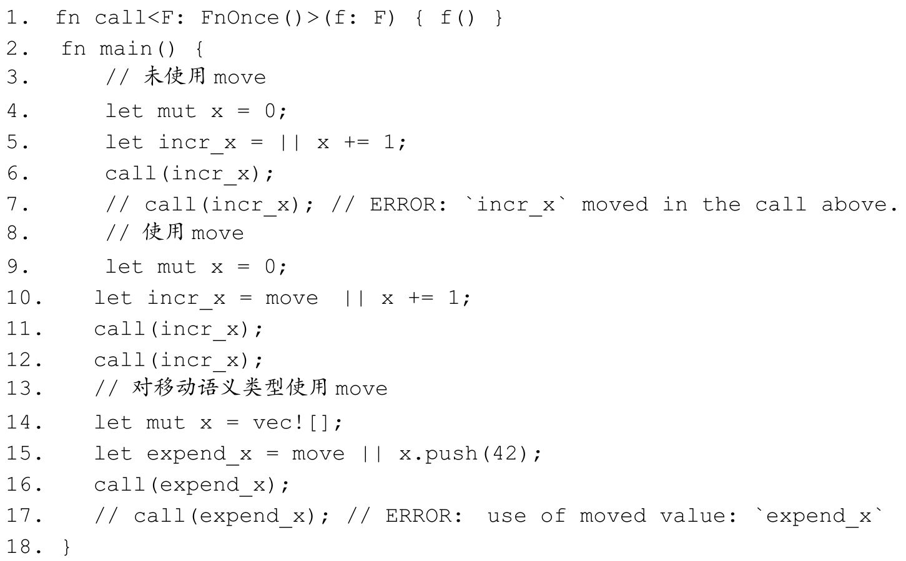{.u54103}
:::

代码清单6-37定义了call函数，以**FnOnce（）** 闭包作为参数，在函数体内执行闭包，该函数主要用于判断闭包自身的所有权是否转移。

代码第4行到第7行定义了闭包incr_x，并未使用move关键字，其捕获变量x为复制语义。将此闭包作为参数传给call函数调用两次，在第二次调用的时候会报错，提示incr_x所有权已经被转移。

代码第9行到第12行再次定义了闭包incr_x，但是这次使用了move关键字。将其作为参数传给call函数调用两次，均可正常编译执行。

代码第14行到第17行定义了闭包expend_x，使用了move关键字，其捕获变量x现在为移动语义类型。将其作为参数传给call函数调用两次，第二次调用报错，提示expend_x的所有权已经被转移。

通过代码清单6-37看得出来，闭包在使用move关键字的时候，如果捕获变量是复制语义类型的，则闭包会自动实现Copy/Clone；如果捕获变量是移动语义类型的，则闭包不会自动实现Copy/Clone，这也是出于保证内存安全的考虑。

**修改环境变量以自动实现FnMut**

很多时候需要通过修改环境变量的闭包来自动实现FnMut，如代码清单6-38所示。

**代码清单6-38：修改环境变量的闭包来自动实现FnMut**

::: center
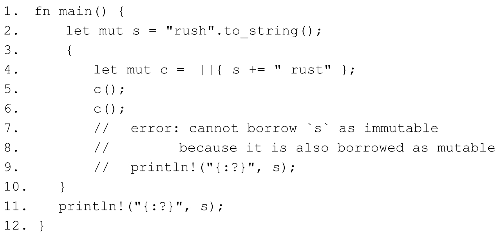{.u54102}
:::

代码清单6-36中的变量绑定s使用mut关键字修改了其可变性，成为了可变绑定。变量s通过第4行的闭包c进行了自我修改，所以闭包c在声明时也使用了mut关键字。如果想修改环境变量，必须实现FnMut。由编译器生成的闭包结构体实例在调用fn_mut方法时，需要&mut self。

闭包c同样可以调用两次。但是如果在和闭包c同样的作用域中使用s的不可变借用，编译器就会报错，因为s已经被闭包c按可变借用进行了捕获。所以在第9行的println！语句中使用s就会报错。但是在第11行，s依旧可以作为不可变借用，因为之前s的可变借用在离开第10行作用域之后就已经归还了所有权。

实现了FnMut的闭包，必然会实现FnOnce，但不会实现Fn，如代码清单6-39所示。

**代码清单6-39：实现了FnMut的闭包的情况**

::: center
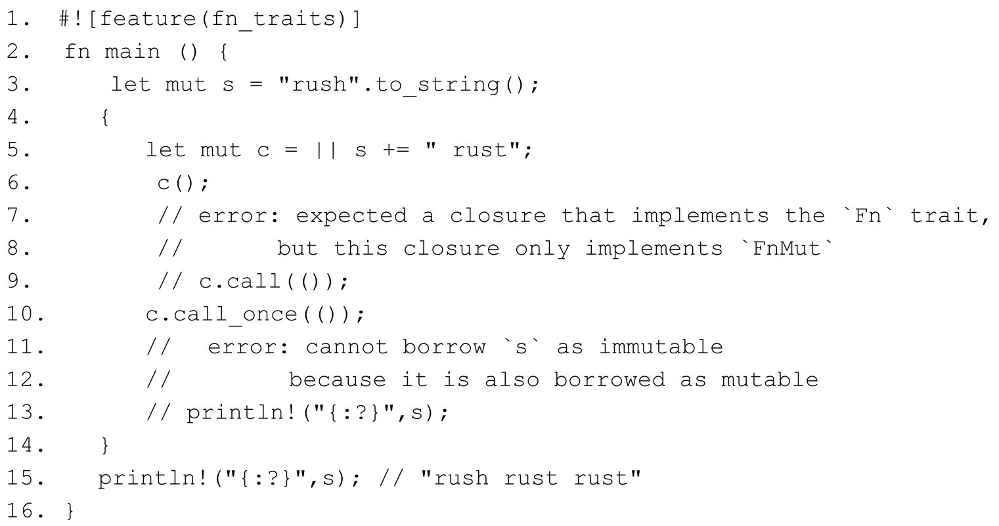{.u53492}
:::

在代码清单6-39中，第9行显式地调用call方法时，编译器会报错，并提示该闭包只实现了FnMut。而第10行则可以显式地调用call_once方法。

**未捕获任何环境变量的闭包会自动实现Fn**

没有捕获任何自由变量的闭包，会自动实现Fn，如代码清单6-40所示。

**代码清单6-40：没有捕获任何环境变量的闭包自动实现Fn**

::: center
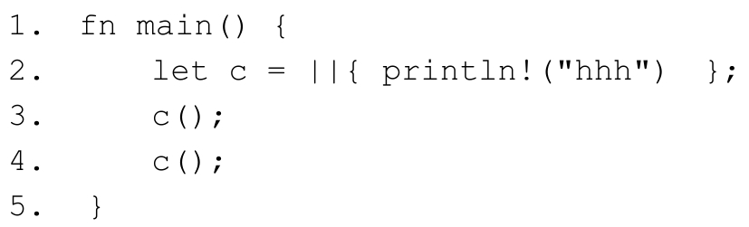{.u54101}
:::

代码清单6-40定义的闭包c没有捕获任何环境变量，并且也没有使用mut关键字改变其可变性，然而可以被多次调用。这足以证明编译器为其自动实现的结构体实例并未失去所有权，只可能是&self。所以，该闭包一定实现了Fn。

**规则总结**

综合上面的几种情况，可以得出如下规则。

· 如果闭包中没有捕获任何环境变量，则默认自动实现**Fn** 。

· 如果闭包中捕获了复制语义类型的环境变量，则：

➢ 如果不需要修改环境变量，无论是否使用move关键字，均会自动实现Fn。

➢ 如果需要修改环境变量，则自动实现FnMut。

· 如果闭包中捕获了移动语义类型的环境变量，则：

➢ 如果不需要修改环境变量，且没有使用move关键字，则自动实现FnOnce。

➢ 如果不需要修改环境变量，且使用了move关键字，则自动实现Fn。

➢ 如果需要修改环境变量，则自动实现FnMut。

· 使用 move 关键字，如果捕获的变量是复制语义类型的，则闭包会自动实现Copy/Clone，否则不会自动实现Copy/Clone。

在日常的开发中，基本可以根据上面的规则对闭包会实现哪个trait做出正确的判断。

### 6.2.4 闭包作为函数参数和返回值 {#text00012.html#A0d9000ce-e976-4774-af4c-83b0c7d52e25 .title-left}

闭包存在于很多语言中，尤其是动态语言，诸如JavaScript、Python和Ruby之类，闭包的使用范围非常广泛。但是在这些动态语言中，闭包捕获的环境变量基本都是对象（此处指面向对象编程语言中的对象，属于引用类型），使用不当容易造成内存泄漏。并且在这些语言中，闭包是在堆中分配的，运行时动态分发，由GC来回收内存，调用和回收闭包都会消耗多余的CPU时间，更不用说使用内联技术来优化这些闭包了。而Rust使用trait和匿名结构体提供的闭包机制是非常强大的。Rust的闭包实现受到了现代C++的启发，将捕获的变量放到结构体中，这样的好处就是不会占用堆内存，拥有更高的性能，可以使用内联技术来消除函数调用开销并实现其他关键的优化，比如对编译器自动实现的闭包结构体进行优化等。从而允许在任何环境（包括裸机）中使用闭包。

Rust的闭包实现机制使得每个闭包表达式都是一个独立的类型，这样可能有一些不便，比如无法将不同的闭包保存到一个数组中，但是可以通过把闭包当作trait对象来解决这个问题，如代码清单6-41所示。

**代码清单6-41：把闭包作为trait对象**

::: center
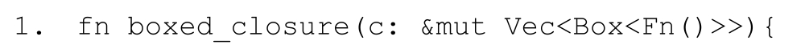{.u54100}
:::

::: center
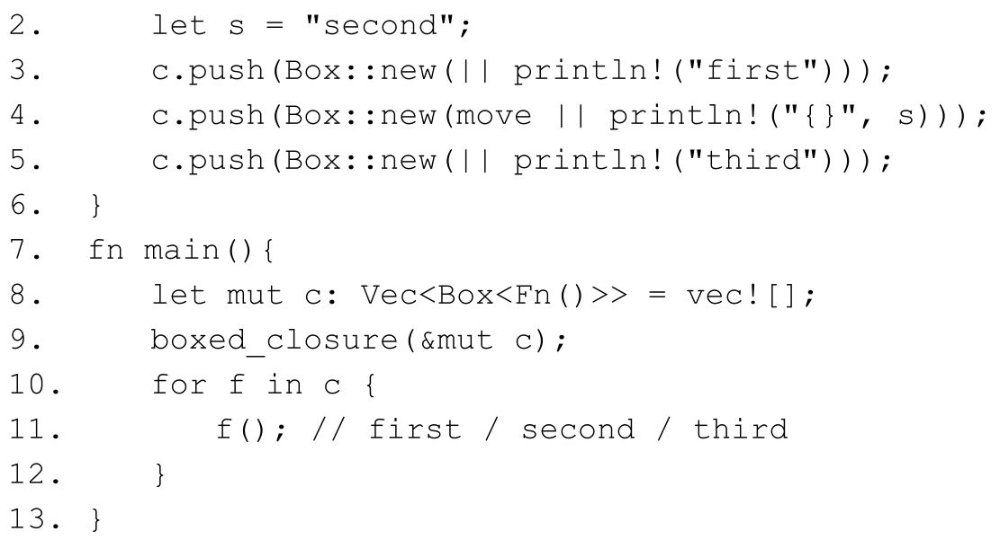{.u54099}
:::

代码清单6-41第8行声明了一个可变闭包，指定类型为Vec＜Box＜Fn（）＞＞，这表示该动态数组中存储的元素类型为Box＜Fn（）＞类型。Box＜Fn（）＞是一个trait对象，把闭包放到Box＜T＞中就可以构建一个闭包的trait对象，然后就可以当作类型来使用。通过第3章的学习可以知道，trait对象是动态分发的，在运行时通过查找虚表（vtable）来确定调用哪个闭包。这里需要注意的是，第 4 行代码中的闭包默认以不可变借用方式捕获了环境变量 s，但是这里需要将闭包装箱，稍后在iter_call函数中调用，所以这里必须使用move关键字将s的所有权转移到闭包中，因为变量s是复制语义类型，所以该闭包捕获的是原始变量s的副本。

像这种在函数boxed_closure调用之后才会使用的闭包，叫作**逃逸闭包** （**escape closure** ）。因为该闭包捕获的环境变量"逃离"了boxed_closure函数的栈帧，所以在函数栈帧销毁之后依然可用。与之相对应，如果是跟随函数一起调用的闭包，则是**非逃逸闭包** （**non-escape closure** ）。

**闭包作为函数参数**

闭包可以作为函数参数，这一点直接提升了Rust语言的抽象表达能力，令其有了完全不弱于Ruby、Python这类动态语言的抽象表达能力。下面比较了Rust和Ruby两种语言中的any方法，该方法用于按指定条件确认数组中的元素是否存在。

Rust语言：

::: center
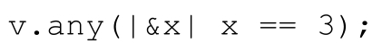{.u54098}
:::

Ruby语言：

::: center
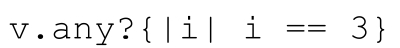{.u54097}
:::

看得出来，Rust语言和Ruby语言中对闭包的用法基本相似。

因为闭包属于trait语法糖，所以当它被当作参数传递时，它可以被用作泛型的trait限定，也可以直接作为trait对象来使用。代码清单6-42首先以trait限定的方式实现了一个any方法。

**代码清单6-42：以trait限定的方式实现any方法**

::: center
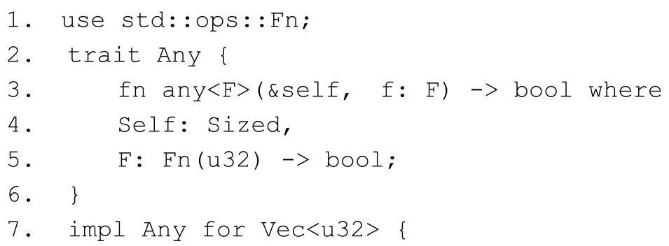{.u54096}
:::

::: center
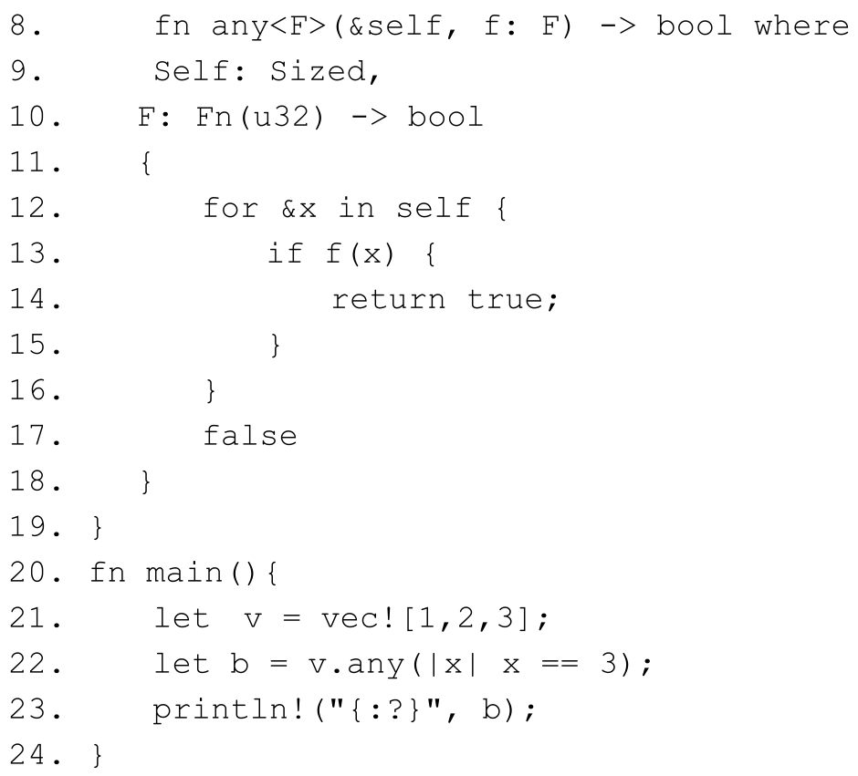{.u54095}
:::

在代码清单6-42中，第1行的use语句是可有可无的，因为Fn并不受trait孤儿规则的限制。从第 2 行开始定义了一个 trait，将其命名为 Any。需要注意的是，此处自定义的Any不同于标准库提供的Any。该trait中声明了泛型函数any，该函数泛型F的trait限定为Fn（u32）-＞bool，这种形式更像函数指针类型，有别于一般的泛型限定＜F：Fn＜u32，bool＞＞。其实函数指针也是默认实现了Fn、FnMut、FnOnce这三个triat的，比如代码清单6-43就展示了函数指针作为闭包参数的情况。

**代码清单6-43：函数指针也可以作为闭包参数**

::: center
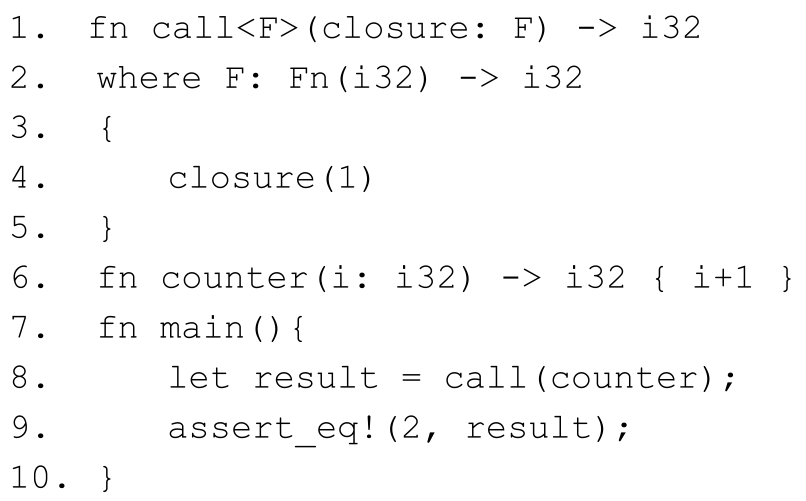{.u54094}
:::

在代码清单6-43第8行中，函数指针当作闭包参数传入了call函数，代码正常编译运行。这是因为此函数指针counter也实现了Fn。

回到代码清单6-42，第3行的where从句对Self做了Sized限定，这意味着，当Any被作为trait对象使用时，该方法不能被动态调用，这属于一种优化策略。

代码清单6-42的第7行使用impl关键字为Vec＜u32＞类型实现了any方法。该方法会迭代传入的闭包，依次调用，如果满足闭包表达式中指定的条件，则返回true，否则返回false。

在main函数中，则可以使用形如代码清单6-42第22行那样的形式来调用any方法，以查找动态数组v中是否存在满足条件的元素。像这样通过将闭包作为参数，可以把一段动态的逻辑按需传入指定方法中进行计算，这极大地提高了程序的灵活性和抽象能力。最重要的是，在Rust中使用闭包，完全不需要担心性能问题。

除了上述静态分发的形式，也可以将闭包作为trait对象动态分发，如代码清单6-44所示。**代码清单6-44：将闭包作为trait对象进行动态分发**

::: center
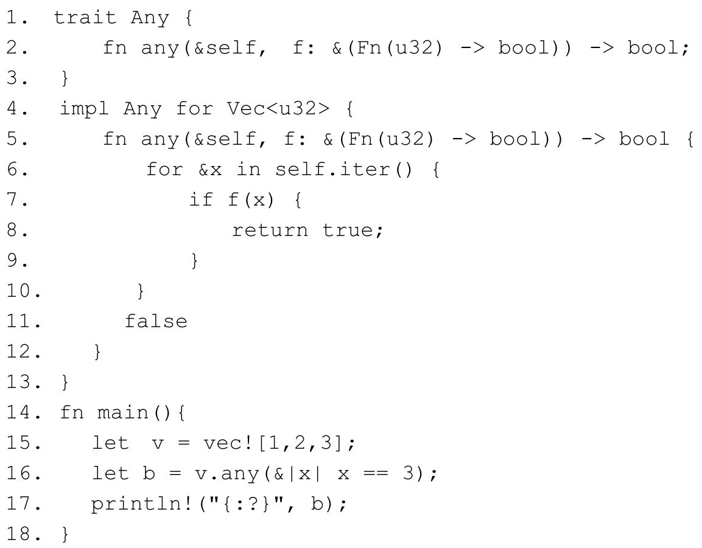{.u53864}
:::

代码清单6-44将闭包作为了trait对象，这样代码更加简练。动态分发比静态分发的性能低一些，但还是完全可以和 C++媲美的。动态分发闭包在实际中更加常用于回调函数（callback）。

比如Rust的Web开发框架Rocket的中间件实现，就利用了闭包作为回调函数，其实现如代码清单6-45所示。

**代码清单6-45：Rocket框架中间件代码示意**

::: center
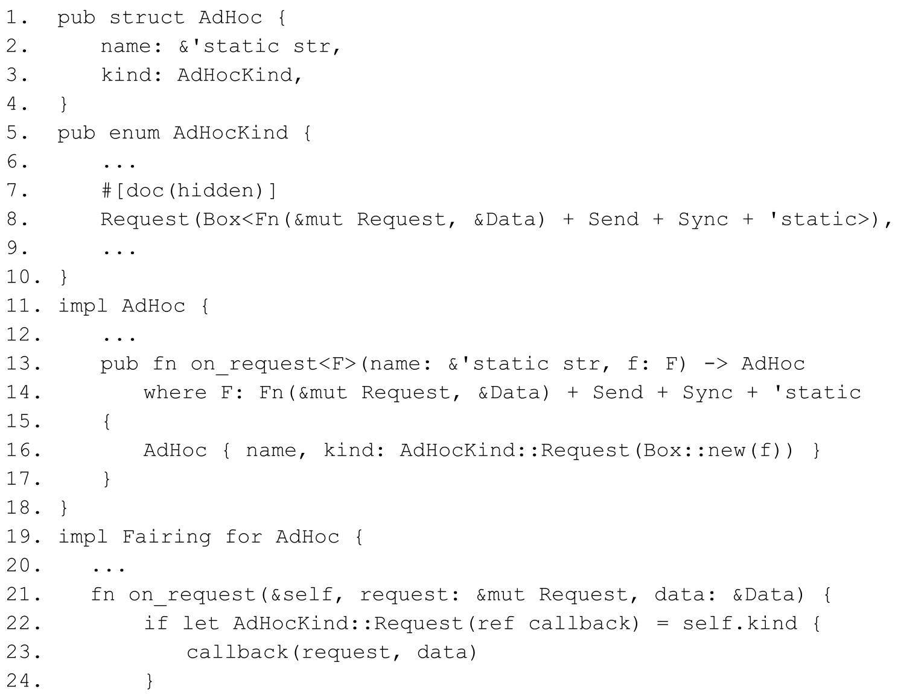{.u54093}
:::

::: center
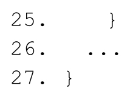{.u54092}
:::

代码清单6-45展示了Rocket框架中间件Fairing实现的简单示意，为了突出重点，这里省略了很多代码。

代码第1行定义了AdHoc结构体，接下来定义AdHocKind枚举体，其中包含了四种枚举值（Attach、Launch、Request、Response），本示例中只显示出Request一种，它包含的值类型是一个trait对象的闭包，Box＜Fn（&mut Request，&Data）+Send+Sync+＇static＞。

代码第13行为AdHoc结构体实现了on_request方法，其参数为一个闭包F，该闭包的trait限定为Fn（&mut Request，&Data）+Send+Sync+＇static，表明该闭包接收两个参数，第一个是可变引用，第二个是不可变引用，并且是可以在线程中安全传递的，**＇static** 生命周期用来约束该闭包必须是一个逃逸闭包，只有逃逸闭包才能装箱，代码清单6-46的示例展示了这一点。

**代码清单6-46：测试＇static约束**

::: center
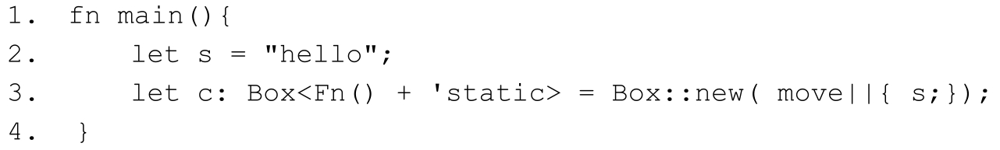{.u54091}
:::

如果对代码清单6-46第3行的闭包去掉move关键字，则变为Fn闭包，会以不可变引用方式来捕获变量绑定s，因为有了**＇static** 约束，编译器会报错。现在使用了move关键字，会强制执行复制语义，则编译通过。

回到代码清单 6-45 中，从第 21 行代码开始，为 AdHoc 实现了 Fairing trait 中定义的on_request方法，该方法内部使用了if let，如果匹配到相关的闭包，则调用该闭包。这是动态分发的闭包在实际中作为回调函数的示例。

**闭包作为函数返回值**

因为闭包是trait语法糖，所以无法直接作为函数的返回值，如果要把闭包作为返回值，必须使用trait对象，如代码清单6-47所示。

**代码清单6-47：将闭包作为函数返回值**

::: center
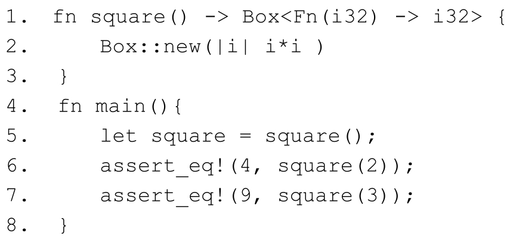{.u54090}
:::

代码清单6-47返回一个闭包来计算平方。返回的闭包为trait对象Box＜Fn（i32）-＞i32＞，在main函数中可以直接调用它。

代码清单 6-47 中的闭包指定为 Fn，可以多次调用，但是如果希望只调用一次，那么是不是就可以直接指定FnOnce呢？如代码清单6-48所示。

**代码清单6-48：指定返回闭包为FnOnce**

::: center
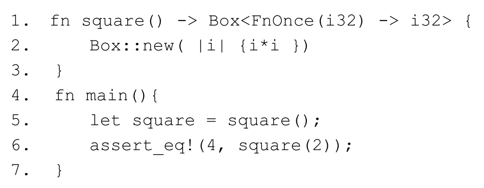{.u54089}
:::

代码清单6-48编译会报如下错误：

::: center
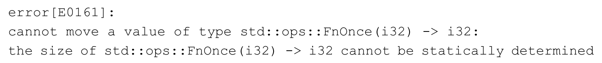{.u54088}
:::

该错误的含义是：对于编译期无法确定大小的值，不能移动其所有权。在代码清单6-48中，如果要调用闭包Box＜FnOnce（i32）-＞i32＞，就必须先把FnOnce（i32）-＞i32从Box＜T＞中移出来。而此时Box＜T＞中的T无法在编译期确定大小，不能移动所有权，所以就报出了上述错误。

FnOnce 装箱为 Box＜FnOnce＞之后，其对应的由编译器生成的闭包结构体实例就是Box＜ClosureStruct＞类型（假如闭包结构体名为ClosureStruct），该闭包结构体实现FnOnce的call_once方法的接收者本来是self，也就是闭包结构体实例，现在变成了Box＜self＞，也就是装箱的闭包结构体实例。现在想从Box＜self＞里移出self这个闭包结构体实例来进行调用，因为编译期无法确定其大小，所以无法获取self。而对于Fn和FnMut来说，装箱以后分别对应的是&Box＜self＞和&mut Box＜self＞，所以不会报错。对于此问题，Rust给出了一个解决方案，如代码清单6-49所示。

**代码清单6-49：使用FnBox代替FnOnce**

::: center
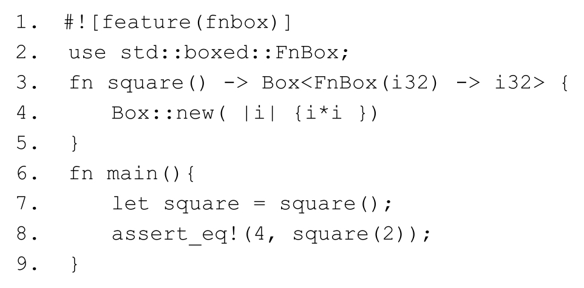{.u54087}
:::

代码清单6-49第1行使用了**＃！\[feature（fnbox）\]** 特性，同时也需要使用use来引入定义于标准库的boxed模块中的FnBox trait。只需要简单地把FnOnce替换为FnBox，即可解决上面编译错误的问题。这是因为FnBox施加了一点小小的"魔法"，代码清单6-50展示了FnBox的源码。

**代码清单6-50：FnBox源码示意**

::: center
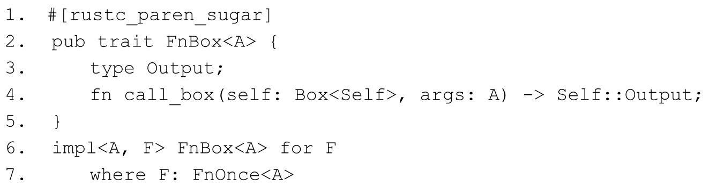{.u54086}
:::

::: center
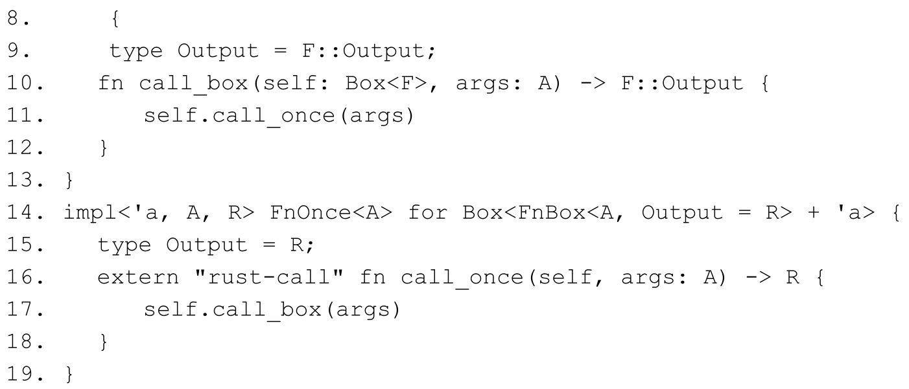{.u54085}
:::

由于篇幅限制，代码清单6-50只展示了部分FnBox 源码。看得出来，FnBox也是一个调用语法糖，因为使用了**＃\[rustc_paren_sugar\]** 属性，该trait实现了call_box方法，第一个参数和之前的Fn、FnMut、FnOnce定义的方法有很大不同，该方法的第一个参数self是Box＜Self＞类型。其实之前trait中的self、&self、&mut self参数都是一种省略形式，其完整形式如下所示。

· Self对应self：Self。

·&self 对应 self：&Self。

·&mut self对应 self：&mut Self。

理论上，self：SomeType＜Self＞这种形式应该适用于任意类型（SomeType），但实际上，这里只支持Box＜T＞。所以，self：Box＜Self＞这种类型指定会自动解引用并移动Self的所有权，因为Box＜T＞支持DerefMove（参见第5章）。

Self：Box＜self＞是通过调用 call_box 来间接调用 call_once 的，因为 Box＜FnBox＞实现了FnOnce。这看上去完全是一个"曲线救国"的方案，所以，在装箱时使用FnBox来替代FnOnce只是临时的解决方案，在未来的Rust版本中，FnBox会被弃用。

出现这种问题的根本原因在于，Rust中的函数返回值里只能出现类型。虽然有trait对象可用，但是性能上也会有所消耗。为了解决此问题，Rust团队提出了一个新的方案，叫**impl Trait** 语法，该方案可以让函数直接返回一个trait，如代码清单6-51所示。

**代码清单6-51：impl Trait示例**

::: center
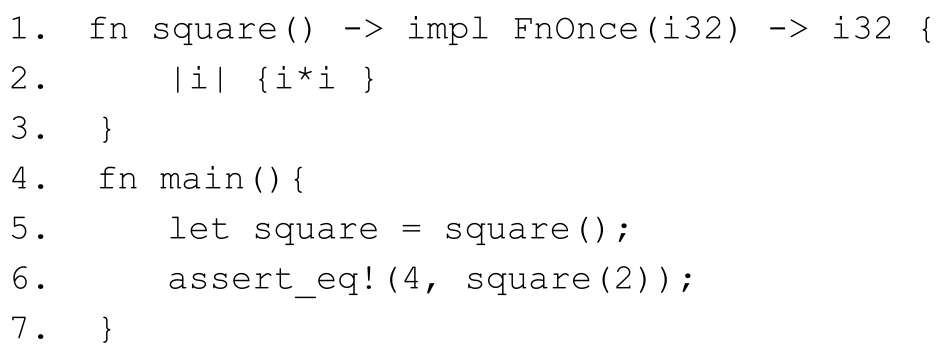{.u54084}
:::

代码清单6-51中用到的**impl Trait** 语法是Rust 2018版本中引入的。**impl Trait** 代表的是实现了指定trait的那些类型，相当于泛型，属于静态分发。

代码第2行直接返回一个impl FnOnce（u8，u8）-＞u8。在impl关键字后面加上了闭包trait，这样就可以直接返回一个FnOnce trait。

### 6.2.5 高阶生命周期 {#text00012.html#A8d6b00d4-c965-4aa2-bb59-af4c263bbb73 .title-left}

闭包可以作为函数的参数和返回值，那么闭包参数中如果含有引用的话，其生命周期参数该如何标注？先来思考代码清单6-52。

**代码清单6-52：泛型trait作为trait对象时的生命周期参数**

::: center
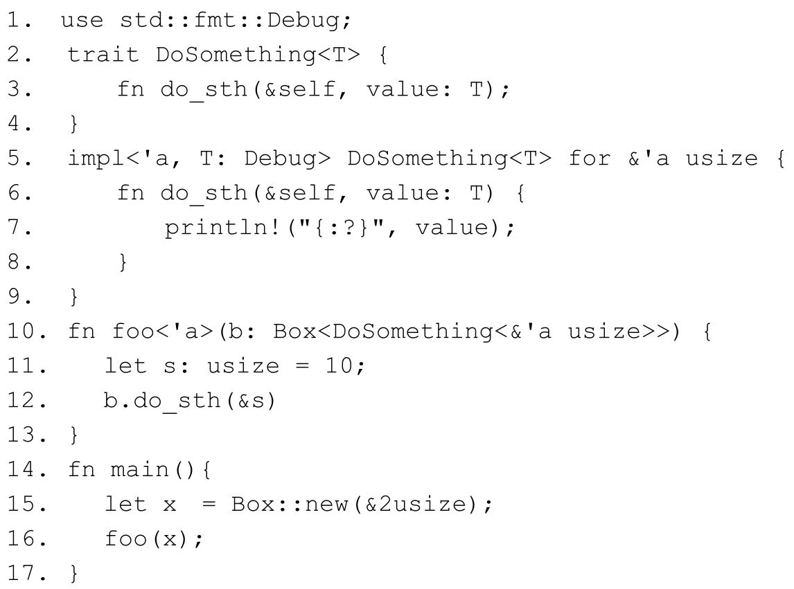{.u54081}
:::

代码清单6-52定义了DoSomething＜T＞，它是一个泛型trait，其中定义了方法签名do_sth，然后为&usize类型实现了该trait。

代码第 10 行到第 13 行定义了一个函数 foo，其参数 b 以 trait 对象Box＜DoSomething＜&usize＞＞为类型。在该函数内，参数b调用do_sth方法，并把局部变量绑定s的不可变借用作为do_sth方法的参数。整个函数foo也被标注了生命周期参数。

在main函数中声明了一个Box＜&usize＞变量绑定x，并调用foo（x）。整段代码在编译时会报如下错误：

::: center
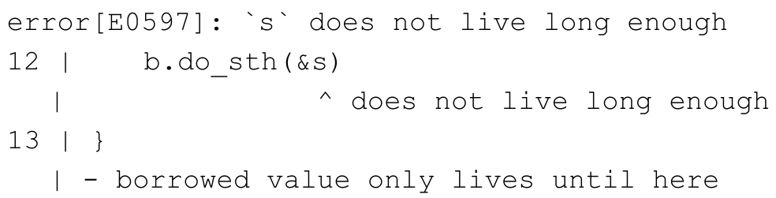{.u54083}
:::

该错误表明，s的生命周期不够长，在foo函数调用结束后就会被析构，从而&s就会变成悬垂指针，这是Rust绝不可能允许出现的情况，如图6-3所示。

::: center
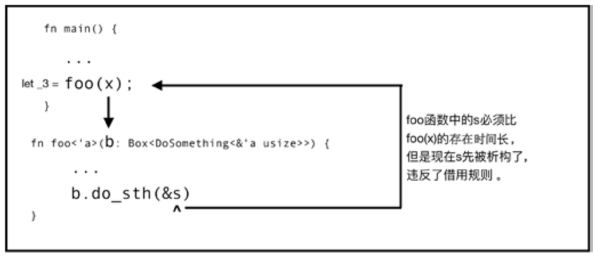{.u54082}

图6-3：代码清单6-52生命周期参数问题示意图
:::

代码清单6-52第10行的foo函数签名中的生命周期参数有什么问题呢？现在这样的生命周期参数的意义是，把foo函数自身的生命周期和其内部的局部变量绑定s的生命周期关联了起来，这就要求，foo函数内b.do_sth（&s）方法调用参数s的生命周期必须长于main函数中foo（x）函数调用的生命周期。在main函数中会自动产生临时变量绑定，代码第16行相当于let_3=foo（x）。这违反了第5章学过的借用规则，有产生悬垂指针的风险。

然而，foo函数中传入的trait对象Box＜DoSomething＜&usize＞＞包含的&usize引用是从外部引入的，如代码清单6-52第15行所示，是在main函数中直接定义好，然后才传给foo函数的。所以，该引用的生命周期和foo函数没有直接关系。目前代码清单6-52的生命周期参数标记则完全无法正确表达这一层意思，那么对于这种情况该如何定义生命周期参数呢？

Rust为此专门提供了一个方案，叫作**高阶生命周期** （**Higher-Ranked Lifetime** ），也叫**高阶trait限定** （**Higher-Ranked Trait Bound** ，**HRTB** ）。该方案提供了一个**for＜＞** 语法，具体使用方式如代码清单6-53所示。

**代码清单6-53：使用for＜＞语法**

::: center
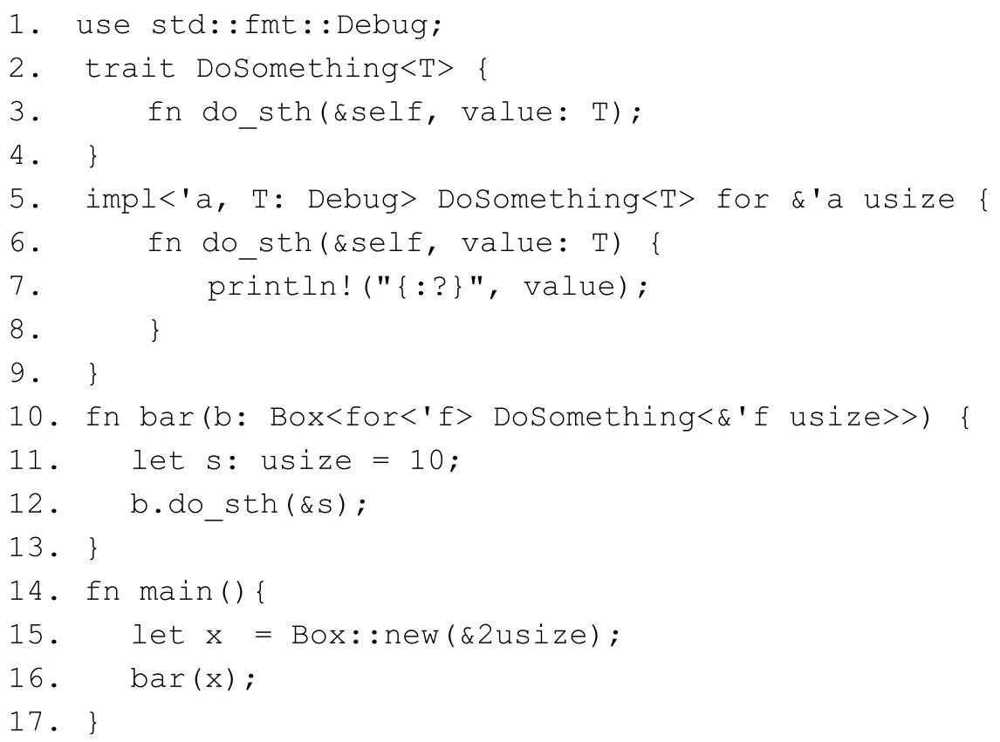{.u54081}
:::

代码清单6-53第10行定义了bar函数，其函数签名中的生命周期参数使用了高阶生命周期参数**for＜＇f＞DoSomething＜&＇f usize＞** ，这样就修复了生命周期的问题，正常编译运行。

**for＜＞** 语法整体表示此生命周期参数只针对其后面所跟着的"对象"，在本例中是**DoSomething＜&＇f usize＞** ，生命周期参数＇f是在**for＜＇f ＞** 中声明的。使用**for＜＇f ＞** 语法，就代表bar函数的生命周期和**DoSomething＜&＇f usize＞** 没有直接关系，所以编译正常。

实际开发中会经常用闭包，而闭包实现的三个trait本身也是泛型trait，所以肯定也存在闭包参数和返回值都是引用类型的情况，如代码清单6-54所示。

**代码清单6-54：闭包参数和返回值都是引用类型的情况**

::: center
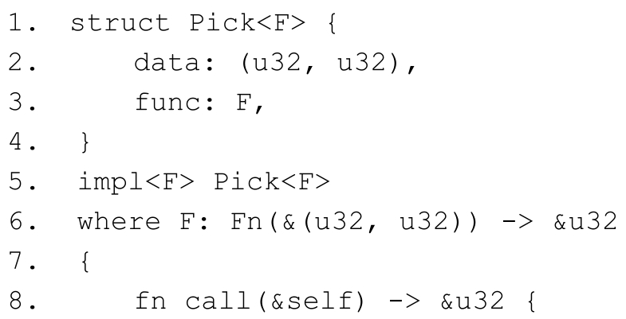{.u54080}
:::

::: center
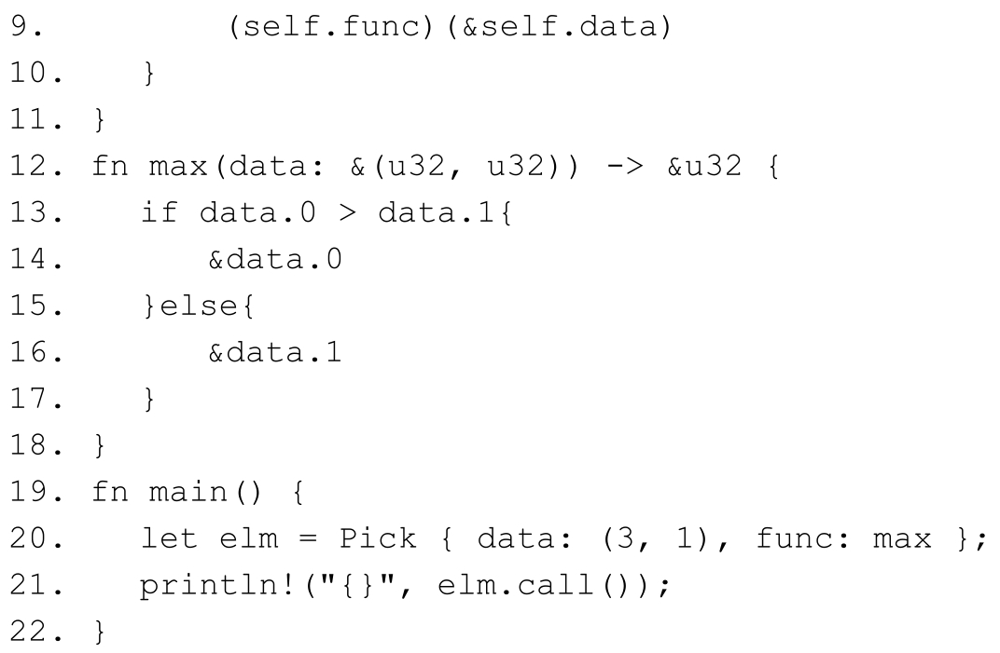{.u54079}
:::

在代码清单6-54中，泛型结构体Pick模拟了闭包的行为，字段data使用元组类型存储模拟闭包的参数，字段func用来存储一个可执行的闭包。

代码第5行到第11行为结构体Pick实现了一个call方法，泛型F使用Fn（&（u32，u32））-＞&u32作为trait限定。整段代码编译正常运行。

值得注意的是，此处的trait限定中使用了引用类型，但是并没有显式地标记生命周期参数，为什么可以正常编译呢？这是因为**编译器自动为其补齐了生命周期参数** 。

代码第9行会调用存储于结构体Pick中的闭包，并且会把call方法中的&self作为参数进行传递。这个调用与代码清单6-52和6-53中所示的情况很相似，如果要显式地添加生命周期参数，则不能让call方法自身的生命周期和self.func方法的生命周期相关联，因为闭包的捕获引用是从外部环境获取的，和call方法没有关系。否则编译肯定无法通过，比如像下面这种写法就会产生编译错误：

::: center
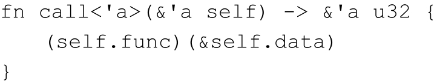{.u53846}
:::

所以这里正确地使用生命周期参数的方式就是用高阶生命周期，如代码清单6-55所示。

**代码清单6-55：编译器按高阶生命周期来自动补齐闭包参数中的生命周期参数**

::: center
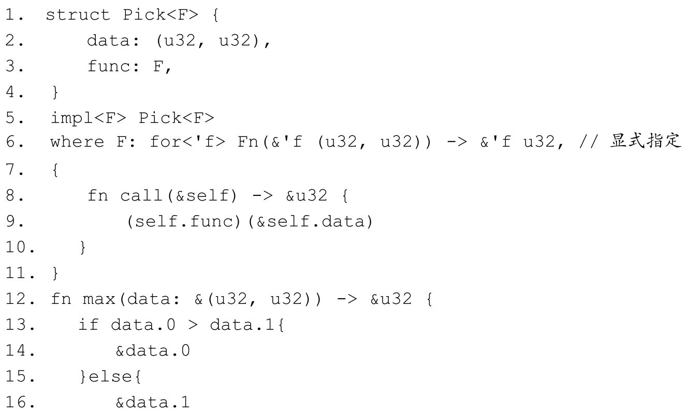{.u54078}
:::

::: center
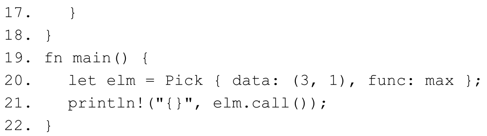{.u54077}
:::

代码清单6-55第6行使用了高阶生命周期，代码正常编译运行。但需要注意的是，高阶生命周期的这种**for＜＞** 语法只能用于标注生命周期参数，而不能用于其他泛型类型。

## 6.3 迭代器 {#text00012.html#A9e7f00d8-499f-4d1e-9f58-2144eb0226c4 .title-left}

在Rust语言中，闭包最常见的应用场景是，在遍历集合容器中的元素的同时，按闭包内指定的逻辑进行操作。比如代码清单6-42中实现的any方法，就利用了for循环来迭代动态数组，依次查找符合闭包指定条件的元素。

用循环语句迭代数据时，必须使用一个变量来记录数据集合中每一次迭代所在的位置，而在许多编程语言中，已经开始通过模式化的方式来返回迭代过程中集合的每一个元素。这种模式化的方式就叫**迭代器** （**Iterator** ）模式，使用迭代器可以极大地简化数据操作。迭代器设计模式也被称为**游标** （**Cursor** ）模式，它提供了一种方法，可以顺序访问一个集合容器中的元素，而又不需要暴露该容器的内部结构和实现细节。

### 6.3.1 外部迭代器和内部迭代器 {#text00012.html#A9d0100d8-9482-4a1d-a643-5d4e2e0e08db .title-left}

迭代器分为两种，**外部迭代器** （**External Iterator** ）和**内部迭代器** （**Internal Iterator** ）。

外部迭代器也叫主动迭代器（Active Iterator），它独立于容器之外，通过容器提供的方法（比如，next方法就是所谓的游标）来迭代下一个元素，并需要考虑容器内可迭代的剩余数量来进行迭代。**外部迭代器的一个重要特点是，外部可以控制整个遍历进程** 。比如Python、Java和C++语言中的迭代器，就是外部迭代器。

内部迭代器则通过迭代器自身来控制迭代下一个元素，外部无法干预。这意味着，只要调用了内部迭代器，并通过闭包传入了相关操作，就必须等待迭代器依次为其中的每个元素执行完相关操作以后才可以停止遍历。比如Ruby语言中的each迭代器就是典型的内部迭代器。

早期的（1.0版本之前）Rust提供的是内部迭代器，而内部迭代器无法通过外部控制迭代进程，再加上Rust的所有权系统，导致使用起来很复杂。

代码清单6-56展示了一个自定义的内部迭代器。

**代码清单6-56：自定义的内部迭代器**

::: center
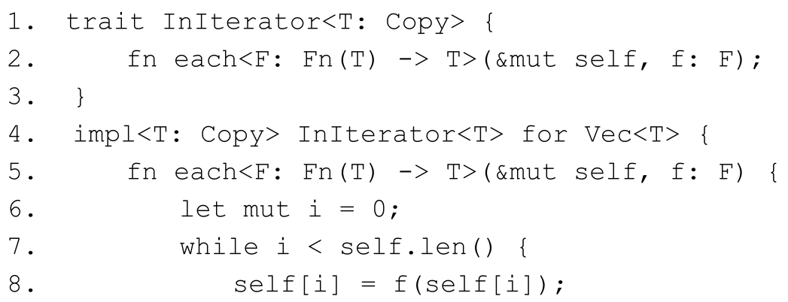{.u54076}
:::

::: center
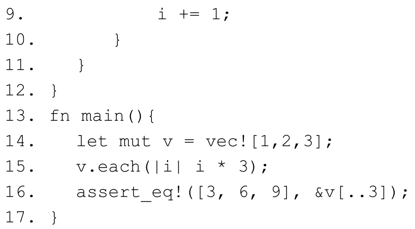{.u54075}
:::

代码清单6-56创建了一个自定义的内部迭代器each。看得出来，内部迭代器与容器的绑定较紧密，并且无法从外部来控制其遍历进程。更重要的是，对于开发者来说，扩展性较差。Rust官方和社区经过很长时间的论证，决定改为外部迭代器，也就是for循环，如代码清单6-57所示。

**代码清单6-57：for循环示例**

::: center
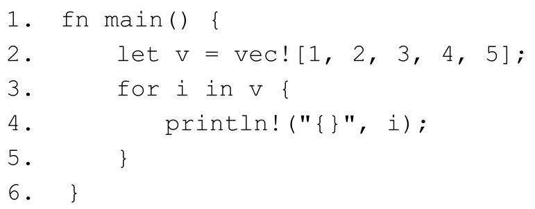{.u54074}
:::

代码清单6-57是一个简单的for循环示例。for循环是一个典型的外部迭代器，通过它可以遍历动态数组v中的元素，并且此遍历过程完全可以在动态数组v之外进行控制。Rust中的for循环其实是一个语法糖。代码清单6-58展示了for循环展开后的等价代码。

**代码清单6-58：for循环展开后的等价代码**

::: center
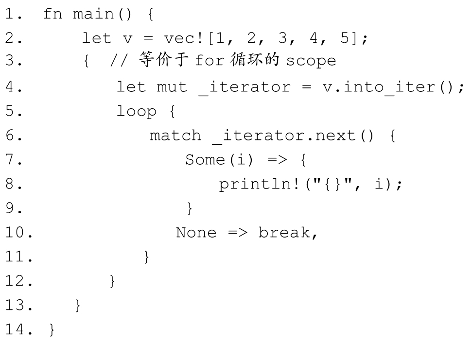{.u54073}
:::

代码清单6-58从第3行开始，创造了一个内部作用域，等价于for循环的作用域。代码第4行通过调用v的into_iter方法声明了一个可变迭代器_iterator。在第5行的loop循环中，通过match匹配此迭代器的next方法，遍历v中的元素，直到next方法返回None，退出循环，遍历结束。

### 6.3.2 Iterator trait {#text00012.html#A296d00d9-185d-4e85-a24b-ccad26ee1817 .title-left}

简单来说，for循环就是利用迭代器模式实现的一个语法糖，它属于外部迭代器。迭代器也是Rust一致性的典型表现之一。不出所料，Rust 中依然使用了trait来抽象迭代器模式。代码清单6-59展示了Rust中迭代器Iterator trait的源码。

**代码清单6-59：Iterator trait源码示意**

::: center
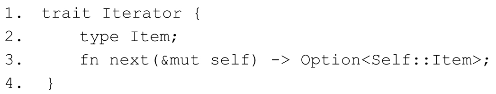{.u54072}
:::

代码清单6-59展示了Iterator trait是Rust中对迭代器模式的抽象接口。其中next方法是实现一个迭代器时必须实现的方法。事实上，该trait中包含了很多其他方法，基本都包含了默认实现。该trait中还包含了一个关联类型Item，并且next方法会返回Option＜Self：：Item＞类型。Item和Self可以看作占位类型，它们表示实现该trait的具体类型的相关信息。

通过实现该trait，可以创建自定义的迭代器，如代码清单6-60所示。

**代码清单6-60：通过实现Iterator trait创建自定义迭代器**

::: center
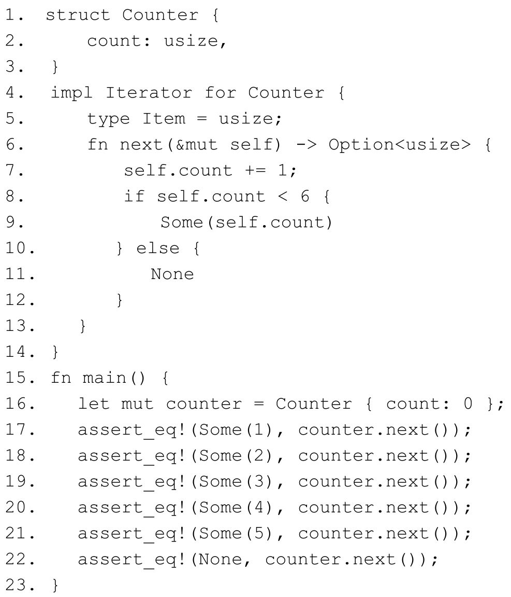{.u54071}
:::

代码清单6-60中定义了一个结构体Counter，为其实现Iterator之后，它就成为了一个迭代器。通过调用next方法来迭代其内部元素。

值得注意的是，在为Counter实现next方法时，指定了关联类型Item为usize类型，因为Counter中字段count是usize类型，next方法要返回的是Option＜usize＞类型。

代码第8行，next方法的if表达式中的条件被硬编码为小于6，这只是为了演示。对于一个真正的迭代器，除了需要使用next方法获取下一个元素，还需要知道迭代器的长度信息，这对于优化迭代器很有帮助。

在Iterator trait中还提供了一个方法叫**size_hint** ，代码清单6-61展示了其默认实现。

**代码清单6-61：Iterator trait提供的size_hint方法源码示意**

::: center
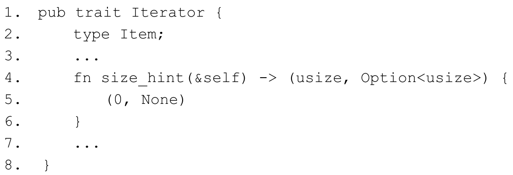{.u54070}
:::

代码清单 6-61 展示了 size_hint 方法的默认实现，其返回类型是一个元组（usize，Option＜usize＞），此元组表示迭代器剩余长度的边界信息。元组中第一个元素表示下限（lower bound），第二个元素表示上限（upper bound）。第二个元素是Option＜usize＞类型，代表已知上限或者上限超过usize的最大取值范围，比如无穷迭代。此方法的默认返回值（0，None）适用于任何迭代器。

代码清单6-62展示了将数组转换为迭代器的size_hint方法。

**代码清单6-62：将数组转换为迭代器的size_hint**

::: center
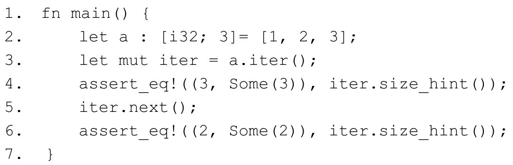{.u54069}
:::

代码清单6-62中的数组通过iter方法转换成为一个迭代器，每次调用next方法，迭代器的剩余长度就会减少，直到减为0为止。方法size_hint返回的元组上限和下限是一致的。第3行方法调用a.iter（）使用了数组a的不可变借用，其类型为&＇a \[i32；3\]。对于&＇a \[T\]和&＇a mut \[T\]类型，size_hint方法实际返回的是迭代器起点指针到终点指针的距离值，如图6-4所示。

::: center
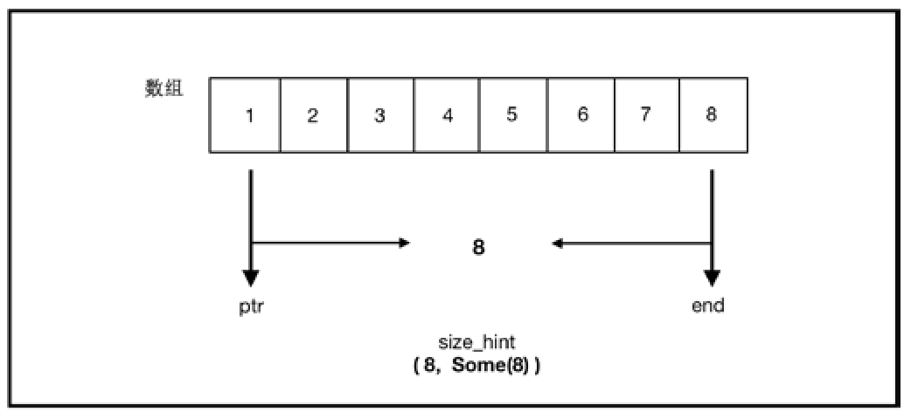{.u54068}

图6-4：对&＇a \[T\]和&＇a mut \[T\]类型中的size_hint方法求值示意图
:::

第3行方法调用a.iter（）返回的迭代器是一个结构体，其成员包含了起始指针ptr和终点指针end，它们之间的距离就是size_hint方法返回的值。

方法size_hint的目的就是优化迭代器，不要忘记Rust是一门系统级编程语言，性能永远是一项重要的指标。迭代器和集合容器几乎形影不离，实际开发中经常有使用迭代器来扩展集合容器的需求，此时方法size_hint就派上用场了。如果事先知道准确的迭代器长度，就可以做到精准地扩展容器容量，从而避免不必要的容量检查，提高性能。代码清单6-63展示了如何使用迭代器来追加字符串。

**代码清单6-63：使用迭代器来追加字符串**

::: center
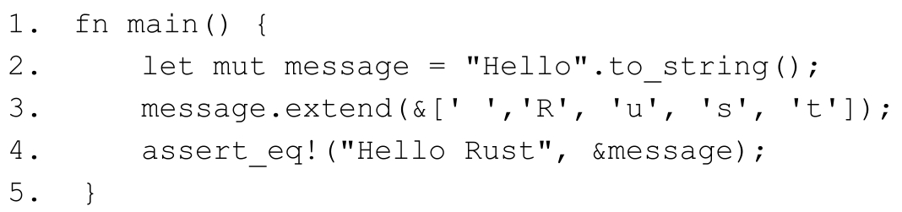{.u54067}
:::

代码清单6-63中声明了String类型的字符串message，通过调用extend方法为其追加字符。事实上，extend方法是被定义于Extend trait中的。代码清单6-64展示了Extend和String中实现extend方法的源码。

**代码清单6-64：Extend和String类型实现extend方法的源码示意**

::: center
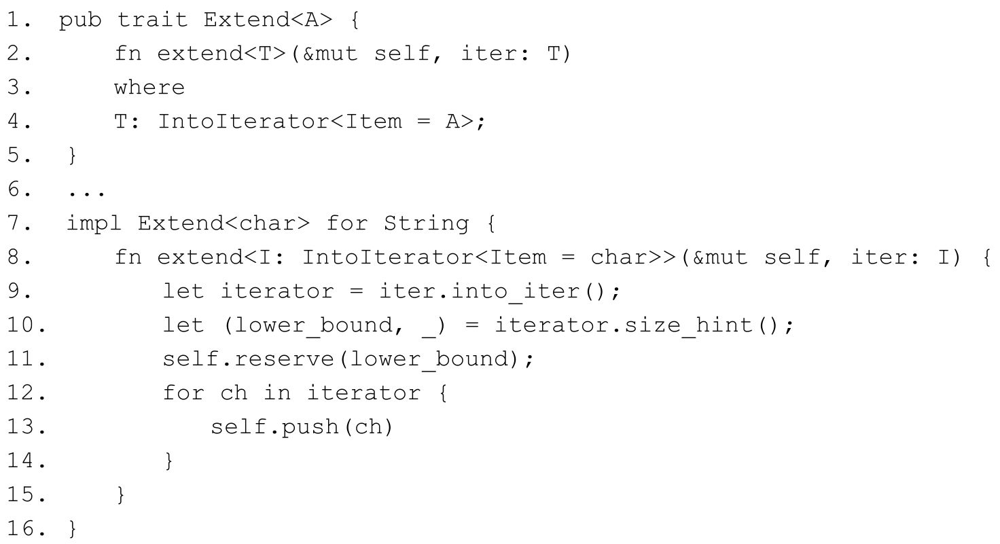{.u54066}
:::

Extend trait是一个泛型trait，其中定义了extend方法，这是一个泛型方法，其泛型参数T使用了trait限定IntoIterator＜Item=A＞，这表示该泛型方法只接受实现了IntoIterator的类型。而String类型正好针对char类型实现了该泛型trait。

在代码第9行String类型实现的extend方法中，首先使用into_iter方法获取了一个迭代器，然后通过迭代器的size_hint方法获取其长度，代码第10 行取的是迭代器的下限。对于数组来说，上限和下限的值是一样的，所以这里取哪个都可以。

代码第11行调用了字符串的reserve方法，该方法可以确保扩展的字节长度大于或等于给定的值。这样做是为了避免频繁分配。代码清单6-63中给定的迭代器长度应该是5，那么为字符串分配的额外空间至少应该是20个字节（因为每个字符占4字节），也可能是100个字节。reserve方法只是提供了一种保证，它并不做出分配空间的行为。

代码第12行用for循环遍历该字符迭代器，之后通过String类型的push方法逐个添加给字符串。

现在可以看得出来size_hint方法的重要性了。为了确保该方法可以获得迭代器长度的准确信息，Rust又引入了两个trait，分别是**ExactSizeIterator** 和**TrustedLen** ，它们均是Iterator的子trait，均被定义于std：：iter模块中。

ExactSizeIterator提供了两个额外的方法len和is_empty，要实现len必须先实现Iterator，这就要求size_hint方法必须提供准确的迭代器长度信息。

TrustedLen是实验性trait，还未正式公开，但是在Rust源码内部，它就像一个标签trait，只要实现了 TrustedLen 的迭代器，其 size_hint 获取的长度信息均是可信任的，有了该 trait就完全避免了容器的容量检查，从而提升了性能。

ExactSizeIterator和TrustedLen的区别在于，后者应用于没有实现ExactSizeIterator的大多数情况。开发者可以根据具体的情况自定义实现ExactSizeIterator，但是对于某些迭代器，开发者并不能为其实现ExactSizeIterator，所以需要TrustedLen做进一步的限定。

### 6.3.3 IntoIterator trait和迭代器 {#text00012.html#Af5e200dd-722e-4668-bf46-14fc5402801c .title-left}

上一节介绍了Iterator trait，我们了解到，如果想迭代某个集合容器中的元素，必须将其转换为迭代器才可以使用。并且在 for 循环语法糖中，也使用了 into_iter 之类的方法来获取一个迭代器。那么迭代器到底是什么？要寻找答案，必须先从IntoIterator trait开始。

第3章讲过类型转换用到的From和Into两个trait，它们定义了两个方法，分别是from和 into，这两个方法互为反操作。对于迭代器来说，并没有用到这两个 trait，但是这里值得注意的是，Rust中对于trait的命名也是具有高度一致性的。

Rust也提供了**FromIterator** 和**IntoIterator** 两个trait，它们也互为反操作。FromIterator可以从迭代器转换为指定类型，而 IntoIterator 可以从指定类型转换为迭代器。关于FromIterator的细节在6.3.5节会着重介绍，这里先介绍IntoIterator。

代码清单6-65展示了IntoIterator的源码。

**代码清单6-65：IntoIterator源码示意**

::: center
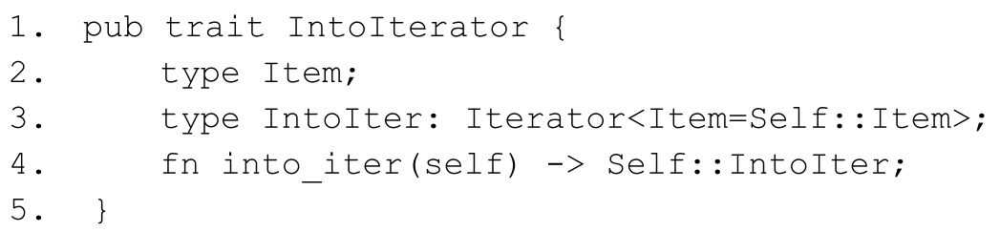{.u54065}
:::

从代码清单6-65中可以看出，方法into_iter是在该trait中定义的。into_iter的参数是self，代表该方法会转移方法接收者的所有权。同时，该方法会返回Self：：IntoIter类型。Self：：IntoIter是关联类型，并且指定了trait限定Iterator＜Item=Self：：Item＞，意味着必须是实现了Iterator的类型才能作为迭代器。

最常用的集合容器就是Vec＜T＞类型，它实现了IntoIterator，可以通过into_iter方法转换为迭代器。代码清单6-66展示了Vec＜T＞类型实现IntoIterator的源码。

**代码清单6-66：Vec＜T＞实现IntoIterator源码示意**

::: center
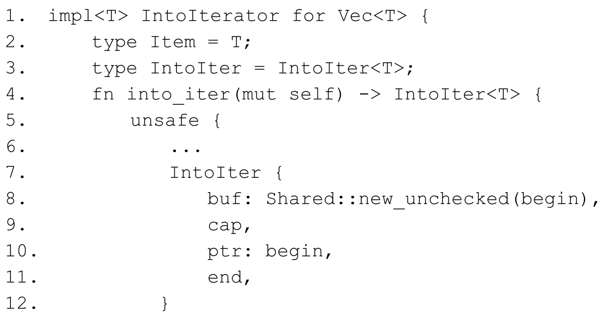{.u54064}
:::

::: center
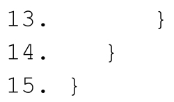{.u54063}
:::

代码清单 6-66 为了演示方便只展示了部分源码。看得出来，最终返回的是一个定义于std：：vec模块中的IntoIter结构体。该结构体包含下列四个成员字段。

· **Buf** ，通过Vec＜T＞类型的动态数组起始地址begin生成一个内部使用的Shared指针，指向该动态数组中实际存储的数据。

· **Cap** ，获得该动态数组的容量大小，也就是内存占用大小。

· **Ptr** ，指定了begin的值，代表迭代器的起始指针。

· **End** ，代表迭代器的终点指针，根据Vec＜T＞动态数组的长度len和起始地址begin计算offset获得。

IntoIter结构体也实现了Iterator trait，拥有了next、size_hint和count三个方法，它是一个名副其实的迭代器。

简单而言，就是Vec＜T＞实现了IntoIterator，因此可以通过into_iter方法将一个Vec＜T＞类型的动态数组转换为一个IntoIter结构体。IntoIter结构体拥有该动态数组的全部信息，并且获得了该动态数组的所有权。同时，IntoIter结构体实现了Iterator trait，允许其通过next、size_hint和count方法对其进行迭代处理。所以，IntoIter就是Vec＜T＞转换而成的迭代器。整个过程如图6-5所示。

::: center
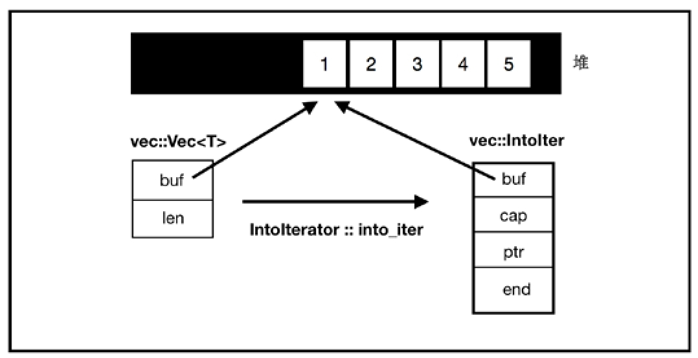{.u54062}

图6-5：Vec＜T＞转换为迭代器示意图
:::

转换 IntoIter 迭代器的代价是要转移容器的所有权，在实际开发中，有很多情况是不能转移所有权的。因此，Rust 还提供了另外两个迭代器专门处理这种情况，分别是 **Iter** 和**IterMut** 。这三种迭代器类型和所有权有如下对应关系。

· **IntoIter** ，转移所有权，对应self。

· **Iter** ，获得不可变借用，对应&self。

· **IterMut** ，获得可变借用，对应&mut self。

Iter和IterMut迭代器的典型应用就是slice类型，代码清单6-67展示了slice类型数组的循环示例。

**代码清单6-67：slice类型数组循环示例**

::: center
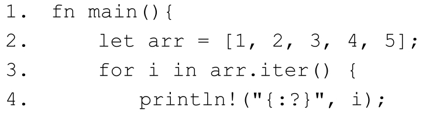{.u54061}
:::

::: center
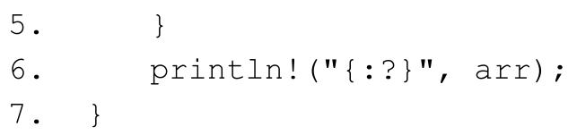{.u54060}
:::

代码清单6-67中声明了slice类型的数组，该类型的数组使用for循环时，并不能自动转换为迭代器，因为并没有为\[T\]类型实现IntoIterator，而只是为&＇a \[T\]和&＇a mut \[T\]类型实现了IntoIterator，相应的into_iter方法内部实际也分别调用了iter和iter_mut方法。也就是说，在for循环中使用&arr可以自动转换为迭代器，而无须显式地调用iter方法。用iter或iter_mut方法可以将slice类型的数组转换为Iter或IterMut迭代器。

代码清单6-68展示了迭代器Iter的源码。

**代码清单6-68：Iter迭代器的源码示意**

::: center
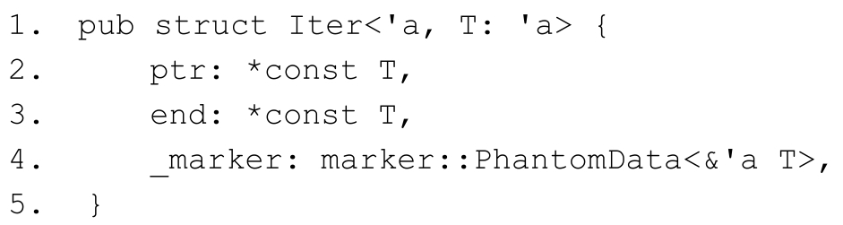{.u54059}
:::

可以看得出来，迭代器Iter中只包含ptr和end指针，均为不可变的裸指针\*const T，用于计算迭代器的长度，而_marker字段只是编译期标记，是为了让生命周期参数＇a有用武之地，通过编译。关于PhantomData的更多内容会在第13章中详细介绍。

Iter 迭代器也被称为不可变迭代器，因为它不能改变原来容器中的数据。代码清单 6-69展示了可变迭代器IterMut的源码。

**代码清单6-69：IterMut迭代器源码示意**

::: center
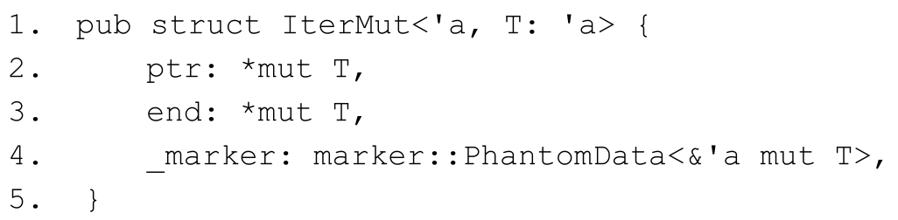{.u54058}
:::

迭代器IterMut中包含的ptr和end指针均为可变裸指针，意味着此迭代器可以改变容器内的值。代码清单6-70展示了如何使用iter_mut方法获得一个可变迭代器，然后使用它在for循环中遍历并修改slice类型数组中的每个元素。

**代码清单6-70：使用可变迭代器**

::: center
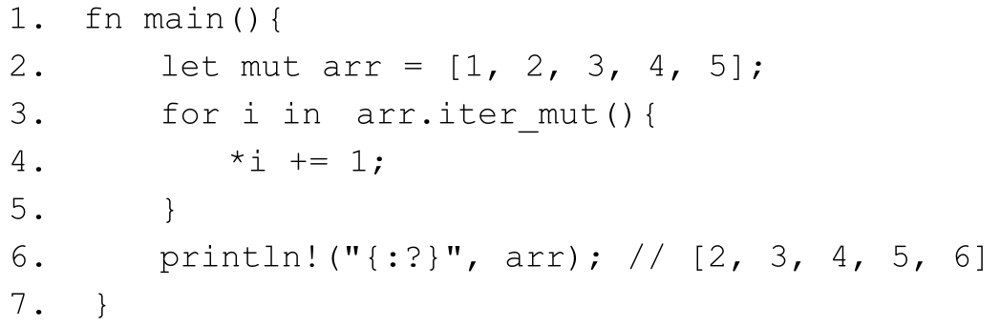{.u54057}
:::

Rust中的迭代器其实不仅有IntoIter、Iter和IterMut三种。比如，String类型和HashMap类型均有**Drain** 迭代器，可以迭代删除指定范围内的值，为字符串和HashMap的处理提供方便。不管Rust中的迭代器有多少种，重要的是，这些迭代器的实现都遵循上述规律，这也是Rust高度一致性的设计所带来的好处。反过来，不管是Slice类型的数组，还是Vec＜T＞类型的动态数组，亦或是HashMap等容器，迭代器模式都将其统一抽象地看待成一种数据流容器，通过对迭代器提供的"游标"进行增减就可以遍历流中的每一个元素。

### 6.3.4 迭代器适配器 {#text00012.html#A163e00e0-1340-4c11-bf2a-a015e1a96801 .title-left}

迭代器将数据容器的操作抽象为了统一的数据流，这就好比现实世界中，每家每户的自来水管都是标准化的接口，只需要打开水龙头就可以按需用水。但是不同的场景有不同的需求，厨房用水需要对水进行加热；而洗澡间则不只需要加热，还需要让冷热水混合，甚至还需要将水流分解为更细小的水流，这样洗澡才够舒服。要满足这些不同的需求，所要做的不是让自来水厂按需铺设专门的管道，而只需要在自来水接口上安装不同的设备。厨房只需要安装厨宝，将流经的水加热后再输出；洗澡间需要安装热水器，另外铺设冷热管道和花洒即可满足需求。这些不同的设备虽然功能不同，但是它们都遵循自来水管道的标准规范，这样才能适配各种各样的场景。

在软件世界中，通过**适配器模式** 同样可以将一个接口转换成所需的另一个接口。适配器模式能够使得接口不兼容的类型在一起工作。适配器也有一个别名，叫**包装器** （**Wrapper** ）。Rust在迭代器基础上增加了适配器模式，这就极大地增强了迭代器的表现力。

**Map适配器**

Map是Rust里最常见的一个迭代器适配器，如代码清单6-71所示。

**代码清单6-71：map方法示例**

::: center
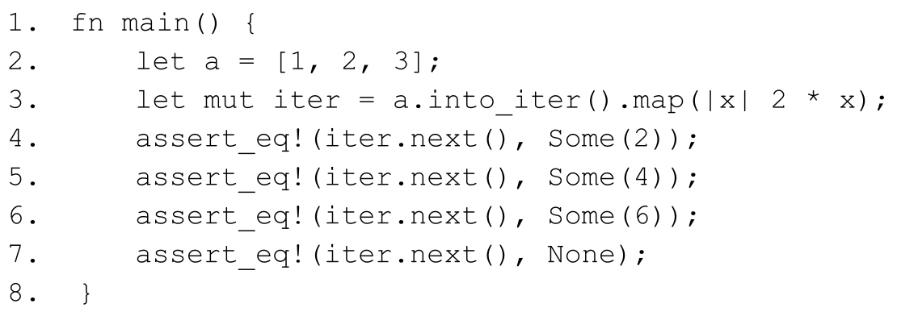{.u54056}
:::

代码清单6-71的第3行通过into_iter方法将数组转换为迭代器，然后调用迭代器的map方法创建了一个新的迭代器iter。然后依次调用iter的next方法迭代数组中的每个元素，同时，对每个元素执行闭包中指定的逻辑，最后输出相应结果。

map 方法创建的新迭代器就是一个迭代器适配器。代码清单 6-72 展示了定义于std：：iter：：Iterator中的map方法源码。

**代码清单6-72：迭代器map方法源码示意**

::: center
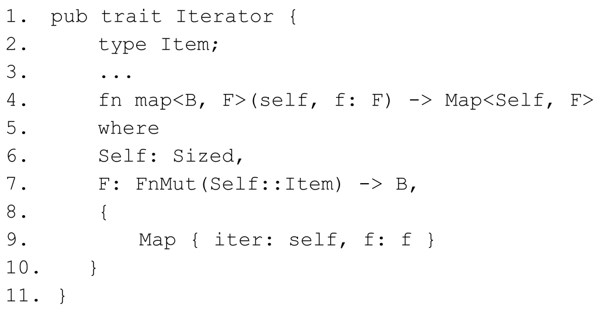{.u54055}
:::

map是Iterator trait中实现的方法，第一个参数self代表实现Iterator的具体类型，第二个参数f是一个FnMut闭包。该闭包trait限定为FnMut（Self：：Item）-＞B，其中的Self：：Item是指为实现Iterator具体类型设置的关联类型Item。最终，该方法返回了一个结构体Map＜Self，F＞，值得注意的是，这里Self被限定为Sized，否则Self在编译期无法确定大小就会报错。这个结构体Map就是一个迭代器适配器。

代码清单6-73展示了定义Map的源码。

**代码清单6-73：迭代器适配器Map源码示意**

::: center
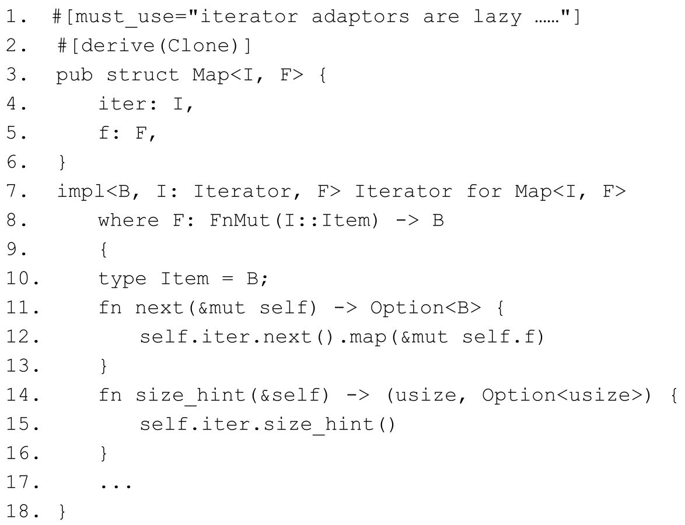{.u54054}
:::

看得出来，Map是一个泛型结构体，它只有两个成员字段，一个是**iter** ，一个**f** ，分别存储的是迭代器和传入的闭包。然后为其实现了Iterator trait，Map就成为了一个地道的迭代器。与一般迭代器不同的地方在于，其核心方法next和size_hint都是调用其内部存储的原始迭代器的相应方法。值得注意的是，第12行调用的map方法是next方法返回的Option＜T＞中实现的另一个 map 方法，后面的章节中会介绍该方法。通过第 12 行代码中的 map 方法传入Map中存储的闭包，就可以对每个元素执行相应的逻辑，最终再返回一个Option＜T＞类型。

你可能已经注意到了，代码清单 6-73 中迭代器适配器 Map 的源码上方使用了**＃\[must_use=＂......＂\]** 属性，该属性是用来发出警告，提示开发者迭代器适配器是惰性的，也就是说，如果没有对迭代器产生任何"消费"行为，它是不会发生真正的迭代的。这就好比水龙头上装好了花洒，但是不打开水龙头，就无法真正使用花洒。而调用next方法就属于"消费"行为。Rust中所有的迭代器适配器都使用了must_use来发出警告。

了解Map适配器之后，再回到代码清单6-71来查看其整个执行流程示意，如图6-6所示。

::: center
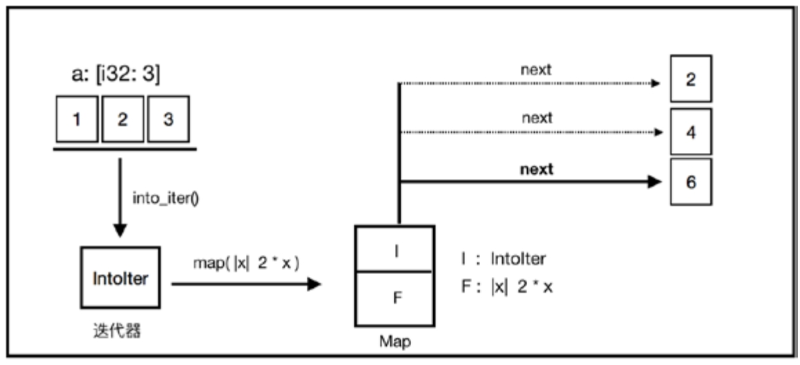{.u54053}

图6-6：代码清单6-71中map方法工作示意图
:::

图6-6是代码清单6-71的执行过程的简单示意图。数组a通过into_iter方法创建了迭代器IntoIter并转移所有权，然后IntoIter再调用Iterator trait中实现的map方法，传入闭包，IntoIter迭代器创建了一个迭代器适配器Map。Map中存储了迭代器IntoIter和传入的闭包F，然后通过next方法遍历"消费"其元素，依次产生新的数据。

**其他适配器**

除了Map，Rust标准库中还提供了很多迭代器适配器，都定义于std：：iter模块中。下面是一个迭代器适配器常用列表。

· **Map** ，通过对原始迭代器中的每个元素调用指定闭包来产生一个新的迭代器。

· **Chain** ，通过连接两个迭代器来创建一个新的迭代器。

· **Cloned** ，通过拷贝原始迭代器中全部元素来创建新的迭代器。

· **Cycle** ，创建一个永远循环迭代的迭代器，当迭代完毕后，再返回第一个元素开始迭代。

· **Enumerate** ，创建一个包含计数的迭代器，它会返回一个元组（i，val），其中 i 是 usize类型，为迭代的当前索引，val是迭代器返回的值。

· **Filter** ，创建一个基于谓词判断式（predicate，产生布尔值的表达式）过滤元素的迭代器。

· **FlatMap** ，创建一个类似Map的结构的迭代器，但是其中不会含有任何嵌套。

· **FilterMap** ，相当于Filter和Map两个迭代器依次使用后的效果。

· **Fuse** ，创建一个可以快速结束遍历的迭代器。在遍历迭代器时，只要返回过一次None，那么之后所有的遍历结果都为None。该迭代器适配器可以用于优化。

· **Rev** ，创建一个可以反向遍历的迭代器。

代码清单6-74展示了其中一部分迭代器适配器使用的示例。

**代码清单6-74：部分迭代器适配器使用示例**

1.fn main() {

::: center
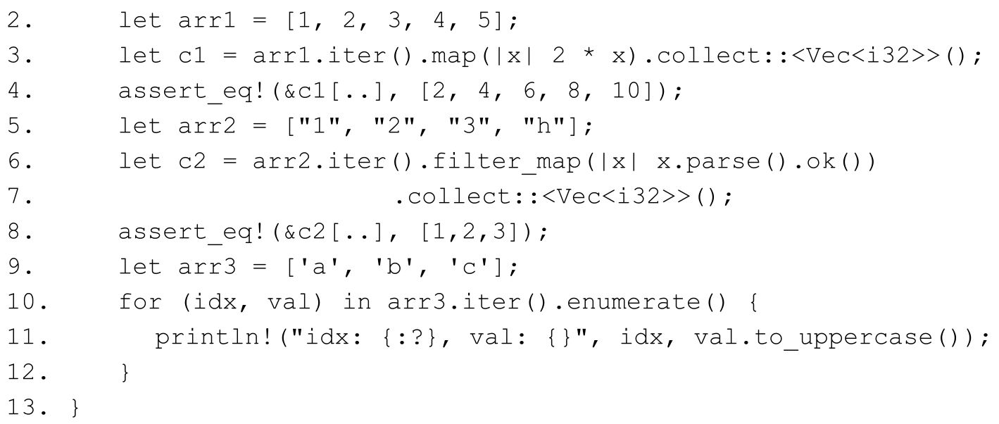{.u54052}
:::

代码清单6-74第2行到第4行使用了map方法，相应地，它会创建Map适配器。最终通过collect方法迭代生成第3行断言中所显示的Vec＜i32＞动态数组。

代码第5行到第8行使用了filter_map方法，它会创建FilterMap适配器。同样通过collect方法生成第7行断言中所示的Vec＜i32＞动态数组。

代码第9行到第12行使用了enumerate方法，它会创建Enumerate适配器，这里使用了for循环，因为此迭代器的next方法返回的是元组，所以第10行for循环内使用（idx，val）形式。

另外一个值得介绍的迭代器适配器是 Rev，它使用 rev 方法，可以支持反向遍历，如代码清单6-75所示。

**代码清单6-75：reü方法示例**

::: center
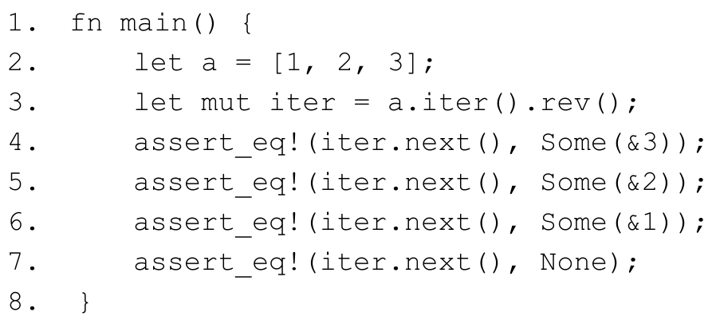{.u53403}
:::

代码清单6-75中使用rev方法创建了迭代器适配器，调用其next方法就是反向遍历。这里面存在什么"魔法"呢？代码清单6-76展示了rev方法的源码。

**代码清单6-76：reü源码示意**

::: center
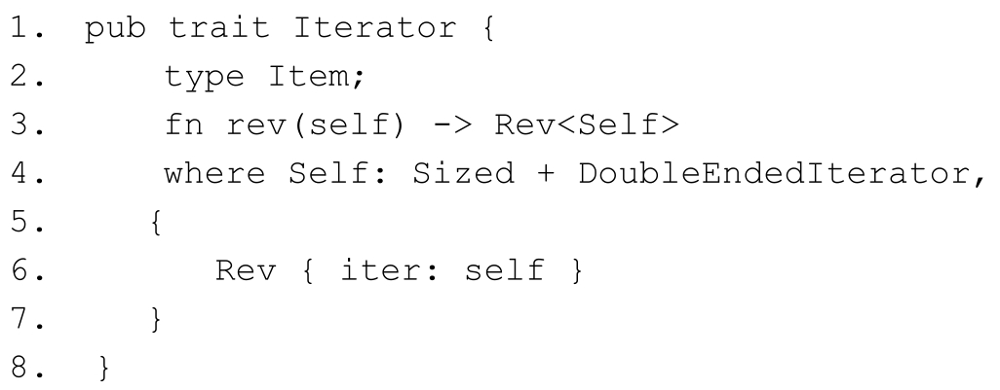{.u54051}
:::

看得出来，rev 方法返回了 Rev 结构体，它就是实现反转遍历的迭代器适配器。注意这里Self的trait限定中包含了一个**DoubleEndIterator** trait，意味着只有实现该trait的类型才可以使用此方法。

代码清单6-77展示了Rev迭代器适配器的源码。

**代码清单6-77：Reü迭代器适配器源码示意**

::: center
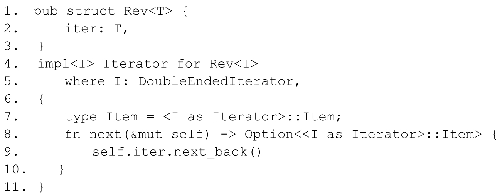{.u54050}
:::

Rev泛型结构体中只有一个成员字段iter，只用来保存迭代器。在为其实现Iterator时，指定了DoubleEndIterator限定。并且将关联类型Item通过无歧义完全限定语法指定了Iterator中的关联类型。

值得注意的是，在 next 方法中，调用了 Rec 中存储的迭代器的 next_back 方法。这个next_back方法实际上是在DoubleEndIterator中定义的，代码清单6-78展示了其源码。

**代码清单6-78：DoubleEndIterator源码示意**

::: center
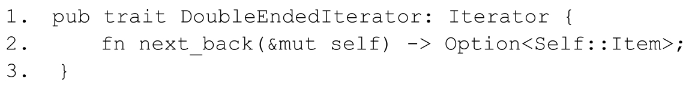{.u54049}
:::

限于篇幅，代码清单 6-78 只展示了 DoubleEndIterator 的部分源码。看得出来，DoubleEndIterator是Iterator的子trait，这样定义实际是为了扩展Iterator。next_back和next方法签名非常相似，反转遍历正是基于此方法来实现的。代码清单6-79展示了next_back的使用示例。

**代码清单6-79：next_back方法使用示例**

::: center
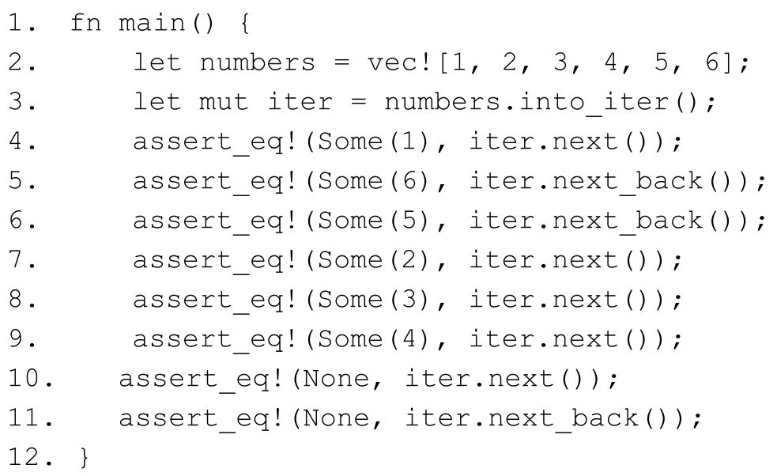{.u54048}
:::

代码清单6-79第4行调用了next方法，返回的是Some（1），属于正常遍历。

代码第5行和第6行调用了next_back方法，返回的分别是Some（6）和Some（5），说明这两次遍历是反向遍历，但是第7行到第9行依次又调用了next方法，返回值分别是Some（2）、Some（3）和Some（4）。这说明，**在执行next_back方法之后，迭代器的** "**游标** "**还是会返回到上一次next执行的位置继续执行next，这也是该方法命名为next_back的原因** 。在第10行和第11行中，迭代已经完毕，均返回None。

至此，我们就知道了Rev迭代器适配器的工作机制：在next迭代中，调用next_back方法。只有实现了 DoubleEndIterator 的迭代器才有 next_back 方法，也就是说，只有实现了DoubleEndIterator的迭代器才能调用Iterator：：rev方法进行反向遍历。

Rust标准库中还提供更多的迭代器适配器，这些迭代器适配器可以自由灵活地组合，以便应对不同的需求。图6-7展示了迭代器适配器的心智模型。

::: center
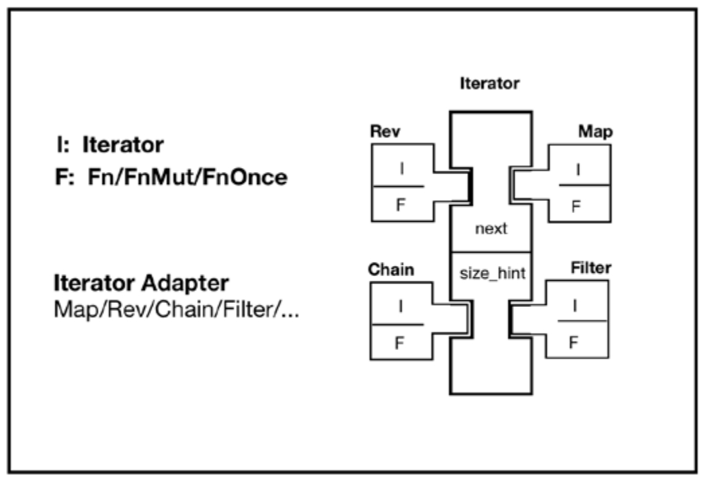{.u54047}

图6-7：迭代器适配器心智模型示意图
:::

### 6.3.5 消费器 {#text00012.html#Ae3e200e5-84a1-41a3-b409-7012790ec2ab .title-left}

Rust 中的迭代器都是惰性的，也就是说，它们不会自动发生遍历行为，除非调用 next方法去消费其中的数据。最直接消费迭代器数据的方法就是使用for循环，前面已经了解到，for循环会隐式地调用迭代器的next方法，从而达到循环的目的。

为了编程的便利性和更高的性能，Rust也提供了for循环之外的用于消费迭代器内数据的方法，它们叫作消费器（Consumer）。下面列出了Rust标准库std：：iter：：Iterator中实现的常用消费器。

· **any** ，其功能类似代码清单6-42中实现的any方法的功能，可以查找容器中是否存在满足条件的元素。

· **fold** ，来源于函数式编程语言。该方法接收两个参数，第一个为初始值，第二个为带有两个参数的闭包。其中闭包的第一个参数被称为累加器，它会将闭包每次迭代执行的结果进行累计，并最终作为 fold 方法的返回值。在其他语言中，也被用作 reduce或inject。

· **collect** ，专门用来将迭代器转换为指定的集合类型。比如代码清单 6-74 中使用collect：：＜Vec＜i32＞＞（）这样的turbofish语法为其指定了类型，最终迭代器就会被转换为Vec＜i32＞这样的数组。因此，它也被称为"收集器"。

**any和fold**

代码清单6-80展示了消费器any和fold的使用示例。

**代码清单6-80：any和fold的使用示例**

::: center
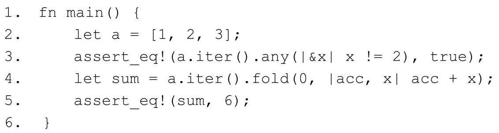{.u54046}
:::

在代码清单6-80的第3行中，any方法检查数组a中是否存在不等于2的元素，返回true。代码第4行使用fold方法来对数组a进行求和，图6-8展示了fold的求值过程。

::: center
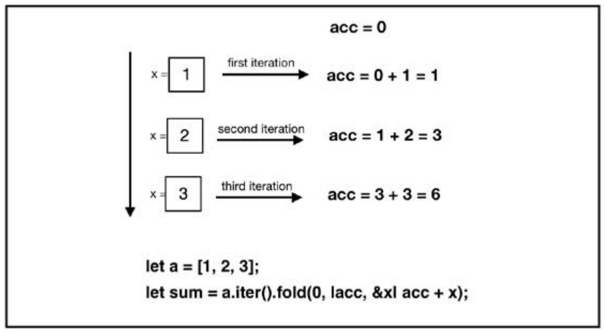{.u54045}

图6-8：fold求值过程示意图
:::

代码清单6-80中值得注意的地方在于，any和fold传入的闭包的参数是一个引用。这是为什么呢？代码清单6-81展示了any和fold的源码。

**代码清单6-81：any和fold的源码示意**

::: center
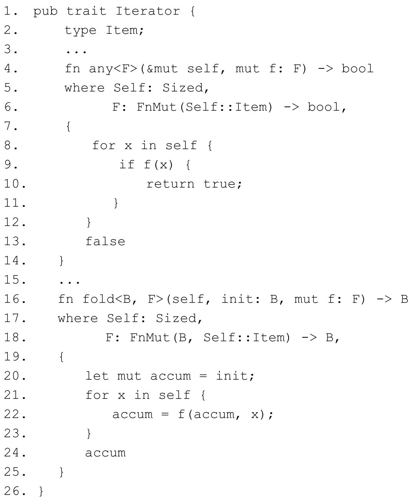{.u54044}
:::

看得出来，any和fold的内部都包含了一个for循环，它们实际上是通过for循环来实现内部迭代器的。内部迭代器的特点是，一次遍历到底，不支持**return** 、**break** 或**continue** 操作，因此可以避免一些相应的检查，更有利于底层LLVM的优化。

在代码清单6-80的第3行中，使用的是数组的iter方法，创建的迭代器是Iter类型，该类型的next方法返回的是Option＜&\[T\]＞或Option＜&mut \[T\]＞类型的值。而for循环实际上是一个语法糖，会自动调用迭代器的 next 方法，for 循环中的循环变量则是通过模式匹配，从next返回的Option＜&\[T\]＞或Option＜&mut \[T\]＞类型中获取&\[T\]或&mut \[T\]类型的值的。

因此，在代码清单6-81的第8行中，any方法的内部for循环中的循环变量x是一个引用。所以，在代码清单6-80中，第3行传给any的闭包参数只能是引用形式，否则就会报错。代码清单6-82展示了更多细节。

**代码清单6-82：any方法示意**

::: center
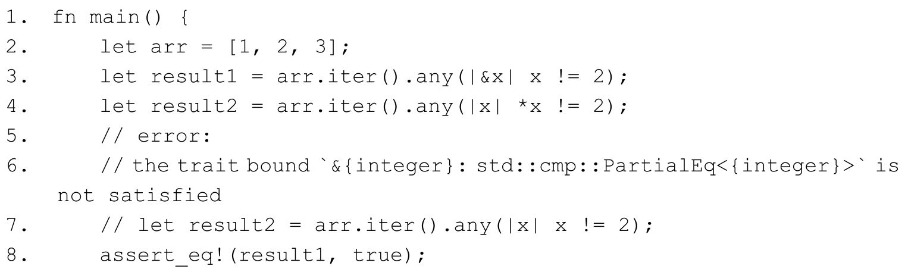{.u54043}
:::

::: center
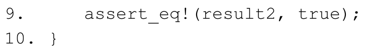{.u54042}
:::

在代码清单6-82中，第3行和第4行的any方法闭包参数分别使用了&x和x，都可以正常运行。对于&x参数的闭包来说，在any方法内部调用时，会因为闭包参数的模式匹配获取x的值，故而可以正常运行。对于x参数的闭包来说，因为闭包执行体使用了解引用操作符，因此也可以正常运行。但是像第7行那样的用法就会抛出注释所示的错误。这是因为此时x为引用，不能进行比较操作。

对于fold方法来说，也是同样的道理，如代码清单6-83所示。

**代码清单6-83：使用fold对数组求和示例**

::: center
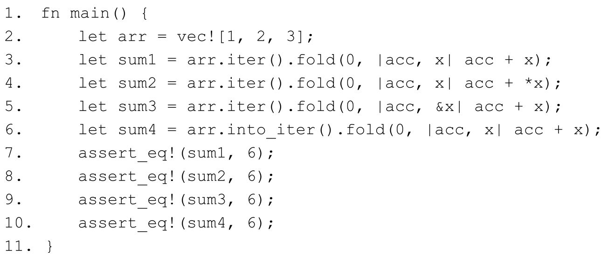{.u54041}
:::

代码清单6-83中，第3行、第4行和第5行通过iter方法获取的动态数组arr的不可变迭代器为Iter类型，所以能获取多次。第6行使用into_iter方法来创建的迭代器是IntoIter类型，会获取arr的所有权。

因为Iter类型的迭代器在for循环中产生的循环变量为引用，所以在fold内部的for循环中传入闭包的循环变量也是引用。故而代码清单6-83的第3行、第4行和第5行都可以正常运行。加法操作对引用是适用的。

而IntoIter类型的迭代器的next方法返回的是Option＜T＞类型，在for循环中产生的循环变量是值，不是引用。所以在代码清单6-83第6行使用fold时，其内部的for循环的循环变量也是值，所以这里闭包参数也只能是值。如果把第6行闭包参数中的x改为&x，或者把闭包体内的x改为\*x，均会报错。

Rust除了提供any和fold两个消费器（内部迭代器），还提供了其他的内部迭代器，比如all、for_each和position等，可以在std：：iter：：Iterator的文档中找到它们的用法和源码。在众多消费器中，最特殊的应该算collect消费器了。

**collect消费器**

通过前面的几个示例我们已经知道，collect消费器有"收集"功能，在语义上可以理解为将迭代器中的元素收集到指定的集合容器中，比如前面示例中所看到的collect：：＜Vec＜i32＞＞（），就是将迭代器元素收集到 Vec＜i32＞类型的动态数组容器中。通过turbofish语法还可以指定其他的集合容器，比如collect：：＜HashMap＜i32，i32＞＞（）等。代码清单6-84展示了collect消费器源码。

**代码清单6-84：collect源码示意**

::: center
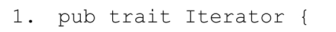{.u54040}
:::

::: center
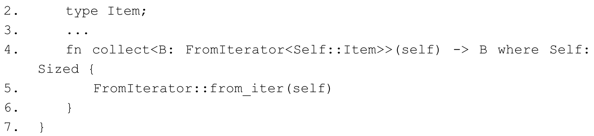{.u53607}
:::

看得出来collect消费器的源码很简单，其内部只是调用FromIterator：：from_iter方法。前面已经讲过，FromIterator 和 IntoIterator 是互为逆操作的两个 trait。代码清单 6-85 展示了FromIterator的源码。

**代码清单6-85：FromIterator源码示意**

::: center
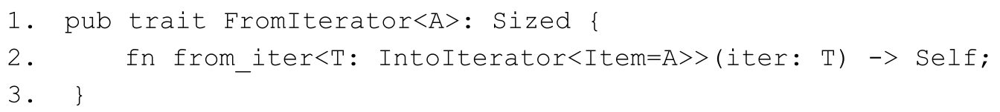{.u54039}
:::

该 trait 只定义了唯一的泛型方法 from_iter，它的方法签名中使用了 trait 限定IntoIterator＜Item=A＞，表示只有实现了IntoIterator的类型才可以作为其参数。集合容器只需要实现该trait，就可以拥有使用collect消费器收集迭代器元素的能力，代码清单6-86所展示的集合MyVec就实现了FromIberotor trait。

**代码清单6-86：自定义集合MyVec实现FromIterator**

::: center
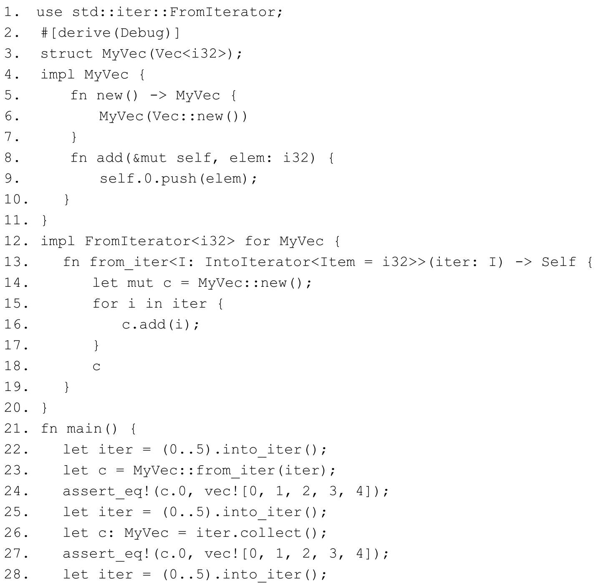{.u54038}
:::

::: center
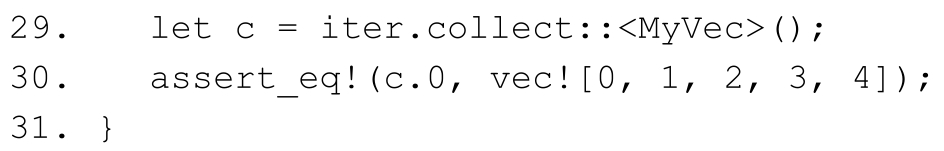{.u54037}
:::

在代码清单6-86中，通过元组结构体包装Vec＜i32＞创建了MyVec结构体，将其作为自定义的集合容器，并为其实现FromIterator。然后在main函数中就可以使用collect来把迭代器元素收集到自定义的MyVec容器中了。

这里需要注意的是，直接调用MyVec：：from_iter方法和使用collect方法的效果是一样的。

### 6.3.6 自定义迭代器适配器 {#text00012.html#Ac59b00e9-6d97-4598-b513-acf25f182e38 .title-left}

Rust虽然提供了很多迭代器适配器，但是面对实际开发中各种各样的需求时还是显得不够用。幸运的是，在Rust中可以很容易地自定义迭代器适配器，这得益于Rust的高度一致性。

接下来要实现一个自定义的迭代器适配器，主要功能是让迭代器按指定的步数来遍历，而不是逐个遍历。首先，需要定义一个迭代器适配器Step＜I＞，如代码清单6-87所示。

**代码清单6-87：定义迭代器适配器Step＜I＞**

::: center
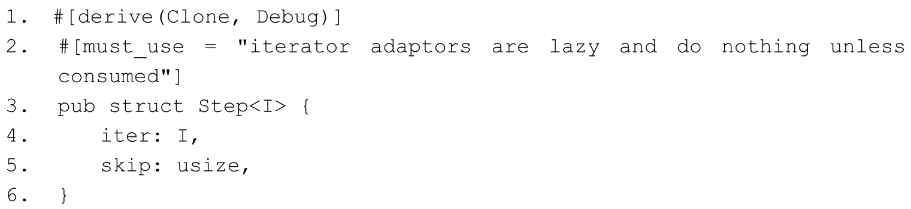{.u53607}
:::

代码清单6-87定义了泛型结构体Step＜I＞，将它作为迭代器适配器，其成员iter用于存储迭代器，skip用于存储迭代的步数。接下来，需要为其实现Iterator，如代码清单6-88所示。

**代码清单6-88：为Step实现Iterator**

::: center
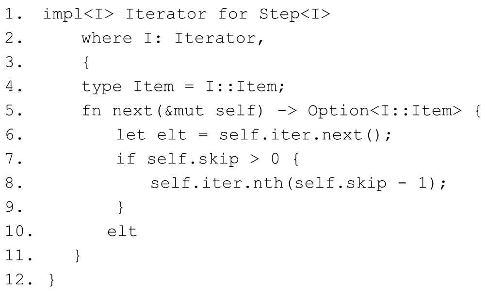{.u54036}
:::

代码清单6-88为Step实现了Iterator中定义的两个核心方法next。值得注意的是，这里需要将关联类型Item指定为原迭代器的关联类型I：：Item。

实现next和size_hint方法时，必须符合Iterator trait中next方法签名规定的参数和返回值类型。其中next方法必须按指定的步数来迭代，所以此处next方法实现的时候，需要根据Step适配器中的skip字段来跳到相应的元素。如果skip是2，调用next时则需要跳过第一个元素，直接到第二个元素。注意代码第8行使用了nth方法，该方法会直接返回迭代器中第n个元素。

接下来，需要创建一个step方法来产生Step适配器，如代码清单6-89所示。

**代码清单6-89：创建step方法来产生Step适配器**

::: center
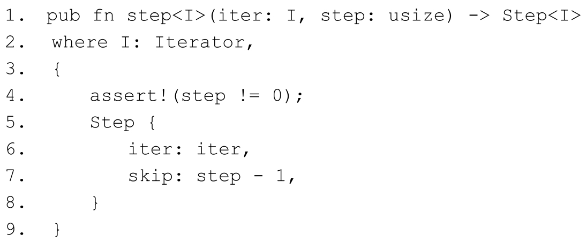{.u54035}
:::

代码清单6-89创建了step方法，接收两个参数，第一个为迭代器，第二个为指定步数。返回一个Step结构体实例。

现在，一个完整的迭代器适配器已经创建好了。最后只需要为所有的迭代器实现step方法即可，如代码清单6-90所示。

**代码清单6-90：为所有的迭代器实现step方法**

::: center
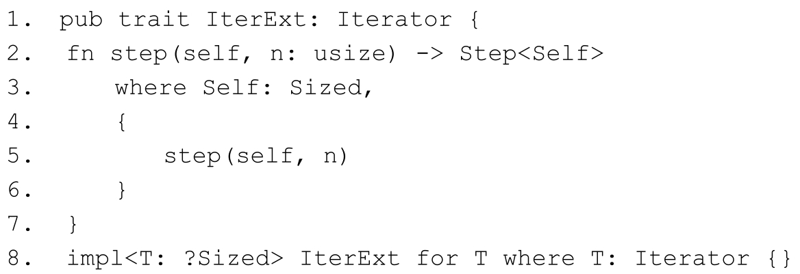{.u54034}
:::

代码清单 6-90 做了两件事。第一件事是自定义了一个继承自 Iterator 的子 trait，名为IterExt，其中定义了step方法并给出了默认的实现：直接使用step函数创建Step适配器并返回。第二件事如代码第8行所示，使用impl为所有实现了Iteraotr的类型T实现IterExt。至此，整个迭代器适配器才算大功告成，可以直接使用了，如代码清单6-91所示。

**代码清单6-91：应用迭代器适配器Step**

::: center
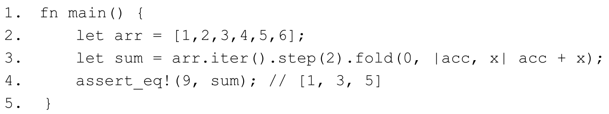{.u53472}
:::

在代码清单6-91中，数组arr通过iter方法转换为迭代器之后，就可以直接调用step方法来指定迭代的步数了，此例中指定步数为2，迭代的元素应该是\[1，3，5\]，所以使用fold消费器对其求和所得值等于9。

以上就是自定义迭代器适配器的具体思路。

实际上，Rust 社区有很多第三方包（crate）也提供了迭代器适配器，其中最常用的是Itertools。代码清单6-92是Itertools包中实现的Positions适配器示例。

**代码清单6-92：Itertools包中实现的Positions迭代器适配器**

::: center
{.u54033}
:::

::: center
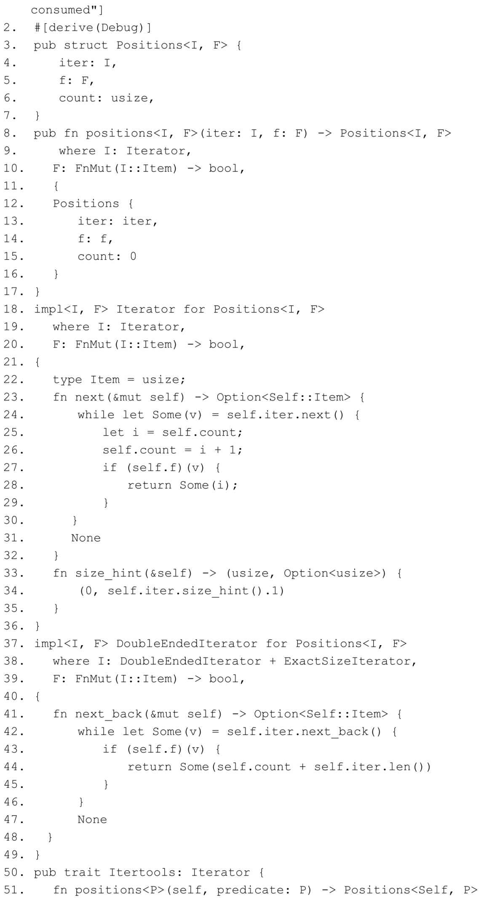{.u54032}
:::

::: center
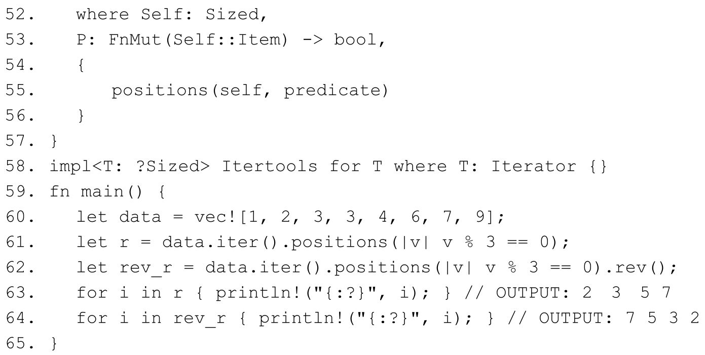{.u54031}
:::

代码清单6-92是从Itertools包中摘选出来的Positions迭代器适配器的完整实现，从main函数中可以看出，其功能是输出满足闭包内指定条件元素的索引（位置）。

第3行到第7行定义了Positions结构体，包含三个成员字段。其中iter用来存储迭代器，f用来存储闭包，count用来计数。

第8行到第17行实现了positions方法，用来生成Positions迭代器实例。

第18行到第36行为Positions实现了Iterator中核心的next方法和size_hint方法。注意其中的next方法，在每次迭代时，会使用count来进行计数并执行闭包，如果满足闭包条件则返回相应的计数，就是所得索引值。

第37行到第49行为Positions实现了DoubleEndIterator和ExactSizeIterator，支持反向遍历和确定迭代器大小。

第50行到第57行创建了Itertools，其继承自Iterator的子trait，作用是扩展Iterator。该trait实现了positions方法，迭代器就可以调用了。

在main函数中，第61行和第62行分别使用了positions方法正确获得Positions迭代器，并在其后的两个for循环中获得预期的结果。

除了Positions适配器，Itertools还提供了更多的适配器和其他扩展迭代器的方法。如有需要，可以在crates.io网站找到它。

## 6.4 小结 {#text00012.html#A5a0000ec-0124-4117-acd7-e8a201b8026a .title-left}

本章从函数式编程范式的角度探讨了Rust中的函数和闭包。在Rust中，函数是一等公民，可以作为其他函数的参数或返回值。将函数作为参数或返回值的函数，叫高阶函数。在函数之间传递的是函数指针类型fn。虽然Rust也支持高阶函数，但是函数本身并不能捕获环境变量，无法完成某些情况下的需求，所以Rust也引入了闭包。

闭包可以捕获其在被定义时环境中的变量。在Rust中，闭包实际上是一种trait语法糖。对应所有权系统，闭包有三个trait，分别是Fn、FnMut、FnOnce，它们由编译器自动生成。生成哪种类型的闭包，与捕获变量属于复制语义还是移动语义有关联。闭包也可以作为函数的参数和返回值，这就极大地提高了Rust语言的抽象表达能力。但是因为闭包是trait语法糖，所以在返回闭包的时候，需要把闭包装箱用作 trait 对象。闭包装箱会带来性能问题，所以Rust官方团队在Rust 2018版本中引入了impl Trait功能，来支持直接返回闭包，而不再需要trait对象。顾名思义，impl Trait代表实现了指定Trait（比如闭包的Fn、FnMut、FnOnce）的类型，它类似返回值上的trait限定，属于静态分发。

闭包最常见的应用就是迭代器，Rust迭代器的应用非常广泛。Rust基于trait和结构体非常漂亮地实现了迭代器模式，以及迭代器适配器模式，不仅在标准库中提供了很多迭代器相关的方法，而且开发者还可以非常方便地编写自己的迭代器适配器，来扩展Rust的迭代器。Rust迭代器是基于for循环的外部迭代器，for循环其实也是语法糖，它会自动调用next方法来遍历集合容器中的元素。

Rust的迭代器和迭代器适配器均是惰性的，也就是说，如果没有真正的消费数据的行为发生，它们是不会工作的。这种用于消费迭代器数据的工具叫消费器。Rust提供了有限的几种消费器，比如collect和fold。这些消费器实际上是一种内部迭代器。内部迭代器的好处是不支持return、break和continue，减少了相关的检查，可以方便编译器进行优化，在某些场景中提升性能。这些内部迭代器实际上是基于for循环实现的。std：：iter模块中还定义了很多迭代器相关的方法，读者可以自行探索和练习。

通过学习函数、闭包和迭代器，读者应该对Rust有了更深的认识，也应该能更进一步地体会到Rust语言设计的一致性了。基于trait、结构体和所有权，完美地提供了函数式编程范式中的常用高级语言特性，也许这正是Rust语言的优雅性所在。

[]{#text00013.html}

# 第7章 结构化编程 {#text00013.html#Afbbb302a-f861-46b8-aeea-299f62d14126 .title-left}

形每万变，神唯守一。

编程是一门技术，用它可以解决很多问题，创造很多新事物，甚至改变世界。编程更是一门艺术，在使用它解决问题或创造新事物的时候，本身就是一种精神实践活动，其中蕴含了开发者对于客观世界的认识和反映。在外行人的眼里，由 26 个英文字母加各种符号组合而成的程序代码可能毫无美感可言，那么编程的艺术性到底表现在哪里？对于开发者来说，编程的艺术性在于其组织结构极具审美价值。

编程完全可以类比建筑。2010年上海世博会上，中国馆"东方之冠"给人留下了深刻的印象。"东方之冠"的特色之处在于其采用了中华古建筑斗拱的结构，如图7-1所示。

::: center
{.u54030}

图7-1：中国古建筑斗拱结构示意图
:::

斗拱属于榫卯结构的一种，其上承屋顶，下接立柱，在中国古建筑中扮演的是顶天立地的角色。而斗拱仅仅由5个简单的部件组成，利用独一无二的榫卯结构，可以拼接出种类繁多且左右对称的各种样式，无不令人称赞。这正应了"形每万变，神唯守一"的规律。

编程也一样，同样需要考虑系统结构、分层和架构。无论是采用面向对象还是函数式的开发思想，可以代码复用和高内聚低耦合的架构就是一种美。而语言的范式在很大程度上决定了使用该语言编写出的代码的组织结构。对于面向对象范式的语言，其核心的概念是继承、多态和封装，它将对象作为程序的基本构建单元。而函数式范式语言将函数作为其程序的基本构建单元，采用抽象和复合等手段来组织和复用代码。这两种方式各有优缺点。面向对象范式在代码结构化方面的优点在于更加符合直觉，缺点是性能差、过度封装，而基于类继承的方式也会造成强耦合。函数式范式的优点在于它的核心思想是"组合优于继承"，与面向对象范式相比，其复用的粒度更小，更自由灵活，耦合程度更低，但其缺点是学习成本比较高。

作为现代系统级的编程语言，Rust汲取了两个不同编程范式的优势，提供了结构体、枚举体和 trait 这三驾马车来撑起程序结构。本章主要围绕结构体和枚举来阐述如何使用 Rust进行结构化编程。

## 7.1 面向对象风格编程 {#text00013.html#A618600ef-91a5-44d3-bb03-132ab4794396 .title-left}

严格来说，Rust并不符合标准的面向对象语言的定义。比如，Rust既不存在类或对象的概念，也没有父子继承的概念。然而，rust 却支持面向对象风格的封装。传统面向对象中的父子继承是为了实现代码复用和多态，其本质在类型系统概念中属于子类型多态，而 Rust使用trait和泛型提供的参数化多态就完全满足了这个需求。对于代码复用，Rust是通过泛型单态化和trait对象来避免代码重复，从而支持代码复用的，虽然相对于传统面向对象语言中的父子继承来说功能较弱，但Rust还提供了功能强大的宏（包括macro和procedural macro）系统来帮助复用代码，甚至还可以使用一些设计模式来避免代码重复。Rust还实现了一种名叫**特化** （**specialization** ）的功能来增强代码的高效复用。

总而言之，Rust对面向对象编程风格的支持可以总结为以下几点。

· **封装** 。Rust提供了结构体（Struct）和枚举体（Enum）来封装数据，并可使用pub关键字定义其字段可见性；提供了impl关键字来实现数据的行为。

· **多态** 。通过trait和泛型以及枚举体（Enum）来允许程序操作不同类型的值。

· **代码复用** 。通过泛型单态化、trait对象、宏（macro）、语法扩展（procedural macro）、代码生成（code generation）来设计模式。

### 7.1.1 结构体 {#text00013.html#A071c00ef-4650-42e6-b99b-4a5abba64c49 .title-left}

结构体（Struct）和枚举体（Enum）是Rust中最基本的两种复合类型。对于Rust类型系统而言，这两种复合类型实际上属于同一种概念，它们都属于**代数数据类型** （**ADT** ，**Algebraic Data Type** ）。代数数据类型的概念来自函数式语言，尤其在Haskell中应用最广，仅通过这两种数据类型就可以构造出大部分的数据结构。

**代数数据类型之积类型**

代数数据类型就是指具备了代数能力的数据类型，即数据类型可以进行代数运算并满足一定的运算规则（例如可以进行加法或乘法，满足交换律和结合律）。正是这一点保证了数据类型中的许多性质是可以**复合** 的。比如一个结构体中包含的成员都是拥有复制语义的简单原始数据类型，那么这个结构体也可以通过派生属性**＃\[derive\]** 来放心地为其实现Copy，如代码清单7-1所示。

**代码清单7-1：成员字段为简单原始数据类型的结构体示例**

::: center
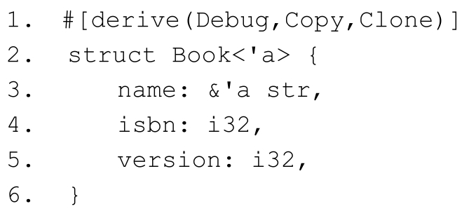{.u54029}
:::

::: center
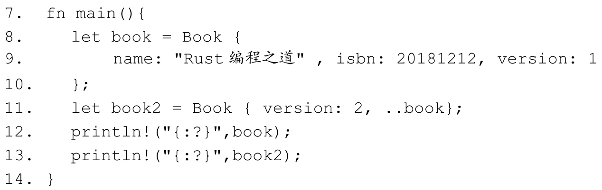{.u54028}
:::

在代码清单 7-1 中，因为结构体 Book 的成员字段均为复制语义的类型，所以在代码第12行输出book时，可以正常编译执行，说明第11行创建book2时，使用结构体更新语法".."时，book的所有权并未被转移。结构体的**更新语法** （**update syntax** ）允许使用".."语法来减少代码重复。

这说明复合类型结构体 Book 已经通过派生属性**＃\[derive（Copy，Clone）\]** 实现了 Copy。但是如果结构体Book使用了移动语义的成员字段，则不允许实现Copy，如代码清单7-2所示。

**代码清单7-2：成员字段为移动语义的情况**

::: center
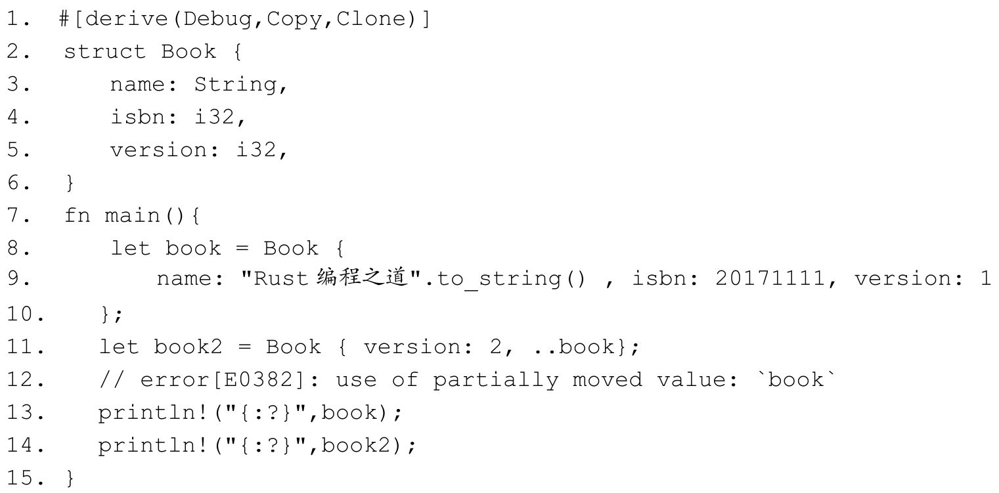{.u53408}
:::

在代码清单7-2中，将结构体Book的name字段修改为了拥有移动语义的String类型。该代码编译会报以下错误：

::: center
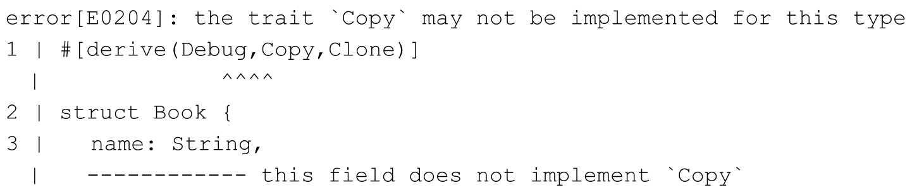{.u54027}
:::

错误信息表明，Rust不允许包含了String类型字段的结构体实现Copy。看得出来，代数数据类型有力地保障了复合类型的类型安全。这里值得注意的是，更新语法会转移字段的所有权。在代码清单7-2的第11行中，..book语法会将除version字段之外的其他字段的所有权转移，这里name是String类型，属于移动语义，所以name会被转移所有权。如果把代码清单 7-2 结构体的派生属性＃\[derive（Copy，Clone）\]去掉，再编译该代码，则会报出代码第 12行注释展示的错误，表示book的部分字段的所有权已经被转移。

Rust中的结构体属于代数数据类型中的**积类型** 。积类型是来自范畴论的术语，毕竟Rust类型系统借鉴了Haskell语言，而Haskell语言是范畴论的最佳实践，但这并不代表需要深入Haskell或范畴论才能理解它。积类型也可以通过更直观的**乘法原理** 来理解，假如一件事需要分成*n* 个步骤来完成，第一步有*m* ~1~ 种不同的做法，第二步有*m* ~2~ 种不同的做法，以此类推，第 *n* 步有 *m~n~* 种不同的做法，那么完成这件事共有 *N* =*m* ~1~ ×*m* ~2~ ×*m* ~3~ ×...×*m* ~n~ 种不同的做法，这就是乘法原理。它描述的是做一件事需要分成很多步，每一步之间都相互依赖，它表示的是一种**组合** （combination）。如果用逻辑来表示，则是**逻辑与** （合取）。

同理，结构体这样的复合数据是通过不同字段的值组合而成的。比如一个元组结构体S（i32，u32，String），其实例是（i32，u32，String）这三种字段类型的值相互依赖而成的不同组合。由此可知，元组也属于积类型。积类型代表一种数据结构的复合方式，当一个复合类型需要组合多个成员来共同表达时，可以使用结构体。

Rust中的结构体虽然是代数数据类型，但也契合了面向对象思想中的封装。因此，通过结构体完全可以进行面向对象风格的编程。

**使用结构体进行面向对象风格编程**

下面以一个简单的示例来说明如何使用结构体进行面向对象风格的编程。假设需要实现一个库，该库的功能是在终端（Terminal）输出指定颜色的字符。使用该库输出指定颜色字符的代码如代码清单7-3所示。

**代码清单7-3：在终端输出指定颜色字符的代码示意**

::: center
{.u54026}
:::

代码清单7-3想实现的是在该代码运行时，在终端输出指定颜色的字符，具体来说，是想在终端输出黄色背景色下的红色字符串Hello。那么该如何设计代码才能实现此目标呢？

在终端显示带颜色的字符，需要使用**ANSI转义序列** （**ANSI Escape Code** ）。ANSI转义序列就是指形如 **ESC** 和**\[** 组合而成的字符序列，可以实现在屏幕上定位光标或改变输出字符颜色等功能，所以也被称为**控制字符** ，被定义于ASCII码中。ESC有三种表示方法：

· 在Shell中表示为**\\e** 。

· 以ASCII十六进制表示为**\\x1B** 。

· 以ASCII八进制表示为**\\033** 。

所以，如果想在终端输出带指定颜色的字符Hello，需要将其变为包含ANSI转义序列的字符串，如下所示：

::: center
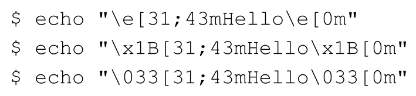{.u54025}
:::

将这三条echo指令放到Linux终端下，均会输出黄底红字的Hello。

**\\x1B\[** 为前缀，表示这是一个ANSI控制序列的开始。用分号相隔的**31；43** 属于颜色代码，31是前景色，代表红色；43为背景色，代表黄色。字母m为结束符，原始文本Hello置于其后。最后的**\\x1B\[0m** 结尾代表重置全部属性，表示一个ANSI控制序列的结束。图7-2以ESC的十六进制表示为例展示了ANSI转义序列的含义。

::: center
{.u54024}

图7-2：ANSI转义序列示意图
:::

那么，想把Hello转换为此ANSI序列，实际上就是一个字符串的组装。整个ANSI序列中动态变化的只有两部分，那就是颜色代码和原始文本，因此有了初步的实现步骤：

1.定义一个结构体，来封装动态变化的两部分数据。

2.为此结构体定义指定颜色的方法，比如red方法和on_yellow方法。

3.为了实现直接在字符串字面量上链式调用red和on_yellow方法，就必须为&＇a str 类型也实现red和on_yellow方法。

4.为此结构体实现方法，用于组装ANSI字符串序列。

5.打印结果。

接下来，按照此步骤来逐步实现目标。创建一个名为 **color.rs** 的文件存放整个代码，注意Rust代码文件以**.rs** 为扩展名。

第1步来设计一个结构体，命名为ColoredString，字段包含输入的原始字符串，以及前景色和背景色，如代码清单7-4所示。

**代码清单7-4：在color.rs文件中创建ColoredString结构体**

::: center
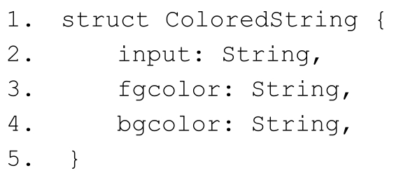{.u54023}
:::

结构体ColoredString包含三个字段，均为String类型。其中input用于存储原始字符，fgcolor和bgcolor分别代表前景色和背景色。

第2步要为结构体实现颜色相关的方法，而第3步中也需要为**&＇a str** 类型实现相关方法，因此这里实际上需要一个统一的接口，这正是trait大显身手的地方，我们增加Colorize trait，如代码清单7-5所示。使用Rust的trait可以实现非侵入式接口，而不是面向对象语言（比如C++或Java）的那种有过多依赖的侵入式接口。

**代码清单7-5：在color.rs 中增加Colorize trait**

::: center
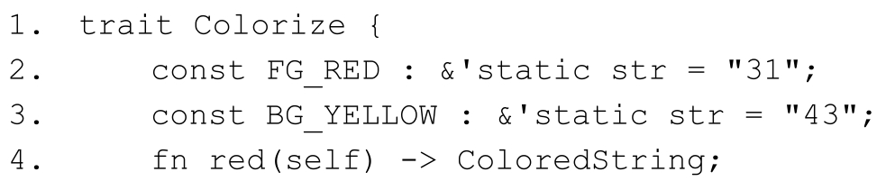{.u53641}
:::

::: center
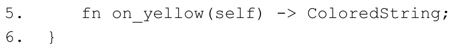{.u54022}
:::

代码清单7-5定义了这个Colorize trait，该trait包含了FG_RED和BG_YELLOW两个常量，这两个常量叫**关联常量** 。关联常量是Rust 2018 版本中加入的新功能，和关联类型类似，由实现该trait的类型来指定常量的值，也可以像代码清单7-5这样指定默认常量值。这里的两个常量值分别代表前景色红色和背景色黄色，在后面的代码中将会使用。与直接在代码中使用数值相比，关联常量的可读性和可维护性更高一些。在使用关联常量的时候，要注意常量名必须全部大写，否则编译器会输出警告。并且在trait中要明确标注好常量的类型，因为此处编译器无法推断常量的具体类型。

该trait中还包含两个方法red和on_yellow，分别用于设置前景色和背景色。这两个方法均以self为第一个参数并返回ColoredString，表示该方法是和实现该trait的类型相关联的函数，其中self实际上代表self：Self，Self代表实现该trait的类型。这是Rust最具有面向对象风格的特点的地方，因为关联函数允许开发者使用点操作符来调用函数，同样也支持链式调用，就像使用面向对象语言那样。在面向对象语言中，形如recevier.message形式的调用方式被称为消息传递，点操作符左边的 recevier 被称为接收者，右边的部分被称为消息，在面向对象语言中，消息也被叫作方法。因此我们把这样的关联函数称为方法，用于和普通的函数区分开来。

然后就要分别为ColoredString和&＇a str类型实现Colorize。这里思考一个问题，当实现red 方法时，只需要设置前景色 fgcolor，而另外两个值却不知道，原始文本有可能是任意字符串，背景色bgcolor可以设置，也可以不设置。同理，实现on_yellow方法也存在类似的问题，所以必须使用默认值。最直观的办法是使用空字符串充当默认值，类似如下代码：

::: center
{.u54021}
:::

因为red和on_yellow方法返回的均为ColoredString实例，如果用这种方法，必然会出现重复代码，为了减少这种重复，可以使用结构体更新语法来隐式填充重复的字段，写法类似下面这样：

::: center
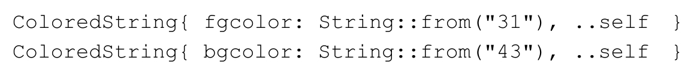{.u54020}
:::

但是Rust并没有为结构体提供类似C++或其他面向对象编程语言中的构造函数，在实现red 或 on_yellow 方法时，如何提供默认值？Rust 标准库 std：：default 模块中提供了一个叫作**Default** 的trait，可以帮助解决此问题。使用Default可以为ColoredString提供默认值，代码清单7-6展示了如何为ColoredString实现Default。

**代码清单7-6：在color.rs 中为ColoredString实现Default**

::: center
{.u54019}
:::

::: center
{.u53523}
:::

因为Default已经在**std：：prelude：：v1** 模块中被导入，所以这里就可以直接使用而不需要显式地导入Default。**Rust已经为内置的大部分类型实现了Default** ，所以在代码清单7-6中，可以使用String：：default方法来设置String类型的默认值。接下来就可以正式为ColoredString和&＇a str实现Colorize了，如代码清单7-7所示。

**代码清单7-7：在color.rs 中为ColoredString和&＇a str实现Colorize**

::: center
{.u54018}
:::

如果只需要为字符串设置前景色或背景色中的某一种颜色，那么只需要为**&＇a str** 实现Colorize，就可以满足像＂Hello＂.red（）这样的调用。但是如果希望像＂Hello＂.red（）.on_yellow（）这样通过链式调用来同时设置前景色和背景色，就需要为ColoredString也实现Colorize，因为在第一次调用之后，返回的是ColoredString类型的实例，ColoredString必须实现Colorize才能满足这样的链式调用。

代码清单7-7的第4行和第9行的更新语法中使用了..self，而代码第18行和第25行的更新语法中使用的是..ColoredString：：default（）。其中的区别很容易理解，因为第一次调用 red或on_yellow方法的是字符串，所以需要调用ColoredString的默认值来进行第一次默认填充，如果有链式调用才会轮到ColoredString类型，所以需要用self来保存第一次调用时候的设置。

另外也需要注意代码中关联常量的用法。因为是给ColoredString类型实现的Colorize，所以调用关联常量必须以类型名为前缀，即ColoredString：：FG_RED和ColoredString：：BG_YELLOW。接下来的工作就是要将原始字符串组装为 ANSI 序列，为了实现这一点，需要为ColoredString实现compute_style方法，如代码清单7-8所示。

**代码清单7-8：在color.rs 中为ColoredString实现compute_style方法**

::: center
{.u54017}
:::

代码清单7-8为ColoredString实现的compute_style方法是为了组装ANSI序列的前半部分，也就是**\\x1B\[43；31m** 。前半部分是使用前缀**\\x1B** 来定义ANSI序列的开始，后面紧跟颜色编码**43；31** ，43和31分别代表红色前景色和黄色背景色，用分号相隔。结束符**m** 代表颜色控制字符已经设置完毕。前半部分是最关键的，它设置好以后，后面就可以紧跟原始文本和ANSI的属性重置符了，后面的部分要在最终打印输出时再进行拼接。

代码清单7-8的第3行初始化了一个可变的String类型字符串res，并包含了ANSI序列的起始前缀。

代码第4行设置了一个bool类型的变量has_wrote，用于判断是否有bgcolor的设置。

代码第5行到第8行通过标准库中String类型默认提供的is_empty方法，来判断结构体中的 bgcolor 字段是否为空。如果不为空，则说明设置了背景色，将 bgcolor 字段的值通过push_str 方法拼接到 res 字符串后面，因为 push_str 的参数需要&str 类型，所以这里使用了&self.bgcolor，虽然是&String类型，但它会自动解引用为&str类型，同时，将has_wrote设置为true。

代码第9行到第12行判断fgcolor字段是否为空，如果不为空，则将fgcolor的值拼接到res字符串后面。但是在此之前，还需判断has_wrote是否为真，如果为真，则先把分号拼接到 res 字符串后。这里需要注意的是，对于 ANSI 控制符来说，前景色和背景色是由相应的代码决定的，和它们的拼接顺序并无关系。所以，这里最终的拼接结果是 **43；31** ，先判断的是背景色，然后是前景色。其实如果反过来，**31；43** 也不会影响呈现结果。

第13行和第14行分别加上结束符**m** ，并返回最终拼接好的字符串res，就得到了预期的ANSI序列。

最后，需要将最终的输出结果拼接出完整的字符串**\\x1B\[43；31mHello\\x1B\[0m** ，那就需要为coloredstring实现Display，如代码清单7-9所示。

**代码清单7-9：在color.rs 中为ColoredString实现Display**

::: center
{.u54016}
:::

::: center
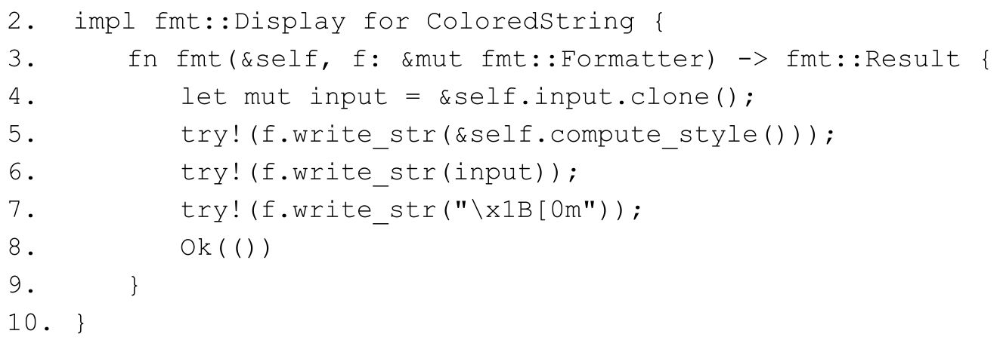{.u53597}
:::

**Display** 是定义于std：：fmt中的trait，它和Debug很相似。Debug是专门用于格式化打印的trait，通过**{：？}** 来格式化打印指定的输出，其中的**？** 代表Debug模式，在本书中已经用到过很多次了，Debug 可以通过**＃\[derive（Debug）\]** 属性来自动派生。而 Display 是通过**{}** 来格式化打印的，它比Debug适用的范围更广，更常用于手工实现而非自动派生。

代码清单7-9是一个标准的实现Display的例子，fmt方法使用&self作为第一个参数，第二个参数为fmt：：Formatter类型，是一个结构体，专门用于提供记录格式化相关的信息，比如提供了 write_str，用于将指定的数据记录到底层的缓冲区中。fmt 方法返回的 fmt：：Result类型是和Option＜T＞相似的类型，专门用于错误处理。

代码第4行声明了input变量，用来存储ColoredString结构体实例中input字段所记录的原始文本。

代码第5行到第7行使用write_str方法，依次将ANSI序列的前半部分、原始文本和ANSI序列属性重置符放入底层缓冲区中。其中用到了try！宏，它是Rust标准库提供的专门用于错误处理的宏，如果出现错误，会自动返回相应的 Err，后面错误处理的章节会介绍更多相关内容。代码第8行返回Ok（（）），表示正常结束。

然后添加main函数，如代码清单7-10所示。

**代码清单7-10：在color.rs中添加main函数**

::: center
{.u54015}
:::

代码清单7-10中添加了main函数，可以自由地调用red或on_yellow方法对字符串字面量设置ANSI控制码，使其在终端输出时显示相应的颜色。可以通过**rustc** 命令来编译color.rs文件，如下所示：

::: center
{.u54014}
:::

编译通过以后，直接执行得到的二进制文件，即可观察到最终运行结果，正如所预期的那样。通过这个简单的示例，我们可以对Rust中使用结构体和trait进行面向对象风格编程有一个整体的了解。

但是目前的代码功能有限，如果想让它支持显示更多的颜色，该如何扩展现有的代码呢？不妨考虑使用枚举体，也可称为枚举类型或枚举。

### 7.1.2 枚举体 {#text00013.html#Af43300f7-c205-4efc-bb74-d35a7cb14ac8 .title-left}

枚举体（Enum）是 Rust 中除结构体之外的另一种重要的复合类型。Rust 之父 Graydon曾经这样评价枚举体："一门不支持枚举体的语言堪比一场悲剧，想想如果没有lambda会发生什么。"Graydon把枚举体看得和lambda一样重要，可想而知枚举体的重要性。事实也确实如此，枚举体让Rust更简洁，拥有更强大的表现力。

**代数数据类型之和类型**

枚举体属于代数数据类型中的**和类型** （Sum Type）。积类型可以借助乘法原理来理解，而和类型正好可以借助加法原理来理解。**加法原理** 是指，如果做一件事有*n* 类办法，在第一类办法中有*m* ~1~ 种不同的方法，在第二类办法中有*m* ~2~ 种不同的方法，以此类推，在第*n* 类办法中有 *m* ~n~ 种不同的方法，那么完成这件事一共有 *m* ~1~ +*m* ~2~ +...+*m* ~n~ 种不同的方法。因此，如果说积类型是步步相关的话，那么和类型就是各自独立的。如果积类型表示**逻辑与** （合取），那和类型就表示**逻辑或** （析取）。

Rust中用来消除空指针的Option＜T＞类型就是一种典型的枚举体，如代码清单7-11所示。

**代码清单7-11：Option＜T＞是一种典型的枚举体**

::: center
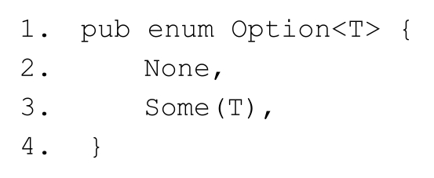{.u54013}
:::

Option＜T＞是一种典型的和类型，它代表**有** 和**无** 之和，将两种不同的类型构造为一种新的复合类型。枚举体包含了有限的枚举值，要使用它们，必须逐个枚举其中每一个值。和结构体不同的是，枚举体中的成员是值，而非类型，一般把它们叫作**变体** （**variant** ）。使用枚举体可以更方便地实现多态。

可以使用枚举体方便地表示颜色，如代码清单7-12所示。

**代码清单7-12：使用枚举体表示颜色**

::: center
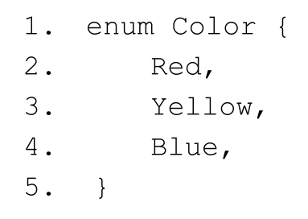{.u54012}
:::

只有对比才能体现出枚举体的方便之处，不妨考虑用面向对象语言该如何实现这种情况？代码清单7-13展示出了相关伪代码。

**代码清单7-13：面向对象语言中表示颜色的伪代码示意**

::: center
{.u54011}
:::

代码清单7-13用伪代码展示了诸如Ruby、Python、Java、C++之类的面向对象语言会如何表示颜色。首先需要定义一个Color类，也需要为具体的颜色定义相应的类，比如Red、Yellow和Blue需要各自继承Color来实现相关的方法。而在Rust中，只需要枚举体就已足够。

接下来，我们使用枚举体来重构之前 **color.rs** 中实现的代码，以便可以方便地添加新的颜色。**之前的代码主要有三处需要变动** ：

· 使用枚举体来管理颜色，而不是直接在具体的方法中使用颜色代码。

· 使用模式匹配代替if来确认结构体中的fgcolor和bgcolor的设置情况。

· 可以支持通过字符串设置颜色。

**重构color.rs代码**

代码清单7-12已经创建了枚举体Color来管理颜色，接下来要为其实现一些方法，用于将Color中的每个变体和具体的ANSI颜色码对应起来，如代码清单7-14所示。

**代码清单7-14：为Color实现相应的方法，以对应具体的ANSI颜色码**

::: center
{.u54010}
:::

代码清单7-14通过impl关键字为Color实现了两个方法，to_fg_str和to_bg_str，分别用于对应前景色和背景色的 ANSI 颜色码。注意，这里使用了 match 模式匹配，覆盖了 Color中的每一个值，这是必须的，否则Rust会编译错误。这里值得注意的地方是，代码第3行和第10行中的\*self并不会获取self的所有权。

下一步要修改结构体 ColoredString 中 fgcolor 和 bgcolor 字段的类型，如代码清单 7-15所示。

**代码清单7-15：修改ColoredString结构体中fgcolor和bgcolor的类型**

::: center
{.u54009}
:::

::: center
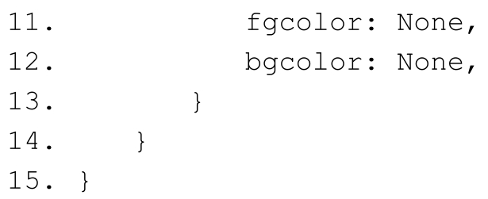{.u54008}
:::

代码清单7-15将fgcolor 和bgcolor 字段类型改为了Option＜Color＞。fgcolor和bgcolor有两种可能的值：要么有，要么无。因此，这里非常适合使用 Option＜T＞类型，就不需要再使用is_empty方法进行判断了。既然结构体变了，那么其默认值也需要进行相应的改变，因为修改为了Option＜Color＞，所以fgcolor和bgcolor的默认值完全可以统一设置为None。

接下来，需要为Color实现From，用于将&str或String类型的字符串转换为Color，这样做是为了实现通过字符串来设置颜色的需求，如代码清单7-16所示。

**代码清单7-16：为Color实现From**

::: center
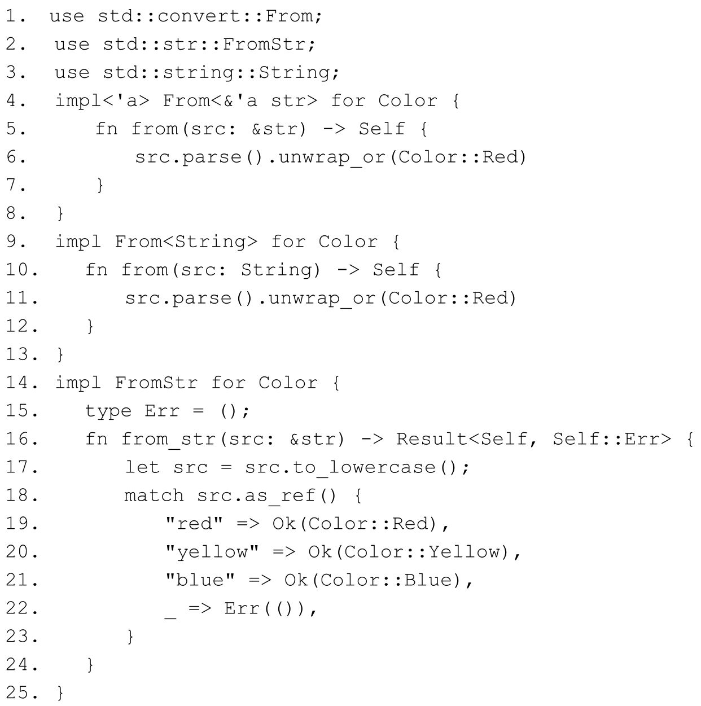{.u54007}
:::

要实现From，需要显式地导入 **std：：convert：：From** 、 **std：：str：：FromStr** 和**std：：string：：String** 。代码清单7-16的第4行到第13行为Color实现了可以从&str和String转换的from方法。其中用到了**parse** 方法，该方法要求目标类型必须实现**FromStr** ，所以代码第14行到第24行专门为Color实现了FromStr。

实现 FromStr 的 from_str 方法包含了**错误处理** 相关的代码，最终返回一个 **Result＜Self，Self：：Err＞** 类型的结果。该方法主要包含两个动作，第一个动作是使用标准库提供的to_lowercase方法将传入的字符串变为小写，第二个动作是使用match匹配可能的值，来返回相应的Color变体。注意match匹配使用了通配符来匹配可能值之外的全部情况，这里返回了Err。关于错误处理更详细的内容将在第9章介绍。

代码第6行和第11行的parse方法进行类型转换时，使用了unwrap_or方法。parse方法会返回Result类型的值，如果是Ok＜T＞类型，则会通过unwrap来获取其中的值；如果是Err＜T＞类型，则返回指定的默认值 Color：：Red。看得出来，使用枚举体可以非常干净安全地处理这种情况。

因为增加了新的颜色，下一步来修改Colorize这个trait，如代码清单7-17所示。

**代码清单7-17：修改Colorize**

::: center
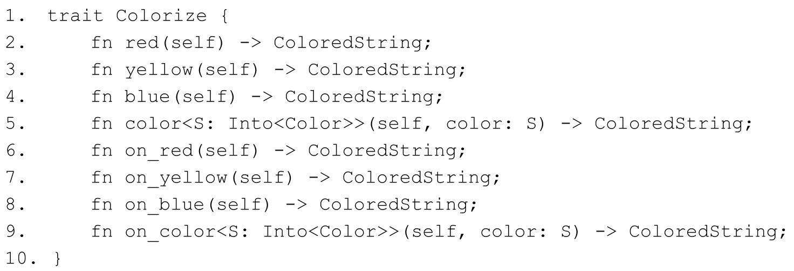{.u54006}
:::

除了添加了新的颜色设置方法，Colorize最明显的变化是第5行和第9行分别添加了color方法和on_color泛型方法。使用这两个方法就可以通过字符串来设置终端文本的颜色。

然后，ColoredString和&＇a str分别实现Colorize的代码也需要做相应的修改，如代码清单7-18所示。

**代码清单7-18：修改ColoredString和&＇a str实现Colorize的相关代码**

::: center
{.u54005}
:::

::: center
{.u54004}
:::

在代码清单 7-18 中，值得注意的是，color 和 on_color 泛型方法中使用了 trait 限定＜S：Into＜Color＞＞，这是因为Color实现了From，所以对于String和&＇a str类型的字符串均可通过into方法转换为Color。

最后一个需要修改变化的就是compute_style方法，因为ColoredString结构体中字段类型都变了，该方法中需要将if判断修改为模式匹配，如代码清单7-19所示。

**代码清单7-19：修改compute_style方法**

::: center
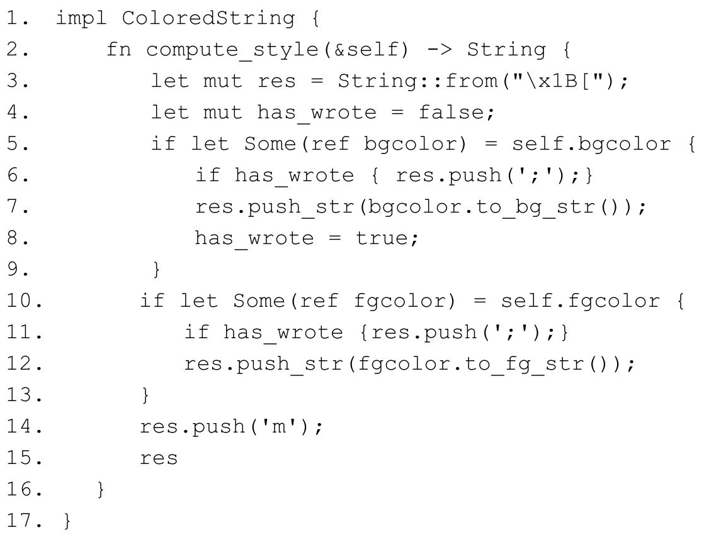{.u54003}
:::

compute_style方法的基本逻辑并未改变，只是将if改为了if let模式匹配，最终的main函数如代码清单7-20所示。

**代码清单7-20：main函数**

::: center
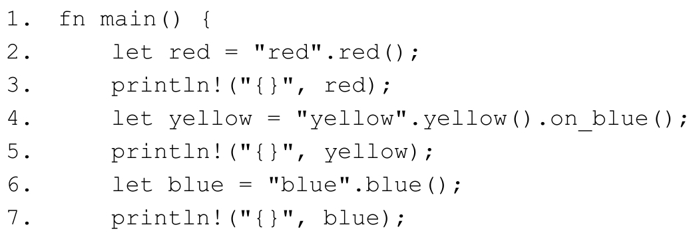{.u54002}
:::

::: center
{.u53910}
:::

现在可以使用新添加的方法来设置相应的颜色了，并且可以使用color和on_color 方法通过字符串来指定颜色。编译并运行重构后的color.rs，将成功输出预期的结果。

通过对color.rs进行重构，我们可以更深刻地体会到枚举体的方便和强大之处。枚举体、结构体和trait相互结合，完全可以进行面向对象风格的编程，甚至可以比一些面向对象语言更简洁更优雅。更重要的一点是，Rust是零成本抽象的。

### 7.1.3 析构顺序 {#text00013.html#A40a100fc-2485-4392-aa42-6cc046dbd2e7 .title-left}

通过第4章的学习，我们已经知道了结构体和枚举体的内存布局，但是结构体中的字段是如何析构的呢？Rust中变量的析构顺序是和其声明顺序相反的，但并非所有的类型都按这个顺序来析构。接下来我们用一些实验示例来说明其中的规律。

首先使用Newtype模式来创建一个元组结构体，让其实现Drop，如代码清单7-21所示。

**代码清单7-21：定义元组结构体并为其实现Drop**

::: center
{.u54001}
:::

代码清单7-21中定义的结构体主要用于测试析构顺序。这里使用了Newtype模式来创建结构体，实际上是用元组结构体包装了某个类型，从而相当于创造了一个新类型。Newtype模式在Rust中很常见。

这样创建的新类型和原始的类型是完全不同的，以下几种情况适合使用Newtype模式：

· **隐藏实际类型，限制功能** 。使用Newtype模式包装的类型并不能被外界访问，除非提供相应方法。

· **明确语义** 。比如可以将f64类型包装为Miles（f64）和Kilometers（f64），分别代表英里和千米。这样的语义提升是零成本的，没有多余的性能开销。

· **使复制语义的类型具有移动语义** 。比如 f64 本来是复制语义，而包装为 Miles（f64）之后，因为结构体本身不能被自动实现Copy，所以Miles（f64）就成了移动语义。

代码清单7-21使用Newtype模式只是为了提升语义，增强可读性，方便后面示例代码的展示。

**本地变量**

本地变量遵循先声明后析构的规则，实际上这也缘于栈结构先进后出的特性，本地变量的析构如代码清单7-22所示。

**代码清单7-22：本地变量的析构**

::: center
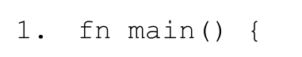{.u54000}
:::

::: center
{.u53999}
:::

代码清单7-22的输出结果如代码清单7-23所示。

**代码清单7-23：代码清单7-22的输出结果**

::: center
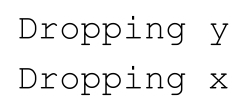{.u53998}
:::

看得出来，先声明了 x，但是先析构的是 y。因此，改变放置顺序有可能会导致悬垂指针。同样道理，在编写Rust代码时，你会发现有时只要修改一下变量声明的顺序，本来无法编译的代码就可以正常编译通过了。

**元组**

元组的析构如代码清单7-24所示。

**代码清单7-24：元组的析构**

::: center
{.u53997}
:::

代码清单7-24编译执行的结果如代码清单7-25所示。

**代码清单7-25：代码清单7-24的输出结果**

::: center
{.u53996}
:::

看得出来，元组整体的析构顺序和局部变量的析构顺序一致，但是元组内部元素的析构顺序则和局部变量的析构顺序相反，元组内部是按元素的出现顺序依次进行析构的。

现在把元组tup2 中最后一个元素修改为一个特殊的元素 panic！（），看看会发生什么，如代码清单7-26所示。

**代码清单7-26：将tup2中的最后一个元素修改为panic！（）**

::: center
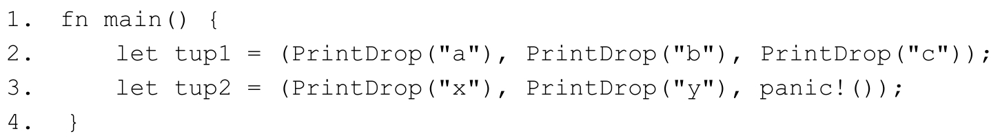{.u53995}
:::

宏panic！（）会引起main线程崩溃，但是析构函数还是会输出如代码清单7-27所示的结果。

**代码清单7-27：代码清单7-26的输出结果**

::: center
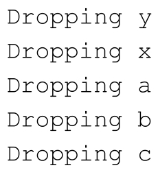{.u53994}
:::

看得出来，tup2中元素的析构顺序改变了，和代码清单7-24中的析构顺序正好相反。可以理解为，线程的崩溃触发了 tup2 的提前析构，此时 tup2 其实并不算一个完整的元组，这种提前析构的顺序正好和局部变量的析构顺序一致：先声明的元素后析构。

**结构体和枚举体**

结构体和枚举体与元组的析构顺序是一致的，如代码清单7-28所示。

**代码清单7-28：结构体和枚举体的析构顺序**

::: center
{.u53993}
:::

代码清单7-28编译的结果如代码清单7-29所示。

**代码清单7-29：代码清单7-28输出结果**

::: center
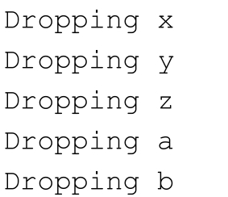{.u53992}
:::

看得出来，结构体实例f先析构，枚举值e最后析构。但是其内部元素的析构顺序是按排列顺序来析构的。同样，结构体字段如果指定了panic！（）为值，那么在相同的情况下，其析构顺序也会变得和元组的一致。

同理，Slice类型的集合类型的析构顺序，与元组、结构体和枚举体的析构行为一致。

**闭包捕获变量**

闭包的捕获变量的析构顺序和结构体的析构顺序也是一致的，如代码清单7-30所示。

**代码清单7-30：闭包捕获变量的析构顺序**

::: center
{.u53991}
:::

代码清单7-30的运行结果如代码清单7-31所示。

**代码清单7-31：代码清单7-30的输出结果**

::: center
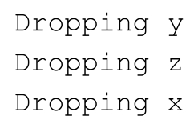{.u53990}
:::

看得出来，闭包捕获变量的析构顺序和闭包内该变量的排列顺序一致，与捕获变量声明的顺序是没有关系的，这里要和普通函数内局部变量相区分。但闭包和元组、结构体类似，也存在析构顺序变化的情况，如代码清单7-32所示。

**代码清单7-32：闭包捕获变量析构顺序变化的特殊情况**

::: center
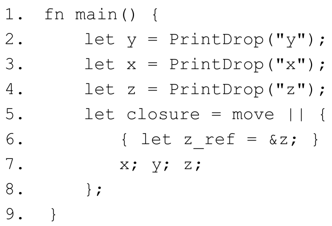{.u53989}
:::

代码清单7-32中的闭包使用了一个内部作用域来引用变量z，这次编译的结果如代码清单7-33所示。

**代码清单7-33：代码清单7-32的输出结果**

::: center
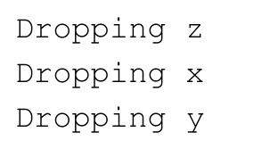{.u53988}
:::

这次的析构顺序和代码清单7-30中的不一致，这是因为z在move到闭包之前先被借用了，所以需要等待其离开作用域归还所有权之后，才能被 move 到闭包中。因此，变量被捕获的顺序就变成了z → x → y，然后按此顺序再进行析构。

## 7.2 常用设计模式 {#text00013.html#Ad14900ff-97bd-4618-a403-b7002ef27a85 .title-left}

有了trait、结构体和枚举体这三驾马车，我们就可以自由地编写容易扩展的Rust代码了。它们简单、灵活和方便，也正因为如此，才更需要使用设计模式来帮助我们设计出更灵活、更简洁、更易扩展和更好维护的系统。

自GoF四人组提出23种设计模式的概念至今已经超过20年了，虽然设计模式最初是基于面向对象语言提出的，但是经过这 20 多年的发展，设计模式已经超越了面向对象语言的范畴。设计模式所阐述的思想被广泛应用于各种语言及其工程项目中。设计模式的思想一共涵盖了下面4点：

· 针对接口编程。

· 组合优于继承。

· 分离变和不变。

· 委托代替继承。

可以说，Rust语言本身的设计就非常符合这4点思想。trait可以强制性地实现针对接口编程；泛型和trait限定可替代继承实现多态，基于代数数据类型的结构体或枚举体在没有继承的情况下也一样可以更自由地构造各种类型；类型系统天生分离了变与不变；常用的迭代器就是利用委托来代替继承的。

Rust是一门已经实现自举的语言，其内部实现也用到了很多设计模式。比如第6章学到的迭代器就包含了委托模式和迭代器模式的思想。在Rust的其他诸多项目中也大量使用了设计模式。接下来会依次介绍Rust编程中常用的另外几个设计模式。

### 7.2.1 建造者模式 {#text00013.html#A72560100-6b43-4480-acc2-c067894b25e0 .title-left}

Rust这门语言没有提供构造函数，这主要是出于对类型安全的考量。我们以一个结构体为例来说明，如果要构造结构体的实例，有时候需要一些默认值，像Java这种语言会提供默认的构造函数，并可以将值初始化为0，而对于C++来说，就有可能引起未定义行为，这属于类型不安全的问题。Rust并没有类似Java那样的默认机制，所以Rust没有提供构造函数，而是可以像函数式语言那样直接绑定值来构造类型实例。所以，就需要一些设计模式来辅助完成复杂类型实例的构造工作，而建造者模式比较适合这种应用场景，这也是Rust中大量使用这种模式的原因。

**建造者模式** （**Builder Pattern** ）是Rust中最常用的设计模式之一。建造者模式是指使用多个简单的对象一步步构建一个复杂对象的模式。该模式的主要思想就是将变和不变分离。对于一个复杂的对象，肯定会有不变的部分，也有变化的部分，将它们分离开，然后依次构建，如代码清单7-34所示。

**代码清单7-34：建造者模式示例**

::: center
{.u53987}
:::

::: center
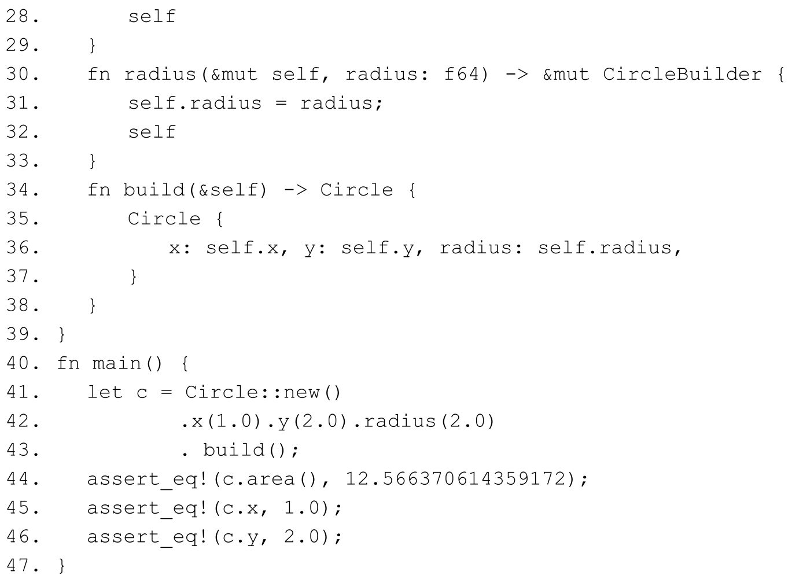{.u53986}
:::

代码清单7-34是一个典型的建造者模式，整段代码的功能是可以自由地通过指定的方法创建一个圆，并可访问其面积和坐标。

代码第1行到第5行定义了结构体Circle，包含x、y和radius三个字段，分别代表横纵坐标和半径。

代码第6行到第10行定义了结构体CircleBuilder，包含的字段和Circle结构体的一样。这里实际上还是利用了委托的思想，Circle委托了CircleBuilder来帮助构建其实例。

代码第11行到第20行为结构体实现了求面积的area和new方法。area方法中用到的std：：f64：：consts：：PI是由标准库提供的数学常量圆周率（π）。而new方法返回的是CircleBuilder实例。

代码第21行到第39行为CircleBuilder实现了一系列方法。首先是x、y和radius方法，分别用于修改CircleBuilder实例中相关字段的值，并在修改完之后返回自身的可变借用。最后是build方法，它根据CircleBuilder的实例构建最终的Circle实例并将其返回。

经过这样精心的构造，就可以在 main 函数中使用 **Circle：：new（）.x（1.0）.y（2.0）.radius （2.0）.build（）** 这样优雅的链式调用来创建Circle的实例了。

在Rust标准库中有一个用于创建进程的结构体std：：process：：Command，它使用了创建者模式，代码清单7-35展示了其用法。

**代码清单7-35：std：：process：：Command使用示例**

::: center
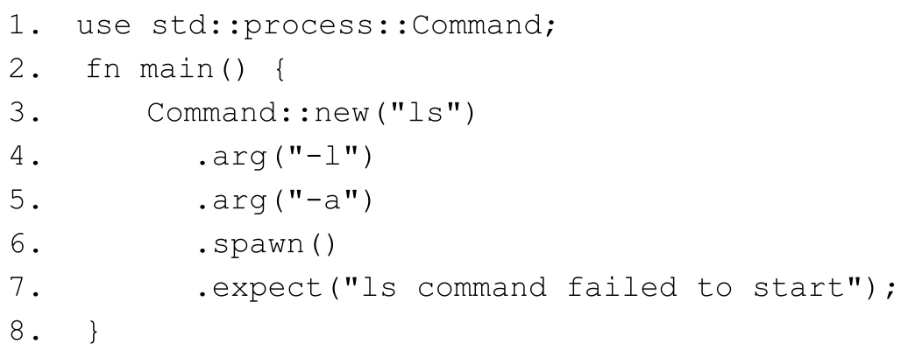{.u53985}
:::

看得出来，代码清单7-35中的Commad使用示例和代码清单7-34中创建的Circle实例的用法非常相似。

### 7.2.2 访问者模式 {#text00013.html#A69950102-38cc-4009-a282-01c4f4185f5c .title-left}

Rust中另一个重要的模式是**访问者模式** （**Visitor Pattern** ）。访问者模式用于将数据结构和作用于结构上的操作解耦。Rust语言自身在解析抽象语法树时就用到了访问者模式。

**Rust编译器源码中的访问者模式**

Rust解析抽象语法树如代码清单7-36所示。

**代码清单7-36：Rust解析抽象语法树示意**

::: center
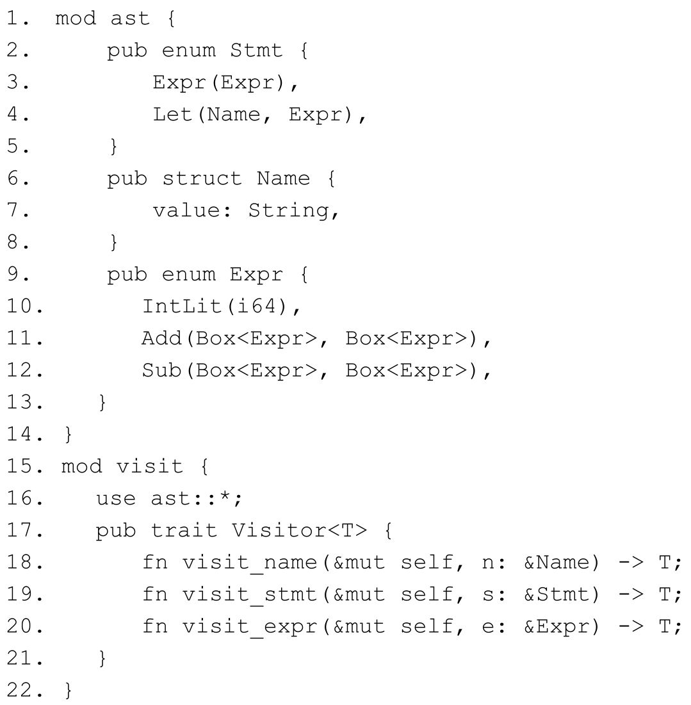{.u53984}
:::

代码清单7-36只是展示了部分相关代码。这段代码是用于构建**抽象语法树的** ，Rust语法中包含语句、标识符名称和表达式，分别被定义于**ast** 模块中的Stmt、Name和Expr来表示。关键字mod用于定义一个模块，在第10章会介绍更多关于模块的内容。

这些包含在 ast 模块中的类型虽然各不相同，但是它们整体是在描述同一个抽象语法树结构的。因此，整个抽象语法树就是一个异构的结构，其中的每个语法节点都是不同的类型，对于这些节点的操作也各不相同。语法节点是基本确定好的，变化不会太大，但是对节点的操作需要经常改动，比如Rust现在正处于发展期，会定时添加一些新特性。使用访问者模式将不变的节点和变化的操作分离开，可以方便后续扩展。所以，**访问者模式一般包含两个层次** ：

· 定义需要操作的元素。

· 定义相关的操作。

对于代码清单 7-36 来说，ast 模块定义了抽象语法树中的全部节点相关的数据结构，而visit模块中的Visitor trait则定义了相关的操作。所以在解析语法树的时候，只需要为解析器实现相关的visit方法即可操作相关节点，如代码清单7-37所示。

**代码清单7-37：为解析器实现Visitor**

::: center
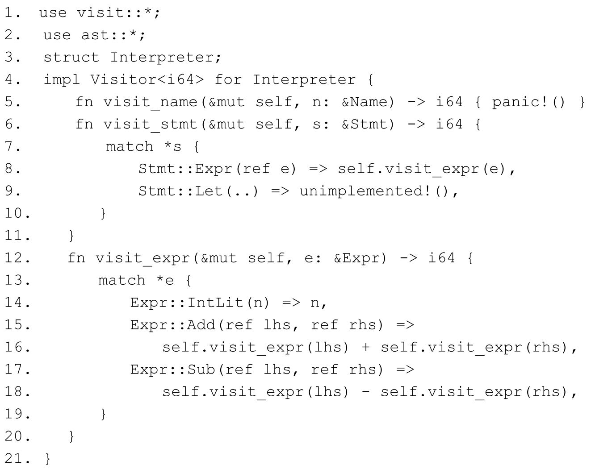{.u53983}
:::

代码清单7-37为解析器Interpreter实现了Visitor，对不同的语法树节点有不同的操作方法。访问者模式优雅地把节点数据结构与其解析操作分离开了，为后续自由灵活地解析语法节点提供了方便。

**Serde库中的访问者模式**

访问者模式的另一个经典的应用场景是第三方库**Serde** ，它是一个对Rust数据结构进行序列化和反序列化的高效框架。Serde 的命名就是分别从 **Serialize** （**序列化** ）和 **Deserialize** （**反序列化** ）两个单词中拿出**Ser** 和**De** 两部分组合而成的。Serde之所以称为框架，是因为其定义了统一的数据模型，并通过访问者模式开放了序列化和反序列化的操作接口。Serde目前已经支持了很多数据格式，包括JSON、XML、BinCode、YAML、MessagePack、TOML等。

Serde中序列化和反序列化都使用了访问者模式，这里只以反序列化为例说明。Serde中自定义了一些类型来对应 Rust 中可能出现的所有数据类型，包括基本的原生类型、String、option、unit、seq、tuple、tuple_struct、map、struct等。比如，option代表Option＜T＞类型，tuple_struct代表元组结构体，seq代表线性序列（像Vec＜T＞之类的集合），而map则代表k-v结构的容器（比如HashMap＜k，v＞）。这些异构的类型构成了Serde框架的统一的数据模型。

接下来，Serde提供了三个trait，如代码清单7-38所示。

**代码清单7-38：Serde中的trait示意**

::: center
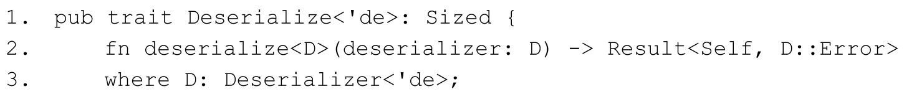{.u53982}
:::

::: center
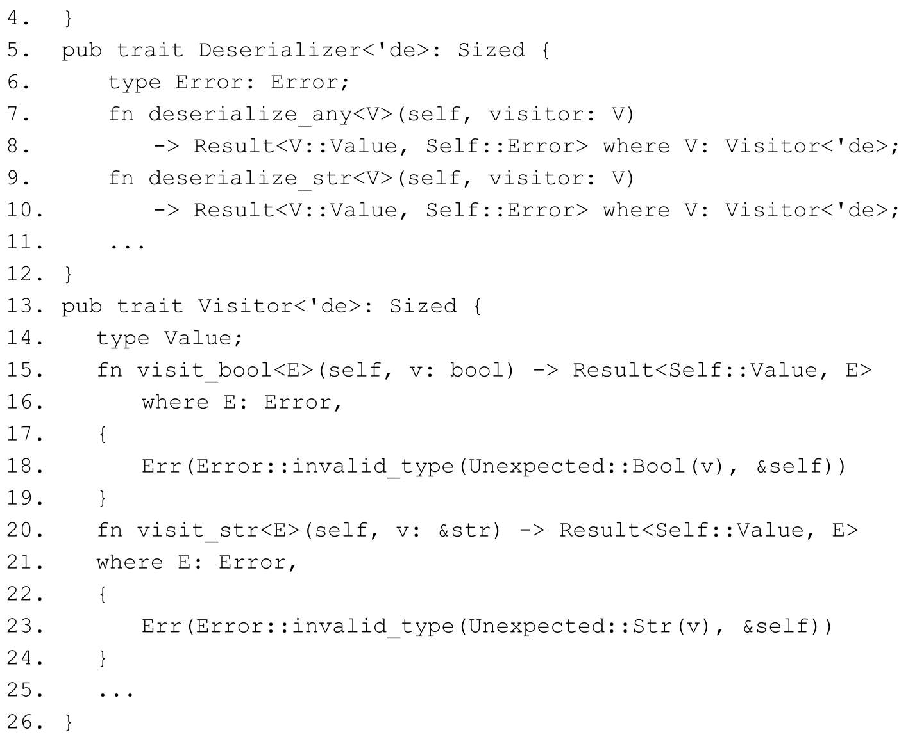{.u53981}
:::

代码清单7-38中展示了部分反序列化相关的trait。通过Deserializer和Visitor两个trait定义了反序列化开放的操作接口。这就是 Serde 框架利用访问者模式所定义的主要内容：**统一的数据模型和开放的操作接口** 。然后再针对不同的数据格式实现不同的访问者操作方法。

下面以JSON 格式数据反序列化为例来说明。第三方库serde_json是基于Serde实现的JSON解析库，该库将JSON格式中出现的数据类型统一定义为一个Value枚举体，如代码清单7-39所示。

**代码清单7-39：serde_json库中定义Value枚举体示意**

::: center
{.u53980}
:::

代码清单7-39中定义的Value包含了6种枚举值，基本上涵盖了JSON数据格式中所出现的所有数据类型。所谓反序列化，就是将JSON格式的字符串解析为Rust数据类型。接下来，serde_json实现了Serde框架开放的trait接口：Deserialize、Vistitor和Deserializer，代码清单7-40展示了其中的Visitor和Deserializer的实现。

**代码清单7-40：serde_json实现Visitor和Deserializer代码示意**

::: center
{.u53979}
:::

::: center
{.u53978}
:::

由于篇幅限制，代码清单7-40只展示了部分源码。看得出来serde_json实现了Deserialize，其中定义的 deserialize 方法正是最终用于反序列化的方法。在 deserialize 方法中定义了结构体ValueVisitor，并为其实现了Visitor，这是一种委托模式。

serde_json也为Value实现了serde：：Deserializer，其中deserialize_any方法是专门用于自定义类型反序列化的，比如Value类型。通过一个match匹配枚举体Value中定义的6种类型，分别调用了相应的visit_xxx系列方法。

以上就是 Serde 框架中对访问者模式的应用说明，看得出来，访问者模式将数据结构和操作分离开，为代码的扩展提供了极大的便利。读者也可以查看本书配套源码中包含的另一个自定义访问者模式案例。

### 7.2.3 RAII模式 {#text00013.html#Ac55a0105-6270-4004-b7ce-0eb00ff6ba6a .title-left}

Rust 的一大特色就是利用 RAII 进行资源管理，让我们能够编写更安全的代码。接下来以一个示例来说明RAII模式，如代码清单7-41所示。

**代码清单7-41：RAII模式示例**

::: center
{.u53977}
:::

::: center
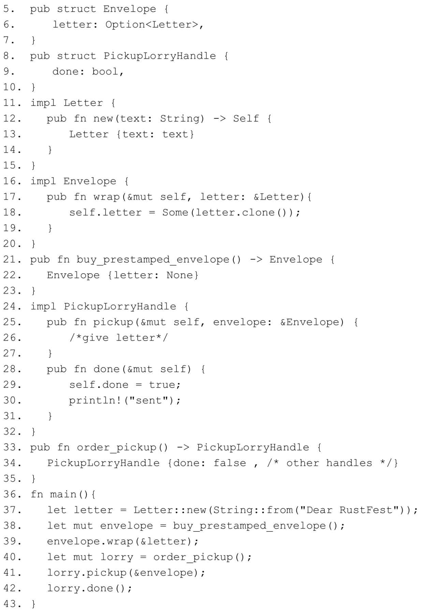{.u53976}
:::

代码清单7-41展示的是一个送信的逻辑。代码第1行到第4行定义了结构体Letter，代表信件。代码第5行到第7行定义了结构体Envelope，代表信封，其中字段为Option＜Letter＞类型，代表信封里有信或无信两种状态。代码第 8 行到第 10 行定义了结构体PickupLorryHandle，表示信件被装车送走，包含 bool 类型字段，done 表示其状态。代码第11行到第20行分别为Letter和Envelope实现了new（写信）和wrap（装信）两个方法。

第21行到第23行定义了函数buy_prestamped_envelope，其返回一个letter被设置为None的Envelope实例，表示购买带邮戳的空信封。

第24行到第32行为PickupLorryHandle实现pickup（装车）和done（寄送）两个方法。第33行到第35行实现了order_pickup函数，表示将信封下单装车准备寄送。

整个逻辑过程如图7-3所示。

::: center
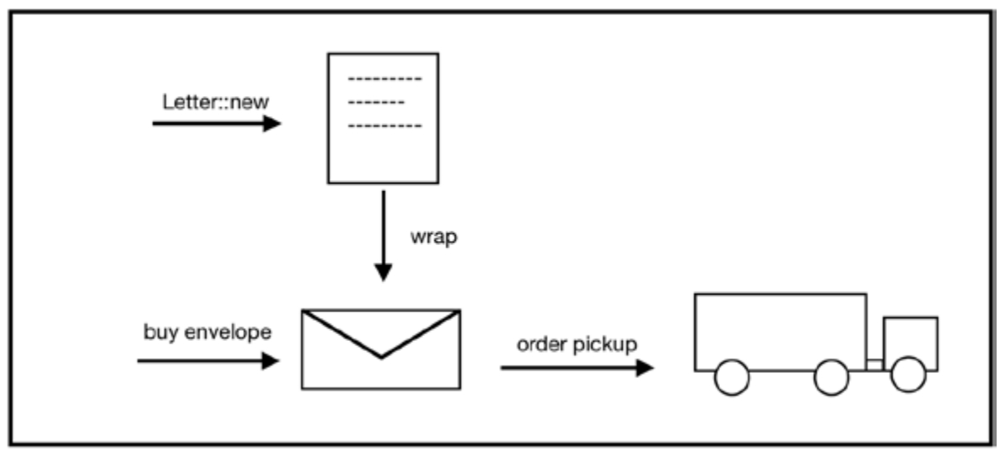{.u53975}

图7-3：代码清单7-41逻辑示意图
:::

最后，main函数如代码清单7-42所示。

**代码清单7-42：相关main函数**

::: center
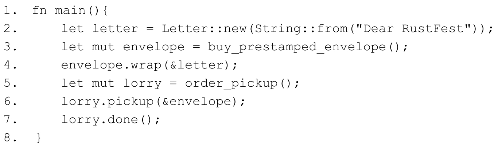{.u53974}
:::

初看整段代码，好像没有什么逻辑问题，但是仔细思考，还是**存在以下问题** ：

· Letter有可能被复制多份并被装到多个信封（envelope）里，不安全。

· 信封里可能有信，也可能没有信；或者同一个信封可能装多封不同的信件，不安全。

· 无法保证一定把信交给邮车了，不安全。

为了修正这三个问题，可以使用 RAII 模式来重构代码清单 7-41。重构后的代码如代码清单7-43所示。

**代码清单7-43：利用RAII模式重构代码清单7-41**

::: center
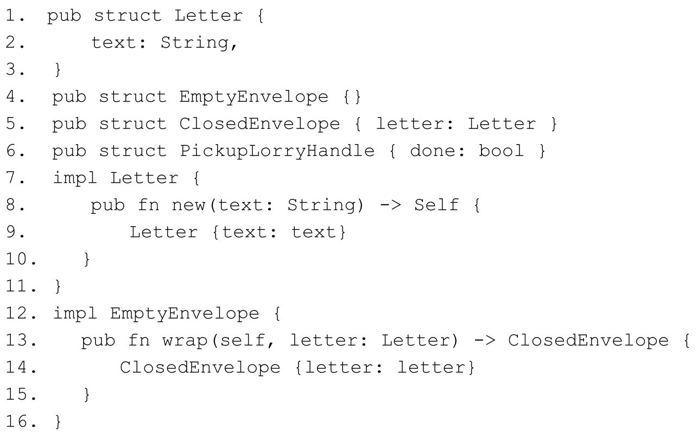{.u53973}
:::

::: center
{.u53972}
:::

代码清单 7-43 中为了解决前两个问题，将 Envelope 结构体变为了 EmptyEnvelope 和ClosedEnvelope 两个结构体，分别代表空信封和已装好信件的信封。并且为 EmptyEnvelope实现了wrap方法，确保信件被放到空信封中。将letter用于实例化ClosedEnvelope，并且转移了 letter 所有权，保证信件只封装一次。在 buy_prestamped_envelope 方法中使用EmptyEnvelope，确保购买的是空信封。

PickupLorryHandle实现的pickup方法中的第二个参数envelope被设置为ClosedEnvelope类型，确保装车的信件不是空信封。最重要的一步是，为PickupLorryHandle实现了Drop，使用drop方法替代了原来的done方法。

代码清单7-44展示了main函数的变化：

**代码清单7-44：重构main函数**

::: center
{.u53971}
:::

代码清单7-44运行之后，会输出sent，这证明PickupLorryHandle的实例lorry在main函数结束之后运行了drop方法，这正是RAII的体现，不仅释放了资源，也在逻辑上保证了信件已经安全送出。

所以，所谓RAII模式，并非经典的GoF中的模式，它实际上就是利用Rust的RAII机制来确保逻辑安全性的一种模式。这种模式在某些场景中非常适用，比如处理HTTP请求的场景。它也是Rust官方团队推荐使用的模式。

## 7.3 小结 {#text00013.html#A73540109-cb15-47fc-8675-c4565c21c51a .title-left}

本章从结构体和枚举体的角度详细介绍了Rust语言如何结构化编程。Rust属于混合范式语言，利用 trait、结构体和枚举体可以完全支持面向对象风格的编程。但是需要注意的是，Rust基于代数数据类型统一了结构体和枚举体，当进行面向对象风格的编程时，不要以传统面向对象语言的思路去写程序，而应该遵循Rust语言自身的特性。

Rust语言的哲学是组合优于继承，结构体和枚举体就像真实建筑中用到的榫卯，可以自由组合出想要的结构。在日常的编程中，使用设计模式可以更好地复用代码，写出易扩展、易维护的程序。本章介绍了三种常用的设计模式：创建者模式、访问者模式和 RAII 模式，这三种模式在Rust内部及第三方库中都被大量应用。除了这三种模式，还有其他的设计模式，比如观察者模式、策略模式等，这些留给读者自己去学习和探索。

但是要注意，直接将面向对象设计中的设计模式应用在Rust中是不妥的，应该结合Rust语言的特点来用。一个经典的案例就是，在RustConf 2018大会的闭幕演讲 ^[\[1\]](#text00013.html#nAD7E01090FD5402EB080F40793802008){#text00013.html#nAD7E01090FD5402EB080F40793802008s}^ 中，演讲者提到了一种面向数据（Data-Oriented）的设计，它比面向对象设计更加适合游戏开发。演讲中提到了使用Rust进行面向数据设计来实现ECS架构的游戏引擎，同时提出了三种模式：分代索引（Generational Index）模式、动态类型（AnyMap）模式、注册表（Register）模式，读者可以自行查看。

------------------------------------------------------------------------

[\[1\]](#text00013.html#nAD7E01090FD5402EB080F40793802008s){#text00013.html#nAD7E01090FD5402EB080F40793802008} RustConf 2018闭幕演讲中文梳理稿参见https：//zhuanlan.zhihu.com/p/44657202。

[]{#text00014.html}

# 第8章 字符串与集合类型 {#text00014.html#A4671ae18-d9e0-472e-98db-b97ae38af114 .title-left}

阵而后战，兵法之常，运用之妙，存乎一心。

曾经有一个人因为说了一句话而获得图灵奖，这个人就是 Pascal 语言之父尼古拉斯（Nicklaus Wirth），他说的那句话是：程序等于数据结构加算法。因为一句话而获得图灵奖，这当然是开玩笑，得奖完全得益于他创造的Pascal语言所做出的贡献，他也写了一本以那句话为书名的计算机专著。但这足以说明了数据结构的重要性。

数据结构是计算机存储和组织数据的方式。对于不同的场景，精心选择的数据结构可以带来更高的运行效率或存储效率。通常，通过确定数据结构来选择相应的算法，也可能通过算法来选择数据结构，不管是哪种情况，选择合适的数据结构都相当重要。

程序中最常用的三大数据结构是字符串、数组和映射。字符串是特殊的线性表，是由零个或多个字符组成的有限序列。但字符串和数组、映射的区别在于，字符串是被作为一个整体来关注和使用的；而数组和映射关注最多的是其中的元素及它们之间的关系。所以，数组和映射也被称为集合类型。Rust作为一门现代高级语言，也自然为这三大数据结构提供了丰富的操作支持。

## 8.1 字符串 {#text00014.html#A062a010a-f8bc-49de-87a5-e70f1d974dce .title-left}

在编程中字符串具有非常重要的地位。当你在看互联网上的某篇博客，或者去电商网站购物时，所看到的商品名称或价格等信息都是用字符串来表示的。众所周知，计算机底层只存储0和1这两个数字，如果想让计算机处理各种字符串，就必须建立字符和特定数字的一一映射关系。比如，想让计算机存储字符 **A** ，则存储二进制数 **0100_0001** ，在读取的时候，再将**0100_0001** 显示为字符A，这样就将字符**A** 和**0100_0001** 建立了一一映射关系。这种方案，就叫作**字符编码（Character Encoding）** 。

### 8.1.1 字符编码 {#text00014.html#Aad49010a-2a20-47c8-95e2-67353bbc2406 .title-left}

最早的字符编码就是常见的ASCII编码。因为计算机起源于美国，美国是以英语为母语的国家，所以ASCII码表中只记录了英文字母大小写和一些常用的基本符号，并使用0～127的数字来表示它们。最大数字127的二进制数是1111111，所以用1字节（8比特位）足以表示全部ASCII编码。

随着计算机的普及，只有英文字母的ASCII码表已不能满足世界各地人们的需求。因此出现了很多编码标准，比如GB2312就是我国基于ASCII编码进行中文扩充以后产生的，可以表示6000多个汉字。慢慢地，GB2312也无法满足需求了，于是又出现了GBK编码，它除包括GB2312中的汉字之外，又扩充了近2万个汉字。再后来，为了兼容少数民族的语言，又扩充成GB18030编码。而与此同时，日本、韩国等其他国家也都分别创造了属于自己语言的字符编码标准。这样带来的后果就是，如果想同时显示多个国家的文字，就必须在计算机中安装多套字符编码系统，这就带来了诸多不便。

为了解决这个问题，国际标准化组织制定了通用的多字节编码字符集，也就是 Unicode字符集。Unicode 字符集相当于一张表，其中包含了世界上所有语言中可能出现的字符，每个字符对应一个非负整数，该数字称为**码点（Code Point）** 。这些码点也分为不同的类型，包括**标量值（Scala Value）** 、代理对码点、非字符码点、保留码点和私有码点。其中标量值最常用，它是指实际存在对应字符的码位，其范围是0x0000～0xD7FF 和 0xE000～0x10FFFF两段。Unicode 字符集只规定了字符所对应的码点，却没有指定如何存储。如果直接存储码位，则太耗费空间了，因为Unicode字符集的每个字符都占4字节，传输效率非常低。虽然Unicode字符集解决了字符通用的问题，但是必须寻求另外一种存储方式，在保证Unicode字符集通用的情况下更加节约流量和硬盘空间。这种存储方式就是**码元（Code Unit）** 组成的序列，如图8-1所示。

::: center
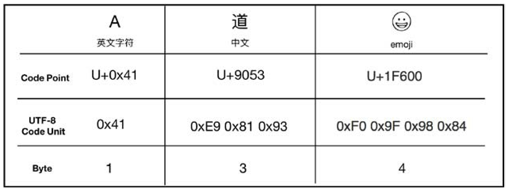{.u53970}

图8-1：码位和码元对应关系示意图
:::

码元是指用于处理和交换编码文本的最小比特组合。比如计算机处理字符的最小单位 1字节就是一个码元。通过将Unicode标量值和码元序列建立一一映射关系，就构成了编码表。在Unicode中一共有三种这样的字符编码表：UTF-8、UTF-16和UTF-32，它们正好对应了1字节、2字节和4字节的码元。对于UTF-16和UTF-32来说，因为它们的码元分别是2字节和4字节，所以就得考虑字节序问题；而对于UTF-8来说，一个码元只有1字节，所以不存在字节序问题，可以直接存储。

UTF-8是以1字节为编码单位的可变长编码，它根据一定的规则将码位编码为1～4字节，如图8-2所示。

::: center
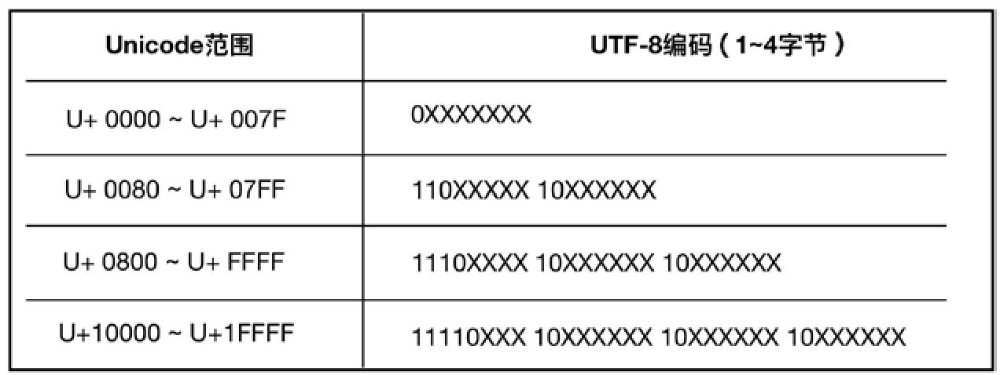{.u53969}

图8-2：UTF-8编码规则示意图
:::

UTF-8编码规则大致如下：

· 当一个字符在ASCII码的范围（兼容ASCII码）内时，就用1字节表示，因为ASCII码中的字符最多使用7个比特位，所以前面需要补0。

· 当一个字符占用了*n* 字节时，第一字节的前*n* 位设置为1，第*n* +1位设置为0，后面字节的前两位设置为10。

拿图 8-1 中展示的汉字"道"来说，它的码位是 U+9053，相应的二进制表示为1001_0000_0101_0011，按上述 UTF-8 编码规则进行编码，则变为字节序列1110_1001_10_000001_10_010011，用十六进制表示的话，就是0xE90x810x93。

像这种将 Unicode 码位转换为字节序列的过程，就叫作**编码（Encode）** ；反过来，将编码字节序列转变为字符集中码位的过程，就叫作**解码（Decode）** 。

UTF-8编码的好处就是在实际传输过程中其占据的长度不是固定的，在保证Unicode通用性的情况下避免了流量和空间的浪费，而且还保证了在传输过程中不会错判字符。想一想，如果只是按Unicode码位存储，则在传输过程中是按固定的字节长度来识别字符的，如果在传输过程中出现问题，就会发生错判字符的可能。正是因为这些优点，UTF-8才能被广泛应用于互联网中。

整个过程如图8-3所示。

::: center
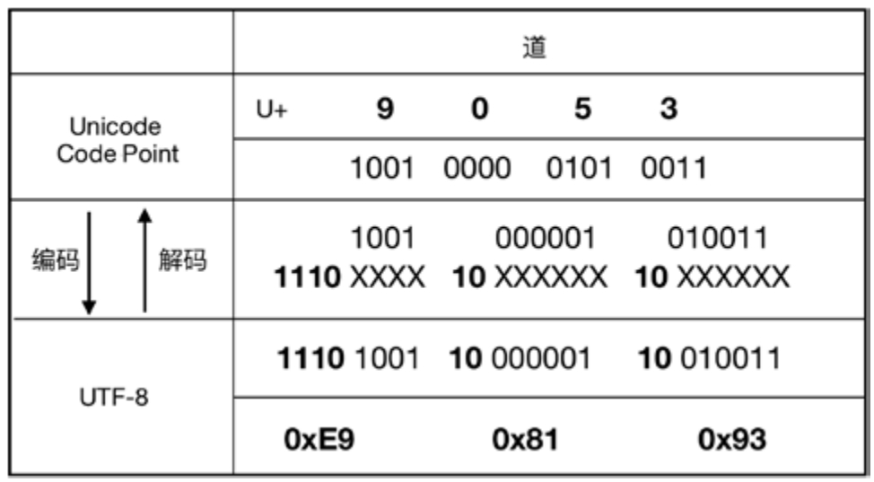{.u53968}

图8-3：UTF-8编码和解码过程示意图
:::

图8-3展示了从Unicode码位编码到UTF-8的过程。也可以从代码中得到印证，如代码清单8-1所示。

**代码清单8-1：字符串编码示例**

::: center
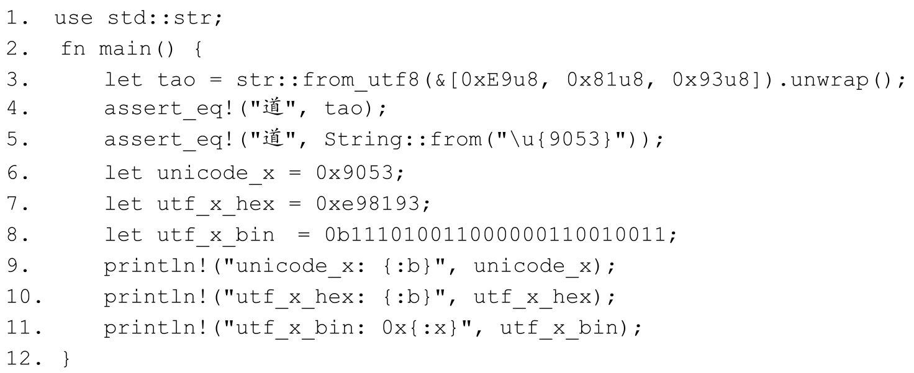{.u53967}
:::

在代码清单8-1中，使用str模块提供的from_utf8方法并为其传递一个UTF-8字节序列**&\[0xE9u8，0x81u8，0x93u8\]** 作为参数，将其转换为字符串＂道＂。在Rust中，使用**u8** 来表示字节类型，如果此处没有加u8后缀，Rust也会通过from_utf8的函数签名推导出此数组参数为u8类型数组。也可以通过String：：from（＂\\u{9053}＂）方法将一个十六进制形式的Unicode码位转换为字符串＂道＂。

代码第6～8行，分别使用0x和0b前缀声明了十六进制和二进制形式的变量，它们实际上是字符串＂道＂的十六进制形式的码位，以及UTF-8编码之后的十六进制和二进制表示。通过println！输出语句可以将它们转换为对应的二进制和十六进制形式的结果，与图8-3所示一致。

### 8.1.2 字符 {#text00014.html#Aae21010d-9b31-4097-ac12-94585d0c8c90 .title-left}

Rust使用char类型表示单个字符。char类型使用整数值与Unicode标量值一一对应，如代码清单8-2所示。

**代码清单8-2：字符与标量值一一对应**

::: center
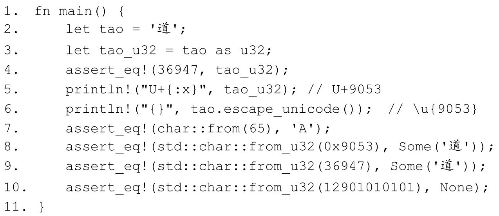{.u53966}
:::

在代码清单8-2中，声明了字符＇道＇。注意，这里使用单引号来定义字符，使用双引号定义的是字符串字面量。在Rust中每个char类型的字符都代表一个有效的u32类型的整数，但不是每个 u32 类型的整数都能代表一个有效的字符，因为并不是每个整数都属于 Unicode标量值，如代码第10行中的数字，将会返回None。

代码第3行，通过as将char类型转换为u32类型，那么字符tao对应的u32整数值是36947。通过代码第5行的println！语句打印其十六进制形式的值为U+9053，正是汉字"道"对应的Unicode标量值。通过char类型内建的escape_unicode方法也可以得到其Unicode标量值。

为了能够存储任何Unicode标量值，Rust规定每个字符都占4字节，如代码清单8-3所示。

**代码清单8-3：将字符转换为字符串要注意字节长度**

::: center
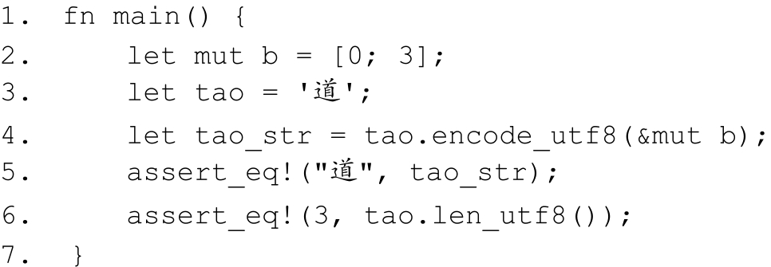{.u53965}
:::

在代码清单8-3中定义了一个可变数组b，将其作为参数传入字符内建的encode_utf8方法，将字符转换为一个字符串字面量。这里值得注意的是，如果将数组b的长度改为1或2，则无法将tao转换为字符串，因为字符＇道＇的UTF-8编码占3字节。所以，如果要转换为合法的字符串，则数组b的长度最少为3。通过代码第6行的字符内建的len_utf8方法，也可以获得字符tao按UTF-8编码的字节长度。

需要注意的是，只有包含单个Unicode标量值（实际码位）的才能被声明为字符，如代码清单8-4所示。

**代码清单8-4：包含两个码位的字符示例**

::: center
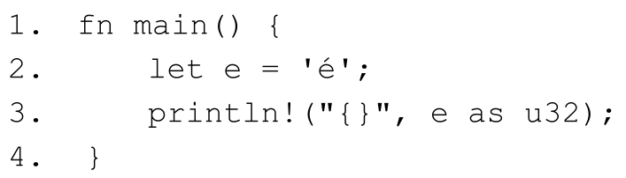{.u53964}
:::

编译代码清单8-4，会出现如下错误：

::: center
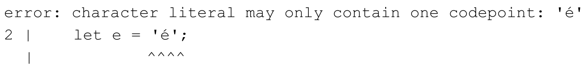{.u53963}
:::

错误提示说明，字符e所代表的拉丁小写字母é包含的码位不止一个，不能声明为字符。事实上，它包含两个码位。从Rust 1.30版本起，开始支持多码位字符，该段代码将不会报错。

作为基本原生类型，char提供了一些内建方法帮助开发者来方便处理字符。代码清单8-5中罗列了一些常用方法的示例。

**代码清单8-5：字符内建的常用方法示例**

::: center
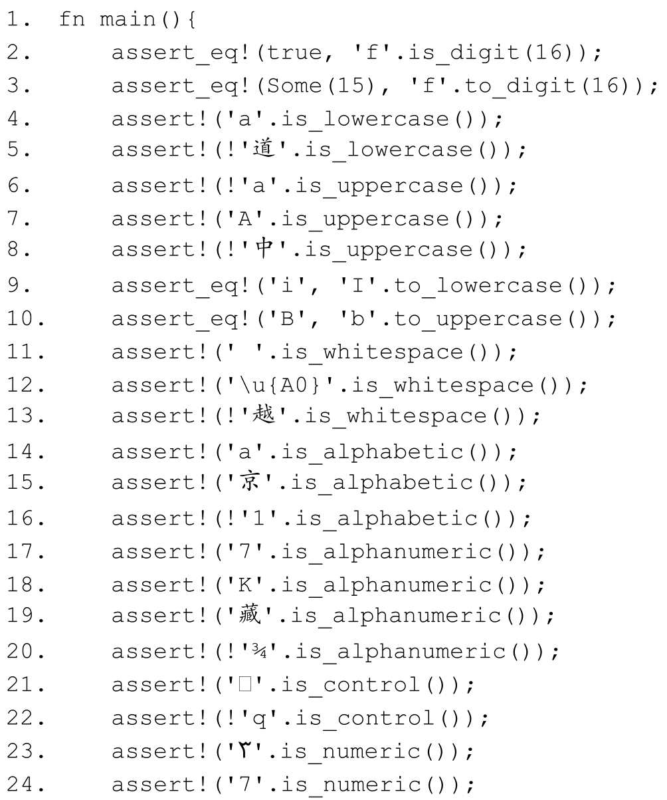{.u53962}
:::

::: center
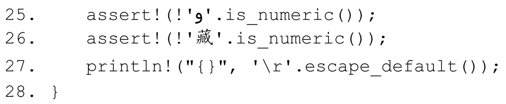{.u53961}
:::

代码清单8-5中所罗列方法说明如下：

· is_digit（16），用于判断给定字符是否属于十六进制形式。如果参数为10，则判断是否为十进制形式。

· to_digit（16），用于将给定字符转换为十六进制形式。如果参数为10，则将给定字符转换为十进制形式。

· is_lowercase，用于判断给定字符是否为小写的。作用于 Unicode 字符集中具有Lowercase属性的字符。

· is_uppercase，用于判断给定字符是否为大写的。作用于 Unicode 字符集中具有Uppercase属性的字符。

· to_lowercase，用于将给定字符转换为小写的。作用于Unicode字符集中具有Lowercase属性的字符。

· to_uppercase，用于将给定字符转换为大写的。作用于Unicode字符集中具有Uppercase属性的字符。

· is_whitespace，用于判断给定字符（或十六进制形式的码点）是否为空格字符。

· is_alphabetic，用于判断给定字符是否为字母。汉字也算是字母。

· is_alphanumeric，用于判断给定字符是否为字母、数字。

· is_control，用于判断给定字符是否为控制符。

· is_numeric，用于判断给定字符是否为数字。

· escape_default，用于转义\\t、\\r、\\n、单引号、双引号、反斜杠等特殊符号。

### 8.1.3 字符串分类 {#text00014.html#Afa02010f-bcc8-4dad-a0b9-47151a712768 .title-left}

字符串是由字符组成的有限序列。字符可以用整数值直接表示Unicode标量值，然而字符串却不能，因为字符串不能确定大小，所以在 Rust 中字符串是 UTF-8 编码序列。出于内存安全的考虑，在Rust中字符串分为以下几种类型：

· **str** ，表示固定长度的字符串。

· **String** ，表示可增长的字符串。

· **CStr** ，表示由C分配而被Rust借用的字符串，一般用于和C语言交互。

· **CString** ，表示由Rust分配且可以传递给C函数使用的C字符串，同样用于和C语言交互。

· **OsStr** ，表示和操作系统相关的字符串。这是为了兼容Windows系统。

· **OsString** ，表示OsStr的可变版本。与Rust字符串可以相互转换。

· **Path** ，表示路径，定义于std：：path模块中。Path包装了OsStr。

· **PathBuf** ，跟Path配对，是Path的可变版本。PathBuf包装了OsString。

但是在Rust中最常用的字符串是str和String。在第3章中已经介绍过str属于动态大小类型（DST），在编译期并不能确定其大小，所以在程序中最常见到的是str的**切片** （**Slice** ）类型&str。&str代表的是不可变的UTF-8字节序列，创建后无法再为其追加内容或更改其内容。&str类型的字符串可以存储在任意地方：

· **静态存储区** 。有代表性的是字符串字面量，&＇static str类型的字符串被直接存储到已编译的可执行文件中，随着程序一起加载启动。

· **堆分配** 。如果&str类型的字符串是通过堆String类型的字符串取切片生成的，则存储在堆上。因为String类型的字符串是堆分配的，&str只不过是其在堆上的切片。

· **栈分配** 。比如使用str：：from_utf8方法，就可以将栈分配的\[u8；N\]数组转换为一个&str字符串，如代码清单8-1所示。

与&str类型相对应的是String类型的字符串。&str是一个引用类型，而String类型的字符串拥有所有权。String 是由标准库提供的可变字符串，可以在创建后为其追加内容或更改其内容。String 类型本质为一个成员变量是 Vec＜u8＞类型的结构体，所以它是直接将字符内容存放于堆中的。**String类型由三部分组成** ：**指向堆中字节序列的指针** （as_ptr方法）、**记录堆中字节序列的字节长度** （len方法）和**堆分配的容量** （capacity方法），如代码清单8-6所示。

**代码清单8-6：组成String类型的三部分**

::: center
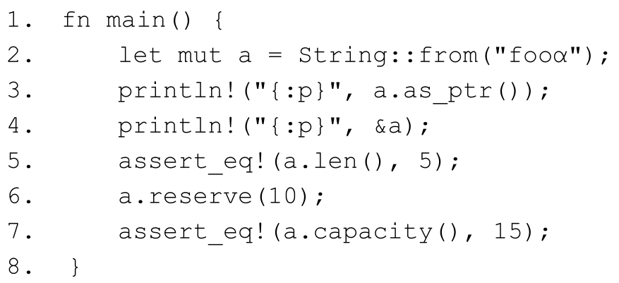{.u53960}
:::

在代码清单8-6中，使用as_ptr获取的是堆中字节序列的指针地址，而通过引用操作符&a得到的地址为字符串变量在栈上指针的地址，注意这两个是不同的指针。

代码第5行，通过len方法获取的是堆中字节序列的字节数，而非字符个数。

代码第6行，reserve方法可以为字符串再次分配容量。本例中分配了10字节，所以第7行通过capacity获取的字符串堆中已分配容量为15字节，因为要加上已有的5字节容量。

Rust提供了多种方法来创建&str和String类型的字符串，如代码清单8-7所示。

**代码清单8-7：创建字符串的各种方法示例**

::: center
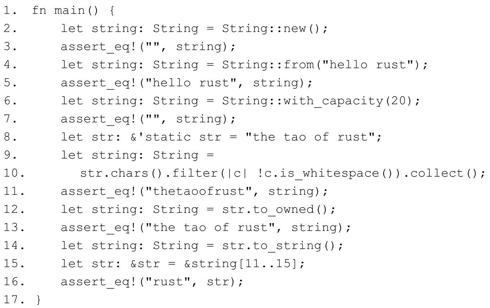{.u53959}
:::

在代码清单8-7中，代码第2行使用String：：new方法来创建空字符串，但实际上该方法并未在堆上开辟空间。

代码第4行，通过String：：from方法使用字符串字面量作为参数来创建字符串，这是因为String类型实现了From trait。

代码第6行，通过String：：with_capacity方法来创建空字符串，但是与String：：new方法不同的是，with_capacity方法接收一个usize类型的参数，用于指定创建字符串预先要在堆上分配的容量空间。此例中指定的参数是20，则会在堆中分配至少20字节的空间。如果预先知道最终要创建的字符串长度，则用此方法可以降低分配堆空间的频率。这里需要注意的是，容量只是存储空间（比如堆）的一种刻度，实际申请的堆内存空间为每个字符的字节大小乘以容量值。

代码第8行，创建的是字符串字面量，为&＇static str类型。

代码第9行，通过第8行创建的str调用chars方法返回一个迭代器，然后利用迭代器的collect方法来生成String类型的字符串。这是因为chars方法返回的迭代器实现了FromIterator trait。

代码第12行和第14行，分别使用to_owned和to_string方法将&str类型转换为String类型的字符串。两个方法的性能相差无几，to_owned 方法利用&str 切片字节序列生成新的String字符串，to_string方法是对String：：from的包装。

代码第15行，使用切片语法，从String字符串中获取索引第11～14个字符组成的字符串切片。

### 8.1.4 字符串的两种处理方式 {#text00014.html#A74f40111-3b44-4fb4-ae84-97fd18ff0bef .title-left}

Rust中的字符串不能使用索引访问其中的字符，因为字符串是UTF-8字节序列，到底是返回字节还是码点是一个问题。但是Rust提供了bytes和chars两个方法来分别返回按字节和按字符迭代的迭代器。所以，在Rust中对字符串的操作大致分为两种方式：**按字节处理** 和**按字符处理** 。

使用chars和bytes方法示例如代码清单8-8所示。

**代码清单8-8：使用chars和bytes方法示例**

::: center
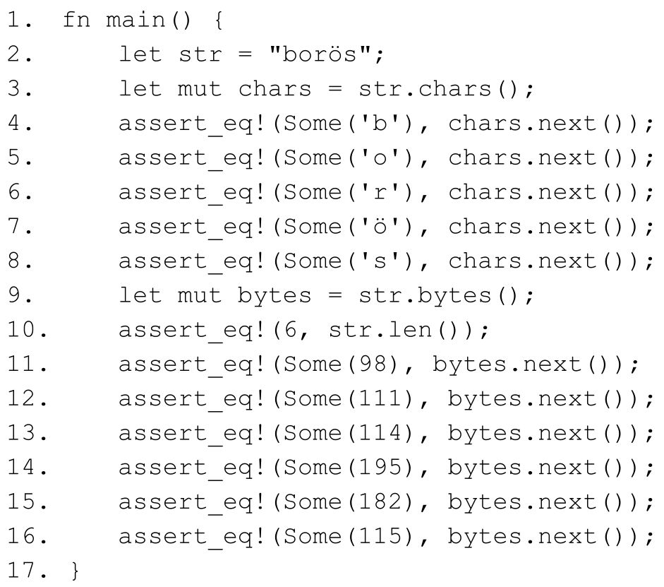{.u53958}
:::

在代码清单8-8中，代码第3行使用chars方法返回Chars迭代器，Chars迭代器的next方法是按码位进行迭代的。而代码第9行使用bytes方法返回的是Bytes迭代器，Bytes迭代器的next方法是按字节进行迭代的。字符串的一些内建方法也默认按字节来处理，比如代码第10行中用到的len方法，返回的是字符串字节长度，而非字符长度。

虽然字符串不能按索引来访问字符，但Rust提供了另外两个方法：get和get_mut，可以通过指定索引范围来获取字符串切片，并且 Rust 默认会检查字符串的序列是否为有效的UTF-8序列，如代码清单8-9所示。

**代码清单8-9：使用get和get_mut方法示例**

::: center
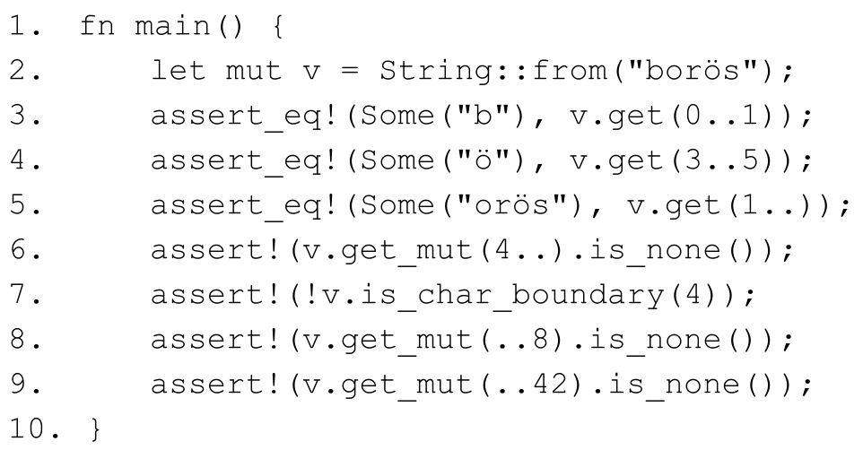{.u53957}
:::

在代码清单8-9中使用的是String类型的字符串，因为只有String字符串才是可变的。代码第3～6行，通过给get方法传递索引范围，获取到了预期的字符串切片，注意这里是Option类型。代码第6行，传递的索引范围是从4开始的，4正好是字符ö的字节序列中间地带，相当于舍弃了字符ö的第一字节，这自然是非法的UTF-8序列，所以此时Rust会返回None，从而避免了线程崩溃。也可以通过 is_char_boundary 方法来验证某个索引位置是否为合法的字符边界，代码第7行就验证了第4个索引位置为非法的字符边界。

所以，在使用字符串内建的split_at和split_at_mut方法分割字符串时，需要注意，一定要使用合法的字符串边界索引，否则就会引起线程崩溃，如代码清单8-10所示。

**代码清单8-10：使用split_at方法示例**

::: center
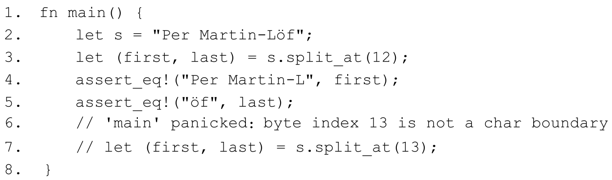{.u53956}
:::

在代码清单8-10中，使用split_at方法指定了字符串的分割索引位置。代码第3行指定的是12，正好是一个合法的字符边界，所以可以将字符串合法地分成两部分。但是注释掉的第7行，给定的索引值为13，恰好是字符ö的字节序列中间位置，为非法的字符边界，所以引发线程崩溃。

因此，在日常处理字符串时，要注意是按字节还是按字符进行的，以避免发生预期之外的错误。

### 8.1.5 字符串的修改 {#text00014.html#A24e80113-2b19-4b25-ac0e-3e6ef090fc18 .title-left}

一般情况下，如果需要修改字符串，则使用String类型。修改字符串大致分为追加、插入、连接、更新和删除5种情形。

**追加字符串**

对于追加的情形，Rust提供了push和push_str两个方法，如代码清单8-11所示。

**代码清单8-11：使用push和push_str方法示例**

::: center
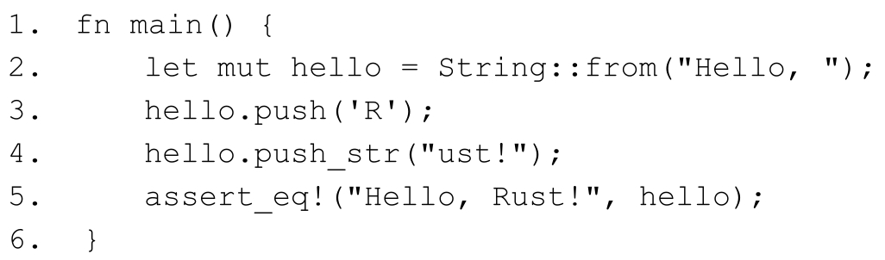{.u53955}
:::

在代码清单8-11中，使用push方法为String类型字符串hello追加字符，使用push_str方法为hello追加&str类型的字符串切片。push和push_str在内部实现上其实是类似的，因为String本质是对Vec＜u8＞动态数组的包装，所以对于push来说，如果字符是单字节的，则将字符转换为u8类型直接追加到Vec＜u8＞尾部；如果是多字节的，则转换为UTF-8字节序列，通过Vec＜u8＞的extend_from_slice方法来扩展。因为push_str接收的是&str类型的字符串切片，所以直接使用extend_from_slice方法扩展String类型字符串的内部Vec＜u8＞数组。

除了上面两个方法，也可以通过迭代器为String追加字符串，因为String实现了Extend迭代器，如代码清单8-12所示。

**代码清单8-12：使用Extend迭代器追加字符串**

::: center
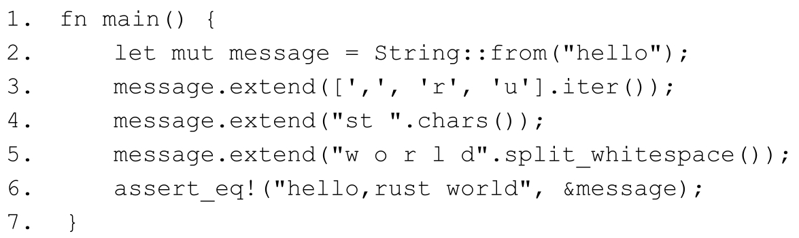{.u53954}
:::

在代码清单 8-12 中，String 类型的字符串实现了 Extend 迭代器，所以可以使用 extend方法，其参数也为迭代器。代码第3行，使用iter方法返回Iter迭代器。代码第4行，使用chars 方法返回的是 Chars 迭代器。代码第 5 行，使用 split_whitespace 方法返回的是SplitWhitespace迭代器。

**插入字符串**

如果想从字符串的某个位置开始插入一段字符串，则需要使用insert和insert_str方法，其用法和push/push_str方法类似，如代码清单8-13所示。

**代码清单8-13：使用insert和insert_str方法插入字符串**

::: center
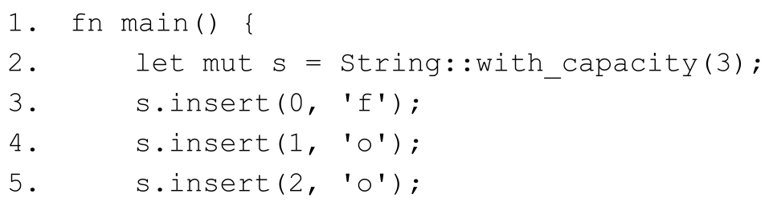{.u53953}
:::

::: center
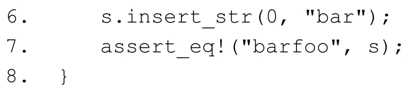{.u53952}
:::

在代码清单8-13中，使用insert方法，其参数为要插入的位置和字符；而使用insert_str方法，其参数为要插入的位置和字符串切片。值得注意的是，insert 和insert_str 是基于字节序列的索引进行操作的，其内部实现会通过 is_char_boundary 方法来判断插入的位置是否为合法的字符边界，如果插入的位置非法，则会引发线程崩溃。

**连接字符串**

String 类型的字符串也实现了 Add＜&str＞ 和 AddAssign＜&str＞两个 trait，这意味着可以使用"+"和"+="操作符来连接字符串，如代码清单8-14所示。

**代码清单8-14：使用** "**+** "**和** "**+** "**=连接字符串**

::: center
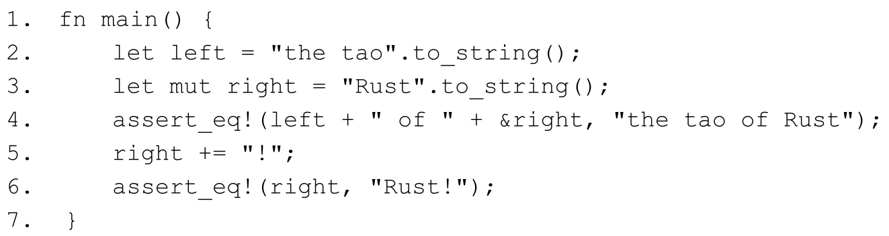{.u53851}
:::

在代码清单8-14中，使用"+"和"+="操作符连接字符串，但需要注意的是，操作符右边的字符串为切片类型（&str）。在代码第4行中，&right实为&String类型，但是因为String类型实现了**Deref** trait，所以这里执行加法操作时自动解引用为&str类型。

**更新字符串**

因为Rust不支持直接按索引操作字符串中的字符，一些常规的算法在Rust中必然无法使用。比如想修改某个字符串中符合条件的字符为大写，就无法直接通过索引来操作，只能通过迭代器的方式或者某些unsafe方法，如代码清单8-15所示。

**代码清单8-15：尝试使用索引来操作字符串**

::: center
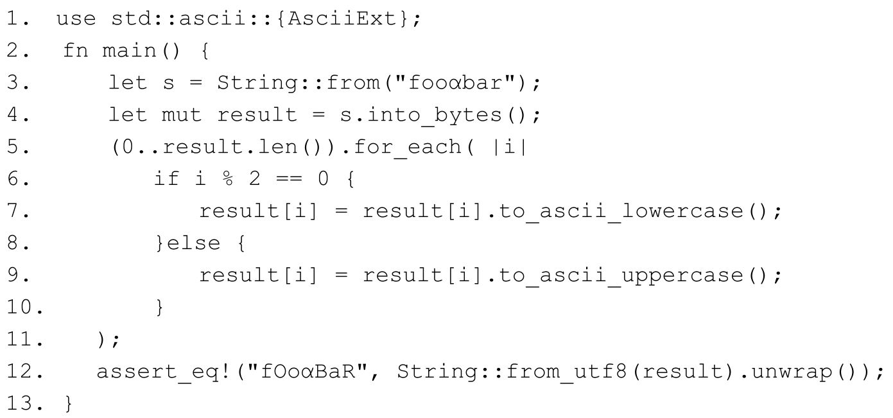{.u53951}
:::

在代码清单8-15中，通过into_bytes方法将字符串转换为Vec＜u8＞序列，这样就可以使用索引来修改它的内容了。然后通过 String：：from_utf8 方法将 Vec＜u8＞转换为 Result＜String，FromUtf8Error＞，再通过unwrap方法取出Result中的String字符串。

代码第 5～11 行，在 result 字节序列长度范围内循环，如果序列索引是偶数，则通过to_ascii_lowercase方法将其转换为小写的；否则，通过to_ascii_uppercase方法将其转换为大写的。注意，这里引入了 std：：ascii：：{AsciiExt}，因为 result 现在是字节序列，所以需要使用标准库中提供的扩展方法。

最终得到的结果字符串是＂fOoαBaR＂，这和预期的结果不太相符，因为第4个字符α的大写应该是A。这是因为to_ascii_uppercase和to_ascii_lowercase方法只针对ASCII字符，α是多字节字符，并不能进行合法的转换。

代码清单8-15展示了Rust中的String字符串无法用在其他语言中处理字符串的常规思维来处理。Rust中的字符串永远都是UTF-8字节序列。当然，在确定的字符串序列中，已知按字节可以得到正确处理的情况下，也是可以用的。但是一般处理多字节字符串的情况比较多，要合法正确地操作字符串，推荐使用按字符来迭代，如代码清单8-16所示。

**代码清单8-16：按字符迭代来处理字符串**

::: center
{.u53950}
:::

在代码清单8-16中，使用chars方法获得Chars迭代器，然后通过enumerate和map两个迭代器方法对字符进行处理，最后通过collect消费迭代器转换为String类型，得到正确的预期结果。

**删除字符串**

Rust 标准库的 std：：string 模块提供了一些专门用于删除字符串中字符的方法，如代码清单8-17所示。

**代码清单8-17：删除字符串示例**

::: center
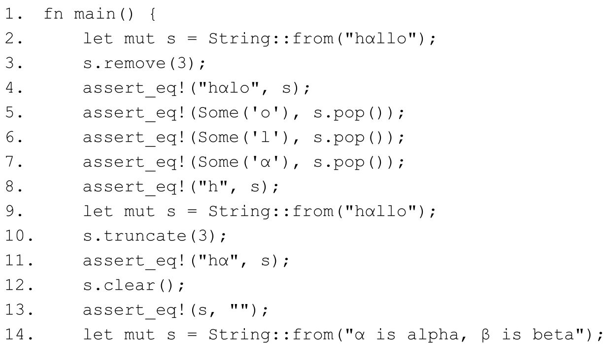{.u53949}
:::

::: center
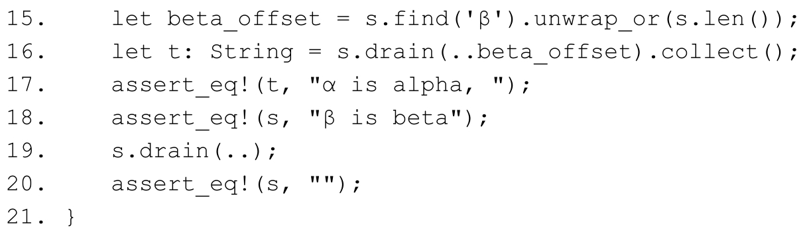{.u53948}
:::

代码清单8-17展示了删除字符串的各种方法。

如果想删除字符串中某个位置的字符，则可以使用标准库提供的 remove 方法，如代码第 3 行，remove 的参数为该字符的起始索引位置。这里需要注意，remove 也是按字节处理字符串的，如果给定的索引位置不是合法的字符边界，那么线程就会崩溃。可以将该方法的参数3改为2，然后看看有何结果。

代码第 5～7 行，使用 pop 方法可以将字符串结尾的字符依次弹出，并返回该字符。通过代码第8行可以看出，该方法同样会修改字符串本身。

代码第10行使用了truncate方法，该方法接收索引位置为参数，并将以此索引位置开始到结尾的字符全部移除。此行指定truncate方法的参数为3，那么第3位正好是字符α的字符边界，因为α占两字节。所以字符串s只剩下了"hα"。truncate方法同样是按字节进行操作的，所以使用时需要注意，如果给定的索引位置不是合法的字符边界，则同样会引发线程崩溃。

代码第12行使用的clear方法，实际上是truncate的语法糖，只要给truncate指定参数为0，那么就可以截断字符串中的全部字符，达到clear的效果。

代码第14～20行，使用drain方法来移除指定范围内的字符。代码第15行通过find方法，找到指定字符 β 的位置。代码第 16 行以此作为范围的起始位置，以字符串结尾作为结束位置，对字符串进行移除，drain方法会返回Drain迭代器，可以通过消费Drain迭代器来获得已移除的那段字符串。

### 8.1.6 字符串的查找 {#text00014.html#A5ba40116-7c3d-4e88-be44-f38795ec2b7f .title-left}

在Rust标准库中并没有提供正则表达式支持，这是因为正则表达式算是外部DSL，如果直接将其引入标准库中，则会破坏Rust的一致性。因为现成的正则表达式引擎都是其他语言实现的，比如C语言。除非完全使用Rust来实现。目前Rust支持的正则表达式引擎是官方实现的第三方包**regex** ，未来是否会归为标准库中，不得而知。虽然Rust在标准库中不提供正则表达式支持，但它提供了另外的字符串匹配功能供开发者使用，一共包含 20 个方法。这20个方法涵盖了以下几种字符串匹配操作：

· **存在性判断** 。相关方法包括contains、starts_with、ends_with。

· **位置匹配** 。相关方法包括find、rfind。

· **分割字符串** 。相关方法包括split、rsplit、split_terminator、rsplit_terminator、splitn、rsplitn。

· **捕获匹配** 。相关方法包括matches、rmatches、match_indices、rmatch_indices。

· **删除匹配** 。相关方法包括trim_matches、trim_left_matches、trim_right_matches。

· **替代匹配** 。相关方法包括replace、replacen。

看得出来，这些功能基本上可以满足日常正则表达式的开发需求。

**存在性判断**

可以通过contains方法判断字符串中是否存在符合指定条件的字符，该方法返回bool类型，如代码清单8-18所示。

**代码清单8-18：使用contains方法示例**

::: center
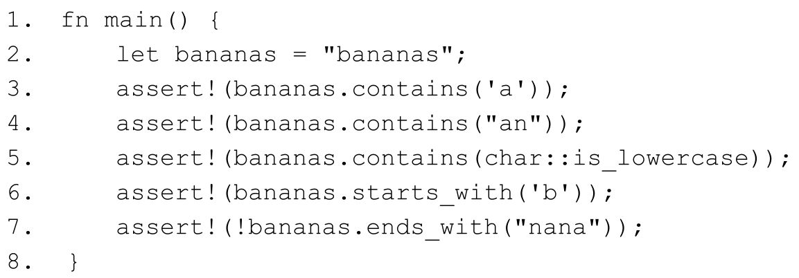{.u53947}
:::

注意，在代码清单8-18中，代码第3～5行中contains的参数是三种不同的类型，分别为char、&str 和 fn pointer，这是因为contains 是一个泛型方法。代码清单8-19 展示了std：：str模块中contains方法的源码。

**代码清单8-19：std：：str模块中contains方法的源码展示**

::: center
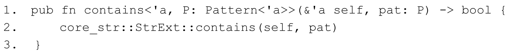{.u53946}
:::

从代码清单8-19可以看出，contains的参数pat是一个泛型，并且有一个**Pattern＜＇a＞** 限定。Pattern＜＇a＞是一个专门用于搜索&＇a str字符串的模式trait。Rust中的char类型、String、&str、&&str、&\[char\]类型，以及FnMut（char）-＞bool的闭包均已实现了该trait。因此，contains才可以接收不同类型的值作为参数。

回到代码清单8-18中，代码第6行和第7行分别用到的starts_with和ends_with与contains一样，也可以接收实现了 Pattern＜＇a＞的类型作为参数。为了方便描述，暂且称这种参数为pattern参数。starts_with和ends_with分别用于判断指定的pattern参数是否为字符串的起始边界和结束边界。

**位置匹配**

如果想查找指定字符串中字符所在的位置，则可以使用find方法，如代码清单8-20所示。

**代码清单8-20：使用find方法查找字符位置**

::: center
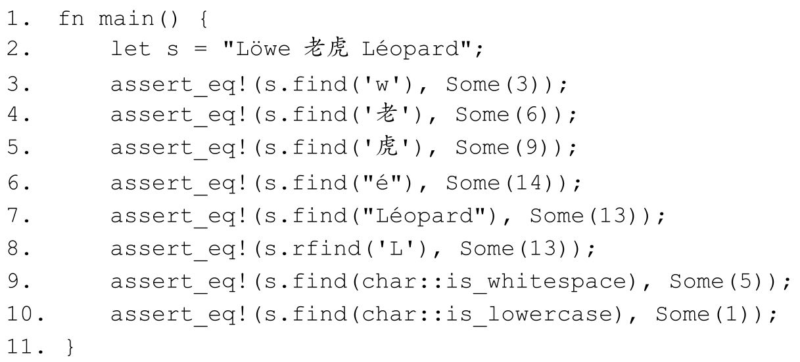{.u53945}
:::

find方法同样可以接收pattern参数。通过代码清单8-20可以看出，find方法默认是从左向右按字符进行遍历查找的，最终返回Option＜usize＞类型的位置索引；如果没有找到，则会返回None。对于代码第8行使用的rfind方法，表示从右向左来匹配字符串，r前缀代表右边（right），所以它返回的结果是Some（13）。

**分割字符串**

如果想通过指定的模式来分割字符串，则可以使用 split 系列方法，如代码清单 8-21 所示。

**代码清单8-21：split系列方法使用示例**

::: center
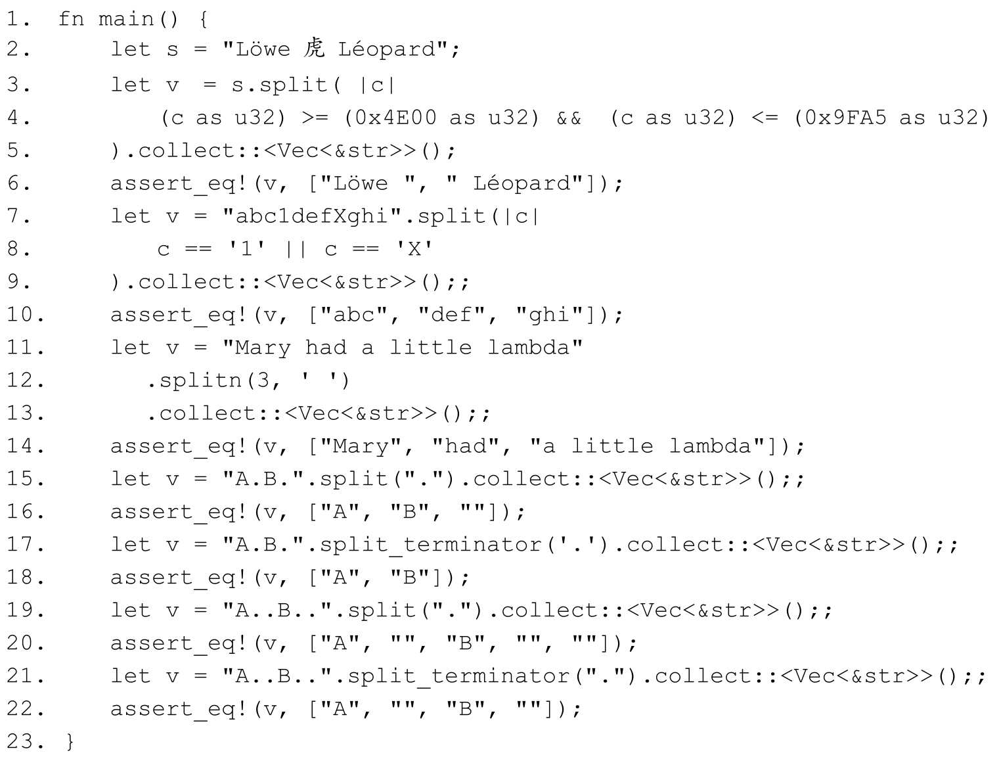{.u53944}
:::

在代码清单8-21中，代码第2行声明了一个&str字符串，注意其中包含了多字节字符。

代码第3～5行，使用split方法来分割字符串s。split方法同样支持pattern参数，该方法使用闭包作为参数。闭包的行为是想通过字符串中字符的码位范围来锁定中文字符，然后以中文字符作为字符串的分割位置，最终返回代码第 6 行所示的 Vec＜&str＞类型数组。这里暂时使用U+4E00～U+9FA5码位作为中文字符的范围，但实际上这是不太严谨的，该范围并没有包含全部的中文字符，这里仅作为演示之用。因为在 Rust 中每个字符的码位对应于一个u32数字，所以在闭包中使用as将字符和码位均转换为u32进行比较。

代码第 7～9 行的行为同样是通过闭包指定的条件来分割字符串的，最终得到代码第 10行所示的数组。

代码第11～13行，使用了splitn方法，注意这个方法的命名比split多了一个n，这个n代表指定分割的数组长度。该方法的第一个参数就是指定要分割的数组长度，第二个参数为要分割的pattern参数。最终的分割结果正如第14行展示的那样，是一个长度为3的数组，也就是包含3个元素。

代码第15～22行，主要展示了split和split_terminator方法的区别。顾名思义，terminator为终结之意，通过代码可以看出，split_terminator 会把分割结果数组最后一位出现的空字符串去掉。

对应的，也存在rsplit、rsplitn和rsplit_terminator方法，它们均是按从右向左的方向进行字符匹配的。那为什么没有lsplit之类的方法呢？不要忘记，split本身的匹配方向就是从左向右的。需要注意的是，split系列方法返回的是迭代器，所以在使用它们时最后需要用collect来消费这些迭代器。

**捕获匹配**

在处理字符串时，最常见的一个需求就是得到字符串中匹配某个条件的字符，通常通过正则表达式来完成。在Rust中，通过pattern参数配合matches系列方法可以获得同样的效果，如代码清单8-22所示。

**代码清单8-22：matches系列方法使用示例**

::: center
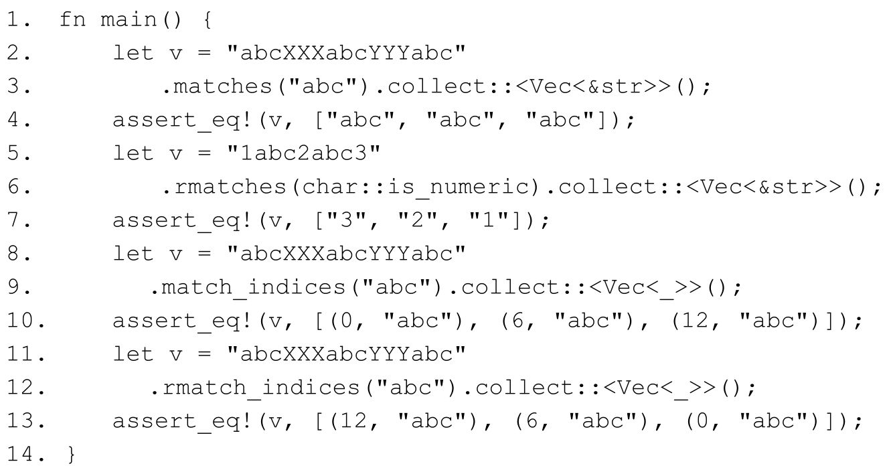{.u53943}
:::

在代码清单8-22中，代码第2行和第3行，使用matches方法来获取字符串中匹配到的元素。matches方法返回的同样是迭代器，所以需要使用 collect 来消费迭代器收集到指定容器中以备使用，此例收集到了 Vec＜&str＞类型的数组容器中，最终得到代码第 4 行所示的结果。

代码第5行和第6行，使用了rmatches方法，从右向左进行匹配。注意，最终得到的数组中元素也是按原字符串从右向左依次排列的。

代码第8行和第9行，使用了match_indices方法，返回的结果是元组数组，其中元组的第一个元素代表匹配字符的位置索引，第二个元素为匹配的字符本身。从方法的命名来看，indices为index的复数形式，在语义上就指明了匹配结果会包含索引。其实在标准库中也有不少以"\_indices"结尾的方法名，在语义上都表明其返回值会包含索引。

代码第11行和第12行，使用了rmatch_indices方法，它同样是从右向左进行匹配的。

通过matches系列方法，可以获得最终匹配的结果数组，然后按需使用即可。

**删除匹配**

在 std：：str 模块中提供了 trim 系列方法，可以删除字符串两头的指定字符，如代码清单8-23所示。

**代码清单8-23：trim系列方法使用示例**

::: center
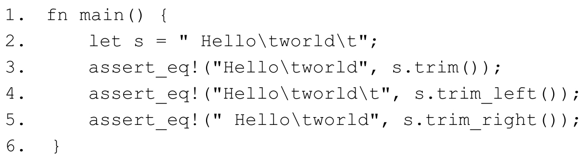{.u53942}
:::

在代码清单8-23中用到的trim系列方法，可以删除字符串两头的空格、制表符（\\t）和换行符（\\n）。注意代码第2行声明的字符串s是以空格为起始字符、以\\t为结尾字符的单个字符串。从代码第3行可以看出，trim方法将左边起始处的空格和右边结尾处的\\t都清除了。

代码第4行和第5行中用到的trim_left和trim_right分别用于去除左边和右边的特定字符。值得注意的是，trim、trim_left和trim_right这三个方法并不能使用pattern参数，只是固定地清除空格、制表符和换行符。Rust提供了trim_matches系列方法支持pattern参数，可以指定自定义的删除规则，如代码清单8-24所示。

**代码清单8-24：trim_matches系列方法使用示例**

::: center
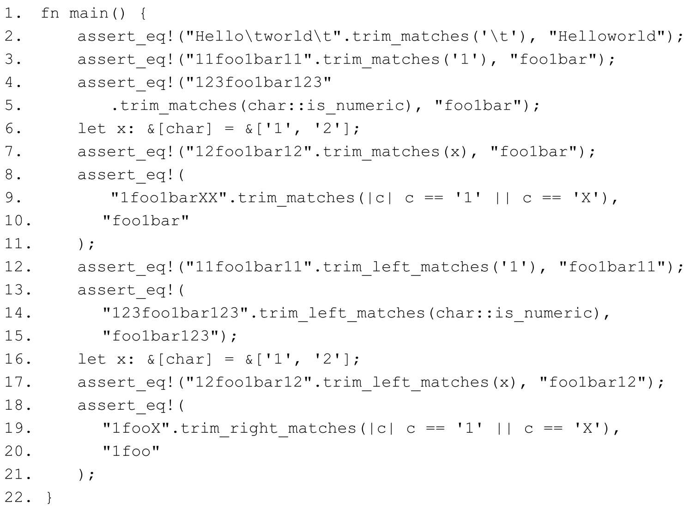{.u53941}
:::

在代码清单8-24中使用了trim_matches系列方法，与trim系列方法不同的是，该系列方法可以接收pattern参数。通过传递pattern参数可以自定义需要删除的字符。

代码第2～11行，展示了trim_matches接收各种类型的pattern参数，最后删除了字符串两头相匹配的字符。

代码第12～21行，展示了trim_left_matches和trim_right_matches方法，分别用于删除字符串左边和右边相匹配的字符。

**替代匹配**

使用trim_matches系列方法可以满足基本的字符串删除匹配需求，但是其只能去除字符串两头的字符，无法去除字符串内部包含的字符。可以通过replace系列方法来实现此需求，如代码清单8-25所示。

**代码清单8-25：replace系列方法使用示例**

::: center
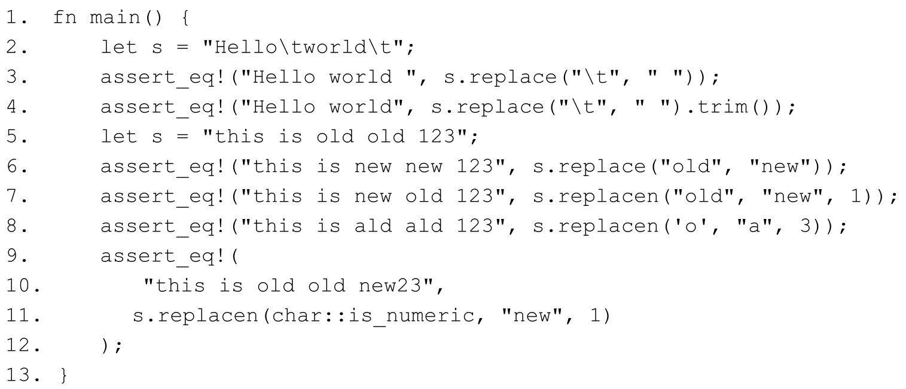{.u53940}
:::

在代码清单8-25中，代码第3行使用空格替换了制表符，虽然满足了需求，但是在字符串结尾又多了空格，所以，这里其实再配合使用一次trim方法即可，如代码第4行所示。

replace方法也支持pattern参数，默认从左到右将所有匹配到的字符替换为指定字符。与之相对应的replacen方法，支持通过第三个参数来指定替换字符的个数，如代码第7～12行所示。

**字符串匹配模式原理**

Rust提供的这些字符串匹配方法看似繁多，但实际上其背后是一套统一的迭代器适配器。我们从matches方法说起，代码清单8-26展示了matches方法的源码。

**代码清单8-26：matches方法源码**

::: center
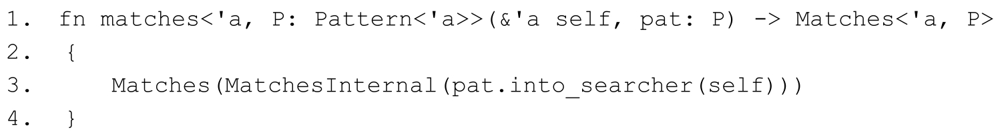{.u53939}
:::

在代码清单8-26中，matches方法返回的是Matches＜＇a，P＞类型，它是一个结构体，也是一个迭代器。其源码如代码清单8-27所示。

**代码清单8-27：Matches迭代器源码**

::: center
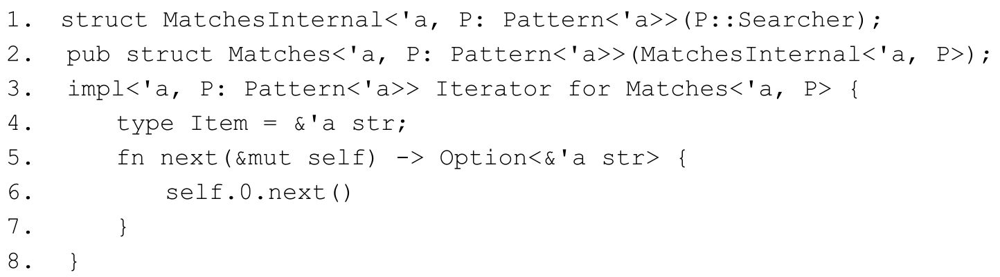{.u53938}
:::

在代码清单8-27中展示的是部分源码，其中第2～7行实际上是通过generate_pattern_iterators！宏生成的代码。

Matches结构体是一个元组结构体，也就是NewType模式，它包装了MatchesInternal结构体。代码第3～7行，为Matches实现了Iterator，它就成为迭代器。在next方法中，它又调用了MatchesInternal结构体的next方法，如代码第6行所示。

代码清单8-28展示了MatchesInternal实现next和next_back方法的源码。

**代码清单8-28：MatchesInternal实现next和next_back方法的源码**

::: center
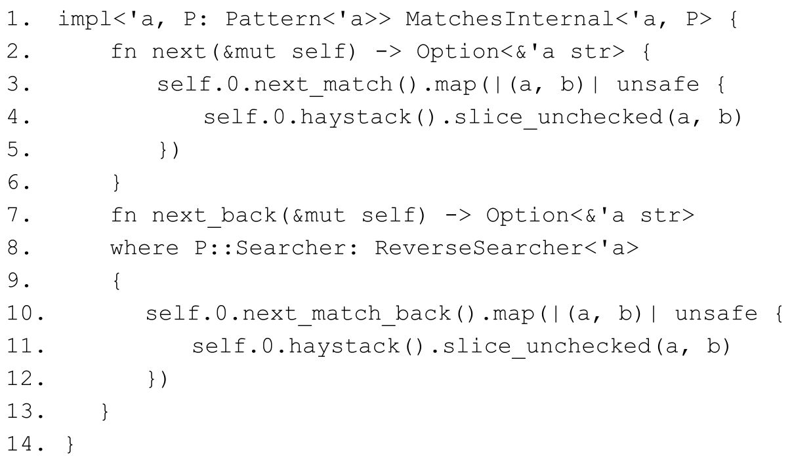{.u53937}
:::

MatchesInternal 也是一个 NewType 模式的结构体，它包装了 P：：Searcher。其中 next 和next_back方法内部分别调用了P：：Searcher的next_match和next_match_back方法，最终返回Map迭代器供将来collect使用。

Matches迭代器适配器工作示意图如图8-4所示。

::: center
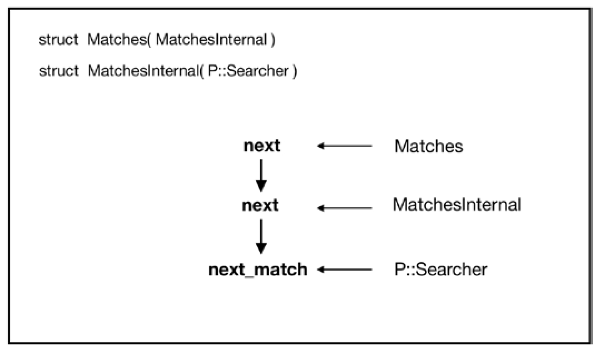{.u53936}

图8-4：Matches迭代器适配器工作示意图
:::

在上面代码中，值得注意的是Pattern＜＇a＞，该trait实际上是字符串匹配算法的抽象。代码清单8-29展示了Pattern＜＇a＞和SearchStep的定义。

**代码清单8-29：Pattern＜＇a＞和SearchStep定义**

::: center
{.u53935}
:::

::: center
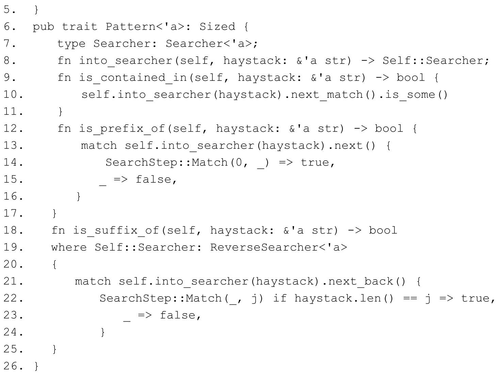{.u53934}
:::

在代码清单8-29中，Pattern＜＇a＞包含了一个关联类型和四个方法。关联类型为Searcher，表示一个可以通过into_searcher方法得到的具体搜索类型，并且该搜索类型必须实现另一个Searcher＜＇a＞trait。into_searcher方法中haystack参数的命名来自英语俚语"find a needle in a haystack"，意思为"大海捞针"，所以在一般的字符串匹配算法中，通常用 haystack 表示待匹配的原字符串，needle 代表子串。比如用子串"nana"来匹配字符串"banana"，那么"banana"就是haystack，"nana"就是needle。所以，后面为了描述方便，直接用"haystack串"和"needle串"来分别指代它们。

SearchStep是一个枚举类型，其中Match（usize，usize）代表匹配到的字符索引位置范围，比如haystack\[0..3\]，Reject（usize，usize）代表未匹配的索引范围，Done则代表匹配完毕。

is_contained_in 方法用于判断 needle 串是否包含在 haystack 串中。is_prefix_of 和is_suffix_of方法分别代表前缀和后缀。如果熟悉KMP字符串匹配算法，则会比较敏感，前缀是指除最后一个字符以外的其余字符的组合，后缀是指除第一个字符以外的全部尾部字符的组合，如代码第14行和第22行匹配的索引所示。

在KMP算法中，前缀和后缀用于产生部分匹配表，而在Rust中这里使用的字符匹配算法并非 KMP，而是它的变种**双向（Two-Way）字符串匹配算法** ，该算法的优势在于拥有常量级的空间复杂度。它和KMP的共同点在于其时间复杂度也是*O* （*n* ），并且都用到了前缀和后缀的概念。

代码清单8-30展示了Searcher＜＇a＞的源码。

**代码清单8-30：Searcher＜＇a＞源码**

::: center
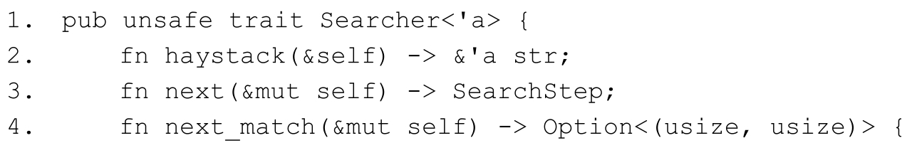{.u53933}
:::

::: center
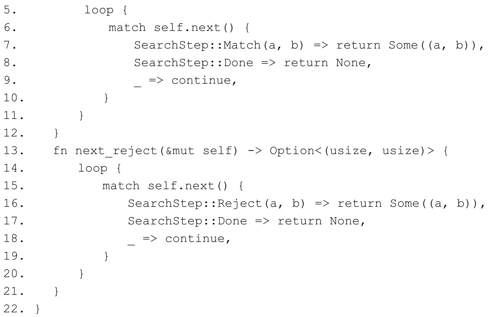{.u53932}
:::

代码清单8-30中的Searcher＜＇a＞有点类似于迭代器，其中包含了四个方法。代码第2行的haystack方法用于传递haystack串。

代码第3行的next方法用于返回SearchStep。比如needle串为"aaaa"，haystack串为"cbaaaaab"，则通过next方法可以得到"\[Reject（0，1），Reject（1，2），Match（2，5），Reject（5，8）\]"。

代码第4～21行，分别实现了next_match和next_reject，用于匹配SearchStep来返回最终匹配或未匹配的索引范围。注意，索引范围为Option＜（usize，usize）＞类型。

代码清单8-31展示了为&＇a str类型实现Pattern＜＇a＞的源码。

**代码清单8-31：为&＇a str类型实现Pattern＜＇a＞的源码**

::: center
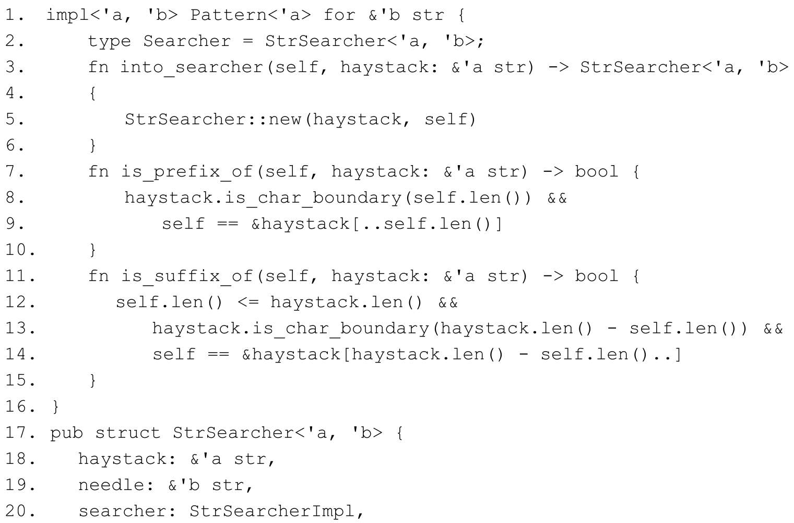{.u53711}
:::

::: center
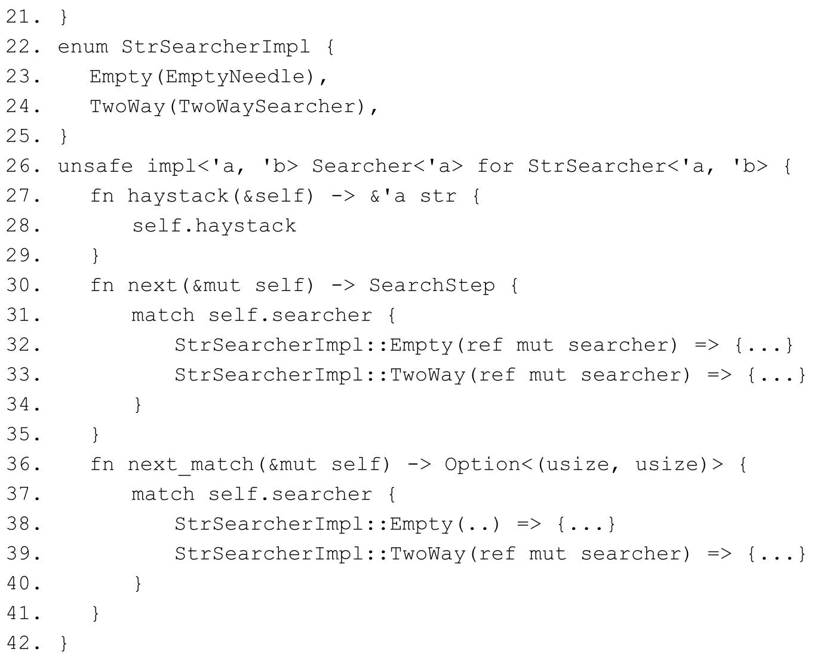{.u53931}
:::

仔细看代码清单8-31所示的代码结构，发现into_searcher生成用于匹配&＇a str类型字符串的搜索类型为StrSearcher＜＇a，＇b＞，它是一个结构体，包含了三个字段，其中haystack和needle分别表示haystack串和needle串，而searcher是一个StrSearcherImpl枚举体。

StrSearcherImpl枚举体包含的两个变体Empty（EmptyNeedle）和TwoWay（TwoWaySearcher），分别代表处理空字符串和非空字符串两种情况。当处理空字符串时，实际使用 EmptyNeedle来处理；当处理非空字符串时，实际使用TwoWaySearcher来处理。其中TwoWaySearch就是双向字符串匹配算法的具体实现。

以上就是**字符串匹配算法的背后机制** ，**使用Pattern＜＇a ＞** 、**Searcher＜＇a ＞** 和**SearchStep来抽象字符串匹配算法** ，**然后利用迭代器模式进行检索** 。同样，这里也是Rust一致性的体现。

### 8.1.7 与其他类型相互转换 {#text00014.html#A4779011f-bb3b-4c5a-8d4a-27fc226fad16 .title-left}

在日常开发中，字符串和其他类型的转换是很常见的需求。Rust也提供了一些方法来帮助开发者方便地完成这类转换。

**将字符串转换为其他类型**

可以通过std：：str模块中提供的parse泛型方法来将字符串转换为指定的类型，如代码清单8-32所示。

**代码清单8-32：parse方法使用示例**

::: center
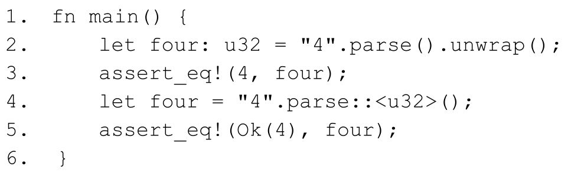{.u53930}
:::

在代码清单8-32中，使用parse方法将字符串＂4＂转换为u32类型。因为parse为泛型方法，所以也可以使用turobfish操作符为其指定类型，如代码第4行所示。

其实parse方法内部是使用FromStr：：from_str方法来实现转换的。FromStr是一个trait，其命名符合Rust的一致性惯例，代码清单8-33展示了该trait的定义。

**代码清单8-33：FromStr 定义**

::: center
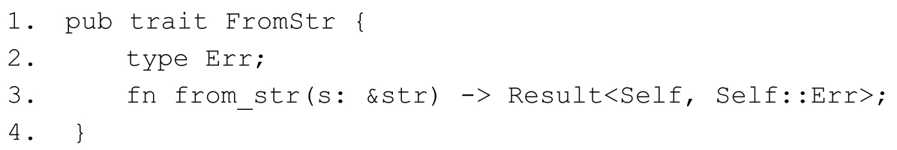{.u53929}
:::

从代码清单8-33中可以看出，在FromStr中定义了一个from_str方法，实现了此trait的类型，可以通过from_str将字符串转换为该类型。返回值为一个Result类型，该类型会在解析失败时返回 Err。Rust 为一些基本的原生类型、布尔类型以及 IP 地址等少数类型实现了FromStr，对于自定义的类型需要自己手工实现，如代码清单8-34所示。

**代码清单8-34：为自定义结构体实现FromStr**

::: center
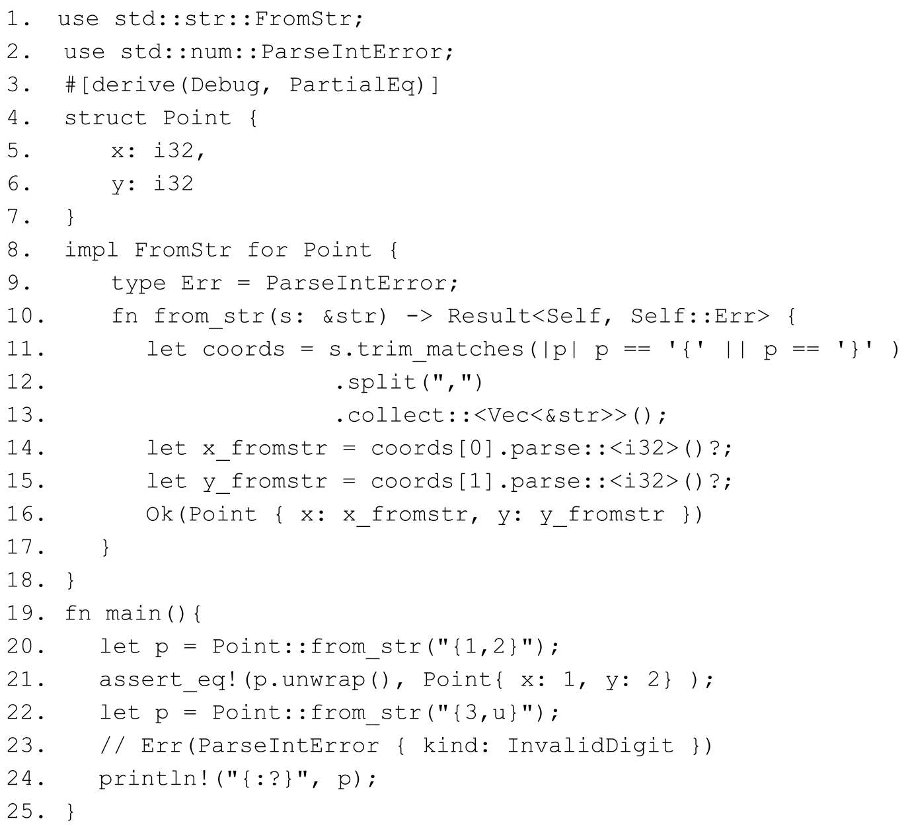{.u53928}
:::

在代码清单8-34中，实现了将特定格式的字符串转换为Point结构体类型。代码很简单，重点在于第11～16行，通过trim_matches将字符串两头的花括号去掉，然后使用split将字符串按逗号分割为包含两个字符串的 Vec＜&str＞数组，再分别通过索引将其解析为数字，最后构造为Point结构体的实例并返回相应的Result类型。

如果是不满足特定格式的字符串，则会返回对应的错误类型，比如代码第 22 行，最终得到的结果是Err（ParseIntError{kind：InvalidDigit}）错误类型。

**将其他类型转换为字符串**

如果想把其他类型转换为字符串，则可以使用format！宏。format！宏与println！及write！宏类似，同样可以通过格式化规则来生成String类型的字符串，如代码清单8-35所示。

**代码清单8-35：使用format！根据字符串生成字符串**

::: center
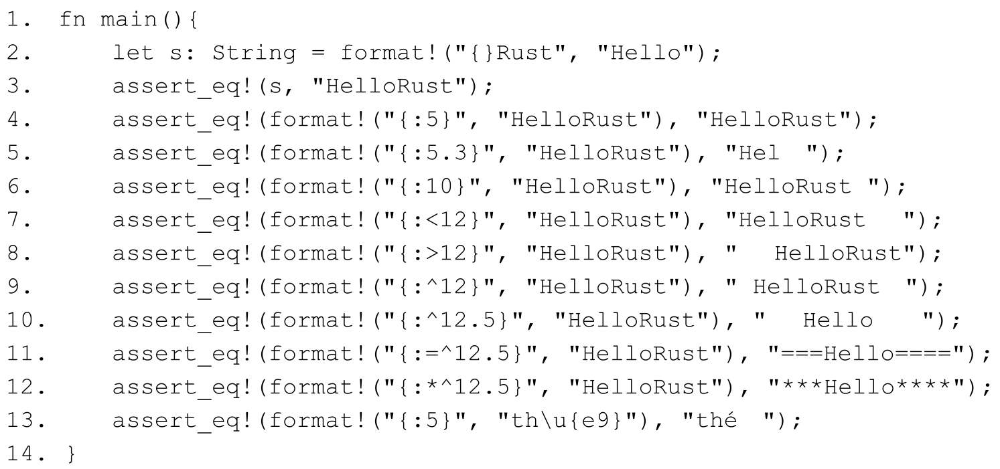{.u53927}
:::

代码清单8-35展示了format！格式化示例，格式化效果如图8-5所示。

::: center
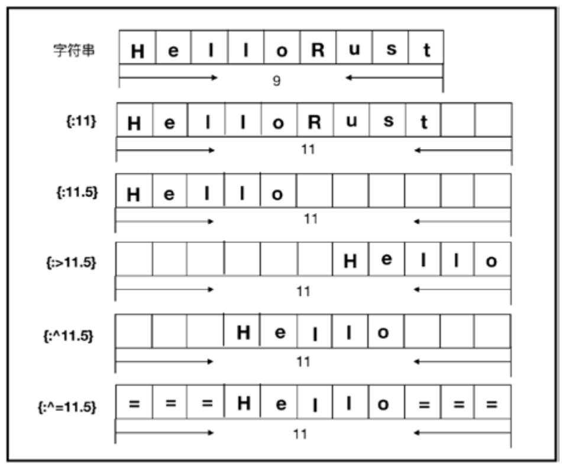{.u53926}

图8-5：format！格式化效果
:::

基本的格式化规则可以总结为下面三条：

· **填充字符串宽度** 。格式为{：number}，其中number表示数字。如代码清单8-35中第4行所示。如果number的长度小于字符串长度，则什么都不做；如果number的长度大于字符串的长度，则会默认填充空格来扩展字符串的长度，如代码第6行所示。

· **截取字符串** 。格式为{：.number}，注意number前面有符号"."，number代表要截取的字符长度，也可以和填充格式配合使用，如代码清单8-35中第5行所示。

· **对齐字符串** 。格式为{：＞}、{：\^}和{：＜}，分布表示左对齐、位于中间和右对齐。如代码清单8-35中第7～10行所示，也可以与其他格式代码配合使用。

在代码清单8-35中，代码第11行和第12行，直接在冒号后面使用"="和"\*"替代默认的空格填充。format！格式化字符串是按字符来处理的，如代码第 13 行所示，不管字符串多长，对于里面的Unicode码位都会以单个字符位来处理。

除满足上述格式化规则之外，Rust还提供了专门针对整数和浮点数的格式化代码。代码清单8-36展示了针对整数的format！格式化示例。

**代码清单8-36：针对整数使用format！格式化为字符串**

::: center
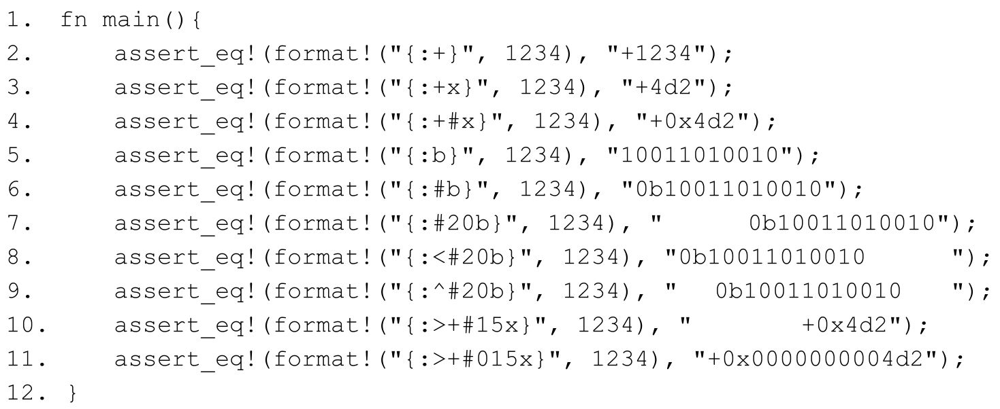{.u53925}
:::

在代码清单8-36中，除使用上面介绍的格式化代码之外，还用到了针对整数提供的格式化代码。总结如下：

· **符号+** ，表示强制输出整数的正负符号。

· **符号＃** ，用于显示进制的前缀。比如十六进制显示0x，二进制显示0b。

· **数字0** ，用于把默认填充的空格替换为数字0。

为了便于理解，图8-6展示了针对整数的format！格式化规则。

::: center
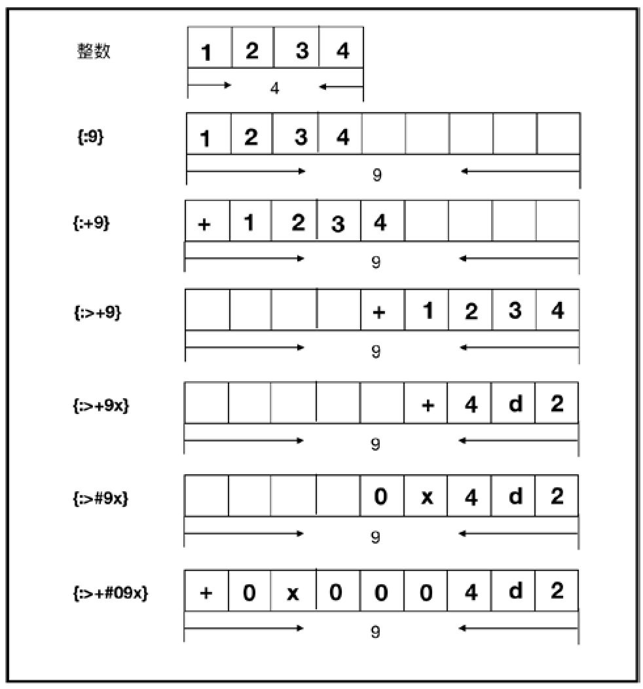{.u53924}

图8-6：针对整数的format！格式化规则
:::

针对浮点数，某些格式化代码又表示不同的含义，如代码清单8-37所示。

**代码清单8-37：针对浮点数使用format！格式化为字符串**

::: center
{.u53923}
:::

浮点数格式化主要注意以下两点：

· 指定小数点后的有效位。符号"**.** "代表的是指定浮点数小数点后的有效位。这里需要注意的是，在指定有效位时会四舍五入，如代码清单8-37中第3行和第4行所示。

· 科学计数法。使用**{：e}** 可以将浮点数格式化为科学计数法的表示形式。

图8-7展示了针对浮点数的format！格式化规则。

::: center
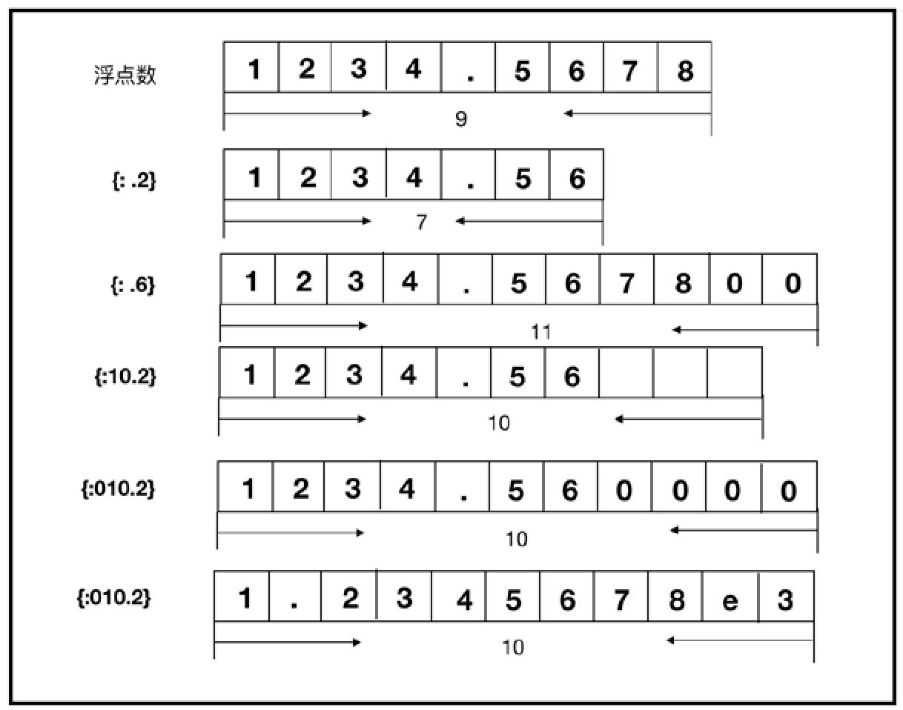{.u53922}

图8-7：针对浮点数的format！格式化规则
:::

以上所有的格式化规则，对println！和write！宏均适用。前面展示的都是字符串、整数和浮点数等内置类型的格式化，如果要对自定义类型格式化，则需要实现Display trait，如代码清单8-38所示。

**代码清单8-38：对自定义类型format！格式化为字符串**

::: center
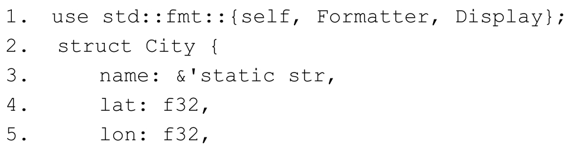{.u53921}
:::

::: center
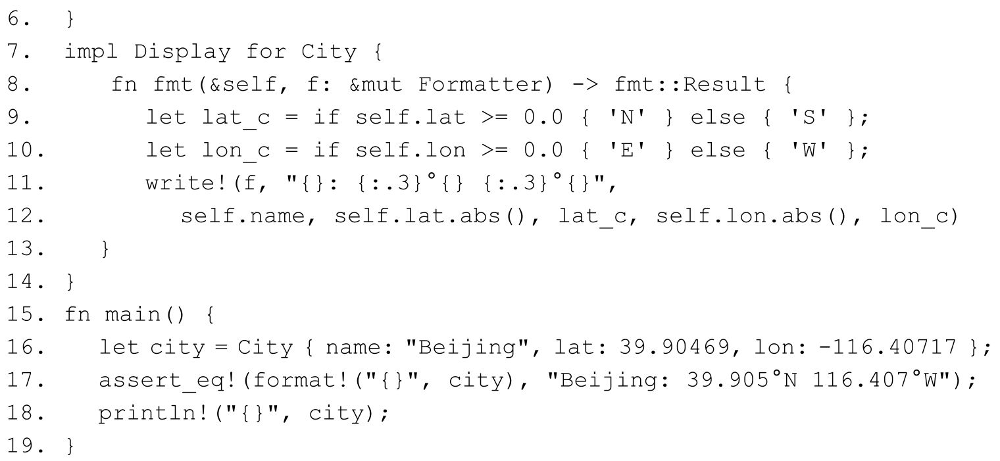{.u53411}
:::

在代码清单8-38中，为结构体City实现了Display trait，所以可以通过format！宏根据结构体实例city生成相应的字符串，如代码第17行所示。

### 8.1.8 回顾 {#text00014.html#Aee090124-7e08-4ec4-b40d-7bca2cb87e48 .title-left}

关于字符串的介绍，到此告一段落。现在用一个小例子来回顾一下之前讲过的内容。如图8-8所示，有一个数字方阵，求出其对角线位置的所有数字之和。

::: center
{.u53920}

图8-8：求数字方阵对角线位置的数字之和
:::

使用原生字符串声明语法（r＂\...＂）将此数字方阵定义为字符串，然后按行遍历其字符即可得到结果，如代码清单8-39所示。

**代码清单8-39：求数字方阵的对角线数字之和**

::: center
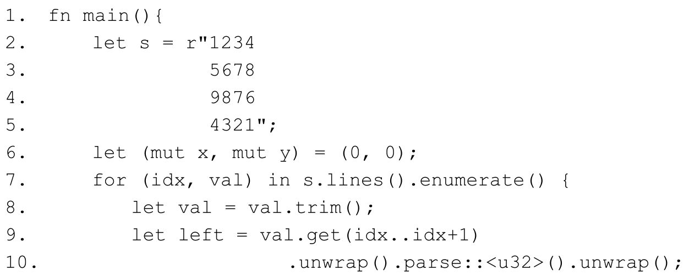{.u53919}
:::

::: center
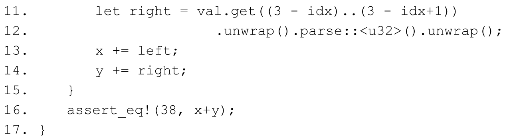{.u53918}
:::

在代码清单8-39中，代码第2～5行，使用原生字符串声明语法（r＂\...＂）将数字方阵定义为字符串。该语法的好处是，可以保留原来字符串中的特殊符号。

代码第6行，声明两个整数变量用于记录两条对角线上的数字之和，最终将这两个变量加起来就得到所求结果。

代码第7～15行，使用for循环迭代数字方阵字符串的每一行来获取对角线上的数字进行累加求和。其中使用了字符串的 lines 方法，可以自动按换行符迭代字符串，然后使用了enumerate方法来获取行号索引。

代码第8行，在for循环中使用trim方法将每一行的子字符串两头多余的空格删除。

代码第9行和第10行，使用get方法结合范围参数来获取相关位置的字符。这里使用了一个技巧，斜线对角线位置字符的索引正好等于循环行号索引。获取到相应位置的字符，需要用parser方法将该字符转换为u32类型。

代码第11行和第12行，使用get方法获取反斜线对角线位置的字符，而该对角线上的字符位置索引正好和循环行号索引相反，所以这里使用了另一个技巧，使用3减去循环行号索引就得到相应对角线上的位置。

第13行和第14行，分别累加两条对角线上的字符值之和。代码第16行，分别将两条对角线上的数字之和相加，即可得到最终结果38。

随书源码中也给出了其他实现方法。

## 8.2 集合类型 {#text00014.html#A83160125-2c61-4f64-8a35-f399f12dca12 .title-left}

Rust标准库中提供的集合类型包括以下几种：

· **Vec＜T＞** ，动态可增长数组。

· **VecDeque＜T＞** ，基于环形缓冲区的先进先出（FIFO）双端队列实现。

· **LinkedList＜T＞** ，双向链表实现。

· **BinaryHeap＜T＞** ，二叉堆（最大堆）实现，可用作优先队列。

· **HashMap＜K，V＞** ，基于哈希表的无序K-V映射集实现。

· **BTreeMap＜K，V＞** ，基于B树的有序映射集实现，按Key排序。

· **HashSet＜T＞** ，无序集合实现。

· **BTreeSet＜T＞** ，基于B树的有序集合实现。

以上最常用的集合类型为Vec＜T＞和HashMap＜K，V＞，接下来主要介绍这两种集合类型。

### 8.2.1 动态可增长数组 {#text00014.html#A573e0125-84a0-47f6-98ca-c618548c5304 .title-left}

Rust中数组有两种类型：一种是原生类型array，它拥有固定的长度，类型签名为\[T；N\]；另一种是动态可增长数组Vector，它是可增长的动态数组，类型签名为Vec＜T＞，在运行时才可知道大小。在第4章中已经介绍过，array和Vector的区别在于，array中的元素可以在栈上存储；而Vector中的元素只能在堆上分配。本章着重介绍动态可增长数组Vector。

**基本操作与内存分配**

创建Vector和创建String类型字符串的方法很相似，因为String类型的字符串本身就是对Vec＜u8＞类型的包装。代码清单8-40展示了Vector的基本操作。

**代码清单8-40：Vector基本操作**

::: center
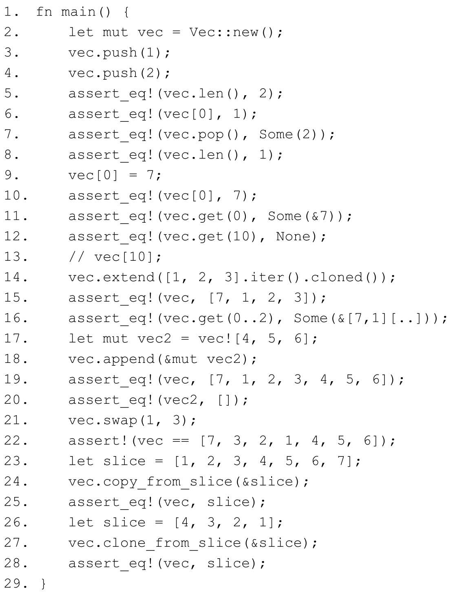{.u53917}
:::

在代码清单8-40中，代码第2行，使用Vec：：new方法可以创建一个可变的Vector空数组，与String：：new类似，实际上并未分配堆内存。如果在整个函数中都未为其填充元素，则Rust编译器会认定它为未初始化内存，编译器报错。

代码第3行和第4行，使用push方法插入数字类型，这里编译器会默认推断其类型为i32。

代码第5行，使用len方法查看vec的大小为2，因为已经插入了两个元素。

代码第6行，通过索引访问相应位置的元素。

代码第7行，通过pop方法弹出vec末尾的元素。可以看出，Vector数组天生就可以作为先进后出（FILO）的栈结构使用。注意pop方法返回的是Option＜T＞类型，当数组为空时，会返回None，从而避免线程崩溃。此时使用len 方法查看vec，其长度已经变为1，如代码第8行所示。

代码第9行，通过索引访问也可以修改相应位置的元素，这里把索引为0的元素改为7，如代码第10行所示。

代码第11～13行，分别使用get方法和索引对vec进行越界访问。get方法返回的是None，而通过索引直接访问则会导致线程崩溃。

代码第14行，使用extend方法给vec数组追加元素，其参数为一个迭代器。其结果如代码第15行所示。Vector数组也支持迭代器，在本书中迭代器相关章节已经有足够详细的介绍，这里不再赘述。

代码第16行，通过给get方法传入索引范围，可以获取相应的数组切片。

代码第17～20行，通过append方法可以给一个Vector数组追加另一个数组，其参数为可变借用，如代码第18行所示。但是这两个Vector数组都将发生变化，如代码第19行和第20行所示。

代码第21行，使用swap方法可以交换两个指定索引位置的元素，所得结果如代码第22行所示。

代码第23行和第24行，通过copy_from_slice方法可以使用一个数组切片将原vec数组中的元素全部替换，如代码第 25 行所示。但是注意，数组切片必须和原数组等长，否则会引发线程崩溃。需要注意的是，该方法只支持实现Copy语义的元素。

代码第26行和第27行，使用clone_from_slice方法的效果和copy_from_slice是等价的，但它们的区别是，clone_from_slice方法支持实现Clone的类型元素。

除了这些方法，还可以使用with_capacity预分配堆内存的方式来创建Vector数组，如代码清单8-41所示。

**代码清单8-41：Vector堆内存预分配示例**

::: center
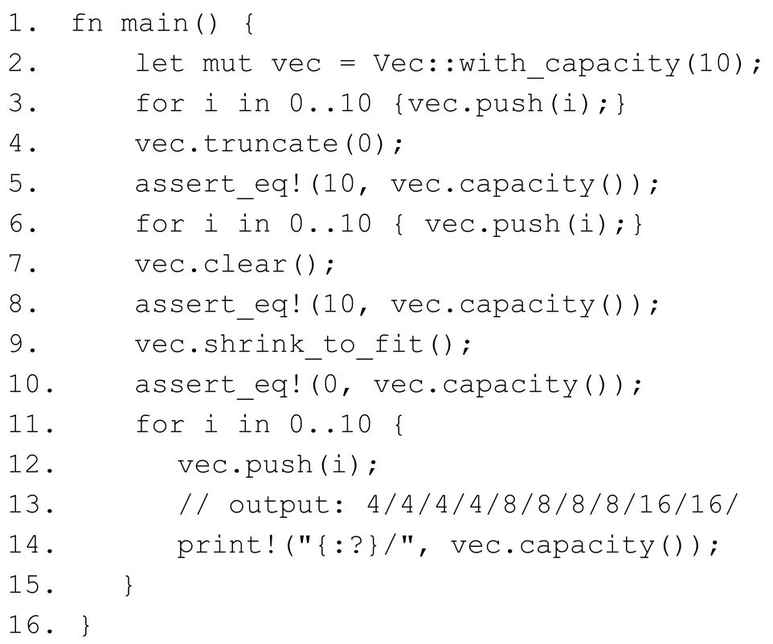{.u53916}
:::

在代码清单8-41中，使用了Vec：：with_capacity方法，和String：：with_capacity方法类似，可以预分配堆内存。这里分配了容量为 10 个单位的堆内存，实际上真正分配的堆内存大小等于数组中元素类型所占字节与给定容量值之积。

代码第3行，通过for循环在vec数组中插入数字0～9。数字默认推断为4字节，那么这里预分配的堆内存大小为容量值10乘以4字节等于40字节。

代码第4行，使用truncate方法从索引0开始截断，实际上效果等同于clear方法。但是这样只是清空了元素，并未释放预分配的堆内存。代码第5行显示vec容量依旧是10。

代码第6～8行，使用clear方法重复上述过程，结果相同，预分配的堆内存并未被释放。

代码第9行，使用了shrink_to_fit方法，预分配的堆内存被释放了。实际上，该方法只有在vec数组中元素被清空之后才会释放预分配的堆内存，当vec数组中元素并未占满容量空间时，就会压缩未被使用的那部分容量空间，相当于重新分配堆内存。

代码第11～15行，对已经被释放堆内存的vec数组，重新循环插入数字0～9，通过代码第14行的输出结果可以看出，第一次分配了容量为4，用完以后，自动将容量加到了8，待容量8用尽之后，又自动将容量加到了16，可见，容量是按倍数递增的。

所以，在日常编程中，使用Vec：：with_capacity方法来创建Vector数组可以有效地避免频繁申请堆内存带来的性能损耗。在代码清单8-41中用到的类型有基本大小，比如i32占4字节。但在Rust中有些类型是不占字节的，属于零大小类型（ZST），那么它是怎么存储的呢？对于使用Vec：：new方法创建的空数组，如果没有分配堆内存，那么它的指针指向哪里？代码清单8-42展示了Vector数组存储零大小类型示例。

**代码清单8-42：Vector数组存储零大小类型示例**

::: center
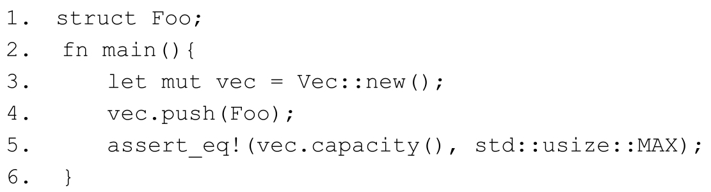{.u53915}
:::

在代码清单8-42中，定义了一个单元结构体Foo，该结构体并不占用内存，属于零大小类型。代码第3行使用Vec：：new初始化了一个Vector空数组。Vector数组本质属于一种智能指针，跟 String 类型的字符串一样，它也由三部分组成：指向堆中字节序列的指针（as_ptr方法）、记录堆中字节序列的字节长度（len方法）和堆分配的容量（capacity方法）。因为此时并未预分配堆内存，所以其内部指针并非指向堆内存，但它也不是空指针，Rust在这里做了空指针优化。

代码第4行，使用push方法插入Foo实例（单元结构体的实例就是它自己），因为Foo是零大小类型，所以也不会预分配堆内存。

代码第5行显示，此时vec的容量竟然等于std：：usize：：MAX，该值代表usize类型的最大值。实际上这里是Rust内部实现的一个技巧，用一个实际不可能分配的最大值来表示零大小类型的容量。

所以，我们可以放心地使用Vector，而不必担心内存分配会带来任何不安全的问题。

**查找与排序**

数组也支持字符串中提供的一些查找方法，比如contains、starts_with和ends_with方法，如代码清单8-43所示。

**代码清单8-43：contains等方法使用示例**

::: center
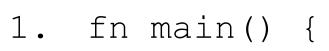{.u53914}
:::

::: center
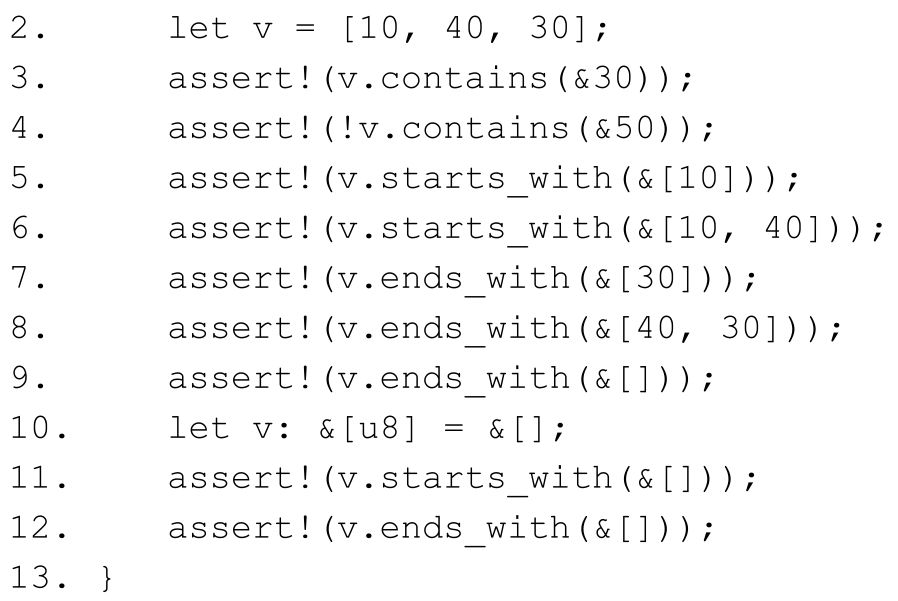{.u53853}
:::

在代码清单8-43中展示的contains、starts_with和ends_with都是泛型方法。它们有一个共同的trait限定：PartialEq＜T＞，该trait定义了一些方法用于判断等价关系，本章后面会有详细介绍。contains只能接收引用类型，starts_with和ends_with接收的是数组切片类型。

除这三个方法之外，标准库中还提供了binary_search系列泛型方法来帮助开发者方便地检索数组中的元素，如代码清单8-44所示。

**代码清单8-44：binary_search系列泛型方法使用示例**

::: center
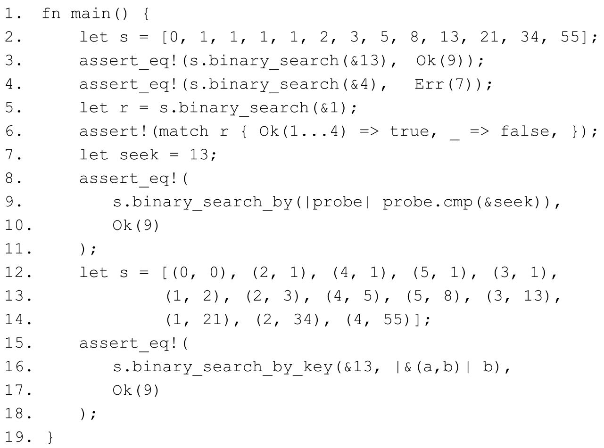{.u53913}
:::

binary_search 方法又叫作二分查找或折半查找方法，基本要求是待查找的数组必须是有序的，该算法的平均时间复杂度为*O* （log*n* ），空间复杂度用迭代实现，所以是*O* （1）。

在代码清单8-44中，代码第2～6行展示了binary_search方法，其参数为一个引用类型，且该参数类型必须实现Ord。Ord trait抽象了比较操作，本章后面会有详细介绍。在本例中，binary_search 方法接收&13 作为参数，返回 Result 类型的参数 Ok（9），表示其所在索引为 9的位置。对于找不到的元素，则返回Err。如果要处理Result类型，则可以使用match匹配，如代码6行所示。

代码第 7～11 行展示了 binary_search_by 方法，该方法的参数是一个 FnMut（&＇a T）-＞Ordering闭包。Ordering是一个枚举类型，记录的是三种比较结果：小于（Less）、等于（Equal）和大于（Greater）。代码第9行闭包中所用的cmp方法是Ord trait中所定义的，所以该方法只能用于检索实现了Ord的类型。binary_search_by方法最终返回的结果同样是Result类型。

代码第12～18行，binary_search_by_key方法和binary_search_by方法一样，都可以接收闭包参数，但它们的区别在于，binary_search_by_key方法接收的是FnMut（&＇a T）-＞B闭包，其中B对应于参数的类型（&B），相比于binary_search_by方法，该方法的闭包参数覆盖范围比较广，相当于开发者可以指定任意检索条件。代码第 12 行定义的数组是以元组第二位进行排序的有序数组。代码第16行中使用的闭包，同样是按元组第二位来设置检索条件的，最终返回的结果是Result类型。

上面介绍的二分查找binary_search系列泛型方法的前置要求是必须是有序数组，对于没有排序的数组怎么办？Rust当然也提供了性能高效的排序方法：sort系列方法和sort_unstable系列方法。sort系列方法使用示例如代码清单8-45所示。

**代码清单8-45：sort系列方法使用示例**

::: center
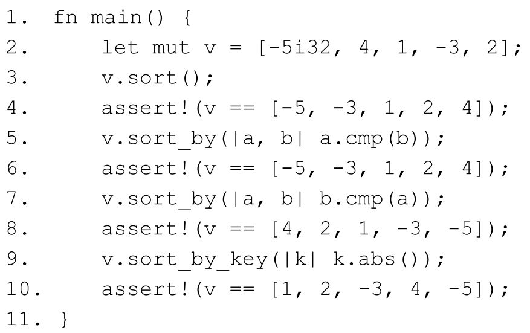{.u53912}
:::

在代码清单8-45中所用到的sort、sort_by和sort_by_key方法，其内部所用算法为自适应迭代归并排序（Adaptive/Iterative Merge Sort）算法，灵感来自Python语言中的TimSort算法。该算法为稳定排序算法，即序列中等价的元素在排序之后相对位置并不改变。其时间复杂度为*O* （*n* ），最坏情况为*O* （*n* log*n* ）。

代码清单 8-45 中的 sort 系列方法均可被直接替换为 sort_unstable、sort_unstable_by 和sort_unstable_by_key方法。但是sort_unstable 系列方法其内部实现的排序算法为模式消除快速排序（Pattern-Defeating Quicksort）算法，该算法为不稳定排序算法，也就是说，序列中等价的元素在排序之后相对位置有可能发生变化。其时间复杂度为*O* （*n* ），最坏情况为*O* （*n* log*n* ）。在不考虑稳定性的情况下，推荐使用sort_unstable系列方法，其性能要高于sort系列方法，因为它们不会占用额外的内存。

不管是sort系列方法还是sort_unstable系列方法，其命名规则和binary_search系列方法相类似，所以它们在语义上也是相同的，xxxx_by方法表示接收返回Ordering类型的闭包参数；而xxxx_by_key方法接收的闭包参数覆盖范围更广，适合表示任意检索（排序）条件。

**与排序和比较相关的trait**

在上面介绍的诸多数组方法中，其实都涉及数组内部元素的比较，比如判断是否存在、检索和排序都必须要在元素间进行比较。在 Rust 中把比较操作也抽象为一些 triat，定义在std：：cmd模块中。该模块中定义的trait是基于数学集合论中的二元关系偏序、全序和等价的。

偏序的定义，对于非空集合中的*a* 、*b* 、*c* 来说，满足下面条件为偏序关系。

· 自反性：*a* ≤*a* 。

· 反对称性：如果*a* ≤*b* 且*b* ≤*a* ，则*a* =*b* 。

· 传递性：如果*a* ≤*b* 且*b* ≤*c* ，则*a* ≤*c* 。

全序的定义，对于非空集合中的*a* 、*b* 、*c* 来说，满足下面条件为全序关系。

· 反对称性：若*a* ≤*b* 且*b* ≤*a* ，则*a* =*b* 。

· 传递性：若*a* ≤*b* 且*b* ≤*c* ，则*a* ≤*c* 。

· 完全性：*a* ＜*b* 、*b* ＜*a* 或*a* ==*b* 必须满足其一，表示任何元素都可以相互比较。

全序实际上是一种特殊的偏序。

等价的定义，对于非空集合中的*a* 、*b* 、*c* 来说，满足下面条件为等价关系。

· 自反性：*a* ==*b* 。

· 对称性：*a* ==*b* ，意味着*b* ==*a* 。

· 传递性：若*a* ==*b* 且*b* ==*c* ，则*a* ==*c* 。

在 Rust 中一共涉及四个 trait 和一个枚举体来表示上述二元关系。四个 trait 分别是PartialEq、Eq、PartialOrd和Ord。这些trait的关系可以总结为以下几点：

· PartialEq代表部分等价关系，其中定义了eq和ne两个方法，分别表示"=="和"！="操作。

· Eq 代表等价关系，该 trait 继承自 PartialEq，但是其中没有定义任何方法。它实际上相当于标记实现了Eq的类型拥有等价关系。

· PartialOrd对应于偏序，其中定义了partial_cmp、lt、le、gt和ge五个方法。

· Ord对应于全序，其中定义了cmp、max和min三个方法。

还有一个枚举体为 Ordering，用于表示比较结果，其中定义了小于、等于和大于三种状态。

代码清单8-46展示了PartialEq和Eq的定义。

**代码清单8-46：PartialEq和Eq定义**

::: center
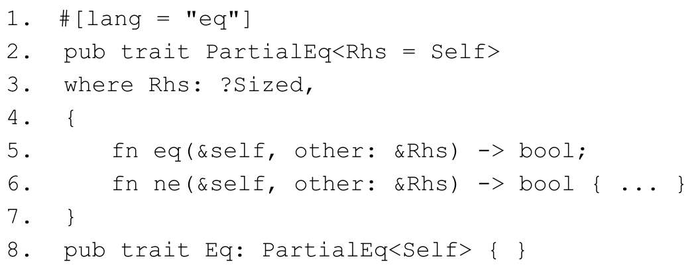{.u53718}
:::

PartialEq中定义了eq和ne方法，但是其中ne有默认实现。如果需要实现PartialEq，只需要实现eq这一个方法就可以。Eq实则起标记作用，并没有实际的方法。

代码清单8-47展示了PartialOrd的定义。

**代码清单8-47：PartialOrd定义**

::: center
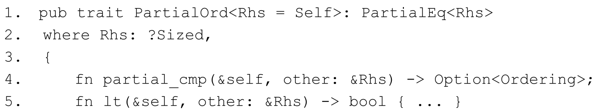{.u53472}
:::

::: center
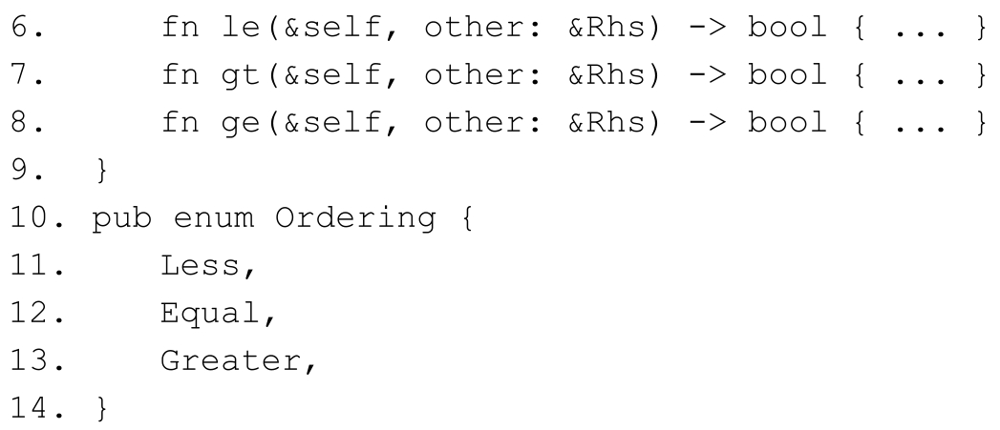{.u53911}
:::

代码清单8-47展示了定义于std：：cmp模块中的PartialOrd。该trait中定义了五个方法，其中partial_cmp方法表示具体的比较规则，注意其返回Option＜Ordering＞类型，因为对于偏序的比较来说，并不是所有元素都具有可比性，有些元素的比较结果可能为None。其他四个方法 lt、le、gt、ge 分别代表小于、小于或等于、大于和大于或等于，包含了默认实现。如果要给某个类型实现PartialOrd，只需要实现partial_cmp方法即可。

代码清单8-48展示了Ord的定义。

**代码清单8-48：Ord定义**

::: center
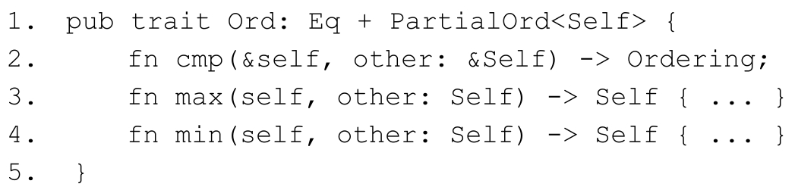{.u53910}
:::

从代码清单8-48中可以看出，Ord继承自Eq和PartialOrd，这是因为全序的比较必须满足三个条件：反对称性、传递性和完全性，其中完全性一定是每个元素都可以相互比较。举个例子，在浮点数中用于定义特殊情况值而使用的 NaN，其本身就不可比较，因为 NaN！=NaN，它不满足全序的完全性，所以浮点数只能实现PartialEq和PartialOrd，而不能实现Ord。如果要实现Ord，只需要实现cmp方法即可，因为max和min都有默认实现。注意cmp方法返回Ordering类型，而不是Option＜Ordering＞类型，因为对于全序关系来说，每个元素都是可以获得合法的比较结果的。

在Rust中基本的原生数字类型和字符串均已实现了上述trait，如代码清单8-49所示。

**代码清单8-49：比较操作示例**

::: center
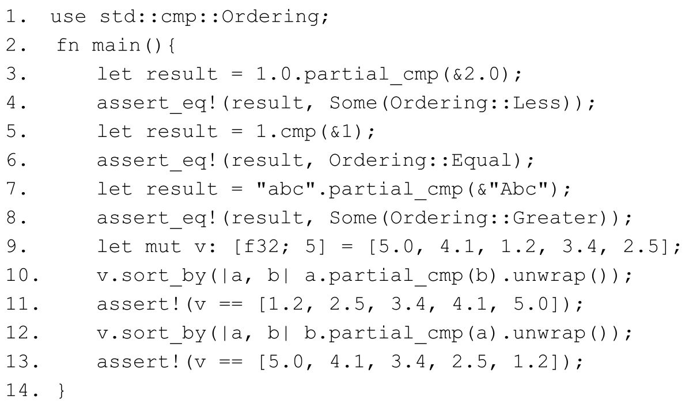{.u53909}
:::

在代码清单8-49中，代码第3行比较的是浮点数，只能用偏序比较，所以使用partial_cmp方法，最终返回Some（Ordering：：Less），如代码第4行所示。

代码第 5 行比较的是整数类型，满足全序关系，所以使用 cmp 方法，最终返回Ordering：：Equal。

代码第7行比较的是字符串，满足偏序关系，其默认为字典序，也就是按字符串首字母进行比较的，所以使用partial_cmp方法。最终结果如代码第8行所示。

代码第9行定义了一个浮点数数组，代码第10行使用sort_by方法为其排序，传入的闭包参数为a.partial_cmp（b）。而sort_by是按a和b的比较结果是否等于Less的规则进行排序的，如果a小于b，则为升序，如代码第11行所示；如果b小于a，则为降序，如代码第13行所示。

如果要在自定义类型中实现相关 trait，则必须搞清楚全序和偏序关系，然后再实现相应的trait。可以手工实现，也可以使用＃\[derive\]来自动派生。

**回顾与展望**

本节虽然重点介绍的是Vector，但是里面涉及的方法同样适用于array。因为这些方法实际上是为**\[T\]** 类型实现的，如代码清单8-50所示。

**代码清单8-50：为\[T\]类型实现的方法**

::: center
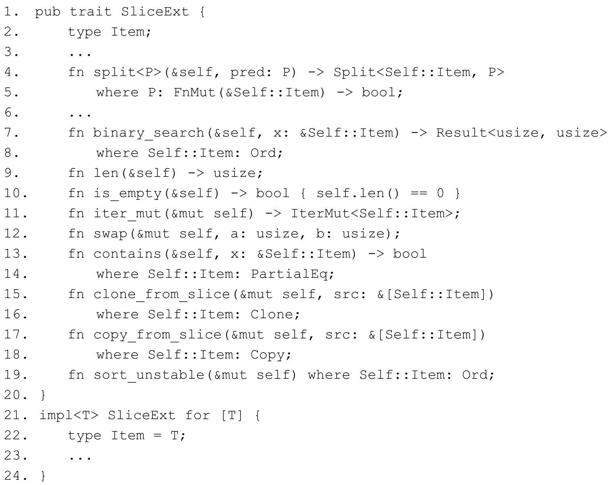{.u53908}
:::

在代码清单8-50中展示了定义于core：：slice模块中的SliceExt，该trait中定义了很多方法，这里只展示了一部分，本节介绍过的一些方法都定义于其中。从代码第21行可以看到，实际上为\[T\]类型实现了SliceExt。

当然，array也有自己专用的方法，比如连接两个array可以使用join方法。在标准库中还为数组提供了很多其他方法，限于篇幅，这里无法一一介绍，但是可以在标准库文档中看到每个方法的具体方法签名和使用示例。

在Rust 2018中，还加入了针对array数组和切片进行match匹配的新语法。match匹配array数组示例如代码清单8-51所示。

**代码清单8-51：match匹配array数组示例**

::: center
{.u53907}
:::

在代码清单 8-51 中实现了 pick 函数，它接收一个定长的数组，通过匹配数组的不同元素，可以实现指定的功能。该代码可以挑选出以3结尾和第二个元素为2的数组。注意match匹配的最后一个分支，必须使用通配符或其他变量来穷尽枚举。

当前Rust使用array数组局限性比较大，不过该语法还支持数组切片，所以利用数组切片就可以模拟变长参数的函数，如代码清单8-52所示。

**代码清单8-52：match匹配数组切片示例**

::: center
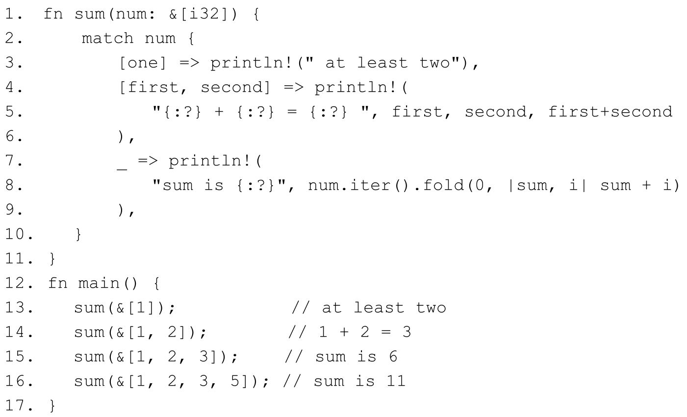{.u53906}
:::

在代码清单8-52中利用数组切片的match语法，模拟了可变参数的sum函数的实现。从输出结果可以看出，切片数组不同的元素个数，产生了不同的输出结果。

### 8.2.2 映射集 {#text00014.html#Af40d012f-b051-4627-b963-796784b9bd1b .title-left}

在日常编程中，另一个常用的数据结构非**映射集（Map）** 莫属。Map 是依照键值对（Key-Value）形式存储的数据结构，每个键值对都被称为一个**Entry** 。在Map中不能存在重复的Key，并且每个Key必须有一个一一对应的值。Map提供的查找、插入和删除操作的时间复杂度基本都是*O* （1），最坏情况也只是*O* （*n* ），虽然需要消耗额外的空间，但是随着当下可利用的内存越来越多，这种用空间换时间的做法也是值得的。Rust提供了两种类型的Map：基于哈希表（HashTable）的 **HashMap** 和基于多路平衡查找树（B-Tree）的 **BTreeMap** 。本节主要介绍HashMap。

**HashMap的增、删、改、查**

代码清单8-53展示了部分HashMap使用示例。

**代码清单8-53：部分HashMap使用示例**

::: center
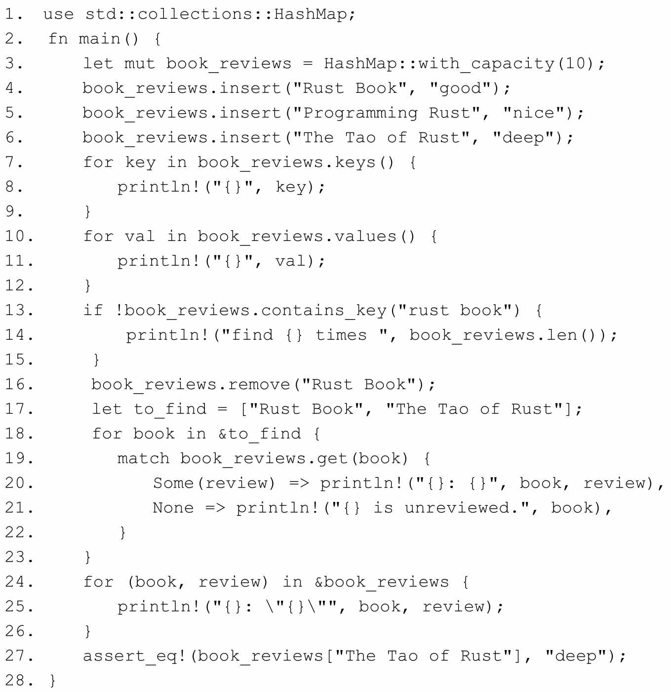{.u53905}
:::

在代码清单8-53中，使用HashMap：：with_capacity方法来创建一个空的HashMap，跟String或Vector类似，该方法可以预分配内存。同样，也可以使用HashMap：：new，但不会预分配内存。

代码第 4～6 行，通过 insert 方法向 HashMap 中插入字符串字面量类型的键值对，此时HashMap的类型确定为HashMap＜&str，&str＞。

代码第7～12行，通过keys和values方法可以分别单独获取HashMap中的键和值，注意这两个方法是迭代器。因为HashMap是无序的映射表，所以在迭代键和值的时候，输出的顺序并不一定和插入的顺序相同。

代码第13～15行，使用contains_key方法来查找指定的键，如果没有找到，就输出相应的信息，如代码第14行所示，这里通过len方法输出了HashMap键值对的长度。

代码第16～23行，使用remove方法按指定的键删除HashMap中的一个键值对，然后在对HashMap的迭代中通过get方法逐个查找指定的键。因为get方法返回的是Option＜T＞类型，所以这里需要用match进行匹配。如果找到，则匹配 Some（review），打印键值对；如果没找到，则输出相关信息。

代码第24～26行，通过元组（book，review）在for循环中分别使用键（book）和值（review）。

代码第27行，通过Index语法可以按指定的键来获取对应的值。这里需要注意的是，目前Rust只支持Index，而不支持IndexMut。也就是说，只可以通过hash\[key\]方式来取值，而不能通过hash\[key\]=value方式来插入键值对，这是因为针对该特性正在准备一个更好的设计方案，并在不远的将来得到支持。

**Entry模式**

对于 HashMap 中的单个桶（Bucket）来说，其状态无非是"空"和"满"，所以 Rust对此做了一层抽象，使用Entry枚举体来表示每个键值对，如代码清单8-54所示。

**代码清单8-54：Entry定义**

::: center
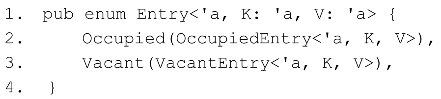{.u53904}
:::

在代码清单8-54中展示了Entry的定义，其中包含两个变体：Occupied（OccupiedEntry＜＇a，K，V＞）和Vacant（VacantEntry＜＇a，K，V＞）。OccupiedEntry＜＇a，K，V＞和VacantEntry＜＇a，K，V＞是内部定义的两个结构体，分别对应HashMap底层桶的存储信息。其中Occupied代表占用，Vacant代表留空。

Entry一共实现了三个方法，通过这三个方法可以方便地对HashMap中的键值对进行操作，如代码清单8-55所示。

**代码清单8-55：entry方法使用示例**

::: center
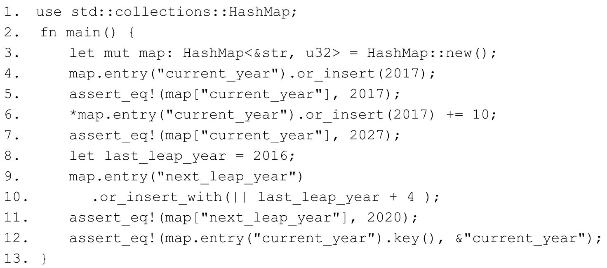{.u53903}
:::

在代码清单8-55中展示了Entry枚举体实现的三个稳定的方法：or_insert、or_insert_with和key。要使用这三个方法，必须先通过entry方法得到Entry＜K，V＞。

代码第3行，使用HashMap：：new创建了一个空的HashMap。代码第4行，通过entry方法，将键作为参数传入得到Entry。本例中的键为"current_year"，它被传入entry方法内部之后，首先会判断哈希表是否有足够的空间，如果没有，则进行自动扩容。接下来调用内部的hash函数生成此键的hash值，然后通过这个hash值在底层的哈希表中搜索，如果能找到此键，则返回相应的桶（Occupied）；如果找不到，则返回空桶（Vacant）。最后，将得到的桶转换为Entry＜K，V＞并返回。

在得到Entry之后，就可以调用其实现的or_insert方法，该方法的参数就是要插入的值，并且返回该值的可变借用。所以才可以像代码第6行那样，通过解引用操作符"\*"对or_insert方法的结果进行修改。

代码第8～10行，使用or_insert_with方法可以传递一个可计算的闭包作为要插入的值。注意，其只允许传入FnOnce（）-＞V的闭包，也就是说，闭包不能包含参数。

代码第12行，可以通过key方法来获取Entry的键。

代码清单8-56展示了or_insert方法的源码。

**代码清单8-56：or_insert方法源码**

::: center
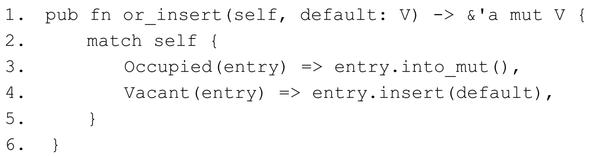{.u53902}
:::

从代码清单8-56中可以看出，通过entry方法从底层找到相应的桶之后，再通过match方法分别处理不同类型的桶。如果是占用的桶（Occupied（entry）），则通过into_mut方法将其变成可变借用，这样就可以被新插入的键值对覆盖。如果是空桶（Vacant（entry）），则使用相应的insert方法直接插入，注意此时的insert方法是为VacantEntry定义的insert方法。

**合并HashMap**

如果需要合并两个HashMap，则可以使用迭代器的方式，如代码清单8-57所示。

**代码清单8-57：HashMap的三种合并方式**

::: center
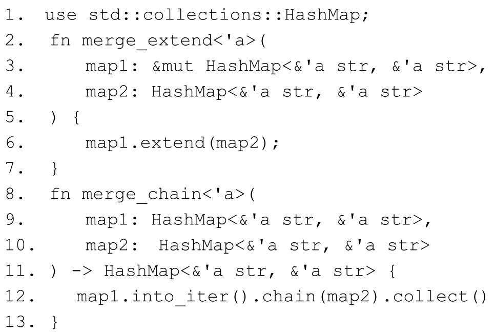{.u53901}
:::

::: center
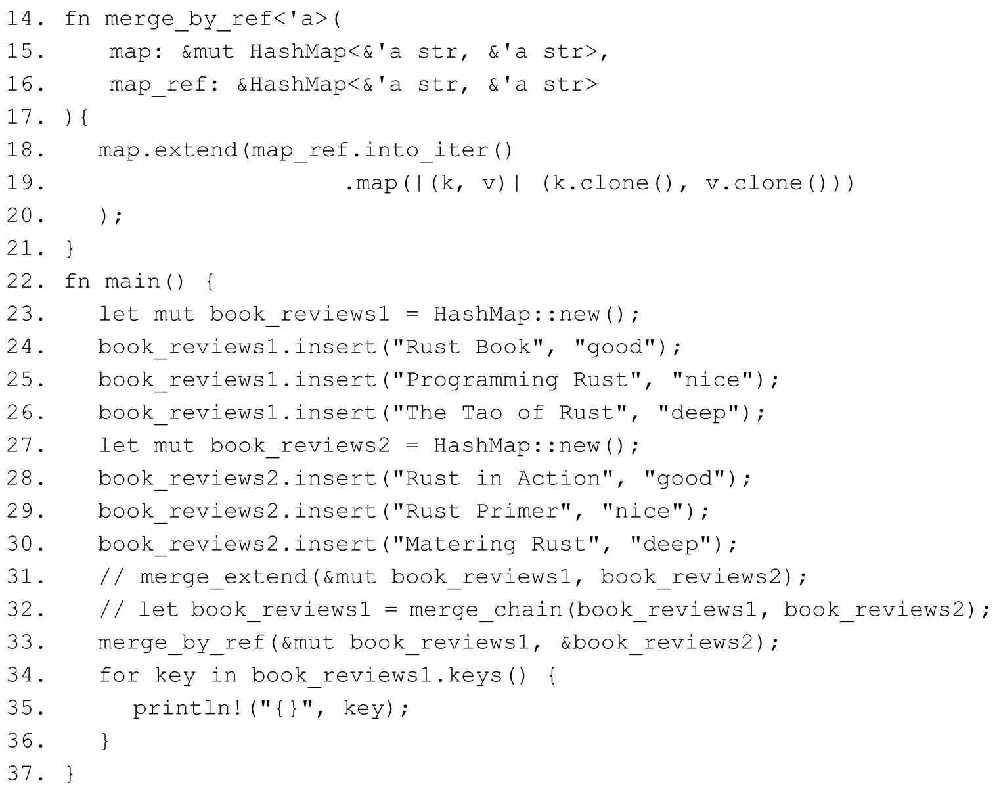{.u53541}
:::

在代码清单8-57中展示了HashMap的三种合并方式。

代码第2～7行，定义了merge_extend方法，通过extend方法来合并两个HashMap。代码第31行调用了此方法。本质上，在extend方法内部也将HashMap转换为迭代器进行操作。

代码第8～13行，定义了merge_chain方法，同样是通过into_iter得到Chain迭代器，然后合并的。代码第32行是对该方法的调用。

代码第14～21行，定义了merge_by_ref方法，使用的同样是extend，只不过传入了第二个HashMap的引用。代码第33行调用了此方法，其参数都是引用，它不会把两个HashMap的所有权转移掉，所以代码第34行的for循环才可以正常打印。

**HashMap底层实现原理**

不管哪门语言，实现一个HashMap的过程均可以分为三大步骤：

（1）实现一个Hash函数。

（2）合理地解决Hash冲突。

（3）实现HashMap的操作方法。

HashMap的底层实际上是基于数组来存储的，当插入键值对时，并不是直接插入该数组中，而是通过对键进行Hash运算得到Hash值，然后和数组的容量（Capacity）取模，得到具体的位置后再插入的。HashMap插入过程示意图如图8-9所示。

::: center
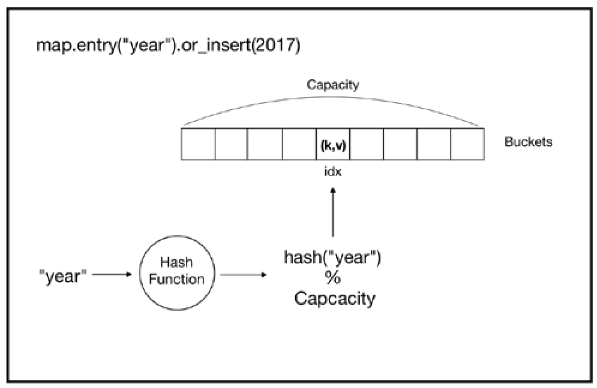{.u53900}

图8-9：HashMap插入过程示意图
:::

从HashMap中取值的过程与之相似，对指定的键求得Hash值，再和容量取模之后就能得到底层数组对应的索引位置，如果指定的键和存储的键相匹配，则返回该键值对；如果不匹配，则代表没有找到相应的键。

在整个过程中最重要的是**Hash函数** 。一个好的Hash函数不仅性能优越，而且还会让存储于底层数组中的值分布得更加均匀，减少冲突的发生。简单来说，Hash函数相当于把原来的数据映射到一个比它更小的空间中，所以冲突是无法避免的，可以做的只能是减少 Hash碰撞发生的概率。一个好的Hash函数增强了映射的随机性，所以碰撞的概率会降低。

**Hash碰撞（Hash Collision）** 也叫Hash冲突，是指两个元素通过Hash函数得到了相同的索引地址，该存储哪一个是需要解决的问题，而这两个元素就叫作同义词。除 Hash 函数的好坏之外，Hash 冲突还取决于**负载因子（Load Factor）** 这个因素。负载因子是存储的键值对数目与容量的比例，比如容量为100，存储了90个键值对，负载因子就是0.9。负载因子决定了HashMap什么时候扩容，如果它的值太大了，则说明存储的键值对接近容量，增加了冲突的风险；如果值太小了，则浪费空间。所以，单靠 Hash 函数和负载因子是不行的，还需要有另外解决冲突的方法。

Rust标准库实现的HashMap，默认的Hash函数算法是SipHash13。另外，标准库还实现了SipHash24。SipHash算法可以防止**Hash碰撞拒绝服务攻击（Hash Collision DoS）** ，这种攻击是一种基于各语言Hash算法的随机性而精心构造出来的增强Hash碰撞的手段，被攻击的服务器CPU占用率会轻松地飙升到100%，造成服务的性能呈指数级下降。正是基于这个原因，很多语言都换成了SipHash算法，该算法配合随机种子可以起到很好的防范作用。Rust提供的SipHash13性能更好，而SipHash24更安全。但使用SipHash并非强制性的，Rust提供了**可插拔** 的实现机制，让开发者可以根据实际需要更换 Hash 算法，比如换成随机性更好的Fnv算法。

代码清单8-58展示了与Rust中Hash相关的trait源码。

**代码清单8-58：Rust中与Hash相关的trait源码**

::: center
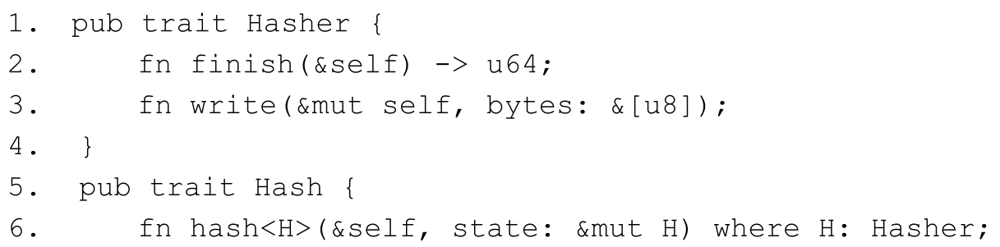{.u53899}
:::

::: center
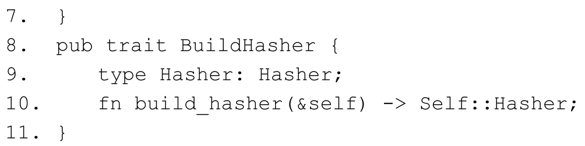{.u53898}
:::

代码清单8-58只是展示了部分与Hash相关的trait源码。代码第1～4行定义的**Hasher** 是对具体Hash算法的抽象，其中write方法根据传入的键写入相应的映射结果，finish方法则得到最终的写入结果。

代码第5～7行定义了**Hash** trait，其中包含了hash方法，是对Hasher中write行为的包装。

代码第8～11行定义的**BuildHasher** ，则是对Hasher的抽象，通过build_hasher可以指定适合的Hasher。

这三个trait是Rust中Hash算法可插拔的基础。在Rust中，每个实现了**Hash** 和**Eq** 两个trait的类型，均可以作为HashMap的键，所以并不能直接用浮点数类型作为HashMap的键。代码清单8-59展示了第三方包fnv实现的Fnv算法。

**代码清单8-59：Fnü算法实现源码**

::: center
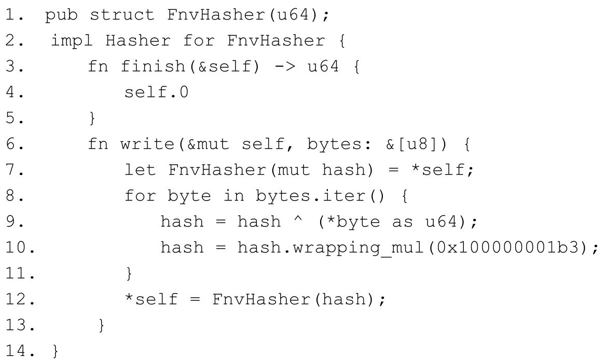{.u53897}
:::

代码清单8-59只是展示了部分源码，可以看出，只需要实现Hasher即可，非常方便。再来看看标准库中HashMap的实现，如代码清单8-60所示。

**代码清单8-60：HashMap实现源码**

::: center
{.u53896}
:::

::: center
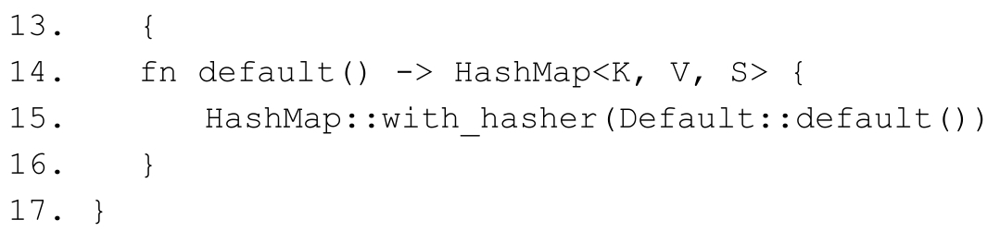{.u53895}
:::

在代码清单 8-60 中，代码第 1～5 行是 HashMap 结构体的定义，包含了三个字段：hash_builder、table和resize_policy。其中hash_builder字段指定了泛型类型S，且给定了一个RandomState类型，RandomState类型实际包装了一个DefaultHasher，它指定了SipHasher13为默认的 Hash 算法，并且 RandomState 在线程启动时指定了一个随机种子，以此来增强对Hash碰撞拒绝服务的保护。

table字段是HashMap用于底层存储的数组RawTable＜K，V＞。resize_policy属于预留字段，用于以后方便从外部指定HashMap的扩容策略，现在还未有具体实现，当前的默认扩容策略为负载因子达到0.9时则进行扩容。

代码第6～10行，为HashMap实现了new方法，该方法调用的是Default：：default方法。从代码第11～17行可以看出，HashMap实现了Default trait，其中with_hasher方法调用的是默认的SipHasher13。

现在完成了第一步，实现并创建了合理的 Hash 函数，接下来要寻找一种方法来合理地解决Hash冲突。在业界一共有四类解决Hash冲突的方法：**外部拉链法** 、**开放定址法** 、**公共溢出区** 和**再Hash法** 。

**外部拉链法** 并不直接在桶中存储键值对，它基于数组和链表的组合来解决冲突，每个Bucket都链接一个链表，当发生冲突时，将冲突的键值对插入链表中。外部拉链法的优点在于方法简单，非同义词之间也不会产生聚集现象（相比于开放定址法），并且其空间结构是动态申请的，所以比较适合无法确定表长的情况；缺点是链表指针需要额外的空间，并且遇到碰撞拒绝服务时HashMap会退化为单链表。

**开放定址法** 是指在发生冲突时直接去寻找下一个空的地址，只要底层的表足够大，就总能找到空的地址。这种寻找下一个空地址的行为，叫作**探测（Probe）** 。如何探测也是非常有讲究的，直接依次一个个地寻找叫作**线性探测（Linear Probing）** ，但是它在处理冲突时很容易聚集在一起。因此还有二次探测（Quadratic Probing），应该算是目前最常用的一种探测方法。另外还有随机探测，像Ruby语言在2.4版本中就使用了这种探测方法，在此之前，Ruby用的还是外部拉链法来解决冲突问题，而Python中的字典使用的是开放定址法和二次探测。开放定址法的优点在于计算简单、快捷，处理方便；缺点是它会产生聚集现象，并且删除元素也会变得十分复杂。

**公共溢出区** 就是指建立一个独立的公共区，把冲突的键值对都放在其中。**再 Hash 法** 就是指换另外一个Hash函数来算Hash值。这两种方法不太常用。

Rust采用的是**开放定址法加线性探测** ，对于线性探测容易聚集在一起的缺陷，Rust使用了**罗宾汉（Robin Hood Hashing）算法** 来解决。在线性探测时，如果遇到空桶，则正常插入；如果遇到桶已经被占用，那么就要看占用这个桶的键值对是经历过几次探测才被插入该位置的，如果该键值对的探测次数比当前待插入的键值对的探测次数少，则它属于"富翁"，就把当前的键值对插入该位置，再接着找下一个位置来安置被替换的"富翁"键值对。正是因为这种"劫富济贫"的思路，这种算法才被称为罗宾汉算法。

图8-10展示了Rust标准库中HashMap的实现思路。

::: center
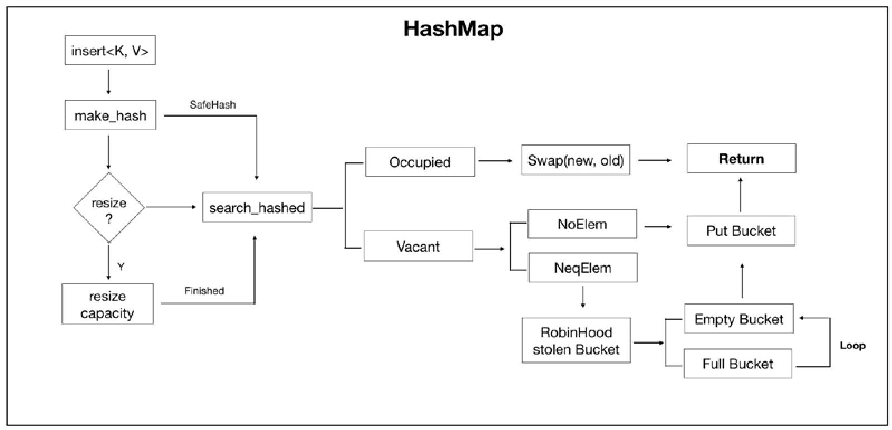{.u53894}

图8-10：Rust标准库中HashMap实现思路示意图
:::

当调用HashMap的insert方法时，首先会通过make_hash方法，将传入的键生成Hash值，通过内部的特殊处理（为了防止冲突）生成 SafeHash。得到 Hash 值之后，通过 resize方法判断是否需要扩容，不管是否需要扩容，最终都会调用到search_hashed方法。

search_hashed方法需要三个参数：HashMap的内部table指针、SafeHash和用于指定检索条件的FnMut（&K）-＞ bool闭包。该方法是按线性探测来寻找桶的，如果找到的是"空桶（Vacant）"，则直接返回。在内部，有两种类型的桶被认为是空桶，即NoElem和NeqElem，分别表示底层数组索引未被占用的桶和索引被占用但是可以被替换的桶。代码清单8-61展示了VacentEntryState内部定义。

**代码清单8-61：VacentEntryState内部定义**

::: center
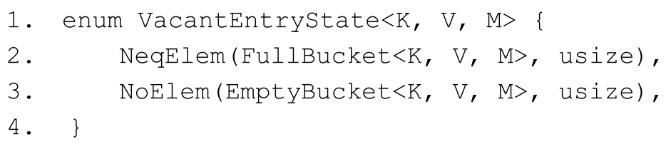{.u53893}
:::

从代码清单8-61中可以看出，NeqElem是对FullBucket的包装，NoElem是对EmptyBucket的包装，这两种桶类型分别代表底层被占用的桶和空桶。对于底层的桶只有占用和空两种状态，而通过VacantEntryState包装之后，空桶（Vacant）就多了一层语义：真正的空桶和值随时可以被替换的桶。其实在此处也体现了Rust中Enum枚举体的方便性。

如果在线性探测过程中找到的是 EmptyBucket，那么就将其包装为 NoElem 返回，然后就可以调用NoElem的insert方法将值直接插入。如果此时返回的是FullBucket，那么需要判断其探测次数是否比当前要插入的键值对的探测次数少，如果少，则将此桶中的值包装为NeqElem并返回。

对于NeqElem，其包含的是当前FullBucket中存储的值，Rust内部会使用robin_hood方法用新的值将其替换掉。替换掉的值当然不能扔掉，而要再次通过线性探测为其找到新的位置。在robin_hood方法内部通过两个嵌套的loop循环来保证新值和替换掉的值均被存储到合适的桶中。

如果探测次数不满足要求，那么比对 FullBucket 中存储的值的 Hash 值是否和search_hashed 方法传入的 Hash 值相匹配，如果匹配，则再比对存储的键是否和传入的键一致，如果一致就返回"满桶（Occupied）"。满桶（Occupied）是指最终查找到的和指定键一一对应的桶。如果是insert操作，则其内部会调用std：：mem：：swap方法用新值替换掉旧值。如果是get操作，则返回该桶中保存的值。

以上就是HashMap的整个实现思路。前面提到过，开放定址法的一个缺点是根据指定的键删除键值对比较复杂，因为并不能真的删除，否则会破坏寻址的正确性，但是Rust很轻松地解决了这个问题。

当使用HashMap的remove方法删除键值对时，同样需要将传入的键通过Hash函数计算出Hash值，然后经过search_hashed方法的检索，返回满桶（如果没有找到则返回None），再调用内部的 pop_internal 方法对桶进行删除处理。但这个删除并非真正的删除，而是通过gap_peek方法返回一个枚举类型GapThenFull，如代码清单8-62所示。

**代码清单8-62：GapThenFull枚举体示意**

::: center
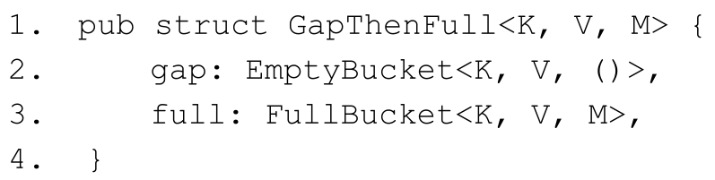{.u53892}
:::

使用GapThenFull枚举体来表示内部桶的两种状态，就完美地解决了remove的问题。此处也体现了Enum的强大之处。

在了解了 HashMap 的各种使用方法及其实现原理之后，有一点需要注意，在使用HashMap时，如果要合并两个或多个HashMap，则尽量使用extend或其他迭代器适配器方式，而不要用for循环来插入，否则会带来性能问题。

## 8.3 理解容量 {#text00014.html#Aedb70137-a112-447f-b061-d32bcebeae0d .title-left}

无论是 Vec 还是HashMap，使用这些集合容器类型，最重要的是理解容量（Capacity）和大小（Size/Len）的区别，如图8-11所示。

::: center
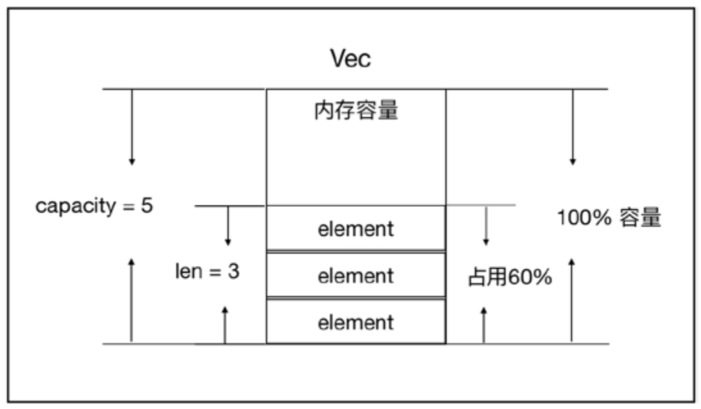{.u53891}

图8-11：容量和大小的区别
:::

从图8-11中可以看出，容量是指为集合容器分配的内存容量，而大小是指该集合中包含的元素数量。也就是说，容量和内存分配有关系，大小只是衡量该集合容器中包含的元素。当容量满了之后，这些集合容器都会自动扩容。但是对于不同的集合容器，定义容量**满** 或**空** 两种状态是不同的。如果搞不清楚这个问题，就可能会写出有安全漏洞的代码，即便是Rust这种号称内存安全的语言，也无法避免这种逻辑上的漏洞。

在Rust 1.21到1.3中，VecDeque集合类型中的reserve方法暴露了一个缓冲区溢出漏洞 ^[\[1\]](#text00014.html#n94840138219F46D092ADCCB1AC309D32){#text00014.html#n94840138219F46D092ADCCB1AC309D32s}^ ，允许任意代码执行。就是这样的逻辑漏洞，本质原因就是搞错了容量。

Rust的**VecDeque＜T＞** 是一种可增长容量的双端队列（Double-Ended Queue），具体用法在第2章中介绍过。其内部主要维护一个**环形缓冲区** （**Ring Buffer** ），如图8-12所示。

::: center
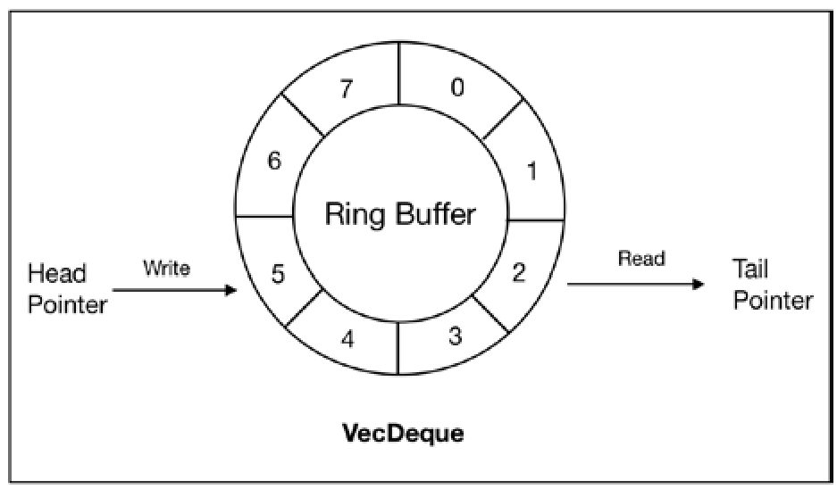{.u53890}

图8-12：VecDeque中环形缓冲区示意图
:::

该环形缓冲区由两个指针和一个可增长数组组成。这两个指针分别为**头指针（Head Pointer）** 和**尾指针（Tail Pointer）** 。其中头指针永远指向应该写入数据的位置，而尾指针永远指向可以读取的第一个元素。

以图8-12为例，环形缓冲区为空时，两个指针都指向位置0。当有新元素插入时，如果直接插入位置0，则将用于写入数据的Head指针指向位置1，而用于读取数据的Tail指针依旧指向位置0。依此类推，当插入第8个元素时，Head和Tail指针将再次重叠。那么在这种情况下，该如何区分头和尾？如果这时继续给缓冲区添加新元素，那么位置0处的数据将被其他数据覆盖，这就会造成**缓冲区溢出攻击** 。所以，为了避免这种情况，需要空出一个位置，不能插入元素，这样才可以区分头和尾。

在Rust中VecDeque＜T＞也是按这种思路来实现环形缓冲区的。在创建新的缓冲区时，自动保留一位，如代码清单8-63所示。

**代码清单8-63：VecDeque＜T＞中的with_capacity方法源码**

::: center
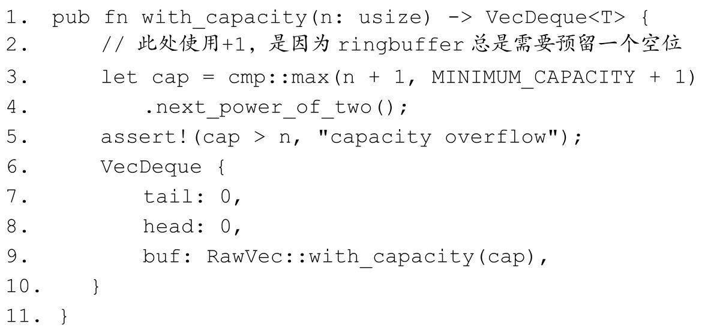{.u53889}
:::

代码清单8-63展示了VecDeque＜T＞中with_capacity方法的源码，注意代码第2行的注释，在初始化容量cap时，就已经考虑了至少保留一个空位的问题。

代码第3行，使用了一种特别的算法来计算要分配的容量。该算法就是next_power_of_two方法，表示要分配的容量必须大于或等于容量数*n* 的最小二次幂，比如传入的*n* 为2，则分配容量为 4。这是一种出于安全考虑的优化，如果传入的容量数溢出，则容量值会返回 0，也就是不预分配内容。

所以，要判断环形缓冲区是否为满状态，就必须看容量和大小的差是否为 1，如代码清单8-64所示。

**代码清单8-64：VecDeque＜T＞中的is_full方法源码**

::: center
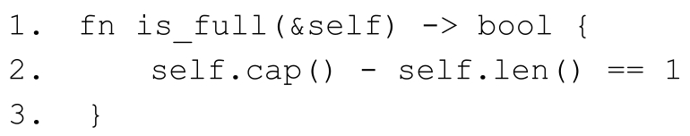{.u53888}
:::

代码清单8-64 展示了 VecDeque＜T＞中is_full 方法的源码，该方法用于判断容器是否为满状态。可以看出，该方法满足预期要求。

接下来看看曝出CVE的原始代码，如代码清单8-65所示。

**代码清单8-65：VecDeque＜T＞中出现安全漏洞代码**

::: center
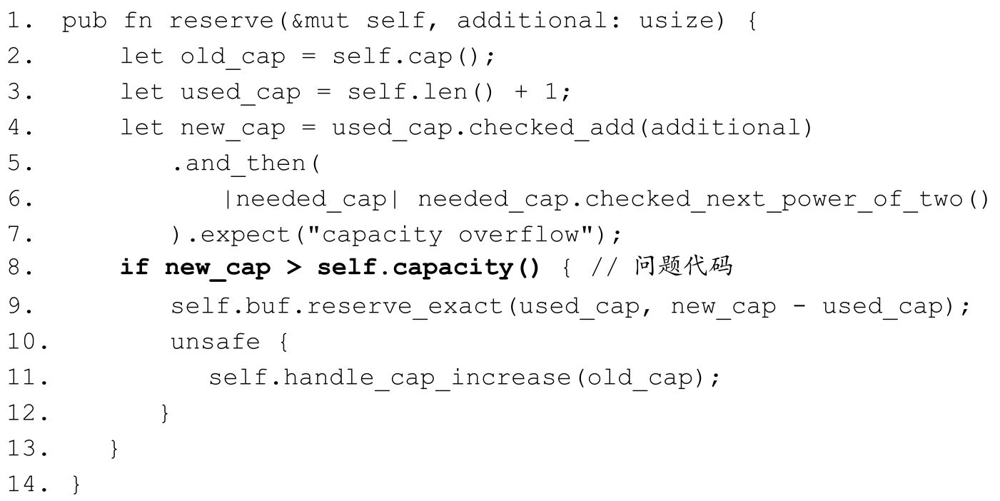{.u53887}
:::

代码清单8-65展示了出现安全漏洞代码的reserve方法。该方法一般用来为集合容器生成指定的更多的容量，这样可以避免容器频繁扩容。但是该方法的第8行犯了一个致命的错误。

代码第8行使用了capacity方法来判断容量。但是在VecDeque＜T＞中，capacity方法用于给开发者展示可用的逻辑容量，而cap方法展示的才是真正的物理容量，它们之间的关系是**cap=capacity+1** ，因为环形缓冲区必须保留一个空位。所以，这里使用capacity方法判断容量会导致容量分配少一位。如果容量少分配一位，那么在读写数据的过程中，指针还是按cap 表示的真实容量来计算，最终的后果就是本来空出的一位，也被写入了数据。这样就出现了本节开始提到的情况，指针错乱。在这种情况下，如果再写入新的数据，就会产生缓冲区溢出攻击的风险。

这个漏洞修复起来也很简单，只需要将第8行改成"if new_cap＞old_cap{"即可。其中old_cap才是真实的容量。

通过这个案例我们了解到，容量不仅仅是指"物理"上的内存容量，还包括由相应数据结构特性产生的"逻辑"容量。在日常开发中，需要注意这种情况，避免引入逻辑漏洞。

## 8.4 小结 {#text00014.html#Adef9013a-69fe-4313-bf9c-26c5738f0b92 .title-left}

字符串是一门编程语言必不可少的类型，Rust出于内存安全的考虑，将字符串划分为几种相互配对的类型，其中最常用的是&str和String类型的字符串。&str代表的是不可变的字符串，这里不可变的意思是指，这种类型的字符串是一个不可变的整体，无法对其中的单个字符进行任意操作（引起整个字符串发生变化）。&str 类型的字符串可以被存储在栈上，也可以被存储在堆上，还可以被存储在静态区域。而String代表的是可变的字符串，其只能被存储在堆上。可变是指String字符串中的单个字符可以随时被增、删、改。

在对Rust中的字符和字符串进行操作时，最好按字符来进行操作，因为Rust中的字符串内部存储的都是UTF-8字节序列，如果按字节进行操作，那么在某些情况下会出现问题。并且字符串也不支持按索引来访问其中的字符，如果要操作字符串中的字符，则需要使用迭代的方式。

不管是什么类型的字符串，都支持标准库中提供的字符串检索匹配方法，只要实现了Pattern＜＇a＞的类型，就均可作为匹配参数。比较常用的方法有contains、trim、trim_matches、matches、find等。因为Rust并没有内置正则表达式引擎，所以使用这些字符串匹配方法也是一种选择。在实际项目开发中，可以使用官方提供的正则表达式引擎 regex 包来支持正则匹配。

实际上，&str和String均为动态大小类型（DST）。字符串切片&str和数组切片是类似的，String是对Vec＜u8＞的包装。所以，字符串的某些方法和数组类型（array和Vector，以及slice）是通用的，比如with_capacity，不管是String字符串还是Vector数组，均可通过此方法来预分配堆内存。但是数组也有其独有的方法，比如实现了Index，可以按索引访问数组中的值。Rust标准库也为数组提供了方便、高效的排序和检索方法。

除数组之外，本章还重点介绍了HashMap类型。在Rust中，只有实现了Eq和Hash的类型才可以当作HashMap的键，所以浮点数无法直接作为HashMap的键。但是不妨碍开发者通过NewType模式对浮点数进行包装来实现将其作为键。

HashMap只实现了Index，而没有实现IndexMut，所以只能用索引语法查找键值对，而无法插入或修改键值对。但是Rust标准库另外提供了Entry模式来帮助开发者方便操作键值对。如果需要合并HashMap，则可以使用extend或其他迭代器适配器来完成，尽量不要使用for循环将一个HashMap插入另一个中。

本章介绍了HashMap的内部实现。我们知道Rust使用开放定址法来解决Hash冲突，并使用罗宾汉算法来解决聚集问题。当负载因子达到0.9的时候，HashMap会自动扩容，以保证容纳更多的键值对。通过了解HashMap的内部实现，我们可以学习到一些实用的开发技巧，比如利用Enum来解决remove键值对的问题。

本章最后还分析了VecDeque＜T＞中reserve方法曝出的CVE漏洞，主要原因是混用了"物理"容量和"逻辑"容量。这个案例说明了一个问题：Rust虽然可以保证内存安全，但无法保证逻辑安全。这是需要每个Rust开发者注意的地方。

在std：：collection中还提供了很多其他集合类型，比如 LinkedList＜T＞、BinaryHeap＜T＞、BTreeMap＜T＞、HashSet＜T＞和 BTreeSet＜T＞。限于篇幅，本章没有对它们做过多的介绍，但Rust是非常注重一致性的语言，在这些集合类型操作方法的命名上，和Vec＜T＞或HashMap＜K，V＞都是一致的，可以通过查阅标准库文档自行学习理解。总的来说，Rust实现的这些集合类型及其相关操作方法，都是从高性能和节省内存方向来考虑的，毕竟Rust的目标之一是系统级语言。Rust还在不断的进化中，标准库提供的这些集合类型还未达到最优，在不久的将来，它们会更加完善。

------------------------------------------------------------------------

[\[1\]](#text00014.html#n94840138219F46D092ADCCB1AC309D32s){#text00014.html#n94840138219F46D092ADCCB1AC309D32} CVE-2018-1000657.

[]{#text00015.html}

# 第9章 构建健壮的程序 {#text00015.html#A1042f0df-cd73-4112-891c-8e5756dc2411 .title-left}

每个人都有错，但只有愚者才会执迷不悟。

一个人，在经历挫折之时，可以反思错误，然后坚强面对；一栋大楼，在地震来临之际，可以吸收震力，屹立不倒；一套软件系统，在异常出现之时，可以阻止崩溃，稳定运行。这就是健壮性。健壮性是指系统在一定的内外部因素的扰动下，仍然可以维持其结构和功能的稳定性。健壮性，是保证系统在异常和危险情况下生存的关键。

健壮性又叫鲁棒性（Robust）。鲁棒性是一个跨领域的术语，在建筑、机械、控制、经济和计算机领域均意味着系统的容错和恢复能力。现实中建筑的鲁棒性带来的后果是非常直观和致命的，鲁棒性差的建筑很可能会因为一些局部性意外而使得整个建筑垮塌，所以在建筑行业，鲁棒性是非常重要的标准之一。而在软件行业，鲁棒性差的系统虽然不会带来像建筑那样显而易见的灾难性后果，但随着人类生活对互联网的依赖程度越来越深，其带来的破坏力会越来越严重。

纵观软件开发的历史，为了保证软件的健壮性，各门语言所用的办法各有特色，但总归可以分为两大类：**返回错误值** 和**异常** 。

比如在C语言中，并不存在专门的异常处理机制，开发者只能通过返回值、goto、setjump、assert 断言等方式来处理程序中发生的错误，这些方式的优点是比较灵活，但是缺点更多。第一，这种错误并不是强制性检查的，很容易被开发者疏忽而进一步引起更多的问题，成为Bug的温床；第二，可读性差，错误处理代码和正常的功能代码交织在一起，有可能会让正常逻辑陷入混乱中，有人称之为"错误地狱"。

随着C++、Java等高级语言的发展，引入了语言级别的异常处理机制，才让开发者摆脱了"错误地狱"。异常处理机制利用**栈回退（Stack Unwind）** 或**栈回溯（Stack Backtrack）** 机制，自动处理异常，解放了开发者。异常处理的优点是它是全局且独立的，不需要所有的函数都考虑捕获异常，并且用专门的语法将异常处理逻辑和正常的功能逻辑清晰地分离开来。但是异常处理并不完美。首先，异常处理的开销比较大，尤其是在抛出异常时；其次，异常处理包含的信息太多，对于开发者来说，如何优雅高效地进行异常处理，又成为另一个难题。

Rust作为一门现代安全的系统级编程语言，如何构建健壮的程序是其必然要解决的问题之一，而工程性、安全性和性能是其必须要考虑的三重标准。

## 9.1 通用概念 {#text00015.html#A34d3013c-11d5-422f-80bc-14ede5eba42c .title-left}

在编程中遇到的非正常情况，大概可以分为三类：**失败（Failure）、错误（Error）** 和**异常（Exception）** 。

**失败** 是指违反了"契约"的行为。此处的"契约"用来表示满足程序正确运行的前提条件。比如一个函数在定义时规定必须传入某种类型的参数和返回某种类型的值，这就创建了一个契约，在调用该函数时，需要满足此"契约"才是程序正确运行的前提条件。

**错误** 是指在可能出现问题的地方出现了问题。比如建立一个HTTP连接时超时、打开一个不存在的文件或查询某些数据时返回了空。这些都是完全在意料之中，并且有办法解决的问题。而且这些问题通常都和具体的业务相关联。

**异常** 是指完全不可预料的问题。比如引用了空指针、访问了越界数组、除数为零等行为。这些问题是非业务相关的。

很多支持异常处理的语言，比如 C++、Java、Python 或 Ruby 等，并没有对上述三种情况做出语言级的区分。这就导致很多开发者在处理异常时把一切非正常情况都当作异常来处理，甚至把异常处理当作控制流程来使用。把一切非正常情况都当作异常来处理，不利于管理。在开发中很多错误需要在第一时间就暴露出来，才不至于传播到生产环境中进一步造成危害。有些开发者虽然对异常的三种情况做了不同的处理，比如对错误使用返回值的形式来处理、对真正的异常使用异常机制来处理，但是却并没有形成统一的标准；社区里只有最佳实践在口口相传，但并非强制性执行。

现代编程语言Go在语言层面上区分了异常（Panic）和错误，但是带来了巨大的争议。在Go语言中错误处理是强制性的，开发人员必须显式地处理错误，这就导致Go语言代码变得相当冗长，因为每次函数调用都需要 if 语句来判断是否出现错误。Go 语言错误处理的理念很好，但是具体实现却差强人意。Rust语言也区分了异常和错误，但相比于Go语言，Rust的错误处理机制就显得非常优雅。

## 9.2 消除失败 {#text00015.html#Ae419013d-2c4a-4934-bd7c-6c3900e28af8 .title-left}

Rust使用以下两种机制来消除失败：

· 强大的类型系统。

· 断言。

Rust是类型安全的语言，一切皆类型。Rust中的函数签名都显式地指定了类型，通过编译器的类型检查，就完全可以消除函数调用违反"契约"的情况，如代码清单9-1所示。

**代码清单9-1：依赖类型检查消除错误**

::: center
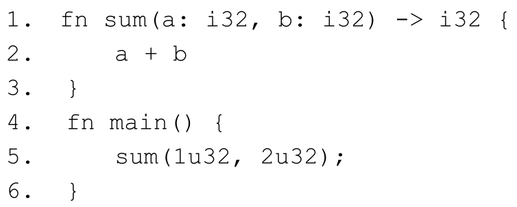{.u53886}
:::

在代码清单9-1中定义的sum函数需要的参数类型为i32，而在main函数中传入的参数类型为u32，编译器在编译期就能检查出来这种违反"契约"的情况，报错如下：

::: center
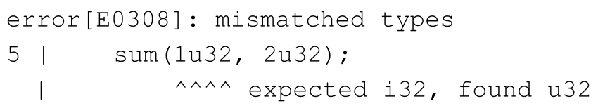{.u53885}
:::

编译器的错误提示也非常友好，明确地告诉开发者sum函数需要的是i32类型，但是发现了u32类型，类型不匹配。

仅仅依赖编译器的类型检查还不足以消除大部分失败，有些失败会发生在运行时。比如Vector 数组提供了一个 insert 方法，通过该方法可以为指定的索引位置插入值，如代码清单9-2所示。

**代码清单9-2：Vec＜T＞类型的insert方法使用示例**

::: center
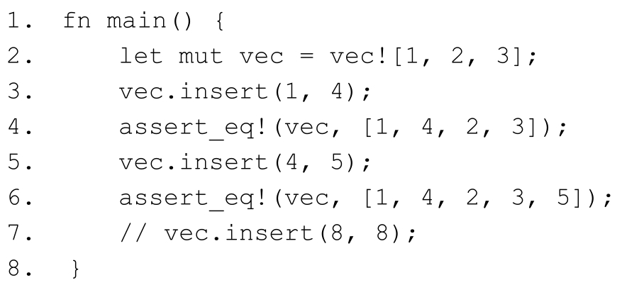{.u53884}
:::

在代码清单 9-2 中展示的 insert 方法的第一个参数为指定的索引位置，第二个参数为要插入的值。代码第3行和第5行，指定的索引位置是合法的，因为均小于待插入数组的长度。但是代码第7行会引发线程恐慌，因为给定的索引位置并不存在，超过了数组的长度。

对于代码第7行所示的这种情况，通过类型检查是无法判断的，因为无法预先知道开发者会指定什么索引。这时就需要使用**断言（Assert）** 。Rust标准库中一共提供了以下六个常用的断言：

· assert！，用于断言布尔表达式在运行时一定返回true。

· assert_eq！，用于断言两个表达式是否相等（使用PartialEq）。

· assert_ne！，用于断言两个表达式是否不相等（使用PartialEq）。

· debug_assert！，等价于assert！，只能用于调试模式。

· debug_assert_eq！，等价于assert_eq！，只能用于调试模式。

· debug_assert_ne！，等价于assert_ne！，只能用于调试模式。

以上六个断言都是宏。assert系列宏在调试（Debug）和发布（Release）模式下均可用，并且不能被禁用。debug_assert系列宏只在调试模式下起作用。在使用断言时，要注意具体的场合是否一定需要 assert 系列宏，因为断言的性能开销不可忽略，请尽量使用 debug_assert系列宏。

所以，对于代码清单9-2中用到的insert方法，可以使用assert！断言来消除可能指定非法索引而造成插入失败的情况，如代码清单9-3所示。

**代码清单9-3：在insert方法中使用assert！断言**

::: center
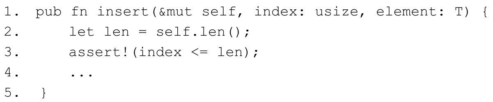{.u53883}
:::

代码清单9-3展示了部分Vec＜T＞类型的insert方法源码。注意代码第3行，使用assert！断言来判断指定的索引index一定小于或等于数组的长度len，如果传入了超过len的索引值，则该判断表达式会返回false，此时assert！就会引发线程恐慌。

引发线程恐慌算消除失败吗？这其实是一种**快速失败（Fast Fail）** 的策略，这样做可以让开发中的错误尽早地暴露出来，使得Bug无处藏身。所以assert系列宏也支持自定义错误消息，如代码清单9-4所示。

**代码清单9-4：自定义错误消息**

::: center
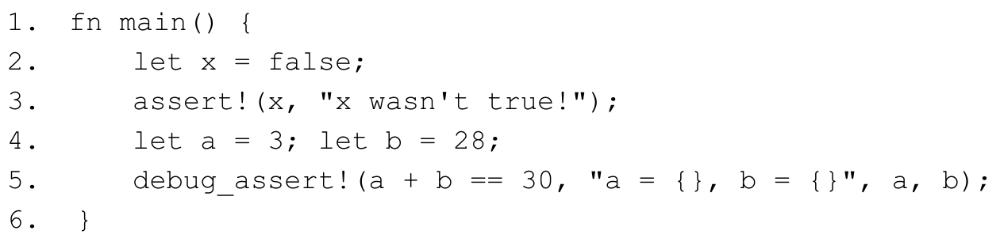{.u53882}
:::

在代码清单9-4中，代码第3行和第5行均会引发线程恐慌，但是在线程恐慌的时候会输出指定的消息，便于开发者修正错误。

综上所述，通过断言可以对函数进行契约式的约束。所谓"契约"就是指可以确保程序正常运行的条件，一旦"契约"被毁，就意味着程序出了Bug。程序运行的条件大概可以分为以下三类。

· **前置条件** ：代码执行之前必须具备的特性。

· **后置条件** ：代码执行之后必须具备的特性。

· **前后不变** ：代码执行前后不能变化的特性。

在日常开发中，如果必要的话，则可以依据这三类情况来设置断言。

除断言之外，还可以直接通过 panic！宏来制造线程恐慌，其实在 assert 系列宏内部也使用了 panic！宏。那么什么时候使用呢？其实还是遵循快速失败的原则，在处理某些在运行时绝不允许或绝不可能发生的情况时，可以使用panic！宏。

## 9.3 分层处理错误 {#text00015.html#A80cd013f-4dfb-4f98-82c7-560900e1254e .title-left}

Rust提供了分层式错误处理方案：

· **Option＜T＞** ，用于处理**有** 和**无** 的情况。比如在HashMap中指定一个键，但不存在对应的值，此时应返回None，开发者应该对None进行相应的处理，而不是直接引发线程恐慌。

· **Result＜T，E＞** ，用于处理可以合理解决的问题。比如文件没有找到、权限被拒绝、字符串解析出错等错误。

· **线程恐慌（Panic）** ，用于处理无法合理解决的问题。比如为不存在的索引插值，就必须引发线程恐慌。需要注意的是，如果在主线程中引发了线程恐慌，则会造成应用程序以非零退出码退出进程，也就是发生崩溃。

· **程序中止（Abort）** ，用于处理会发生灾难性后果的情况，使用 abort 函数可以将进程正常中止。

Rust的错误处理方案来源于函数式语言（比如Haskell），不仅仅区分了错误和异常，而且将错误更进一步区分为Option＜T＞和Result＜T，E＞。使用和类型Enum，使得基于返回值的错误处理粒度更细、更加优雅。在Rust中，线程发生恐慌就是异常。

### 9.3.1 可选值Option＜T＞ {#text00015.html#A21460140-3eba-4440-a6c7-7b3a1a14c804 .title-left}

Option＜T＞类型属于枚举体，包括两个可选的变体：**Some（T）** 和**None** 。作为可选值，Option＜T＞可以被使用在多种场景中。比如可选的结构体、可选的函数参数、可选的结构体字段、可空的指针、占位（如在HashMap实现中解决remove问题）等。

Option＜T＞类型在日常开发中非常常见，它基本上消除了空指针问题，如代码清单9-5所示。

**代码清单9-5：Option＜T＞使用示例**

::: center
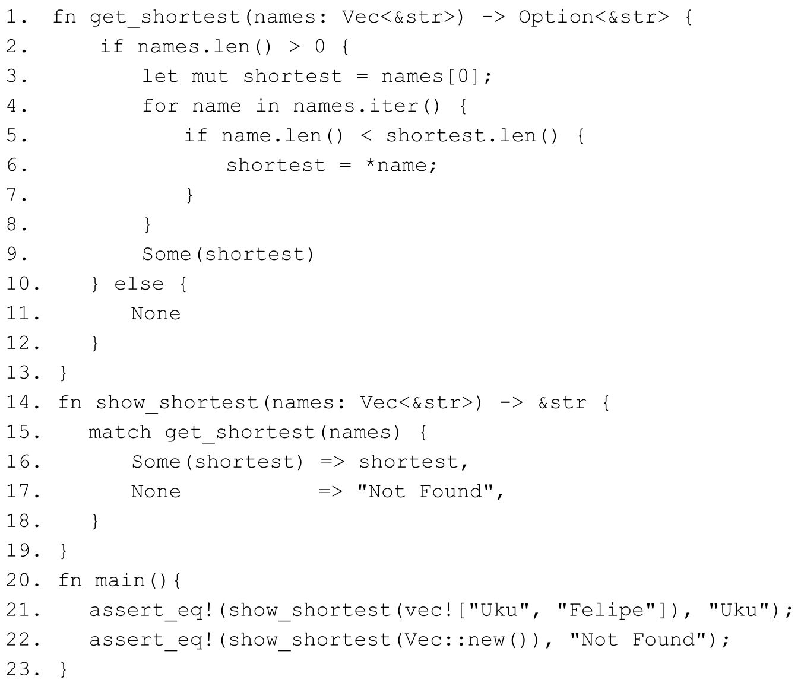{.u53881}
:::

在代码清单9-5中定义了get_shortest函数，传入Vec＜&str＞数组，得到其中长度最短的字符串。在实现该函数时，需要考虑：如果传入的是空数组怎么办？有多种处理方式。第一，判断是否为空，如果为空则不处理，或者直接引发线程恐慌；第二，使用 Option＜T＞，空数组返回None，非空数组返回Some。显然第二种处理方式好过第一种，因为对于这种问题，不处理显得函数行为不统一，引发线程恐慌则显得小题大做。所以，get_shortest函数最终返回Option＜&str＞类型。

代码第14～19行，定义了show_shortest方法，内部调用get_shortest，并使用match匹配来处理该函数返回的Option＜&str＞。如果是Some，则返回其内部的字符串；如果是None，则返回固定的字符串"Not Found"。这样在main函数中调用show_shortest方法时，则可以得到预料中的结果。

**unwrap系列方法**

看得出来，在代码清单 9-5 中使用 Option＜T＞保证了代码的基本健壮性。除使用 match匹配之外，标准库中还提供了unwarp系列方法，如代码清单9-6所示。

**代码清单9-6：使用unwrap系列方法**

::: center
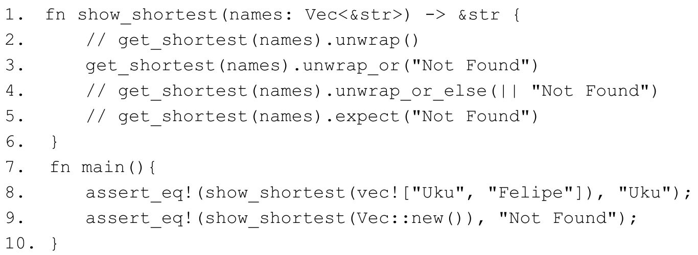{.u53880}
:::

在代码清单9-6中展示了unwrap、unwrap_or和unwrap_or_else三个方法。其中unwrap方法可以取出包含于 Some 内部的值，但是遇到 None 就会引发线程恐慌。所以，当show_shortest函数传入空数组时，代码第2行所示的写法会引发线程恐慌。

代码第3行使用的unwrap_or方法实际上是对match匹配包装的语法糖，该方法可以指定处理None时返回的值。该行指定了字符串"Not Found"，最终效果等价于代码清单9-5。

代码第 4 行使用的 unwrap_or_else 方法和 unwrap_or 类似，只不过它的参数是一个FnOnce（）-＞T闭包。

代码第5行展示了expect方法，该方法会在遇到None值时引发线程恐慌，并可通过传入参数来展示指定的异常消息。

在日常开发中可以根据具体的需求选择适合的unwrap系列方法。unwrap方法适合在开发过程中快速失败，提早暴露 Bug，如果要自定义异常消息，则可以使用 expect。对于明显需要处理None的情况，则可以直接使用match，但是使用unwrap_or或unwrap_or_else可以让代码更加简洁。

**高效处理Option＜T＞**

在大多数情况下，需要使用 Option＜T＞中包含的值进行计算，有时候只需要单步计算，有时候则需要连续多步计算。如果把Option＜T＞中的值通过unwrap取出来再去参与计算，则会多出很多校验代码，比如判断是否为None值。如果使用match 方法，则代码显得比较冗余，如代码清单9-7所示。

**代码清单9-7：使用match匹配来操作Option＜T＞**

::: center
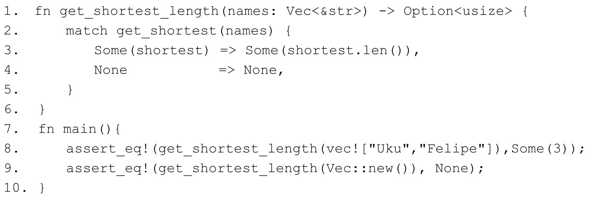{.u53879}
:::

在代码清单9-7中定义了get_shortest_length方法，用来获取数组中最短字符串的长度。代码第2行，通过match匹配get_shortest方法返回的Option＜&str＞来进行计算，如果是Some，则调用内部值shortest的len方法得到长度，然后再用Some将其包装并返回；如果是None，则继续返回None。使用match来处理也保证了健壮性，但是代码看上去显得非常冗余。在标准库std：：option模块中，还提供了map系列方法来改善这种情况，如代码清单9-8所示。

**代码清单9-8：使用map来操作Option＜T＞**

::: center
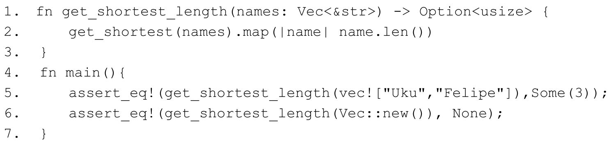{.u53878}
:::

在代码清单9-8中使用了map方法，相比于代码清单9-7中的写法，代码瞬间变得更加简洁。实际上，map方法是对match匹配的包装，其具体实现如代码清单9-9所示。

**代码清单9-9：std：：option：：Option：：map方法的具体实现**

::: center
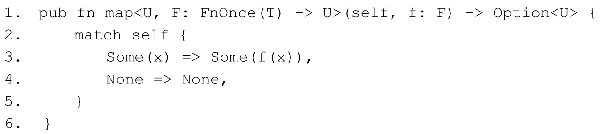{.u53877}
:::

从代码清单9-9中可以看出，map是一个泛型方法，内部是一个match匹配，对于Some和None分别做了相应的处理，并且该方法的参数为FnOnce（T）-＞U闭包。通过map方法就可以在无须取出Option＜T＞值的情况下，方便地在Option＜T＞内部进行计算。像map这样的方法，叫作组合子（Combinator）。

除map方法之外，还有map_or和map_or_else方法，它们跟map方法类似，都是对match的包装，不同的地方在于，它们可以为 None 指定默认值（回想一下 unwrap_or 和unwrap_or_else）。

在有些情况下，只靠map方法还不足以满足需要。比如对Option＜T＞中的T进行处理的函数返回的也是一个Option＜T＞，如果此时用map，就会多包装一层Some。假如现在要对一个浮点数进行一系列计算，提供的计算函数包括：**inverse** （**符号取反** ）、**double** （**加倍** ）、**log** （**求以 2 为底的对数** ）、**square** （**平方** ）、**sqrt** （**开方** ）。在这些计算函数中，求对数和开方的计算有可能出现异常值，比如对负数求对数和开方都会出现**NaN** ，所以这两个计算函数的返回值一定是Option＜T＞类型，如代码清单9-10所示。

**代码清单9-10：map和and_then共用示例**

::: center
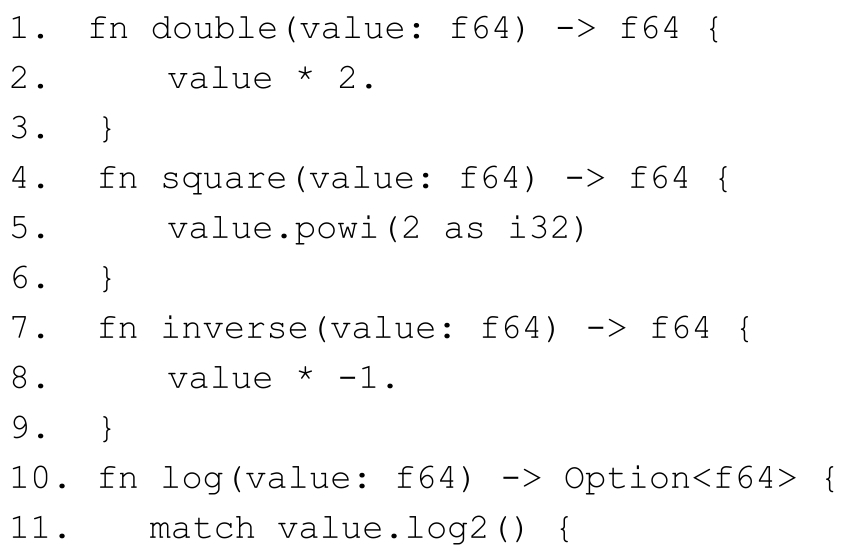{.u53876}
:::

::: center
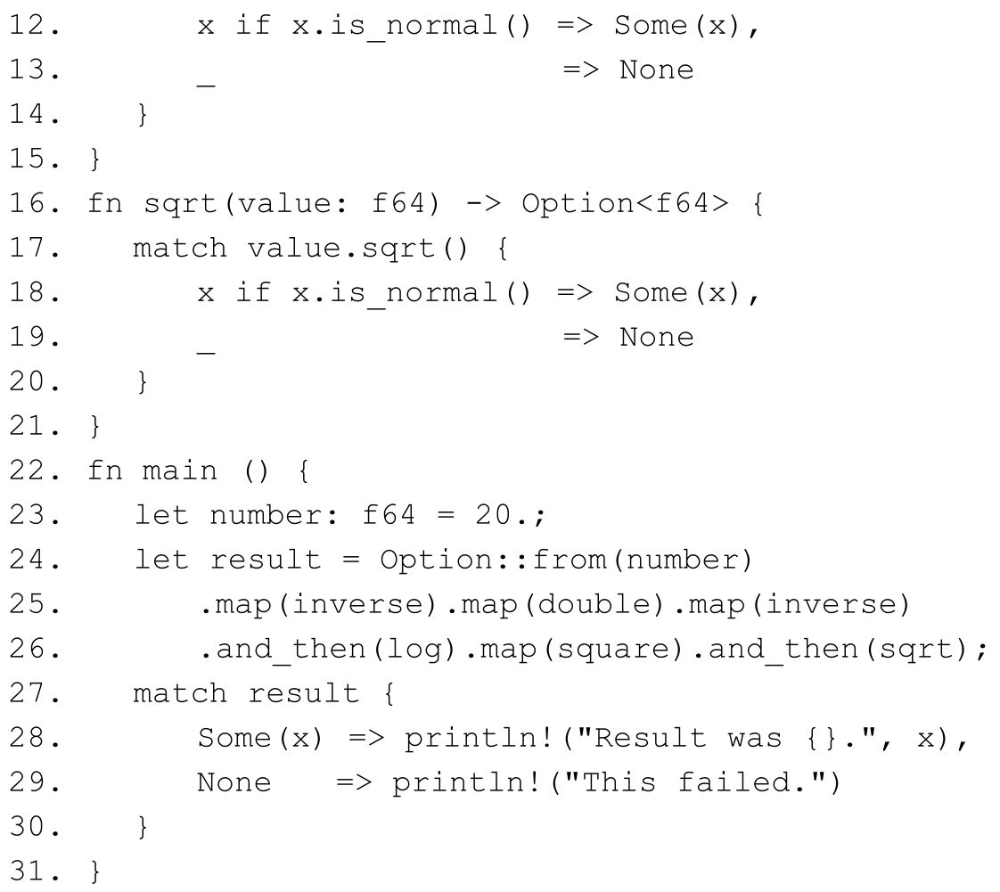{.u53875}
:::

在代码清单9-10中，代码第1～9行，分别定义了double、square和inverse函数，返回值都是f64类型，因为这些计算产生的值只可能是唯一的结果。

代码第10～21行定义的log和sqrt函数，返回值都为Option＜f64＞类型，这是因为求对数和开方有可能产生NaN。在这两个函数中分别调用标准库中提供的log2和sqrt方法来计算，并通过is_normal来判断是否为合法的浮点数，如果合法则返回Some，否则返回None。

在main函数中声明了浮点数number，并通过Option：：from方法将其转换为Some（number）进行计算。如代码第25行所示，可以通过map组合子方法将double、square和inverse函数组成链式调用，而不需要从Some＜number＞中将number取出来进行计算。但是当求对数和开方时，使用map就不方便了。返回map的定义，如果此处使用map，那么求对数的结果会被包装两层 Some，变成 Some（Some（number））的形式，如果再进行开方操作，则又会被包装为Some（Some（Some（number）））的形式，这就变得复杂了。所以，标准库中提供了另外一个组合子方法and_then来解决这个问题。

代码第26行所示，使用and_then来处理log和sqrt，就可以和map组合子正常配合使用，最后输出正常的结果。当把第23行number的值改为负数，则会输出"This failed."。

代码清单9-11展示了and_then组合子方法的实现。

**代码清单9-11：and_then组合子方法的实现**

::: center
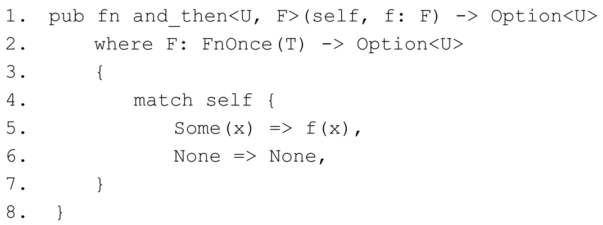{.u53874}
:::

在代码清单9-11中展示的and_then方法和map方法的区别在于，代码第5行匹配Some时，and_then方法的返回值并不像map方法那样包装了一层Some。

除 map 和 and_then 之外，标准库中还提供了其他组合子方法，用于高效、方便地处理Option＜T＞的各种情况。限于篇幅，这里不再一一介绍，读者可自行查看标准库文档。

### 9.3.2 错误处理Result＜T，E＞ {#text00015.html#A80c90144-ba84-4f32-9e74-4cad6e8d8702 .title-left}

Option＜T＞解决的是**有** 和**无** 的问题，它在一定程度上消灭了空指针，保证了内存安全。但使用Option＜T＞实际上并不算错误处理。Rust专门提供了Result＜T，E＞来进行错误处理，和Option＜T＞相似，均为枚举类型，但Result＜T，E＞更关注的是编程中可以合理解决的错误。从语义上看，Option＜T＞可以被看作是忽略了错误类型的Result＜T，（）＞，所以有时候它们也是可以相互转换的。

代码清单9-12展示了Result＜T，E＞的定义。

**代码清单9-12：Result＜T，E＞定义**

::: center
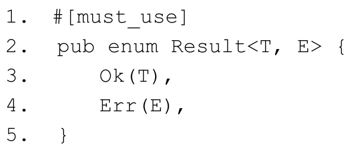{.u53873}
:::

从代码清单9-12中可以看出，Result＜T，E＞枚举体包含两个变体：Ok（T）和Err（E），其中Ok（T）表示正常情况下的返回值，Err（E）表示发生错误时返回的错误值。其中**＃\[must_use\]** 属性表示，如果对程序中的 Result＜T，E＞结果没有进行处理，则会发出警告来提示开发者必须处理相应的错误，有助于提升程序的健壮性。

代码清单9-13展示了使用parse方法把字符串解析为数字。

**代码清单9-13：使用parse方法将字符串解析为数字示例**

::: center
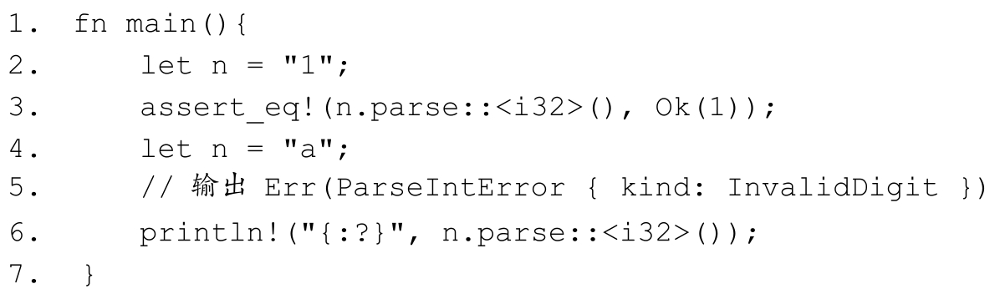{.u53872}
:::

在代码清单9-13中，对于可以解析成数字的字符串，是可以正常解析的。如代码第2行和第3行所示。但是对于无法解析为数字的字符串，则会抛出错误。如代码第4行所示，字符串为字母，无法解析为数字，那么在代码第6行使用parse 方法解析之后，就会引发线程恐慌，并提示错误类型为**Err（ParseIntError{kind：InvalidDigit}）** ，其为标准库内置的错误类型，专门用于表示解析处理失败的错误，此处是指无效的数字（InvalidDigit）。

**高效处理Result＜T，E＞**

在标准库std：：result模块中，也为Result＜T，E＞实现了很多方法，比如unwrap系列方法。对于代码清单9-13中返回的解析错误，就可以使用unwrap_or方法指定一个默认值来解决，但并不优雅。其实std：：result模块中也提供了很多组合子方法，比如map和and_then等，其用法和Option＜T＞相似，使用组合子方法可以更加优雅地处理错误，如代码清单9-14所示。**代码清单9-14：解析字符串为数字错误处理示例**

::: center
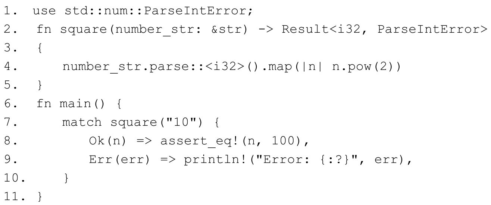{.u53871}
:::

在代码清单9-14中定义了square方法，传入字符串，然后通过parse泛型方法将其解析为i32类型，再使用map方法计算其值。因为parse方法返回的是Result类型，所以这里可以直接使用 map 方法。注意 square 函数的返回值为 Result＜i32，ParseIntError＞类型，其中ParseIntError是在std：：num模块中定义的，所以这里需要使用use引入。

在main函数中使用match匹配square函数的结果，如果是Ok（n），则返回正常的结果；如果是Err（err），则打印错误结果。

还可以使用type关键字定义类型别名来简化函数签名，如代码清单9-15所示。

**代码清单9-15：使用type关键字定义类型别名来简化函数签名**

::: center
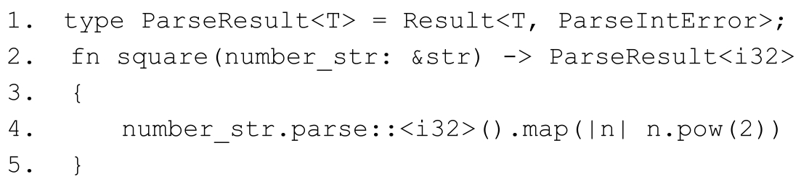{.u53870}
:::

在代码清单9-15中，代码第1行使用type关键字将Result＜T，ParseIntError＞定义为别名ParseResult＜T＞，这样在square函数中使用就显得十分简洁。

**处理不同类型的错误**

通过第 8 章我们了解到，使用 parse 方法将字符串解析为十进制数字，内部实际上是FromStr：：from_str方法的包装，并且其返回值为Result＜F，＜F as FromStr＞：：Err＞。对于u32类型实现的FromStr：：from_str来说，整个解析过程如下：

· 判断字符串是否为空。如果为空，则返回错误Err（ParseIntError{kind：Empty}）。

· 将字符串转换为字节数组，根据第一个字节判断是正数还是负数，并将符号位从字节数组中分离出去，只剩下数字。

· 循环分离符号位之后的字节数组，逐个用as转换为char类型，调用to_digit方法将字符转换为数字，并在循环中累加。循环完毕后，如果全部字符解析成功，则返回正常的结果；否则，返回错误Err（ParseIntError{kind：InvalidDigit}）。在循环过程中还需要计算是否超过了对应数字类型的最大范围，如果超过了就会返回错误Err（ParseIntError{kind：Overflow}）。

看得出来，一个看似简单的 parse 方法，其解析过程如此曲折，其间要抛出多种错误类型。但是对于Result＜T，E＞来说，最终只能返回一个Err类型，如果在方法中返回了不同的错误类型，编译就会报错。那么在parse方法内部是如何处理的呢？如代码清单9-16所示。

**代码清单9-16：ParseIntError源码**

::: center
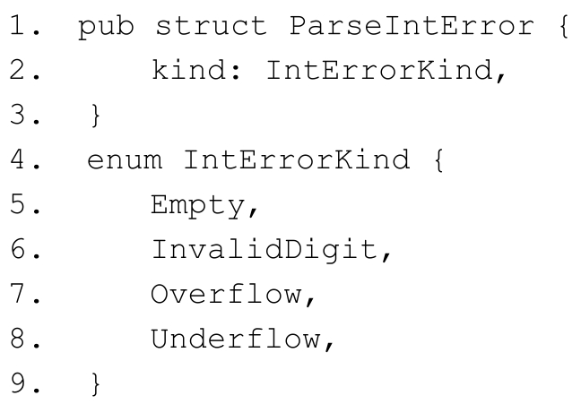{.u53869}
:::

代码清单9-16展示了ParseIntError的源码，可以看出，parse返回的其实是一个统一的类型ParseIntError。其内部成员是一个枚举类型IntErrorKind，其中根据解析过程中可能发生的情况定义了四个相应的变体作为具体的错误类型。这就解决了返回多种错误类型的问题。

在日常开发中，最容易出错的地方是I/O操作。所以在Rust标准库**std：：io** 模块中定义了**统一的错误类型Error** ，以便开发者能够方便地处理多种类型的I/O错误，如代码清单9-17所示。

**代码清单9-17：std：：io模块中的Error源码**

::: center
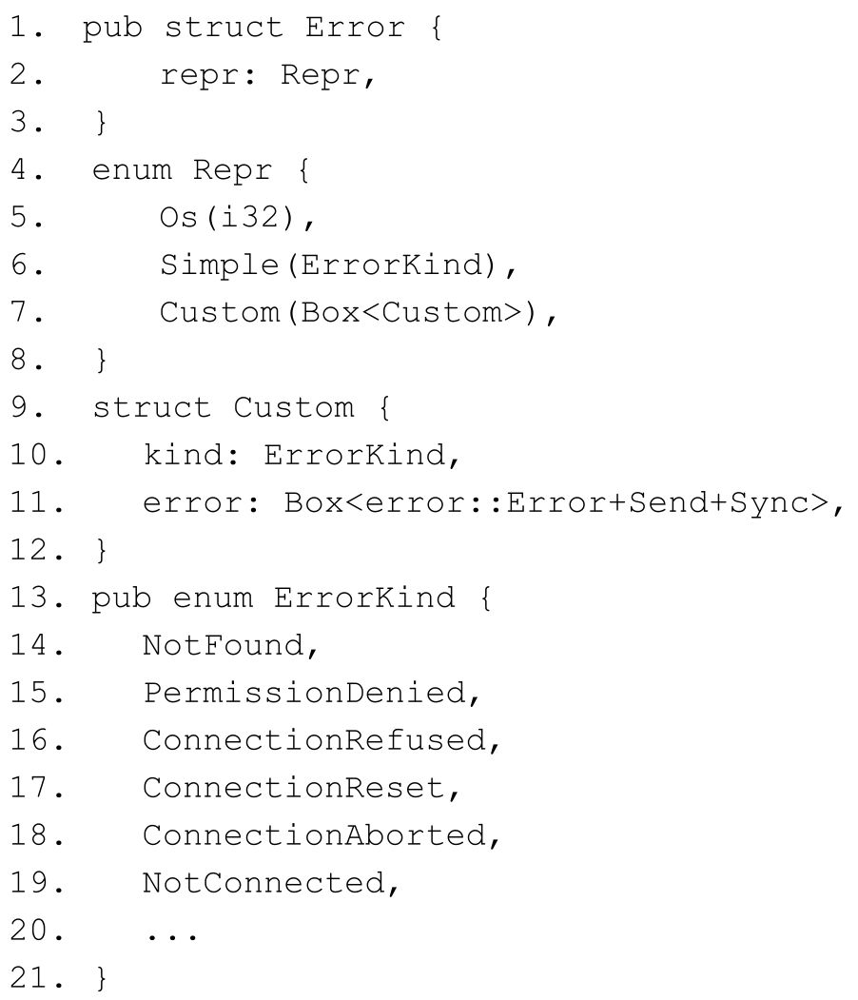{.u53868}
:::

代码清单9-17展示了std：：io：：Error的源码。Error结构体只有一个成员repr，为Repr枚举类型。Repr枚举体包含了三个变体：Os（i32）、Simple（ErrorKind）和Custom（Box＜Custom＞），分别表示操作系统返回的错误码、一些内建的错误以及开发者自定义的错误。其中，在ErrorKind枚举体中根据日常开发中比较常见的场景抽象出了一些相应的错误变体。

下面通过一个具体的示例来看看在实际开发中如何进行错误处理。

假如有一个文件，文件的每一行都是一个数字，要求从此文件中读取每一行的数字并对它们求和。思路比较简单，就是直接读取该文件，并将读取到的每一行解析为相应的数字，再迭代求和，如代码清单9-18所示。

**代码清单9-18：从文件中读取数字并计算其和**

::: center
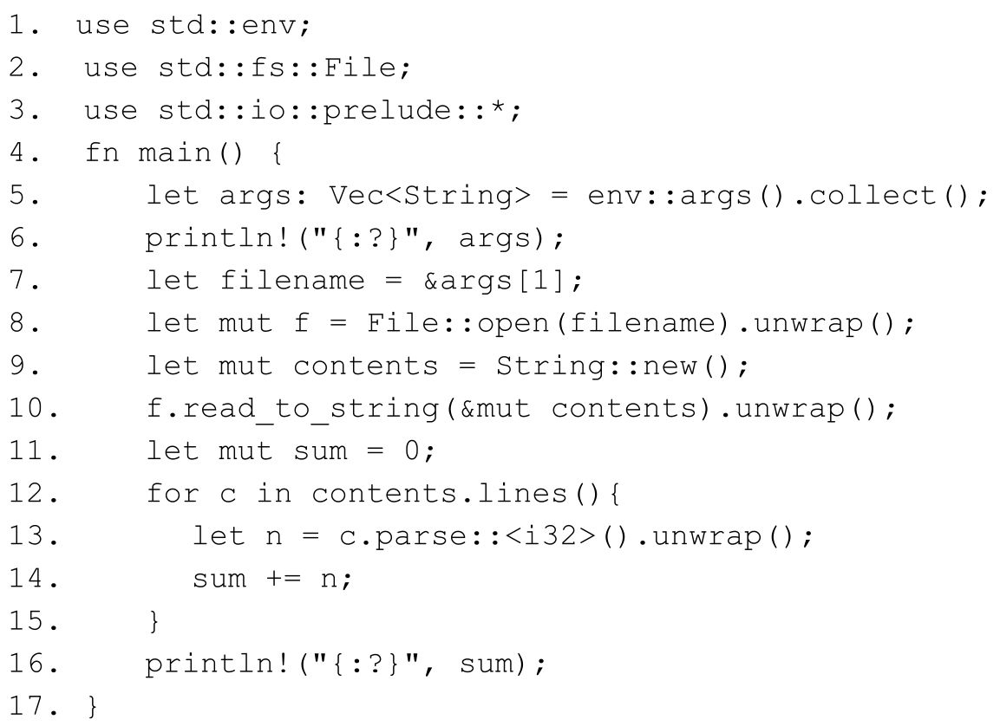{.u53867}
:::

代码清单9-18的思路是，从命令行中接收参数作为文件名，然后打开文件逐行读取。首先用到了std：：env：：args方法，通过该方法可以得到命令行中传入的参数，如代码第5行所示，将参数收集为一个Vec＜String＞类型的数组。代码第7行，获取命令行参数数组中索引为1的元素，就是文件名。这里需要注意，args中索引为0的元素是该程序本身的命名。

代码第8行，使用File：：open方法打开指定的文件，该方法会返回一个Result＜File，Error＞，这是因为有可能存在文件打开失败的情况，比如文件名不正确或者文件不存在等。但实际上在std：：io模块中已经使用type关键字为Result＜T，Error＞定义了别名Result＜T＞，所以该方法返回的类型就可以写为Result＜File＞。因此，这里需要调用unwarp方法来解开Result包装，得到其中的文件引用，以进行后续操作。

代码第9行和第10行，通过read_to_string方法将文件中的内容读取到一个可变字符串contents中。使用read_to_string方法从文件中读取内容也是有风险的，比如读取的内容不是一个合法的UTF-8字节，则读取出错。该方法会返回Result＜usize＞类型，其中usize表示读取到的文件内容总字节数。

代码第11～15行，对读取到的字符串中的内容进行迭代解析，并累加求和。这里解析也是存在风险的，万一文件中混入了无法解析为数字的字符，则会报错。

将该段代码命名为io_origin.rs，通过rustc进行编译，然后执行：

::: center
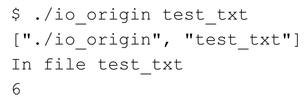{.u53866}
:::

其中，io_origin为编译后的程序二进制文件，test_txt为要读取的文件，其每一行分别保存着1、2、3，所以代码执行结果为6。

假如在test_txt文件中加入一行汉字，执行代码时就会报出如下错误：

::: center
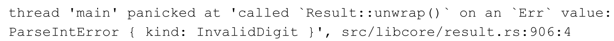{.u53389}
:::

看得出来，错误消息显示了解析错误ParseIntError {kind：InvalidDigit}。可见，代码清单9-18的健壮性有很大问题。如果此时想顺利地对能正常解析出来的数字进行求和而不受新加入汉字的干扰，该如何处理错误？

办法之一是像I/O或parse方法内部实现那样，自定义统一的错误处理类型。办法之二是通过Rust提供的Error trait。标准库中提供的所有错误都实现了此trait，这意味着只要使用trait对象就可以统一错误类型。代码清单9-19展示了Error trait的定义。

**代码清单9-19：Error trait定义**

::: center
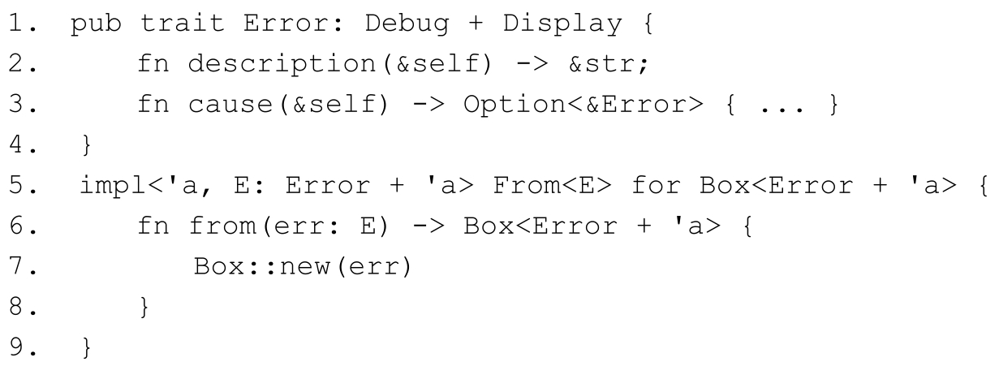{.u53865}
:::

在代码清单9-19中定义了description和cause两个方法，分别表示错误的简短描述和导致错误发生的原因。所以实现该trait的错误类型，还必须同时实现Debug和Display。然后就可以使用Box＜Error＞或&Error来表示统一的错误类型了。

代码清单9-19还展示了为Box＜Error+＇a＞实现From trait，这意味着可以通过From：：from方法将一个实现了Error的错误类型方便地转换为Box＜Error＞。

现在来重构代码清单9-18，首先想到的一个问题是：如果要返回解析过程中的错误，该怎么处理？因为在Rust 2015版本中，main函数是没有返回值的（但是在Rust 2018中，main函数可以有返回值），所以需要把处理文件的代码独立到另外一个函数中，如代码清单 9-20所示。

**代码清单9-20：重构代码清单9-18，将处理文件代码独立到run函数中**

::: center
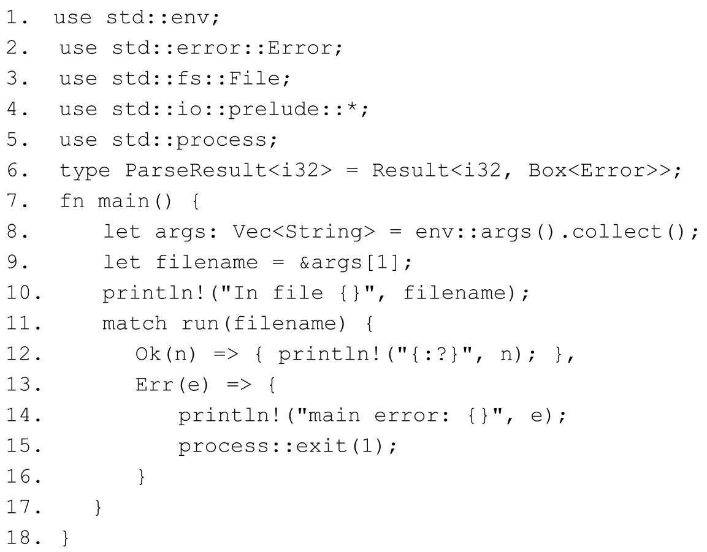{.u53864}
:::

在代码清单9-20中，为了处理返回的错误，将之前main函数中处理文件的代码独立到run函数中。run函数会返回Result＜i32，Box＜Error＞＞类型，在main函数中做match匹配处理，如果是Err（e），则以退出码1退出主进程。

代码清单9-21展示了run函数的具体实现。

**代码清单9-21：run函数的具体实现**

::: center
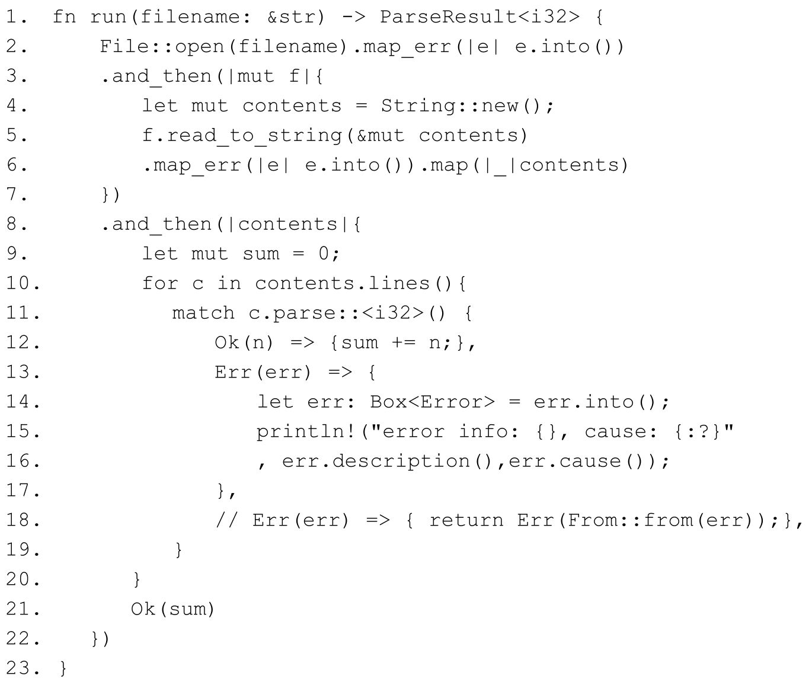{.u53863}
:::

在代码清单 9-21 中，run 函数的返回值是 Result＜i32，Box＜Error＞＞的别名ParseResult＜i32＞。在该函数中大量使用了组合子方法来处理错误。

代码第2行，File：：open方法会返回Result＜File＞，此时用map_err（\|e\|e.into（））来处理打开文件出错的情况。如果出错，则会通过into方法将错误转换为Box＜Error＞类型。前面提到过，标准库内部的错误都已经实现了 Error trait 和 From trait，可以将具体的错误类型转换为Box＜Error＞类型。注意这个类型转换，实际上是基于类型自动推导的，因为在函数签名中返回值类型是确定的。如果没有出错，则将正常的文件引用往后面传递。在运行该代码时，如果给了一个错误的文件参数，则会抛出错误。这是因为在 File：：open 方法内部的实现中，使用return向外抛出了错误，毕竟，如果连文件都没有正确读取，那么后续的步骤也就没有继续往下执行的必要了。

代码第 3～7 行，使用 and_then 组合子方法来处理由上一步 map_err 传递过来的Result＜File＞。代码第4行和第5行，跟之前一样，通过read_to_string方法将文件内容读取到字符串中。但是这个过程有风险，所以这里继续使用map_err来处理出错的情况，并在后面紧接了map组合子方法来向后传递正常读取到的字符串contents。

代码第8～20行，使用and_then组合子方法处理传递过来的字符串。此时需要遍历文件的每一行字符串，将其一一解析为合法的数字并相加。解析为数字的过程是有风险的，有可能出错，所以这里使用match匹配来分别处理正常和出错的情况。如果是正常解析，则将数字n累加到sum中；如果出错，则将错误转换为Box＜Error＞类型，并且通过调用其description和cause方法分别打印具体的错误信息和出错原因。

代码第21行，返回Ok（sum）。在main函数中得到处理。

需要注意的是，将字符串解析为数字默认处理Err（err）的情况，是不会返回错误类型的。所以在代码运行时，就算文件中有不合法的字符存在，该程序也可以正常处理合法的字符，将它们的值相加并返回，进程不会崩溃。

但是如果开发者对文件的管理比较严格，绝不允许混入任何非法字符，那么就需要在解析字符串时通过使用return关键字向上传播错误，如代码第18行所示。如果取消此行注释，将代码第13～17行注释掉，重新编译、运行之后会发现，在读取文件时，遇到非法字符就会解析到无效数字的报错信息，进程崩溃。但是这种写法和直接使用 unwrap 相比，其更加优雅，也可以方便地管理错误。

使用trait对象虽然方便，但它属于动态分发，在性能上弱于自定义统一的错误类型。现在继续对代码进行重构，使用自定义错误类型，如代码清单9-22所示。

**代码清单9-22：自定义错误类型CliError**

::: center
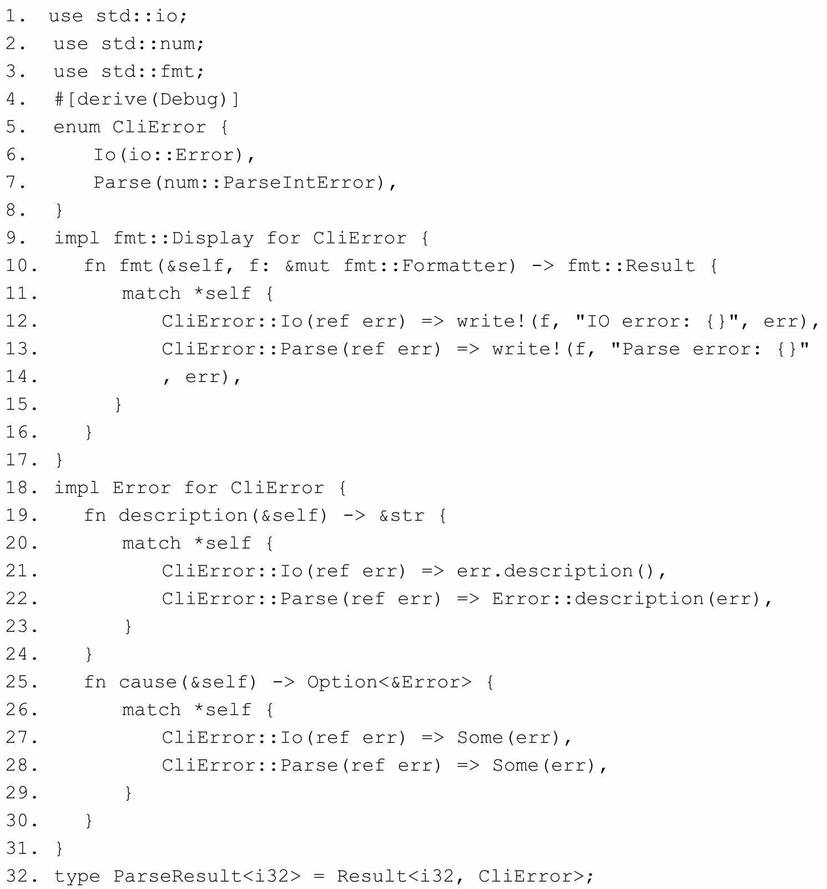{.u53862}
:::

在代码清单 9-22 中创建了自定义错误类型 CliError，其包含两个自带数据的变体：Io（io：：Error）和Parse（num：：ParseIntError），分别表示I/O错误和解析错误，并为CliError实现了Display和Error。

注意代码第32行，在type定义别名ParseResult＜i32＞时，将之前的Box＜Error＞错误类型转换为CliError。

继续重构代码。main函数不需要改变，run函数同样需要将之前的Box＜Error＞错误类型改为CliError，如代码清单9-23所示。

**代码清单9-23：修改run函数，使用CliError**

::: center
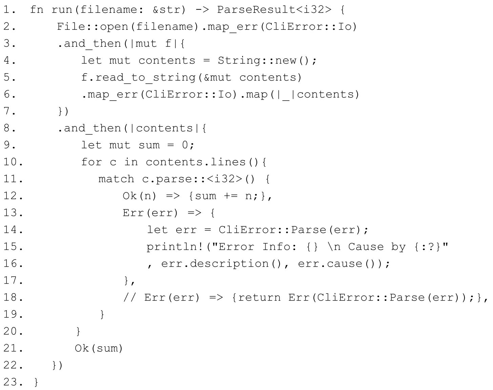{.u53861}
:::

代码清单9-23主要的变化是将Box＜Error＞转换为CliError，使得代码更加清晰、可读。代码第2行，map_err（\|e\|e.into（））被替换为map_err（CliError：：Io），除性能上有所改善之外，可读性也有了提高，可以直接看出这里处理的是I/O错误。

注意此处map_err方法接收的参数为闭包，但传递的却是枚举体，不要忘记带数据的枚举体实际上可以作为函数指针来使用。此处CliError：：Io相当于fn（io：：Error）-＞CliError函数指针。

代码第6行也做了同样的改变。

代码第14～17行，相应地改为CliError：：Parse（err），如果是解析出错的字符，则打印具体的错误信息和出错原因，但依旧不会向上返回错误。如果一定要返回错误，还是需要使用return的，如代码第18行所示。

最终返回Ok（sum），供main函数使用。通过这样的重构，代码的性能和可读性都有了提高。**那么是否还有进一步优化的空间** ？答案是肯定的。

Rust提供了一个**try！** 宏，通过它可以允许开发者简化处理Result错误的过程。代码清单9-24展示了try！宏的源码。

**代码清单9-24：try！宏的源码**

::: center
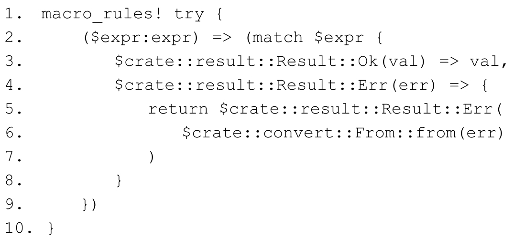{.u53860}
:::

在代码清单9-24中，可以通过macro_rules！来定义一个宏，以符号"\$"开头的均为宏定义中可替换的变量，在第 12 章中会做更详细的介绍。此处大致可以看出，该宏会自动生成match 匹配 Result 的处理，并且会将错误通过 return 返回。注意代码第 6 行，通过调用From：：from方法转换错误类型。

接下来可以继续重构run函数，如代码清单9-25所示。

**代码清单9-25：使用try！宏重构run函数**

::: center
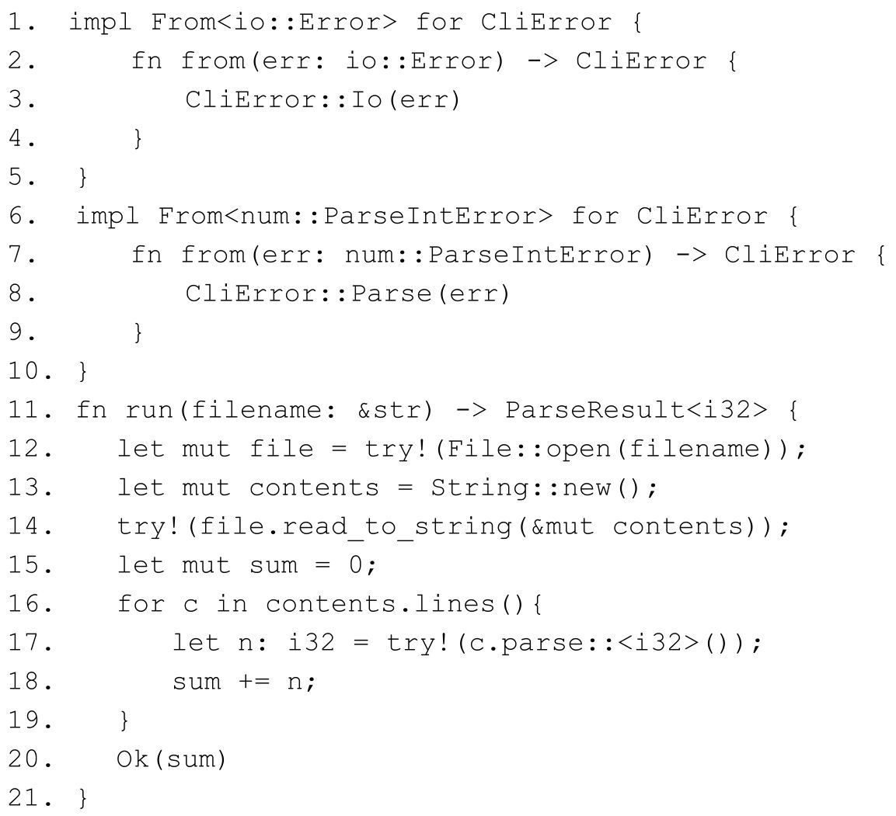{.u53859}
:::

在代码清单9-25中，代码第1～10行，为CliError实现了From转换函数，可以将io：：Error转换为 ClieError：：Io（err），将 num：：ParseIntError 转换为 CliError：：Parse（err），这样就可以使用try！宏了。

代码第12行，使用try！宏来包装File：：open，如果打开文件出错，则会返回错误。

代码第14行，使用try！宏包装了read_to_string方法，如果读取到非UTF-8的字节序列，则会返回错误。

代码第17行，使用try！宏包装了parse方法，如果解析到非法字符，则会返回错误。

使用 try！宏使代码进一步精简，尤其是代码第 17 行。这里值得注意的是，try！宏会将错误返回，传播到外部函数调用中，在具体的开发需求中要确定是否真的需要传播错误，而不要图省事而滥用try！。

**是否还可以继续精简代码** ？答案是肯定的。因为在日常开发中，使用 try！宏的问题是有可能造成多重嵌套，比如try！（try！（try！...））这种形式，非常影响代码的可读性。为了改善这种情况，Rust引入了一个语法糖，使用问号操作符"**？** "来代替try！宏。代码清单9-26展示了如何使用问号操作符重构之前的代码。

**代码清单9-26：使用问号操作符替代try！宏**

::: center
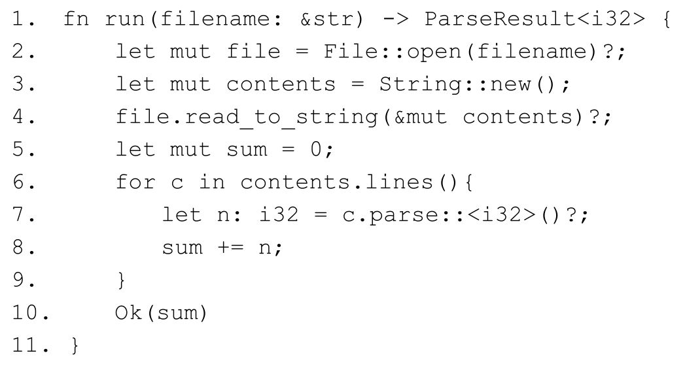{.u53858}
:::

在代码清单9-26中使用问号操作符替代了try！宏，代码清晰了不少，提高了可读性。问号操作符被放到要处理错误的代码后面，这种写法更加凸显了程序的功能代码，从可读性上降低了错误处理的存在感，更加优雅。

**将Option＜T＞转换为Result＜T，E＞**

上面的一系列重构主要是针对run函数来改进错误处理的。但是在main函数中，还存在可以改进的空间，如代码清单9-27所示。

**代码清单9-27：在main函数中从命令行读取参数示例**

::: center
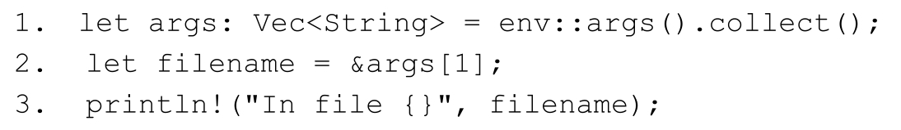{.u53857}
:::

在代码清单9-27中，使用env：：args从命令行读取参数时，假如命令行没有传递参数，那么args中就只存在一个元素（二进制文件自己的文件名），执行到代码第2行就会抛出索引错误，引发main主线程崩溃。这是我们不希望发生的事情。

可以使用env：：args的nth方法来解决此问题，nth方法返回的是Option＜T＞类型，如代码清单9-28所示。

**代码清单9-28：使用nth方法重构main函数**

::: center
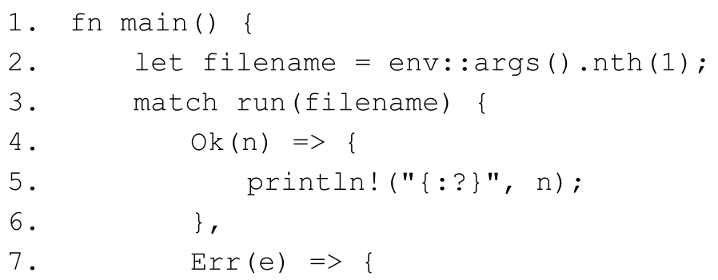{.u53856}
:::

::: center
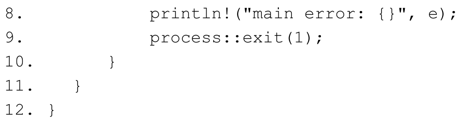{.u53855}
:::

在代码清单 9-28 中，使用 nth 方法直接取参数中索引为 1 的值，就不需要显式地将env：：args转换为数组了。如果有参数，则会返回Some（String）；如果未传递参数，则返回None。此时filename为Option＜String＞类型，将filename传入run函数中。

相应地，run函数也需要做出改变，如代码清单9-29所示。

**代码清单9-29：重构相关代码**

::: center
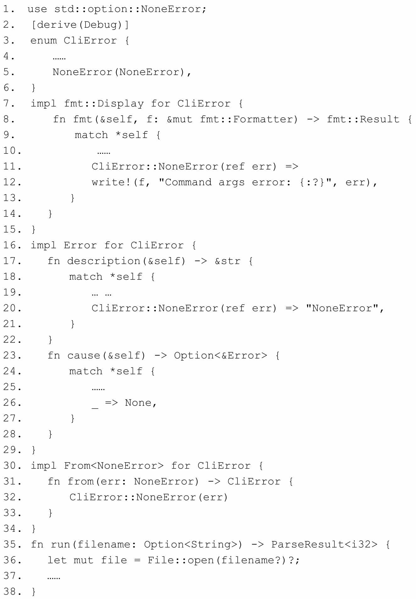{.u53854}
:::

在代码清单9-29中只展示了修改代码，其余的代码则不变。完整代码可以查看随书源码。

代码第35行，将run函数的参数类型修改为Option＜String＞，然后在代码第36行中，继续使用问号操作符。注意此时filename为Option＜String＞类型，但是问号语法糖（try！宏）会自动将Option＜String＞转换为Result＜T，NoneError＞类型，并自动匹配。

注意，如果想让Option＜String＞支持问号语法糖，那么必须得实现From允许NoneError转换为CliError，如代码第30～34行所示。

代码第3～29行，在之前CliError的基础上，增加了NoneErr（NoneError）变体，所以需要使用use引入std：：option：：NoneError。同时修改实现Display和Error中match匹配CliError的相关代码，因为match必须穷尽所有可能。但要注意，std：：option：：NoneError并没有实现Error trait。

鉴于目前让 Option＜T＞类型支持问号语法糖还属于**实验特性** ，所以需要在整个代码文件的顶部添加**＃！\[feature（try_trait）\]** 特性。然后整个代码就可以运行了，如果在命令行中没有指定文件名，则会抛出指定的错误信息。

**main函数返回Result**

在Rust 2018 版本中，允许main函数返回Result＜T，E＞来传播错误。继续在代码清单9-29的基础上对main函数进行重构，如代码清单9-30所示。

**代码清单9-30：重构main函数，基于Rust 2018版本**

::: center
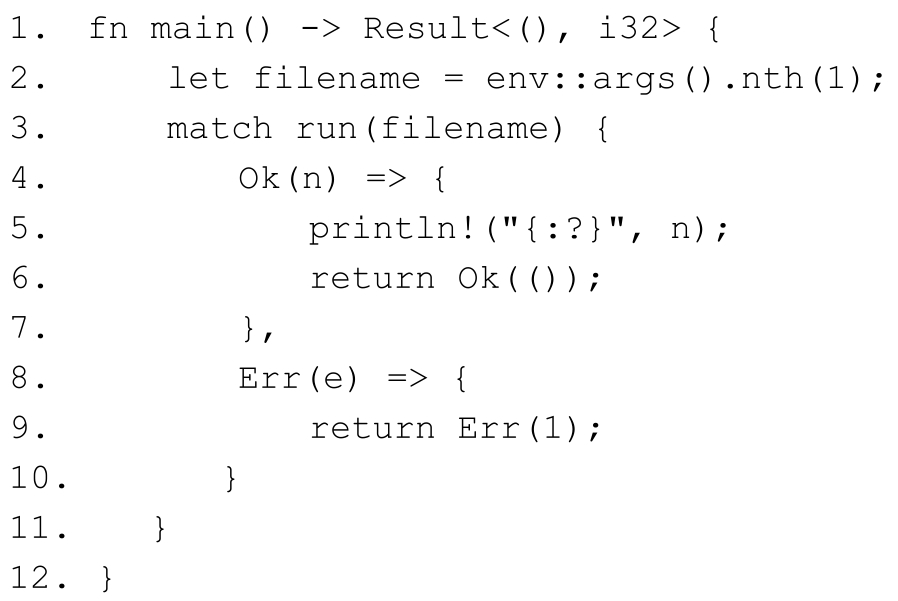{.u53853}
:::

在代码清单9-30中，让main函数返回Result＜（），i32＞类型。针对该示例，返回单元类型"（）"是因为当前有一个限制，必须实现**std：：process：：Terminatio** n这个trait才可以作为main函数的Result＜T，E＞返回类型。当前只有单元类型、数字、bool、字符串、never类型等实现了该trait。

代码清单9-30编译之后，在终端执行以下命令：

::: center
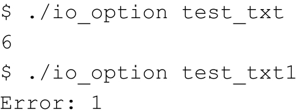{.u53852}
:::

当正确读取文件时，将正常输出结果6。而当文件指定错误时，则会返回错误退出码1，与预期的一致。

目前该特性还在逐步完善中，在不久的将来，在main函数的Result＜T，E＞中应该可以允许使用更多的类型。

**问号语法糖相关trait**

和问号语法糖相关的trait是std：：ops：：Try，代码清单9-30展示了其定义。

**代码清单9-31：std：：ops：：Try 定义**

::: center
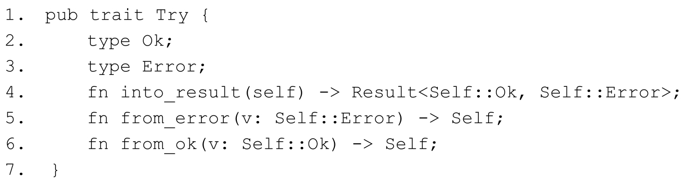{.u53851}
:::

在代码清单 9-31 中，在 Try trait 中定义了两个关联类型 Ok 和 Error，以及三个方法into_result、from_error 和 from_ok。我们看一下为 Option＜T＞实现 Try 的源码，如代码清单9-32所示。

**代码清单9-32：为Option＜T＞实现std：：ops：：Try 的源码**

::: center
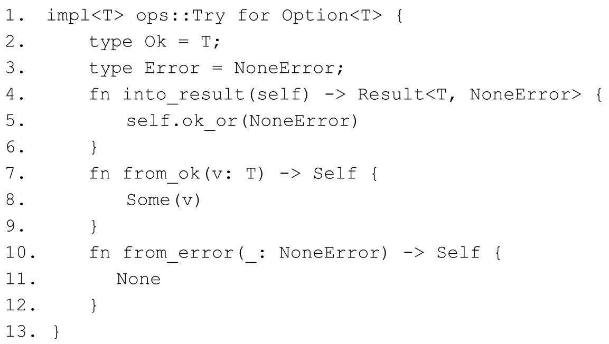{.u53850}
:::

从代码清单 9-32 中可以看出，在 into_result 方法中通过 ok_or 将 Option＜T＞转换为Result＜T，NoneError＞。而 from_ok 和 from_error 则可以从 Result＜T，NoneError＞中得到Option＜T＞。

## 9.4 恐慌（Panic） {#text00015.html#Af9b70150-8c2d-42da-9546-b2bde4777d7f .title-left}

对于Rust来说，无法合理处理的情况就必须引发恐慌。比如，使用thread：：spawn无法创建线程只能产生恐慌，也许是平台内存用尽之类的原因，在这种情况下 Result＜T，E＞已经无用。

Rust的恐慌本质上（底层的实现机制）相当于C++异常。C++支持通过throw抛出异常，也可以使用try/catch来捕获异常，但是如果使用不当，就会引起内存不安全的问题，从而造成Bug或比较严重的安全漏洞。使用C++写代码，需要开发人员来保证**异常安全（Exception Safety）** 。

为什么抛出异常有可能产生内存不安全的问题呢？这其实很容易理解。可以想象一个函数，如果执行了一半，突然抛出了异常，那么会发生什么？函数提前返回，异常发生点之后的代码也许就永远不会被调用到，有可能造成资源泄漏和数据结构恶化（比如合法指针变成了悬垂指针）。这就是异常不安全。

异常安全的代码要求就是不能在异常抛出时造成资源泄漏和数据结构恶化。现代C++使用RAII 可以解决此问题，在异常抛出时，利用**栈回退** （**Stack Unwind** ）机制来确保在栈内构造的局部变量或指针的析构函数都可以被一一调用。这样就可以保证异常安全。而对于Rust语言，其底层也是基于 RAII 机制来管理资源的，在恐慌发生之后，同样会利用栈回退机制触发局部变量的析构函数来保证异常安全。Rust和C++的不同点在于，Rust中的一切都是编译器可以保证的；而C++要靠开发者自己来保证，如果开发者没有使用RAII，那么就有可能导致异常不安全。

在Rust中，使用**恐慌安全（Panic Safety）** 来代替异常安全的说法。虽然在Rust中可以保证基本的恐慌安全，但还是有很多代码会引发恐慌，比如对None进行unwrap操作、除以0等，这些恐慌发生在Safe Rust中是没有问题的，Rust提供了一个叫作**UnwindSafe** 的标记trait，专门用来标记那些恐慌安全的类型。但是在**Unsafe Rust** 中就需要小心了，这里是Rust编译器鞭长莫及的地方。在第13章中会有关于Unsafe Rust更详细的介绍。

Rust也提供了**catch_unwind** 方法来让开发者捕获恐慌，恢复当前线程。Rust团队在引入 catch_unwind 方法时考虑了很多关于内存安全的问题，所以该方法只针对那些实现了**UnwindSafe** 的类型。这样做其实是为了避免开发者滥用catch_unwind，Rust并不希望开发者把catch_unwind当作处理错误的惯用方法。万一将catch_unwind方法用于恐慌不安全的代码，则会导致内存不安全。除trait限定之外，还有一些恐慌是catch_unwind无法捕获的。比如在一些嵌入式平台中，恐慌是使用abort（进程中止）来引发的，并不存在栈回退，所以也就无法捕获了。

代码清单9-33展示了catch_unwind方法的使用示例。

**代码清单9-33：catch_unwind使用示例**

::: center
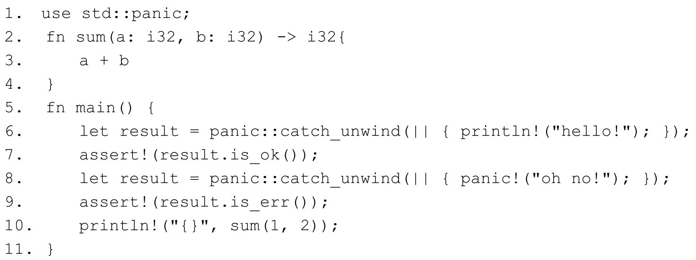{.u53849}
:::

在代码清单9-33中，代码第6行，catch_unwind接收的是一个正常的闭包，在该闭包中并未发生恐慌，所以正常执行。

代码第8行，catch_unwind接收的闭包会通过panic！宏引发恐慌，但是catch_unwind会捕获此恐慌，并恢复当前线程，所以代码第9行和第10行才能顺利执行，执行结果如下：

::: center
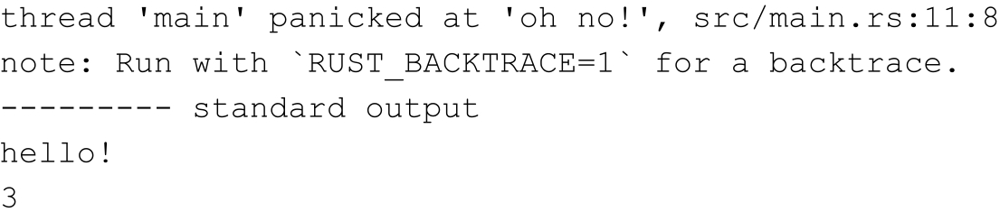{.u53848}
:::

看得出来，虽然在输出结果中打印了恐慌信息，但是并没有影响到后续代码的执行。如果想消除此恐慌信息，则可以使用**std：：panic：：set_hook** 方法来自定义消息，并把错误消息输出到标准错误流中，如代码清单9-34所示。

**代码清单9-34：使用set_hook示例**

::: center
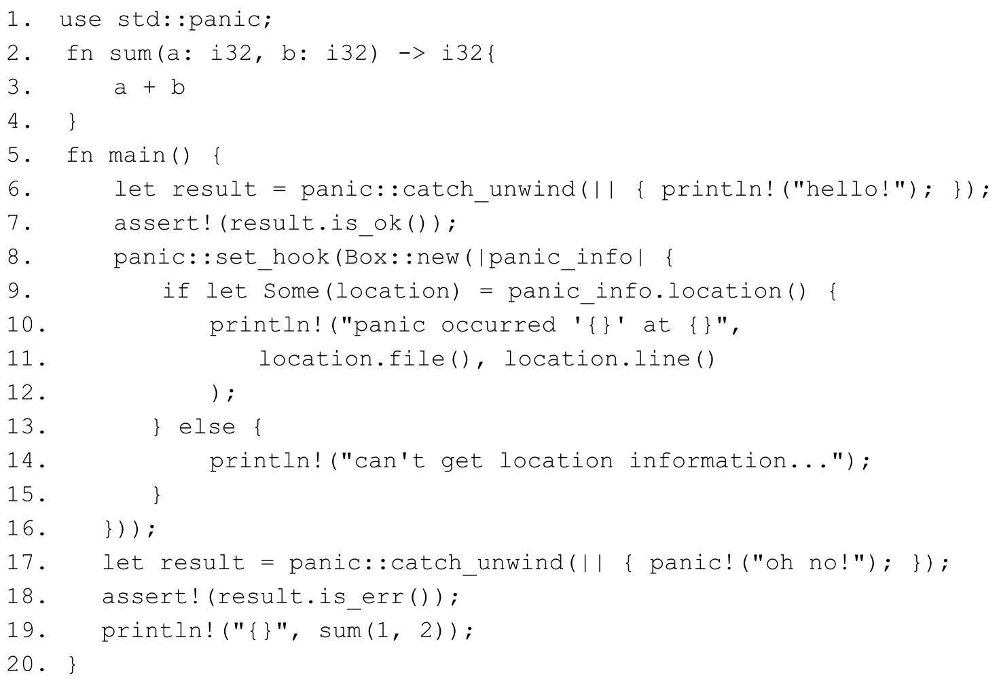{.u53847}
:::

在代码清单9-34中使用set_hook来自定义错误消息，如代码第8～16行所示。并且通过获取panic_info的location信息，准确地输出了发生恐慌的文件和行号。输出如下：

::: center
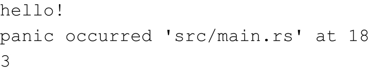{.u53846}
:::

需要注意的是，set_hook 是全局性设置，并不是只针对单个代码模块的。通过配合使用take_hook方法，可以满足开发中的大部分需求。

## 9.5 第三方库 {#text00015.html#A1cb60152-9f22-4f54-a57e-8c89018e72d8 .title-left}

Rust标准库中提供了最原始的错误处理抽象，使用了统一的Error，但是在实际开发中还是不够方便。为了提供更加方便和工程性的错误处理方案，Rust社区也涌现出不少第三方库（crate），其中比较知名的有error-chain和failure。目前官方比较推荐的库是failure。

接下来使用failure库继续改写前文中读取文件并对其中包含的数字进行求和的示例。要使用第三方库，必须先使用cargo new命令来创建一个本地库。

::: center
{.u53845}
:::

该命令是由Rust自带的包管理器Cargo提供的，在第10章中会详细介绍Cargo。该命令默认会创建一个二进制可执行库（Bin）。

然后进入到 failure_crate 根目录下，打开 cargo.toml 文件输入依赖库，如代码清单 9-35所示。

**代码清单9-35：cargo.toml配置**

::: center
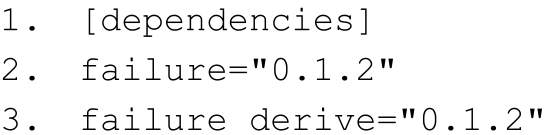{.u53844}
:::

在 cargo.toml 中添加了两个依赖库：failure 和 failure_derive，这是因为在 failure_derive中定义了很多宏，方便开发者管理错误。

再打开src/main.rs文件输入引入的相关库和模块，如代码清单9-36所示。

**代码清单9-36：src/main.rs引入相关库和模块**

::: center
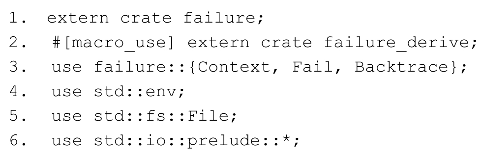{.u53843}
:::

在代码清单 9-36 中引入了 failure 和 failure_derive 库，同时引入了在 failure 中定义的Context、Fail和Backtrace，还引入了与读取文件相关的模块。接下来需要定义一个Error结构体和ErrorKind枚举体来统一管理错误，如代码清单9-37所示。

**代码清单9-37：在src/main.rs中添加Error和ErrorKind**

::: center
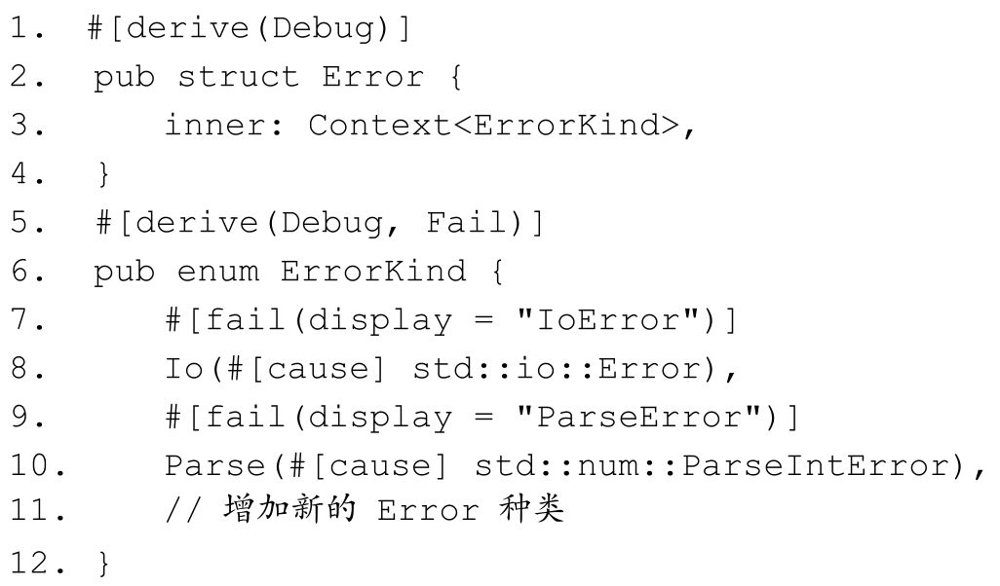{.u53842}
:::

failure库对错误处理做了进一步抽象，它给开发者提供了多种错误处理模式，比如：

· 使用字符串作为错误类型，这种模式一般适合原型设计。

· 自定义失败类型，可以让开发者更加自由地控制错误。

· 使用Error类型，可以方便开发者将多个错误进行汇总处理。

· Error和ErrorKind组合，利用自定义错误和ErrorKind枚举体来创建强大的错误类型，这种模式比较适合生产级应用。

具体还得根据实际的场景来采用合适的模式。本例将采用Error和ErrorKind组合的模式。代码清单9-37中可以看出，在Error结构体中定义了inner字段，用于汇总处理各种错误类型。而具体的错误类型则由ErrorKind枚举体来进行统一管理。

failure 库一共包含两个核心组件来提供统一的错误管理抽象，其中一个是 failure：：Fail trait，替代标准库中的std：：error：：Error trait，用来自定义错误；另一个是failure：：Error结构体，可以转换任何实现Fail的类型，在某种无须自定义错误的场合使用该结构体很方便，任何实现了Fail的类型都可以使用问号操作符返回failure：：Error。

我们可以自己实现Fail trait，也可以使用failure库提供的derive宏自动实现。代码清单9-37 就是自动实现 Fail 的。所有的自定义错误都需要实现 Display，所以代码第 7 行和第 9行通过failure库提供的属性宏自动为枚举实现了Display。通过＃\[cause\]属性，可以指定标准库中内置的基础错误类型。

Fail trait受Send和Sync约束，表明它可以在线程中安全地传播错误。它也受＇static约束，表示对于实现Fail的动态trait对象，也可以被转换为具体的类型。它还受Display和Debug约束，表示可以通过这两种方式来打印错误。在Fail trait中包含了cause和backtrace两个方法，允许开发者获取错误发生的详细信息。Fail trait更像一个工程化版本的Error trait，帮助开发者处理实际开发中的问题。

接下来为Error实现Fail和Display，如代码清单9-38所示。

**代码清单9-38：在src/main.rs中为Error实现Fail和Display**

::: center
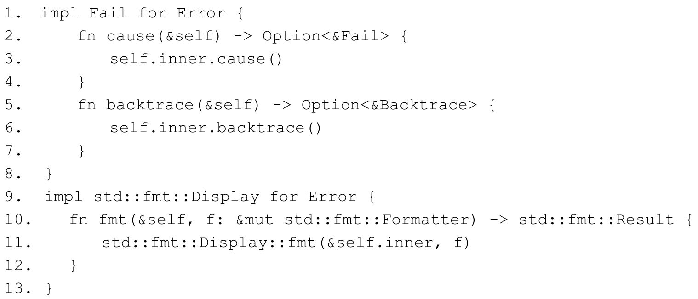{.u53841}
:::

在代码清单9-38中为Error实现了Fail，其中cause和backtrace方法只需要调用inner的相应方法即可。而具体的inner类型即是ErrorKind中定义的各种类型的错误，通过failure提供的属性宏已经自动实现了cause。而backtrace则使用默认的实现。

接下来则需要为Error实现From转换，如代码清单9-39所示。

**代码清单9-39：在src/main.rs中为Error实现From转换**

::: center
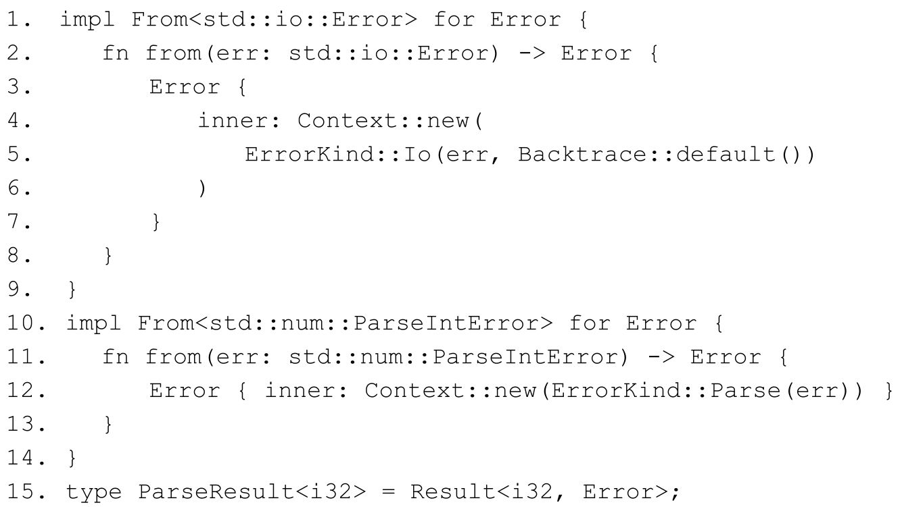{.u53840}
:::

在代码清单9-39中，通过From为Error实现转换到std：：io：：Error和std：：num：：ParseIntError的能力。

最后通过 type 关键字定义统一的 ParseResult＜i32＞类型进行错误处理，其中默认的错误类型是Error。这样就实现了统一的错误管理，而且还附带了Fail trait的诸多默认好处，比如前文中所描述的并发安全等。本例的完整代码可以参考随书源码中的failure_crate包。

failure库的具体用法未来可能有所变更，但是基本的错误统一管理思想不会有太大改变。而且官方还在考虑将failure引入标准库中，但是未来到底如何，目前还未有定论，让我们拭目以待吧。

## 9.6 小结 {#text00015.html#A3b390155-a6a1-4624-a72d-cff9073edb60 .title-left}

通过本章的学习，我们了解到Rust通过区分错误和异常来保证程序的健壮性。

Rust强大的类型系统，在一定程度上保证了函数调用不会因为违反"契约"而导致失败，但也无法覆盖所有失败的情况。然而，Rust也提供了断言机制，用于保证函数运行中的检查，如果出现违反"契约"的情况，则会引发线程恐慌。这是基于"快速失败（Fast Fail）"的思想，可以让Bug提前暴露出来。但是不能滥用断言宏，因为assert！宏有一定的性能开销，因此需要根据具体的情况来选择，尽量使用debug_assert！来代替assert！宏。

Rust并不提供传统语言的异常处理机制，而是从函数式语言中借鉴了基于返回值的错误处理机制。通过Option＜T＞和Result＜T，E＞将错误处理进一步区分为不同的层次。Option＜T＞专门用来解决"有或无"的问题，而 Result＜T，E＞专门用来处理错误和传播错误。这里要区分错误和异常，所谓错误是和业务相关的，是可以被合理解决的问题；而异常则和业务无关，是无法被合理解决的问题。在Rust中，基于Result＜T，E＞的错误处理机制是主流。虽然Rust也提供了catch_unwind方法来捕获线程恐慌，但它是有限制的，并不能捕获所有的恐慌。

Rust还提供了问号语法糖来简化基于Result＜T，E＞的错误处理机制，这不仅方便了开发者，而且还提高了代码的可读性。

为了增强错误处理的工程性，Rust社区还涌现出很多优秀的第三方库，其中有代表性的是error_chain和failure。error_chain的特色是使用自定义的宏来方便开发者统一管理错误，而failure的错误管理思维则是对标准库中Error的进一步增强，更加贴近Rust的错误处理思想，所以目前官方比较推荐failure。

总的来说，Rust的错误处理机制是基于对当前各门编程语言的异常处理机制的深刻反思，结合自身内存安全系统级的设计目标而实现的。开发者只有按Rust的设计哲学进行正确的错误处理，才有利于写出更加健壮的程序。

[]{#text00016.html}

# 第10章 模块化编程 {#text00016.html#A4166d824-20de-43e6-9d58-62382f67206d .title-left}

良好的秩序是一切美好事物的基础。

时至今日，软件开发早已从单打独斗迈入了相互协作的时代。在日常开发中，几乎每一个系统都在依赖别人编写的类库或框架。自开源运动兴起，到现在 GitHub 网站蓬勃发展，软件开发越来越高效和便利。如果想要解决什么问题，只需要到 GitHub 之类的开源平台直接寻找现成的解决方案即可。而这些现成的解决方案大多是由不同国家的不同开发者提供的，而且针对同一个问题也有多种不同的解决方案。这些不同的解决方案之所以能够被有效、方便地复用，完全是因为模块化编程。

模块化编程，是指可以把整个代码分成小块的、分散的、独立的代码块，这些独立的代码块就被称为**模块** 。把一个复杂的软件系统按一定的信息分割为彼此独立的模块，有利于控制和克服系统的复杂性。模块化开发除支持多人协作之外，还支持各部分独立开发、测试和系统集成，甚至可以限制程序错误的影响范围。总的来说，模块化编程拥有如下三点好处：

· **增强维护性** 。一个设计良好的模块，独立性更高，对外界的依赖更少，更方便维护。

· **隔离性** 。拥有各自的命名空间，避免命名冲突，限制错误范围等。

· **代码复用** 。通过引入现成的模块来避免代码复制。

基于模块化的诸多好处，很多编程语言都支持模块化，只是模块化的方式和程度均有不同。比如C或C++，使用头文件的方式来进行模块化编程。而Ruby在语法层面直接支持模块（Module），Python的一个文件就是一个模块。本来在语言层面不支持模块化的JavaScript语言，因为大前端时代的来临，也不得不在ES 6中加入模块化支持。Java语言之前也不支持模块化，社区长期使用JAR文件来进行模块化开发，但是Java 9也在语法层面支持了模块化系统。由此可见模块化的重要性。

但是只有模块还不足以高效编写结构化的软件系统。那么如何方便地集成第三方开发的功能模块？一个简单的解决办法就是按照约定的目录结构来组织模块，并把此目录结构进一步打包成一个独立的模块，以方便外部集成。这种按约定的目录结构打包的模块，就被称为**包** 。在编写一个包的时候，也难免会依赖第三方包，而这些被依赖的包也随时可能被更新、修改、升级，所以一般使用版本化管理。包与包之间的版本依赖关系，手工处理起来比较麻烦，所以需要使用包管理工具来解决依赖、打包、编译、安装等功能。常见的包管理工具有Linux上面的rpm、yum和apt等，语言级别的有Ruby的RubyGems、Python的pip，以及JavaScript的npm。

Rust作为现代化编程语言，强有力地支持模块化编程。Rust中的包管理工具叫作**Cargo** ，第三方包叫作**crate** 。Rust拥抱开源，所有的第三方包都可以在GitHub上面找到，并且可以通过Cargo直接发布到包仓库平台crates.io上面。

## 10.1 包管理 {#text00016.html#Af05e0157-89ec-4c17-91cd-47b830610486 .title-left}

与其他大多数语言不同的是，使用Rust编写代码的最基本单位是包（crate）。Rust语言内置了包管理器Cargo，通过使用Cargo可以方便地创建包。**Cargo一共做了四件事情** ：

· 使用两个元数据（metadata）文件来记录各种项目信息。

· 获取并构建项目的依赖关系。

· 使用正确的参数调用rustc或其他构建工具来构建项目。

· 为Rust生态系统开发建立了统一标准的工作流。

· 通过Cargo提供的命令可以很方便地管理包。

### 10.1.1 使用Cargo创建包 {#text00016.html#Aae9e0157-4ff5-4676-847b-c730af0b2d47 .title-left}

使用cargo new命令创建包csv-read：

::: center
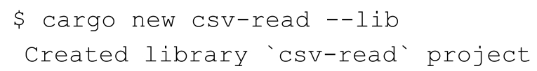{.u53839}
:::

在终端使用tree命令查看包目录结构：

::: center
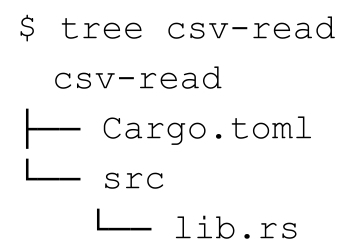{.u53838}
:::

该包中包含的文件有Cargo.toml和src/lib.rs。其中Cargo.toml是包的配置文件，是使用**TOML** 语言 ^[\[1\]](#text00016.html#nE8490157BCE449C383A83335E1A3000F){#text00016.html#nE8490157BCE449C383A83335E1A3000Fs}^ 编写的。TOML语言的特色是：规范简单、语义明显、阅读性高。TOML专门被设计为可以无歧义地映射为哈希表，从而可以更容易地解析为各种语言中的数据结构。而Cargo.toml正是元数据文件之一。打开Cargo.toml，可以看到如代码清单10-1所示的代码。

**代码清单10-1：Cargo.toml文件内容**

::: center
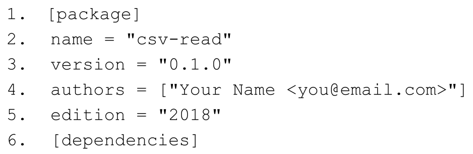{.u53837}
:::

代码清单10-1展示了Cargo.toml文件的内容（manifest文件），它里面记录了用于编译整个包所用到的元数据。代码第1～5行定义的是包信息，记录了包的名字为"csv-read"。

从Rust 1.30版本开始，默认创建的crate都会带有**edition** 选项，其默认设置为"**2018** "。这代表默认crate使用**Rust 2018** 版本。如果有需要，也可以将其修改为"2015"，以便支持**Rust 2015 版本** 。

再打开src/lib.rs文件，其初始内容如代码清单10-2所示。

**代码清单10-2：src/lib.rs初始内容**

::: center
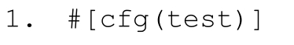{.u53836}
:::

::: center
{.u53835}
:::

在src/lib.rs中，初始内容只有tests模块。在Rust中使用关键字mod来定义模块。＃\[cfg（test）\]属性为条件编译，告诉编译器只在运行测试（cargo test命令）时才编译执行。在tests模块中，生成了一个示例方法it_works。只要进入该包的根目录下，然后执行cargo test命令，即可看到测试正常运行，如下所示。

::: center
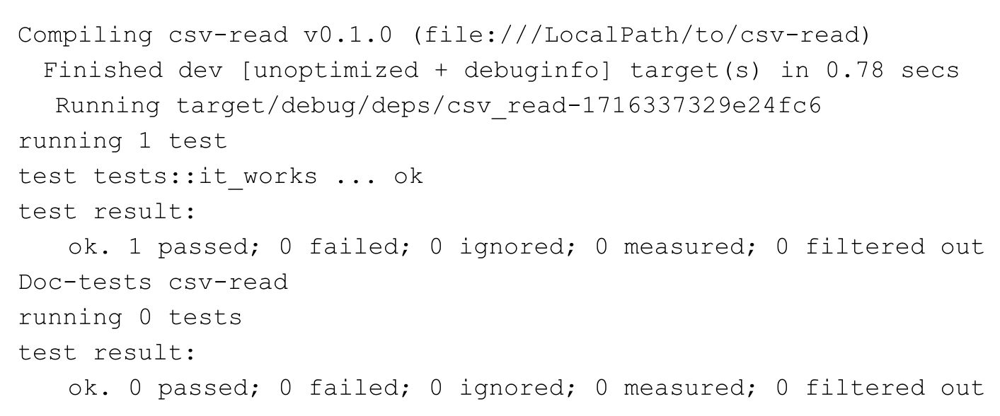{.u53834}
:::

可以看出，tests：：it_works测试方法被成功执行，显示"ok.1 passed"。但是我们看到下面又有Doc-tests，这其实是指文档测试，因为Rust支持在文档注释里写测试。而这里并没有写任何文档测试。

此时再使用tree命令来查看目录结构，如下所示。

::: center
{.u53833}
:::

可以看出，多了一个**Cargo.lock** 文件和target文件夹。Cargo.lock是另外一个元数据文件，它和Cargo.toml的不同点如下：

· Cargo.toml 是由开发者编写的，从广义上来描述项目所需要的各种信息，包括第三方包的依赖。

· Cargo.lock只记录依赖包的详细信息，不需要开发者维护，而是由Cargo自动维护的。

target文件夹是专门用于存储编译后的目标文件的。编译默认为**Debug** 模式，在该模式下编译器不会对代码进行任何优化，所以编译时间较短，代码运行速度较慢。也可以使用**\--release** 参数来使用发布模式，在该模式下，编译器会对代码进行优化，使得编译时间变慢，但是代码运行速度会变快。

使用**cargo new** 命令默认创建的是库文件（生成静态或动态链接库），它并非可执行文件，而是专门用于被其他应用程序共享的功能模块。如果想创建可执行文件，那么需要使用**\--bin** 参数。

::: center
{.u53832}
:::

加**\--bin** 参数或者什么都不加，所创建的包就可被编译为可执行文件。使用tree命令来查看其目录结构，如下所示。

::: center
{.u53831}
:::

这里唯一的变化是在src下面的是main.rs文件。代码清单10-3展示了main.rs文件的初始内容。

**代码清单10-3：src/main.rs初始内容**

::: center
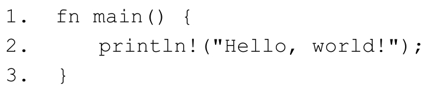{.u53830}
:::

在main.rs文件中默认定义了main函数，这理所当然，因为可执行文件必须要有程序入口。可以通过执行cargo build命令来编译该包，但要注意，必须在包的根目录下执行该命令。也可以直接使用cargo run命令来编译并运行该包，如下所示。

::: center
{.u53829}
:::

### 10.1.2 使用第三方包 {#text00016.html#Af5ea0159-aa33-4e30-af44-8b38dd98b272 .title-left}

在日常开发中，经常会使用到第三方包。在 Rust 中使用第三方包非常简单，只需要在Cargo.toml中的**\[dependencies\]** 下面添加想依赖的包即可。

假如想在上面创建好的csv-read中添加linked-list包，如代码清单10-4所示。

**代码清单10-4：在Cargo.toml文件中添加linked-list依赖**

::: center
{.u53828}
:::

然后在src/main.rs或src/lib.rs文件中，使用extern crate命令声明引入该包即可使用，如代码清单10-5所示。

**代码清单10-5：在src/main.rs文件中使用extern crate命令声明引入第三方包**

::: center
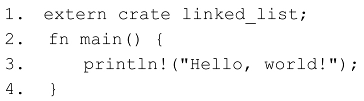{.u53827}
:::

在代码清单10-5中，代码第1行使用**extern crate** 声明引入第三方包。这是Rust 2015版本的写法。在**Rust 2018 版本** 中，可以省略掉extern crate这种写法，因为在Cargo.toml中已经添加了依赖。

另外，值得注意的是，使用**extern crate** 声明包的名称是linked_list，用的是下画线"**\_** "，而在Cargo.toml中用的是连字符"-"。这是怎么回事呢？其实Cargo默认会把连字符转换成下画线。这是为了统一包名称，因为linked-list和linked_list到底是不是同一个包，容易造成歧义。

Rust也不建议以"-rs"或"\_rs"为后缀来命名包名，并且会强制性地将此后缀去掉，所以在命名时要注意。接下来，通过介绍在日常编程中两个比较实用的第三方包，来看看如何集成第三方包完成功能。

**使用正则表达式regex包**

在Rust标准库中并没有内置正则表达式的支持，它是作为第三方包而存在的，名为regex。现在使用cargo new\--bin use_regex命令创建一个新的包，然后在Cargo.toml文件中添加regex依赖，如代码清单10-6所示。

**代码清单10-6：在Cargo.toml文件中添加regex依赖**

::: center
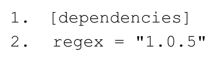{.u53826}
:::

当前regex最新的版本是1.0.5。然后，在src/main.rs中同样使用extern crate来声明引入regex包，如代码清单10-7所示。

**代码清单10-7：在src/main.rs中声明引入regex包**

::: center
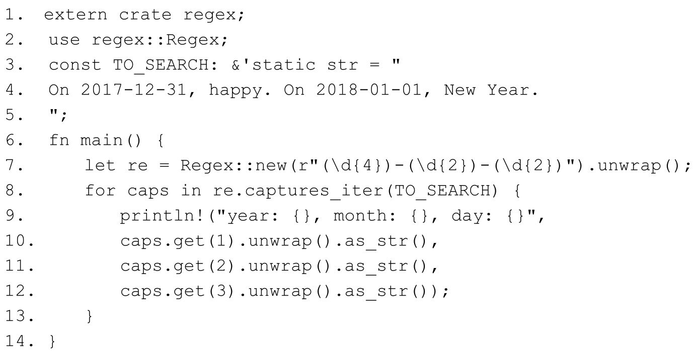{.u53825}
:::

使用cargo run命令编译并执行该包，会得到如下执行结果：

::: center
{.u53824}
:::

在代码清单 10-7 中，先使用 extern crate regex 声明引入 regex 包，然后使用 use regex：：Regex声明，是为了简化代码，这样就可以直接在use_regex包里使用Reg ex了，如代码第7行所示。

如果不使用 use 声明，那么也可以直接使用 regex：：Regex：：new，但是在可读性上就差了许多。

代码第7行，给定了正则表达式字符串，由此生成正则实例re。然后在代码第8行，通过**captures_iter** 方法，对给定的常量字符串TO_SEARCH进行匹配和迭代，并依次将捕获匹配到的字符串打印出来，因为给定的正则表达式是带有捕获组的表达式。

regex 包支持大部分正则匹配功能，但**不支持环视（look-around）** 和**反向引用（backreference）** 。这是因为 regex 注重性能和安全，而环视和反向引用更容易被黑客利用制造**ReDos** 攻击。如果一定要使用环视和反向引用，则可以使用**fancy-regex** 包。

regex包也支持命名捕获，如代码清单10-8所示。

**代码清单10-8：使用命名捕获的示例**

::: center
{.u53823}
:::

在代码清单10-8中，代码第2～8行，传给Regex：：new方法的正则表达式以（？x）为前缀，这是指定了正则表达式标记x。regex包支持多种正则表达式标记，意义如下：

· **i** ，匹配时不区分大小写。

· **m，** 多行模式，"\^"和"\$"对应行首和行尾。

· **s，** 允许通配符"."匹配"\\n"。

· **U，** 大写U，交换"x\*"和"x\*？"的意义。

· **u，** 小写u，允许支持Unicode（默认启用）。

· **x** ，忽略空格并允许行注释（以"＃"开头）。

所以，在代码清单10-8中，从代码第2～8行可以看到，为正则表达式加上了空格和注释也不影响最终的匹配结果。也要注意在该正则表达式中使用了（？P＜name＞exp）这种格式来定义命名捕获组。

代码第9行，使用captures方法就可以获取匹配的捕获变量，并保存到一个HashMap中，以命名变量作为HashMap的键，匹配的字符串作为值。代码第10～12行，就可以直接从caps中按指定的键取相应的值。

代码第13行和第14行，使用replace_all方法按指定的格式来替换匹配的字符串。注意指定的格式是以"\$"符号和命名捕获变量组合而成的。

regex还有很多其他功能和用法，可以翻阅其文档来获取更多内容。

**惰性静态初始化lazy_static包**

在编程中，经常会有对全局常量或变量的需求。Rust 支持两种全局类型：**普通常量（Constant）** 和**静态变量（Static）** 。它们的异同之处在于以下几点：

· 都是在编译期求值的，所以不能用于存储需要动态分配内存的类型，比如HashMap、Vector等。

· 普通常量是可以被内联的，它没有确定的内存地址，不可变。

· 静态变量不能被内联，它有精确的内存地址，拥有静态生命周期。

· 静态变量可以通过内部包含UnsafeCell等的容器实现内部可变性。

· 静态变量还有其他限制，比如不包含任何析构函数、包含的值类型必须实现了 Sync以保证线程安全、不能引用其他静态变量。

· 普通常量也不能引用静态变量。

**在存储的数据比较大、需要引用地址或具有可变性的情况下使用静态变量** ；**否则，应该优先使用普通常量** 。但也有一些情况是这两种全局类型无法满足的，比如想使用全局的HashMap或Vector，或者在使用正则表达式时只让其编译一次来提升性能。在这种情况下，推荐使用lazy_static包。

利用lazy_static包可以把定义全局静态变量延迟到运行时，而非编译时，所以冠之以"惰性（lazy）"。在Cargo.toml中添加lazy_static依赖如代码清单10-9所示。

**代码清单10-9：在Cargo.toml中添加lazy_static依赖**

::: center
{.u53822}
:::

继续在use_regex包中添加lazy_static依赖。然后在src/main.rs中通过extern crate引入lazy_static包，如代码清单10-10所示。

**代码清单10-10：修改src/main.rs文件，通过extern crate引入lazy_static包**

::: center
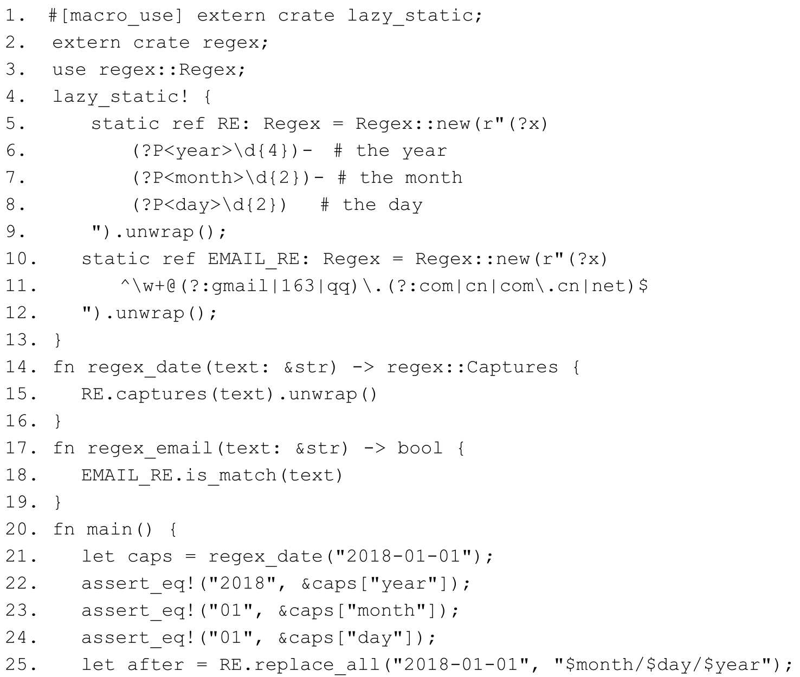{.u53821}
:::

::: center
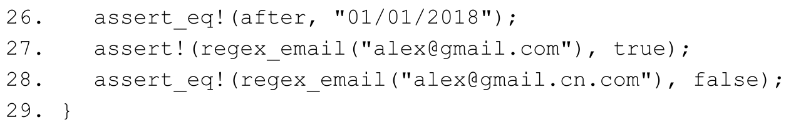{.u53820}
:::

代码清单10-10是Rust 2015 的写法。代码第1行，使用了**＃\[macro_use\] extern crate lazy_static** ，是因为需要使用lazy_static包中定义的lazy_static！宏。＃\[macro_use\]可以和extern crate lazy_static写成两行，未来＃\[macro_use\]或可省略，该属性的意思是导出包中定义的宏。当然，在**Rust 2018** 中，extern crate语法可以省略，那么相应的**＃\[macro_use\]** 也可以省略，也就是说，代码第1代和第2行皆可省略**。**

代码第4～13行，使用lazy_static！宏定义了两个全局静态变量RE和EMAIL_RE，它们是不同的正则表达式。这样一来，就只需要编译一次，而不会重复编译。之所以把正则表达式定义为全局静态变量，是出于编译性能的考虑，如果该正则表达式被用于循环匹配中，那么会降低编译的性能，并且不利于正则表达式引擎内部的优化。

代码第14～19行，分别定义了regex_date和regex_email方法，用来匹配传入的字符串。在main函数中，则可以方便地使用它们。

当需要全局的容器时，比如HashMap，也可以使用lazy_static包。

首先使用**cargo new\--bin static_hashmap** 命令创建新的包，然后在**Cargo.toml** 中添加lazy_static依赖，再修改src/main.rs代码，如代码清单10-11所示。

**代码清单10-11：修改新创建的static_hashmap包中的src/main.rs代码**

::: center
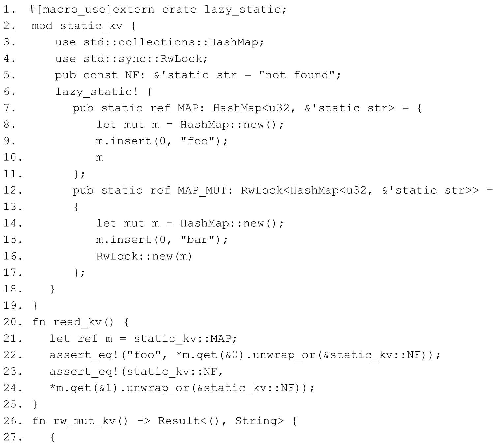{.u53819}
:::

::: center
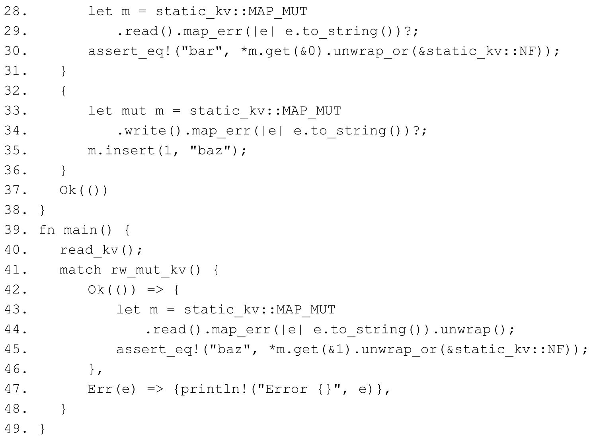{.u53818}
:::

在代码清单10-11中，代码第1行，同样是通过＃\[macro_use\] extern crate lazy_static引入包和lazy_static！宏的。

代码第2～19行，使用mod关键字定义了static_kv模块。模块是Rust模块化编程的基础，其作用域是独立的、封闭的，在static_kv中定义的常量或方法默认是私有的。所以，想要在模块外调用模块中的常量或方法，就必须通过**pub** 关键字将可见性改为公开的。

所以，代码第3行和第4行，使用use引入了std：：collections和std：：sync模块，使用其中定义的HashMap和RwLock，只对模块static_kv有效。

代码第5行，使用pub const定义了公开的普通常量NF，它是一个字符串字面量类型。如果想在模块外使用它，就必须带上命名空间，也就是模块的名字：static_hash：：NF。

代码第6～18行，使用lazy_static！宏定义了两个全局静态变量MAP和MAP_MUT，分别代表只读的HashMap和可变的HashMap。lazy_static！宏的语法格式如代码清单10-12所示。

**代码清单10-12：lazy_static！宏的语法格式**

::: center
{.u53817}
:::

在使用lazy_static！宏时，必须严格按照此语法格式来书写，否则会引发线程恐慌。

回到代码清单10-11中，代码第7～11行，定义了一个不可变（只读）的HashMap类型的全局静态变量MAP，并插入了一个初始化的键值对"{0：＂foo＂}"。

代码第12～17行，定义了可变（可读可写）的RwLock＜HashMap＜u32，&＇static str＞＞类型的全局静态变量MAP_MUT。注意，这里使用了**RwLock读写锁** 来包装HashMap，这是因为可能会有多个线程来访问HashMap，而HashMap并没有实现Sync，所以HashMap不是线程安全的类型。因此，必须使用同步锁来保护HashMap，让其线程安全。其实也可以使用Metux互斥锁来保护HashMap，它们的区别在于：

· RwLock读写锁，是多读单写锁，也叫共享独占锁。它允许多个线程读，单个线程写。但是在写的时候，只能有一个线程占有写锁；而在读的时候，允许任意线程获取读锁。读锁和写锁不能被同时获取。

· Metux互斥锁，只允许单个线程读和写。

所以在读数据比较频繁远远大于写数据的情况下，使用RwLock读写锁可以给程序带来更高的并发支持。在第11章中还会对它们做更详细的介绍。

作为全局静态变量，希望 MAP_MUT 希望用于多读单写的场景中，所以这里使用了RwLock读写锁。

代码第20～25行，定义了read_kv函数。在该函数内部，使用了static_kv：：MAP来获取static_kv 模块中定义好的全局静态变量 MAP，如果不加命名空间 static_kv，则无法访问到MAP。

代码第 21 行，使用了 ref 模式匹配来获取 static_kv：：MAP 的引用 m，也可以直接使用&static_kv：：MAP来获取引用m。代码第22～24行，通过对m解引用，得到其内部的HashMap类型，并使用get方法来获取存储于MAP中的初始键值对。这里使用get方法来获取HashMap指定键的值，是一个很好的工程实践，因为 get 方法会返回 Option＜T＞类型。如果没有获取到，则会返回 None，或者是指定的其他值，比如该行中的&static_kv：：NF，这样更有利于错误处理。也可以直接使用\*m\[&0\]这样的写法，但它返回的是&T 类型，如果没有匹配的值，则线程会发生恐慌。

代码第26～38行，定义了rw_mut_kv函数，该函数返回一个Result＜（），String＞类型。在该函数中使用的是 static_kv：：MAP_MUT 全局静态变量，它的类型实际上是RwLock＜HashMap＜u32，&＇static str＞＞。RwLock读写锁提供了read和write方法来获取读锁和写锁。

注意，在函数rw_mut_kv中，使用了代码块对read和write进行了隔离，如代码第27～31行以及代码第32～36行所示。这是因为读锁和写锁不能被同时获取。只有放到代码块中，才能让读锁和写锁得到释放，因为Rust的RAII机制，在资源（这里是锁）出了作用域之后会得到释放。

如果把代码块去掉，则会发生死锁情况。在Rust中，叫作"**中毒（Poison）** "。但是，如果该函数中只存在读的情况，而没有写，则不需要引入代码块隔离，因为RwLock是允许多个线程同时读的。同样，在第11章中会介绍更多的相关内容。

在main函数中，分别调用了read_kv和rw_mut_kv。因为rw_mut_kv返回的是Result类型，所以需要使用match匹配处理Ok和Err两种情况。如果写入正常，那么也可以正常读取HashMap中写入的值；否则输出错误。

综上所述，就是惰性静态初始化 lazy_static 包的两个使用场景。另外，**还有两个值得注意的地方** ：

· 使用lazy_static！宏定义的全局静态变量如果有析构函数，则是不会被调用的，因为是静态生命周期。

· 在 lazy_static！宏中不能定义太多的全局静态变量，否则会引发线程恐慌。这是因为在lazy_static！宏中调用了内部的宏，Rust 对宏的递归调用有调用次数限制。可以通过在当前编写的包中加上＃！\[recursion_limit=＂128＂\]属性修改上限，默认值为 32，比如可以修改为128。

在不久的将来，Rust 的 CTFE（编译时函数执行）功能进一步完善之后，在某些场景中也许就不需要使用lazy_static包了。

**指定第三方包的依赖关系**

Rust包使用的是**语义化版本号** ^[\[2\]](#text00016.html#n897E016021834B4D8685FE806DD84201){#text00016.html#n897E016021834B4D8685FE806DD84201s}^ （**SemVer** ）。基本格式为"**X.Y.Z** "，版本号递增规则如下：

· **X，主版本号** （major）。当做了不兼容或颠覆性的更新时，修改此版本号。

· **Y，次版本号** （minor）。当做了向下兼容的功能性修改时，修改此版本号。

· **Z，修订版本号** （patch）。当做了向下兼容的问题修正时，修改此版本号。

语义化版本号是为了解决所谓"依赖地狱"的问题。随着系统规模的增长，加入的第三方包就会越来越多，包之间的依赖关系也会越来越复杂，容易造成"依赖地狱"。

比如增加lazy_static依赖时，指定了版本号为"1.0.0"。该版本号等价于"\^1.0.0"，这意味着当有新的lazy_static包发布时，允许Cargo在主版本号不变的情况下，更新次版本号或修订版本号。比如发布了"1.1.0"，那么当执行cargo build或cargo run命令时，会自动依赖最新的"1.1.0"包。

指定版本号范围的标记有以下几种：

· **补注号（\^）** ，允许新版本号在不修改\[major，minor，patch\]中最左边非零数字的情况下才能更新。

· **通配符（\*）** ，可以用在\[major，minor，patch\]的任何一个上面。

· **波浪线（～）** ，允许修改\[major，minor，patch\]中没有明确指定的版本号。

· **手动指定** ，通过＞、＞=、＜、＜=、=来指定版本号。

具体的示例如代码清单10-13所示。

**代码清单10-13：语义化版本号示例**

::: center
{.u53816}
:::

::: center
{.u53815}
:::

除语义化版本号之外，Cargo 还全面支持 git。可以直接指定 git 仓库地址，如代码清单10-14所示。

**代码清单10-14：可以直接指定git仓库地址**

::: center
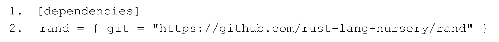{.u53814}
:::

当一个包依赖本地的包时，也可以指定其依赖路径。比如在上面创建的 static_hashmap包中，又创建了一个新的包hello_world，就可以在static_hashmap的Cargo.toml文件中按路径指定依赖关系，如代码清单10-15所示。

**代码清单10-15：可以使用path来指定本地包hello_world**

::: center
{.u53813}
:::

注意，在代码清单10-15中，hello_world是在static_hashmap包的根目录下创建的，path默认的根目录就是static_hashmap包的根目录。但是这种通过path指定本地依赖的包，不允许被发布到crates.io仓库平台上面。

### 10.1.3 Cargo.toml文件格式 {#text00016.html#Ab9a50161-3e95-4174-9e6b-f2a45687c130 .title-left}

TOML文件是通用的格式，可以用它表示任何配置格式。Cargo也有一套专用的TOML配置格式。现在以第三方包regex ^[\[3\]](#text00016.html#n88B10161087A448D9B91A5D2B55D925F){#text00016.html#n88B10161087A448D9B91A5D2B55D925Fs}^ 作为示例来说明。代码清单10-16展示了regex包的目录结构。

**代码清单10-16：regex包的目录结构**

::: center
{.u53812}
:::

在regex包里还包含着另外四个包，分别是bench、regex-capi、regex-debug和regex-syntax。

**\[package\]表配置**

现在打开Cargo.toml 文件看看相关配置。代码清单10-17 展示了regex 包中Cargo.toml文件的\[package\]表配置。

**代码清单10-17：regex包中Cargo.toml文件的\[package\]表配置**

::: center
{.u53811}
:::

在TOML语言中，\[package\]这种语法叫作**表** （**Table** ）。在\[package\]表里描述的都是和regex包有关的元数据，比如包名（name）、作者（authors）、源码仓库地址（repository）、文档地址（documentation）、包功能的简要介绍（description）、包的分类（categories）等。

注意其中的语法，基本都是字符串。如果是数组，则使用中括号；如果是多段的文字，则使用三引号"**＂＂＂** "。

\[package\]表是每个包必不可少的，它相当于代码清单10-18中描述的JSON格式。

**代码清单10-18：\[package\]表等价于这样的JSON格式**

::: center
{.u53810}
:::

**\[badges\]表配置**

继续看regex包的Cargo.toml文件，接下来是**\[badges\]** 表配置，如代码清单10-19所示。

**代码清单10-19：\[badges\]表配置**

::: center
{.u53809}
:::

在代码清单10-19中展示了\[badges\]表配置，设置了travis-ci和appveyor。这两项表配置表示可以在crates.io网站上显示travis-ci和appveyor的展示徽章。travis-ci和appveyor都是云端的持续集成服务平台，前者支持Linux和Mac OS系统，后者支持Windows系统。另外，\[badges\]表还支持 GitLab、codecov 等诸多平台。\[badges\]表是一个可选表，如果没有持续集成服务，则可以不配置此表。

**\[workspace\]表配置**

接下来是\[workspace\]表配置，如代码清单10-20所示。

**代码清单10-20：\[workspace\]表配置**

::: center
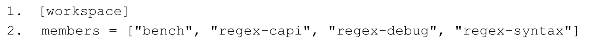{.u53808}
:::

在代码清单 10-20 中，\[workspace\]表代表工作空间（Workspace）。工作空间是指在同一个根包（crate）下包含了多个子包（crate）。在本例中，根包就是regex，而在代码第2行，members键指定了bench、regex-capi、regex-debug、regex-syntax四个子包。

工作空间中的子包都有自己的Cargo.toml配置，各自独立，互不影响。在根包regex的Cargo.toml 中指定的依赖项，也不会影响到子包。不管是编译根包还是子包，最终的编译结果永远都会输出到根包的target目录下，并且整个工作空间只允许有一个Cargo.lock文件。

**\[dependencies\]表配置**

继续看根包regex的Cargo.toml文件，接下来就是\[dependencies\]表配置，如代码清单10-21所示。

**代码清单10-21：\[dependencies\]表和\[deü-dependencies\]表配置**

::: center
{.u53807}
:::

在代码清单10-21中展示了**\[dependencies\]** 表和**\[dev-dependencies\]** 表配置。\[dependencies\]表在前面介绍过，它专门用于设置第三方包的依赖，这些依赖会在执行cargo build命令编译时使用。\[dev-dependencies\]表的作用与之类似，只不过它只用来设置测试（tests）、示例（examples）和基准测试（benchmarks）时使用的依赖，在执行**cargo test** 或**cargo bench** 命令时使用。

**\[features\]表配置**

接下来是**\[features\]** 表配置，如代码清单10-22所示。

**代码清单10-22：\[features\]表配置**

::: center
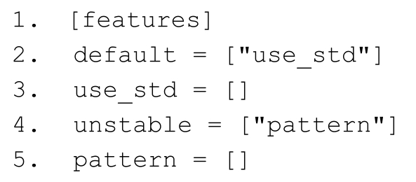{.u53806}
:::

在代码清单10-22中，**\[features\]** 表中的配置项与条件编译功能相关。在Rust中，有一种特殊的属性**＃\[cfg\]** ，叫作**条件编译属性** ，该属性允许编译器按指定的标记选择性地编译代码。在此例中，pattern表示允许使用std标准库中定义的Pattern trait，但是该trait目前还处于未稳定状态，所以使用了unstable配置。

代码清单10-23展示了在regex包中如何使用条件编译属性。

**代码清单10-23：在regex包中使用＃\[cfg\]属性**

::: center
{.u53805}
:::

在代码清单10-23中，代码第3行使用了**＃\[cfg（feature=＂pattern＂）\]** ，这意味着当执行**cargo build\--features ＂pattern＂** 命令时，在 Cargo 内部调用 Rust 编译器 rustc 时会传**\--cfg feature=＂pattern＂** 标记，那么在输出中也会包含pattern模块；否则，不会编译pattern模块。

代码第1行使用了**＃\[cfg（not（feature=＂use_std＂））\]** ，其作用正好和**＃\[cfg（feature=＂use_std＂）\]** 相反，表示在编译时不指定features参数。

**\[lib\]表配置**

继续看regex根包的Cargo.toml文件，接下来是\[lib\]表配置，如代码清单10-24所示。

**代码清单10-24：\[lib\]表配置**

::: center
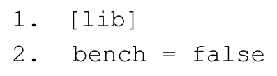{.u53804}
:::

代码清单 10-24 展示的\[lib\]表用来表示最终编译目标库的信息，该表完整的配置项主要包含以下几类：

· **name** 。比如name=＂foo＂，表示将来编译的库名字为"libfoo.a"或"libfoo.so"等。

· **crate-type** 。比如crate-type=\[＂dylib＂，＂staticlib＂\]，表示可以同时编译生成动态库和静态库。

· **path** 。比如path=＂src/lib.rs＂，表示库文件入口，如果不指定，则默认是src/lib.rs。

· **test** 。比如test=true，表示可以使用单元测试。

· **bench** 。比如bench=true，表示可以使用性能基准测试。

还有其他配置项，这里就不一一列举了。在本例中，因为根包中没有提供性能基准测试，所以将bench设置为false。

**\[test\]表配置**

接下来是**\[\[test\]\]** 表配置，注意到该表由两个中括号嵌套表示，这在TOML语言中代表表数组，如代码清单10-25所示。

**代码清单10-25：\[\[test\]\]表配置**

::: center
{.u53803}
:::

::: center
{.u53802}
:::

在代码清单10-25中列举了三组\[\[test\]\]表配置，这只是regex根包中Cargo.toml配置的一部分。这三组\[\[test\]\]表表示一个数组，**等价的JSON格式** 如代码清单10-26所示。

**代码清单10-26：\[\[test\]\]表数组等价的JSON格式**

::: center
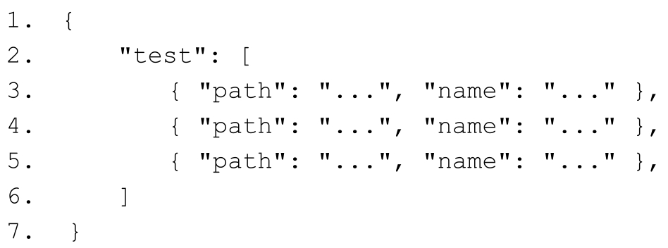{.u53801}
:::

可以得出，\[\[test\]\]表数组表示的是同一个数组中的三组不同配置。\[\[test\]\]表支持的配置项和\[lib\]表基本相同。

**\[profile\]表配置**

接下来是\[profile\]表配置，如代码清单10-27所示。

**代码清单10-27：\[profile\]表配置**

::: center
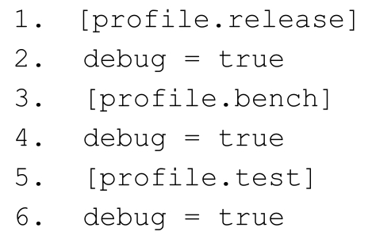{.u53800}
:::

Cargo支持自定义rustc编译配置，使用\[profile\]表进行配置即可，但只对根包中的profile配置有效。

在代码清单 10-27 中，在\[profile\]表中使用了点（**.** ）符号来表示嵌套，分别是\[profile.release\]、\[profile.bench\]和\[profile.test\]，**与其等价的JSON格式** 如代码清单10-28所示。

**代码清单10-28：\[profile\]表配置对应的JSON格式**

::: center
{.u53799}
:::

这三项表配置分别代表 Release、Bench 和 Test 编译模式。除此之外，Cargo 还支持\[profile.dev\]代表Debug模式。在本例中，当前的配置代表在Release、Bench和Test模式下，均包含Debug信息。除debug配置项之外，还支持用于指定优化级别的opt-level、连接时间优化的lto等。

快速浏览了一遍根包的Cargo.toml配置文件，大概了解到这些配置表的作用。接下来看看子包bench中的Cargo.toml文件。

子包bench的目录结构如代码清单10-29所示。

**代码清单10-29：子包bench的目录结构**

::: center
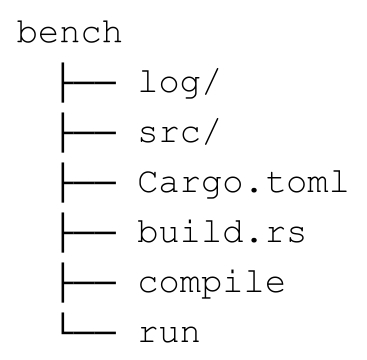{.u53798}
:::

Bench 子包用来和其他语言编写的正则表达式引擎比较性能基准测试，在 log 文件夹里保存的是曾经的测试记录。src目录是Rust包结构的原生目录。Cargo.toml是Cargo的配置文件。**build.rs** 叫作**构建脚本（Build Script）** ，它是先于cargo build被编译的脚本，因为有时候需要在编译时依赖第三方非Rust代码，比如C库，这时就需要先编译C库，然后Rust代码才能链接到C库。关于build.rs，在第12章中还会做更详细的介绍。compile和run是shell脚本，分别包装了cargo build和cargo bench命令，用于更方便地执行基准测试。

现在查看子包bench的Cargo.toml文件，如代码清单10-30所示。

**代码清单10-30：子包bench中的Cargo.toml文件部分配置**

::: center
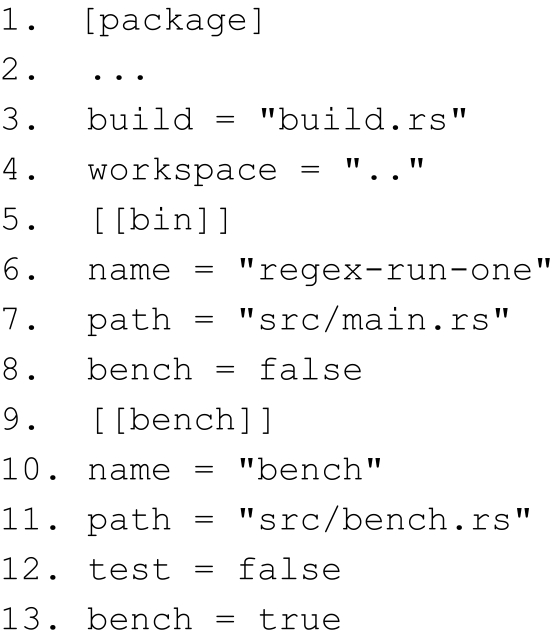{.u53797}
:::

代码清单10-30只展示了之前没有见到过的Cargo.toml文件的部分配置，因为大部分配置和根包regex中的Cargo.toml文件一致。

代码第1～4行，**\[package\]** 表中有两个键值对配置项build和workspace。其中build用于设置构建脚本，这里直接指定 build.rs，因为默认的根路径就是当前包（bench）的根目录，而build.rs正好位于当前包的根目录下。workspace和根包（regex）中Cargo.toml的\[workspace\]表配置相呼应，这里设置了两个点"**..** "，表示workspace是当前包根目录的上一层目录。

代码第5～8行的\[\[bin\]\]表和第9～13行的\[\[bench\]\]表以及上面提到的\[lib\]表的配置项是相同的。当想在一个作为库的包里同时包含main.rs（可执行程序的入口main函数）时，就需要配置\[\[bin\]\]表。这里配置项 name 表示生成的可执行文件的名字；path 表示当前包含入口main函数的文件路径。如果想把该入口文件直接置于src目录下，则文件名必须是main.rs；如果想用其他文件名，则必须将其放到src/bin目录下。这里配置项bench被设置为false，就是希望在生成可执行文件时不会去执行基准测试。同理，可推出\[\[bench\]\]表中配置的含义。

至此，对子包bench中Cargo.toml文件的配置也有了比较全面的了解。关于更多的细节，可以参考crates.io网站上更详细的文档。

### 10.1.4 自定义Cargo {#text00016.html#A739c0167-f0a8-41e7-8ab4-77be1e302b35 .title-left}

Cargo 允许修改本地配置来自定义一些信息，比如命令别名、源地址等。默认的全局配置位于"\$HOME/.cargo/config"文件（基于 Linux/类 UNIX 系统，如果是 Windows，则为%USERPROFILE%\\.cargo\\config）中。具体的配置信息如代码清单10-31所示。

**代码清单10-31：\$HOME/.cargo/config配置信息**

::: center
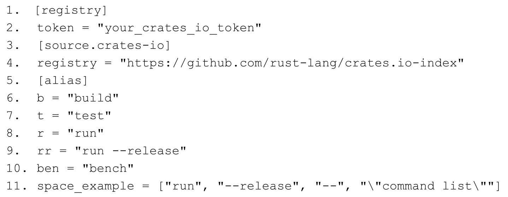{.u53796}
:::

代码清单 10-30 展示了 Cargo 配置文件的部分配置信息，可以看出，配置语言同样是TOML。其中**\[registry\]** 表代表crates.io的相关配置；**token** 是在crates.io上注册账号以后由网站颁发的，用于开发者在发布包（crate）时通过平台验证。

**\[source.crates-io\]** 表表示Cargo的源是crates.io。registry配置项指定了crates.io的索引文件地址。GitHub是默认配置，如果无法访问GitHub，则可以通过指定其他的源来解决问题，具体可参考附录A中的方法。

**在\[alias\]** 表中可以指定 Cargo 各种命令的别名，以方便使用。甚至还能定义比较复杂的组合命令，如代码第11行所示，当执行cargo space_example命令时，实际上会执行cargo run\--release\--command list命令。

**Cargo配置文件的层级关系说明**

Cargo配置文件和git差不多，支持层级的概念。也就是说，可以进行全局配置，也可以针对具体的项目（包）进行配置，如下所示。

· 所有用户的全局配置：/.cargo/config

· 当前用户的全局配置：\$HOME/.cargo/config

· 根包regex的配置：/regex/.cargo/config

· 子包bench的配置：/regex/bench/.cargo/config

**Cargo配置会从上到下层层覆盖** ，**上下层的配置并不会相互影响** 。假如在子包bench中定义了cargo build的别名为"cargo bu"，那么在bench根目录下执行cargo build、cargo bu、cargo b命令中的任意一个都是可以的。回到根包regex中执行cargo bu命令则不行，但依然可以执行cargo build和cargo b命令。

**自定义Cargo子命令**

Cargo 允许自定义命令来满足一些特殊的需求。只要在**\$PATH** （环境变量）中能查到以"**cargo** -"为前缀的二进制文件，比如cargo-something，就可以通过cargo something来调用该命令。比如，在日常开发中专门用于格式化Rust代码的第三方Cargo扩展rustfmt，就是这样来扩展Cargo命令的。

可以通过下列命令来安装rustfmt。

· 稳定版（Stable）Rust：rustup component add rustfmt

· 夜版（Nightly）Rust：rustup component add rustfmt\--toolchain nightly

通过执行cargo\--list命令来查看当前可用的全部命令，就可以发现多了一个fmt命令，然后就可直接调用cargo fmt令来格式化Rust文件。比如在前面创建的static_hashmap包的根目录下执行cargo fmt命令，则会对src/main.rs重新格式化，同时还会生成src/main.rs.bk文件作为备份。一般在团队开发中多使用此Cargo扩展，不管每个团队成员的编码风格是否一致，只需要在提交代码前执行一遍cargo fmt命令，就可以统一整个团队的编码风格。如果有些地方不想被rustfmt处理，那么只需要在该处上方添加＃\[rustfmt_skip\]属性即可。

打开rustfmt源码中的Cargo.toml文件，会看到如代码清单10-32所示的配置。

**代码清单10-32：rustfmt源码中Cargo.toml文件的部分配置**

::: center
{.u53795}
:::

从代码清单10-32中可以看出，\[\[bin\]\]表数组一共配置了四个可执行文件的名字，其中包括了cargo-fmt，用户通过cargo install命令安装rustfmt之后就自动拥有了cargo fmt命令。与这四个可执行文件相对应，在 rustfmt 源码中的 src/bin 目录下有四个 Rust 文件，分别是rustfmt.rs、cargo-fmt.rs、rustfmt-format-diff.rs 和 git-rustfmt.rs，因此在\[\[bin\]\]表数组下没有使用path来设置文件路径。

除了可以直接使用rustfmt默认的代码风格，还可以通过在包的根目录下添加rustfmt.toml文件来自定义代码风格，代码清单10-33展示了一份自定义的格式化配置供参考。

**代码清单10-33：rustfmt.toml配置**

::: center
{.u53794}
:::

关于更多的配置，可以参考rustfmt的相关文档。

另外，Cargo 还提供了两个在开发中相当有用的工具：cargo-fix 和 cargo-clippy。其中cargo-fix 提供了 cargo fix 命令，可以为开发者自动修复编译过程中出现的 Warning。cargo-clippy是Rust静态代码分析工具，其提供了cargo clippy命令，帮助开发者检测代码中潜在的错误和坏味道，并且从Rust 1.29版本开始可用于Rust稳定版中。

## 10.2 模块系统 {#text00016.html#Ab3530169-08b4-428e-ad10-950d0b5347a0 .title-left}

Rust官方团队鼓励开发者在开发包（crate）的时候，尽可能做到最小化。也就是说，每个包都应该尽量只负责单一的完整功能。有些第三方包，代码量比较少，只需要单个文件（比如 src/lib.rs）就能完成整个功能。有些包代码量却很多，可以写在单个文件中来实现整个功能，但是不利于维护。Rust是一门支持模块化的语言，对于代码量比较大的包，可以将其按文件分割为不同的模块，这样可以更合理地组织代码。

在单个文件中，可以使用**mod** 关键字来声明一个模块。在static_hashmap包中，就使用mod关键字声明了static_kv模块。在Rust中单个文件同时也是一个默认的模块，文件名就是模块名。**每个包都拥有一个顶级** （**top-level** ）**模块src/lib.rs或src/main.rs** 。

**Rust 2015 模块**

现在对static_hashmap包按**Rust 2015** 的模块系统规则进行重构。先将在src/main.rs中定义的static_kv模块移动到新的文件static_kv.rs中。文件结构如代码清单10-34所示。

**代码清单10-34：文件结构**

::: center
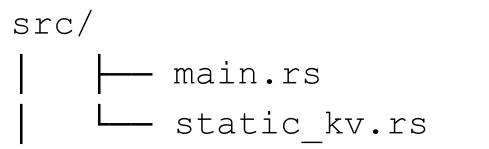{.u53793}
:::

此时需要将main.rs中的mod static_kv{...}整块代码移动到static_kv.rs中，但要注意把mod声明去掉，如代码清单10-35所示。

**代码清单10-35：将static_kü模块代码移动到static_kü.rs文件中**

::: center
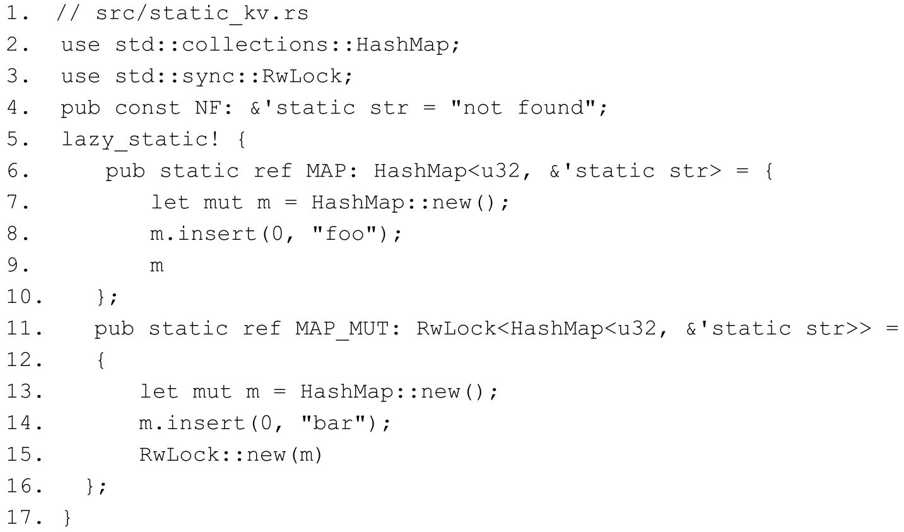{.u53792}
:::

如代码清单10-35所示的是static_kv.rs文件中的代码，这里已经去掉了之前的mod声明。这是因为Cargo会默认把static_kv.rs文件当作一个模块static_kv，如果加上之前的mod声明，那么在 main.rs 中调用该模块中定义的常量或静态变量时，则需要改成static_kv：：static_kv：：MAP 或&static_kv：：static_kv：：NF 这样的形式。这就相当于有两层命名空间，使用起来十分不便。

要想在main.rs中使用新定义的static_kv.rs文件，还需要使用mod关键字引入static_kv模块，如代码清单10-36所示。

**代码清单10-36：在main.rs中使用mod关键字引入static_kü模块**

::: center
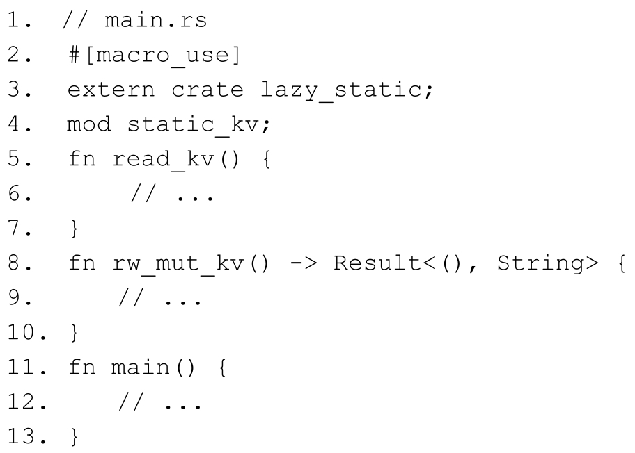{.u53791}
:::

在代码清单10-36中，代码第4行使用mod关键字引入了static_kv模块，Cargo会自动查找到static_kv.rs文件。其他代码不变，故这里省略。

现在main.rs文件中的另外两个函数read_kv和rw_mut_kv，同样可以被放到独立的文件中。在src目录下创建一个新的文件read_func.rs，然后把这两个函数都移动到这个新文件中，如代码清单10-37所示。

**代码清单10-37：将read_kü和rw_mut_kü两个函数从main.rs中移动到read_func.rs中**

::: center
{.u53790}
:::

代码清单10-37展示了将read_kv和rw_mut_kv这两个函数移动到read_func.rs中以后能够正常编译的最终修改代码。注意跟之前的代码不同的地方一共有三处。

因为在这两个函数中均用到了 static_kv 模块中定义的常量或静态变量，所以需要引入static_kv 模块。但是因为在顶级模块 main.rs 中已经使用 mod 关键字引入过了，所以在read_func.rs中只需要使用use直接打开模块即可，如代码第2行所示。这是其中一处变化。

另外两处变化是，在read_kv和rw_mut_kv函数前面都加上了pub关键字，它表示public （公开的）。这是因为每个模块对外都是封闭的，在模块中定义的一切都是私有的，只有通过添加pub才可修改其可见性，变为对外可公开访问，如代码第3行和第10行所示。

然后，在main.rs中通过mod关键字引入read_func模块，如代码清单10-38所示。

**代码清单10-38：在main.rs中引入read_func模块**

::: center
{.u53789}
:::

代码清单10-38展示了main.rs文件的最终修改代码。代码第5行，通过mod关键字引入了read_func模块。代码第6行，使用use关键字来打开read_func模块，引入其中的read_kv和rw_mut_kv 函数，这样就可以直接在main函数中使用这两个函数了（之前的代码不需要修改）；否则，必须在 main 函数中用到这两个函数的地方加上命名空间，比如read_func：：read_kv和read_func：：rw_mut_kv。

这样，通过模块化就将之前单个main.rs文件中的代码重构到了两个独立的文件中，代码结构变得更加清晰。接下来，在static_hashmap的根目录下执行cargo run命令，代码可以正常编译和运行。

现在 src 目录下一共有三个独立文件：main.rs、read_func.rs 和 static_kv.rs。但实际上static_kv.rs和read_func.rs在逻辑层面上并不独立，前者定义了静态变量MAP和MAP_MUT，后者定义了操作它们的读写行为。基于这种考虑，应该把 static_kv.rs 和 read_func.rs 合并为同一个模块。那么应该如何做呢？把它们归到同一个文件里吗？答案是否定的。其实完全可以把这两个文件放到同一个文件夹下来达成目的，如代码清单10-39所示。

**代码清单10-39：将static_kü.rs和read_func.rs放到同一个文件夹下**

::: center
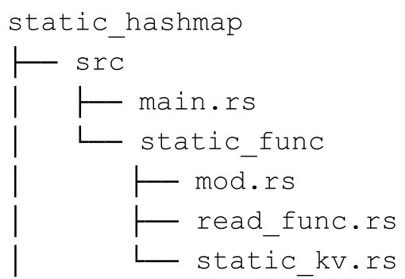{.u53788}
:::

在代码清单10-39中，创建了一个新的文件夹static_func，将static_kv.rs和read_func.rs置于其中，然后创建了新的文件mod.rs。此时，static_func就可以作为一个模块来使用，Cargo会自动查找该文件夹下的 mod.rs 文件作为该模块的根文件。现在只需要在 mod.rs 中引入static_kv和read_func两个模块即可，如代码清单10-40所示。

**代码清单10-40：在mod.rs中引入static_kü和read_func模块**

::: center
{.u53787}
:::

在代码清单10-40中使用mod关键字引入了static_kv和read_func模块，并通过pub关键字将其设置为对外公开。

但是现在还无法通过编译，使用cargo build命令编译时会报出如下错误：

::: center
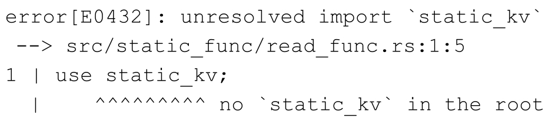{.u53786}
:::

在read_func.rs中，use static_kv这行会报错，错误信息表明无法在根（root）目录下找到 static_kv。Cargo 查找文件是从包的根目录开始的，而不是当前文件的相对目录。想解决这个错误，只需要将use static_kv修改为use super：：static_kv，就可以找到static_kv。在路径上使用super关键字，可以让Cargo以相对路径的方式查找文件，super代表当前文件的上一层目录。

还需要修改main.rs，如代码清单10-41所示。

**代码清单10-41：修改main.rs**

::: center
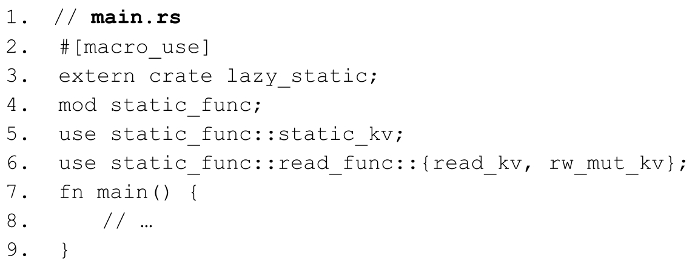{.u53785}
:::

在代码清单10-41中，代码第4行，使用mod关键字引入了static_func模块。代码第5行和第6行，通过use关键字打开static_func：：static_kv和static_func：：read_func两个模块供main函数使用，main函数之前的代码依然不需要修改。

最后将Cargo.toml文件中的edtion修改为"2015"。此时使用cargo run命令可以正常编译和运行。可以通过随书源码中的static_hashmap_2015包来查看完整代码。

经过这一系列重构，我们大概可以了解到，Rust中的模块可以按照类似于文件系统的方式进行组织，Cargo会根据**文件名即模块名** 的默认约定来查找相关模块。

**Rust 2018模块**

Rust 2018对模块系统进行了改进，主要包括下面内容：

· 不再需要在根模块中使用extern crate语法导入第三方包。

· 在模块导入路径中使用crate关键字表示当前crate。

· 按照特定的规则，mod.rs可以省略。

· use语句可以使用嵌套风格来导入模块。

下面通过再次重构static_hashmap_2015项目来说明Rust 2018中模块系统的变化。首先使用**cargo new** 命令创建新的项目**static_hashmap_2018** ，然后打开Cargo.toml文件添加依赖的第三方包lazy_static，注意此时edtion选项默认为"2018"。

现在重新审视static_hashmap_2015项目中的static_func目录下的read_func和static_kv，发现它们之间还存在一层依赖关系。在 main.rs 中用的是 read_func 中的函数，而 read_func又依赖于static_kv。其实在static_hashmap_2015项目中并没有很好地反映出这一层关系。

现在使用Rust 2018的新模块系统来修改。在**static_hashmap_2018** 项目的src目录下创建read_func.rs文件，同时创建read_func目录，并在此目录下创建static_kv.rs文件。此时src目录结构如代码清单10-42所示。

**代码清单10-42：src目录结构**

::: center
{.u53784}
:::

代码清单10-42所示的结构明确地反映出read_func和 static_kv的关系。在Rust 2018中，如果存在与文件同名的目录，则在该目录下定义的模块都是该文件的子模块。也就是说，在当前项目中，read_func.rs和read_func目录是同名的，所以定义在read_func目录下的static_kv模块就是read_func的子模块。注意，在Rust 2015中则不允许文件与目录同名。

同时，在read_func.rs文件中需要使用mod关键字引入static_kv模块，如代码清单10-43所示。

**代码清单10-43：在read_func.rs文件中引入static_kü模块**

::: center
{.u53783}
:::

在代码清单 10-43 中省略了 read_kv 和 rw_mut_kv 函数的代码，其函数体等同于static_hashmap_2015项目中对应内容。需要注意，代码第1行直接引入了static_kv模块，并未加其余的路径前缀。这说明Rust会通过mod关键字自动到当前read_func模块的子模块中寻找static_kv模块。

接下来修改static_kv.rs文件，如代码清单10-44所示。

**代码清单10-44：修改read_func/static_kü.rs文件**

::: center
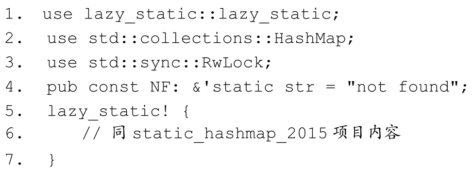{.u53437}
:::

在代码清单10-44中同样省略了lazy_static！宏的具体代码。该文件主要的变化是代码第1行，使用 use 关键字引入了 lazy_static 包中的 lazy_static！宏。如果不加这一行，则无法使用lazy_static！宏。因为在Rust 2018中，可以在项目的根模块下也就是main.rs中省略**＃\[macro_use\] extern crate lazy_static** ，但是在具体使用到lazy_static！宏的模块时就必须使用use引入。

接下来修改main.rs文件，如代码清单10-45所示。

**代码清单10-45：修改main.rs文件**

::: center
{.u53782}
:::

在代码清单10-45中，使用mod关键字引入了read_func模块。相比于static_hashmap_2015项目中的 main.rs 文件，代码要清晰很多，可读性更高。另外，代码第 7 行，调用 static_kv模块中的静态变量MAP_MUT需要使用read_func前缀，又一次体现了这种层次关系。

另外，在代码第2行中，use语句使用了**crate** 关键字前缀，代表引入的是当前crate中定义的 read_func 模块。当然，此处也可以使用 **self** 关键字来代替 **crate** 关键字，Rust 会以main.rs为起点寻找当前相对路径下的read_func模块。如果是第三方包，则不需要写crate前缀。这样也可以提高代码的可读性。

## 10.3 从零开始实现一个完整功能包 {#text00016.html#Af56a016e-5141-4c66-84b7-bd191108106e .title-left}

通过对Cargo包管理和模块系统的学习，我们现在完全有能力写一个具有完整功能的包。以2017年C++17编码挑战赛为例，用Rust来实现挑战题。

这道挑战题是这样的：编写一个命令行工具，可以接收一个CSV文件，并且可以指定固定的值来覆盖指定列的所有数据，然后将结果输出到新的CSV文件中。原始CSV文件内容如代码清单10-46所示。

**代码清单10-46：原始CSV文件内容**

::: center
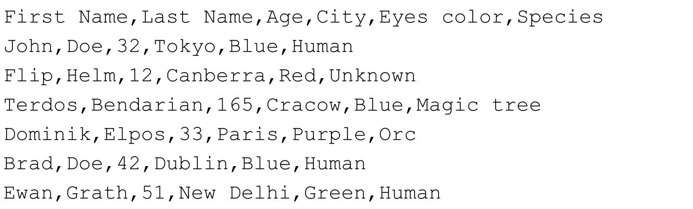{.u53781}
:::

然后执行如下命令：

::: center
{.u53780}
:::

your_program为编译后的可执行程序，其接收三个参数，分别是字段名（City）、要替换的城市（Beijing）和输出的文件名（output/output.csv）。执行命令后，输出文件内容如代码清单10-47所示。

**代码清单10-47：替换后的CSV文件内容**

::: center
{.u53779}
:::

可以看到，City字段下面的所有值都被替换成了Beijing。挑战题其实很简单，本意是想让参与者完全用C++17的新特性来完成。借用此题，现在用Rust来实现。

### 10.3.1 使用Cargo创建新项目 {#text00016.html#Ae90d016f-2cf4-4cb0-9216-34c0c9b4346b .title-left}

现在使用Cargo命令来创建新的二进制项目csv_challenge。

::: center
{.u53778}
:::

此时会生成标准的包目录，主要文件包括 src/main.rs 和 Cargo.toml。进入csv_challenge目录中，在根目录下创建input文件夹，然后在该文件夹下创建一个challenge.csv文件，将原始CSV文件内容复制到其中。再回到csv_challenge根目录下，创建一个空文件夹output，用于存放将来输出的CSV文件。此时包的目录结构如下：

::: center
{.u53777}
:::

接下来要考虑的是如何从命令行接收参数。**基本思路有两种** ：直接使用std：：env：：args和使用第三方包。前者的方式比较原始，还需要手动解析参数，所以这里使用第三方包。

### 10.3.2 使用structopt解析命令行参数 {#text00016.html#Acebf016f-9e6e-4af3-a483-b55c7d91821a .title-left}

可选的第三方包有两个：clap和structopt。其中clap的功能非常强大，但是使用起来没有那么直观；而structopt则是在clap基础上构建而成的，简化了操作。所以这里选用structopt包。打开Cargo.toml文件，加入下面依赖：

::: center
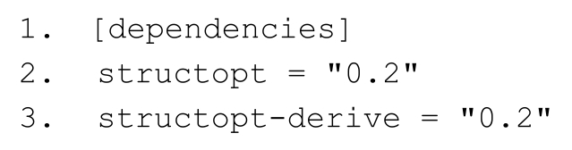{.u53776}
:::

然后运行cargo build命令，从crates.io（或指定的国内源）下载并编译安装这两个包。因为structopt是基于过程宏（Procedural Macro）的，所以它需要依赖structopt-derive包。关于过程宏会在第12章中介绍。

根据structopt的用法，需要一个结构体来封装所需要的参数。为了模块化，在src 根目录下创建新的文件opt.rs。此时csv_challenge包的目录结构如下：

::: center
{.u53775}
:::

在opt.rs文件中创建结构体Opt，如代码清单10-48所示。

**代码清单10-48：在src/opt.rs文件中创建结构体Opt**

::: center
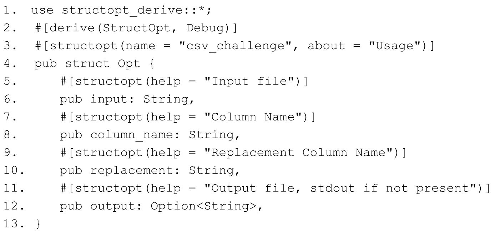{.u53774}
:::

在代码清单10-48中定义的结构体**Opt专门用于构建如下命令** ：

::: center
{.u53773}
:::

说明如下：

· **csv_challenge** ，为编译后的可执行文件。

· **\[FLAGS\]** ，为Flag参数，一般是侧重于表示"开"和"关"的标记。

· **＜input＞** ，表示输入文件，也就是原始CSV文件路径。它对应于代码第6行的字段input，并通过＃\[structopt...\]属性设置help说明文字。

· **＜column_name＞** ，表示指定要替换的CSV文件头部字段。它对应于代码第8行的字段column_name。

· **＜replacement＞** ，表示要替换的新值。它对应于代码第10行的字段replacement。

· **\[output\]** ，表示输出的文件路径。它对应于代码第 12 行的字段 output，注意它为Option＜String＞类型，因为该参数可以省略，由默认的输出文件路径代替。

因为结构体和字段都需要在opt模块外使用，所以在代码清单10-48中使用pub关键字将它们的可见性都修改为公开。

接下来修改src/main.rs文件，如代码清单10-49所示。

**代码清单10-49：修改src/main.rs文件**

::: center
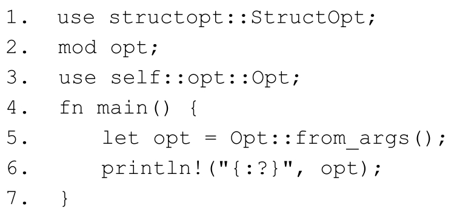{.u53772}
:::

在代码清单 10-49 中，因为使用的是 Rust 2018，所以可以省略使用 extern crate 和＃\[macro_use\]声明引入structopt和structopt_derive。现在可以直接使用use关键字引入StructOpt供本地使用。

代码第2行和第3行，使用mod和use关键字来引入Opt供本地使用。在main函数中，使用structopt包提供的Opt：：from_args方法就可以接收来自命令行的参数。使用cargo run命令编译并运行，会看到如下提示：

::: center
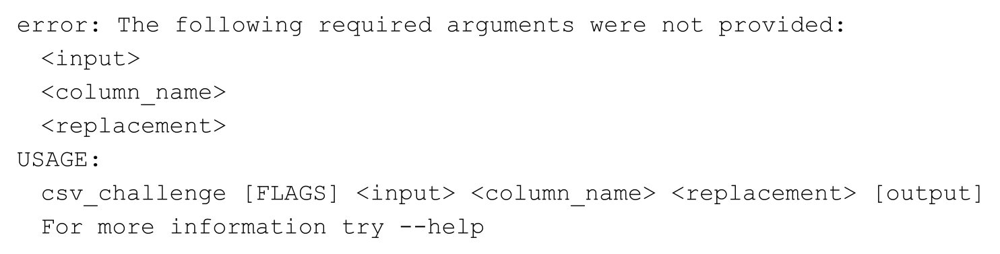{.u53771}
:::

此时structopt包提供的方法会自动检查命令行有没有输入需要的参数，如果没有则给出提示，并自动提供\--help参数。当执行**cargo run\-\--help** 命令后，会有如下输出：

::: center
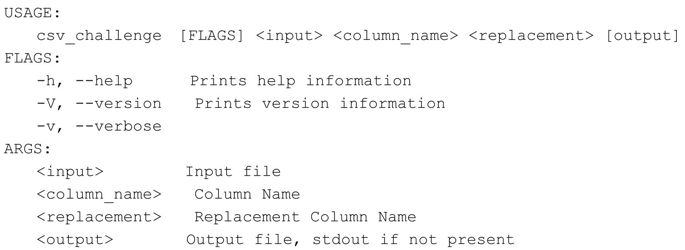{.u53770}
:::

structopt会根据Opt结构体中的定义，生成这样一份命令帮助清单，csv_challenge包的用法一目了然。在开始处理接收的参数之前，应该考虑定义统一的错误类型。

### 10.3.3 定义统一的错误类型 {#text00016.html#Aef7d0171-d463-49cc-bc13-61a8c1dbfc42 .title-left}

同样使用单独的模块来定义错误类型。在src目录下创建新的文件src/err.rs，并在其中写入如代码清单10-50所示的内容。

**代码清单10-50：src/err.rs文件内容**

::: center
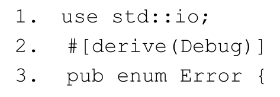{.u53769}
:::

::: center
{.u53768}
:::

在代码清单 10-50 中定义了枚举类型 Error，其中包含两个值，即 Io（io：：Error）和Program（&＇static str），分别代表 I/O 错误和包自身的逻辑错误。同时实现了 From，使得 I/O错误和字符串类型错误可以方便地转换为Error。然后在src/main.rs中将此模块引入即可。

此时csv_challenge包的目录结构如下：

::: center
{.u53767}
:::

接下来就可以通过从命令行接收的参数来读取CSV文件了。

### 10.3.4 读取CSV文件 {#text00016.html#A0d4c0172-cd7e-4b03-b26b-bdb6e7351b6b .title-left}

在src目录下创建新的文件core.rs和文件夹core，所有操作CSV文件的代码都放在这里。处理CSV文件需要两步，先读取，再按指定的字段和值来替换旧值。把这两步分成两个独立的文件，即core/read.rs和core/write.rs。此时csv_challenge包的目录结构如下：

::: center
{.u53766}
:::

接下来修改core.rs文件，如代码清单10-51所示。

**代码清单10-51：修改core.rs 文件**

::: center
{.u53765}
:::

注意要使用 pub 将模块的可见性修改为公开的，因为在 main 函数中要使用模块中的函数。另外，在read模块中要用到Error，所以必须从core.rs中引入才可以。

接下来在core/read.rs中添加读取文件的方法，如代码清单10-52所示。

**代码清单10-52：在core/read.rs中添加读取文件的方法**

::: center
{.u53764}
:::

在代码清单10-52中，代码第1～4行，使用use引入了需要使用的几个标准库的类型，包括std：：path：：PathBuf、std：：fs：：File和std：：io：：prelude：：\*。这里需要注意的是，Rust会为每个包自动插入extern crate std，为每个模块自动插入use std：：prelude：：v1：：\*，所以在任何一个模块中都可以直接使用use来引入包含在std：：prelude：：v1：：\*中的模块 ^[\[4\]](#text00016.html#nE1580173459143E290EC6C7E0A1C603B){#text00016.html#nE1580173459143E290EC6C7E0A1C603Bs}^ 。代码第3行使用了**super** 关键字，是为了使用在当前模块的父模块core中引入的Error。

**Rust将文件路径抽象为两种类型：Path** 和**PathBuf** ，这两种类型的关系有点类似于&str和String的关系。**Path** 没有所有权，而**PathBuf** 有独立的所有权。通过对路径进行抽象，可以让开发者无视底层操作系统的差异，统一处理文件路径。

在模块**std：：fs** 中定义了操作本地文件系统的基本方法，并且所有方法都可以跨平台，开发者同样可以无视操作系统的差异而统一使用其中的方法。这里只用到了File结构体，使用其提供的open和create方法来打开和创建CSV文件。在离开作用域的时候，文件会自动被关闭。

在模块**std：：io** 中定义了核心I/O功能的trait、类型和一些基本方法。包括**Read** 、**Write** 、**Seek** 、**BufRead** 这四个trait，是对I/O操作的抽象。通过std：：io：：prelude：：\*可以引入一些I/O操作中最常见的模块。

代码第5～13行定义了两个pub函数：load_csv和write_csv，分别用于读取和写入CSV文件。在这两个函数中又调用了封装好的独立函数read、open和write，像这样一个函数只做一件事，是一种最佳实践。

接下来就可以在main.rs中使用这两个函数来操作CSV文件了，如代码清单10-53所示。

**代码清单10-53：在main.rs中使用load_csü和write_csü函数来操作CSV文件**

::: center
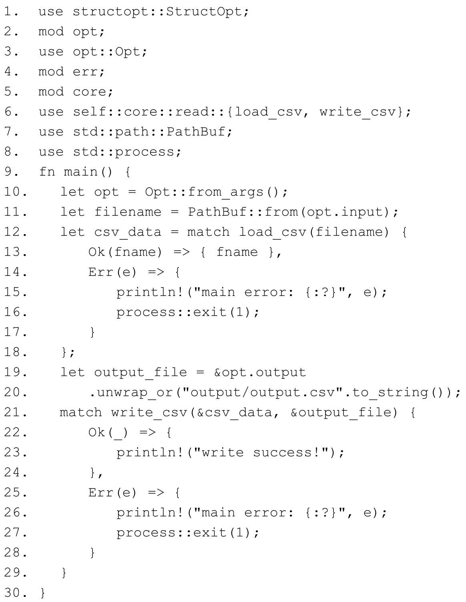{.u53763}
:::

在代码清单10-53中，引入了所有新添加的模块。

代码第11行，使用PathBuf：：from方法将存储于opt.input字段中的输入CSV文件路径字符串转换为PathBuf类型。

代码第12～18行，将得到的CSV文件路径filename传入load_csv函数中。这里使用match来处理load_csv返回的Result类型。

代码第19行和第20行，声明了output变量绑定，代表输出CSV文件路径。因为opt.output是可以忽略的参数，所以这里使用unwrap_or方法定义了默认的输出路径。

代码第21～29行，将读取到的原始CSV文件内容csv_data和输出路径output_file传入write_csv方法中来输出CSV文件。这里也需要使用match来处理Result，否则编译会发出警告。

执行**cargo run input/challenge.csv City Beijing** 命令，会看到生成output/output.csv文件，其内容和input/challenge.csv一致。

但是挑战赛要求必须把指定字段（City）下的所有值都替换为新值（Beijing）。于是，接下来在core/write.rs中添加用于替换的函数。

### 10.3.5 替换CSV文件中的内容 {#text00016.html#Ab3e60175-f03a-43fd-a28a-8d68e0947085 .title-left}

替换的基本思路是：使用lines方法将读取到的原始CSV字符串转换为迭代器，这样就可以按行处理这些内容了。第一行内容就是 CSV 文件的头部，将其用逗号分隔存储为Vec＜&str＞数组。通过和指定的字段对比，就可以得到要替换字段的索引位置。然后将其他行的字符串存储到新的字符串中，继续通过lines方法转换为迭代器，结合前面得到的索引位置逐行替换相应位置的值。

考虑到处理替换同样需要PathBuf、File和Error这三种类型的支持，为了避免代码重复，现在将引入这三种类型的代码移动到core.rs文件中，如代码清单10-54所示。

**代码清单10-54：修改core.rs和core/read.rs文件**

::: center
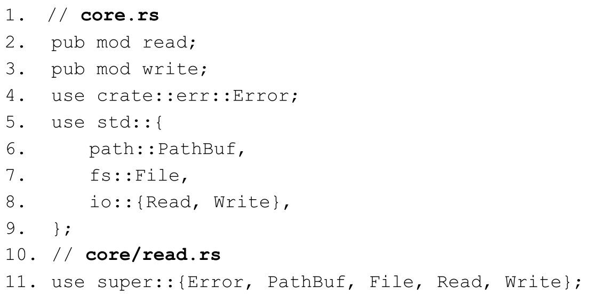{.u53762}
:::

在代码清单10-54中，将在core/read.rs中引入的std模块都移出来，此处使用了Rust 2018新模块系统支持的use语句内嵌语法。在修改core.rs的同时，也需要修改core/read.rs，通过super前缀从父模块中引入要使用的类型。

接下来修改core/write.rs文件，如代码清单10-55所示。

**代码清单10-55：修改core/write.rs文件**

::: center
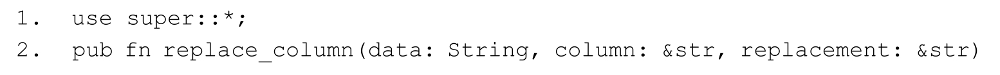{.u53761}
:::

::: center
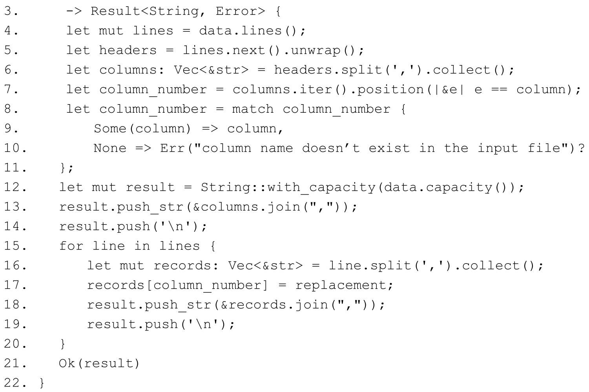{.u53760}
:::

在代码清单10-55中，代码第1行，同样使用了use spuer：：\*来引入父模块core中的类型。

代码第2行定义的pub函数replace_column接收三个参数：读取到的原始CSV字符串data、指定的字段column和要匹配的新值replacement。

代码第4～11行，通过lines方法将data 转换为迭代器，通过调用一次next方法，得到CSV 文件的头部 headers。然后通过 split 方法用逗号分隔将 headers 转换为 Vec＜&str＞数组columns，就可以通过position方法获取到指定字段的索引位置column_number。使用match匹配position方法的查找结果，因为有可能输入的字段是不存在的。

代码第12～20行，创建了一个可变的新字符串result，将头部数组columns使用join方法转换为用逗号分隔的字符串，加上换行符。然后将剩余的 lines 按行迭代，每一行先转换为Vec＜&str＞可变数组records，再通过column_number将指定位置的值替换为新值replacement。最后将替换好的records通过join方法转换为用逗号分隔的字符串，加上换行符。

代码第21行，返回最终结果。

现在就可以在main函数中使用replace_column方法了，如代码清单10-56所示。

**代码清单10-56：在main.函数中使用replace_column方法**

::: center
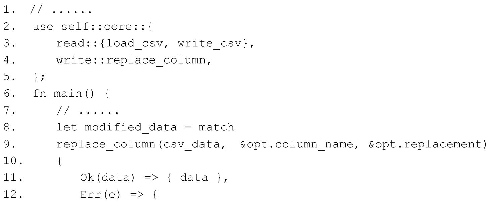{.u53759}
:::

::: center
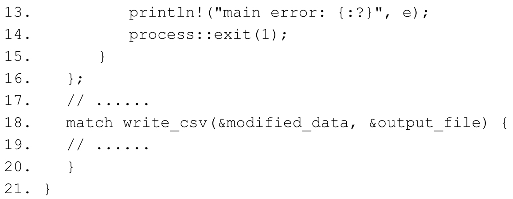{.u53758}
:::

代码清单10-56展示了main.rs中需要修改的部分。代码第2～5行，使用use引入core模块中的子模块read和write。

代码第8～16行，使用replace_column方法替换原始CSV内容并生成新的修改过的内容modified_data。

代码第18行，将修改过的内容modified_data写入output_file中。

执行**cargo run input/challenge.csv City Beijing** 命令，会看到在生成的output/output.csv文件中City字段下的所有值均被修改成Beijing。大功告成！

### 10.3.6 进一步完善包 {#text00016.html#Af0fa0177-602c-4e52-aff6-48bf9fa2b7ad .title-left}

虽然代码功能基本可用，但如果公开给别人使用的话，则还缺少一些必要的测试和文档。接下来就为csv_challenge包增加一些测试和文档。Rust支持四种测试：**单元测试** 、**文档测试** 、**集成测试** 和**基准测试** 。其中基准测试专门用于性能测试。

**增加单元测试**

Rust允许在文件中使用mod test为相关功能提供单元测试。现在为load_csv函数增加单元测试，如代码清单10-57所示。

**代码清单10-57：为load_csü函数增加单元测试**

::: center
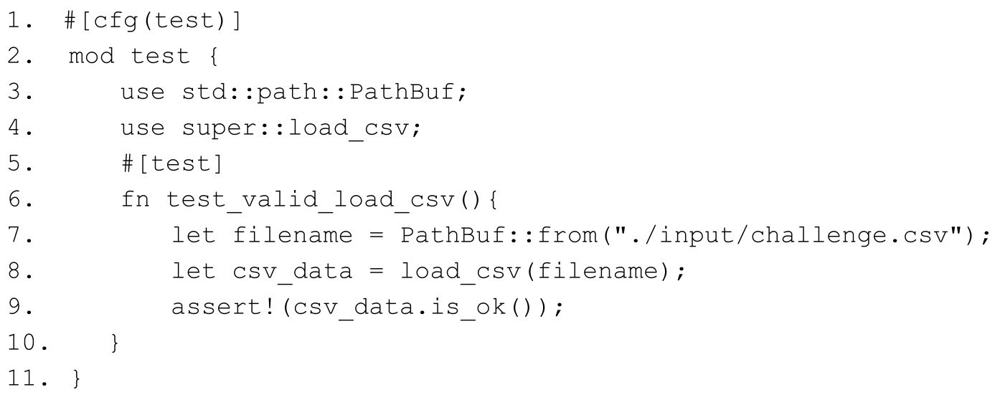{.u53757}
:::

在代码清单10-57中，代码第1行的**＃\[cfg（test）\]** 表示只有在执行**cargo test** 时才编译下面的模块。

代码第2行定义了test模块，其中通过use引入了PathBuf和load_csv，否则PathBuf和load_csv函数无法在test模块中使用。

代码第 5 行的**＃\[test\]** 属性表示其标识的函数为测试函数，否则为普通的函数。如果想忽略此测试函数，只需要在＃\[test\]属性下面再添加**＃\[ignore\]** 属性即可。

代码第6行定义了测试函数。注意，对测试函数名称并没有特殊的规定。

执行cargo test会看到正常的测试输出。限于篇幅，这里只为load_csv增加测试函数，同理，还可以为 write_csv 和 replace_column 方法增加单元测试。可以在随书源码中查看csv_challenge包的完整源码及测试代码。

**增加集成测试**

有时候只有单元测试还不够，还需要增加集成测试来测试包的整体功能。但是Rust对于二进制包是不能增加集成测试的，因为二进制包只能独立使用，并不能对外提供可调用的函数。当前csv_challenge包是二进制包，需要将其改造一下。

为了支持集成测试，只需要新增src/lib.rs文件，将所有的模块都引入其中，并暴露对外可以调用的函数，然后在main.rs中调用这些函数即可，如代码清单10-58所示。

**代码清单10-58：新增src/lib.rs文件**

::: center
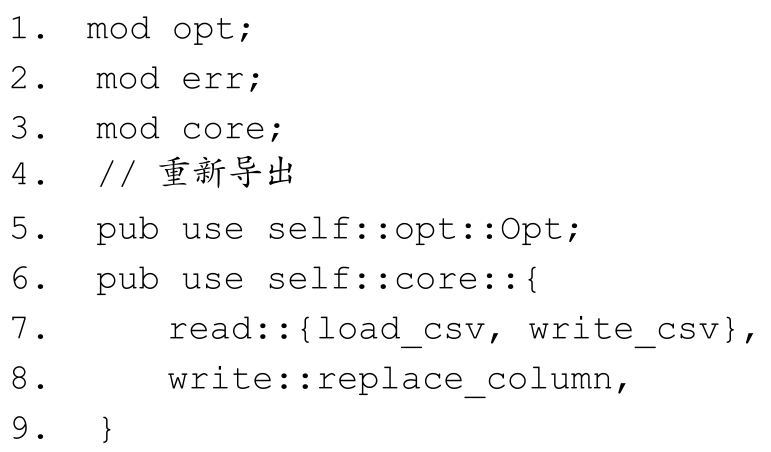{.u53756}
:::

在代码清单10-58中，分别引入了opt、err和core模块。

代码第5～9行，使用了叫作**重新导出** （Re-exporting）的功能，这是为了简化外部调用的导出路径，而且也不需要对外暴露模块。

然后修改mian.rs文件，如代码清单10-59所示。

**代码清单10-59：修改main.rs文件**

::: center
{.u53755}
:::

代码清单 10-59 展示了 main.rs 文件中需要修改的部分。代码第 3 行，通过引入库包csv_challenge来使用其中暴露的函数。

值得注意的是，这种main.rs配合lib.rs的形式，是二进制包的**最佳实践** 。

如果使用cargo build命令编译正常，就可以增加集成测试了。在csv_challenge包的根目录下创建tests文件夹，在其中创建integration_test.rs文件。同时，在input目录下创建一个非法的CSV文件no_header.csv，将去掉头部的CSV内容复制到其中，用于测试异常情况。

此时csv_challenge包的目录结构如下：

::: center
{.u53754}
:::

接下来在integration_test.rs中增加集成测试，如代码清单10-60所示。

**代码清单10-60：integration_test.rs中增加集成测试**

::: center
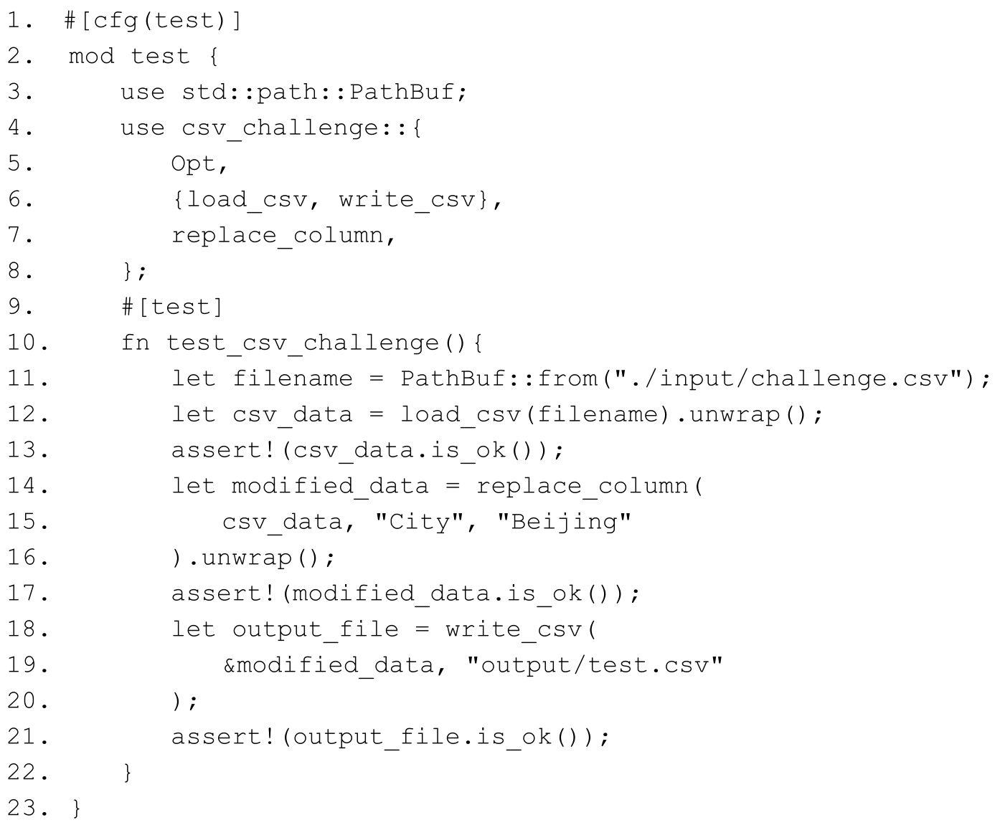{.u53753}
:::

在技术上，写集成测试和写单元测试相差无几，主要目的是为了全局性测试所有模块是否可以正常协调工作。直接执行**cargo test** 命令就可以运行集成测试，因为Cargo可以自动识别**tests** 目录。

**增加文档和文档测试**

Rust支持通过注释来生成文档，以及在文档中进行测试，如代码清单10-61所示。

**代码清单10-61：为core/read.rs中的write_csü函数增加文档**

::: center
{.u53408}
:::

代码清单10-61展示了为函数write_csv增加文档。普通的注释使用两个斜杠（**//** ），而文档注释使用三个斜杠（**///** ）。在文档注释中支持 **Markdown** 语法，但是如果要增加代码块，则需要指定语言，如果没有指定语言，则默认会将其识别为Rust代码，并且会执行文档测试。"**///** "会为其注释下方的语法元素生成文档。

比如代码第2行，如果将**ignore** 去掉，则在执行cargo test命令时注释中的代码会被当成 Rust 代码执行；如果去掉"**\`\`\`** "语法，则生成代码时无法高亮显示。因为在前面已经为write_csv 增加了单元测试，这里就没必要再进行测试了，所以使用"\`\`\`ignore"可以在编译时忽略这段代码的文档测试属性，只用来生成文档。

也可以使用"**//！** "在包的根模块或任意模块文件顶部增加模块级文档，如代码清单10-62所示。所谓模块级文档，是指为整个模块而不是单独为其下方的语法元素生成文档。

**代码清单10-62：在src/lib.rs中增加模块级文档**

::: center
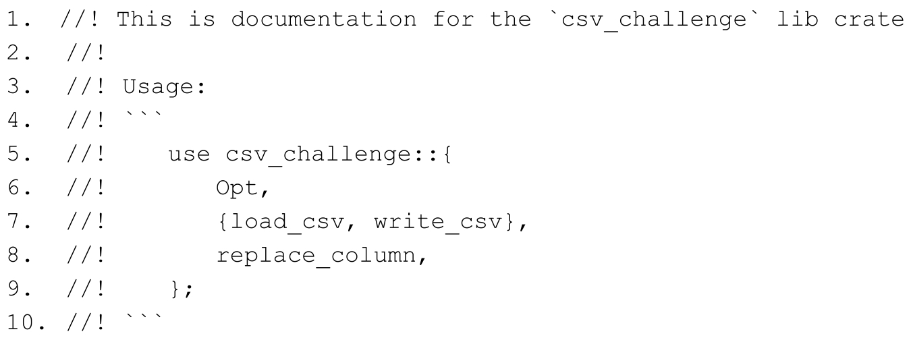{.u53752}
:::

在代码清单10-62中，在src/lib.rs模块文件顶部使用"**//！** "增加了模块级文档，所以在执行**cargo test** 命令时文档注释中的代码不会被作为文档测试执行。

现在执行**cargo doc** 命令，则会在target/doc下根据文档注释生成相关的文档，**UI** 界面和标准库文档是一样的。

**增加性能基准测试**

Rust也支持性能基准测试，在csv_challenge包的根目录下创建**benches** 目录，该目录是基准测试的默认目录，Cargo可以自动识别。

创建benches/file_op_bench.rs文件，在其中写入如代码清单10-63所示的内容。

**代码清单10-63：benches/file_op_bench.rs文件内容**

::: center
{.u53751}
:::

要使用基准测试，必须启用**＃\[features（test）\]** 。注意，只有在Rust夜版下才可使用features功能。需要使用extern crate导入test包，此处不能省略。test：：Bencher提供了iter方法，它接收闭包作为参数。如果要写性能测试代码，那么只要将其放到该闭包中即可。

代码第11～16行，创建bench_read_100times函数，使用**＃\[bench\]** 属性对其标注，表示这是一个基准测试函数。在 iter 方法的闭包参数中，使用 test：：black_box（100）来确保调用test_load_csv函数100次不受编译器优化的影响，可以较为准确地测出load_csv函数的性能。然后用fold方法调用test_load_csv函数100次，如代码第14行所示。

使用**cargo bench** 命令执行基准测试，可以看到类似于下面这条内容的输出：

::: center
{.u53750}
:::

**发布到crates.io**

现在可以把具有完整功能的包发布到**crates.io** 平台。首先需要注册crates.io网站的账号，登录之后在个人主页里生成一个Api Token，将此Token配置到**.cargo/config的\[registry\]** 表下面，然后使用cargo login登录。注意，为了个人安全，不要对外公开此Token。

接下来就可以直接在包的根目录下使用**cargo publish** 命令，该命令会自动将其编译打包上传到crates.io平台。也可以单独使用**cargo package** 命令先将其打包，然后再发布。打包以后的文件可以在target/package目录下找到。

如果执行cargo publish命令报出如下错误：

::: center
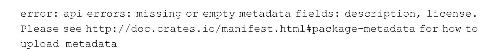{.u53749}
:::

则说明该包 Cargo.toml 文件的**\[package\]** 表中还缺失必要的元信息，比如 description、license等。可以到错误信息提示的网址中查找更详细的内容。这些必要信息添加以后，就可以正常发布了。这样，其他开发者就可以通过**cargo install** 命令来安装并使用此包了。

## 10.4 可见性和私有性 {#text00016.html#A2db9017c-0b9b-42f1-9b91-6eb42274d867 .title-left}

在Rust中代码以包、模块、结构体和Enum等复合类型、函数等分成不同层次结构的**项** （Item）。这些项默认是私有的，但是可以通过pub关键字来改变它们的可见性。通过这样的设定，开发者可以在创建对外公共接口的同时隐藏内部的实现细节。

代码清单10-64展示了Rust 2015模块的可见性。

**代码清单10-64：Rust 2015模块可见性展示**

::: center
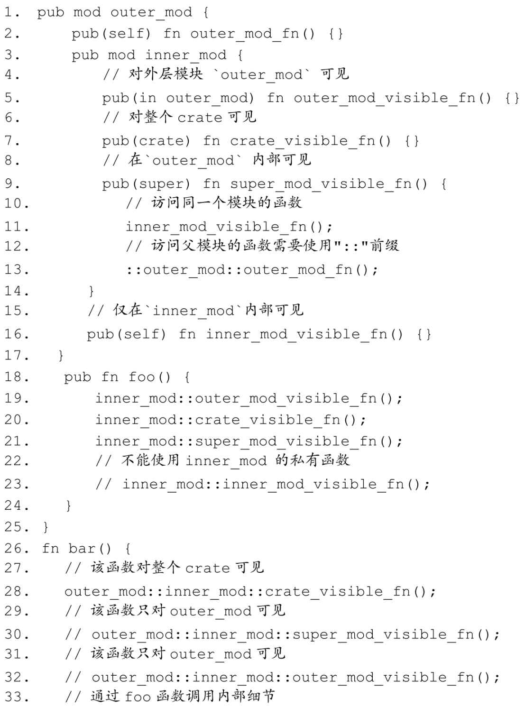{.u53748}
:::

::: center
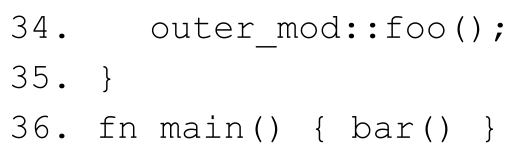{.u53747}
:::

在代码清单10-64中，模块可见性的层级结构是outer_mod包含inner_mod，而outer_mod又被包含于默认的顶级模块中，也就是当前crate范围。

代码第2行，使用**pub（self）** 关键字标注outer_mod_fn函数的可见性，只限于**self** 的范围。也就是说，在outer_mod和inner_mod内部都可见，但是对顶级模块不可见。

代码第5行，使用**pub（in outer_mod）** 关键字标注outer_mod_visible_fn函数的可见性，只限于outer_mod范围。也就是说，该函数虽然定义于inner_mod内部，但是可以在outer_mod中访问。但不能在顶级模块中访问。

代码第7行，使用**pub（crate）** 关键字标注crate_visible_fn函数的可见性，代表该函数对整个crate范围可见。

代码第9行，使用**pub（super）** 关键字标注super_mod_visible_fn函数的可见性，代表该函数只在outer_mod内部可见，和pub（in outer_mod）效果等价。**super** 关键字表示当前模块的父模块。

代码第13行，在super_mod_visible_fn函数中调用outer_mod中定义的outer_mod_fn函数，需要使用"**：：** "前缀，代表从根模块开始寻找相应的模块路径。所以，"**：：outer_mod** "就表示从顶级模块开始查找outer_mod模块，然后在此模块中查找outer_mod_fn函数。这种路径写法在Rust中叫作**统一路径** （**Uniform Path）** 。

代码第16行，使用**pub（self）** 在inner_mod中定义了inner_mod_visible_fn函数，表示该函数仅在inner_mod内部可见。

代码第18～24行，使用**pub** 关键字定义了foo函数，其内部分别调用了在inner_mod中定义的那四个函数。但是在调用inner_mod_visible_fn函数时会出错，因为它仅对inner_mod可见。通过pub关键字，可以将foo函数对外开放给顶层模块去调用。这样就实现了对外公共统一接口，而封装了内部的实现细节。

代码第26～35行，在顶层模块中定义了bar函数。其中调用了在outer_mod中定义的函数------只有对整个crate可见的crate_visible_fn函数，以及对顶层模块可见的foo函数；而另外两个函数则无法在外层模块中被调用。

由此可推出下列结论：

· 如果不显示使用pub声明，则函数或模块的可见性默认为私有的。

· pub，可以对外暴露公共接口，隐藏内部实现细节。

· pub（crate），对整个crate可见。

· pub（in Path），其中Path是模块路径，表示可以通过此Path路径来限定可见范围。

· pub（self），等价于pub（in self），表示只限当前模块可见。

· pub（super），等价于pub（in super），表示在当前模块和父模块中可见。

有了这几种可见性的设定，接下来就可以方便地组织项目代码了。

然而，在 **Rust 2018** 中，模块系统有所变化，需要修改上面的代码，如代码清单 10-65所示。

**代码清单10-65：Rust 2018模块可见性展示**

::: center
{.u53746}
:::

代码清单10-65展示了Rust 2018中模块可见性的相关变化。和Rust 2015 相比，主要变化的地方有以下几处：

· **将统一路径** 暂时改为了**锚定路径（Anchored Path）** 。所以在代码第5行，需要使用use明确地将outer_mod模块引入inner_mod模块中。不过，在不久的将来，应该会向统一路径迁移。

· 代码第7行，**pub（in crate：：outer_mod）** 中的路径需要以**crate** 开头。因为crate代表当前crate，也就是顶层模块。锚定路径是以顶层模块为**根** （**root** ）来查找模块的。

· 代码第13行，可以直接使用outer_mod_fn函数，因为前面已经使用use从父模块中引入了该函数。

以上就是在Rust 2018中关于模块可见性的一些变化。

另外，需要注意的是，对于**trait中关联类型** 和**Enum中变体** 的可见性，会随着trait和Enum 的可见性而变化。但是结构体中的字段则不是这样的，还需要单独使用 pub 关键字来改变其可见性。

## 10.5 小结 {#text00016.html#Acf11017e-e38f-4bc9-a943-b3aeaa7b47f1 .title-left}

通过本章的学习，我们对Rust的模块化编程有了较为全面的了解。Rust提供了现代化的包管理系统 Cargo，通过它提供的一系列命令，开发者可以方便地处理从开发到发布的整个流程。同时 Cargo 也非常易于扩展，Rust 社区中也有一些优秀的第三方包管理插件，比如cargo-fix、rustfmt和clippy，是日常开发的必备利器。

Rust的模块系统与文件系统有一定的联系。不仅可以使用mod关键字定义模块，而且单个文件也是一个默认的模块。将单个文件都聚合到同一个文件夹下，然后通过mod.rs文件，就可以将它们组织成一个更大的以文件夹名称命名的模块。模块天生是封闭的，这意味着其中定义的一切语法元素都不是对外公开的。所以，如果想在外部使用某个模块或方法，就需要使用pub关键字来修改其可见性。模块之间的路径依赖也遵循文件系统的规律，默认从当前包的根目录开始查找，但是可以通过super或self来指定相对于当前模块的相对路径，super表示上一层，self表示当前模块，这和文件系统中的".."和"."操作十分相似。

在Rust 2018中使用了新的模块系统，极大地提高了Rust代码模块化的可读性和可维护性。因此，在开发中要注意和Rust 2015模块系统的区别。

接下来，以一道编程挑战赛的题目为例，基于Rust 2018从实现思路到具体的代码实现都做了详细的描述，包括模块组织、代码复用、第三方包的选择、Path和I/O相关模块，以及增加单元测试、集成测试和性能测试等。通过从零开始实现一个功能完整的包，我们对Rust的模块化编程有了更深入的理解。

最后，通过简单的示例我们了解了Rust 2015和Rust 2018中模块可见性的差异，主要和模块系统相关。

本章虽然涵盖了Rust包管理和模块的主要内容，但并非所有细节，书中未讲到的细节还需要读者自行探索。

------------------------------------------------------------------------

[\[1\]](#text00016.html#nE8490157BCE449C383A83335E1A3000Fs){#text00016.html#nE8490157BCE449C383A83335E1A3000F} 可以到GitHub上面查看由作者翻译的TOML语言中文规范（0.4.0版），地址为：toml-lang/toml。

[\[2\]](#text00016.html#n897E016021834B4D8685FE806DD84201s){#text00016.html#n897E016021834B4D8685FE806DD84201} 关于语义化版本号的详细说明，请参见：https：//semver.org。

[\[3\]](#text00016.html#n88B10161087A448D9B91A5D2B55D925Fs){#text00016.html#n88B10161087A448D9B91A5D2B55D925F} 在GitHub上面查找rust-lang/regex，可以看到源码。

[\[4\]](#text00016.html#nE1580173459143E290EC6C7E0A1C603Bs){#text00016.html#nE1580173459143E290EC6C7E0A1C603B} 可以在https：//doc.rust-lang.org/std/prelude/index.html中查看。

[]{#text00017.html}

# 第11章 安全并发 {#text00017.html#A29dbf5f7-6719-41ed-8b33-7c90928ae4cc .title-left}

万物并育而不相害，道并行而不相悖。

周末到了，你想在线上订购一张期待已久的电影票，选好座位点击确认后，网站却弹出一个窗口，提示你所选择的座位已经被别人预订。工作中，你兴致勃勃地专注于功能开发时，产品经理却过来告诉你，这个需求需要修改。年关将近，你想在线上买一张回家的火车票，却发现早已销售一空。你永远不知道下一刻会发生什么，因为现实世界是并发的。

计算机是为人类提供服务的，也必须具备这种并发处理能力。在多道程序系统还未被支持的计算机发展早期，程序员就面临着一种尴尬：编写好的程序上机运行必须要排队。相比之下，现代计算机时代的程序员就幸运多了，可以在写代码的同时听音乐，在听音乐的同时使用搜索引擎来查阅各种资料。

在现实世界中，电影座位可以重新选择一个，火车票也可以重新选择另外一天的，开发流程可以重新修正，并发造成的结果是可以承受的。但是在计算机世界中，并发则可能会造成恶劣的影响。比如，提供电影票预订服务的手机App，允许两个人同时预订同一个场次的同一个座位，这恐怕会引起纠纷。你可能会想，为什么会出现这种情况？如何避免？这正是本章接下来要探讨的内容。

## 11.1 通用概念 {#text00017.html#A510f0180-21e4-42be-9b92-5f9c65f15933 .title-left}

并发（Concurrency）的概念很容易和并行（Parallelism）混淆，事实上它们是不同的概念。

谷歌著名工程师罗布·派克（Rob Pike）说过，"并发就是**同时应对（Dealing With）** 多件事情的能力，并行是**同时执行（Doing）** 多件事情的能力"。这句话非常透彻地阐述了并发和并行的区别，在于"应对"和"执行"。

如果你在吃饭的时候观察一下餐馆中的某个服务员，你会发现他一会帮顾客点单，一会要端茶倒水，一会又要收钱，甚至有可能要去厨房催菜，这些事情表现起来像是同时发生的。其实服务员只是把这些事情切分成一个个小任务，将它们分配在不同的时间片内，交替完成。**这就是并发，关注点在于任务的切分，这是一种逻辑架构、一种能力** 。将视角从某个固定的服务员移到其他不同的服务员，你会发现他们做的事情是类似的，但他们每一个人都是这些事情执行的个体，相互无影响，各自独立完成自己的工作。**这就是并行，关注点在于同时执行，这是具体的实施状态** 。并发并不要求一定要并行，利用并发可以制造出并行的假象。

图11-1展示了并发和并行的区别。

::: center
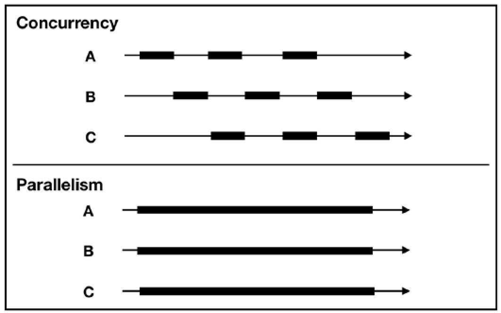{.u53745}

图11-1：并发和并行的区别示意图
:::

在实际编程中，对任务进行分解才是重点，一旦将任务分解正确，到了执行层面，并行就会自然发生，也容易保证正确性。如何分解任务是并发设计要解决的问题，所以，通常更关注并发而非并行。

使用并发主要出于两个主要原因：**性能** 和**容错** 。

随着多核计算机的普及，为了利用其日益增长的计算能力，就必须要编写并发程序。并发编程越来越受重视，甚至可能成为一种新的编程范式，Go语言的横空出世就证明了这一点。另外，并发编程还可以将程序分为不同的功能区域，让程序更容易理解和测试，从而减少程序出错的可能性。

在计算机中，通常使用一些独立的运行实体对并发进行支持，分为如下两类：

· 操作系统提供的进程和线程。

· 编程语言内置的用户级线程。

### 11.1.1 多进程和多线程 {#text00017.html#A03420181-6189-439e-87ee-9b7724b64b79 .title-left}

进程是资源分配的最小单元，线程是程序执行时的最小单元。

从操作系统的角度来看，进程代表操作系统分配的内存、CPU时间片等资源的基本单位，它为程序提供基本的运行环境。不同的应用程序可以按业务划分为不同的进程。从用户的角度来看，进程代表运行中的应用程序，它是动态条件下由操作系统维护的资源管理实体，而非静态的应用程序文件。每个进程都享有自己独立的内存单元，从而极大地提高了程序的运行效率。

可以使用多进程来提供并发，比如 Master-Worker 模式，由 Master 进程来管理 Worker子进程，Worker子进程执行任务。Master和Worker之间通常使用Socket来进行进程间通信（IPC）。这样的好处就是具有极高的健壮性，当某个Worker子进程出现问题时，不会影响到其他子进程。但缺点也非常明显，其中最让人诟病的是进程会占用相当可观的系统资源。除此之外，进程还有切换复杂、CPU利用率低、创建和销毁复杂等缺点。

为了寻求比进程更小的资源占用，线程应运而生。线程是进程内的实体，它无法独立存在，必须依靠进程，线程的系统资源都来源于进程，包括内存。每个进程至少拥有一个线程，这个线程就是主线程。每个进程也可以生成若干个线程来并发执行多任务，但只能有一个主线程，线程和线程之间可以共享同一个进程内的资源。一个线程也可以创建或销毁另一个线程，所以线程会有创建、就绪、运行、阻塞和死亡五种状态。每个线程也有自己独享的资源，比如线程栈。线程和进程一样，都受操作系统内核的调度。线程拥有进程难以企及的优点，比如占用内存少，切换简单，CPU利用率高，创建/销毁简单、快速等。线程的缺点也是非常明显的，比如编程相当复杂，调试困难等。正是由于这些缺点，导致多线程并发编程成为众多开发者心中的痛。

### 11.1.2 事件驱动、异步回调和协程 {#text00017.html#Ac79a0182-fbd7-47a4-b46c-5284d0315594 .title-left}

多线程虽然比多进程更省资源，但其依然存在昂贵的系统内核调度代价。互联网的发展让这个问题更加突出。在服务器领域有一个非常出名的**C10K** 问题，主要是指单台服务器要同时处理10K量级的并发连接，解决此问题最直接的就是多进程（线程）并发，每个进程（线程）处理一个连接。但是，这种处理方式显然是有问题的，因为服务器根本没有这么多资源可以分配给如此多的进程（线程）。

为了解决C10K问题，**事件驱动编程** 应运而生，最知名的就是Linux推出的**epoll** 技术。事件驱动也可以称为事件轮询，它的优点在于编程更加容易，不用做并发设计的考虑，不需要引入锁，不需要考虑内部调度，只需要依赖于事件，最重要的是不会阻塞。所以它可以很方便地和编程语言相集成，比如 Node.js，也就是第一个事件驱动编程模型语言。在 Node.js中，仅仅使用单线程就可以拥有强大的并发处理能力，其力量来源就是**事件驱动** 和**异步回调（Callback）** 。通过内置的事件循环机制，不断地从事件队列中查询是否有事件发生，当读取到事件时，就会调用和此事件关联的回调函数，整个过程是非阻塞的。

事件驱动和回调函数虽然解决了C10K的问题，但是对于开发者来说还远远没有那么完美。问题就出在回调函数上面，如果编写业务比较复杂的代码，开发者将陷入"**回调地狱（Call Hell）** "中，代码中充斥着各种回调嵌套，很快就会变成一团乱麻。回调函数的这种写法，并不符合人类的思维直觉，所以使用起来比较痛苦。

为了避免"回调地狱"，不停地有新方案被提出，比如**Promise** 和**Future** ，这两种方案从不同的角度来处理回调函数。Promise 站在任务处理者的角度，将异步任务完成或失败的状态标记到 Promise 对象中。Future 则站在任务调用者的角度，来检测任务是否完成，如果完成则直接获取结果，如果未完成则阻塞直到获取到结果，或者编写回调函数避免阻塞，根据相应的完成状态执行此回调函数。虽然Promise和Future可以进一步缓解回调函数的问题，但它们还是不够完美，代码中依然充斥着各种冗余。

为了进一步完善基于事件驱动的编程体验，一种叫作**协程** 的解决方案浮出水面。协程的概念很古老，甚至可以追溯到20世纪60年代的COBOL语言，但是因为时代使然，协程并未成为像线程那样的通用编程元素。然而，随着事件编程的兴起，协程又有了用武之地。

协程为协同任务提供了一种抽象，这种抽象本质上就是控制流的出让和恢复。协程的这种机制，正好符合现实世界中人类异步处理事务的直觉。比如，程序员可以暂停自己写代码的过程，进行场景切换，去参加产品经理组织的会议，当会议结束后，再切换回之前的场景继续编写代码。虽然处理了不同的事件，但对于程序员来说，都是顺序执行的。可以看出，协程和事件驱动属于绝配。当事件来临时，出让当前的控制权，切换场景，完成该事件，然后再切换回之前的场景，恢复之前的工作。如果说事件驱动编程和异步回调是站在事件发生的角度进行编程的，那么协程就是站在开发者的角度来进行编程的。开发者将自身代入各种事件中，看上去就是顺序执行的。总的来说，协程可以让开发者用写同步（顺序）代码的方式编写可异步执行的代码。

在现代编程语言中，实现协程的方法有很多，但其中的区别只在于是否有适合的应用场景。常见的有Go语言的**go程（goroutines）** 、Erlang语言的**轻量级进程（LWP）** 。另外，像Python、Ruby、JavaScript这样的主流编程语言也实现了协程，当然Rust语言也支持协程。协程是以线程为容器的，协程的特点是内存占用比线程更小、上下文切换的开销更小、没有昂贵的系统内核调度，这也意味着协程的运行效率更加高效。协程非常轻量，也被称为用户态线程，所以可大量使用。但协程也不是"银弹"，它虽然充分挖掘了单线程的利用率，在单线程下可以处理高并发I/O，但却无法利用多核。

图11-2展示了进程、线程和协程之间的关系。

::: center
{.u53744}

图11-2：进程、线程和协程之间的关系示意图
:::

当然，可以将协程和多线程配合使用，来充分利用多核。但是，从单线程迁移到多线程并不会只带来好处，它也会带来更多的风险。

### 11.1.3 线程安全 {#text00017.html#A21430183-eec7-4385-9303-5d21fc4c6f8b .title-left}

线程其实是对底层硬件运行过程的直接抽象，这种抽象方式既有优点又有缺点。**优点** 在于很多编程语言都对其提供了支持，并且没有对其使用方式加以限制，开发者可以自由地实现多线程并发程序，充分利用多核。**缺点** 包含两个方面：一方面，线程的调度完全由系统内核来控制 ^[\[1\]](#text00017.html#n26AF0183D5994F05AB0FAB5FFF094029){#text00017.html#n26AF0183D5994F05AB0FAB5FFF094029s}^ ，完全随机，这就导致多个线程的运行顺序是完全无法预测的，有可能产生奇怪的结果；另一方面，编写正确的多线程并发程序对开发者的要求太高，对多线程编程没有充足知识储备的开发者很容易写出满是Bug的多线程代码，并且还很难重现和调试。

多线程存在问题主要是因为资源共享，比如共享内存、文件、数据库等。实际上，只有当一个或多个线程对这些资源进行写操作时才会出现问题，如果只读不写，资源不会发生变化，自然也不会存在安全问题。假如一个方法、数据结构或库在多线程环境中不会出现任何问题，则可以称之为**线程安全** 。所以，多线程编程的重点就是如何写出线程安全的代码。

**竞态条件与临界区**

要想写出线程安全的代码，必须先了解安全的边界在哪里。代码清单11-1展示了一个线程不安全的函数示例。

**代码清单11-1：线程不安全的函数示例**

::: center
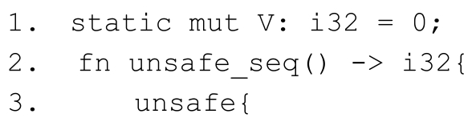{.u53743}
:::

::: center
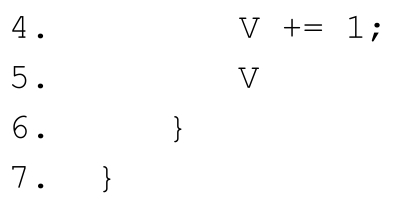{.u53742}
:::

在代码清单11-1所展示的示例中，首先初始化了一个可变的静态变量V。在unsafe_seq函数中通过"+="操作来改变V的值。因为在Rust中默认不允许修改静态变量的值，所以需要在unsafe块中进行操作。

在单线程环境中，unsafe_seq 函数不会有任何问题，但是将其放到多线程环境中，则会有问题。问题主要出在代码第4行的"V+=1"操作上。实际上，该操作在运行过程中并非单个指令，而是可以分为三步：

（1）从内存中将V的初始值放入寄存器中。

（2）将寄存器中V的值加1。

（3）将加1后的值写入内存。

这三步操作无法保证在同一个线程中被一次执行完成。因为系统内核调度的存在，很有可能在线程A执行第2步操作之后，从线程A切换到了线程B，而线程B此时并不知道线程A已经执行了第1步操作，它又重复将V的初始值放入寄存器中，当又切换回线程A后，线程A会继续执行第3步操作，此时就从寄存器中读取了错误的值。

"V+=1"操作的整个过程如图11-3所示。

::: center
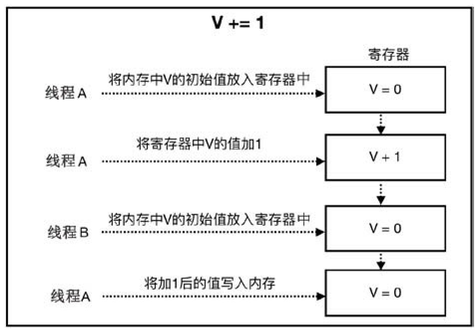{.u53741}

图11-3："V+=1"操作的整个过程
:::

代码清单11-1展示了一种常见的并发安全问题，叫作**竞态条件（Race Condition）** 。当某个计算的正确性取决于多个线程交替执行的顺序时，就会产生竞态条件。也就是说，想计算出正确的结果，全靠运气。最常见的竞态条件类型是"**读取-修改-写入** "和"**先检查后执行** "操作。代码清单11-1展示的就是"读取-修改-写入"竞态条件；而"先检查后执行"竞态条件则出现在需要判断某个条件为真之后才采取相应的动作时。产生竞态条件的区域，就叫作**临界区** 。

在代码清单11-1中展示的代码也同时引起了**数据竞争（Data Race）** 。"数据竞争"这个术语很容易和竞态条件相混淆。当一个线程写一个变量而另一个线程读这个变量时，如果这两个线程没有进行同步，则会发生数据竞争。因为竞态条件的存在，读操作很可能在写操作之前就完成了，那么读到的数据就是错误的。**并非所有的竞态条件都是数据竞争，也并非所有的数据竞争都是竞态条件** 。

简单来说，当有多个线程对同一个变量同时进行读写操作，且至少有一个线程对该变量进行写操作时，则会发生数据竞争。也就是说，如果所有的线程都是进行读操作，则不会发生数据竞争。数据竞争的后果会造成该变量的值不可知，多线程程序的运行结果将完全不可预测，甚至直接崩溃。

而竞态条件是指代码受多线程乱序执行的影响，运行结果产生预料之外的变化。比如对于同一段程序，多次运行会产生不同的结果，完全无法预测，它由输入的数据和多线程执行的顺序决定。

现在用一个银行转账的示例来具体说明竞态条件和数据竞争的区别。代码清单11-2展示的伪代码为用于转账操作的函数trans1。

**代码清单11-2：用于转账操作的函数**

::: center
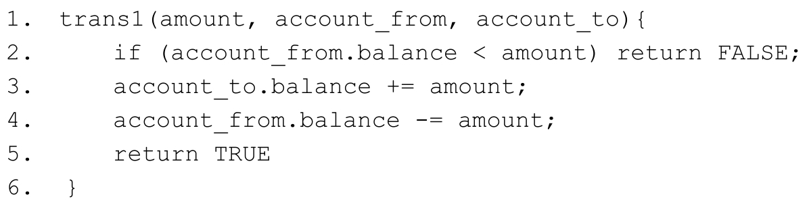{.u53740}
:::

在多线程环境中，这个伪代码示例既包含了竞态条件，又包含了数据竞争，转账结果将不可预测。为了解决该问题，采用某种同步操作，比如使用互斥量（Mutex）或某种禁用中断操作的事务，将包含数据竞争的操作变为原子性操作，如代码清单11-3所示。

**代码清单11-3：改进转账操作的函数**

::: center
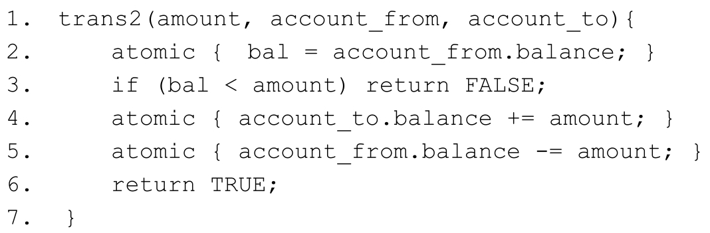{.u53727}
:::

在代码清单 11-3 中使用的 atomic 块，表示将其范围内的操作变为原子性的某种手段。总之，现在数据竞争被消除了。但还存在竞态条件，不同的线程依然可以乱序执行代码第 4行和第5行的操作。整个交易函数trans2的正确性，在不同的线程执行顺序之下，会出现不同的结果。所以还需要继续对其改进，如代码清单11-4所示。

**代码清单11-4：继续改进转账操作的函数**

::: center
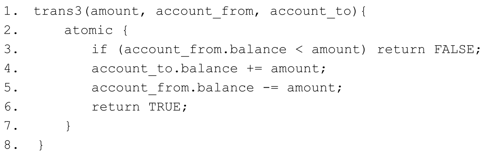{.u53739}
:::

在trans3函数中，通过atomic块将整个函数的执行过程赋予原子性，这样就完全消除了数据竞争和竞态条件。可以看出，**消除竞态条件的关键在于判断出正确的临界区** 。

还可以对其进一步改进，创建一个有数据竞争但无竞态条件的函数，如代码清单11-5所示。

**代码清单11-5：进一步改进转账操作的函数**

::: center
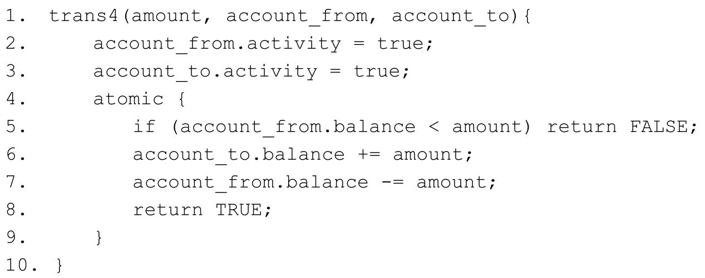{.u53738}
:::

在trans4函数中增加了两行伪代码，如代码第2行和第3行所示，这两行代码表示这两个账号上会出现某些状态变更的行为。这两行代码会出现数据竞争，但不存在竞态条件。但这里的数据竞争并不会影响到交易行为的正确性，所以是无害的。

通过上面的四段伪代码，刻意区分了数据竞争和竞态条件之间的区别。在多线程编程中，数据竞争是最常见、最严重、最难调试的并发问题之一，可能会引起崩溃或内存不安全。

接下来看看 Rust 多线程代码实际产生竞态条件和数据竞争问题的例子。代码清单 11-6展示了在多线程环境中使用unsafe_seq函数的情形。

**代码清单11-6：在多线程环境中使用unsafe_seq函数**

::: center
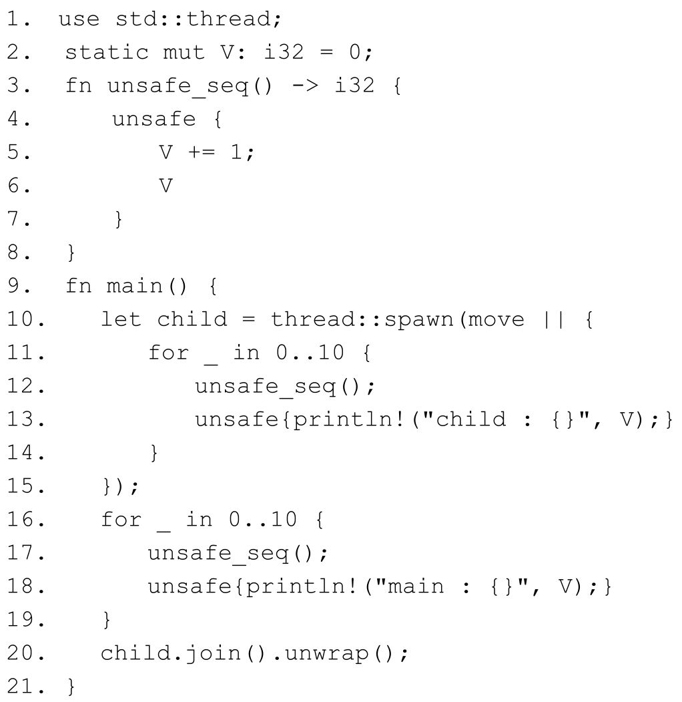{.u53737}
:::

在代码清单11-6中，使用std：：thread模块中提供的spawn方法在main主线程中生成子线程child，并在其中循环使用unsafe_seq函数，如代码第10～15行所示。同样，在main主线程中也循环使用unsafe_seq函数，如代码第16～19行所示。最后在代码第20行，调用child子线程的join方法，让主线程等待子线程执行完再退出。

在正常情况下，对该段代码进行编译执行，期待的输出结果是main主线程和child子线程一共输出从 0 到 20 的数字。但实际执行多次会看到不同的输出结果，基本会出现以下两种情况：

· 在main主线程输出的结果中会莫名其妙地少一位，并不是从0到10的连续值。

· child子线程输出的结果和main主线程输出的结果有重复。

可以看出，该段代码在多线程环境中的行为和结果完全无法预测，完全无法保证正确性。

**同步、互斥和原子类型**

综上所述，产生竞态条件主要是因为线程乱序执行，发生数据竞争主要是因为多线程同时对同一块内存进行读写。那么，要消除竞态条件，只需要保证线程按指定顺序来访问即可。要避免数据竞争，只需要保证相关数据结构操作的原子性即可。所以，很多编程语言都通过提供同步机制来消除竞态条件，使用互斥和原子类型来避免数据竞争。

同步是指保证多线程按指定顺序执行的手段。互斥是指同一时刻只允许单个线程对临界资源进行访问，对其他线程具有排他性，线程之间的关系表现为互斥。而原子类型是指修改临界数据结构的内部实现，确保对它们做任何更新，在外界看来都是原子性的，不可中断。

通常可以使用**锁** 、**信号量（Semaphores）** 、**屏障（Barrier）** 和**条件变量（Condition Variable）** 机制来实现线程同步。根据不同的并发场景分为很多不同类型的锁，有互斥锁（Mutex）、读写锁（RwLock）和自旋锁（Spinlock）等。锁的作用是可以保护临界区，同时达到同步和互斥的效果。不同的锁表现不同，比如互斥锁，每次只允许单个线程访问临界资源；读写锁可以同时支持多个线程读或单个线程写；自旋锁和互斥锁类似，但当获取锁失败时，它不会让线程睡眠，而是不断地轮询直到获取锁成功。

**信号量** 可以在线程间传递信号，也叫作信号灯，它可以为资源访问进行计数。信号量是一个非负整数，所有通过它的线程都会将该整数减 1，如果信号量为 0，那么其他线程只能等待。当线程执行完毕离开临界区时，信号量会再次加1。当信号量只允许设置0和1时，效果相当于互斥锁。

**屏障** 可以让一系列线程在某个指定的点进行同步。通过让参与指定屏障区域的线程等待，直到所有参与线程都到达指定的点。而**条件变量** 用来自动阻塞一个线程，直到出现指定的条件，通常和互斥锁配合使用。

通过一些锁机制，比如互斥锁，也可以用来避免数据竞争。本质上，是通过锁来保护指定区域的原子性的。有些语言也提供了原子类型来保证原子性，比如Java、C++以及Rust。具有原子性的操作一定是不可分割的，要么全部完成，要么什么都不做。原子类型使用起来简单，但其背后的机制却一点也不简单，了解其背后的机制有助于更好地使用原子类型。

**原子类型与多线程内存模型**

在计算机中程序需要经过CPU、CPU多级缓存和内存等协同工作才能顺利执行，在这种体系结构之下，如果是多核系统，其中一个CPU核心修改了变量，那么如何通知其他核心是一个重要的问题。并且为了提高性能，现代处理器和编程语言的编译器都对程序进行了极度优化，比如**乱序执行** 和**指令重排** ，所以机器并非按照实际编写的那样来执行，如图11-4所示。在多线程编程中，只有保持顺序一致性，才能保证程序的正确性。所谓**顺序一致性** ，主要是约定了两件事：

::: center
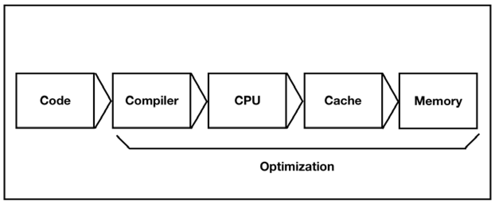{.u53736}

图11-4：代码经过层层优化
:::

· 在单线程内部指令都是按程序确定的顺序来执行的。

· 多线程程序在执行过程中虽然是交替执行的，但从全局来看，也是按某种确定的顺序来执行的。

显然，在硬件层面并没有支持顺序一致性，所以需要编程语言和计算机系统（包括编译器、CPU 等）之间达成"契约"，该契约规定了多线程访问同一个内存位置时的语义，以及某个线程对内存位置的更新何时才能被其他线程看到。这个契约就是**多线程内存模型** 。通过该内存模型，程序员就可以使用编程语言提供的同步原语（比如C++和Rust提供的Atomic类型）来保证多线程下的顺序一致性，这也是无锁并发编程的基础。

Rust的多线程内存模型来源于C++11，而C++11中实现的Atomic类型是通过store和load 这两个 CPU 指令进行数据存取（寄存器和内存之间）的，并且额外接收一个**内存序列** （**Memory Order** ）作为参数。C++11支持6种内存排序约束，而Rust是基于LLVM实现的，所以Rust通过LLVM原子内存排序约束来实现不同级别的原子性。

**为什么多线程编程这么难**

既然有了这么多避免竞态条件和数据竞争的手段，那么为什么提到多线程编程还会让广大开发者心生恐惧呢？主要有以下几点原因：

· 虽然可以使用锁来同步，但开发者有可能忘记加锁。

· 即使没有忘记加锁，也可能出现死锁的情况。

· 多线程程序难以调试，如果出现了问题很难再现。

总的来说，主要因为开发者自身很难驾驭多线程编程。即便是技艺高超的开发者，也难以保证写出没有问题的多线程代码。难以驾驭背后的原因在于，开发者总是有意无意地将不该共享的数据错误地共享，将其暴露在多个线程可以操作的危险区。Rust语言的出现正是要解决这个问题的。

## 11.2 多线程并发编程 {#text00017.html#A92b20188-cb28-408c-ae7b-28657fb672a8 .title-left}

Rust为开发者提供的并发编程工具和其他语言类似，主要包括如下两个方面：

· **线程管理** ，在**std：：thread** 模块中定义了管理线程的各种函数和一些底层同步原语。

· **线程同步** ，在**std：：sync** 模块中定义了锁、Channel、条件变量和屏障。

### 11.2.1 线程管理 {#text00017.html#Ad8850189-5578-41e3-b954-b4a1f7f3915f .title-left}

Rust中的线程是本地线程，每个线程都有自己的栈和本地状态。创建一个线程很简单，如代码清单11-7所示。

**代码清单11-7：创建线程**

::: center
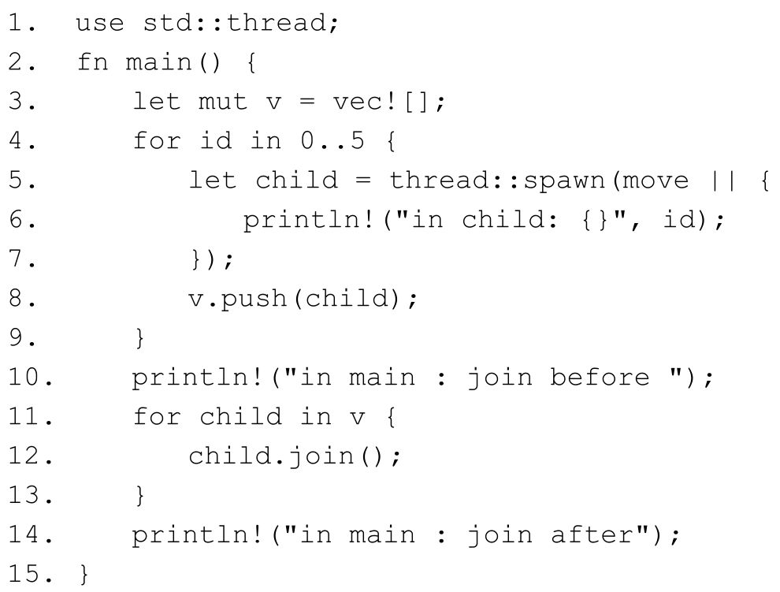{.u53735}
:::

在代码清单11-7中，必须使用use导入std：：thread模块使用线程创建的函数spawn。代码第3行，初始化了一个可变的动态数组v，用于存放生成的子线程。

代码第4～9行，使用for循环迭代生成5个子线程，并将其存放到数组v中。其中代码第5～7行，使用spawn函数创建子线程，接收一个闭包作为参数，并且该闭包需要捕获循环变量id，默认是按引用来捕获的。但这里涉及生命周期的问题，传递给子线程的闭包有可能存活周期长于当前函数，如果直接传递引用，则可能引起悬垂指针的问题，这是Rust绝对不允许的。所以，这里使用**move** 关键字来强行将捕获变量id的所有权转移到闭包中。

代码第 11～13 行，对数组 v 进行迭代，调用其中每一个子线程的 **join** 方法，就可以让main主线程等待这些子线程都执行完毕。代码第10行和第14行，分别在子线程join的前后打印相应的信息。

可以对该段代码进行多次编译执行，代码清单11-8展示了其中某次执行的结果。

**代码清单11-8：执行结果**

::: center
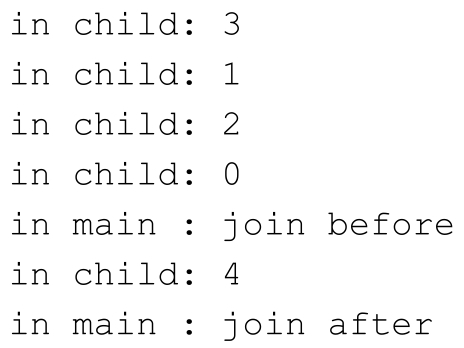{.u53734}
:::

通过对比多次执行的结果可以看出，main主线程和子线程永远是乱序执行的，"in main：join before"的输出位置并不固定，但是"in main：join after"的位置是固定的，永远在结尾。

假如在代码清单11-7中不使用join方法，main主线程并不会等待子线程执行完毕，那么编译执行的结果就会变得更加难以预料。首先可以确定的是，在 main 主线程中打印的两条信息永远会输出，但是在子线程中打印的结果就不一定了。因为乱序执行的存在，有时候能看到一个子线程的输出，有时候能看到三个子线程的输出，有时候完全看不到，完全无法预料，因为谁也无法保证子线程一定会比main线程先执行完毕。

所以，如果想要多个线程协作，则通常会使用join方法来指定一个线程等待其他线程执行完之后再执行它自己的任务。线程join机制示意图如图11-5所示。

::: center
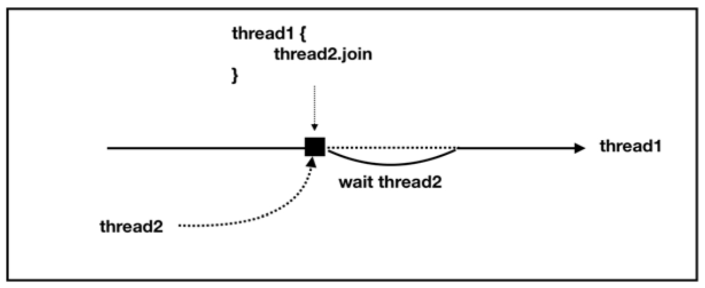{.u53733}

图11-5：线程join机制示意图
:::

从图11-5中可以看出，如果在thread1中调用thread2的join方法，则thread1就会在调用join方法的那一刻等待thread2，并且阻塞自身，只有thread2执行完毕后才继续执行thread1中的任务。这也就是在代码清单11-8中"in main：join after"输出永远在最后的原因。

**定制线程**

直接使用thread：：spawn生成的线程，默认没有名称，并且其栈大小默认为2MB。如果想为线程指定名称或者修改默认栈大小，则可以使用 thread：：Builder 结构体来创建可配置的线程，如代码清单11-9所示。

**代码清单11-9：使用thread：：Builder来定制线程**

::: center
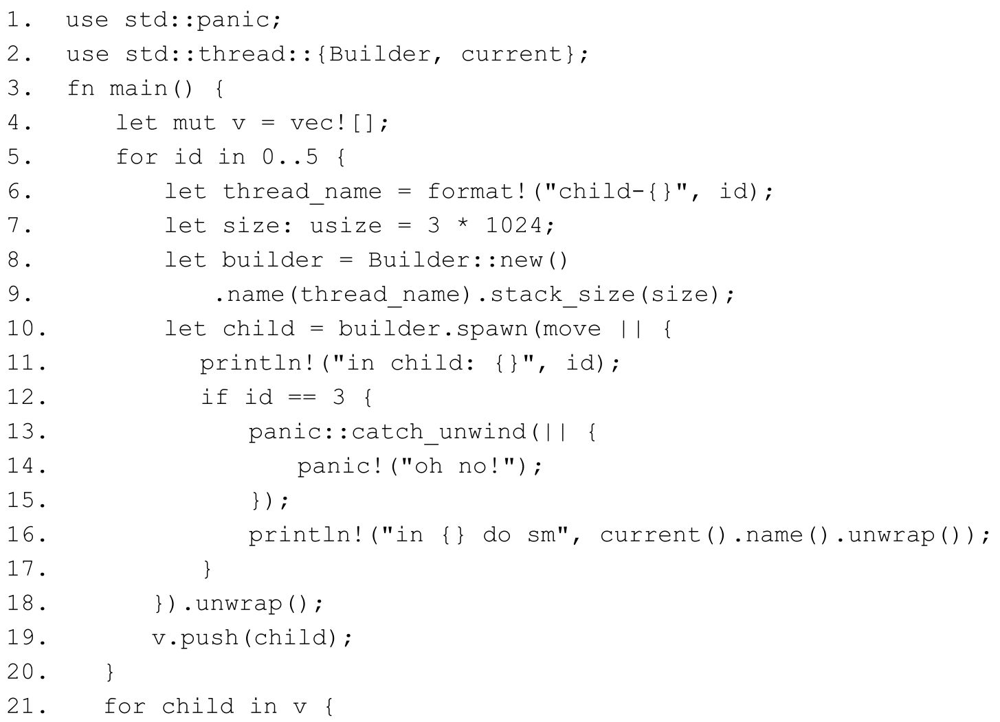{.u53732}
:::

::: center
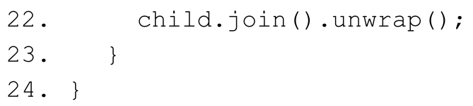{.u53731}
:::

代码清单11-9是对代码清单11-7的部分修改，使用thread：：Builder来定制新的线程。代码第6行和第7行，分别声明了线程的名称和栈大小。代码第8行和第9行，通过Builder：：new方法来生成新的 Builder 实例，然后分别将事先声明好的名称和栈大小参数传入 name 和stack_size方法中，就可以生成指定名称和栈大小的线程。这里值得注意的是，主线程的大小与Rust语言无关，这是因为主线程的栈实际上就是进程的栈，由操作系统来决定。修改所生成线程的默认值也可以通过指定环境变量 **RUST_MIN_STACK** 来完成，但是它的值会被Builder：：stack_size覆盖掉。

代码第10行，调用builder.spawn方法来生成线程，该spawn方法是Builder实例的方法，与thread：：spawn函数不一样。实际上，在thread：：spawn内部也是使用Builder来生成默认配置的线程的。

代码第12～17行，特意在第三个线程中使用panic！来产生恐慌，并且使用catch_unwind来捕获恐慌。在 catch_unwind 之后，再次输出一些特定信息。其中代码第 16 行使用了thread：：current函数来获取当前线程。

注意代码第18行，在spawn方法结尾处又调用了unwrap方法。实际上，之前thread：：spawn方法返回的是**JoinHandle＜T＞** 类型，而Builder的spawn方法返回的是Result＜JoinHandle＜T＞＞类型，所以这里需要加unwrap方法。JoinHandle＜T＞代表线程与其他线程join的权限。

代码清单11-9执行的结果如代码清单11-10所示。

**代码清单11-10：执行结果**

::: center
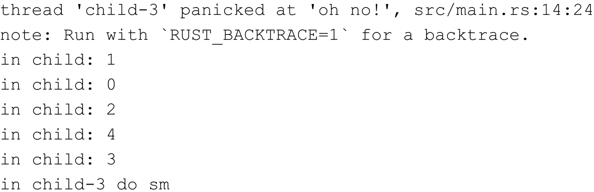{.u53730}
:::

从代码清单11-10中可以看出，为线程指定的名称可以在线程发生恐慌时显示出来，此处为"child-3"。如果不给线程指定名称，则默认显示"unknow"。该正常输出的信息也都输出了，说明child-3线程中的恐慌已经被捕获，线程得以恢复。

**线程本地存储**

**线程本地存储（Thread Local Storage，TLS）** 是每个线程独有的存储空间，在这里可以存放其他线程无法访问的本地数据，如代码清单11-11所示。

**代码清单11-11：线程本地存储示例**

::: center
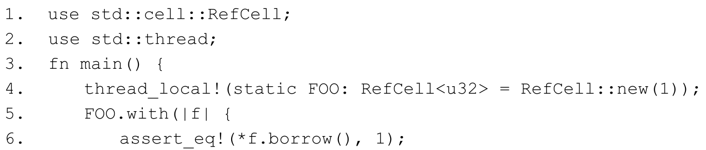{.u53729}
:::

::: center
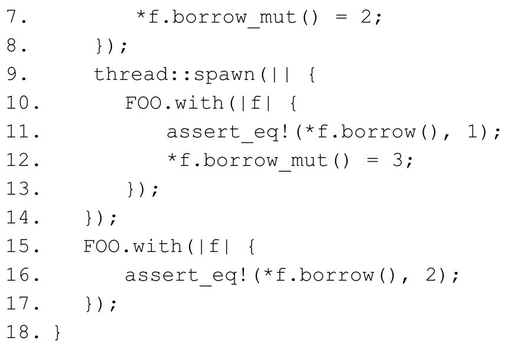{.u53728}
:::

在代码清单11-11中，代码第4行，使用**thread_local！** 宏以一个类型为RefCell＜u32＞并且初始值为1的静态变量FOO作为参数，最终会生成类型为thread：：LocalKey的实例FOO。为了提供内部可变性，有时候thread_local！宏会配合Cell和RefCell一起使用。

thread：：LocalKey 是一个结构体，它提供了一个 with 方法，可以通过给该方法传入闭包来操作线程本地存储中包含的变量。如代码第5～8行所示，首先判断初始值是否为1，然后通过调用borrow_mut方法将线程本地存储内部的值修改为2。

代码第9～14行，生成了子线程，并且该子线程也有一个线程本地存储实例FOO，初始值为1。当然，也可以通过thread_local！宏在该子线程中重新创建一个LocalKey实例。但是本例中还是使用来自main主线程的FOO副本。代码第11行和第12行，首先验证FOO初始值，然后将它的值改为3。

代码第 15～17 行，主要用来判断主线程中的线程本地存储实例 FOO 内部的值有没有发生变化。

通过编译执行该段代码，可以得知，main主线程中的线程本地存储实例FOO内部的值并没有因为子线程中的修改而发生变化。在标准库中很多数据结构实现都使用了thread_local！宏来定义单个线程内的一些独享数据，比如映射类型HashMap。

**底层同步原语**

在std：：thread模块中还提供了一些函数，用来支持底层同步原语，主要包括park/unpark和yield_now函数。

std：：thread：：park函数提供了阻塞线程的基本能力，而std：：thread：：Thread：：unpark函数可以将阻塞的线程重启。可以利用 park 和 unpark 函数来方便地创建一些新的同步原语，比如某种锁。但要注意park函数并不能永久地阻塞线程，也可以通过std：：thread：：park_timeout来显式指定阻塞超时时间。

代码清单11-12展示了park和unpark函数的用法。

**代码清单11-12：park和unpark函数使用示例**

::: center
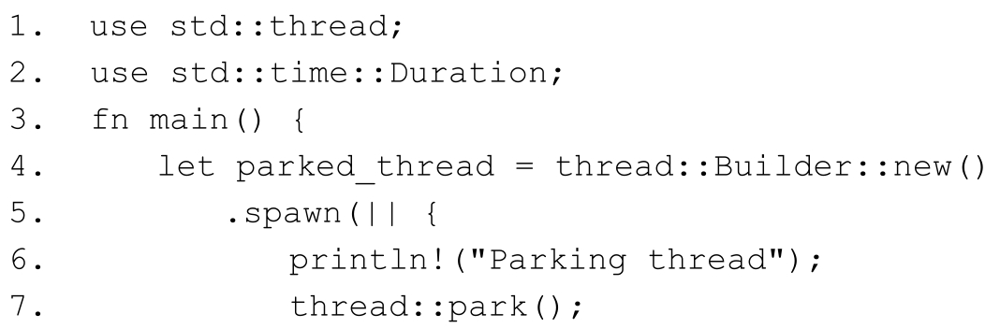{.u53727}
:::

::: center
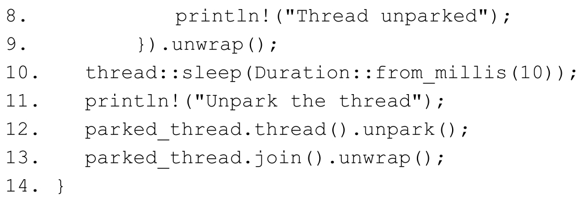{.u53726}
:::

在代码清单11-12中引入了std：：time模块，其中的**Duration** 类型专门用于表示系统超时，默认new方法生成以纳秒（ns）为时间单位的实例，但是也提供了from_secs和from_millis方法分别生成以秒（s）和毫秒（ms）为时间单位的实例。

代码第4～9行，通过Builder来生成线程，并在该线程传递的闭包中调用thread：：park函数，目的在于阻塞该线程。

代码第10行，使用thread：：sleep函数让主线程睡眠10ms。等待子线程parked_thread生成完毕，目的在于让子线程能先打印出相关的信息。但值得注意的是，千万不要使用 sleep来进行任何线程同步的操作，它并不会保证线程执行的顺序。

代码第12行，通过调用parked_thread的thread方法从JoinHandle中得到具体的线程，然后调用 unpark 函数，就可以将处于阻塞状态的 parked_thread 线程重启，该线程会继续沿着之前暂停的上下文开始执行。

代码清单11-12的执行结果如代码清单11-13所示。

**代码清单11-13：执行结果**

::: center
{.u53725}
:::

可以看出，thread：：sleep 函数起作用了，首先输出的是子线程 parked_thread 阻塞前的打印信息，之后调用到thread：：park函数，线程就会发生阻塞。接下来轮到main主线程开始执行，打印出"Unpark the thread"之后，获取parked_thread线程并执行unpark方法将其重启。最后通过join方法等待parked_thread线程执行完毕，输出最终结果。

除了阻塞/重启的同步原语，std：：thread 模块还提供了主动出让当前线程时间片的函数yield_now。众所周知，操作系统是抢占式调度线程的，每个线程都有固定的执行时间片，时间片是由操作系统切分好的，以便每个线程都可以拥有公平使用CPU的机会。但是有时开发者明确知道某个线程在一段时间内会什么都不做，为了节省计算时间，可以使用 yield_now函数主动放弃当前操作系统分配的时间片，让给其他线程执行。

### 11.2.2 Send和Sync {#text00017.html#A16bd018d-5bca-4f75-9cef-caabb22a190b .title-left}

从Rust提供的线程管理工具来看，并没有发现什么特殊的地方，和传统语言的线程管理方式非常相似。那么，Rust 是如何做到之前宣称的那样默认线程安全的呢？这要归功于std：：marker：：**Send** 和std：：marker：：**Sync** 两个特殊的内置trait。Send和Sync被定义于std：：marker模块中，它们属于**标记trait** ，其作用如下：

· **实现了Send的类型，可以安全地在线程间传递所有权** 。也就是说，可以跨线程移动。

· **实现了Sync的类型，可以安全地在线程间传递不可变借用** 。也就是说，可以跨线程共享。

这两个标记trait反映了Rust看待线程安全的哲学：**多线程共享内存并非线程不安全问题所在，问题在于错误地共享数据** 。通过Send和Sync将类型贴上"标签"，由编译器来识别这些类型是否可以在多个线程之间移动或共享，从而做到在编译期就能发现线程不安全的问题。和Send/Sync相反的标记是**！Send/！Sync** ，表示不能在线程间安全传递的类型。

我们来观察std：：thread：：spawn函数的源码实现，如代码清单11-14所示。

**代码清单11-14：spawn函数的源码实现**

::: center
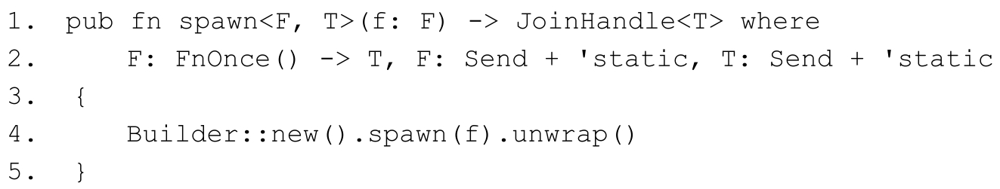{.u53724}
:::

在代码清单11-14中，spawn函数中的闭包F与闭包的返回类型T都被加上了**Send** 和**＇static** 限定。其中Send限定了闭包的类型以及闭包的返回值都必须是实现了Send的类型，只有实现了 Send 的类型才可以在线程间传递。而闭包的类型是和捕获变量相关的，如果捕获变量的类型实现了Send，那么闭包就实现了Send。

而**＇static** 限定表示类型T只能是**非引用类型** （除&＇static之外）。其实这个很容易理解，闭包在线程间传递，如果直接携带了引用类型，生命周期将无法保证，很容易出现悬垂指针，造成内存不安全。这是Rust绝对不允许出现的情况。

既然不允许在线程间直接传递引用，那么如何才能在多个线程之间安全地共享变量呢？如果是不可变的变量，则可以通过Arc＜T＞来共享。Arc＜T＞是Rc＜T＞的线程安全版本，因为在 Rc＜T＞内部并未使用原子操作，所以在多个线程之间共享会出现安全问题；而在 Arc＜T＞内部使用了原子操作，所以默认线程安全。

代码清单11-15展示了为Arc＜T＞实现Send和Sync。

**代码清单11-15：为Arc＜T＞实现Send和Sync**

::: center
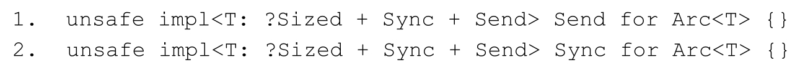{.u53723}
:::

可以看出，只要T是实现了Send和Sync的类型，那么Arc＜T＞也会实现Send和Sync。值得注意的是，Send和Sync这两个trait是unsafe的，这意味着如果开发者为自定义类型手动实现这两个trait，编译器是不保证线程安全的。实际上，在Rust标准库std：：marker模块内部，就为所有类型默认实现了Send和Sync，换句话说，**就是为所有类型设定好了默认的线程安全规则** ，如代码清单11-16所示。

**代码清单11-16：在标准库内部默认为所有类型实现了 Send和Sync**

::: center
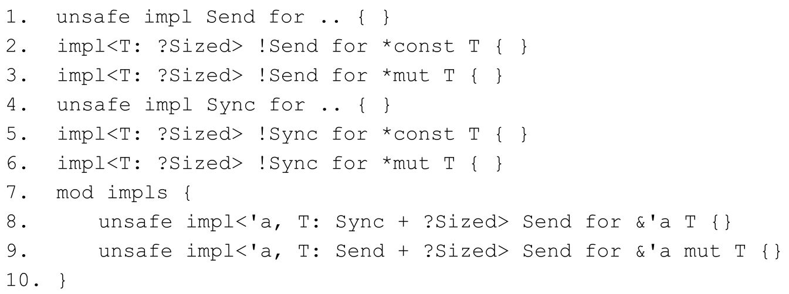{.u53722}
:::

在代码清单11-16中，代码第1行和第4行使用了一种特殊的语法，分别表示为所有类型实现了Send和Sync。这里要注意Send和Sync本身只是标记trait，没有任何默认的方法。如果想使用第1行和第4行这样的语法，**必须满足两个条件** ：

· impl和trait必须在同一个模块中。

· 在该trait内部不能有任何方法。

代码第2行和第3行以及代码第5行和第6行，分别为\*const T和\*mut T类型实现了！Send和！Sync，表示实现这两种trait的类型不能在线程间安全传递。

代码第7～10行，分别为**&＇a T** 和**&＇a mut T** 实现了Send，但是对T的限定不同。&＇a T要求T必须是实现了Sync的类型，表示**只要实现了Sync的类型，其不可变借用就可以安全地在线程间共享；** 而&＇a mut T要求T必须是实现了Send的类型，表示**只要实现了Send的类型，其可变借用就可以安全地在线程间移动** 。

除在std：：marker模块中标记的上述未实现Send和Sync的类型之外，在其他模块中也有。比如Cell和RefCell都实现了！Sync，表示它们无法跨线程共享；再比如Rc实现了！Send，表示它无法跨线程移动。

通过Send和Sync构建的规则，编译器就可以方便地识别线程安全问题。代码清单11-17展示了在线程间传递可变字符串。

**代码清单11-17：在线程间传递可变字符串**

::: center
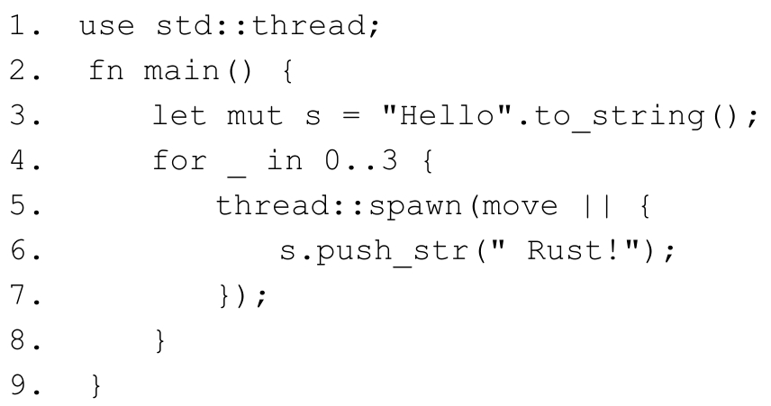{.u53721}
:::

代码清单11-17展示的示例是在多个线程中在字符串s尾部追加字符串。该段代码存在数据竞争隐患。虽然当前示例内容不会有什么危害，但是多个线程对同一个可变变量进行写操作比较危险。对此段代码进行编译，编译器会报出如下错误：

::: center
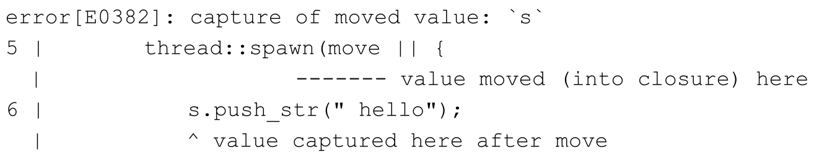{.u53720}
:::

错误信息提示使用了所有权已经被移动的值 s，违反了 Rust 所有权机制。在这里 Rust所有权机制帮助发现了一个潜在的风险。

如果想在多个线程中共享s，则需要使用Rc或Arc。现在已经知道Rc实现了！Send，但是可以尝试使用它跨线程共享所有权，看看会发生什么情况，如代码清单11-18所示。

**代码清单11-18：尝试使用Rc共享所有权**

::: center
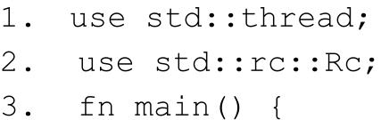{.u53719}
:::

::: center
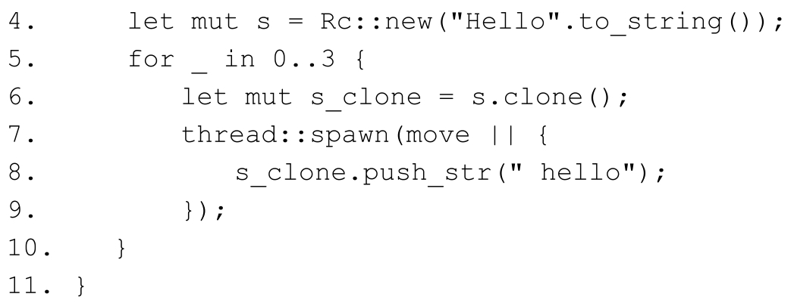{.u53718}
:::

在代码清单11-18中使用Rc包装了变量s，然后在迭代中使用clone方法来共享所有权。编译该段代码，编译器会报出如下错误：

::: center
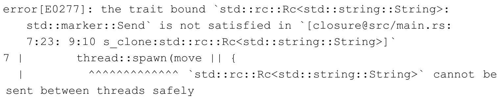{.u53714}
:::

通过错误信息可知，spawn函数传入的闭包没有实现Send，这是因为捕获变量没有实现Send。捕获变量是Rc＜String＞类型，实现的是！Send，正好和Send相反。同时，错误信息最后一句也提示了Rc＜String＞不能在线程间进行安全移动。这是因为Rc＜T＞底层不是原子操作，有可能发生多个线程同时修改引用计数器的情况，存在数据竞争。编译器又一次发现了线程不安全的隐患。

既然Rc＜T＞不行，那么就换成可以在多线程间被移动和共享的Arc＜T＞，如代码清单11-19所示。

**代码清单11-19：使用Arc共享所有权**

::: center
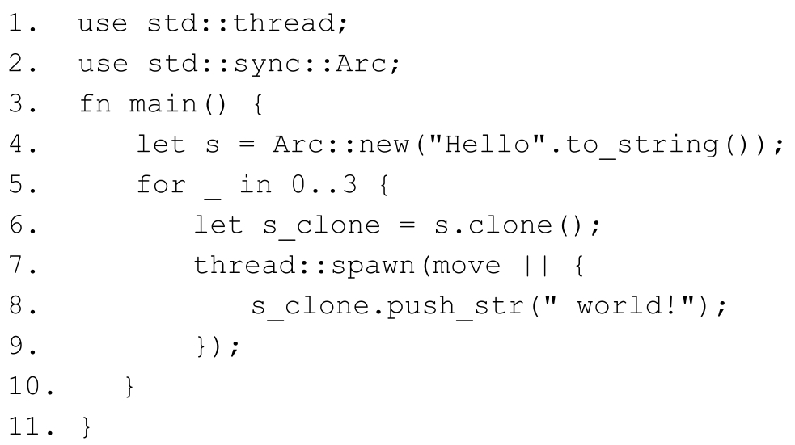{.u53717}
:::

在代码清单11-19中，使用Arc替换了Rc，但是编译时还是会报出如下错误：

::: center
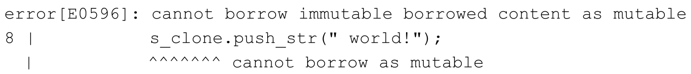{.u53716}
:::

该错误信息表明，把不可变借用当作可变借用，这是因为 Arc＜T＞默认是不可变的。如果想完成目标，还需要使用具备内部可变性的类型，比如Cell、RefCell等。现在我们已经知道，Cell和RefCell均是线程不安全的容器类型，它们实现了！Sync，无法跨线程共享。代码清单11-20展示了使用RefCell来支持内部可变性。

**代码清单11-20：使用RefCell支持内部可变性**

::: center
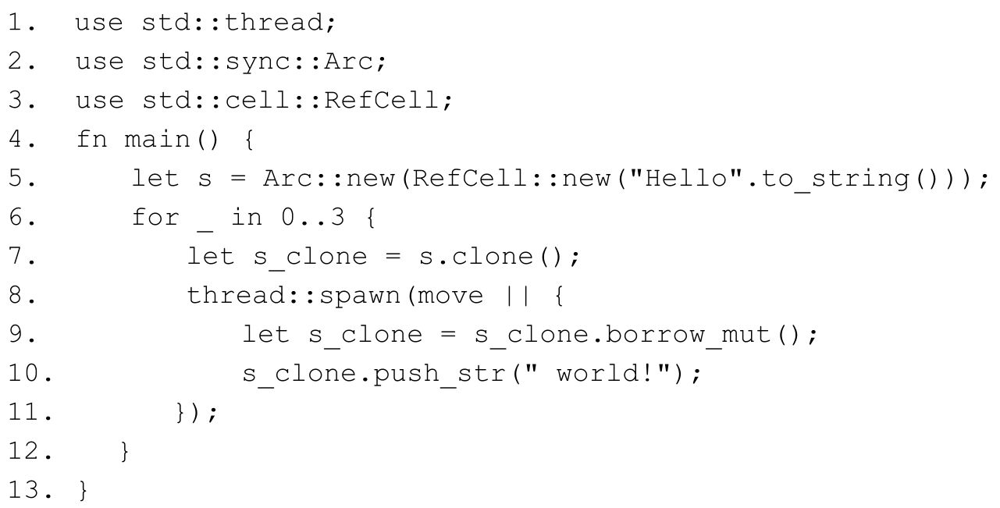{.u53715}
:::

在代码清单11-20中，使用RefCell来提供内部可变性，但是编译时依旧会报出如下错误：

::: center
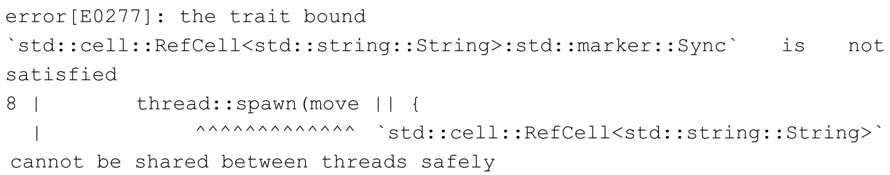{.u53714}
:::

该错误信息表明，RefCell＜String＞没有实现Sync，但是Arc只支持实现Sync的类型。同时，错误信息最后一句也提示了RefCell＜String＞不能在线程间安全共享。编译器又一次避免了线程不安全的风险。

### 11.2.3 使用锁进行线程同步 {#text00017.html#A74980191-dad9-4e1b-a556-3f59123a7d4b .title-left}

要修复代码清单11-20中的错误，只需要使用支持跨线程安全共享可变变量的容器即可，所以可以使用Rust提供的Mutex＜T＞类型，如代码清单11-21所示。

**代码清单11-21：使用Mutex在多线程环境中共享可变变量**

::: center
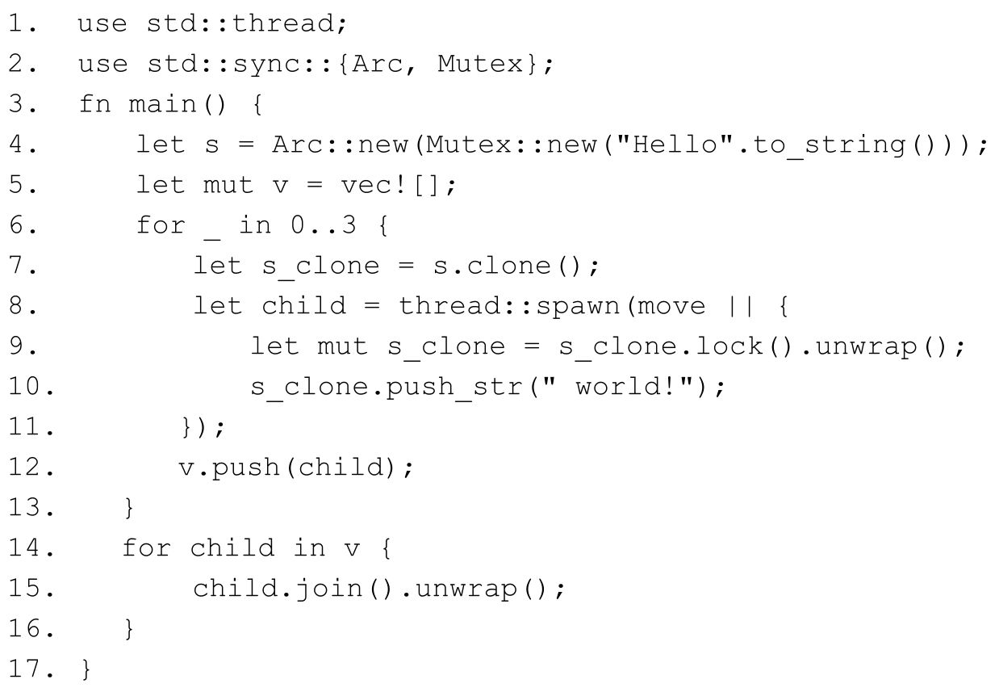{.u53713}
:::

编译代码清单 11-21，终于不再报错了，可以说该段代码实现了线程安全。因为 Mutex消除了跨线程写操作的数据竞争风险，虽然存在竞态条件（比如push_str操作会乱序执行），但就当前示例而言，属于良性竞态条件。

**互斥锁（Mutex）**

**Mutex＜T＞** 其实就是Rust实现的互斥锁，用于保护共享数据。如果类型T实现了Send，那么Mutex＜T＞会自动实现Send和Sync。在互斥锁的保护下，每次只能有一个线程有权限访问数据，但在访问数据之前，必须通过调用lock方法阻塞当前线程，直到得到互斥锁，才能得到访问权限。

Mutex＜T＞类型实现的 lock 方法会返回一个 LockResult＜MutexGuard＜T＞＞类型，LockResult＜T＞是std：：sync模块中定义的错误类型，MutexGuard＜T＞基于**RAII** 机制实现，只要超出作用域范围就会自动释放锁。另外，Mutex＜T＞也实现了try_lock方法，该方法在获取锁的时候不会阻塞当前线程，如果得到锁，就返回MutexGuard＜T＞；如果得不到锁，就返回Err。

**跨线程恐慌和错误处理**

当子线程发生恐慌时，不会影响到其他线程，恐慌不会在线程间传播。当子线程发生错误时，因为Rust基于返回值的错误处理机制，也让跨线程错误处理变得非常方便。std：：thread：：JoinHandle实现的join方法会返回Result＜T＞，当子线程内部发生恐慌时，该方法会返回Err，但是通常不会对此类Err进行处理，而是直接使用unwrap方法，如果获取到合法的结果，则正常使用；如果是 Err，则故意让父线程也发生恐慌，这样就可以把子线程的恐慌传播到父线程，及早发现问题。

但是如果线程在获得锁之后发生恐慌，则称这种情况为"**中毒（Posion）** "，示例如代码清单11-22所示。

**代码清单11-22：** "**中毒** "**示例**

::: center
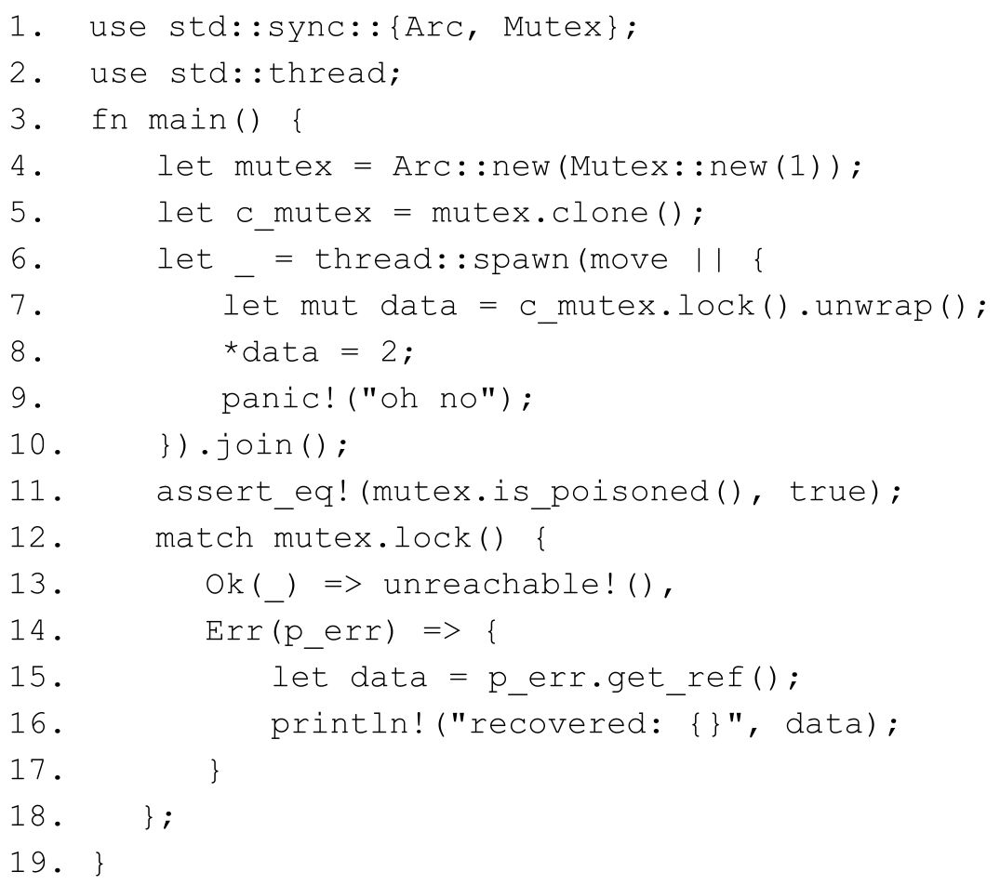{.u53712}
:::

在代码清单11-22中，代码第6～10行，在子线程内部使用panic！宏故意制造了一个恐慌。需要注意的是，代码第 8 行使用解引用操作"\*"来获取 data 中的数据，因为 data 是MutexGuard＜T＞类型，该类型实现了Deref和DerefMut。

代码第11行，使用**is_poisoned** 方法来查看获得互斥锁的子线程是否发生了恐慌。代码第12～18 行，main 主线程通过lock 方法获得锁，因为子线程内部发生了恐慌，所以主线程调用这个lock方法就会返回Err，这里直接处理了Err的情况。该Err是PoisonError＜T＞类型，提供了get_ref或get_mut方法，可以得到其内部包装的T类型，所以代码第16行就可以对data数据进行打印直接输出"recovered：3"。

**死锁**

现在使用多线程来模拟一个掷硬币的场景，硬币有正面和反面，规定连续掷出正面 10次为一轮。采用8个线程，每个线程模拟一轮掷硬币，然后分别统计每一轮掷硬币的总次数和8个线程的平均掷硬币次数。

首先需要写一个模拟掷硬币的函数，如代码清单11-23所示。

**代码清单11-23：模拟掷硬币函数**

::: center
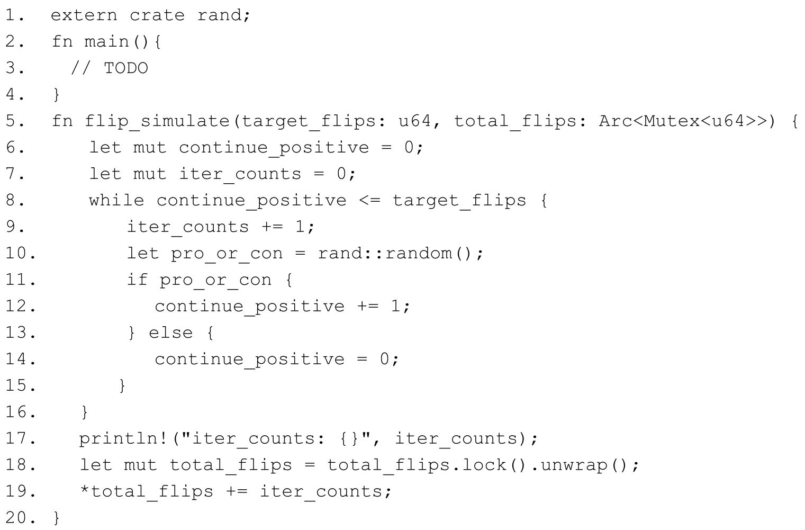{.u53711}
:::

在代码清单11-23中引入了**rand** 包，使用rand：：random函数来获取随机的bool类型表示正反面。

代码第5～20行，实现了模拟掷硬币函数flip_simulate，其中第一个参数target_flips表示要达到的正面朝上目标数，第二个参数total_flips表示总掷硬币次数。这里total_flips需要累计在多个线程内掷硬币次数的总和，属于多线程共享的可变数据，故使用 Arc＜Mutex＜64＞＞类型。

代码第6行和第7行，分别声明了continue_positive和iter_counts来表示连续掷出正面的次数以及掷硬币次数。

代码第8～16行，在while表达式中模拟掷硬币，直到continue_positiv次数达到目标次数target_flips 为止。其中代码第 9 行，每次循环都累计一次掷硬币次数；代码第 10 行，调用rand：：random 函数模拟掷硬币，该函数是一个泛型函数，但这里没有指定具体的类型，是因为代码第11～15行是if条件表达式，Rust编译器可以据此自动推断出随机函数值的类型，这里为bool类型。当rand：：random函数返回true时，continue_positiv的值累计加1，然后进行下一次循环。

代码第18行，调用互斥体total_flips的lock方法获取锁，然后在代码第19行将当前线程的掷硬币次数iter_counts累加到total_flips中。

接下来在main函数中生成8个线程进行掷硬币实验，如代码清单11-24所示。

**代码清单11-24：完善main函数**

::: center
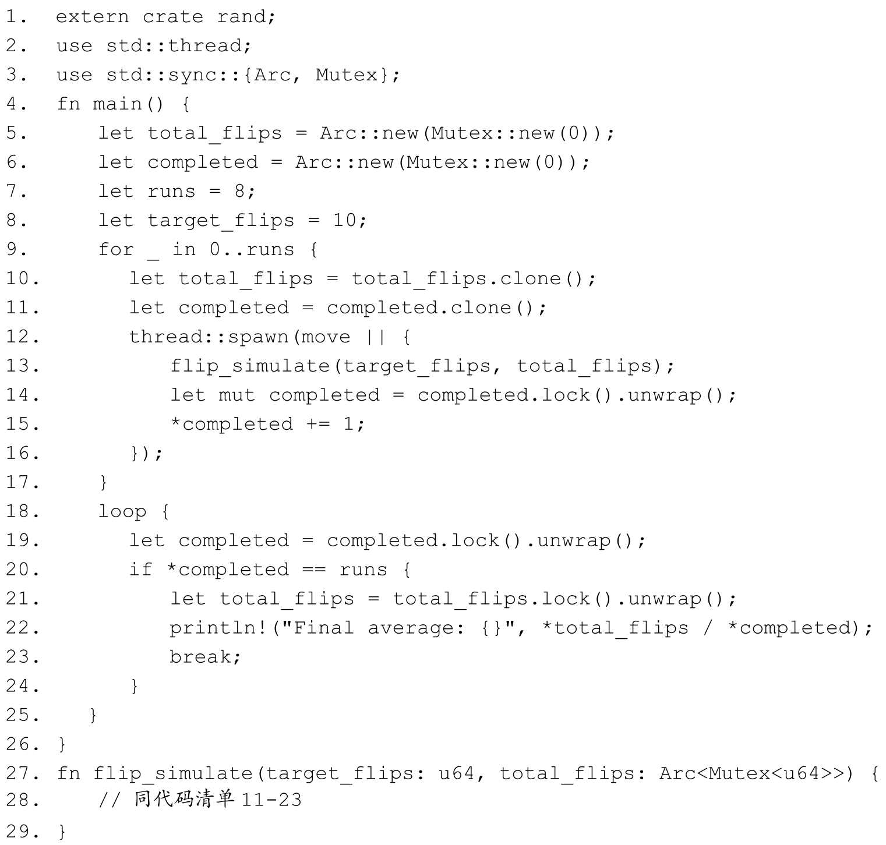{.u53710}
:::

在代码清单 11-24 中，定义了两个互斥体变量 total_flips 和 completed。其中 total_flips依旧表示总掷硬币次数，completed用于记录掷硬币实验完成的总线程数。

代码第9～17行，执行for循环生成8个线程，在线程中调用flip_simulate函数来模拟掷硬币。第14行和第15行，通过调用互斥体completed的lock方法获取到互斥锁，在掷硬币完成之后对该线程进行计数。

代码第18～25行，利用loop循环来等待所有子线程完成掷硬币任务。代码第20行，如果所有的线程都完成了掷硬币任务，那么用总掷硬币次数除以完成掷硬币任务的线程总数，就可以得到掷硬币的平均数。

代码清单11-24的执行结果如代码清单11-25所示。

**代码清单11-25：执行结果**

::: center
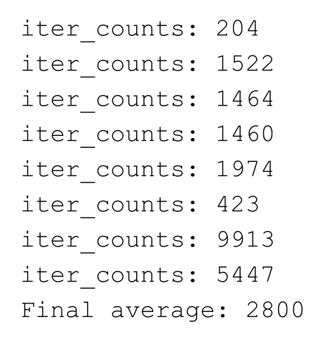{.u53709}
:::

每次执行都会得到不同的结果。需要注意的是，在本次掷硬币实验的代码中，使用Mutex＜T＞保护的是在多个线程之间共享的数据，对于那些在函数中使用的局部变量，默认就是线程安全的。

上面的代码执行是没有问题的，但如果修改一下就可能发生死锁（Deadlock），如代码清单11-26所示。

**代码清单11-26：会产生死锁的代码**

::: center
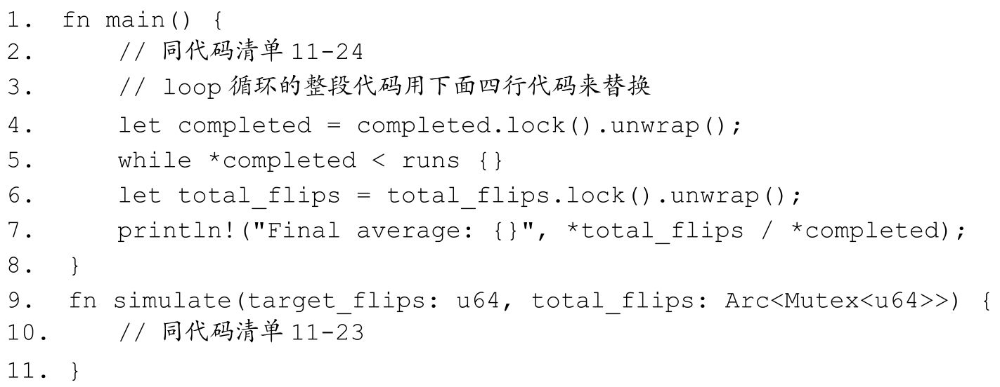{.u53708}
:::

在代码清单11-26中，只对代码清单11-24中的loop循环的整段代码进行了替换，其余部分不变。代码第4～7行和之前loop循环的代码相比，缺少了对完成线程总数和运行线程数的判断以及break。该段代码在Playgroud ^[\[2\]](#text00017.html#n73B60195E9CD4DBFAEFD65AAA278A3DF){#text00017.html#n73B60195E9CD4DBFAEFD65AAA278A3DFs}^ 平台执行时会发生死锁，报出如下错误：

::: center
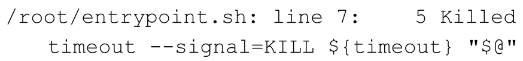{.u53707}
:::

该超时错误是Playground平台的错误，但它是由死锁引起的。这是因为main主线程一直持有对 completed 互斥体的锁，将会导致所有的模拟掷硬币的子线程阻塞。子线程阻塞以后，就无法更新completed的值了，同时，main主线程还在等待子线程完成任务。这就造成了死锁。

Rust虽然可以避免数据竞争，但不能完全避免其他问题，比如死锁，还需要我们在日常开发中多加留意。

**读写锁（RwLock）**

在 std：：sync 模块中还提供了另外一种锁**------读写锁** RwLock＜T＞。RwLock＜T＞和Mutex＜T＞十分类似，不同点在于，RwLock＜T＞对线程进行**读者（Reader）** 和**写者（Writer）** 的区分，不像 Mutex＜T＞只能独占访问。该锁支持多个读线程和一个写线程，其中读线程只允许进行只读访问，而写线程只能进行独占写操作。只要线程没有拿到写锁，RwLock＜T＞就允许任意数量的读线程获得读锁。和Mutex＜T＞一样，RwLock＜T＞也会因为恐慌而"中毒"。

代码清单11-27展示了一个读写锁示例。

**代码清单11-27：读写锁示例**

::: center
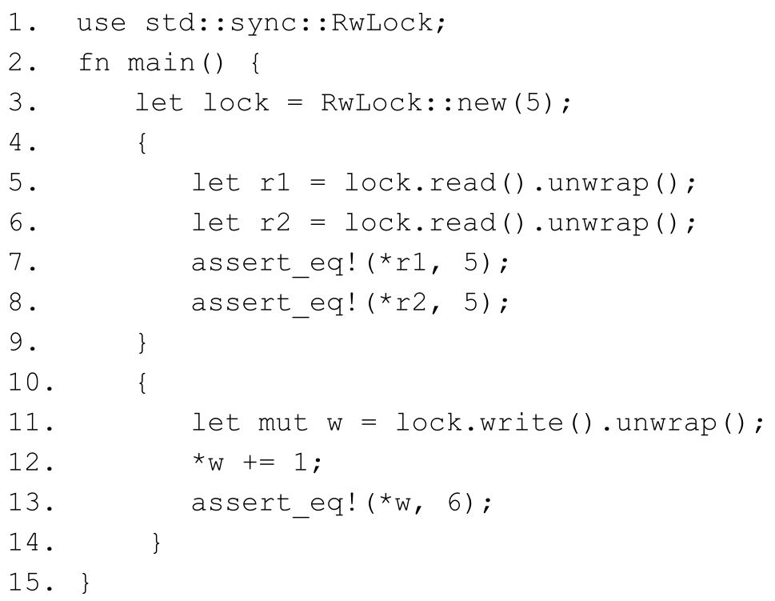{.u53706}
:::

在代码清单11-27中，使用read方法来获取读锁，使用write方法来获取写锁。**读锁和写锁要使用显式作用域块隔离开** ，这样的话，读锁或写锁才能在离开作用域之后自动释放；否则会引起死锁，因为**读锁和写锁不能同时存在** 。

### 11.2.4 屏障和条件变量 {#text00017.html#Aeab20196-f74f-44fe-a2fe-daefaadafbd8 .title-left}

Rust除支持互斥锁和读写锁之外，还支持**屏障（Barrier）** 和**条件变量（Condition Variable）** 同步原语。代码清单11-28展示了一个屏障示例。

**代码清单11-28：屏障示例**

::: center
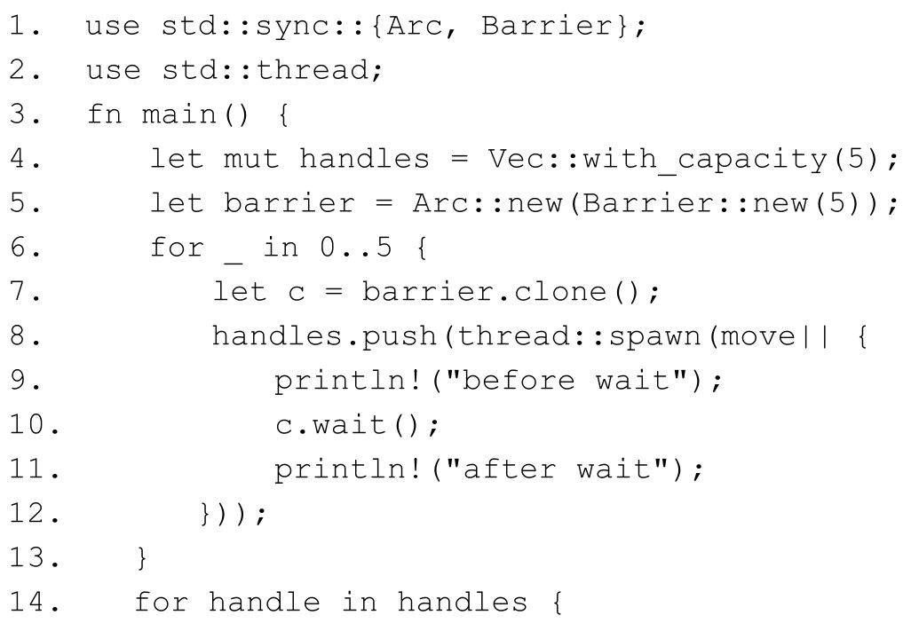{.u53705}
:::

::: center
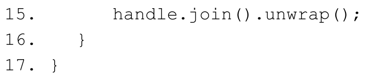{.u53704}
:::

屏障的用法和互斥锁类似，它可以通过wait方法在某个点阻塞全部进入临界区的线程，如代码第10行所示。屏障示例输出结果如代码清单11-29所示。

**代码清单11-29：屏障示例输出结果**

::: center
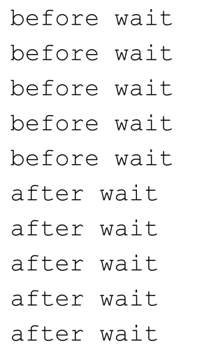{.u53703}
:::

一共5个线程，但输出结果就好像是线程被"一刀从中间切成两半"一样。实际上是wait方法阻塞了这5个线程，等全部线程执行完前半部分操作之后，再开始后半部分操作。屏障一般用于实现线程同步。

**条件变量** 跟屏障有点相似，但它不是阻塞全部线程，而是在满足指定条件之前阻塞某一个得到互斥锁的线程。代码清单11-30展示了一个条件变量示例。

**代码清单11-30：条件变量示例**

::: center
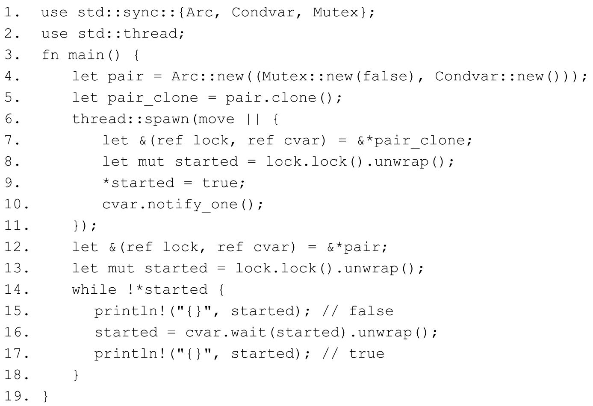{.u53702}
:::

在代码清单 11-30 中，代码第 4 行使用互斥锁和条件变量声明了 Arc＜（Mutex＜bool＞，Condvar）＞类型的变量pair。

代码第6～11行，创建子线程，并在子线程中得到互斥体lock，通过调用lock方法获得互斥锁，然后修改其中包含的 bool 类型数据为 true。在修改完之后，通过调用条件变量的notify_one方法通知主线程。

代码第12～18行，得到互斥体lock的互斥锁，在while循环中通过条件变量的wait方法阻塞当前main主线程，直到子线程中started互斥体中的条件变为true。

这里值得注意的是，**在运行中每个条件变量每次只能和一个互斥体一起使用** 。在有些线程需要获取某个状态成立的情况下，如果单独使用互斥锁会比较浪费系统资源，因为只有多次出入临界区才能获取到某个状态的信息。此时就可以配合使用条件变量，当状态成立时通知互斥体就可以，因此减少了系统资源的浪费。

### 11.2.5 原子类型 {#text00017.html#A2e7d0198-a36b-4489-b956-3cae34bc2d1a .title-left}

互斥锁、读写锁等同步原语确实可以满足基本的线程安全需求，但是有时候使用锁会影响性能，甚至存在死锁之类的风险，因此引入了原子类型。

原子类型内部封装了编程语言和操作系统的"契约"，基于此契约来实现一些自带原子操作的类型，而不需要对其使用锁来保证原子性，从而实现无锁（Lock-Free）并发编程。这个契约就是**多线程内存模型** 。Rust的多线程内存模型借鉴于C++11，它保证了多线程并发的顺序一致性，不会因为底层的各种优化重排行为而失去原子性。

对于开发者来说，如果说编程语言提供的锁机制属于"白盒"操作的话，那么原子类型就属于"黑盒"操作。做个简单的类比。锁机制就相当于自家的厨房，你可以自由使用各种厨具和食材做出想要的美食，整个过程对你是透明的；而原子类型相当于去餐馆，你只能选择菜单上提供的菜品，然后交由餐馆后厨来帮你完成，整个过程是建立在对餐馆信任的基础上的，相信餐馆会遵守"契约"。对于原子类型来说，所谓的"菜单上提供的菜品"就如下面所示的操作：

· **Load** ，表示从一个原子类型内部读取值。

· **Store** ，表示往一个原子类型内部写入值。

· 各种提供原子"读取-修改-写入"的操作。

➢**CAS（Compare-And-Swap）** ，表示比较并交换。

➢**Swap** ，表示原子交换操作。

➢**Compare-Exchange** ，表示比较/交换操作。

➢**Fetch-\*** ，表示fetch_add、fetch_sub、fetch_and和fetch_or等一系列原子的加减或逻辑运算。

➢其他。

通过上面原子类型"对外公开"的一系列原子操作，就可以从外部来控制多线程内存模型内部的顺序一致性，从而不用担心底层各种指令重排会导致线程不安全的问题。

**Rust标准库中提供的原子类型**

在 Rust 标准库 std：：sync：：atomic 模块中暂时提供了 4 个稳定的原子类型，分别是AtomicBool、AtomicIsize、AtomicPtr 和 AtomicUsize，另外还有很多基本的原子类型会逐步稳定。这些原子类型均提供了一系列原子操作。代码清单11-31展示了使用原子类型实现一个简单的**自旋锁（Spinlock）** 。

**代码清单11-31：使用原子类型实现一个简单的自旋锁**

::: center
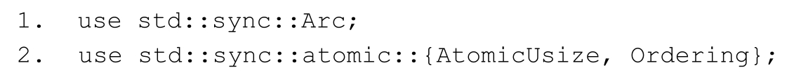{.u53701}
:::

::: center
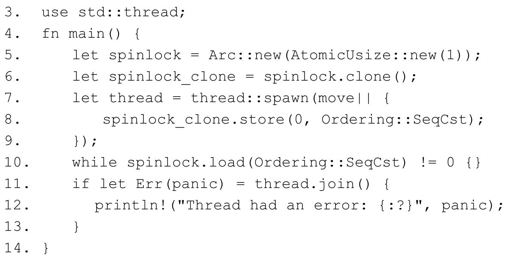{.u53700}
:::

在代码清单11-31中，使用了**AtomicUsize** 原子类型。原子类型本身虽然可以保证原子性，但它自身不提供在多线程中共享的方法，所以需要使用 Arc＜T＞将其跨线程共享，如代码第5行所示。

代码第7～9行，在spawn函数生成的子线程中，通过调用spinlock_clone的store方法，将其内部AtomicUsize类型的值写为0。

代码第10行，在main主线程中使用spinlock的load方法读取其内部原子类型的值，如果不为0，则不停地循环测试锁的状态，直到其状态被置为0为止，这就制造了一个自旋锁。所以，所谓"自旋"就是指在语义上表示这种不断循环获取锁状态的行为。

代码第11～13行，使用join方法阻塞main主线程等待子线程完成，并且做了相应的错误处理。

这里值得注意的是，在使用 store 和 load 这两种原子操作的时候，参数中都出现了Ordering：：SeqCst，并且在代码第2行中也引入了Ordering类型。

**内存顺序**

原子类型除提供基本的原子操作之外，还提供了内存顺序参数。为了帮助理解，可以将该参数类比为在餐馆吃饭时，虽然后厨对用户来说是一个"黑盒"，但可以通过给每个菜品额外添加备注来设置少盐、微辣等偏好要求。同样，每个原子类型虽然对开发者而言是一个"黑盒"，但也可以通过提供内存顺序参数来控制底层线程执行顺序的参数。控制内存顺序实际上就是控制底层线程同步，以便消除底层因为编译器优化或指令重排而可能引发的竞态条件。

在std：：sync：：atomic：：Ordering模块中定义了Rust支持的5种内存顺序，如代码清单11-32所示。

**代码清单11-32：在std：：sync：：atomic：：Ordering模块中定义的5种内容顺序**

::: center
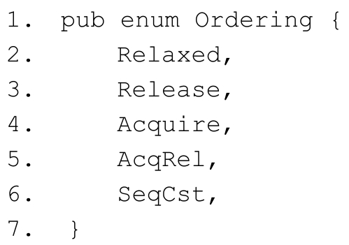{.u53699}
:::

在代码清单11-32中展示的这5种内存顺序，实际上可以归为三大类。

· **排序一致性顺序** ：Ordering：：SeqCst。

· **自由顺序** ：Ordering：：Relaxed。

· **获取-释放顺序** ：Ordering：：Release、Ordering：：Acquire和Ordering：：AcqRel。

Rust支持的5种内存顺序与其底层的LLVM支持的内存顺序是一致的。

**排序一致性顺序** 是最直观、最简单的内存顺序，它规定使用排序一致性顺序，也就是指定 Ordering：：SeqCst 的原子操作，都必须是先存储（store）再加载（load）。这就意味着，多线程环境下，所有的原子写操作都必须在读操作之前完成。通过这种规定，就强行指定了底层多线程的执行顺序，从而保证了多线程中所有操作的全局一致性。但是简单是要付出代价的，这种方式需要对所有的线程进行全局同步，这就存在性能损耗。可以使用下餐馆进行类比，每位客人都存在点单和结账两种状态，使用排序一致性顺序相当于强制要求所有需要结账的客人，必须等所有点单的客户完成之后才可以结账。

**自由顺序** 正好是排序一致性顺序的对立面，顾名思义，它完全不会对线程的顺序进行干涉。也就是说，线程只进行原子操作，但线程之间会存在竞态条件。使用这种内存顺序是比较危险的，只有在明确了解当前使用场景且必须使用它的情况下（比如只有读操作），才可使用自由顺序。

**获取-释放顺序** ，**是除排序一致性顺序之外的优先选择** 。这种内存顺序并不会对全部的线程进行统一强制性的执行顺序要求。在该内存顺序中，store代表释放（Release）语义，而load代表获取（Acquire）语义，通过这两种操作的协作实现线程同步。其中，Ordering：：Release表示使用该顺序的store操作，之前所有的操作对于使用Ordering：：Acquire顺序的load操作都是可见的；反之亦然，使用Ordering：：Acquire顺序的load操作对于使用Ordering：：Release的store操作都是可见的；Ordering：：AcqRel代表读时使用Ordering：：Acquire顺序的load操作，写时使用Ordering：：Release顺序的store操作。

获取-释放顺序虽然不像排序一致性顺序那样对全局线程统一排序，但是它让每个线程都能按固定的顺序执行。同样使用下餐馆进行类比，每位客人都存在点单和结账两种状态，假定客人A的点单由服务员甲负责，但是结账时由服务员乙来进行，不可能发生在结账时服务员乙过来再重新为其点单的情况，对于客人A来说，在餐馆吃饭的流程遵守固定的顺序即可。

在日常开发过程中，如何选择内存顺序呢？这和底层硬件环境也有关系，一般情况下建议使用Ordering：：SeqCst。在需要性能优化的情况下，先调研并发程序运行的硬件环境，再优先选择获取-释放顺序（Ordering：：Release、Ordering：：Acquire和Ordering：：AcqRel按需选择）。除非必要，否则不要使用Ordering：：Relaxed。

### 11.2.6 使用Channel进行线程间通信 {#text00017.html#A66e1019a-e598-45a1-81bf-944250701fe7 .title-left}

坊间流传着一句非常经典的话：**不要通过共享内存来通信，而应该使用通信来共享内存** 。这句话中蕴含着一种古老的编程哲学，那就是消息传递，通过消息传递的手段可以降低由共享内存而产生的耦合。

基于消息通信的并发模型主要有两种：**Actor** 模型和**CSP** 模型。Actor模型的代表语言是Erlang，而CSP模型的代表语言是Golang。这两种并发模型的区别如下：

· 在Actor模型中，主角是Actor，Actor之间直接发送、接收消息；而在CSP模型中，主角是Channel，其并不关注谁发送消息、谁接收消息。

· 在Actor模型中，Actor之间是直接通信的；而在CSP模型中，依靠Channel来通信。

· Actor模型的耦合程度要高于CSP模型，因为CSP模型不关注消息发送者和接收者。

图11-6展示了Actor模型和CSP模型的区别。

::: center
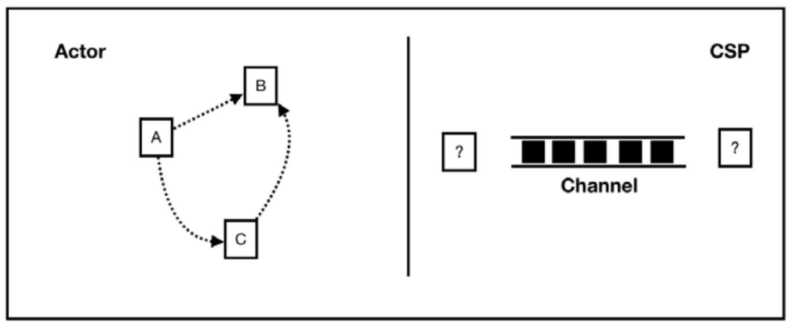{.u53698}

图11-6：Actor模型和CSP模型的区别
:::

这两种模型都存在了很多年，随着Golang语言的出现，CSP模型再次回到开发者的视线中。Rust标准库也选择实现了CSP并发模型。

**CSP并发模型**

CSP（Communicating Sequential Processes，通信顺序进程）是一个精确描述并发的数学理论，基于该理论构建的并发程序不会出现常见的问题，并且可以得到数学证明。CSP对程序中每个阶段所包含对象的行为进行精确的指定和验证，它对并发程序的设计影响深远。

**CSP模型** 的基本构造是**CSP进程** 和**通信通道** 。注意，此处CSP进程是并发模型中的概念，不是操作系统中的进程。在CSP中每个事件都是进程，进程之间没有直接交互，只能通过通信通道来交互。CSP进程通常是匿名的，通信通道传递消息通常使用同步方式。

CSP理论在很多语言中得以实现，包括Java、Golang和Rust等。在Rust的实现中，线程就是CSP进程，而通信通道就是Channel。在Rust标准库的std：：sync：：mpsc模块中为线程提供了 Channel 机制，其具体实现实际上是一个**多生产者单消费者** （Multi-Producer-Single-Consumer，MPSC）的先进先出（FIFO）队列。线程通过 Channel 进行通信，从而可以实现无锁并发。

**生产者消费者模式与Channel**

生产者消费者模式是指通过一个中间层来解决数据生产者和消费者之间的耦合问题。生产者和消费者之间不直接通信，而是分别与中间层进行通信。生产者向中间层生产数据，消费者从中间层获取数据进行消费，这样就巧妙地平衡了生产者和消费者对数据的处理能力。

一般情况下，使用一个 FIFO 队列来充当中间层。在多线程环境下，生产者就是生产数据的线程，消费者就是消费数据的线程。Rust 实现的是多生产者单消费者模式，如图 11-7所示。

::: center
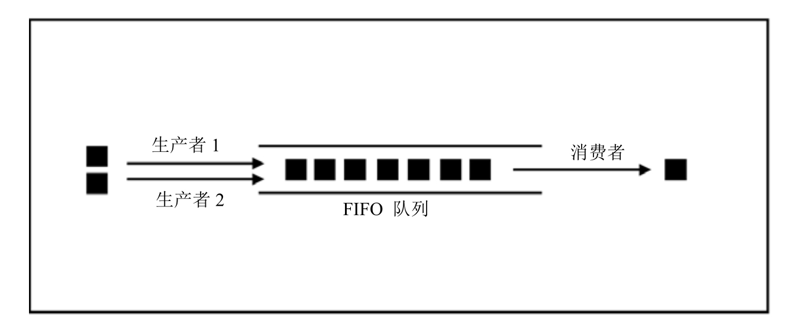{.u53697}

图11-7：多生产者单消费者模式示意图
:::

这个FIFO队列就是CSP模型中Channel的具体实现。在标准库std：：sync：：mpsc模块中定义了以下三种类型的CSP进程：

· **Sender** ，用于发送异步消息。

· **SyncSender** ，用于发送同步消息。

· **Receiver** ，用于接收消息。

Rust中的Channel包括两种类型：

· **异步无界Channel** ，对应于channel函数，会返回**（Sender，Receiver）** 元组。该Channel发送消息是异步的，并且不会阻塞。**无界** ，是指在理论上缓冲区是无限的。

· **同步有界Channel** ，对应于sync_channel函数，会返回**（SyncSender，Receiver）** 元组。该Channel可以预分配具有固定大小的缓冲区，并且发送消息是同步的，当缓冲区满时会阻塞消息发送，直到有可用的缓冲空间。当该Channel缓冲区大小为0时，就会变成一个"点"，在这种情况下，Sender和Receiver之间的消息传递是原子操作。

Channel之间的发送或接收操作都会返回一个Result类型用于错误处理。当Channel发生意外时会返回Err，所以通常使用unwrap在线程间传播错误，及早发现问题。

代码清单11-33展示了两个线程之间使用Channel通信的简单示例。

**代码清单11-33：两个线程之间使用Channel通信的简单示例**

::: center
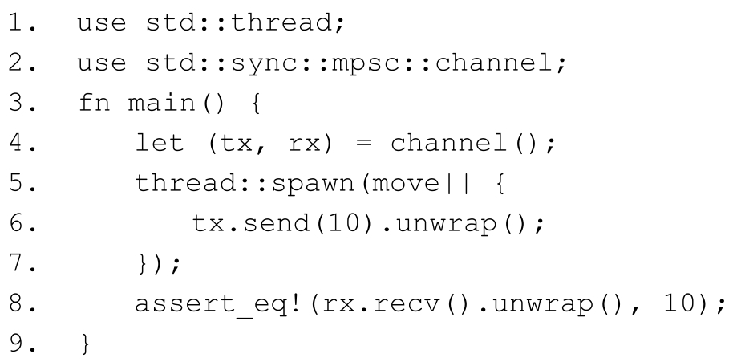{.u53696}
:::

在代码清单11-33中，代码第4行，使用channel函数创建了一个用于线程间通信的通道，返回的元组**（tx，rx）** ^[\[3\]](#text00017.html#n38DB8739EDE14128824122BCBAAFDF3E){#text00017.html#n38DB8739EDE14128824122BCBAAFDF3Es}^ 称作通道的两端（Port）**------发送端** 和**接收端** 。

代码第5～7行，使用spawn生成子线程，并在该子线程中使用tx端口调用send方法向Channel中发送消息。

代码第8行，在main主线程中使用rx端口调用recv方法接收消息。这样就简单地使用Channel实现了线程间通信。

像代码清单11-33这种只有两个线程通信的Channel，叫作**流通道（Streaming Channel）** 。在流通道内部，实际上Rust会默认使用**单生产者单消费者队列（SPSC）** 来提升性能。

代码清单11-34展示了多生产者使用Channel通信的示例。

**代码清单11-34：多生产者使用Channel通信示例**

::: center
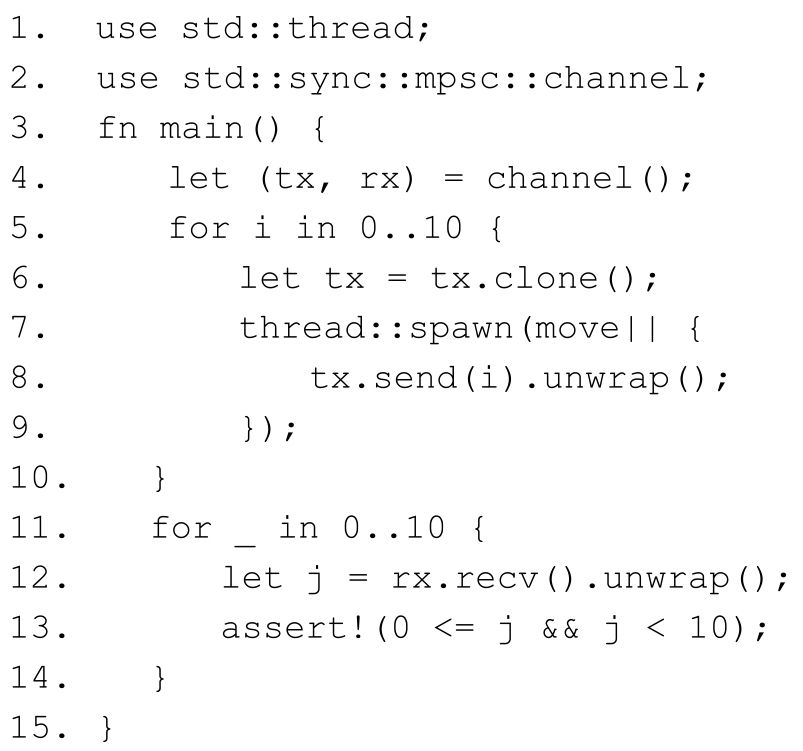{.u53695}
:::

在代码清单11-34中，代码第5～10行，在for循环中生成了10个子线程，同时，也将发送端tx拷贝了10次，于是就产生了10个生产者。

代码第11～14行，同样在for循环中，使用接收端rx消费10次数据。

像代码清单11-34这种多生产者单消费者的Channel，叫作**共享通道（Sharing Channel）** 。

上面的示例均为异步Channel，代码清单11-35展示了使用同步Channel通信的示例。

**代码清单11-35：使用同步Channel通信示例**

::: center
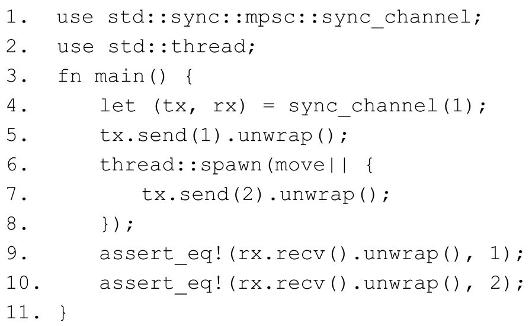{.u53694}
:::

在代码清单11-35中，代码第4行，使用sync_channel函数创建了一个同步Channel，并将其缓冲区大小设置为1。

代码第5行，使用发送端tx的send方法往同步Channel中发送消息。

代码第 6～8 行，在 spawn 生成的子线程中再次使用发送端 tx 发送消息。但是因为同步Channel的缓冲区大小只为1，所以这次发送的消息在上一条消息被消费之前会一直阻塞，直到Channel中缓冲区有可用空间才会继续发送。

代码第9行和第10行，使用接收端rx来消费Channel中的数据。如果rx未接收到数据，则会发生恐慌。

**Channel死锁**

并不是没有锁就不会发生死锁行为。请看代码清单11-36。

**代码清单11-36：会发生死锁的Channel示例**

::: center
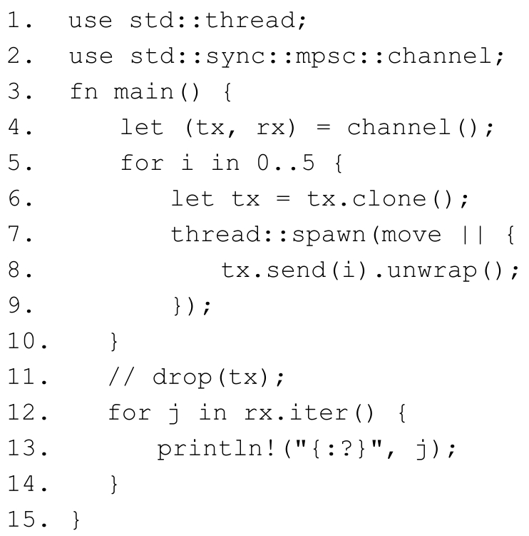{.u53693}
:::

在代码清单11-36中，调用了rx的iter方法得到一个迭代器。输出结果如下：

::: center
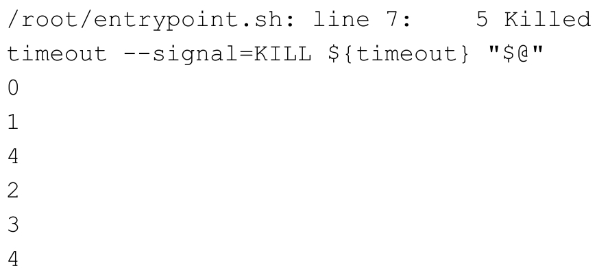{.u53692}
:::

该输出结果是在Playground平台编译执行后得到的，除正常打印从0到4之外，还有一个entrypoint.sh脚本杀掉超时进程的提示。这说明代码清单11-36在执行过程中会发生死锁。

在本地编译该段代码就会发现，在main主线程输出从0到4结果之后，还会一直阻塞main主线程而不退出。这是因为rx的iter方法会阻塞线程，只要tx还没有被析构，该迭代器就会一直等待新的消息，只有tx 被析构之后，迭代器才能返回None，从而结束迭代退出main 主线程。然而，这里 tx 并未被析构，所以迭代器依旧等待，tx 也没有发送新的消息，从而造成了一种死锁状态。要解决此问题也很简单，只需要显式调用drop方法将tx析构就可以，去掉代码清单11-36中第11行的注释即可。

再来看另外一个示例，如代码清单11-37所示。

**代码清单11-37：不存在死锁的Channel示例**

::: center
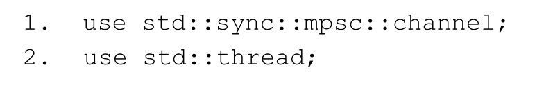{.u53691}
:::

::: center
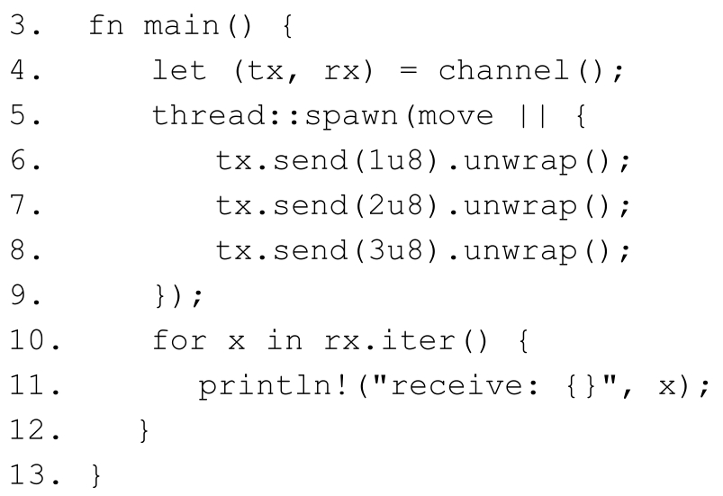{.u53690}
:::

在代码清单11-37中，也通过调用rx的iter方法获取迭代器来消费tx发送的消息，但是该段代码会正常编译执行，不会发生死锁。这是为什么呢？注意，在代码清单11-36中创建的是**共享通道** ，而在代码清单 11-37 中创建的是**流通道** ，也就是多个 Sender 和单个 Sender的区别。发送端tx在离开spawn作用域之后会调用析构函数drop，在drop中会调用tx内部的drop_channel方法来**断开** （DISCONNECT）Channel。当Channel是共享通道时，在for循环中调用tx的clone方法；当Channel是流通道时，tx在离开子线程作用域之后通过析构函数就可以断开 Channel。之所以存在这样的区别，在于共享通道和流通道底层的构造有所不同。流通道底层自动使用 SPSC（单生产者单消费者）队列来优化性能，因为流通道只是用于两个线程之间的通信。但是共享通道底层使用的还是MPSC（多生产者单消费者）队列，在析构行为上比流通道略为复杂。所以在通常的开发过程中，要注意这两类Channel的区别。

在底层不管是SPSC还是MPSC队列，甚至是同步Channel使用的内置独立的队列，都是**基于链表实现的** 。使用链表的好处就是可以提升性能。在生产数据时，只需要在链表头部添加新的元素即可；在消费数据时，只需要从链表尾部取元素即可。

**利用Channel模拟工作量证明**

接下来，我们使用Channel来解决一个来自数字货币领域的问题。众所周知，比特币开创了数字货币时代，它不仅仅革新了金融领域，更重要的是它带来了区块链的概念。区块链采用密码学的方法来保证已有的数据不可篡改，采用共识算法为新增的数据达成共识，这完全是与生俱来的且去中心化的"公信力"。而信任是人类社会一切交易的前提，于是，这种借助于密码学和算法取得信任的区块链技术，正逐渐成为当前互联网上各种商业信用体的基础设施。

在比特币中，最流行的一个词就是"挖矿"。这个词极具诱惑性，听上去就像是在"挖金矿"一样。但是当了解了其背后的技术机制之后，就不会产生这种幻想了。实际上，"挖矿"就是比特币和以太坊中的一种共识机制，用专业术语来说，就是指**工作量证明** （Proof of Work，PoW）。

工作量证明机制其实不是比特币专有的，其存在已经很多年了，最早被用于防范拒绝服务攻击等领域。下面简单用一个示例来说明**工作量证明机制的基本原理** 。

· 给定一个字符串或数字，比如42。

· 给定一个工作目标：找到另外一个数字，要求该数字和42相乘后的结果，经过Hash函数处理后，满足得到的加密字串以"00000"开头。可以通过对"00000"增加或减少0的个数来控制查找的难度。

· 为了找到这个数字，需要从数字1开始递增查找，直到找到满足条件的数字。

要找到这个数字，就需要大量的计算。在这个示例中，数学期望的计算次数就是"工作量"，重复多次验证是否满足条件就是"工作量证明"，这是一个符合统计学规律的概率事件。当然，比特币和以太坊中真实的工作量证明算法比这个示例复杂一些，但原理是相似的。

现在，使用Rust来实现上述示例描述的模拟工作量证明过程。**代码结构设计如下** ：

· 使用多线程来加速查找过程。

· 将查找到的符合条件的数字和加密字串通过Channel传递到另外一个线程中并输出。

工作量证明过程代码结构示意图如图11-8所示。

::: center
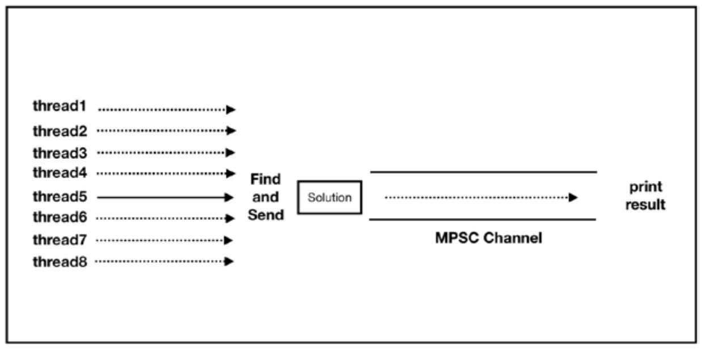{.u53689}

图11-8：工作量证明过程代码结构示意图
:::

为了简单起见，将整个代码都写到同一个文件中。接下来，使用**cargo new\--bin pow** 创建一个新项目。在实现此过程中，需要用到两个第三方包------用来求Hash值的rust-crypto和用来方便迭代的itertools。首先在Cargo.toml文件中添加具体的依赖，如代码清单11-38所示。

**代码清单11-38：在Cargo.toml文件中添加rust-crypto和itertools依赖**

::: center
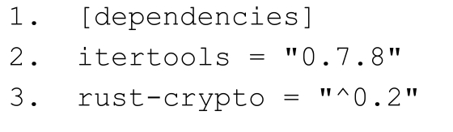{.u53688}
:::

然后在mian.rs文件中引入这两个包，如代码清单11-39所示。

**代码清单11-39：在main.rs文件中引入rust-crypto和itertools**

::: center
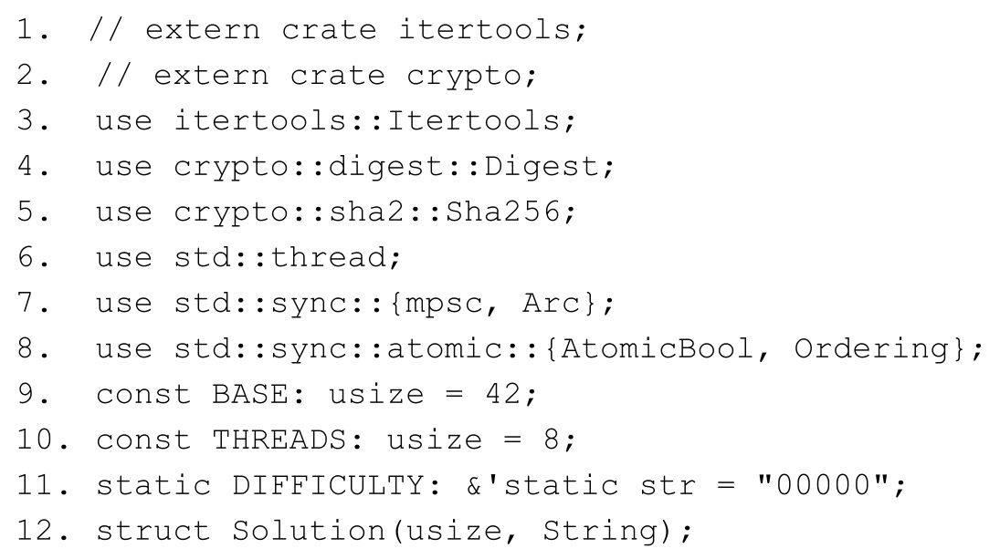{.u53687}
:::

在代码清单11-39中，代码第1～5行，引入了rust-crypto和itertools中所需要的模块，此处使用Sha256算法。在Rust 2018中，代码第1行和第2行可省略。

代码第6～8行，分别引入了线程、MPSC、Arc和原子类型AtomicBool，这些都是编写该并发程序时所需要的基本工具。

代码第9行和第10行，分别定义了常量BASE和THREADS，用来存储工作量证明示例中基础的值42和多线程的线程数，方便修改和复用。

代码第11行，定义了静态全局字符串字面量DIFFICULTY，可以随时通过修改"0"的位数来调整难度，"0"越多难度越高，也就是说，查找过程时间越长。

代码第12行，定义了Solution（usize，String）元组结构体，用来记录最终找到的数字及其加密后的结果。

接下来实现一个验证函数，用于验证所找到的数字是否满足条件，如代码清单11-40所示。

**代码清单11-40：在main.rs中实现验证函数üerify**

::: center
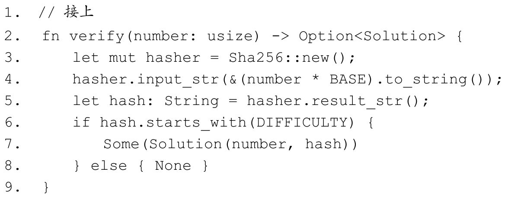{.u53686}
:::

代码清单11-40中的验证函数很简单，它接收一个usize类型的数字number，返回一个Option＜Solution＞类型的值，因为验证的结果有两种可能：解决和未解决。

代码第3～5 行，使用rust-crypto 包提供的 Sha256 类型来生成number 和BASE 乘积的Hash值hash，并将其转换为String字符串。

代码第6～8行，使用String类型中提供的starts_with方法来判断hash是否以DIFFICULTY中指定的字符串开头。如果是，则返回Some（Solution（number，hash））；如果不是，就返回None。

接下来实现查找函数，如代码清单11-41所示。

**代码清单11-41：在main.rs中实现查找函数find**

::: center
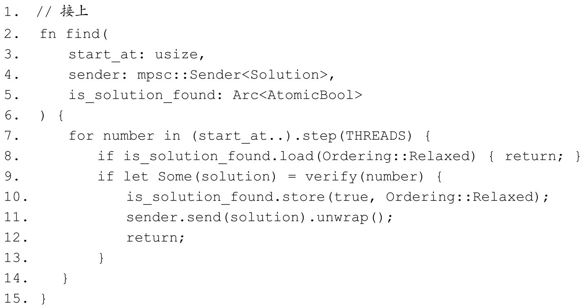{.u53685}
:::

在代码清单11-41 中，find 函数一共需要三个参数。第一个参数**start_at** 是计算的起始数字。第二个参数**sender** 是Channel的发送端，其类型是mpsc：：Sender＜Solution＞，因为需要将Solution类型的值通过Channel发送给接收线程。第三个参数**is_solution_found** 用来记录满足条件的Solution是否被找到，它是一个全局性变量，被多个线程操作，应该使用原子类型，所以将其设置为Arc＜AtomicBool＞。

代码第7行，开启一个无限递增的循环，以start_at为起点，以THREADS为步长，直到找到那个满足条件的数字。以THREADS为步长，是为了将查找的自然数进行分组，以便于平均划分多线程任务。

代码第8行，使用load方法读取原子类型is_solution_found中的值，如果已经设置为true，则从循环中提前返回，否则就继续执行。此处设置内存顺序为**自由顺序（Ordering：：Relaxed）** 是安全的，因为底层的线程执行顺序并不会影响到find函数的结果，同时也提升了原子操作的性能。

代码第9～13行，使用verify函数验证循环中每个number的值是否满足条件。如果满足，则使用store方法将is_solution_found的值设置为true，此处内存顺序同样使用自由顺序。然后将查找到的值 solution 通过 Channel 发送出去。如果完成了这些工作，则从当前循环中提前返回，否则继续循环。

对多线程任务的平均划分如图11-9所示。

::: center
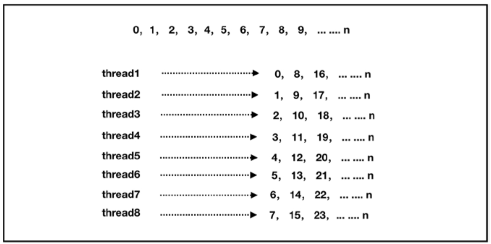{.u53684}

图11-9：多线程任务平均划分示意图
:::

从图11-9中可以看出，一共8个线程，所以每个线程按8的步长进行迭代，就可以将任务平均划分到这8个线程中。

最后，完善mian函数，如代码清单11-42所示。

**代码清单11-42：在main.rs中完善main函数**

::: center
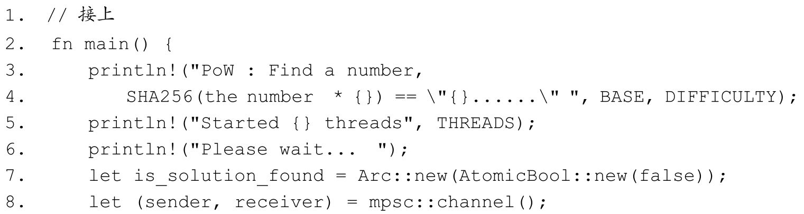{.u53683}
:::

::: center
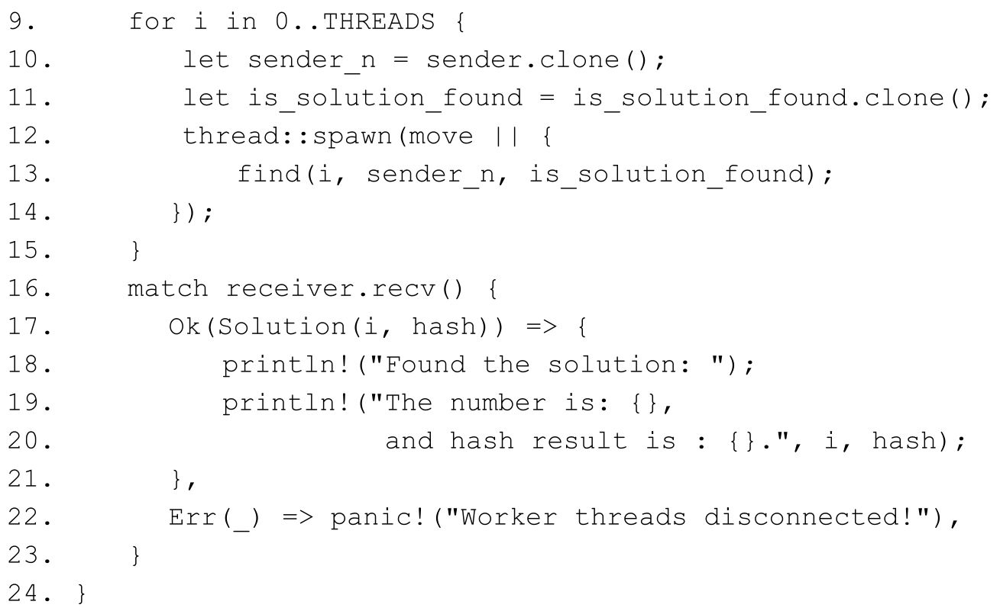{.u53682}
:::

在代码清单11-42中，首先打印两条提示信息，包括此次工作量证明示例中的基数、难度字串和线程数，如代码第3～6行所示。

代码第 7 行和第 8 行，分别声明了 is_solution_found 原子类型和 Channel，此处is_solution_found默认设置为false。

代码第9～15行，按THREADS指定的线程数生成相应的子线程，并且在子线程中执行find任务。注意此处，在find函数内部已经通过设置循环步长完成了多线程任务的平均划分。

代码第16～23行，通过调用receiver的recv方法来阻塞当前main主线程，等待接收最终满足条件的值。如果接收到了值，则将其打印出来；如果出错，则制造恐慌来报告查找失败。

至此，整个代码实现完毕，只需要在此项目的根目录下执行cargo run命令即可运行。输出结果如代码清单11-43所示。

**代码清单11-43：工作量证明示例输出结果**

::: center
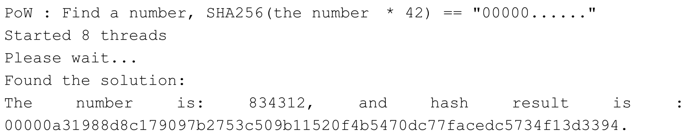{.u53477}
:::

在整个实现过程中需要注意以下几个地方：

· 如何正确地分离生产线程和消费线程？

· 如何正确地划分并发任务？

· 如何正确地识别临界区，以及如何正确地使用原子类型及其内存顺序？

### 11.2.7 内部可变性探究 {#text00017.html#A122001a3-e396-457f-b581-f5170efa0c7d .title-left}

在Rust提供的并发编程工具中，基本都支持内部可变性，在行为上与Cell＜T＞、RefCell＜T＞比较相似。代码清单11-44展示了Mutex的源码实现。

**代码清单11-44：Mutex源码实现**

::: center
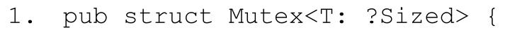{.u53681}
:::

::: center
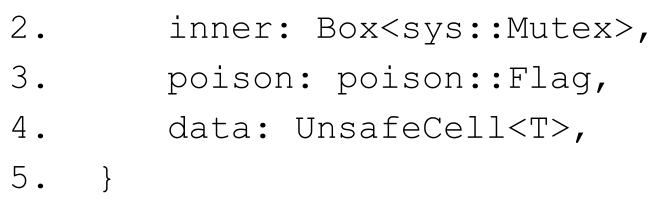{.u53680}
:::

从代码清单11-44中可以看出，Mutex＜T＞有三个成员字段，即inner、poison和data。其中 inner 字段包装了用于调用底层操作系统 API 的 sys：：Mutex；poison 用于标记该锁是否已"中毒"；data 是锁包含的数据，使用了 **UnsafeCell＜T＞** 类型。由此来看，内部可变性是由UnsafeCell＜T＞提供的。

继续查看 Cell＜T＞、RefCell＜T＞、RwLock＜T＞锁、原子类型以及 mpsc：：Sender 等的源码实现，如代码清单11-45所示。

**代码清单11-45：Cell＜T＞、RefCell＜T＞、RwLock＜T＞等源码实现**

::: center
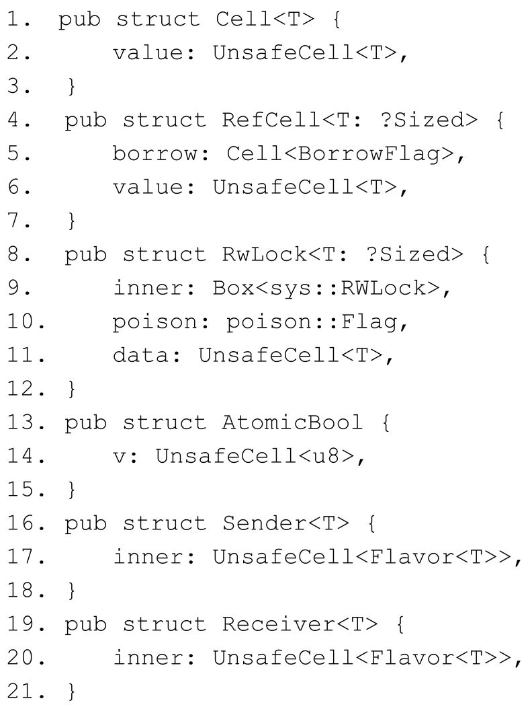{.u53679}
:::

从代码清单 11-45 中可以看出，这些拥有内部可变性的结构体都是基于 UnsafeCell＜T＞实现的。继续查看UnsafeCell＜T＞的源码实现，如代码清单11-46所示。

**代码清单11-46：UnsafeCell＜T＞源码实现**

::: center
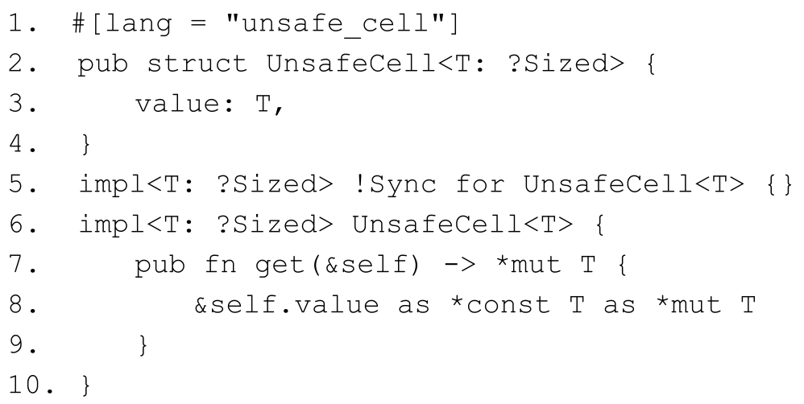{.u53678}
:::

在代码清单11-46中，UnsafeCell＜T＞只是一个泛型结构体，它属于**语言项（Lang Item）** ，所以编译器会对它进行某种特殊的照顾。

代码第5行，为UnsafeCell＜T＞实现了！Sync，因为单独使用该类型并不能保证线程安全。

UnsafeCell＜T＞的特别之处在于第 7 行和第 8 行实现的 get 方法，通过该方法可以将UnsafeCell＜T＞中T类型的不可变借用转换为可变的原生指针（Raw Pointer）。在get方法内部，通过as将T类型的不可变借用先转换为**\*counst T** ，再转换成**\*mut T** 。

一般来说，在Rust中将不可变借用转换为可变借用属于未定义行为，编译器不允许开发者随意对这两种引用进行相互转换。但是，UnsafeCell＜T＞是唯一的例外。这也是UnsafeCell＜T＞属于语言项的原因，它属于 Rust 中将不可变转换为可变的唯一合法渠道，对于使用了UnsafeCell＜T＞的类型，编译器会关闭相关的检查。

因此，在上述各种拥有内部可变性的容器内部均使用了 UnsafeCell＜T＞，不会违反 Rust的编译器安全检查。

### 11.2.8 线程池 {#text00017.html#A4d5e01a5-0d3c-43be-ac47-ef1c2e51fa29 .title-left}

在实际应用中，多线程并发更常用的方式是使用线程池。线程虽然比进程轻量，但如果每次处理任务都要重新创建线程的话，就会导致线程过多，从而带来更多的创建和调度的开销。采用线程池的方式，不仅可以实现对线程的复用，避免多次创建、销毁线程的开销，而且还能保证内核可以被充分利用。

实现一个线程池需要考虑以下几点。

· 工作线程：用于处理具体任务的线程。

· 线程池初始化：即通过设置参数指定线程池的初始栈大小、名称、工作线程数等。

· 待处理任务的存储队列：工作线程数是有限的，对于来不及处理的任务，需要暂时保存到一个队列中。

· 线程池管理：即管理线程池中的任务数和工作线程的状态。比如，在没有空闲工作线程时则需要等待，或者在需要时阻塞主线程等待所有任务执行完毕。

接下来参考第三方包**threadpool** ^[\[4\]](#text00017.html#nE840A484EA9B4DA885B690B2279B2A1C){#text00017.html#nE840A484EA9B4DA885B690B2279B2A1Cs}^ 的实现，来说明如何使用Rust标准库中提供的并发工具来实现一个简单的线程池。

· 线程池：通过创建一个线程池结构体来控制线程池的初始化。为此结构体实现Builder模式，定制初始化参数，并且实现生成工作线程的方法。

· 待处理任务队列：使用无界队列mpsc：：channel，缓存待处理的任务。

· 线程池管理：使用原子类型对工作任务状态进行计数，达到管理的目的。

这个简单的线程池模型示意图如图11-10所示。

::: center
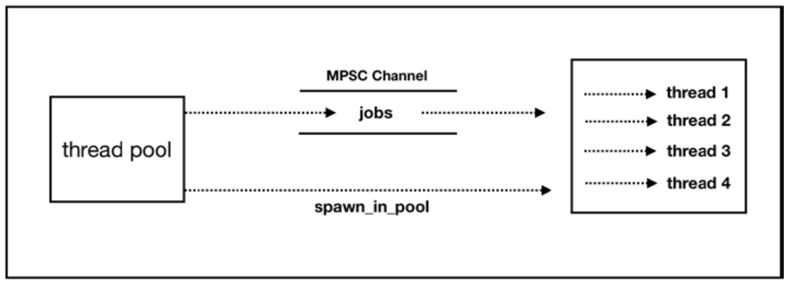{.u53677}

图11-10：简单的线程池模型示意图
:::

使用**cargo new\--bin thread_pool** 创建一个新项目thread_pool，在Cargo.toml文件中添加第三方包num_cpus的依赖，如代码清单11-47所示。

**代码清单11-47：在Cargo.toml中添加num_cpus依赖**

::: center
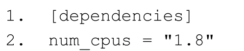{.u53676}
:::

在代码清单11-47中添加的num_cpus依赖可以识别当前运行的计算机中CPU的个数，将其作为线程池默认的工作线程数。

在main.rs文件中添加初始化代码，如代码清单11-48所示。

**代码清单11-48：在main.rs中添加初始化代码**

::: center
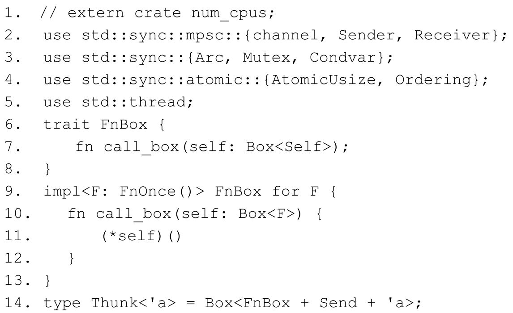{.u53675}
:::

在代码清单11-48中引入了num_cpus包。同时，在代码第2行引入了channel、Sender和Receiver，随后会使用它们来管理工作任务。在代码第3行和第4行引入了Arc、Mutex、Condvar和AtomicUsize，随后会用到。在代码第5行引入了thread模块，需要用它来生成具体的工作线程。

值得注意的是代码第6～13行，定义了FnBox trait，并为FnOnce的闭包实现了该trait，在 call_box 方法中执行闭包调用。这样做是为了避免使用**＃！\[feature（fnbox）\]** 特性，可以回想一下第6章的内容。

代码第14行，使用type定义了一个类型别名，这是为了简化代码。

为了让线程池中维护的线程可以共享相同的数据，还需要一个共享数据的结构体，如代码清单11-49所示。

**代码清单11-49：在main.rs中添加ThreadPoolSharedData结构体**

::: center
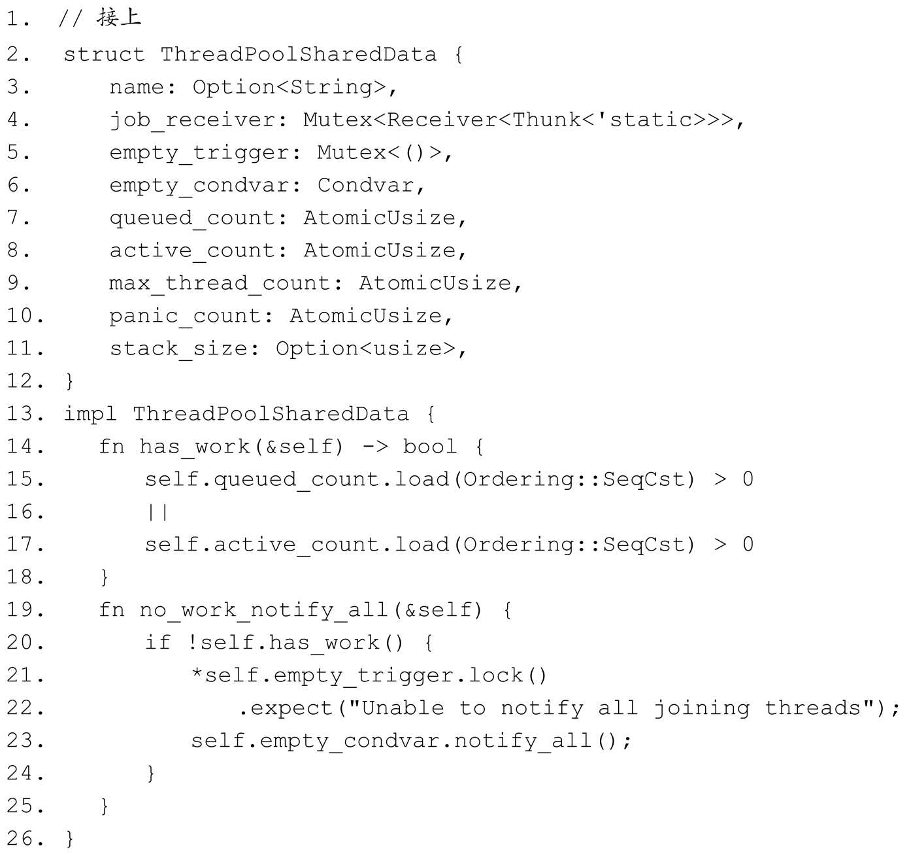{.u53674}
:::

在代码清单11-49中，定义了ThreadPoolSharedData结构体，如代码第2～12行所示，其中字段的含义如下：

· **name** ，用于标记线程的名称，线程池内的线程都用统一的名称。该值可有可无，所以使用Option＜String＞类型。

· **job_receiver** ，用于存储从 Channel 中接收任务的接收端（rx），此处为Mutex＜Receiver＜Thunk＜＇static＞＞＞类型，是因为在多线程环境下，Reveiver＜Thunk＜＇static＞＞类型不能被安全共享，为了线程安全，必须要加锁。此处Thunk＜＇static＞代表Box＜FnBox+Send+＇static＞，要执行的具体任务均为闭包。

· **empty_trigger** 和**empty_condvar** ，分别是Mutex＜（）＞和Condvar，代表空锁和空的条件变量，用于实现线程池的join方法，条件变量需要配合互斥锁才能使用。

· **queued_count** 和**active_count** ，代表线程池中的总队列数和正在执行任务的工作线程数。因为是多线程操作，所以使用原子类型AtomicUsize来保证原子性。

· **max_thread_count** ，代表线程池允许的最大工作线程数。

· **panic_count** ，用于记录线程池中发生恐慌的工作线程数，同样使用原子类型AtomicUsize来保证原子性。

· **stack_size** ，用于设置工作线程栈大小，可有可无，所以为 Option＜usize＞类型。如果不设置栈大小，则默认为8MB。

代码第14～18行，为ThreadPoolSharedData实现了has_work方法，当queued_count大于0或active_count大于0时，表示线程池处于正常工作状态。

代码第19～25行，实现了no_work_notify_all方法，通过has_work方法判断线程池的工作状态。如果线程池中的工作线程处于闲置状态，则代表所有任务均以完成，那么通过empty_trigger拿到锁，再调用empty_condvar的notify_all方法来通知所有阻塞的线程解除阻塞状态。该方法用于配合线程池的join方法。

接下来需要一个线程池结构体，如代码清单11-50所示。

**代码清单11-50：在main.rs中添加ThreadPool结构体**

::: center
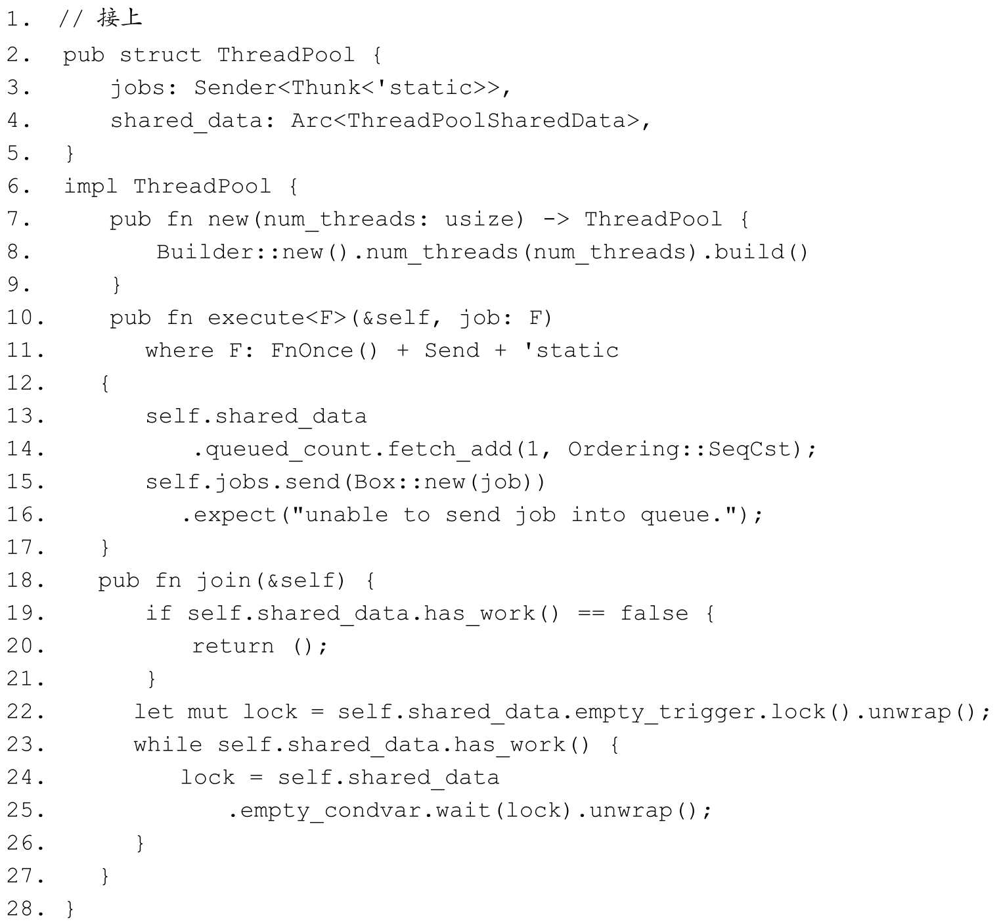{.u53673}
:::

在代码清单11-50中，定义了ThreadPool结构体，如代码第2～5行所示，其包含如下两个字段：

· **jobs** ，用于存储 Channel 发送端（tx），使用它给工作线程发送具体的任务，为Sender＜Thunk＜＇static＞＞类型。

· **shared_data** ，记录工作线程共享的数据，为Arc＜ThreadPoolSharedData＞类型。

代码第7～9行，实现了new方法，用于初始化线程池。在该方法中使用构建者模式来定制生成工作线程。

代码第 10～17 行，实现了 execute 方法，用于将任务添加到 Channel 队列中，同时使用AtomicUsize的fetch_add方法将queued_count累加一次。可以通过此方法向队列中多次添加任务。

代码第18～27行，实现了join方法，该方法用于在需要时阻塞主线程等待线程池中的所有任务执行完毕。代码第19～21行，判断线程池如果处于闲置状态，则提前返回。代码第22行，通过shared_data中的empty_trigger来获得互斥锁。在代码第23～26行的while循环中，如果线程池中的工作线程一直处于正常工作状态，则调用empty_condvar的wait方法来阻塞当前线程，直到获得解除阻塞的通知（如notify_all）。

接下来创建初始化线程池需要用到的Builder结构体和build方法，如代码清单11-51所示。

**代码清单11-51：在main.rs中添加Builder结构体及其方法**

::: center
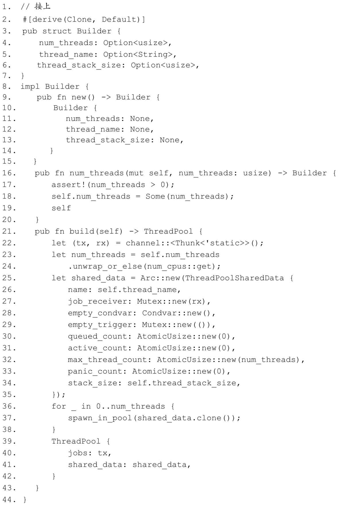{.u53672}
:::

在代码清单11-51中，定义了Builder结构体，其包含三个字段：num_threads、thread_name和thread_stack_size，分别表示要创建的工作线程数、线程名称和线程栈大小，均为可选类型，如代码第3～7行所示。

代码第9～15行，为Builder结构体实现了new方法，生成一个字段初始值均为None的Builder实例。

代码第16～20行，实现了num_threads方法，通过参数可以设置工作线程数。

代码第21～43行，实现了build方法，用于初始化最终的线程池。代码第22行，使用channel函数创建一个无界队列。代码第23行和第24行，通过num_threads得到工作线程数，如果没有设置，则默认使用num_cpus：：get方法返回当前计算机的CPU核心数。代码第25～35行，初始化了一个ThreadPoolSharedData实例，并将其放到Arc中。代码第36～38行，通过迭代num_threads次来生成相应的工作线程，其中spawn_in_pool函数用于生成工作线程。代码第39～42行，返回最终初始化完成的ThreadPool实例。

代码清单11-52展示了spawn_in_pool函数的具体实现。

**代码清单11-52：spawn_in_pool函数的具体实现**

::: center
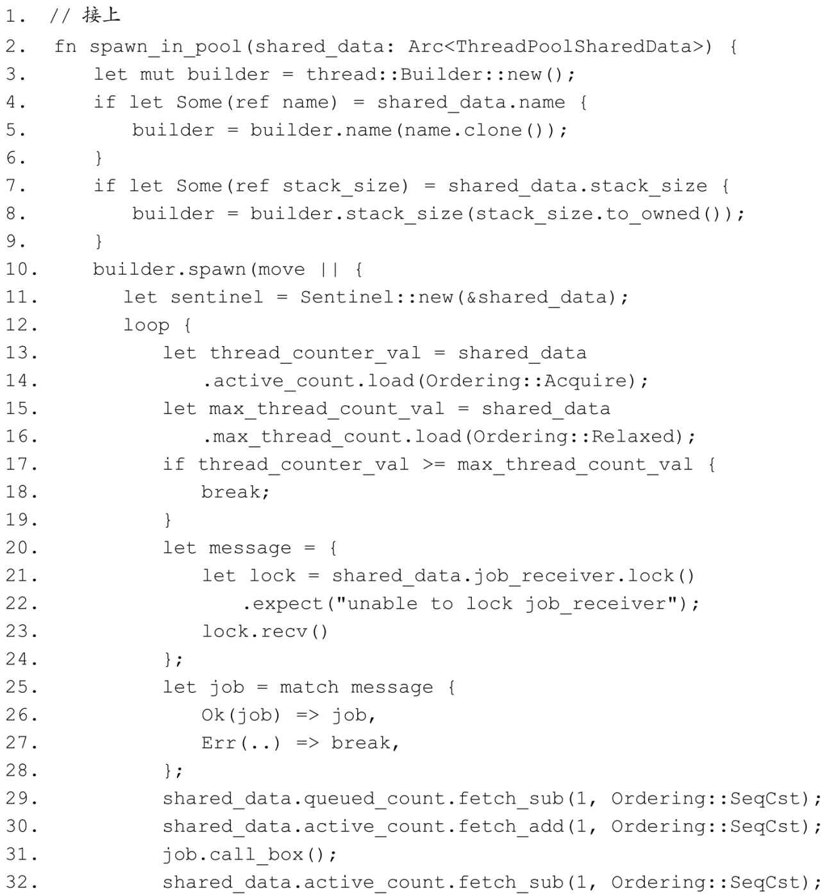{.u53671}
:::

::: center
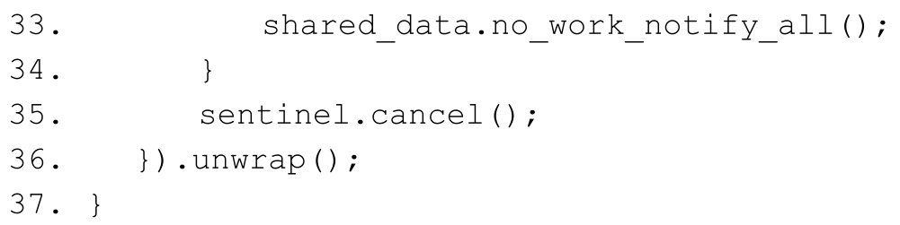{.u53670}
:::

在代码清单11-52中，第3～9行，通过shared_data中存储的name和stack_size来定制生成线程。注意此处使用的是 thread 模块的 Builder：：new 方法，而非当前 main.rs 中定义的Builder。

代码第10～36行，使用builder.spawn方法来创建工作线程。

代码第11行中的Sentinel结构体用来对具体的工作线程进行监控。

代码第12～34行为一个loop循环，用于阻塞当前工作线程从任务队列中取具体的任务来执行。代码第13行和第14行，得到当前任务队列中的active_count，注意这里load方法使用的内存顺序为Ordering：：Acquire，代表load方法能看到之前所有线程对active_count所做的修改。而代码第 15 行和第 16 行，获取 max_thread_count 数目使用的内存顺序为Ordering：：Relaxed，这是因为max_thread_count的值不会被底层线程读取顺序影响到，使用自由顺序可以提升性能。

代码第17～19行，如果工作队列数大于最大的线程数，则退出此循环。

代码第20～24行，先得到job_receiver的锁，然后调用recv方法从队列中获取任务。但此时并未执行任务。

代码第25～28行，通过match匹配从message中得到具体的闭包任务，当message是错误类型时则跳出循环。

代码第29行和第30行，将shared_data中的queued_count减1，因为已经从任务队列中取到了一个任务，那么任务队列中的任务数就会减1。将active_count通过fetch_add加1，因为当前工作线程即将对该任务进行处理，那么正在执行任务的工作线程数就应该加1。

代码第31行，通过调用job的call_box方法来执行具体的任务。

代码第32行，在执行完任务之后，将active_count减1，表示该工作线程随时可以接受下一个任务。

代码第 33 行，通过调用 shared_data 的 no_work_notify_all 方法，来通知使用条件变量wait方法阻塞的线程在线程池中的任务执行完毕后解除阻塞。

代码第35行，使用cancel方法设置sentinel实例的状态，表示该线程正常执行完所有任务。

代码清单11-53展示了Sentinel的具体定义。

**代码清单11-53：Sentinel的具体定义**

::: center
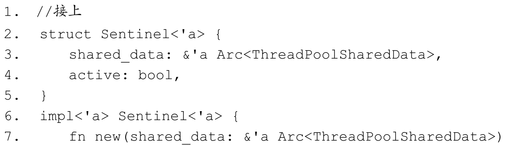{.u53669}
:::

::: center
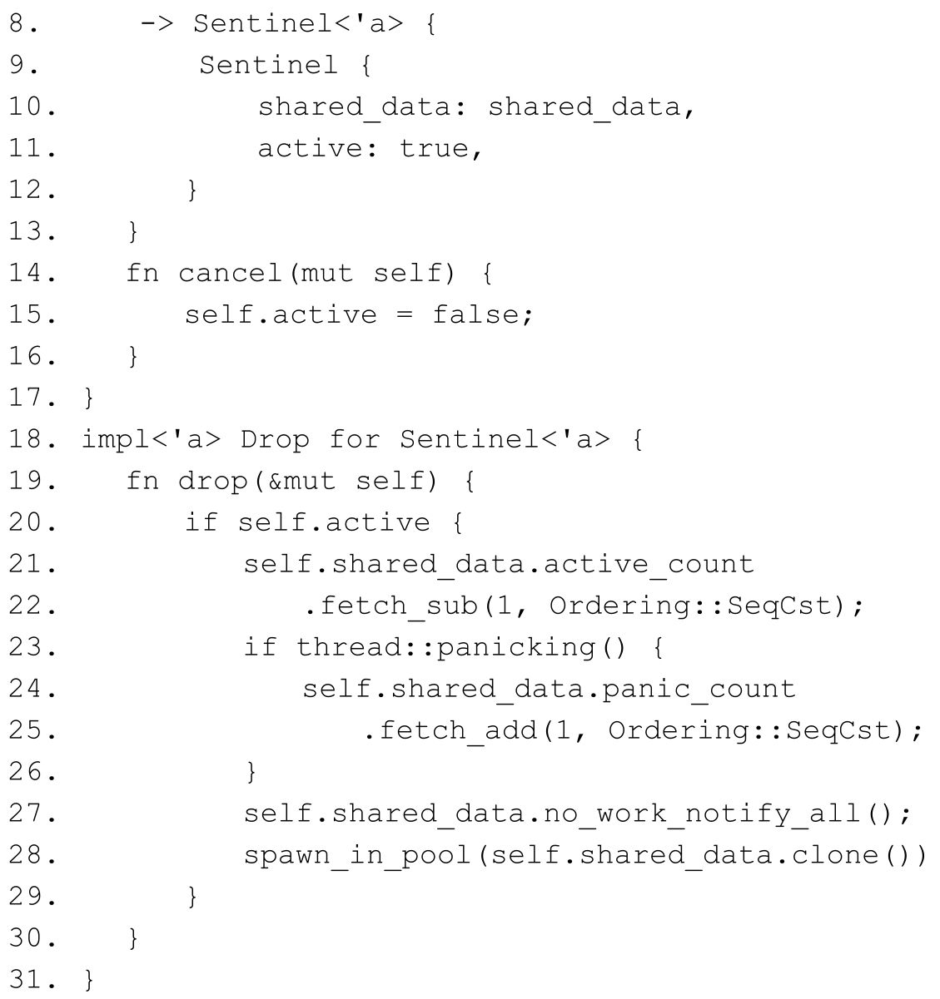{.u53668}
:::

在代码清单 11-53 中，代码第 2～5 行定义了 Sentinel＜＇a＞结构体，其中包含 shared_data和active字段，分别是&＇a Arc＜ThreadPoolSharedData＞和bool类型。该结构体用于监控当前工作线程的工作状态，shared_data字段用来包装线程池共享数据；而active字段如果为true，则代表当前工作线程正在工作，如果为false，则代表当前工作线程正常执行完毕。

代码第6～17行，实现了new和cancel方法，分别用于创建Sentinel＜＇a＞实例和设置active状态为false。

代码第18～30 行，为Sentinel＜＇a＞实现了Drop，用于处理处于非正常工作状态的工作线程。当工作线程（见代码清单11-52）中的Sentinel＜＇a＞实例离开作用域时会调用析构函数drop。在该函数中，会判断当前Sentinel＜＇a＞实例的状态，如果是true，则证明该工作线程并未正常退出，所以会依次执行第21～28行代码。

代码第21行和第22行将active_count减1，将当前工作线程正常归还到线程池中。代码第 23～26 行，通过 thread：：panicking 函数来判断当前工作线程是否由于发生恐慌而退出，如果是，则将panic_count加1。代码第27行，同样调用shared_data的no_work_notify_all方法，来通知使用条件变量的wait方法阻塞的线程在线程池中的任务执行完毕后解除阻塞。代码第28行，重新调用spawn_in_pool函数来生成工作线程。

至此，线程池实现完毕。在main函数中来使用线程池，如代码清单11-54所示。

**代码清单11-54：在main函数中使用线程池**

::: center
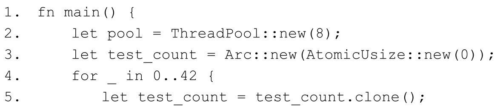{.u53667}
:::

::: center
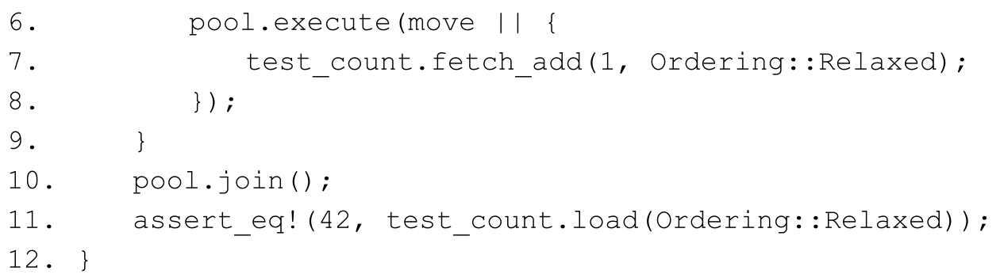{.u53666}
:::

在代码清单11-54中，通过ThreadPool：：new（8）创建了拥有8个工作线程的线程池，如代码第2行所示。

代码第3行，创建了一个原子类型的变量test_count，用于计数测试。

代码第4～9行，在迭代42次的for循环中，使用pool.execute将test_count加1的任务放到线程池中进行计算。

代码第10行，使用pool的join方法阻塞main主线程等待线程池中的任务执行完毕。

代码第11行，通过断言判断test_count的值最终为42。

最后在项目根目录下执行cargo run命令，代码正常编译运行。通过此示例，我们了解到如何创建一个简单的线程池，同时也对Rust标准库中提供的多线程并发工具有了进一步的深入了解。

### 11.2.9 使用Rayon执行并行任务 {#text00017.html#Af24501ad-11af-4cb1-9c84-8d2275414ba3 .title-left}

**Rayon** ^[\[5\]](#text00017.html#n869A01AD10D243BB9DE979058F6CF597){#text00017.html#n869A01AD10D243BB9DE979058F6CF597s}^ 是一个第三方包，使用它可以轻松地将顺序计算转换为安全的并行计算，并且保证无数据竞争。Rayon提供了两种使用方法：

· **并行迭代器** ，即可以并行执行的迭代器。

· **join方法** ，可以并行处理递归或分治风格的问题。

代码清单11-55展示了使用Rayon的并行迭代器。

**代码清单11-55：使用Rayon的并行迭代器**

::: center
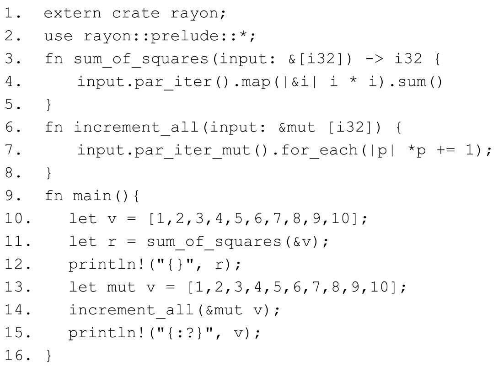{.u53665}
:::

在代码清单11-55中，代码第1行和第2行，分别引入了rayon包和prelude模块。代码第3～5行，定义了sum_of_squares函数，其中用到了par_iter迭代器，该迭代器就是Rayon提供的并行迭代器，它会返回一个不可变的并行迭代器类型。

代码第6～8行，定义了increment_all函数，其中使用了par_iter_mut迭代器，这是Rayon提供的可变并行迭代器。

在main函数中，分别调用了sum_of_squares和increment_all函数，最终输出结果如代码清单11-56所示。

**代码清单11-56：并行迭代器输出结果**

::: center
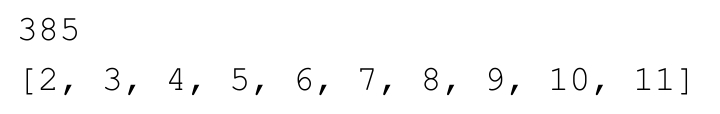{.u53664}
:::

代码清单11-57展示了使用join方法进行并行迭代。

**代码清单11-57：使用join方法进行并行迭代**

::: center
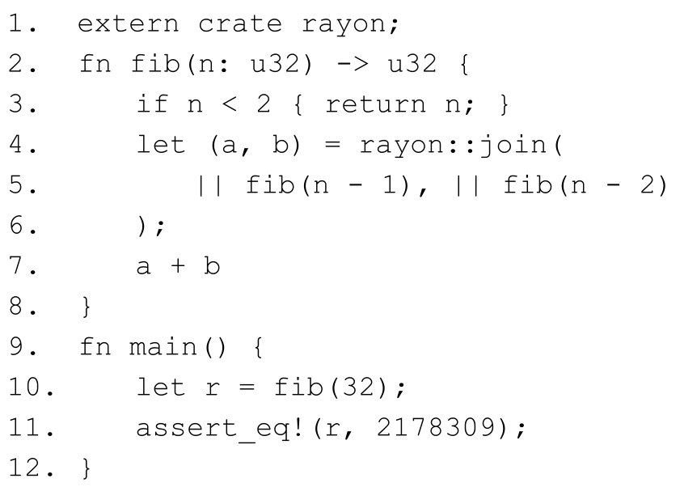{.u53663}
:::

在代码清单11-57中，代码第2～8行实现的fib函数用来计算指定位置的斐波那契序列值，在该函数中使用rayon：：join方法接收两个闭包并行执行，迭代过程如图11-11所示。

::: center
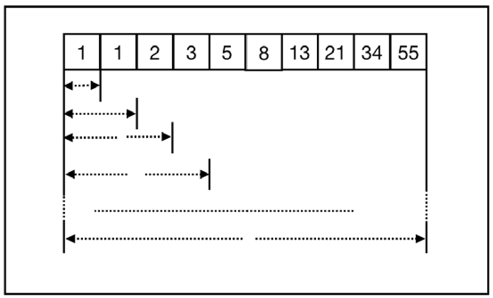{.u53662}

图11-11：使用join方法并行计算递归式斐波那契序列值
:::

使用join方法并不一定会保证并行执行闭包，Rayon底层使用线程池来执行任务，如果工作线程被占用，Rayon 会选择顺序执行。Rayon 的并行能力基于一种叫作**工作窃取** （Work-Stealing）的技术，线程池中的每个线程都有一个互不影响的任务队列（双端队列），线程每次都从当前任务队列的头部取出一个任务来执行。如果某个线程对应的队列已空并且处于空闲状态，而其他线程的队列中还有任务需要处理，但是该线程处于工作状态，那么空闲的线程就可以从其他线程的队列尾部取一个任务来执行。这种行为表现就像空闲的线程去偷工作中的线程任务一样，所以叫作"工作窃取"。

关于Rayon的更多细节，可以参考其源码中rayon-demo目录下的示例。

### 11.2.10 使用Crossbeam {#text00017.html#A851ae4e8-0614-43f4-a430-aca86b3b1127 .title-left}

Crossbeam 是比较常用的第三方并发库，在实际开发中通常用它来代替标准库。它是对标准库的扩展和包装，一共包含四大模块。

· 用于增强 std：：sync 的原子类型。提供了 C++11 风格的 Consume 内存顺序原子类型AtomicConsume和用于存储和检索Arc的ArcCell。

· 对标准库thread和各种同步原语的扩展，提供了很多实用的工具。比如Scoped线程、支持缓存行填充的CachePadded等。

· 提供了MPMC的Channel，以及各种无锁并发数据结构。包括：并发工作窃取双端队列、并发无锁队列（MS-Queue）和无锁栈（Treiber Stack）。

· 提供了并发数据结构中需要的内存管理组件crossbeam-epoch。因为在多线程并发情况下，如果线程从并发数据结构中删除某个节点，但是该节点还有可能被其他线程使用，则无法立即销毁该节点。Epoch GC允许推迟销毁，直到它变得安全。在不久的将来，其还将支持险象指针（Hazard Pointer，HP）和QSBR（Quiescent-State-Based Reclamation）回收算法。

**扩展原子类型**

Crossbeam的crossbeam-utils子包中提供了AtomicConsume trait，是对标准库中原子类型内存顺序的增强。该 trait 允许原子类型以"Consume"内存顺序进行读取。"Consume"内存顺序是C++中支持的一种内存顺序，可以称为**消耗-释放顺序** 。相对于获取-释放顺序而言，消耗-释放顺序的性能更好。因为获取-释放顺序会同步所有写操作之前的读操作，而消耗-释放顺序则只会同步数据之间有相互依赖的操作，粒度更细，所以性能更好。目前仅 ARM和AArch64架构支持，在其他架构上还是要回归到获取-释放顺序。

通过crossbeam-utils包，已经为标准库std：：sync：：atomic中的AtomicBool、AtomicUsize等原子类型实现了该trait，只需要调用load_consume方法就可以使用该内存顺序。

在最新的 crossbeam-utils 包中，还增加了一个原子类型 AtomicCell，其等价于一个具有原子操作的Cell＜T＞类型。

**使用Scoped线程**

在标准库线程生成的子线程中，无法安全地使用父线程中的引用，如代码清单11-58所示。

**代码清单11-58：父线程中的引用无法在子线程中安全地使用**

::: center
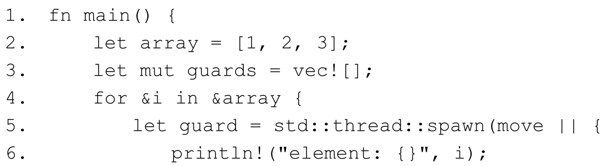{.u53661}
:::

::: center
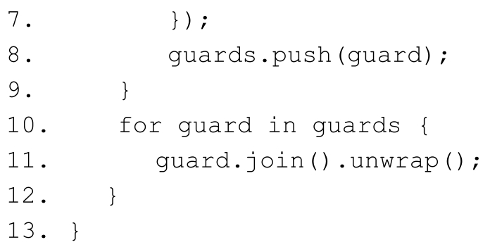{.u53660}
:::

在代码清单11-58中，在for循环中需要使用&i来解构引用得到数组中的值，才能在子线程中被安全地使用。也就是说，在子线程中无法完全地使用父线程中的引用。

Crossbeam提供了一种Scoped线程，允许子线程可以安全地使用父线程中的引用，如代码清单11-59所示。

**代码清单11-59：使用Crossbeam提供的Scoped线程**

::: center
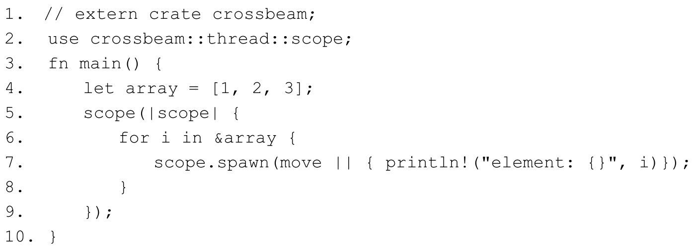{.u53659}
:::

在代码清单 11-59 中，代码第 1 行在 Rust 2018 版本中可以省略。使用crossbeam：：thread：：scope函数允许传入一个以scope为参数的闭包，在该闭包中由scope参数来生成子线程，其可以安全地使用父线程（main主线程）中array数组的元素引用。

实际上，闭包中的scope参数是一个内部使用的Scope结构体，该结构体会负责子线程的创建、join父线程和析构等工作，以便保证引用的安全。

**使用缓存行填充提升并发性能**

在并发编程中，有一个号称"无声性能杀手"的概念叫作**伪共享（False Sharing）** 。为了提升性能，现代CPU都有自己的多级缓存。而在缓存系统中，都是以缓存行（Cache Line）为基本单位进行存储的，其长度通常是 64 字节。当程序中的数据存储在彼此相邻的连续内存中时，可以被 L1 级缓存一次加载完成，享受缓存带来的性能极致。当数据结构中的数据存储在非连续内存中时，则会出现缓存未命中的情况。

将数据存储在连续紧凑的内存中虽然可以带来高性能，但是将其置于多线程下就会发生问题。多线程操作同一个缓存行的不同字节，将会产生竞争，导致线程彼此牵连，相互影响，最终变成串行的程序，降低了并发性，这就是所谓的伪共享。因此，为了避免伪共享，就需要将多线程之间的数据进行隔离，使得它们不在同一个缓存行，从而提升多线程的并发性能。

避免伪共享的方案有很多，其中一种方案就是刻意增大元素间的间隔，使得不同线程的存取单元位于不同的缓存行。Crossbeam提供了CachePadded＜T＞类型，可以进行**缓存行填充（Padding）** ，从而避免伪共享。

在Crossbeam提供的并发数据结构中就用到了缓存行填充。比如并发的工作窃取双端队列crossbeam-deque，就用到了缓存行填充来避免伪共享，提升并发性能。

**使用MPMC Channel**

Crossbeam还提供了一个std：：sync：：mpsc的替代品MPMC Channel，也就是多生产者多消费者通道。标准库 mpsc 中的Sender 和Receiver 都没有实现Sync，但是Crossbeam提供的MPMC Channel的Sender和Receiver都实现了Sync。

所以，可以通过引用来共享Sender和Receiver。代码清单11-60展示了使用Crossbeam提供的MPMC Channel。

**代码清单11-60：使用Crossbeam提供的MPMC Channel**

::: center
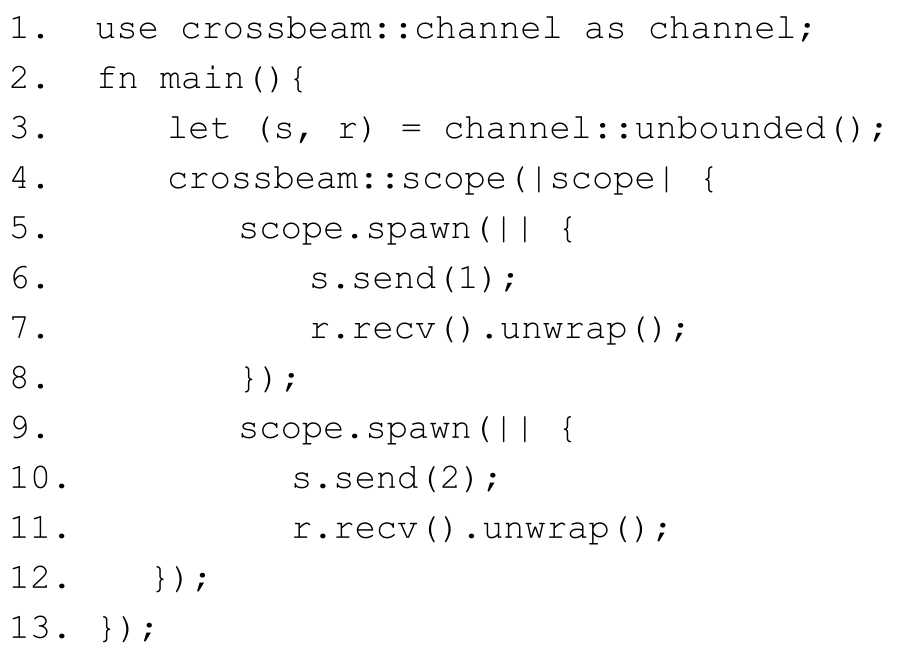{.u53658}
:::

代码清单11-60基于Rust 2018，所以省略了extern crate crossbeam。代码第3行，使用unbounded函数来创建**无界通道** 。Crossbeam提供的MPMC Channel和标准库的Channel类似，也提供了**无界通道** 和**有界通道** 两种类型。

接下来，使用scope函数创建了两个Scoped子线程，并通过获取通道发送端s和接收端r的引用来共享使用Channel。当然，也可以通过clone方法来共享通道两端。

在Crossbeam中还提供了select！宏，用于方便地处理一组通道中的消息，如代码清单11-61所示。

**代码清单11-61：使用Crossbeam提供的select！宏**

::: center
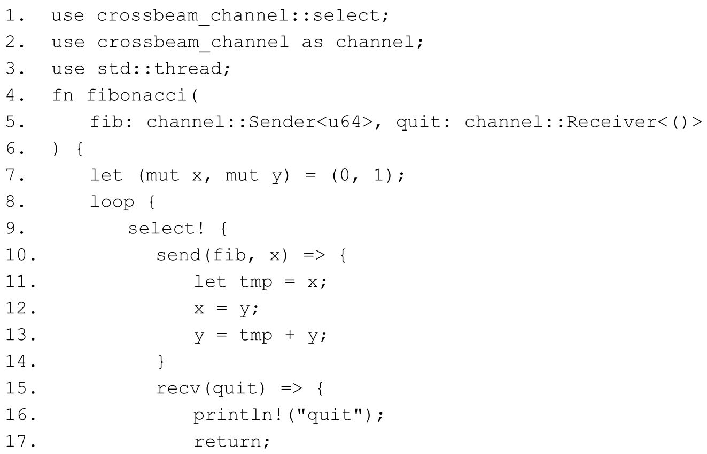{.u53657}
:::

::: center
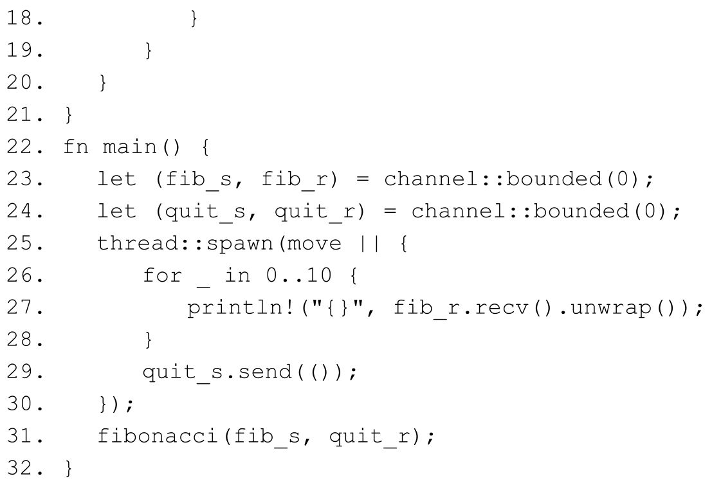{.u53656}
:::

代码清单11-61基于Rust 2018，所以不需要显式使用＃\[macro_use\]来导入select！宏。在代码清单11-61中定义了fibonacci函数，用于从fib通道中计算斐波那契数列，并从quit通道中退出计算。

代码第8～20行，将select！宏置于loop循环中，是因为select！宏每次只会执行一个操作。对于 select！宏来说，如果同时有多个操作已经准备就绪，则会随机选择一个执行；否则，只选择最先准备就绪的那个操作来执行。

在main函数中，创建了两个有界通道，如代码第23行和第24行所示。但这两个有界通道是一种比较特殊的通道，在Crossbeam中叫作**零容量通道** 。这种通道会一直阻塞，除非接收端可以对其进行操作。

代码第25行，使用标准库线程生成一个子线程。

代码第26～28行，在子线程中通过for循环来接收fib_r收到的前10个斐波那契数列。代码第29行，在for循环执行完毕后，就通过quit_s发送消息让fibonacci函数退出。所以，在 for 循环过程中，在 fibonacci 函数的 select！宏中只有 send 操作准备就绪，所以 fibonacci函数不需要担心突然收到quit消息而意外退出。只有当for循环结束以后，select！宏中的recv操作才会执行。

其实在标准库 std：：sync：：mpsc 模块中也提供了 Select 类型，但目前还是实验特性。Crossbeam提供的select！宏还有很多其他功能，具体可以查看相关文档。

## 11.3 异步并发 {#text00017.html#Acfb601b2-dae8-4632-8772-5cf93e4112ec .title-left}

在本章开头的"通用概念"中已经介绍了异步并发相关背景，了解到异步编程的发展一共经历了三个阶段。**第一个阶段** ，直接使用回调函数，随之带来的问题是"回调地狱"；**第二个阶段** ，使用 Promise/Future 并发模型，解决了回调函数的问题，但是代码依旧有很多冗余；**第三个阶段** ，利用协程实现async/await解决方案，也号称"异步的终极解决方案"。

目前，很多编程语言都支持异步并发，但并非都支持到第三个阶段。比如异步开发大放异彩的JavaScript语言，也只是在ES 7中刚刚支持。虽然各种语言对异步编程的支持参差不齐，但异步编程解决方案async/await几乎已经成为业界的事实标准。然而，在Rust 1.0正式发布时，Rust并没有包含任何异步开发的支持。这是因为Rust有自己的发展路线，它的首要目标是解决并发安全的问题。

在经过一系列版本迭代之后，Rust才确定了新的发展路线，即：成为能开发出高性能网络服务的首选语言。因此，Rust 引入了生成器，随之又先后引入了 Future 并发模型和async/await方案。然而，引入异步并发模型的过程并非一帆风顺，本来计划在Rust 2018稳定版中包含async/await语法，但最后因为这样那样的问题不得不延期。主要原因是想要更好地提升Rust的异步开发的人体工程学。过程虽然曲折，但也体现了Rust追求安全、性能和并发三连击的决心。

### 11.3.1 生成器 {#text00017.html#A16e201b3-827d-44a2-88b1-8cccd1051712 .title-left}

如果要支持 **async/await** 异步开发，最好是能有协程的支持。所以，Rust 的第一步是需要引进**协程（Coroutine）** 。

协程的实现一般分为两种，其中一种是**有栈协程（Stackful）** ；另一种是**无栈协程（Stackless）** 。对于有栈协程的实现，一般每个协程都自带独立的栈，功能强大，但是比较耗内存，性能不如无栈协程。而无栈协程一般是基于**状态机（State Machine）** 来实现的，不使用独立的栈，具体的应用形式叫**生成器（Generator）** ，常见的有ES 6和Python语言中支持的生成器。这种形式的协程性能更好，而功能要弱于有栈协程，但也够用了。在Rust标准库中支持的协程功能，就属于无栈协程。

**什么是生成器**

我们先通过一个示例来了解Rust中生成器的用法，如代码清单11-62所示。

**代码清单11-62：Rust生成器的用法**

::: center
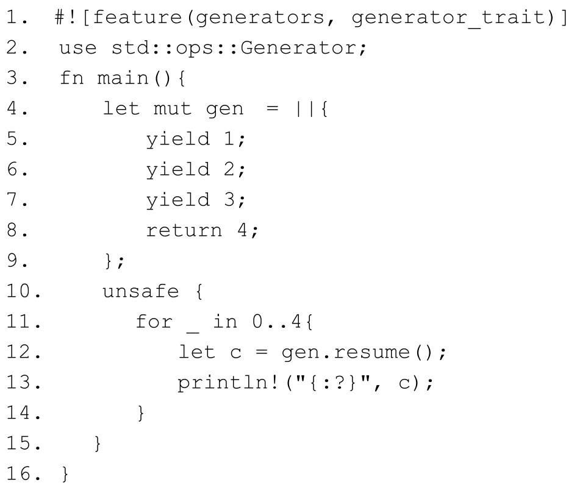{.u53655}
:::

在代码清单11-62中，代码第1行使用了**＃！\[feature（generators，generator_trait）\]** 特性，这是因为Rust中提供的生成器功能目前属于实验性功能，还未稳定。

代码第2行，引入了std：：ops模块中的Generator trait。该trait定义了生成器的行为。

代码第4～9行，创建了一个Generator，从形式上看像闭包，但它不是闭包，而是**生成器** 。其中的**yield** 是专门为生成器引入的关键字。需要注意，生成器不能像闭包那样接收参数。

代码第10行，使用了unsafe块，因为接下来需要调用unsafe的resume方法。在for循环中，调用4次resume方法。该方法会让程序的执行流程跳回到生成器中执行代码，并且在遇到yield关键字时跳出生成器，返回给调用者。生成器的执行流程如图11-12所示。

::: center
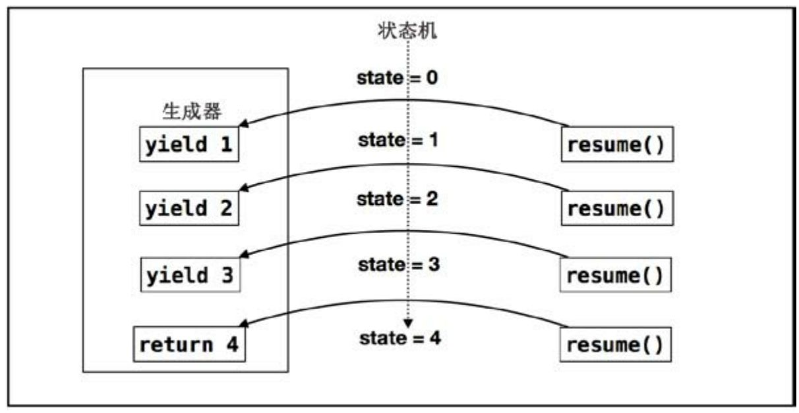{.u53654}

图11-12：生成器的执行流程
:::

在图11-12中展示了yield和resume的跳转过程。第一次调用resume方法，跳到生成器中，执行到"yield 1"，跳回到调用者。第二次调用resume方法，同样会跳到生成器中，然后继续从上次的"yield 1"位置开始执行代码，直到遇到"yield 2"，再跳回到调用者。依此类推，直到生成器代码执行完毕，到达return那里。

生成器使用yield来设置状态，然后通过调用resume方法来达到状态的流转。在代码清单11-62中，状态从初始状态0一直流转到状态4。整个生成器实际上就是一个状态机。输出结果如代码清单11-63所示。

**代码清单11-63：输出结果**

::: center
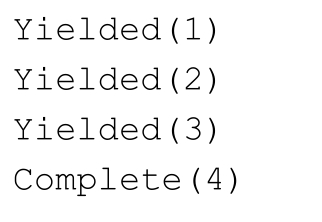{.u53653}
:::

该输出结果并非像图11-12 所示那样用简单的数字来表示状态。返回的结果实际上是一种枚举类型 GeneratorState＜Y，R＞，该类型只包括 Yielded（Y）和 Complete（R）两种值。其中Yielded（Y）表示在生成器执行过程中产生的各种状态，也就是程序在生成器代码中挂起的位置；而Complete（R）表示生成器执行完成后最终返回的值。

**生成器的实现原理**

在Rust中Generator被定义为一个trait，如代码清单11-64所示。

**代码清单11-64：Generator trait源码**

::: center
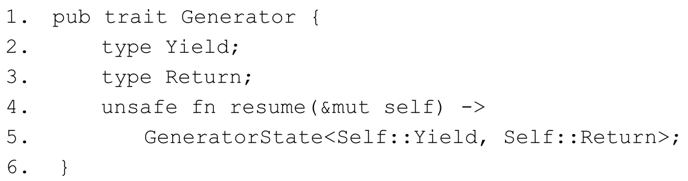{.u53652}
:::

在代码清单11-64中，Generator包含了两种关联类型，即Yield和Return，分别对应于yield的状态类型和生成器执行完成后最终返回的类型。

生成器语法像闭包，其实现原理也和闭包类似。比如在代码清单11-62中定义的生成器gen，将会由编译器自动生成一个匿名的枚举体，然后为该枚举体自动实现 Generator。等价代码如代码清单11-65所示。

**代码清单11-65：代码清单11-62中生成器实例gen的等价生成代码**

::: center
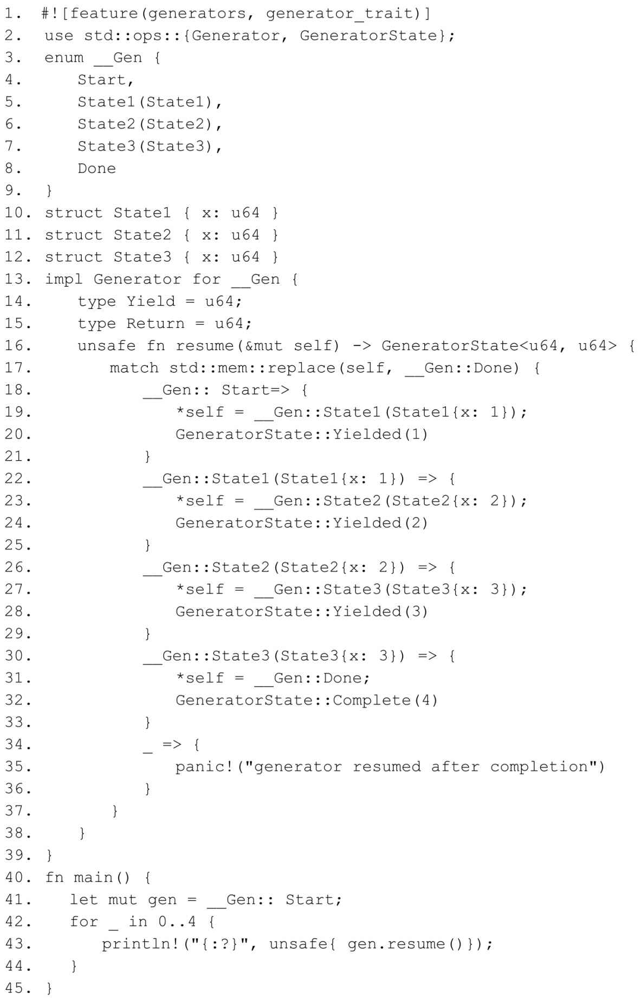{.u53651}
:::

在代码清单 11-65 中，使用了**＃！\[feature（generators，generator_trait）\]** 特性，这是因为Generator目前是未稳定的特性，所以必须在Nightly版本下执行该代码。

首先，编译器会生成一个匿名的枚举体，这里用\_\_Gen 来表示。因为在代码清单 11-62中，在生成器实例gen中使用yield和return关键字一共定义了4种状态，所以在\_\_Gen中也包含了4个枚举值，即State1（State1）、State2（State2）、State1（State3）、Done，但还必须包含一个初始状态Start，如代码第3～9行所示。

除Start和Done之外，中间的三种状态需要存储状态值，分别用三个结构体State1、State2和State3表示，如代码第10～12行所示。

从代码第13行开始，为\_\_Gen实现Generator。代码第14行和第15行，分别指定关联类型Yield和Return为u64类型。

代码第16行，实现unsafe的resume方法。在resume方法中调用std：：mem：：replace方法，传入&mut self和\_\_Gen：：Done。每次调用replace方法，都会将self的值替换为\_\_Gen：：Done，然后返回替换前的self的值。接下来使用match匹配replace的结果，达到状态转移的目的。

代码第18行的match分支\_\_Gen：：Start，代表replace调用返回了\_\_Gen：：Start。那么就将状态转移到 State1，也就是将 self 的值修改为\_\_Gen：：State1（State1{x：1}），并返回GeneratorState：：Yielded（1）。依此类推，调用一次resume方法，其内部的self的状态就会转移一次，直到结束。

在main函数中，展示了调用过程。定义了可变绑定gen，将\_\_Gen：：Start作为初始状态，然后循环4次，分别调用4次resume方法。最终的输出结果和代码清单11-63相同。

当然，代码清单11-65只是一个简单的生成器模拟代码，目的在于阐述生成器的执行原理。实际编译器生成的代码要比这个复杂。

**生成器与迭代器**

生成器是非常有用的一个功能。如果只关注计算的过程，而不关心计算的结果，则可以将Return设置为单元类型，只保留Yield的类型，也就是Generator＜Yield=T，Return=（）＞，那么生成器就可以化身为迭代器，如代码清单11-66所示。

**代码清单11-66：将生成器用作迭代器**

::: center
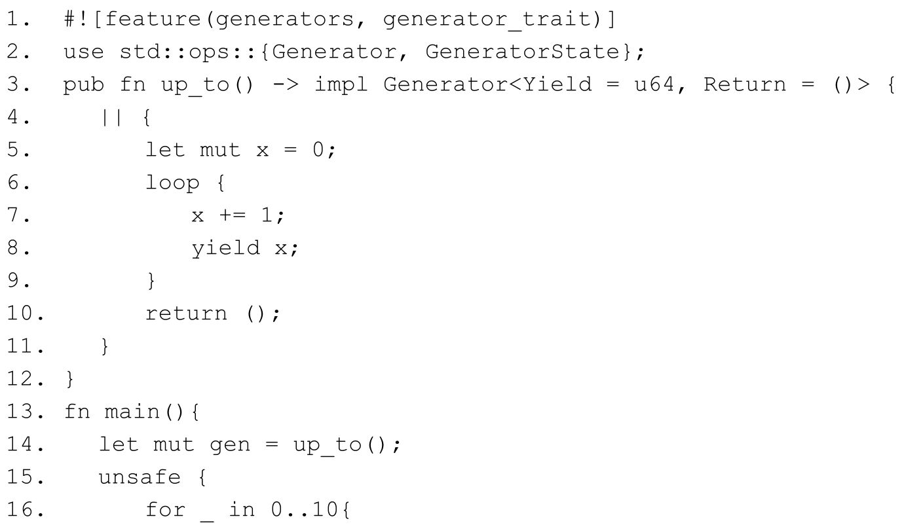{.u53650}
:::

::: center
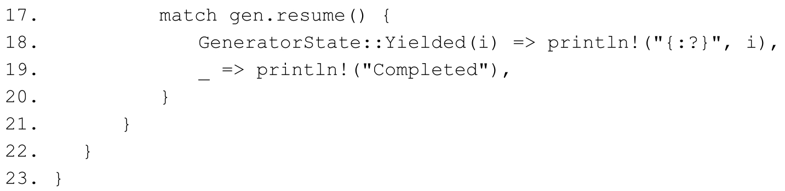{.u53649}
:::

在代码清单11-66中定义了up_to函数，返回一个impl Generator＜Yield=64，Return=（）＞类型。注意，该代码要选择在Rust 2018或者最新的Nightly Rust中执行，因为**impl Trait** 语法是在Rust 2018 中加入的。

在up_to函数中，定义了一个生成器实例，在该生成器中利用loop循环，从0开始，逐渐加1，生成自然数序列。

在main函数中，调用up_to函数，返回了生成器实例绑定给b，注意这里是可变绑定。然后在unsafe中循环调用b的resume方法，并使用match对其结果进行匹配，从而产生了迭代的效果。

但生成器的性能比迭代器更高。因为生成器是一种**延迟计算** 或**惰性计算** ，它避免了不必要的计算，只有在每次需要时才通过yield来产生相关的值。

**用生成器模拟Future**

只关注生成器的计算过程而忽略结果，生成器会化身为迭代器。如果反过来，不关心过程，只关注结果，则可以将 Yield 设置为单元类型，只保留 Return 的类型，也就是Generator＜Yield=（），Return=Result＜T，E＞＞，生成器就可以化身为Future，如代码清单11-67所示。

**代码清单11-67：用生成器模拟Future**

::: center
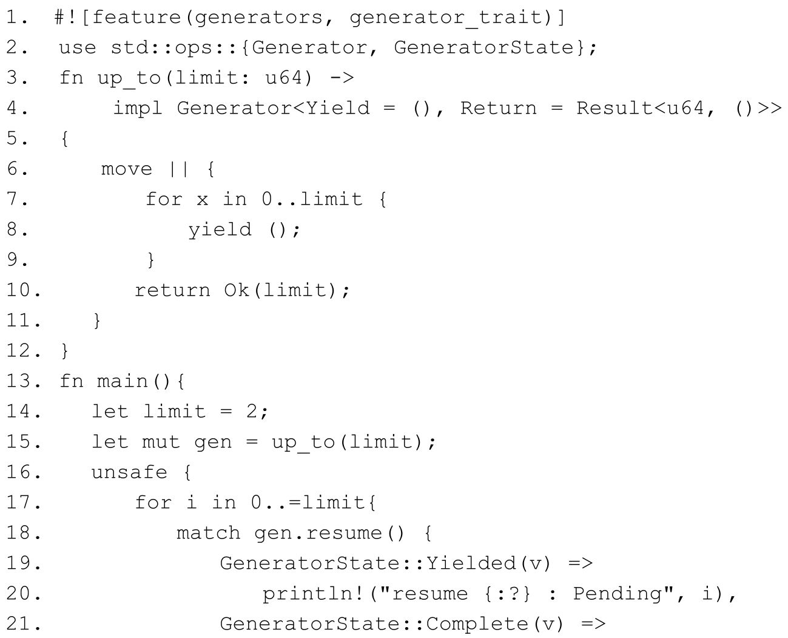{.u53648}
:::

::: center
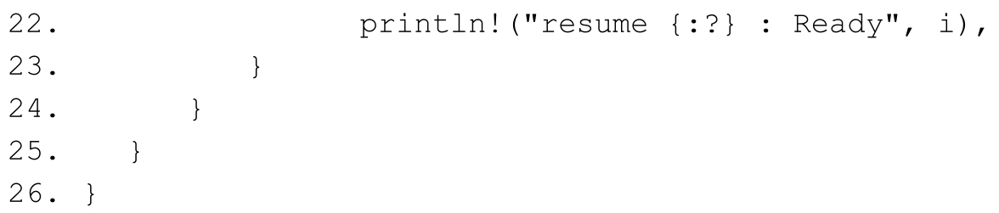{.u53647}
:::

在代码清单11-67中定义的up_to函数返回了impl Generator＜Yield=（），Return=Result＜u64，（）＞＞类型。同样，在up_to函数中，对应地，修改了yield和return的值。

然后在main函数中，对生成器实例gen进行resume循环调用，对得到的值进行匹配，最终得到的输出结果如代码清单11-68所示。

**代码清单11-68：代码清单11-67的输出结果**

::: center
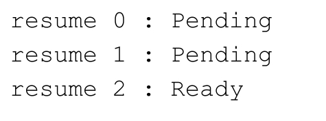{.u53646}
:::

因为不关心生成器执行过程中的状态，所以只要还在计算过程中，就返回 **Pending** 。一旦计算完成，就返回**Ready** 。

**Future** 是一种**异步并发模式** ，它实际上是**代理模式** 和**异步开发** 的混合产物。Future是对"未来"的一种代理凭证，凭借这个凭证可以异步地在未来某个时刻得到确定的结果，而不需要同步等待。比如网购一件商品，你下的订单就可以被看作是一种**Future** 。此时对你来说，订单的状态是 **Pending** ，你下单后就可以去做其他事情，并不需要花时间关注商品从下单到发货的整个流程。商家看见订单，自然会按流程进行发货，在未来某个时刻，商品就会被快递到你手里，订单的状态就会变成**Ready** 。所以，整个网购过程是异步的，丝毫没有耽误你的日常生活。

然而，严格来说，生成器属于一种**半协程** （Semi-Coroutine）。半协程是一种特殊的且能力较弱的协程，它只能在生成器和调用者之间进行跳转，而不能在生成器之间进行跳转。所以，要想支持完整的异步编程，还需要在生成器的基础上进一步完善Future并发模式。

### 11.3.2 Future并发模式 {#text00017.html#Ac7e901b8-985d-48a8-82bc-73eef6bfaf5a .title-left}

在实际的异步开发中，需要将一个完整的功能切分为一个个独立的异步任务，并且这些任务之间还可能彼此依赖，一个任务的输出也许是另一个任务的输入。比如服务器端处理基本的HTTP请求，就可以分解为建立连接、处理请求、返回响应这三步。如果将每一步都抽象为一个异步计算单元，那么一共就有三个异步计算单元，并且后两步的计算都依赖于前一步的计算结果。而且，每一个异步计算单元还可以细分为更小的异步计算组合。如果想要合理地调度和高效地计算这些异步任务，就需要一个完善的异步系统。

因此，Rust对Future异步并发模式做了一个完整的抽象，包含在第三方库**futures-rs** 中。该抽象主要包含三个部件：

· **Future** ，基本的异步计算抽象单元。

· **Executor** ，异步计算调度层。

· **Task** ，异步计算执行层。

当然，futures-rs库还包含其他部件，但这三个部件属于核心部件。

**Future**

在Rust中，Future是一个trait，其源码如代码清单11-69所示。

**代码清单11-69：Future trait源码**

::: center
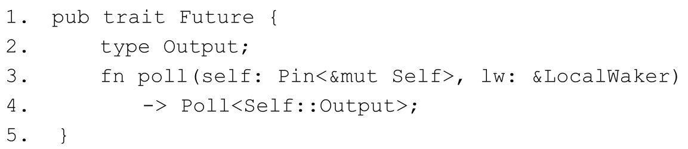{.u53645}
:::

代码清单11-69展示的是std：：future模块中Future trait的源码 ^[\[6\]](#text00017.html#nB10C91392C3442F3A7FC214B35C9B6FF){#text00017.html#nB10C91392C3442F3A7FC214B35C9B6FFs}^ ，它包含了用于指定返回类型的关联类型Output和poll方法。

其中**poll** 方法是Future的核心，它是对**轮询** 行为的一种抽象。先不用管参数中的Pin和LocalWaker类型，后面会详细介绍。在Rust中，每个Future都需要使用poll方法来轮询所要计算值的状态。该方法返回的Poll是一个枚举类型，其源码如代码清单11-70所示。

**代码清单11-70：Poll＜T＞类型源码**

::: center
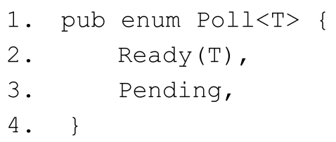{.u53644}
:::

从代码清单 11-70 中可以看出，Poll＜T＞枚举类型包含了两个枚举值，即 **Ready（T）** 和**Pending** 。该类型和 Option＜T＞、Result＜T，E＞相似，都属于和类型。它是对**准备好** 和**未完成** 两种状态的统一抽象，以此来表达Future的结果。对于每个Future来说，无非就是这两种结果。

**Executor和Task**

Future只是一个基本的异步计算抽象单元，具体的计算工作还需要由Executor和Task共同完成。

在实际的异步开发中，会遇到纷繁复杂的异步任务，还需要一个专门的调度器来对具体的任务进行管理统筹，这个工具就是Executor。具体的异步任务就是Task。拿futures-rs ^[\[7\]](#text00017.html#n4F4301B9CAC343818ED8CBC4060BFB33){#text00017.html#n4F4301B9CAC343818ED8CBC4060BFB33s}^ 来说，Executor是基于线程池实现的，其工作机制如图11-13所示。

第三方库futures-rs是由很多小的crate组合而成的，其中futures-executor库专门基于线程池实现了一套Executor。

图11-13上半部分，展示了几个关键的复合类型：ThreadPool、PoolState、Message和Task。注意，此处复合类型中的字段或枚举值涉及的具体类型，为演示而做了简化，和实际代码中的有所差异。

::: center
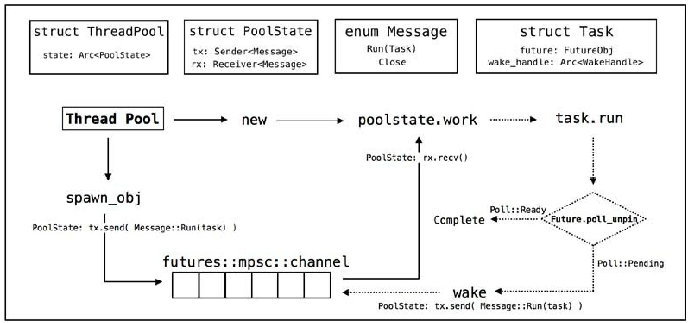{.u53643}

图11-13：futures-rs库的Executor和Task工作机制示意图
:::

**ThreadPool** 是一个结构体，包含了一个字段state，设置为Arc＜PoolState＞类型，是为了共享线程池内的线程信息。

**PoolState** 同样是一个结构体，包含了 tx 和 rx 两个字段，分别是 Sender＜Message＞和Receiver＜Message＞类型。这两个类型看起来与std：：sync：：mpsc模块中定义的用于Channel通信的发送端和接收端类型相似，但实际上是futures-channel中定义的类型。而tx和rx的作用是类似的，同样用于Channel通信。

**Message** 是一个枚举类型，包含了两个枚举值，其中最重要的就是Run（Task）。该Message用作发送到Channel中的消息。这样的消息包含两种可能，其中一种是运行Task；另一种是关闭线程池。

**Task** 是一个结构体，包含了 future 和 wake_handle 两个字段，分别为 FutureObj 和Arc＜WeakHandle＞类型。顾名思义，FutureObj就是Future对象，它实际上是futures-executor中实现的自定义Future对象，它是对一个Future trait对象的一种包装；而WeakHandle则是用来唤醒任务的句柄。

图11-13下半部分，展示了Executor完整执行流程的简单示意图。

Executor 提供了一个 **Channel** ，实际上就是一个任务队列。开发者可以通过 ThreadPool提供的**spawn_obj** 方法将一个异步任务（Task）发送（send）到Channel中。实际上，在spawn_obj内部是通过**PoolState** 结构体中存储的发送端**tx** 将**Message：：Run（task）** 发送到Channel中的。

通过**ThreadPool：：new** 方法，可以从线程池中调用一个线程来执行具体的任务。同时，在该线程中也调用了PoolState结构体的**work** 方法来消费Channel中的消息。实际上，work方法是通过PoolState结构体中存储的接收端**rx** 接收并消费**Message：：Run（task）** 的。

就这样，由spawn_obj往Channel中发送消息，由work来接收并消费消息，构成一个完整的工作流程。

当work方法接收到**Message：：Run（task）** 之后，会调用**Task** 中定义的**run** 方法来执行具体的task。在run方法中，调用存储于task实例中的FutureObj类型值的poll_unpin方法，将会执行具体的poll方法，返回Pending和Ready两种状态。如果是Pending状态，则通过task实例存储的WakeHandle句柄将此任务再次唤醒，也就是重新将该任务发送到Channel中，等待下一次轮询；如果是Ready状态，则计算任务完成，返回到上层进行处理。

以上就是整个futures-rs核心工作机制的简要概括。通过图11-13，我们可以从整体上把握并建立Rust中Future异步开发的心智模型。

### 11.3.3 async/await {#text00017.html#A113501bb-9ae3-4aec-b820-8b3421af22ad .title-left}

迄今为止，第三方库futures-rs经历了三个阶段的迭代。在0.1版本中，开发者可以通过then和and_then方法来安排Future异步计算的执行顺序。但是经过一段时间的用户反馈之后，发现这种方式会导致很多混乱的嵌套和回调链，不利于人体工程学。于是就引入了**async/await** 解决方案。又经过两个阶段的重构，目前为0.3版本。

代码清单11-71展示了futures-rs先后提供的两种写法对比。

**代码清单11-71：futures-rs两种写法对比**

::: center
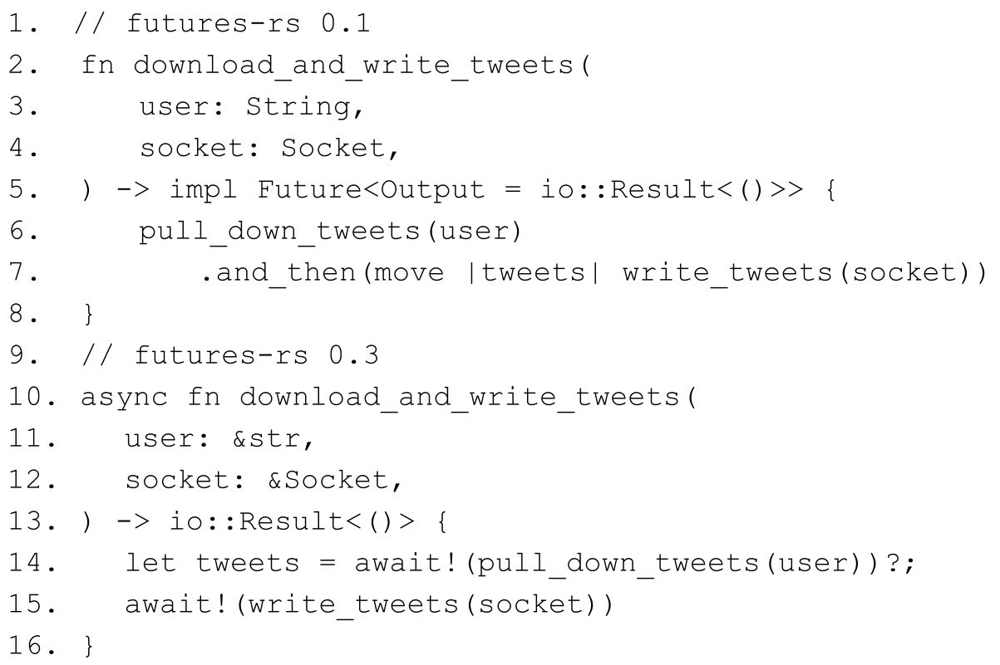{.u53642}
:::

在代码清单 11-71 中，用两种写法定义了异步函数 download_and_write_tweets，执行该函数，需要先执行pull_down_tweets异步函数，再执行write_tweets异步函数。可以看出，第一种写法使用and_then构成了很长的调用链；而第二种写法使用async关键字和await！宏，在语义上要比使用and_then更加直观和精简。

Rust当前以async关键字配合await！宏来提供async/await异步开发方案。在不久的将来，await也会变成关键字。

async/await实际上是一种语法糖。async fn会自动为开发者生成返回值是impl Future类型的函数。就像代码清单11-71中第二种写法生成的代码，实际上等价于第一种写法。

**async/await实现原理**

Rust不仅仅支持使用async fn定义异步函数，还支持async块，如代码清单11-72所示。

**代码清单11-72：async 块示意**

::: center
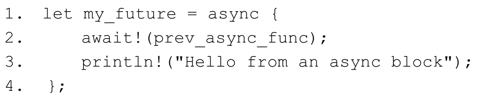{.u53641}
:::

在代码清单11-72中，直接使用async块来创建一个Future。实际上，使用async fn定义函数在底层也是由async块来生成Future的。图11-14展示了这个过程。

::: center
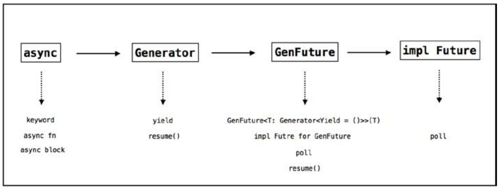{.u53640}

图11-14：由async块生成Future过程示意图
:::

如图11-14所示，async关键字无论是用来定义异步函数，还是定义异步块，在Rust将代码解析为 AST 之后，在 HIR 层都会转换为 async 块的形式。再将 async 块生成一个Generator＜Yield=（）＞类型的生成器来使用。然后将该生成器通过单元结构体GenFuture进行包装，得到一个GenFuture＜T：Generator＜Yield=（）＞＞（T）类型，最后为该GenFuture实现Future，如代码清单11-73所示。

**代码清单11-73：为GenFuture实现Future源码**

::: center
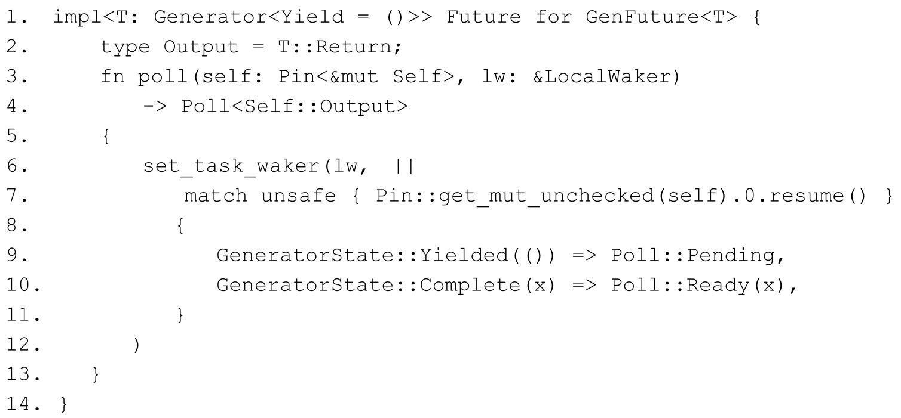{.u53639}
:::

代码清单11-73展示了在std：：future模块中为GenFuture实现Future的源码。关键在于，在poll方法中调用了resume函数。此处的Pin：：get_mut_unchecked（self）会返回一个&mut self，所以这里等价于"&mut self.0.resume（）"。通过匹配resume方法的调用结果，来轮询Future的计算结果。这和在代码清单11-67中用生成器模拟Future很相似。

接下来，通过std：：future模块中的from_generator函数，将实现了Future的GenFuture作为返回值插入编译器生成的代码中。

以上就是 async 语法糖在编译器内部转化作为返回类型 GenFuture 的整个过程。当然，还需要await！宏相互配合才可以。await！宏原理示意图如图11-15所示。

::: center
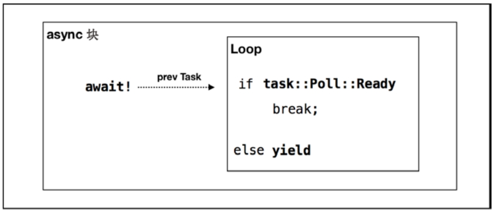{.u53638}

图11-15：await！宏原理示意图
:::

await！宏必须在async块中使用，不能单独使用。因为await！宏实际展开的代码要在loop循环中对轮询结果进行判断。如果是Ready状态，则跳出loop循环；如果是Pending状态，则生成yield。正因为这个yield，才允许async块生成一个Generator＜Yield=（）＞类型的生成器。

**Pin与UnPin**

在前面的示例中，多次出现Pin类型，这是什么意思呢？Pin＜T＞实际上是一个被定义于std：：pin 模块中的智能指针。它是在 Rust 2018 版本中新增的语法，经过多次迭代之后，在Rust 1.30版本中定型为Pin＜T＞。

那么，为什么需要它呢？回顾代码清单 11-62 中的生成器实例 gen，如果换种写法看看会有什么问题，如代码清单11-74所示。

**代码清单11-74：修改代码清单11-62中的生成器实例**

::: center
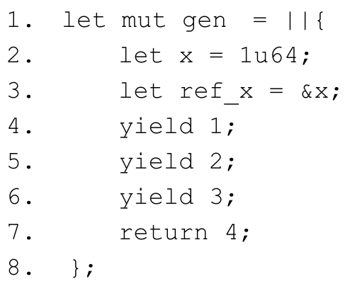{.u53637}
:::

在代码清单11-74中，为生成器实例增加了两个新的本地变量绑定：x和ref_x，其中ref_x是对x的引用。修改成这样，编译代码时会报错：

::: center
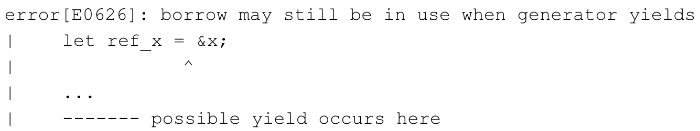{.u53636}
:::

该错误表示Rust不允许在生成器中使用对本地变量的引用，这个问题与生成器实现原理有关。

回顾代码清单 11-65。生成器会由编译器生成相应的结构体来记录状态，当生成器包含对本地变量的引用时，该结构体会生成一种**自引用结构体（Self-referential Struct）** 。代码清单11-75展示了代码清单11-74中生成器实例生成代码。

**代码清单11-75：代码清单11-74中生成器实例生成代码**

::: center
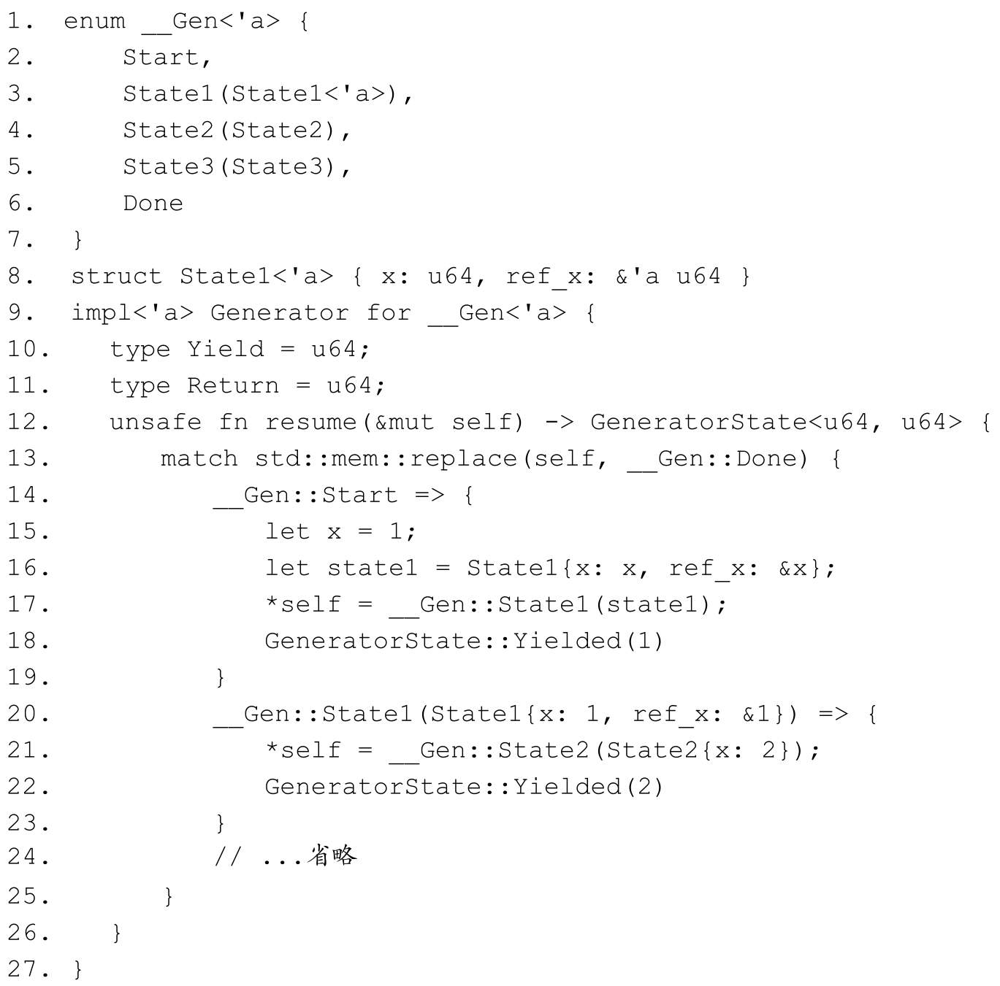{.u53635}
:::

在代码清单11-75中，由State1结构体来存储生成器实例中对本地变量的引用，会生成一个自引用结构体，如代码第8行所示，该结构体中字段ref_x的值是对字段x的引用。

在resume函数中，代码第15～17行生成一个**自引用结构体** 的实例。在resume函数被调用时，当内部状态从State1转移到State2，也就是代码第20行所示的match分支执行时，说明replace方法已经将State1替换掉了。

replace方法本质上是移动指针的内存位置，将State1替换为State2。这就意味着，实际上State1的所有权已经发生了转移。State1内存位置的改变会影响到字段x的位置，而这时其内部的字段ref_x还在引用字段x的值，这就造成了**悬垂指针** 。这是Rust绝对不允许发生的事情。同时，这也是生成器的resume函数被标记为unsafe的原因。

所以，为了避免这种情况，开发者不得不使用Box＜T＞或Arc＜T＞等手段来解决此问题，这就造成了性能上的损耗。而生成器是为异步编程服务的，Rust引入异步编程的目的是为了打造高性能服务开发的首选语言。现在因为自引用结构体的问题而无法让生成器的性能发挥到最大化，这是无法容忍的。所以，Rust 团队必须要解决这个问题。而 **Pin＜T＞** 类型就是解决方案。

Pin＜T＞实际上是一个包装了指针类型的结构体，其中指针类型是指实现了Deref的类型。下面我们通过一个示例来了解Pin＜T＞的用法，如代码清单11-76所示。

**代码清单11-76：Pin＜T＞用法示例**

::: center
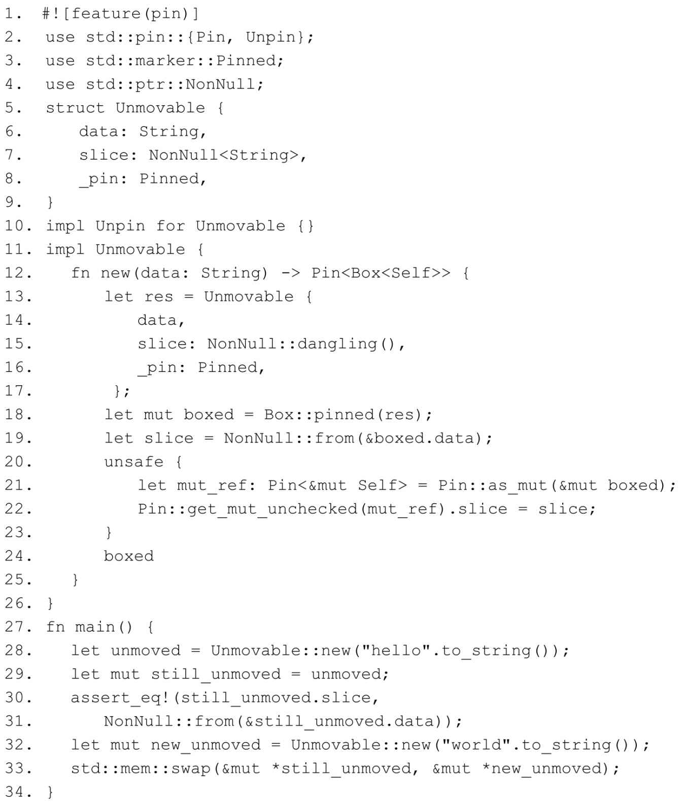{.u53634}
:::

在代码清单11-76中，代码第1行使用了**＃！\[feature（pin）\]** 特性，这是因为目前Pin＜T＞还是实验性特性。

代码第2行，引入了Pin和Unpin。顾名思义，Pin有"钉"之意。在Rust中，使用Pin＜T＞则代表将数据的内存位置牢牢地"钉"在原地，不让它移动。Unpin 则正好和 Pin 相对应，代表被"钉"住的数据，可以安全地移动。大多数类型都自动实现了Unpin。

代码第3行，引入了Pinned，这是一个用于标记的结构体，被定义于std：：marker模块中。如果一个类型中包含了Pinned，则意味着该类型将不会默认实现Unpin，但不影响手动实现。

代码第4行，引入了NonNull＜T＞，这是为了创建自引用结构体而使用的。

代码第5～9行，定义了一个**自引用结构体** Unmovable，它包含的字段slice很可能会引用data字段。另外，Unmovable还包含了Pinned字段，表示它将不会默认实现Unpin。

代码第10行，手动为Unmovable实现Unpin。

代码第11～26行，为Unmovable实现了new方法，它返回一个Pin＜Box＜Self＞＞类型的值。在new方法中，首先创建了一个Unmovable实例res，然后使用Box：：pinned方法将res生成Pin＜Box＜Unmovable＞＞类型的值boxed，再利用NonNull：：from函数将boxed实例的data字段转换为NonNull 指针绑定给slice变量。接下来，在unsafe块中，通过Pin：：as_mut函数从&mut boxed 得到一个 Pin＜&mut Self＞类型的值 mut_ref，在当前代码中具体类型为 Pin＜&mut Unmovable＞。最后通过 Pin：：get_mut_unchecked 函数引用 Pin＜&mut Unmovable＞中的&mut Unmovable，并将其slice字段的值赋值为slice变量。这就创建了一个自引用结构体的实例。

在main函数中，使用new方法创建了Unmovable实例unmoved，然后将其赋值给新的变量still_unmoved，目的是想要转移unmoved的所有权。从第30行和第31行的断言代码中得知，该结构体实例在所有权转移之后，字段的地址并没有改变。slice字段引用的data字段最初的地址，现在断言相等，就证明data字段的地址没有变。Pin＜T＞类型起作用了。

代码第 32 行和第 33 行，创建了一个新的 Unmovable 实例 new_unmoved，使用std：：mem：：swap 来交换它和 still_unmoved 的引用地址，正常通过。这是因为代码第 10 行为Unmovable实现了Unpin。如果将代码第10行注释掉，swap代码将编译失败。如果此时继续将Unmovable的Pinned类型字段注释掉，则该结构体会默认实现Unpin，swap代码将正常编译。

现在回顾在代码清单11-73中GenFuture实现poll方法时，使用了Pin＜&mut Self＞，就确保该类型最终生成的生成器不会出现因为自引用结构体而产生未定义行为的情况。然后在需要时使用 Pin：：get_mut_unchecked 函数获取其包含的可变借用。Pin＜T＞结构体也包含了很多其他函数，读者可以到标准库文档中自行查看。

**async/await异步开发示例**

当前，要想使用Rust进行异步开发，需要配合使用标准库和第三方futures-rs库。这是因为标准库中引入了Future和Task两种类型，是为了配合实现async/await关键字。而Future的大部分功能都由futures-rs来提供，未来标准库和futures-rs库可能会有所变化，但是大体的原理和机制基本不会改变，要变的也只能是API。

接下来通过一个具体的示例来回顾 Rust 异步开发。使用 cargo new 命令创建一个新的crate，命名为"futures-demo"。在Cargo.toml文件中引入第三方库futures-preview，本书代码使用的是0.3.0-alpha.7版本，然后修改main.rs文件，如代码清单11-77所示。

**代码清单11-77：async/await异步开发示例**

::: center
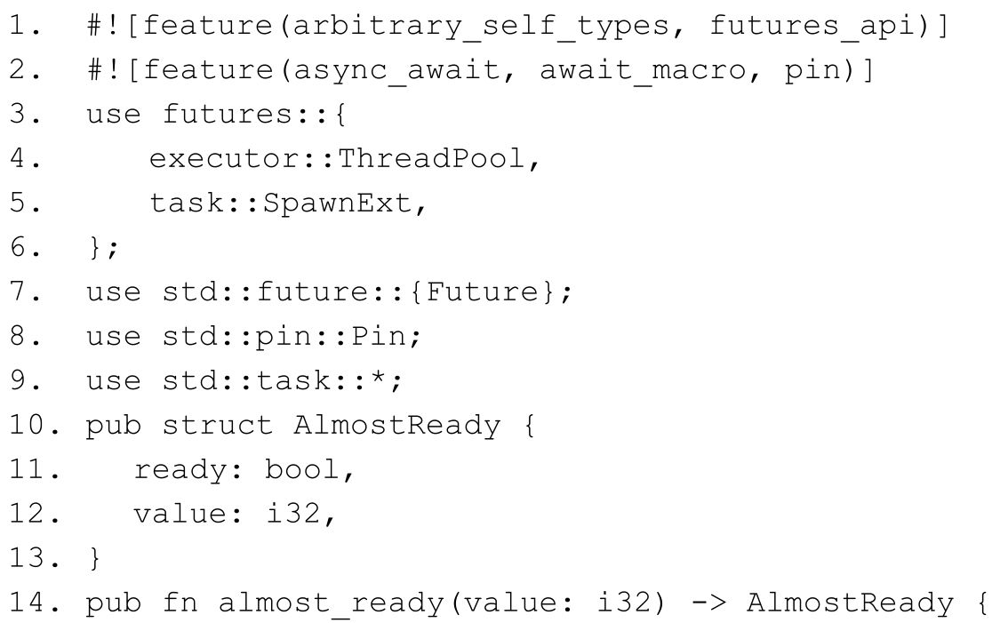{.u53633}
:::

::: center
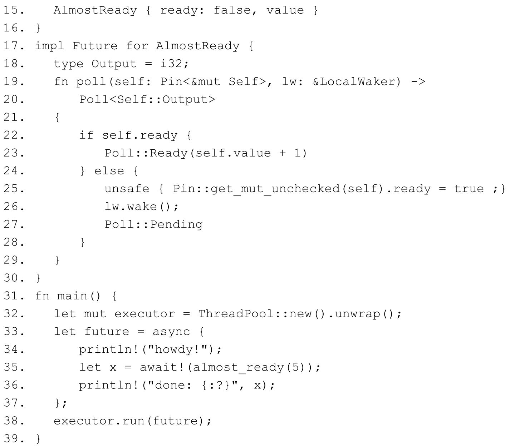{.u53632}
:::

在代码清单11-77中使用了很多特性，包括＃！\[feature（arbitrary_self_types，futures_api）\]和＃！\[feature（async_await，await_macro，pin）\]。这些都是异步开发需要的未稳定特性。

代码第3～6行，引入了futures-rs库中的executor：：ThreadPool和task：：SpawnExt。回想一下Future系统，这里需要executor和task模块来调度和执行具体的异步任务。

代码第7～9行，引入了标准库中的Future、Pin和task相关类型。它们是为async/await异步语法服务的。

代码第10～13行，创建了AlmostReady结构体，包含bool类型的ready和i32类型的value两个字段。

代码第14～16行，创建了almost_ready函数，它接收一个i32类型的值，返回一个ready默认为false的AlmostReady结构体实例。

代码第 17～30 行，为 AlmostReady 结构体实现 Future。其中 poll 方法的参数需要是Pin＜&mut Self＞类型，以及一个可以唤醒任务的句柄 lw，它是一个引用类型&LocalWaker，如果任务已经准备好轮询，则由它来通知Executor进行调度。在poll方法的实现中，会判断当前任务，也就是 AlmostReady 实例的 ready 字段是否为 true。如果为 true，则返回Poll：：Ready（self.value+1），表示异步计算的最终结果；如果为false，则继续进行计算，直到将ready字段设置为true，代表此时计算已完成。同时，通过lw句柄调用wake方法，将任务再次唤醒，等待下一次轮询。所谓唤醒，实际上就是将该异步任务重新加入任务队列中。可以回顾图11-13展示的Executor和Task工作机制。最后返回Poll：：Pending，代表本次轮询的结果。

接下来，在main函数中定义和执行异步任务。

代码第32行，通过ThreadPool：：new方法创建一个调度器实例executor。

代码第33～37行，通过async块创建Future实例future。在async块中将almost_ready函数返回的初始AlmostReady实例置于await！宏中，等待异步任务执行的结果。

代码第38行，调用executor的run方法将future传入，异步任务将执行。继续回顾图11-13展示的Executor和Task工作机制。在run方法中，会将传入的future打包成一个FutureObj对象，并将其通过内置的spawn_obj方法发送到Channel队列中，等待work方法执行该任务。

对于该示例代码，可以到随书源码中本章目录下的futures-demo项目中进行查看。最后，编译运行该示例代码，输出结果如代码清单11-78所示。

**代码清单11-78：async/await异步开发示例的输出结果**

::: center
{.u53631}
:::

回顾整个异步开发机制，实际上可以总结为两点：

· 实现Future，构造异步任务。

· 生成Task，计算异步任务。

其中Task就像是在线程基础上又抽象出来的一层"轻量级线程"，其使用语法也和线程差不多，比如在futures-rs库中内置了spawn_obj和spawn等函数来方便开发者将Future放入其中，生成异步任务。正因为如此，也有人将Future异步开发体系称为**用户级线程** 。

在futures-rs库中还提供了很多方便组合或嵌套Future异步任务的各种组合函数，限于篇幅，这里就不一一介绍了，读者可以自行查看其文档。

## 11.4 数据并行 {#text00017.html#A4d5401c2-3222-4628-8cee-5f743229de04 .title-left}

在过去的几十年里，人类不停地提升计算机的算力。计算机在许多领域的发展十分迅猛，随着人类前进的步伐，越来越多的领域对计算的要求越来越高，待解决问题的规模也在不断增加。因此，对并行计算的要求就越来越强烈。

对于这个问题大致有两种解决方案：**任务并行（Task Parallelism）** 和**数据并行（Data Parallelism）** 。任务并行是指将所需要执行的任务分配到多个核上；数据并行是指将需要处理的数据分配到多个核上。因为数据并行处理起来比任务并行更加简单和实用，所以得到重点关注。

按Flynn分类法，将计算机系统结构分为四类，如图11-16所示。

::: center
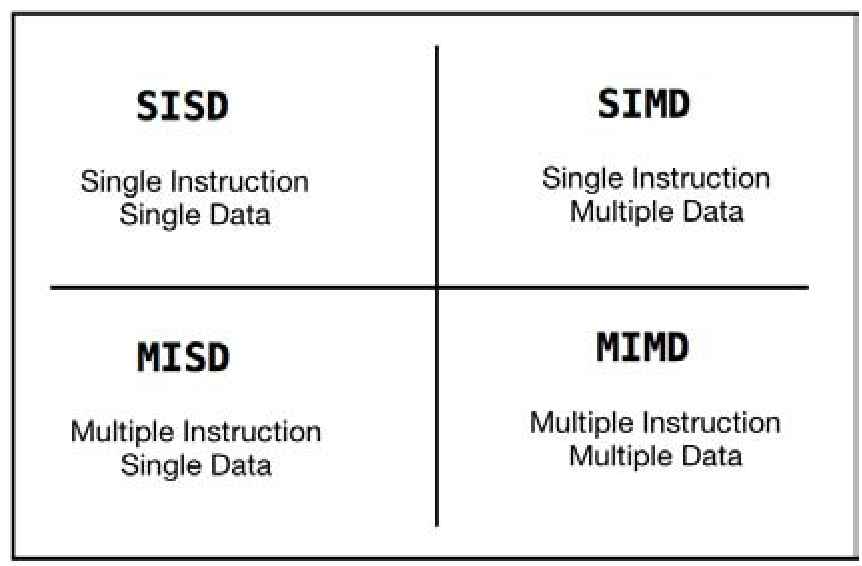{.u53630}

图11-16：计算机系统结构分类
:::

**SISD** 是指单指令单数据的单CPU机器，它在单一的数据流上执行指令。可以说，任何单CPU的计算机都是SISD系统。

**MISD** 则是指有*N* 个CPU的机器。在这种架构下，底层的并行实际上是指令级的并行，也就是说，有多个指令来操作同一组数据。但是MISD在实际中很少被用到。

**SIMD** 是指包含了多个独立的 CPU，每一个 CPU 都有自己的存储单元，可以用来存储数据。所有的CPU可以同时在不同的数据上执行同一个指令，也就是**数据并行** 。这种架构非常实用，便于算法的设计和实现。

**MIMD** 是应用最广泛的一类计算机体系。该架构比SIMD架构更强，通常用来解决SIMD无法解决的问题。

### 11.4.1 什么是SIMD {#text00017.html#Af6b501c3-a9fe-4437-94b7-406aefda4e21 .title-left}

SIMD的思想其实很容易理解。以加法指令为例，如果采用SISD架构来计算，则需要先访问内存，取得第一个操作数，然后再访问内存，取得第二个操作数，最后才能进行求和运算。但是如果采用SIMD架构，则可以一次性从内存中获得两个操作数，然后执行求和运算。

更专业的描述是，SIMD是一种采用一个控制器控制多个CPU，同时对一组数据（向量数据）中的每一个数据分别执行相同的操作而实现空间上数据并行的技术。

**起源和历史**

SIMD起源于美国首批超级计算机之一的ILLIAC IV大型机中，它拥有64个处理器单元，可以同时进行64个计算。随着现代多媒体技术的发展，各大CPU生产商陆续扩展了多媒体指令集，允许这些指令一次处理多个数据。最早是Intel的**MMX（MultiMedia eXtensions）** 指令集，包含了57个多媒体指令、8个64位寄存器。然后是**SSE（Streaming SIMD Extensions）** 指令集，它弥补了MMX浮点数支持不足的问题，并将寄存器的宽度扩展到128位，引入了70个新指令。接下来陆续出现了SSE2、SSE3、SSE4和SSE5指令集。指令集的不断扩展，其实背后暗含了CPU巨头之间的市场战争。但是对于开发者来说，就比较麻烦了。

2011年Intel发布了全新的处理器微架构，其中增加了新的指令集**AVX（Advanced Vector Extensions）** ，进一步把寄存器的宽带扩展到256位，并且革新了指令格式，支持三目运算。我国"天河二号"超级计算机的核心技术便是AVX-512的SIMD，该技术将寄存器的宽度扩展到512位。AVX具有256位寄存器，可同时进行4个64位计算，或8个32位计算，或16个16位计算，甚至32个8位计算。

**术语介绍**

按寄存器的宽度可以将SIMD看作不同的并行通道。拿AVX-256来说，如果按4个64位进行计算，就可以看成是4个并行计算通道。而在SIMD中并行计算可以分为多种计算模式，其中有垂直计算和水平计算，如图11-17所示。

在垂直计算中，每个并行通道都包含的待计算值称为标量值，通道按水平方向进行组织。将加法运算中X和Y的数据在垂直方向上进行求和。在垂直计算中，每组计算的标量值都来自不同的源。水平计算则是将并行通道垂直组织，依次对两个相邻通道的标量值进行求和。在水平计算中，每组计算的标量值都来自同一个源。

::: center
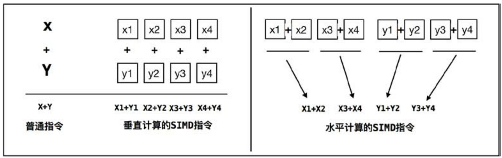{.u53629}

图11-17：SIMD指令的垂直计算和水平计算示意图
:::

这种并行计算也是有限制的。对于不同的指令集，一次数据并行能接受的长度是固定的，比如AVX-256，能接受的长度为256字节。

编写SIMD数据并行的代码称为**向量化（Vectorization）** 。这是因为**向量（Vector）** 是一个指令操作数，包含一组打包到一维数组的数据元素。大多数SIMD指令都是对向量操作数进行操作的，所以向量也被称为**SIMD操作数** 或**打包操作数** 。数据并行意味着可以同时对向量的所有数据元素执行变换操作。所以，将编写程序使用向量处理器的过程，称为向量化、矢量化或SIMD化。向量化可以由编译器自动优化，也可以由程序员手动指定。

### 11.4.2 在Rust中使用SIMD {#text00017.html#A22e801c4-5d7f-4aba-8a94-87b36df59abc .title-left}

Rust从1.27版本开始支持SIMD，并且默认为x86和x86_64目标启用SSE和SSE2优化。Rust基本支持市面上90%的SIMD指令集，从SSE到AVX-256。不过，目前还不支持AVX-512，在不久的将来会支持。

Rust 通过标准库std：：arch 和第三方库 stdsimd 结合的方式来支持SIMD。Rust 对SIMD的支持是属于比较底层的，在标准库中支持多种CPU平台架构，比如x86、x86_64、ARM、AArch64等。每种架构都有相应的模块，比如std：：arch：：x86模块定义的就是与x86平台相关的SIMD指令。并且在平台模块中所有的函数都是unsafe的，因为调用不支持的平台指令可能会导致未定义行为。

**SIMD使用示例**

现在我们来看一个简单的示例。使用 cargo new 命令创建一个新的 crate，命名为"simd-demo"。在Cargo.toml文件中加入依赖的第三方库stdsimd，本书示例使用0.1.0版本，然后编写src/main.rs文件，如代码清单11-79所示。

**代码清单11-79：SIMD使用示例**

::: center
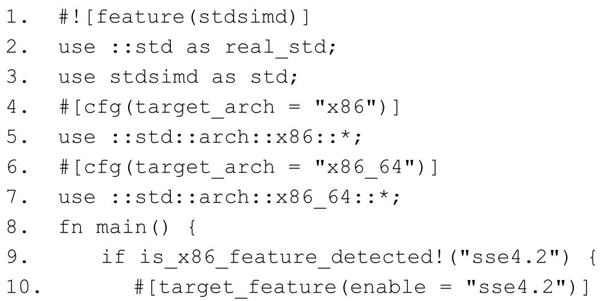{.u53628}
:::

::: center
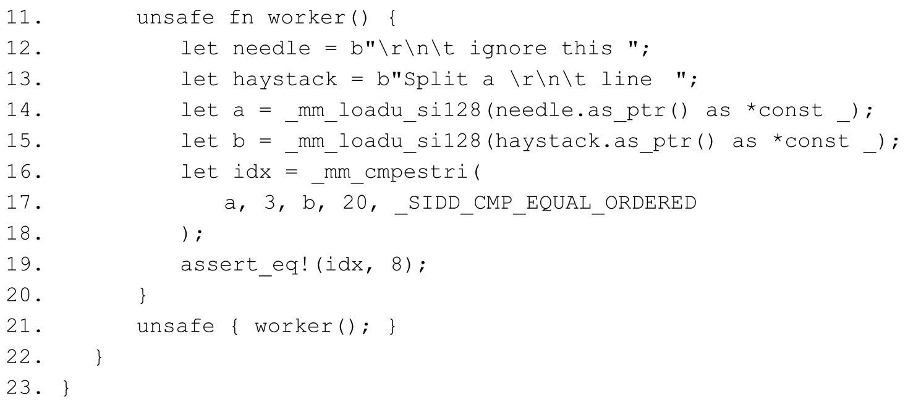{.u53627}
:::

在代码清单11-79 中，首先使用了**＃！\[feature（stdsimd）\]** 特性，这意味着目前使用 stdsimd库需要Nightly环境。

代码第2行，使用了use的别名功能，将标准库std的库名换成了另外一个名字"real_std"。因为这里想把std这个名称指代为stdsimd库，如代码第3行所示。

代码第4行，使用了**＃\[cfg（target_arch=＂x86＂）\]** 条件编译属性，相当于静态检测CPU平台架构，如果是x86平台，则编译该属性下方的代码，也就是引入在std：：arch：：x86模块中定义的函数。

代码第6行，同理，静态检测CPU平台为x86_64，然后进行条件编译。

在main函数中，代码第9行的if条件使用了is_x86_feature_detected！（＂sse4.2＂）宏，它是一种动态检测CPU平台的技术，因为有时需要在运行时来检测CPU平台。这里是判断当前代码执行的CPU平台是否支持SSE4.2指令集。

代码第11～20行，定义了一个unsafe函数worker，该函数将使用SIMD指令来执行字符串搜索任务。因为要用到SIMD指令，所以该函数被标记为unsafe的。

代码第12行和第13行，分别定义了搜索用到的两个字符串，即needle和haystack。这里是想要在haystack中查找匹配needle的子串位置。

代码第14行，调用了_mm_loadu_si128函数，该函数接收一个\_\_m128i类型的原生指针，它会从内存中将长度为 128 位的整数数据加载到向量寄存器中。它实际调用的是 Intel 的_mm_loadu_si128指令。这里是将needle字符串加载到向量寄存器中。

代码第 15 行，同理，将 haystack 字符串加载到向量寄存器中，这个过程也称为**打包字符串** 。

代码第16行，调用了_mm_cmpestri函数。该函数的第一个参数a是指打包好的needle字符串；第二个参数是想要检索的长度，这里指定为3；第三个参数是打包好的haystack字符串b；第四个参数是其长度，这里指定为20；第五个参数_SIDD_CMP_EQUAL_ORDERED是指定比较模式说明符，它代表字符串相等检测模式。所以，整个_mm_cmpestri函数要做的就是在haystack字符串中查找匹配needle前三位的索引位置。

代码第19行，通过断言说明，满足匹配条件的字符串索引位置是8。

最后执行cargo run命令，该段代码可以正常编译运行。请注意运行该段代码的具体CPU架构，如果其不支持SSE4.2，则无法运行。

以上是手动使用内置的平台函数向量化代码，其实Rust还可以利用LLVM自动向量化。在src目录下新增auto_vector.rs文件，并编写新代码，如代码清单11-80所示。

**代码清单11-80：利用LLVM自动向量化为AVX2指令集**

::: center
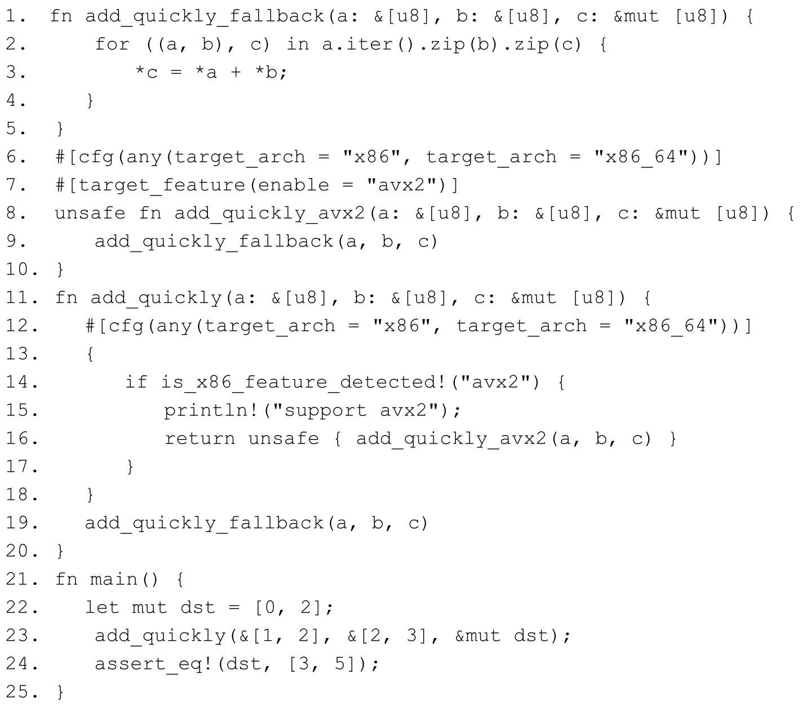{.u53626}
:::

在代码清单11-80中，代码第1～5行，首先定义了add_quickly_fallback函数，可以将传入的第三位参数切片中的元素替换为前两位参数切片的元素之和。

代码第 6～10 行，对 add_quickly_avx2 函数使用了**＃\[cfg（any（target_arch=＂x86＂，target_arch=＂x86_64＂））\]** 和**＃\[target_feature（enable=＂avx2＂）\]** 属性修饰，目的就是为了让LLVM自动向量化该函数，限定平台范围为x86和x86_64，并且向量化为AVX2指令集。在该函数内部调用了add_quickly_fallback函数。

代码第11～20行，定义了add_quickly函数。在该函数内部同样使用了＃\[cfg（any（target_arch=＂x86＂，target_arch=＂x86_64＂））\]属性限定平台范围为x86和x86_64。在此限定下，又使用动态检测宏is_x86_feature_detected！（＂avx2＂）判断当前执行平台是否支持AVX2指令集，只有在支持的情况下，才可以使用add_quickly_avx2函数。如果当前执行平台支持AVX2，则代码第15行的打印语句会有相应的输出。

如果不是x86或x86_64平台，则继续使用add_quickly_fallback函数进行计算。这是一种平台兼容性策略。最后，在main函数中调用add_quickly函数。

接下来，还需要修改**Cargo.toml** 文件，才能执行该段代码。因为在当前src目录下出现了main.rs和auto_vector.rs两个带有main函数的文件。打开Cargo.toml文件，进行bin相关配置，如代码清单11-81所示。

**代码清单11-81：在Cargo.toml文件中进行bin相关配置**

::: center
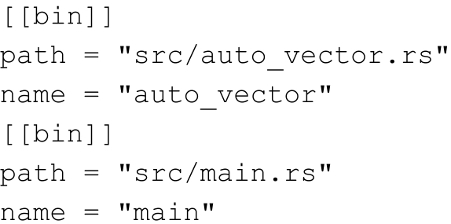{.u53625}
:::

通过这样的配置就可以让crate支持多个main函数文件。

最后，只要执行**cargo run\--bin auto_vector** 命令，就可以执行auto_vector.rs中的代码。同理，如果想执行main.rs中的代码，则需要使用**cargo run\--bin main** 命令。

**SIMD命名说明**

在代码清单11-79中，调用SIMD函数的命名乍一看会感觉非常奇怪，但实际上它们的命名遵循一定的规则。就拿x86平台来说，其主要支持以下几种类型：

·**\_\_m128i** ，代表128位宽度的整数向量类型。

·**\_\_m128** ，代表128位宽度的4组f32类型。

·**\_\_m128d** ，代表128位宽度的2组f64类型。

·**\_\_m256i** ，代表256位宽度的整数向量类型。

·**\_\_m256** ，代表256位宽度的8组f32类型。

·**\_\_m256d** ，代表256位宽度的4组f64类型。

也有其他类型，这里不再赘述。像ARM平台支持的类型命名就比较直观，比如：

· **float32x2_t** ，代表64位宽度的2组打包f32向量类型。

· **float32x4_t** ，代表128位宽度的2组打包f32向量类型。

· **int32x2_t** ，代表64位宽度的2组打包i32向量类型。

· **int32x4_t** ，代表128位宽度的2组打包i32向量类型。

虽然各个平台的命名格式不同，但是其内部还是有规则可循的。

同理，函数命名也有规则。就拿函数std：：arch：：x86：：\_mm256_add_epi64来说，以_mm256_开头的代表AVX指令，然后跟随的是对应的指令操作，比如add、mul或abs之类的，最后是使用的类型，如_pd用于双精度或64位浮点数，\_ps用于32位浮点数，\_epi32用于32位整数。在不同的平台架构下，基本的函数命名也遵循类似的组合规则。

**第三方库介绍**

除了官方提供的第三方库stdsimd，Rust社区中还有很多simd库，其中比较突出的是faster和simdeez。这两个库的特色是，相比于stdsimd做了更进一步的抽象，对开发者友好。

就拿 faster 来说，它封装了很多函数，开发者就不需要记忆标准库中各个平台下函数的命名规则了，如代码清单11-80所示。

**代码清单11-82：第三方库faster提供的函数示例**

::: center
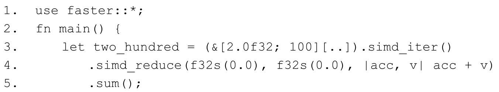{.u53624}
:::

::: center
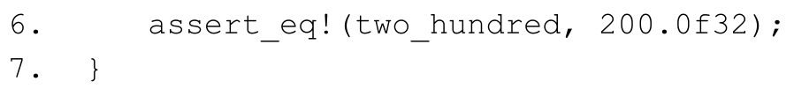{.u53623}
:::

从代码清单11-82中可以看出，faster库提供了很多可读性很高的函数来方便开发者开发SIMD代码。

## 11.5 小结 {#text00017.html#Aa84f01c8-8041-4ff7-8230-1cf607a1bb2d .title-left}

随着多核CPU的普及，多线程并发编程正逐渐成为主流的编程范式。但是多线程并发编程与生俱来的问题十分严重，使得开发者极难编写出正确的多线程并发程序。Rust语言为安全而生，它不仅能保证内存安全，还能保证并发安全。Rust依靠严谨的类型系统和所有权系统，帮助开发者在编译时就能发现多线程并发程序中出现的数据竞争问题，从而保证线程安全。

在 Rust 标准库中提供了保证线程同步的互斥锁和读写锁，以及屏障和条件变量。Rust也从 C++11 那里继承了多线程内存模型，实现了原子类型。基于"使用通信来共享内存"的理念，提供了多生产者单消费者通信队列，可以实现跨线程通信，从而实现无锁编程。

通过本章中提供的大量多线程编程示例，可以使读者对使用Rust编写正确的多线程并发程序有更深入的了解。

除了多线程安全并发，Rust的另一个目标是成为高性能网络服务开发的首选语言。所以，Rust 语言开始逐步支持 async/await 异步开发。通过本章的学习，我们了解到 Rust 支持async/await的曲折过程，同时也感受到了Rust异步开发的方便和强大之处。虽然目前异步开发还未稳定，但也用不了多久就会稳定的。

作为现代化系统编程语言，Rust还支持SIMD数据并行。数据并行和异步开发类似，还未完全稳定，如果想使用它，则需要准备Nightly环境。

相信在不远的将来，Rust在并发编程和数据并行领域将大放异彩。

------------------------------------------------------------------------

[\[1\]](#text00017.html#n26AF0183D5994F05AB0FAB5FFF094029s){#text00017.html#n26AF0183D5994F05AB0FAB5FFF094029} 此处并非特指某一个操作系统。在Linux内核中调度单位是task，但也可以看作是线程。

[\[2\]](#text00017.html#n73B60195E9CD4DBFAEFD65AAA278A3DFs){#text00017.html#n73B60195E9CD4DBFAEFD65AAA278A3DF} 请参见play.rust-lang.org。

[\[3\]](#text00017.html#n38DB8739EDE14128824122BCBAAFDF3Es){#text00017.html#n38DB8739EDE14128824122BCBAAFDF3E} 缩写tx和rx为通信专业术语，tx中的t代表Transimt，rx中的r代表Receive，都加上x是为了避免缩写混淆。

[\[4\]](#text00017.html#nE840A484EA9B4DA885B690B2279B2A1Cs){#text00017.html#nE840A484EA9B4DA885B690B2279B2A1C} threadpool包的源码地址：https：//crates.io/crates/threadpool，本章中与线程池相关的演示代码对其做了部分精简。

[\[5\]](#text00017.html#n869A01AD10D243BB9DE979058F6CF597s){#text00017.html#n869A01AD10D243BB9DE979058F6CF597} 源码地址：https：//github.com/rayon-rs/rayon。

[\[6\]](#text00017.html#nB10C91392C3442F3A7FC214B35C9B6FFs){#text00017.html#nB10C91392C3442F3A7FC214B35C9B6FF} 此处基于Rust Nightly 1.30版本。

[\[7\]](#text00017.html#n4F4301B9CAC343818ED8CBC4060BFB33s){#text00017.html#n4F4301B9CAC343818ED8CBC4060BFB33} 此处基于futures-rs 0.3版本。

[]{#text00018.html}

# 第12章 元编程 {#text00018.html#Aedd163b9-fb37-4d1b-8a1f-5636b6249a5e .title-left}

道生一，一生二，二生三，三生万物。

元编程来源于 **Meta-Programming** 一词。**Meta** 表示"关于某事本身的某事"。比如Meta-Knowledge，代表"关于知识本身的知识"，称为元知识。再如 Meta-Cognition，代表"关于认知本身的认知"，称为元认知。所以，Meta-Programming就代表了**元编程** 。人类通过培养和扩展自己的元知识或元认知，就可以拥有独立思考进一步产生新知识或新认知的能力。同样，通过元编程的手段可以让程序生成新的程序。Meta被译为"元"，在语义上比较合理，"元"有本源和开端之意，和中国的道家思想相契合。

元编程在计算机领域是一个非常重要的概念，它允许程序将代码作为数据，在运行（或编译）时对代码进行修改或替换，从而让编程语言产生更加强大的表达能力。总之，元编程就是支持用代码生成代码的一种方式。各种编程语言中或多或少都提供了基本的元编程能力。像C或C++中，可以使用预编译器对宏定义进行文本替换。像Rust、Ruby或Elixir等语言，则是通过操作抽象语法树（AST）来提供更强大的元编程能力。另外，Rust中利用泛型进行静态分发，所以泛型也是元编程的一种能力，同样，C++中的模板也可以做到和泛型编程类似的事情。

元编程技术大概可以分为以下几类。

· **简单文本替换** ，比如，C/C++中的宏定义，在编译期直接进行文本替换。

· **类型模板** ，比如C++语言支持模板元编程。

· **反射** ，比如，Ruby、Java、Go和Rust等或多或少都支持反射，在运行时或编译时获取程序的内部信息。

· **语法扩展** ，比如，Ruby、Elixir、Rust 等语言可以对抽象语法树进行操作而扩展语言的语法。

· **代码自动生成，** 比如，Go语言提供go generate命令来根据指定的注释自动生成代码。

其实语法扩展和代码自动生成的关系比较微妙，语法扩展是对AST进行扩展，实际上也相当于生成了代码。但是语法扩展是为了扩展语法而生成代码，比如Rust的derive属性，可以为结构体自动实现一些 trait。而代码自动生成是指在开发中为了减少代码重复或其他原因而自动生成一些代码。

使用元编程可以做到很多普通函数做不到的事情，比如复用代码、编写领域专用语言（DSL）等。Rust语言通过反射和AST语法扩展两种手段来支持元编程。

## 12.1 反射 {#text00018.html#A9c5d01ca-3ec3-4b9c-9d4a-a584eaed38ca .title-left}

反射（Reflect）机制一般是指程序自我访问、检测和修改其自身状态或行为的能力。Rust标准库提供了std：：any：：Any来支持运行时反射。

代码清单12-1展示了Any的定义。

**代码清单12-1：Any定义**

::: center
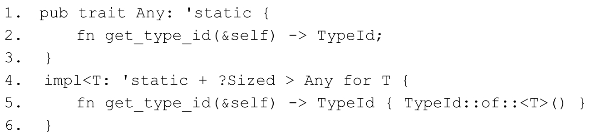{.u53622}
:::

代码清单12-1中第1～3行展示了**Any** 的定义，注意到该trait加上了**＇static** 生命周期限定，意味着该trait不能被非静态生命周期的类型实现。代码第4～6行显示，Rust中满足**＇static** 生命周期的类型均实现了它。

其中，get_type_id方法返回**TypeId** 类型，代表Rust中某个类型的全局唯一标识，它是在编译时生成的。每个TypeId都是一个"黑盒"，不能检查其内部内容，但是允许复制、比较、打印等其他操作。TypeId同样仅限于静态生命周期的类型，但在未来可能会取消该限制。

Any还实现了一些方法用于运行时检测类型，比如is方法，如代码清单12-2所示。

**代码清单12-2：Any中实现的is方法源码示意**

::: center
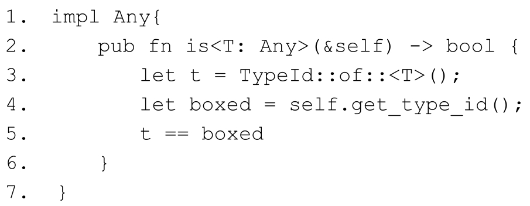{.u53621}
:::

代码清单12-2中，为Any实现了is方法，因为Any是trait，所以这里的is方法的&self必然是一个trait对象。

代码第3行通过TypeId：：of函数来获取类型T的全局唯一标识符t。

代码第4行通过调用self的get_type_id方法，同样得到一个全局唯一标识符boxed。通过代码清单12-1也得知，get_type_id方法内部实际上也是调用了TypeId：：of函数。

代码第5行通过比较t和boxed是否相等，最终返回bool类型的值。

### 12.1.1 通过is函数判断类型 {#text00018.html#Af80f01ca-ba27-4b49-b6e2-f05ab1e2b658 .title-left}

代码清单12-3展示了is函数的一些用法。

**代码清单12-3：Any中实现的is方法源码示意**

::: center
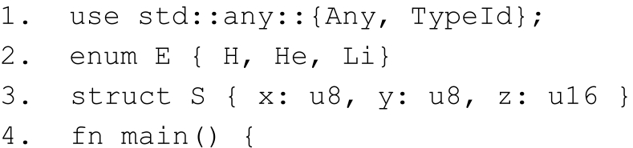{.u53620}
:::

::: center
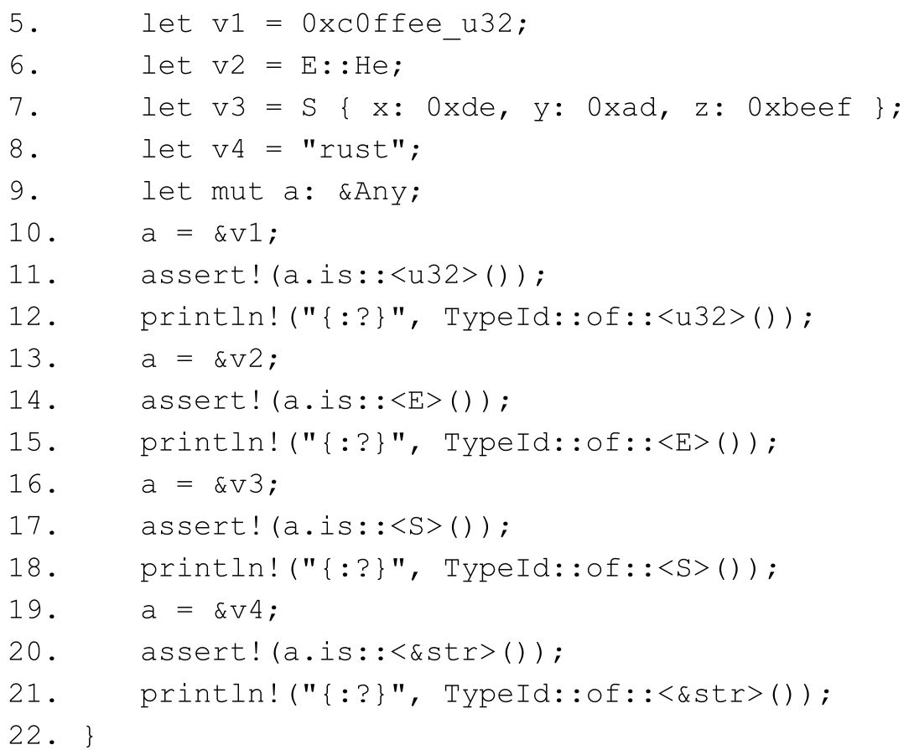{.u53619}
:::

代码清单12-3中，第2行和第3行是两个自定义类型，枚举体E和结构体S。在main函数中，通过调用is函数来判断类型。

代码第5～8行分别声明了绑定v1为u32类型、v2为枚举体实例、v3为结构体实例、v4为字符串字面量。

代码第9行声明了可变绑定a为&Any类型，&Any在此处用作trait对象。从第11行开始，直到第21行，是分别把a的值指定为v1到v4，然后通过is函数判断它们的类型。与此同时，使用了TypeId：：of方法分别打印这些类型的全局唯一标识符。

代码可以正常编译运行，输出结果如代码清单12-4所示。

**代码清单12-4：输出结果**

::: center
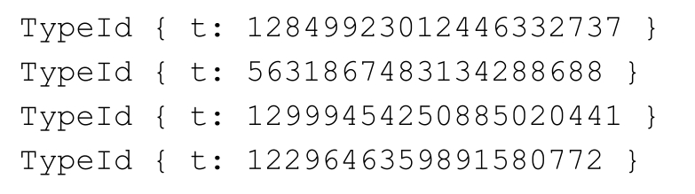{.u53618}
:::

从代码清单12-4中看得出来，TypeId是一个结构体，其字段t存储了一串数字，这就是**全局唯一类型标识符** ，实际上是u64类型。代表唯一标识符的这串数字，在不同的编译环境中，产生的结果是不同的。所以在实际开发中，最好不要将TypeId暴露到外部接口中被当作依赖。

### 12.1.2 转换到具体类型 {#text00018.html#A0cc201cb-3a13-4ad1-8764-538b00ecb0cc .title-left}

Any也提供了**downcast_ref** 和**downcast_mut** 两个成对的泛型方法，用于将泛型T向下转换为具体的类型，返回值分别为Option＜&T＞和Option＜&mut T＞类型。其中downcast_ref将类型T转换为不可变引用，而downcast_mut将类型T转换为可变引用。代码清单12-5展示了downcast_ref的用法。

**代码清单12-5：使用downcast_ref向下转换类型**

::: center
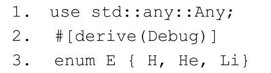{.u53617}
:::

::: center
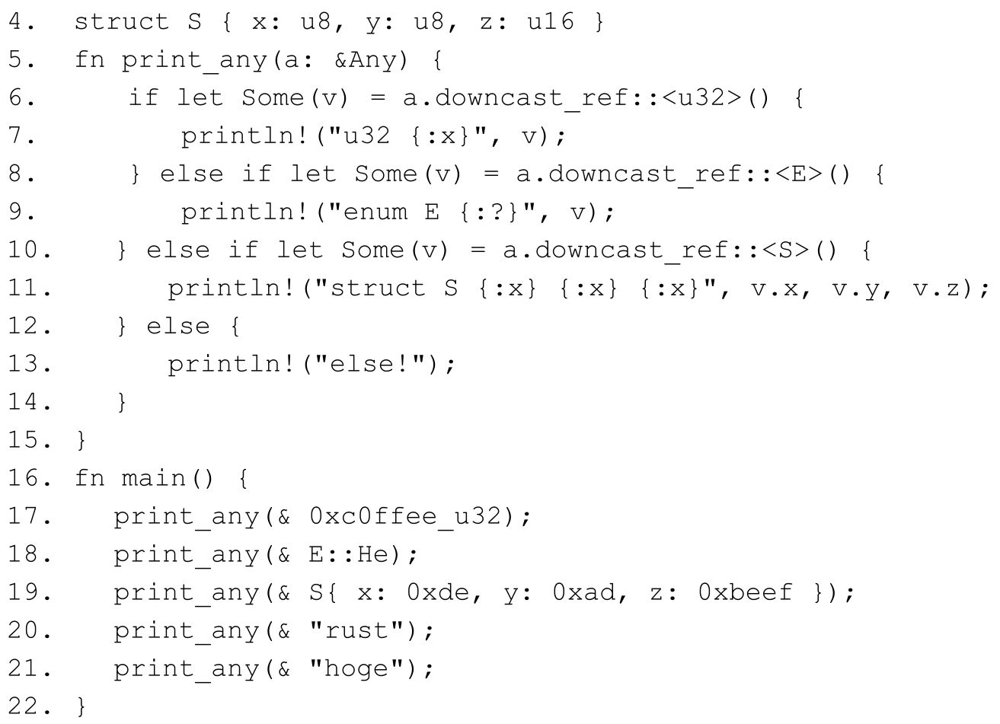{.u53616}
:::

代码清单12-5中，从第5～15行定义了print_any方法，以&Any作为参数类型。在print_any方法中，使用if let语句对downcast_ref的转换结果进行匹配，如果转换成功，则打印相应的结果。

在main函数中，分别将不同类型的值传入print_any函数中。这里需要注意的是，参数必须是引用，因为参数类型为trait对象，而大部分类型都实现了Any。最终的输出结果如代码清单12-6所示。

**代码清单12-6：打印结果**

::: center
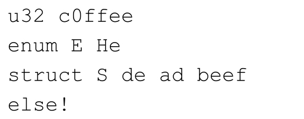{.u53615}
:::

除使用&Any外，也可以使用Box＜Any＞，如代码清单12-7所示。

**代码清单12-7：使用Box＜Any＞**

::: center
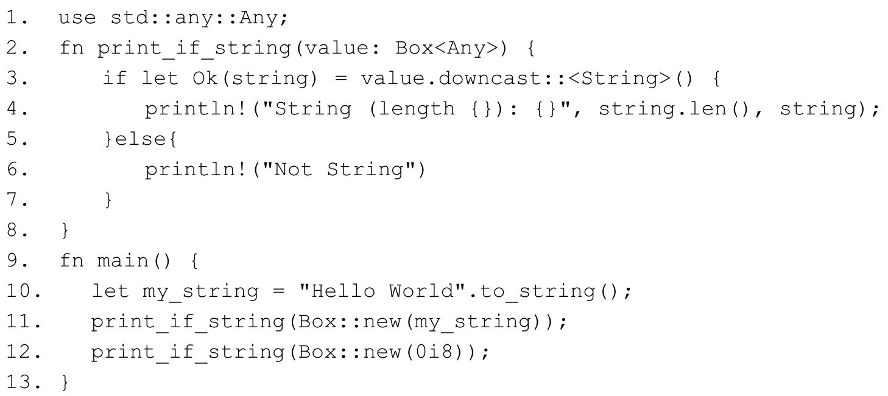{.u53614}
:::

代码清单12-7中定义了print_if_string函数，该参数使用了Box＜Any＞类型。这里需要注意，因为Box＜Any＞类型是独占所有权的类型，所以无法像代码清单12-5中的print_any方法那样匹配多种类型。

代码第3行的if let匹配中，使用了Box＜Any＞实现的downcast方法将类型转换为String。注意，downcast方法最终返回的是Result类型。

代码执行的结果如代码清单12-8所示。

**代码清单12-8：打印结果**

::: center
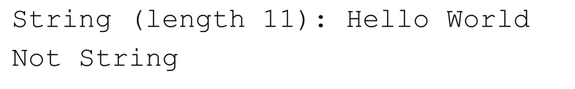{.u53613}
:::

### 12.1.3 非静态生命周期类型 {#text00018.html#Aaf5f01cd-a3c5-4a98-a3e0-5ed39777dff0 .title-left}

非静态生命周期类型没有实现Any，如代码清单12-9所示。

**代码清单12-9：非静态生命周期类型没有实现Any**

::: center
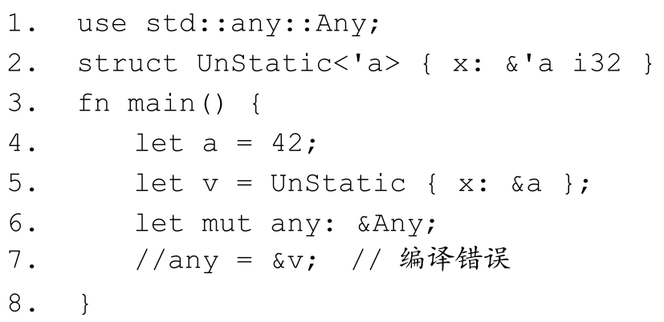{.u53612}
:::

代码清单12-9中定义了一个带引用字段的结构体UnStatic＜＇a＞，注意其生命周期不是静态（**＇static** ）生命周期。

在main函数中，第6行声明了类型为&Any的绑定any，但是在第7行将UnStatic的引用实例&v绑定给any的时候，编译会出错。

如果使用一个静态生命周期的值生成UnStatic实例，则不会出现编译错误，如代码清单12-10所示。

**代码清单12-10：使用静态生命周期类型的值创建UnStatic实例**

::: center
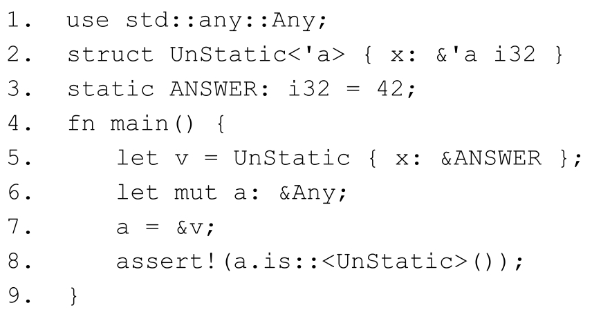{.u53611}
:::

代码清单 12-10 中，第 3 行新增了静态绑定 ANSWER，其生命周期是静态的，其引用&ANSWER也是静态的。所以在main函数中，使用&ANSWER创建的Unstatic实例v的生命周期也是静态的。所以，在本例中，UnStatic是实现了Any的类型。

代码第6行定义了&Any类型的可变绑定a，在第7行可以正常将&v绑定给a，同样在第8行可以正常调用is函数来判断类型。

## 12.2 宏系统 {#text00018.html#Ab09201ce-eb9b-401f-a370-68b9a6b5efd5 .title-left}

Rust 中反射功能虽然有限，但除此之外，Rust 还提供了功能强大的**宏** （Macro）来支持元编程。宏是一种批处理的称谓，通常来说，是指根据预定义的规则转换成相应的输出。这种转换过程叫作**宏展开** （Macro Expansion）。

### 12.2.1 起源 {#text00018.html#A930c01ce-1ef1-48e7-9c8c-70184d1f4633 .title-left}

现在很多语言都提供了宏操作，大致可以分为两类：**文本替换** 和**语法扩展** 。

C语言中的宏函数就属于文本替换，比如"＃define min（X，Y） （（X）＜（Y）？（X）：（Y））"，当调用min（1，2）时，通过预处理器将宏展开之后就会变为"（（1）＜（2）？（1）：（2））"。由于C的宏是纯文本替换，预处理器并不会对宏体做任何检查，所以使用它的时候经常会出现问题。

另外一种可以进行语法扩展的宏起源于Lisp语言。Lisp的宏可以利用**S表达式** （S-Expr），将代码作为数据，生成新的代码，而这些代码又可以被执行，这就赋予了Lisp宏强大的可能性，包括可以由此进行语法扩展，甚至创造新的语法。简单来说，Lisp宏就是将一个S表达式转变为另一个S表达式。如代码清单12-11所示。

**代码清单12-11：定义Lisp宏示意**

::: center
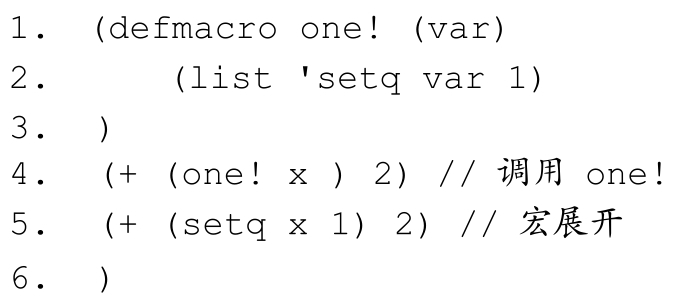{.u53610}
:::

代码清单12-11展示了Lisp语言中的宏定义。代码第1～3行通过defmacro定义了宏one！。代码第 4 行定义了一个使用 one！调用的 S 表达式，该表达式会通过宏展开，将 one！替换为"（setq x 1）"，从而生成新的S表达式"（+（setq x 1） 2）"。

所谓S表达式，是指人类可读的文本形式的一种三元结构，形如"（1 2 3）"，在Lisp语言中既可以作为代码，也可用作数据。代码清单12-11中"（+（setq x 1） 2）"就是一个S表达式。S表达式实际上等价于二叉树结构，如图12-1所示。

::: center
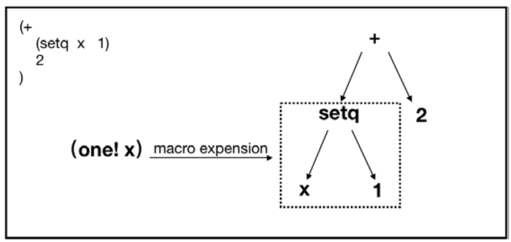{.u53609}

图12-1：S表达式等价于二叉树
:::

图12-1中展示了和S表达式等价的二叉树结构，其中每个节点就是S表达式中的元素。当S表达式中存在宏的时候，就会将其展开，从而让之前的S表达式形成新的S表达式。**这里值得注意的是** ，宏调用和函数调用之间的区别，宏调用产生的是S表达式，而函数调用会产生具体的值，认清这个区别比较重要。S表达式是Lisp语言的精华所在，这种思想对现在的很多语言都影响颇深。

除C语言的文本替换宏外，其他现代编程语言中提供的宏都可以通过直接操作抽象语法树的方式来进行语法扩展。不同的语言提供的宏形式有所不同。有的提供了显式的宏语法，比如defmacro、macro等关键字来定义宏，有的语言则通过其他形式，比如Python语言中的装饰器（decorator）和Ruby中的块（block），均可以达成操作抽象语法树的目的，殊途同归。而抽象语法树就等价于Lisp中的S表达式，用S表达式可以表示任何语言的抽象语法树。

Rust也不例外，开发者可以编写特定的宏，在编译时通过宏展开的方式操作抽象语法树，从而达到语法扩展的目的。

### 12.2.2 Rust中宏的种类 {#text00018.html#Afde701cf-35b7-4674-b4c7-935f403dc5f3 .title-left}

Rust的宏系统按定义的方式可以分为两大类：

· **声明宏** （Declarative Macro）

· **过程宏** （Procedural Macro）

声明宏是指通过 macro_rules！声明定义的宏，它是 Rust 中最常用的宏。当前在 Nightly版本的Rust之下，使用**＃！\[feature（decl_macro）\]** 就允许使用macro关键字来定义声明宏，在不远的将来，**macro** 关键字会在Stable版的Rust中稳定下来。

过程宏是编译器语法扩展的方式之一。Rust允许通过特定的语法编写编译器插件，但该编写插件的语法还未稳定，所以提供了过程宏来让开发者实现自定义派生属性的功能。比如Serde库中实现的**＃\[derive（Serialize，Deserialize）\]** 就是基于过程宏实现的。

具体到宏使用的语法形式又分为以下两种：

· **调用宏** ，形如 println！、assert_eq！、thread_local！等可以当作函数调用的宏。这种形式的宏通常由声明宏来实现，也可以通过过程宏实现。

· **属性宏** ，也就是形如**＃\[derive（Debug）\]** 或**＃\[cfg\]** 这种形式的语法。这种形式的宏可以通过过程宏来实现，也可以通过编译器插件来实现。

按宏的来源，可以分为以下两类：

· **内置宏** ，是指Rust本身内置的一些宏，包括两种：一种由标准库中具体的代码实现，另一种属于编译器固有行为。

· **自定义宏** ，是指由开发者自己定义的声明宏或者过程宏等。

代码清单12-12展示了声明宏定义。

**代码清单12-12：定义unless！宏**

::: center
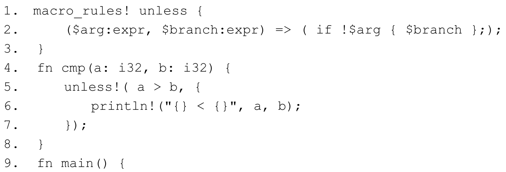{.u53597}
:::

::: center
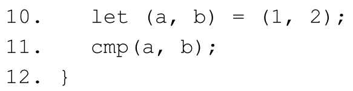{.u53565}
:::

代码清单12-12中使用macro_rules！定义了unless！声明宏，暂时不需要理会代码第2行所示的具体代码是什么意思，后面会进行详细介绍。现在只需要知道unless！宏可以在条件为假的情况下执行分支代码。

在代码第4～8行定义了cmp函数，并调用unless！宏判断a和b的大小，如果a大于b为假，则打印相应的结果。最终代码会输出"1＜2"。

代码清单12-13展示了过程宏实现的自定义派生属性用例。

**代码清单12-13：使用自定义派生属性示例**

::: center
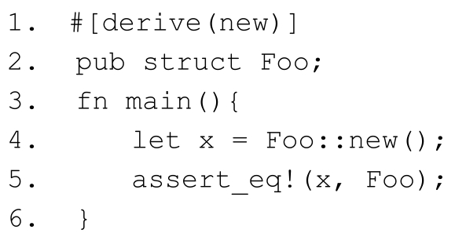{.u53608}
:::

代码清单12-13**假定** 已经实现了自定义派生属性new，可以通过**＃\[derive（new）\]** 的方式为结构体Foo在编译时自动生成new方法，如代码第1行和第2行所示。

在main函数中，可以直接调用new方法来创建Foo结构体的实例x。目前可以利用过程宏的方法来自定义派生属性，具体如何实现，在本章后面会有详细介绍。

代码清单12-14展示了两种内置宏的定义。

**代码清单12-14：内置宏展示**

::: center
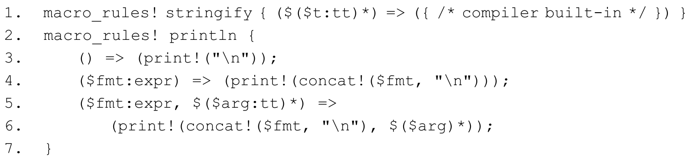{.u53607}
:::

代码清单12-14中代码第1行展示的是**stringify！** 宏，它的作用是可以将任何代码转换为字符串，通过源码可以看出，该宏的行为属于编译器内置行为，所以在源码层面上并未体现出具体的实现。

代码第2～7行是最常见的println！宏。看得出来，它不属于编译器内置行为，而属于标准库内定义的声明宏，其中用到的 concat！也属于编译器内置行为的宏，而 print！是另外一个声明宏。

那么，如何编写自定义声明宏或过程宏呢？声明宏和过程宏的工作原理分别是什么？在寻找这两个问题的答案之前，还需要先了解Rust代码的编译过程。

### 12.2.3 编译过程 {#text00018.html#A7bc801d0-d9e6-48f6-ad9c-eab428bb39ba .title-left}

回顾一下Rust的整个编译过程，如图12-2所示。

::: center
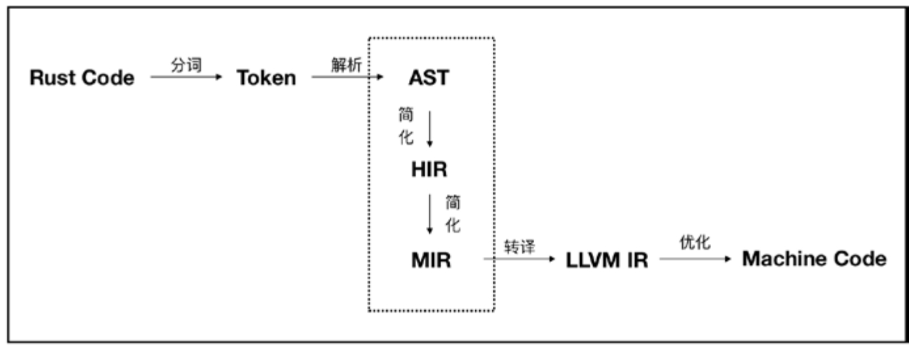{.u53606}

图12-2：Rust代码编译过程
:::

Rust源码的整个编译过程可以大致分为六个主要阶段 ^[\[1\]](#text00018.html#n7F6901D11183453DAB96A5D8143A00C4){#text00018.html#n7F6901D11183453DAB96A5D8143A00C4s}^ ：

1.**分词阶段** ，通过词法分析将源码分为一系列的词条（Token）。

2.**解析阶段** ，通过语法解析，将词条解析为抽象语法树（AST）。

3.**提炼HIR** ，通过对抽象语法树进一步提炼简化，得到高级中间语言（High-Level IR，HIR），专门用于类型检查和一些相关的分析工作。HIR相比于AST，简化了语法信息，因为HIR不需要知道代码的语法元素。

4.**提炼MIR** ，通过对HIR的再次提炼，剔除一些不必要的元素之后得到中级中间语言（Middle-Level IR，MIR），专门用于检查以及其他的优化工作，比如支持增量编译等。

5.**转译为LLVM IR** ，将MIR转译生成为LLVM IR语言，交由LLVM去做后续处理。

6.**生成机器码** ，将LLVM IR经过一系列的优化生成机器码（.o）文件，最终交给链接器处理。

以上工作均由Rust编译器来完成，不同的阶段使用了不同的内部组件，并且不同的编译阶段有不同的工作目标。现在只关注与宏系统相关的分词和解析。

**词条流**

Rust代码编译的第一步，就是通过词法分析把代码文本分词为一系列的词条（Tokens），以代码清单12-15中的普通函数作为示例来看词法分析如何分词。

**代码清单12-15：普通函数示例**

::: center
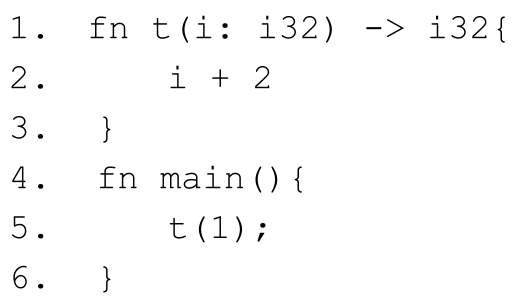{.u53605}
:::

可以将代码清单12-15中的代码保存为一个Rust文件，假定是**main.rs** 文件。亦或是使用 Cargo 生成一个二进制 crate 项目，将上面的代码放到 src/main.rs 文件中。当使用 **rustc mian.rs** 或**cargo build** 命令编译时，编译器就会按之前所述的流程对代码进行处理。

词条一般包括以下几类：

· **标识符** ，源码中的关键字、变量等都将被识别为标识符。

· **字面量** ，比如字符串字面量。

· **运算符** ，比如加、减、乘、除、逻辑运算符等。

· **界符** ，比如分号、逗号、冒号、圆括号、花括号、箭头等。

以函数**t** 为例来说，编译器会对该函数从左到右依次识别。**fn** 关键字会被识别为一个标识符（Identifier），函数名t同样也是一个标识符。当碰到圆括号的时候，编译器会以圆括号为界，将其看作一个独立的组合进行分词处理。函数签名代表返回值的右箭头（-＞）也会被识别为一个独立的界符词条，返回值类型 i32 同样也是一个标识符。最后的函数体会以花括号为界，作为一个独立的组合进行分词处理。

通过编译器提供的命令可以查看代码清单12-15生成的词条和抽象语法树信息，如代码清单12-16所示。

**代码清单12-16：输出语法树的rustc命令**

::: center
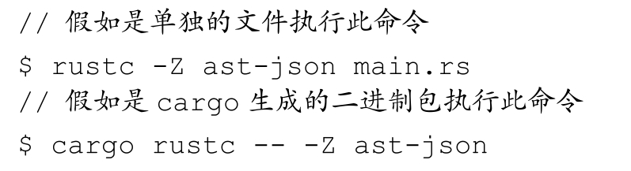{.u53604}
:::

该命令会生成JSON格式的AST信息，其中包含了词法分析之后的词条信息和抽象语法树信息。图12-3展示了从JSON信息中提取到的词条信息。

::: center
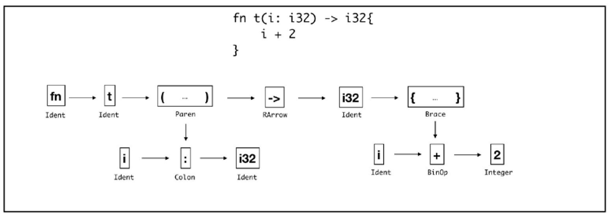{.u53603}

图12-3：词条信息示意
:::

图12-3展示了经过词法分析后函数t的词条信息。看得出来，代码中的空格换行已经被丢弃，关键字等各种语法元素已经被识别为单独的词条。整段函数最后就变为由词条组成的序列，称为词条流。词条流对于编译器后续生成抽象语法树来说意义重大。

**抽象语法树**

词条流虽然可以区分标识符、括号或箭头等其他语法元素，但本身并不携带任何语法信息，必须经过语法解析阶段，生成抽象语法树，编译器才能最终识别Rust代码的意义。

代码清单12-17展示了另外一个较复杂的示例。

**代码清单12-17：另外一个较复杂的示例**

::: center
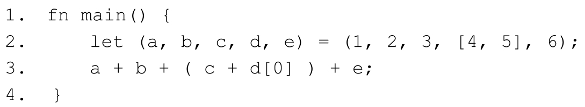{.u53602}
:::

代码清单12-17定义了多个变量，代码第3行对多个变量进行求和。之所以称其为"复杂的示例"，是因为该示例生成的抽象语法树比代码清单12-15中的复杂。

图12-4展示了代码第3行编译后产生的抽象语法树结构示意。

::: center
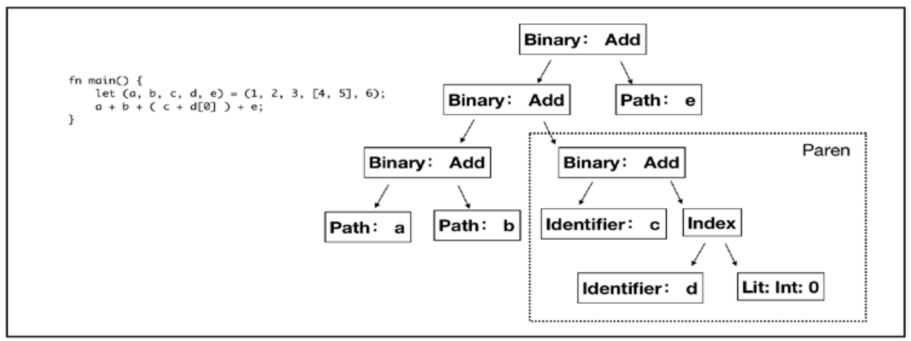{.u53601}

图12-4：抽象语法树示意
:::

图12-4展示的抽象语法树可以用S表达式表示，如代码清单12-18所示。

**代码清单12-18：用S表达式来表示抽象语法树**

::: center
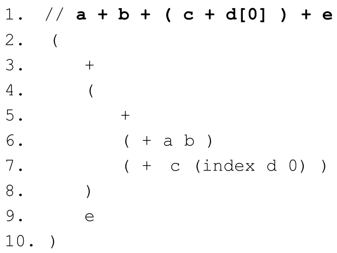{.u53600}
:::

在生成抽象语法树之后，编译器就可以完全识别原始代码中所携带的语法信息。接下来只需要依次遍历节点就可以进行之后的工作，比如，节点中如果包含了宏，则继续将其展开为抽象语法树，直到最终节点中不包含任何宏为止。

### 12.2.4 声明宏 {#text00018.html#Ab3d301d3-c494-41a8-a8f4-febf932845a9 .title-left}

声明宏是Rust语言中最常用的宏，它可以通过macro_rules！来创建，它有时也被称为"示例宏（Macro by example，MBE）"。

**声明宏的定义和展开过程**

使用macro_rules！定义声明宏，基本满足如代码清单12-19所示的格式。

**代码清单12-19：macro_rules！定义声明宏的格式示意**

::: center
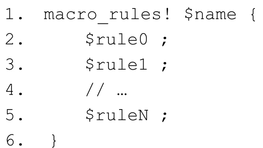{.u53599}
:::

代码清单12-19是伪代码示意，其中**\$name** 表示宏的名字，**\$rule0** 到**\$ruleN** 表示N个宏要匹配的规则。其中每个规则也有固定的格式，如代码清单12-20所示。

**代码清单12-20：声明宏中每个匹配规则要满足的格式示意**

::: center
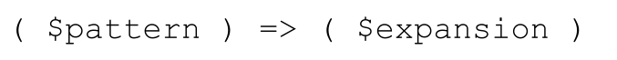{.u53598}
:::

代码清单12-20中，**\$pattern** 代表每个匹配规则的模式，**\$expansion** 代表与模式相应的展开代码。以之前代码清单 12-12 中出现过的 **unless！** 宏定义来说，匹配模式为"（\$arg：expr，\$branch：expr）"，展开代码是"（if！\$arg{\$branch}；）"。声明宏中定义的规则也属于一种类似于match的模式匹配。

匹配模式中"\$arg：expr"这种格式为声明宏定义中的通用格式。**\$arg** 为**捕获变量** ，可以自由命名，但必须以"\$"字符开头。冒号后面的叫**捕获类型** ，在该示例中 expr 对应于宏解析器解析生成之后词条的类型，指代表达式。

展开代码中包含了捕获变量\$arg和\$branch，表示在宏规则匹配成功之后，将捕获到的变量的内容替换到相应的位置，从而达到生成代码的目的。

代码清单12-21继续沿用了unless！宏定义。

**代码清单12-21：unless宏定义示例**

::: center
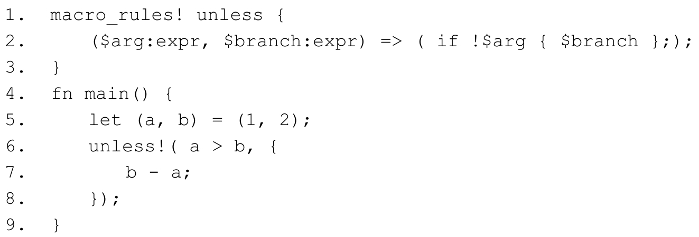{.u53597}
:::

可以将代码清单12-21中的代码保存为Rust文件，比如main.rs。然后对其进行编译，即可得到宏展开后的代码，如代码清单12-22所示。

**代码清单12-22：输出宏展开后代码的编译器命令**

::: center
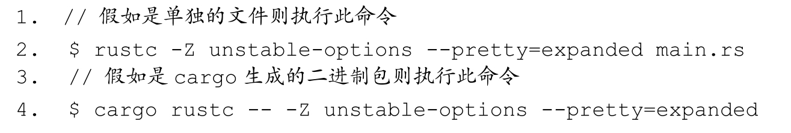{.u53596}
:::

宏展开后的代码如代码清单12-23所示。

**代码清单12-23：宏展开后的代码**

::: center
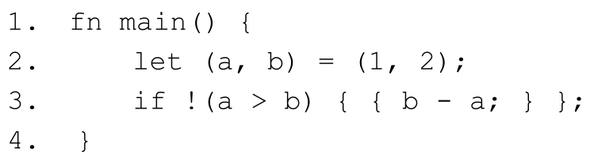{.u53595}
:::

宏展开的过程如图12-5所示。

::: center
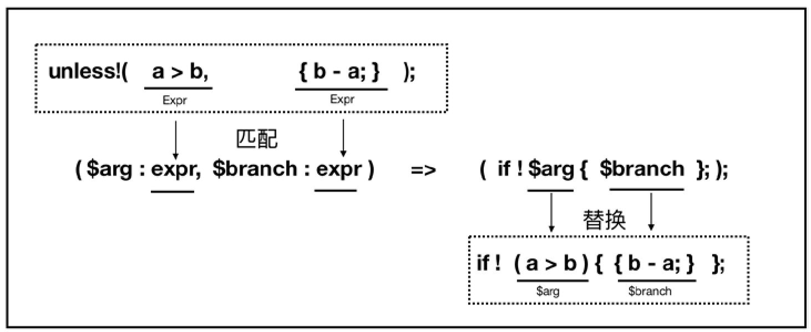{.u53594}

图12-5：宏展开过程示意
:::

代码清单12-21中第6～8行unless！宏调用的展开过程如图12-5所示。看得出来，unless！宏调用之时，先根据宏定义中火箭符（=＞）左侧的模式进行匹配，然后根据匹配之后捕获的结果对火箭符右侧的展开代码进行替换。这个匹配和替换的过程就是宏展开，整个过程发生在语法解析阶段。

实际上，编译器内部有两个解析器，一个是**通用解析器** （Normal Parser），另一个是**宏解析器** （Macro Parser）。通用解析器用于处理大部分词条流进一步生成抽象语法树，但是在碰到宏调用时则会跳过，并不对宏调用进行任何处理，反而会在抽象语法树中保留宏调用节点。然后，宏解析器会将这些宏调用节点展开为正常的抽象语法树节点，如图12-6所示。

::: center
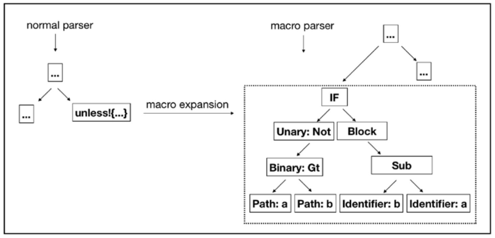{.u53593}

图12-6：宏解析器将宏调用节点展开为正常的AST节点示意
:::

图12-6以unless！宏调用为例，首先经过通用解析器解析完整个模块中的代码，但是只保留unless！宏调用节点，没有对它进行处理。然后宏解析器会将unless！宏调用节点进一步展开为正常的抽象语法树节点。

**声明宏的工作机制**

宏解析器的工作机制大概等价于代码清单12-24所示的函数签名。

**代码清单12-24：宏解析器工作机制等价的函数签名示意**

::: center
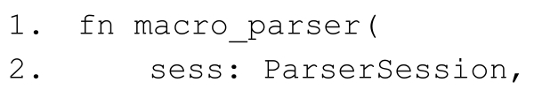{.u53592}
:::

::: center
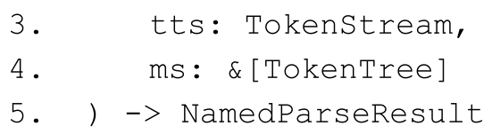{.u53591}
:::

代码清单12-24中的函数签名macro_parser定义了三个参数：

· **sess** ，代表解析会话，用于跟踪一些元数据，包括错误信息等。

· **tts** ，代表**词条流** （TokenStream），是词条序列的抽象表示。

· **ms** ，代表匹配器，代表一组词条树结构。

另一方面，macro_rules！本身也是一种声明宏，只不过它由编译器内部 ^[\[2\]](#text00018.html#nD38E01D66FBC45C0B3DE7B9F6EAFB11B){#text00018.html#nD38E01D66FBC45C0B3DE7B9F6EAFB11Bs}^ 所定义。它定义了一种声明宏的通用解析模式，形如代码清单12-24所示。

**代码清单12-24：宏定义通用模式示意**

::: center
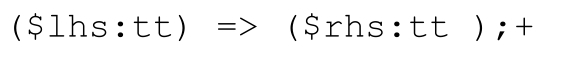{.u53590}
:::

也就是说，当宏解析器碰到 macro_rules！定义的声明宏时，它会使用这个模式来解析该声明宏，将宏定义中火箭符左右两侧都解析为**tt** ，即**词条树** 。然后，宏解析器会将左右两侧的词条树保存起来作为宏调用的匹配器（ms）。结尾的"+"代表该模式可以是一个或多个。

当宏解析器碰到宏调用时，首先会将宏调用中的具体参数解析为词条流（tts），然后在之前保存的匹配器（ms）中取左侧的词条树（\$lhs）来匹配该词条流。对于代码清单 12-21 中unless！宏调用的示例来说，其调用参数"（a＞b，{b-a；}）"会被宏解析器解析为词条流（tts）和宏定义中"（\$arg：expr，\$branch：expr）"生成的词条树进行匹配，最终，"a ＞ b"匹配到"\$arg：expr"，"{b-a；}"匹配到"\$branch：expr"。然后通过捕获变量\$arg和\$branch替换匹配器（ms）中右侧的词条树（\$rhs）上相应的代码，替换后的\$rhs 词条树将生成最终的代码。

这就是宏解析器展开声明宏的全过程，整个过程和正则表达式的工作机制类似。匹配器（ms）相当于正则表达式中的模式，而宏调用参数生成的词条流则相当于正则表达式待匹配的字符串。甚至，宏定义中规则的模式是可以像正则表达式那样使用元符"+"或"\*"来指定重复的，分别代表重复一次或一次以上。

前面的宏示例中也出现过声明宏内嵌套另外一个声明宏的情况，宏解析器碰到这样的嵌套会继续将其展开，直到抽象语法树中再无任何宏调用节点。但也不是无限制地展开，编译器内设置了一个上限来限定嵌套展开次数，如果超过该次数还存在宏调用节点，则编译器会报错。开发者也可以通过指定**＃！\[recursion_limit=＂...＂\]** 属性来修改包内允许的嵌套展开次数上限。

声明宏中可以捕获的类型不仅仅是表达式（expr），以下是捕获类型列表。

· **item** ，代表语言项，就是组成一个Rust包的基本单位，比如模块、声明、函数定义、类型定义、结构体定义、impl实现等。

· **block** ，代表代码块，由花括号限定的代码。

· **stmt** ，代表语句，一般是指以分号结尾的代码。

· **expr** ，指代表达式，会生成具体的值。

· **pat** ，指代模式。

· **ty** ，表示类型。

· **ident** ，指代标识符。

· **path** ，指代路径，比如foo、std：：iter等。

· **meta** ，元信息，表示包含在＃\[...\]或＃！\[...\]属性内的信息。

· **tt** ，TokenTree的缩写，指代词条树。

· **vis** ，指代可见性，比如pub。

· **lifetime** ，指代生命周期参数。

在写声明宏规则的时候，要注意这些捕获类型匹配的范围。比如tt类型，代表词条树，就比expr能匹配的范围要广，需要根据具体的情况来选择。只有了解声明宏的规则及其工作机制之后，才可以毫无障碍地编写声明宏。

**声明宏的实现技巧**

接下来，以一个具体的示例来说明实现声明宏过程中需要注意的地方。Rust中初始化一个HashMap写起来比较烦琐，现在通过实现一个宏来简化这个过程。如代码清单12-25所示。

**代码清单12-25：hashmap！宏用法示意**

::: center
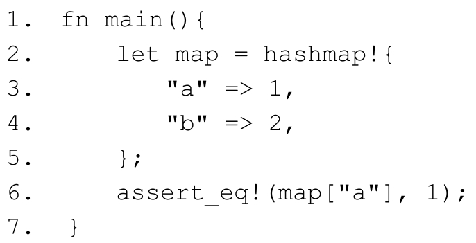{.u53448}
:::

代码清单12-25展示了hashmap！宏的最终用法，看上去非常简单且直观。这也是创建一个声明宏的第一步，先确定它将来要使用的形式。接下来如何实现该宏呢？

首先，匹配"key=＞value"这样的定义格式。按照声明宏的语法规则，首先能想到的匹配模式就是"\$key：expr=＞\$value：expr"，不管key还是value，在Rust里至少是一个表达式。但是，这样的键值对可能不止一对，而且数目是无法确定的。这就要求匹配模式可以重复匹配，幸好，Rust的声明宏支持重复匹配。

声明宏重复匹配的格式是"\$（...） sep rep"，具体说明如下：

· **\$（...）** ，代表要把重复匹配的模式置于其中。

· **sep** ，代表分隔符，常用逗号（，）、分号（；）和火箭符（=＞）。这个分隔符可依据具体的情况省略。

· **rep** ，代表控制重复次数的标记，目前支持两种：星号（\*）和加号（+），代表的意义和正则表达式中的一致，分别是"重复零次及以上"和"重复一次及以上"。

那么，根据这样的规则，之前的匹配模式就改进为"\$（\$key：expr=＞\$value：expr），\*"，中间的分隔符用了逗号，这是因为每个键值对后面都有一个逗号进行分隔，当然也可以不用逗号分隔，**宏里的语法可以自由设计** 。当前示例中选择使用逗号分隔。

到此，可以写出第一版hashmap！宏，如代码清单12-26所示。

**代码清单12-26：hashmap！宏的实现**

::: center
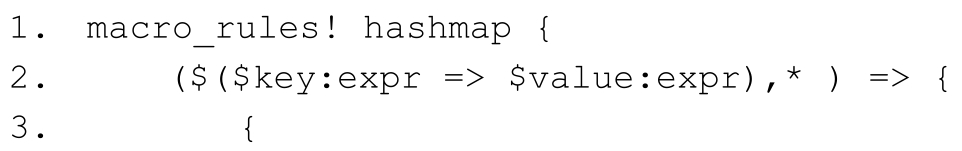{.u53589}
:::

::: center
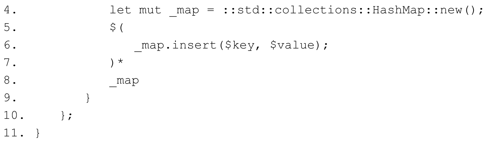{.u53585}
:::

在代码清单12-26中，代码第2行使用了"\$（\$key：expr=＞\$value：expr），\*"模式，该模式在处理最后一行键值对的时候，只能匹配没有逗号结尾的情况。匹配过程如图12-7所示。

::: center
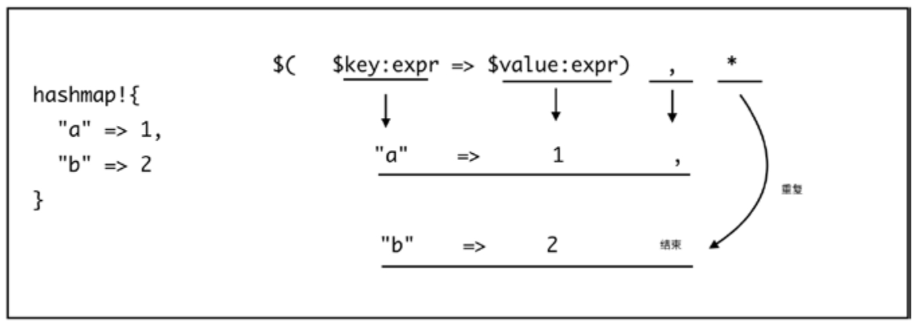{.u53588}

图12-7：hashmap！宏匹配过程示意
:::

代码第4行在生成代码中定义一个空的HashMap实例_map。注意，这里使用了绝对路径：：std：：collections：：HashMap，这也是一个技巧，可以避免冲突。

代码第5～7行与匹配模式中的重复格式相对应，也使用"\$（...）\*"格式，不同点在于不需要分隔符了。在_map里插入键值对，也需要根据匹配捕获的键值对重复插入。

最终hashmap！宏调用展开的结果如代码清单12-27所示。

**代码清单12-27：hashmap！调用展开后代码示意**

::: center
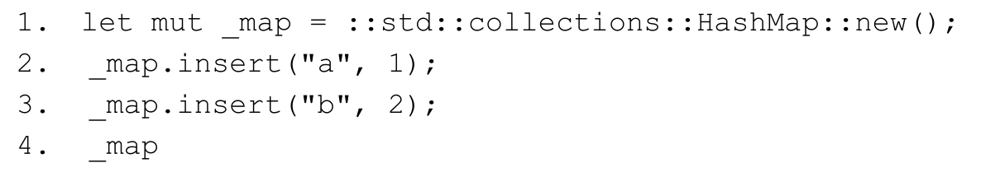{.u53587}
:::

代码清单12-27中展示的正是预料中的代码。但是目前该宏还有一个问题，就是在调用的时候，最后一个键值对加上逗号时，编译就会出错。之前最后的键值对没有逗号的时候，匹配模式匹配完该键值对就会正常结束，但是现在加了逗号，当匹配模式匹配完逗号之后，就会继续匹配星号，从而激活重复匹配，但此时后续已经没有键值对供其匹配了。所以会报错，编译器宣告该宏意外结束。

解决这个错误有两种办法，第一种就是利用宏的递归调用，将最后一行的逗号消去，如代码清单12-28所示。

**代码清单12-28：hashmap！递归调用消去最后键值对的结尾逗号**

::: center
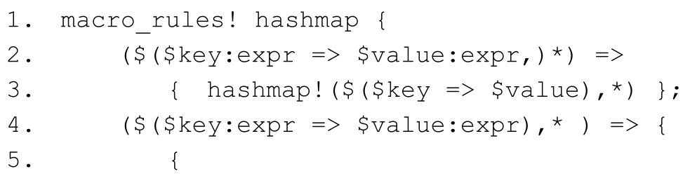{.u53586}
:::

::: center
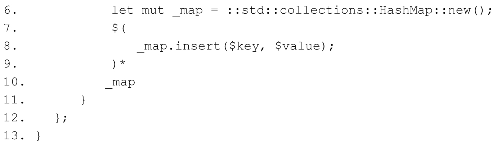{.u53585}
:::

代码清单 12-28 中第 2 行是新添加的一条匹配规则，注意其左侧的匹配规则为"\$（\$key：expr=＞\$value：expr，）\*"，逗号在匹配模式里面，而右侧递归调用了hashmap！宏。所以，该行规则经过"hashmap！（\$（\$key=＞\$value），\*）"匹配之后，实际上会将"hashmap！（＂a＂=＞1，＂b＂=＞2，）替换为"hashmap！（＂a＂=＞1，＂b＂=＞2）"。再次调用hashmap！的时候就会和代码清单12-27一样直接匹配第二条规则生成代码。

另外一种方法更简单了，只需要利用重复匹配的技巧即可，如代码清单12-29所示。

**代码清单12-29：利用重复匹配技巧来匹配结尾逗号**

::: center
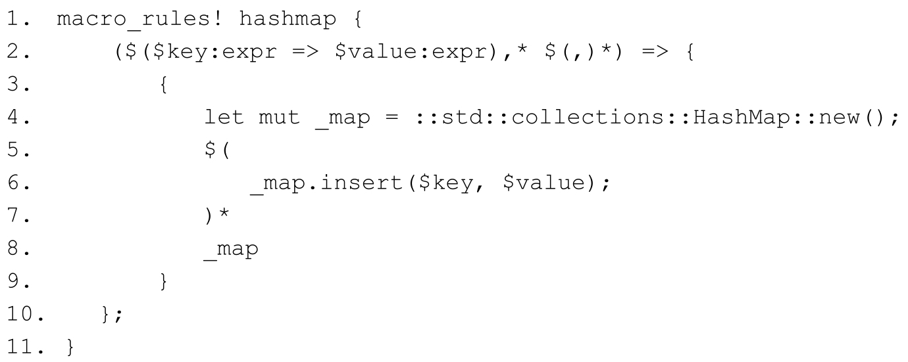{.u53584}
:::

代码清单12-29中，在之前匹配模式"\$（\$key：expr=＞\$value：expr，）"**的基础上，增加了** "**\$（，）** \*"，变为"\$（\$key：expr=＞\$value：expr，）\***\$（，）** \*"。这样就可以同时匹配最后键值对结尾是否带逗号的情况。

这下 hashmap！宏就可以正常使用了，但它还有改进空间。假如要在创建 HashMap 的时候根据给定键值对的个数来预分配容量，该如何修改？

首要的问题就是要计算出键值对的个数。只需要想办法生成如代码清单12-30所示的代码即可。

**代码清单12-30：生成代码示意**

::: center
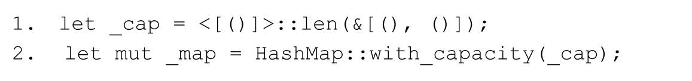{.u53583}
:::

代码清单 12-30 中，是想利用 len 方法来计算传入键值对的个数，知道个数以后就可以使用HashMap的with_capacity方法来预分配容量。因为len方法是**\[T\]** 类型实现的方法，所以可以通过"＜\[（）\]＞：：len（&\[..\]）"这样的形式来调用。这里借用了"\[（）\]"类型来辅助计算键值对的个数，其实也可以使用其他类型，比如 String 字符串，但是这里用单元类型"（）"的好处是不占用空间。

接下来的问题就是，如何构造这个用于辅助计算键值对个数的"\[（）\]"类型数组。基本思路如图12-8所示。

::: center
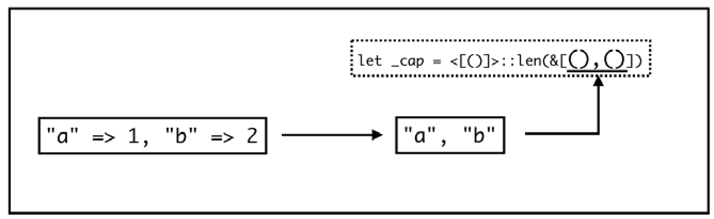{.u53582}

图12-8：将给定的键值对替换为指定单元值数组过程示意
:::

图12-8示意的思路如下：

· 通过匹配输入的键值对，得到所有的键。

· 将所有的键通过匹配替换为单元值。

· 生成最终预期的代码。

这里需要匹配两次，意味着可以通过创建两个不同的宏来完成需求。如代码清单 12-31所示。

**代码清单12-31：可根据键值对个数预分配的hashmap！宏**

::: center
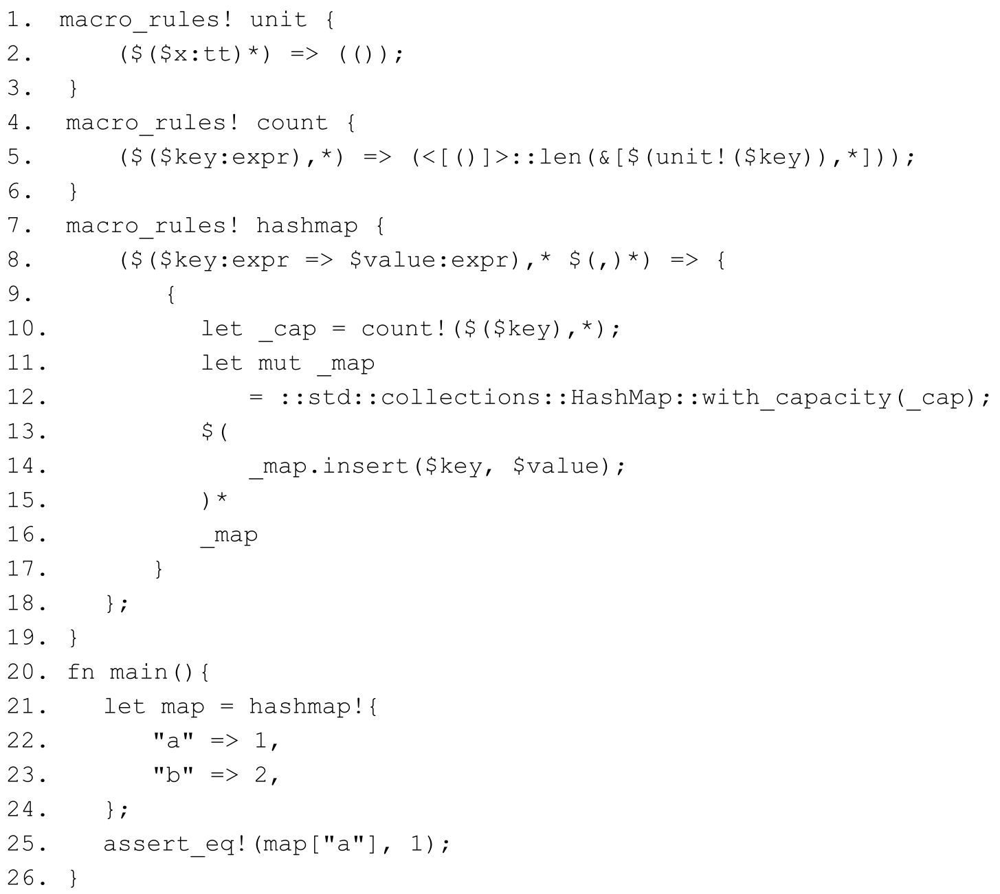{.u53581}
:::

代码清单12-31中又定义了两个宏unit！和count！，借助这两个宏来完成图12-8所示的替换过程。具体的宏规则匹配过程如图12-9所示。

::: center
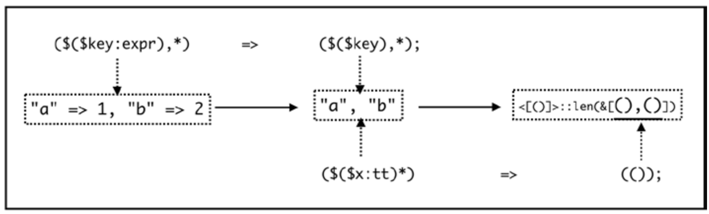{.u53580}

图12-9：unit！和count！宏规则匹配示意图
:::

代码清单 12-31 虽然完成了预定的目标，但是引入了另外两个宏。这就导致目标宏hashmap！依赖于两个独立的宏，如果以后想把hashmap！宏放到独立的包（crate）中对外公开，那依赖的这两个独立的宏也必须公开，但是这两个宏对外部来说，基本没有其他作用。如何解决这个问题呢？答案很简单，只需要把依赖的两个宏转移到hashmap！宏定义内部作为内部规则即可，如代码12-32所示。

**代码清单12-32：在hashmap！宏内部定义依赖宏**

::: center
{.u53579}
:::

注意代码清单12-32中第2～4行，分别把unit！宏和count！宏的定义移到了hashmap！宏定义内部，并且这里利用了宏递归调用的特性。在代码第7行，当hashmap！宏调用第一次匹配时，内部规则就会被激活，经过递归替换，最终生成目标代码。

其中"@unit"和"@count"相当于是内部宏规则的宏名，暂且称之为**内部宏** ^[\[3\]](#text00018.html#n916001DBCDCE45C5BC697DCFB9011E40){#text00018.html#n916001DBCDCE45C5BC697DCFB9011E40s}^ 。内部宏的名字必须放到真正的匹配规则之前，否则编译器会将其当作普通的匹配规则去处理。内部宏的名字并非必须用"@"符号开头，它只是一种社区惯用法。你可以使用"unit"或"unit！"命名。

**调试宏**

调试宏代码基本有**两种办法** ：

· 使用编译器命令来输出展开后的代码，如代码清单12-32所示。

· 在Nightly版本下使用＃！\[feature（trace_macros）\]属性来跟踪宏展开过程。

代码清单12-33展示了如何给代码清单12-32中定义的hashmap！跟踪宏展开过程。

**代码清单12-33：调试hashmap！宏**

::: center
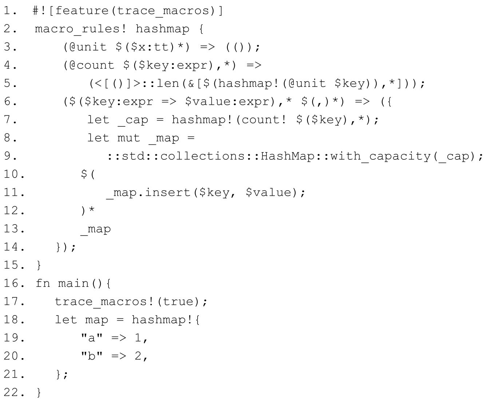{.u53578}
:::

代码清单12-33中使用了＃！\[feature（trace_macros）\]属性，注意此时必须使用Nightly版本的Rust才能编译。在代码第17行也就是hashmap！宏调用的上方，加上trace_macros！（true）就可以调试宏展开过程。

编译结果如代码清单12-34所示。

**代码清单12-34：编译输出hashmap！宏调试信息**

::: center
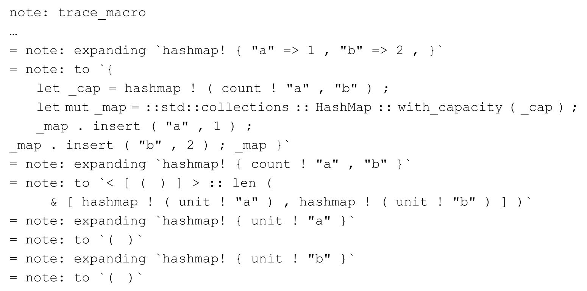{.u53577}
:::

代码清单12-34展示了编译过程中输出的调试信息，完整地展示了hashmap！宏的展开过程。除trace_macros！宏外，还有其他的宏调试方法。限于篇幅，这里不再展开介绍。

**声明宏的卫生性**

声明宏在展开后，不会污染原来的词法作用域，具有这种特性的宏叫**卫生宏** （Hygienic Macro）。Rust的声明宏具有部分卫生性，如代码清单12-35所示。

**代码清单12-35：展示声明宏的卫生性**

::: center
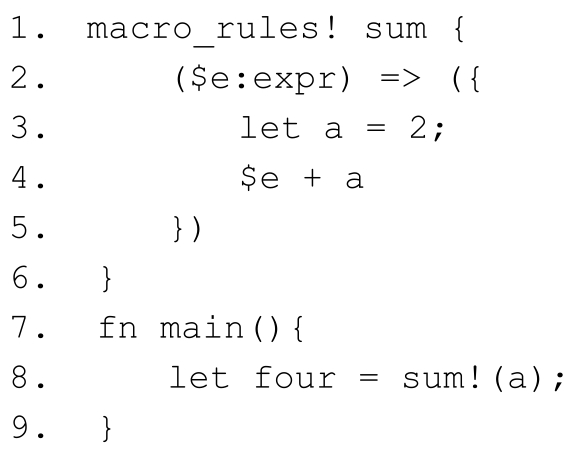{.u53576}
:::

代码清单12-35如果编译，会报错，如代码清单12-36所示。

**代码清单12-36：错误信息**

::: center
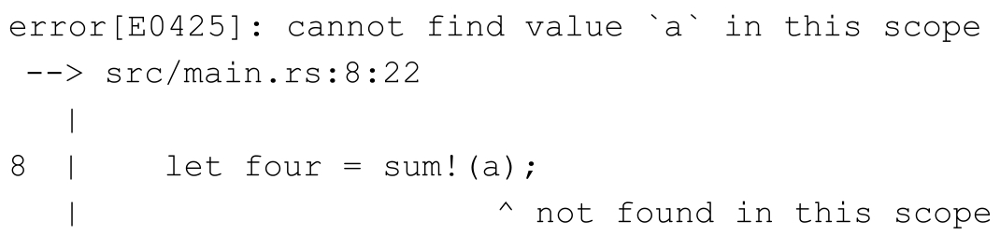{.u53575}
:::

代码清单 12-36 的错误信息提示，在当前作用域找不到变量 a。预想中，sum！宏如果展开以后，会有一个变量a的定义，如代码清单12-37所示。

**代码清单12-37：假想中sum！展开后的代码**

::: center
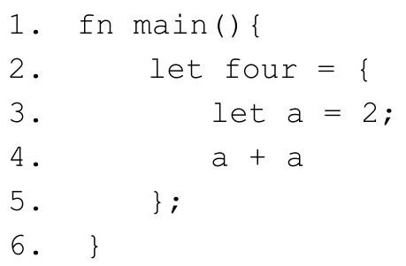{.u53574}
:::

事实上，声明宏展开以后的代码拥有独立的作用域，并不会污染当前宏调用的作用域。所以Rust编译器会报找不到变量a的错误。这就体现了Rust声明宏的卫生性。

目前Rust 声明宏的卫生性并不完整，只有对变量和标签（比如循环外部的标签＇out）可以保证卫生。像生命周期、类型等都无法保证卫生性，所以在写宏的时候，需要注意，在宏里如果使用非当前作用域内定义的变量，一定要用绝对路径，并且这些变量必须在使用宏的任何地方都可见。在宏的卫生性方面，Rust还在逐渐完善。

**导入/导出**

在日常开发中，经常会将一些常用的宏打包起来方便使用，从而提高开发效率。比如，可以将hashmap！宏打包起来。为了演示，现在使用cargo命令创建一个二进制包，此处命名为hashmap_lite，默认会生成src/main.rs文件。然后在src文件夹内创建一个lib.rs文件，代码结构如代码清单12-38所示。

**代码清单12-38：hashmap_lite包代码结构示意**

::: center
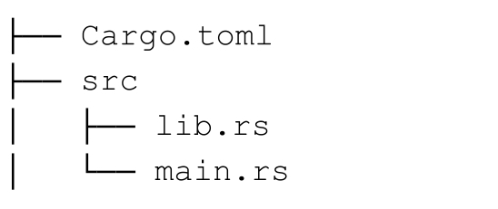{.u53573}
:::

然后，将hashmap！的宏定义代码复制到src/lib.rs文件中，如代码清单12-39所示。

**代码清单12-39：src/lib.rs代码示意**

::: center
{.u53572}
:::

注意代码清单12-39中使用了**＃\[macro_export\]** 属性，表示其下面的宏定义hashmap对其他包也是可以见的。然后在src/main.rs中使用＃\[macro_use\]属性导入此宏，如代码清单12-40所示。

**代码清单12-40：src/main.rs代码示意**

::: center
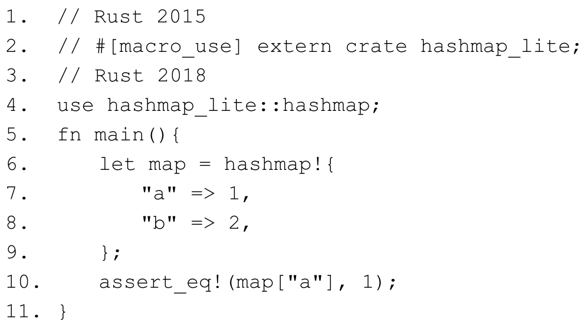{.u53571}
:::

代码清单12-40中，如果是Rust 2015，则使用＃\[macro_use\]属性用在extern crate之前，表示将hashmap_lite中定义的宏hashmap！导出，然后main函数中才可以自由使用hashmap！宏。需要注意的是，在Rust 2015中只有在包的根文件下才可以为extern crate使用＃\[macro_use\]属性。如果是Rust 2018，则只需要使用use将hashmap_lite：：hashmap导入即可。并且在Rust 2018 中，外部crate 中定义的宏是可以在根文件之外的地方导入的。也就是说，哪里需要就在哪里导入。

＃\[macro_use\]属性也可以用于导出同一个包内mod定义的模块上。如代码清单12-41所示。

**代码清单12-41：使用＃\[macro_ues\]导出mod模块中的宏**

::: center
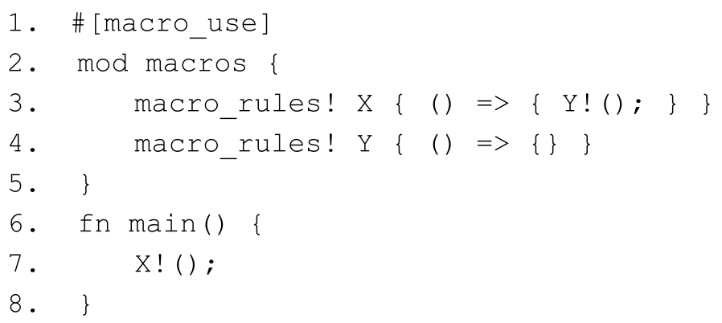{.u53570}
:::

代码清单12-41中X！可以被正常调用。

当宏被导出到包外被使用的时候，可能会碰到麻烦。有时候导出的宏定义内部会依赖包内的一些函数，如代码清单12-42所示。

**代码清单12-42：mycrate内定义的宏依赖于函数incr**

::: center
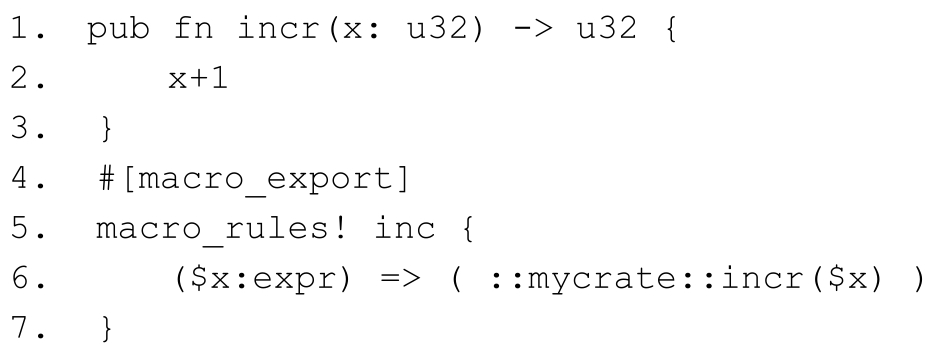{.u53569}
:::

代码清单12-42展示了mycrate包内宏定义依赖于本地的函数incr，所以在inc！宏定义内部使用了绝对路径"：：mycrate：：incr（\$x）"来调用该函数。但是实际情况中，使用mycrate包的时候有可能将其改名，如代码清单12-43所示。

**代码清单12-43：extern crate mycrate改名为mc**

::: center
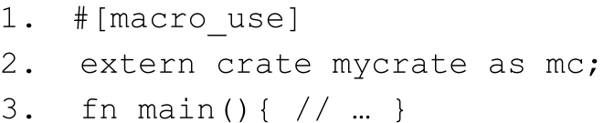{.u53568}
:::

碰到代码清单12-43所示的这种情况时，inc！宏中依赖的函数调用就会失效。Rust为此提供了一种解决方案：在宏定义内使用\$crate变量。如代码清单12-44所示。

**代码清单12-44：使用\$crate变量**

::: center
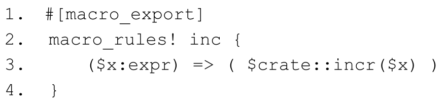{.u53567}
:::

代码清单12-44使用&crate变量，就可以在该宏定义被导出的时候，自动根据上下文来选择函数调用路径中的包名，比如在代码清单12-43所示的情况下，会使用"：：mc：：incr（\$x）"。

另外需要注意的是，如果一个包中导入多个声明宏包含了重复的命名，则最后导入的声明宏会覆盖先导入的声明宏定义。

**使用macro关键字**

目前只有在 Nightly 版本的 Rust 之下，使用＃！\[feature（decl_macro）\]属性才能使用 macro关键字。如代码清单12-45所示。

**代码清单12-45：使用macro关键字**

::: center
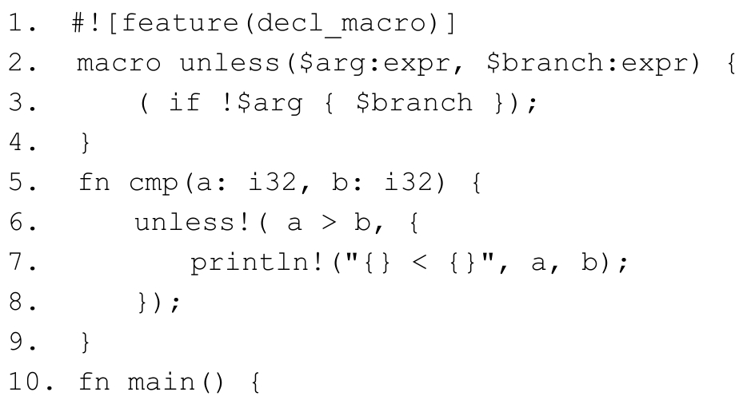{.u53566}
:::

::: center
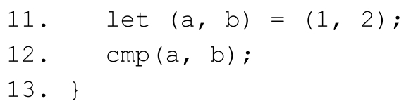{.u53565}
:::

代码清单12-45中使用macro关键字重新定义unless！宏的代码。比起macro_rules！定义的宏可读性更高。然而macro关键字属于官方的宏2.0计划，在不久的将来会稳定发布，到时候就不需要使用feature属性了。

### 12.2.5 过程宏 {#text00018.html#A631101e0-9cbd-477c-a6c0-6eb578b20d50 .title-left}

使用声明宏可以实现像函数一样被调用的宏，但是也仅局限于代码自动生成的场景。对于需要语法扩展的场景用声明宏无法满足，比如为现有结构体自动生成特定的实现代码，或者进行代码检查等。在过程宏出现之前，开发者可以通过Rust编译器的插件机制来满足语法扩展的诸多需求。但可惜的是，这些插件机制并未稳定，暂时只能在Nightly版本的Rust中使用＃！\[feature（plugin_registrar）\]这样的feature才能实现。

官方核心团队一直致力于解决稳定化发布插件机制的工作，因为这么强大的功能应该稳定地提供给开发者。所以，经过核心团队和社区的共同努力，终于确定了一种方案，就是过程宏（Procedural Macros）。图12-10从宏观层面展示了过程宏的工作机制。

::: center
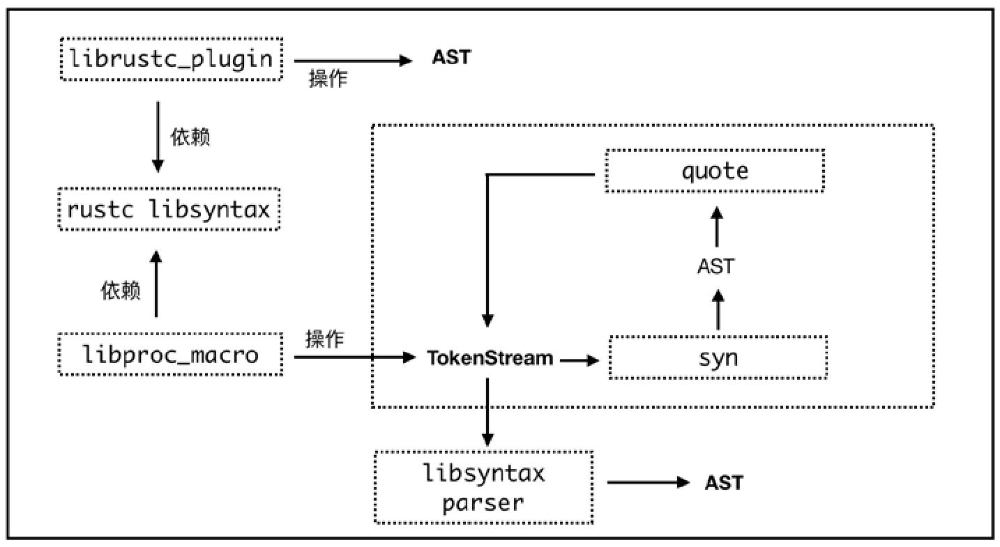{.u53564}

图12-10：过程宏工作机制示意图
:::

Rust编译器插件机制由内置的librustc_plugin包提供，它通过直接操作AST来达成目的。所以，它依赖于内置的libsyntax包，该包中定义了词法分析、语法分析、操作语法树相关的各种操作。但是要稳定发布给开发者，就不能依赖于AST结构。因为Rust语言正处于上升发展期，Rust内部还有很多工作要做，如果与AST结构耦合起来，将来AST结构有所变化，就会影响到广大开发者编写的程序，这是任何一门编程语言都在避免的问题。

所以，Rust官方团队在libsyntax的基础之上，又抽象出一层通用的接口，这套接口就叫**过程宏** ，它被定义于内置的 libproc_macro 包中。过程宏建立在**词条流** （TokenStream）的基础上，开发者可以借助于过程宏输入词条流，对其进行修改或替换，最后将修改后的词条流输出，交给语法解析器（libsyntax中包含的parser）处理。

基于词条流的好处在于未来不管语法如何变化，都不会影响到过程宏的使用，因为词法分析不需要关心语法信息。使用过程宏的时候，可以直接把传入的词法流转为字符串处理，也可以配合另外两个第三方库来使用：**syn** 和 **quote** 。其中 syn 库可以将词条流再次解析为AST结构，然后开发者在此结构之上对其进行各种修改或替换，最后通过quote库，将修改后的AST结构重新转换为词条流输出，这样就比直接处理字符串要方便、精准，如图12-10右侧虚线框选中的部分所示。

所以，在学习Rust过程宏系统的时候，需要了解一个"变"与一个"不变"。

· **变** ：Rust在上升发展期，还在随时添加各种新的功能以及优化性能，有可能会影响到AST结构。所以会把过程宏、编译器插件、syn、quote库都独立出来，以便更好地将过程宏机制向开发者稳定发布。

· **不变** ：过程宏基于词条流，不会随语法的不断变化而受影响。

但要明白，"变"与"不变"只是指语言结构层面。比如libproc_macro库自身也在进化，在写本书的时候，又出现了proc_macro2库，它是对libproc_macro库的进一步抽象和包装，更易于使用。但基于词条流来处理过程宏的整体思路依然不变。

目前，使用过程宏可以实现三种类型的宏：

· **自定义派生属性** ，可以自定义类似于＃\[derive（Debug）\]这样的derive属性，可以自动为结构体或枚举类型进行语法扩展。在官方 RFC 或一些社区资料中，过程宏也被称为宏1.1（Macro1.1）。

· **自定义属性** ，可以自定义类似于＃\[cfg（）\]这种属性。

· **Bang宏** ，和macro_rules！定义的宏类似，以Bang符号（就是叹号"！"）结尾的宏。可以像函数一样被调用。

接下来，使用cargo命令来创建一个lib包，名字为simple_proc_macro，在此包中依次实现这三种过程宏。包目录结构如代码清单12-46所示。

**代码清单12-46：simple_proc_macro目录结构示意**

::: center
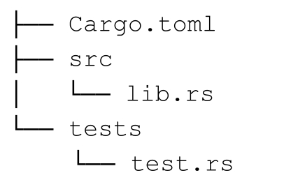{.u53563}
:::

在Cargo.toml中将该包设置为proc_macro类型，如代码清单12-47所示。

**代码清单12-47：Cargo.toml中设置lib类型为proc_macro**

::: center
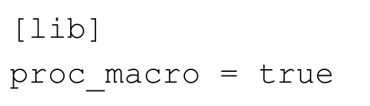{.u53562}
:::

编写过程宏必须要求放到proc_macro类型的lib包中。

**自定义派生属性**

可以使用TDD ^[\[4\]](#text00018.html#n0E1C01E15DE94F59AA689E5FF3FA931E){#text00018.html#n0E1C01E15DE94F59AA689E5FF3FA931Es}^ 的方式来开发自定义派生属性，因为在开发之前，必须要设计好自动派生的代码是什么。打开simple_proc_macro包中的tests/test.rs文件，在其中先编写预期的测试代码，如代码清单12-48所示。

**代码清单12-48：tests/test.rs文件中写入测试代码**

::: center
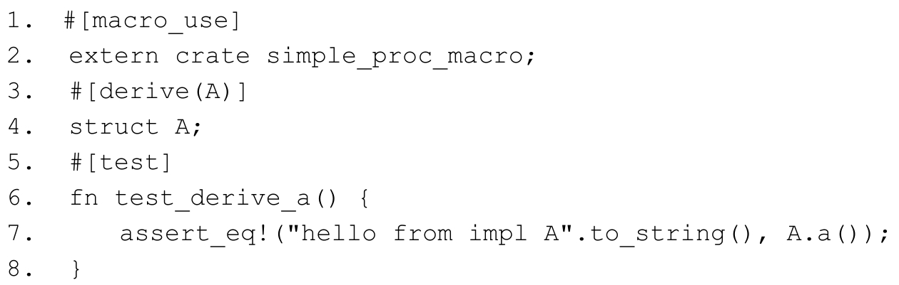{.u53561}
:::

测试代码表示，打算实现一个**自定义派生属性＃\[derive（A）\]** ，然后为单元结构体A自动实现一个实例方法a。在调用方法a的时候，输出指定的字符串，如代码第7行所示。注意，使用自定义的派生属性过程宏，需要用**＃\[macro_use\]** 将其导出。

打开src/lib.rs文件，开始实现自定义派生属性，如代码清单12-49所示。

**代码清单12-49：在src/lib.rs中实现＃\[deriüe（A）\]过程宏**

::: center
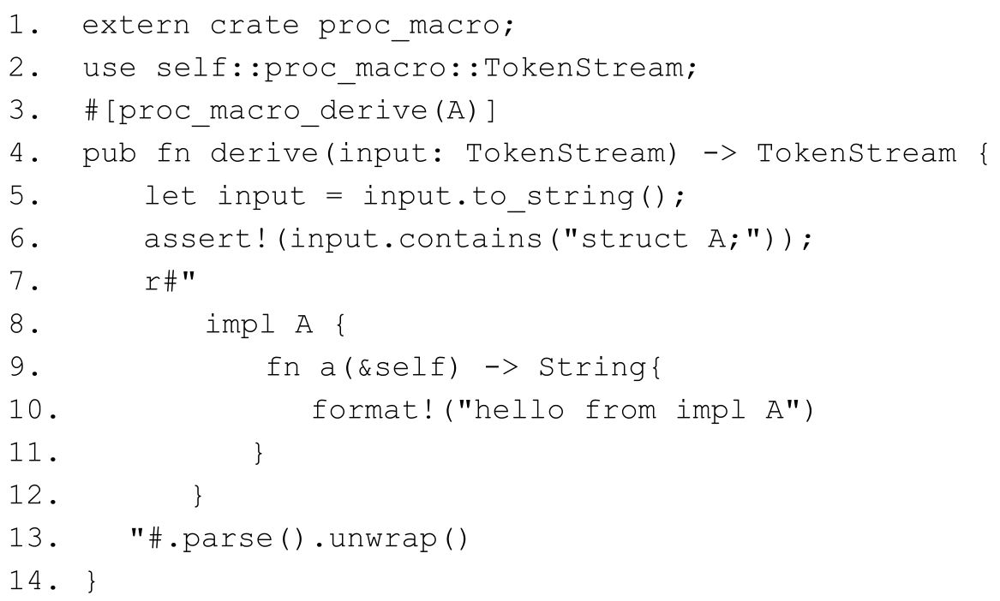{.u53560}
:::

注意当前代码均基于Rust 2018。

代码清单12-49中第1行和第2行分别引入了Rust内置的proc_macro包及其中定义的TokenStrem结构体类型。值得注意的是，proc_macro包属于Rust自带包，不需要在Cargo.toml中配置依赖。引入路径前的self前缀也不可省略。

代码第 3 行中，＃\[proc_macro_derive（A）\]属性表示其下方的函数专门处理自定义派生属性，其中的"A"与＃\[derive（A）\]中的"A"相对应。

代码第4行定义了函数derive。注意其函数签名，输入的参数类型为TokenStrem，输出的参数类型也为TokenStrem。

代码第 5 行将输入的参数 input 转换为字符串类型来处理。该示例用于演示实现自定义派生属性最简单的情况，即从字符串开始处理，并不涉及AST结构。

代码第6行展示了input实际上就是测试代码中＃\[derive（A）\]下方的结构体A的定义。可以想象，当编译器在编译的时候碰到＃\[derive（A）\]属性，就会自动将其下方的代码解析为词条流传入事先定义好的过程宏函数derive中进行处理。

代码第 7～13 行定义了一个字符串，并调用它的 parse 方法，该方法最终会返回一个Result＜TokenSteam，Err＞类型，所以还需要再次用unwrap方法才能返回。该字符串中包含了一个硬编码的方法a的实现，该字符串最终转为TokenStream类型返回，会被Rust编译器再次处理，从而生成指定的代码。

在包的根目录下运行cargo test，会发现测试将正常通过。

**自定义属性**

派生属性的目的比较单一，就是为了给结构体或枚举体自动派生各种实现，而属性的用途就相对比较多。可以说自定义派生属性是自定义属性的特例。Rust自身有很多内置的属性，比如条件编译属性**＃\[cfg（）\]** 和测试属性**＃\[test\]** ，早期版本的Rust可以通过编译器插件的方式来实现属性，但插件方式并未稳定，不推荐使用。过程宏实现自定义属性的功能还未稳定。在该版本稳定之前，必须在Nightly版本下使用**＃！\[feature（custom_attribute）\]** 特性。但在编写本书时，最新的NightlyRust 1.31中，已经不需要此特性了。更改详情请参考随书源码中的对应示例。

依旧使用TDD的方式来实现自定义属性功能。继续打开tests/test.rs文件，编写新的测试代码，如代码清单12-50所示。

**代码清单12-50：继续在tests/test.rs中编写自定义属性的测试代码**

::: center
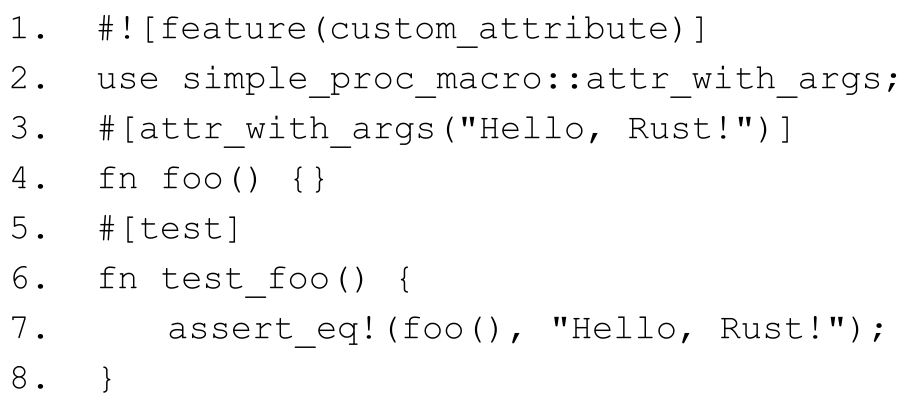{.u53559}
:::

代码清单 12-50 中使用＃！\[feature（custom_attribute）\]属性。新添加的测试代码表示要实现一个自定义属性＃\[attr_with_args（＂Hello，Rust！＂）\]，作用于函数foo之上，并自动修改foo函数的定义和实现，按属性中指定的文本来输出结果，如代码清单12-50中第7行所示。

继续打开src/lib.rs文件，编写实现代码，如代码清单12-51所示。

**代码清单12-51：在src/lib.rs中继续编写自定义属性的实现代码**

::: center
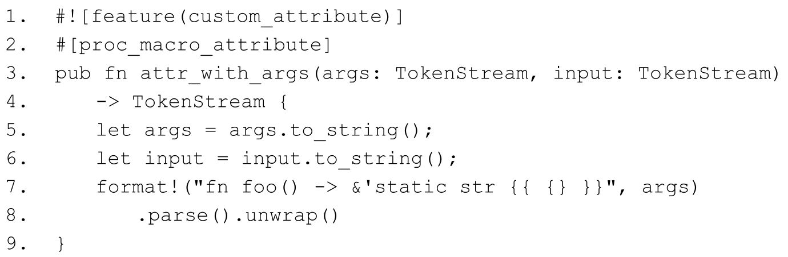{.u53558}
:::

代码清单12-51中第1行使用了＃！\[feature（custom_attribute）\]特性。

代码第2行使用＃\[proc_macro_attribute\]属性表示其下方的函数处理自定义属性。

代码第3行开始定义了attr_with_args函数，其函数签名包括两个输入参数args和input，均为TokenStream类型，返回值也是TokenStream类型。输入参数args代表测试用例自定义属性**＃\[attr_with_args（＂Hello，Rust！＂）\]** 括号中的指定文本，而参数input则代表测试用例中该属性下方作用的函数定义foo。

代码第5行和第6行分别将args和input转为字符串。

代码第7行通过format！宏将args动态地替换到foo重新定义的字符串中，随后通过调用parse方法解析为Result＜TokenStream，Err＞类型，经过unwrap之后返回。

执行cargo test，测试正常通过。

**编写Bang宏**

在声明宏章节中，通过macro_rules 实现过hashmap！宏，可以作为函数调用，使用起来十分方便。现在使用过程宏重新实现 hashmap！宏，同样，先写测试用例，如代码清单 12-52所示。

**代码清单12-52：继续在tests/test.rs中实现hashmap！测试用例**

::: center
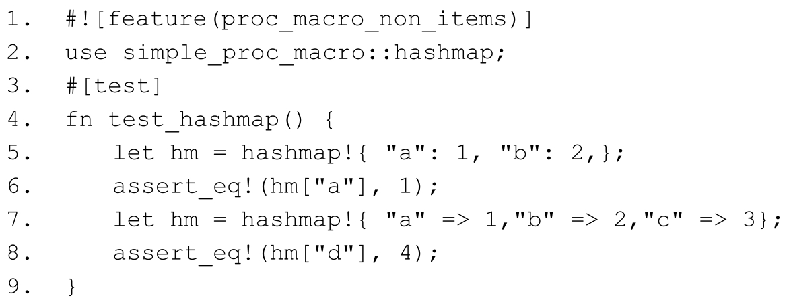{.u53557}
:::

代码清单12-52中引入了＃！\[feature（proc_macro_non_items）\]属性，是因为当前要用到。实现Bang宏，不需要通过＃\[macro_use\]导出，而是通过use关键字直接导入。

可以看出，即将实现的hashmap！宏支持两种宏语法格式，分别如代码第5行和第7行所示。

打开src/lib.rs，开始写实现代码，如代码清单12-53所示。

**代码清单12-53：继续在src/lib.rs中编写实现代码**

::: center
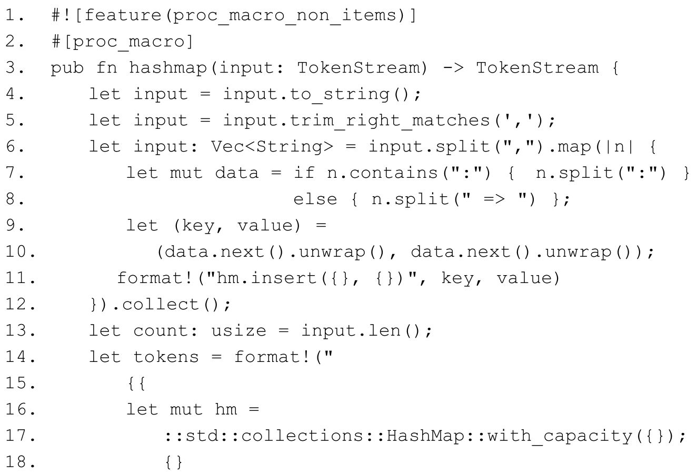{.u53556}
:::

::: center
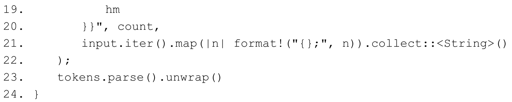{.u53555}
:::

代码清单12-53中，引入了＃！\[feature（proc_macro_non_items）\]特性，这就需要使用Nightly Rust，只有该特性彻底稳定才可去掉。属性＃\[proc_macro\]表示其下方的函数hashmap是要实现一个Bang宏，该函数前面输入和输出参数均为TokenStream类型。

整个hashmap 函数的实现思路比较简单，就是把input 转为字符串，将该字符串解析为数组，再通过format！宏将字符串拼接为所需的格式，最后由parse方法解析返回。具体请查看随书源码中详细的注释。

这里值得注意的是，过程宏实现Bang宏的思路与macro_rules！宏的思路相似，都是拼接生成代码，而代码清单12-53中，是完全对字符串进行解析和拼接，这种实现方法其实并不推崇。

其实proc_macro包中还提供了TokenNode、TokenTree等结构体，以及可以将这些结构转换为 TokenStream 的 quote！宏，只不过目前该功能尚未完善，要完成当前示例，使用起来还不如解析字符串来得方便。

**使用第三方包syn和quote**

虽然官方的proc_macro包功能尚未完善，但是Rust社区提供了方便的包可以使用。通过**syn** 和**quote** 这两个包和proc_macro2的相互配合，可以方便地处理大部分需要用到过程宏的场景，比如自定义派生属性。序列化框架包serde就大量使用了syn和quote，实际上，这两个包就是serde作者在编写serde过程中实现的。

其中，syn完整实现了Rust源码的语法树结构。而quote可以将syn的语法树结构转为proc_macro：：TokenStrem类型。接下来使用proc_macro、syn和quote共同实现一个自定义派生属性功能derive-new ^[\[5\]](#text00018.html#n526401E51CBB43989FAD930A8D74E56A){#text00018.html#n526401E51CBB43989FAD930A8D74E56As}^ 。

使用cargo new命令创建新的包derive-new，并添加tests/test.rs文件，目录结构如代码清单12-54所示。

**代码清单12-54：deriüe-new目录结构示意**

::: center
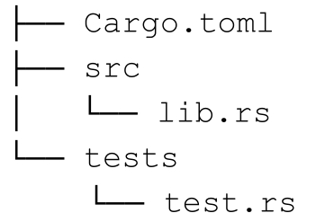{.u53554}
:::

然后在Cargo.toml中引入要依赖的包，如代码清单12-55所示。

**代码清单12-55：Cargo.toml配置文件**

::: center
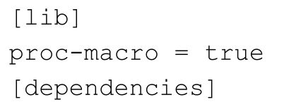{.u53553}
:::

::: center
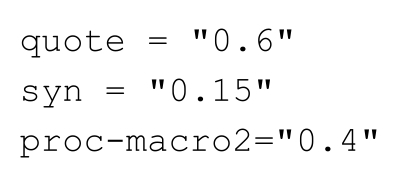{.u53552}
:::

代码清单12-55中指定了该包为proc-macro类型的lib库，并且在依赖项配置了quote 0.6和syn 0.15。需要注意的是，syn和quote的这两个版本从0.12起进行了重构，API接口有重大变动。

继续使用TDD的方式来编写代码，derive-new的功能就是为结构体自动派生new方法。打开tests/test.rs文件，编写测试用例，如代码清单12-56所示。

**代码清单12-56：tests/test.rs中编写测试用例**

::: center
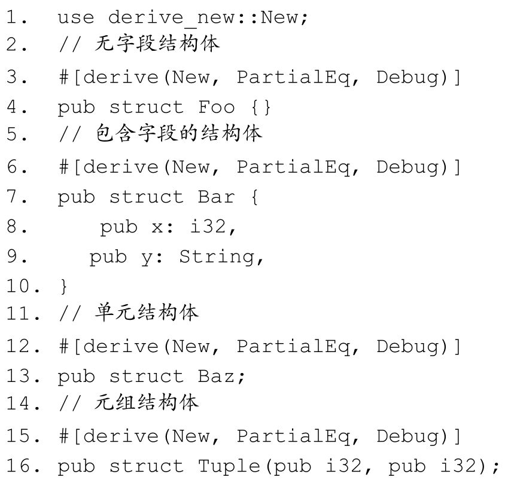{.u53551}
:::

代码清单12-56中定义了四个结构体，均使用了**＃\[derive（New，PartialEq，Debug）\]** 属性，其中New属性就是即将要实现的自定义派生属性，用于给这四个结构体自动实现new方法，此处自动实现PartialEq和Debug用于比较和打印测试用例中的结构体实例。这四个结构体覆盖了Rust中结构体的全部种类：具名结构体、单元结构体和元组结构体。

结构体定义完之后，还需要编写这四种结构体实例分别调用new方法的测试用例，如代码清单12-57所示。

**代码清单12-57：tests/test.rs中编写调用new方法的测试用例**

::: center
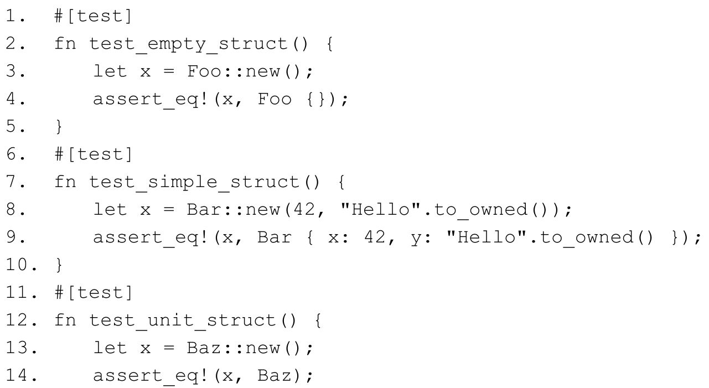{.u53550}
:::

::: center
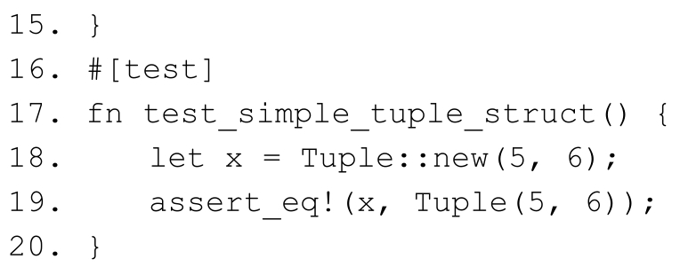{.u53549}
:::

通过编写测试用例，对要编写的实现代码做了大致设计，对于三类结构体都需要支持自动实现new方法。现在打开src/lib.rs来编写实现代码，如代码清单12-58所示。

**代码清单12-58：src/lib.rs中开始编写实现代码**

::: center
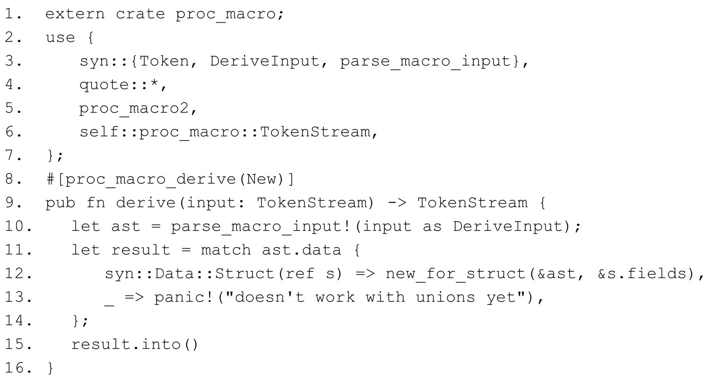{.u53548}
:::

代码清单12-58中第1～7行引入必须的包和TokenStream类型。

代码第 8 行使用＃\[proc_macro_derive（New）\]属性，代表其下方的函数用于处理＃\[derive （New）\]自动派生属性。

代码第 9 行开始定义 derive 函数，使用 pub 公开其可见性，输入参数和返回类型均为TokenStream类型。该函数主要做了三件事：

· 通过parse_macro_input！宏将input解析为syn：：DeriveInput类型的抽象语法树结构。如代码第10行所示。

· 通过ast.data判断数据类型是否为结构体。syn：：Data是syn包中定义的枚举体，一共包含三个值：Struct（DataStruct）、Enum（DataEnum）和 Union（DataUnion），分别代表结构体、枚举体和联合体。但是本示例中只处理结构体，对于结构体类型，通过new_for_struct函数进行处理，如代码第11～14行所示。

· 处理后的最终结果result应该属于proc_macro2：：TokenStream类型，然后通过into方法将其转换为TokenStream类型并返回，如代码第16行所示。其中，proc_macro2是对内置的proc_macro简单包装。它用于桥接Rust 1.15稳定的旧接口和Rust 1.30中引入新接口。在不久的将来，也许会合并到Rust中。

暂且将如何实现new_for_struct函数放一边，现在来看syn：：DeriveInput这个类型，该类型是专门为proc_macro_derive宏而设计的，源码如代码清单12-59所示。

**代码清单12-59：syn：：DeriüeInput结构体源码示意**

::: center
{.u53547}
:::

::: center
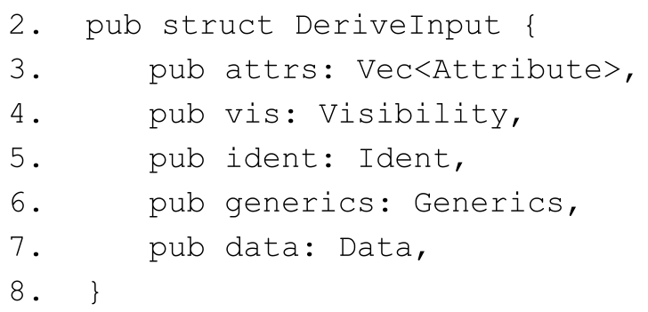{.u53546}
:::

代码清单12-59中展示的DeriveInput结构体包含了五个字段，它们代表的信息如下：

· **attrs** ，实际为 Vec＜syn：：Attribute＞类型，syn：：Atrribute 代表属性，比如＃\[repr（C）\]，使用Vec＜T＞代表可以定义多个属性。用于存储作用于结构体或枚举体的属性。

· **vis** ，为syn：：Visibility类型，代表结构体或枚举体的可见性。

· **ident** ，为syn：：Ident类型，将会存储结构体或枚举体的名称。

· **generics** ，为syn：：Generics，用于存储泛型信息。

· **data** ，为syn：：Data，包括结构体、枚举体和联合体这三种类型。

另外，DeriveInput结构体还实现了一个重要的trait，如代码清单12-60所示。

**代码清单12-60：syn：：DeriüeInput结构体实现了Parse示意**

::: center
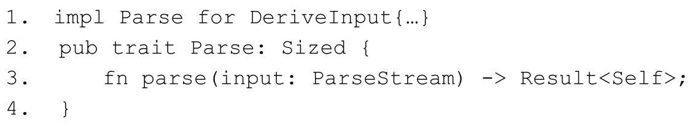{.u53545}
:::

在syn 0.15之前，Parse由Synom代替。从syn 0.15开始，Synom已移除。

Parse中定义了parse方法，其输入参数类型为syn：：parse：：ParseStream，用于syn内部解析token的缓冲流，由TokenStream转换而成。

可以使用parse_macro_input！宏将任意输入参数转换为实现了Parse的类型。在本例中是DeriveInput 结构体。注意，该宏使用的是固定格式的宏语法： **parse_macro_input！（输入参数as 目标类型）** ，其中的**as** 后面必须指定明确的类型。

除了使用 parse_macro_input！宏，其实也可以直接调用 syn：：parse 函数来解析输入参数input。syn：：parse 函数可以将输入的词法流都解析为指定的数据结构，也就是抽象语法树。syn：：parse函数签名如代码清单12-61所示。

**代码清单12-61：syn：：parse函数签名示意**

::: center
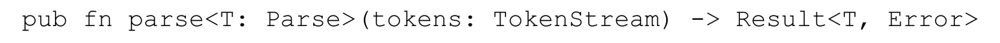{.u53544}
:::

该函数内部会调用T：：parse方法。所以，如果在代码清单12-58中使用syn：：parse解析input参数，并将其声明为syn：：DriveInput类型时，就可以调用syn：：DriveInput中实现的parse方法，最终生成syn：：DriveInput类型实例。

所以，syn 包主要是通过覆盖了全部 Rust 语法结构的自定义抽象语法树数据结构、syn：：Parse 和 parse_macro_input！/syn：：parse 这三大要素，满足开发者方便地将传入的TokenStream类型的词条流转化为指定的syn抽象语法树，如图12-11所示。另外，syn还提供了功能强大的Token！\[...\]宏，用于实现自定义的AST。读者可以通过查阅syn相关文档了解自定义AST的用法。

::: center
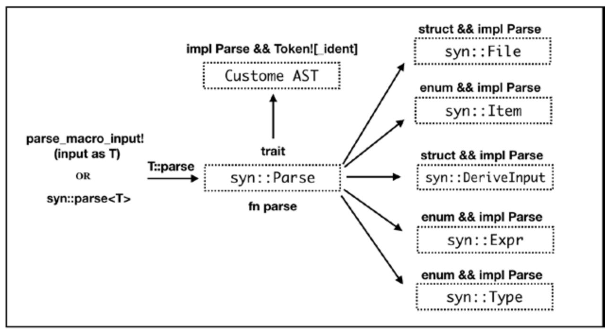{.u53543}

图12-11：syn三大要素示意
:::

在对syn有一定认识之后，回到derive-new的示例中，接下来要实现new_for_struct函数。前面提到过，在Rust中，一共有三种结构体，那么该函数就必须同时满足这三种结构体才行。如代码清单12-62所示。

**代码清单12-62：在src/lib.rs中继续实现new_for_struct函数**

::: center
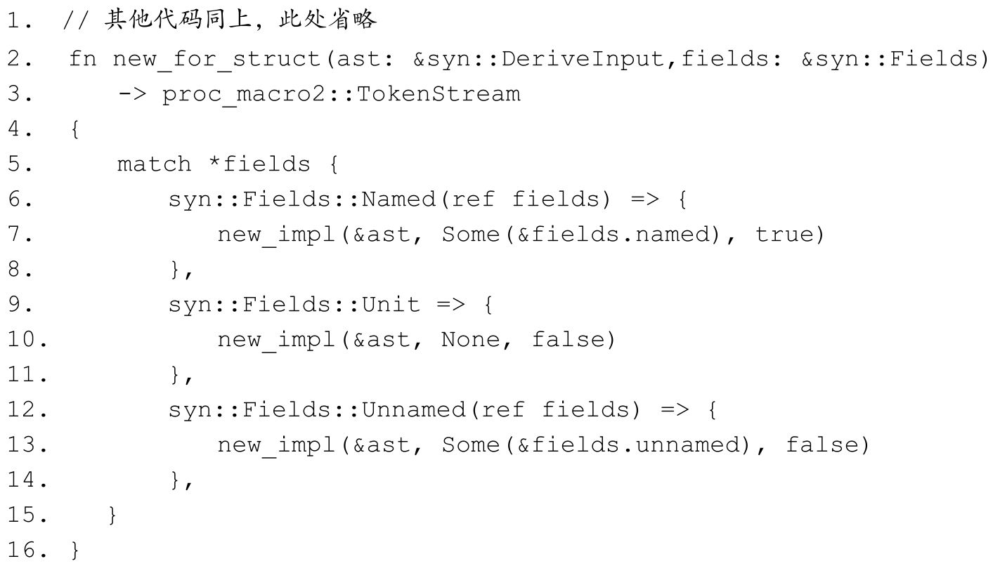{.u53542}
:::

代码清单 12-62 中，new_for_struct 函数包括两个参数：ast 和 fields。其中 ast 是syn：：DeriveInput 引用类型，fields 是 syn：：Fields 引用类型。该函数返回值为proc_macro2：：TokenStream 类型，因为该函数是在 derive 函数中被调用，最终需要转为proc_macro2的TokenStream类型。

此处用到的syn：：Fields类型属于syn：：Expr枚举体中定义的一个值，并且syn：：Fields本身也是枚举体，定义了三个值：syn：：Fields：：Named、syn：：Fields：：Unit和syn：：Fields：：Unnamed，分别代表命名结构体、单元结构体和元组结构体中的字段信息。

函数实现比较简单，通过match匹配fields的类型，调用相应的new_impl函数，需要将ast、不同结构体的字段信息、判断是否为命名结构体的布尔值一起传进去。

接下来继续实现new_impl函数，如代码清单12-63所示。

**代码清单12-63：在src/lib.rs中继续实现new_impl函数**

::: center
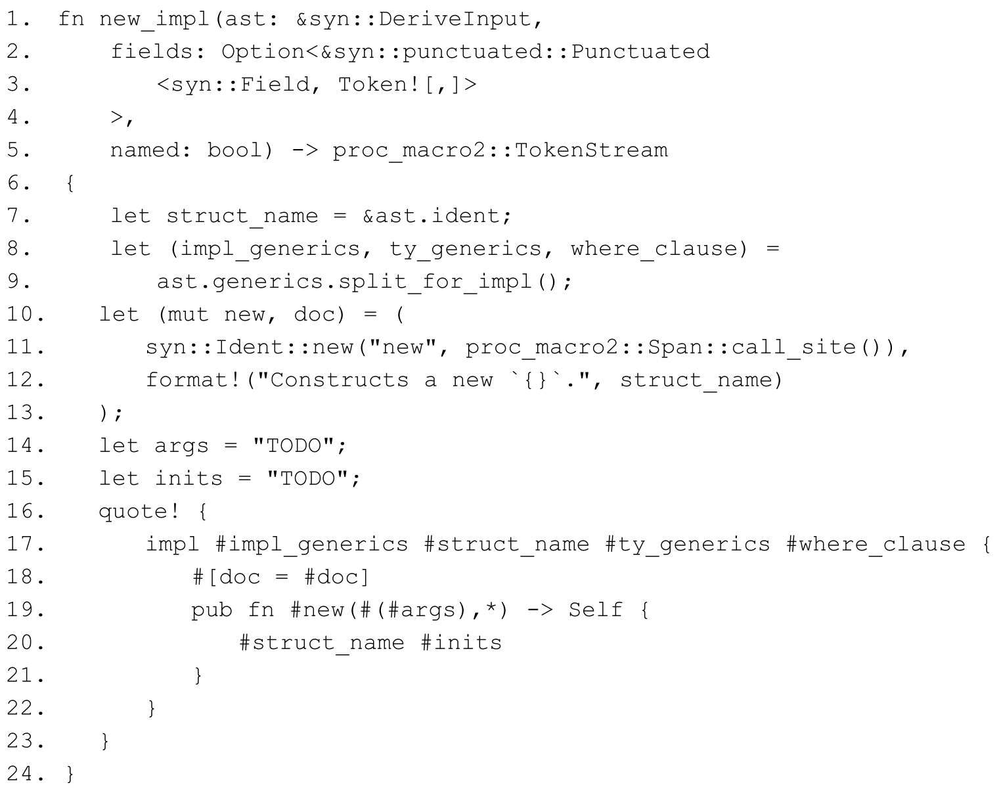{.u53541}
:::

代码清单12-63中，函数new_impl包含三个参数，其中ast和named类型已经介绍过。fields的Option＜&syn：：punctuated：：Punctuated＜syn：：Field，Token！\[，\]＞＞ 类型看上去比较长，下面将其"拆解"为几个独立的部分来理解它：

· 最外层的类型为 Option＜T＞，表示 fields 类型整体是一个可选值，因为对于单元结构体来说，fields的值为None。

· 第二层是syn：：punctuated：：Punctuated＜T，P＞类型，该结构用于存储由标点符号分隔的语法树节点序列。常用的有：

➢Punctuated＜Field，Token！\[，\]＞，用逗号分隔的结构体字段序列。

➢Punctuated＜PathSegment，Token！\[：：\]＞，用双冒号（：：）分隔的路径序列。

➢Punctuated＜TypeParamBound，Token！\[+\]＞，泛型参数序列。

➢Punctuated＜Expr，Token！\[，\]＞，函数调用参数。

· 第三层是＜syn：：Field，Token！\[，\]＞，分别是结构体字段和逗号标记。

所以，整个fields类型可以理解为表示类似于"Struct{a：1，b：2，c：3}"或"Struct（1，2，3）"中字段的语法树结构。该函数返回值依然是proc_macro2：：TokenStream。

代码第7行中，因为ast是DeriveInput结构，所以调用它的ident字段，就可以得到当前结构体的名称struct_name。

代码第8行和第9行通过ast的generics取得结构体中泛型相关的信息，然后通过调用split_for_impl方法返回元组结构，通过let模式匹配分别赋值给impl_generics、ty_generics和where_clause。

代码第10～13行分别声明了new标识符和文档说明doc，会用于后面的生成代码。这里值得注意的是，使用了syn：：Ident：：new 方法将字符串转换为syn的语法树结构以备使用，在后面使用quote！进行代码生成的时候不允许直接使用字符串，当然文档doc除外。

代码第14行和第15行声明了两个变量args和inits，分别用于表示将来new函数中传入的参数和字段信息。这个比较复杂，此处暂时用字符串占位。

代码第16～23行中，quote！宏的使用方法和定义macro_rules！宏时差不多，不同点在于，quote！宏中使用符号"＃"来代替macro_rules！宏中的"\$"。整个quote！宏相当于是生成代码的"模板"，等价于要生成代码清单12-64。

**代码清单12-64：和quote！宏要生成的代码等价的生成代码示意**

::: center
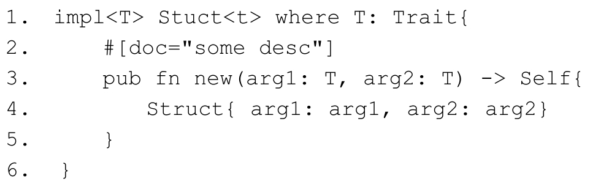{.u53540}
:::

代码清单 12-64 使用伪代码展示了 quote！宏要生成的代码示意。由此可以看出，代码清单12-63中第19行定义new方法的时候，用到了"＃（＃args），\*"模式，这和marco_rules！宏的"\$（\$args），\*"模式类似，同样表示重复零次或多次，这里表示new参数可能是零个，也可能是多个。

接下来只需要搞定args和inits两个变量即可。因为字段信息比较复杂，所以需要一个独立的结构体来存储字段的信息，如代码清单12-65所示。

**代码清单12-65：在src/lib.rs中定义FieldExt＜＇a＞结构体**

::: center
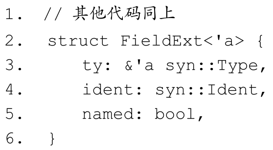{.u53539}
:::

代码清单12-65中定义了FieldExt＜＇a＞结构体，其中字段ty用来存储结构体字段的类型信息，ident用于存储结构体字段的字段名，named用来存储判断该字段是否为命名结构体的布尔标记。实际上，new方法的参数名和字段名也是一一对应的，所以也可以用该结构体来存储参数信息。

接下来为FieldExt＜＇a＞结构体实现一些方法，如代码清单12-66所示。

**代码清单12-66：在src/lib.rs中为FieldExt＜＇a＞结构体实现一些方法**

::: center
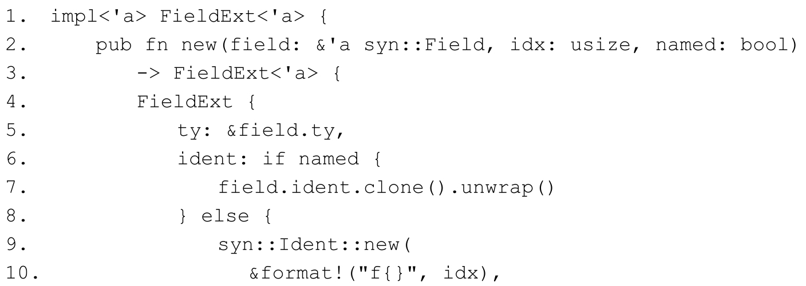{.u53538}
:::

::: center
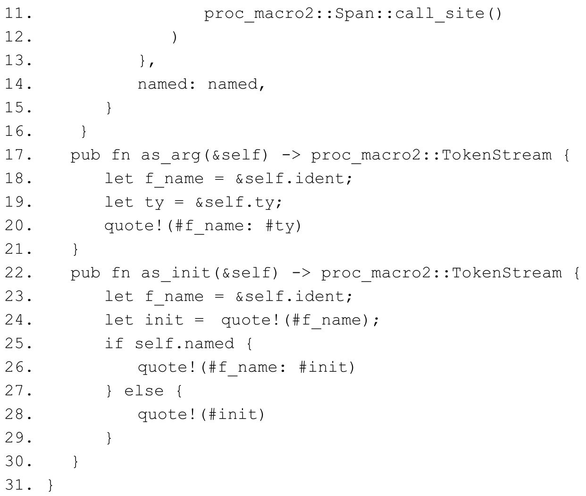{.u53537}
:::

代码清单12-66中为FieldExt＜＇a＞结构体实现了new方法用于创建该结构体实例，as_arg实例方法用于得到参数信息的 proc_macro2：：TokenStream 结构，as_init 实例方法用于得到字段信息的proc_macro2：：TokenStream结构。

代码第2～15行new方法中，第一个参数field为syn：：Field的引用类型，该类型为结构体，记录了结构体字段的信息，包括类型（ty 字段）、字段名称（Option＜Ident＞）等。注意和前面出现过的syn：：Fields区分。第二个参数idx是用于记录元组结构体的字段位置。

代码第17～21行中，as_arg方法为FieldExt＜＇a＞结构体的实例方法。通过获取ty和ident信息，分别得到参数的类型和名称，最后通过quote！宏生成函数参数形式的词条结构。

代码第 22～30 行中，as_init 方法用于处理字段的信息，如果命名结构体，生成形如"＃f_name：＃init"这样的词条结构，否则只需要得到单独的"＃init"词条结构即可。

注意，new方法的参数名和返回结构体实例字段名是一样的，参考代码清单12-64。

接下来继续完善new_impl函数，如代码清单12-67所示。

**代码清单12-67：在src/lib.rs中继续完善new_impl函数**

::: center
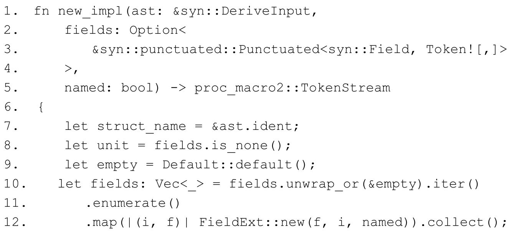{.u53536}
:::

::: center
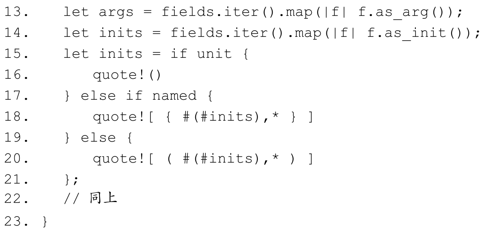{.u53535}
:::

代码清单12-67中代码第8～21行为新增内容。

代码第8行声明unit变量用于判断是否为单元结构体。代码第9行声明empty变量，利用Default：：default方法自动推断单元结构体的字段值为单元值。

第10～12行通过迭代器将fileds转换为FieldExt＜＇a＞的数组集合。

代码第13行和第14行分别通过as_args和as_init得到参数和字段的词条结构。

代码第15～21行中，判断如果是单元结构体，则直接调用空的quote！宏，没有任何宏体。如果是命名结构体，则使用"{＃（＃inits），\*}"模式，将字段循环生成形如"{arg1：arg1，arg2：arg2}"这样的词条结构。如果是元组结构体，则使用"（＃（＃inits），\*）"模式，将字段循环生成形如"（arg1，arg2）"这样的词条结构。

至此，derive-new的代码就全部完成了，执行**cargo test** 命令之后，可以看到测试正常执行通过。上面的代码还有可以扩展的地方，比如通过属性为字段添加默认值，如代码清单12-68所示。

**代码清单12-68：改进＃\[deriüe（New）\]属性，支持＃\[new（üalue=xxx）\]为字段指定默认值**

::: center
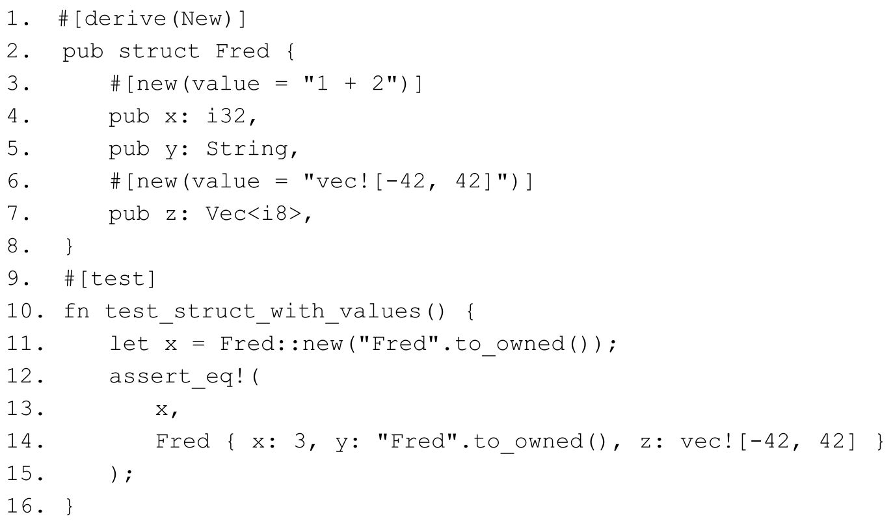{.u53534}
:::

要实现代码清单 12-68 测试用例描述的功能，需要使用＃\[proc_macro_derive（New，attributes（new））\]宏，然后在对应的derive函数中处理attributes的信息。具体如何实现，就留给读者来完成。

## 12.3 编译器插件 {#text00018.html#A69c301ee-815f-4c93-8ae2-a96700392ff0 .title-left}

Rust中最强大的元编程工具非编译器插件莫属，但可惜的是，编译器插件目前还不稳定。在Nightly版本的Rust之下，配合＃！\[feature（plugin_registrar）\]特性，可以实现编译器插件。

编译器插件由内置的**librustc_plugin** 包提供，该包对外公开了八种方法供开发者编写不同功能的编译器插件，具体如下：

· register_syntax_extension，可以通过它实现任意语法扩展。

· **register_custom_derive** ，是对register_syntax_extension的包装，专门用于实现自定义派生属性。

· **register_macro** ，同样是对register_syntax_extension的包装，用于实现Bang宏。

· register_attribute，用于实现编译器属性。

**其他四种** 与lint属性和llvm相关。

接下来实现一个简单的编译器插件，使用 cargo new 命令创建一个 lib 包，名称为plugin_demo，再添加tests/test.rs文件用于测试，目录结构如代码清单12-69所示。

**代码清单12-69：plugin_demo目录结构**

::: center
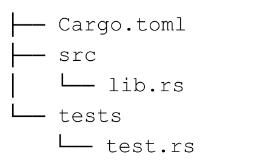{.u53533}
:::

在Cargo.toml文件中将lib设置为plugin类型，如代码清单12-70所示。

**代码清单12-70：Cargo.toml文件中将lib设置为plugin类型**

::: center
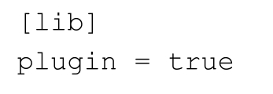{.u53532}
:::

打开tests/test.rs文件，编写测试用例，如代码清单12-71所示。

**代码清单12-71：在tests/test.rs中编写测试用例**

::: center
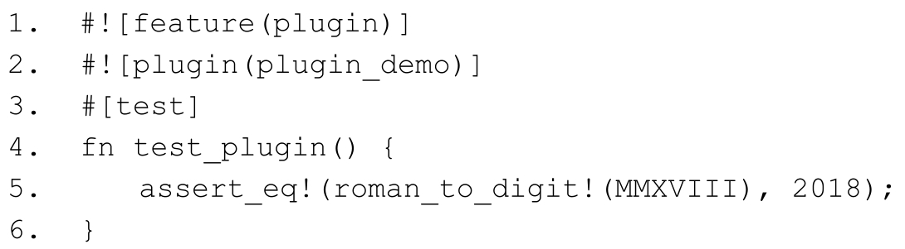{.u53531}
:::

代码清单12-71中使用了**＃！\[feature（plugin）\]** 特性，如第1行所示，所以需要在Nightly版本的Rust下运行。

代码第2行使用**＃！\[plugin（plugin_demo）\]** 属性将plugin_demo中定义的语法扩展导出。

代码第4行定义了测试函数，该函数中使用**roman_to_digit！** 宏，将罗马数字MMXVIII转换为阿拉伯数字2018，并对转换结果进行判断。

打开src/lib.rs文件并编写实现代码，如代码清单12-72所示。

**代码清单12-72：在src/lib.rs中编写插件的实现代码**

::: center
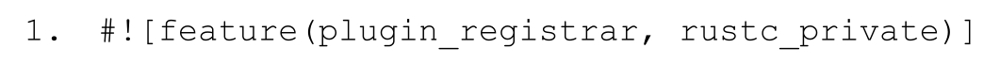{.u53530}
:::

::: center
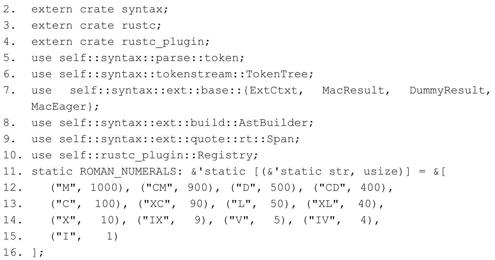{.u53492}
:::

代码清单 12-72 中第 1 行使用了＃！\[feature（plugin_registrar，rustc_private）\]，包含特性plugin_registrar 和 rustc_private。目前自定义编译器插件功能还未稳定，所以必须在 Nightly下使用这两个特性。

代码第2～10行引入相关的包和类型。Syntax包实际上就是Rust源码内的libsyntax包，而rustc_plugin就是Rust源码内的librustc_plugin包。

代码第11～16行定义一个静态变量ROMAN_NUMERALS，其中记录了基本的罗马数字到阿拉伯数字的配对元组，用于后续计算。

接下来，实现具体的罗马数字到阿拉伯数字的转换函数，如代码清单12-73所示。

**代码清单12-73：继续在src/lib.rs中添加expand_roman函数**

::: center
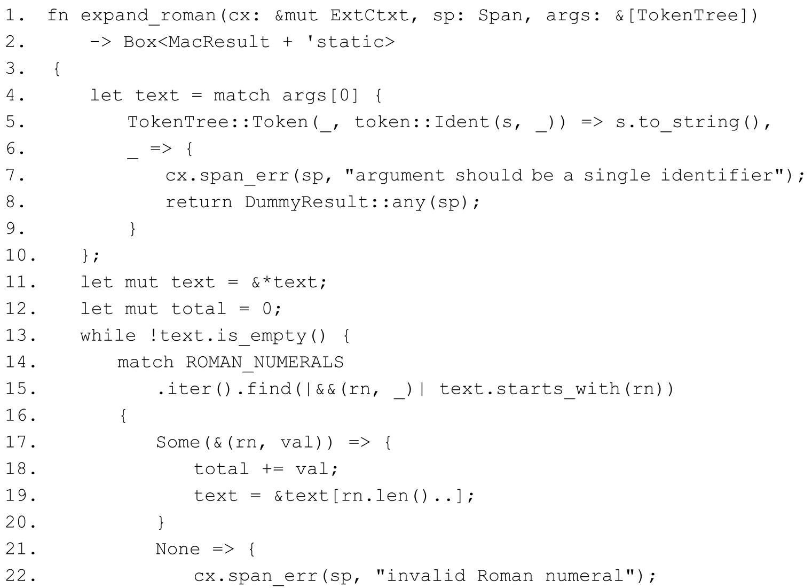{.u53529}
:::

::: center
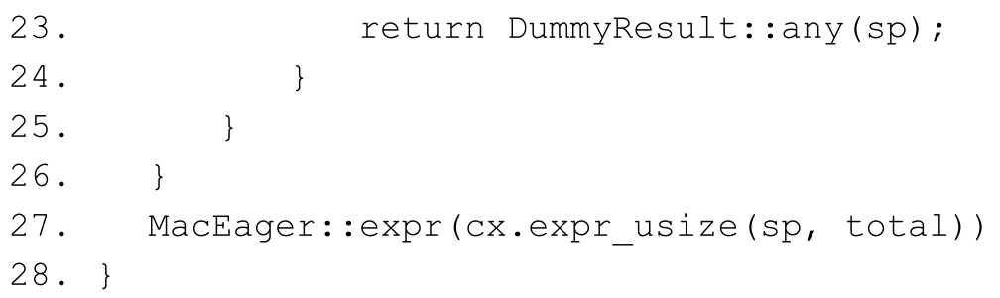{.u53528}
:::

代码清单12-73中，定义了expand_roman函数，该函数包含以下三个参数：

· **cx** ，代表代码的上下文环境，为ExtCtxt的可变引用类型。

· **Span** 类型，表示代码的位置等信息。

· **TokenTree** 切片数组，表示经过编译器分词器得到的代码词条树。

函数的返回值是**Box＜MacResult+＇static＞** 类型，是一个trait对象。其中**MacResult** 是一个trait，该trait中定义了很多方法用于组装AST结构。因为编译器插件是直接修改AST结构来实现语法扩展的。

代码第4～10行定义了text绑定。其中args\[0\]是一个TokenTree数据类型，通过match匹配，将token：：Ident标识符类型的值**s** 匹配出来，然后生成字符串，并赋值给text。因为在测试代码中传给**roman_to_digit！** 宏的罗马数字**MMXVIII** 会被识别为标识符。但是，如果匹配失败，则表示传入的参数不是标识符，而是其他类型，比如数字、字符串等。则通过调用cx.span_err方法，为位置信息sp设置错误提示，并通过DummyResult：：any函数将错误信息sp返回去，以便使用者排除错误。

代码第12行定义total绑定，并赋值为0，用于计算最终的阿拉伯数字。

代码第13～26行迭代得到的罗马数字字符串text，将其中的字符在ROMAN_NUMERALS静态变量中查找相对应的阿拉伯数字，并累计求和，然后将结果赋予最终的total绑定。如果在ROMAN_NUMERALS静态变量中没有查到对应的罗马数字，则继续通过调用cx.span_err方法，为位置信息sp设置相应的错误提示，并将sp返回。

代码第27行通过MacEager：：expr将最终的total和sp返回。cx.expr_usize指定了total的类型为usize。

**MacEager** 是一个枚举体，它定义Rust的语法结构作为枚举值，包括**表达式** （expr）、**模式** （pat）、**语言项** （items）、**实现项** （impl_items）、**语句** （stmts）和**类型** （ty）等。

接下来定义roman_to_digit宏，如代码清单12-74所示。

**代码清单12-74：继续在src/lib.rs中定义roman_to_digit函数**

::: center
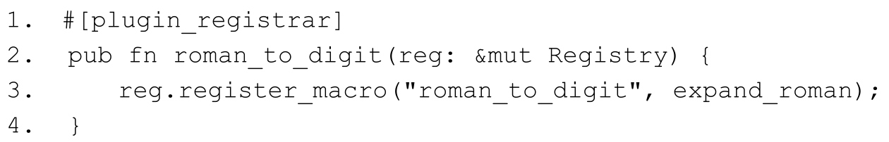{.u53527}
:::

代码清单12-74中第1行使用＃\[plugin_registrar\]属性，表示其下方的函数实现编译器插件功能。在 roman_to_digit 函数中使用 reg 的 register_macro 来定义一个宏，名字叫作roman_to_digit，然后对应expand_roman函数的功能。

最后，在plugin_demo包根目录下执行cargo rest命令，测试正常编译通过。需要注意的是，该自定义编译器插件示例当前可以在Rust 1.30下正常编译执行，在未来很有可能编译失败，因为Rust内部的libsyntax包是不断变化的。但是，即便libsyntax的语法会改变，基本的原理也是不变的，只要掌握基本的原理，也可以在编译失败的基础上很快将其修复。

通过此例可以看出，编写编译器插件和编写过程宏整体流程很相似，但是在细节上有差距，前者直接依赖AST结构，而后者只是依赖TokenStream词法结构。从语言功能稳定的角度看，过程宏要优于编译器插件，也属于宏 2.0 稳定发布的计划内容。另外，过程宏的文档比较全，而编译器插件的文档很少，开发者只能从源码中获取信息。所以，作为开发者，应该优先选择过程宏，而非编译器插件，除非过程宏无法达成目的。

## 12.4 小结 {#text00018.html#A2f2801f1-aa2e-4e4c-8fb9-a5f57a437c2f .title-left}

本章从元编程概念谈起，总结了编程语言中提供的元编程方式，包括反射和语法扩展。Rust语言作为系统级静态语言，对于反射的支持相比其他动态语言来说，功能不够强大，仅仅可以识别静态生命周期的类型信息。但Rust提供的宏功能是强大的。

Rust提供了两种宏，一种是声明宏，另一种是过程宏。

声明宏在Rust中最常用，它可以编写Bang宏，也就是可以像函数调用那样使用，但是和函数调用不同的地方在于，Bang宏返回的是生成代码，而函数调用返回的是求值结果，分清这个差别很重要。当前只能用macro_rules！来定义声明宏，但在Rust 2018发布之后，宏2.0计划应该可以实施完成，到时候就可以使用macro关键字来定义声明宏。

Rust也支持编译器插件机制，但是编译器插件依赖于AST结构。如果要面向开发者稳定地自定义编译器插件功能，就不能太依赖于AST结构，因为Rust还在发展期，Rust本身还在不断地优化，虽然在语法上已经稳定，但是其内部的语法树结构有可能会变化，这就不利于将其对外稳定公开给广大开发者。所以，过程宏就出现了，它基于词条流（TokenStream），不管语法树如何变化，它都不会改变，因为它本身不携带语法信息。

使用过程宏可以自定义派生属性、编写 Bang 宏，以及编写自定义属性。最早稳定的过程宏功能是自定义派生属性，也被称为宏1.1。编写Bang宏在Rust 1.30中已稳定，在此版本前需要使用＃！\[feature（proc_macro）\]特性。若要使用过程宏编写自定义属性，则需要使用＃！\[feature（custom_attribute）\]特性。此处也注意参考随书源码中的更新。

过程宏配合第三方库syn和quote可以更方便地编码。但值得注意的是，syn和quote只支持Rust的语法。如果想像声明宏那样定义比较自由的宏语法，是不支持的。这在一定程度上保证了Rust宏不会被滥用，即便开发者使用过程宏来定义Bang宏，其宏语法也只能是Rust的语法，而不是其他奇怪的语法。再加上宏展开过程也会经过Rust编译器的安全检查，所以大可放心地使用Rust的宏。

最后，通过一个简单的示例了解了如何编写编译器插件，虽然鼓励开发者优先选择过程宏，但是了解一下如何编写编译器插件也很有帮助。当前Rust社区的第三方包或框架也有使用编译器插件实现相应的语法扩展。比如Web开发框架rocket，在Rust 0.3中就用了编译器插件的方式来实现自定义属性，如代码清单12-75所示。

**代码清单12-75：rocket示例**

::: center
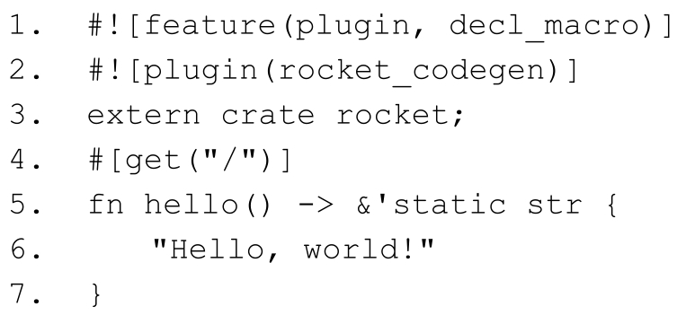{.u53526}
:::

::: center
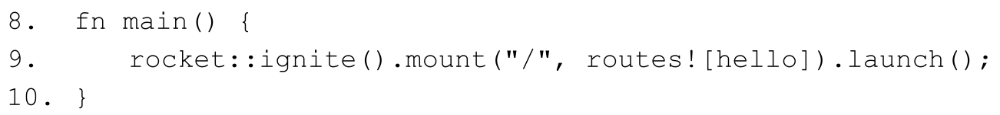{.u53525}
:::

代码清单12-75展示了Web开发框架rocket的一个Hello World示例。从代码第1行看得出来，用到了 plugin 和 decl_macro 两个特性，代表 rocket 内部使用了编译器插件机制和macro关键字。

代码第2行中，＃！\[plugin（rocket_codegen）\]代表rocket_codegen包中使用编译器插件方式定义了一些语法扩展。

代码第4行中，＃\[get（＂/＂）\]自定义属性，为第5行的hello函数自动生成了路由相关的代码，这样一来，当有"GET https：//domain/"这样的HTTP请求时，就可以自动调用到hello函数。

这就是Rust关于元编程的一切，虽然Rust还在不断完善，但它实现元编程的"道"是不变的。

------------------------------------------------------------------------

[\[1\]](#text00018.html#n7F6901D11183453DAB96A5D8143A00C4s){#text00018.html#n7F6901D11183453DAB96A5D8143A00C4} 实际的编译过程并非是严格按这个先后顺序的，有些过程实际上是同时进行的。

[\[2\]](#text00018.html#nD38E01D66FBC45C0B3DE7B9F6EAFB11Bs){#text00018.html#nD38E01D66FBC45C0B3DE7B9F6EAFB11B} 定义于Rust源码src/libsyntax/ext/tt/macro_rules.rs文件中。

[\[3\]](#text00018.html#n916001DBCDCE45C5BC697DCFB9011E40s){#text00018.html#n916001DBCDCE45C5BC697DCFB9011E40} 事实上没有这样的术语，这里只是为了方便说明。

[\[4\]](#text00018.html#n0E1C01E15DE94F59AA689E5FF3FA931Es){#text00018.html#n0E1C01E15DE94F59AA689E5FF3FA931E} TDD：测试驱动开发。

[\[5\]](#text00018.html#n526401E51CBB43989FAD930A8D74E56As){#text00018.html#n526401E51CBB43989FAD930A8D74E56A} 模仿GitHub nrc/derive-new的实现。

[]{#text00019.html}

# 第13章 超越安全的边界 {#text00019.html#Ac1aed812-68b8-41eb-9e8d-4d8a63a9352c .title-left}

混沌涌现秩序，光明源自黑暗。

现代人类依靠钢筋混凝土结构的现代建筑来挡风遮雨、袪暑避寒，舒服地享受生活；在大气层和地球磁场的保护下，削弱了一次又一次能够重创现代文明的强太阳高能电子流和其他宇宙射线的冲击；木星、土星等巨行星形成的屏障，大大地降低了小天体撞击地球的概率。这是一个无奈的事实：**不安全是这个世界的本质，绝对的安全并不存在** 。

计算机世界中亦是如此。Rust语言通过一系列静态分析机制保障了内存安全。然而，作为系统级编程语言，Rust无可避免地需要直接与操作系统或裸机打交道。操作系统主要由C语言实现，包括UNIX、Linux、Windows内核。所以，Rust程序在和外部环境"打交道"的时候，无论Rust编译器有多么智能和强大，都很难检测到外部环境涉及的内存安全问题。

不妨打个比方。Rust就像是一艘遨游于太空的宇宙飞船，不管外太空多么危险，宇航员只要待在飞船内部，就是安全的。当宇航员需要去飞船外执行任务时，就必须穿好宇航服，经由减压舱到达飞船外部。宇航员一旦进入外太空，就必须自己保证安全，因为此时他已完全暴露于不安全的环境之下。

严格地说，Rust语言可以分为**Safe Rust** 和**Unsafe Rust** 两部分。Safe Rust就是提供安全庇护的"宇宙飞船"，而Unsafe Rust就是"宇航服、减压舱，以及飞船外部与宇航员有一切关联的部分"。

Safe Rust涵盖了前面章节中所介绍的内容，包括类型系统和所有权等静态分析机制。在使用Safe Rust的时候，开发者完全不必担心有内存不安全的问题出现。但是当需要和其他语言交互，甚至与底层操作系统或硬件设备交互的时候，就只能依靠另外一套"语言"：Unsafe Rust。

## 13.1 Unsafe Rust介绍 {#text00019.html#Ab4e201f3-e88d-4887-835a-27551a55b3d6 .title-left}

Unsafe Rust是Safe Rust的一个超集。也就是说，在Unsafe Rust中，并不会禁用Safe Rust中的任何安全检查。如代码清单13-1所示。

**代码清单13-1：unsafe块中使用引用依旧会进行借用检查**

::: center
{.u53524}
:::

::: center
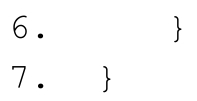{.u53523}
:::

代码清单13-1中，在unsafe块中同时对变量a进行不可变借用和可变借用，这违反了借用规则，编译器会报错。所以，即使在Unsafe Rust下，如果依旧编写Safe Rust的代码，也完全可以保证某种程度的安全性。

Unsafe Rust是指在进行以下五种操作的时候，并不会提供任何安全检查：

· 解引用裸指针。

· 调用unsafe的函数或方法。

· 访问或修改可变静态变量。

· **实现** unsafe trait。

· 读写**Union** 联合体中的字段。

这五种操作基本上适用于Rust和外部环境"打交道"的所有场景。对于这些场景的操作来说，Rust的安全检查完全无用武之地，反而会是一种障碍。比如解引用裸指针的时候，也许会是一个空指针或悬垂指针，此时就会造成未定义行为，即便此时编译器会进行安全检查，代码也无法通过编译，从而也就完全无法和外部环境"打交道"了。所以，针对这五种操作，就完全不提供任何安全检查。

Unsafe Rust**和** Safe Rust**的区分带来以下三方面结果** ：

· Unsafe Rust由于不需要安全检查，意味着有一定的性能提升。

· Unsafe Rust内存安全完全交由开发者来保证，否则会出现未定义行为。

· 区分了编译器和开发者的职责，如果代码出现了问题，可以先排查Unsafe Rust的代码。

这其中包含缺点，也有优点。值得注意的是，Unsafe Rust的存在并不与Safe Rust相矛盾，也不与Rust语言保证内存安全的目标相冲突。反而是Unsafe Rust的存在成就了Rust。

### 13.1.1 Unsafe语法 {#text00019.html#A007901f4-d243-4640-ac44-7d342c00e7f3 .title-left}

通过unsafe关键字和unsafe块就可以使用Unsafe Rust，它们的作用如下：

· **unsafe关键字** ，用于标记（或者说声明）函数、方法和trait。

· **unsafe块** ，用于执行Unsafe Rust允许的五种操作。

**unsafe关键字**

Rust标准库中包含了很多被unsafe关键字标记的函数、方法和trait。以String中实现的函数来说，如代码清单13-2所示。

**代码清单13-2：String中内置的unsafe函数示意**

::: center
{.u53522}
:::

代码清单13-2中展示了String内置的unsafe函数from_utf8_unchecked的源码实现。其函数签名包含了unsafe关键字，该函数接收一个Vec＜u8＞类型的字节数组，返回一个String类型。

乍一看，该函数中只是简单地返回一个String结构体实例而已，也没有进行Unsafe Rust允许的那五种操作中的任意一种，完全是正常的Safe Rust代码，而且也在编译器的安全检查之下。**那么这里为什么用unsafe关键字来标记该函数呢** ？因为该函数并未对传入的参数bytes进行任何合法性验证，如果传入的是一个非法的UTF-8字节序列，则会出现内存不安全的问题。换句话说，就是使用该函数时有可能会发生违反"契约"的风险。

函数 from_utf8_unchecked 的"契约"是指，传入的参数是有效的 UTF-8 字节序列。这就是unsafe关键字存在的意义。该函数被标记上unsafe之后，使用该函数的开发者就会主动去了解这一"契约"，看看当前的使用是否满足"契约"的要求。如果开发者没有做到满足"契约"的要求，将来出现了问题，也可以在unsafe标记的范围内排查问题。

所以，在使用 Rust 编写一个函数的时候，需要注意该函数在使用的时候是否存在违反"契约"的风险。如果存在风险，请使用unsafe关键字将其标记出来，在其他人使用该函数时，就可以多加注意。这里最大的风险在于，如果一个函数存在违反"契约"的风险，而开发者并没有使用unsafe关键字将其标记，那该函数就很可能会成为Bug的"温床"。

除标记函数或方法外，**unsafe** 也用于标记**trait** 。

标准库中包含的**unsafe trait** 有**Send** 和**Sync** 。编译器依赖Rust内置的类型和内部严格的规则，为开发者自定义的类型自动实现这两个trait，这是Rust能保证并发安全的基石。使用unsafe对Send和Sync进行标记，就意味着开发者手动实现它会有安全风险。

标准库中另外一个unsafe trait就是**std：：str：：pattern：：Searcher** ，在字符串章节中已介绍过它，它是字符串搜索模式的抽象，提供了一系列方法，行为像迭代器。如代码清单13-3所示。

**代码清单13-3：Searcher示意**

::: center
{.u53521}
:::

代码清单13-3中展示了Searcher源码示意，它是一个unsafe trait。这里unsafe标记的为什么是trait而不是方法next呢？

这是因为要实现 Searcher 里的 next 方法，必须要保证其返回的索引位于有效的 UTF-8边界上，否则会出现内存不安全的问题。而依据Searcher的工作机制来看，next方法并不会引起任何内存不安全问题，只是它的返回结果在另外一个地方使用才会发生问题。而考虑到字符串检索的性能，Searcher也不想对结果进行检查。所以，这里只能给trait加上unsafe标记，以此来警告实现该trait的开发者在实现该trait时必须遵守这些条件。另外，在实现unsafe trait的时候，也必须相应地使用**unsafe impl** 才可以。

**unsafe块**

被 unsafe 关键字标记的不安全函数或方法只能在 unsafe 块中被调用。如代码清单 13-4所示。

**代码清单13-4：unsafe块示意**

::: center
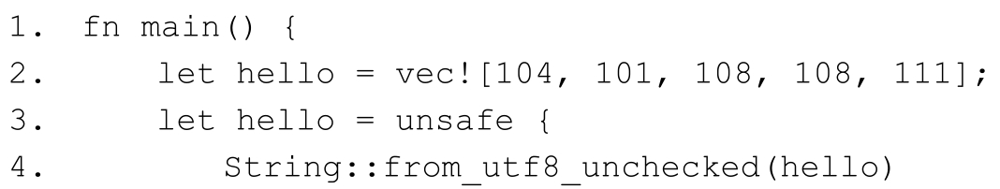{.u53520}
:::

::: center
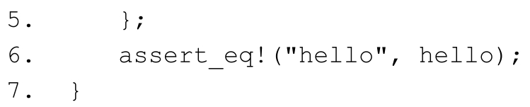{.u53519}
:::

代码清单13-4中使用from_utf8_unchecked函数将字节数组转为字符串，这里必须使用unsafe块，否则会报如代码清单13-5所示的错误。

**代码清单13-5：未使用unsafe块调用unsafe函数会报错**

::: center
{.u53518}
:::

从代码清单13-5中看得出来，在未使用unsafe块的情况下就调用unsafe函数，编译器会报错。强制使用unsafe块，意味着强制让开发者将unsafe函数的调用和安全代码隔离起来，便于排查错误。

除调用不安全函数或方法外，unsafe块也可以进行其他操作。

### 13.1.2 访问和修改可变静态变量 {#text00019.html#A6f0901f6-07db-47ea-afa7-05fa944a453e .title-left}

静态变量是全局可访问的。对于不可变静态变量来说，访问它不存在任何安全问题。Rust也允许定义可变的静态变量，但是试想一下，如果多个线程同时访问这个可变静态变量，会发生什么？答案是：会引起数据竞争。这是Rust安全检查绝对不允许发生的事情。

所以，如果一定要定义可变的静态变量，就必须在unsafe块中进行操作，以此来警示该操作属于不安全行为，开发者必须保证其安全。如代码清单13-6所示。

**代码清单13-6：访问和修改可变静态变量必须在unsafe块中**

::: center
{.u53517}
:::

代码清单13-6中定义了可变静态变量COUNTER，并在unsafe块中对其进行修改和访问。如果此时不使用unsafe块，编译器就会报错提示你应该使用unsafe块来操作可变静态变量。

一般情况下，很少有人使用可变静态变量，但是要和其他语言交互（尤其是C语言）的时候，可变静态变量就会非常有用，在后面与C交互的内容会有更详细的介绍。

### 13.1.3 Union联合体 {#text00019.html#Ac7a501f6-425a-48b5-b2cc-9a7f68a962b0 .title-left}

Rust也提供了像C语言中那样的Union联合体。Union和Enum相似，Enum属于Tagged Union，优点在于其存储的 Tag 可以保证内存安全，缺点是 Tag 要占用多余的内存空间。而Union 并不需要多余的 Tag，如果想访问其中的字段，就必须靠程序逻辑来保证其安全性，如果访问错误，就会引发未定义行为。所以，它的优点是比Enum省内存空间，缺点是使用起来不安全。

Union 的内存布局和 Enum 也是相似的，字段共用同一片内存空间，所以也被称为共用体。内存对齐方式也是按字段中内存占用最大的类型为主。Rust里引入Union的主要原因还是为了方便Rust和C语言"打交道"。如代码清单13-7所示。

**代码清单13-7：使用Union联合体和Struct模拟Enum类型**

::: center
{.u53516}
:::

代码清单13-7中使用Union和Struct来模拟一个Enum类型MyZero。该类型的特点是，可以同时存储整数0和浮点数0.0。

代码第1～5行使用union关键字定义了Union联合体，包含两个字段i和f，用i32和f32类型分别代表整数和浮点数。当使用Union联合体时，配合使用了**＃\[repr（C）\]** 属性是必需的，该属性会告诉Rust编译器，此联合体应该使用和C语言一样的**内存布局** 。如果不加＃\[repr（C）\]属性，则有可能发生未定义行为。

代码第6～10行定义了结构体Value，包含tag字段和value字段，是为了模拟Enum类型中的值。因为Enum类型中的每个值还包含一个tag。此处也必须为结构体Value使用＃\[repr（C）\]属性，因为value字段是联合体类型U。

代码第11～15行定义了MyZero联合体，包含两个字段i和f，它们的类型均为Value。该联合体相当于代码第16～19行定义的一个Enum类型MyEnumZero。

然后就可以在main函数中使用MyZero了，每次使用一个值。需要注意的是，代码清单13-7**并不能正常编译运行** 。因为当前版本的Rust**不支持Union联合体的字段为非Copy** （Non-Copy）**类型** ，联合体MyZero中的字段就是非Copy类型。如果使用**＃！\[feature（untagged_unions）\]** 特性，该段代码就能正常编译，不久的将来该特性会稳定。

接下来对代码清单13-7做一次重构，让它可以正常运行。如代码清单13-8所示。

**代码清单13-8：对代码清单13-7进行重构**

::: center
{.u53515}
:::

代码第1、2行定义了Enum枚举体Tag，包含I和F两个值，分别代表整数和浮点数。注意，它使用了＃\[repr（u32）\]属性来指定布局，如果不使用该属性，则默认是Rust类型。因为该枚举体准备在联合体中使用，所以必须指定好布局，否则可能会出现未定义行为。

代码第3～7行使用union关键字定义了联合体U，包含字段i和f，同代码清单13-7中一样。

代码第8～12行定义了结构体Value，包含字段**tag** 和u，分别是Tag和U类型。该结构体所指代的意义和代码清单13-7中一致。

代码第13～21行定义了is_zero函数，该函数传入Value类型的参数，返回布尔值，目的是为了判断传入的Value是否为零。整数零和浮点数零均会返回true。注意，该函数中对Value可能的值进行了匹配，包含在unsafe块中。对联合体U的字段进行操作是不安全的行为，所以必须放到unsafe 块中。另外，代码第17行有浮点数字面量参与匹配，在编译时会发出警告，该问题暂时可以忽略，这里只作为教学示例，Rust官方也正在完善此问题。

代码第22～28行的main函数中，声明了int_0和float_0两个Value的实例，调用is_zero函数均得到了预期的结果。代码第27行验证了联合体U的内存对齐是4字节，和预期的一致，并没有占空间的**tag** 。

联合体和枚举体一样，每次只能使用一个字段，因为联合体中的字段均共用内存空间。如果不小心使用了未初始化的字段，则可能发生未定义行为。如代码清单13-9所示。

**代码清单13-9：访问联合体中未初始化的字段**

::: center
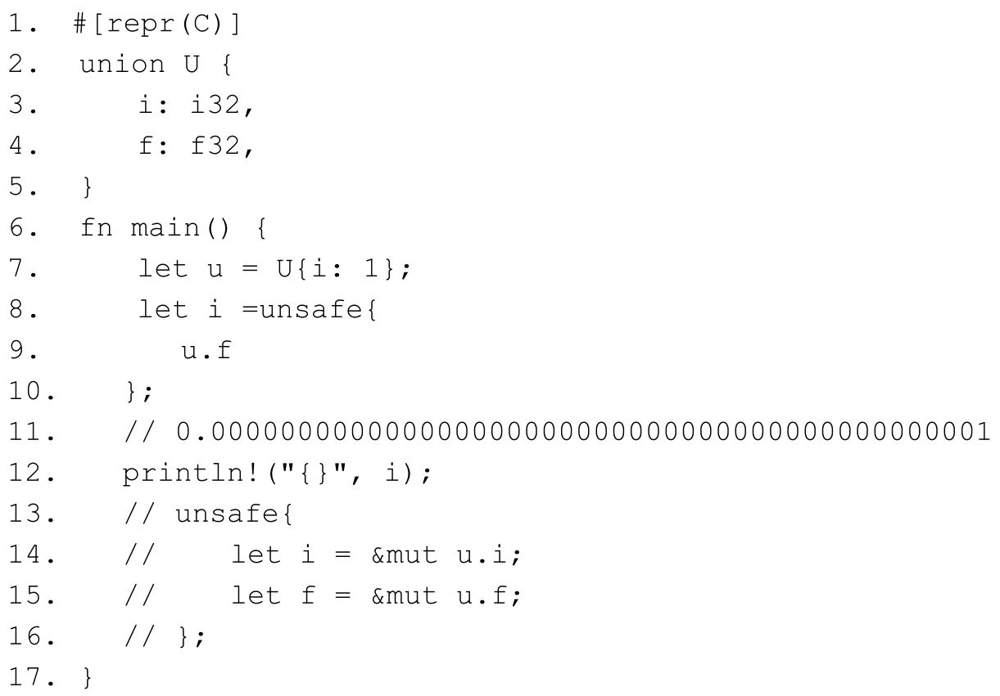{.u53514}
:::

代码清单13-9中定义了联合体U，在main函数中定义了U的实例。在代码第9行，本来应该访问字段i，但是这里错误地访问了字段f，导致第12行的输出为第11行注释中的浮点数。

值得注意的是，代码第12 行的输出等价于f32：：from_bits（1）函数调用。在当前示例中，该输出属于正常的输出，不属于未定义行为。但是广义地看，这种用法是不安全的，在某些应用场合下很可能会造成不可预期的结果。

代码第13～16行被注释的原因是它们会报错。对于一个联合体来说，不能同时使用两个字段，当然也不能同时出借两个字段的可变借用。虽然可以同时出借两个不可变借用，但这种用法依旧不安全，没有人会故意这样使用。

### 13.1.4 解引用原生指针 {#text00019.html#A0ddf01f9-1b1b-480d-8fca-1a4f15a4abf2 .title-left}

Rust提供了**\*const T** （不变）和**\*mut T** （可变）两种指针类型。因为这两种指针和C语言中的指针十分相近，所以叫其**原生指针** （Raw Pointer）。原生指针具有以下特点：

· **并不保证指向合法的内存** 。比如很可能是一个空指针。

· **不能像智能指针那样自动清理内存** 。需要像C语言那样手动管理内存。

· **没有生命周期的概念** 。也就是说，编译器不会对其提供借用检查。

· **不能保证线程安全** 。

可见，原生指针并不受Safe Rust提供的那一层"安全外衣"保护，所以也被称为"**裸指针** "。所以，在对裸指针进行解引用操作的时候，属于不安全行为。如代码清单13-10所示。

**代码清单13-10：解引用裸指针是不安全行为**

::: center
{.u53513}
:::

::: center
{.u53403}
:::

代码清单13-10中代码第2～4行，通过as操作符将变量s的不可变引用和可变引用分别转换成不可变裸指针**\*const String** 和可变裸指针**\*mut String** 。注意，这里同时出现了不可变和可变的指针，但它们不是引用，Rust借用检查会对它们"睁一只眼，闭一只眼"。创建裸指针本身并不会触发任何未定义行为，所以不需要放到unsafe块中操作。

代码第5行验证裸指针r1和r2是否相同。事实上，它们是相同的。

代码第6、7行通过随意指定一个地址address，以及as操作符重新创建了一个裸指针r3。

代码第9、10行通过"\*"操作符对r1和r2进行解引用，打印输出字符串s的内容。但这个操作是不安全的，必须在unsafe块下进行。

被注释的代码第12行解引用裸指针r3，会引发**段错误** （Segmentation Fault）。因为r3是随意定义的指针，开发者根本无法确定它指向的是否为合法内存。

## 13.2 基于Unsafe进行安全抽象 {#text00019.html#Ab6ff01fa-54b6-4b3b-8f1c-c5bc5280fa4e .title-left}

通过unsafe关键字和unsafe块可以执行一些跳过安全检查的特定操作，但并不代表使用了unsafe就不安全。在日常开发中，往往需要在unsafe的基础上抽象安全的函数。使用unsafe块的函数需要满足基本的"契约"，才能保证整个函数的安全性。除此之外，还需要了解一些其他的概念，才能更安全地使用Unsafe Rust。

### 13.2.1 原生指针 {#text00019.html#A442601fa-e0b6-4854-b3da-56b28b195113 .title-left}

原生指针是Unsafe Rust中最常用的，它主要有以下两种用途：

· **在需要的时候跳过 Rust 安全检查** 。有些情况下，程序逻辑完全不会有任何内存安全问题，使用原生指针就可以避免那些不必要的安全检查，从而提升性能。

· **与C语言"打交道"** ，需要使用原生指针。

标准库为原生指针内建了很多方法和函数，为开发者利用指针进行各种操作提供了方便。在此主要介绍以下几个内建函数和方法：

· std：：ptr：：null函数和is_null方法

· offset方法

· read/write方法

· replace/swap方法

这几个是比较常用的函数和方法，在标准库原生指针模块中还有其他很多方法，可以通过相关文档查看更多。

**创建空指针**

创建空指针并判断是否为空指针的实现如代码清单13-11所示。

**代码清单13-11：创建空指针并判断是否为空指针**

::: center
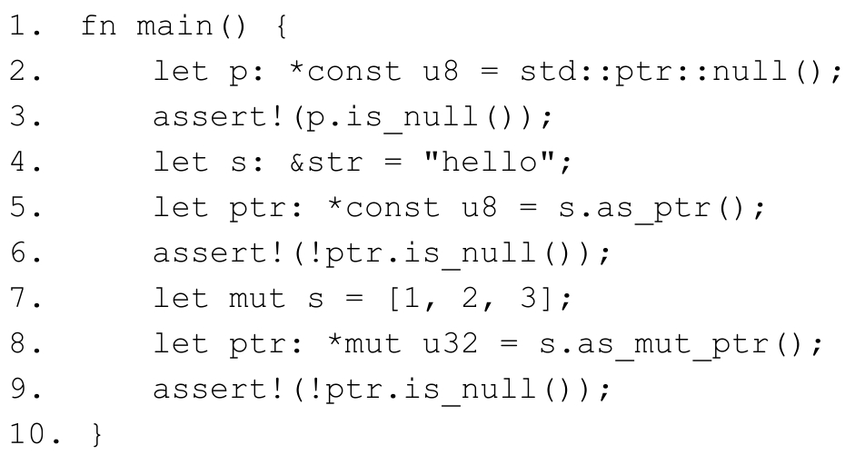{.u53512}
:::

代码清单13-11中的代码第2、3行，通过**std：：ptr** 模块提供的null函数可以创建一个空指针，通过is_null方法可以判断其是否为空。

代码第4～6行，通过&str类型字符串s的as_ptr方法得到一个不可变原生指针，该指针指向合法的堆内存，所以它不是一个空指针。注意，第5行指针ptr的类型为**\*const u8** ，这是因为字符串是以字节为单位存储的。

代码第7～9行，通过数组s的as_mut_ptr方法得到类型为**\*mut u32** 的可变原生指针，因为数组中的元素为数字类型。同样，它也不是空指针。

在创建空指针的时候，并不会引起任何未定义行为，所以这里并没有使用unsafe块。

**使用offset方法**

顾名思义，**offset** 就是指**偏移量** ，通过该方法可以指定相对于指针地址的偏移字节数，从而得到相应地址的内容。如代码清单13-12所示。

**代码清单13-12：使用offset方法**

::: center
{.u53511}
:::

代码清单13-12中，代码第2、3行得到一个**\*const u8** 类型的不可变指针ptr，该指针指向字符串s的起始字符。然后通过offset方法获取字符串s中的其他字符。

代码第 4～8 行，因为 offset 方法是 unsafe 方法，所以要在 unsafe 块中调用。其中"**\*ptr.offset（1） as char** "等价于"**\*（ptr.offset（1）） as char** "。上面之所以可以省略括号，是因为**解引用操作优先级低于方法调用** ，**但高于as操作符** 。通过给offset方法指定偏移量（以字节为单位），就可以得到相应的字符。代码第5、6行分别得到字符u和t。

因为 offset 方法并不能保证传入的偏移量是合法的，如果超出了字符串的边界，就可能会产生未定义行为，所以该方法被标记为unsafe方法。如代码第7行所示，打印出的字符完全是不可预料的。

**使用read/write方法**

通过read和write方法可以读取或写入指针相应内存中的内容。注意，这两个方法也是unsafe方法。代码清单13-13展示了read方法的使用。

**代码清单13-13：使用read/write方法**

::: center
{.u53510}
:::

代码清单13-13中第2行定义了String类型字符串x，代码第3行通过调用x的**as_ptr** 方法得到其**指向堆内存的原生指针** ，因为String类型本质是一个字节序列数组，所以该指针类型是**\*const u8** ，指向第一个字节序列。第4～6行在unsafe块中调用指针y的read方法，获取到字符串的第一个字符，并将其转换为字符类型，与预期的字符进行比较。

注意，read方法是unsafe方法，这是因为read方法通过指针来读取当前指针指向的内存，但不会转移所有权。也就是说，在该指针读取完内存之后，该内存有可能会被其他内容覆盖。

代码第7～11行定义了固定长度数组x，并通过调用as_ptr方法得到类型为**\*const \[u32；4\]** 的原生指针y。通过调用y的read方法，可以读取到数组的内容。注意，这里的原生指针类型是带长度的，如果将类型改为**\*const \[u32；3\]** ，则通过read方法只能读取到前三个元素的值。

代码第12～16行定义了一个动态数组x，但这次并没有用as_ptr获取指向堆内存的原生指针，而是直接将x的引用通过as操作符转换为原生指针。这次调用该指针的read方法读出来的并不是该动态数组的第一个元素，而是全部元素。

要注意通过as_ptr获取和由引用转换为原生指针的区别。通过as_ptr得到的指针是字符串或数组内部的指向存放数据堆（或栈）内存的指针，而引用则是对字符串或数组本身的引用。

对应于read方法，代码第17～23行展示了write方法的使用。write方法会覆盖掉指定位置上内存的内容。同理，write方法也属于unsafe方法。

**使用replace/swap方法**

利用replace或swap方法，可以快速替换指定位置的内存数据。如代码清单13-14所示。

**代码清单13-14：使用replace/swap方法**

::: center
{.u53509}
:::

代码清单13-14中，第2、3行通过as_mut_ptr得到动态数组v中指向堆内存的可变原生指针，所以该指针指向动态数组的第一个元素。第4～8行，在unsafe块中使用**replace** 方法将v的第一个元素替换为5。该方法会返回旧的值，所以old_v的值是1，而动态数组v就变成了\[5，2\]。

第9～15行同样是动态数组v，但只是将v的可变引用转换为了可变原生指针，该指针指向数组的全部元素。所以在unsafe块中使用replace方法，传入的参数是整个Vec＜i32＞类型的动态数组，而非单个元素。

代码第16～24行展示了**swap** 方法的使用，该方法接收两个可变原生指针作为参数，并将其指向内存位置上的数据进行互换。

代码第16～18行定义了固定长度数组array，并使用as_mut_ptr得到两个可变原生指针x和y，类型均为**\*mut \[u32；2\]** 。

代码第19～24行通过read方法可以得到x和y的数据，分别为\[0，1\]和\[1，2\]。然后调用x的swap方法与y互换数据，最终得到结果\[1，0，1，3\]。交互过程如图13-1所示。

::: center
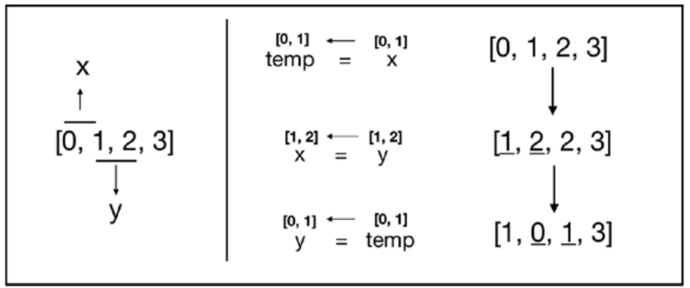{.u53508}

图13-1：swap（x，y）过程示意
:::

从图 13-1 可以看出，swap 方法因为传入的可变原生指针都来自同一个数组，操作的内存区域有重叠的地方，**这种操作很有可能引起内部数据混乱，从而引发未定义行为** ，所以swap也是unsafe方法。

在**std：：mem模块中提供了一个安全的swap** 方法，其函数签名为**fn swap＜T＞（x：&mut T，y：&mut T）** ，注意其参数为可变引用。因为可变引用是独占的，不可能对同一个变量进行两次可变借用，所以就保证了该方法不可能出现内存重叠的情况。**同样** ，std：：mem模块中也提供了**安全的replace** 方法。

**使用原生指针进行安全抽象**

在标准库中有很多方法是基于Unsafe Rust实现的安全抽象。比如，Vec＜T＞动态数组的insert方法。假设使用Safe Rust来实现insert方法，可以想象得到，将无法避免要使用多次&mut Vec＜T＞，这是完全无法做到的。Safe Rust的借用检查不允许对同一个变量进行多次可变借用。在这种情况下，使用原生指针是唯一的办法。

代码清单13-15展示了Vec＜T＞中insert方法的源码。

**代码清单13-15：Vec＜T＞的insert方法源码示意**

::: center
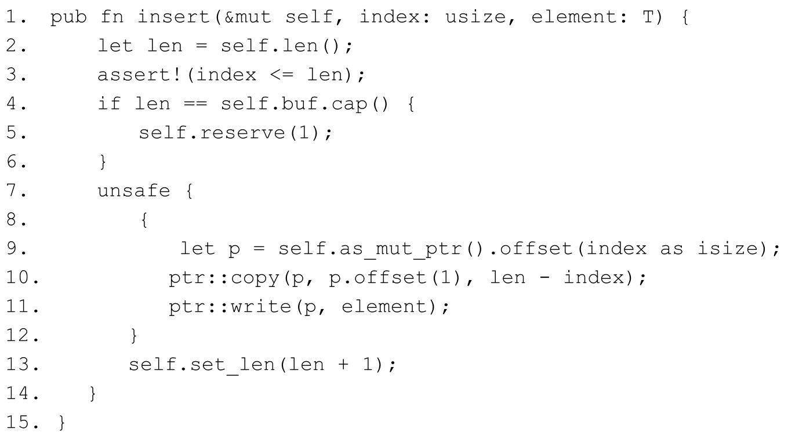{.u53507}
:::

代码清单13-15中，insert方法传入了三个参数：&mut self、index和element，分别表示Vec＜T＞的实例可变借用、要插入位置的索引和要插入的元素。

代码第2、3行通过断言保证了index的值不能超过数组长度len，从而保证了该函数的基本"契约"：插入的索引不能越界。

代码第4～6行，判断数组的长度是否达到了数组的容量上限，如果达到，则通过reserve方法来扩容。传给reserve的参数1代表每次扩展一个类型大小的字节数。

从代码第7行开始，在unsafe块下进行操作。

代码第8～12行，将这三行代码放到一个单独块中是因为它们表示一个完整的插入逻辑。代码第9行通过as_mut_ptr方法获取到实例的原生可变指针，再进一步通过offset方法和index的值，得到要插入位置的指针p。代码第10行通过ptr：：copy方法将当前位置的内容右移一位，这样才能给当前位置留下空位来便于插入新的元素。代码第11行使用ptr：：write向该位置写入新的元素。

代码第13行将数组的长度加一。至此，整个insert方法才算完整。

综合来说，insert 方法内部使用了 unsafe 块直接操作原生指针，**通过断言判断指定插入的index无法越界操作** ，以及**通过判断长度是否达到容量极限来决定是否进行扩容** 。如果没有这两个判断条件，insert方法就无法保证安全，它就不是一个安全抽象，就必须在方法签名前面加unsafe标签。

### 13.2.2 子类型与型变 {#text00019.html#A597601ff-b570-4972-ad9a-aab7157262a4 .title-left}

**子类型** （subtype）在计算机科学中是相对于另外一种有替代关系的数据类型（父类型，supertype）而言的。一般来说，可以用在父类型的地方，也可以用子类型来替代。在类型理论中，子类型关系一般写为**A＜：B** ，这意味着A是B的子类型。

在面向对象语言中，子类型也被称为**子类型多态** （subtype polymorphism），通过多态消除了类型之间的耦合性，实现统一接口。比如，在需要圆形工作的环境，也可以使用其他任何圆形几何体（比如圆环），它们的关系可表示为**Ring＜：Circle** 。在面向对象语言中，一般用**里氏替换原则** （Liskov Substitution Principle，LSP）来描述这种关系：所有引用基类（父类）的地方必须能透明地使用其子类的对象。通俗地说，就是允许子类可以方便扩展父类的功能，但不能改变父类原有的功能。LSP是接口设计和继承复用的基石，遵循该原则可以让代码有更好的维护性和复用性。

**型变的基本概念**

在原始类型的基础上通过类型构造器构造更复杂的类型时，原始类型的子类型关系在复杂类型之上如何变化，也是支持子类型编程语言需要考虑的问题。计算机科学中把这种根据原始类型子类型关系确定复杂类型子类型关系的规则称为**型变** （variance）。比如，如果 Cat是Animal的子类型，Cat类型可以出现在任何需要Animal类型表达式的地方。那么List＜Cat＞是否可以出现在List＜Animal＞的地方？下面看看型变的三种形式就知道答案了。

型变一般可以分为三种形式：

· **协变** （covariant）。可以继续保持子类型关系。Cat是Animal的子类型，那么List＜Cat＞也是List＜Animal＞的子类型。

· **逆变** （contravariant）。逆转子类型关系。Cat是Animal的子类型，那么List＜Animal＞是List＜Cat＞的子类型。

· **不变** （invariant）。既不保持，也不逆转子类型关系。也就是说，Cat是Animal的子类型，但List＜Animal＞和List＜Cat＞是没有关系的。

**Rust语言中只有生命周期具有子类型关系** 。如果有生命周期满足"**＇long：＇short** "这样的关系，那么可以说**＇long** 是**＇short** 的子类型。这个关系代表生命周期**＇long** 存活的时间比**＇short** 要长，也可以说，长生命周期是短生命周期的子类型。比如，**&＇static str** 是**&＇a str** 的子类型。

了解由生命周期组成的复合类型，具体什么样的型变规则很重要。因为在编写 Unsafe代码的时候，很可能会因为没有合理使用型变而造成未定义行为。

**未合理使用型变将会引起未定义行为**

代码清单13-16展示了自定义的内部可变类型。

**代码清单13-16：自定义内部可变类型MyCell＜T＞**

::: center
{.u53506}
:::

代码清单13-16中第1～3行定义了泛型结构体MyCell＜T＞，包含一个字段value。

代码第4～17行为MyCell＜T＞实现了new、get和set三个方法。其中，new和get方法没什么特别，重点是set方法。

代码第11～16行在set方法中使用了unsafe块。通过ptr：：write方法将当前值覆盖为新传入的值。其中ptr：：write的第一个参数是由&self.value先转为不可变原生指针，再由不可变原生指针转为可变原生指针，因为**Rust不允许直接将不可变借用转为可变原生指针** 。

MyCell＜T＞看上去暂时没什么问题，接下来实现两个函数来使用它，如代码清单 13-17所示。

**代码清单13-17：使用MyCell＜T＞示例**

::: center
{.u53505}
:::

::: center
{.u53504}
:::

代码清单13-17中第1～5行定义了函数step1，只接收一个参数r_c1，为&MyCell＜&＇a i32＞类型。函数体里定义了局部变量val，并将其引用&val传给了stpe2函数。

代码第6～8行定义了step2函数，接收两个类型分别为&＇b i32和&MyCell＜&＇a i32＞的参数。

代码第9行定义了一个静态变量X。

在main函数中，代码第11行使用静态变量的引用&X声明了MyCell实例cell。代码第12行将&cell传入step1函数中。最后打印cell.value的值。

代码清单 13-17 可以正常编译运行。但是**这里存在未定义行为的风险** 。注意看代码第 3行，step1函数中调用step2，并传入了局部变量val的不可变引用&val。然后在step2函数中使用set函数将传入&val的值设置为新值。整个过程都是通过传递引用&val来实现的。试想一下：当step2函数执行完再返回到step1会发生什么？当step1调用执行完，整个调用栈就会被清理，局部变量val将不复存在，那么&val也会成为悬垂指针，这意味着cell.value也会成为无法预期的值。

这里Rust的借用检查为什么没有起作用呢？

原因在于现在定义的MyCell＜T＞是一个**协变类型** 。Rust中**大部分结构都是协变** 的，像这种自定义的结构体默认也是协变的。代码清单13-17中，**静态变量X** 的引用**&X** 的生命周期是**＇static** 的，所以在main函数中传入step1的是**&MyCell＜&＇static i32＞** 类型，而step1函数定义中要求是**&MyCell＜&＇a i32＞** 类型。正因为MyCell＜T＞是协变，**&＇static i32** 是**&＇a i32** 的子类型，所以**&MyCell＜&＇static i32＞** 是**&MyCell＜&＇a i32＞** 的子类型。按照子类型的规则，**&MyCell＜&＇static i32＞** 可以代替**&MyCell＜&＇a i32＞** 。

实际上，Rust允许这种协变是以"**忘记原始生命周期** "为代价的。所以在代码第3行中，step1函数第一个参数&val的生命周期本来应该是**＇a** ，因为允许协变而成为**＇static** ，所以借用检查就正常通过了。

可见，如果没有合理利用协变，将会产生未定义行为的风险。那么如何修复它呢？既然知道了问题的原因，**解决方案** 就简单了：**把MyCell＜T＞的协变性质改成逆变或不变就可以** 。

**使用PhantomData＜T＞**

之前的章节介绍过，**PhantomData＜T＞** 是一个**零大小类型的标记结构体** ，也叫作"**幻影类型** "，在需要指定一个并不使用的类型时，就可以使用它。除此之外，PhantomData＜T＞**还扮演以下三种其他角色** ：

· **型变** 。可以产生协变、逆变和不变三种情况。

· **标记拥有关系** 。和drop检查有关。

· **自动** trait**实现** 。比如Send和Sync。

所以，利用PhantomData＜T＞的型变特性，就可以修复代码清单13-17的问题，如代码清单13-18所示。

**代码清单13-18：利用PhantomData＜T＞修改MyCell＜T＞为不变**

::: center
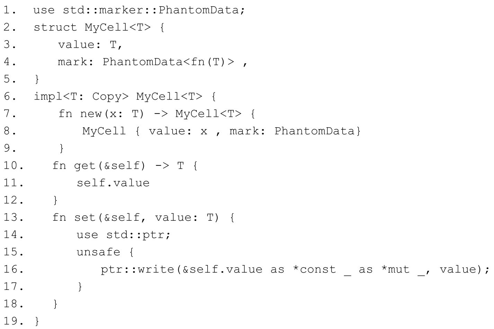{.u53503}
:::

代码清单 13-18 重构了 MyCell＜T＞的定义，重点是在之前的基础上增加了一个类型为**PhantomData＜fn（T）＞** 的mark字段。PhantomData＜fn（T）＞类型属于**逆变** ，因为**fn（T）** 指针类型在Rust中是逆变，未来的Rust版本中可能会修改为**不变** 。

修改完MyCell＜T＞之后再次执行代码清单13-17中的代码，编译器会报以下错误：

::: center
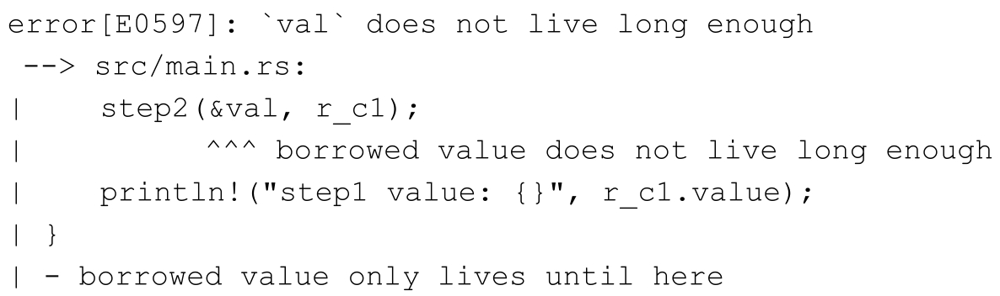{.u53502}
:::

看得出来，Rust借用检查开始正常工作，代码变得更加安全。

**协变、逆变与不变类型列表**

以下罗列了Rust中几个重要的型变类型：

·&＇a T在＇a和T上是协变，对应的\*const T也是协变。

·**&＇a mut T** 在**＇a** 上是协变，但是在**T** 上是不变。

· **Fn（T）-＞U** 在**T** 上是不变，在**U** 上是协变。

· **Box＜T＞** 、**Vec＜T＞** ，以及其他集合对于它们包含的类型来说都是协变。

· UnsafeCell＜T＞、Cell＜T＞、RefCell＜T＞、Mutex＜T＞，以及其他内部可变类型在T上都是不变，对应的\*mut T也是不变。

比如，**&mut&＇static str** 和**&mut&＇a str** 不存在子类型关系，所以它们是不变。如果允许它们协变，将会有产生未定义行为的可能，正如代码清单 13-16 展示的那样。所以， **UnsafeCell＜T＞** 等内部可变性（包括可变原生指针**\*mut T）** 都是**不变** 。

对结构体来说，如果包含的字段全部是协变，则结构体是协变，否则为不变。所以，对**Phantomdata＜T＞** 类型来说，则有以下规则：

· PhantomData＜T＞，在T上是协变。

· PhantomData＜&＇a T＞，在＇a 和T上是协变。

· PhantomData＜&＇a mut T＞，在＇a上是协变，在T上是不变。

· PhantomData＜\*const T＞，在T上是协变。

· PhantomData＜\*mut T＞，在T上是不变。

· PhantomData＜fn（T）＞，在T上是逆变，如果以后修改语法，会成为不变。

· PhantomData＜fn（）-＞T＞，在T上是协变。

· PhantomData＜fn（T）-＞T＞，在T上是不变。

· PhantomData＜Cell＜&＇a （）＞＞，在＇a上是不变。

Rust中仅存在函数指针**fn（T）** 的**逆变** 情况，如代码清单13-19所示。

**代码清单13-19：fn（T）的逆变示例**

::: center
{.u53501}
:::

代码清单13-19中，第1～3行定义了trait A。该trait包含foo函数签名，接收一个&＇static str类型的参数。

代码第4～9行定义了结构体B，并为其实现A。注意，此时foo函数的签名已经改变为接收一个&str类型的参数。

代码第10～14行为结构体B单独实现另外一个函数foo2，接收类型为&＇static str的参数。

在代码第15～19行的main函数中，直接调用结构体实例B的foo方法，传入一个字符串字面量，可以正常编译运行。注意，字符串字面量为&＇static str类型。代码第17、18行编译会出错，所以将其注释。

从该示例中可以得出以下**结论** ：

· fn（T）**在实现trait方法时，是逆变** 。因为&＇static str＜：&＇a str，而现在fn（&＇a str）可以替代需要fn（&＇static str）的情况，所以得出 fn（&＇a str）＜：fn（&＇static str），逆转了原有类型的子类型关系。

· **普通的函数调用，参数是不变** 。当参数需要&＇static str类型时，不能用&str代替它。但是函数的返回值是协变，当返回值是&str的时候，可以返回&＇static str类型的值作为替代。

代码清单13-20是另一个逆变的示例。

**代码清单13-20：另一个fn（T）逆变示例**

::: center
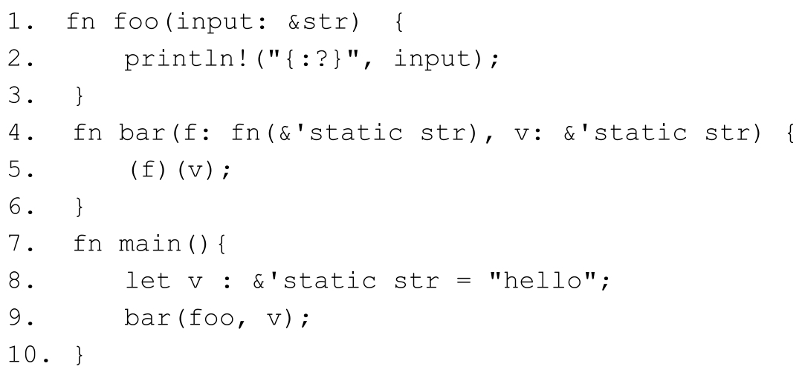{.u53500}
:::

代码清单13-20中，在bar函数签名中，参数f为**fn（&＇static str）** 类型。在main函数中，代码第 9 行将函数指针 foo 传给了 bar 函数，代码正常编译运行。函数指针 foo 的类型为**fn（&str）** ，所以满足 **fn（&str）＜：fn（&＇static str）** ，此处为逆变。

**在不久的将来，Rust官方有可能取消逆变。**

总之，了解型变对写Unsafe代码很有帮助。**当协变不会引起未定义行为的时候，可以用协变，否则就保证该类型为不变或逆变** 。

### 13.2.3 未绑定生命周期 {#text00019.html#A85690204-3143-49db-a743-e6376169c7f8 .title-left}

Unsafe代码很容易产生**未绑定生命周期** （Unbound Lifetime），即可以被随意推断的生命周期。主要**注意下面两种情况** ：

· 当从原生指针得到引用时，比如**&\*raw_ptr** 。

· 使用 std：：mem：：transmute 方法但没有显式给定生命周期，比如 transmute：：＜&T，&U＞（foo）。

代码清单13-21展示了从原生指针得到引用的情况。

**代码清单13-21：从原生指针得到引用**

::: center
{.u53499}
:::

::: center
{.u53498}
:::

代码清单13-21中定义了函数foo，其参数input为原生指针**\*const u32** 类型，然后通过解引用原生指针和引用符号将其转为引用，其中"**&\*input** "相当于"**&（\*input）** "。

在main函数中，代码第8～11行使用了作用域块，其中调用了函数foo，并将借用&y传入。在第12行打印x的值。如果按Safe Rust的规则，由于foo函数返回的是一个引用，此处是对y的引用，但是在离开作用域之后，y已经被丢弃，所以此处x就是一个**悬垂指针** 。Rust 编译器应该阻止该程序编译。但实际情况是，该程序可以正常编译。这是因为经过 **foo函数产生了一个未绑定生命周期的借用** ，**所以就跳过了Rust的借用检查** 。

在Debug模式下编译运行会输出正常的结果"hello：42"，但是在Release模式下编译运行，则会输出超出预期的结果，比如"hello：1151157120"，产生了未定义行为。

代码清单13-22展示了另外一种产生未绑定生命周期的情形。

**代码清单13-22：使用transmute函数得到引用**

::: center
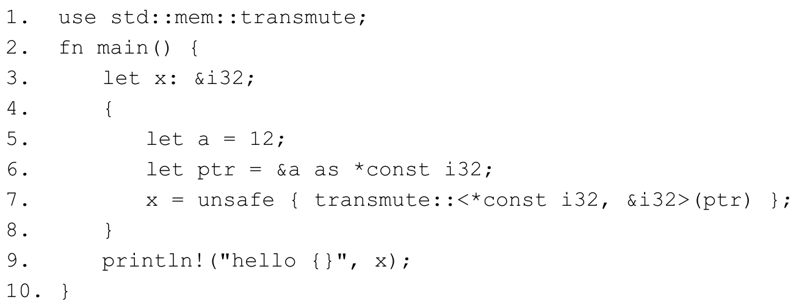{.u53497}
:::

代码清单13-22中，使用了std：：mem：：transmute＜T，U＞函数，该函数可以将类型T转为类型U。这是一个unsafe函数，使用不当将会产生未定义行为。

在main函数中，将原生指针ptr通过transmute函数转为&i32类型，此时会产生未绑定生命周期。在离开作用域块之后，x将会产生悬垂指针。跟代码清单13-21类似，在Release模式下编译将会产生无法预期的值，比如"hello：-697728128"。

所以，从原生指针得到引用的时候，需要避免以上两种情况，从而避免未定义行为的发生。

### 13.2.4 Drop检查 {#text00019.html#A0dff0205-3006-436c-ad50-c4f1cc121814 .title-left}

Drop检查（dropck）是借用检查器的附属程序，它是为了让析构函数可以更安全合理地被调用而存在。

一般来说，析构函数的调用顺序与变量的声明顺序相反。也就是说，如果存在明确的声明顺序，则编译器可以推断析构函数的调用顺序。但是对于同时声明的情况，比如声明一个元组时，其内部元素的生命周期是相同的，编译器无法推断到底该先调用谁的析构函数。当出现这种情况的时候，就容易产生悬垂指针。

**在Safe Rust中由dropck引起的问题**

在Safe Rust中出现这种情况时，Rust编译器会报错，如代码清单13-23所示。

**代码清单13-23：声明元组变量测试dropck**

::: center
{.u53496}
:::

代码清单13-23中第2、3行定义了枚举类型**State** ，目的是为了在析构函数中输出变量的状态。

代码第4～19行定义了一个泛型结构体**Hello＜T＞** ，并为其实现new方法和析构函数。该析构函数会在Hello被释放的时候调用，并输出预期的结果。

代码第 20～27 行定义了新的结构体 **WrapBox＜T＞** ，是对 Box＜T＞的包装，并为WrapBox＜T＞实现了new方法。

代码第28～33行实现了函数f1。在第30行通过元组形式声明了变量，这是故意为之，目的是让编译器无法推断x和y的析构顺序。注意，在代码第32行中，WrapBox＜T＞的实例包含了x的引用。

所以整个代码编译执行以后，会抛出代码清单13-24所示的错误。

**代码清单13-24：代码清单13-23编译产生的错误信息**

::: center
{.u53483}
:::

代码清单13-24显示变量x存活时间不够久。这正是由于编译器无法准确推断x和y的析构顺序导致的。如果x先于y被释放，则&x就成为悬垂指针，这是Safe Rust不允许出现的事情。

解决这个问题也很简单，只需要修改x和y的声明顺序即可，如代码清单13-23中第29行所示。只要按该行指定的顺序声明变量x和y，整个代码就可以正常编译运行，因为此时编译器可以准确推断x和y的析构顺序。正常输出的结果如代码清单13-25所示。

**代码清单13-25：代码清单13-23经过修改后正常输出结果**

::: center
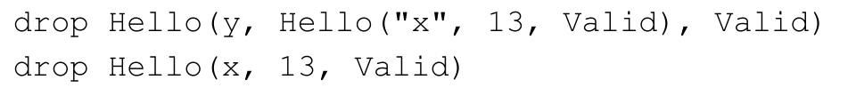{.u53495}
:::

代码清单13-25清楚地显示出，先调用y的析构函数，然后调用x的析构函数，并且两个变量在调用析构函数的时候都是Valid状态，表示一切安全，并未出现悬垂指针。

在Safe Rust中，WrapBox＜T＞包装了Box＜T＞，会被Rust编译器识别为WrapBox＜T＞通过Box＜T＞间接拥有T。虽然WrapBox＜T＞没有显式实现Drop，但因为这一层拥有关系，Rust也会在WrapBox＜T＞被释放之后逐个自动地调用T上的析构函数。

**＃\[may_dangle\]属性与dropck**

接下来尝试在修正后的代码清单13-23的基础上新增一个自定义的结构体**MyBox＜T＞** ，该结构体利用原生指针来替代Box＜T＞。这就需要手动在堆上分配内存，所以需要在Nightly Rust版本之下使用**＃！\[feature（allocator_api\]** 特性，如代码清单13-26所示。

**代码清单13-26：使用原生指针的结构体**

::: center
{.u53494}
:::

::: center
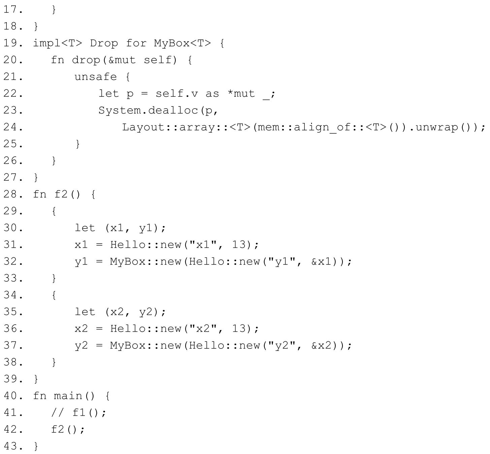{.u53493}
:::

代码清单13-26中为了展示而省略了代码清单13-23中关于State、Hello，以及为Hello实现new和drop的代码，但实际上它们还会被用到。

代码第1、2行使用＃！\[feature（allocator_api）\]特性，以及引入std：：alloc模块中的GlobalAlloc、System和Layout都是为了在堆中分配内存。注意，本章使用的feature在未来的Rust Nightly版本中会有所变化，请以本书的随书源码为准。

代码第3、4行引入**std：：ptr** 和**std：：mem** 模块，要用到其中的函数。

代码第6～8行定义了新的结构体MyBox＜T＞，其字段v是\*const T类型的原生指针。

代码第9～18行为MyBox＜T＞实现了new方法，在new方法中使用**System.alloc** 方法分配堆内存，其参数**Layout：：array：：＜T＞（1）** 按照**T** 类型来指定布局。在分配好内存之后，再通过得到的指针写入数据。最后将指针存入MyBox＜T＞结构体实例中。

代码第19～27行为MyBox＜T＞实现**Drop** ，在drop方法中使用ptr：：read读取指针v对应的数据 T，然后通过 **System.dealloc** 方法将 T 的内存释放，其参数 **Layout：：array：：＜T＞（mem：：align_of：：＜T＞（））** 表示按**T** 的内存对齐方式获取相应的内存布局。

代码第28～39行实现了f2函数。最后在main函数中调用f2函数。注意，f1函数已被注释。

代码清单13-26编译会报如代码清单13-27所示的错误。

**代码清单13-27：代码清单13-26编译错误信息**

::: center
{.u53492}
:::

**代码清单13-27的错误依旧是因为编译器无法推断变量的析构顺序而引起的** 。编译器担心开发者会在 drop 方法中调用 T 的数据，避免出现悬垂指针。但现在代码清单 13-26 中MyBox＜T＞的drop方法是开发人员自己实现的，并且没有使用到T的数据，不会出现悬垂指针。那么有什么办法让代码通过编译呢？答案是使用**＃\[may_dangle\]** 属性。

利用**＃\[may_dangle\]** 属性来修改drop方法，如代码清单13-28所示。

**代码清单13-28：修改drop方法**

::: center
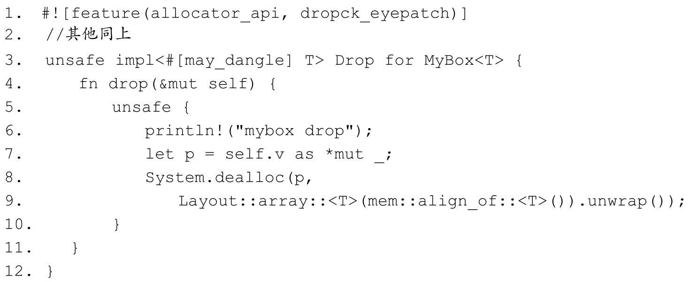{.u53491}
:::

代码清单13-28中第1行引入了＃！\[feature（allocator_api，dropck_eyepatch）\]特性。

代码第 3 行变为"**unsafe impl＜＃\[may_dangle\] T＞ Drop for MyBox＜T＞** "。其中，"**＜＃\[may_dangle\] T＞** "代表在drop方法实现中，将不会用到T，否则可能会出现悬垂指针（many_dangle就是may dangle pointer的意思）。因为这是需要开发人员去保证的，所以要用unsafe关键字来标记impl。

经过这样的修改之后，代码即可正常编译运行。**但是这样就可以了吗** ？答案是否定的。如果在drop方法中使用了T，则会发生悬垂指针，如代码清单13-29所示。

**代码清单13-29：修改drop方法和f2函数**

::: center
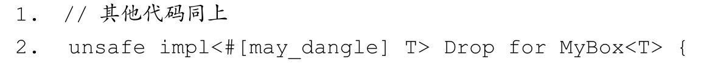{.u53490}
:::

::: center
{.u53489}
:::

代码清单13-29修改了两处，分别是代码第5行和第19行。

代码第5行新增了ptr：：read函数读取T的内容。此行代码表示MyBox＜T＞的drop方法中用到了T。

代码第19行故意将之前x2和y2的声明顺序换了位置。于是代码编译之后，输出结果如代码清单13-30所示。

**代码清单13-30：打印结果**

::: center
{.u53488}
:::

从代码清单13-30中可以看出，x1和y1是正常的释放顺序，但是x2和y2就出现了问题。最后一行显示内层Hello实例的状态是**InValid** ，说明此处产生了悬垂指针，因为访问到已经执行了析构函数的T的值。

这样的结果有违Rust的安全理念，有什么办法可以让Rust执行更严格的drop检查呢？

**使用PhantomData＜T＞得到更严格的drop检查**

因为MyBox＜T＞用了原生指针，而原生指针没有所有权语义。也就是说，Rust编译器不会认为MyBox＜T＞拥有T。这就意味着，在进行drop检查时，不会严格要求T的生命周期必须长于MyBox＜T＞。所以在MyBox＜T＞的drop方法中使用T的时候，编译器完全忽视了T很可能被提前释放的可能。前面提到PhantomData＜T＞的功能之一就是标记拥有关系，正好可以解决这个问题。

在代码清单13-29的基础上，再重新创建MyBox2＜T＞结构体，如代码清单13-31所示。**代码清单13-31：新增MyBox2＜T＞**

::: center
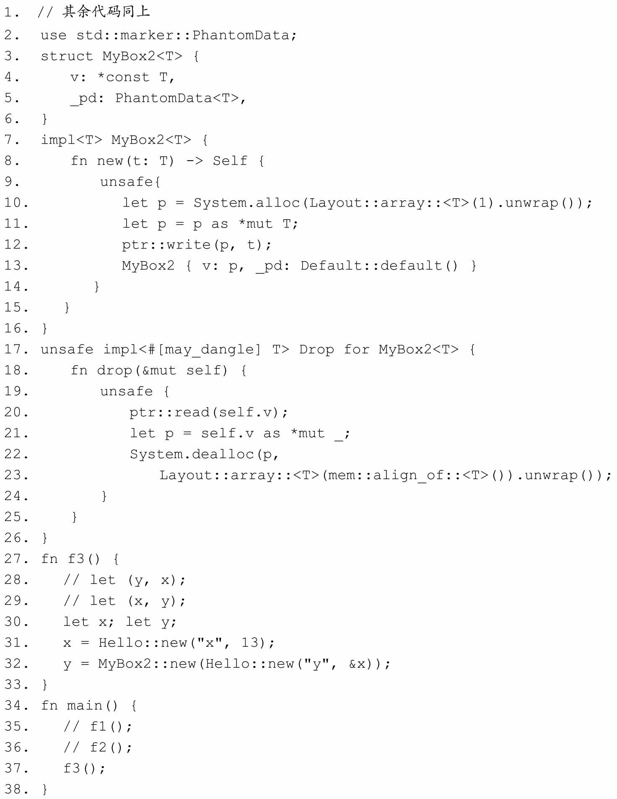{.u53487}
:::

代码清单 13-31 中，新增了 MyBox2＜T＞，与 MyBox＜T＞唯一的不同就是多了一个PhantomData＜T＞字段_pd，该字段的作用就是告诉Rust编译器一个事实：**MyBox2＜T＞拥有T** 。这就意味着，在执行 MyBox2＜T＞的析构函数时，不管有没有使用**＃\[may_dangle\]** 属性，都必须要求T的生命周期长于MyBox2＜T＞。

代码第17～26行为MyBox2＜T＞实现了Drop，并且使用了＃\[may_dangle\]属性。

代码第27～33行定义了函数f3。**在该函数中必须强制指定** x**和** y**的声明顺序** ，**以便编译器推断变量的** drop **顺序** 。对于代码第 28 行和第 29 行所注释的两种写法，编译器无法推断drop顺序，不予通过编译。

所以在处理**drop** 检查的时候，可以通过以下两个维度来处理代码避免出现未定义行为：

·**＃\[may_dangle\]** 属性，该属性使用unsafe对impl Drop进行标记，以此来警示开发者不要在析构函数中使用其拥有的数据。

· **PhantomData＜T＞** ，用于标记复合类型拥有其包含的数据。这意味着，该复合类型将会遵循严格的drop检查，包含数据的生命周期必须长于复合类型的生命周期。

**来自标准库中的用法**

在Rust标准库中经常结合两者使用。代码清单13-32展示了Vec＜T＞和LinkedList＜T＞的相关代码。

**代码清单13-32：标准库中Vec＜T＞和LinkedList＜T＞相关实现**

::: center
{.u53486}
:::

代码清单13-32中，Vec＜T＞通过RawVec＜T＞间接拥有T，而RawVec＜T＞靠Unique＜T＞间接拥有T。在Unique＜T＞中使用**PhantomData＜T＞** 来保证拥有关系，这样drop检查就会严格要求开发者保证析构顺序。

Vec＜T＞的析构函数使用了**＃\[may_dangle\]** 属性，这将警示编写该析构函数的开发者注意不要去使用拥有的数据。

同理，LinkedList＜T＞也使用了PhantomData＜T＞和＃\[may_dangle\]属性达到与Vec＜T＞相同的目的。

**使用std：：mem：：forget阻止析构函数调用**

Rust中的析构函数默认是会被调用的，但在有些场合不希望调用析构函数。比如，通过FFI和C语言交互，在Rust中创建的数据需要在C中被调用，如果在Rust中被释放，则C中调用的时候会出问题。所以Rust提供了一个函数**std：：mem：：forget** 来处理这种情况。

如代码清单13-33所示。

**代码清单13-33：转移结构体中字段所有权示例**

::: center
{.u53485}
:::

代码清单13-33中定义了结构体Foo，其字段a和b的类型分别是结构体A和B。为Foo结构体实现了take方法，该方法返回由Foo字段值组成的（A，B）类型的元组。

这里的**重点** 是，take方法会将Foo结构体字段a和b的所有权转移。这是Rust允许的，该段代码是可以正常编译通过的。但是，**如果给 Foo 结构体实现了 Drop** ，情况就会发生变化，如代码清单13-34所示。

**代码清单13-34：为结构体Foo实现Drop**

::: center
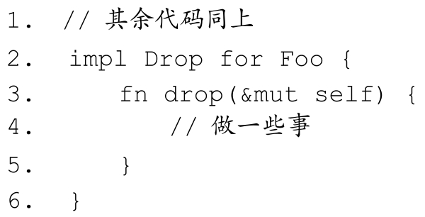{.u53484}
:::

代码清单13-34中为Foo结构体实现了Drop，再次编译代码会出现代码清单13-35所示的错误。

**代码清单13-35：代码清单13-34的错误信息**

::: center
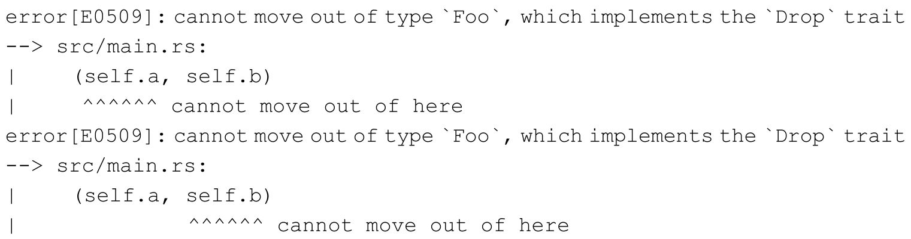{.u53483}
:::

代码清单13-35中错误信息显示，Rust编译器不允许移动Foo结构体的两个字段，原因是Foo结构体实现了Drop。在Foo的析构函数中，有可能会用到其字段，所以不能把所有权转移走。

如果在这种情况下必须转移Foo字段所有权，则可以使用**std：：mem：：forget** 函数。如代码清单13-36所示。

**代码清单13-36：重新为Foo实现take方法**

::: center
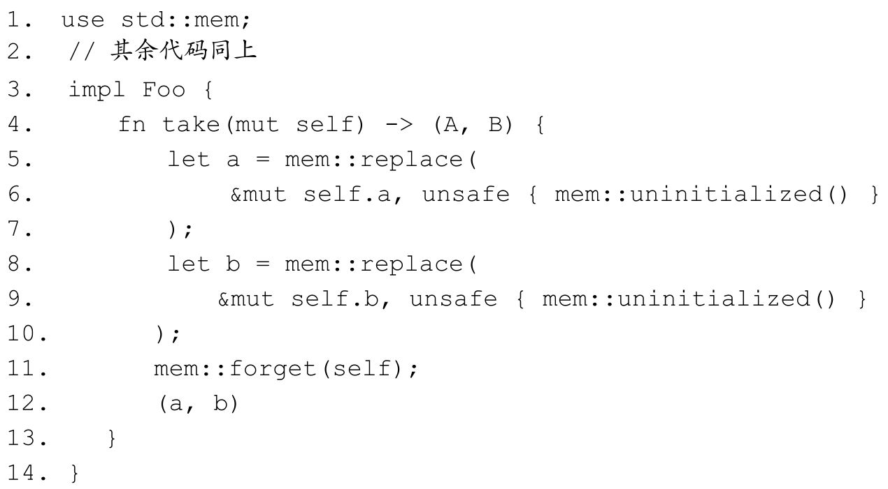{.u53482}
:::

代码清单13-36中，将Foo结构体的take方法重新实现了一遍，代码将正常编译通过。该代码中主要用到两个重要的函数：**mem：：uninitialized** 和**mem：：forget** 。

其中，mem：：uninitialized是一个unsafe函数，在take方法中，将a和b的值都通过该函数修改为"**伪装的初始化值** "，**用于跳过 Rust 的内存初始化检查** 。但这样做是危险的，如果此时对a和b进行读取或写入，都会**引起未定义行为** 。该函数一般用于FFI和C语言交互。

另外，**mem：：forget** 函数会将当前的Foo实例"忘掉"，这样Foo实例就不会被释放，析构函数也不会被调用。但forget函数不是unsafe函数，因为使用该函数引起的后果是**内存泄漏** ，对Rust来说，**属于安全范畴** 。而对开发者来说，**需要在适合的地方手动调用** drop**方法来运行析构函数** 。

**在析构函数中手动指定析构顺序**

在std：：mem模块中还提供了另外一个联合体ManuallyDrop，通过它可以实现在析构函数中手动指定析构顺序。

如代码清单13-37所示。

**代码清单13-37：ManuallyDrop使用示例**

::: center
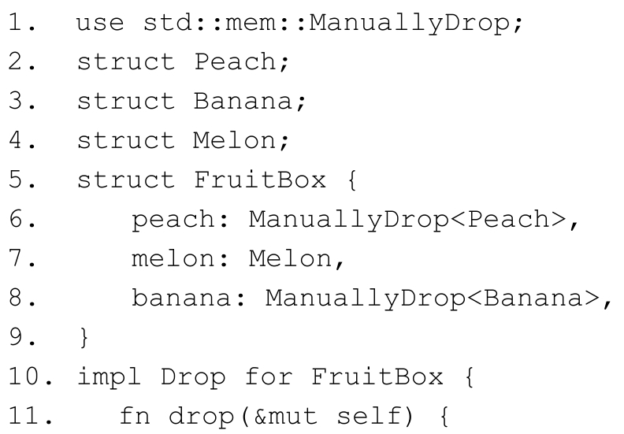{.u53481}
:::

::: center
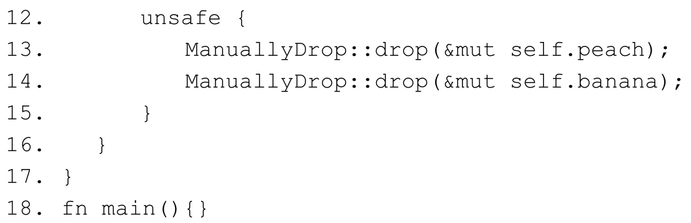{.u53480}
:::

代码清单 13-37 中，FruitBox 结构体中，peach 和 banana 两个字段的类型均为ManuallyDrop＜T＞类型。所以在其析构函数中，通过ManuallyDrop：：drop函数显式指定peach和banana的析构顺序。

那么，ManuallyDrop是如何做到这一点的？Rust代码中析构函数不是自动调用的吗？它有什么神奇之处呢？代码清单13-38展示了ManuallyDrop的源码。

**代码清单13-38：ManuallyDrop＜T＞源码示例**

::: center
{.u53479}
:::

代码清单13-38展示了ManuallyDrop＜T＞的主要实现。ManuallyDrop＜T＞是一个联合体，Rust**不会为联合体自动实现** Drop。**因为联合体是所有的字段共用内存，不能随便被析构，否则会引起未定义行为** 。

所以，只要通过 ManuallyDrop：：new 方法创建一个 ManuallyDrop＜T＞实例，就只能通过ManuallyDrop：：drop函数手动调用析构函数。实际上，std：：mem：：forget＜T＞函数的实现就是用了ManuallyDrop：：new方法，如代码清单13-39所示。

**代码清单13-39：forget＜T＞函数源码示意**

::: center
{.u53478}
:::

代码清单13-39展示了std：：mem：：forget＜T＞函数的源码实现，看上去十分简单。

### 13.2.5 NonNull＜T＞指针 {#text00019.html#A84f2020f-34a5-4004-bfde-fbb659cdbc4f .title-left}

NonNull＜T＞指针实际上是一种特殊的**\*mut T** 原生指针，它的特殊之处有两点：**协变** （covariant）和**非零** （non-zero）。

**NonNull＜T＞旨在成为Unsafe Rust默认的原生指针** ，而非**\*const T** 和**\*mut T** 。因为**\*const T** 和**\*mut T** 基本上是等价的，它们可以相互转换。**但不能从** \*const T**直接得到** &mut T。

在 NonNull 被引入之前，Unsafe 代码中最常见的模式就是使用\*const T，结合PhantomData＜T＞得到协变结构体，并且在需要的时候会将\*const T 转换为\*mut T。使用**NonNull＜T＞** 就不需要进行转换了，因为**它本身就等价于一个协变版本的\*mut T** ，但是还需要PhantomData＜T＞在必要时提供**不变** 或**加强drop检查** 。

**NonNull＜T＞的本质**

代码清单13-40展示了NonNull＜T＞的源码。

**代码清单13-40：NonNull＜T＞和NonZero源码示意**

::: center
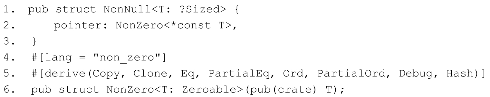{.u53477}
:::

代码清单13-40展示了NonNull＜T＞实际上是对NonZero＜\*const T＞的包装。因为\*const T是协变类型，所以NonZero＜\*const T＞是协变，NonNull＜T＞也是协变。NonNull＜T＞和代码清单13-32中展示的Unique＜T＞非常相似，不同点在于NonNull＜T＞少了一个PhantomData＜T＞类型的字段。**所以** NonNull＜T＞**和** T**没有严格的拥有关系** 。

代码第4～6行展示了**NonZero＜T＞** 的定义，它属于Rust 核心库（core）的类型。其定义中的**Zeroable** 限定用于判断T是否为零（Null或零值）。NonZero＜T＞**的作用就是两个** ：**协变** 和**非零** ，并且加上了**＃\[lang=＂non_zero＂\]** 属性让其成为**语言项** ，方便编译器识别。

NonNull＜T＞也提供了一些方法，允许开发者可以更安全地使用原生指针，如代码清单13-41所示。

**代码清单13-41：NonNull＜T＞内置方法示例**

::: center
{.u53476}
:::

代码清单13-41中第3、4行使用了**NonNull：：dangling** 函数来创建一个新的悬垂NonNull指针，但它的内存是对齐的。它在一些场景里用于类型初始化，比如使用Vec：：new创建一个空的动态数组，需要初始化一个指针。它是安全的。

代码第5～7行可以通过**NonNull：：new** 函数将已知的可变原生指针生成Option＜NonNull＜T＞＞类型。

代码第8、9行可以通过as_ptr和as_mut方法分别得到NonNull＜T＞类型对应的\*mut T指针和&mut T引用。注意，这里的as_mut方法得到的引用是有正常生命周期的引用，而非未绑定生命周期的引用。

代码第10～12行可以通过**NonNull：：from** 函数将一个可变引用转为NonNull＜T＞类型。

代码第13～15行通过**null** 函数创建了一个空指针，然后传给NonNull：：new函数，将生成None值。

**空指针优化**

因为NonNull的**非零特性** ，所以可以**帮助编译器进行优化** ，如代码清单13-42所示。

**代码清单13-42：空指针优化展示**

::: center
{.u53475}
:::

代码清单13-42中定义了两个结构体Foo和FooUsingNonNull，前者只用了原生指针，后者的字段中包含了NonNull＜\*mut u64＞指针。

在main函数中，通过mem：：size_of函数比较它们的内存大小，代码清单13-43展示了输出结果。

**代码清单13-43：空指针优化输出结果**

::: center
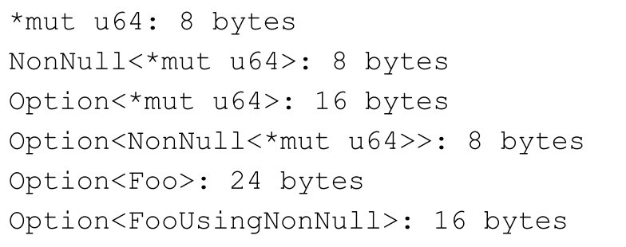{.u53474}
:::

从代码清单 13-43 中可以看出，\*mut u64 的大小和 NonNull＜\*mut u64＞相等，NonNull＜\*mut u64＞和Option＜NonNull＜\*mut u64＞＞大小相等，但是Option＜\*mut u64＞的大小却不等于\*mut u64。

这是因为Rust 对包含了NonNull＜T＞指针的 Option＜T＞类型进行了优化行为，这种优化叫作"空指针优化"。因为NonNull＜T＞本身是不可能为空的，所以Option＜T＞就不需要多余的判别式（tag）来判断是不是None，这样在内存布局上就不需要占用多余的内存。而对\*mut T指针来说，无法保证它一定不是空指针，所以Option＜\*mut u64＞还需要保留判别式，内存布局还需要按正常的枚举体来进行对齐，所以会多占用一倍内存。

空指针优化固然可以省内存，但在使用FFI和C语言"打交道"的时候要慎用。

### 13.2.6 Unsafe与恐慌安全 {#text00019.html#A913e0212-3dcf-4249-bde3-9a929592b497 .title-left}

在Unsafe Rust中就需要小心恐慌安全，这里是Rust编译器鞭长莫及的地方，如代码清单13-44所示。

**代码清单13-44：Unsafe Rust中需要注意恐慌安全问题**

::: center
{.u53473}
:::

代码清单13-44为Vec＜T＞实现了一个push_all方法，在第3行使用reserve预留了传入数组大小的内存容量。然后使用了unsafe代码块，因为要使用write方法来直接覆盖内存的数据，属于unsafe操作。

整个函数唯一有可能发生恐慌的地方就是 **clone** 方法，因为其他方法都是简单的函数，并不会发生恐慌，**但是** clone**方法的实现是未知的，存在发生恐慌的可能** 。所以整个push_all函数就不是恐慌安全的函数，它也不保证内存安全。假如 clone 方法发生了恐慌，那么后续的元素将无法继续写入内存，但是之前已经使用 reserve 方法预分配了内存，并通过 set_len方法为数组重置了长度，如果后续的元素无法写入内存，那么就会出现未初始化的内存，最终导致内存不安全。但是出于Rust的设计，这些未初始化的内存并不会被暴露出来。所以，总的来说，相比于其他语言，比如C++，Rust程序员几乎不会担心恐慌安全的问题。

Rust 也提供了 **catch_unwind** 方法来让开发者捕获恐慌，恢复当前线程。但是，对于代码清单13-44中展示的非恐慌安全的push_all函数来说，如果想捕捉clone方法可能引发的恐慌，则需要小心。数组的长度已经确定，但是还有未初始化的内存，整个数据结构的不变性被破坏了。所以，Rust编译器也不会允许开发者在push_all函数中使用catch_unwind。

### 13.2.7 堆内存分配 {#text00019.html#A66c70212-2621-44ef-b482-f15c5300abd3 .title-left}

在编写Unsafe Rust的过程中，也需要手动进行堆内存分配，所以Rust标准库std：：alloc模块中也提供了堆内存分配的相关API。

Rust在Rust **1.28之前** 默认都是使用**jemalloc** 作为默认内存分配器，虽然jemalloc很强大，但它也带来不少问题，所以在Rust **1.28** 中将jemalloc分配器从标准库中剥离了出来，作为一个可选的第三方库而存在，**标准库默认分配器就是** System**分配器** 。

在std：：alloc模块中有一个**GlobalAlloc** trait，其源码如代码清单13-45所示。

**代码清单13-45：GlobalAlloc trait源码示意**

::: center
{.u53472}
:::

在代码清单13-45中展示了GlobalAlloc中最重要的两个方法签名：**alloc** 和**dealloc** ，分别表示内存的分配和释放。

注意，GlobalAlloc和其定义方法都用unsafe做了标记。要实现该trait，**必须注意遵守以下约定** ：

· 如果全局分配器发生了恐慌，则会产生未定义行为。

· 布局（Layout）的查询和计算必须正确。

这就意味着，开发者可以通过实现该trait 而指定自己的全局分配器。如代码清单13-46所示。

**代码清单13-46：自定义全局分配器示例**

::: center
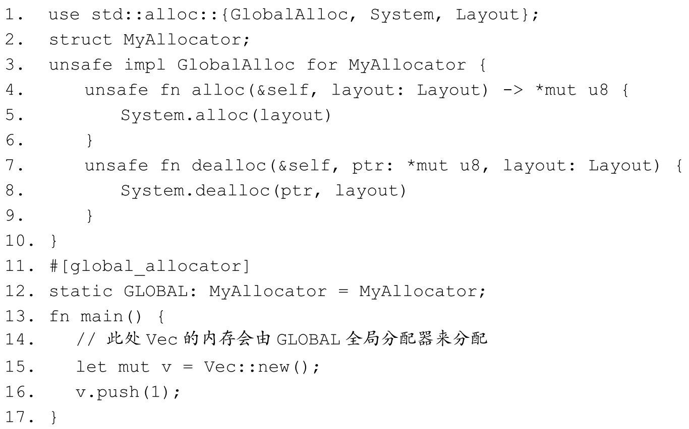{.u53471}
:::

代码清单13-46中定义了结构体MyAllocator，然后为其实现GlobalAlloc trait，如代码第2～10行所示。具体的实现中使用了**System.alloc** 和**System.dealloc** 是标准库默认的分配器。

代码第 11、12 行使用**＃\[global_allocator\]** 属性就可以将静态变量 **GLOBAL** 指派的MyAllocator声明为全局分配器。在main函数中，Vec＜T＞数组的内存分配器就会默认使用自定义的MyAllocator分配器。

当然，也可以通过**＃\[global_allocator\]** 属性指定全局分配器为**jemalloc** 。如代码清单13-47所示。

**代码清单13-47：声明jemalloc为全局内存分配器**

::: center
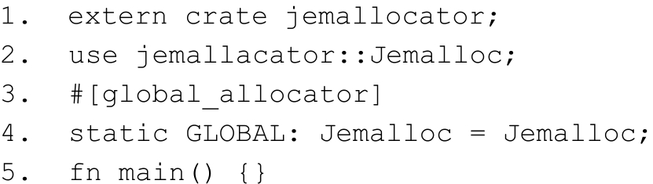{.u53470}
:::

代码清单13-47展示了如何将jemalloc设置为全局内存分配器。在Rust 1.28中，jemalloc分配器已经被独立为第三方包，叫作 jemallocator。这也是需要通过 extern crate 命令导入jemallocator的原因。

然后同样使用**＃\[global_allocator\]** 属性就可以将静态变量GLOBAL指派的Jemalloc作为全局分配器。**注意，该属性只能用于静态变量** 。

同理，将来也可以使用其他的内存分配器，比如Redox操作系统中用纯Rust实现的**ralloc** 内存分配器。

### 13.2.8 混合代码内存安全架构三大原则 {#text00019.html#Ab6e40214-5365-43a7-99f7-7966807dd4ba .title-left}

除了前面介绍的编写Unsafe代码需要注意的事项，还有来自Rust社区的指导Safe和Unsafe Rust代码混合编程中保证内存安全三大原则 ^[\[1\]](#text00019.html#n57550214298D40C2ACA95BEA620D5C48){#text00019.html#n57550214298D40C2ACA95BEA620D5C48s}^ ：

· 不安全的组件不应该削弱其安全性，特别是公共的API和数据结构。

· 不安全的组件应该尽可能小，并与安全组件分离（隔离和模块化）。

· 不安全的组件应该明确标记并轻松升级。

在开发中遵循上述原则进行架构设计，可以在一定程度上获得更好的安全保证。

## 13.3 和其他语言交互 {#text00019.html#A03c50214-0de0-4629-92a1-855f6c67195c .title-left}

在日常开发中，难免要和其他语言进行交互。其中，最显而易见的就是和C语言进行交互，比如Rust程序要进行系统调用，或者通过Rust来提升动态语言的性能瓶颈。这也是几乎所有编程语言都要面对的问题。

Common Lisp语言规范中首次提出了术语"**外部函数接口** （Foreign Function Interface，FFI）"，用于规范语言间调用的语言特征。后来，该术语也逐渐被引入到Haskell和Python等大多数语言中。也有个别语言使用其他术语，比如 Ada 语言使用"**语言绑定** （Language Bindings）"，Java语言则将FFI称为**JNI** （Java Native Interface）。

所以，现在编程语言之间都是通过FFI技术来进行交互的。

### 13.3.1 外部函数接口 {#text00019.html#A5b540214-ceec-4977-ac23-d0895dfa8c7e .title-left}

FFI 技术的主要功能就是将一种编程语言的**语义** 和**调用约定** 与另一种编程语言的语义和调用约定**相匹配** 。如何匹配呢？

不管哪种编程语言，无论是编译执行还是解释执行，最终都会到达处理器指令这个环节。在这个环节所处的层面上，编程语言之间的语法、数据类型等语义差异均以消除，只需要匹配调用约定，这就给编程语言之间的相互调用带来了可能。

**应用程序二进制接口**

调用约定如何匹配，与**应用程序二进制接口** （**ABI** ）高度相关。

什么是ABI？ABI是一个规范，主要涵盖以下内容：

· **调用约定** 。一个函数的调用过程本质就是参数、函数、返回值如何传递。编译器按照调用规则去编译，把数据放到相应的堆栈中，函数的调用方和被调用方（函数本身）都需要遵循这个统一的约定。

· **内存布局** 。规定了大小和对齐方式。

· **处理器指令集** 。不同平台的处理器指令集不同。

· **目标文件和库的二进制格式** 。

ABI规范由编译器、操作平台、硬件厂商等共同制定。ABI**是二进制层面程序兼容的契约，只有拥有相同的** ABI**，来自不同编译器之间的库才可以相互链接和调用** ，否则将无法链接，或者即使可以链接，也无法正确运行。

不同的体系结构、操作系统、编程语言、每种编程语言的不同编译器实现基本都有自己规定或者遵循的ABI和调用规范。目前只能通过FFI技术遵循C语言ABI才可以做到编程语言的相互调用。也就是说，C语言ABI是唯一通用的稳定的标准ABI。这是由历史原因决定的，C语言伴随着操作系统一路发展而来，导致其成为事实上的"标准ABI"。

Rust语言也提供了ABI，但因为Rust语言目前处于上升期，语言还在不断地完善和改进，导致ABI还不能够稳定下来，在不久的未来，Rust ABI应该是可以稳定的。Rust提供了FFI技术，允许开发者通过稳定的C-ABI和其他语言进行交互。

图13-2展示了Rust FFI和C语言相互调用的原理。

::: center
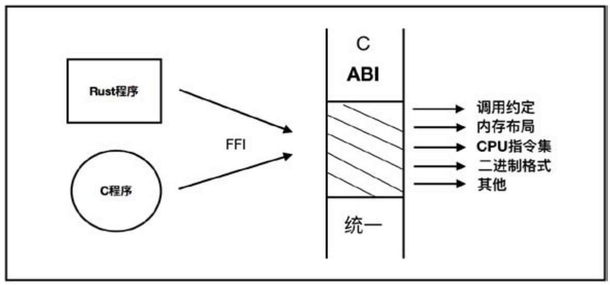{.u53469}

图13-2：Rust FFI和C语言相互调用原理示意
:::

在Rust中使用FFI非常简单，只需要通过**extern关键字** 和**ertern块** 对FFI接口进行标注即可。在编译时会由LLVM默认生成C-ABI。

**链接与Crate Type**

有了统一的ABI之后，还需要经过**链接** 才能实现最终的相互调用。

链接是将编译单元产生的目标文件按照特定的约定组合在一起，最终生成可执行文件、静态库或动态库。链接产生于程序开发的模块化。这里的模块是指编译层面的模块。比如C或C++语言中每个文件都是一个编译单元，所以也可以说是一个编译模块，编译之后就能产生一个目标文件。Rust 和 C/C++不同，它以包（crate）为编译单元。在一个 Rust 包中通过extern crate声明来引入其他包之后，编译器支持各种方法可以将包链接在一起，生成指定的可执行文件、动态库或静态库。

在一个编译模块中，通常包含了函数和全局数据的定义。函数和数据由符号来标识，一般有全局和静态之分。全局符号可以在模块间引用，而静态符号只能在当前模块引用。编译各个模块的时候，编译器的一项重要工作就是建立**符号表** 。符号表中包含了模块的哪些符号是全局符号，哪些是静态符号，每个符号都会关联一个地址。在链接过程中，链接器会扫描各个编译模块的符号表，建立全局符号表，由此决定，符号在哪里被定义，以及在哪里被调用。这个过程叫作**符号解析** 。除此之外，因为可执行文件和库的内存地址空间使用的差异，还需要进行存储空间的分配。地址重新分配之后，相应符号的引用也需要重新被调整，这个过程叫作**重定位** 。经过符号解析、存储空间分配和重定位之后，链接过程就完成了，最终生成可执行文件或库。

从概念上看，库可以分为两种：**静态库** 和**动态库** 。

**静态库** 是这样一种库：在功能上，可以在链接时将引用的代码和数据复制到引用该库的程序中；在格式上，它只是普通目标文件的集合，只是一种简单的拼接。静态库使用简单，原理上容易理解，但是它容易浪费空间。**动态库** 和静态库差异比较大。动态库可以把链接这个过程延迟到运行时进行，比如重定位发生在运行时而非编译时。动态库相对来说比较省空间。

除可执行文件外，Rust一共支持四种库，如图13-3所示。

::: center
{.u53468}

图13-3：crate_type类型示意
:::

可以通过设置命令行参数**Flag** 或者**crate_type** 属性指定生成的库类型：

·\--crate-type=bin或＃\[crate_type=＂bin＂\]，表示将生成一个可执行文件。要求程序中必须包含一个main函数。

·**\--crate-type=lib** 或**＃\[crate_type=＂lib＂\]** ，表示将生成一个Rust库。这里lib是对Rust库的统称，具体生成什么库，由编译器自行决定。一般情况下，默认会产生**rlib** 静态库。

·\--crate-type=rlib或＃\[crate_type=＂rlib＂\]，可以理解为静态Rust库，由Rust编译器来使用。

·**\--crate-type=dylib** 或**＃\[crate_type=＂dylib＂\]** ，可以理解为动态Rust库，同样由Rust编译器来使用。该类型在Linux上会创建**\*.so** 文件，在MacOSX上会创建**\*.dylib** 文件，在Windows上会创建**\*.dll** 文件。

·**\--crate-type=staticlib** 或**＃\[crate_type=＂staticlib＂\]** ，将生成静态系统库。Rust编译器永远不会链接该类型库，主要用于和C语言进行链接，达成和其他语言交互的目的。静态系统库在Linux和MacOSX上会创建**\*.a** 文件，在Windows上会创建**\*.lib** 文件。

·**\--crate-type=cdylib** 或**＃\[crate_type=＂cdylib＂\]** ，将生成动态系统库。同样用于生成C接口，和其他语言交互。该类型在Linux上会创建**\*.so** 文件，在MacOSX上会创建**\*.dylib** 文件，在Windows上会创建**\*.dll** 文件。

需要注意的是，**crate_type可以指定多个** 。有时候会有这种情况出现：**包** A**依赖包** B，而包B需要生成一个staticlib静态系统库。这时，就需要为包B同时指定staticlib和rlib两种包类型。

只要ABI统一，两个库就可以相互链接。在链接之后，就可以实现相互调用。所以，Rust要和其他语言交互，可以通过导出为C-ABI接口的静态库或动态库，然后其他语言链接该库，就可以实现语言之间的相互调用。

**交叉编译**

以上说的是本地编译的情况，Rust也支持**交叉编译** ，几乎做到了开箱即用。在本地平台上编译出需要放在其他平台运行的程序，就叫交叉编译。比如，在x86平台上编译可以在ARM嵌入式单片机上运行的程序。

可以使用rustc进行交叉编译，只需要给rustc传递一个target 参数即可。如代码清单13-48所示。

**代码清单13-48：rustc交叉编译命令展示**

::: center
{.u53467}
:::

这样就可以工作了。当然，如果是针对ARM嵌入式开发平台，你的hello.rs文件不能使用std标准库。如代码清单13-49所示。

**代码清单13-49：hello.rs需要配置好no_std**

::: center
{.u53466}
:::

因为std不支持ARM单片机，所以这里使用了**＃！\[no_std\]** 属性。当然，嵌入式推荐的做法应该是使用**core** 。

除了rustc，也可以使用Cargo进行交叉编译。使用方法和rustc类似，给**cargo build** 命令传递**\--target** 参数即可。默认情况下，cargo命令会使用cc作为交叉编译的链接器。也可以通过修改Cargo的配置文件来指定链接器。如代码清单13-50所示。

**代码清单13-50：使用cargo进行交叉编译示意**

::: center
{.u53465}
:::

上面的示例中，target参数后面类似于**arm-unknown-linux-gnueabihf** 这样的格式，叫作**target triple** 格式。Triple格式是交叉编译前必须要确认好的，格式含义如下：

::: center
{.u53464}
:::

其中，**arch** 代表编译程序的主机系统，如果是嵌入式系统，就是arm。第二个**vendor** 是指供应商，如果是未知，就可以指定为unknow。第三个**sys** 代表操作系统，比如Linux。最后的abi代表的是ABI接口，比如gnueabihf表示的是系统使用glibc作为C标准库（libc）的实现，并具有硬件加速浮点运算（FPU）功能。这样就得到了最终的arm-unknown-linux-gnueabihf目标triple格式。当然，有时候也可以省略最后的abi，比如x86_64-apple-darwin、wasm32-unknown-unknown等 ^[\[2\]](#text00019.html#n22015619F696466084007036469E57DD){#text00019.html#n22015619F696466084007036469E57DDs}^ 。

Rust社区还提供了第三方交叉编译工具**xargo** ，使用该工具可以更方便地进行交叉编译，还允许开发者构建一个定制的std库。当前，Rust官方着手进行xargo和rustup工具的整合。

**extern语法**

Rust提供了extern语法使得FFI非常便于使用。

· **extern关键字** 。通过extern关键字声明的函数，可以在Rust和C语言中自由使用。

· **extern块** 。如果在Rust中调用C代码，则可以使用extern块，将外部的C函数进行逐个标记，以供Rust内部调用。

编译器会根据extern语法自动在Rust-ABI和C-ABI之间切换。有三个extern ABI字符串是跨平台的：

· **extern＂Rust＂** ，这是默认的ABI，任何普通的fn函数都将使用该ABI。

· **extern＂C＂** ，这是指定使用C-ABI，等价于"extern fn foo（）"这样的函数声明。

· **extern＂system＂** ，这和extern＂C＂是相似的，只是在Win32平台上等价于＂stdcall＂。

除此之外，Rust还支持其他extern ABI字符串，详情可以参见官方Reference页面 ^[\[3\]](#text00019.html#n159F0218655748F797FEB17986DF9A1B){#text00019.html#n159F0218655748F797FEB17986DF9A1Bs}^ 。另外还有三个Rust编译器专用的ABI字符串：

· extern＂rust-intrinsic＂，代表Rust编译器内部函数的ABI。

· extern＂rust-call＂，Fn：：call的ABI。

· extern＂platform-intrinsic＂，特定平台内在函数的ABI。

接下来，看看具体如何使用extern语法和其他语言进行交互。

### 13.3.2 与C/C++语言交互 {#text00019.html#Aabef0218-5ec2-4b5f-a9f8-d5cbd9f57593 .title-left}

C语言这种万能"胶水"语言赋予了Rust和其他语言通信的能力。

Rust中可以方便无缝地调用C函数，所以对于现有的操作系统和一些C/C++实现的底层系统库，可以使用Rust进行安全无缝地绑定和扩展，达到从C/C++向Rust迁移的目的，甚至也可以让Rust和C/C++协同工作。比如，把系统中对安全要求高的部分迁移到Rust，其余部分继续用C/C++，保留原始的性能。

通过C-ABI，Rust也可以被其他语言调用。一般用于提升动态语言的性能，比如Ruby、Python、Node.js等。可以把系统中造成性能瓶颈的部分用Rust来重写，然后通过FFI在动态语言中调用。

**在Rust中调用C函数**

代码清单13-51简单展示了在Rust中调用C标准库函数。

**代码清单13-51：Rust中调用C标准库函数**

::: center
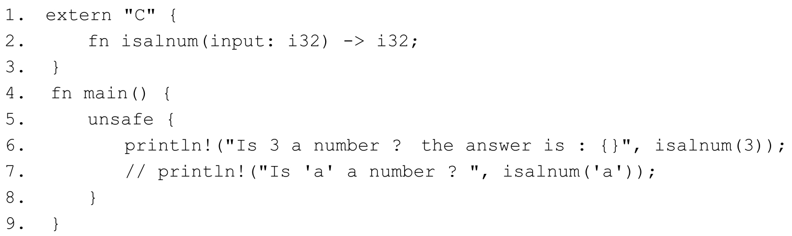{.u53463}
:::

代码清单13-51中，第1行在extern ＂C＂块内部定义了isalnum函数签名。然后在main函数中就可以直接调用操作系统C标准库内置的isalnum函数。这里也可以直接使用extern块，而省略掉ABI字符串＂C＂。因为默认的extern块就是按C-ABI处理的。

注意，被注释的代码第7行给isalnum函数传入了字符＇a＇，但是编译会报错。这是因为在extern块内的函数签名要求参数必须是数字类型。可以看出，Rust的类型系统在这里相当有用。

**在Rust中调用C++函数**

在Rust中也可以调用C++函数，前提是C++也需要使用C-ABI。

现在使用cargo来创建一个新的bin项目rustcallcpp，如代码清单13-52所示。

**代码清单13-52：创建新项目rustcallcapp**

::: center
{.u53462}
:::

接下来修改项目rustcallcapp中的Cargo.toml文件，如代码清单13-53所示。

**代码清单13-53：修改Cargo.toml文件**

::: center
{.u53461}
:::

代码清单13-53中，添加了build.rs文件配置，以及build依赖库**cc** ^[\[4\]](#text00019.html#n3BF8021943CE467AB824B88A3D9E3C39){#text00019.html#n3BF8021943CE467AB824B88A3D9E3C39s}^ 。Rust中想要调用C/C++，首先需要链接C/C++生成的静态/动态库。可以通过手动调用gcc或g++来编译C/C++文件，使用**ar** 工具来生成静态库。但是，现在是制作Rust的crate，这些工作需要自动化。所以这里要利用**build.rs** 文件，在Rust构建之前，将依赖的C/C++库打包好。构建依赖的库**cc** 是对gcc等各大平台C/C++编译器的抽象。

接下来在rustcallcpp项目中创建一个文件夹cpp_src，用于放置C++代码。在目录中创建sorting.cpp和sorting.h文件。整个项目的目录结构如代码清单13-54所示。

**代码清单13-54：当前rustcallcpp文件目录结构**

::: center
{.u53460}
:::

该目录中的sorting.cpp文件正是Rust中调用的C++函数定义所在。如代码清单13-55所示。

**代码清单13-55：sorting.cpp代码**

::: center
{.u53459}
:::

在sorting.cpp中定义了一个排序函数interop_sort，接收两个参数，分别是数组和数组长度。然后调用C++内置的sort函数对传入的数组进行排序。

在sorting.h头文件中，为其声明C接口。如代码清单13-56所示。

**代码清单13-56：sorting.h头文件代码**

::: center
{.u53458}
:::

在sorting.h头文件中，使用extern ＂C＂将interop_sort函数导出为C接口，以便在Rust中调用。

接下来，在src/main.rs中调用该函数，如代码清单13-57所示。

**代码清单13-57：src/main.rs代码**

::: center
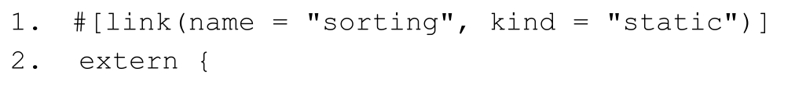{.u53457}
:::

::: center
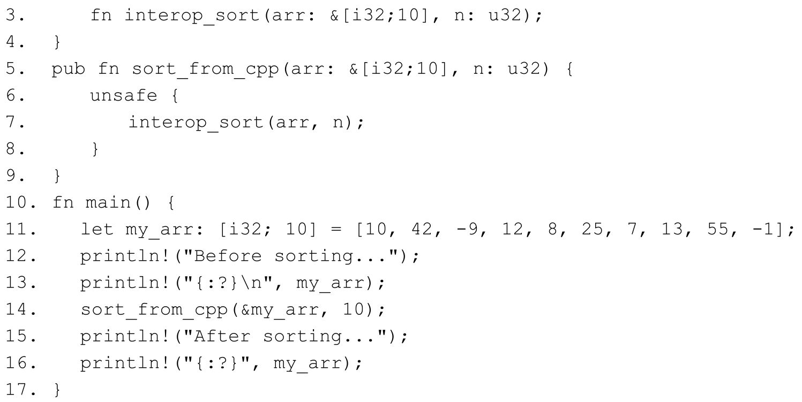{.u53456}
:::

代码清单13-57中，代码第1行使用**＃\[link（name=＂sorting＂，kind=＂static＂）\]** 属性，表示和Rust链接的是名为**libsorting** 的静态库 ^[\[5\]](#text00019.html#nDCF8021B4886453BB4979019CA0D4C65){#text00019.html#nDCF8021B4886453BB4979019CA0D4C65s}^ 。该属性也可以省略，Rust会使用默认生成的名字。这个属性主要用于在需要的时候指定链接库的名字。

代码第2～4行在extern块中声明了interop_sort的函数签名。注意输入的参数类型，第一个是数组的引用，因为C++中的数组实际上就是指针，这里要对应起来。

在代码第5～9行定义了Rust的函数sort_from_cpp，是对C++中interop_sort函数的安全抽象。接下来在main函数中进行调用。

到目前为止，C++和Rust两头的代码都写完了，是不是可以直接编译运行了呢？其实还差一个步骤，那就是编写自动链接的代码。还记得build.rs文件吗？如代码清单13-58所示。

**代码清单13-58：build.rs**

::: center
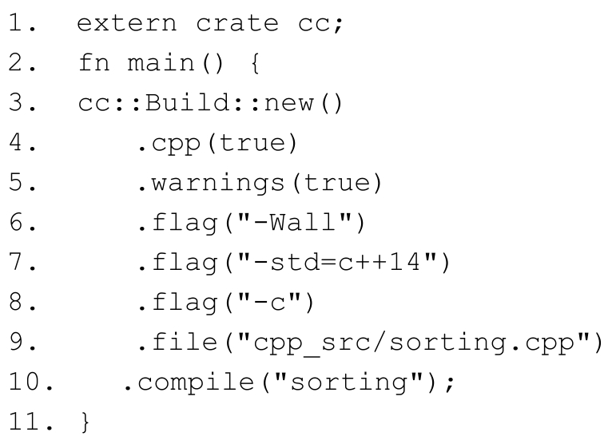{.u53455}
:::

在代码清单13-58中，使用了cc库。通过指定的参数，cc库会帮助开发者把cpp_src中的C++文件进行编译并自动生成静态库。整个过程相当于以下操作：

· **g++-Wall-std=c++14-c sorting.cpp** ，使用g++编译sorting.cpp文件。

· **ar rc libsorting.a sorting.o** ，通过ar制作一份静态库libsorting.a。

现在就可以执行cargo run命令来运行代码了。输出结果如代码清单13-59所示。

**代码清单13-59：输出结果**

::: center
{.u53454}
:::

看得出来，C++中的排序函数输出了正确的结果。值得注意的是，如果main.rs中传入的数组长度小于10位，或者大于10位，均会引起Rust编译器报错。这也从侧面反映了从C++迁移到Rust有利于提升程序的健壮性。同时，如果查看target/debug/build文件夹，会看到生成的cpp_src/sorting.o和libsorting.a文件。

如果不使用cc库，也可以在build.rs文件中使用Command：：new（＂g++＂）等命令来自动化编译C++文件的过程，但是不如cc库方便。当然，cc库也可以用于编写C绑定。

**在C中调用Rust函数**

在C中调用Rust函数中的思路同样也是通过静态库或动态库进行链接的。现在通过cargo命令创建callrust项目，如代码清单13-60所示。

**代码清单13-60：创建callrust项目**

::: center
{.u53453}
:::

为了生成链接库，必须使用\--lib参数创建库类型的项目。然后进入callrust项目中，创建需要的文件，目录结构如代码清单13-61所示。

**代码清单13-61：callrust目录结构**

::: center
{.u53452}
:::

注意代码清单13-61中，新增的文件夹和文件包括以下四个：

· c_src，用于存放C文件。

· c_src/main.c，用于编写C代码。

· src/callrust.h，用于编写Rust暴露的外部C接口。

· makefile，自动化编译链接过程。

接下来，修改Cargo.toml文件，如代码清单13-62所示。

**代码清单13-62：修改Cargo.toml文件**

::: center
{.u53451}
:::

在Cargo.toml文件中增加**libc** 依赖。libc库是对各大操作系统平台C标准库的Rust抽象，其中对C标准库接口函数做好了Rust绑定，可以直接拿来使用。

同时也设置了 Rust 链接库的名称为 **callrust** 。指定了生成两种类型的链接库：**staticlib** 和**cdylib** ，分别代表兼容C-ABI的静态库和动态库。

然后修改src/lib.rs文件，如代码清单13-63所示。

**代码清单13-63：修改src/lib.rs文件**

::: center
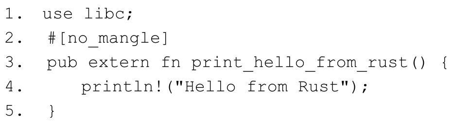{.u53450}
:::

代码清单13-63中引入了libc库。同时定义了print_hello_from_rust函数，**pub extern** 关键字声明表明该函数为外部调用接口，extern默认是兼容C-ABI。

其中，**＃\[no_mangle\]** 属性是告诉Rust关闭函数名称修改功能。如果不加这个属性，Rust编译器就会修改函数名，这是现代编译器为了解决唯一名称解析引起的各种问题所引入的技术。如果函数名被修改了，那么在C代码中就无法按原名称调用，开发者也没办法知道修改后的函数名。

接下来打开src/callrust.h头文件，在其中声明print_hello_from_rust函数。该头文件将用于C和Rust库的链接。如代码清单13-64所示。

**代码清单13-64：修改src/callrust.h文件**

::: center
{.u53449}
:::

现在可以编写C代码了，打开c_src/main.c文件编写以下代码，如代码清单13-65所示。

**代码清单13-65：修改c_src/main.c文件**

::: center
{.u53448}
:::

代码清单13-65中引入了**callrust.h** 头文件，以及其他标准头文件。然后在main函数直接调用print_hello_from_rust函数。

接下来还需要编写**makefile** 文件，这样就可以把编译链接过程通过**make** 命令进行自动化处理，如代码清单13-66所示。

**代码清单13-66：修改makefile文件**

::: center
{.u53447}
:::

::: center
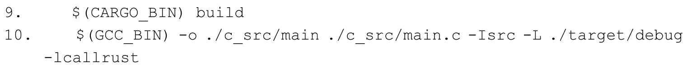{.u53446}
:::

代码清单13-66中定义了三个make命令：**run** 、**clean** 和**build** 。其中build命令包含两步操作：

· 通过**cargo build** 命令构建Rust程序，生成已指定的C-ABI兼容的静态库和动态库。

· 使用**gcc** 命令编译C代码，链接Rust库，生成目标二进制可执行文件main。

注意makefile文件中的缩进，必须是**制表符** （tab），而非空格。

接下来就可以在项目根目录下执行make命令或make run命令，编译并运行程序，输出结果如代码清单13-67所示。

**代码清单13-67：输出结果**

::: center
{.u53445}
:::

代码清单13-67输出结果中包含了make执行的命令，以及最终print_hello_from_rust函数的执行结果。

**类型匹配与内存布局**

前面的演示代码中，没有展示Rust和C相互传递参数的情况。实际上，在开发Rust和C相互调用的程序时，根本无法避免相互传递参数。所以，在需要传递参数的情况下，必须保证参数的类型和内存布局可以满足调用约定。

继续使用callrust项目作为演示。在Rust中实现一个检测字符串长度的函数，然后在C中调用。在callrust项目的src/lib.rs中添加代码，如代码清单13-68所示。

**代码清单13-68：在src/lib.rs中新增代码**

::: center
{.u53444}
:::

代码清单13-68中，定义了外部接口函数hm_chars，该函数主要用于统计传入的字符串长度。这时就应该考虑这样一个问题：该函数会在C代码中被调用，但是C语言中的字符串是一个以"**\\n** "结尾的字符数组，实际上由一个**char\*str** 指针来定义。那么在Rust中定义该函数时，**参数的类型应该是什么** ？如图13-4所示。

::: center
{.u53443}

图13-4：C中调用Rust函数参数类型示意
:::

C中调用hm_chars函数时传入char\*str指针，所以Rust中定义该函数时，也应该注意参数的类型与C语言的char\*str指针相匹配。

Rust的Char类型和C的Char类型完全不同，在Rust中Char类型是一个Unicode标量值，但是C中Char只是一个普通的整数。Rust标准库在std：：os：：raw模块中提供了与C语言中各种类型相匹配的映射类型。比如提供了 c_char 类型，其实就是 i8 类型的别名。所以，hm_chars函数的参数可以标注为std：：os_raw模块中的c_char类型。

但是在callrust项目中已经依赖了libc库，该库也提供了对C中基本数据类型的映射。在本示例中选择使用libc库中的c_char类型。通常情况下，使用std：：os：：raw模块或libc都没有什么区别，除非使用了libc特有的功能。但是需要知道一个事实，libc库不依赖std，所以请根据实际的使用情况进行选择。

在Rust函数内部进行处理的时候，需要转换成Rust中的字符串类型。为了方便转换，Rust标准库std：：ffi模块中提供了**CStr** 类型，该类型会产生一个以"\\n"字符数组的引用。所以在代码第5～8行先通过CStr：：from函数将c_char字符类型转成Rust可用的CStr类型。当然，要判断传入的字符串是否为空。

在代码第9行，将CStr类型的字符串转换成&strl类型，然后在第10行中通过调用chars方法转换成Rust的字符数组，通过调用数组的count方法进行字符串长度统计，最终返回统计数字。这里需要再次注意，**该返回值在** C**代码中有可能被使用** ，所以返回类型应该是兼容C-ABI的类型。这里使用了libc库中定义的**c_uint** 类型。

接下来，在**callrust.h** 头文件中添加hm_chars函数的声明，就可以保证其在链接之后在C代码中被调用。如代码清单13-69所示。

**代码清单13-69：在src/callrust.h头文件中新增代码**

::: center
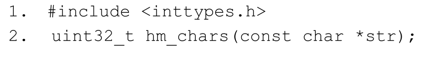{.u53442}
:::

代码清单13-69中新增了两行声明，其中hm_chars返回值在C语言中是**uint32_t** 类型，该类型在**inttypes.h** 头文件中被定义，所以这里需要引入该头文件。

然后回到c_str/main.c文件中，在main函数中调用hm_chars函数。如代码清单13-70所示。

**代码清单13-70：在c_str/main.c文件的main函数中新增代码**

::: center
{.u53441}
:::

::: center
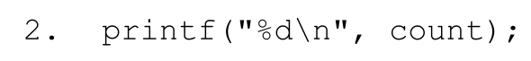{.u53440}
:::

代码清单13-70展示的是在main函数中新增的两行代码。第1行调用hm_chars函数，传入字符串字面量，返回值赋值给count变量。第2行输出count的值。

在命令行中，callrust项目根目录下执行make命令，代码正常编译运行。输出结果如代码清单13-71所示。

**代码清单13-71：执行make后的输出结果**

::: center
{.u53439}
:::

看得出来，输出结果是正确的。

接下来，在src/lib.rs中实现另外一个函数，如代码清单13-72所示。

**代码清单13-72：在src/lib.rs中实现新的函数**

::: center
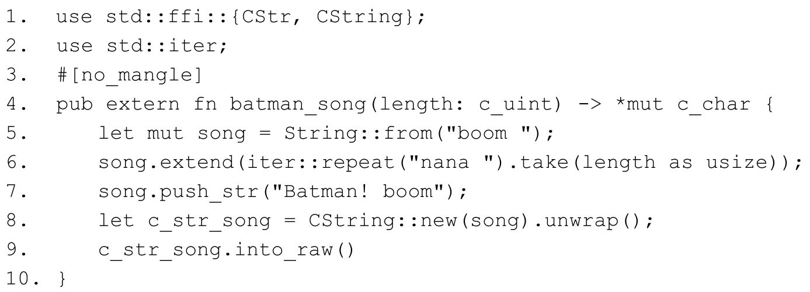{.u53438}
:::

代码清单13-72中定义了新的函数batman_song，它的目的是输出一个字符串"boom nana nana nana Batman！boom"，可以称其为"**蝙蝠侠之歌** "。该字符串中的"nana"可以重复，重复次数是由batman_song函数的参数来指定。

该函数在C代码中被调用，传入C语言的一个数字类型，然后创建Rust的一个String字符串，只有String字符串才可以动态扩展。接着通过std：：ffi模块中的**CString** 类型将String转换成C-ABI兼容的字符串。这里和**CStr** 的区别是，因为String是拥有所有权的数据类型，所以需要使用CString。如代码第8行和第9行所示，先由String创建CString类型的数据，然后通过into_raw方法转换为C兼容字符串。

因为CString是拥有所有权的结构，现在将其返回为**\*mut c_char** 类型，供C代码使用。所有权的概念只存在于Rust，在C代码中使用完毕，该字符串的内存不会被自动清理。所以还必须再实现一个释放字符串内存的方法供C代码调用，如代码清单13-73所示。

**代码清单13-73：在src/lib.rs中增加新的函数free_song**

::: center
{.u53437}
:::

代码清单 13-73 中，新增了函数 free_song，主要是将**\*mut c_char** 指针类型通过CString：：from函数转换为CString类型的字符串，然后就可以交给Rust编译器按所有权机制自动释放内存。

接下来需要在src/callrust.h头文件中声明上面两个函数，以便在C中可以被调用，如代码清单13-74所示。

**代码清单13-74：在src/callrust.h头文件中增加新的函数声明**

::: center
{.u53436}
:::

然后打开c_src/main.c文件，在main函数中调用，如代码清单13-75所示。

**代码清单13-75：在c_src/main.c文件的main函数中调用**

::: center
{.u53435}
:::

代码清单13-75中，调用完batman_song函数之后，还需要调用free_song函数释放生成的字符串对应的内存，否则会引起内存泄漏。总之，需要记住，由谁分配内存，就由谁来释放。本例中是由Rust分配了堆内存（String字符串），所以依然需要由Rust来释放内存。

在终端执行make命令之后，代码正常编译运行，输出结果如代码清单13-76所示。

**代码清单13-76：输出结果**

::: center
{.u53434}
:::

输出结果如预期显示，说明调用正常。

Rust和C之间除了可以相互传递字符串，还可以传递更复杂的类型，比如切片、元组和结构体等。

现在编写一个函数，用于计算整数数组中奇数元素之和，如代码清单13-77所示。

**代码清单13-77：在src/lib.rs新增函数**

::: center
{.u53433}
:::

C函数中的数组就是指针加数组长度，对应于Rust中就是切片类型。所以代码清单13-77中新增的函数sum_of_even的参数就是**\*const c_uint** 类型的指针，以及c_uint类型的长度。

在代码第5～8行，使用slice：：from_raw_parts函数将C语言对应的数组转为切片类型。然后在代码第9～11行中，通过迭代过滤掉偶数，并累计剩余奇数之和。最终将求和结果返回。

修改src/callrust.h头文件，声明该函数，如代码清单13-78所示。

**代码清单13-78：在src/callrust.h头文件中新增函数声明**

::: center
{.u53432}
:::

在代码清单13-78中，需要引入**stdio.h** 头文件，因为函数签名中用到了**size_t** 类型。

接下来在c_src/main.c文件的main函数中添加调用代码，如代码清单13-79所示。

**代码清单13-79：在c_src/main.c文件的main函数中调用**

::: center
{.u53431}
:::

执行make命令，可以看到正确的输出结果。

在C和Rust之间**如何传递元组** 呢？C语言中虽然没有元组类型，但是有结构体，**可以用结构体来模拟元组** 。C和Rust之间可以传递结构体，只需要满足调用约定即可，如代码清单13-80所示。

**代码清单13-80：在src/lib.rs中新增处理元组相关代码**

::: center
{.u53430}
:::

代码清单13-80中，第1～5行定义了结构体Tuple，它是用来模拟元组的。该结构体使用**＃\[repr（C）\]** 属性，表明它的内存布局兼容C-ABI。**在** C**和** Rust**之间传递元组，本质就是传递该结构体** 。

代码第6～9行为Tuple结构体实现From＜（u32，u32）＞，这是为了方便将Rust的（u32，u32）元组类型转换为Tuple类型。同理，代码第10～15行为（u32，u32）实现了From＜Tuple＞，是为了将Tuple类型逆转为元组类型。

代码第16～19行用于计算元组中的元素，并返回新的元组。

代码第 20～23 行则定义了外部函数接口 flip_things_around，其函数内部调用了compute_tuple函数。注意，调用tup.into方法是将Tuple转换为元组类型，传到computer_tuple函数中进行计算，并在之后返回新的元组。然后再次调用into方法，则可以由元组转换为Tuple类型并返回。

接下来修改src/callrust.h头文件，如代码清单13-81所示。

**代码清单13-81：在src/callrust.h头文件中新增函数声明**

::: center
{.u53429}
:::

代码清单13-81中定义了结构体**tuple_t** ，和Rust中定义的Tuple结构体相对应。之后，再修改src/main.c文件中的main函数，如代码清单13-82所示。

**代码清单13-82：在c_src/main.c中新增函数调用**

::: center
{.u53428}
:::

代码清单13-82中，初始化了tuple_t类型的结构体实例，然后传入flip_things_around函数中，并分别打印结构体字段x和y的值。在执行make命令之后，输出结果按预期显示为"（21，9）"。

**如果 C 和 Rust 之间需要传递更加复杂的类型，可以使用 C 语言中的不透明数据类型（Opaque）和Rust中的Box＜T＞相对应。** 如代码清单13-83所示。

**代码清单13-83：在src/lib.rs中新增代码**

::: center
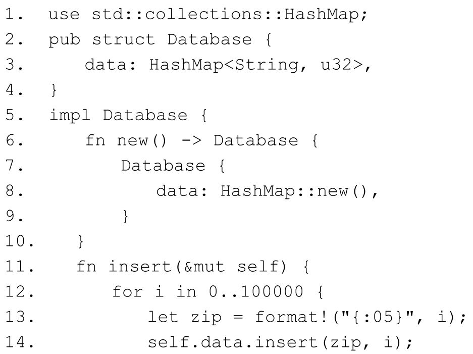{.u53427}
:::

::: center
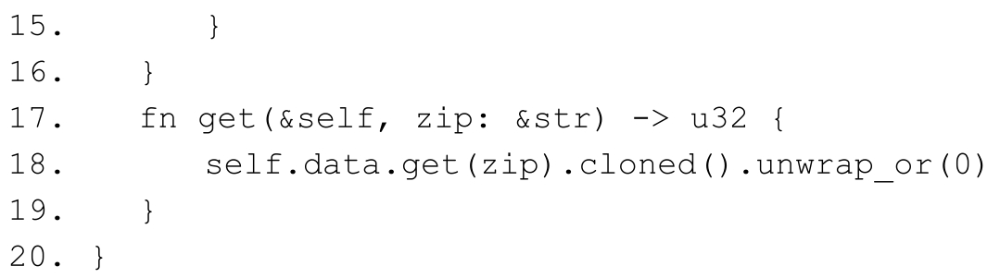{.u53426}
:::

代码清单13-83中定义了结构体Database，包含HashMap＜String，u32＞类型的字段，用于模拟一个数据库，并且定义了 new 函数，以及 insert 和 get 方法。其中 new 函数用于创建Database实例。另外的insert方法则默认往结构体实例中插入1000000个形如"**＂100086＂=＞100086** "的键值对，其中字符串类型为键，数字类型为值。get方法则是根据传入的字符串，取出对应的值。

注意，这里的 Database 结构体是需要传递给 C 代码使用的，但是为什么这里没有使用**＃\[repr（C）\]** 来保证其内存布局是C-ABI兼容呢？**因为在** C**代码中，要使用抽象的结构体类型与其相对应，并非一个具体的结构体类型** 。这种抽象的结构体类型叫作**不透明数据类型** 。

如何在C代码中使用该结构体及其方法呢？如代码清单13-84所示。

**代码清单13-84：继续在src/lib.rs中新增代码**

::: center
{.u53425}
:::

::: center
{.u53424}
:::

在代码清单 13-84 中定义了三个外部函数接口：database_new、database_insert 和database_query，分别对应Database结构体的new、insert和get。

代码第2～4行定义了database_new函数，返回值类型是\*mut Database，代表Database结构体实例的原生可变指针。因为在C代码中使用的不透明数据类型实际上是一个指针。函数体内先使用Database：：new函数创建了结构体实例，然后使用Box：：new函数将其装箱，最后使用Box：：into_raw生成\*mut Database类型原生指针返回。**将** Database**的结构体实例放到堆内存，是为了拥有稳定的内存地址，因此传递给** C**使用是安全的** 。

代码第5～27行分别定义了database_insert和database_query方法，主要是对结构体实例中的 HashMap＜String，u32＞进行插入和查询操作。这里需要注意的是，第一个参数\*mut Database指针需要转换为引用才可以调用Database的实例方法。

代码第28～32行定义了database_free函数，**因为堆内存是在** Rust**中分配的，所以必须由** Rust**来释放** 。在C代码中调用该函数就可以释放Box分配的堆内存。注意，释放内存的操作也很简单，只需要将原生指针转换为Box类型即可，因为Box拥有所有权，在该函数调用完毕会自动释放掉相应的堆内存。

接下来，就可以在lib/callrust.h头文件中声明这些函数接口，如代码清单13-85所示。

**代码清单13-85：在src/callrust.h头文件中声明新的函数接口**

::: center
{.u53423}
:::

代码清单13-85中第2行定义了抽象结构体database_S和database_t类型，也就是前面提到的不透明数据类型，它实际上是一个指针。

然后在c_src/main.c文件的main函数中调用这些函数，如代码清单13-86所示。

**代码清单13-86：在c_src/main.c文件的main函数中新增调用代码**

::: center
{.u53422}
:::

执行make命令，代码正常编译运行，并输出预期结果为"666"。

**第三方工具介绍**

在前面编写Rust中调用C函数的代码时，重复最多的工作就是在extern块中声明外部函数接口。而在写 C 中调用 Rust 的代码时，重复最多的工作就是在头文件中增加外部函数接口。

于是社区中出现了一些工具可以帮助开发者自动完成以下这些工作：

· **rust-bindgen** ^[\[6\]](#text00019.html#n7752D3C1B66045F88BB4AC3605E431B1){#text00019.html#n7752D3C1B66045F88BB4AC3605E431B1s}^ ，该库可以根据头文件自动生成Rust FFI的C绑定，也支持部分C++功能。

· **cbindgen** ^[\[7\]](#text00019.html#n84A70226EAE443D29CA99DCE16EAF7E1){#text00019.html#n84A70226EAE443D29CA99DCE16EAF7E1s}^ ，该库可以根据Rust代码自动生成头文件。

· **ctest** ^[\[8\]](#text00019.html#nE4C10226F5C243B59D6C86FDB485E8F9){#text00019.html#nE4C10226F5C243B59D6C86FDB485E8F9s}^ ，该库可以为Rust FFI的C绑定自动生成测试文件。

使用这三个库，就可以提升FFI的开发效率。更多的使用细节可以参考它们的文档。

另外，针对移动平台，也有两个库推荐：

· **cargo-lipo** ^[\[9\]](#text00019.html#n39D8022645704EA884767AFDF0F53243){#text00019.html#n39D8022645704EA884767AFDF0F53243s}^ ，提供cargo lipo命令，自动生成用于iOS的通用库。

· **jni** ^[\[10\]](#text00019.html#n67930226F4DF4E2F9C58021B428AB547){#text00019.html#n67930226F4DF4E2F9C58021B428AB547s}^ ，提供Rust的JNI绑定，用于和Android平台交互。

Rust用于iOS/Android平台时，涉及交叉编译，要注意设置相关的target格式。

### 13.3.3 使用Rust提升动态语言性能 {#text00019.html#Aa8d50226-6a7f-430d-b5a5-ecb2e89cd91b .title-left}

使用Rust可以为Ruby、Python、Node.js等动态语言编写本地扩展。在Rust诞生之前，普遍使用C和C++为动态语言编写扩展，但是存在内存安全风险，甚至引起内存泄漏。使用Rust为动态语言编写扩展，既可以保证性能，还能提升内存安全。

动态语言都有自己的虚拟机，所以调用Rust代码不可能像C/C++那样可以直接链接Rust的链接库获取相关的函数调用信息。所以，动态语言提供的 FFI 基本都是基于 **libffi** 库来实现动态调用C函数的能力，兼容C-ABI的链接库都可以直接被动态调用。该libffi库是动态语言虚拟机和二进制的一道桥梁。

**为Ruby写扩展**

在Ruby语言中，可以使用ffi gem来编写扩展。继续使用callrust项目的示例，在根目录下创建Ruby目录，并在其中创建database.rb文件，然后编写扩展代码。如代码清单13-87所示。

**代码清单13-87：在Ruby/database.rb中添加Ruby代码**

::: center
{.u53421}
:::

::: center
{.u53420}
:::

代码清单13-87是在Ruby中调用Rust中定义的Database及其方法。为此，引入了ffi gem。

代码第2～11行定义了继承于FFI：：AutoPointer的Database类**。在** FFI：：AutoPointer**中定义了一个** self.release**方法，该方法会被** Ruby**的** GC**自动调用，以达到回收内存的目的。本着在** Rust**里分配内存就必须由** Rust**来释放的原则，** Database**类通过重载** self.release**方法，指定了一个** Rust**的回调方法来清理内存** 。同时也定义了insert和query实例方法，包装了Rust的函数调用。

代码第 12～20 行定义了Binding模块。该模块通过extend方法混入（Mixin）FFI：：Library模块，就可以使用底层libffi的功能，动态调用Rust的链接库中的方法。其中代码第14行通过**ffi_lib** 方法指定了Rust共享库 ^[\[11\]](#text00019.html#nB9BF022753C04A96A2C1CB323F7D373D){#text00019.html#nB9BF022753C04A96A2C1CB323F7D373Ds}^ （此处用动态链接库）的位置。然后通过**attach_function** 方法将Rust共享库中的函数绑定为Ruby中的方法。

代码第22～26行在Ruby中调用这些方法。执行该Ruby文件，程序可正确运行。

在Rust社区也提供了一些工具帮助开发者更方便地编写Ruby扩展，罗列如下：

· **Ruru** 和**Rutie** ，均是Rust实现的Ruby虚拟机接口绑定，把Ruby中的各种内置数据类型、类定义等都进行了封装，方便编写Ruby扩展。

· **Helix** ，同样是对Ruby虚拟机接口的绑定，但是其实现了一个Ruby运行时，使用起来可以和Ruby进行无缝对接，更加方便。Helix还实现了helix-rails gem用于支持Rails框架，使用它可以方便地在Rails中引入Helix写的Ruby扩展。

**这三个工具虽然方便，但都存在一个问题** ：就是在Rust中创建的Ruby对象，如果放到堆内存中再传递给Ruby中调用，Ruby GC将无视该对象的存在，这样势必会引起**内存泄漏** 。解决办法也比较简单，比如可以将这些 Ruby 对象用 Rust 中的固定长度数组包裹起来传给Ruby，因为固定长度数组是在栈上。

**为Python写扩展**

同样，也可以为Python写Rust扩展。以Python 3为例，只需要使用内置的CTypes模块就可以。基于底层libffi的能力，CTypes模块可以直接加载兼容C-ABI的共享库。

在callrust项目根目录中创建Python文件夹和database.py文件，并编写代码，如代码清单13-88所示。

**代码清单13-88：在Python/database.py中添加Python代码**

::: center
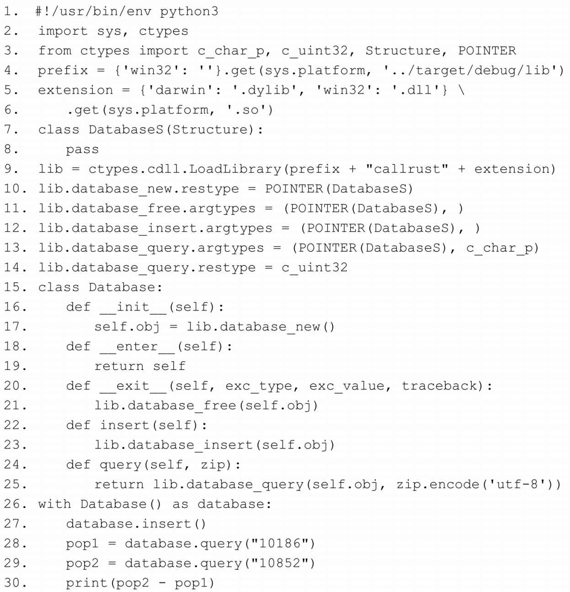{.u53419}
:::

代码清单13-87中第2、3行导入了**CTypes** 模块及需要的类型。

代码第4～6行定义了Rust共享库所在位置。注意，这里做了跨平台处理。

代码第7～8行定义了空类DatabaseS，是为了在后面使用。

代码第9～14行，使用CTypes模块中的方法动态加载共享库，并且为共享库中外部接口函数的参数和返回值指定了类型。**利用** CTypes**模块的** POINTER**函数将空类** DatabaseS**转换为指针类型，如果不用** DatabaseS**作为参数，则** POINTER**会产生空指针** 。

代码第15～25行定义了Database类。除默认的构造方法、insert和query外，还使用了\_\_enter\_\_和\_\_exit\_\_方法，这是为了让Database类的对象兼容**with** 方法。with方法可以定义一个**上下文管理器** 。当出现with语句的时候，对象的\_\_enter\_\_方法会被触发，其返回值会被赋值给as声明的变量。代码执行完之后，\_\_exit\_\_方法被触发进行最后的清理工作。

所以，在代码第26～30行中使用with语句调用共享库中绑定的函数。整个代码将正确执行，并且在执行完毕后，会触发\_\_exit\_\_方法调用Rust中的database_free方法来释放内存。

与Ruby类似，**社区中也提供了一些第三方的工具** 支持更方便地为Python开发Rust扩展：

· **rust-cpython** ，是Python解释器的Rust绑定。支持Python 2.7和Python 3.3+。

· **PyO3** ，同样是 Python 解释器的 Rust 绑定，由 rust-cpython 分支演化而成，但比rust-cpython更好用。

两者有本质的不同，PyO3性能更快，并且更方便扩展。

**为Node.js写扩展**

众所周知，Node.js非常擅长处理I/O，但是如果业务中包含计算密集的操作会严重影响到性能，比如网络服务中URL解析，随着流量上升，CPU的占用就会越来越多。通常，Node.js支持使用C++编写原生模块来解决这个问题。但是既然现在有了更现代化的工具Rust，就可以用它花费比以前更少的成本来编写更有效、更安全的原生模块。

Node.js在V8.0之前，一般使用**NAN** （Native Abstractions for Node.js）通用API来开发原生模块。但是在 V8.0 版本中加入了全新的 **N-API** 接口，相比 NAN，N-API 提供了兼容C-ABI的接口，消除了Node.js的版本差异，也消除了JavaScript引擎的差异。

在callrust项目中创建Node.js/database.js文件并编写代码，如代码清单13-89所示。

**代码清单13-89：在Node.js/database.js中添加代码**

::: center
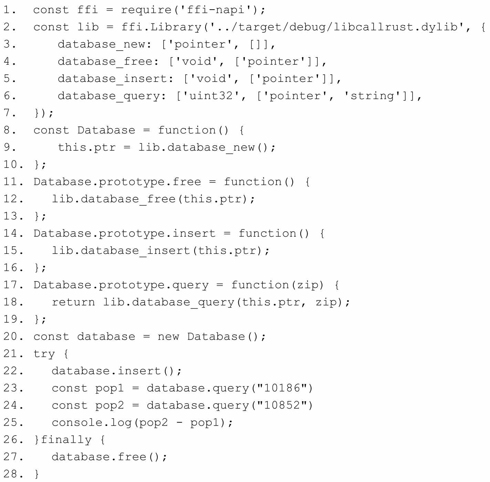{.u53418}
:::

代码清单13-89中，第1～7行使用了**ffi-napi** 包加载Rust共享库，为其中的函数参数和返回值指定了Node.js中相应的类型。其中，ffi-napi包支持N-API接口 ^[\[12\]](#text00019.html#nA9B5022AE8124F19B17A8DF6FEBA1D73){#text00019.html#nA9B5022AE8124F19B17A8DF6FEBA1D73s}^ 。

代码第8～10行定义了一个JavaScript类Database，并将指针lib.database_new返回的指针指定给了ptr属性。

代码第11～19行通过prototype属性分别为Database添加free、insert和query方法，对应于Rust共享库中的database_free、database_insert和database_query。

代码第20～28行创建Database实例，并且在try块中调用实例方法。在finally块中调用database.free方法是为了保证Rust中定义的对象可以得到正确释放。然后执行此代码，得到预期结果。

同样，社区中也提供第三方工具来提升Node.js写Rust扩展的效率，其中最常用的就是**Neon** 。

Neon由Rust实现的安全快速的本地Node.js模块绑定。它提供了JavaScript类型的包装，以及工程化的命令行工具，可以极大地提升开发者的效率。但要注意，目前 Neon 底层还是基于NAN接口，还未适配N-API。

**为其他语言写扩展**

除Ruby、Python和Node.js外，另外一种构建于Erlang虚拟机BEAM的动态语言Elixir也支持使用Rust进行扩展。

Elixir写原生扩展的能力是继承自Erlang语言的**NIF** （Native Implemented Function））功能。NIF允许Erlang动态加载C语言的动态库到进程空间中（和libffi功能差不多），可以拥有和C接近的性能。但是NIF编写的扩展安全性不高，如果产生了段错误（使用C/C++比较容易产生段错误），就会导致NIF崩溃，进而导致整个Erlang虚拟机崩溃。Erlang的虚拟机如果崩溃了，那么 Erlang 所带来的可靠、容错等特性都将烟消云散。所以，使用 Rust 可以有效地解决编写NIF扩展安全性不高的问题。

Rust 社区提供了一个方便开发者编写安全 NIF 扩展的工具 **Rustler** ，使用它不会导致BEAM崩溃，并且同时适用于Erlang和Elixir。当然，优先适用于Elixir。更多的内容可以参考Rustler的文档和示例。

通过FFI，Rust还可以和其他很多语言打交道，包括Java、Swfit、Lua、Haskell和OCmal等。社区中也存在如下方便的开发工具：

· **jni-rs** ，Rust的JNI绑定，用于和Java通信。

· **rlua** ，Rust的Lua绑定，用于和Lua通信。

· **rmal** ，Rust的OCmal绑定，用于和OCmal通信。

相信随着时间的推移，这些工具会越来越丰富。

## 13.4 Rust与WebAssembly {#text00019.html#A96e0022a-976a-406f-b5d8-b7a9c9135ffc .title-left}

**WebAssembly** 是近两年兴起的一种**新的字节码格式** ，它的缩写是"WASM"。这种格式背后的意义在于，在某种程度上，它将改变整个Web的生态。所以，Rust 2018的重点发展目标之一就是建立针对便于开发WebAssembly的生态工具。

WebAssembly项目是Google、MicroSoft、Mozilla等多家公司联合发起的一个面向Web的通用二进制和文本格式项目。它的出现并不是为了让开发者手写代码，而是作为C/C++/Rust语言的一种编译目标，这样就产生了一个巨大的意义：**在客户端提供了一种接近本地运行速度的多种语言编写代码的方式** 。在某种意义上，WebAssembly 相当于一种**中间语言** （IR）。其实WebAssembly的名字也由此而来，就像汇编（Assembly）语言那样是所有语言转换成机器码的通用底层语言，WebAssembly就是面向Web的汇编。

目前WebAssembly的重要应用领域是在浏览器中配合JavaScript API提升前端应用的性能，虽然 JavaScript 目前有很多优化的手段，效果也不错，但是它的计算性能还是很慢，对于一些计算密集型场景，就可以使用WebAssembly来替代。比如游戏的渲染引擎、物理引擎，图像音频/视频的处理和编辑、加密算法等。

WebAssembly比JavaScript更快的原因主要体现在以下几方面：

· WebAssembly体积更小，下载和解析更快。WebAssembly的二进制格式就是为了更适合解析而设计，其解析速度要比JavaScript快一个数量级。

· WebAssembly不受JavaScript的约束，可以利用更多的CPU特性。比如64位整数、内存读写偏移量、非内存对齐读写和多种CPU指令等。

· 生成WebAssembly编译器工具链的优化和改进。比如在Rust中，可以使用wasm-gc工具来优化生成的wasm文件的大小。

· WebAssembly不需要垃圾回收。内存操作是手动控制，但也没必要担心内存泄漏的问题，因为WebAssembly使用的整个内存空间是由JavaScript分配的，它实际上是一个JavaScript对象，最终会由JavaScript的GC去管理。

同时，WebAssembly还在不断地朝着执行效率更高的方向发展。目前WebAssembly还不支持DOM操作，但是已经有了解决方案，就是依赖**Reference Types** ^[\[13\]](#text00019.html#nA21B85E39BE14A67AEE449E80CB3EAF0){#text00019.html#nA21B85E39BE14A67AEE449E80CB3EAF0s}^ 和**Host Bindings** ^[\[14\]](#text00019.html#n1A62022BE88A48FE8EA07FECB9AC10CA){#text00019.html#n1A62022BE88A48FE8EA07FECB9AC10CAs}^ 技术在WebAssembly中直接操作 JavaScript+DOM 对象和调用其方法。

**WebAssembly** 名称里虽然包含了 Web，但其发展至今，**已经不仅仅局限于 Web** 。为了将WebAssembly嵌入到不同的环境中，其**规范** 是被拆分到了独立的文档中，并区分了层级：

· **核心层** 。定义WebAssembly模块及其指令集的语义。

· **API层** 。定义应用程序接口，目前指定了两个API：**JavaScript API** 和**Web API** 。

由此可看出，WebAssembly**是独立于** Web**的规范，** Web**只是其应用的特定环境** 。事实上，WebAssembly还应用于除Web之外的其他领域：桌面图形化程序、区块链智能合约和编写操作系统微内核。

当然，也不仅仅局限于上面所列领域，还有更多的想象空间。随着该技术的发展，将会应用到更多领域。

### 13.4.1 WebAssembly要点介绍 {#text00019.html#A81e6022b-78a6-47b0-88d2-466ca5057d5f .title-left}

为了理解WebAssembly的工作机制，需要了解如下关键概念：

· **模块** 。模块是WebAssembly的基本编译单位，一个.wasm文件就是一个模块。其中定义了各种函数，可以被JavaScript加载调用。

· **线性内存** 。用于和JavaScript通信，是一个可变大小的ArrayBuffer，由JavaScript分配。WebAssembly提供了对其进行操作的指令。

· **表格** 。用于存放函数引用，支持动态调用函数。

· **实例** 。一个模块的实例包括其在运行时使用的所有状态，比如内存、表格和一系列的值。同一个模块的多个实例可以共享相同的内存和表格。

· **栈式机器** 。WebAssembly指令的运行是基于栈式机器定义的，每种类型的指令都是在栈上进行出栈和入栈操作。

**文本格式wast**

WebAssembly模块提供两种格式：**二进制** 和**文本格式** 。其中文本格式是基于**S表达式** ，供人类读写，所以也称为**wast** 。文本格式和二进制格式也可以通过工具相互转换。

接下来通过手写几个示例来了解WebAssembly。本书使用webassembly.studio ^[\[15\]](#text00019.html#n0AAC022C03724B8B85C3140073C46FDD){#text00019.html#n0AAC022C03724B8B85C3140073C46FDDs}^ 在线WebAssembly IDE来编写示例代码。打开webassembly.studio网站，从弹出的窗口中选择Empty Wat Project，单击下方的create按钮，就可以创建一个WebAssembly项目模板。项目目录如代码清单13-90所示。

**代码清单13-90：Empty Wat Project 模板目录**

::: center
{.u53417}
:::

代码清单13-90中build.ts文件专门用于构建wasm文件，并输出到out目录下。在src目录中，main.wat是一个文本格式的WebAssembly文件，在构建之后，它生成一个main.wasm文件。然后在main.js中将生成的wasm文件导入，最终在main.html中使用。

接下来看看main.wat文件中默认的代码，如代码清单13-91所示。

**代码清单13-91：main.wat代码展示**

::: center
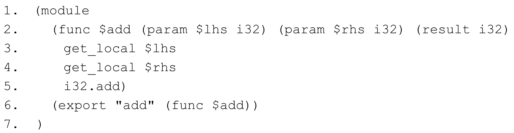{.u53416}
:::

看得出来，代码清单13-91中模块被表示为一个多行的S表达式。其中每一对括号都代表一个**节点** 。括号内第一个元素是代表节点的类型，后面由空格分隔的是属性或子节点列表。所以，在代码清单13-91中一共可以分成三大节点：**module** 、**func** 和**export** 。其中，module显然表示模块，func代表的是函数，export是指将模块内定义的函数导出。

在代码第2行func节点中，定义了函数签名**\$add** ，以美元符**\$** 开头可以为参数、函数名或局部变量等起一个名字。除了那些导入/导出的指令，模块中几乎所有的代码都被划分到函数中。由func定义的函数签名中包含的头两个param节点是表示函数的参数，均为i32类型。最后一个result节点代表函数的返回值，同为i32类型。

代码第3～5行则定义了函数体。其中get_local指令是用于获取参数的值，最后调用i32.add操作，表示将两个i32类型的参数进行相加，该操作是WebAssembly内置的运算符 ^[\[16\]](#text00019.html#n1BFB022D113A4F02B496B96E332FE2D9){#text00019.html#n1BFB022D113A4F02B496B96E332FE2D9s}^ 。wasm文件执行是以**栈式机器** 定义的，**get_local** 指令会将它读到的参数值压到栈上，然后i32.add从栈上取出两个i32类型的值进行求和，将计算结果压到栈顶。

代码第6行中，export节点是一个导出声明。在export指令后面定义的"add"是指定给JavaScript用的函数名。

这就是文本格式的WebAssembly代码，然后看看main.js中如何导入。如代码清单13-92所示。

**代码清单13-92：main.js代码展示**

::: center
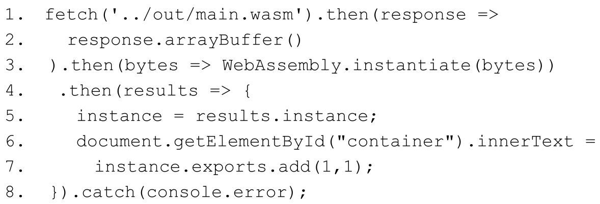{.u53415}
:::

代码清单13-92中使用了**fetch** 方法来异步加载编译好的out/main.wasm二进制文件，然后将其转换成**ArrayBuffer** 。当然也可以使用XHR来加载wasm文件。

接着使用**WebAssembly.instantiate** 方法编译并实例化模块，在此过程中会导出一个add方法给JavaScript使用。最后通过**instance.exports.add** 调用该方法。

最终，通过单击webassembly.studio在线IDE提供的build&run按钮，编译并运行该示例，会输出结果"**2** "。

**使用WebAssembly内存和JaüaScript交互**

因为WebAssembly当前只支持**i32、i64、f32和f64** 这四种可用的基本类型，所以，为了处理字符串以及其他复杂的类型，WebAssembly提供了内存。WebAssembly**的内存实际上是一种可增长的线性字节数组，由** JavaScript**通过** WebAssembly.Memory**接口来创建** 。

接下来重新编写main.wat，让其可以输出字符串"Hi WASM"，如代码清单13-93所示。

**代码清单13-93：重写main.wat以便打印字符串**

::: center
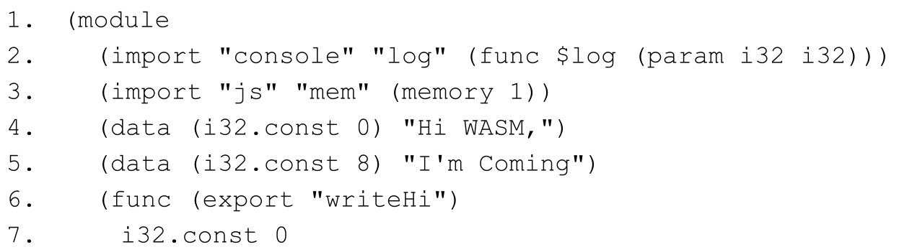{.u53414}
:::

::: center
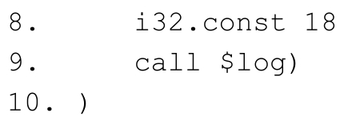{.u53413}
:::

代码清单13-93定义的模块中，一共包含三种主要的节点：**import** 、**data** 和**func** 。

代码第2行和第3行的**import** 节点是导入JavaScript的方法或对象供WebAssembly使用。其中第2行导入console.log方法，为其起名为**\$log** 。代码第3行导入由JavaScript创建的内存，并且指定了内存至少为**1页** （64KB）。导入的函数签名会被WebAssembly进行静态检查。

代码第4行使用**data** 指令把数据写入到内存中。其中"（i32 const 0）"用于指定在线性内存中放置数据的**偏移量** ，这里的数字0**代表起始位置** 。代码第5行通过data指令把另一个字符串存入内存中，但是其偏移量为8，这是因为第一个字符串"Hi WASM，"的长度为8，而起始地址是0，只有偏移量设置为8或者是大于8的数字，才不会覆盖第一个字符串。

代码第6～9行导出writeHi函数给JavaScript来调用。其中call指令调用了由JavaScript导入的\$log函数。

接下来修改main.js，如代码清单13-94所示。

**代码清单13-94：重写main.js**

::: center
{.u53412}
:::

代码清单13-94中第1行使用**WebAssembly.Memory** 方法为wasm分配指定的1页内存。

代码第2～6行实现了consoleLogString函数，通过传入内存偏移地址offset和字符串长度length，调用**Uint8Array** 和**TextDecoder** 方法**对** wasm**内存中的字符串进行解码** ，**因为** wasm**中的字符串只是原始的字节，只有通过解码才能在** JavaScript**中使用。**

代码第7～14行定义了importObject，该JavaScript对象是用于导入到wasm中使用的log方法和内存。与wat文本格式代码中的两个import节点相对应。

代码第15～19行，通过**WebAssembly.instantiateStreaming** 方法直接从底层进行流式源码编译和实例化模块，这是加载wasm最有效、最优化的方法。

现在单击webassembly.studio在线IDE提供的build&run按钮，代码编译并正常运行，输出结果为预期的"**Hi WASM，I＇m Coming** " ^[\[17\]](#text00019.html#n5693022FA6434187929C0C7AC40258AE){#text00019.html#n5693022FA6434187929C0C7AC40258AEs}^ 。

**表格与动态链接**

**表格** 和内存类似，只不过表格是必须通过索引才能获取的可变大小的数组。在日常开发中，经常需要动态调用一些函数。而这些函数不能直接存储在内存中，因为内存会把存储的原始内容作为字节暴露出去。如果函数存储在内存中，wasm 就可以任意查看和修改原始函数地址，**这是极度不安全的行为** 。所以，**在表格中存储函数引用，然后返回表格的索引** ，通常为i32类型。通过**call_indirect** 指令可以调用索引值，从而达到调用函数的目的。

多个wasm可以实现动态链接，模块实例可以共享相同的内存和表格。通过内存和表格，就可以实现JavaScript和wasm的基本互操作。接下来使用webassembly.studio在线IDE重新创建一个空的 wat 项目。将默认的 src/main.wat 删除，重新创建 src/shared0.wat 和src/shared1.wat，然后修改build.ts代码，如代码清单13-95所示。

**代码清单13-95：修改build.ts中的代码**

::: center
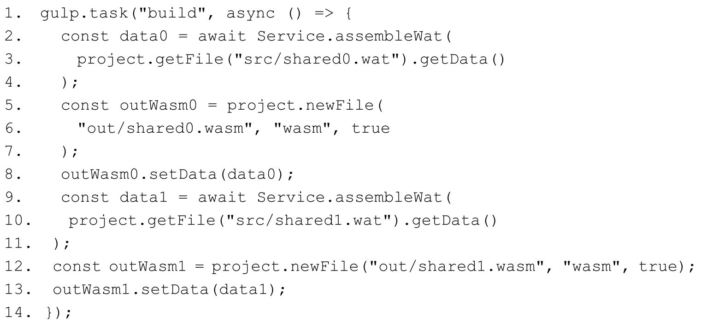{.u53411}
:::

将build.ts文件中的gulp.task任务代码修改为代码清单13-95所示。因为现在需要编译shared0.wat和shared1.wat这两个WebAssembly文件。

打开shared0.wat文件编写代码，如代码清单13-96所示。

**代码清单13-96：为shared0.wat编写代码**

::: center
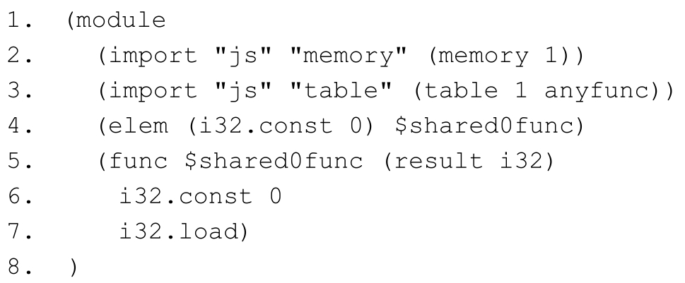{.u53410}
:::

代码清单13-96中，第2行和第3行导入了由JavaScript定义的内存和表格。其中定义的表中数字1代表初始大小，表示该表中将存储1个函数引用，而**anyfunc** 代表"任意签名的函数"。

代码第4行，使用**elem** 指令表示将**\$shared0func** 函数存储到表格偏移量为0的位置上。该elem的用法和内存**data** 操作类似。

代码第 5～7 行定义了函数**\$shared0func** ，包含两个指令。首先创建一个常数 0，然后使用i32.load指令从内存中获取存储到常数0位置的值，获取回来的值会被放到栈顶，就是该函数的返回值。

然后继续为shared1.wat编写代码，如代码清单13-97所示。

**代码清单13-97：为shared1.wat编写代码**

::: center
{.u53409}
:::

代码清单13-97中同样导入了由JavaScript端创建的内存和表格对象。然后代码第4行通过 type 指令创建了一个函数类型\$void_to_i32，该类型用于在后续的表格函数引用调用时进行类型检查。

代码第5～10行定义了导出给JavaScript用的函数doIt。其中代码第6～8行的指令等价于"（i32.store （i32.const 0） （i32.const 42））"，就是将常量42存储到索引为0的内存中。

代码第9、10行等价于"（call_indirect （type\$void_to_i32） （i32.const 0））"，是从表格中取索引为0的函数引用，该函数引用正是shared0.wat中所存储的\$shared0func。

最后，编写src/main.js文件，在其中创建wasm需要的内存和表格，并加载由shared0.wat和shared1.wat生成的wasm二进制文件。如代码清单13-98所示。

**代码清单13-98：为main.js编写代码**

::: center
{.u53408}
:::

代码清单13-98中创建了importObj对象，通过WebAssembly.Memory和**WebAssembly.Table** 分别创建内存和表格。

然后通过 Promise.all 方法异步加载 shared0.wasm 和 shared1.wasm，最后调用实例模块shared1中导出的函数doIt。

现在单击webassembly.studio在线IDE提供的build&run按钮，代码编译并正常运行，输出结果为预期的"**42** " ^[\[18\]](#text00019.html#n746D023105B048EF9B1BCCAAF2C6D69F){#text00019.html#n746D023105B048EF9B1BCCAAF2C6D69Fs}^ 。

### 13.4.2 使用Rust开发WebAssembly {#text00019.html#Af1f20231-c430-479f-b410-8e1aeff0aded .title-left}

固然可以手写wat文本格式开发wasm模块，但是效率显然不会很高。WebAssembly设计之初也是为了作为一种编译目标而存在的，它可以作为很多编程语言的编译目标：

· **C/C++** ，可以通过**EmScripten** 工具来编译到wasm。EmScripten是一个LLVM后端工具，可以将LLVM中间码编译到asm.js。所以，C/C++的编译流程是通过任何一个LLVM前端工具（比如Clang）生成LLVM IR，然后通过EmScripten生成asm.js，最后通过一个WebAssembly编译工具链Binaryen将asm.js生成wasm二进制格式。其中asm.js是JavaScript的一个子集，可以说它是WebAssembly的雏形。在一些不支持wasm的浏览器中，也可以使用asm.js来代替。

· **Rust** ，支持wasm的两种编译目标。

➢**wasm32-unknown-unknown** ，使用的是LLVM WebAssembly Backend和lld链接器。

➢**wasm32-unknown-emscripten** ，会继续使用EmScripten，和C/C++类似。

以wasm32-unknown-unknown目标为例，来看看Rust如何开发wasm。首先，需要搭建wasm的开发环境。使用rustup命令即可，如代码清单13-99所示。

**代码清单13-99：rustup命令**

::: center
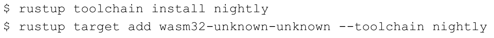{.u53407}
:::

清单 13-99 中使用 rustup 命令选择 Nightly 工具链，然后使用 rustup target add 添加wasm32-unknown-unknown目标，rustup会自动安装所需要的环境。

环境配置好以后，使用**cargo new\--lib** 命令创建新的项目hello_wasm。先在Cargo.toml文件中添加lib配置，如代码清单13-100所示。

**代码清单13-100：修改Cargo.toml**

::: center
{.u53406}
:::

然后修改src/lib.rs文件，如代码清单13-101所示。

**代码清单13-101：修改src/lib.rs**

::: center
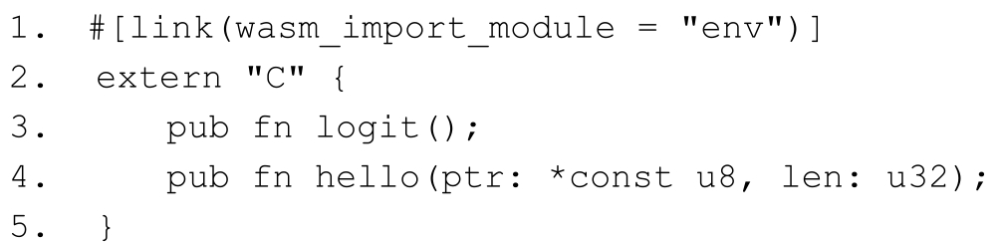{.u53405}
:::

::: center
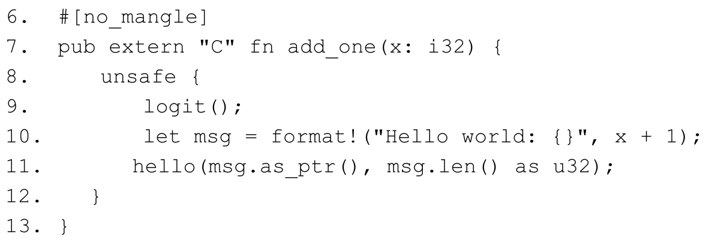{.u53404}
:::

在代码清单13-101中，第1～5行通过extern ＂C＂块导入JavaScript中定义的函数logit和hello函数。其中**logit** 函数是打算调用JavaScript中的console.log方法，而**hello** 函数是接收指针和长度作为参数，目的是打算将Rust中的字符串通过wasm传递到JavaScript中使用。注意，在第1行使用了**＃\[link（wasm_import_module=＂env＂）\]** 属性来指定extern块的wasm模块名字为env，也可以改为其他名字，但如果不使用该属性，默认就是env。

本质上，Rust还是通过导出兼容C-ABI的接口，经过**LLVM WebAssembly Backend** 的编译和**lld** 的链接，最终输出为wasm二进制。所以这里使用extern块。

在代码第6～12行，使用**＃\[no_mangle\]** 和**pub extern＂C＂** 定义函数**add_one** ，该函数会接收一个 i32 整数类型，在函数中会对其进行指定的计算，最后输出一行字符串。该函数中调用了logit和hello函数。在第9行定义了msg字符串变量，然后通过调用msg.as_ptr方法得到该字符串的原生指针传给hello函数。

接下来在hello_wasm项目根目录下创建hello.html和hello.js文件，并修改hello.html文件，如代码清单13-102所示。

**代码清单13-102：修改hello.html文件**

::: center
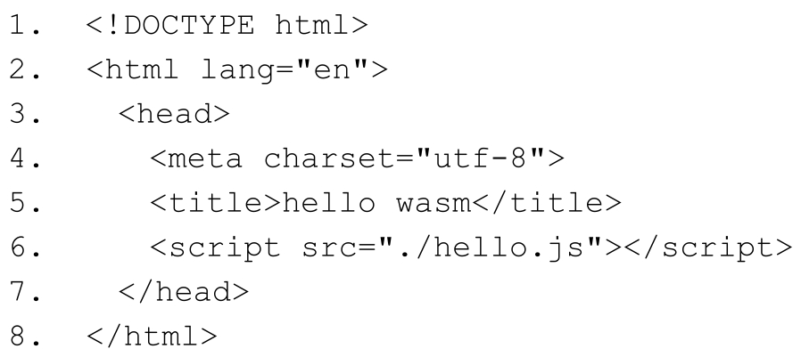{.u53403}
:::

代码清单13-102是一个简单的HTML文件。注意，代码第6行引入了hello.js文件。然后开始修改hello.js文件，如代码清单13-103所示。

**代码清单13-103：修改hello.js文件**

::: center
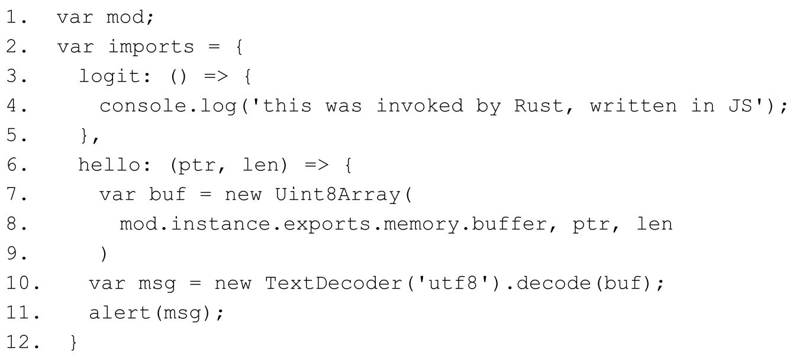{.u53402}
:::

::: center
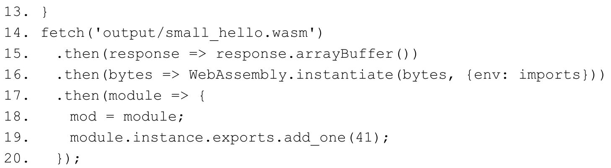{.u53401}
:::

代码清单13-103中第1行声明了mod变量，代表加载的wasm模块实例，供后面使用。在代码第2～13行定义了imports对象，包含了logit和hello的函数定义。

值得注意的是，hello函数的**ptr** 参数实际上只是一个数字，它**代表** WebAssembly.Memory**内存中数据的索引** 。在该函数内部，通过Uint8Array和TextDecoder方法将ptr对应的内存中的值转换为JavaScript字符串。注意，Uint8Array的第一个参数**mod.instance.exports.memory.buffer** 将得到ArrayBuffer对象以供操作。

最后，在第 14～20 行使用 fetch 方法加载 wasm 文件，并得到 arrayBuffer，通过WebAssembly.instantiate将imports对象传给指定的模块env，对wasm模块进行编译和实例化。最后调用模块实例化对象中的方法add_one。

接下来就可以将Rust代码编译为wasm，在**hello_wasm目录下创建output目录** ，以便存放生成的wasm文件。生成wasm需要三条命令，如代码清单13-104所示。

**代码清单13-104：生成wasm需要的三条命令**

::: center
{.u53400}
:::

代码清单13-104中第一条是cargo build指定了wasm32-unknown-unknown作为target，最终会在 taget/wasm32-unknown-unknown/debug 目录下生成 hello.wasm。然后将其复制到output 目录下。最后使用 **wasm-gc** 工具将 output/hello_wasm.wasm 的大小进行裁剪，得到output/small_hello.wasm文件。当然也可以使用make自动化处理这三条命令。

可以通过**cargo install wasm-gc** 安装该工具。在网页中加载的wasm越小越好。不过随着lld链接器的进一步完善，增加了**链接时优化** （LTO）功能就不需要使用wasm-gc了。

现在通过浏览器 ^[\[19\]](#text00019.html#n10E70233BCD948F4A90501133D66FC7F){#text00019.html#n10E70233BCD948F4A90501133D66FC7Fs}^ 打开hello_wasm/hello.html，会看到弹出窗口中显示"**Hello world：42** "，说明Rust代码编译的wasm已经可以正常使用。

### 13.4.3 打造WebAssembly开发生态 {#text00019.html#A79db0233-3c68-4343-9c4c-b460861309a8 .title-left}

即便是使用Rust编写代码再编译为wasm，开发效率还是比较低。WebAssembly标准只定义了四种类型：两种数字和两种浮点数。在大多数情况下，这四种类型完全不够用。因此，Rust官方打造了以wasm-bindgen为首的一系列工具，旨在提升Rust开发wasm的体验。这一系列工具重点包括：

· **wasm-bindgen** ，核心是促进Javascript和Rust之间使用wasm进行通信。它允许开发者直接使用Rust的结构体、Javascript的类、字符串等类型，而不仅仅是wasm支持的整数或浮点数。开发者只需要专注于他的业务即可。

· **wasm-pack** ，一站式构建、发布Rust编译的wasm到npm平台。不需要安装npm、node.js等JavaScript环境，wasm-pack会编译并优化生成JavaScript绑定，然后发布到npm中。

· **cargo-generate** ，直接生成wasm-bindgen和wasm-pack项目模板，方便开发。

从这三个工具可以一瞥Rust官方对Rust和WebAssembly的愿景：**希望可以更方便地使用** Rust**开发** wasm**，并且不需要改变现有开发流程** 。

wasm-bindgen 致力于为 JavaScript 生态和 Rust crate 生态系统建立共享的基础。wasm-bindgen 通过内置的 **js-sys** 包提供了对所有全局 JavaScript API 的绑定，只需要通过wasm_bindgen：：js即可调用。同样，通过内置的**web-sys** 包提供了对所有Web API的绑定，方便开发者调用。

可以使用 **cargo install cargo-generate** 命令安装 cargo-generate，安装好之后使用cargo-generate命令可以生成wasm-bindgen项目的模板，如代码清单13-105所示。

**代码清单13-105：cargo-generate命令生成模板项目**

::: center
{.u53399}
:::

此命令生成的模板项目会默认在 Cargo.toml 文件中配置好 wasm-bindgen。要使用wasm-bindgen，目前必须在Nightly版本之下先安装wasm-bindgem-cli工具，如代码清单13-106所示。

**代码清单13-106：安装wasm-bindgen-cli**

::: center
{.u53398}
:::

安装好wasm-bindgen-cli工具就可以使用wasm-bindgen命令来开发wasm项目了。在开发完成之后使用wasm-pack工具，如清单13-107所示。

**代码清单13-107：安装wasm-pack以及使用wasm-pack打包命令**

::: center
{.u53397}
:::

代码清单 13-107 中展示了两条命令。第一条是安装最新版的 wasm-pack，第二条是wasm-pack build命令，在项目的根目录下执行该命令，就会自动生成JavaScript相关文件，方便打包wasm到npm平台。

这就是Rust的一站式wasm开发体验。更多详细的内容可以参考wasm-bindgen的文档 ^[\[20\]](#text00019.html#n078202345A29428C8EDF7DC43D19A4D9){#text00019.html#n078202345A29428C8EDF7DC43D19A4D9s}^ 和项目中的示例代码。

除官方外，社区也在不断地对WebAssembly进行探索，比较有代表性的框架有：

· **stdweb** ，基于Rust和WebAssembly实现的Web客户端标准库。该库主要用于写Web客户端。未来可能会被web-sys替代。

· **cargo-web** ，方便编写Web客户端的Cargo子命令库。

· **yew** ，用于构建客户端Web应用的Rust框架，基于stdweb库，灵感来自Elm和React框架。

· **percy** ，实现了一个虚拟Dom，可以根据服务端的HTML字符串渲染到浏览器的Dom，完全同构，纯Rust和Wasm实现一个Web应用。

· **ruukh** ，一个实验性的Rust Web前端开发框架。受Vue.js和React.js的启发，基于Rust和WebAssembly。

看来，使用Rust进行全栈Web开发指日可待。

## 13.5 小结 {#text00019.html#A9b790235-2b18-48ed-9cff-91f5561dcdef .title-left}

只有彻底了解什么是不安全，才能对安全有更深的认知。学习Unsafe Rust的过程，才能对Safe Rust有更深的理解。从这个角度来说，本章算得上是全书的"点睛之笔"。

可以说，Safe Rust是构建于Unsafe Rust之上的。使用Unsafe Rust意味着编译器将不能百分百地保证类型安全和内存安全，将会有产生未定义行为的风险。Unsafe Rust是将保证安全的职责交给了开发者。本章通过深入探讨Unsafe Rust编程中可能产生未定义行为的情况，阐述了如何对Unsafe代码进行安全抽象。标准库里也封装了很多Unsafe代码。事实上，Rust迄今为止曝光的安全漏洞基本和Unsafe代码有关。

当然，目前Rust官方还在努力构建Unsafe Rust的内存模型。在未来，也许可以由Rust编译器检查出Unsafe代码中的未定义行为。

为了和其他语言"打交道"，Rust也提供了FFI，允许开发者非常方便地生成兼容C-ABI的库。本章通过Rust和C、CPP、Ruby、Python、Node.js语言交互的示例，阐述了Rust如何编写FFI，以及深入理解FFI。

随着WebAssembly技术的兴起，Rust在2018年也开始以"打造WebAssembly最佳开发工具链"为目标发展。本章介绍了WebAssembly基础，以及如何使用Rust开发WebAssembly。此外，Rust官方还推出了wasm-bindgen和wasm-pack工具链，为WebAssembly的开发提供了极大的便利。

除了WebAssembly，Rust还应用于众多领域，比如Web、网络基础、分布式系统、游戏和区块链等。因篇幅有限，本书不能一一为读者展现。读者在学会Rust之后，可以自行探索感兴趣的领域。

------------------------------------------------------------------------

[\[1\]](#text00019.html#n57550214298D40C2ACA95BEA620D5C48s){#text00019.html#n57550214298D40C2ACA95BEA620D5C48} 来自rust-sgx-sdk项目。

[\[2\]](#text00019.html#n22015619F696466084007036469E57DDs){#text00019.html#n22015619F696466084007036469E57DD} 官方所有支持平台的目标triple格式的列表：https：//forge.rust-lang.org/platform-support.html.

[\[3\]](#text00019.html#n159F0218655748F797FEB17986DF9A1Bs){#text00019.html#n159F0218655748F797FEB17986DF9A1B} https://doc.rust-lang.org/reference/items/external-blocks.html.

[\[4\]](#text00019.html#n3BF8021943CE467AB824B88A3D9E3C39s){#text00019.html#n3BF8021943CE467AB824B88A3D9E3C39} https://crates.io/crates/cc.

[\[5\]](#text00019.html#nDCF8021B4886453BB4979019CA0D4C65s){#text00019.html#nDCF8021B4886453BB4979019CA0D4C65} 本书代码的平台是Linux或macOS。

[\[6\]](#text00019.html#n7752D3C1B66045F88BB4AC3605E431B1s){#text00019.html#n7752D3C1B66045F88BB4AC3605E431B1} https://github.com/rust-lang-nursery/rust-bindgen.

[\[7\]](#text00019.html#n84A70226EAE443D29CA99DCE16EAF7E1s){#text00019.html#n84A70226EAE443D29CA99DCE16EAF7E1} https://github.com/eqrion/cbindgen.

[\[8\]](#text00019.html#nE4C10226F5C243B59D6C86FDB485E8F9s){#text00019.html#nE4C10226F5C243B59D6C86FDB485E8F9} https://github.com/alexcrichton/ctest.

[\[9\]](#text00019.html#n39D8022645704EA884767AFDF0F53243s){#text00019.html#n39D8022645704EA884767AFDF0F53243} https://github.com/TimNN/cargo-lipo.

[\[10\]](#text00019.html#n67930226F4DF4E2F9C58021B428AB547s){#text00019.html#n67930226F4DF4E2F9C58021B428AB547} https://github.com/prevoty/jni-rs.

[\[11\]](#text00019.html#nB9BF022753C04A96A2C1CB323F7D373Ds){#text00019.html#nB9BF022753C04A96A2C1CB323F7D373D} 笔者本地使用macOS，其动态共享库格式为.dylib。

[\[12\]](#text00019.html#nA9B5022AE8124F19B17A8DF6FEBA1D73s){#text00019.html#nA9B5022AE8124F19B17A8DF6FEBA1D73} 本例使用了Node.js V10.7.0，在该版本中N-API已经稳定。

[\[13\]](#text00019.html#nA21B85E39BE14A67AEE449E80CB3EAF0s){#text00019.html#nA21B85E39BE14A67AEE449E80CB3EAF0} https://github.com/WebAssembly/reference-types/blob/master/proposals/reference-types/Overview.md.

[\[14\]](#text00019.html#n1A62022BE88A48FE8EA07FECB9AC10CAs){#text00019.html#n1A62022BE88A48FE8EA07FECB9AC10CA} https://github.com/WebAssembly/host-bindings/blob/master/proposals/host-bindings/Overview.md.

[\[15\]](#text00019.html#n0AAC022C03724B8B85C3140073C46FDDs){#text00019.html#n0AAC022C03724B8B85C3140073C46FDD} https://webassembly.studio/.

[\[16\]](#text00019.html#n1BFB022D113A4F02B496B96E332FE2D9s){#text00019.html#n1BFB022D113A4F02B496B96E332FE2D9} 这里查阅更多语义操作https：//webassembly.org/docs/semantics/。

[\[17\]](#text00019.html#n5693022FA6434187929C0C7AC40258AEs){#text00019.html#n5693022FA6434187929C0C7AC40258AE} 完整代码地址为https：//webassembly.studio/？f=asqnsl6ru3o。

[\[18\]](#text00019.html#n746D023105B048EF9B1BCCAAF2C6D69Fs){#text00019.html#n746D023105B048EF9B1BCCAAF2C6D69F} 完整代码地址为 https：//webassembly.studio/？f=ottwfve7all。

[\[19\]](#text00019.html#n10E70233BCD948F4A90501133D66FC7Fs){#text00019.html#n10E70233BCD948F4A90501133D66FC7F} 推荐使用Firefox Nightly版本。

[\[20\]](#text00019.html#n078202345A29428C8EDF7DC43D19A4D9s){#text00019.html#n078202345A29428C8EDF7DC43D19A4D9} https://rustwasm.github.io/wasm-bindgen/introduction.html.

[]{#text00020.html}

# 附录A Rust开发环境指南 {#text00020.html#Aee41b2fb-b814-4547-b371-cc28a055c769 .title-left}

**A.1 无须安装环境也可以玩转Rust**

不需要在本地安装 Rust，也可以玩转 Rust。官方提供了在线的 PlayGroud 环境：https：//play.rust-lang.org/，如图A-1所示。你只需要有网络，打开浏览器，输入此网址，就可以方便地玩转Rust。

::: center
{.u53396}

图A-1：Playground示意
:::

Rust并没有提供方便的交互式运行（Read-eval-print-loop，REPL）环境，虽然也有第三方库，但并不好用。所以 Playgroud 暂时就是最佳的选择，也许以后会有更好用的 REPL 工具。

PlayGroud的功能很丰富，你可以方便地查看编译后的ASM、LLVM IR和MIR，如图A-2所示。

单击MIR按钮，就可以看到输出了MIR代码。PlayGroud还可以选择Rust的不同版本，比如Stable、Beat和Nightly，也可以选择编译模式，例如，Debug和Release。

::: center
{.u53395}

图A-2：可以选择要编译的目标格式
:::

**A.2 在本地安装Rust**

Rust工具集里包含了两个重要的组件：rustc和cargo。

· rustc，是Rust的编译器。

· cargo，是Rust的包管理器，包含构建工具和依赖管理。

Rust的工具集分为以下三类版本：

· Nightly，通常称之为"夜版"。它是Rust日常开发的主分支，其中包含了一些特性是不稳定的，有可能会改。

· Beta，测试版。该版本是每六周发布一次，其中只包含 Nightly 版本中被标记为稳定的特性。

· Stable，稳定版。该版本也是每六周发布一次，基于修复了已发现Bug的最新Beta版来发布。

开发人员一般是基于 Stable 版本来开发的，但是 Nightly 版本包含很多新的特性，一些第三方库有时也会用到Nightly版本。

**A.2.1 安装Rust**

Rust为我们提供了非常方便的安装工具：rustup，此工具和Ruby的rbenv、Python的pyenv，以及Node的nvm类似。

通过执行以下命令来安装rustup：

::: center
{.u53394}
:::

也可以通过参数指定默认使用Nightly版本：

::: center
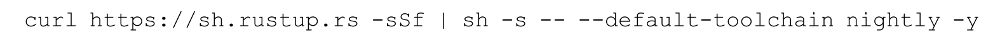{.u53393}
:::

此工具是全平台通用的，所以不管是Windows，还是Mac或Ubuntu，都适用。rustup会在Cargo目录下安装rustc、cargo、rustup，以及其他一些标准工具。类UNIX平台默认安装于\$HOME/.cargo/bin，Windows平台默认安装于%USERPROFILE%\\.cargo\\bin。

安装完毕，可以通过输入如下命令检测：

::: center
{.u53392}
:::

如果能看见终端显示出rust的最新版本号，则安装成功。

rustup可以帮助你管理本地的多个编译器版本，通过rustup default命令指定一个默认的rustc版本：

::: center
{.u53391}
:::

或者

::: center
{.u53390}
:::

通过指定日期，rustup 会自动下载相应的编译器版本来安装，如果报错，可以换一个日期，直到成功为止。你还可以通过执行**rustup-h** 来查看关于rustup的其他帮助。

**A.2.2 修改国内源**

国内有些地区访问Rustup的服务器不太顺畅，可以配置中国科学技术（USTC）的Rustup镜像。

（1）设置环境变量。

::: center
{.u53389}
:::

（2）设置cargo使用的国内镜像。

在CARGO_HOME目录下（默认是～/.cargo）建立一个名叫config的文件，内容如下：

::: center
{.u53388}
:::

**A.3 在Docker中使用Rust**

在你的**Dockerfile** 中添加如下配置：

::: center
{.u53387}
:::

如果你不想使用Nightly版本，可以将nightly换成stable。如果你想指定固定的nightly版本，则可以再添加如下一行命令：

::: center
{.u53386}
:::

**A.4 Rust IDE或编辑器**

IDE有很多选择，比如Visual Studio Code、IntelliJ IDEA等。

当然，你也可以用你最熟悉的编辑器：Emacs、Emacspace、Vim、Atom等。

**A.5 开发依赖工具介绍**

**A.5.1 Racer代码补全**

Racer是Rust代码补全库，很多编辑器都需要安装它（Interllij IDEA Rust已经默认包含了代码补全功能，但并非基于Racer，而是基于其自己实现的相关语言AST）：

::: center
{.u53385}
:::

代码补全需要源代码。以前需要下载源代码，手动放到某处并定期更新，现在有了 rustup很方便：

::: center
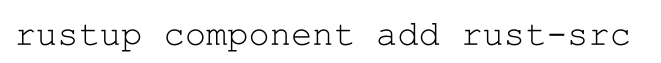{.u53384}
:::

之后需要配置环境变量为：

::: center
{.u53383}
:::

**A.5.2 RLS**

RLS 是Rust Language Server的简写，微软提出编程语言服务器的概念，将 IDE 的一些编程语言相关的部分由单独的服务器来实现，比如代码补全、跳转定义、查看文档等。这样，不同的IDE或编辑器只需要实现客户端接口即可。

RLS是**Rust** 官方提供的，不过现在只有Visual Studio Code支持，并且需要在系统中安装nightly版本的Rust（不必启用）。

RLS的安装请查阅项目README ^[\[1\]](#text00020.html#n35A60239483D470E9FA20EDB048B74C7){#text00020.html#n35A60239483D470E9FA20EDB048B74C7s}^ ，也是rustup轻松完成。但因为目前部分功能还依赖于racer来实现，需要配置racer的环境变量（不必安装）。

**A.5.3 cargo 插件**

作为 Rust 最常用的工具，cargo 提供对项目的依赖管理、build、文档生成、发布等功能支持，还可以通过插件的方式扩展。下面这几个就是必装的 cargo 插件。

**clippy**

可以分析你的源代码，检查代码中的Code Smell。可以通过rustup工具安装clippy。

::: center
{.u53382}
:::

**rustfmt**

可以帮助你统一代码风格，团队开发中推荐使用。使用cargo可以方便地安装：

::: center
{.u53381}
:::

**cargo fix**

从1.29版本开始，Cargo自带子命令 cargo fix，可以帮助开发者自动修复编译器中有警告的代码。

------------------------------------------------------------------------

[\[1\]](#text00020.html#n35A60239483D470E9FA20EDB048B74C7s){#text00020.html#n35A60239483D470E9FA20EDB048B74C7} https://github.com/rust-lang-nursery/rls#setup.

[]{#text00021.html}

# 附录B Rust如何调试代码 {#text00021.html#A8db3454a-e77e-47ad-be4c-24fb83b860ed .title-left}

本文通过调试Rust语言的一个安全漏洞来展示Rust如何调试代码。Rust语言在2018年9月曝光过一个安全漏洞，编号为CVE-2018-1000657 ^[\[1\]](#text00021.html#n749339EA8880417A9C8E118B0A8A0F0E){#text00021.html#n749339EA8880417A9C8E118B0A8A0F0Es}^ 。Rust官方的GitHub仓库也有issues ^[\[2\]](#text00021.html#nCFF2023B5A774801942030D9FF4C79DC){#text00021.html#nCFF2023B5A774801942030D9FF4C79DCs}^ 的相关讨论。

该漏洞的成因如下：

· 混用了VecDeque＜T＞容器中"逻辑"容量和"物理"容量引发的UB。

· Rust产生segfault的条件，正是因为产生了UB。

· Rust里产生UB，只可能是在Unsafe Rust之下。

· 这个UB是因为逻辑漏洞导致指针错乱，然后导致std：：ptr：：write指针覆盖了合法数据。但这个不是段错误的原因。

· Rust在函数执行完之后，自动执行析构函数，也就是VecDeque的析构函数，其中也用到了unsafe，因为指针是错乱的，那么析构也错乱了。析构错乱导致合法的内存数据被释放，发生Segfault。

接下来使用**LLDB** 对相关issues中的代码进行调试，以便验证漏洞分析是否正确。LLDB是macOS平台下的工具，命令和Linux平台的GDB基本相似。

**B.1 环境配置**

首先，使用 **rustup install 1.20.0** 命令安装好有漏洞的 Rust 版本。别忘记使用 rustup default 1.20.0选择该版本为Rust默认版本。

有关调试工具，笔者使用的是**VSCode** ，需要安装**CodeLLDB** 插件（Mac环境，Linux请用GDB相关）。环境配置好之后，使用**cargo new lldb_demo** 命令在 **src/main.rs** 文件中保存issues中相关的示例代码。

代码大致如下：

::: center
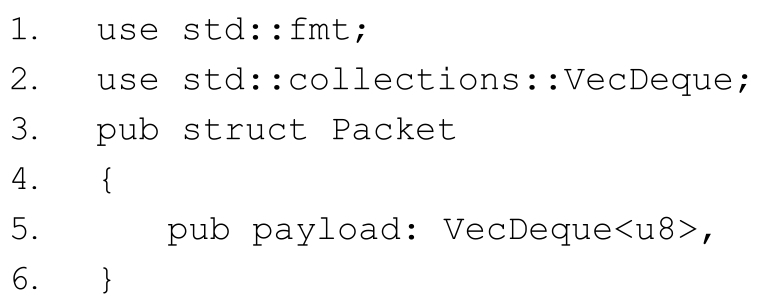{.u53380}
:::

::: center
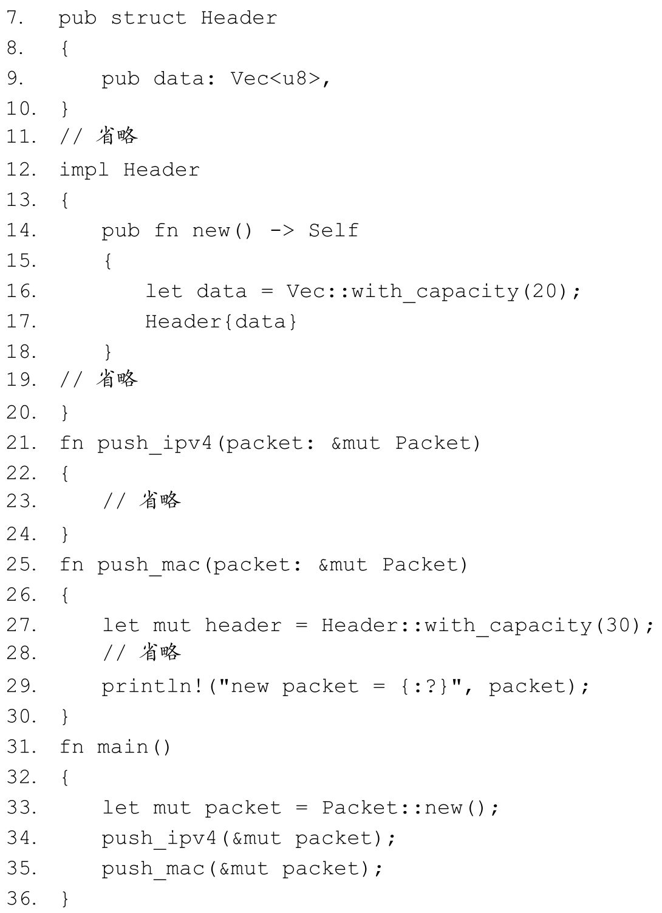{.u53379}
:::

完整代码可以在随书源码src/appendix/lldb.rs中找到。当然，你可以使用lldb命令进行调试，安装rust-lldb，但是不如使用VSCode方便。如图B-1所示，在VSCode Debug界面选择好配置，可以直接选择 Add Configuration\...来添加新的配置。

::: center
{.u53378}

图B-1：在VSCode Debug界面选择配置
:::

如图B-2所示，在选择Debug配置时，只需要选择 LLDB：Debug Cargo Output 就可以自动配置。然后，就可以开始进行调试了。

::: center
{.u53377}

图B-2：选择Debug配置
:::

**B.2 调试代码**

经过前文的分析，已经知道在哪里设置断点。如图B-3所示，在main函数中设置断点，因为问题出在 main 函数调用结束后的析构函数中。当然，只有这两个断点是不够的。但是可以开始进行调试了。

::: center
{.u53376}

图B-3：在main函数中设置好断点
:::

选择Debug界面，并单击该界面左上角的绿色三角形按钮，就可以开始调试代码。

如图B-4所示，刚开始缓慢单击Step Over（F10）按钮，也就是调试悬浮窗口的第二个按钮。

::: center
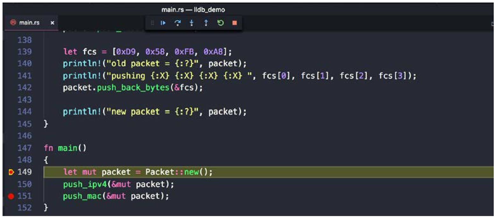{.u53375}

图B-4：单击Step Over（F10）按钮调试代码
:::

直到程序执行完main函数，有结果输出为止，如图B-5所示。

::: center
{.u53374}

图B-5：单击Step Over（F10）按钮直到有结果输出为止
:::

此时观察VSCode侧边栏左侧的CALL STACK栏目，如图B-6所示。

::: center
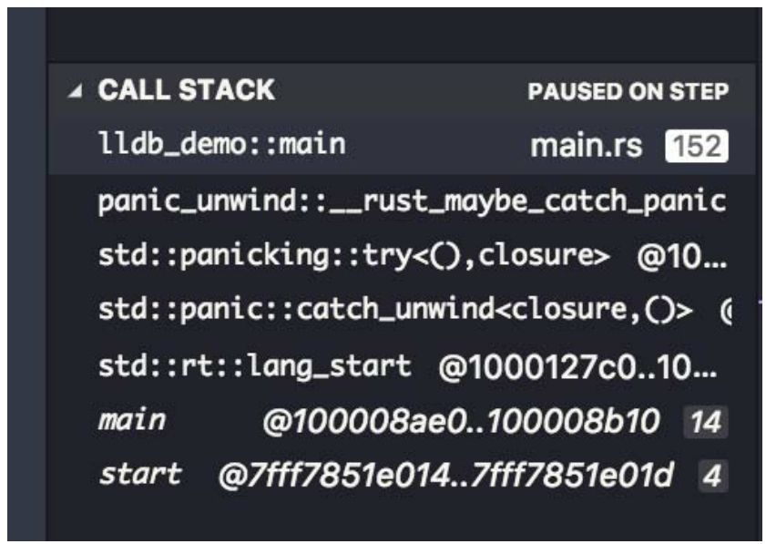{.u53373}

图B-6：CALL STACK栏展示了当前的函数调用栈
:::

这里首先需要介绍一个知识点：

· main函数执行的时候，Rust提供了一个很小的运行时std：：rt：：lang_start，会将main函数作为一个闭包传进去。

· lang_start支持Gloabl Heap和栈回溯支持。main函数中如果出现了panic，则会由它来负责恢复。

· Rust是基于LLVM的，实际上异常处理会分为两个阶段：搜索阶段和清理（cleanup）阶段。在搜索阶段，会检查 panic，并决定是否捕获它。在清理阶段，会决定到底运行哪个（如果有的话）清理代码对当前堆栈进行清理。它会调用析构函数和内存释放等。

前面分析漏洞的成因，可能是因为逻辑Bug导致析构函数释放了合法的内存，进而引起段错误。现在调试是想确认到底是不是这个原因。所以需要在 rt：：lang_start 调用的时候打上断点，这样才可以更精细地调试到底层的每个细节。所以需要单击 CALL STACK 栏中的std：：rt：：lang_start，这时调试界面会跳转到一个汇编界面，在默认选中的那行代码设置好断点，如图B-7所示。

::: center
{.u53372}

图B-7：在CALL STACK中选中std：：rt：：lang_start并设置断点
:::

此时再次单击Step Over应该会跳入汇编界面，如图B-8所示。

::: center
{.u53371}

图B-8：单击Step Over（F10）按钮跳到汇编界面
:::

此时使用Step Into（F11）按钮，单步递进调试代码。看到左侧CALLSTACK调用栈已经执行到了core：：ptr：：drop_in_place函数，这应该是VecDeque调用析构函数，正在释放内存。继续Step Into，会看到另外一个core：：ptr：：drop_in_place函数调用，如图B-9所示。

::: center
{.u53370}

图B-9：单击Step Into（F11）看到执行了另外一个drop_in_place函数
:::

现在回顾一下VecDeque函数的析构函数定义。

::: center
{.u53369}
:::

看来此时代码已经释放了 VecDeque 的内存。但是此时代码还在正常运行，并未报出段错误。所以，继续使用Step Into单步递进调试，发现VecDeque：：drop开始调用，如图B-10所示。

::: center
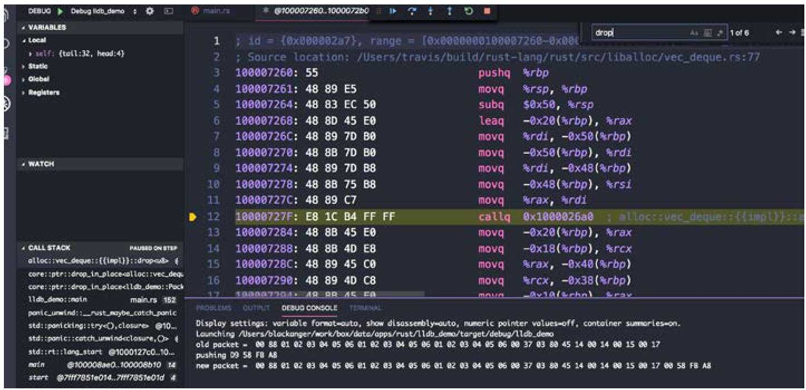{.u53368}

图B-10：单击Step Into（F11）看到执行了vec_deque：：drop函数
:::

继续使用Step Into，发现drop函数执行完毕，代码依旧正常运行，说明段错误不是在析构函数的时候发生的。继续调试。

因为当前是main函数在执行。在析构函数执行完毕，main函数退出之前，Rust会将内存再归还给操作系统。那么接下来运行的代码应该都是做这一部分工作。在调试过程中，还可以通过左上角的VARIABLES栏观察函数调用中变量值的变化，如图B-11所示。

::: center
{.u53367}

图B-11：在Step Into过程中，通过VARIABLES窗口观察变量值的变化
:::

这个调试过程需要比较长的时间，在这个过程中，还能看到 VecDeque 底层的 RawVec在析构函数调用之后，多次调用dealloc_buffer来释放内存，如图B-12所示。

::: center
{.u53366}

图B-12：在Step Into过程中，能观察到多次dealloc_buffer 被调用
:::

继续调试，会看到heap：：dealloc被调用，这意味着堆内存被释放，如图B-13所示。

::: center
{.u53365}

图B-13：在Step Into过程中，看到heap：：dealloc被调用
:::

还会看到jemalloc的相关函数被调用，如图B-14所示。

::: center
{.u53364}

图B-14：在Step Into过程中，看到jemalloc的dealloc方法被调用
:::

在Rust 1.20中，Rust的默认内存分配器是Jemalloc，这里调用dealloc，意味着Jemallloc把内存归还给操作系统。直到此时，代码依旧正常运行。

直到最后的清理阶段完成之后，代码崩溃了，让VSCode出现了死锁，如图B-15所示。

::: center
{.u53363}

图B-15：代码崩溃
:::

直到执行完 std：：syscommon：：at_exit_imp：：cleanup 之后，段错误才发生。std：：syscommon：：at_exit_imp是rt运行时的最后退出阶段，此时代码执行完毕，要将内存归还给操作系统。

同时，VSCode LLDB Debug工具抛出了EXC_BAD_ACCESS错误，并且此时代码调用停留在pthread_mutex_lock调用处。pthread_mutex_lock其实是调用libc库中的一个系统API，已经到操作系统底层了。抛出EXC_BAD_ACCESS错误一般是由"调用了已经释放的内存空间，或者说重复释放了某个地址空间"而引起的。

分析到这里，真相已经浮出了水面。

**B.3 总结**

（1）前文中分析段错误产生的原因经过了LLDB的实证。

（2）因为容量使用错误，导致指针混乱。

（3）在 main 函数析构函数调用之后，因为指针混乱，将不该释放的内存释放掉了。但是此时并未发生panic。

（4）在 main 函数退出运行时的时候，需要将内存归还给操作系统。此时调用了另外一个cleanup方法，在给操作系统归还内存的过程中，通过抛出的错误EXC_BAD_ACCESS分析，应该是调用了本来不该释放但已经释放的内存空间。

（5）错误发生在操作系统接口pthread_mutex_lock中，Rust根本无法捕捉，所以发生段错误。

------------------------------------------------------------------------

[\[1\]](#text00021.html#n749339EA8880417A9C8E118B0A8A0F0Es){#text00021.html#n749339EA8880417A9C8E118B0A8A0F0E} https://cve.mitre.org/cgi-bin/cvename.cgi?name=%20CVE-2018-1000657.

[\[2\]](#text00021.html#nCFF2023B5A774801942030D9FF4C79DCs){#text00021.html#nCFF2023B5A774801942030D9FF4C79DC} https://github.com/rust-lang/rust/issues/44800.
